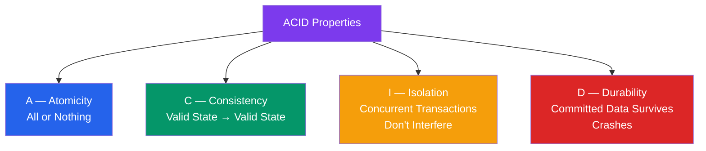
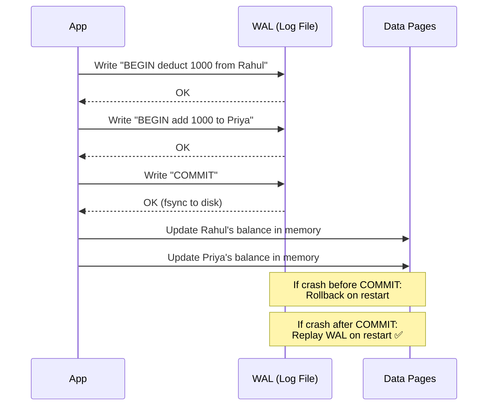
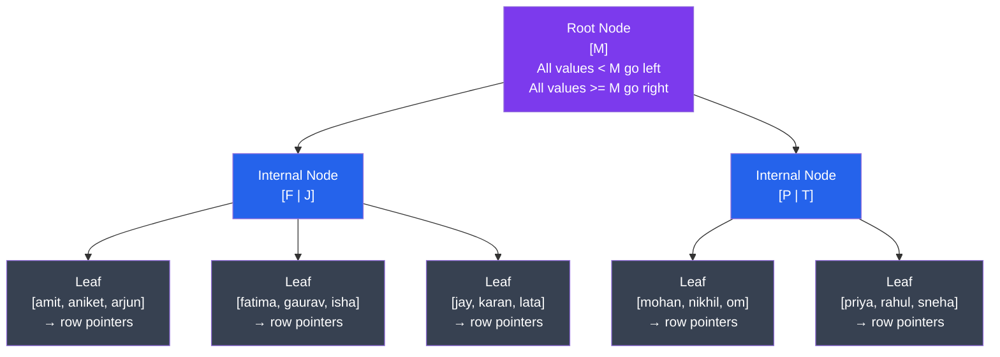
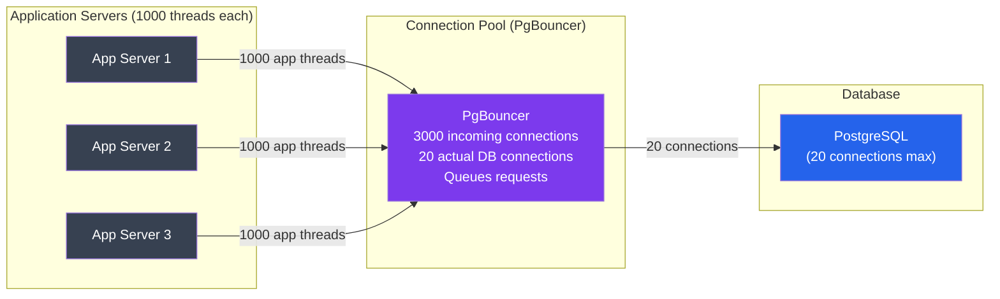
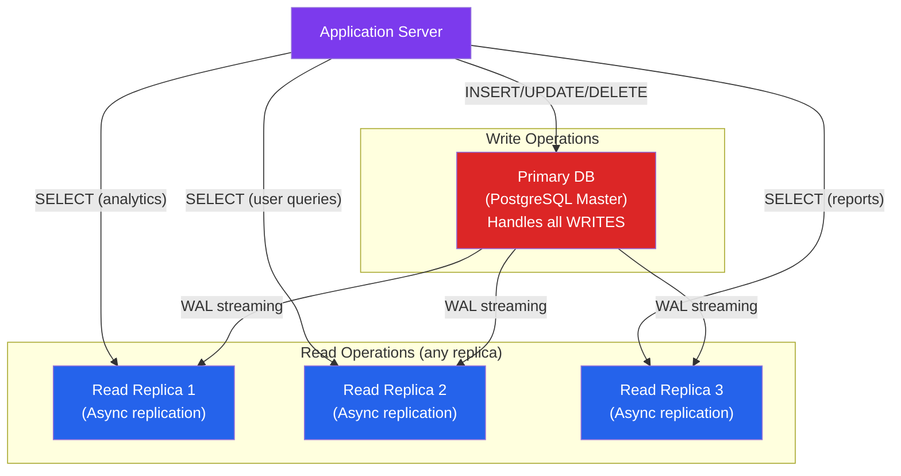
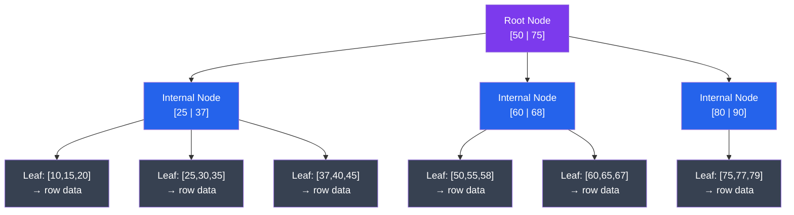
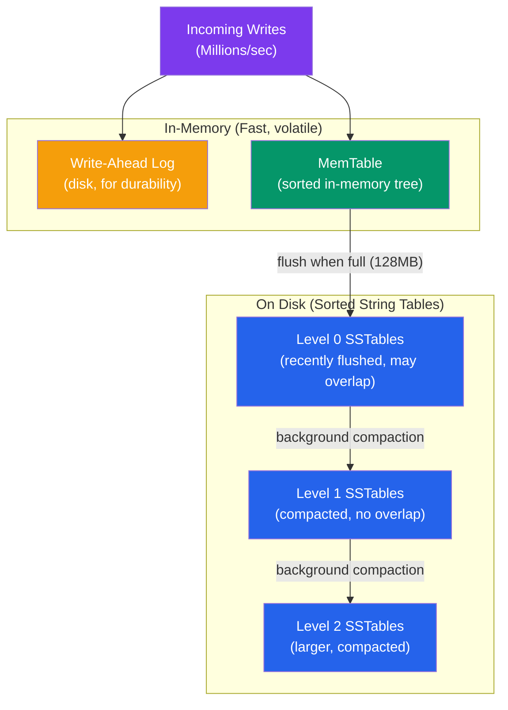
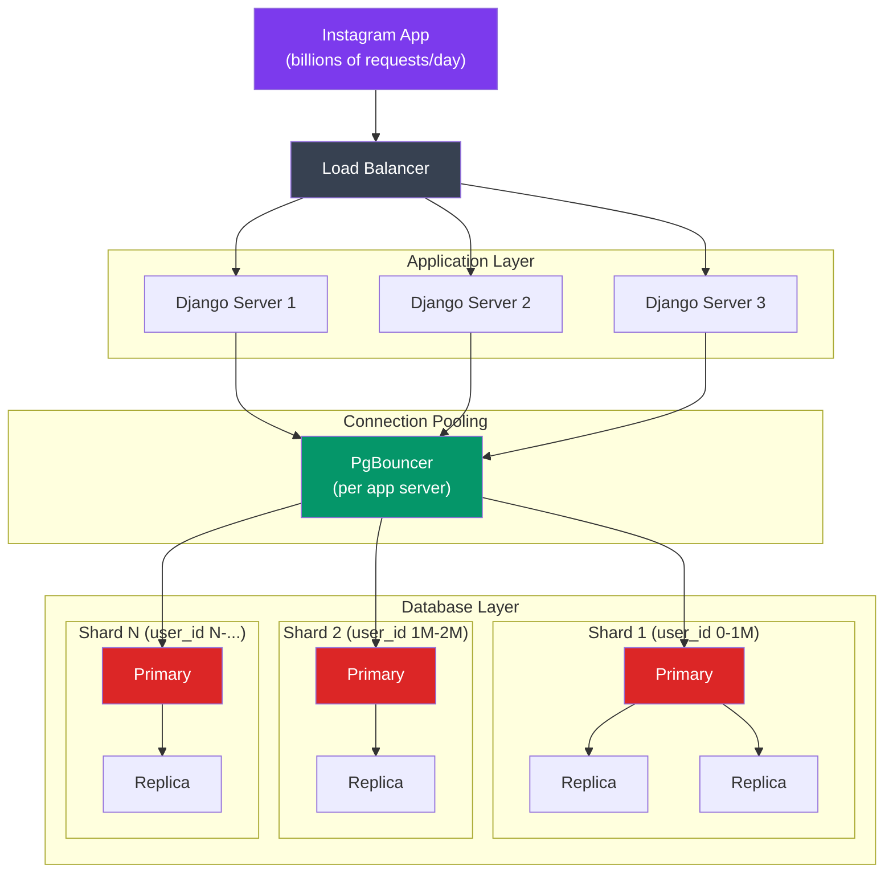

# Databases in System Design — The Complete Guide

> "Database choice is not a technology decision — it's a business decision disguised as one."

---

## The Fundamental Question: Which Database and WHY?

Sab log yeh poochte hain: "SQL use karein ya NoSQL?" But that's the wrong question.

The right question is: **"What guarantees does my data need?"**

Think of it like this. You have two options to store your money:
- A **bank** — strict rules, everything audited, you can't accidentally spend money twice, but slightly slower
- A **piggy bank** — fast to put money in, no rules, no guarantees, but you might lose some coins

Neither is wrong. It depends on what you're storing.

Same with databases:

```
THE DECISION FRAMEWORK
═══════════════════════════════════════════════════════════════

Ask yourself these 5 questions:

1. Does my data have a fixed structure?
   YES → Lean toward SQL
   NO  → Consider document DB (MongoDB)

2. Do I need complex queries with joins?
   YES → SQL (PostgreSQL, MySQL)
   NO  → Maybe NoSQL works fine

3. Do I need strong consistency? (e.g., money, inventory)
   YES → SQL with ACID transactions (non-negotiable)
   EVENTUAL CONSISTENCY OK → Cassandra, DynamoDB

4. What's my scale? Billions of rows? Millions of writes/sec?
   EXTREME SCALE → Cassandra, ScyllaDB, DynamoDB
   NORMAL SCALE  → PostgreSQL handles 99% of use cases

5. Is my schema going to change frequently?
   YES → Document DB (MongoDB, Firestore)
   STABLE SCHEMA → SQL
```

Real example: Instagram ke paas billions of photos hain. They use:
- **PostgreSQL** — for user data, followers, comments (strong consistency needed)
- **Cassandra** — for activity feeds (high write throughput, eventual consistency ok)
- **Redis** — for caching (speed > durability)

Yeh ek system hai, teen databases — har ek apni jagah sahi hai.

---

## Relational (SQL) Databases — The Workhorse

### Analogy: Think of a Spreadsheet on Steroids

Agar aapne kabhi Excel use kiya hai, toh aap already SQL ka concept samajhte hain.

Excel mein:
- **Spreadsheet** = Database
- **Sheet** = Table
- **Column headers** = Schema (column names and types)
- **Rows** = Records/Data

But SQL databases are WAY more powerful. Multiple sheets (tables) can be **linked together** through relationships.

### Tables, Rows, Columns

```sql
-- A "users" table in PostgreSQL
CREATE TABLE users (
    id          SERIAL PRIMARY KEY,    -- unique identifier, auto-increments
    name        VARCHAR(100) NOT NULL, -- max 100 chars, can't be null
    email       VARCHAR(255) UNIQUE,   -- must be unique across all rows
    created_at  TIMESTAMP DEFAULT NOW()
);

-- A "orders" table linked to users
CREATE TABLE orders (
    id          SERIAL PRIMARY KEY,
    user_id     INTEGER REFERENCES users(id),  -- foreign key!
    amount      DECIMAL(10, 2) NOT NULL,
    status      VARCHAR(50) DEFAULT 'pending',
    created_at  TIMESTAMP DEFAULT NOW()
);
```

```
VISUAL: How data sits in tables

users table:
┌────┬──────────────┬─────────────────────┬─────────────────────┐
│ id │ name         │ email               │ created_at          │
├────┼──────────────┼─────────────────────┼─────────────────────┤
│  1 │ Rahul Sharma │ rahul@example.com   │ 2024-01-15 10:00:00 │
│  2 │ Priya Singh  │ priya@example.com   │ 2024-01-16 11:30:00 │
│  3 │ Amit Kumar   │ amit@example.com    │ 2024-01-17 09:15:00 │
└────┴──────────────┴─────────────────────┴─────────────────────┘

orders table:
┌────┬─────────┬────────┬──────────┬─────────────────────┐
│ id │ user_id │ amount │ status   │ created_at          │
├────┼─────────┼────────┼──────────┼─────────────────────┤
│  1 │       1 │ 299.00 │ shipped  │ 2024-02-01 14:00:00 │
│  2 │       1 │  49.99 │ pending  │ 2024-02-10 16:00:00 │
│  3 │       2 │ 799.00 │ delivered│ 2024-02-05 12:00:00 │
└────┴─────────┴────────┴──────────┴─────────────────────┘

Notice: orders.user_id links to users.id — that's the RELATIONSHIP
```

### Joins — Combining Tables

Joins SQL ki superpower hai. Multiple tables se data ek shot mein fetch karo.

```sql
-- Get all orders with the buyer's name
SELECT
    u.name          AS customer_name,
    o.amount,
    o.status,
    o.created_at
FROM orders o
JOIN users u ON o.user_id = u.id
WHERE o.status = 'pending';

-- Result:
-- customer_name | amount | status  | created_at
-- Rahul Sharma  |  49.99 | pending | 2024-02-10...
```

```
JOIN TYPES — Visual Explanation
═══════════════════════════════════════

INNER JOIN: Only rows that match in BOTH tables
  Users:  [1, 2, 3, 4]
  Orders: [user 1, 2, 5]
  Result: [1, 2]  ← only where both exist

LEFT JOIN: All rows from left table, matching rows from right (or NULL)
  Users:  [1, 2, 3, 4]
  Orders: [user 1, 2, 5]
  Result: [1✓, 2✓, 3(NULL orders), 4(NULL orders)]

RIGHT JOIN: All rows from right table (rarely used, LEFT is preferred)

FULL OUTER JOIN: Everything from both tables
```

### Popular SQL Databases

| Database | Best For | Used By |
|---|---|---|
| **PostgreSQL** | General purpose, complex queries, JSON support | Instagram, Airbnb, Notion |
| **MySQL** | Web apps, WordPress, simpler workloads | Facebook (historically), Twitter |
| **Oracle** | Enterprise, banking, max reliability | Banks, SAP, Oracle apps |
| **SQLite** | Mobile apps, embedded, single-file | Android apps, iOS apps |
| **Amazon Aurora** | Cloud-native, MySQL/Postgres compatible | Netflix, Airbnb on AWS |

---

## ACID Properties — The Four Pillars of Trust

### Why ACID Exists

Imagine Zomato ka payment system. Ek user Rs. 500 pay karta hai:
1. Customer ke account se Rs. 500 kato
2. Zomato ke account mein Rs. 500 dalo

Agar step 1 ke baad server crash ho jaye — aur step 2 na ho — toh customer ka paisa gaya aur Zomato ko mila bhi nahi! Yeh catastrophic hai.

ACID properties yahi ensure karte hain ki aisa kabhi na ho.



---

### A — Atomicity: All or Nothing

**Analogy:** Sochiye aap ATM se paise nikal rahe ho. Machine ne Rs. 5000 diye, phir crash ho gayi — aur account se deduction hi nahi hua. Ya ulta: deduction hua but paise nahi nikalein. Dono situation wrong hain. Atomicity ensure karta hai ki **dono cheez hoti hain ya koi bhi nahi**.

```
Scenario: Bank Transfer — Rs. 1000 from Rahul to Priya

BEGIN TRANSACTION;
  UPDATE accounts SET balance = balance - 1000 WHERE user_id = 'rahul';
  -- ⚡ SERVER CRASHES HERE ⚡
  UPDATE accounts SET balance = balance + 1000 WHERE user_id = 'priya';
COMMIT;

WITHOUT ATOMICITY:
  Rahul loses Rs. 1000.
  Priya gets nothing.
  Rs. 1000 vanishes from the universe. 😱

WITH ATOMICITY:
  Database detects incomplete transaction on restart.
  ROLLS BACK both operations.
  Rahul's balance restored. No money lost. ✅
```

**How it's implemented:** Write-Ahead Log (WAL)
- Before modifying any data, the database writes to a log file: "I'm about to do X"
- If crash happens before commit, on restart: "Oh, that transaction never committed → rollback"
- If commit happens, on restart: "That transaction was committed → replay it"



---

### C — Consistency: Always Valid State

**Analogy:** Bank mein ek rule hai — account balance kabhi negative nahi ho sakta. Consistency ensure karta hai ki database kabhi bhi is rule ko violate karne wali state mein nahi jata. Agar koi transaction aisa karna chahe, database refuse kar dega.

```sql
-- Constraints define what "valid" means for your data
CREATE TABLE accounts (
    id      SERIAL PRIMARY KEY,
    user_id INTEGER REFERENCES users(id),  -- FK constraint: user must exist
    balance DECIMAL CHECK (balance >= 0),   -- CHECK constraint: no negatives
    email   VARCHAR UNIQUE                  -- UNIQUE constraint
);

-- This transaction VIOLATES consistency:
BEGIN;
    UPDATE accounts SET balance = balance - 10000
    WHERE user_id = 1;  -- If balance is only 500, this creates -9500
COMMIT;
-- PostgreSQL REJECTS this: "violates check constraint"
-- Database stays in valid state ✅
```

Consistency is partly the database's job (enforcing constraints) and partly **your application's job** (writing correct business logic).

---

### I — Isolation: Concurrent Transactions Don't See Each Other's Mess

**Analogy:** Swiggy ke 1000 delivery partners ek saath orders accept kar rahe hain. Ek hi order do logon ko nahi milna chahiye. Isolation ensure karta hai ki do transactions ek doosre ke kaam mein interference nahi karte.

Isolation levels are a **spectrum** — more isolation = more safety but slower performance.

```
ISOLATION LEVELS (weakest → strongest)
═══════════════════════════════════════════════════════════════════════

Level               | Dirty Read | Non-Repeatable | Phantom Read
                    |            |     Read       |
────────────────────┼────────────┼────────────────┼──────────────
READ UNCOMMITTED    |   YES ❌   |    YES ❌      |   YES ❌
READ COMMITTED      |   NO  ✅   |    YES ❌      |   YES ❌
REPEATABLE READ     |   NO  ✅   |    NO  ✅      |   YES ❌
SERIALIZABLE        |   NO  ✅   |    NO  ✅      |   NO  ✅


🔴 Dirty Read:
   Transaction A reads data that Transaction B wrote but NOT YET committed.
   If B rolls back, A read "ghost" data that never existed.
   Example: Zomato shows order as "delivered" before driver confirms.

🟡 Non-Repeatable Read:
   Transaction A reads a row. Transaction B modifies it and commits.
   Transaction A reads the same row again — different value!
   Example: You read your bank balance twice in a report — different numbers.

🟠 Phantom Read:
   Transaction A queries "all pending orders". Transaction B inserts new pending order.
   Transaction A re-runs same query — sees an extra row that wasn't there before.
   Like a "ghost" row appearing mid-transaction.
```

```
PostgreSQL default: READ COMMITTED (good balance of safety and speed)
MySQL default:      REPEATABLE READ

For financial transactions: Use SERIALIZABLE or explicit locking.
For most web apps: READ COMMITTED is fine.
```

**Interview tip:** Companies like Paytm, PhonePe use SERIALIZABLE or explicit row-level locking for payment transactions. READ COMMITTED is used for most other queries.

---

### D — Durability: Committed = Permanent

**Analogy:** Jab bank teller aapko bolta hai "Rs. 10,000 deposit ho gaya", aap trust karte ho ki agar kal bank ka server crash bhi ho, toh bhi aapka paisa safe hai. Yeh durability hai — once committed, data never lost.

```
HOW DURABILITY WORKS:
═══════════════════════════════════════

1. App sends: COMMIT;
2. Database writes WAL to disk (fsync — forces OS to flush to physical disk)
3. Only AFTER successful fsync → "Commit OK" returned to app
4. Data pages updated in background (async)

If server crashes after step 2 but before step 4:
  → WAL has the committed transaction
  → On restart, database replays WAL
  → Data recovered ✅

If server crashes before step 2:
  → Transaction not committed → rolled back ✅

COST of durability:
  fsync is slow (~5-10ms per call on spinning disk)
  This limits write throughput to ~100-200 TPS on a single disk

OPTIMIZATION: Group Commit
  Instead of fsync per transaction, batch 100 transactions into one fsync.
  100× throughput improvement.
  PostgreSQL, MySQL both do this automatically.
```

---

## Indexes — The Secret Weapon

### Analogy: Index at the Back of a Textbook

Sochiye ek 1000-page textbook mein aapko "TCP/IP" topic dhundhna hai. Do options hain:
1. **Full table scan:** Har page check karo — 1 se 1000 tak. Slow.
2. **Index:** Back of book mein jaao, T dekho, "TCP/IP — page 734". Jump directly. Fast.

Database indexes exactly yahi karte hain.

```
WITHOUT INDEX:
  Query: SELECT * FROM users WHERE email = 'rahul@example.com'
  Database: "I'll check all 50 million rows..."
  Time: 4 seconds 😭

WITH INDEX on email:
  Database: "Let me look up 'rahul@example.com' in the B-tree index..."
  Time: 2ms ✅

2000x speedup. That's the power of an index.
```

### B-Tree Index — The Standard

B-Tree (Balanced Tree) is the default index type in PostgreSQL, MySQL. Yeh basically ek sorted tree structure hai.



```
B-Tree Index Properties:
─────────────────────────
✅ Equality: WHERE email = 'x'         → O(log n)
✅ Range:    WHERE age BETWEEN 20 AND 30 → O(log n) + scan
✅ Ordering: ORDER BY created_at        → already sorted!
✅ Prefix:   WHERE name LIKE 'Rah%'     → works!
❌ Suffix:   WHERE name LIKE '%arma'    → full scan, no help
```

### Hash Index — For Pure Equality

```
Structure: hash(key) → bucket → row location

Pros: O(1) exact match — even faster than B-tree for equality
Cons: 
  ❌ No range queries (WHERE age > 25 — useless)
  ❌ No ordering (ORDER BY — useless)
  ❌ PostgreSQL hash indexes not replicated in older versions

Use when: You ONLY ever query exact equality. Rare in practice.
```

### Composite Index — Multi-Column Queries

Yeh ek cheezo mein bahut log galti karte hain — **column order matters!**

```sql
-- Swiggy: Find all pending orders for a specific restaurant
SELECT * FROM orders
WHERE restaurant_id = 42 AND status = 'pending';

-- Create composite index
CREATE INDEX idx_orders_rest_status
ON orders (restaurant_id, status);

-- This index stores data sorted first by restaurant_id, then by status:
-- (42, cancelled), (42, delivered), (42, pending), (43, pending)...

-- USES the index ✅
SELECT * FROM orders WHERE restaurant_id = 42 AND status = 'pending';

-- USES the index (leftmost prefix rule) ✅
SELECT * FROM orders WHERE restaurant_id = 42;

-- DOES NOT use the composite index ❌
-- (Can't skip the leftmost column)
SELECT * FROM orders WHERE status = 'pending';

-- RULE: Index columns in order of most selective → least selective
-- AND put columns used in equality checks before range checks
```

### Covering Index — Query Answered From Index Alone

```sql
-- YouTube: Get title and view_count for all videos by a channel
SELECT video_id, title, view_count
FROM videos
WHERE channel_id = 'UC123';

-- Regular index: Database finds rows via index, THEN fetches table pages
CREATE INDEX idx_videos_channel ON videos (channel_id);
-- Two I/O operations: index lookup + table fetch

-- Covering index: ALL needed columns are in the index itself
CREATE INDEX idx_videos_channel_covering
ON videos (channel_id, video_id, title, view_count);
-- One I/O operation: index lookup answers everything ✅
-- Called "Index Only Scan" in PostgreSQL EXPLAIN output
```

### Partial Index — Index Only What You Query

```sql
-- WhatsApp: 99% of messages are 'delivered'. Only 1% are 'pending'.
-- You only ever query pending messages (to retry delivery).

-- BAD: Index entire table
CREATE INDEX idx_messages_status ON messages (status);
-- Indexes 1 billion rows unnecessarily

-- GOOD: Partial index — only undelivered messages
CREATE INDEX idx_messages_pending
ON messages (created_at)
WHERE status = 'pending';
-- Indexes only ~10 million rows → tiny index, blazing fast ✅
```

### When NOT to Add an Index

Simple baat hai — indexes are not free.

```
Every index:
  - Slows down INSERT (must update index)
  - Slows down UPDATE (if indexed column changes)
  - Slows down DELETE (must remove from index)
  - Takes disk space (sometimes as large as the table itself)

DON'T index:
  ❌ Low-cardinality columns: gender (M/F/Other) — only 3 values
     50% rows match → full scan is faster than index + random I/O
     Rule of thumb: index helps when < 10-15% of rows match a value

  ❌ Very small tables (< 1000 rows):
     PostgreSQL will just ignore the index and do a full scan anyway

  ❌ Write-heavy columns that rarely appear in WHERE clauses:
     Inserting 100,000 rows/sec? Each index you add makes it slower.

  ❌ Redundant indexes:
     Index on (A, B, C) already covers queries on (A) and (A, B)
     Don't create separate indexes on (A) or (A, B) — waste!
```

---

## Transactions and Locking

### Why Locking Exists

Netflix ke paas ek last seat hai ek show mein. 100 users same time pe book karne ki koshish karte hain. Without locking, 100 logon ko confirmation mil sakta hai — but physically ek hi seat hai. Locking prevent karta hai is **race condition** ko.

```mermaid
sequenceDiagram
    participant User1 as User 1 (Mumbai)
    participant DB as Database
    participant User2 as User 2 (Delhi)

    User1->>DB: BEGIN; SELECT seats WHERE show_id=1 (1 seat left)
    User2->>DB: BEGIN; SELECT seats WHERE show_id=1 (1 seat left)
    User1->>DB: UPDATE seats SET booked=true WHERE show_id=1
    User2->>DB: UPDATE seats SET booked=true WHERE show_id=1
    User1->>DB: COMMIT ✅
    User2->>DB: COMMIT ✅ (OOPS! Both booked same seat!)

    Note over User1,User2: Without locking: double booking! 😱
```

### Pessimistic Locking — "Assume the Worst"

**Analogy:** Bank locker. Jab aap locker open karte ho, security guard ek key rakhta hai — koi aur us locker ko access nahi kar sakta jab tak aap andar ho. Lock pehle lo, phir kaam karo.

```sql
-- PostgreSQL: Lock the row before modifying
BEGIN;

-- SELECT FOR UPDATE locks the row immediately
SELECT * FROM seats
WHERE show_id = 1 AND status = 'available'
LIMIT 1
FOR UPDATE;  -- Row is now LOCKED

-- Other transactions trying FOR UPDATE will WAIT here
UPDATE seats SET status = 'booked', user_id = 42
WHERE id = <returned_id>;

COMMIT;  -- Lock released
```

```
Pessimistic Locking:
  ✅ Prevents conflicts completely
  ✅ Simple logic — whoever gets the lock, wins
  ❌ Serializes access — only one transaction at a time
  ❌ Deadlock risk (T1 locks A, wants B; T2 locks B, wants A → deadlock)
  ❌ Performance bottleneck under high contention

Best for: Booking systems, inventory, financial transactions
          Anywhere double-write would be catastrophic
```

### Optimistic Locking — "Assume the Best"

**Analogy:** Google Docs. Do log same document edit kar rahe hain. Google docs pehle kisi ko block nahi karta. Jab save karo, check karta hai — "kisi aur ne bhi badlav kiya?" Agar haan, conflict dikhaata hai.

```sql
-- Add a version column to the table
ALTER TABLE products ADD COLUMN version INTEGER DEFAULT 0;

-- Read current state
SELECT id, stock, version FROM products WHERE id = 1;
-- Returns: id=1, stock=100, version=5

-- Try to update — only succeeds if version hasn't changed
UPDATE products
SET stock = 99, version = 6
WHERE id = 1 AND version = 5;  -- Check version!

-- If another transaction updated first, version is now 6
-- Our WHERE version=5 finds 0 rows → we know conflict happened
-- Application retries the operation
```

```
Optimistic Locking:
  ✅ No locks held during the "thinking" phase
  ✅ Better throughput when conflicts are rare
  ✅ No deadlocks possible
  ❌ Must handle retries in application code
  ❌ Under heavy contention, many retries → worse than pessimistic

Best for: Low-contention workloads, read-heavy scenarios
          User profile updates, settings changes
```

| | Pessimistic Locking | Optimistic Locking |
|---|---|---|
| **Approach** | Lock first, then work | Work first, check conflicts on save |
| **Performance (low contention)** | Slower (unnecessary locking) | Faster (no locking overhead) |
| **Performance (high contention)** | Better (no retry storms) | Worse (many retries) |
| **Deadlock risk** | Yes | No |
| **Complexity** | Low | Medium (retry logic) |
| **Use case** | Ticket booking, payments | Profile updates, settings |

---

## Connection Pooling — Don't Waste Handshakes

### Why Connections Are Expensive

**Analogy:** Calling customer support. Har baar call karo toh:
- Phone ring karo (TCP handshake)
- Security verify karo (TLS handshake)
- Account number bolo (auth)
- Phir actual kaam bolo

Agar har minute naya call karo toh exhaust ho jaoge. Better hai ek call raho aur multiple questions poochho — that's connection pooling.

```
Cost of creating one PostgreSQL connection:
────────────────────────────────────────────
TCP handshake:          ~1ms
TLS handshake:          ~5ms
PostgreSQL auth:        ~5ms
Backend process fork:  ~10ms
Memory per connection: ~5-10 MB
─────────────────────────────
Total: ~20ms + 5-10 MB per connection

10,000 requests/sec × 1 new connection each:
= 10,000 connections × 5 MB = 50 GB RAM just for connections! 😱
= Database crashes under connection storm
```



### Pooling Tools

**PgBouncer** — External proxy for PostgreSQL
```
Modes:
  Session pooling:    One DB connection per client session
  Transaction pooling: One DB connection per transaction (most efficient!)
  Statement pooling:  One DB connection per statement (most aggressive)

Used by: Instagram, GitLab, Heroku
Config: max_client_conn=10000, default_pool_size=20
```

**HikariCP** — Java connection pool (used inside your app)
```java
// Spring Boot / Java apps
HikariConfig config = new HikariConfig();
config.setMaximumPoolSize(20);        // Max 20 DB connections
config.setMinimumIdle(5);            // Keep 5 warm connections
config.setConnectionTimeout(30000);  // Wait max 30s for a connection
config.setIdleTimeout(600000);       // Close idle connections after 10min
```

**AWS RDS Proxy** — Managed connection pooler for AWS
```
Benefits:
  - Handles connection pooling automatically
  - Failover in ~20 seconds (vs 60-120 seconds without proxy)
  - IAM authentication for connections
  - No changes to application code

Used by: Any serverless app hitting RDS (Lambda → RDS Proxy → RDS)
```

---

## Query Optimization — Diagnose Before You Guess

### EXPLAIN ANALYZE — Your X-Ray Vision

**Yeh rule yaad rakhna:** Never guess why a query is slow. Run EXPLAIN ANALYZE first.

```sql
-- Show the execution plan WITH actual timing
EXPLAIN ANALYZE
SELECT u.name, COUNT(o.id) as order_count
FROM users u
JOIN orders o ON o.user_id = u.id
WHERE u.city = 'Mumbai'
GROUP BY u.id, u.name
ORDER BY order_count DESC
LIMIT 10;
```

```
Sample output:
──────────────────────────────────────────────────────────────────
Limit  (cost=12450.00..12450.03 rows=10) (actual time=234.5..234.6 rows=10)
  -> Sort  (cost=12450.00..12480.00 rows=12000) (actual time=234.4..234.4 rows=10)
       Sort Key: (count(o.id)) DESC
       -> Hash Aggregate  (cost=11200.00..11320.00 rows=12000)
            -> Hash Join  (cost=3500.00..10800.00 rows=160000)
                 Hash Cond: (o.user_id = u.id)
                 -> Seq Scan on orders  (cost=0..4500.00 rows=500000)  ← 🔴 SLOW
                 -> Seq Scan on users   (cost=0..2500.00 rows=12000)
                      Filter: (city = 'Mumbai')
Planning Time: 2.1 ms
Execution Time: 234.6 ms

What to look for:
  🔴 Seq Scan on large tables → Missing index
  🔴 rows estimated vs actual wildly different → Stale statistics (run ANALYZE)
  🔴 High actual time vs estimated cost → I/O bottleneck
  ✅ Index Scan → Good!
  ✅ Index Only Scan → Even better!
```

### The N+1 Problem — The Silent Killer

**Analogy:** Zomato ki team ek report banana chahti hai — "each delivery boy ke last 10 orders". Wrong approach: for each of 500 delivery boys, run a separate query. Sahi approach: ek query mein sab lo.

```
BAD CODE (N+1 problem):
═══════════════════════════════════════
posts = db.query("SELECT * FROM posts LIMIT 100")    -- 1 query

for post in posts:
    author = db.query(                                -- 100 queries!
        "SELECT name FROM users WHERE id = ?", post.author_id
    )
    print(f"{author.name}: {post.title}")

Total queries: 1 + 100 = 101
Each query ~5ms → Total: ~505ms 😱

FIX 1: JOIN
═══════════════════════════════════════
posts_with_authors = db.query("""
    SELECT posts.title, users.name
    FROM posts
    JOIN users ON posts.author_id = users.id
    LIMIT 100
""")
-- 1 query, ~10ms ✅

FIX 2: Batch fetch
═══════════════════════════════════════
posts = db.query("SELECT * FROM posts LIMIT 100")    -- 1 query
author_ids = [p.author_id for p in posts]
authors = db.query(
    "SELECT * FROM users WHERE id = ANY(?)", author_ids
)  -- 1 query!
author_map = {a.id: a for a in authors}
-- Total: 2 queries ✅
```

### Normalization vs Denormalization

**Normalization = Organized librarian** — every fact stored in exactly one place. Clean, no duplication.

**Denormalization = Cheat sheet** — duplicate some data so you don't have to do joins. Faster reads, harder updates.

```
NORMALIZED SCHEMA (3NF):
═══════════════════════════════════════
users:   id | name | city
orders:  id | user_id | restaurant_id | amount
restaurants: id | name | city

To get "order with user name and restaurant name":
  SELECT o.*, u.name, r.name
  FROM orders o
  JOIN users u ON o.user_id = u.id
  JOIN restaurants r ON o.restaurant_id = r.id
  WHERE o.id = 12345;
  → 3-table join, slower but data is always consistent

DENORMALIZED SCHEMA (for read performance):
═══════════════════════════════════════════
orders: id | user_id | user_name | restaurant_id | restaurant_name | amount
                ↑                         ↑
          duplicated!                duplicated!

To get order with names:
  SELECT * FROM orders WHERE id = 12345;
  → Single table, super fast ✅
  → But: if user changes their name, you must update EVERY order row ❌
```

```
RULE OF THUMB:
  Normalize first (always start normalized)
  Denormalize only when:
    - JOIN is proven to be the bottleneck (EXPLAIN ANALYZE shows it)
    - The duplicated column rarely changes (restaurant name changes rarely)
    - You're trading write complexity for critical read performance
```

---

## Data Modeling for Scale

### When SQL Starts to Struggle

SQL databases mein limits hain. Instagram pe 2024 mein 100 million posts per day hain. Tab kya hota hai?

```
SIGNS THAT SQL IS STRUGGLING:
════════════════════════════════════════════════════════════

1. BILLIONS OF ROWS:
   SELECT COUNT(*) FROM posts; -- Takes 30 minutes!
   B-tree depth increases → more I/O per lookup
   Solution: Partitioning, or move to Cassandra/DynamoDB

2. HIGH WRITE THROUGHPUT:
   10,000 writes/sec → WAL, fsync, index updates bottleneck
   Single master can only scale vertically
   Solution: Sharding, Cassandra, DynamoDB

3. FLEXIBLE/CHANGING SCHEMA:
   ALTER TABLE users ADD COLUMN new_field; -- Locks table for hours on 1B row table!
   Solution: JSON columns (PostgreSQL JSONB) or document DB

4. GEOGRAPHIC DISTRIBUTION:
   One database in Mumbai → 200ms latency for US users
   Solution: Multi-region setup, CockroachDB, PlanetScale
```

### Read Replicas — Offload Read Traffic

**Analogy:** Ek teacher 1000 students ko padha rahi hai. Unse sirf 1 teacher se poochh sakte ho — overwhelmed. Solution: 5 teachers hire karo, sab same notes padhaate hain. Students kisi bhi teacher se poochh sakte hain.

Primary = ek teacher jo new notes likhti hai. Replicas = baaki teachers jo copy karte hain.



```
Read Replica Details:
──────────────────────
Replication: Asynchronous (replica might be slightly behind primary)
  - This is called "replication lag" (typically < 1 second)
  - If you write data and immediately read from replica, you might not see it
  - Solution: Route "read your own writes" to primary

Use cases for replicas:
  ✅ Analytics queries (don't slow down primary)
  ✅ Report generation
  ✅ Geographic: put replica closer to users
  ✅ Backup: failover if primary dies

Instagram uses this: Millions of reads go to replicas.
Writes (new posts, likes) → primary.
Profile reads, feed reads → replicas.
```

---

## Storage Engines — How Data Actually Lives on Disk

### B-Tree Storage (PostgreSQL, MySQL InnoDB)

Standard for read-heavy OLTP workloads. Data pages are updated **in-place**.



### LSM-Tree (Cassandra, RocksDB, LevelDB)

**Optimized for write-heavy workloads.** Kabhi bhi in-place update nahi hota — always append.



```
WHY LSM WRITES ARE FAST:
  B-Tree: "UPDATE user SET name='X'" → random I/O to find and modify page
  LSM:    Same update → append to log → sequential I/O (100× faster on HDD)

WHY LSM READS ARE SLOWER:
  Must check: MemTable → Level 0 SSTables → Level 1 → Level 2...
  Bloom filters help: "Is key K in this SSTable?" → probabilistic yes/no
  Background compaction keeps it manageable

USED BY: Cassandra (WhatsApp messages), RocksDB (Meta's storage engine),
          LevelDB (Chrome's local storage), HBase (Hadoop ecosystem)
```

### B-Tree vs LSM-Tree — When to Use What

| Property | B-Tree | LSM-Tree |
|---|---|---|
| **Write performance** | Moderate (random I/O) | Excellent (sequential I/O) |
| **Read performance** | Excellent O(log n) | Good (Bloom filters help) |
| **Range queries** | Excellent | Good |
| **Space amplification** | Low (in-place updates) | High (multiple copies during compaction) |
| **Write amplification** | Low | High (compaction rewrites data) |
| **Best for** | OLTP, read-heavy, complex queries | Write-heavy, time-series, messaging |
| **Examples** | PostgreSQL, MySQL | Cassandra, RocksDB, HBase |

---

## Row-Oriented vs Column-Oriented Storage

### Row-Oriented (OLTP — Online Transaction Processing)

Har row ek saath disk pe rakhi hoti hai. Single user ka data fetch karna fast hota hai.

```
Disk layout (row-oriented):
[1, rahul, Mumbai, 29.99, shipped][2, priya, Delhi, 149.00, pending]...

SELECT * FROM orders WHERE id = 1
  → Read one page, return all columns ✅ Fast!

SELECT SUM(amount) FROM orders WHERE month = 'Jan'
  → Must read EVERY row to get just the amount column ❌ Slow!
```

### Column-Oriented (OLAP — Online Analytical Processing)

Har column alag file/segment mein. Analytics queries pe blazing fast.

```
Disk layout (column-oriented):
id column:     [1][2][3][4][5]...
amount column: [29.99][149.00][9.99][89.50][199.00]...
status column: [shipped][pending][shipped][shipped][pending]...

SELECT SUM(amount) FROM orders WHERE month = 'Jan'
  → Read ONLY amount column file ✅ 4× less data!
  → Columns compress extremely well (same data type, similar values)
  → SIMD CPU instructions process many values at once ✅

SELECT * FROM orders WHERE id = 1
  → Must read all column files and reconstruct row ❌ Slower!
```

| Storage | Best For | Examples |
|---|---|---|
| Row-oriented | CRUD, point queries, transactional | PostgreSQL, MySQL, Oracle |
| Column-oriented | Analytics, aggregations, BI dashboards | BigQuery, Redshift, ClickHouse |
| Hybrid | Both (HTAP) | DuckDB, SingleStore |

---

## Instagram's PostgreSQL Story — Real Scale

Instagram ek real case study hai that shows **you can scale PostgreSQL to billions of users** with the right architecture.

```
Instagram's Database Journey:
═══════════════════════════════════════════════════════════════

2010 (Launch):
  - Single PostgreSQL server
  - Django backend
  - ~1 million users

2012 (100M users):
  - Primary + multiple read replicas
  - PgBouncer for connection pooling
  - Data partitioned by user_id range

2016 (500M users):
  Challenges hit:
    - Auto-increment IDs: multiple shards can't use sequential IDs
    → Solution: Custom ID generator (Snowflake-style)
      ID = timestamp (41 bits) + shard ID (13 bits) + sequence (10 bits)
      Globally unique, sortable by time, no coordination needed!

    - Media metadata (photos, videos): billions of rows
    → Solution: Sharded PostgreSQL (based on user_id % num_shards)

2020+ (2B users):
  - Hundreds of PostgreSQL shards
  - Each shard is primary + replicas
  - Vitess-like middleware for routing queries to right shard
  - Cassandra for activity feeds (high write throughput)
  - Redis for caching hot data (profile info, counts)
```



**Key lessons from Instagram:**
- PostgreSQL can scale to hundreds of millions of users — don't jump to NoSQL too early
- Sharding is hard — defer it as long as possible using vertical scaling and read replicas
- Connection pooling (PgBouncer) is mandatory at scale
- Custom ID generation is necessary when sharding (no more auto-increment)
- Cache aggressively with Redis to reduce DB load

---

## Buffer Pool / Page Cache — RAM as Your Best Friend

```
ANALOGY: Your browser cache
  First visit to a website → slow (downloads everything)
  Second visit → fast (loaded from cache)

Database buffer pool = same concept for data pages
  First query for user 123 → disk read (slow, ~10ms)
  Second query for user 123 → already in RAM (fast, ~0.1ms)
  100× faster!

PostgreSQL: shared_buffers (default 128MB — too small for production!)
  Recommended: 25% of total RAM
  On 64GB server: set shared_buffers = 16GB

MONITORING cache hit rate:
  SELECT
    sum(heap_blks_hit) /
    (sum(heap_blks_hit) + sum(heap_blks_read)) AS cache_hit_ratio
  FROM pg_statio_user_tables;

  Target: > 99% for OLTP workloads
  If < 95%: Add more RAM or optimize queries
```

---

## Performance Trade-offs — Quick Reference

| Technique | Read Speed | Write Speed | Storage | Complexity |
|---|---|---|---|---|
| **No index** | Slow (full scan) | Fast | Baseline | None |
| **B-Tree index** | Fast | Slower | +10-30% | Low |
| **Covering index** | Fastest | Slowest | +20-50% | Medium |
| **Composite index** | Fast (multi-col) | Slower | +15-35% | Medium |
| **Partial index** | Fastest (tiny) | Minimal impact | Minimal | Low |
| **Read replicas** | Scales horizontally | Primary only | 2-3× | Medium |
| **Connection pooling** | No change | No change | No change | Low |
| **Denormalization** | Faster (no join) | Slower (multi-update) | +20-100% | High |
| **Sharding** | Scales horizontally | Scales horizontally | Same | Very High |

---

## Common Interview Questions

### Q1: Why would you choose PostgreSQL over MongoDB?

```
ANSWER FRAMEWORK:

Choose PostgreSQL when:
  - Data is structured and schema is stable
  - You need complex queries with joins (can't do in MongoDB easily)
  - ACID transactions are required (financial data, bookings)
  - Data integrity through foreign keys and constraints is important
  - You're not sure yet — SQL is always the safe default

Choose MongoDB when:
  - Schema evolves rapidly (startup, prototyping phase)
  - Data is naturally document-shaped (no relationships)
  - You need flexible fields per document (different users have different attributes)
  - Horizontal scaling from day 1 is a priority

Real example: Zomato uses PostgreSQL for order/payment data (ACID needed),
but might use MongoDB for restaurant menu data (flexible schema, frequent changes).
```

### Q2: Explain ACID with a real-world example

```
ANSWER:
Bank transfer — Rs. 10,000 from Rahul's account to Priya's account:

BEGIN TRANSACTION;
  UPDATE accounts SET balance = balance - 10000 WHERE user_id = 'rahul';
  UPDATE accounts SET balance = balance + 10000 WHERE user_id = 'priya';
COMMIT;

Atomicity: If step 2 fails (server crash), step 1 is rolled back. No money lost.
Consistency: If Rahul's balance was Rs. 5000, the check constraint (balance >= 0)
             prevents deducting Rs. 10,000. Transaction rejected.
Isolation: If two people try to pay Rahul at the same time, they see consistent
           balances — they can't both see the "before deduction" state.
Durability: Once COMMIT succeeds, even if server crashes immediately after,
            the transfer is permanent (WAL ensures recovery).
```

### Q3: What is the N+1 problem?

```
ANSWER:
N+1 occurs when you load N records and then query the DB N more times for related data.

Example: Fetch 100 blog posts and their authors:
  1 query for posts + 100 queries for each author = 101 queries

Fix 1: JOIN — single query with join
Fix 2: Batch load — 1 query for posts + 1 IN query for all authors = 2 queries

ORMs hide this: Use .includes() (Rails), select_related() (Django),
findMany({ include: { author: true } }) (Prisma)
```

### Q4: When would you add a read replica?

```
ANSWER:
Add a read replica when:
  - Primary DB is CPU-bound from read queries
  - You want to run analytics/reports without impacting production
  - Users in different geographic regions need lower latency
  - You want a hot standby for failover

Caveat: Replicas have REPLICATION LAG. Writes go to primary, reads from replica
may be slightly stale (usually < 1 second). "Read your own writes" must be
routed to primary.

Example: Instagram's user feed reads go to replicas.
But immediately after posting, your own post must be read from primary.
```

### Q5: Pessimistic vs Optimistic locking — when to use each?

```
ANSWER:
Pessimistic: "Assume conflict will happen — lock first"
  - Use for: ticket booking, flight seats, limited inventory
  - Implementation: SELECT FOR UPDATE
  - Risk: deadlocks, reduced throughput

Optimistic: "Assume conflict is rare — check at save time"
  - Use for: user profile updates, settings, low-contention data
  - Implementation: version column check
  - Risk: retry storms under high contention

Real example:
  BookMyShow — seat reservation uses pessimistic locking (can't double-book)
  Twitter — tweet edit uses optimistic locking (conflicts are rare)
```

### Q6: What happens if your PostgreSQL runs out of connections?

```
ANSWER:
Without connection pooling:
  10,000 concurrent requests → 10,000 connections
  PostgreSQL max connections: 100-300
  Result: "FATAL: sorry, too many clients already" error

Fix: Connection pooling with PgBouncer or HikariCP
  - PgBouncer sits between app and DB
  - 10,000 app "connections" → 20 actual DB connections
  - Requests queue up and get served as connections become free

Additional fix: AWS RDS Proxy (managed pooler, good for Lambda + RDS)
```

### Q7: How does an index make queries faster?

```
ANSWER:
Without index: Full table scan — database reads every row until it finds matches.
  O(n) — scales with table size. 50M rows → reads 50M rows.

With B-tree index: Binary tree structure.
  Database traverses tree from root → leaf in O(log n) steps.
  50M rows → ~26 comparisons (log₂ 50M ≈ 26)

Trade-off: Index speeds up reads but adds overhead to writes.
  Every INSERT must update all indexes on that table.
  10 indexes on a table → every INSERT updates 11 data structures.

Practical advice: Always use EXPLAIN ANALYZE before adding indexes.
  Don't index every column — only columns in WHERE, JOIN ON, ORDER BY.
```

### Q8: What is Write-Ahead Logging (WAL)?

```
ANSWER:
WAL ensures durability and crash recovery.

How it works:
  1. Before modifying any data, write "I'm about to do X" to WAL file on disk
  2. WAL write is sequential (fast)
  3. After WAL write confirmed (fsync), transaction can commit
  4. Actual data pages updated in background (async)

On crash:
  - If WAL shows transaction committed → replay it on restart
  - If WAL shows transaction not committed → rollback on restart

Also used for replication:
  - WAL records streamed from primary to replicas
  - Replicas replay WAL to stay in sync
```

---

## Key Takeaways

```
╔══════════════════════════════════════════════════════════════════╗
║                     KEY TAKEAWAYS                               ║
╠══════════════════════════════════════════════════════════════════╣
║                                                                  ║
║  1. DEFAULT TO SQL                                               ║
║     PostgreSQL handles 99% of use cases. Don't jump to          ║
║     NoSQL prematurely. Instagram runs on PostgreSQL.             ║
║                                                                  ║
║  2. ACID = TRUST                                                 ║
║     Any financial, booking, or inventory system needs ACID.      ║
║     Atomicity + Durability prevent money disappearing.           ║
║                                                                  ║
║  3. INDEXES = BIGGEST WIN                                        ║
║     A missing index on a 50M row table = 4 second query.        ║
║     Adding the index = 2ms query. Always EXPLAIN ANALYZE first.  ║
║                                                                  ║
║  4. CONNECTION POOLING = MANDATORY                               ║
║     PgBouncer/HikariCP is not optional in production.           ║
║     Without it, connection storms will kill your database.       ║
║                                                                  ║
║  5. READ REPLICAS BEFORE SHARDING                                ║
║     Most read-heavy apps can scale with replicas.               ║
║     Sharding is painful — defer as long as possible.            ║
║                                                                  ║
║  6. LOCKING = TRADEOFF                                           ║
║     Pessimistic = safe but slow. Optimistic = fast but retries. ║
║     Choose based on contention level of your use case.          ║
║                                                                  ║
║  7. N+1 = MOST COMMON ORM BUG                                   ║
║     Always check SQL queries generated by your ORM.             ║
║     Use JOIN or batch fetch (includes/select_related).           ║
║                                                                  ║
║  8. WAL = MAGIC BEHIND DURABILITY AND REPLICATION               ║
║     One mechanism solves two problems: crash recovery +         ║
║     replication to read replicas.                               ║
║                                                                  ║
║  9. NORMALIZE FIRST, DENORMALIZE ONLY WHEN PROVEN               ║
║     Start clean. Denormalize only when EXPLAIN ANALYZE shows    ║
║     joins are the actual bottleneck.                             ║
║                                                                  ║
║  10. RAM IS THE FASTEST STORAGE                                  ║
║      Tune shared_buffers (PostgreSQL) / innodb_buffer_pool       ║
║      (MySQL) to 25% of RAM. Cache hit ratio > 99% target.       ║
╚══════════════════════════════════════════════════════════════════╝
```

---

## Next Steps

- [SQL vs NoSQL Decision Framework](../14-sql-nosql/README.md) — when relational is not enough
- [Caching](../05-caching/README.md) — reduce database load with Redis/Memcached
- [Database Sharding](../17-sharding/README.md) — horizontal partitioning for extreme scale

---

*"A 2ms query and a 4-second query are both "SELECT * FROM users WHERE id = 1" — the difference is a single index. Master your database before scaling your infrastructure."*
