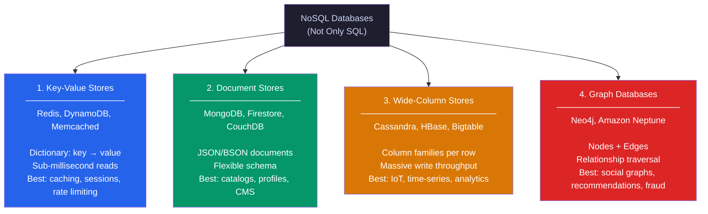
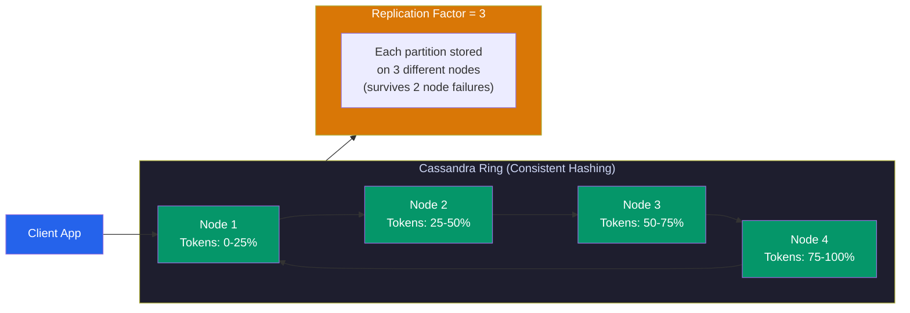
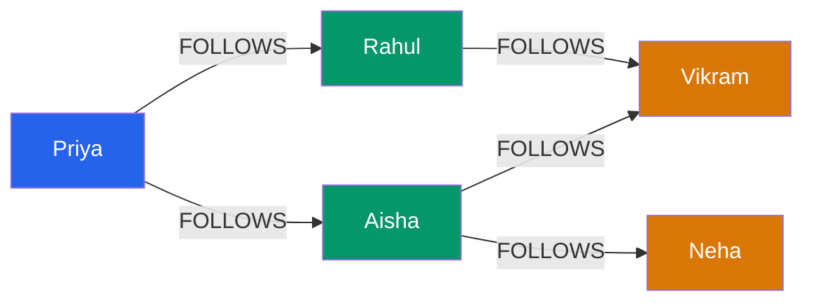
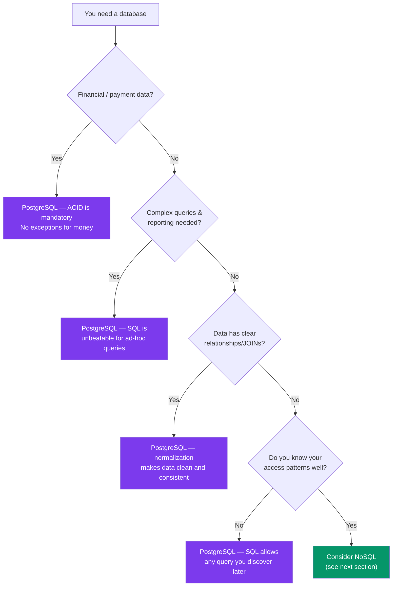
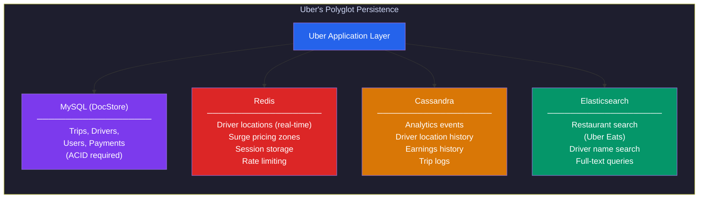
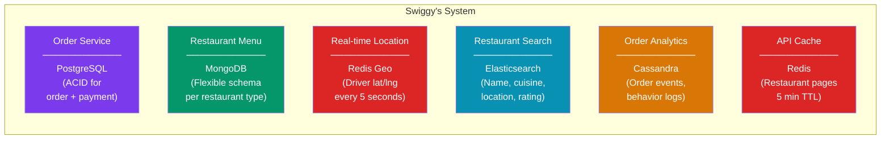
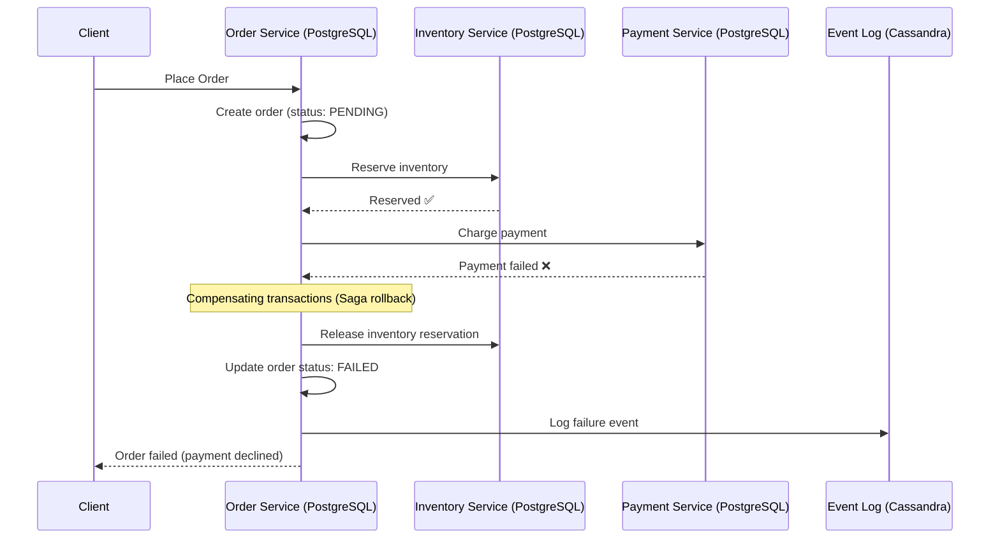
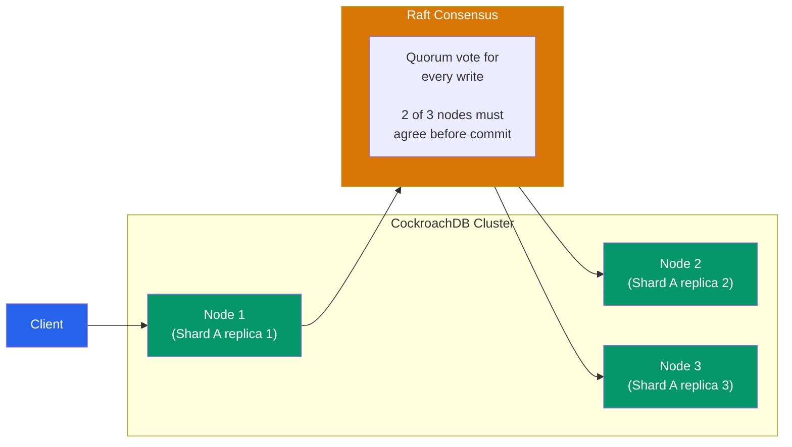

# SQL vs NoSQL: When to Use What

> "Ek hi tarah ka database mat use karo sab cheez ke liye. Different tools for different jobs."
> — Every senior engineer who's been paged at 3am because of the wrong DB choice.

---

## The Real Question (Before We Even Start)

Before diving in, let's kill the most common myth:

> **"NoSQL is modern, SQL is old. For scale, use NoSQL."**

**Yeh bilkul galat hai.** Instagram served 1 billion users on PostgreSQL. WhatsApp ran on MySQL. Shopify runs almost everything on MySQL. The question is never "which is newer" — it's **"which fits my data and access patterns."**

This guide will teach you to make that call with confidence — whether you're building your first side project or designing Zomato's backend in an interview.

---

## Part 1: The Analogy — File Cabinets vs Sticky Notes

**SQL is like a well-organized filing cabinet.**

Imagine a government office. Every document has a fixed format — Name, Date, File Number, Department. Forms are standardized. If you want Ramesh's file, you go to the "R" drawer, look up by file number, and find everything in its proper place. You can even cross-reference — "give me all files where Department = Finance AND Date > 2023."

This is SQL. Structured, organized, powerful for cross-referencing.

**NoSQL is like sticky notes everywhere.**

Now imagine a startup office — sticky notes on monitors, whiteboards, walls. Some notes have just a name and phone number. Others have a full paragraph. Some have drawings. There's no fixed format. It's chaotic but *fast to write* and *flexible*.

That's NoSQL. Each "document" or "row" can look completely different.

**The key insight:** The government office can't suddenly handle sticky-note chaos well. The startup can't suddenly produce a perfectly cross-referenced audit trail. Neither is "better" — they're built for different realities.

---

## Part 2: SQL — The Relational Model (Deep Dive)

### What Is It?

SQL databases store data in **tables** (rows and columns), enforce a **fixed schema**, support **JOINs** across tables, and guarantee **ACID** properties.

Examples: PostgreSQL, MySQL, SQLite, Microsoft SQL Server, Oracle.

### Why Does It Exist?

In the 1970s, Edgar Codd at IBM realized that data in enterprise systems is *relational* — a customer has orders, orders have products, products have categories. Forcing everything into one flat structure (like a spreadsheet) creates massive duplication and inconsistency. The relational model solves this with **normalization** — split data into focused tables and link them with foreign keys.

### How It Works — The Core Concepts

#### Tables, Rows, and Columns

```
Table: users
──────────────────────────────────────────────────
id  | name      | email                | country
────┼───────────┼──────────────────────┼─────────
1   | Priya     | priya@example.com    | IN
2   | Rahul     | rahul@example.com    | IN
3   | Aisha     | aisha@example.com    | US

Table: orders
──────────────────────────────────────────────────────────
id  | user_id | amount  | status    | created_at
────┼─────────┼─────────┼───────────┼─────────────────────
1   | 1       | 499.00  | shipped   | 2024-01-15 10:30:00
2   | 1       | 1200.00 | pending   | 2024-01-20 14:00:00
3   | 2       | 249.00  | delivered | 2024-01-18 09:15:00

Relationship: orders.user_id → users.id (foreign key)
```

#### JOINs — SQL's Superpower

```sql
-- Zomato example: Get all pending orders with customer name
SELECT u.name, o.amount, o.status, o.created_at
FROM orders o
JOIN users u ON o.user_id = u.id
WHERE o.status = 'pending'
ORDER BY o.created_at DESC;

-- Result:
-- name  | amount  | status  | created_at
-- ──────┼─────────┼─────────┼────────────────────
-- Priya | 1200.00 | pending | 2024-01-20 14:00:00

-- Types of JOINs:
-- INNER JOIN  — only matching rows from both tables
-- LEFT JOIN   — all rows from left, matched from right (NULL if no match)
-- RIGHT JOIN  — all rows from right, matched from left
-- FULL JOIN   — all rows from both sides
```

#### Schema Enforcement — Discipline at the Database Level

```sql
CREATE TABLE users (
  id       SERIAL PRIMARY KEY,
  name     TEXT NOT NULL,
  email    TEXT UNIQUE NOT NULL,
  country  CHAR(2),
  age      INT CHECK (age >= 0 AND age <= 150),
  created_at TIMESTAMP DEFAULT NOW()
);

-- Try inserting bad data:
INSERT INTO users (name, email, age) VALUES ('Test', 'test@x.com', -5);
-- ERROR: new row violates check constraint "users_age_check"

-- Try duplicate email:
INSERT INTO users (name, email) VALUES ('Another', 'priya@example.com');
-- ERROR: duplicate key value violates unique constraint "users_email_key"
```

**Why this matters:** The database itself acts as a last line of defense. Even if your application has a bug, corrupt data can't sneak in. In NoSQL, *your application* must enforce this — and applications have bugs.

#### ACID — The Four Guarantees

**Analogy:** ACID is like a bank vault. Either the money moves completely from Account A to Account B, or the transaction never happened. No "partially moved" state.

| Property | What it means | Real example |
|---|---|---|
| **Atomicity** | All-or-nothing. Either the whole transaction succeeds or none of it does | Transfer money: debit + credit both happen, or neither does |
| **Consistency** | Database moves from one valid state to another. Constraints are never violated | Can't have an order with a non-existent user_id |
| **Isolation** | Concurrent transactions don't see each other's in-progress changes | Two people booking the same last seat on a flight — only one wins |
| **Durability** | Once committed, data survives crashes | Power goes out after COMMIT? Data is still there on restart |

```sql
-- Real example: Swiggy order placement
BEGIN;
  -- Step 1: Create the order
  INSERT INTO orders (user_id, restaurant_id, total_amount, status)
  VALUES (42, 7, 350.00, 'placed')
  RETURNING id INTO v_order_id;

  -- Step 2: Add order items
  INSERT INTO order_items (order_id, dish_id, qty, price)
  VALUES (v_order_id, 101, 2, 120.00),
         (v_order_id, 205, 1, 110.00);

  -- Step 3: Reduce restaurant's available slot count
  UPDATE restaurant_capacity
  SET active_orders = active_orders + 1
  WHERE restaurant_id = 7;

COMMIT;
-- If ANY of the above fails → entire transaction rolls back.
-- No orphan order_items. No phantom order. Clean state.
```

#### When SQL Scales — It Goes Further Than You Think

```
PostgreSQL on modern hardware:
──────────────────────────────────────────────────────────────────
Single node:   Up to ~1TB of data, millions of rows per table
Read replicas: Add read replicas for 5-10x read throughput
Connection pooling (PgBouncer): Handle thousands of connections
Partitioning:  Partition large tables by date/range automatically
Indexes:       B-tree, GiST, GIN, BRIN — pick the right one

Real examples:
  Instagram:   PostgreSQL for core data (users, posts, follows)
               Grew to billions of rows before adding Cassandra
  Shopify:     MySQL — handles Black Friday traffic peaks every year
  WhatsApp:    MySQL for message metadata, Mnesia for routing
  GitHub:      MySQL — one of the largest MySQL deployments in the world
```

**Interview tip:** When asked "can SQL scale?", say: "PostgreSQL can handle tens of millions of rows easily, and with read replicas + connection pooling, it can serve thousands of requests per second. Most startups hit product-market fit problems long before hitting PostgreSQL's limits. Only switch when you have a *proven* bottleneck."

---

## Part 3: NoSQL — The Four Families



---

### 3.1 Document Stores — MongoDB, DynamoDB, Firestore

#### The Analogy

Think of a folder for each customer. Inside Priya's folder: her profile photo, her address card, her order slips, her loyalty card — all in one place. You don't need to go to five different drawers to learn about Priya. Everything related to her is together.

That's a document store. One "document" per entity, containing all its data in a JSON-like structure.

#### Why It Exists

SQL's normalization is great for consistency but creates a problem: to show a user profile page, you might need 6-7 JOINs. At massive scale, JOINs are expensive. Document stores solve this by **embedding related data together** — fewer database calls, faster reads.

#### How It Works

```json
// MongoDB document in "users" collection
// Notice: everything about the user is in ONE document
{
  "_id": "ObjectId('64a1b2c3d4e5f6a7b8c9d0e1')",
  "name": "Priya Sharma",
  "email": "priya@example.com",
  "profile": {
    "avatar_url": "https://cdn.example.com/priya.jpg",
    "bio": "Foodie | Traveller | Mumbai",
    "verified": true
  },
  "addresses": [
    {
      "label": "Home",
      "street": "42 MG Road",
      "city": "Mumbai",
      "pincode": "400001",
      "is_default": true
    },
    {
      "label": "Office",
      "street": "Tower B, BKC",
      "city": "Mumbai",
      "pincode": "400051",
      "is_default": false
    }
  ],
  "preferences": {
    "cuisine": ["North Indian", "Chinese"],
    "diet": "vegetarian",
    "notifications": { "email": true, "sms": false, "push": true }
  },
  "created_at": "2023-06-15T09:00:00Z"
}
```

```javascript
// Querying in MongoDB
// Find all vegetarian users in Mumbai
db.users.find({
  "profile.city": "Mumbai",
  "preferences.diet": "vegetarian"
});

// Find users who have a Home address
db.users.find({ "addresses.label": "Home" });

// Aggregation: Count users by city
db.users.aggregate([
  { $group: { _id: "$addresses.city", count: { $sum: 1 } } },
  { $sort: { count: -1 } }
]);
```

#### Real Example: Zomato's Product Catalog

```json
// A restaurant's menu in a document store
// Notice: Biryani House and Pizza Palace have COMPLETELY different fields
// SQL would struggle with this "variable schema" problem

// Document 1: Biryani House
{
  "_id": "rest_001",
  "name": "Biryani House",
  "cuisine": "Mughlai",
  "menu": [
    {
      "item_id": "m001",
      "name": "Chicken Dum Biryani",
      "price": 280,
      "serves": 2,
      "spice_level": "medium",
      "contains_meat": true,
      "cook_time_mins": 25
    }
  ],
  "features": {
    "home_delivery": true,
    "dine_in": true,
    "accepts_cash": false
  }
}

// Document 2: Pizza Palace  
{
  "_id": "rest_002",
  "name": "Pizza Palace",
  "cuisine": "Italian",
  "menu": [
    {
      "item_id": "p001",
      "name": "Margherita",
      "base_price": 199,
      "sizes": ["Small", "Medium", "Large"],
      "size_prices": [199, 299, 399],
      "crust_options": ["Thin", "Thick", "Stuffed"],
      "toppings_available": true,
      "vegan_option": true
    }
  ]
}

// In SQL, you'd need a complex EAV (Entity-Attribute-Value) pattern
// or dozens of nullable columns — both are terrible.
// In MongoDB: just store what you have. Each document is flexible.
```

#### Trade-offs

| Advantage | Disadvantage |
|---|---|
| Flexible schema — different docs can have different fields | No JOINs — must embed or do multiple queries |
| Read is fast — all data in one document | Duplication — if user name changes, must update all order docs |
| Scales horizontally via sharding | Multi-document ACID is slow (MongoDB 4.0+ has it but at cost) |
| Natural fit for hierarchical/nested data | Large documents fetched even when one field is needed |
| Schema-less — great for evolving data models | Schema flexibility = risk of inconsistent data (app must enforce rules) |

**Interview tip:** "MongoDB is great for Zomato's restaurant catalog where every restaurant has different attributes. But for Zomato's order/payment system, I'd use PostgreSQL because ACID transactions are non-negotiable — you can't have a payment go through without an order being created."

---

### 3.2 Key-Value Stores — Redis, DynamoDB, Memcached

#### The Analogy

A locker room at a gym. You have key 47 → you get exactly what's in locker 47. The locker room attendant doesn't know what's inside, doesn't care, doesn't index it. You say "give me 47" → you get it in milliseconds. Maximum simplicity, maximum speed.

#### Why It Exists

Sometimes you don't need complex queries. You need **one thing, fast, by its key**. Session data, API rate limits, cache entries — these are all "give me this exact thing" lookups. SQL's query planner, index scanning, and ACID overhead are wasted on these. Redis answers in under 1 millisecond.

#### How It Works

```
# Redis commands — simple as it gets
SET user:session:abc123  '{"user_id": 42, "role": "customer", "cart_id": "c789"}'  EX 3600
GET user:session:abc123   → '{"user_id": 42, "role": "customer", "cart_id": "c789"}'
TTL user:session:abc123   → 3547  (seconds remaining)
DEL user:session:abc123

# Redis data structures (more than just strings!)
# ─────────────────────────────────────────────────────────

# String: any binary data
SET page:home:html "<html>...</html>" EX 300   # Cache rendered HTML for 5 min

# Hash: multiple fields under one key (like a mini JSON object)
HSET user:42  name "Priya"  city "Mumbai"  plan "premium"
HGET user:42  name          → "Priya"
HGETALL user:42             → {name: Priya, city: Mumbai, plan: premium}

# Sorted Set: leaderboard (auto-sorted by score)
ZADD game:leaderboard 9850 "priya"
ZADD game:leaderboard 8720 "rahul"
ZADD game:leaderboard 9100 "aisha"
ZREVRANGE game:leaderboard 0 2 WITHSCORES
→ [priya:9850, aisha:9100, rahul:8720]

# List: job queue (Swiggy's delivery assignment queue)
LPUSH delivery:queue "order:5001"
LPUSH delivery:queue "order:5002"
BRPOP delivery:queue 0   → ["delivery:queue", "order:5001"]  (blocking pop)

# Incr: Rate limiting (atomic counter)
INCR api:rate:user:42:2024011514   # Increment counter for this minute
EXPIRE api:rate:user:42:2024011514 60
# If counter > 100, reject request
```

#### Real Example: Netflix's Use of Redis

```
Netflix uses Redis for:

1. Session Management
   Key: session:{token}
   Value: {user_id, plan, region, device_fingerprint}
   TTL: 30 days
   Why: Login state must be fast — 200M+ users accessing content constantly

2. Homepage Personalization Cache
   Key: recommendations:{user_id}:{region}
   Value: JSON list of 50 recommended titles
   TTL: 1 hour
   Why: Recommendation engine takes seconds to compute. Cache and serve in 1ms.

3. Rate Limiting
   Key: api:limit:{user_id}:{endpoint}:{minute}
   Value: integer (count)
   TTL: 60 seconds
   Why: Prevent API abuse without hitting the DB

4. Distributed Locks
   SET lock:content:update NX EX 30
   Why: Ensure only one instance updates a shared resource at a time
```

#### Trade-offs

| Advantage | Disadvantage |
|---|---|
| Sub-millisecond reads and writes | Data must fit in RAM (expensive at scale) |
| Atomic operations (INCR, etc.) | No complex queries or JOINs |
| TTL support — auto-expire data | Not a primary store for critical relational data |
| Pub/Sub messaging built in | Persistence is async by default (can lose last few ms of data) |
| Versatile data structures | Key design is everything — naming conventions matter a lot |

---

### 3.3 Wide-Column Stores — Cassandra, HBase, Bigtable

#### The Analogy

Imagine a massive spreadsheet where **each row can have different columns** and you have **billions of rows**. The spreadsheet is partitioned (split) across thousands of machines automatically. Writing a new row is instant — you just append to the right partition. Reading a whole row is instant — it's all together.

Now imagine this spreadsheet never goes down, even if 5 of your machines catch fire. That's Cassandra.

#### Why It Exists

SQL struggles at truly massive write throughput — millions of writes per second. Wide-column stores are designed from the ground up for **write-heavy, time-series, and append-only workloads** at petabyte scale. Think IoT sensor data, app event logs, financial ticks.

#### How It Works

```
Cassandra's data model:
──────────────────────────────────────────────────────────────
- Partition Key: determines which node stores the data
- Clustering Key: determines the sort order within a partition
- Design tables around your query, not your entities

Table: iot_sensor_readings
────────────────────────────────────────────────────────────────────────
sensor_id (partition) │ timestamp (clustering, DESC) │ temp │ humidity │ pressure
──────────────────────┼──────────────────────────────┼──────┼──────────┼──────────
sensor-001            │ 2024-01-15T10:02:00          │ 22.4 │ 65.1     │ 1013.2
sensor-001            │ 2024-01-15T10:01:00          │ 22.7 │ 64.8     │ 1013.1
sensor-001            │ 2024-01-15T10:00:00          │ 22.5 │ 65.3     │ 1013.0
sensor-002            │ 2024-01-15T10:02:00          │ 18.1 │ 70.2     │ 1015.4
sensor-002            │ 2024-01-15T10:00:00          │ 18.2 │ 70.1     │ 1015.3

CQL (Cassandra Query Language):
  -- Get last 100 readings for sensor-001 (this is FAST — all in one partition)
  SELECT * FROM iot_sensor_readings
  WHERE sensor_id = 'sensor-001'
  ORDER BY timestamp DESC
  LIMIT 100;

  -- This query would FAIL (can't query without partition key):
  SELECT * FROM iot_sensor_readings WHERE temp > 25;
  -- ❌ ERROR: No partition key provided

  -- Write a new reading (lightning fast — just append to partition)
  INSERT INTO iot_sensor_readings (sensor_id, timestamp, temp, humidity, pressure)
  VALUES ('sensor-001', toTimestamp(now()), 22.9, 64.5, 1013.3);
```

#### Cassandra's Architecture — Why It Never Goes Down



```
Key Cassandra properties:
──────────────────────────────────────────────────────────────────
Masterless:      No single point of failure. Any node can accept reads/writes.
Replication:     Data copied to N nodes (typically 3). Survives N-1 failures.
Write path:      Write to commit log + memtable → fast, in-memory
Compaction:      Background process merges SSTables → keeps read fast
Tunable consistency:
  QUORUM:    Majority of replicas must confirm → strong consistency
  ONE:       Just one replica confirms → eventual consistency, fastest
  ALL:       All replicas confirm → strongest, slowest
```

#### Real Example: WhatsApp's Message Storage

```
WhatsApp handles ~100 billion messages per day.
That's ~1.2 million messages per second.

Why Cassandra/Mnesia?
─────────────────────────────────────────────────────────────
Access pattern: "Give me all messages between User A and User B,
                 latest first, last 50."

Table design:
  Partition key: (user_id, chat_partner_id)  ← all messages in one chat, one partition
  Clustering key: message_timestamp DESC      ← newest first

Query:
  SELECT * FROM messages
  WHERE user_id = 'user_a' AND chat_partner_id = 'user_b'
  ORDER BY message_timestamp DESC
  LIMIT 50;

This query hits exactly ONE partition → extremely fast.
100M chats = 100M partitions distributed across thousands of nodes.
No JOIN needed. No SQL complexity. Pure append + read.

Write speed: Cassandra can handle 1M+ writes/second per cluster.
```

#### Trade-offs

| Advantage | Disadvantage |
|---|---|
| Massive write throughput (millions/sec) | No JOINs — must denormalize data |
| Scales linearly — add nodes, get more throughput | Schema design is hard — wrong partition key = hotspot |
| Multi-datacenter replication built in | No aggregations (must pre-compute) |
| Masterless — no single point of failure | Eventual consistency by default (must tune) |
| Built-in TTL per row | Data modeling requires thinking about queries upfront |

---

### 3.4 Graph Databases — Neo4j, Amazon Neptune

#### The Analogy

Think of a social network on a whiteboard. You draw circles for people and draw lines between them labeled "friends" or "follows" or "likes". To find "who are friends of Rahul's friends who like cricket?" — you just **trace the lines** on the whiteboard.

In SQL, this means 4-5 JOINs on a `follows` table that has millions of rows — it gets slow fast. In a graph database, you literally just walk the edges. That's the entire point.

#### Why It Exists

Relationship traversal is fundamentally different from tabular lookups. When the *connections between things* are as important as the things themselves, a graph model wins. SQL's strength (tabular data, aggregations) becomes a liability when you need to answer "how is Person A connected to Company B through 3 hops?"

#### How It Works

```cypher
// Neo4j — Cypher Query Language

// Create nodes and relationships
CREATE (priya:Person {name: "Priya", city: "Mumbai"})
CREATE (rahul:Person {name: "Rahul", city: "Delhi"})
CREATE (aisha:Person {name: "Aisha", city: "Mumbai"})
CREATE (cricket:Interest {name: "Cricket"})
CREATE (movies:Interest {name: "Movies"})

CREATE (priya)-[:FOLLOWS]->(rahul)
CREATE (priya)-[:FOLLOWS]->(aisha)
CREATE (rahul)-[:LIKES]->(cricket)
CREATE (aisha)-[:LIKES]->(cricket)
CREATE (aisha)-[:LIKES]->(movies)

// Query 1: Find people Priya follows who like Cricket
MATCH (priya:Person {name: "Priya"})-[:FOLLOWS]->(friend:Person)-[:LIKES]->(interest:Interest {name: "Cricket"})
RETURN friend.name, interest.name;
// Result: Rahul (Cricket), Aisha (Cricket)

// Query 2: LinkedIn-style "People you may know" (friend of friend)
MATCH (priya:Person {name: "Priya"})-[:FOLLOWS*2]->(suggestion:Person)
WHERE NOT (priya)-[:FOLLOWS]->(suggestion)
  AND suggestion.name <> "Priya"
RETURN suggestion.name, count(*) as mutual_connections
ORDER BY mutual_connections DESC
LIMIT 10;

// Query 3: Fraud detection — find circular money transfer patterns
MATCH path = (account:Account)-[:TRANSFERRED_TO*3..5]->(account)
WHERE ALL(rel IN relationships(path) WHERE rel.amount > 10000)
RETURN path;
// Circular transfers = likely money laundering!
```

#### Real Example: LinkedIn's People You May Know



```
"People Priya may know":
  Vikram → followed by both Rahul AND Aisha (2 mutual connections)
  Neha   → followed by Aisha (1 mutual connection)

In SQL (follows table with 500M rows):
  SELECT f2.to_user_id, COUNT(*) as mutual_count
  FROM follows f1
  JOIN follows f2 ON f1.to_user_id = f2.from_user_id
  WHERE f1.from_user_id = 'priya'
    AND f2.to_user_id NOT IN (
      SELECT to_user_id FROM follows WHERE from_user_id = 'priya'
    )
  GROUP BY f2.to_user_id
  ORDER BY mutual_count DESC
  LIMIT 10;

This query on 500M rows: potentially minutes.

In Neo4j: Milliseconds. The graph is optimized for exactly this traversal.
```

#### Trade-offs

| Advantage | Disadvantage |
|---|---|
| Relationship traversal is native and fast | Poor for large-scale aggregations or tabular queries |
| Cypher is expressive for graph patterns | Not horizontally scalable like Cassandra |
| Fraud detection, social graph, recommendations | High learning curve — graph thinking is different |
| Shortest path, community detection built in | Smaller ecosystem and fewer managed options |

---

## Part 4: The Grand Comparison Table

| | **PostgreSQL** | **MongoDB** | **Redis** | **Cassandra** | **Neo4j** |
|---|---|---|---|---|---|
| **Type** | Relational (SQL) | Document | Key-Value | Wide-Column | Graph |
| **ACID** | Full ACID | Multi-doc ACID (v4+, slower) | Single-op atomic | Eventual (tunable) | ACID (single node) |
| **Schema** | Strict, enforced | Flexible per document | None | Flexible columns | Nodes + Edges (flexible) |
| **JOINs** | Excellent | Limited ($lookup) | None | None | Graph traversal (better than JOIN) |
| **Horizontal scale** | Hard (sharding is complex) | Good (auto-sharding) | Good (cluster mode) | Excellent (linear) | Limited |
| **Write throughput** | Moderate | High | Extreme | Very High | Moderate |
| **Read throughput** | High | High | Extreme (in-memory) | Moderate | High for graph queries |
| **Query flexibility** | Highest (any SQL) | Good (aggregation pipeline) | Minimal (key-based) | Low (query = schema) | High for graph patterns |
| **Data size** | GB to ~1TB/node | GB to TB/node | GB (RAM-limited) | TB to PB | GB to TB |
| **Consistency** | Strong | Tunable | Strong (single key) | Tunable (eventual default) | Strong (single node) |
| **Best for** | OLTP, reporting, most apps | Catalogs, profiles, CMS | Caching, sessions, queues | IoT, logs, time-series | Social graphs, fraud, recommendations |
| **Not good for** | Massive horizontal write scale | Financial ACID-heavy workflows | Primary data store | Complex queries, analytics | Tabular data, aggregations |
| **Managed options** | RDS, Cloud SQL, Neon, Supabase | MongoDB Atlas | ElastiCache, Upstash | Astra DB, Amazon Keyspaces | Neo4j Aura, Amazon Neptune |

---

## Part 5: When to Choose SQL

Simple baat hai: **start with SQL** unless you have a specific reason not to.



### Concrete Use Cases for SQL

**1. Financial Systems (Banking, Payments, Wallets)**
```
Why SQL: Money cannot be lost in transit.
         If debit succeeds but credit fails → catastrophe.
         ACID transactions prevent this at the database level.

Examples:
- Razorpay: PostgreSQL for payment processing
- Paytm Wallet: MySQL for wallet balance transactions
- PhonePe: PostgreSQL — UPI transactions must be ACID

Anti-pattern: Using MongoDB for financial transactions without
             explicit distributed transactions → data loss risk.
```

**2. Inventory Management (e-commerce)**
```
Why SQL: Overselling is a business disaster.
         "Only 1 left in stock" → two people click Buy simultaneously.
         SQL can handle this with SELECT FOR UPDATE (row-level lock):

BEGIN;
  SELECT stock FROM inventory WHERE product_id = 42 FOR UPDATE;
  -- Only one transaction gets here; other waits
  IF stock > 0 THEN
    UPDATE inventory SET stock = stock - 1 WHERE product_id = 42;
    INSERT INTO orders ...;
    COMMIT;
  ELSE
    ROLLBACK; -- Tell user "Out of stock"
  END IF;

This is impossible to do safely without ACID transactions.
```

**3. User Authentication**
```
Why SQL: Unique emails, no duplicates, consistent login state.
         UNIQUE constraint enforced at DB level — bulletproof.

CREATE TABLE users (
  id    SERIAL PRIMARY KEY,
  email TEXT UNIQUE NOT NULL,  -- DB ensures no duplicate emails
  ...
);
```

**4. Reporting and Business Intelligence**
```
Why SQL: SQL was designed for this.

-- "Revenue by city for Q4, only for premium users, grouped by week"
SELECT
  DATE_TRUNC('week', o.created_at) as week,
  u.city,
  SUM(o.amount) as revenue,
  COUNT(DISTINCT o.user_id) as unique_customers
FROM orders o
JOIN users u ON o.user_id = u.id
WHERE u.plan = 'premium'
  AND o.created_at BETWEEN '2024-10-01' AND '2024-12-31'
  AND o.status = 'completed'
GROUP BY week, u.city
ORDER BY week, revenue DESC;

Try writing this in MongoDB — you'll appreciate SQL.
```

**5. When You Don't Know Your Queries Yet (Startups!)**
```
NoSQL requires you to know your access patterns upfront.
SQL lets you query however you want, discover patterns, iterate.

"Start with PostgreSQL. You can always add Redis/Cassandra
later when you have a PROVEN bottleneck." — Standard wisdom
```

---

## Part 6: When to Choose NoSQL

Yeh important hai: NoSQL nahi choose karna "because it's cool." Choose it when it solves a *specific problem* SQL handles poorly.

### Choose Document Store (MongoDB) When:

```
1. Variable schema per entity
   Example: Zomato menu items
   - Biryani has: serves, spice_level, cook_time
   - Pizza has: sizes, crust_options, toppings
   - Ice cream has: flavors, scoop_sizes, allergens
   SQL → nightmare of NULL columns or complex EAV tables
   MongoDB → each document has what it needs

2. Hierarchical / nested data accessed together
   Example: User profile with multiple addresses, preferences
   In SQL: users + addresses + preferences = 3 tables + 2 JOINs
   In MongoDB: one document, one read

3. Content management (articles with varying fields)
   Example: A blog post vs. a product review vs. an event listing
   All "content" but completely different structures

4. Rapid iteration / early stage product
   Schema changes in MongoDB = just write differently
   Schema changes in SQL = ALTER TABLE migrations
```

### Choose Key-Value Store (Redis) When:

```
1. Caching (almost every app)
   Cache expensive SQL query results:
   key: "top_restaurants:mumbai:vegetarian"
   value: JSON of top 20 restaurants
   TTL: 5 minutes
   
   Why: SQL query might take 200ms. Redis: 1ms.

2. Session storage
   key: "session:{token}"
   value: {user_id, role, cart}
   TTL: 24 hours (auto-expire = no cleanup job needed)

3. Rate limiting
   key: "rate:{user_id}:{endpoint}:{minute}"
   INCR → atomic counter
   EXPIRE → auto-reset every minute

4. Real-time leaderboards
   ZADD game:scores 9850 "priya"
   ZREVRANK game:scores "priya" → rank #1
   Sorted sets are O(log N) — instant for millions of users

5. Pub/Sub (real-time notifications)
   Swiggy driver location updates → Redis Pub/Sub → driver app
```

### Choose Wide-Column Store (Cassandra) When:

```
1. IoT data / sensor telemetry
   Example: 1 lakh sensors sending data every second
   = 100,000 writes/second
   SQL: starts struggling around 10,000 writes/sec on one node
   Cassandra: handles 1,000,000+ writes/sec, linearly scalable

2. Time-series data at scale
   Example: YouTube video view counts by minute
   Example: Stock market price ticks
   Perfect partition key = entity_id, clustering key = timestamp

3. Event logs / audit trails
   Example: User activity log (page views, clicks, searches)
   Append-only, high volume, query by user + time range
   Cassandra's append-optimized LSM-tree storage is perfect

4. Multi-region writes
   Example: Global app needing low-latency writes from US + IN + EU
   Cassandra: native multi-datacenter replication, masterless
   SQL: primary in one region, replicas read-only elsewhere
```

### Choose Graph Database (Neo4j) When:

```
1. Social network features
   "Friends of friends", "People you may know"
   SQL with 500M follows rows: minutes
   Neo4j: milliseconds

2. Recommendation engines
   "Users who bought X also bought Y" = graph traversal
   "Movies your friends rated 5 stars" = graph traversal

3. Fraud detection
   "Find circular transfer patterns" — impossible efficiently in SQL
   Graph shortest-path algorithms are built into Neo4j

4. Knowledge graphs
   "How is Drug A related to Disease B through which pathway?"
   Complex multi-hop relationships = graph wins

5. Organizational hierarchies (complex ones)
   "Who reports to whom, across 10 levels, with matrix management?"
```

---

## Part 7: Polyglot Persistence — The Real World

### The Concept

**Simple analogy:** You don't use a hammer for every job. Screws need screwdrivers, nails need hammers, and bolts need wrenches. Using the right tool = better result, faster.

Polyglot persistence = **using multiple database types in the same system**, each for what it does best.

This is NOT over-engineering. This is how every major tech company's backend looks.

### Uber's Actual Stack



```
What each does at Uber:
────────────────────────────────────────────────────────────────────
MySQL (DocStore):
  - Core business entities: users, drivers, trips, payments
  - Why: ACID — a trip booking must atomically reserve a driver
  - Why: Complex queries — "all trips for driver 42 in Jan, with earnings"

Redis:
  - Driver locations: lat/lng updated every 4 seconds per driver
    Key: driver:{id}:location → {lat, lng, timestamp}
    Expires: 30 seconds (if driver goes offline, key auto-deletes)
  - Surge pricing: zone → multiplier (recomputed every 30s, cached)
  - Session tokens
  - Why: Sub-millisecond reads, TTL support, geo commands (GEORADIUS)

Cassandra:
  - Location history: driver_id → [list of {lat,lng,ts} readings]
    Partition: driver_id, Clustering: timestamp DESC
  - Trip event log: every state change of every trip (for audit/ML)
  - Retention: keep 30 days, then TTL deletes automatically
  - Why: 500,000 drivers × 1 write/4sec = 125,000 writes/sec
    Cassandra handles this; MySQL would struggle

Elasticsearch:
  - Search restaurants by name, cuisine, location (Uber Eats)
  - Why: Full-text search with relevance ranking — SQL LIKE is terrible at this
```

### Instagram's Stack

```
Instagram serves 2+ billion users. Their database choices:

PostgreSQL:
  - Users, posts, follows, likes, comments
  - Why: Core social data is relational; ACID needed for follows
  - Scale: Thousands of PostgreSQL shards (Citus extension)
  - Interesting: They shard by user_id — each shard is a PostgreSQL cluster

Cassandra:
  - Direct messages (massive volume, append-only)
  - Notification fanout events
  - Why: High write volume, time-series access pattern

Redis:
  - Feed caching (pre-computed home feed per user)
  - Session management
  - Counting (likes, views — approximate counters)
  - Why: Feed generation is expensive; cache it

Memcached:
  - Object cache for frequently accessed DB records
  - Why: Simpler than Redis when you just need string cache

Elasticsearch:
  - Hashtag search, user search, location search
  - Why: Full-text + faceted search
```

### Swiggy's Stack (Hypothetical but realistic)



---

## Part 8: Data Consistency Across Multiple Databases

### The Problem

When you use multiple databases, **keeping them in sync is hard**. What happens when PostgreSQL says "order created" but the Cassandra event log write fails? You have inconsistent data.

### Eventual Consistency

**Analogy:** Imagine you update your LinkedIn profile. Your Mumbai friend sees it immediately. Your New York friend sees it 2 seconds later. Your Tokyo friend sees it 5 seconds later. Eventually, everyone has the same data — but there's a brief window of inconsistency. That's eventual consistency.

```
Strong Consistency:
  Read always returns the latest write.
  Price: Higher latency, lower availability.
  Examples: PostgreSQL (primary), Redis (single key), Spanner.

Eventual Consistency:
  Read may return stale data, but will converge to latest.
  Price: Stale reads for a short window.
  Examples: Cassandra (default), DynamoDB (default), Redis (replicas).

When is eventual consistency OK?
  ✅ Social media likes count (off by a few is fine)
  ✅ Analytics dashboards (5 min stale is acceptable)
  ✅ Product catalog (small delay in price update is fine)
  ✅ Driver location (1-2 seconds stale is tolerable)

When is eventual consistency NOT OK?
  ❌ Bank balance (must see latest to avoid overdraft)
  ❌ Inventory (must see latest to avoid overselling)
  ❌ Authentication (must see latest to prevent access after revoke)
```

### The Saga Pattern — Distributed Transactions Without Two-Phase Commit

When you need "transaction-like" behavior across multiple databases (which don't share ACID):



```
The Saga Pattern:
─────────────────────────────────────────────────────────────
Instead of one big distributed transaction (slow, complex),
break it into steps. Each step has a compensating action
(an undo operation) that runs if a later step fails.

Swiggy order example:
  Step 1: Create order in PostgreSQL          → Undo: Delete order
  Step 2: Reserve dish in restaurant system  → Undo: Release reservation
  Step 3: Charge payment (Razorpay)          → Undo: Refund
  Step 4: Assign delivery partner            → Undo: Unassign
  Step 5: Notify restaurant                  → Undo: Cancel notification

If Step 3 fails: Run undo for Step 2, then Step 1.
Each undo is idempotent (can be applied multiple times safely).

Types of Saga:
  Choreography: Each service listens to events and reacts
  Orchestration: A coordinator service tells each service what to do
```

### Outbox Pattern — Reliable Event Publishing

```
Problem: You save to PostgreSQL AND publish a Kafka event.
         What if the publish fails? Or crashes between the two?

Solution — Outbox Pattern:
──────────────────────────────────────────────────────────────
1. Write your data AND the event to PostgreSQL in ONE transaction
   (same DB → ACID guarantees both succeed or fail together)
2. A separate "outbox relay" reads unpublished events and publishes to Kafka
3. Mark as published

BEGIN;
  INSERT INTO orders (user_id, amount) VALUES (42, 350.00);
  INSERT INTO outbox (event_type, payload)
  VALUES ('order.created', '{"order_id": 1, "user_id": 42, "amount": 350.00}');
COMMIT;
-- Now both are saved atomically

-- Outbox relay (runs separately):
SELECT * FROM outbox WHERE published = false LIMIT 100;
-- For each: publish to Kafka, then mark published = true
```

---

## Part 9: Interview Deep Dive — "Design a Social Network"

**The Question:** "Design the database layer for a social network like Instagram. What databases would you use and why?"

### Step 1: Identify the Core Features and Their Data Patterns

```
Feature                     | Access Pattern                      | Volume
────────────────────────────┼─────────────────────────────────────┼────────────────
User profiles               | Read by ID, search by name          | Low-Medium
Follow/Unfollow             | Write + Read relationships          | High
Posts (photos/videos)       | Write once, read many               | Very High
Likes on posts              | Write-heavy, approximate count OK   | Extreme
Comments                    | Write + Read, nested                | Very High
Home feed (timeline)        | Complex: posts from followed users  | Extreme
Direct messages             | Append-only, read by conversation   | Very High
Notifications               | Append + read, time-ordered         | Very High
Search (users, hashtags)    | Full-text, fuzzy matching           | High
Stories (24hr expiry)       | Write + read + auto-expire          | High
```

### Step 2: Choose Databases for Each

```mermaid
flowchart TB
    subgraph Social["Social Network Database Architecture"]
        direction TB

        Core["PostgreSQL\n────────────────────────────\nUsers, profiles, auth\nFollow relationships\nPost metadata (likes count)\nComments\nDirect message metadata\n\nWhy: ACID, JOINs, relational"]

        Media["S3 / CDN\n────────────────────────────\nActual photo/video files\nNOT in any database\n\nWhy: Object storage, CDN delivery"]

        Feed["Redis\n────────────────────────────\nPre-computed home feeds\n(list of post IDs per user)\nSession tokens\nStory TTL (24 hours auto-expire)\nLike counts (approx counters)\n\nWhy: Speed, TTL, lists"]

        Messages["Cassandra\n────────────────────────────\nDirect message content\nNotification events\nUser activity log\n\nPartition: (user_id, chat_id)\nClustering: timestamp DESC\n\nWhy: Massive write volume,\ntime-series, append-only"]

        Search["Elasticsearch\n────────────────────────────\nUser name/handle search\nHashtag search\nLocation-based search\n\nWhy: Full-text, fuzzy matching,\nranking"]

        Graph["Neo4j (optional)\n────────────────────────────\nFriend recommendations\n'People you may know'\n\nWhy: Multi-hop traversal\n(replace with precomputed\nin PostgreSQL at small scale)"]
    end

    style Core fill:#7c3aed,color:#fff
    style Media fill:#475569,color:#fff
    style Feed fill:#dc2626,color:#fff
    style Messages fill:#d97706,color:#fff
    style Search fill:#0891b2,color:#fff
    style Graph fill:#059669,color:#fff
```



### Step 3: Walk Through Key Flows

**Follow User Flow:**
```sql
-- PostgreSQL — ACID ensures consistency
BEGIN;
  INSERT INTO follows (follower_id, following_id, created_at)
  VALUES (priya_id, rahul_id, NOW());

  UPDATE user_stats SET following_count = following_count + 1
  WHERE user_id = priya_id;

  UPDATE user_stats SET followers_count = followers_count + 1
  WHERE user_id = rahul_id;
COMMIT;

-- Then: Publish "follow.created" event to Kafka
-- Feed service consumes this event → adds Rahul's posts to Priya's feed in Redis
```

**Home Feed Generation:**
```
Two approaches:

1. Fan-out on Write (Push model) — used by Instagram for most users
   When Priya posts:
   - Get all her followers (could be millions for celebrities → fan-out on read)
   - For regular users: Write post ID to each follower's feed list in Redis
   LPUSH feed:{follower_id} {post_id}
   LTRIM feed:{follower_id} 0 999  # Keep last 1000

   Read feed: LRANGE feed:{user_id} 0 49 → top 50 post IDs
   Then: batch fetch post details from PostgreSQL

2. Fan-out on Read (Pull model) — for celebrity accounts
   When reading feed:
   - Get list of who you follow from PostgreSQL
   - Get latest N posts from each (Cassandra or PostgreSQL)
   - Merge and sort by timestamp
   - Cache result in Redis for 30 seconds

Instagram actually uses a hybrid:
   - Regular users: fan-out on write (pre-computed feed in Redis)
   - Celebrity accounts (1M+ followers): fan-out on read
```

**Like a Post:**
```
Naive approach: INSERT INTO likes (user_id, post_id) → slow at scale

Better approach:
1. Write to Cassandra (likes event log, true count)
   INSERT INTO post_likes (post_id, user_id, created_at) VALUES (...)

2. Increment Redis counter (for display, eventually consistent)
   INCR post:likes:{post_id}
   → User sees "1.2M likes" — approximate is fine

3. Async job: periodically sync Redis count back to PostgreSQL
```

### Step 4: Your Interview Answer

```
"For a social network, I'd use polyglot persistence:

PostgreSQL for core relational data — users, follow relationships,
and post metadata. Follow actions need ACID because we update
follower/following counts atomically.

Redis for the home feed cache (pre-computed list of post IDs per user),
session tokens, story TTL (auto-expire after 24 hours via Redis TTL),
and approximate like counts for display.

Cassandra for direct messages (conversation_id + timestamp as partition
and clustering keys), notification history, and the likes event log.
These are append-only, high-volume, and fit Cassandra's model perfectly.

Elasticsearch for user search and hashtag search — full-text with
fuzzy matching, which SQL LIKE cannot do efficiently.

For media (photos/videos), S3 with a CDN — never store binary in a database.

The key tradeoffs I'm accepting:
- Eventual consistency for like counts (Redis approx counter, sync async)
- Feed staleness acceptable (cache for 30-60 seconds)
- Message delivery guarantee via Cassandra's replication factor of 3
- Financial-grade ACID only where needed (follow relationship counts)"
```

---

## Part 10: NoSQL Data Modeling Principles

### Embedding vs. Referencing in Document Stores

```
SQL thinking (normalized):
  users table + addresses table + preferences table
  Joined at query time

MongoDB thinking:
  Embed if: data is owned by parent, accessed together, bounded size
  Reference if: data is shared across documents, grows unboundedly

EMBED (good patterns):
────────────────────────
User → addresses        (user's own addresses, not shared)
Order → order items     (items belong to one order, bounded)
Post → tags             (short list, always accessed with post)

REFERENCE (good patterns):
───────────────────────────
Post → author           (user exists independently, has many posts)
Product → category      (category shared across thousands of products)
Order → user            (user exists independently)

Rule of thumb:
  One-to-Few: embed
  One-to-Many (large, unbounded): reference
  Many-to-Many: reference with linking collection
```

### Cassandra Table Design — Query-First Approach

```
In SQL: Design tables around entities. Query however you want.
In Cassandra: Design tables around queries. One table per query pattern.

Example: User activity feed

Query 1: "Give me all activity for user 42, latest first"
  CREATE TABLE user_activity_by_user (
    user_id    UUID,
    created_at TIMESTAMP,
    activity_type TEXT,
    payload    TEXT,
    PRIMARY KEY (user_id, created_at)
  ) WITH CLUSTERING ORDER BY (created_at DESC);

Query 2: "Give me all 'purchase' activities today across all users"
  CREATE TABLE user_activity_by_type (
    activity_type TEXT,
    created_at    TIMESTAMP,
    user_id       UUID,
    payload       TEXT,
    PRIMARY KEY (activity_type, created_at)
  ) WITH CLUSTERING ORDER BY (created_at DESC);

Notice: Same data, two tables. Data is DUPLICATED.
This is intentional and expected in Cassandra. Disk is cheap. Joins are not.
```

---

## Part 11: NewSQL — The Best of Both Worlds

### The Problem It Solves

```
SQL:   Great consistency, hard to scale horizontally.
NoSQL: Easy to scale, gives up ACID.

NewSQL: Horizontal scaling + ACID. The dream.
```

### How It Works



| System | Compatibility | Key Feature | Use Case |
|---|---|---|---|
| **CockroachDB** | PostgreSQL-compatible | Survives node failures, auto-resharding | Global OLTP |
| **TiDB** | MySQL-compatible | Separates compute (TiKV) and OLAP (TiFlash) | Mixed OLTP + OLAP |
| **Google Spanner** | SQL-compatible | TrueTime (GPS + atomic clocks) for global linearizability | Google's internal financial infra |
| **YugabyteDB** | PostgreSQL + Cassandra compatible | Distributed SQL with geo-partitioning | Multi-region OLTP |

```
Trade-offs of NewSQL:
─────────────────────────────────────────────────────
✅ Horizontal scaling like NoSQL
✅ ACID transactions like SQL
✅ SQL interface — existing apps work with minimal changes
❌ Higher latency than single-node SQL (consensus = 2+ network round trips)
❌ More complex to operate (distributed systems = more failure modes)
❌ Expensive (Cloud Spanner: ~$0.90/node/hour minimum)
❌ Overkill for most applications — PostgreSQL is fine

When to use NewSQL:
  - You've outgrown PostgreSQL on a single node
  - You genuinely need horizontal write scaling
  - AND you need ACID transactions across the scaled data
  - Usually only needed at hundreds of millions of records
```

---

## Part 12: Common Interview Questions

### Q1: "SQL or NoSQL for a food delivery app like Swiggy?"

```
Strong answer:
"I'd use polyglot persistence. PostgreSQL for the core order management
and payment system — ACID is non-negotiable when money is involved.
MongoDB for the restaurant menu catalog since each restaurant type has
different attributes (pizzas have sizes, biryanis have spice levels).
Redis for real-time driver location tracking, session storage, and
caching restaurant pages. Cassandra for order event logs and delivery
analytics — high write volume, time-series pattern. Elasticsearch for
restaurant and dish search with ranking by relevance and distance."
```

### Q2: "What is the CAP theorem and how does it apply to database choice?"

```
CAP theorem states that a distributed system can only guarantee
two of three properties simultaneously:

C (Consistency): Every read sees the most recent write
A (Availability): Every request gets a response (non-error)
P (Partition tolerance): System works despite network failures

In practice: Network partitions WILL happen (P is required).
So the real choice is CA vs AP:

CA (Consistency + Availability):
  → Traditional SQL (single node): PostgreSQL, MySQL
  → When a partition happens, the system becomes unavailable

CP (Consistency + Partition tolerance):
  → HBase, Zookeeper, MongoDB (with strong consistency)
  → During partition, some reads/writes refused to maintain consistency

AP (Availability + Partition tolerance):
  → Cassandra (default), DynamoDB (default), CouchDB
  → During partition, system is available but may return stale data

Interview framing: "I'd use PostgreSQL (CA) for our payment system where
consistency is critical. For our activity log, I'd use Cassandra (AP)
where availability matters more than seeing the absolute latest data."
```

### Q3: "Explain eventual consistency with a real example."

```
When you post on Instagram:
1. Your post is written to the primary database node immediately
2. Replication to other nodes takes 100ms-2 seconds
3. During this window: some users see your post, others don't

Eventual consistency = replicas will converge to the same value,
but there's no guarantee of WHEN.

Acceptable: Like counts (off by a few for a moment is fine)
Not acceptable: Bank balance (must be consistent immediately)

Cassandra's QUORUM consistency: Require majority of replicas to
agree before returning. Stronger than ONE (eventual), weaker than ALL.
Balance between consistency and performance.
```

### Q4: "Why does Cassandra scale better than SQL for writes?"

```
SQL (PostgreSQL) write path:
1. WAL (Write-Ahead Log) write
2. Buffer pool update
3. Background flush to disk
4. Index updates (B-tree = random writes = slow)
5. Vacuum/cleanup overhead

Cassandra write path:
1. Commit log append (sequential write = fast)
2. Memtable (in-memory) update
3. Done. Returns success.
4. Background: Flush memtable to SSTable on disk (sequential)
5. Background: Compaction merges SSTables

Key insight: Cassandra converts random writes into sequential writes.
Sequential writes are 10-100x faster than random writes on SSDs.
This is why Cassandra can do millions of writes/second per node.

Also: Cassandra is masterless. Every node accepts writes.
SQL: Primary node is a write bottleneck.
```

### Q5: "When would you NOT use MongoDB?"

```
"I would avoid MongoDB for:

1. Financial transactions — MongoDB's multi-document transactions
   exist but are significantly slower than PostgreSQL's native ACID.
   For payments and wallet systems, PostgreSQL is the right tool.

2. Complex reporting — When you need GROUP BY + multiple JOINs +
   window functions, SQL is far more expressive and optimized.
   MongoDB's aggregation pipeline works but is harder to write
   and debug for complex analytics.

3. When schema discipline is important — MongoDB's flexibility
   is a double-edged sword. In a team of 20 developers, 'flexible schema'
   often means 'inconsistent data' without strong application-level
   discipline. PostgreSQL forces consistency.

4. When you don't know your query patterns — MongoDB requires you
   to index and structure data around queries. If you're still
   discovering what queries you need (early-stage startup), PostgreSQL
   lets you query anything, anytime."
```

### Q6: "How does Redis handle data persistence if it's in-memory?"

```
Redis has two persistence mechanisms:

1. RDB (Redis Database Backup) — Point-in-time snapshots
   SAVE 900 1     # Save if 1 write in 900 seconds (15 min)
   SAVE 300 10    # Save if 10 writes in 300 seconds (5 min)
   SAVE 60 10000  # Save if 10000 writes in 60 seconds (1 min)

   On crash: lose writes since last snapshot
   Pros: compact files, fast restart
   Cons: can lose minutes of data

2. AOF (Append Only File) — Log every write command
   appendfsync always    # Every write → fsync → durable but slow
   appendfsync everysec  # Every second → lose max 1 second of data
   appendfsync no        # OS decides → fastest, least durable

   On crash: replay the log → minimal data loss
   Pros: more durable
   Cons: larger files, slower restart

Production: Enable both RDB + AOF (appendfsync everysec).
Acceptable risk: lose last 1 second of data on crash.
This is fine for caches and sessions. Not fine for primary financial data.
```

### Q7: "Design the database stack for YouTube."

```
Quick answer:
─────────────────────────────────────────────────────────────────────

Bigtable/HBase (Wide-Column):
  - Video metadata: video_id → {title, description, uploader_id, ...}
  - View counts (counter per video, updated frequently)
  - Comment storage (video_id + timestamp → comment)

Spanner / PostgreSQL:
  - User accounts, channel subscriptions
  - Monetization / AdSense data (financial, needs ACID)

Redis:
  - Trending videos cache (updated every few minutes)
  - Session tokens
  - Like/dislike approximate counts

Elasticsearch:
  - Video search by title, description, tags
  - Channel search
  - Full-text relevance ranking

GCS / S3 + CDN:
  - Actual video files (never in a database)
  - Multiple resolution encodings

Key insight for interview: "YouTube's video metadata is a perfect
wide-column use case — you access videos by ID (partition key) and
need to store flexible metadata per video. The view counter problem
is interesting: they use approximate counting with periodic rollup
rather than exact ACID counts, which would bottleneck at YouTube's scale."
```

---

## Key Takeaways

```
╔══════════════════════════════════════════════════════════════════════════════╗
║                          KEY TAKEAWAYS                                       ║
╠══════════════════════════════════════════════════════════════════════════════╣
║                                                                              ║
║  1. SQL is NOT outdated. PostgreSQL powers Instagram, GitHub, Shopify.       ║
║     Default to SQL unless you have a PROVEN specific need for NoSQL.         ║
║                                                                              ║
║  2. NoSQL is not one thing. Four types, four very different strengths:       ║
║     Document → flexible schema, hierarchical data                           ║
║     Key-Value → ultra-fast lookups, caching, sessions                       ║
║     Wide-Column → massive write throughput, time-series                     ║
║     Graph → relationship traversal, social networks                         ║
║                                                                              ║
║  3. The right answer in interviews is almost always polyglot persistence.   ║
║     Use PostgreSQL for core data + Redis for cache + Cassandra for logs.    ║
║                                                                              ║
║  4. ACID is not optional for money. Never use eventual consistency           ║
║     for financial transactions, inventory counts, or auth systems.           ║
║                                                                              ║
║  5. Cassandra's superpower: masterless + LSM-tree = millions of             ║
║     writes/second. Partition key design is everything.                       ║
║                                                                              ║
║  6. Redis is not a replacement for a database. It's a layer in front.       ║
║     Cache, sessions, rate limits, pub/sub, leaderboards.                    ║
║                                                                              ║
║  7. Eventual consistency is a trade-off, not a bug. It's acceptable         ║
║     for likes, feeds, analytics — not for balances and bookings.            ║
║                                                                              ║
║  8. The Saga pattern handles distributed transactions across multiple        ║
║     databases. Each step has a compensating rollback action.                 ║
║                                                                              ║
║  9. Design Cassandra tables around queries, not entities.                   ║
║     Duplication is expected and intentional.                                 ║
║                                                                              ║
║  10. NewSQL (CockroachDB, Spanner) gives you both scale and ACID —          ║
║      but at a cost (latency + complexity + price). Use only when needed.     ║
║                                                                              ║
╚══════════════════════════════════════════════════════════════════════════════╝
```

---

## Quick Reference Card

```
WHAT DO I USE FOR...?
──────────────────────────────────────────────────────────────────────
Payment / financial data           → PostgreSQL (ACID required)
User profiles with nested data     → MongoDB or PostgreSQL
Product catalog (variable schema)  → MongoDB
Session storage                    → Redis
API caching                        → Redis
Rate limiting                      → Redis
Real-time leaderboard              → Redis (sorted sets)
Real-time driver location          → Redis (GEO commands)
IoT sensor data                    → Cassandra
Message history                    → Cassandra
Activity event logs                → Cassandra
Notification history               → Cassandra
Social graph / recommendations     → Neo4j or precomputed in PostgreSQL
Full-text search                   → Elasticsearch
User / product search              → Elasticsearch
Complex reporting / analytics      → PostgreSQL or dedicated OLAP (Redshift)
Photo / video storage              → S3 + CDN (never a database)
Multi-region ACID transactions     → Google Spanner or CockroachDB
──────────────────────────────────────────────────────────────────────
When in doubt: START WITH POSTGRESQL.
```
