# Database Sharding — The Complete Guide

> "Sharding is not a feature. It is a last resort. But when you need it, you need it badly." — Every senior engineer who has done it once.

---

## 1. What Is Sharding? (The Library Analogy)

**Simple baat hai** — imagine your city has one giant library. One day, it has so many books that:
- There is no space to add more shelves
- People are standing in queues just to get inside
- The librarian cannot find books fast enough
- The building itself cannot support more weight

**Solution?** Build 4 separate library buildings and split the books:
- **Building A** — Authors with last names A to F
- **Building B** — Authors with last names G to M
- **Building C** — Authors with last names N to S
- **Building D** — Authors with last names T to Z

Now when someone asks for "Murakami" → they go directly to Building B. No queue. No chaos.

**Yeh hi sharding hai** — splitting one large database into multiple smaller databases (called **shards**), each holding a subset of the data. Each shard is a fully independent database — its own CPU, memory, and disk.

```
WITHOUT sharding (one giant library):
─────────────────────────────────────
        ┌────────────────────────────┐
        │    One Huge Database       │
        │   100 million users        │
        │   500TB of data            │
        │   100,000 writes/sec       │
        │   ← Single server melting  │
        └────────────────────────────┘

WITH sharding (4 library buildings):
─────────────────────────────────────
  ┌──────────┐  ┌──────────┐  ┌──────────┐  ┌──────────┐
  │ Shard 1  │  │ Shard 2  │  │ Shard 3  │  │ Shard 4  │
  │ Users    │  │ Users    │  │ Users    │  │ Users    │
  │ 1–25M    │  │ 25M–50M  │  │ 50M–75M  │  │ 75M–100M │
  │ 25,000   │  │ 25,000   │  │ 25,000   │  │ 25,000   │
  │ writes/s │  │ writes/s │  │ writes/s │  │ writes/s │
  └──────────┘  └──────────┘  └──────────┘  └──────────┘
```

---

## 2. Why Sharding? The Scaling Wall

### Vertical Scaling — Adding More To One Machine

Pehle hum yeh karte hain: ek machine pe zyada RAM, faster disk, powerful CPU daal do. This works for a while.

```
Vertical Scaling (Scale Up):
──────────────────────────────
4GB RAM  →  32GB  →  128GB  →  1TB  →  ??? STOP

Problems:
❌ Cost grows exponentially (a 4TB RAM server costs 50x a 128GB server)
❌ Still a Single Point of Failure — ek server gaya toh sab gaya
❌ There are physical limits — you cannot put infinite RAM in one machine
❌ Disk I/O bottleneck — one disk can only read/write so fast
```

### Horizontal Scaling — Add More Machines

Jab vertical scaling ka wall aata hai, horizontal scaling karo:

```
Horizontal Scaling (Scale Out):
─────────────────────────────────
Instead of 1 big server → many smaller servers

Each server handles a SUBSET of the data.
Add more servers → add more capacity.

Cost: Linear  ✅
Capacity: Linear  ✅
Fault tolerance: Built-in  ✅
```

### Real Numbers — When Do You Need Sharding?

| Data Size | Write Rate | Solution |
|-----------|-----------|----------|
| < 1 TB | < 10K writes/sec | Single DB is fine |
| 1 TB – 5 TB | < 50K writes/sec | Optimize queries + read replicas |
| 5 TB – 50 TB | < 100K writes/sec | Consider sharding |
| > 50 TB | > 100K writes/sec | Sharding is necessary |

**Zomato, Swiggy** at peak dinner hours handle millions of order updates per minute. **Instagram** stores petabytes of photos. **WhatsApp** delivers 100 billion messages per day. These are the scales where a single database simply cannot exist — sharding is mandatory.

---

## 3. Sharding vs Replication — Do Not Confuse These

**Yeh kyun important hai** — in interviews, people mix these up constantly. They serve different purposes.

**Analogy:**
- **Replication** = Making photocopies of the same book (so 10 people can read it simultaneously)
- **Sharding** = Dividing a 1000-page encyclopedia into 10 volumes of 100 pages each (so each volume fits on one shelf)

```
REPLICATION — Same data, multiple copies:
─────────────────────────────────────────
         ┌──────────────────┐
         │   Primary DB     │  ← All writes go here
         │   (Full data)    │
         └─────────┬────────┘
                   │ copies data
          ┌────────┴──────────┐
          ▼                   ▼
   ┌────────────┐      ┌────────────┐
   │ Replica 1  │      │ Replica 2  │
   │ (Full data)│      │ (Full data)│
   │ reads only │      │ reads only │
   └────────────┘      └────────────┘

Use case: READ SCALE — handle more read queries
Problem solved: Read throughput, availability
Problem NOT solved: Write throughput, storage limits

──────────────────────────────────────────────────

SHARDING — Different data, multiple servers:
─────────────────────────────────────────────
   ┌────────────┐  ┌────────────┐  ┌────────────┐
   │  Shard 1   │  │  Shard 2   │  │  Shard 3   │
   │ Users 1–1M │  │ Users 1M–2M│  │ Users 2M–3M│
   │ (33% data) │  │ (33% data) │  │ (34% data) │
   │ reads+writes│ │ reads+writes│ │ reads+writes│
   └────────────┘  └────────────┘  └────────────┘

Use case: WRITE SCALE + STORAGE SCALE
Problem solved: Write throughput, storage limits
Problem NOT solved: Data redundancy (combine with replication)
```

### The Complete Picture — Sharding + Replication Together

In production, you use BOTH. Each shard is itself replicated:

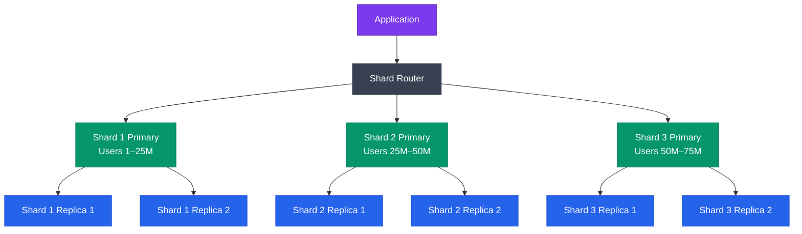

| | Replication | Sharding |
|---|---|---|
| Purpose | Read scale, HA | Write scale, storage scale |
| Data on each node | Full copy | Partial subset |
| Writes | Only primary | Distributed across shards |
| Storage per node | Full dataset | 1/N of dataset |
| Complexity | Moderate | Very High |
| Queries | Full SQL freedom | Restricted by shard key |

**Interview Tip:** Always mention that real systems combine both — sharding for horizontal scale, replication within each shard for fault tolerance.

---

## 4. Sharding Strategies — The Four Ways to Split

### Strategy 1: Hash-Based Sharding

**Analogy:** Imagine you have 1000 balls numbered 1 to 1000 and 4 boxes. You throw each ball — wherever it lands, it stays. The distribution is random but roughly even.

**Basically kya hota hai:**
```
shard_number = hash(shard_key) % total_shards

Example with 4 shards:
user_id=1001 → hash(1001) = 3,456,789 → 3,456,789 % 4 = 1 → Shard 1
user_id=1002 → hash(1002) = 8,901,234 → 8,901,234 % 4 = 2 → Shard 2
user_id=1003 → hash(1003) = 2,345,678 → 2,345,678 % 4 = 3 → Shard 3
user_id=1004 → hash(1004) = 6,789,012 → 6,789,012 % 4 = 0 → Shard 0
user_id=1005 → hash(1005) = 1,234,567 → 1,234,567 % 4 = 3 → Shard 3
```

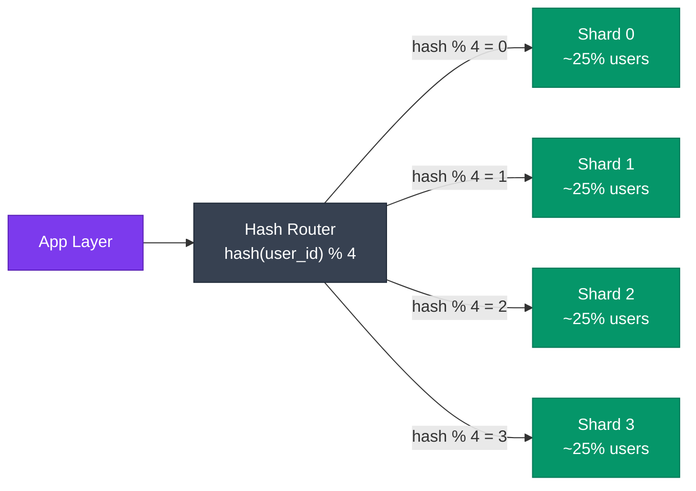

**Pros:**
- Even data distribution — no shard gets more data than others
- No hotspots (assuming high cardinality key)
- Simple routing logic

**Cons:**
- **Resharding is painful** — if you go from 4 shards to 5 shards, `hash % 5` gives completely different results. Nearly ALL data must move. (Consistent hashing solves this — see Section 5)
- **Range queries are impossible** — "get all users created between Jan and March" requires hitting ALL shards
- No data locality — related records may scatter across shards

**Real Use:** Instagram uses hash-based sharding on `user_id` for their Postgres setup. YouTube uses it internally for their metadata stores.

### Strategy 2: Range-Based Sharding

**Analogy:** A dictionary — words starting with A-E in Volume 1, F-J in Volume 2, and so on. You know exactly which volume to open.

**Basically kya hota hai:**
```
Split by value ranges of the shard key:

User IDs:
─────────
Shard 1: user_id    1  –  1,000,000
Shard 2: user_id 1,000,001  –  2,000,000
Shard 3: user_id 2,000,001  –  3,000,000
Shard 4: user_id 3,000,001  –  4,000,000

Date-based (time-series data):
─────────────────────────────
Shard 1: orders created in 2022
Shard 2: orders created in 2023
Shard 3: orders created in 2024

Query routing:
SELECT * WHERE user_id = 1,500,000
→ Router: "1,500,000 is in range [1M–2M]" → Shard 2 ✅

Range query:
SELECT * WHERE user_id BETWEEN 1,200,000 AND 1,800,000
→ Hits only Shard 2 ✅
```

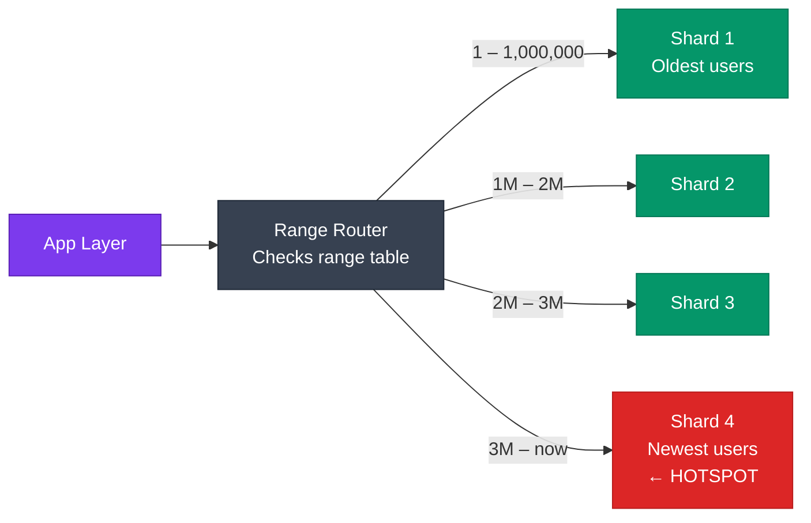

**Pros:**
- Range queries work efficiently — `BETWEEN`, `ORDER BY`, `WHERE date > X` all work
- Easy to add new ranges — just create a new shard for new data
- Predictable routing — no hashing required

**Cons:**
- **Hotspot risk** — if using sequential IDs (auto-increment), ALL new writes go to the last shard. Shard 4 is always hot while Shards 1-3 are idle.
- Uneven distribution — some ranges may have 10x more data than others
- Requires careful planning of range boundaries

**Real Use:** Time-series databases like InfluxDB and TimescaleDB use range-based partitioning on timestamps. Swiggy uses date-range sharding for their order history tables.

### Strategy 3: Directory-Based Sharding

**Analogy:** A hotel receptionist with a physical room registry. Every guest checks in, receptionist writes their name and room number in a book. When someone calls asking for "Rahul Sharma", receptionist looks up the book and says "Room 304". The book is the lookup table.

**Basically kya hota hai:**
```
A separate lookup table (usually in Redis or a fast DB) maps:
    key → shard_id

Lookup Table:
user:1001 → Shard 3
user:1002 → Shard 1
user:1003 → Shard 3
user:1004 → Shard 2
user:1005 → Shard 4

Query flow:
1. App: "Give me user 1003"
2. Router → Lookup Table: "Where is user 1003?" → Shard 3
3. Router → Shard 3: "SELECT * FROM users WHERE id = 1003"
4. Returns result to App
```

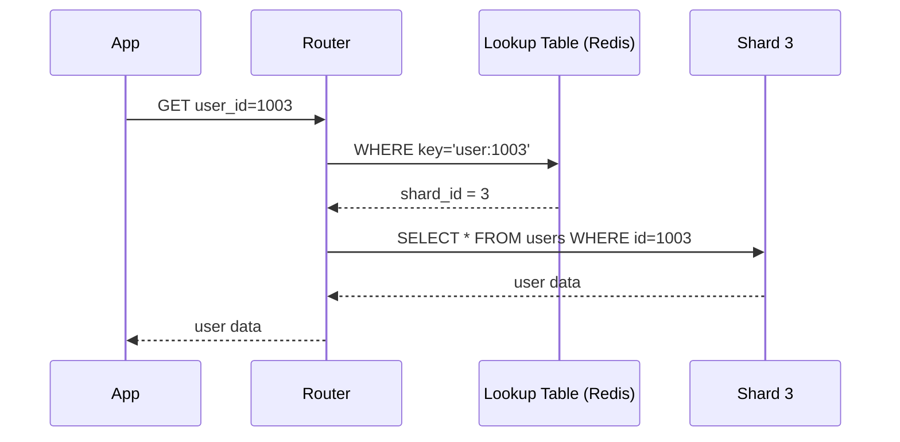

**Pros:**
- Maximum flexibility — move data between shards by just updating the lookup table
- No formula constraints — you can place any user on any shard
- Easy to implement custom placement logic (e.g., VIP users on faster shards)
- Resharding is just a lookup table update

**Cons:**
- **Lookup table is a bottleneck** — every single query needs to hit it first
- **Single Point of Failure** — if lookup table is down, nothing works
- Extra network hop on every query
- Lookup table itself can become huge with billions of keys
- Must keep lookup consistent with actual data — very tricky

**Real Use:** Vitess (YouTube's MySQL sharding layer) uses a variant of directory-based sharding internally for its VSchema.

### Strategy 4: Geographic Sharding

**Analogy:** A multinational company has offices in Mumbai, New York, London, and Singapore. Customer data stays in the nearest regional office. A Mumbai customer's data lives in the Mumbai office — low latency, data locality laws satisfied.

**Basically kya hota hai:**
```
Route data based on geographic location of the user or data:

Users in India     → India Shard  (Mumbai data center)
Users in US/Canada → US Shard     (Virginia data center)
Users in Europe    → EU Shard     (Frankfurt data center)
Users in APAC      → APAC Shard   (Singapore data center)
```

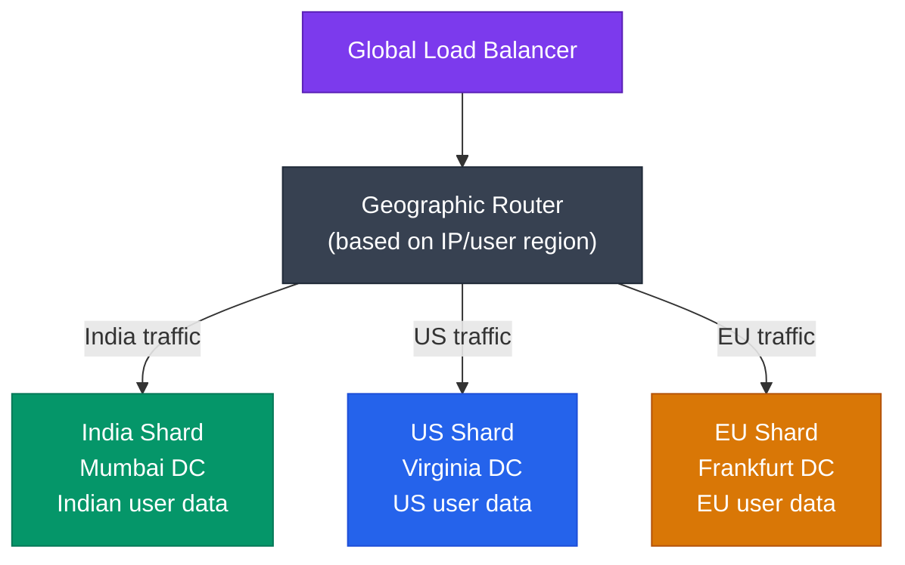

**Pros:**
- Low latency — Indian users hit Indian servers
- Data residency compliance — GDPR requires EU user data to stay in EU
- Natural isolation — regional issues don't affect other regions
- Regulatory compliance (India's data localization laws, GDPR, etc.)

**Cons:**
- Cross-region queries are very slow (network latency across continents)
- Uneven distribution — India may have 2x more users than expected
- A viral event in one region can still cause hotspots
- Harder to handle users who travel between regions

**Real Use:** Netflix has regional shards. WhatsApp routes data geographically. Zomato keeps Indian user data in Indian data centers for compliance.

### Strategy Comparison Table

| Factor | Hash | Range | Directory | Geographic |
|--------|------|-------|-----------|------------|
| Data distribution | Even | Uneven (hotspot risk) | Flexible | Depends on region size |
| Range queries | No (all shards) | Yes (single shard) | Depends | Yes (within region) |
| Hotspot risk | Low | High (latest shard) | Manageable | Medium |
| Resharding cost | Very High | Medium | Low | Medium |
| Routing overhead | Low | Low | High (lookup) | Low |
| Compliance | No | No | No | Yes (GDPR etc.) |
| Best for | User data | Time-series | Custom rules | Global apps |

---

## 5. Consistent Hashing — The Smart Way to Hash

### The Problem With Simple Modulo Hashing

**Yeh kyun important hai** — this is the most common interview follow-up question after sharding.

Simple hash sharding uses: `shard = hash(key) % N`

What happens when you add a new shard (N changes from 4 to 5)?

```
Before — 4 shards (hash % 4):
────────────────────────────────
user_id=100 → hash=400 → 400 % 4 = 0 → Shard 0
user_id=200 → hash=600 → 600 % 4 = 2 → Shard 2
user_id=300 → hash=900 → 900 % 4 = 1 → Shard 1
user_id=400 → hash=200 → 200 % 4 = 2 → Shard 2

After — 5 shards (hash % 5):
────────────────────────────────
user_id=100 → hash=400 → 400 % 5 = 0 → Shard 0  (stayed)
user_id=200 → hash=600 → 600 % 5 = 0 → Shard 0  ← MOVED from Shard 2!
user_id=300 → hash=900 → 900 % 5 = 0 → Shard 0  ← MOVED from Shard 1!
user_id=400 → hash=200 → 200 % 5 = 0 → Shard 0  ← MOVED from Shard 2!

Problem: ~80% of all data needs to MOVE when you add just 1 shard!
At Instagram's scale = petabytes of migration. Nightmare.
```

### Consistent Hashing — The Fix

**Analogy:** Imagine a circular clock. Nodes are placed at different positions on the clock. Data is also placed at a position on the clock. Each data item "belongs" to the nearest clockwise node. When you add a new node, only the data between the old node and the new node needs to move — everything else stays.

**We covered this deeply in Chapter 15 (Consistent Hashing)** — please refer to `../15-consistent-hashing/README.md` for the full deep dive. Key points for sharding context:

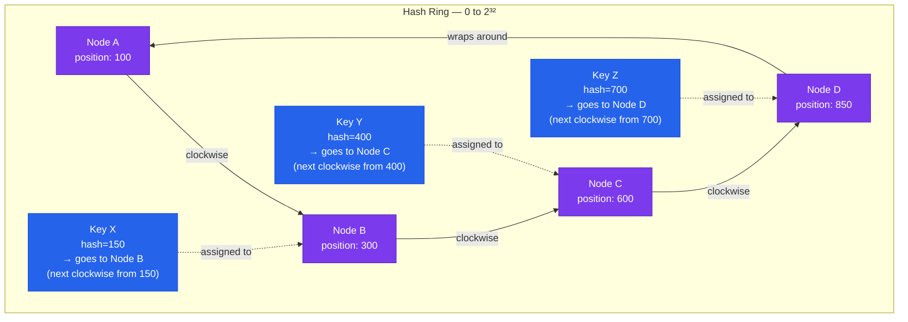

**Adding a new node (Node E at position 500):**
```
Before: Keys with hash 301–600 → Node C
After:  Keys with hash 301–500 → Node E (new)
        Keys with hash 501–600 → Node C (unchanged)

Only ~25% of data moves (1/N), not 80%+
```

**Virtual Nodes:** To avoid uneven distribution (what if Node A's position has most keys?), each physical node gets placed at multiple positions on the ring (e.g., 100-150 virtual nodes each). This spreads the load evenly.

**Key Takeaway for Interviews:** Consistent hashing means adding or removing a shard only moves `1/N` of the data, not everything. This is why modern sharding systems use it.

---

## 6. Shard Key Selection — The Most Critical Decision

**Simple baat hai** — your shard key is the column or set of columns you use to decide which shard a row lives on. Choose wrong, and your entire sharding scheme breaks. You cannot easily change it later — it would require a full migration.

**Think of it like choosing which city to live in. Once you buy a house, moving is painful.**

### What Makes a Good Shard Key?

**1. High Cardinality**
```
Good ✅ — user_id (100 million unique values)
Bad  ❌ — country (only ~200 values)
Bad  ❌ — gender (only 2-3 values — you'd get 2 shards max!)
Bad  ❌ — status (active/inactive — terrible!)

Low cardinality = few shards possible = defeats the purpose
```

**2. Even Distribution**
```
Good ✅ — user_id (IDs are evenly distributed by design)
Bad  ❌ — created_at as range key (new users keep going to last shard)
Bad  ❌ — city (Mumbai may have 10x more users than Leh)
Bad  ❌ — auto-increment ID as range key (always writes to last shard)
```

**3. Query Locality**
```
Good ✅ — user_id if 90% of queries are "get all data for user X"
         → user's posts, orders, comments all on same shard
         → single-shard queries

Bad  ❌ — product_category if queries join users + orders + products
         → related data scattered across different shards
         → expensive scatter-gather
```

**4. Immutability**
```
Good ✅ — user_id (never changes after account creation)
Good ✅ — order_id (never changes)
Bad  ❌ — email (users change email → data must move between shards!)
Bad  ❌ — username (same issue)

If the shard key changes, you must physically move the row to a new shard.
At scale, this is catastrophic.
```

**5. Avoids Hot Shards**
```
Bad  ❌ — Monotonically increasing ID with range sharding:
          All new writes → Shard N (last shard always hot)
          Old shards → Mostly reads (cold)

Bad  ❌ — celebrity_user_id as key:
          Virat Kohli's shard → 200M followers reading from it
          (See hotspot section for solutions)
```

### The Monotonically Increasing ID Problem (Very Common Bug)

```
If shard_key = auto_increment_id AND strategy = range sharding:

Time 0:  Insert IDs  1–1000     → All go to Shard 1
Time 1:  Insert IDs 1001–2000   → All go to Shard 2
Time 2:  Insert IDs 2001–3000   → All go to Shard 3

Current state:
Shard 1 (IDs 1-1000): Zero writes, only old reads
Shard 2 (IDs 1001-2000): Minimal writes
Shard 3 (IDs 2001-3000): 100% of ALL new writes ← HOTSPOT

This defeats the entire purpose of sharding!

Fix:
✅ Use random UUIDs as primary key (not sequential IDs)
✅ Use Snowflake IDs (time-based but spread across machines)
✅ Use hash-based sharding instead of range
```

### Composite Shard Keys

Sometimes a single key is not enough:

```
Multi-tenant SaaS example (like a B2B app):

Shard by tenant_id alone:
→ Small tenants: tiny shards, wasted space
→ Large tenants: massive shards, hotspot

Shard by (tenant_id, user_id) composite key:
→ All of tenant 42's data on one shard (tenant isolation)
→ Within tenant 42, users are spread across rows
→ Queries for "all data in tenant 42" → single shard ✅
→ Even distribution across tenants ✅

MongoDB example:
sh.shardCollection("mydb.users", { tenant_id: 1, user_id: 1 })
```

---

## 7. The Hotspot Problem — The Celebrity Tweet Problem

**Analogy:** Imagine a library (from our opening analogy) suddenly gets a book signed by Shah Rukh Khan. Literally everyone wants to see it. Building A (where it's stored) has 10,000 people queued outside, while Buildings B, C, D have nobody. The distribution is perfectly even for everything EXCEPT Shah Rukh Khan's book.

**Yeh kyun important hai** — even with a perfect shard key, some shards will get disproportionate traffic due to the nature of the data.

### The Scenario

```
Twitter/X — Tweet Storage
─────────────────────────
Shard key = user_id
Sharding strategy = hash-based

Normal user (1000 followers):
→ User reads their tweets → hits 1 shard → manageable

Elon Musk (100M followers):
→ 100M people loading Elon's tweets → ALL hit Elon's shard
→ That single shard receives 100,000x normal traffic
→ Other shards: idle
→ Elon's shard: on fire

The shard key choice was correct (user_id)
But the DATA is inherently skewed
```

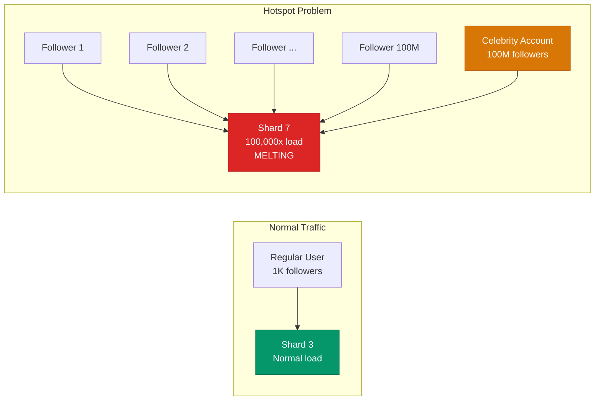

### Solutions to the Hotspot Problem

**Solution 1: Add Read Replicas to Hot Shards**
```
Shard 7 (Elon's shard) is read-heavy:
─────────────────────────────────────
Primary: handles writes
Replica 1–10: handle reads

Cost: More servers, but quick fix
Limitation: Does not fix write hotspots
```

**Solution 2: Aggressive Caching at Application Layer**
```
Celebrity tweets cached in Redis for 60 seconds:
─────────────────────────────────────────────────
First request → hits Shard 7 → cache result in Redis
Next 1M requests → hit Redis cache → Shard 7 not touched

Works great for: read-heavy celebrity accounts
Does not work for: writes (e.g., a celebrity posting rapidly)
```

**Solution 3: Key Salting — Split the Hotspot**
```
Instead of one key for celebrity:
    user_id = 9999 (Elon's account)
    → All reads go to Shard: hash(9999) % 10 = Shard 3

Use a "salted" key — append a random suffix:
    user_id_salt = 9999_1, 9999_2, ..., 9999_10

Writes:
    Elon's tweet → written to ALL 10 salt variants
    → Spread across 10 different shards

Reads:
    Read from a random salt variant (9999_random(1-10))
    → 10x distributed reads

Trade-off:
✅ 10x reduction in hotspot intensity
❌ 10x storage for celebrity data
❌ Complex write logic (fan-out)
❌ Read aggregation needed for counts, likes
```

**Solution 4: Fan-Out on Write (Twitter's actual approach)**
```
When Elon posts a tweet:
1. Write tweet to Elon's shard (one write)
2. Fan-out service pushes tweet_id to each follower's feed
   → 100M followers each get the tweet_id in their feed table
3. When follower loads feed → just read their own feed table
   (which is on their shard, not Elon's shard)

Result:
✅ No read hotspot on Elon's shard at read time
✅ Followers read from their own shard (distributed reads)
❌ Massive write fan-out on every celebrity post
❌ Very active celebrities (100M followers) = expensive writes

Twitter actually uses a hybrid:
- Regular users: fan-out on write
- Celebrities: fan-out on read (live computation)
- See chapter on News Feed Design
```

---

## 8. Cross-Shard Operations — The Painful Reality

**Analogy:** You want to know the total spending of all customers whose first name starts with "A" AND who ordered from "Italian" category. In our library analogy — the names A-F are in Building A, but the book categories are spread across all buildings. You have to visit all 4 buildings and compile the answer yourself.

### The Cross-Shard JOIN Problem

```
Without sharding (single DB):
──────────────────────────────
SELECT u.name, SUM(o.amount) as total_spent
FROM users u
JOIN orders o ON u.id = o.user_id
WHERE u.country = 'IN'
GROUP BY u.name

→ One query, database handles JOIN efficiently
→ Result in milliseconds

With sharding (users on user_id shard, orders on order_id shard):
──────────────────────────────────────────────────────────────────
Problem: users and orders may be on DIFFERENT shards

user_id=1001 → hash % 4 = 1 → Shard 1 (users table)
order by user_id=1001 → also hash on user_id → Shard 1 ✅ (if co-located)

But if orders are sharded separately on order_id:
order_id=5001, user_id=1001 → hash(5001) % 4 = 3 → Shard 3 (different!)

Now you cannot JOIN — they are on different machines.
```

### Solutions for Cross-Shard Queries

**Option 1: Scatter-Gather**
```
1. Send query to ALL shards in parallel
2. Collect results from all shards
3. Merge/join in application layer

SELECT * FROM orders WHERE status='pending'

→ Send to Shard 1, 2, 3, 4 simultaneously
→ Each returns its local pending orders
→ Application merges results

✅ Works for any query
❌ Slow for large result sets (network overhead)
❌ Complex aggregation in application
❌ Hard to paginate correctly
```

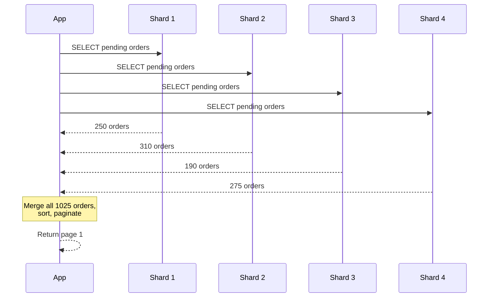

**Option 2: Denormalization and Co-location**
```
Strategy: Store related data together in the same shard

Instead of:
Users table → sharded by user_id
Orders table → sharded by order_id (WRONG — they separate)

Do this:
Users table → sharded by user_id
Orders table → ALSO sharded by user_id (same key!)
→ user_id=1001's user row and all their orders land on the same shard
→ JOINs within the shard work normally

For NoSQL (MongoDB):
{
  _id: "user_1001",
  name: "Priya Sharma",
  country: "IN",
  orders: [                    // embed orders inside user document
    { order_id: 5001, amount: 599, status: "delivered" },
    { order_id: 5002, amount: 1299, status: "pending" }
  ]
}
→ Everything for user_1001 is in one document, one shard
✅ Fast reads for user-centric queries
❌ Data duplication
❌ Document size grows unboundedly (10,000 orders? Problem.)
```

**Option 3: Avoid Cross-Shard JOINs By Design**
```
The best solution is: DESIGN your sharding so most queries
don't need to cross shards.

Rule: Shard key = the entity that your most common queries are about.

If 90% of queries are "show me everything for user X":
→ Shard by user_id
→ User, orders, posts, comments for that user all on same shard
→ Zero cross-shard queries for 90% of traffic

The remaining 10% (analytics, admin queries)?
→ Use a separate analytics database (BigQuery, Redshift)
→ Run async ETL to feed it from all shards
→ Don't try to do analytics on your sharded OLTP database
```

### Distributed Transactions Across Shards

**Scenario:** Transfer Rs 500 from Rahul's account (Shard 1) to Priya's account (Shard 3). How do you ensure atomicity?

```
Option 1: Two-Phase Commit (2PC)
─────────────────────────────────
Phase 1 — Prepare:
  Coordinator → Shard 1: "Prepare to debit Rahul Rs 500"
  Coordinator → Shard 3: "Prepare to credit Priya Rs 500"
  Both lock the rows and reply: "Ready"

Phase 2 — Commit:
  Coordinator → Shard 1: "COMMIT"
  Coordinator → Shard 3: "COMMIT"
  Both apply changes and release locks

Problem:
❌ Coordinator is SPOF (if it dies between phases → stuck forever)
❌ Shards hold locks during entire protocol → blocks other transactions
❌ Slow — multiple network round trips
❌ Does not scale

Option 2: Saga Pattern (preferred at scale)
────────────────────────────────────────────
Break transaction into local steps with compensating actions:

Step 1: Debit Rahul on Shard 1 → SUCCESS
Step 2: Credit Priya on Shard 3 → FAIL
  → Compensating action: Re-credit Rahul on Shard 1

✅ No global lock
✅ Eventually consistent
✅ Scales well
❌ Not strictly atomic (window where Rahul is debited but Priya not credited)
❌ Complex to implement compensating transactions
❌ Harder to reason about correctness
```

**Design Advice:** Avoid distributed transactions as much as possible. Design your data model so related transactions happen within a single shard. If money transfers between accounts MUST be atomic, put both accounts on the same shard (by account_group or bank_branch_id).

---

## 9. Resharding — When You Need More Shards

**Analogy:** Your 4-building library system is full again. Books are literally on the floor. You need to build a 5th building AND redistribute some books from the 4 existing buildings — all while the library stays OPEN and people are borrowing books 24/7.

**Yeh kyun important hai** — resharding is one of the most operationally dangerous things you can do on a live system.

### When Do You Reshard?

```
Triggers for resharding:
─────────────────────────
1. Storage: A shard's disk is 80%+ full
2. CPU/Memory: A shard is consistently at 70%+ utilization
3. Throughput: Queries are timing out on specific shards
4. Hotspot: One shard handles 10x more traffic than others
5. Growth: You're adding capacity proactively
```

### The Resharding Process (Double-Write Migration)

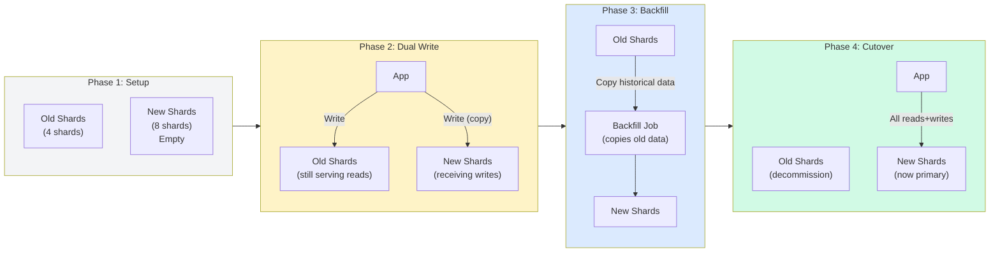

```
Step-by-step resharding:

Phase 1 — Setup (offline):
  - Provision new shards (empty databases)
  - Update routing config to know about new shards
  - But still routing ALL traffic to old shards

Phase 2 — Dual Write:
  - Every write goes to BOTH old and new shards
  - Old shards: still serving all reads
  - New shards: receiving all new writes (but missing old data)
  - New data is now consistent between old and new

Phase 3 — Backfill (can take days/weeks):
  - Background job reads old shard data
  - Writes it to the new correct shard (based on new routing)
  - Verify checksums: every row in old shard has matching row in new shard
  - This runs while system is live

Phase 4 — Cutover:
  - Reads switch to new shards (can be gradual: 1%, 10%, 100%)
  - Stop dual writes once old shards are decommissioned
  - Monitor for anomalies
  - Decommission old shards

Risk mitigation:
✅ Keep old shards around for rollback for at least 2 weeks
✅ Use feature flags to switch routing, not code deploys
✅ Do cutover during low-traffic window (3am-5am)
✅ Have rollback procedure ready before starting
```

### Why Consistent Hashing Minimizes Resharding Pain

```
Simple hash % N:
Going from 4 → 5 shards:
→ ~80% of all data must move
→ Weeks of migration, enormous risk

Consistent hashing:
Going from 4 → 5 shards:
→ Only ~20% (1/N) of data moves
→ Only the data between the old node's position and new node's position

This is why consistent hashing is the industry standard for sharding.
```

---

## 10. Application-Level vs Database-Level Sharding

**Basically kya hota hai** — who does the routing work? Your application code, or a middleware layer?

### Application-Level Sharding

```
Your application code contains the sharding logic:

class UserRepository:
    def get_shard(self, user_id):
        return hash(user_id) % self.num_shards

    def get_user(self, user_id):
        shard = self.get_shard(user_id)
        conn = self.connections[shard]
        return conn.execute("SELECT * FROM users WHERE id = ?", user_id)

    def save_user(self, user):
        shard = self.get_shard(user.id)
        conn = self.connections[shard]
        conn.execute("INSERT INTO users ...", user)
```

**Pros:**
- Full control over routing logic
- No extra infrastructure
- Can implement complex routing rules

**Cons:**
- Every application service must implement sharding logic
- Hard to change sharding strategy (requires code changes everywhere)
- Each service maintains its own connection pools to every shard
- Error-prone — one team forgets to shard and queries hit all DBs

### Database-Level / Middleware Sharding

A proxy or middleware layer sits between app and DB, handling routing transparently.

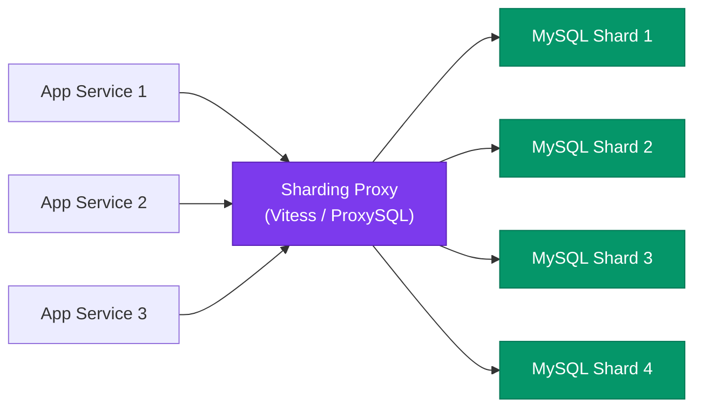

**Vitess (for MySQL) — YouTube's Open Source Solution:**
```
What Vitess does:
─────────────────
- Acts as a MySQL-compatible proxy
- App connects to Vitess as if it were a normal MySQL
- Vitess handles all sharding, routing, failover
- Manages resharding online (no downtime)
- Query rewrites: turns unsharded queries into scatter-gather

Created by: YouTube (to shard their MySQL at Google scale)
Used by: YouTube, Slack, GitHub, PlanetScale, Square

Config (VSchema):
{
  "sharded": true,
  "vindexes": {
    "user_id_vindex": {
      "type": "hash"
    }
  },
  "tables": {
    "users": {
      "column_vindexes": [
        { "column": "user_id", "name": "user_id_vindex" }
      ]
    }
  }
}
```

**Citus (for PostgreSQL) — Microsoft's Extension:**
```
What Citus does:
─────────────────
- A PostgreSQL EXTENSION (not a proxy — runs inside Postgres)
- Makes Postgres natively distributed
- One coordinator node + many worker nodes
- Regular Postgres SQL just works — sharding is transparent
- Used by: Multi-tenant SaaS, time-series analytics

-- Enable Citus
CREATE EXTENSION citus;

-- Declare a distributed table
SELECT create_distributed_table('users', 'user_id');
SELECT create_distributed_table('orders', 'user_id');
-- Both tables co-located on same shards → JOINs work!

-- This regular SQL now runs distributed:
SELECT u.name, COUNT(o.id) as order_count
FROM users u JOIN orders o ON u.id = o.user_id
GROUP BY u.name;
-- Citus automatically routes to correct shards, aggregates results
```

| | Vitess | Citus | App-level |
|---|---|---|---|
| Database | MySQL | PostgreSQL | Any |
| Transparency | High (proxy) | Very high (extension) | Low |
| SQL compatibility | Mostly compatible | Fully compatible | Depends |
| Resharding | Online, built-in | Built-in | Manual |
| Complexity | High setup | Medium setup | High code |
| Used by | YouTube, Slack | Microsoft, SaaS companies | Many startups |

---

## 11. Real World — How Instagram Shards PostgreSQL

**This is a legendary case study. Janoge toh achha lagega interview mein.**

### Instagram's Scale (2019 data)
```
- 1 billion monthly active users
- 500 million stories per day
- 100 million photos uploaded per day
- Petabytes of metadata in PostgreSQL
```

### Instagram's Sharding Approach

```
Primary shard key: user_id (logical shard)

Architecture:
─────────────
1. Logical Shards (Schemas):
   - 512 logical shards
   - Each logical shard = a PostgreSQL schema (not a separate DB)
   - Schema names: schema_0000 to schema_0511

2. Physical Shards (DB Clusters):
   - Multiple physical PostgreSQL clusters
   - Each cluster hosts MANY logical shards
   - Easy to redistribute: move logical shards between clusters

3. Mapping:
   user_id → logical_shard = user_id % 512
   logical_shard → physical_cluster = lookup table

Example:
user_id = 12345678
logical_shard = 12345678 % 512 = 78
physical_cluster = lookup("shard_0078") → cluster_4

Query goes to cluster_4, schema "schema_0078"
```

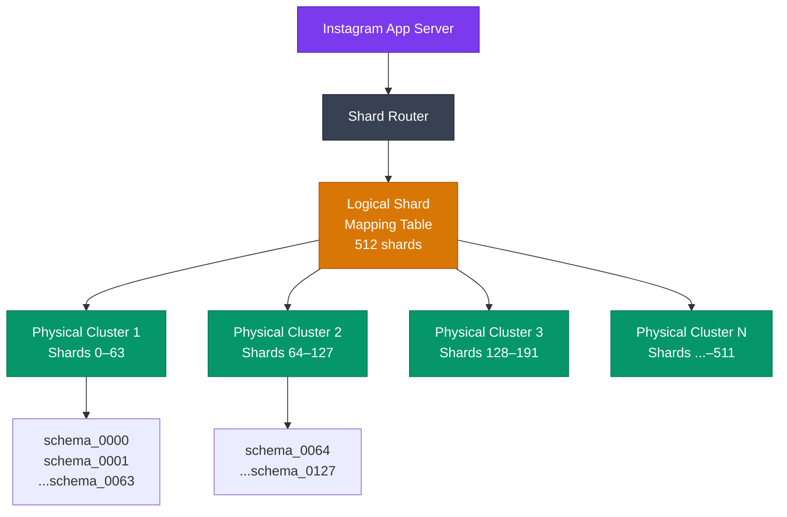

**Why this design is brilliant:**
```
Logical shards decouple from physical shards:
1. Add more physical clusters? Just move logical shards to new cluster
   → Update lookup table → No data migration needed for existing shards

2. One physical cluster getting hot?
   → Move some logical shards to another cluster
   → Change lookup table entry → Zero downtime

3. Each logical shard is a PostgreSQL schema:
   → Full SQL within a shard
   → Postgres replication within cluster for HA
   → All of user X's data (posts, followers, stories) in one schema

The 512 logical shards number is deliberate:
→ Enough granularity for redistribution
→ Not so many that management becomes impossible
→ Powers of 2 make routing math simple
```

**Key Instagram Lessons:**
```
1. Shard by user_id — most queries are user-centric
2. Use logical shards (indirection layer) for flexibility
3. PostgreSQL handles per-shard logic, application handles routing
4. Django's ORM sits on top — developers mostly don't see sharding
5. All media (photos/videos) → separate CDN/object storage (S3)
   Only metadata sharded in Postgres
```

---

## 12. Interview Deep Dive — "How Would You Shard the Twitter Database?"

**Yeh question almost guaranteed hai in senior roles. Let us walk through it.**

### Step 1: Understand the Data Model

```
Twitter core entities:
- Users (user_id, name, bio, follower_count, ...)
- Tweets (tweet_id, user_id, content, created_at, like_count, ...)
- Followers (follower_id, followee_id, created_at)
- Likes (tweet_id, user_id, created_at)
- Timeline/Feed (user_id, tweet_id, created_at)

Scale:
- 400 million registered users
- 500 million tweets per day
- 200 billion tweets in history
- Peak: 10,000+ tweets/second
- 300,000 reads/second
```

### Step 2: Identify Access Patterns

```
Most frequent queries:
1. GET user profile → by user_id
2. GET user's tweets → by user_id (WHERE user_id = X ORDER BY created_at DESC)
3. GET home timeline → by user_id (their feed)
4. GET tweet detail → by tweet_id
5. POST new tweet → by user_id
6. GET followers/following → by user_id

Notice: 90% of queries are user-centric.
→ Shard key should be user_id for users table and timeline table.
→ Tweets table: also shard by user_id (not tweet_id!)
```

### Step 3: Propose the Sharding Architecture

```
Primary decision: Shard by user_id using consistent hashing

Tables and their shard keys:
─────────────────────────────
1. users table          → shard_key = user_id
2. tweets table         → shard_key = user_id (NOT tweet_id)
   → "All tweets by user X" → single shard query
3. timeline table       → shard_key = user_id (the viewer)
   → "Show home feed for user X" → single shard query
4. followers table      → shard_key = followee_id
   → "Who follows user X?" → single shard query

Why tweet table is sharded by user_id (not tweet_id):
→ Main query: "Get all tweets by user X"
→ If sharded by tweet_id, tweets by same user scatter across all shards
→ Every "user profile" page would require scatter-gather across all shards
```

### Step 4: Handle the Celebrity Problem

```
The Elon Musk Problem:
Elon has 100M followers.
Every follower loading home feed → needs Elon's latest tweet.
Elon's shard → 100M concurrent reads.

Solutions:

1. Cache celebrity tweets aggressively:
   - Celebrity tweets → in Redis with TTL=30s
   - 100M users → hit Redis, not Elon's shard
   - Cache miss rate: <0.01%

2. Pre-computed timelines (fan-out on write):
   - When Elon tweets → push tweet_id to 100M followers' timeline tables
   - Follower loads feed → reads their own timeline table (own shard)
   - Elon's shard not touched at read time

3. Threshold-based hybrid:
   - Users with < 1M followers → fan-out on write
   - Users with > 1M followers (celebrities) → fan-out on read
   - Only ~1000 accounts above threshold
```

### Step 5: Handle Cross-Shard Operations

```
Global trending tweets:
→ Cannot be determined from one shard
→ Solution: Real-time stream processing (Kafka → Spark/Flink)
  Each shard publishes tweet events to Kafka
  Trending service aggregates across all shards
  Results cached in Redis

Search:
→ Cannot query all shards for keyword
→ Solution: Separate search index (Elasticsearch)
  All tweets indexed in Elasticsearch (not sharded DBs)
  Search queries go to Elasticsearch, not shards

Analytics:
→ Report: "How many tweets per day globally?"
→ Solution: Separate data warehouse (BigQuery/Redshift)
  Daily ETL from all shards → data warehouse
  Analytics queries hit warehouse, not shards
```

### Step 6: Resharding Plan

```
Start: 64 shards (enough for 400M users at 6.25M per shard)
When a shard hits 70% capacity → split that shard

Consistent hashing ring:
- Adding 1 shard → only 1/65 of data moves
- Use virtual nodes (150 per physical shard) for even distribution
- Double-write migration during shard splits

Growth plan:
64 shards → 128 shards → 256 shards
Each doubling: half the data moves (consistent hashing manages this)
```

### Sample Interview Response Structure

```
1. "First, let me understand the scale and access patterns..."
   → State the numbers, identify that 90% of queries are user-centric

2. "The primary shard key should be user_id..."
   → Justify: high cardinality, immutable, query locality

3. "I'd use consistent hashing to distribute across 64 initial shards..."
   → Mention virtual nodes for even distribution

4. "For celebrities/hotspots, I'd use a combination of..."
   → Cache + fan-out hybrid approach

5. "Cross-shard analytics and search would use a separate system..."
   → Kafka, Elasticsearch, data warehouse

6. "For resharding, consistent hashing means only 1/N data moves..."
   → Double-write migration strategy

7. "I'd implement this with application-level sharding first,
    and consider Vitess if MySQL is the choice..."
```

---

## 13. Common Interview Questions

### Question 1: "What is sharding and when would you use it?"

```
Answer framework:
1. Define: horizontal partitioning of data across multiple database instances
2. When: write throughput > what one DB can handle, OR storage > what one disk can hold
3. Before sharding: try vertical scaling → read replicas → caching
4. Shard as a last resort (enormous complexity)
```

### Question 2: "What is the difference between sharding and replication?"

```
Replication = same data on multiple servers (read scale, HA)
Sharding = different data on different servers (write scale, storage scale)
Production systems use BOTH: each shard is also replicated.
```

### Question 3: "How do you choose a shard key?"

```
Criteria:
1. High cardinality (many unique values)
2. Even distribution (data spreads evenly)
3. Query locality (most queries touch one shard)
4. Immutable (never changes after insert)
5. Avoids creating hot shards

Anti-patterns: sequential auto-increment IDs, low cardinality fields,
               fields that change (email), fields that concentrate traffic
```

### Question 4: "What is consistent hashing and why is it used in sharding?"

```
Simple hash % N: adding 1 shard moves 80% of data
Consistent hashing ring: adding 1 shard moves 1/N of data

Nodes placed at positions on a circular ring.
Data assigned to nearest clockwise node.
Adding new node → only neighbor's data moves.

Reference: Chapter 15 (Consistent Hashing) for deep dive.
```

### Question 5: "How would you handle a hotspot shard?"

```
1. Read replicas for read-heavy hotspots
2. Caching (Redis) to absorb repeated reads
3. Key salting: append random suffix, distribute writes to sub-shards
4. Fan-out on write for celebrity/viral content
5. Rate limiting: protect the hot shard
6. Async processing: queue writes, apply in batches
```

### Question 6: "How do you do JOINs across shards?"

```
You generally can't do SQL JOINs across shards.
Solutions:
1. Design sharding so related data is co-located (same shard key)
2. Denormalize: embed related data in same document
3. Scatter-gather: query all shards, merge in application
4. Separate analytics DB for complex cross-shard queries
5. Avoid the need: choose shard key based on your JOIN patterns
```

### Question 7: "When would you NOT shard?"

```
Don't shard when:
1. Data fits on one server (< 1TB usually)
2. Read replicas solve your scale problem
3. Caching eliminates most DB load
4. Vertical scaling (bigger server) is still cost-effective
5. You have complex relational queries that require JOINs
6. Your team lacks experience (sharding dramatically increases operational burden)

Golden rule: Shard as late as possible.
Most startups never need it. Instagram didn't shard for years.
```

### Question 8: "How would you migrate from a single DB to sharded DB?"

```
Step 1: Add a logical sharding layer in application (route by shard key,
        but all point to same DB) — zero change to data

Step 2: Add read replicas to each "logical shard" — test routing

Step 3: Split one shard first (canary migration)
        Double-write to old and new
        Verify data consistency
        Switch reads to new shard

Step 4: Migrate remaining shards one by one

Step 5: Monitor, keep old shards for rollback period

Never migrate everything at once.
```

---

## 14. Summary and Trade-Offs

```
┌─────────────────────────────────────────────────────────────────┐
│                    SHARDING — TRADE-OFF MATRIX                  │
├──────────────────┬──────────────────┬───────────────────────────┤
│ Concern          │ With Sharding    │ Without Sharding           │
├──────────────────┼──────────────────┼───────────────────────────┤
│ Write throughput │ Scales linearly  │ Limited by one machine     │
│ Storage          │ Near unlimited   │ One disk's capacity        │
│ Read throughput  │ Good (+ replicas)│ Good with replicas         │
│ Cross-shard JOIN │ Very slow/painful│ Fast, native SQL           │
│ Transactions     │ Complex (Saga)   │ Simple ACID                │
│ Operations       │ Very complex     │ Simple                     │
│ Resharding       │ Painful, risky   │ N/A                        │
│ SQL flexibility  │ Restricted       │ Full SQL freedom           │
│ Developer UX     │ Hard             │ Easy                       │
│ Cost at scale    │ Linear, efficient│ Exponential (vertical)     │
└──────────────────┴──────────────────┴───────────────────────────┘
```

---

## 15. Key Takeaways

```
╔══════════════════════════════════════════════════════════════════╗
║                    KEY TAKEAWAYS — SHARDING                      ║
╠══════════════════════════════════════════════════════════════════╣
║                                                                  ║
║  1. SHARD LAST                                                   ║
║     Try vertical scaling → read replicas → caching first.       ║
║     Sharding is a last resort, not a first move.                 ║
║                                                                  ║
║  2. SHARD KEY IS PERMANENT                                       ║
║     Choose wrong and you face hotspots, cross-shard JOINs,      ║
║     or a full data migration. Think carefully upfront.           ║
║                                                                  ║
║  3. SHARDING ≠ REPLICATION                                       ║
║     Sharding = split data (write scale + storage scale)          ║
║     Replication = copy data (read scale + HA)                    ║
║     Production systems use BOTH.                                 ║
║                                                                  ║
║  4. CONSISTENT HASHING > SIMPLE MODULO                          ║
║     Adding/removing shards moves 1/N data, not all data.        ║
║     Virtual nodes ensure even distribution.                      ║
║                                                                  ║
║  5. CO-LOCATE RELATED DATA                                       ║
║     Shard users, orders, posts by the SAME shard key.           ║
║     Makes most queries single-shard, not scatter-gather.        ║
║                                                                  ║
║  6. DESIGN AROUND YOUR HOTSPOTS                                  ║
║     Celebrity accounts, viral content, sequential IDs —         ║
║     all create hotspots. Address with caching + fan-out.        ║
║                                                                  ║
║  7. ANALYTICS GOES ELSEWHERE                                     ║
║     Cross-shard analytics → Kafka → data warehouse.             ║
║     Never run OLAP queries on your sharded OLTP database.       ║
║                                                                  ║
║  8. TOOLS: VITESS (MySQL), CITUS (PostgreSQL)                   ║
║     These handle sharding at the infrastructure layer,          ║
║     reducing application complexity significantly.              ║
║                                                                  ║
║  9. INSTAGRAM PATTERN: LOGICAL → PHYSICAL                       ║
║     512 logical shards → N physical clusters.                   ║
║     Decoupling allows resharding without data migration.        ║
║                                                                  ║
║  10. INTERVIEW FORMULA                                           ║
║      Scale → Access patterns → Shard key → Strategy →          ║
║      Hotspot handling → Cross-shard queries → Resharding plan   ║
║                                                                  ║
╚══════════════════════════════════════════════════════════════════╝
```

---

## Practice Problem

**Design sharding for a food delivery app (like Zomato/Swiggy)**

```
Requirements:
─────────────
- 50 million users across India
- 500,000 restaurant partners
- 5 million orders per day (peak: 100,000 orders/hour at dinner)
- Each order has: user, restaurant, items, delivery partner, location
- Queries: "Show my order history", "Restaurant's orders today",
           "Find restaurants near me", "Trending restaurants in Mumbai"

Questions:
1. What shard key would you choose for the orders table?
2. What shard key for the restaurants table?
3. How would you handle "trending restaurants in Mumbai" (cross-shard)?
4. What about the "find restaurants near me" query?
5. How would you handle peak dinner traffic (6pm-9pm)?
```

<details>
<summary>Solution (Click to Expand)</summary>

```
1. Orders table shard key: user_id
   ──────────────────────────────
   Most queries: "Show my order history" → user-centric
   user_id = high cardinality, immutable, query locality
   Exception: "Restaurant's orders today" needs separate access pattern

   Option B: Shard by (city, user_id) for geographic isolation
   → Indian cities naturally segment traffic
   → But cross-city users become a problem

2. Restaurants table shard key: city + restaurant_id
   ────────────────────────────────────────────────
   Restaurants are geo-local — a Mumbai restaurant serves Mumbai users
   Geographic sharding makes sense here
   "Find restaurants near me" → hits city shard only

3. Trending restaurants: separate service
   ─────────────────────────────────────
   Kafka stream from all order events
   Trending service counts orders per restaurant per city (last 1hr)
   Results cached in Redis, refreshed every 5 minutes
   Never query the order shards for trending

4. Geospatial search: specialized index
   ─────────────────────────────────────
   Restaurant locations indexed in PostGIS or Elasticsearch with geo-index
   "Find restaurants within 5km" → hits geo-index (not order shards)
   Restaurant metadata denormalized into search index

5. Peak dinner traffic:
   ──────────────────
   Read replicas on restaurant shards (menu reads are heavy during order)
   Order writes distributed by user_id → no single shard bottleneck
   Redis cache for restaurant menus (menu doesn't change mid-service)
   Pre-scale servers at 5pm before dinner rush (predictable pattern)
```

</details>

---

## Next Steps

- [Consistent Hashing (Deep Dive)](../15-consistent-hashing/README.md) — the algorithm that makes resharding practical
- [Replication](../16-replication/README.md) — how data is copied within each shard for fault tolerance
- [CAP Theorem](../07-cap-theorem/README.md) — consistency vs availability trade-offs in distributed systems
- [NoSQL Databases](../17-nosql/README.md) — many NoSQL DBs have sharding built-in (Cassandra, MongoDB)

---

*Sharding sabse complex topic hai distributed systems mein. If you understand it deeply — the why, the how, and the trade-offs — you can tackle any system design interview question involving large-scale databases. The key insight: your shard key is your destiny. Choose it based on your access patterns, not on what seems "obvious" at first glance.*
