# Database Replication

> "Replication is not backup. It is the art of having the same important data in multiple places — so if one copy is destroyed, others survive."

---

## Table of Contents

1. [What is Replication?](#1-what-is-replication)
2. [Why Replication Exists](#2-why-replication-exists)
3. [Single-Leader Replication (Primary-Replica)](#3-single-leader-replication)
4. [Synchronous vs Asynchronous Replication](#4-synchronous-vs-asynchronous-replication)
5. [Replication Lag and the Read-Your-Writes Problem](#5-replication-lag)
6. [Multi-Leader Replication](#6-multi-leader-replication)
7. [Leaderless Replication (Quorum-Based)](#7-leaderless-replication)
8. [Failover: What Happens When Primary Dies](#8-failover)
9. [Split-Brain: The Scary Problem](#9-split-brain)
10. [Read Replicas for Scaling](#10-read-replicas-for-scaling)
11. [Replication in Real Systems](#11-replication-in-real-systems)
12. [Replication Topologies](#12-replication-topologies)
13. [Trade-offs Summary](#13-trade-offs-summary)
14. [Common Interview Questions](#14-common-interview-questions)
15. [Key Takeaways](#15-key-takeaways)

---

## 1. What is Replication?

### The Analogy — Photocopying Important Documents

Sochte hain — tumhare paas ek bahut important document hai: passport, property papers, bank certificate. Tum kya karte ho? Photocopy banate ho. Ek copy locker mein, ek copy ghar par, ek copy kisi trusted relative ke paas.

Kyun? Because agar original burn ho jaye — fire lage, flood aaye, chori ho — toh tumhare paas backup copies hain. Life does not stop.

Database replication exactly yahi karta hai. Tumhara important data (orders, users, payments) ek database server par hota hai. Replication se wahi data automatically copy hota rehta hai — 2, 3, 5 aur servers par. Agar ek server crash ho jaye, dusra serve karta rehta hai.

```
WITHOUT REPLICATION:

  Your App
     │
     ▼
  [Database Server]  ← Single point of failure
        │
        ├── Disk fails? → ALL DATA GONE
        ├── CPU overload? → Everyone waits
        ├── Server crash? → Hours of downtime
        └── Network blip? → App stops working

WITH REPLICATION:

  Your App
     │
     ▼
  [Primary DB] ──── replicates ──► [Replica 1]
                └── replicates ──► [Replica 2]
                └── replicates ──► [Replica 3]

  ✅ Replica 1 dies? Replica 2 and 3 still serve
  ✅ Reads spread across replicas → less load
  ✅ One replica in Mumbai, one in Singapore → global users happy
```

**Formal Definition:** Replication is the process of keeping a copy of the same data on multiple machines connected via a network. Each machine holding a copy is called a **replica** or **standby** or **secondary**.

---

## 2. Why Replication Exists

### Three Core Reasons

#### Reason 1: High Availability (Failover)

Zomato ka sochte hain. Dinner time hai — 7pm to 9pm — lakhon log orders de rahe hain. Is waqt agar database crash ho jaye? Revenue loss, customer loss, brand damage. Isliye Zomato ensure karta hai ki agar primary database fail ho, within seconds ek replica automatically primary ban jaye aur service continue kare.

This is called **failover** — automatic recovery from failure.

#### Reason 2: Read Scaling

Instagram par 1 billion users hain. Har second lakhon log photos dekhte hain, profiles read karte hain. Yeh sab **read operations** hain. Agar saari reads ek hi database server par jaye, toh woh overload ho jaye.

Solution: Replicas banao. Reads ko 10 replicas par distribute karo. Primary database sirf writes handle kare. This is **read scaling**.

```
Without Read Replicas:
  1,000,000 reads/sec → ONE server → OVERLOADED

With 10 Read Replicas:
  1,000,000 reads/sec → 10 servers → 100,000 reads/sec each → comfortable
```

#### Reason 3: Geographic Distribution (Low Latency)

Netflix ka user Mumbai mein hai. Agar database server US mein hai, toh har request round-trip: Mumbai → US → Mumbai. That is 200-300ms latency. Acha nahi lagta.

Solution: Mumbai mein ek replica rakho. Local users local replica se read karein. Latency: 2-5ms.

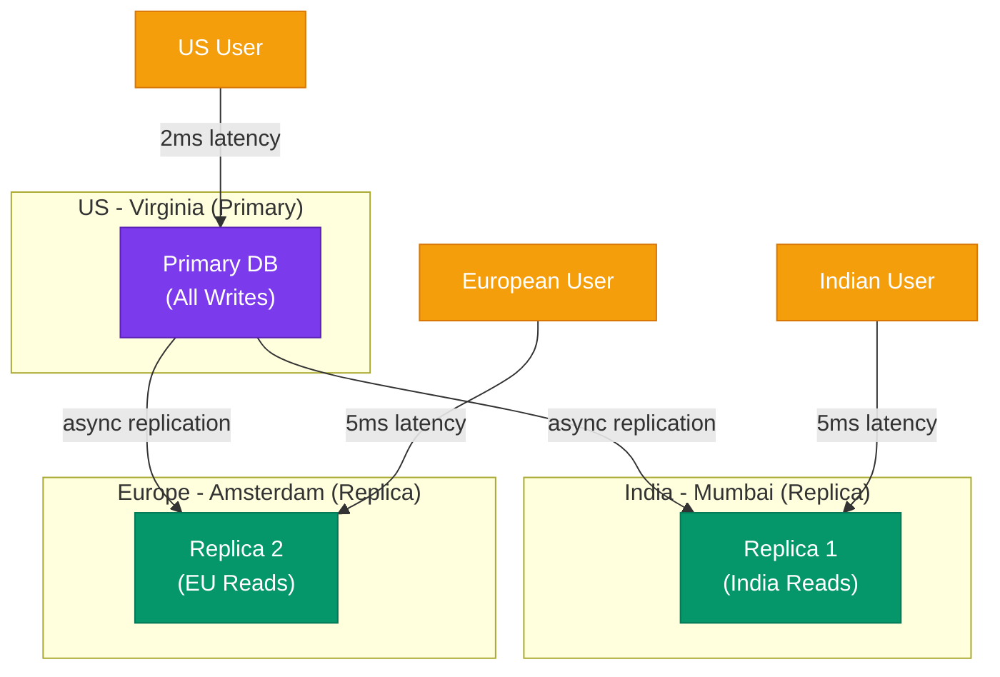

**Summary of Why:**

| Reason | Problem Solved | Real Example |
|--------|---------------|-------------|
| High Availability | Server crash → downtime | Zomato dinner rush |
| Read Scaling | Too many reads for one DB | Instagram photo feeds |
| Geographic Distribution | High latency for distant users | Netflix global streaming |
| Disaster Recovery | Entire datacenter destroyed | Flood/fire in one DC |
| Maintenance | Rolling upgrades without downtime | Swiggy zero-downtime deploy |

> **Interview Tip:** Always mention all four reasons when asked "why do we replicate?" — most candidates only say "backup" or "high availability." Mentioning read scaling and geo-distribution shows depth.

---

## 3. Single-Leader Replication

### The Analogy — Head Office and Branch Offices

Ek company ka head office Pune mein hai. Saari important decisions (salary, hiring, product) head office se hoti hain. Branch offices (Mumbai, Delhi, Bangalore) sirf local operations dekhti hain aur head office ke decisions follow karti hain.

Database mein: Primary server = Head Office (accepts all writes). Replicas = Branch offices (receive copies of all writes).

### How It Works

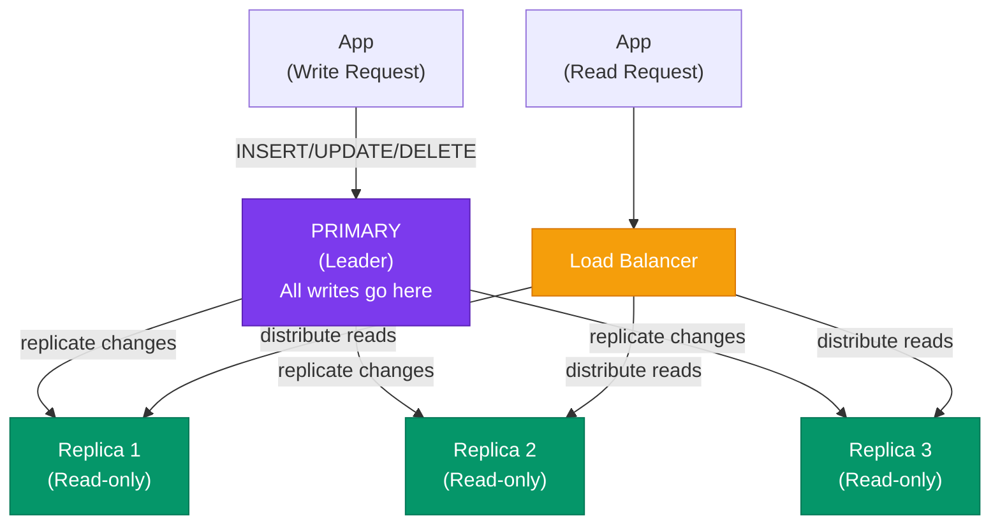

### What Gets Replicated?

Primary sirf changes bhejta hai — pura database nahi. Teen common formats hain:

**1. Statement-Based Replication:**
Primary apne SQL statements (INSERT, UPDATE, DELETE) replica ko bhejta hai. Replica same statements execute karta hai.

Problem: `NOW()`, `RAND()` — yeh functions different results denge different servers par.

**2. Write-Ahead Log (WAL) Shipping:**
Database har write ek log file mein record karta hai before executing. Yahi log file replica ko bhejte hain. Replica log replay karta hai.

PostgreSQL yahi karta hai. Very reliable.

**3. Row-Based Replication:**
Primary specific rows bhejta hai jo change hue hain — koi SQL nahi, sirf "this row changed from X to Y." MySQL ka default `ROW` format yahi hai.

Most reliable — works with any SQL, including non-deterministic functions.

### Single-Leader: Key Properties

- **All writes → Primary only.** Agar koi replica ko directly write karne ki koshish kare, woh reject kar dega.
- **Reads → Primary or Replicas.** Strong consistency chahiye toh primary se read karo. Slightly stale data acceptable hai toh replica se.
- **One primary at a time.** Yeh guarantee bahut important hai — violation se split-brain hota hai.

### Real Example: GitHub

GitHub uses MySQL primary + multiple read replicas. All code pushes, PR merges, issue comments — writes go to the primary. Dashboard views, file browsing, search — reads from replicas. During failover, GitHub promotes the most up-to-date replica to primary. They also use **ProxySQL** as a router that transparently routes reads vs writes.

> **Interview Tip:** Single-leader is the **safest and most common** model. Jab bhi system design mein database replication bolna ho aur koi constraint na ho, yahan se shuru karo.

---

## 4. Synchronous vs Asynchronous Replication

### The Analogy

**Synchronous:** Tum ek important email bhejte ho client ko. Tum tabhi office se nikalte ho jab client ka "received" reply aata hai.

**Asynchronous:** Tum email bhejte ho aur turant office se nikal jaate ho. "Client ne padha ki nahi" — baad mein dekh lenge.

**Semi-synchronous:** Tum email CC mein apne manager ko bhi karte ho, aur manager ka "received" aane ke baad nikalte ho. Client ka wait nahi karte — bas ek confirmation kaafi hai.

### Synchronous Replication

```
App → Primary: "Write order #1234"
Primary → Replica 1: "Write order #1234"      ← Primary sends to replica
Replica 1 → Primary: "Written, confirmed!"    ← Primary WAITS for this
Primary → App: "Order placed successfully"    ← Only now acknowledges app
```

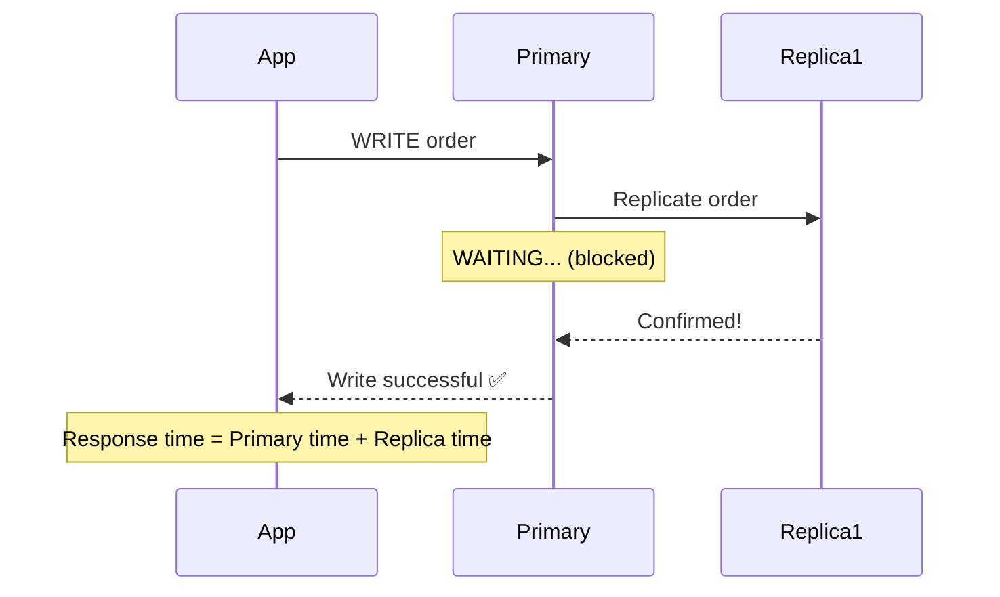

**Pros:**
- Zero data loss. Primary crash hone par bhi, replica ke paas latest data hai.
- Strong consistency — replica always matches primary.

**Cons:**
- Write latency badh jaata hai (primary + network + replica time).
- Agar replica slow hai ya network congested, primary block hota hai.
- Agar replica crash ho jaye, primary writes accept karna band kar deta hai (unless fallback configured).

**Use Case:** Banking transactions, financial records, medical data — kuch bhi jahan data loss unacceptable ho.

---

### Asynchronous Replication

```
App → Primary: "Write order #1234"
Primary → App: "Order placed successfully"    ← Immediately responds
Primary → Replica 1: "Write order #1234"      ← Background, best-effort
(Replica may lag by milliseconds to seconds)
```

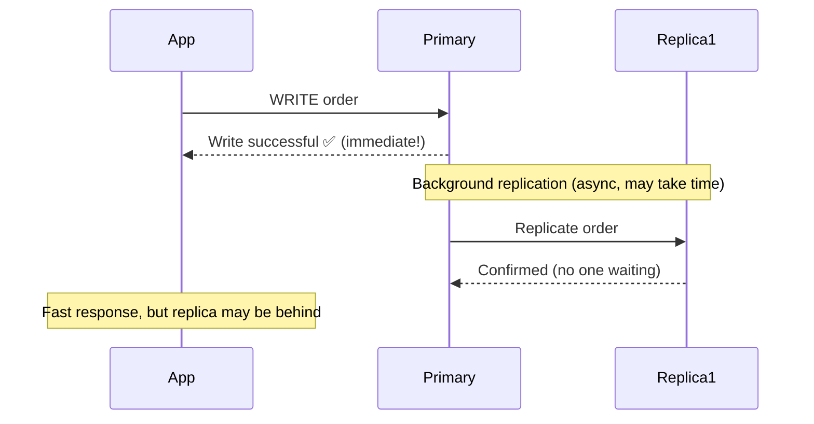

**Pros:**
- Very fast writes — primary doesn't wait for anyone.
- Primary works even if all replicas are down.

**Cons:**
- Data loss possible. Agar primary crash ho *between* acknowledging the app and replicating to replicas, that write is permanently lost.
- Stale reads from replicas.

**Use Case:** Social media likes/views, analytics, non-critical content — jahan losing one write is acceptable.

---

### Semi-Synchronous Replication (The Sweet Spot)

```
Primary → at least ONE replica must confirm → then Primary acknowledges App
All other replicas can lag asynchronously.
```

**MySQL ka default behavior yahi hai.**

```
Example (N=3 replicas):
  - Replica 1: SYNCHRONOUS (primary waits for this one)
  - Replica 2: ASYNCHRONOUS (no wait)
  - Replica 3: ASYNCHRONOUS (no wait)

Result:
  ✅ At most 1 replica always in sync → zero data loss on primary crash
  ✅ Lower latency than full-sync (wait only for 1, not all)
  ✅ If sync replica dies, promote an async replica and flag it as new sync
```

### Comparison Table

| Property | Synchronous | Asynchronous | Semi-Synchronous |
|----------|-------------|--------------|-----------------|
| Write Latency | High | Low | Medium |
| Data Loss on Primary Crash | None | Possible | Minimal (1 replica safe) |
| Availability | Low (blocked by replica) | High | Medium |
| MySQL Support | Yes (rpl_semi_sync) | Yes (default) | Yes (default) |
| PostgreSQL Support | Yes (synchronous_standby_names) | Yes | Yes (via config) |
| Use Case | Banking, medical | Social media, analytics | Most production apps |

> **Interview Tip:** Semi-sync is the most common real-world answer. "We use async for performance but ensure at least one replica is synchronously in sync for durability."

---

## 5. Replication Lag

### The Analogy — WhatsApp's "Sent" vs "Delivered" vs "Read"

Tum ek message bhejte ho. WhatsApp immediately dikhata hai one tick (sent). Phir two ticks (delivered to their phone). Phir blue ticks (they read it).

Database replication same tarah: Write goes to primary (one tick). Replica receives it (two ticks). Replica applies it (blue ticks). The time between one tick and blue ticks — **replication lag**.

### What Causes Replication Lag?

1. **Network delay:** Primary se replica tak data jaane mein time lagta hai.
2. **Replica processing load:** Replica is busy serving reads, replication falls behind.
3. **Large transactions:** One massive UPDATE of 10 million rows takes time to replicate.
4. **Network partitions:** Temporary network issue → lag spikes.

In normal conditions: **milliseconds to seconds**.  
Under heavy load: **seconds to minutes**.  
After network recovery: can be **minutes to hours** to catch up.

### The Read-Your-Writes Problem

Yeh real problem hai jo users actually feel karte hain.

**Scenario:** Instagram par tumne apni bio update ki. Page refresh karo — agar read replica se aaya toh purani bio dikhti hai!

```
t = 0ms:    User updates profile bio (written to PRIMARY)
t = 50ms:   User refreshes page (read request)
t = 50ms:   Load balancer routes read to REPLICA 2
t = 50ms:   Replica 2 hasn't received the update yet (lag = 200ms)
t = 50ms:   User sees OLD bio 😕

t = 250ms:  Replica finally replicates the update
t = 260ms:  User refreshes again → NOW sees new bio ✅
```

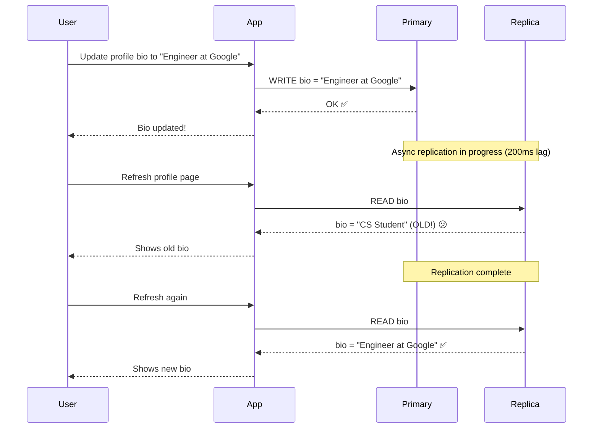

### Solutions for Read-Your-Writes

**Option 1: Read-after-write Consistency (Simplest)**

After a write operation, for the next N seconds (or until the replica catches up), route reads to the PRIMARY.

```
Logic:
  if (user just made a write in last 60 seconds):
    read from PRIMARY
  else:
    read from REPLICA

Where to track "just made a write":
  - Client-side cookie: last_write_timestamp
  - Session store (Redis): session → last_write_time
```

Pros: Simple, easy to implement.
Cons: Increases primary read load; tricky for distributed sessions (user logged in from two devices).

---

**Option 2: Track Replication Position**

Primary uses a **log sequence number (LSN)** or **binlog position**. After a write, store this position in the user's session.

When reading, check: "Has replica caught up to position X?"
- If yes → read from replica.
- If no → read from primary.

```
Flow:
  1. Write to primary → get back LSN=1045
  2. Store LSN=1045 in user session
  3. Read request arrives → ask replica "are you at LSN >= 1045?"
  4. Replica says "I'm at LSN=1040" → NOT caught up → read primary
  5. Later: replica catches up to LSN=1045 → can read from replica
```

PostgreSQL has `pg_current_wal_lsn()` and `pg_last_wal_replay_lsn()` for this exact purpose.

---

**Option 3: Sticky Sessions (Session Pinning)**

After a write, pin all reads from that user session to the SAME replica that received the replication update. If that replica dies, fall back to primary.

Simple to implement but limits read load distribution.

---

**Option 4: Synchronous Replication for Critical Paths**

For writes that users will immediately read-back (profile update, order placement), use synchronous replication. For background writes (logging, analytics), use async.

> **Interview Tip:** "Read-your-writes" yeh ek important consistency model ka naam hai. Is problem ka naam lena interview mein alag hi impression deta hai. Add: "We track replication position in the user's session to ensure they always see their own writes."

---

## 6. Multi-Leader Replication

### The Analogy — Multiple Generals, Each Commanding Their Own Army

Ek multinational company hai — Mumbai office apne decisions le sakti hai, US office apne. Dono offices apne local decisions implement karte hain aur baad mein ek doosre ko inform karte hain. Conflict ho toh? Toh ek rule follow karte hain.

Database mein: Multiple leaders (primaries) — each accepts writes independently. Changes replicate to all other leaders. Conflict ho toh conflict resolution.

### When Multi-Leader Makes Sense

1. **Multi-datacenter setup:** US datacenter writes to US leader (low latency). India datacenter writes to India leader. Replication between leaders happens in background.

2. **Offline clients:** Your phone's notes app. Jab offline ho, notes locally write hote hain. Jab internet aaye, sync hota hai. Google Docs same.

3. **Real-time collaborative editing:** Google Docs mein two users same document edit kar rahe hain simultaneously.

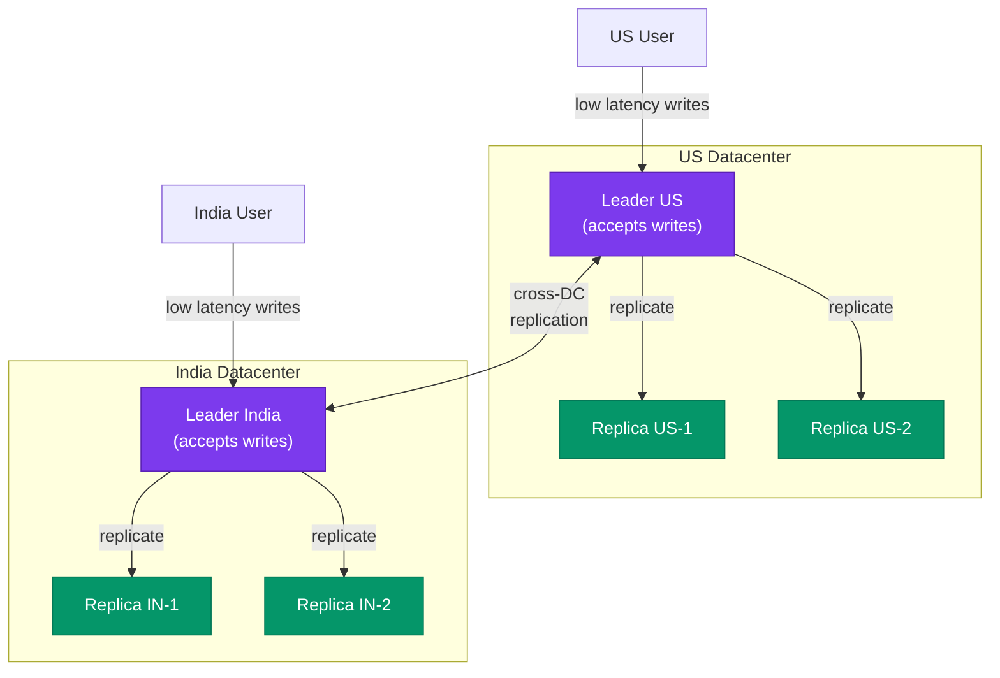

### The Big Problem: Write Conflicts

Yeh multi-leader ka sabse bada headache hai.

```
t = 0: User A (US)    sets article title = "Breaking News: AI Wins"  → Leader US
t = 0: User B (India) sets article title = "Cricket World Cup Final" → Leader India
t = 1: Leaders sync: CONFLICT! Which title wins?
```

Dono writes valid hain — koi galat nahi hai. But database sirf ek value store kar sakti hai.

### Conflict Resolution Strategies

**1. Last-Write-Wins (LWW)**

Har write ko timestamp attach karo. Higher timestamp wala win kare.

```
User A write: timestamp = 1000, title = "Breaking News: AI Wins"
User B write: timestamp = 1001, title = "Cricket World Cup Final"
Result: "Cricket World Cup Final" wins (higher timestamp)
```

Pros: Simple, automatic.
Cons:
- Clock skew problem. Server clocks are never perfectly in sync. A write with timestamp 1000 on Server A might actually happen AFTER timestamp 1001 on Server B, due to clock drift.
- Data loss! User A's write is silently discarded — no error, no notification.

---

**2. Merge Conflicts**

Dono values combine karo.

```
Result: "Breaking News: AI Wins / Cricket World Cup Final"
```

Shopping cart mein yeh sense karta hai:
- User adds "shoes" on phone
- Same user adds "shirt" on laptop while offline
- Merge: cart = [shoes, shirt] ✅

Text fields mein yeh sense nahi karta (title = "Breaking / Cricket"?).

---

**3. Conflict-Free Replicated Data Types (CRDTs)**

Special data structures jo mathematically guarantee karte hain ki merging always produces the same result, regardless of order.

Examples:
- **G-Counter:** Only increments (like YouTube view count). Always safe to merge by taking max.
- **OR-Set:** A set where you can add/remove items. Tracks tombstones for deletions.
- **LWW-Register:** Single value with last-write-wins semantics (explicit data structure).

Used in: Riak, Redis Enterprise CRDT, collaborative editors (Figma uses CRDTs internally).

---

**4. Application-Level Conflict Handling**

Database detects conflict, stores BOTH versions, exposes them to the application. Application decides what to do (or shows conflict to user).

Used in: Amazon DynamoDB (via conditional writes), CouchDB.

```
Database: "Conflict detected on article title"
App: Shows both versions to editor → editor picks one → conflict resolved
```

---

### Multi-Leader Trade-offs

| Property | Value |
|----------|-------|
| Write Latency | Low (write to local leader) |
| Conflict Risk | High (any concurrent writes can conflict) |
| Complexity | Very high |
| Use Case | Multi-DC, offline apps, collaborative editing |
| Avoid When | Strong consistency required, conflicts unacceptable |

> **Interview Tip:** "Multi-leader is powerful for multi-DC scenarios but introduces write conflicts. For most applications, single-leader with read replicas is simpler and safer. Use multi-leader only when cross-DC write latency is a real problem."

---

## 7. Leaderless Replication

### The Analogy — Committee Decision Making

Koi ek leader nahi hota. Important decisions lene ke liye committee ke majority members se agreement chahiye. Agar 10 members hain, toh 6 ka agreement = majority = decision pass.

Database mein: Koi primary nahi. Koi bhi node write accept kar sakta hai. But write tabhi "successful" maana jaata hai jab majority nodes confirm kar dein.

### How Quorum Works

```
Setup: N = 5 nodes (all equal, no leader)
Write quorum: W = 3 (write to 3 nodes, wait for 3 confirmations)
Read quorum: R = 3 (read from 3 nodes, take latest value)

Rule: W + R > N ensures overlap
  W + R = 3 + 3 = 6 > 5 ✅
  → At least ONE node that served the read MUST have the latest write
  → Guaranteed to see fresh data
```

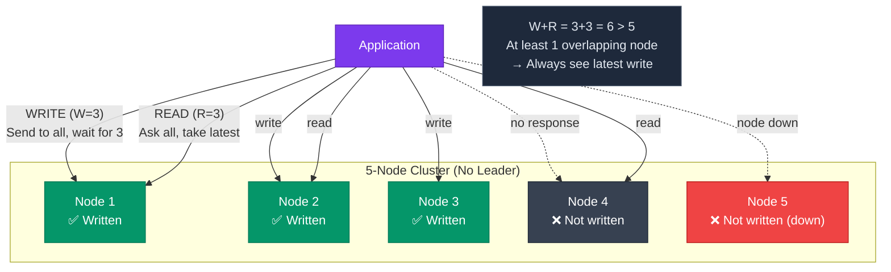

### Quorum Configurations

| Config | W | R | Effect |
|--------|---|---|--------|
| Strong Consistency | 3 | 3 | Always fresh reads, slower both |
| Write Optimized | 1 | 5 | Fast writes, expensive reads |
| Read Optimized | 5 | 1 | Expensive writes, fast reads |
| Eventual Consistency | 1 | 1 | Fast both, possibly stale |
| Invalid | 2 | 2 | 2+2=4 < 5, may read stale data |

### Tunable Consistency — Cassandra Ka Superpower

Cassandra mein per-query consistency level set kar sakte hain:

```sql
-- Strong consistency (read from majority)
SELECT * FROM users WHERE id = 123 USING CONSISTENCY QUORUM;

-- Fast but possibly stale (read from any one node)
SELECT * FROM users WHERE id = 123 USING CONSISTENCY ONE;

-- Read from local datacenter's majority (for geo-distributed setup)
SELECT * FROM users WHERE id = 123 USING CONSISTENCY LOCAL_QUORUM;
```

Yeh flexibility bahut powerful hai — critical queries ke liye QUORUM, analytics ke liye ONE.

### Sloppy Quorums and Hinted Handoff

Network partition ho gayi. 3 out of 5 nodes unreachable hain.

**Strict quorum:** Cannot achieve W=3. Write FAILS. System sacrifices availability for consistency.

**Sloppy quorum:** Write to any 3 available nodes, even if they're not the "home" nodes for this data. Tag the write with "intended for Node 4, 5". When those nodes recover, transfer the data. This is called **hinted handoff**.

```
Normal: Data for key "user:123" lives on Nodes 1, 2, 3
Network partition: Nodes 1 and 2 unreachable

Sloppy quorum:
  Write to Nodes 3, 4, 5 (any available)
  Tag: "This is for Nodes 1 and 2, please forward when they recover"

Recovery: Nodes 1 and 2 come back → Nodes 4 and 5 deliver the writes → hinted handoff complete
```

Amazon DynamoDB, Apache Cassandra, Riak — sab sloppy quorums use karte hain by default for maximum availability.

### Anti-Entropy and Read Repair

Jab nodes down the rahe aur recover hue, unka data purana ho sakta hai. Two mechanisms fix this:

**Read Repair:** Jab read request aata hai (R=3 nodes se), sabke versions compare karo. Purana version wale nodes ko updated data bhejo in the background.

**Anti-Entropy:** Background process jo continuously nodes ke data compare karta hai aur differences fix karta hai. Uses a Merkle tree to efficiently find differences.

> **Interview Tip:** "Leaderless is used in systems requiring high write availability like Cassandra (used by Netflix, Discord, Instagram). The key insight is W + R > N for consistency guarantees."

---

## 8. Failover

### The Analogy — Company Succession Planning

Ek company ka CEO achanak resign kar le ya accident mein ghayel ho jaye. Board ne pehle se decide kar rakha hai: "Agar CEO nahi raha, COO immediately takeover karega." Clear succession plan.

Database failover same: "Agar primary fail ho, which replica becomes primary, how quickly, and how does the app know?"

### Failover Process (Step by Step)

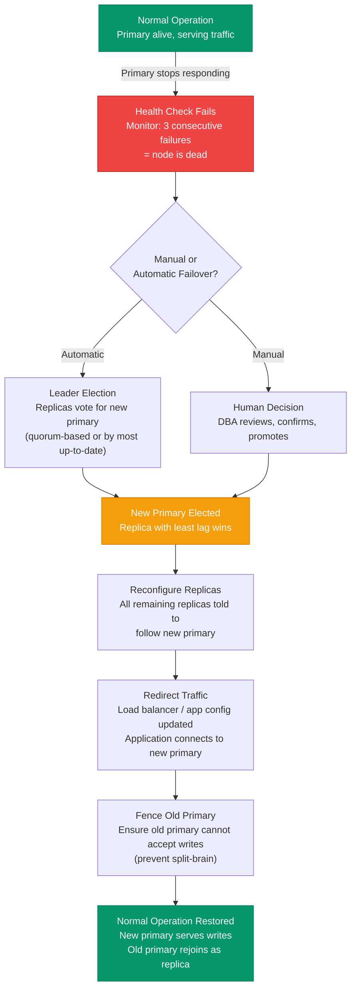

### Failover Timeline: What Actually Happens

```
t = 0s:    Primary crashes (hardware failure)
t = 0-30s: Health checks detect failure (3 x 10s checks)
t = 30s:   Alert fires, failover decision triggered
t = 30-60s: Leader election completes, new primary identified
t = 60-90s: App config updated (if using service discovery) or DNS TTL expires
t = 90s:   Traffic flowing to new primary
Total downtime: ~90 seconds (1.5 minutes)
```

With fast tools (ProxySQL, Orchestrator, Patroni): **under 30 seconds**.

### Manual vs Automatic Failover

| Property | Manual | Automatic |
|----------|--------|-----------|
| Speed | Minutes to hours | Seconds to minutes |
| False Positives | None (human confirms) | Possible (network blip) |
| Split-Brain Risk | Low | Higher |
| On-call Required | Yes | No |
| Use Case | Critical systems (bank) | High-availability apps |
| Tools | DBA command | Orchestrator, Patroni, MHA |

### Tools Used in Practice

- **MySQL:** Orchestrator (by GitHub), MHA (Master High Availability Manager)
- **PostgreSQL:** Patroni (by Zalando), repmgr, pg_auto_failover
- **MongoDB:** Built-in replica set elections with Raft consensus
- **Redis:** Redis Sentinel, Redis Cluster

> **Interview Tip:** "Automatic failover with Patroni/Orchestrator reduces MTTR (Mean Time to Recovery) from hours to seconds. But always pair it with proper split-brain prevention."

---

## 9. Split-Brain: The Scary Problem

### The Analogy — Two Managers, One Team

Network problem ki wajah se Mumbai office aur Pune office ka contact cut ho gaya. Mumbai manager sochta hai "Pune manager nahi hai, main boss hun." Pune manager sochta hai "Mumbai manager dead, main boss hun." Dono apne-apne decisions lene lagte hain — employees confuse, orders conflicting, records different. Jab network wapas aata hai — DO DIFFERENT RECORDS HAIN. Kaunsa sahi hai?

Database mein: Network partition ki wajah se replica yeh sochta hai ki primary is dead. Replica khud ko primary declare kar leta hai. Ab TWO primaries accept kar rahe hain writes. Data permanently diverges.

### Split-Brain Scenario

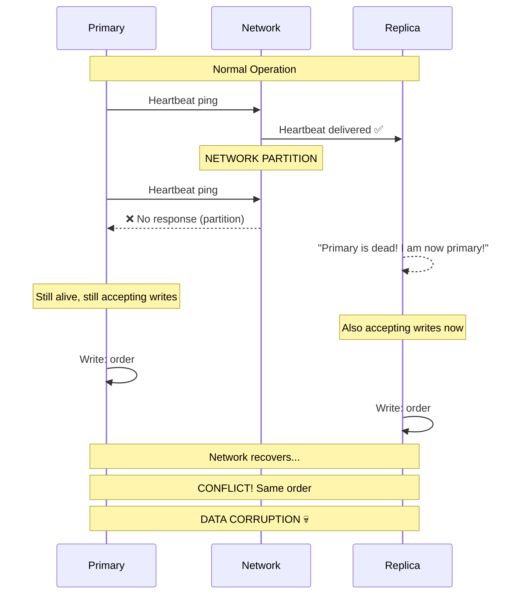

### Prevention Strategies

**Strategy 1: Quorum-Based Leader Election (Best Practice)**

Only a node with majority votes can become primary.

```
Setup: 3 nodes (Primary + 2 Replicas)
Need: 2/3 votes to be primary

Network partition: Primary isolated (can reach 0 others)
Primary's vote count: 1/3 → NOT majority → STOPS ACCEPTING WRITES

Replicas: 2/3 → majority → one elected as new primary ✅

No split-brain because isolated primary self-demotes.
```

Used by: MongoDB replica sets, Patroni (PostgreSQL), Raft protocol.

---

**Strategy 2: STONITH (Shoot The Other Node In The Head)**

Technical term for **fencing** — forcibly killing the old primary before promoting a new one.

When new primary is elected, it sends a "power off" signal to the old primary via an out-of-band channel (IPMI, power distribution unit, cloud instance stop API).

```
Old primary unreachable via network?
→ New primary uses AWS EC2 API to STOP the old primary instance
→ Confirmed dead → No split-brain possible
→ New primary safely accepts writes
```

---

**Strategy 3: Lease-Based Locking**

Primary holds a "lease" — a time-limited lock — from a distributed lock service (etcd, ZooKeeper).

```
Primary gets a lease valid for 30 seconds.
Primary must renew lease every 10 seconds.
If primary loses network → cannot renew → lease expires after 30 seconds.
Primary stops accepting writes when lease expires.

New primary gets new lease → starts accepting writes.
No overlap (both primary at same time) because leases are time-bounded.
```

Requires reasonably synchronized clocks (NTP).

> **Interview Tip:** "Split-brain is one of the nastiest distributed systems problems. Always ask about split-brain prevention when designing any leader-based system. Quorum-based election is the gold standard."

---

## 10. Read Replicas for Scaling

### The Analogy — Multiple ATMs, One Bank Account

Tumhara bank account ek central system mein hai (primary). But tum ATM se paise nikalte ho. Hundreds of ATMs (read replicas) hain jahan tum balance check kar sakte ho, statement dekh sakte ho. Balance update sirf bank ke central system mein hoti hai.

Read replicas same — they serve read traffic, primary handles writes.

### Architecture with Load Balancer

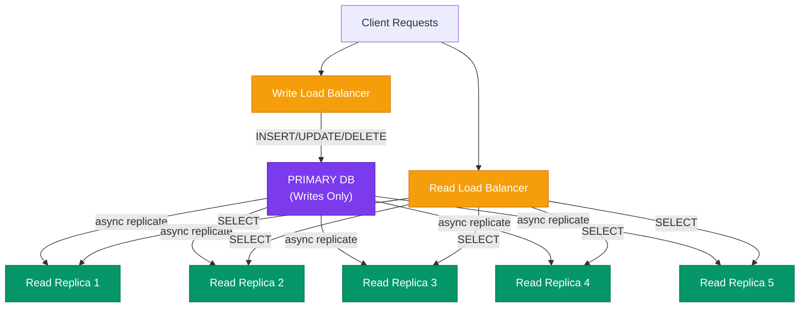

### How Many Read Replicas?

Depends on read:write ratio.

Instagram's ratio is roughly **99:1** (99 reads per write — people scroll far more than they post). So Instagram runs many, many read replicas per primary.

```
Formula:
  If primary handles 10,000 writes/sec and you need 500,000 reads/sec
  And each replica can handle 50,000 reads/sec
  → Need 10 read replicas

  But account for failover buffer → 12-13 replicas
```

### Types of Reads to Route Where

Not all reads are equal. Smart routing:

```
Route to PRIMARY (strong consistency needed):
  - User's own profile page immediately after edit
  - Payment confirmation page
  - Admin dashboards showing live data
  - Anything where stale data causes harm

Route to REPLICA (eventual consistency OK):
  - Instagram feed (slightly stale is fine)
  - Product catalog pages
  - Search results
  - Analytics/reporting queries
  - Historical order history
```

### ProxySQL: Automatic Read/Write Splitting

GitHub and many others use ProxySQL — a database proxy that automatically routes:

```
Rule 1: Match "SELECT" → route to read replica pool
Rule 2: Match "INSERT/UPDATE/DELETE" → route to primary
Rule 3: Match "SELECT ... FOR UPDATE" → route to primary (it's a write-intent read)
```

Your application doesn't need to know about replicas — ProxySQL handles it transparently.

> **Interview Tip:** "For a system with high read:write ratio (social media, e-commerce catalog), read replicas are the first scaling tool. Before sharding, before caching, try read replicas — they're much simpler."

---

## 11. Replication in Real Systems

### MySQL Binary Log (Binlog) Replication

MySQL ka replication mechanism: **binary log** — a file on the primary that records every write operation.

```sql
-- Primary configuration (my.cnf)
[mysqld]
server_id       = 1
log_bin         = /var/log/mysql/mysql-bin.log
binlog_format   = ROW          -- Row-based: safest, works with non-deterministic SQL
expire_logs_days = 7           -- Keep 7 days of binlogs

-- Create a replication user
CREATE USER 'replicator'@'10.0.0.%' IDENTIFIED BY 'StrongPassword123!';
GRANT REPLICATION SLAVE ON *.* TO 'replicator'@'10.0.0.%';
FLUSH PRIVILEGES;

-- Check primary status (note File and Position)
SHOW MASTER STATUS;
-- Output: mysql-bin.000001 | 4 | | |

-- Replica configuration
CHANGE MASTER TO
  MASTER_HOST     = '10.0.0.1',
  MASTER_USER     = 'replicator',
  MASTER_PASSWORD = 'StrongPassword123!',
  MASTER_LOG_FILE = 'mysql-bin.000001',
  MASTER_LOG_POS  = 4;

START SLAVE;

-- Check replication health
SHOW SLAVE STATUS\G
-- Key field: Seconds_Behind_Master (replication lag in seconds)
-- 0 = fully caught up, high number = lagging
```

**GTID Replication (Modern MySQL):**

GTID = Global Transaction Identifier. Every transaction gets a globally unique ID. No more "which log file, which position" — replicas just say "I have up to GTID X, give me from X+1."

```sql
-- Primary my.cnf
gtid_mode       = ON
enforce_gtid_consistency = ON

-- Replica setup with GTID
CHANGE MASTER TO
  MASTER_HOST = '10.0.0.1',
  MASTER_AUTO_POSITION = 1;  -- GTID handles position automatically
START SLAVE;
```

---

### PostgreSQL Streaming Replication

PostgreSQL uses **Write-Ahead Log (WAL)** — every change is written to WAL before being applied. Replicas stream this WAL in real-time.

```sql
-- Primary: postgresql.conf
wal_level                 = replica     -- Log enough for replication
max_wal_senders           = 5           -- Max 5 replica connections
wal_keep_size             = 1024        -- Keep 1GB of WAL for slow replicas
synchronous_standby_names = 'replica1'  -- This replica is synchronous

-- Primary: pg_hba.conf (allow replica connections)
host  replication  replicator  10.0.0.0/24  scram-sha-256

-- Replica: postgresql.conf (PostgreSQL 12+)
primary_conninfo = 'host=10.0.0.1 port=5432 user=replicator password=secret sslmode=require'

-- Start replica in standby mode (creates standby.signal file)
touch /var/lib/postgresql/data/standby.signal

-- Monitor replication lag from primary
SELECT
  client_addr,
  application_name,
  state,
  sent_lsn,
  replay_lsn,
  (sent_lsn - replay_lsn) AS lag_bytes,
  replay_lag                              -- Time lag
FROM pg_stat_replication;
```

**Patroni (High Availability for PostgreSQL):**

Patroni is an open-source HA solution by Zalando (used by Spotify, GitLab, many others). It uses etcd/ZooKeeper/Consul for distributed consensus:

```yaml
# patroni.yml
scope: postgres-cluster
name: node1

etcd:
  host: 10.0.0.10:2379

postgresql:
  listen: 0.0.0.0:5432
  connect_address: 10.0.0.1:5432
  data_dir: /data/patroni

bootstrap:
  dcs:
    ttl: 30                    # Lease TTL in seconds
    loop_wait: 10              # Health check interval
    retry_timeout: 10
    maximum_lag_on_failover: 1048576  # Don't promote a replica more than 1MB behind

# Automatic failover: if primary dies, Patroni promotes a replica within ~30s
```

---

### MongoDB Replica Sets

MongoDB has built-in replication — no external tools needed.

```javascript
// Initialize a 3-node replica set
rs.initiate({
  _id: "myReplicaSet",
  members: [
    { _id: 0, host: "mongo1:27017", priority: 2 },  // Higher priority = preferred primary
    { _id: 1, host: "mongo2:27017", priority: 1 },
    { _id: 2, host: "mongo3:27017", priority: 0, votes: 1 } // Arbiter: votes but no data
  ]
})

// Check replica set status
rs.status()
// Shows: PRIMARY, SECONDARY, stateStr, optimeDate (replication position), lastHeartbeat

// Write concern: how many replicas must confirm a write
db.collection.insertOne(
  { name: "order", amount: 500 },
  { writeConcern: { w: "majority", j: true, wtimeout: 5000 } }
  // w: "majority" = wait for majority of nodes to confirm
  // j: true = wait for journal write (durable)
)

// Read preference: which node to read from
db.collection.find({ _id: id }).readPref("secondaryPreferred")
// Options: primary, primaryPreferred, secondary, secondaryPreferred, nearest
```

MongoDB elections use Raft-inspired consensus. Whichever node has the most up-to-date oplog AND gets majority votes becomes primary. Election completes in **~10-30 seconds**.

---

### Cassandra: Leaderless with Gossip

```sql
-- Create a keyspace with replication
CREATE KEYSPACE instagram
WITH replication = {
  'class': 'NetworkTopologyStrategy',
  'us-east-1': 3,     -- 3 replicas in US
  'ap-south-1': 2     -- 2 replicas in India
};

CREATE TABLE instagram.photos (
  user_id  UUID,
  photo_id TIMEUUID,
  url      TEXT,
  PRIMARY KEY (user_id, photo_id)
) WITH CLUSTERING ORDER BY (photo_id DESC);

-- Write with quorum consistency
INSERT INTO instagram.photos (user_id, photo_id, url)
VALUES (uuid(), now(), 'https://cdn.instagram.com/photo1.jpg')
USING CONSISTENCY LOCAL_QUORUM;   -- Majority within local DC

-- Read with one consistency (fast, possibly stale)
SELECT * FROM instagram.photos WHERE user_id = ?
USING CONSISTENCY ONE;

-- Check replication health
nodetool status
-- Shows: UN (Up Normal), DN (Down Normal), etc.

nodetool tpstats
-- Shows: pending, completed operations for replication tasks
```

---

### GitHub's Replication Setup

GitHub (one of the most complex MySQL setups in the world):

- Primary MySQL server receives all write traffic
- Multiple read replicas in same datacenter for read scaling
- **Orchestrator:** Automatically detects primary failure, promotes best replica
- **ProxySQL:** Application connects to ProxySQL, which handles read/write splitting
- **VIP (Virtual IP):** Floating IP that points to current primary; moves during failover
- **gh-ost:** Online schema migrations without locking (replication-based migrations)

Failover with Orchestrator:
1. Orchestrator detects primary unreachable (3 checks, 30 seconds)
2. Orchestrator picks replica with smallest lag as new primary
3. Orchestrator reconfigures all other replicas to follow new primary
4. Orchestrator updates ProxySQL routing tables
5. Traffic resumes — total downtime: ~30-60 seconds

---

## 12. Replication Topologies

Different ways to arrange primary and replicas:

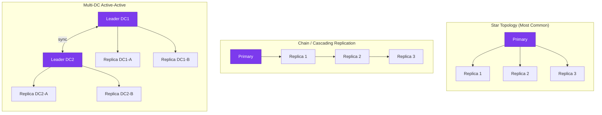

**Star Topology:** Most common. One primary fans out to all replicas. Simple, but primary's network bandwidth can become a bottleneck with many replicas.

**Chain (Cascading) Replication:** Primary → Replica 1 → Replica 2 → Replica 3. Each replica replicates from the one before it. Reduces primary bandwidth. But lag compounds: each hop adds latency. Failure in middle breaks the chain.

**Multi-DC Active-Active (Multi-Leader):** Each DC has its own leader. Leaders sync with each other. Best write performance globally. Conflict resolution required.

---

## 13. Trade-offs Summary

### Replication Types Comparison

| Model | Write Latency | Read Consistency | Conflict Risk | Complexity | Best For |
|-------|--------------|-----------------|---------------|------------|----------|
| Single-leader async | Low | Eventual | None | Low | Most web apps |
| Single-leader sync | High | Strong | None | Low | Banking, medical |
| Single-leader semi-sync | Medium | Medium | None | Low | Production default |
| Multi-leader | Low | Weak | High | Very High | Multi-DC, offline apps |
| Leaderless (strict quorum) | Medium | Strong | Low | Medium | High availability needed |
| Leaderless (sloppy quorum) | Low | Eventual | Low | Medium | Cassandra, Dynamo style |

### Failover Comparison

| Approach | Recovery Time | False Positive Risk | Split-Brain Risk |
|----------|--------------|--------------------|--------------------|
| Manual | Minutes–Hours | None | Low |
| Automatic (no consensus) | Seconds | High | High |
| Automatic (with quorum/Raft) | Seconds–Minutes | Low | Very Low |

### When to Choose What

```
Your use case is...                    → Use this

Simple web app, single DC             → Single-leader async + read replicas
Zero data loss tolerance (banking)    → Single-leader semi/full sync
Multi-datacenter, need local writes   → Multi-leader (with conflict strategy)
High availability, partition tolerant → Leaderless (Cassandra/Dynamo)
Need tunable consistency per query    → Cassandra with CONSISTENCY levels
Strong consistency + HA               → Single-leader + Patroni/Raft failover
```

---

## 14. Common Interview Questions

### Q1: "How does read scaling with replicas work? What's the catch?"

**Answer:**
- Route all writes to primary, distribute reads across N replicas using a load balancer.
- Each replica can handle the same read load as a standalone DB, so N replicas = N× read capacity.
- The catch: **replication lag**. Replicas may be slightly behind the primary (milliseconds to seconds). Reads from replicas may return stale data.
- Solution: For reads that need freshness (user reads their own write), route to primary for ~60 seconds. For general reads, replica is fine.

---

### Q2: "Explain the read-your-writes problem and how you'd solve it."

**Answer:**
- User writes to primary (e.g., updates profile), then immediately reads.
- If read goes to replica and replica is lagging, user sees old data.
- Solutions:
  1. After any write, route next reads from same user to primary for N seconds.
  2. Store the replication position (LSN/GTID) in user session; only use replica if it has caught up.
  3. Use synchronous replication for the path where users will immediately read their write.

---

### Q3: "What is split-brain and how do you prevent it?"

**Answer:**
- Split-brain: Two nodes simultaneously believe they are the primary, both accept writes, data diverges irrecoverably.
- Cause: Network partition isolates primary from replicas; replica assumes primary is dead and promotes itself.
- Prevention:
  1. **Quorum-based election:** A node needs majority votes to become primary. Minority partition cannot elect a leader.
  2. **STONITH/Fencing:** New primary kills old primary via out-of-band mechanism (cloud API) before accepting writes.
  3. **Leases:** Primary holds a time-limited lease; loses lease on network partition; new primary waits for old lease to expire.

---

### Q4: "When would you use multi-leader replication?"

**Answer:**
- Multi-datacenter setup where users in each DC need low-latency writes.
- Offline-capable applications (phone notes, offline CRM) that sync when connectivity resumes.
- Real-time collaborative editing (Google Docs style).
- Avoid it when strong consistency is required (banking, inventory) — write conflicts can cause data loss.

---

### Q5: "Explain quorum reads and writes. What is W + R > N?"

**Answer:**
- N = total replicas. W = number of nodes that must confirm a write. R = number of nodes that must respond to a read.
- If W + R > N, at least one node that participated in the read MUST have the latest write (by pigeonhole principle). Guarantees no stale reads.
- Example: N=5, W=3, R=3: W+R=6 > 5. Any 3-node read group overlaps with any 3-node write group in at least 1 node.
- Trade-off: Higher W or R = stronger consistency but slower operations.

---

### Q6: "How does GitHub handle primary failover for MySQL?"

**Answer:**
- GitHub uses Orchestrator — an open-source MySQL HA tool.
- Orchestrator continuously monitors via heartbeat. On primary failure (3 checks, ~30s), it:
  1. Identifies the replica with smallest replication lag.
  2. Promotes that replica to primary.
  3. Reconfigures all other replicas to follow the new primary.
  4. Updates ProxySQL routing to send writes to new primary.
- Total failover time: ~30-60 seconds.
- They use a VIP (Virtual IP) that floats between primaries, so apps don't need config changes.

---

### Q7: "What is the difference between replication and backup?"

**Answer (Critical — most candidates confuse this):**
- **Replication** copies writes in real-time to other nodes. If you `DELETE` 10 million rows accidentally, that DELETE replicates to all replicas within seconds. Replicas also have the data deleted. Replication does NOT protect against logical data corruption or accidental deletes.
- **Backup** is a point-in-time snapshot stored separately (ideally offline). You can restore to before the accidental delete. But backup restore takes time (minutes to hours).
- You need BOTH: replication for availability/performance, backups for disaster recovery.

---

### Q8: "Design replication for a payment system."

**Expected Answer:**

Requirements: Zero data loss, high availability, global users.

Architecture:
1. **Single-leader semi-synchronous** replication within each datacenter. At least one replica always synchronously in sync → zero data loss on primary crash.
2. **Automatic failover with Patroni/Orchestrator + etcd** for leader election. Quorum-based to prevent split-brain.
3. **Read routing:** Payment confirmation and balance checks → always primary (stale balance = wrong amount shown). Transaction history → replica is fine.
4. **Multi-DC:** Active-passive setup. Primary datacenter in Mumbai, standby in Bangalore. Async cross-DC replication. If Mumbai DC dies, promote Bangalore primary (manual step for financial systems).
5. **Backup:** Daily full backups, point-in-time recovery (WAL archival) for logical corruption recovery.

---

## 15. Key Takeaways

```
╔══════════════════════════════════════════════════════════════════════╗
║                    KEY TAKEAWAYS — DATABASE REPLICATION              ║
╠══════════════════════════════════════════════════════════════════════╣
║                                                                      ║
║  WHAT IS IT?                                                         ║
║  Keeping the same data on multiple machines connected via network.   ║
║  Each copy = replica. Protects against failure, enables scaling.     ║
║                                                                      ║
║  WHY DO IT? (3 main reasons)                                         ║
║  1. High Availability — survive node failure                         ║
║  2. Read Scaling — distribute read load                              ║
║  3. Geographic Distribution — low latency for global users           ║
║                                                                      ║
║  THREE MODELS:                                                       ║
║  Single-leader → One primary writes, replicas copy. Most common.    ║
║  Multi-leader  → Multiple primaries, handles multi-DC. Conflicts!   ║
║  Leaderless    → Any node writes, quorum W+R>N for consistency.      ║
║                                                                      ║
║  SYNC vs ASYNC:                                                      ║
║  Sync = safe (no data loss), slow writes                             ║
║  Async = fast writes, possible data loss                             ║
║  Semi-sync = one replica confirms, sweet spot for most systems       ║
║                                                                      ║
║  REPLICATION LAG:                                                    ║
║  Replica may be seconds behind primary.                              ║
║  Read-your-writes: route recent reads to primary.                    ║
║                                                                      ║
║  FAILOVER:                                                           ║
║  Health check → detect failure → elect new primary → redirect.       ║
║  Tools: Patroni (Postgres), Orchestrator (MySQL), MongoDB built-in.  ║
║                                                                      ║
║  SPLIT-BRAIN (most dangerous failure):                               ║
║  Two nodes think they're primary → data corruption.                  ║
║  Prevent: quorum election, STONITH, leases.                          ║
║                                                                      ║
║  REPLICATION ≠ BACKUP:                                               ║
║  Replication copies everything, including accidental deletes.        ║
║  Always maintain separate point-in-time backups!                     ║
║                                                                      ║
║  REAL EXAMPLES:                                                      ║
║  GitHub: MySQL + Orchestrator + ProxySQL                             ║
║  Instagram/Netflix: Cassandra (leaderless, quorum)                   ║
║  PostgreSQL setups: Patroni + etcd                                   ║
║  MongoDB: Built-in replica sets with Raft election                   ║
║                                                                      ║
╚══════════════════════════════════════════════════════════════════════╝
```

---

## Next Steps

Continue to [Microservices](../17-microservices/README.md) to learn how to decompose large systems into independently deployable services.

Or explore related topics:
- **Consistency Models** — linearizability, serializability, eventual consistency
- **Distributed Consensus** — Raft, Paxos (the algorithms behind failover)
- **CAP Theorem** — why you must choose between consistency and availability during partitions
- **Database Sharding** — when replication isn't enough, how to split data horizontally

---

> **Critical Reminder:** Replication is NOT a backup. Replication copies writes in real time — if a `DROP TABLE` happens, it replicates too. Always maintain separate backups with point-in-time recovery for true disaster recovery.
