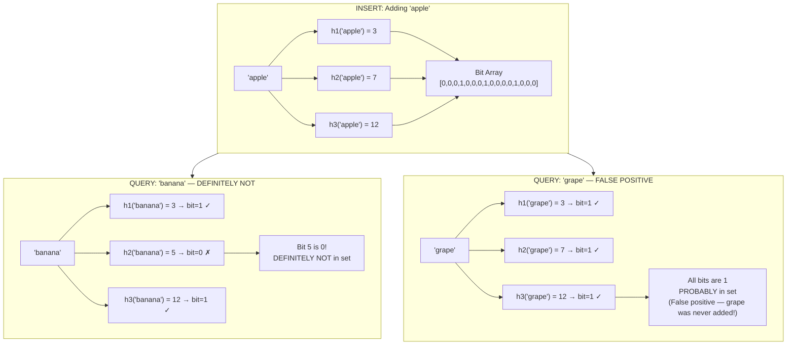
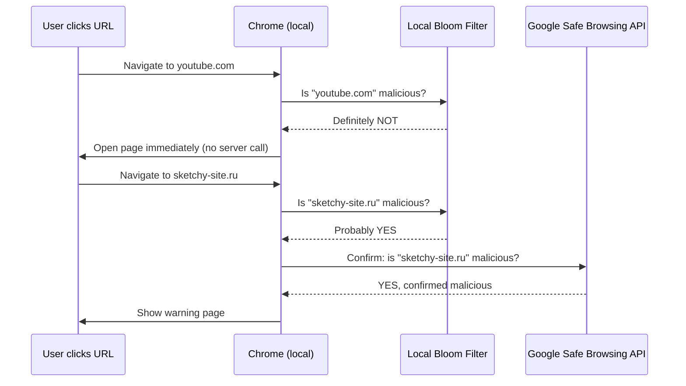
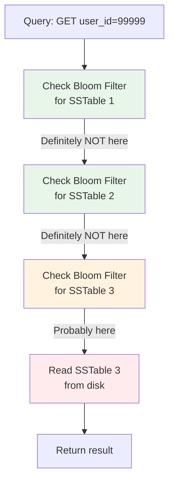
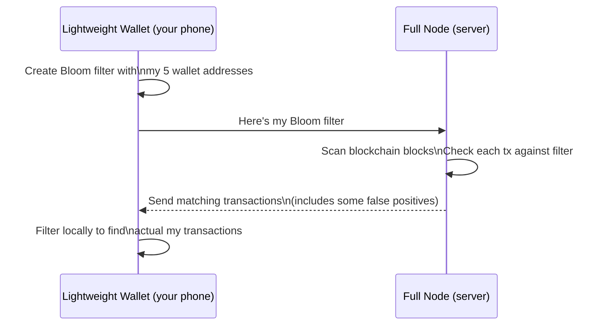
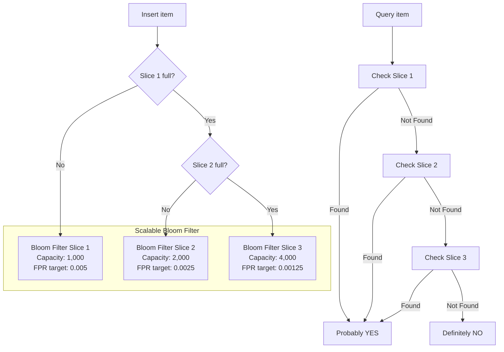
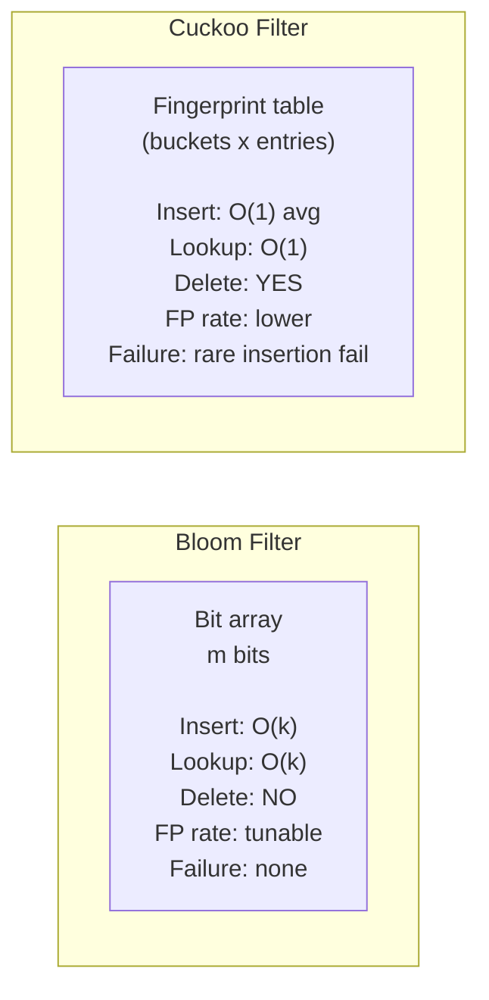
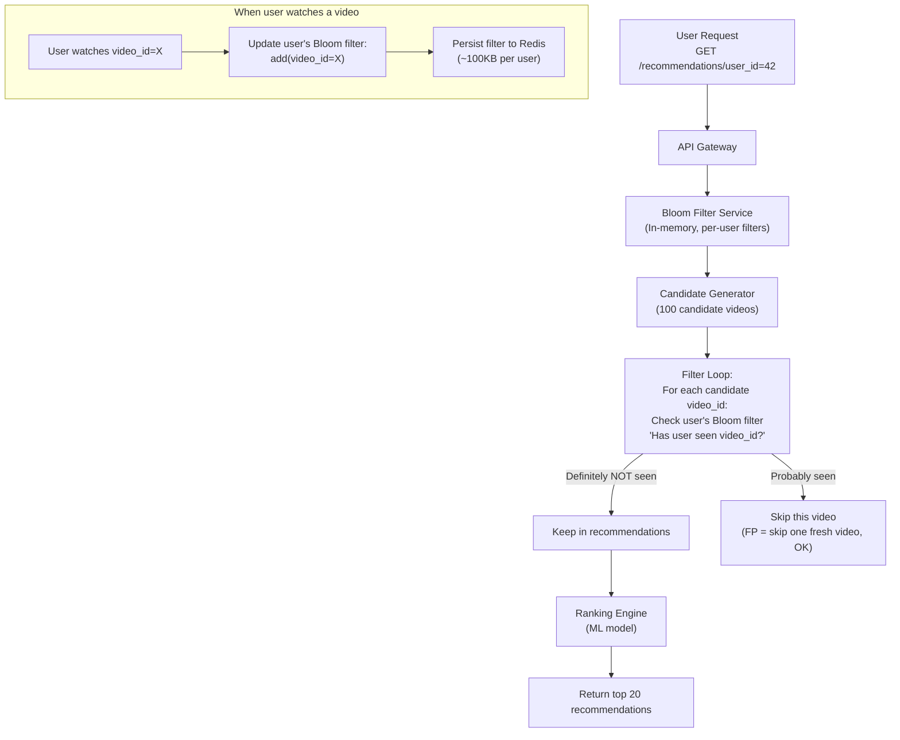

# Bloom Filters

---

## The Problem: Membership Checks at Insane Scale

Before we even talk about what a Bloom filter is, let's understand *why* it exists. Because the best way to appreciate any solution is to first feel the pain of the problem.

Imagine you work at Zomato and your app needs to show restaurant recommendations. You have 50 million users. The rule is: never show the same restaurant to the same user twice. Simple, right?

Now: every time a user opens the app, you need to check — "has this user already been shown restaurant X?" For 50 million users, each with hundreds of past interactions, you'd need a massive lookup table. Storing all that in RAM? Expensive. Hitting the database every time? Slow. There are thousands of requests per second.

Yeh kyun important hai? Because at scale, even a simple "have I seen this before?" question becomes a systems design challenge.

That's where Bloom filters come in.

---

## The 5-Year-Old Analogy: The Magic Coloring Book

Imagine you have a coloring book with 1000 blank squares. Each square is numbered 1 to 1000. Your job is to remember which toys you've played with.

Whenever you play with a toy — say, a red car — you ask three friends: "Hey, what number do you associate with 'red car'?" They each shout a number: 42, 187, 893. You color those three squares.

Later, when your mom asks "have you played with the blue train?", you ask the same three friends: "What number for 'blue train'?" They say 17, 42, 650. You check — square 17 is blank! So you *definitely* haven't played with the blue train.

But when she asks "have you played with the green ball?" and your friends say 42, 187, 650 — all colored — you say "probably yes!" But wait — those squares might have been colored by the red car and some other toy. So maybe you haven't played with the green ball. That's okay! Your mom will just double-check.

This is *exactly* how a Bloom filter works. The coloring book is the bit array. The three friends are hash functions. Coloring squares = inserting items. Checking squares = querying membership.

---

## What Is a Bloom Filter? (Formally)

A Bloom filter is a **probabilistic data structure** used to test whether an element is a member of a set.

It gives exactly two possible answers:

| Answer | What It Means | Reliability |
|---|---|---|
| **"Definitely NOT in the set"** | This element was NEVER added | 100% guaranteed — zero false negatives |
| **"Probably IN the set"** | Element was likely added, but might be wrong | Can be a false positive |

The key insight: **false negatives are impossible. False positives are possible but controllable.**

Think of it like a pregnancy test. A negative result is very reliable. A positive result says "probably — confirm with a doctor." The Bloom filter says "probably yes — confirm with the database." The cost of a false positive is just one extra database lookup. The benefit is skipping millions of unnecessary lookups when the answer is "no."

---

## How a Bloom Filter Works

### The Two Building Blocks

1. **A bit array** of size `m` — a row of 0s and 1s, all starting at 0
2. **k hash functions** — each maps an input to a position in the bit array

That's it. No pointers. No complex nodes. Just bits and hash functions.

### Step 1: Inserting an Item

Run the item through all `k` hash functions. Each function gives a position in the bit array. Set all those positions to 1.

### Step 2: Querying an Item

Run the same item through all `k` hash functions. Get the same positions. Check them:
- If **any position is 0** → the item is **DEFINITELY NOT** in the set (some hash function would have set that bit when inserting)
- If **all positions are 1** → the item is **PROBABLY** in the set (those bits could have been set by other items — false positive)



### Concrete Walkthrough

Let's trace this manually with a 16-bit array and 3 hash functions:

```
Start:   [ 0, 0, 0, 0, 0, 0, 0, 0, 0, 0, 0, 0, 0, 0, 0, 0 ]
          0  1  2  3  4  5  6  7  8  9 10 11 12 13 14 15

Add "apple":
  h1("apple") = 3  → set bit 3
  h2("apple") = 7  → set bit 7
  h3("apple") = 12 → set bit 12

After "apple":
         [ 0, 0, 0, 1, 0, 0, 0, 1, 0, 0, 0, 0, 1, 0, 0, 0 ]

Add "mango":
  h1("mango") = 1  → set bit 1
  h2("mango") = 7  → bit 7 already 1 (shared with apple!)
  h3("mango") = 14 → set bit 14

After "apple" + "mango":
         [ 0, 1, 0, 1, 0, 0, 0, 1, 0, 0, 0, 0, 1, 0, 1, 0 ]

Check "banana":
  h1("banana") = 3  → 1 ✓
  h2("banana") = 5  → 0 ✗ ← STOP! Definitely not in set.

Check "grape" (was never added):
  h1("grape") = 3  → 1 ✓
  h2("grape") = 7  → 1 ✓
  h3("grape") = 12 → 1 ✓
  All 1s → "PROBABLY in set" (FALSE POSITIVE!)
  Bits 3, 7, 12 were set by "apple", so "grape" gets fooled
```

The false positive happens because "grape's" hash positions happened to overlap with positions already set by "apple". Basically, hash collisions cause this.

---

## Why False Negatives Are Impossible

This is the most important property. Samjho aise —

When you insert "apple", you set specific bits. Those bits, once set to 1, never go back to 0 in a standard Bloom filter. So when you later query "apple" with the same hash functions, you get the same positions, and all of them must still be 1. It's mathematically guaranteed.

The only way a false negative could happen is if a bit got unset after insertion — which doesn't happen in a standard Bloom filter. This is why Bloom filters are used in cases where missing a real member would be catastrophic (like missing a banned URL, or missing a cached item).

---

## The False Positive Rate Formula

The false positive rate depends on three variables:

- `m` = size of the bit array (number of bits)
- `n` = number of items inserted
- `k` = number of hash functions

```
False Positive Rate ≈ (1 - e^(-k*n/m))^k
```

The optimal value of k (number of hash functions) that minimizes false positives:

```
k_optimal = (m/n) * ln(2) ≈ 0.693 * (m/n)
```

The optimal bit array size for a target false positive rate `p`:

```
m = -(n * ln(p)) / (ln(2))^2
```

**Intuition behind the formula:**
- As `m` increases (bigger array), bits are less crowded, fewer collisions, lower FPR
- As `n` increases (more items), array fills up, more collisions, higher FPR
- `k` has a sweet spot — too few hash functions means weak membership signal, too many means more bits set per item (fills array faster)

### Practical Numbers to Remember

| Items Inserted (n) | Bits per Item (m/n) | Hash Functions (k) | False Positive Rate |
|---|---|---|---|
| Any | 10 | 7 | ~1% |
| Any | 15 | 10 | ~0.1% |
| Any | 20 | 14 | ~0.01% |
| Any | 7 | 5 | ~10% |

**Rule of thumb for interviews:** 10 bits per item gives ~1% false positive rate. This is the magic number.

### Space Efficiency vs Traditional Storage

| Storage Method | 1 Billion URLs (50 bytes each) | Notes |
|---|---|---|
| Hash Set in RAM | ~50 GB | Exact, fast |
| Database with index | ~80 GB + latency | Exact, slow |
| Bloom Filter (1% FPR) | ~1.2 GB | Probabilistic |
| Bloom Filter (0.1% FPR) | ~1.8 GB | Probabilistic |

A Bloom filter gives you ~40x space savings for a 1% false positive rate. That's the deal you're making: trade a tiny bit of accuracy for a massive reduction in memory.

---

## Python Implementation from Scratch

```python
import hashlib
import math

class BloomFilter:
    def __init__(self, expected_items: int, false_positive_rate: float = 0.01):
        # Calculate optimal bit array size: m = -(n * ln(p)) / (ln(2)^2)
        self.size = self._optimal_size(expected_items, false_positive_rate)
        # Calculate optimal number of hash functions: k = (m/n) * ln(2)
        self.hash_count = self._optimal_hash_count(self.size, expected_items)
        # Initialize bit array (all zeros)
        self.bit_array = [0] * self.size
        self.items_added = 0

    def _optimal_size(self, n: int, p: float) -> int:
        return int(-(n * math.log(p)) / (math.log(2) ** 2))

    def _optimal_hash_count(self, m: int, n: int) -> int:
        return int((m / n) * math.log(2))

    def _get_positions(self, item: str) -> list:
        """Simulate k different hash functions using one hash with different seeds."""
        positions = []
        for i in range(self.hash_count):
            seed = f"{i}:{item}"
            hash_val = int(hashlib.md5(seed.encode()).hexdigest(), 16)
            positions.append(hash_val % self.size)
        return positions

    def add(self, item: str):
        for pos in self._get_positions(item):
            self.bit_array[pos] = 1
        self.items_added += 1

    def check(self, item: str) -> bool:
        """
        Returns:
          False -> DEFINITELY NOT in set (no false negatives ever)
          True  -> PROBABLY in set (might be a false positive)
        """
        return all(self.bit_array[pos] == 1 for pos in self._get_positions(item))

    def false_positive_rate(self) -> float:
        k = self.hash_count
        n = self.items_added
        m = self.size
        return (1 - math.e ** (-k * n / m)) ** k

    def __repr__(self):
        return (
            f"BloomFilter(size={self.size:,} bits "
            f"[{self.size // 8 / 1024:.1f} KB], "
            f"k={self.hash_count}, "
            f"items={self.items_added:,}, "
            f"fpr={self.false_positive_rate()*100:.2f}%)"
        )


# --- Demo ---
bf = BloomFilter(expected_items=1_000_000, false_positive_rate=0.01)
print(bf)
# BloomFilter(size=9,585,058 bits [1,170.5 KB], k=6, items=0, fpr=0.00%)

# Add 1 million URLs
for i in range(1_000_000):
    bf.add(f"https://example.com/page/{i}")

print(bf)
# BloomFilter(size=9,585,058 bits [1,170.5 KB], k=6, items=1,000,000, fpr=1.00%)

# Test: items that WERE added should never return False
false_negatives = sum(
    1 for i in range(1_000_000)
    if not bf.check(f"https://example.com/page/{i}")
)
print(f"False negatives: {false_negatives}")  # Always 0

# Test: items NOT added
false_positives = sum(
    1 for i in range(1_000_001, 1_010_001)
    if bf.check(f"https://example.com/page/{i}")
)
print(f"False positives: {false_positives}/10000 = {false_positives/100:.2f}%")
# Around 1% as expected
```

---

## Real-World Use Cases

This is the good stuff. Let's see where Bloom filters actually show up in systems you use every day.

### 1. Google Chrome Safe Browsing

**The problem:** Every time you visit a URL in Chrome, Google needs to warn you if it's a known malicious or phishing site. There are millions of malicious URLs. Chrome can't query Google's servers on every single navigation — that would be slow, and would tell Google every site you visit (privacy issue).

**The solution:** Chrome downloads a Bloom filter of all known malicious URLs (compressed to a few MB) and stores it locally. When you click a link:

1. Chrome checks the local Bloom filter first
2. If "definitely not malicious" → open the page immediately, no server call
3. If "probably malicious" → send the URL to Google's Safe Browsing API for confirmation

The Bloom filter eliminates 99%+ of server calls. False positives just trigger a real API check. False negatives are impossible — every real malicious URL is in the filter.



This is a perfect Bloom filter use case — the cost of a false positive is just one extra API call. The cost of a false negative would be missing a real malicious site. Since Bloom filters have zero false negatives, the safety guarantee holds.

---

### 2. Cassandra: Avoiding Unnecessary Disk Reads

**The problem:** Cassandra stores data in SSTables (Sorted String Tables) on disk. When you query a key, Cassandra might need to search multiple SSTables. But what if the key doesn't exist at all? You'd be doing expensive disk reads for nothing.

At companies like Instagram or Netflix where Cassandra handles billions of queries, "key doesn't exist" lookups are extremely common — users requesting data for old IDs, deleted posts, etc.

**The solution:** Each SSTable in Cassandra maintains its own Bloom filter of all keys it contains. Before doing a disk read, Cassandra checks the Bloom filter:



Without Bloom filters: every query might require 3-5 disk reads across SSTables.
With Bloom filters: most "not found" queries return immediately after checking in-memory filters.

Cassandra documentation reports that Bloom filters eliminate **70-80% of unnecessary disk reads** for non-existent keys. At Instagram's scale (billions of Cassandra reads per day), this is enormous.

---

### 3. Medium: Avoiding Repeated Article Recommendations

**The problem:** Medium wants to show you articles you haven't read yet. With millions of users and millions of articles, storing "user X read article Y" for every user-article pair is expensive. Checking it for every recommendation is slow.

**The solution:** Each user has a Bloom filter storing the IDs of articles they've read. When generating recommendations:

```python
class RecommendationEngine:
    def __init__(self):
        # Per-user Bloom filter: articles already read
        # Stored in Redis, ~100KB per user
        self.user_read_filters = {}

    def get_recommendations(self, user_id: str, candidates: list) -> list:
        user_filter = self.user_read_filters.get(user_id)
        if not user_filter:
            return candidates  # New user, show everything

        fresh_articles = []
        for article_id in candidates:
            if not user_filter.check(article_id):
                # Definitely not read — show it
                fresh_articles.append(article_id)
            # If "probably read", skip it
            # A false positive just means we skip one article — no big deal

        return fresh_articles

    def mark_read(self, user_id: str, article_id: str):
        if user_id not in self.user_read_filters:
            self.user_read_filters[user_id] = BloomFilter(
                expected_items=10_000,
                false_positive_rate=0.01
            )
        self.user_read_filters[user_id].add(article_id)
```

The trade-off here is perfect: a false positive means "we think you've read this, but you haven't." The user might miss one article. Not catastrophic. But the memory savings compared to storing full read history are massive.

---

### 4. Bitcoin: Lightweight Client (SPV) Sync

**The problem:** A full Bitcoin node stores the entire blockchain — hundreds of GB. Mobile wallets and lightweight clients can't do that. But they still need to track transactions relevant to their wallet addresses. How does a lightweight client ask a full node "give me transactions for my addresses" without revealing which addresses it owns?

**The solution:** The lightweight client creates a Bloom filter containing all its wallet addresses and transaction IDs. It sends this filter to full nodes. The full node then sends only transactions that match the filter — without knowing exactly which addresses the client owns (since the Bloom filter is probabilistic and leaks some uncertainty).



This is defined in Bitcoin Improvement Proposal (BIP 37). The false positives provide privacy — they add noise so the full node can't be 100% sure which addresses belong to the wallet.

---

### 5. Akamai CDN: Detecting One-Hit Wonders

**The problem:** Akamai (the world's largest CDN) caches web content at edge servers worldwide. But not all content is worth caching. A "one-hit wonder" is a URL requested just once — maybe a typo, a broken link, a bot request. Caching it wastes precious edge server memory.

**The rule:** Only cache something on the second request, not the first.

**Naive solution:** Store a set of "seen URLs" — but that requires storing every URL ever seen, which is massive.

**Bloom filter solution:** Use a Bloom filter to track "seen at least once."

```python
class CDNCache:
    def __init__(self):
        self.seen_once = BloomFilter(expected_items=10_000_000, false_positive_rate=0.01)
        self.cache = {}

    def handle_request(self, url: str) -> bytes:
        # Check if already in cache
        if url in self.cache:
            return self.cache[url]

        # Fetch from origin
        content = self._fetch_from_origin(url)

        # Should we cache this?
        if self.seen_once.check(url):
            # "Probably" seen before (or definitely) — cache it now
            self.cache[url] = content
        else:
            # First time seeing this URL — just track it, don't cache
            self.seen_once.add(url)

        return content
```

A false positive means we cache something that was actually a first-time request — which just means we cache slightly more than necessary. No correctness issue. Akamai's research showed this approach eliminates caching ~75% of one-hit wonders while adding minimal memory overhead.

---

## Variants of Bloom Filters

### Counting Bloom Filter: Adding Deletion Support

**The problem with standard Bloom filters:** You can't delete items. Why? Because bits are shared between items. If "apple" and "mango" both set bit 7, and you try to delete "apple" by clearing bit 7, you break membership checks for "mango."

**The analogy:** Imagine your coloring book squares now have numbers on them instead of just being colored/blank. When you play with the red car, you increment squares 42, 187, 893 by 1. When you're done with the red car, you decrement those squares. But square 42 might also have been incremented by the blue train. Decrementing it just removes the red car's contribution, not the blue train's.

**Counting Bloom filter:** Replace each bit with a counter. Add = increment. Delete = decrement. If counter > 0, bit is "set."

```
Standard Bloom Filter:   [ 0, 0, 1, 0, 1, 0, 1, 0 ]
                                    ^         ^
                               shared     only "apple"

Counting Bloom Filter:   [ 0, 0, 2, 0, 1, 0, 3, 0 ]
                                    ^         ^
                               apple+mango   apple
```

When you delete "apple", decrement positions 2, 4, 6 (example positions):
- Position 2: 2 → 1 (mango still sets this)
- Position 4: 1 → 0 (apple alone set this, now 0)
- Position 6: 3 → 2 (other items also set this)

"Mango" is still correctly found because position 2 is still > 0.

```python
class CountingBloomFilter:
    def __init__(self, size: int, hash_count: int):
        self.size = size
        self.hash_count = hash_count
        self.counters = [0] * size  # integers instead of bits

    def _positions(self, item: str) -> list:
        positions = []
        for i in range(self.hash_count):
            h = int(hashlib.md5(f"{i}:{item}".encode()).hexdigest(), 16)
            positions.append(h % self.size)
        return positions

    def add(self, item: str):
        for pos in self._positions(item):
            self.counters[pos] += 1

    def delete(self, item: str):
        if not self.check(item):
            return  # Item might not be in filter, don't decrement
        for pos in self._positions(item):
            if self.counters[pos] > 0:
                self.counters[pos] -= 1

    def check(self, item: str) -> bool:
        return all(self.counters[pos] > 0 for pos in self._positions(item))
```

**Trade-off:** Uses 4-8x more memory than a standard Bloom filter (integers vs bits). Use when you need deletion and can afford the memory.

---

### Scalable Bloom Filter: Growing Dynamically

**The problem:** Standard Bloom filters require knowing the expected number of items upfront. If you underestimate, the false positive rate explodes as you insert more items. If you overestimate, you waste memory.

**The solution:** A Scalable Bloom Filter starts small and adds new Bloom filter "slices" as needed. Each new slice is larger than the previous, and has a tighter false positive target. The overall FPR stays bounded.



**Use case:** Any system where the dataset size is unknown or grows unboundedly — like a web crawler, a spam filter trained on new emails over time, or any streaming data application.

---

### Cuckoo Filter: Better Deletion, Better Space Efficiency

The Cuckoo filter is a modern alternative to Bloom filters that improves on several fronts. It's based on cuckoo hashing.

**How it works:** Instead of a bit array, a Cuckoo filter stores fingerprints (small hash snippets) of items in a compact hash table. Each item has two candidate "buckets" (like cuckoo hashing). If one bucket is full, the existing occupant is "kicked out" and moves to its alternate bucket — like a cuckoo bird pushing eggs out of a nest.

**Why it's better than Bloom filter in some ways:**
- Supports deletion natively (just remove the fingerprint)
- Better space efficiency at low false positive rates (< 3%)
- Slightly faster membership lookups in practice

**Why Bloom filters are still common:**
- Cuckoo filters can fail to insert (if the hash table gets too full and cuckoo displacement loops)
- Bloom filters are simpler to implement and reason about
- Bloom filters have better theoretical guarantees



| Feature | Bloom Filter | Counting Bloom Filter | Cuckoo Filter |
|---|---|---|---|
| Deletion | No | Yes | Yes |
| Space efficiency | Good | 4-8x worse than BF | Better than BF at low FPR |
| Insert performance | O(k) | O(k) | O(1) amortized |
| Lookup performance | O(k) | O(k) | O(1) |
| Insertion failure | Never | Never | Possible (rare) |
| Implementation complexity | Simple | Simple | Moderate |
| Best for | Read-heavy, no deletes | Moderate delete needs | Low FPR with deletes |

---

## The Full Architecture: Bloom Filters in a Real System

Let's design the recommendation system for a platform like Netflix or YouTube where we need to avoid showing users content they've already seen.



**Storage estimate:** 100 million users × 100KB per Bloom filter = 10 TB. That sounds like a lot, but compare it to storing the actual watch history in a relational DB — that's potentially trillions of rows.

In practice, companies like Netflix use a Bloom filter for fast initial filtering, then confirm with the actual watch history DB only for borderline cases.

---

## When to Use vs When NOT to Use

### Use Bloom Filters When:

| Scenario | Why It Fits |
|---|---|
| "Has this user seen/done X?" at scale | Space-efficient, fast, FP just skips one item |
| Avoiding DB reads for non-existent keys | FP = one extra DB read; TN = no DB read at all |
| Web crawlers deduplicating URLs | Billions of URLs, can't store all in memory |
| Cache miss protection (prevent cache stampede) | FP = one extra check; TN = instant response |
| CDN one-hit wonder detection | FP = cache something slightly early; no harm |
| Privacy-preserving membership (Bitcoin SPV) | FP adds noise that protects privacy |

### Do NOT Use Bloom Filters When:

| Scenario | Why It Fails |
|---|---|
| Security-critical decisions (auth, rate limiting) | FP could block real users or pass bad actors |
| Financial transactions | FP means incorrect decisions with real consequences |
| You need to delete items frequently | Use Counting Bloom Filter or Cuckoo Filter |
| Dataset fits in memory easily (< 100K items) | Just use a hash set — simple and exact |
| You need to enumerate all members | Bloom filters can't list their contents |
| You need count of items | Bloom filters only answer "in/not in" |
| False positives cause cascading failures | Design around the FP rate, or don't use it |

---

## Common Mistakes and Pitfalls

**Mistake 1: Not sizing for peak, sizing for current**

If you size your Bloom filter for 1 million items today but you'll have 10 million in a year, your false positive rate goes from 1% to ~25% as items grow. Always size for your maximum expected load.

**Mistake 2: Using Bloom filters for security-critical paths**

"Is this API token valid?" — never use a Bloom filter here. A false positive means an invalid token gets treated as valid. Or worse — "Is this user banned?" — a false negative means a banned user gets through.

**Mistake 3: Forgetting that standard Bloom filters don't support deletion**

This trips up many engineers. If your use case requires removing items (like removing a URL from a blacklist), you need a Counting Bloom filter or Cuckoo filter.

**Mistake 4: Using a single hash function**

One hash function means more collisions and a terrible false positive rate. Use `k = 0.693 * (m/n)` hash functions. Libraries handle this automatically.

**Mistake 5: Not accounting for hash function quality**

Bad hash functions produce correlated outputs, making the false positive rate worse than theoretical. Use cryptographic-quality or purpose-built hash functions like MurmurHash, xxHash, or FNV.

---

## Interview Scenarios and How to Answer Them

**Scenario 1: "Design YouTube's 'already watched' filter"**

Approach:
- Each user has a Bloom filter stored in Redis
- Initialized with expected_items = 5000 (most users watch ~2000 videos, size for more)
- Target FPR = 1% (occasional skipped-but-not-watched video is fine)
- Memory: 10 bits × 5000 = ~6 KB per user
- 100M users = 600 GB total — manageable in Redis cluster
- On watch event: add video_id to user's Bloom filter
- On recommendation request: filter candidates through user's Bloom filter

**Scenario 2: "Why does Cassandra use Bloom filters?"**

Approach:
- Cassandra stores data in SSTables on disk
- A query for a non-existent key would require reading multiple SSTables
- Each SSTable has a Bloom filter in memory
- Before any disk I/O, check the Bloom filter
- "Definitely not here" → skip this SSTable entirely
- "Probably here" → do the disk read
- Eliminates 70-80% of unnecessary disk reads

**Scenario 3: "Can you delete from a Bloom filter? What if you need to?"**

- Standard Bloom filter: no deletion possible (shared bits)
- Counting Bloom filter: replace bits with counters, increment/decrement
- Cuckoo filter: store fingerprints in a cuckoo hash table, delete by removing fingerprint
- Trade-off: more memory (Counting BF) or more complexity (Cuckoo Filter)

---

## Common Interview Questions

**Q1: What is a Bloom filter and what problem does it solve?**

A Bloom filter is a probabilistic data structure for set membership testing. It solves the problem of checking "have I seen this item before?" at massive scale, using a fraction of the memory required by exact data structures like hash sets.

**Q2: What is the difference between a false positive and a false negative in a Bloom filter?**

- False positive: filter says "probably in set" but item was never added. This happens due to hash collisions.
- False negative: filter says "definitely not in set" but item was actually added. **This never happens in a standard Bloom filter** — it's a fundamental guarantee.

**Q3: Can you delete items from a Bloom filter?**

No, not from a standard Bloom filter. Bits are shared between items — clearing a bit could invalidate other items' membership. Solutions: Counting Bloom filter (uses counters) or Cuckoo filter (stores fingerprints, supports deletion).

**Q4: How do you choose m (bit array size) and k (number of hash functions)?**

Use the formulas:
- `m = -(n * ln(p)) / (ln(2))^2` where `n` = expected items, `p` = target false positive rate
- `k = (m/n) * ln(2)`

Rule of thumb: 10 bits per item → ~1% FPR, 7 hash functions.

**Q5: Where are Bloom filters used in real systems?**

- Google Chrome: Safe Browsing local URL checking
- Apache Cassandra/HBase: Avoiding unnecessary SSTable disk reads
- Medium/Netflix: Filtering already-seen content
- Bitcoin: SPV lightweight client transaction filtering
- Akamai CDN: One-hit wonder detection
- Redis: `BF.ADD` / `BF.EXISTS` commands (RedisBloom module)

**Q6: What happens to the false positive rate as you insert more items?**

It increases. As more bits get set, random queries are more likely to find all their positions set to 1 by coincidence. This is why you must size the Bloom filter for maximum expected items, not current items.

**Q7: When would you choose a Cuckoo filter over a Bloom filter?**

- When you need deletion support AND
- When your false positive rate target is below ~3% (Cuckoo filters are more space-efficient here) AND
- You can tolerate rare insertion failures

**Q8: How does a Bloom filter guarantee no false negatives?**

When an item is inserted, specific bits are set to 1. Those bits are never reset in a standard Bloom filter. When the same item is queried with the same hash functions, the same positions are checked, and all must still be 1. It's a direct consequence of the monotonicity of the bit array — bits only go 0→1, never 1→0.

**Q9: A system has 10 billion items and a 0.1% FPR target. What size Bloom filter do you need?**

Using `m = -(n * ln(p)) / (ln(2))^2`:
- n = 10^10, p = 0.001
- m = -(10^10 × ln(0.001)) / (ln(2))^2
- m = -(10^10 × -6.908) / 0.4805
- m ≈ 143.8 billion bits ≈ 17.9 GB

This is still far more practical than storing 10 billion URLs exactly (~500 GB).

**Q10: How would you use a Bloom filter to prevent cache stampede (cache miss attack)?**

Maintain a Bloom filter of all keys known to exist in the database. When a request comes in:
1. Check Bloom filter: "definitely not in DB" → return 404 immediately (no cache or DB hit)
2. "Probably in DB" → check cache → cache miss → query DB

This prevents attackers from flooding your cache and DB with requests for non-existent keys.

---

## Key Takeaways

1. **Core guarantee:** Bloom filters have ZERO false negatives. "Definitely not in set" is always correct. "Probably in set" might be wrong.

2. **Trade-off:** You trade a small, tunable false positive rate for enormous space savings. 10 bits per item gives ~1% FPR.

3. **Space efficiency:** A Bloom filter for 1 billion items at 1% FPR uses ~1.2 GB vs 50+ GB for exact storage.

4. **No deletion in standard Bloom filters.** Use Counting Bloom Filter (4-8x more memory) or Cuckoo Filter (more complex, supports deletion) when needed.

5. **Real usage is everywhere:** Chrome Safe Browsing, Cassandra SSTables, CDN caching, Bitcoin SPV wallets, recommendation engines.

6. **Size for your maximum, not your current.** FPR grows as items are inserted — plan for peak load.

7. **Don't use for security-critical decisions.** False positives can block real users or pass bad actors.

8. **Cuckoo filters** improve on Bloom filters for low FPR targets and when deletion is needed, but are more complex.

9. **Scalable Bloom filters** solve the "don't know size upfront" problem by chaining multiple Bloom filter slices.

10. **The interview mental model:** A Bloom filter is a fast, memory-efficient first-pass filter. It's not the answer — it's the gatekeeper that decides whether to bother asking the real question.

---

> **Mental model for interviews:** Bloom filter is the bouncer at a massive club. He has a cheat sheet (bit array) and a system (hash functions). He never wrongly turns away a real member (no false negatives), but occasionally waves through an impostor who "looks like a member" (false positive). The real security check (database) handles those rare cases.
