# Distributed Locks

## Why Does This Topic Matter?

Yeh topic bahut important hai — and yet most engineers reach for it too quickly, or never think about it at all. Distributed locks sit at the intersection of correctness and performance in large-scale systems. Get them right and your system handles millions of concurrent users safely. Get them wrong and you charge customers twice, double-book seats, or corrupt data silently.

By the end of this document, you will know exactly when to use a distributed lock, which implementation to choose, and — critically — when NOT to use one at all.

---

## The Core Problem: Why Do We Need Locks at All?

### Analogy: The Supermarket Restroom

Imagine a supermarket. There is one restroom. The door has a lock. When you go inside, you lock the door. Anyone else who tries the handle finds it locked and either waits or comes back later. When you leave, you unlock it. Simple, elegant, works perfectly.

Now, imagine the same supermarket chain — but with 50 branches across a city. Each branch has its own restroom. But there is one shared supply closet somewhere in the city centre that all branches need to access (maybe it holds the seasonal decorations). Now "locking" becomes a coordination problem across 50 independent branches, each with their own staff who have no direct communication with each other.

That is the distributed lock problem in a nutshell.

### The Real Version: 50 Application Servers

Your Swiggy order service runs on 50 servers. A user clicks "Place Order." That request can land on any of those 50 servers. The server needs to:
1. Check if the restaurant is available
2. Check if the menu item is in stock
3. Deduct the item from inventory
4. Create the order record
5. Trigger payment

Steps 1–5 must happen atomically — as if one indivisible operation. But each server has its own memory. A mutex in Server A's memory means absolutely nothing to Server B.

This is where distributed locks come in. You need a lock stored in a **shared, external** system that all 50 servers can see.

---

## Race Conditions: The Enemy

### What Is a Race Condition?

Samjho aise — two cashiers at a store. Both check the inventory screen at the same time. Both see "1 Chicken Burger left." Both punch in a sale. Now you have sold 2 burgers when only 1 existed. The customer who gets no burger is very upset.

This is a race condition: the outcome depends on the unpredictable timing of two concurrent operations.

### The Classic Payment Double-Charge

This is the most cited real-world example. A user submits a payment. Due to a network hiccup, the client retries. Two requests arrive on two different servers at almost the same moment.

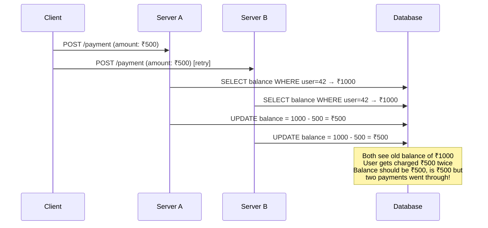

The database dutifully executes both updates. The user gets charged twice. Their wallet is drained. You get angry support tickets at 2am.

### Other Classic Race Conditions in Real Systems

| System | Race Condition |
|--------|---------------|
| Swiggy/Zomato | Two users buy the last available slot at a restaurant |
| BookMyShow | Two users book the same seat simultaneously |
| Uber | Two drivers accept the same ride request |
| Instagram | Two servers both try to generate the same username |
| YouTube | Two workers process the same video upload job |
| Netflix | Two cron jobs run the same recommendation batch |
| WhatsApp | Two servers deliver a message to the same device |

---

## The Single-Server Solution (and Why It Fails at Scale)

On a single server, you use a **mutex** (mutual exclusion lock). In Node.js, JavaScript is single-threaded so you rarely need explicit mutexes. In Java or Python with threads, you use `synchronized` or `Lock` objects.

These are in-memory locks. They exist inside one process's memory.

When you scale to multiple servers (horizontal scaling), these locks become useless. Server A's mutex is invisible to Server B. Each server has a completely separate memory space.

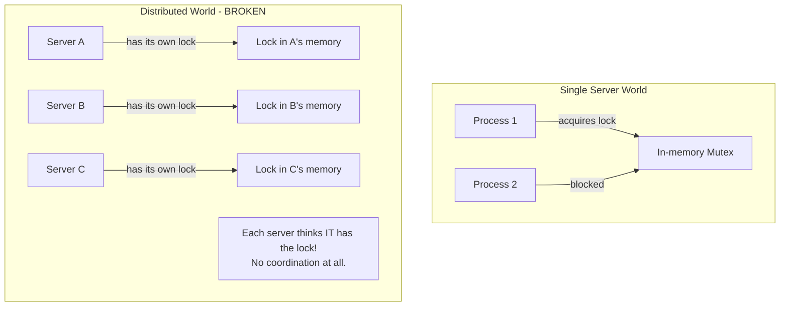

The solution: move the lock to a **shared external system** — Redis, ZooKeeper, or etcd.

---

## Redis Distributed Locks: The Most Common Approach

Redis is by far the most popular choice for distributed locks in web applications. It is fast (sub-millisecond), widely deployed, and has atomic operations.

### Step 0: The Naive, Broken Approach

Early engineers used Redis's `SETNX` (SET if Not eXists) command:

```
SETNX lock:payment "server-a"   # Acquire lock
# ... do work ...
DEL lock:payment                 # Release lock
```

This has a fatal flaw. What if the server crashes between `SETNX` and `DEL`? The lock is stuck forever. No server can ever acquire it again. Your system grinds to a halt.

Someone tried to fix this with a separate `EXPIRE`:

```
SETNX lock:payment "server-a"
EXPIRE lock:payment 10
```

Still broken! These are two separate commands. The server can crash between them. Or, in a Redis cluster, they might not execute atomically. Same stuck-lock problem.

### Step 1: The Correct Approach — SET NX PX

Redis 2.6.12 added the ability to combine `SETNX` and `EXPIRE` into a single atomic command:

```
SET lock:payment "unique-token-abc" NX PX 10000
```

Breaking this down:
- `lock:payment` — the key name (your lock's identity)
- `"unique-token-abc"` — a random, unique value (we will see why this matters)
- `NX` — only set if the key does **N**ot e**X**ist
- `PX 10000` — expire in 10,000 **m**illiseconds (10 seconds)

This command is atomic. It either works completely or fails completely. No partial state possible.

If Redis returns `OK`, you have the lock. If it returns `nil`, someone else has it.

### Why the Value Must Be Unique

This is subtle but critical. When you release the lock, you should only delete it if YOU are the one who holds it.

Consider this scenario:
1. Server A acquires the lock with value `"server-a-token"`
2. Server A's work takes longer than expected
3. The lock's TTL expires
4. Server B acquires the lock with value `"server-b-token"`
5. Server A finishes and tries to `DEL lock:payment`
6. Server A just deleted Server B's lock!

By storing a unique token and checking it before deleting, you prevent this:

```lua
-- This Lua script runs atomically on Redis
if redis.call("GET", KEYS[1]) == ARGV[1] then
  return redis.call("DEL", KEYS[1])
else
  return 0
end
```

The check and delete are atomic because Lua scripts in Redis are executed atomically.

### Full Production Implementation in Node.js

```js
const redis = require('ioredis');
const { randomUUID } = require('crypto');

const client = new redis({ host: 'localhost', port: 6379 });

/**
 * Acquire a distributed lock.
 * Returns the lock token (string) if successful, null if already locked.
 */
async function acquireLock(lockKey, ttlMs = 10000) {
  // Use a UUID so each lock acquisition has a unique identifier.
  // This prevents Server A from accidentally releasing Server B's lock.
  const token = randomUUID();

  // SET key value NX PX ttl — this is one atomic Redis command
  const result = await client.set(lockKey, token, 'NX', 'PX', ttlMs);

  return result === 'OK' ? token : null;
}

/**
 * Release the lock — ONLY if we are the current owner.
 * Uses a Lua script so the check + delete is atomic.
 */
async function releaseLock(lockKey, token) {
  const luaScript = `
    if redis.call("GET", KEYS[1]) == ARGV[1] then
      return redis.call("DEL", KEYS[1])
    else
      return 0
    end
  `;
  const result = await client.eval(luaScript, 1, lockKey, token);
  return result === 1;
}

/**
 * Extend the lock TTL — used by the watchdog timer.
 * Only extends if we still own the lock.
 */
async function extendLock(lockKey, token, ttlMs) {
  const luaScript = `
    if redis.call("GET", KEYS[1]) == ARGV[1] then
      return redis.call("PEXPIRE", KEYS[1], ARGV[2])
    else
      return 0
    end
  `;
  const result = await client.eval(luaScript, 1, lockKey, token, ttlMs);
  return result === 1;
}

/**
 * Execute fn() while holding a distributed lock.
 * Includes a watchdog timer that refreshes the TTL while work is ongoing.
 */
async function withLock(lockKey, fn, options = {}) {
  const { ttlMs = 10000, retryDelayMs = 100, maxRetries = 10 } = options;

  // Try to acquire the lock with retries
  let token = null;
  for (let attempt = 0; attempt <= maxRetries; attempt++) {
    token = await acquireLock(lockKey, ttlMs);
    if (token) break;

    if (attempt < maxRetries) {
      // Exponential backoff with jitter to avoid thundering herd
      const jitter = Math.random() * retryDelayMs;
      await new Promise(r => setTimeout(r, retryDelayMs + jitter));
    }
  }

  if (!token) {
    throw new Error(`Could not acquire lock "${lockKey}" after ${maxRetries} retries`);
  }

  // Watchdog timer: refresh the lock TTL every (ttlMs / 3) ms
  // This prevents the lock from expiring while we are doing legitimate work
  const watchdogInterval = setInterval(async () => {
    const extended = await extendLock(lockKey, token, ttlMs);
    if (!extended) {
      console.error(`Watchdog: Failed to extend lock ${lockKey} — lock may have been lost!`);
    }
  }, Math.floor(ttlMs / 3));

  try {
    return await fn();
  } finally {
    clearInterval(watchdogInterval); // Stop the watchdog
    await releaseLock(lockKey, token);
  }
}

// --- Real Usage: Payment Processing ---

async function processPayment(userId, amount, idempotencyKey) {
  // Lock is scoped to the specific user, not all payments
  // "lock:payment:user:42" not "lock:payment" — maximize concurrency
  const lockKey = `lock:payment:user:${userId}`;

  await withLock(lockKey, async () => {
    const balance = await db.getBalance(userId);

    if (balance < amount) {
      throw new Error('Insufficient funds');
    }

    await db.deductBalance(userId, amount);
    await db.recordTransaction({ userId, amount, idempotencyKey });
  }, { ttlMs: 5000 }); // 5 second TTL — payments should be fast
}
```

### The Lock Lifecycle Diagram

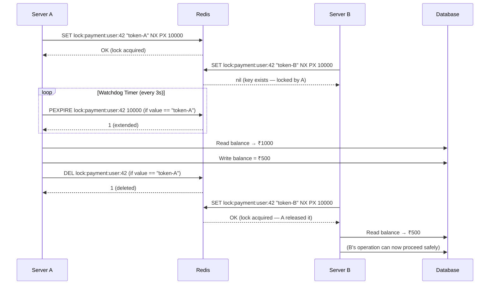

---

## The Watchdog Timer: Solving the "Work Takes Too Long" Problem

### The Problem

You set a TTL of 10 seconds because you expect your operation to take at most 5 seconds. But then:
- The database is slow today (maybe replication lag)
- A third-party API call takes 8 seconds instead of 1
- A sudden traffic spike causes your server to slow down

Your lock expires at 10 seconds. Another server acquires the lock. Now two servers are in the critical section simultaneously — exactly what locks are supposed to prevent.

### The Watchdog Solution

A watchdog timer is a background thread (or interval) that periodically **refreshes the lock's TTL** as long as your server is still alive and working.

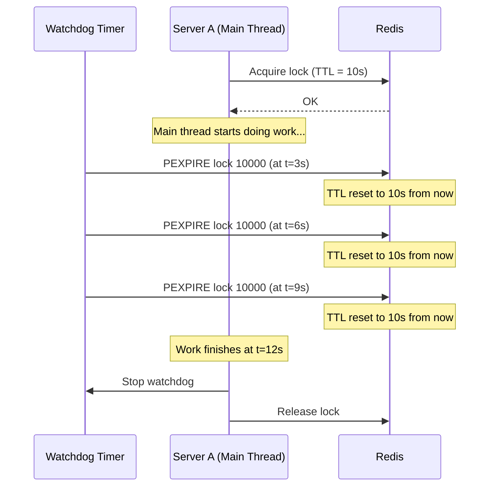

The watchdog sends a "heartbeat" every 3 seconds (one-third of the TTL). As long as the server is alive, the lock stays alive. If the server crashes, the watchdog stops, heartbeats stop, and the lock expires naturally after 10 seconds.

This is exactly how **Redisson** (the popular Java Redis client) implements its distributed locks. It is also how many production systems work.

**Caveat**: the watchdog does NOT protect against garbage collection pauses or OS-level process freezes. If your process pauses for 15 seconds (rare but possible with Java GC), the watchdog also pauses and the lock expires. This is where fencing tokens become necessary (covered later).

---

## Redlock: Multi-Node Redis Locking

### The Problem With a Single Redis Node

Your Redis server is a single point of failure. If it goes down:
- Clients that held locks can no longer release them
- Other clients cannot acquire locks
- Your critical sections are either blocked or unprotected

What about Redis Replication (primary-replica)? That introduces another problem.

Scenario:
1. Server A acquires the lock on the Redis primary
2. The primary crashes before replicating the lock key to the replica
3. The replica is promoted to primary
4. The new primary has no record of the lock
5. Server B acquires the lock on the new primary
6. Now BOTH Server A and Server B think they hold the lock

This is called **split-brain** and it is dangerous.

### The Redlock Algorithm

Salvatore Sanfilippo (creator of Redis, known as "antirez") designed Redlock to address this. The key insight: use **5 independent Redis nodes** with no replication between them. A lock is only acquired if you get a majority (3/5) of them.

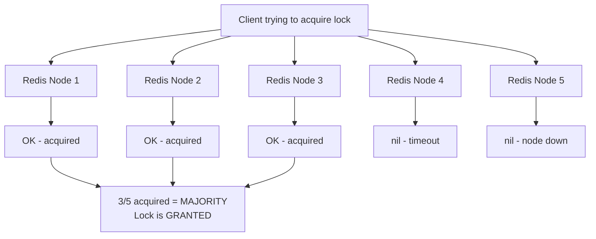

### Redlock Algorithm Step-by-Step

1. **Get current timestamp** `t1` in milliseconds
2. **Try to acquire the lock on all 5 nodes simultaneously**, using the same key name and same unique token, with a small per-node timeout (e.g., 50ms) so a slow node does not block you
3. **Count successes.** If you got 3 or more:
   - Calculate elapsed time: `elapsed = now - t1`
   - Calculate effective TTL: `effective_ttl = original_ttl - elapsed`
   - If `effective_ttl > 0`, the lock is acquired. Start your work.
4. **If you got fewer than 3** (or effective_ttl <= 0):
   - Release the lock on ALL nodes you acquired (even partial acquires)
   - Wait a random time and retry

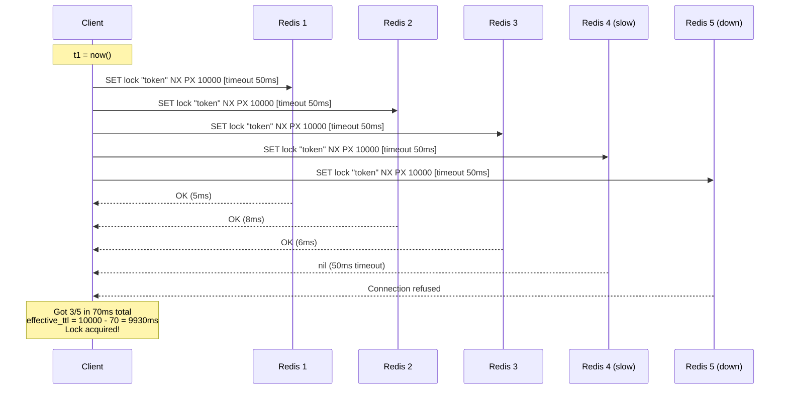

### Why Majority (Quorum) Works

If 2 nodes are down, you still have 3. A lock acquired on 3 independent nodes cannot be stolen by another client trying to acquire a majority — they would also need 3, and 2 of those 3 nodes already have your lock.

This is the same quorum principle used in databases like Cassandra and Raft consensus.

### The Famous Redlock Controversy

In 2016, Martin Kleppmann (author of "Designing Data-Intensive Applications") wrote a detailed blog post arguing Redlock is unsafe for use cases requiring strong correctness guarantees.

His core argument:

> A process can be paused (due to garbage collection, OS scheduler, VM migration) for longer than the lock's TTL. When it wakes up, it believes it still holds the lock, but it has already expired and another process holds it. Now you have two processes simultaneously believing they hold the lock.

This is true for **any** distributed lock implementation — not just Redlock. The solution is fencing tokens (see next section).

Antirez responded: Redlock is designed for distributed systems where you accept probabilistic guarantees. If you need strict correctness under all failure scenarios, use a system with stronger consistency guarantees (like ZooKeeper with fencing tokens).

| Aspect | Single Redis Node | Redlock (5 nodes) |
|--------|------------------|------------------|
| Availability if 1 node fails | Lock service DOWN | Still works |
| Availability if 2 nodes fail | N/A | Still works |
| Correctness with process pauses | Unsafe | Unsafe (same) |
| Split-brain resistance | No | Yes |
| Complexity | Very simple | Moderate |
| Infrastructure cost | 1 Redis | 5 Redis nodes |
| Setup time | Minutes | Hours |
| Good for | Dev/staging, low stakes | Production, cross-DC |

---

## Fencing Tokens: The Real Safety Net

### The Problem (Yeh Bahut Important Hai)

Even with the perfect distributed lock implementation, there is a failure mode that cannot be solved by locks alone.

Scenario:
1. Server A acquires a lock with a 10-second TTL
2. Server A starts processing. At second 8, the JVM hits a stop-the-world garbage collection pause
3. The entire process freezes. No threads run. No watchdog heartbeats. Nothing.
4. At second 11, the GC pause ends. The lock expired at second 10.
5. Server B sees the expired lock, acquires it
6. Server B starts writing data
7. Server A wakes up from its pause. It still **thinks** it holds the lock.
8. Server A also starts writing data
9. Both are writing simultaneously. Data corruption.

This is not theoretical. GC pauses of several seconds happen in production Java systems. AWS VM migrations, Linux swap storms, and network partitions can also cause this.

### Fencing Tokens: How They Work

The idea is elegant: every time a lock is granted, the lock service issues a **monotonically increasing integer** called a fencing token. The client includes this token in every write request to the downstream storage system. The storage system tracks the highest token it has seen and **rejects any request with a lower token**.

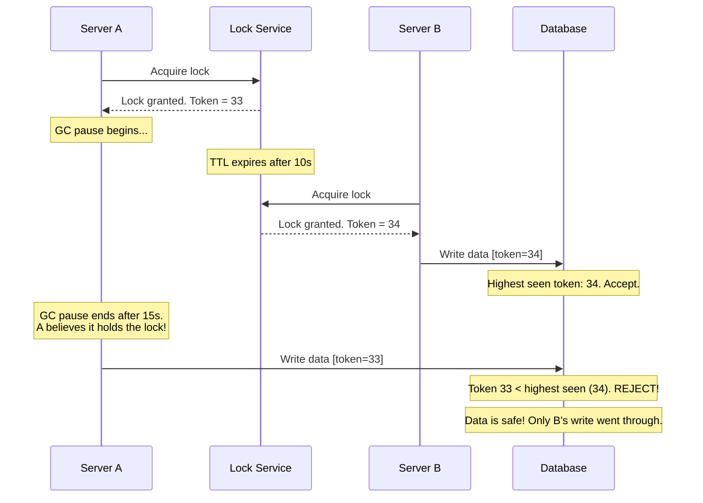

### How Tokens Stay Monotonically Increasing

- **ZooKeeper**: Sequential ephemeral nodes are automatically numbered in order. Node `/locks/payment-0000000042` is always followed by `/locks/payment-0000000043`. The number IS the fencing token.
- **Redis**: Use a separate `INCR` counter. When acquiring a lock, call `INCR lock:counter:payment` to get the next token.
- **etcd**: Use the revision number of the key. etcd assigns a globally monotonic revision to every write.

### The Critical Insight

The check must happen at the **resource level** — the database, the file system, the external API — not just at the lock level. The lock service only issues the token. The storage system enforces it.

```js
// Server-side: when processing a write request
async function processWrite(userId, data, fencingToken) {
  const currentToken = await redis.get(`fence:token:${userId}`);

  if (fencingToken <= parseInt(currentToken)) {
    throw new Error('Stale request: your lock has expired and was re-acquired by another process');
  }

  // Update the fence token and write atomically
  await db.transaction(async (tx) => {
    await tx.set(`fence:token:${userId}`, fencingToken);
    await tx.write(userId, data);
  });
}
```

---

## ZooKeeper Ephemeral Nodes

### Analogy: The Numbered Ticket System

You know those deli counters where you pull a numbered ticket? You get ticket 42. The display shows 38. You wait. When 42 is called, it is your turn. If someone leaves before their number is called, their ticket is discarded.

ZooKeeper works exactly like this, with one crucial twist: if you leave (crash, disconnect, lose network), your ticket is **automatically discarded**. You do not need to do anything. The system handles it.

### What Are Ephemeral Nodes?

ZooKeeper organizes data as a tree of nodes (like a filesystem). Nodes can be:
- **Persistent**: survive client disconnection
- **Ephemeral**: automatically deleted when the client session ends

When a client creates an ephemeral node, ZooKeeper maintains a session with that client via heartbeats. If heartbeats stop (client crashed, network partition), ZooKeeper waits a timeout period then deletes all ephemeral nodes that client created.

This is the perfect lock-release-on-crash mechanism.

### ZooKeeper Lock Algorithm

1. Create an ephemeral sequential node: `/locks/payment-` (ZooKeeper auto-numbers it, e.g., `/locks/payment-0000000042`)
2. List all nodes under `/locks/payment-`
3. If your node has the **lowest number**, you hold the lock. Start work.
4. Otherwise, **watch** the node with the number just before yours
5. When that node is deleted (because its holder finished or crashed), you get notified
6. Go back to step 2

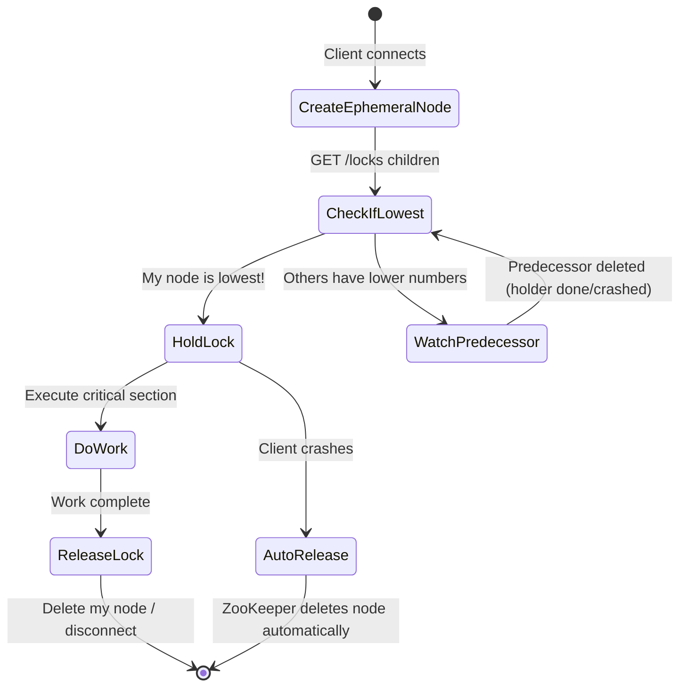

### The Node Queue in Action

```
/locks/payment-0000000041  ← Server A holds the lock (doing work)
/locks/payment-0000000042  ← Server B watches node 41
/locks/payment-0000000043  ← Server C watches node 42
```

Server A finishes and deletes its node (or crashes and ZooKeeper deletes it):

```
(node 41 deleted)
/locks/payment-0000000042  ← Server B is notified, gets the lock
/locks/payment-0000000043  ← Server C still watches node 42
```

This is a **fair lock** — FIFO order. No thundering herd. No random selection. Servers acquire the lock in the exact order they requested it.

### ZooKeeper Pseudocode

```python
import kazoo.client as zk_client
from kazoo.recipe.lock import Lock

zk = zk_client.KazooClient(hosts='zk1:2181,zk2:2181,zk3:2181')
zk.start()

# ZooKeeper provides a Lock recipe out of the box
lock = Lock(zk, "/locks/payment")

with lock:  # Blocks until lock is acquired
    # This block is protected — only one server runs this at a time
    process_payment(user_id, amount)
    # Lock is automatically released when the 'with' block exits
    # Even if an exception is thrown
    # Even if the process crashes (ZooKeeper sessions expire)
```

### Why Kafka Uses ZooKeeper for Leader Election

Kafka has partitions. Each partition has one leader broker. Leader election is essentially a distributed lock — only one broker should be the leader at any time.

ZooKeeper's ephemeral nodes are perfect: when a leader broker crashes, its ZooKeeper session expires, its ephemeral node is deleted, and a new leader election triggers automatically. No human intervention needed. This is why Kafka originally used ZooKeeper (and newer versions use KRaft, their own Raft-based consensus, for the same reason — strong consistency for leader election).

### ZooKeeper vs Redis Locks

| Feature | Redis SET NX | ZooKeeper Ephemeral Nodes |
|---------|-------------|--------------------------|
| Auto-release on crash | Only via TTL expiry | Yes, immediately on session expiry |
| Lock fairness | No (random retries) | Yes (FIFO sequential) |
| Fencing tokens | Manual (use INCR) | Built-in (sequential node number) |
| Throughput | Very high (>100k ops/sec) | Moderate (~10k ops/sec) |
| Setup complexity | Very simple | High (ZooKeeper cluster) |
| Watch/notification | Polling required | Built-in event-driven |
| Consistency | Eventual (async replication) | Strong (ZAB protocol) |
| Ecosystem | Universal | Primarily Java/JVM |
| Operational overhead | Low | Medium to high |
| Best for | High-throughput web apps | Leader election, coordination |

---

## etcd Leases

### What Is etcd?

etcd is the strongly consistent, distributed key-value store that is the backbone of Kubernetes. Every Kubernetes cluster config, pod state, and service discovery entry lives in etcd. It uses the Raft consensus algorithm to guarantee strong consistency.

### What Are Leases?

A lease is a time-limited contract. In etcd:
1. Create a lease with a TTL (e.g., 10 seconds)
2. Attach keys to the lease
3. Those keys automatically disappear when the lease expires
4. Keep the lease alive by sending periodic `KeepAlive` requests
5. Revoke the lease explicitly when done

```python
import etcd3

etcd = etcd3.client()

# Create a 10-second lease
lease = etcd.lease(10)

# Acquire the lock — put the key with the lease
etcd.put('/locks/payment', 'server-a', lease=lease)

# Background thread sends keepalives every few seconds
# lease.refresh() sends a keepalive

try:
    # Do your work here
    process_payment()
finally:
    # Explicitly revoke — deletes all keys attached to this lease immediately
    lease.revoke()
```

### etcd Transactions for Atomic Lock Acquisition

etcd supports conditional transactions (`compare-and-swap`) that make lock acquisition safe without Lua scripts:

```
txn:
  IF (key '/locks/payment' does not exist)
  THEN put '/locks/payment' = 'server-a' with lease
  ELSE return error
```

If the key already exists (someone holds the lock), the transaction fails. If not, it creates the key atomically. No race condition.

### Where etcd Locks Shine

etcd is used for locking in Kubernetes itself:
- The Kubernetes scheduler uses a leader election lock in etcd so only one scheduler is active at a time
- The controller manager does the same
- Custom operators use etcd leases for leader election via the `client-go` leader election library

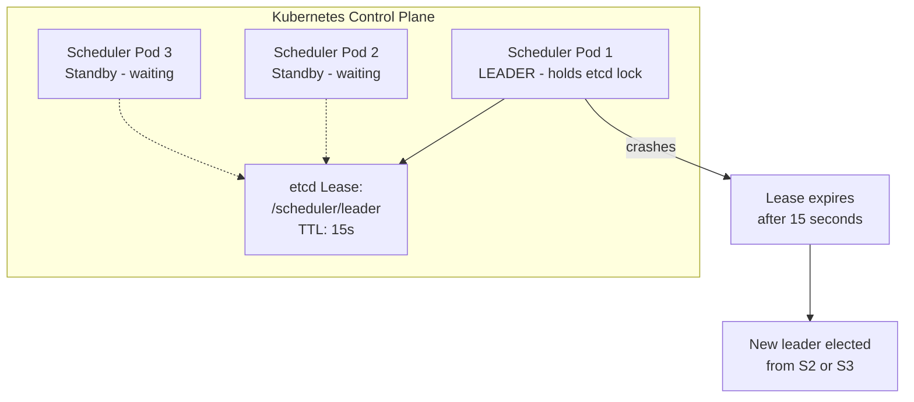

---

## The Thundering Herd Problem

When a lock is released, many waiting clients try to acquire it simultaneously. This is the "thundering herd" — a stampede of requests that spikes your Redis/ZooKeeper load.

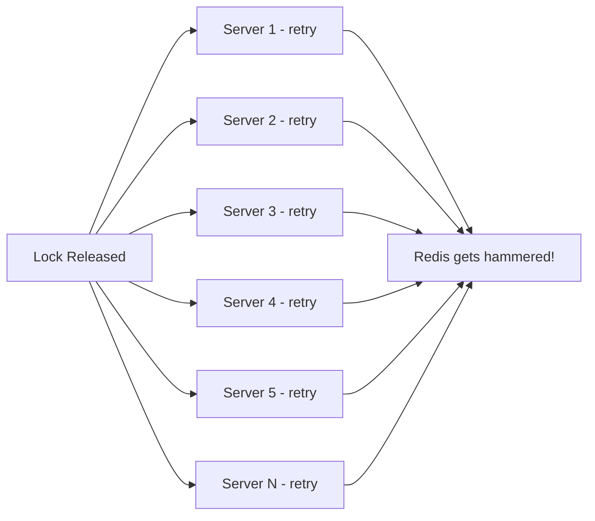

### Solutions

**1. Exponential Backoff With Jitter**

```js
async function acquireLockWithBackoff(lockKey, maxWaitMs = 30000) {
  const startTime = Date.now();
  let baseDelay = 50; // Start at 50ms

  while (Date.now() - startTime < maxWaitMs) {
    const token = await acquireLock(lockKey);
    if (token) return token;

    // Jitter prevents all servers from retrying at the exact same moment
    const jitter = Math.random() * baseDelay;
    await sleep(baseDelay + jitter);

    baseDelay = Math.min(baseDelay * 2, 2000); // Cap at 2 seconds
  }

  throw new Error(`Timed out waiting for lock: ${lockKey}`);
}
```

**2. ZooKeeper's Built-in Solution**

ZooKeeper's sequential watch mechanism avoids the thundering herd entirely. Each client watches only the node just before theirs. When a lock is released, only ONE client (the next in line) is notified. Nobody else wakes up.

**3. Redis WAIT-based approaches**

Use Redis pub/sub. The lock holder publishes a message to a channel when releasing. Waiters subscribe and only one actually succeeds in acquiring.

---

## Deadlocks in Distributed Locks

### How Deadlocks Happen

Process A holds lock on Resource 1, wants lock on Resource 2.
Process B holds lock on Resource 2, wants lock on Resource 1.
Neither can proceed. They wait forever.

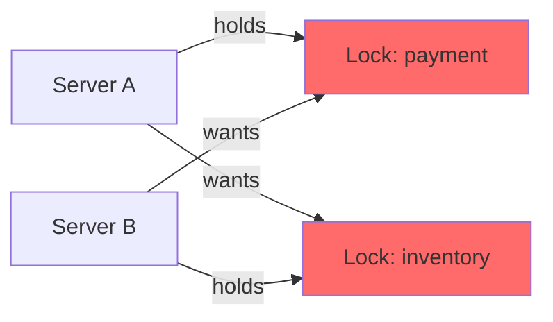

### Prevention Strategies

**1. Always Use TTLs**

Every lock must have an expiry. The deadlock resolves eventually (not gracefully, but it resolves).

**2. Lock Ordering**

If you need multiple locks, always acquire them in a deterministic order (alphabetical, by ID, etc.):

```js
// BAD: can deadlock
// Server A: acquires lock:user:1, then lock:user:2
// Server B: acquires lock:user:2, then lock:user:1

// GOOD: always acquire in sorted order
async function transferBetweenUsers(fromUserId, toUserId, amount) {
  const lockKeys = [
    `lock:user:${fromUserId}`,
    `lock:user:${toUserId}`
  ].sort(); // Always alphabetical order

  const tokens = [];
  for (const key of lockKeys) {
    const token = await acquireLock(key);
    if (!token) {
      // Release all acquired locks and give up
      for (let i = 0; i < tokens.length; i++) {
        await releaseLock(lockKeys[i], tokens[i]);
      }
      throw new Error('Could not acquire all locks');
    }
    tokens.push(token);
  }

  try {
    await doTransfer(fromUserId, toUserId, amount);
  } finally {
    for (let i = 0; i < lockKeys.length; i++) {
      await releaseLock(lockKeys[i], tokens[i]);
    }
  }
}
```

**3. Fail-Fast (Try-Lock)**

Do not wait for a lock. If you cannot get it immediately, return an error. Let the client retry.

```js
const token = await acquireLock(lockKey); // No retry loop
if (!token) {
  return { success: false, retryAfter: 2000, reason: 'resource_busy' };
}
```

---

## When NOT to Use Distributed Locks

This section might be the most important. Distributed locks are powerful, but they are frequently the WRONG tool. Yeh galat use karna bahut aasaan hai.

### Alternatives That Are Usually Better

**1. Database Transactions with SELECT FOR UPDATE**

If your data lives in a single relational database, use the database's own locking:

```sql
BEGIN;
SELECT balance FROM accounts WHERE user_id = 42 FOR UPDATE;
-- This row is now locked at the DB level
-- No other transaction can read/write it until we COMMIT or ROLLBACK

UPDATE accounts SET balance = balance - 500 WHERE user_id = 42;
COMMIT;
```

This is simpler, faster, and battle-tested. The database handles lock acquisition, waiting, and release. You get ACID guarantees for free.

**2. Optimistic Concurrency Control (Version Numbers)**

Instead of locking before a write, tag records with a version and check it on write:

```sql
-- Read
SELECT balance, version FROM accounts WHERE user_id = 42;
-- Returns: balance=1000, version=7

-- Write (only succeeds if version is still 7)
UPDATE accounts
SET balance = 500, version = 8
WHERE user_id = 42 AND version = 7;
-- If 0 rows affected: someone else changed it. Retry.
```

No lock needed. High concurrency. Works great when conflicts are rare.

**3. Idempotency Keys**

Make your operations idempotent. Then even if two requests arrive, only one takes effect:

```sql
-- Payment table has a unique constraint on idempotency_key
INSERT INTO payments (idempotency_key, user_id, amount, status)
VALUES ('pay_abc123', 42, 500, 'completed')
ON CONFLICT (idempotency_key) DO NOTHING;
-- Second identical request is silently ignored
```

No lock needed. The database's unique constraint prevents double processing.

**4. Message Queues with Single Consumer**

For job processing, instead of locking, use a queue with a single consumer per partition. Kafka partitions, SQS FIFO queues, and RabbitMQ exclusive consumers all provide ordering guarantees without explicit locks.

### The Decision Matrix

| Situation | Recommended Approach |
|-----------|---------------------|
| All data in one SQL database | `SELECT FOR UPDATE` or optimistic locking |
| Conflicts are rare (< 5%) | Optimistic concurrency control |
| Operation is idempotent | Idempotency keys, just retry |
| Duplicate API calls from clients | Idempotency keys (Stripe-style) |
| Job deduplication | Distributed lock or queue deduplication |
| Exactly-one cron job across servers | Distributed lock or leader election |
| Leader election | ZooKeeper / etcd (not Redis) |
| Cross-service resource reservation | Distributed lock |
| Rate limiting a shared external API | Distributed lock or Redis rate limiter |
| Event ordering guarantees | Kafka partition assignment |

### The Hidden Costs to Consider

Before adding a distributed lock, ask:

1. **What happens when Redis/ZooKeeper goes down?** If the lock service is down, do ALL operations fail? You just created a single point of failure.

2. **How long will the lock be held?** Locking for > a few seconds is a design smell. Long-held locks reduce throughput and increase blast radius.

3. **Are you locking too broadly?** `lock:payment` serializes ALL payments. `lock:payment:user:42` only serializes payments for user 42. The second is almost always what you want.

4. **Can you use eventual consistency instead?** Many problems that seem to need locks can be solved with event sourcing, CRDT, or accepting occasional conflicts and resolving them later.

---

## Real-World Usage at Scale

### Swiggy / Zomato: Order Slot Management

When a restaurant is about to hit capacity, order placement needs locking. The lock is scoped to `lock:restaurant:{restaurant_id}:slot:{time_slot}`. TTL is kept short (2-3 seconds). If they cannot get the lock in 500ms, they return "busy, try again" to the client rather than making the customer wait.

### Netflix: Distributed Cron Jobs

Netflix runs thousands of scheduled tasks. Many tasks cannot run in parallel (e.g., "rebuild recommendation index for all users"). They use Redlock to ensure only one instance of each cron job runs at a time, even across multiple data centres.

The pattern: each cron job tries to acquire a lock at startup. If it gets the lock, it runs. If not, it exits gracefully. The lock TTL is set slightly longer than the job's expected duration. A watchdog extends the TTL as the job runs.

### Uber: Ride Matching

When a driver accepts a ride, the system must atomically:
1. Mark the ride as "matched"
2. Mark the driver as "busy"
3. Notify the rider

This is a distributed transaction across multiple services. A distributed lock on the ride ID prevents two drivers from simultaneously accepting the same ride.

### Kafka: Leader Election (ZooKeeper)

Every Kafka partition has exactly one leader broker that handles all reads and writes. When a broker crashes, a new leader must be elected. ZooKeeper's ephemeral nodes handle this:

1. All brokers that want to be leader create an ephemeral node at `/controller` (for the controller election) or watch partition leader metadata
2. The broker whose node gets created first becomes the leader
3. If the leader crashes, its ephemeral node disappears
4. ZooKeeper notifies all watching brokers
5. They race to create a new node — the winner is the new leader

This is why Kafka REQUIRES ZooKeeper (in older versions). Leader election is a distributed coordination problem that ZooKeeper is purpose-built to solve.

### Distributed Cron System (Like Chronos / Quartz Cluster)

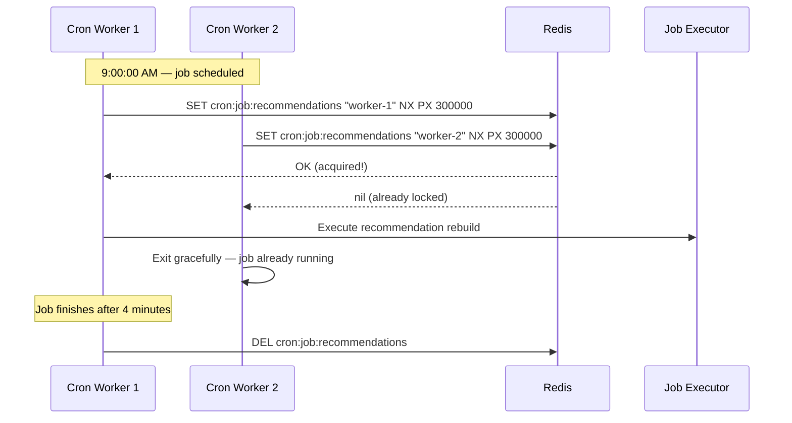

---

## Summary Comparison: All Approaches

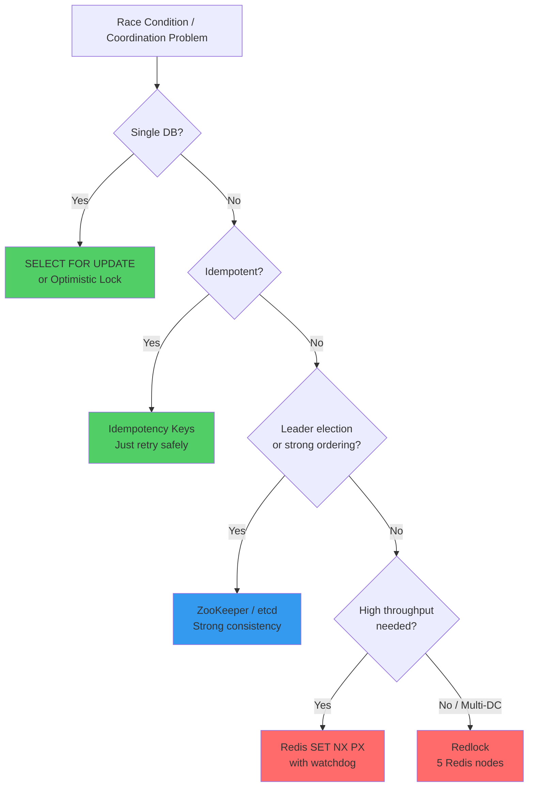

| Feature | Redis SET NX | Redlock | ZooKeeper | etcd |
|---------|-------------|---------|-----------|------|
| Auto-release on crash | Via TTL only | Via TTL only | Yes (ephemeral) | Yes (lease) |
| Lock fairness (FIFO) | No | No | Yes | No |
| Fencing token | Manual | Manual | Built-in | Via revision |
| Consistency | Eventual | Majority | Strong (ZAB) | Strong (Raft) |
| Throughput | Very High | High | Moderate | High |
| Setup complexity | Trivial | Moderate | High | Moderate |
| Infrastructure cost | 1 node | 5 nodes | 3-5 nodes | 3-5 nodes |
| Process pause safety | No | No | No | No |
| Process pause + fencing | Yes (manual) | Yes (manual) | Yes (built-in) | Yes (manual) |
| Best ecosystem | All | All | Java/JVM | Kubernetes |

---

## Interview Deep-Dive: Scenarios and Answers

### Scenario 1: "Design the payment system for Swiggy so customers are never double-charged."

Good answer:
1. Use an idempotency key (order ID) — insert with `ON CONFLICT DO NOTHING`
2. For the critical section (balance deduction), use `SELECT FOR UPDATE` in the DB if payments are on one DB
3. If payments are distributed across services, use a Redis distributed lock scoped to `lock:payment:user:{userId}`
4. Always include a fencing token when calling the payment gateway

### Scenario 2: "How would you ensure only one cron job runs at a time across 20 servers?"

Good answer:
1. When the cron job starts, try to acquire `lock:cron:{job_name}` with Redis SET NX PX
2. TTL = (expected job duration × 1.5) for safety margin
3. Use a watchdog timer to extend TTL as the job runs
4. If lock acquisition fails, exit immediately (another worker is running)
5. Lock is released when job completes (or watchdog stops on crash, TTL expires)

### Scenario 3: "Explain why Redlock might not be safe for a financial transaction system."

Good answer:
1. Process pauses (GC, VM migration) can cause a lock holder to outlive its TTL
2. After the pause, two processes believe they hold the lock
3. Both can write to the database simultaneously
4. Redlock does not protect against this — it is a fundamental distributed systems problem
5. The solution: use fencing tokens. The database rejects writes with older tokens
6. Or: use a database-level transaction instead of a distributed lock

---

## Common Interview Questions

**Q1: What is the difference between SETNX and SET NX PX in Redis?**

SETNX is a standalone command that does not support TTL. You need a separate EXPIRE command, creating a non-atomic two-step that can leave stuck locks. `SET key value NX PX timeout` is atomic — the key either gets created with a TTL or it does not. Always use the latter.

**Q2: Why should the lock value be a unique token (UUID) instead of the server's hostname?**

If a lock expires and Server B acquires it, Server A (which held the expired lock) might still try to release the lock after finishing its work. If the value is just the server's hostname, Server A would delete Server B's lock. With a unique token, Server A's release attempt fails the check (Redis has Server B's token, not Server A's) and is safely rejected.

**Q3: What is a watchdog timer in the context of distributed locks?**

A background process that periodically refreshes the lock's TTL while the main thread is doing work. This prevents the lock from expiring during legitimate long-running operations. If the main thread crashes, the watchdog also dies, heartbeats stop, and the lock expires naturally. Redisson (Java Redis client) implements this automatically.

**Q4: A lock holder pauses due to Java GC for 20 seconds. The lock's TTL is 10 seconds. Another server acquires the lock. The first server wakes up and thinks it has the lock. How do you prevent data corruption?**

Use fencing tokens. The lock service issues a monotonically increasing token on each grant. The database tracks the highest token seen and rejects writes with lower tokens. When the first server wakes up and tries to write with token 5 (the old grant), the database sees token 6 already used by the second server and rejects token 5.

**Q5: Why would you choose ZooKeeper over Redis for distributed locking?**

ZooKeeper when:
- You need automatic lock release on crash (not just TTL-based expiry)
- You need FIFO fairness (no starvation)
- You need built-in fencing tokens (sequential node numbers)
- You need strong consistency guarantees (ZAB protocol)
- You are already using ZooKeeper for other coordination (Kafka)

Redis when:
- Throughput is critical (Redis handles 10-100x more ops/sec than ZooKeeper)
- You want simple setup (single Redis vs ZooKeeper cluster)
- You are already using Redis for caching (fewer infrastructure components)
- Eventual consistency is acceptable for your use case

**Q6: What is the Redlock algorithm and when should you use it?**

Redlock acquires a lock on 5 independent Redis nodes simultaneously. You succeed if 3+ (majority) respond with OK. If fewer than 3 respond or the acquisition takes too long (longer than the TTL), you release on all nodes and retry.

Use when: single Redis is a SPOF you cannot tolerate, and you need cross-DC lock availability. The lock must still be combined with fencing tokens for true safety.

**Q7: How do you prevent deadlocks when acquiring multiple locks?**

Always acquire multiple locks in a deterministic order (sorted by key name, by resource ID, etc.). If Server A and Server B both need lock:user:1 and lock:user:2, they should both acquire lock:user:1 first. This way they will never be in a circular wait.

**Q8: What is the thundering herd problem in distributed locking?**

When a lock is released, all waiting clients simultaneously try to acquire it. This spikes load on Redis/ZooKeeper. Solutions: exponential backoff with jitter (each client waits a random amount), ZooKeeper's watch mechanism (only the next-in-line client is notified), or Redis pub/sub notification.

**Q9: Can you use a distributed lock to prevent duplicate payments at massive scale (like Google Pay)?**

At Google Pay scale, a Redis-based lock per user would be a bottleneck. Better approaches:
1. **Idempotency keys**: each payment has a unique key. Database unique constraint prevents duplicates. No lock needed.
2. **Database-level optimistic locking**: version numbers on account records.
3. **Event sourcing**: payments are events. Duplicate detection is done by event ID.

Distributed locks are for correctness, not performance. At massive scale, design your way out of needing them.

**Q10: What is the difference between a distributed lock and leader election?**

Both use the same underlying primitives (acquiring exclusive access). Leader election is long-lived — the elected leader holds the "lock" for a long time and does ongoing work. It is released only on crash or voluntary step-down. Distributed locks are short-lived — held for the duration of a specific operation (milliseconds to seconds). Leader election typically uses ZooKeeper or etcd because of the need for automatic release on crash (ephemeral nodes/leases).

---

## Key Takeaways

1. **Race conditions in distributed systems** occur because multiple servers share state but have separate memory. A lock in Server A's memory is invisible to Server B.

2. **Redis SET key value NX PX timeout** is the modern, atomic way to acquire a distributed lock. It is a single command — no separate SETNX + EXPIRE required.

3. **Always store a unique token as the lock value**. Use a Lua script to check the token before deleting. This prevents Server A from accidentally releasing Server B's lock.

4. **The watchdog timer** extends the lock TTL while the holder is doing legitimate work. It prevents the lock from expiring during slower-than-expected operations. If the holder crashes, the watchdog dies too and the lock expires naturally.

5. **Redlock** provides fault tolerance by requiring majority quorum across 5 independent Redis nodes. It survives 2 node failures but does NOT solve the process-pause problem.

6. **ZooKeeper ephemeral nodes** automatically delete when a client session ends. This gives you crash-safe locks without relying on TTLs. The sequential numbering provides built-in fencing tokens and FIFO fairness.

7. **etcd leases** are the Kubernetes-native equivalent. Kubernetes itself uses them for scheduler and controller-manager leader election.

8. **Fencing tokens** are the missing safety layer. Even perfect lock implementations cannot prevent process pauses from causing two concurrent lock holders. Fencing tokens let downstream systems reject stale writes.

9. **Deadlocks are prevented** by: always using TTLs (breaks deadlocks eventually), acquiring multiple locks in deterministic order, and using exponential backoff with jitter on retry.

10. **Distributed locks are often the wrong tool**. Prefer `SELECT FOR UPDATE`, optimistic concurrency control, or idempotency keys. They are simpler, have fewer failure modes, and scale better.

11. **Lock granularity matters enormously**. `lock:payment:user:42` (per-user) allows parallel payments for different users. `lock:payment` (global) serializes all payments system-wide. Always lock the minimum necessary scope.

12. **The lock service is a critical dependency**. If Redis goes down and all your operations require a lock, you have made Redis a single point of failure for your entire system. Design for lock service unavailability.

---

*Next: Consistent Hashing — how distributed systems decide which server is responsible for which data, without reshuffling everything when servers join or leave.*
