# Idempotency in Distributed Systems

> "Do it once, do it a thousand times — same result." That is the promise of idempotency, and it is what separates systems that merely work from systems that are truly reliable.

---

## Table of Contents

1. [What Is Idempotency?](#1-what-is-idempotency)
2. [Why Networks Fail and Why This Matters](#2-why-networks-fail-and-why-this-matters)
3. [HTTP Methods and Idempotency](#3-http-methods-and-idempotency)
4. [Idempotency Keys — The Gold Standard](#4-idempotency-keys--the-gold-standard)
5. [Implementation: Step-by-Step](#5-implementation-step-by-step)
6. [TTL on Idempotency Keys](#6-ttl-on-idempotency-keys)
7. [Idempotency in Payment Systems (Stripe, Razorpay)](#7-idempotency-in-payment-systems)
8. [Database-Level Idempotency](#8-database-level-idempotency)
9. [Message Queue Idempotency — Kafka and SQS](#9-message-queue-idempotency)
10. [Delivery Guarantees: At-Least-Once vs Exactly-Once](#10-delivery-guarantees)
11. [The Exactly-Once Myth](#11-the-exactly-once-myth)
12. [Real-World Case Studies](#12-real-world-case-studies)
13. [When to Use and When NOT to Use Idempotency Keys](#13-when-to-use-and-when-not-to)
14. [Trade-offs and Edge Cases](#14-trade-offs-and-edge-cases)
15. [Common Interview Questions](#15-common-interview-questions)
16. [Key Takeaways](#16-key-takeaways)

---

## 1. What Is Idempotency?

### The ATM Analogy (samjho aise)

You are at an ATM withdrawing ₹5,000. You tap "Confirm." The screen freezes. The machine makes a grinding noise. No money comes out. You tap "Confirm" again. Then again. Then the machine restarts.

Now here is the question that determines whether you trust this bank: **did you just withdraw ₹5,000 or ₹15,000?**

If the bank's system is **idempotent**, all three taps are treated as one request. You get ₹5,000 (or nothing, if it never processed). If the system is **not idempotent**, you get charged three times and have to spend the next week calling customer support.

That is idempotency in one real-world moment.

### The Formal Definition

**Idempotency** means: performing the same operation multiple times produces exactly the same result as performing it once. The state of the system after 1 call is identical to the state after 5 calls.

Mathematically: `f(f(x)) = f(x)`

In system design terms:
- Call `POST /orders` once with the same request → 1 order created
- Call `POST /orders` five times with the same request → still 1 order created
- Call `GET /orders/123` five times → same order data returned, nothing changes

### Why It Is Not Obvious

The tricky part is this: **idempotency is not just about returning the same response**. It is about the **side effects** being the same. Consider:

- Sending one email vs. sending the same email three times — the recipient inbox is the side effect
- Charging ₹500 once vs. three times — the customer's bank balance is the side effect
- Creating one Zomato order vs. three — the restaurant receiving three orders is the side effect

Idempotency means: no matter how many times you execute the operation with the same input, the **observable world** (database, emails sent, money charged) looks exactly as if you had done it once.

---

## 2. Why Networks Fail and Why This Matters

### The WhatsApp Double-Tick Analogy

You send a WhatsApp message. One grey tick — sent. Then the app crashes. You reopen it, the message still shows one grey tick. Did it send or not? WhatsApp's solution: it retries automatically. And it uses message IDs to make sure the recipient only sees the message once even if WhatsApp's servers received it three times.

That is idempotency keeping your chat clean.

### yeh kyun important hai — The Real Problem

In any distributed system — any system where a client talks to a server over a network — there are exactly **three outcomes** for any request:

```
Client sends request ──────► Server processes ──────► Response returns to Client
```

But networks are not reliable pipelines. Things go wrong at every step:

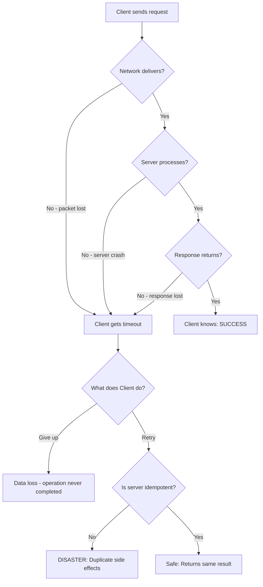

The key insight: **when a client gets a timeout, it has NO idea what happened on the server**. The server might have:
1. Never received the request (safe to retry)
2. Received the request, failed mid-way (safe to retry)
3. Received the request, processed it, but the response was lost (DANGEROUS to retry without idempotency)

Case 3 is the killer. The server already charged the customer, sent the confirmation email, and deducted inventory. The client retries. Without idempotency, all of that happens again.

### Real Failure Scenarios

| Failure Mode | What Happens | Retry Without Idempotency |
|---|---|---|
| Client timeout (request lost) | Server never saw it | Safe retry |
| Client timeout (server processed, response lost) | Server already did the work | DOUBLE CHARGE |
| Server crash during processing | Partial work done | Inconsistent state |
| Load balancer drops connection | Could be either | Unknown — dangerous |
| Mobile app restart mid-request | Unknown state | Unknown — dangerous |
| Network partition | Request may or may not have arrived | Unknown — dangerous |

**In production at scale, ALL of these happen constantly.** Uber processes millions of rides. Swiggy handles lakhs of orders. Zomato processes payments every second. Without idempotency, a 0.01% network failure rate means thousands of double charges per day.

---

## 3. HTTP Methods and Idempotency

### The Library Book Analogy

Think of a librarian:
- **"What books do you have?"** — Ask a hundred times, you get the same answer. Nothing changes. (GET)
- **"Put this book on shelf 5A."** — Do it a hundred times, the book is on shelf 5A. Same state. (PUT)
- **"Remove this book."** — Do it a hundred times, the book is removed. Same state. (DELETE)
- **"Order a new copy of this book."** — Do it a hundred times, you have a hundred copies ordered. DANGER! (POST)

### HTTP Methods: Idempotency Table

| Method | Idempotent? | Safe? | Changes State? | Notes |
|---|---|---|---|---|
| GET | Yes | Yes | No | Read-only. Always safe to repeat. |
| HEAD | Yes | Yes | No | Like GET, just no body. |
| OPTIONS | Yes | Yes | No | Asks what methods are supported. |
| PUT | Yes | No | Yes | Replaces a resource completely. `PUT /users/1` with same body = same user state. |
| DELETE | Yes | No | Yes | After first call: resource gone. Subsequent calls: still gone (404 or 200). State is same. |
| POST | **No** | No | Yes | Creates new resources. Creates duplicates on retry. |
| PATCH | **No** | No | Yes | Partial updates. `PATCH /balance {add: 100}` applied twice = +200. |

> **"Safe"** means the operation has no side effects (does not modify server state).
> **"Idempotent"** means repeating it produces the same state.
> Every safe method is idempotent, but not every idempotent method is safe.

### The DELETE Edge Case (interview favourite)

DELETE is idempotent but gets tricky. Consider:

```
DELETE /orders/123

First call:  → 200 OK (order deleted)
Second call: → 404 Not Found (already deleted)
```

Different response codes! But the **state of the system** is identical — the order does not exist. This is still idempotent because idempotency is about **system state**, not **HTTP status codes**.

However, some API designs return 200 for repeated deletes to make client code simpler. Both are valid choices.

### Making POST Idempotent

POST is not naturally idempotent, but you need POST for creating resources. Three patterns:

**Pattern 1: Idempotency-Key Header (Stripe style)**
```http
POST /api/v1/orders
Idempotency-Key: 550e8400-e29b-41d4-a716-446655440000
Content-Type: application/json

{
  "restaurant_id": "rest_zomato_123",
  "items": [{"dish_id": "paneer_butter_masala", "qty": 2}],
  "delivery_address_id": "addr_456"
}
```

**Pattern 2: Client-Generated ID in Body**
```http
POST /api/v1/orders
Content-Type: application/json

{
  "client_order_id": "ord_myapp_uuid_abc123",
  "restaurant_id": "rest_zomato_123",
  "items": [{"dish_id": "paneer_butter_masala", "qty": 2}]
}
```

The server uses `INSERT ON CONFLICT DO NOTHING` with `client_order_id` as the unique key.

**Pattern 3: Use PUT Instead (resource-oriented)**
```http
PUT /api/v1/orders/ord_myapp_uuid_abc123
Content-Type: application/json

{
  "restaurant_id": "rest_zomato_123",
  "items": [{"dish_id": "paneer_butter_masala", "qty": 2}]
}
```

The client generates the ID, and PUT is naturally idempotent. Clean and simple.

---

## 4. Idempotency Keys — The Gold Standard

### The Restaurant Token Analogy

Imagine you go to a crowded restaurant and the waiter gives you a token — Token #47. You place your order. Chaos ensues, you get separated from your group. You go back to the counter and ask again: "I want to order biryani." The waiter looks at your token. "Token #47? We already have your order, here's your confirmation." You don't get a second biryani.

That token is the idempotency key.

### How Idempotency Keys Work

The client generates a unique key (UUID) **before** sending the request. This key represents "this specific operation I intend to perform." The key is sent with the request, and the server uses it to detect and deduplicate retries.

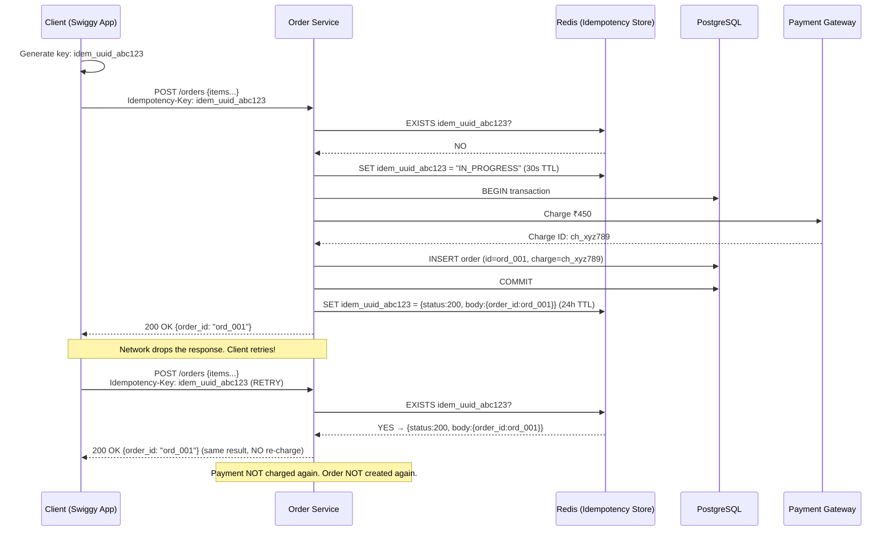

### Key Design Decisions

| Decision | Recommendation | Why |
|---|---|---|
| Who generates the key? | Always the **client** | Server cannot distinguish a retry from a new request |
| Key format | UUID v4 (random 128-bit) | Low collision probability; not guessable |
| Key scope | Per user + per endpoint | Prevents cross-user key collisions |
| TTL | 24h for payments, 7 days for critical ops | Balance storage cost vs. safety window |
| Storage | Redis (fast) + DB (durable) | Redis for speed on hot path, DB as fallback |
| Same key, different body | Return 422 Unprocessable | Body mismatch means client bug — do not silently ignore |
| Key already in-progress | Return 409 Conflict | Prevents concurrent duplicate processing |

### What If the Key Generation Fails?

The client must generate the key **before** making the request, and store it durably. If the app crashes before generating the key, no harm done — just generate a new one. The invariant is: **one key represents one intended operation**.

```
WRONG:  Generate key → Make request → (crash) → Generate new key → Retry
                                                   ↑ New key = new operation = duplicate!

RIGHT:  Generate key → Store key locally → Make request → Retry with SAME stored key
```

---

## 5. Implementation: Step-by-Step

### The Full Pattern

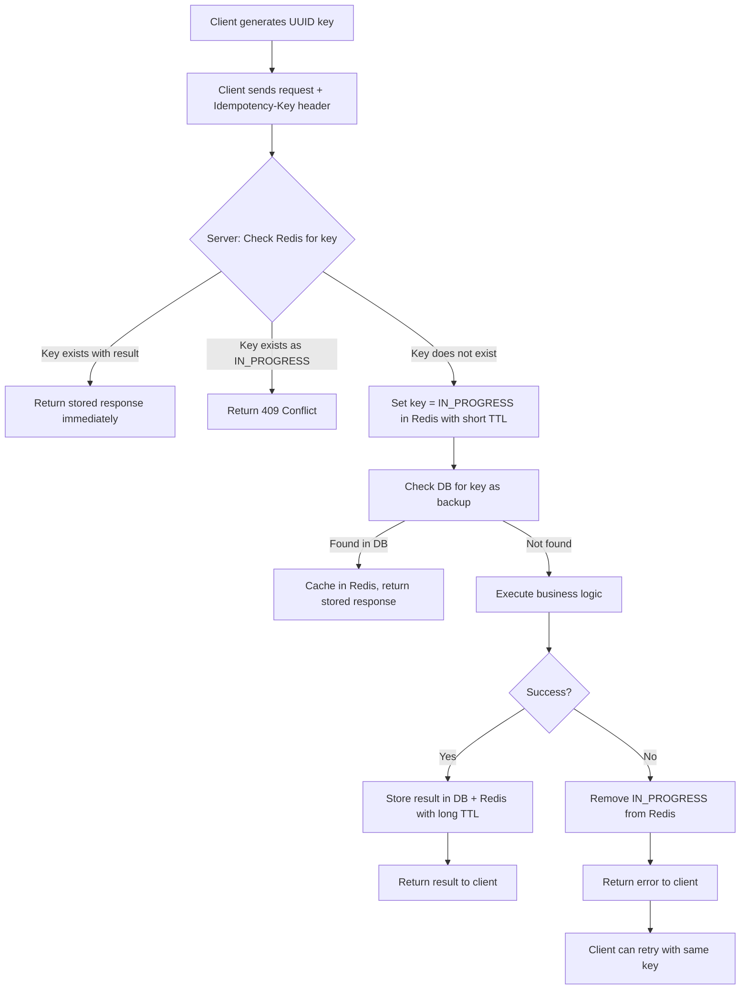

### Code: Complete Idempotency Middleware (Python/Flask)

```python
import uuid
import redis
import json
import functools
from datetime import datetime
from flask import request, jsonify, make_response

redis_client = redis.Redis(host='localhost', port=6379, db=0, decode_responses=True)

IDEMPOTENCY_KEY_TTL = 86400          # 24 hours for normal ops
IDEMPOTENCY_KEY_TTL_PAYMENTS = 604800  # 7 days for payments
IN_PROGRESS_TTL = 30                  # 30 seconds lock TTL

def idempotent(ttl=IDEMPOTENCY_KEY_TTL):
    """
    Decorator that makes any Flask endpoint idempotent.
    Client must send Idempotency-Key header.
    """
    def decorator(func):
        @functools.wraps(func)
        def wrapper(*args, **kwargs):
            idem_key = request.headers.get('Idempotency-Key')

            if not idem_key:
                # No key — just run (no dedup guarantee)
                return func(*args, **kwargs)

            # Namespace by endpoint to prevent cross-endpoint collisions
            endpoint = request.endpoint or 'unknown'
            user_id = getattr(request, 'user_id', 'anonymous')
            namespaced_key = f"idem:{endpoint}:{user_id}:{idem_key}"
            lock_key = f"idem_lock:{endpoint}:{user_id}:{idem_key}"

            # 1. Check for cached result (fast path)
            cached = redis_client.get(namespaced_key)
            if cached:
                stored = json.loads(cached)
                if stored.get('status') == 'IN_PROGRESS':
                    return make_response(
                        jsonify({"error": "Request in progress, try again shortly"}),
                        409
                    )
                response = make_response(
                    stored['body'],
                    stored['http_status']
                )
                response.headers['X-Idempotent-Replayed'] = 'true'
                return response

            # 2. Acquire distributed lock to prevent concurrent duplicate requests
            lock_acquired = redis_client.set(lock_key, "1", nx=True, ex=IN_PROGRESS_TTL)
            if not lock_acquired:
                return make_response(
                    jsonify({"error": "Request already in progress for this idempotency key"}),
                    409
                )

            # Mark as in-progress
            redis_client.setex(
                namespaced_key,
                IN_PROGRESS_TTL,
                json.dumps({'status': 'IN_PROGRESS'})
            )

            try:
                # 3. Execute the actual handler
                result = func(*args, **kwargs)

                # 4. Store the result
                response_body = result.get_data(as_text=True)
                http_status = result.status_code

                stored_result = {
                    'status': 'DONE',
                    'http_status': http_status,
                    'body': response_body,
                    'completed_at': datetime.utcnow().isoformat()
                }

                redis_client.setex(
                    namespaced_key,
                    ttl,
                    json.dumps(stored_result)
                )

                return result

            except Exception as e:
                # On failure, remove the in-progress marker so client can retry
                redis_client.delete(namespaced_key)
                raise e

            finally:
                redis_client.delete(lock_key)

        return wrapper
    return decorator


# Usage: Swiggy-style order creation endpoint
@app.route('/api/v1/orders', methods=['POST'])
@idempotent(ttl=IDEMPOTENCY_KEY_TTL)
def create_order():
    data = request.get_json()

    # Validate
    if not data.get('restaurant_id') or not data.get('items'):
        return jsonify({"error": "Missing required fields"}), 400

    # Business logic — only executed ONCE per unique Idempotency-Key
    order = OrderService.create(
        user_id=request.user_id,
        restaurant_id=data['restaurant_id'],
        items=data['items'],
        delivery_address_id=data['delivery_address_id']
    )

    return jsonify({
        "order_id": order.id,
        "status": order.status,
        "estimated_delivery_minutes": 35
    }), 201
```

### Code: Node.js / Express Idempotency Middleware

```javascript
const redis = require('redis');
const { v4: uuidv4 } = require('uuid');

const redisClient = redis.createClient({ url: process.env.REDIS_URL });

const IDEMPOTENCY_TTL = 86400; // 24 hours in seconds

async function idempotencyMiddleware(req, res, next) {
  const idempotencyKey = req.headers['idempotency-key'];

  if (!idempotencyKey) {
    return next(); // No key — skip deduplication
  }

  const userId = req.user?.id || 'anon';
  const cacheKey = `idem:${req.route?.path}:${userId}:${idempotencyKey}`;
  const lockKey = `idem_lock:${req.route?.path}:${userId}:${idempotencyKey}`;

  // Check cache
  const cached = await redisClient.get(cacheKey);
  if (cached) {
    const stored = JSON.parse(cached);
    if (stored.status === 'IN_PROGRESS') {
      return res.status(409).json({ error: 'Request in progress' });
    }
    res.set('X-Idempotent-Replayed', 'true');
    return res.status(stored.httpStatus).json(stored.body);
  }

  // Acquire lock
  const locked = await redisClient.set(lockKey, '1', { NX: true, EX: 30 });
  if (!locked) {
    return res.status(409).json({ error: 'Request already in progress' });
  }

  // Mark in-progress
  await redisClient.setEx(cacheKey, 30, JSON.stringify({ status: 'IN_PROGRESS' }));

  // Intercept the response to cache it
  const originalJson = res.json.bind(res);
  res.json = async (body) => {
    try {
      await redisClient.setEx(cacheKey, IDEMPOTENCY_TTL, JSON.stringify({
        status: 'DONE',
        httpStatus: res.statusCode,
        body
      }));
    } catch (err) {
      console.error('Failed to cache idempotency result:', err);
    } finally {
      await redisClient.del(lockKey);
    }
    return originalJson(body);
  };

  next();
}

module.exports = idempotencyMiddleware;
```

---

## 6. TTL on Idempotency Keys

### The Expiry Stamped Ticket Analogy

Think of a movie ticket. It is valid for one specific show. After the show date, it expires — the theatre does not need to check it anymore. But during the validity window, if you show up twice, they check the stub and turn you away.

Idempotency keys work the same way. They need to live long enough to cover all retry scenarios, but not forever (that would be a memory and storage leak).

### How Long Should Keys Live?

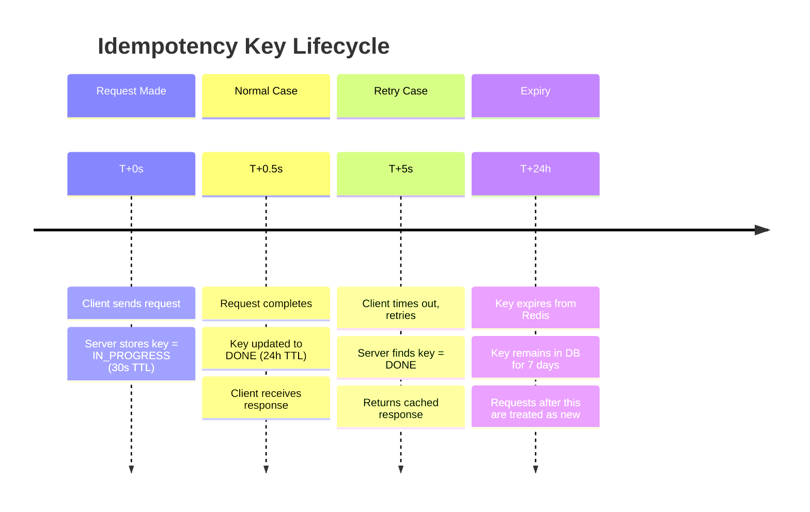

### TTL Recommendations

| Operation Type | Recommended TTL | Reasoning |
|---|---|---|
| Payment charge | 7 days | Legal disputes can surface days later; safety window needed |
| Order creation | 24 hours | Orders settle within same day; beyond that, user expects fresh order |
| Subscription change | 7 days | Billing cycles; need time to reconcile |
| Email/notification send | 24 hours | Day window covers most delivery retries |
| Analytics event | 1 hour | Duplicates acceptable after short window |
| File upload initiation | 7 days | Large uploads may take time; resume window |
| OTP send | 10 minutes | OTP itself expires; key should match OTP lifetime |

### Where to Store Keys: Redis vs. Database

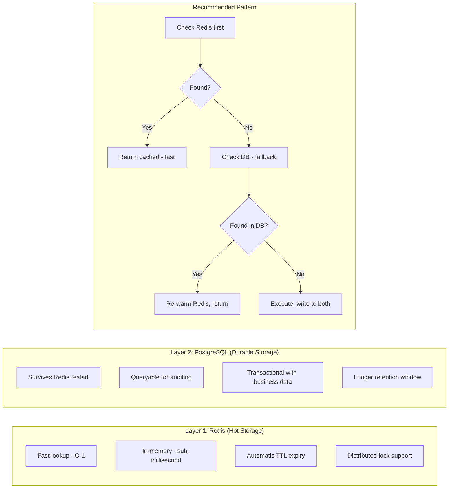

The two-layer approach handles:
- Redis restart/eviction — keys in DB survive
- DB slowness — Redis serves hot traffic
- Audit requirements — DB has full history

---

## 7. Idempotency in Payment Systems

### The Stripe Story

Stripe literally wrote the book on payment idempotency. Their API documentation explicitly says: **every mutating API call should include an Idempotency-Key**. This is not optional guidance — it is baked into their SDK by default.

Here is why payments are the most critical idempotency use case:

- A customer pays ₹1,200 for a Swiggy order.
- The mobile app sends the charge request.
- The internet drops just as the server processes it.
- Without idempotency: Swiggy charges the customer ₹2,400 on retry. Chargeback. Reputation damage. Regulatory trouble.
- With idempotency: Second request returns the same result. Customer charged once.

### Stripe's Implementation

Stripe's idempotency key:
- Must be provided as a header: `Idempotency-Key: <your-uuid>`
- Is unique per customer + operation (not globally unique)
- Expires after 24 hours
- Returns the **exact same HTTP response** including same timestamp, same charge ID — not a fresh re-created response

```python
import stripe
import uuid

stripe.api_key = "sk_live_..."

def charge_customer_safely(customer_id: str, amount_cents: int, currency: str = "inr"):
    """
    Charge a customer in a way that is safe to retry.
    Generate the idempotency key BEFORE calling this function
    and store it until you get a confirmed result.
    """
    # This key should be generated once per payment intent and stored
    # If you retry, use the SAME key
    idempotency_key = f"charge_{customer_id}_{amount_cents}_{currency}_{generate_order_nonce()}"

    try:
        charge = stripe.PaymentIntent.create(
            amount=amount_cents,
            currency=currency,
            customer=customer_id,
            payment_method="pm_card_visa",
            confirm=True,
            idempotency_key=idempotency_key  # Stripe deduplicates on this
        )
        return {"success": True, "charge_id": charge.id}

    except stripe.error.IdempotencyError as e:
        # Stripe returns this if same key is used with different parameters
        # This is a CLIENT BUG — do not silently swallow
        raise ValueError(f"Idempotency key reused with different params: {e}")

    except stripe.error.StripeError as e:
        # Network or Stripe error — safe to retry with same idempotency_key
        raise RuntimeError(f"Payment failed, safe to retry: {e}")
```

### Razorpay's Approach

Razorpay (India's Stripe equivalent) uses `X-Razorpay-Idempotency-Key` header. The pattern is identical. When building fintech in India — PhonePe, Paytm, CRED — this is how all payment processing is made reliable.

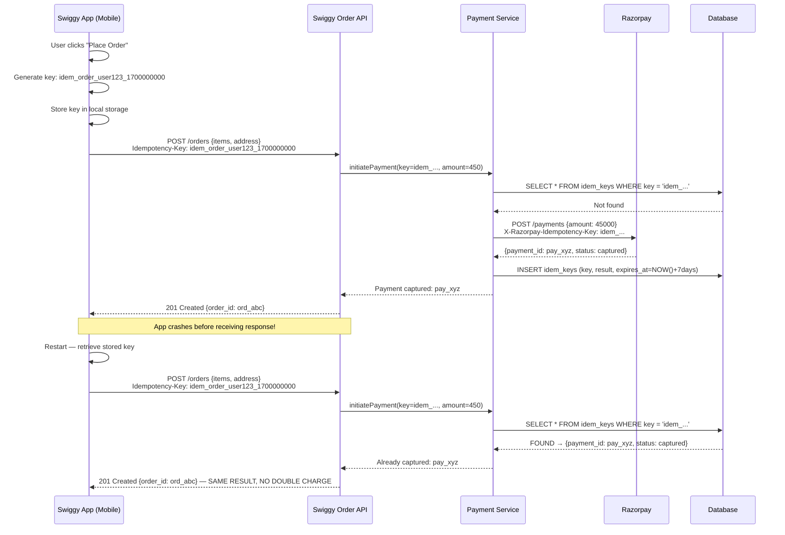

### UPI Idempotency

UPI (Unified Payments Interface) has idempotency built into the protocol. Each UPI transaction has a unique `transaction_ref_id`. Banks check this ID before processing. This is why when your PhonePe payment "fails" but money is deducted — the money is usually returned within hours, because the reconciliation system detects the idempotency violation and reverses it.

---

## 8. Database-Level Idempotency

### The Hotel Reservation Analogy

Imagine a hotel. Room 302 is booked by Rahul for December 25th. The booking system crashes after processing. The customer service rep, not knowing the booking went through, tries to book again. If the database just does a simple INSERT, Rahul might get two booking confirmations and the hotel has a problem.

Solution: Room 302 + December 25th is a **unique constraint**. The second INSERT fails gracefully: "Booking already exists."

Database-level idempotency is your **last line of defense** — it enforces correctness even if your application layer fails to check.

### INSERT ON CONFLICT — The Upsert Pattern

```sql
-- Schema: payments table with unique constraint on idempotency key
CREATE TABLE payments (
    id              BIGSERIAL PRIMARY KEY,
    idempotency_key VARCHAR(128) UNIQUE NOT NULL,  -- the key becomes a unique constraint
    user_id         UUID NOT NULL,
    amount_paise    INTEGER NOT NULL,               -- amount in paise (₹1 = 100 paise)
    currency        VARCHAR(3) DEFAULT 'INR',
    status          VARCHAR(20) DEFAULT 'pending',
    payment_gateway_ref VARCHAR(128),
    created_at      TIMESTAMPTZ DEFAULT NOW(),
    updated_at      TIMESTAMPTZ DEFAULT NOW()
);

-- Pattern 1: DO NOTHING (if already exists, skip silently)
-- Safe to call 100 times — only creates the payment once
INSERT INTO payments (idempotency_key, user_id, amount_paise, status)
VALUES ('idem_uuid_abc123', 'usr_rahul_456', 45000, 'pending')
ON CONFLICT (idempotency_key) DO NOTHING;

-- Pattern 2: Return the existing row (most useful)
INSERT INTO payments (idempotency_key, user_id, amount_paise, status)
VALUES ('idem_uuid_abc123', 'usr_rahul_456', 45000, 'pending')
ON CONFLICT (idempotency_key) DO UPDATE
    SET updated_at = EXCLUDED.updated_at  -- no-op update just to trigger RETURNING
RETURNING *;
-- Returns the existing row whether it was just inserted or already existed

-- Pattern 3: Conditional update (idempotent state transitions)
-- Only transition if in expected state — prevents double-processing
UPDATE payments
SET status = 'captured',
    payment_gateway_ref = 'pay_xyz789',
    updated_at = NOW()
WHERE idempotency_key = 'idem_uuid_abc123'
  AND status = 'pending'         -- guard: only update if still pending
RETURNING *;
-- If 0 rows: either doesn't exist, or already captured — both are safe
```

### Composite Unique Constraints

```sql
-- Preventing double order placement for same user + same cart
CREATE TABLE orders (
    id              BIGSERIAL PRIMARY KEY,
    user_id         UUID NOT NULL,
    cart_fingerprint VARCHAR(64) NOT NULL,  -- hash of cart contents
    restaurant_id   UUID NOT NULL,
    created_at      TIMESTAMPTZ DEFAULT NOW(),

    -- Composite constraint: same user cannot place same cart twice in 5 minutes
    -- (handled in application layer; DB handles exact duplicates)
    CONSTRAINT uq_user_cart UNIQUE (user_id, cart_fingerprint)
);

-- Inventory management: idempotent deduction
CREATE TABLE inventory_transactions (
    transaction_id  VARCHAR(128) PRIMARY KEY,  -- idempotency key IS the PK
    product_id      UUID NOT NULL,
    quantity_delta  INTEGER NOT NULL,           -- negative for deductions
    reason          VARCHAR(64),
    created_at      TIMESTAMPTZ DEFAULT NOW()
);

-- Deduct inventory (idempotent — same transaction_id = same deduction)
INSERT INTO inventory_transactions (transaction_id, product_id, quantity_delta, reason)
VALUES ('txn_order_ord_001_sku_42', 'sku_uuid_42', -2, 'order_placed')
ON CONFLICT (transaction_id) DO NOTHING;

-- Then update inventory balance based on transaction log (eventually consistent)
UPDATE products
SET quantity = (
    SELECT SUM(quantity_delta) FROM inventory_transactions WHERE product_id = 'sku_uuid_42'
)
WHERE id = 'sku_uuid_42';
```

### Optimistic Locking for Updates

```sql
-- Version-based optimistic locking prevents concurrent double-updates
CREATE TABLE user_wallets (
    user_id     UUID PRIMARY KEY,
    balance_paise INTEGER NOT NULL DEFAULT 0,
    version     BIGINT NOT NULL DEFAULT 1
);

-- Debit ₹500 from wallet — safe even if called twice with same version
UPDATE user_wallets
SET balance_paise = balance_paise - 50000,
    version = version + 1
WHERE user_id = 'usr_rahul_456'
  AND version = 7                     -- optimistic lock: must match expected version
  AND balance_paise >= 50000;         -- prevent negative balance

-- In application code:
-- rows_updated = db.execute(query)
-- if rows_updated == 0:
--     # Either: version mismatch (concurrent update, retry with fresh version)
--     # Or: insufficient balance
--     # Or: user not found
--     # Re-read and decide
```

### Event Deduplication Table Pattern

```sql
-- Track all processed events to prevent duplicate processing
CREATE TABLE processed_events (
    event_id        VARCHAR(128) PRIMARY KEY,
    event_type      VARCHAR(64) NOT NULL,
    processed_at    TIMESTAMPTZ DEFAULT NOW(),
    source_service  VARCHAR(64),
    processing_result JSONB,
    -- TTL enforced via background cleanup job or pg_partman
    expires_at      TIMESTAMPTZ DEFAULT NOW() + INTERVAL '7 days'
);

CREATE INDEX idx_processed_events_expires ON processed_events (expires_at);

-- In your event consumer (within a transaction):
BEGIN;
    -- Try to mark event as being processed
    INSERT INTO processed_events (event_id, event_type, source_service)
    VALUES ('evt_kafka_offset_123_partition_2', 'order.shipped', 'shipping-service')
    ON CONFLICT (event_id) DO NOTHING;

    -- GET DIAGNOSTICS to check if insert happened
    GET DIAGNOSTICS rows_affected = ROW_COUNT;

    IF rows_affected = 0 THEN
        -- Event already processed — skip business logic
        ROLLBACK;
        -- Ack the message to prevent redelivery
    ELSE
        -- New event — execute business logic here
        -- ... send notification, update order status, etc.
        COMMIT;
    END IF;
```

---

## 9. Message Queue Idempotency

### The Radio Broadcast Analogy

Imagine a radio station broadcasting the same song. Due to multipath interference, your radio might receive the same signal twice and play the song twice. For music that is annoying; for "transfer ₹50,000 to account X", it is catastrophic.

Message queues are like that radio broadcast. They guarantee delivery, but "at-least-once" means your consumer might see the same message multiple times. You must handle it.

### Kafka: Idempotent Producer + Consumer Deduplication

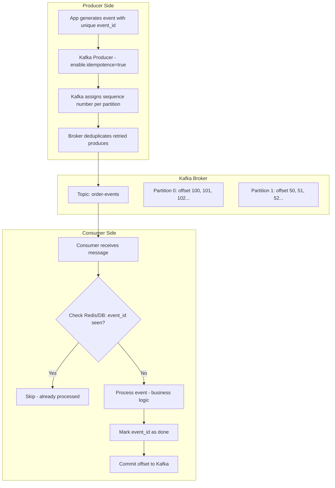

### Kafka Consumer with Robust Deduplication

```python
from kafka import KafkaConsumer, KafkaProducer
import redis
import json
import logging
from dataclasses import dataclass
from typing import Optional

logger = logging.getLogger(__name__)
redis_client = redis.Redis(host='localhost', port=6379, decode_responses=True)

@dataclass
class OrderEvent:
    event_id: str
    order_id: str
    user_id: str
    event_type: str
    amount_paise: int
    restaurant_id: str

class IdempotentOrderConsumer:
    """
    Kafka consumer that processes order events exactly once
    by deduplicating on event_id using Redis.
    """

    DEDUP_TTL = 86400  # 24 hours

    def __init__(self, bootstrap_servers: list[str]):
        self.consumer = KafkaConsumer(
            'order-events',
            bootstrap_servers=bootstrap_servers,
            group_id='order-processor-v2',
            auto_offset_reset='earliest',
            enable_auto_commit=False,   # manual commit — critical for at-least-once
            value_deserializer=lambda m: json.loads(m.decode('utf-8')),
            max_poll_interval_ms=300000  # 5 minutes max processing time
        )

    def is_duplicate(self, event_id: str) -> bool:
        """Atomically check if event was already processed."""
        # SET key value NX EX — atomic: only sets if not exists
        # Returns True if key was newly set (first time), False if already existed
        was_new = redis_client.set(
            f"processed_event:{event_id}",
            "1",
            nx=True,     # only set if Not eXists
            ex=self.DEDUP_TTL
        )
        return not was_new  # True = duplicate (key already existed)

    def process_payment_event(self, event: OrderEvent):
        """
        Business logic — only runs once per event_id.
        """
        logger.info(f"Processing payment for order {event.order_id}")

        # Idempotent database write — safe even if called twice
        db.execute("""
            INSERT INTO order_payments (order_id, amount_paise, status, processed_at)
            VALUES (%s, %s, 'completed', NOW())
            ON CONFLICT (order_id) DO NOTHING
        """, [event.order_id, event.amount_paise])

        # Idempotent notification — check before sending
        if not notification_service.was_sent(event.user_id, event.order_id, 'payment_confirmed'):
            notification_service.send_push(
                user_id=event.user_id,
                title="Payment confirmed!",
                body=f"Your order from restaurant has been placed successfully."
            )

    def run(self):
        """Main consumer loop."""
        for message in self.consumer:
            event_data = message.value
            event_id = event_data.get('event_id')

            if not event_id:
                logger.error(f"Message missing event_id at offset {message.offset} — cannot deduplicate. Skipping.")
                self.consumer.commit()
                continue

            event = OrderEvent(**event_data)

            if self.is_duplicate(event_id):
                logger.info(f"Duplicate event {event_id} at offset {message.offset} — skipping")
                # Still commit the offset so we don't reprocess this message
                self.consumer.commit()
                continue

            try:
                self.process_payment_event(event)
                self.consumer.commit()   # commit AFTER successful processing
                logger.info(f"Successfully processed event {event_id}")

            except Exception as e:
                logger.error(f"Failed to process event {event_id}: {e}")
                # Remove the dedup key so the event can be retried
                redis_client.delete(f"processed_event:{event_id}")
                # Do NOT commit — Kafka will redeliver this message
                raise
```

### SQS with DynamoDB Deduplication

```python
import boto3
import json
import time
from datetime import datetime, timezone

sqs = boto3.client('sqs', region_name='ap-south-1')
dynamodb = boto3.resource('dynamodb', region_name='ap-south-1')
dedup_table = dynamodb.Table('ProcessedSQSMessages')

def consume_notification_queue(queue_url: str):
    """
    Process SQS messages exactly once using DynamoDB for deduplication.
    SQS standard queues: at-least-once delivery, so duplicates are normal.
    SQS FIFO queues: built-in 5-minute dedup window via MessageDeduplicationId.
    """
    while True:
        response = sqs.receive_message(
            QueueUrl=queue_url,
            MaxNumberOfMessages=10,
            VisibilityTimeout=60,    # 60s to process before message reappears
            WaitTimeSeconds=20,      # long polling — more efficient than short polling
            AttributeNames=['All'],
            MessageAttributeNames=['All']
        )

        for message in response.get('Messages', []):
            message_id = message['MessageId']
            receipt_handle = message['ReceiptHandle']
            body = json.loads(message['Body'])

            if _already_processed(message_id):
                logger.info(f"Duplicate SQS message {message_id} — deleting without processing")
                _delete_message(queue_url, receipt_handle)
                continue

            try:
                _process_notification(body)
                _mark_processed(message_id, body)
                _delete_message(queue_url, receipt_handle)

            except Exception as e:
                logger.error(f"Failed to process SQS message {message_id}: {e}")
                # Do NOT delete — visibility timeout will expire
                # SQS will redeliver after 60 seconds
                # After max_receive_count, SQS sends to Dead Letter Queue

def _already_processed(message_id: str) -> bool:
    try:
        response = dedup_table.get_item(
            Key={'message_id': message_id},
            ConsistentRead=True  # Important: eventual consistency could miss recent writes
        )
        return 'Item' in response
    except Exception as e:
        logger.warning(f"DynamoDB check failed: {e} — assuming not processed (at-least-once safer)")
        return False

def _mark_processed(message_id: str, body: dict):
    ttl_timestamp = int(time.time()) + 7 * 86400  # 7 days from now
    dedup_table.put_item(
        Item={
            'message_id': message_id,
            'processed_at': datetime.now(timezone.utc).isoformat(),
            'event_type': body.get('type', 'unknown'),
            'ttl': ttl_timestamp  # DynamoDB auto-deletes when TTL expires
        },
        ConditionExpression='attribute_not_exists(message_id)'  # atomic: only if not exists
    )
```

---

## 10. Delivery Guarantees

### The Pizza Delivery Analogy

Think of Zomato delivery:

- **At-most-once**: Driver tries once, no one answers, pizza goes back. You might get no pizza. *(data loss possible)*
- **At-least-once**: Driver keeps trying until someone opens. You definitely get pizza, but if there was a glitch and two drivers were dispatched, you get two pizzas. *(duplicates possible)*
- **Exactly-once**: Perfectly coordinated — one pizza, guaranteed. The hardest to achieve; requires both drivers and dispatch to be perfectly synchronized. *(ideal, but hard)*

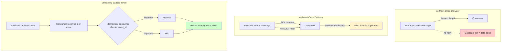

### Comparing Delivery Semantics

| Semantic | Data Loss Risk | Duplicate Risk | Complexity | Use Case |
|---|---|---|---|---|
| At-most-once | High | None | Low | Metrics, logs, telemetry (losing some is acceptable) |
| At-least-once | None | High | Medium | Email sends, notifications, payment events |
| Exactly-once | None | None | Very High | Financial transactions, inventory deductions |
| At-least-once + Idempotent Consumer | None | Handled | Medium | Practical production pattern for critical systems |

### Real-World Choices

| System | Default | Why |
|---|---|---|
| Kafka (default) | At-least-once | Higher throughput; consumer handles duplicates |
| Kafka (EOS enabled) | Exactly-once within Kafka | Transactional API; ~20% throughput cost |
| RabbitMQ | At-least-once | Consumer ACK required before message removed |
| AWS SQS Standard | At-least-once | Distributed; guarantees delivery but not order/dedup |
| AWS SQS FIFO | Exactly-once (5-min window) | MessageDeduplicationId; lower throughput |
| Google Pub/Sub | At-least-once | Acknowledge before removal |
| Apache Pulsar | Configurable | Pluggable; can achieve exactly-once with transactions |

---

## 11. The Exactly-Once Myth

### The Two Generals Problem

This is the most important theoretical concept in distributed systems, and it directly explains why exactly-once is hard.

Two generals (Alice and Bob) are attacking a castle from two sides. They must attack simultaneously or lose. They communicate via messengers through enemy territory. Messenger might be captured. Neither can be 100% certain the other got the message.

- Alice sends: "Attack at dawn"
- Bob receives it, sends back: "Confirmed, attacking at dawn"
- Alice receives Bob's confirmation, sends: "Great, confirmed received"
- Bob might not receive that. Now Bob is not sure if Alice is coming.
- And so on, infinitely.

**There is no protocol that can give both parties 100% certainty in an asynchronous system with message loss.** This is a mathematical proof (the FLP impossibility result extends this further).

In system terms: a producer can never be 100% certain a consumer processed a message exactly once, because the ACK might get lost.

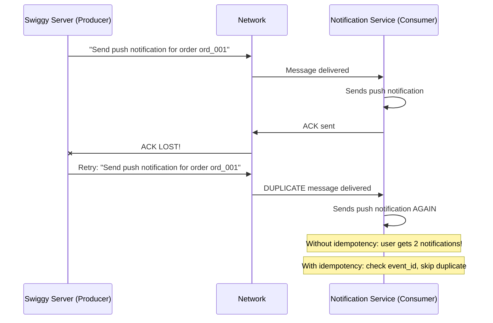

### What Kafka's "Exactly-Once Semantics" Actually Means

Kafka's EOS (Exactly-Once Semantics) introduced in Kafka 0.11 is impressive but limited:

- **Producer side**: Idempotent producer (PID + sequence numbers prevent duplicate produces)
- **Consumer-producer transactions**: Read from topic A, write to topic B atomically
- **NOT covered**: Writing to external systems (databases, APIs, third-party services)

```python
# Kafka Transactional API — exactly-once within Kafka ecosystem
from kafka import KafkaProducer, KafkaConsumer
from kafka.errors import KafkaError

producer = KafkaProducer(
    bootstrap_servers=['localhost:9092'],
    enable_idempotence=True,           # producer-side dedup
    transactional_id='order-processor-txn-1'  # enables transactions
)
producer.init_transactions()

consumer = KafkaConsumer(
    'order-events',
    isolation_level='read_committed',   # only read committed messages
    # ... other config
)

for message in consumer:
    try:
        producer.begin_transaction()

        # Read from order-events, write to processed-orders
        # This read-process-write is atomic within Kafka
        producer.send('processed-orders', key=message.key, value=process(message.value))

        # Commit consumer offset atomically with the produce
        producer.send_offsets_to_transaction(
            {message.partition: message.offset + 1},
            consumer.config['group_id']
        )

        producer.commit_transaction()
        # ↑ Exactly-once WITHIN Kafka: the message is consumed and output is produced exactly once

    except Exception as e:
        producer.abort_transaction()
        # Safe to retry — transaction rolled back
```

But if you write to a database inside that loop — that write is NOT covered by Kafka's EOS. You still need idempotent consumers for external sinks.

### The Real-World Pattern That Works

```
At-least-once delivery + Idempotent consumer = Effectively exactly-once behavior
```

This is the pattern that Netflix, Uber, Zomato, Swiggy — every serious distributed system — uses in practice:

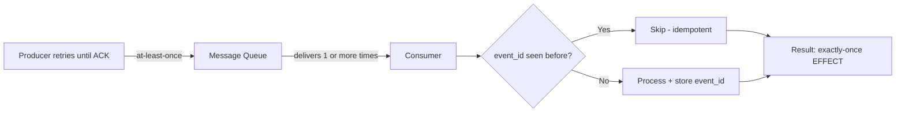

---

## 12. Real-World Case Studies

### Case 1: Zomato Order Placement

**Problem**: User taps "Place Order" on weak 4G connection. App times out. User taps again. Zomato must not create two orders.

**Solution**:
1. App generates `order_nonce` (UUID) when user taps "Proceed to Pay"
2. Nonce stored in local storage immediately
3. Sent as `Idempotency-Key` header on order creation request
4. Server checks nonce in Redis → not found → creates order → caches result
5. Retry arrives → nonce found → returns cached order ID → no duplicate
6. Restaurant receives exactly one order

### Case 2: WhatsApp Message Delivery

**Problem**: WhatsApp needs to deliver messages exactly once. User sends a message, connection drops, app retries.

**Solution**:
- Every message has a client-generated `message_id` (based on timestamp + random bytes)
- WhatsApp server uses this ID for deduplication
- Sender-side: message is shown with single grey tick until server ACK
- Server stores message state by `message_id`
- On retry: server finds `message_id` exists, sends ACK without re-storing
- Result: recipient sees message exactly once; sender sees ticks progress correctly

### Case 3: YouTube Video View Count

**Problem**: YouTube must count views accurately. If a user's request is retried 3 times, it should count as 1 view, not 3.

**Solution**:
- Not a payment so strict exactly-once less critical
- But YouTube uses session-based dedup: a view is tied to (video_id, user_id, session_id)
- Same session cannot count twice
- At the storage layer: `INSERT INTO views (video_id, user_id, session_id) ON CONFLICT DO NOTHING`
- View counts are eventually consistent — incremented from batch jobs over the raw events

### Case 4: Uber Ride Request

**Problem**: User taps "Book Uber." App freezes. User taps again. Must not create two ride requests.

**Solution**:
1. Client generates `ride_request_id` before tapping
2. Sent as request identifier in the API
3. Uber's dispatch service checks `ride_request_id` — if active request exists, returns it
4. Driver matching happens once
5. Subsequent taps return the same ride request

**State Machine**:
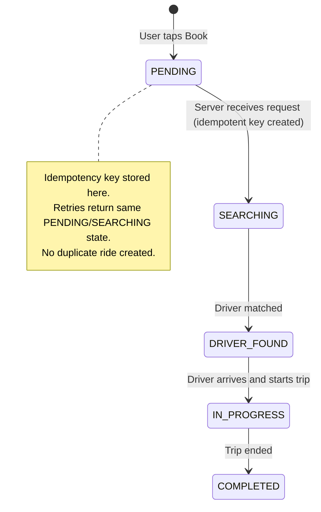

### Case 5: Instagram Like Button

**Problem**: User double-taps quickly. Should count as 1 like, not 2.

**Solution**: Database-level idempotency.
```sql
CREATE TABLE likes (
    user_id    UUID NOT NULL,
    post_id    UUID NOT NULL,
    liked_at   TIMESTAMPTZ DEFAULT NOW(),
    PRIMARY KEY (user_id, post_id)  -- composite PK = natural idempotency
);

INSERT INTO likes (user_id, post_id)
VALUES ('usr_sneha', 'post_cat_photo')
ON CONFLICT (user_id, post_id) DO NOTHING;
-- Double-tap? No problem. Composite PK prevents duplicate like.
```

### Case 6: Netflix Billing

**Problem**: Netflix charges users monthly. If the billing job runs twice (due to a crash), customers must not be charged twice.

**Solution**:
1. Billing job creates a `billing_run_id = hash(user_id + billing_period)`
2. This ID is passed to the payment service
3. Payment service uses it as idempotency key with Stripe
4. Stripe returns the same charge ID whether called once or ten times
5. Billing records stored with `billing_run_id` as unique constraint

---

## 13. When to Use and When NOT to

### Use Idempotency Keys When:

- Any **POST endpoint that creates a resource** (orders, payments, subscriptions, bookings)
- Any operation involving **money, inventory, or irreversible side effects**
- Any **mobile app operation** over potentially unreliable networks
- Any operation in an **async workflow** (job queues, webhooks, event-driven)
- Any **message consumer** receiving from at-least-once delivery queues (always)
- Any **distributed saga step** where a failure mid-saga might trigger compensation retries

### Do NOT Use Idempotency Keys When:

- **GET requests** — they are already idempotent; adding keys is pointless overhead
- **Internal in-process calls** — no network, no retry problem
- **Pure analytics telemetry** — duplicates are acceptable; overhead not worth it
- **Already naturally idempotent operations** — setting a value (not incrementing), not creating
- **Real-time gaming state** — stale cached responses would cause gameplay bugs
- **Operations where idempotency conflicts with intent** — e.g., `POST /votes` should be per-user not per-request; use a different uniqueness mechanism

### The Cost-Benefit Matrix

| Factor | Low Value → Skip | High Value → Always Add |
|---|---|---|
| Consequence of duplicate | Annoying but recoverable | Irreversible (money, legal) |
| Network reliability | Internal reliable network | Mobile, IoT, international |
| Operation frequency | Rare one-time operations | High-volume continuous |
| Business domain | Analytics, logging | Payments, inventory, legal |
| Retry likelihood | Very low | Built-in retry logic |

---

## 14. Trade-offs and Edge Cases

### Trade-offs of Idempotency Implementation

| Aspect | Without Idempotency | With Idempotency Keys |
|---|---|---|
| Implementation complexity | Low | Medium to High |
| Storage overhead | None | Key + result stored per request |
| Latency per request | Lower (no lookup) | Slightly higher (+1–5ms Redis lookup) |
| Safety on retries | Duplicate side effects | Safe retries |
| Debugging | Simpler | Better: can replay exact key to reproduce |
| Client burden | None | Client must generate + track keys |
| Required infrastructure | Nothing extra | Redis / additional DB table |

### Edge Case: Concurrent Duplicate Requests

**Problem**: Two requests arrive at the SAME time with the same idempotency key (e.g., client sends twice simultaneously).

**Solution**: Distributed lock with short TTL.

```
Request 1: Check key → not found → SET key=IN_PROGRESS (NX=true, 30s) → got lock → process
Request 2: Check key → not found → SET key=IN_PROGRESS (NX=true, 30s) → lock EXISTS → return 409
```

The `NX` flag on Redis SET is atomic — only one request wins the lock.

### Edge Case: Same Key, Different Body

**Problem**: Client sends key `abc123` with `{amount: 500}`. Then (perhaps a bug) sends key `abc123` with `{amount: 999}`.

**Solution**: The server should detect the body mismatch and return **422 Unprocessable Entity** or **409 Conflict**. Do NOT silently process the second request as a duplicate — it is a client bug that should surface as an error.

```python
def check_idempotency(key: str, request_body: dict) -> Optional[dict]:
    cached = redis.get(f"idem:{key}")
    if not cached:
        return None  # new request

    stored = json.loads(cached)
    # Compare canonical hash of request body
    incoming_hash = hashlib.sha256(json.dumps(request_body, sort_keys=True).encode()).hexdigest()

    if stored.get('request_hash') != incoming_hash:
        raise IdempotencyConflictError(
            f"Idempotency key {key} was previously used with different request body"
        )

    return stored['result']  # same body — return cached result
```

### Edge Case: Partial Failures

**Problem**: Server charges the customer (step 1), then crashes before creating the order record (step 2). Client retries with same key. Should the charge be re-attempted?

**Solution**: Use the idempotency key to ensure both steps are atomic, OR store the charge ID and order creation state together. The key should represent the *entire* operation, not individual steps.

```python
def create_order_with_payment(idem_key: str, user_id: str, items: list, amount: int):
    with db.transaction():
        # Store the entire operation atomically
        result = db.execute("""
            INSERT INTO idempotent_operations (key, user_id, amount, status)
            VALUES (%s, %s, %s, 'pending')
            ON CONFLICT (key) DO UPDATE SET updated_at = NOW()
            RETURNING id, status, charge_id, order_id
        """, [idem_key, user_id, amount])

        row = result.fetchone()

        if row['status'] == 'completed':
            return {'order_id': row['order_id'], 'charge_id': row['charge_id']}

        # Not yet completed — process it
        charge = payment_gateway.charge(user_id, amount, idempotency_key=idem_key)
        order = order_service.create(user_id, items)

        # Mark as completed atomically
        db.execute("""
            UPDATE idempotent_operations
            SET status = 'completed', charge_id = %s, order_id = %s
            WHERE key = %s
        """, [charge.id, order.id, idem_key])

        return {'order_id': order.id, 'charge_id': charge.id}
```

### Full Architecture: Idempotent Payment Service

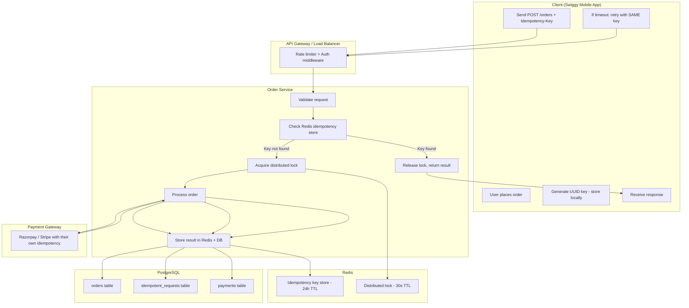

---

## 15. Common Interview Questions

### Conceptual Questions

**Q: What is idempotency? How does it differ from safety in HTTP methods?**

A: Idempotency means repeating an operation produces the same system state as doing it once. Safety means an operation has no side effects (does not modify state). All safe operations are idempotent (GET, HEAD), but idempotent operations are not necessarily safe (PUT modifies state but is idempotent; DELETE modifies state but is idempotent). POST is neither safe nor idempotent.

---

**Q: Why is POST not idempotent and how do you make it idempotent?**

A: POST creates a new resource each time it is called — calling `POST /orders` twice creates two orders. To make it idempotent: use an `Idempotency-Key` header (Stripe-style). The client generates a UUID before the request; the server stores (key → result) in Redis/DB; subsequent requests with the same key return the cached result without re-executing.

---

**Q: A customer's payment request times out. How do you ensure they are not charged twice?**

A:
1. Client generates a UUID idempotency key before making the payment request
2. Client stores this key durably (local storage, database)
3. Client sends the key in the `Idempotency-Key` header
4. Server checks if this key exists in the idempotency store (Redis → DB fallback)
5. If exists: return stored result (no re-charge)
6. If not: process payment, store result with key, return result
7. On retry: server finds the key, returns original charge ID — customer charged once

---

**Q: What is at-least-once vs exactly-once delivery? Which is achievable in distributed systems?**

A: At-least-once means messages are delivered one or more times (retries ensure no loss, but duplicates possible). Exactly-once means each message processed exactly once (no loss, no duplicates). True exactly-once across network boundaries is theoretically impossible (Two Generals Problem). The practical solution: at-least-once delivery + idempotent consumers = effectively exactly-once behavior. Kafka's EOS achieves exactly-once within the Kafka ecosystem but external sinks still need idempotent consumers.

---

**Q: What TTL do you set on idempotency keys? Why not keep them forever?**

A: TTL depends on the operation:
- Payments: 7 days (dispute window, billing reconciliation)
- Orders: 24 hours (order lifecycle is within a day)
- Notifications: 24 hours (retry window is short)
- OTPs: match OTP lifetime (10–15 minutes)

Keeping them forever causes unbounded storage growth. A Redis key for every payment request over years would require terabytes of storage. TTL is chosen to cover all realistic retry scenarios while controlling storage costs.

---

**Q: How do you handle the race condition where two requests with the same idempotency key arrive simultaneously?**

A: Use a distributed lock. When the first request arrives and the key is not found, atomically set a lock key with short TTL (`SET lock:key 1 NX EX 30`). The second concurrent request tries to set the same lock, fails (NX = only if not exists), and returns 409 Conflict. The first request processes, stores the result, and releases the lock. On retry (not concurrent), the key exists and is returned immediately.

---

**Q: Design an idempotency system for a payment service that handles 100,000 requests per second.**

A: Key design decisions:
- **Storage**: Redis cluster (sharded by idempotency key) for O(1) lookup on hot path; PostgreSQL for durable persistence
- **Layering**: Check Redis first (sub-millisecond), fall back to DB on cache miss (rare — only after Redis eviction or restart)
- **Locking**: Redis `SET NX` for distributed lock; 30s TTL to prevent deadlock
- **Key namespacing**: `idem:{endpoint}:{user_id}:{uuid}` to prevent cross-user collision
- **Scale**: At 100k RPS, Redis can handle this comfortably (1M ops/second is achievable on Redis Cluster). DB writes are batched or async after the Redis write succeeds
- **TTL**: 24–48 hours for most operations; archived to cold storage for audit
- **Monitoring**: Alert on high idempotency key collision rate (indicates client bugs or attacks)

---

**Q: Explain Kafka's exactly-once semantics (EOS). What are its limitations?**

A: Kafka EOS uses:
- **Idempotent producer**: Each producer gets a PID; messages have sequence numbers; broker deduplicates retried produces within a session
- **Transactional API**: Producer can atomically write to multiple partitions and commit consumer offsets — ensures read-process-write is exactly-once within Kafka

Limitations:
- Only guarantees exactly-once within the Kafka ecosystem (producer → broker → consumer within Kafka)
- Writing to external systems (databases, APIs) is NOT covered — you need idempotent consumers for those
- ~15–20% throughput overhead compared to at-least-once
- `transactional_id` must be unique per producer; restarts require same ID to reclaim PID state

---

**Q: What happens if an idempotency key expires (TTL passes) and the client retries?**

A: After TTL expiry, the key is gone. A retry with that expired key is treated as a brand new request — the operation executes again. This is intentional:
- For payments: 7-day TTL means if a customer retries after 7 days, it is clearly a new payment attempt
- For orders: after 24 hours, a retry is a new order
- The client should not retry stale operations beyond the TTL window
- Proper client implementations should stop retrying after a reasonable timeout (exponential backoff with max retries) and prompt the user to take explicit action

---

**Q: How does Stripe implement idempotency keys?**

A:
- Client sends `Idempotency-Key: <uuid>` header with any mutating API call
- Stripe stores (key → full HTTP response) for 24 hours
- If same key arrives again: Stripe returns **the exact same HTTP response** including same timestamps, same IDs — not a fresh response
- If same key arrives with different request body: Stripe returns 422
- If same key arrives while still processing: Stripe returns 409
- Stripe SDKs automatically generate and retry with idempotency keys for common retry scenarios
- Scope: per Stripe API key (your secret key), so keys are not globally unique across customers

---

### Design Questions

**Q: Design the database schema for an idempotency system.**

```sql
CREATE TABLE idempotent_requests (
    id              BIGSERIAL PRIMARY KEY,
    key             VARCHAR(256) NOT NULL,
    endpoint        VARCHAR(256) NOT NULL,
    user_id         UUID,
    request_hash    VARCHAR(64),           -- SHA256 of request body
    http_status     SMALLINT NOT NULL,
    response_body   JSONB NOT NULL,
    created_at      TIMESTAMPTZ DEFAULT NOW(),
    expires_at      TIMESTAMPTZ NOT NULL,

    CONSTRAINT uq_idem_key_endpoint UNIQUE (key, endpoint)
);

CREATE INDEX idx_idem_expires ON idempotent_requests (expires_at)
    WHERE expires_at < NOW();  -- for cleanup jobs

-- Cleanup job (runs daily):
DELETE FROM idempotent_requests WHERE expires_at < NOW();
```

---

## 16. Key Takeaways

1. **Idempotency = same input, same state, always.** No matter how many times you call an operation with the same input, the observable state of the system is identical to running it once. This is what makes retries safe.

2. **Networks always fail. Retries are not optional, they are mandatory.** At scale, packet loss, timeouts, and partial failures happen constantly. Your system design must assume retries will happen.

3. **The client generates idempotency keys, not the server.** The server cannot know if an incoming request is a retry or a fresh request without a client-provided key. The key must be generated before the request is sent and stored durably until a confirmed result is received.

4. **HTTP methods: GET, HEAD, PUT, DELETE are idempotent. POST and PATCH are not.** POST creates new resources on each call. Use idempotency keys (or PUT with client-generated IDs) to make POST safe for retries.

5. **The full idempotency key pattern**: Client generates UUID → sends as `Idempotency-Key` header → server checks Redis → if found, return cached → if not found, acquire lock → process → store result → return. Second request returns cached result.

6. **TTL on keys is critical**: 24 hours for most operations, 7 days for payments. After TTL, retries are treated as new operations. Choose TTL to cover all realistic retry windows.

7. **Database-level idempotency is your last line of defense**: `INSERT ON CONFLICT DO NOTHING`, unique constraints, and composite primary keys enforce correctness even if the application layer has bugs.

8. **Message queues deliver at-least-once by default.** Always design consumers to handle duplicates. Use a `processed_events` table or Redis SET to deduplicate by `event_id`.

9. **Exactly-once delivery is theoretically impossible across network boundaries** (Two Generals Problem). The real-world pattern that works: **at-least-once delivery + idempotent consumer = effectively exactly-once behavior**.

10. **Kafka's EOS is not a silver bullet.** It guarantees exactly-once within the Kafka ecosystem but writing to external systems (databases, payment gateways) still requires idempotent consumers on your side.

11. **Always include `event_id` or `request_id` from day one.** Retrofitting idempotency into a system that has no IDs on its messages and requests is extremely painful. Add unique IDs to every event and API request before you need them.

12. **Test idempotency explicitly.** Write tests that call the same endpoint 3 times with the same key and assert the side effect (payment charge, order creation, email sent) happened exactly once. This is the only way to be confident.

---

> **Summary in one line**: Networks fail, retries happen, and without idempotency, retries cause disasters. Idempotency keys + idempotent consumers + database uniqueness constraints = a system that handles the real world.

---

*Next Chapter: Distributed Transactions and Sagas — when you need multiple services to agree on a single outcome without a single shared database.*
