# Distributed Tracing

> "You cannot fix what you cannot see — and in microservices, you often cannot see anything."

---

## The Problem That Broke Every Engineer's Brain

Picture this. You're an engineer at Zomato. A user complains: "My order page takes 4 seconds to load." You check the API gateway logs — response time shows 4 seconds. You check the restaurant service logs — it's fast, only 50ms. You check the menu service — 40ms. You check the rating service — 30ms. Everything looks fine individually. But together they're taking 4 seconds. What is happening?

This is the classic microservices debugging nightmare. yeh kyun important hai? Because:

- Each service logs **separately** — like 5 doctors writing separate reports about the same patient, but none reading each other's notes
- You cannot tell which service is actually slow
- You cannot see how services call each other in sequence
- You cannot measure waiting time between services (network latency)
- You cannot see if Service A called Service B 47 times instead of once (N+1 problem)

**Distributed Tracing** solves this. It follows one request's complete journey — like attaching a GPS tracker to your order from the moment you tap "Place Order" to when the confirmation appears on screen, recording every stop along the way.

---

## What is Distributed Tracing?

> Analogy for a 5-year-old: Imagine you sent a letter through 5 different post offices before it reached your friend. Each post office stamps the envelope with their arrival time and departure time. At the end, you can look at the envelope and see exactly where it was, for how long, and which post office was the slowest. That's distributed tracing — every service stamps the request.

Distributed tracing is the ability to track a single request as it flows through multiple services, capturing:
- Which services handled the request
- In what order
- How long each service took
- What each service did internally
- Where errors occurred

Without distributed tracing, microservices debugging is like solving a murder mystery where each witness only tells you what happened in their room and refuses to talk to the other witnesses.

---

## The Core Vocabulary — Trace, Span, Parent-Child

Before anything else, nail these three concepts. Everything else builds on them.

### Trace

A **trace** is the complete record of one request's journey through your system. Think of it as a passport — it goes everywhere with the request and gets stamped at every border crossing.

Every trace has:
- A globally unique **Trace ID** (a 128-bit random number, usually shown as 32 hex characters)
- A start time and end time
- A list of all spans (all the work done)

```
Trace ID: 4bf92f3577b34da6a3ce929d0e0e4736
Start:    2024-01-15T10:00:00.000Z
Duration: 3,840ms
Services: API Gateway → Auth → Product → Inventory → Order → Notification
```

### Span

A **span** is one unit of work within a trace — typically one service's handling of the request, or one database query, or one external API call.

> Analogy: The trace is your road trip from Delhi to Mumbai. Each span is a leg of the journey — Delhi to Agra (2 hours), Agra to Gwalior (1.5 hours), etc. Each leg has a start time, end time, and you can see exactly which leg was slowest.

Every span records:
- Its own unique **Span ID**
- The **Parent Span ID** (who called this service)
- The **Trace ID** it belongs to
- Start timestamp and end timestamp (so you can calculate duration)
- A name/operation description
- Status (OK, ERROR)
- Tags / Attributes (key-value metadata like `db.type`, `http.status_code`, `user.id`)
- Events (timestamped log messages within the span)

```
Span: Inventory Service — check_stock
  trace_id:   4bf92f3577b34da6a3ce929d0e0e4736
  span_id:    a2fb4a1d1a96d312
  parent_id:  00f067aa0ba902b7    ← the API Gateway span called this
  start:      T+120ms
  end:        T+3760ms
  duration:   3640ms              ← THIS is your bottleneck!
  status:     OK
  attributes:
    service.name:   inventory-service
    db.type:        postgresql
    db.statement:   SELECT * FROM inventory WHERE product_id = ?
    http.method:    GET
    http.url:       /api/inventory/check
```

### Parent-Child Relationships

Spans form a tree. The root span is created at the entry point (API Gateway). Every service it calls creates a child span. Every service that child calls creates a grandchild span.

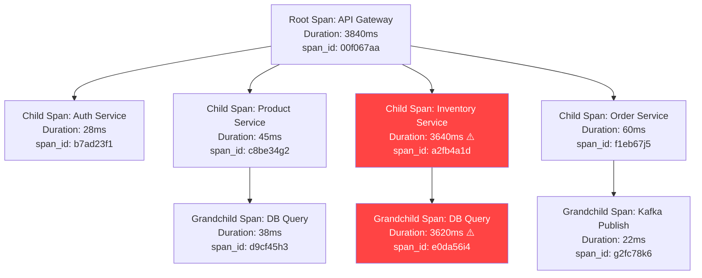

This tree view immediately shows: Inventory Service's DB Query is taking 3620ms. Woh problem hai. Go fix that query, add an index, check for locks — but at least now you know WHERE to look.

---

## How Trace ID Flows Through Services

This is the most important mechanical concept in distributed tracing. Samjho aise — how does the Inventory Service know it's part of the same trace as the API Gateway?

The Trace ID travels in **HTTP headers** from service to service. Think of it like a relay baton in a race — each runner passes the same baton to the next.

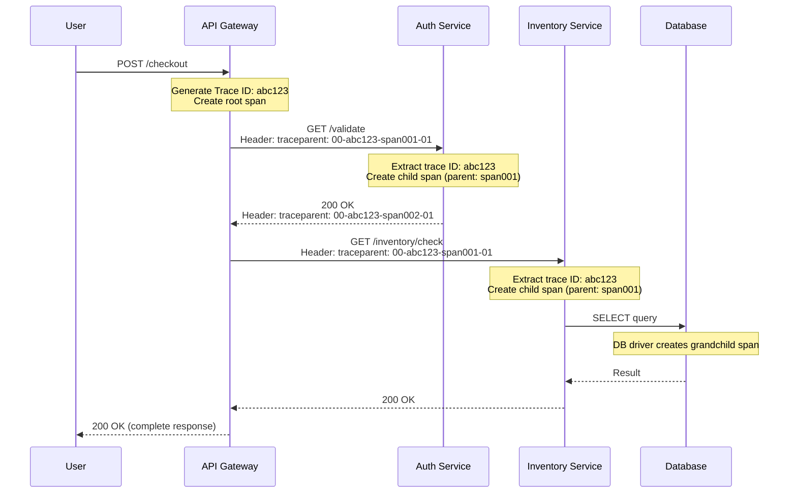

The key rules:
1. The **entry point** (API Gateway or first service) generates a new Trace ID if none exists in the incoming request
2. Every service that **receives** a request extracts the Trace ID from headers
3. Every service that **makes an outgoing call** injects the Trace ID into the outgoing headers
4. This propagation is automatic when you use OpenTelemetry — you don't write this logic yourself

---

## The W3C TraceContext Standard — The Modern Way

Before standards existed, every vendor had their own header format. Chaos tha. In 2021, W3C finalized the TraceContext specification, and this is now the universal standard.

Two headers carry all trace context:

### `traceparent` — The Main Header

```
traceparent: 00-4bf92f3577b34da6a3ce929d0e0e4736-00f067aa0ba902b7-01
             ^  ^                                ^                ^
             |  |                                |                sampling flag
             |  trace-id (32 hex = 128 bits)     span-id (16 hex = 64 bits)
             version (always "00" currently)
```

Breaking it down:
- **version**: `00` always (for now, reserved for future use)
- **trace-id**: 32 hex characters = 128-bit random number. Globally unique. Same across ALL services for this request.
- **span-id**: 16 hex characters = 64-bit. This is the CURRENT service's span ID. The next service will use this as its parent-id.
- **flags**: `01` = sampled (trace this request), `00` = not sampled (skip this request)

### `tracestate` — Vendor-Specific Data

```
tracestate: rojo=00f067aa0ba902b7,congo=t61rcWkgMzE
```

This carries vendor-specific data alongside the standard. Datadog puts its info here, Jaeger puts its info here, etc. Your code typically ignores this unless you're building a tracing backend.

### The Older B3 Format (Zipkin)

If you work with older systems or Zipkin, you'll see B3 headers. Different format, same idea:

```
X-B3-TraceId:      4bf92f3577b34da6a3ce929d0e0e4736
X-B3-SpanId:       00f067aa0ba902b7
X-B3-ParentSpanId: 00f067aa0ba902b7
X-B3-Sampled:      1
```

B3 splits across multiple headers vs W3C's single `traceparent`. Both work; W3C is preferred for new systems.

| Header Format | Standard | Native Tool | Still Used? |
|---|---|---|---|
| W3C TraceContext (`traceparent`) | W3C 2021 | OpenTelemetry | Yes — modern standard |
| B3 Headers (`X-B3-*`) | Unofficial (Twitter/Zipkin) | Zipkin | Yes — older systems |
| Datadog (`x-datadog-trace-id`) | Proprietary | Datadog APM | Yes — Datadog customers |
| AWS (`X-Amzn-Trace-Id`) | Proprietary | AWS X-Ray | Yes — AWS customers |

---

## Each Service's Job in a Trace

When a service participates in distributed tracing, it does exactly four things:

**Step 1: Extract context from incoming request**
Read the `traceparent` header. Get the trace-id and the caller's span-id (this becomes the parent-id for our new span).

**Step 2: Create a new span**
Record: operation name, start timestamp, the trace-id, parent span-id, and our own new span-id.

**Step 3: Do the actual work**
Process the request. If we call any downstream services or databases, inject the `traceparent` header into those calls, using our span-id.

**Step 4: End the span**
Record end timestamp. Add result attributes (HTTP status code, error messages, etc.). Send the completed span to the tracing backend.

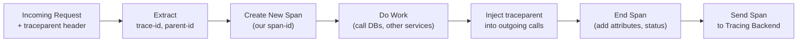

All of this is handled automatically by OpenTelemetry's auto-instrumentation for standard frameworks. You only write manual code for custom business logic spans.

---

## OpenTelemetry — The Universal Standard

Before OpenTelemetry, this was the situation:

- Want to use Datadog? Install Datadog SDK. Code uses Datadog APIs everywhere.
- Want to switch to Jaeger? Rewrite all instrumentation code.
- Want to use both? Instrument twice.

> Analogy: Imagine every car manufacturer used a different type of fuel pump nozzle. To fill up at a different brand of petrol station, you'd need a converter. OpenTelemetry is the standardized nozzle that works everywhere.

**OpenTelemetry (OTel)** is an open-source, CNCF-graduated project. Write your instrumentation once using OTel APIs. Send data to ANY backend — Jaeger, Zipkin, Grafana Tempo, Datadog, AWS X-Ray, Dynatrace, New Relic, Honeycomb — without changing your application code.

### Architecture

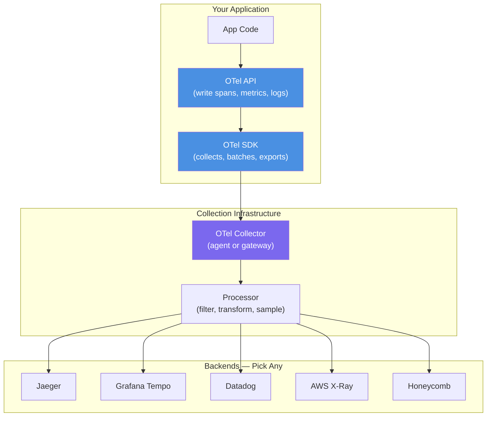

### Auto-Instrumentation vs Manual Instrumentation

**Auto-instrumentation** handles the 80% case automatically — HTTP calls, gRPC, database queries, Redis, Kafka, common web frameworks. Zero code changes needed:

```bash
# Java: Just add the agent at startup
java -javaagent:opentelemetry-javaagent.jar \
     -Dotel.service.name=inventory-service \
     -Dotel.exporter.otlp.endpoint=http://otel-collector:4317 \
     -jar inventory-service.jar

# Python: Import the auto-instrumentation bootstrap
pip install opentelemetry-instrumentation-flask opentelemetry-instrumentation-requests opentelemetry-instrumentation-psycopg2
opentelemetry-instrument --exporter otlp_proto_grpc python app.py
```

**Manual instrumentation** covers your custom business logic — the 20% case:

```python
from opentelemetry import trace
from opentelemetry.sdk.trace import TracerProvider
from opentelemetry.sdk.trace.export import BatchSpanProcessor
from opentelemetry.exporter.otlp.proto.grpc.trace_exporter import OTLPSpanExporter

# One-time setup (usually in app startup)
provider = TracerProvider()
exporter = OTLPSpanExporter(endpoint="http://otel-collector:4317")
provider.add_span_processor(BatchSpanProcessor(exporter))
trace.set_tracer_provider(provider)

tracer = trace.get_tracer("order-service")

def calculate_delivery_fee(order_id: str, distance_km: float, is_prime: bool) -> float:
    # Create a custom span for this business-critical operation
    with tracer.start_as_current_span("calculate_delivery_fee") as span:
        # Add attributes that help with debugging later
        span.set_attribute("order.id", order_id)
        span.set_attribute("delivery.distance_km", distance_km)
        span.set_attribute("user.is_prime", is_prime)

        if is_prime:
            fee = 0.0
        elif distance_km < 3:
            fee = 29.0
        elif distance_km < 10:
            fee = 49.0
        else:
            fee = 79.0

        span.set_attribute("delivery.fee", fee)
        return fee
```

### Propagating Context in HTTP Calls

When your service makes an outgoing HTTP call, you need to inject the trace context into headers. With OTel, this is one line:

```python
import requests
from opentelemetry.propagate import inject

def call_inventory_service(product_id: str, quantity: int) -> dict:
    headers = {"Content-Type": "application/json"}

    # This line injects traceparent and tracestate headers automatically
    inject(headers)

    # Now this call carries the trace context forward
    response = requests.get(
        f"http://inventory-service/api/check",
        params={"product_id": product_id, "quantity": quantity},
        headers=headers
    )
    return response.json()
```

The inject() call looks at the current active span and writes:
```
traceparent: 00-4bf92f3577b34da6a3ce929d0e0e4736-a2fb4a1d1a96d312-01
```

---

## Sampling — You Cannot Trace Everything

Here is the brutal math. Uber handles 15 million trips per day. Each trip request touches ~20 microservices. That's 300 million spans per day minimum — and that's just for trip requests, not the thousands of other API calls per second.

Tracing everything would:
- Consume terabytes of storage per day
- Add CPU overhead to every single request (creating, batching, exporting spans)
- Produce so much data you couldn't find the signal in the noise
- Potentially slow down requests more than the bugs you're trying to find

You need **sampling** — a strategy to decide which requests to trace in detail and which to skip.

> Analogy: Quality control at a factory. You don't inspect every single biscuit that comes off the production line — you'd never make any biscuits. You pick every 100th biscuit, plus any biscuit that looks defective. Sampling is that quality control process.

### Head-Based Sampling

The decision happens at the very beginning — before the request is processed. Like deciding at the door whether this customer gets a VIP treatment.

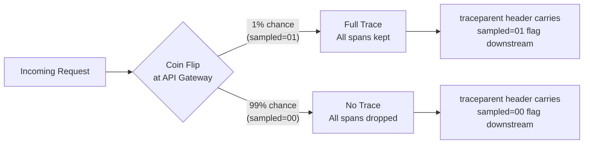

The sampling decision (01 or 00 in the traceparent flags byte) is passed downstream. Every service respects this decision — if the gateway said "don't sample this", downstream services don't send spans either. This ensures consistency: you either have the complete trace or nothing.

```python
import hashlib

def should_sample(trace_id: str, sample_rate: float = 0.01) -> bool:
    """
    Deterministic sampling based on trace ID.
    Same trace ID always makes the same decision — important for consistency.
    Unlike random(), this ensures all services agree on sampling.
    """
    # Convert first 8 bytes of trace ID to integer
    hash_value = int(hashlib.md5(trace_id.encode()).hexdigest()[:8], 16)
    # Check if it falls within the sample percentage
    return hash_value < (sample_rate * (2**32))
```

**Pros**: Simple to implement. Low overhead. Consistent — full traces or nothing.
**Cons**: You might miss rare errors. If 0.1% of requests error and you sample 1%, statistically you'll see only 1-in-10 errors.

### Tail-Based Sampling

The decision happens AFTER the entire trace is complete. The tracing collector buffers all spans, waits for the full trace, then decides based on what actually happened.

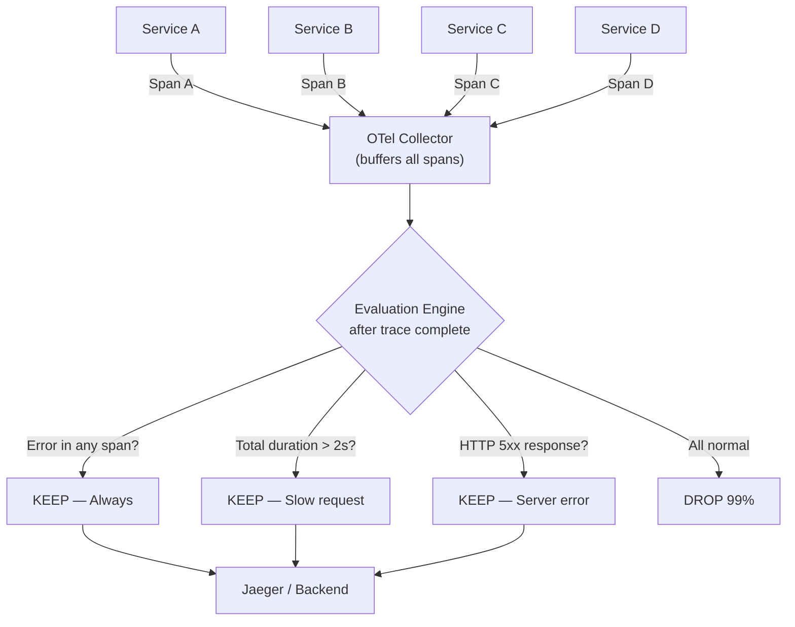

**Pros**: Never misses errors or slow requests. You always trace the interesting things.
**Cons**: More complex infrastructure. Needs a stateful collector that can buffer complete traces. Memory-intensive.

### Priority Sampling (The Hybrid)

Used by Datadog, Jaeger, and most production systems. Head-based by default, but with rules that boost sampling rate for specific conditions:

```yaml
# OTel Collector tail sampling config
processors:
  tail_sampling:
    decision_wait: 10s  # wait 10s for all spans before deciding
    policies:
      # Always keep errors
      - name: error-policy
        type: status_code
        status_code: { status_codes: [ERROR] }

      # Always keep slow requests (>1s)
      - name: slow-request-policy
        type: latency
        latency: { threshold_ms: 1000 }

      # Sample 2% of everything else
      - name: default-policy
        type: probabilistic
        probabilistic: { sampling_percentage: 2 }
```

### Sampling Rate Guide

| Traffic Level | Recommended Strategy | Sample Rate |
|---|---|---|
| Development / Staging | No sampling | 100% |
| Low traffic (< 100 RPS) | Head-based | 100% |
| Medium traffic (100-1000 RPS) | Head-based | 10-20% |
| High traffic (1000-10000 RPS) | Head-based | 1-5% |
| Very high (> 10000 RPS) | Tail-based or adaptive | 0.1-1% + always-on for errors |
| Uber/Netflix scale | Tail-based with adaptive | 0.01% + always-on for errors |

---

## The Tracing Tools Landscape

### Jaeger (Open Source — Built by Uber)

Jaeger is what Uber built internally and open-sourced in 2017. It's now a CNCF graduated project — the same tier as Kubernetes.

Key features:
- **Trace search**: Filter by service, operation, duration, tags
- **Gantt chart view**: Visual waterfall showing all spans and timing
- **Service dependency graph**: Auto-generated map of which services call which
- **Comparison mode**: Compare two traces side by side (useful for regression analysis)
- **Deep storage support**: Cassandra, Elasticsearch, Kafka

Run locally for development:

```bash
docker run -d --name jaeger \
  -p 16686:16686 \    # Jaeger UI
  -p 4317:4317 \      # OTLP gRPC receiver
  -p 4318:4318 \      # OTLP HTTP receiver
  jaegertracing/all-in-one:latest

# Open http://localhost:16686 in your browser
```

Uber traces **1 billion+ spans per day** using Jaeger. That's the scale it was designed for.

### Zipkin (Open Source — Built by Twitter)

Zipkin is the OG distributed tracing system, open-sourced by Twitter around 2012. Many companies still use it.

```bash
docker run -d -p 9411:9411 openzipkin/zipkin
# Open http://localhost:9411
```

Zipkin uses B3 headers natively. The UI is simpler than Jaeger. Not as actively maintained today, but battle-tested for over a decade.

### Grafana Tempo (Open Source)

Grafana Tempo is the modern open-source alternative built by Grafana Labs. Key advantage: it integrates beautifully with Grafana dashboards, Loki (logs), and Prometheus (metrics). If you're already using Grafana, Tempo is the natural choice.

It's also designed to be very cheap to operate — traces go directly to object storage (S3, GCS) without indexing. Trade-off: you must query by trace ID directly (no ad-hoc search).

### Commercial / Cloud Options

| Tool | Best For | Pricing Model | Key Advantage |
|---|---|---|---|
| **AWS X-Ray** | AWS-native workloads | Per trace ingested | Deep AWS service integration (Lambda, ECS, RDS) |
| **Google Cloud Trace** | GCP workloads | Free up to 2.5M spans/month | Auto-instrumentation for GCP services |
| **Datadog APM** | Enterprises wanting all-in-one | Per host/month | Best UI, AI-powered insights, unified with logs + metrics |
| **New Relic** | Full-stack observability | Per GB ingested | Excellent distributed tracing + browser tracing |
| **Honeycomb** | High-cardinality debugging | Per event | Best query capabilities, designed for tail sampling |
| **Dynatrace** | Enterprise auto-discovery | Per host/month | AI-driven root cause analysis |
| **Lightstep** | Developer-focused | Per span | Best for developers, strong OTel support |

### Jaeger vs Zipkin Detailed Comparison

| Feature | Jaeger | Zipkin |
|---|---|---|
| Origin | Uber (2017) | Twitter (2012) |
| Native headers | W3C TraceContext | B3 |
| UI quality | Excellent (modern, feature-rich) | Good (simpler) |
| Storage backends | Cassandra, Elasticsearch, Badger | MySQL, Cassandra, Elasticsearch |
| Scalability | Very high (billion spans/day) | High |
| OTel support | First-class | Via exporter |
| CNCF status | Graduated (top tier) | Not in CNCF |
| Active development | Very active | Less active |
| Best for | New systems, large scale | Legacy systems, Zipkin-first orgs |

**Interview tip**: If asked "Jaeger or Zipkin?", say Jaeger for new systems because it's CNCF graduated, has better OTel support, and scales to Uber's level. Use Zipkin only if you're already invested in it.

---

## What to Look for in a Trace — Debugging Guide

This section is basically "how to be a detective with traces." Yeh practical part hai, remember this.

### 1. The Longest Span — Finding the Bottleneck

The Gantt chart view shows spans as horizontal bars. The longest bar = the bottleneck. It's that simple.

```
API Gateway     |████████████████████████████████████| 3840ms
  Auth Service  |█| 28ms
  Product Svc   |██| 45ms
    DB Query    |█| 38ms
  Inventory Svc |████████████████████████████████████| 3640ms  ← FOUND IT
    DB Query    |████████████████████████████████████| 3620ms  ← ROOT CAUSE
  Order Service      |██| 60ms
```

The Inventory DB query is 94% of total latency. Go fix that query. Add index. Check for table locks. Don't waste time profiling Auth Service.

### 2. N+1 Query Problem — The Hidden Killer

N+1 is a classic bug where instead of making 1 database query, you make N+1 queries (one per item).

Example: Fetching 50 products, then making 50 separate DB calls for each product's inventory instead of one batch query.

In a trace, this looks like:

```
Product List API  |████████████████| 1200ms
  DB: Get products  |█| 20ms
  DB: Get inventory for product 1  |█| 18ms
  DB: Get inventory for product 2  |█| 19ms
  DB: Get inventory for product 3  |█| 17ms
  ... (50 more identical spans)
  DB: Get inventory for product 50 |█| 18ms
```

**You see**: 51 DB spans where you expect 2. Each is fast (18ms), but 50 × 18ms = 900ms of avoidable wait time.

**Fix**: Use `IN` clause or a JOIN. `SELECT * FROM inventory WHERE product_id IN (1,2,3,...50)`.

### 3. External API Calls — Third-Party Latency

Sometimes the slow span is an external service you don't control — a payment gateway, SMS provider, mapping API.

```
Checkout API   |████████████████████████████| 2800ms
  DB: Get cart     |█| 30ms
  Razorpay API     |████████████████████████| 2700ms ← Third-party slow
  DB: Save order   |█| 40ms
```

**Action**: Add a timeout to that external call. Cache responses where possible. Consider async processing (start payment, respond to user, notify when complete).

### 4. Queue Wait Time — The Async Delay

When requests go through message queues (Kafka, SQS, RabbitMQ), you may see a span representing "time waiting in queue before being processed."

```
Order Service publishes event  |█| 5ms  (fast — just putting message in queue)
...time passes...
Notification Service consumes   |████████████████| 8000ms later  (queue was backed up)
```

**Action**: Check consumer lag. Scale up consumers. Check if consumers are stuck on an error.

### 5. Cascading Failures — Timeouts and Retries

When Service A times out calling Service B, it might retry 3 times before failing. In a trace:

```
API Gateway  |████████████████████████████████████| 9000ms
  Inventory Service (attempt 1) |████████| 3000ms → TIMEOUT
  Inventory Service (attempt 2) |████████| 3000ms → TIMEOUT  ← retries!
  Inventory Service (attempt 3) |████████| 3000ms → TIMEOUT
```

**Action**: Fix whatever is making Inventory Service slow. Also review retry configuration — exponential backoff with jitter prevents thundering herd.

### 6. Missing Spans — Gaps in the Timeline

If you see a gap between two spans that should be adjacent, something is happening that isn't instrumented.

```
API Gateway  |████████████████████████████| 2800ms
  Auth       |█| 20ms
  (gap of 500ms — what's happening here?)
  Inventory  |████████████| 1200ms
```

**Action**: Add instrumentation for whatever is happening in that gap. It might be middleware, serialization, or an un-traced library call.

---

## Baggage — Propagating Context Data

Trace ID propagates automatically. But what if you want to propagate other data along with the trace? Enter **Baggage**.

> Analogy: When you check in at an airport, your boarding pass (trace ID) lets the airline track your journey. But you can also put luggage tags on your bags (baggage). Those tags say your name, destination, and seat number. Every checkpoint that touches your bags can read those tags. Distributed tracing baggage works exactly like luggage tags.

**Baggage** is a set of key-value pairs attached to a trace context and automatically propagated to ALL downstream services.

Use cases:
- `user_id` — which user made this request (useful for filtering traces by user)
- `user_tier` — free/premium (route to different tracing policies)
- `region` — which geographic region the request came from
- `experiment_id` — which A/B test variant the user is in
- `session_id` — correlate all requests in a user session

```python
from opentelemetry import baggage
from opentelemetry.baggage.propagation import W3CBaggagePropagator

# In your API Gateway, after authenticating the user:
ctx = baggage.set_baggage("user_id", user.id)
ctx = baggage.set_baggage("user_tier", user.subscription_tier, context=ctx)
ctx = baggage.set_baggage("experiment_id", "checkout_redesign_v2", context=ctx)

# Now when ANY service in the chain makes a downstream call,
# these values are automatically included in the Baggage header:
# baggage: user_id=42,user_tier=premium,experiment_id=checkout_redesign_v2

# In ANY downstream service, read the baggage:
user_id = baggage.get_baggage("user_id")
span.set_attribute("user.id", user_id)  # Add to span for searchability
```

The `Baggage` HTTP header format:
```
baggage: user_id=42,user_tier=premium,experiment_id=checkout_redesign_v2
```

**Important warnings about Baggage**:
- Baggage is propagated to EVERY service, including third-party services you call. Don't put secrets or PII in baggage.
- Keep baggage small (< 8KB total). Each service must parse and forward it.
- Baggage is for propagation, not for debugging attributes. Add important values as span attributes (which go to Jaeger) AND as baggage (which propagates downstream).

---

## Tracing + Logs — The Killer Combination

Traces tell you WHERE and WHEN things went wrong. Logs tell you WHAT happened in detail. Together, they're unstoppable.

The connection: inject the **trace_id** and **span_id** into every log line.

```python
import logging
import json
from opentelemetry import trace

class TracedLogger:
    def __init__(self, service: str):
        self.service = service
        self._logger = logging.getLogger(service)

    def _context(self) -> dict:
        span = trace.get_current_span()
        ctx = span.get_span_context()
        if ctx.is_valid:
            return {
                "trace_id": format(ctx.trace_id, "032x"),
                "span_id": format(ctx.span_id, "016x"),
            }
        return {"trace_id": None, "span_id": None}

    def info(self, msg: str, **extra):
        self._logger.info(json.dumps({"level":"INFO","msg":msg,"svc":self.service,**self._context(),**extra}))

    def error(self, msg: str, **extra):
        self._logger.error(json.dumps({"level":"ERROR","msg":msg,"svc":self.service,**self._context(),**extra}))

log = TracedLogger("inventory-service")

def check_stock(product_id: str, qty: int) -> bool:
    log.info("Checking stock", product_id=product_id, requested_qty=qty)
    available = db.get_stock(product_id)
    if available < qty:
        log.error("Insufficient stock", product_id=product_id, available=available, requested=qty)
        return False
    log.info("Stock confirmed", product_id=product_id, available=available)
    return True
```

Every log line now includes `trace_id`. Debugging workflow:

1. Alert fires: "p99 latency spiked to 8s at 10:47 AM"
2. Open Jaeger, search for slow traces (duration > 5s) around 10:47 AM
3. Find a slow trace, copy its `trace_id`: `4bf92f3577b34da6a3ce929d0e0e4736`
4. Go to Grafana Loki (log aggregator), search: `trace_id="4bf92f3577b34da6a3ce929d0e0e4736"`
5. See EVERY log line from EVERY service for that exact request
6. Trace shows Inventory Service took 7.8s. Logs show: "Deadlock detected, retrying query..."
7. Root cause found: database deadlock

Without trace IDs in logs, step 4 would require manually correlating log timestamps across 5 different service log streams. Nightmare. With trace IDs, it's a 5-second query.

---

## A Complete Distributed Trace — Zomato Order Flow

Let's trace a complete Zomato order from start to finish. Yeh real-world example hai.

```mermaid
gantt
    title Trace: POST /api/order/place (trace_id: zmt456)
    dateFormat x
    axisFormat %Lms

    section API Gateway
    Request validation    :0, 15
    Auth token check      :0, 45

    section Auth Service
    JWT decode            :5, 20
    User DB lookup        :20, 45

    section Restaurant Service
    Fetch restaurant info :45, 90
    DB query              :50, 85

    section Menu Service
    Validate menu items   :90, 130
    Cache lookup          :90, 95
    DB fallback           :95, 130

    section Pricing Service
    Calculate total       :130, 165
    Apply coupons         :148, 165

    section Inventory/Availability
    Check item stock      :165, 1890
    DB query SLOW         :165, 1880

    section Payment Service
    Initiate payment      :1890, 2150
    Razorpay API call     :1895, 2145

    section Order Service
    Create order record   :2150, 2210
    Kafka publish         :2195, 2210

    section Notification
    Push notification     :2210, 2240
```

Total: 2240ms. Who's responsible?
1. **Inventory/Availability**: 1725ms — DB query is 1715ms. This needs a query optimization + index.
2. **Payment/Razorpay**: 255ms — External API, add timeout + retry config. Acceptable.
3. Everything else: < 200ms total — perfectly fine.

Fix the Inventory DB query, and the order API goes from 2.2s to ~500ms. That's the power of distributed tracing.

---

## Real-World Scale — Uber and Netflix

### Uber's Distributed Tracing at Scale

Uber built Jaeger because their distributed system had grown to 2,000+ microservices by 2017. The scale:

- **1 billion+ spans per day** flowing through Jaeger
- Every UberEats order, every ride request, every driver location update creates spans
- They use **adaptive sampling** — sample rate adjusts automatically based on traffic and error rates
- Spans stream through Kafka before hitting Elasticsearch for storage
- They run multiple Jaeger deployment clusters across regions

Key lesson from Uber: at their scale, even 1% sampling is 10 million spans per day. The challenge isn't generating traces — it's storing, indexing, and querying them efficiently.

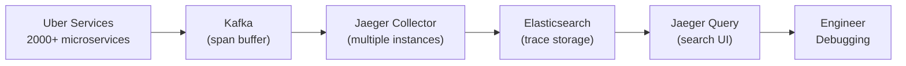

### Netflix's Observability Philosophy

Netflix has a different approach. They call it "Observe Everything" — their philosophy is that you should never need to SSH into a production server. All information should come from the observability stack.

- They use **Edgar** (internal tool, built on Zipkin/Jaeger concepts) for distributed tracing
- Trace IDs flow through all their microservices — 1000+ of them
- They built **Hollow** for data propagation, integrated with tracing
- Their tracing feeds directly into their **ChAP** (Chaos as a Platform) — chaos engineering tool that observes trace patterns to decide when it's safe to inject failures

Key Netflix insight: distributed tracing is not just for debugging. It's for understanding system behavior well enough to confidently run chaos experiments in production.

### Google's Dapper — The Paper That Started It All

Before Jaeger and Zipkin, Google published their internal tracing system paper "**Dapper, a Large-Scale Distributed Systems Tracing Infrastructure**" (2010). It defined the vocabulary we still use:

- **Span**: a named, timed operation
- **Trace**: a collection of spans forming a tree
- **Annotation**: timestamped event within a span
- **Trace context propagation** via RPC headers

Zipkin was Twitter's implementation inspired by Dapper. Jaeger was Uber's implementation. OpenTelemetry standardized the concepts. The Dapper paper is worth reading even today.

---

## The Three Pillars of Observability — How Tracing Fits

Distributed tracing doesn't stand alone. It's one pillar of a three-pillar observability system:

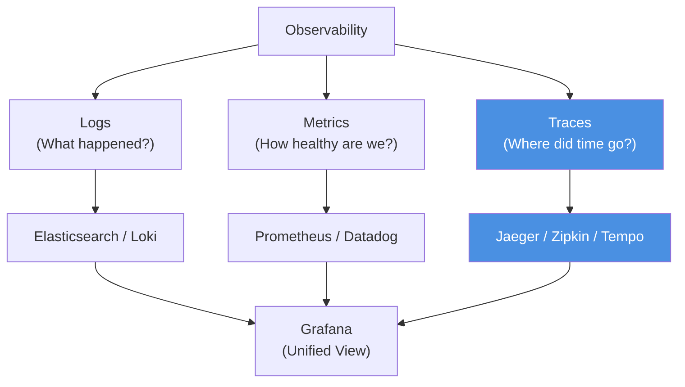

| Signal | Question it answers | Best for | Tool |
|---|---|---|---|
| **Logs** | What exactly happened? | Debugging specific events | Elasticsearch, Loki |
| **Metrics** | Is the system healthy? How healthy? | Alerting, dashboards, trends | Prometheus, Datadog |
| **Traces** | Which service/query/API is slow? | Latency debugging, bottleneck finding | Jaeger, Zipkin, Tempo |

The magic happens when they're **correlated**:
- An alert fires (metric) → you find the slow traces (trace) → you look at logs for those requests (logs)
- All three connected via the **trace_id** embedded in all three signals

---

## Full Observability Stack Architecture

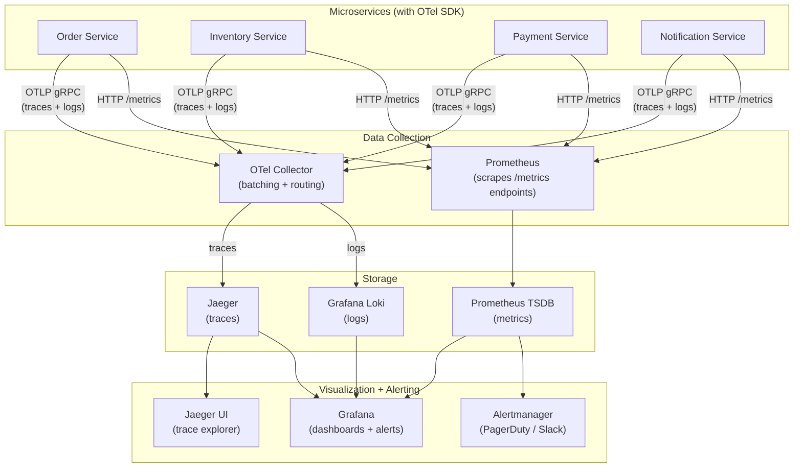

---

## Setting Up Distributed Tracing — Step by Step

For a Node.js/Express microservice using OpenTelemetry and Jaeger:

```bash
# 1. Start Jaeger (local dev)
docker run -d --name jaeger \
  -p 16686:16686 -p 4317:4317 -p 4318:4318 \
  jaegertracing/all-in-one:latest

# 2. Install OTel packages
npm install @opentelemetry/sdk-node \
            @opentelemetry/auto-instrumentations-node \
            @opentelemetry/exporter-trace-otlp-http
```

```javascript
// tracing.js — load this BEFORE anything else
const { NodeSDK } = require('@opentelemetry/sdk-node');
const { getNodeAutoInstrumentations } = require('@opentelemetry/auto-instrumentations-node');
const { OTLPTraceExporter } = require('@opentelemetry/exporter-trace-otlp-http');

const sdk = new NodeSDK({
  serviceName: 'order-service',
  traceExporter: new OTLPTraceExporter({
    url: 'http://localhost:4318/v1/traces',
  }),
  instrumentations: [
    getNodeAutoInstrumentations({
      // Auto-instruments: HTTP, Express, MySQL, Redis, gRPC, etc.
      '@opentelemetry/instrumentation-express': { enabled: true },
      '@opentelemetry/instrumentation-http': { enabled: true },
      '@opentelemetry/instrumentation-mysql2': { enabled: true },
    }),
  ],
});

sdk.start();
console.log('OTel tracing started for order-service');

process.on('SIGTERM', () => sdk.shutdown());
```

```javascript
// server.js
require('./tracing'); // MUST be first import

const express = require('express');
const { trace, context } = require('@opentelemetry/api');

const app = express();
const tracer = trace.getTracer('order-service');

app.post('/api/orders', async (req, res) => {
  // Express is auto-instrumented — the span is created automatically
  // Add custom attributes to the auto-created span
  const span = trace.getActiveSpan();
  span.setAttribute('order.user_id', req.body.userId);
  span.setAttribute('order.item_count', req.body.items.length);

  // Custom business logic span
  const result = await tracer.startActiveSpan('validate_order', async (orderSpan) => {
    try {
      const validated = await validateOrder(req.body);
      orderSpan.setAttribute('order.valid', true);
      orderSpan.end();
      return validated;
    } catch (err) {
      orderSpan.recordException(err);
      orderSpan.setStatus({ code: trace.SpanStatusCode.ERROR, message: err.message });
      orderSpan.end();
      throw err;
    }
  });

  res.json({ orderId: result.id, status: 'created' });
});

app.listen(3001);
```

Open `http://localhost:16686` in Jaeger UI, make a request to your service, and see the trace appear within seconds.

---

## Common Patterns and Anti-Patterns

### Good Patterns

**1. Always close spans, even on error**
```python
with tracer.start_as_current_span("process_payment") as span:
    try:
        result = payment_gateway.charge(amount)
        span.set_attribute("payment.transaction_id", result.id)
    except PaymentError as e:
        span.record_exception(e)
        span.set_status(StatusCode.ERROR, str(e))
        raise  # Re-raise — the span will close when the `with` block exits
```

**2. Use semantic conventions for attributes**
OpenTelemetry defines standard attribute names. Use them — tools like Jaeger understand them:
```python
span.set_attribute("http.method", "POST")          # Not "method" or "http_method"
span.set_attribute("http.status_code", 200)         # Not "status" or "response_code"
span.set_attribute("db.system", "postgresql")       # Not "database" or "db_type"
span.set_attribute("db.name", "orders_db")
span.set_attribute("messaging.system", "kafka")     # Not "queue" or "broker"
```

**3. Add span events for important moments**
```python
with tracer.start_as_current_span("process_order") as span:
    span.add_event("order_validated", {"items_count": 5})
    span.add_event("payment_initiated")
    # ... wait for payment ...
    span.add_event("payment_confirmed", {"transaction_id": "txn_123"})
```

### Anti-Patterns

**1. Don't create too many spans** — every span has overhead. A span per function is too granular. A span per service call or per logical operation is right.

**2. Don't put PII in span attributes** — span data goes to Jaeger/Datadog/etc. and may be stored for days. Don't put credit card numbers, passwords, or full addresses in span attributes.

**3. Don't ignore propagation** — if you use a custom HTTP client or message queue producer, you must inject the trace context manually. Forgetting this breaks the trace — the downstream service won't know it belongs to the same trace.

**4. Don't trace synchronously** — OTel SDK batches and exports spans asynchronously. Never block request handling to wait for span export.

---

## Distributed Tracing in Different Communication Patterns

### HTTP/REST Services
Standard case. OTel auto-instruments popular HTTP clients.

### gRPC Services
OTel has gRPC instrumentation. Trace context travels in gRPC metadata headers.

### Message Queues (Kafka, SQS, RabbitMQ)
This is where it gets interesting. A trace can span across an asynchronous boundary:

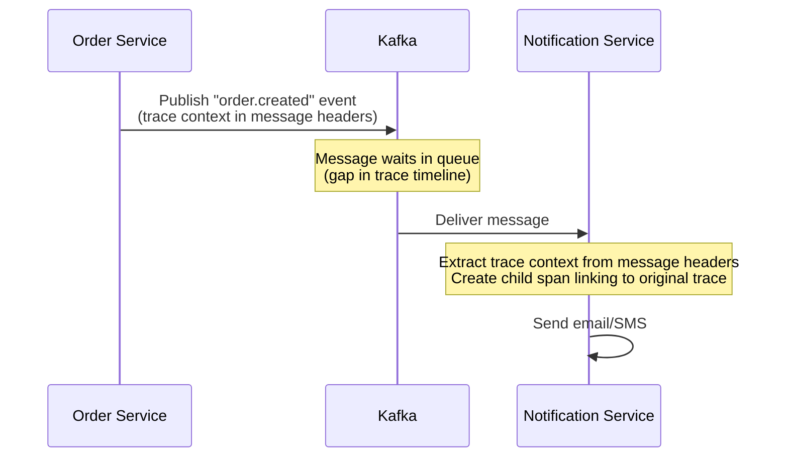

```python
# Producer side (Order Service)
from opentelemetry.propagate import inject

def publish_order_event(producer, order_id: str):
    headers = {}
    inject(headers)  # Inject trace context into headers dict

    # Convert dict to Kafka header format (list of tuples)
    kafka_headers = [(k, v.encode()) for k, v in headers.items()]

    producer.send(
        topic="order.created",
        value={"order_id": order_id},
        headers=kafka_headers
    )

# Consumer side (Notification Service)
from opentelemetry.propagate import extract

def consume_order_event(message):
    # Extract trace context from Kafka message headers
    headers = {k: v.decode() for k, v in message.headers}
    ctx = extract(headers)

    with tracer.start_as_current_span("send_order_notification",
                                       context=ctx,
                                       kind=trace.SpanKind.CONSUMER) as span:
        span.set_attribute("messaging.kafka.topic", "order.created")
        send_notification(message.value["order_id"])
```

---

## Interview Questions and Answers

### Q1: What is distributed tracing and why do we need it?

**Answer**: Distributed tracing tracks a single request's complete journey across multiple microservices. We need it because logs are per-service and can't be correlated across services without a shared identifier. When a checkout request takes 4 seconds and touches 8 services, tracing immediately shows which service is responsible — say, the Inventory DB query taking 3.6 seconds — while logs alone would require manually correlating timestamps across 8 separate log streams.

### Q2: Explain Trace vs Span.

**Answer**: A Trace is the complete end-to-end record of one request's journey. It has a globally unique Trace ID that stays constant across all services. A Span is one unit of work within a trace — typically one service's handling of the request, one DB query, or one external API call. Spans form a parent-child tree: the API Gateway creates the root span, every service it calls creates a child span, and every DB call within a service creates a grandchild span. Each span records start time, end time, status, and key-value attributes.

### Q3: How does trace context propagate between services?

**Answer**: Via HTTP headers. The entry point generates a Trace ID and creates the root span. It injects these into the `traceparent` header format: `00-{trace-id}-{span-id}-{flags}`. Every downstream service reads this header, creates its own child span (using the incoming span-id as the parent), then injects a new `traceparent` header (with its own span-id) into any further downstream calls. This chain propagates the trace ID through all services automatically. OpenTelemetry handles this with a single `inject(headers)` call.

### Q4: What is sampling in distributed tracing? What are head-based vs tail-based sampling?

**Answer**: Sampling decides which requests to trace in full detail and which to skip, because tracing every request at scale (millions of RPS) is too expensive. Head-based sampling decides at the start of a request — like a coin flip at the API gateway. It's simple and low-overhead but may miss rare errors. Tail-based sampling decides after the full trace is collected — keeping all error traces and slow traces, dropping only the boring normal ones. It never misses errors but requires a stateful collector that buffers traces. Most production systems use tail-based or priority sampling (head-based with higher rates for errors/slow requests).

### Q5: What is OpenTelemetry and why is it important?

**Answer**: OpenTelemetry is a vendor-neutral, CNCF-graduated open standard for distributed tracing, metrics, and logs. Before OTel, every observability vendor had their own SDK — adopting Datadog meant using Datadog's SDK everywhere; switching to Jaeger meant rewriting all instrumentation. OTel separates the instrumentation from the backend: instrument your code once with OTel APIs, then route data to any backend (Jaeger, Datadog, Grafana Tempo, AWS X-Ray) by changing configuration, not code. It supports auto-instrumentation for common frameworks (Flask, Spring, Express, Django) so you often get traces without writing any code.

### Q6: Explain Baggage in distributed tracing.

**Answer**: Baggage is a set of key-value pairs attached to a trace context and automatically propagated to every downstream service in the call chain. While Trace ID identifies a specific request, Baggage carries business context — like `user_id=42`, `experiment_id=checkout_v2`, `user_tier=premium`. Every service in the chain can read these values without re-fetching them. Baggage travels in the `baggage` HTTP header. Important caveats: never put PII or secrets in baggage (it propagates to all downstream services including third parties), and keep it small (< 8KB) since every service parses and forwards it.

### Q7: What is the W3C TraceContext standard?

**Answer**: W3C TraceContext is the official standard for HTTP headers that carry trace context. The main header is `traceparent` in format `{version}-{trace-id}-{span-id}-{flags}`. The trace-id is 128 bits (32 hex characters), globally unique per request. The span-id is 64 bits and identifies the current service's span — the next downstream service uses this as its parent-id. The flags byte carries the sampling decision (01 = sample, 00 = don't sample). The companion `tracestate` header carries vendor-specific data. This standard replaced fragmented proprietary formats (B3, Datadog's X-Datadog-Trace-Id, AWS X-Amzn-Trace-Id).

### Q8: What is an N+1 query problem and how does distributed tracing reveal it?

**Answer**: N+1 is a bug where code makes N+1 database queries when it should make 1 or 2. Example: fetching 50 products with one query, then making 50 separate queries for each product's inventory instead of a single batch query. In a trace, it appears as many identical short spans where you'd expect one. A trace might show: 1 span for "get product list" (20ms) + 50 nearly-identical spans for "get inventory for product X" (18ms each = 900ms). Without tracing, this would show as "the API is slow" with no visibility into why. With tracing, the N+1 pattern is immediately visible.

### Q9: Jaeger vs Zipkin — which would you choose and why?

**Answer**: Jaeger for new systems, because it's a CNCF graduated project with active development, natively supports W3C TraceContext headers, has better OpenTelemetry integration, scales to billions of spans per day (as Uber proved), and has a richer UI with service dependency graphs and trace comparison. Zipkin is a solid choice only if you're maintaining an existing Zipkin deployment or integrating with legacy systems that already use B3 headers. The migration path from Zipkin to Jaeger is well-documented if needed.

### Q10: How would you debug a request that takes 3 seconds in production?

**Answer**: 
1. Open Jaeger, filter traces for that endpoint with duration > 2s
2. Pick a representative slow trace
3. Look at the Gantt/waterfall chart — identify the longest span
4. Check if it's one slow span (single bottleneck) or many medium spans (N+1)
5. If DB query: check the query in span attributes, look for missing indexes, check for locks
6. If external API: check if there's a timeout configured, consider async processing
7. If gap between spans: add instrumentation for un-traced middleware
8. Cross-reference with logs: search log aggregator by the trace_id to get detailed logs from all services for that specific request
9. Check if this started recently: compare traces before and after the last deployment

---

## Key Takeaways

1. **The problem**: In microservices, a slow request could be caused by any of 5-20 services. Logs are per-service and can't be correlated. Distributed tracing solves this by following the request with a shared Trace ID.

2. **Trace = journey, Span = one stop**: A trace has a unique Trace ID and represents the full request lifecycle. A span is one service's work within that trace, with start/end times and a parent-child relationship forming a tree.

3. **Trace ID travels in HTTP headers**: The `traceparent` W3C header carries the trace-id and span-id between services. Every service extracts it, creates a child span, and injects it into outgoing calls. OpenTelemetry makes this automatic.

4. **OpenTelemetry is the standard**: Instrument once with OTel, send to any backend. Don't use vendor-specific SDKs — you'll regret it when you want to switch.

5. **You cannot trace everything at scale**: Use head-based sampling for simplicity (1-5% of traffic). Use tail-based sampling when you can't afford to miss errors (always keep error + slow traces). Uber traces 1 billion+ spans/day using adaptive sampling.

6. **What to look for**: Longest span = bottleneck. Many identical short spans = N+1. Missing spans = un-instrumented code. Long external API spans = third-party latency.

7. **Baggage propagates business context**: Key-value data attached to a trace and automatically forwarded to all downstream services. Use for user_id, experiment_id, region — not PII or secrets.

8. **Inject trace_id into every log line**: This is the single highest-ROI observability improvement. It connects logs (what happened) to traces (where time went) so you can debug production issues in seconds instead of hours.

9. **Jaeger (Uber), Zipkin (Twitter), Grafana Tempo (open source), Datadog APM (commercial)**: All are valid choices. Jaeger is the community standard. Datadog if you want everything in one platform.

10. **Distributed tracing is not just for debugging**: Netflix uses trace patterns to decide when it's safe to run chaos experiments. Trace data reveals service dependencies, API usage patterns, and system behavior at scale.

---

## Further Reading

- [OpenTelemetry Documentation](https://opentelemetry.io/docs/) — official guides, language-specific tutorials
- [W3C TraceContext Specification](https://www.w3.org/TR/trace-context/) — the header standard specification
- [Jaeger Documentation](https://www.jaegertracing.io/docs/) — Jaeger getting started and architecture
- [Google Dapper Paper](https://research.google/pubs/pub36356/) — the 2010 paper that defined modern distributed tracing vocabulary
- "Distributed Systems Observability" by Cindy Sridharan — the definitive book on this topic
- [OpenTelemetry Semantic Conventions](https://opentelemetry.io/docs/specs/semconv/) — standard attribute names to use in spans
