# Object Storage (S3 and Beyond)

---

## Why Storage Decisions Matter More Than You Think

Before we dive in, let me tell you why this topic keeps coming up in every senior engineering interview.

Imagine you're building Instagram. Users upload millions of photos per day. Where do you put them? Your first instinct might be: "Store them on the server's hard disk!" That works when you have 10 users. When you have 100 million users uploading 100 million photos a day, your server's disk is full in hours, you can't scale horizontally without copying files everywhere, and you're paying a fortune. This is where understanding the three fundamentally different ways to store data saves your system — and your job.

Yeh kyun important hai? Because in a system design interview, if someone asks "design Instagram" or "design YouTube" and you say "store files on disk" — that's an instant red flag. The interviewer knows you haven't thought about scale. The right answer is **object storage + CDN**, and understanding *why* is what this chapter is about.

---

## The Big Picture: Three Ways Computers Store Data

Think about how you store stuff in real life. You have three options:

1. **A raw piece of land** — no buildings, no roads, just empty space. You decide everything: where to build, how to organize. Fast to access once you know exactly where things are, but complex to manage.

2. **A filing cabinet** — organized in folders, inside drawers, labeled neatly. Multiple people can open the same cabinet and find the same folder. Easy to navigate, but the cabinet can only be in one place.

3. **Amazon (the store, not AWS)** — you put something in a warehouse, they give you a tracking number (a "key"). You can retrieve anything from anywhere in the world using that number. Unlimited capacity. Anyone can request delivery to their doorstep with a URL.

These three real-life analogies map perfectly to the three types of computer storage: **Block, File, and Object**. Let's understand each deeply.

---

## Block Storage: The Raw Land

### The Analogy

Imagine handing a 10-year-old an empty notebook with no lines, no sections, no labels. Just blank pages. They can write wherever they want, draw grids, divide it however they like. But nobody else can use the notebook at the same time — it's *theirs*. And if they want to share a specific page with a friend, they'd have to physically go show them.

That notebook is **block storage**. It's raw capacity given to a single machine. The machine (or the OS on it) decides how to organize that space — whether to build a database, a file system, or anything else. No inherent structure. Just blocks of storage.

### Why Does Block Storage Exist?

Because databases and operating systems need to control *exactly* how data lands on disk. A database like PostgreSQL writes data in specific pages, with precise byte offsets. It handles its own caching, its own indexing, its own write-ahead logs. If you put a database on top of a shared file system with extra abstraction layers, you add latency at every I/O operation. At high transaction volumes, that millisecond difference is catastrophic.

Block storage removes every abstraction layer between the application and the raw disk. That's why it's fast — sub-millisecond latency for random reads and writes.

### How It Works

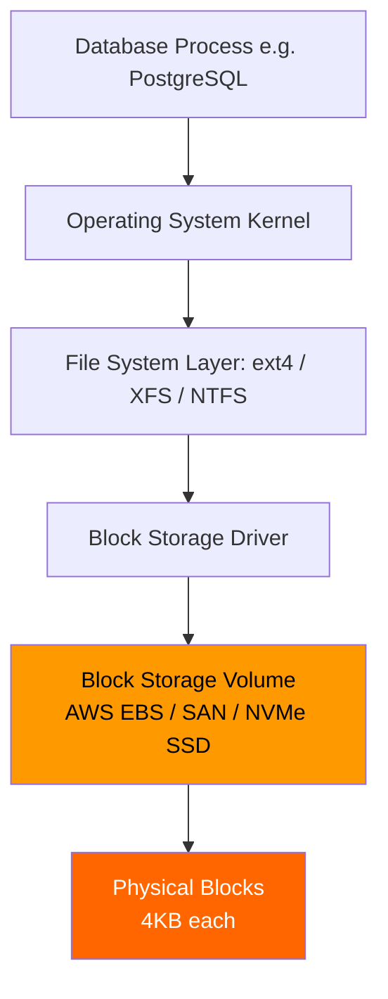

- Data is divided into fixed-size **blocks** (typically 4KB).
- The OS reads/writes specific block numbers directly — no filenames, no metadata at the storage layer.
- Communication uses protocols like **iSCSI**, **NVMe**, or **Fibre Channel** — all designed for maximum throughput and minimum latency.
- One machine attaches one volume. It's like plugging in a hard drive.

### Real-World Use: Uber's PostgreSQL Cluster

Uber runs one of the largest PostgreSQL deployments in the world for their ride data — drivers, trips, payments. Every single PostgreSQL server is backed by **block storage** (EBS io2 volumes). Why? Because PostgreSQL needs to write transaction logs (WAL) and data pages in strict byte-level order. The sub-millisecond latency of block storage is non-negotiable at 15 million rides per day.

### AWS EBS Volume Types

| EBS Type | Max IOPS | Latency | Use Case |
|---|---|---|---|
| gp3 (General Purpose) | 16,000 | Single-digit ms | Boot volumes, dev databases |
| io2 Block Express | 256,000 | Sub-millisecond | High-frequency trading, SAP HANA |
| st1 (Throughput Optimized) | 500 | Medium | Big data sequential reads |
| sc1 (Cold HDD) | 250 | High | Infrequent access archives |

```bash
# Create a high-performance EBS volume for a database
aws ec2 create-volume \
  --availability-zone us-east-1a \
  --size 500 \
  --volume-type io2 \
  --iops 64000

# Attach it to an EC2 instance
aws ec2 attach-volume \
  --volume-id vol-0abcd1234efgh5678 \
  --instance-id i-0abc123def456789 \
  --device /dev/sdf

# Format and mount on the EC2 instance
sudo mkfs.xfs /dev/sdf
sudo mkdir /var/lib/postgresql/data
sudo mount /dev/sdf /var/lib/postgresql/data
```

### When to Use Block Storage

**Use it when:**
- Running relational databases (PostgreSQL, MySQL, Oracle)
- Running NoSQL databases (Cassandra, MongoDB)
- VM boot volumes
- Any workload needing low-latency random I/O (sub-millisecond)

**Do NOT use it when:**
- You need to share data across multiple servers simultaneously
- You need to serve files to users over HTTP (images, videos)
- You need petabyte-scale storage — block storage gets expensive fast
- You're building a stateless service with no persistent disk needs

### Trade-offs

| Pros | Cons |
|---|---|
| Lowest latency (sub-ms) | Cannot share across servers easily |
| Highest IOPS | Expensive at large scale |
| Full control over storage layout | Not HTTP-accessible |
| Best for databases | Requires OS/driver management |

---

## File Storage: The Filing Cabinet

### The Analogy

Picture a big filing cabinet in an office. It has drawers labeled "Finance", "HR", "Engineering". Inside each drawer are folders, inside folders are documents. Now imagine 50 employees all have a key to this cabinet. They can all open it, browse to any folder, read or edit any document, and everyone sees the changes immediately.

That shared filing cabinet is **file storage**. Multiple machines can mount the same file system and all see the same directory tree. Changes made by one server appear instantly (or near-instantly) to all others.

### Why Does File Storage Exist?

File storage exists because some applications are built assuming a hierarchical file system. They use `open("/data/config/settings.yaml")` and expect to find a file there. Legacy enterprise apps, content management systems, HPC clusters — they were written before cloud-native patterns existed. File storage lets these apps work unchanged across multiple machines.

Also, for sharing files between servers — like when multiple web servers need to serve the same uploaded user content — file storage provides a simple shared namespace without building custom sync logic.

### How It Works

```mermaid
graph TD
    A[Web Server 1] -->|NFS mount /mnt/shared| D[Shared File System\nAWS EFS / NFS]
    B[Web Server 2] -->|NFS mount /mnt/shared| D
    C[Web Server 3] -->|NFS mount /mnt/shared| D
    D --> E[/mnt/shared/uploads/user123/photo.jpg]
    D --> F[/mnt/shared/configs/feature-flags.yaml]
    D --> G[/mnt/shared/logs/app-2025-06-26.log]

    style D fill:#4a9eff,color:#fff
```

Multiple servers mount the same network path. They all see the same directory tree. Under the hood, NFS (Network File System) or SMB handles the coordination — translating local file operations into network requests to the file server.

### Real-World Use: WordPress on Multiple Servers

A classic use case: You're running 10 WordPress web servers behind a load balancer. WordPress stores uploaded images in `/var/www/html/wp-content/uploads/`. If Server 1 handles the upload and Server 2 serves the next request for that image — Server 2 needs to see the file. Without file storage, you'd need complex sync logic. With EFS mounted on all 10 servers, every server sees every upload immediately.

```python
# Python app on two EC2 instances sharing the same EFS mount
# Both instances have /mnt/efs mounted to the same EFS file system

import os
import json

SHARED_CONFIG_PATH = "/mnt/efs/configs/feature-flags.json"

def read_feature_flags():
    """All servers read the same config. One source of truth."""
    with open(SHARED_CONFIG_PATH, "r") as f:
        return json.load(f)

def write_feature_flag(key: str, value: bool):
    """Admin process writes; all servers pick it up immediately."""
    flags = read_feature_flags()
    flags[key] = value
    with open(SHARED_CONFIG_PATH, "w") as f:
        json.dump(flags, f, indent=2)
```

### When to Use File Storage

**Use it when:**
- Legacy apps that use POSIX file paths (`open()`, `read()`, `write()`)
- Shared configuration files across a fleet of servers
- Content management systems with shared uploads directories
- HPC (High-Performance Computing) where thousands of compute nodes read the same dataset
- Home directories for users on a shared compute cluster

**Do NOT use it when:**
- You need to serve billions of files over HTTP to global users
- You need multi-region replication with consistency
- Cost is a concern at large scale (EFS charges ~$0.30/GB/month vs S3's $0.023)
- Your app is cloud-native and stateless — just use object storage

### Trade-offs

| Pros | Cons |
|---|---|
| Shared across many servers | Network overhead (not sub-ms) |
| Familiar hierarchical namespace | Expensive at large scale |
| Works with legacy POSIX apps | Single region (mostly) |
| Easy to browse and navigate | Not designed for HTTP delivery |

---

## Object Storage: The Magical Post Office

### The Analogy

Imagine a post office with **unlimited PO boxes**. Every time you store something, the post office gives you a unique tracking number — let's call it a "key". You can retrieve your item from anywhere in the world just by knowing its key. Each item also has a label card attached (metadata) describing what it is, who sent it, and when.

Now imagine this post office gives every item a **public URL** so anyone on the internet can access it directly. And the post office can hold billions of items — photos, videos, documents, anything — at almost no cost per item.

That is **object storage**. Aur yahi reason hai ki Instagram ke billions of photos kahan store hote hain — S3 pe.

### Why Does Object Storage Exist?

Think about the problem object storage solves. It's 2006. YouTube is growing explosively. Every day, tens of thousands of videos are being uploaded. Where do you store them? On servers? You'd need thousands of servers just for storage, each with a disk, an OS, network connection. And you need to replicate everything for durability. And you need HTTP endpoints to serve them globally. And you need monitoring, backup, security...

Amazon realized this was a common problem — and built S3 (Simple Storage Service). Object storage exists to be the **infinitely scalable, highly durable, HTTP-accessible, dirt-cheap** blob store. It offloads the hardest parts of managing files at scale so you don't have to.

### How It Works: The Core Concepts

```mermaid
graph LR
    subgraph S3 Bucket: instagram-media
        K1[Key: photos/user-42/selfie.jpg\nSize: 2.1 MB\nMetadata: content-type, owner-id, upload-time]
        K2[Key: videos/user-77/reel-001.mp4\nSize: 18 MB\nMetadata: content-type, duration, resolution]
        K3[Key: stories/user-99/story-1234.jpg\nSize: 0.8 MB\nMetadata: content-type, expires-at]
    end

    A[User Upload] -->|HTTP PUT + key| S3 Bucket: instagram-media
    B[User Download] -->|HTTP GET + key| S3 Bucket: instagram-media
```

Three core primitives — samjho aise:

- **Bucket**: A named container for objects. Like a top-level folder name. Globally unique across all AWS accounts (e.g., `instagram-user-media`). You create a bucket in a specific AWS region.
- **Key**: The unique identifier for an object within a bucket. Looks like a path (`photos/user-42/selfie.jpg`) but it's just a string — there are no real directories. The slashes are just characters in the key.
- **Value**: The actual binary data — the bytes of your file. Can be anything from 0 bytes to 5 terabytes.
- **Metadata**: Key-value pairs attached to the object. System metadata (size, ETag, last-modified) is automatic. You can add custom metadata (owner ID, original filename, processing status).

### Characteristics

| Property | Value |
|---|---|
| Latency | First byte: 50-200ms (not for databases!) |
| Throughput | Massive — designed for petabytes |
| Access Protocol | HTTP REST (PUT, GET, DELETE, HEAD) |
| Namespace | Flat (simulated hierarchy via key prefixes) |
| Max Object Size | 5 TB per object |
| Durability | 99.999999999% (11 nines) — essentially never lose data |
| Cost | ~$0.023/GB/month (Standard) |
| Sharing | Yes — via URL from anywhere on Earth |

### S3's Durability Claim: What Does 11 Nines Mean?

When S3 says 11 nines (99.999999999%) durability, that means:
- If you store 10 million objects, you'd expect to lose 1 object once every 10,000 years.
- AWS achieves this by automatically storing each object across **at least 3 Availability Zones** within a region.
- Every write is synchronously replicated before the 200 OK is returned.

For comparison, a single enterprise hard drive has ~99.9% reliability. You'd lose data every few years. S3 makes data loss essentially impossible at any practical scale.

---

## All Three Storage Types: The Definitive Comparison

```mermaid
graph LR
    subgraph Block: One Machine, Raw Speed
        BS[EBS Volume\nSingle EC2 instance\niSCSI / NVMe\nSub-ms latency]
    end
    subgraph File: Many Machines, Shared Path
        FS[EFS / NFS\nMany EC2 instances\nNFS / SMB\nLow-medium latency]
    end
    subgraph Object: Anyone, Anywhere, Any Scale
        OS[S3 / GCS / Azure Blob\nAny device in the world\nHTTP REST\nMedium latency, infinite scale]
    end
```

| Feature | Block Storage | File Storage | Object Storage |
|---|---|---|---|
| AWS Service | EBS | EFS | S3 |
| GCP Service | Persistent Disk | Filestore | Cloud Storage |
| Azure Service | Managed Disk | Azure Files | Blob Storage |
| Self-hosted | LVM / SAN | NFS Server | MinIO |
| Access Protocol | iSCSI / NVMe | NFS / SMB | HTTP REST |
| Latency | Sub-millisecond | Low-Medium | 50-200ms first byte |
| Shared Access | No (one machine) | Yes (many machines) | Yes (via URL, globally) |
| Namespace | None (raw blocks) | Hierarchical (tree) | Flat (key-based) |
| Max Size | Volume limit (64TB on EBS) | File system limit | 5TB per object, unlimited total |
| Cost (AWS) | ~$0.08-0.12/GB/month | ~$0.30/GB/month | ~$0.023/GB/month |
| Durability | Good (with RAID/snapshots) | Good | 11 nines |
| Best For | Databases, VMs | Shared configs, CMS | Media, backups, static sites |
| Works With HTTP? | No | No | Yes — natively |

**The golden rule:**
- Need low-latency random I/O? → Block (EBS)
- Need shared POSIX file system across servers? → File (EFS)
- Need cheap, scalable, HTTP-accessible blob storage? → Object (S3)

---

## Deep Dive: Amazon S3

S3 is the world's most-used object storage system. It powers Instagram, Netflix, Airbnb, GitHub, Dropbox (for a while), and millions of other applications. Understanding S3 inside-out is essential for system design.

### Buckets and Keys: The Basics

```python
import boto3

s3 = boto3.client("s3", region_name="ap-south-1")

# Create a bucket (bucket names are globally unique across ALL AWS accounts)
s3.create_bucket(
    Bucket="zomato-restaurant-media",
    CreateBucketConfiguration={"LocationConstraint": "ap-south-1"}
)

# Upload a restaurant photo
s3.put_object(
    Bucket="zomato-restaurant-media",
    Key="restaurants/delhi/raj-dhaba/menu/paneer-butter-masala.jpg",
    Body=open("paneer.jpg", "rb"),
    ContentType="image/jpeg",
    Metadata={
        "restaurant-id": "rd-001",
        "dish-id": "pbm-42",
        "uploaded-by": "restaurant-admin-app",
        "original-filename": "paneer.jpg"
    }
)

# Get the photo (direct HTTP URL if bucket is public)
# https://zomato-restaurant-media.s3.ap-south-1.amazonaws.com/restaurants/delhi/raj-dhaba/menu/paneer-butter-masala.jpg

# Download it programmatically
response = s3.get_object(
    Bucket="zomato-restaurant-media",
    Key="restaurants/delhi/raj-dhaba/menu/paneer-butter-masala.jpg"
)
image_bytes = response["Body"].read()
```

Note: the key `restaurants/delhi/raj-dhaba/menu/paneer-butter-masala.jpg` looks like a file path, but it is literally just a string. S3 has zero concept of directories. The slashes are part of the key. S3 does let you *list* keys with a given prefix — which makes it feel like a file system — but internally it's all flat.

### S3 Consistency Model (Important!)

Ek important history lesson:

Before December 2020, S3 had **eventual consistency** for overwrites and deletes. You could:
1. Upload version 2 of a file
2. Immediately GET the file
3. Get version 1 back (stale read)

This caused subtle bugs in many production systems. Engineers had to add sleep delays and retry logic just to work around it.

**Since December 2020, S3 offers strong read-after-write consistency for ALL operations:**
- After a PUT, any immediate GET returns the new object
- After a DELETE, any immediate GET returns 404
- No more stale reads, no more workarounds

This was a huge improvement. In interviews, if asked about S3 consistency — say it's now strongly consistent for all operations.

### S3 Storage Classes: Pay for What You Need

Not all data is accessed equally. A photo you uploaded 5 years ago is much less likely to be requested than one you uploaded today. S3 storage classes let you pay less for data you access less often.

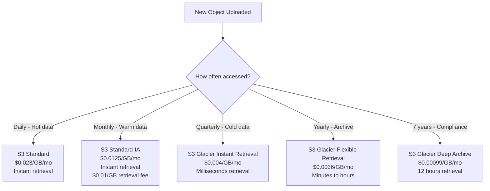

| Storage Class | Monthly Cost | Min Storage | Retrieval Time | Use Case |
|---|---|---|---|---|
| Standard | $0.023/GB | None | Instant | Active user content |
| Standard-IA | $0.0125/GB | 30 days | Instant (fee) | Backups, DR files |
| One Zone-IA | $0.010/GB | 30 days | Instant (fee) | Re-creatable data |
| Glacier Instant | $0.004/GB | 90 days | Milliseconds | Medical imaging archives |
| Glacier Flexible | $0.0036/GB | 90 days | Minutes-hours | Compliance archives |
| Glacier Deep Archive | $0.00099/GB | 180 days | 12-48 hours | 7-year retention, legal |
| Intelligent-Tiering | Variable | None | Instant | Unknown access patterns |

**Real example:** Netflix stores ALL its video files. Some episodes from 2015 are watched rarely. Storing all of them in Standard would be wasteful. Netflix uses lifecycle policies to move older, less-watched content to cheaper storage classes automatically.

### Lifecycle Policies: Automate Cost Optimization

Never manually move objects between storage classes. Lifecycle policies do it automatically:

```json
{
  "Rules": [
    {
      "ID": "instagram-photo-lifecycle",
      "Status": "Enabled",
      "Filter": { "Prefix": "photos/" },
      "Transitions": [
        {
          "Days": 30,
          "StorageClass": "STANDARD_IA"
        },
        {
          "Days": 180,
          "StorageClass": "GLACIER"
        },
        {
          "Days": 365,
          "StorageClass": "DEEP_ARCHIVE"
        }
      ],
      "Expiration": {
        "Days": 2555
      }
    }
  ]
}
```

This policy on Instagram's photo bucket would:
1. Move photos to Standard-IA after 30 days → saves ~46% cost
2. Move to Glacier after 6 months → saves ~84% cost
3. Move to Deep Archive after 1 year → saves ~96% cost
4. Delete after 7 years (compliance)

For a company storing petabytes, this policy alone saves millions of dollars per year.

### Versioning: Never Lose Data Again

Versioning lets you keep multiple versions of the same key. Think of it like Git for your files.

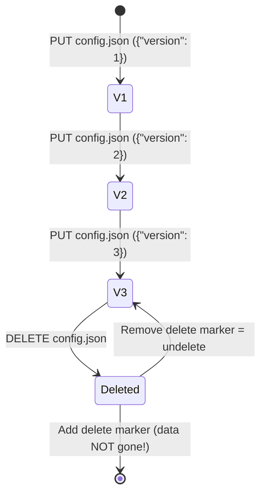

```python
# Enable versioning on a bucket
s3.put_bucket_versioning(
    Bucket="swiggy-app-configs",
    VersioningConfiguration={"Status": "Enabled"}
)

# Upload same key twice - both versions kept
s3.put_object(Bucket="swiggy-app-configs", Key="feature-flags.json",
              Body=b'{"dark_mode": false}')
s3.put_object(Bucket="swiggy-app-configs", Key="feature-flags.json",
              Body=b'{"dark_mode": true}')

# List all versions
response = s3.list_object_versions(
    Bucket="swiggy-app-configs",
    Prefix="feature-flags.json"
)

# Restore previous version
versions = response["Versions"]
old_version_id = versions[1]["VersionId"]  # Get the earlier version

restored = s3.get_object(
    Bucket="swiggy-app-configs",
    Key="feature-flags.json",
    VersionId=old_version_id
)
print(restored["Body"].read())  # b'{"dark_mode": false}'
```

**Deleting a versioned object** adds a "delete marker" — the actual data is not removed. You can always undelete by removing the delete marker. To truly delete all versions, you must delete each version explicitly.

**When to use versioning:**
- Configuration files that might get accidentally overwritten
- Important documents needing audit trails
- Any file where "go back to yesterday's version" is a business requirement

**Trade-off:** Versioning can significantly increase storage costs if you have many large files with frequent updates. Set lifecycle policies to expire old versions.

---

## Multipart Upload: Handling Large Files

### The Problem

S3 has a 5GB limit for a single PUT request. A Netflix 4K movie might be 50-100GB. A machine learning training dataset might be 500GB. A PostgreSQL backup dump might be 20GB. How do you upload files larger than 5GB?

### The Solution: Multipart Upload

Think of it like shipping a large piece of furniture from IKEA. They break it into multiple boxes. If one box gets damaged in shipping, they only replace that one box — not the entire order. Multipart upload works exactly the same way.

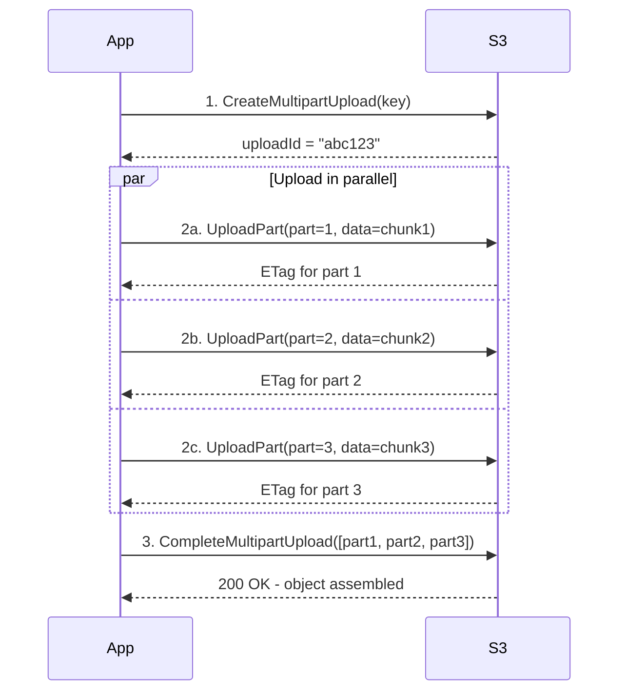

```python
import boto3
import os
from concurrent.futures import ThreadPoolExecutor

def upload_large_file_parallel(file_path: str, bucket: str, key: str,
                                 num_threads: int = 4):
    """Upload a large file using multipart upload with parallel threads."""
    s3 = boto3.client("s3")
    file_size = os.path.getsize(file_path)
    part_size = 100 * 1024 * 1024  # 100MB per part

    # Step 1: Initiate multipart upload
    mpu = s3.create_multipart_upload(
        Bucket=bucket,
        Key=key,
        ContentType="application/octet-stream",
        ServerSideEncryption="aws:kms"
    )
    upload_id = mpu["UploadId"]
    print(f"Started multipart upload: {upload_id}")

    # Prepare chunks
    parts = []
    offsets = list(range(0, file_size, part_size))

    def upload_part(args):
        part_number, offset = args
        with open(file_path, "rb") as f:
            f.seek(offset)
            chunk = f.read(part_size)

        response = s3.upload_part(
            Bucket=bucket,
            Key=key,
            PartNumber=part_number,
            UploadId=upload_id,
            Body=chunk
        )
        print(f"Uploaded part {part_number} ({len(chunk) / 1024 / 1024:.1f} MB)")
        return {"PartNumber": part_number, "ETag": response["ETag"]}

    # Step 2: Upload all parts in parallel
    with ThreadPoolExecutor(max_workers=num_threads) as executor:
        results = list(executor.map(upload_part,
                                    [(i + 1, offset) for i, offset in enumerate(offsets)]))

    # Sort by part number before completing
    parts = sorted(results, key=lambda x: x["PartNumber"])

    # Step 3: Complete the upload
    s3.complete_multipart_upload(
        Bucket=bucket,
        Key=key,
        UploadId=upload_id,
        MultipartUpload={"Parts": parts}
    )
    print(f"Upload complete: s3://{bucket}/{key}")

# Upload a 10GB machine learning dataset
upload_large_file_parallel(
    file_path="/data/training-set-10gb.tar.gz",
    bucket="ml-training-data",
    key="datasets/imagenet-2025/training.tar.gz",
    num_threads=8
)
```

**Why multipart upload is critical:**
1. **Parallelism** — Multiple parts upload simultaneously → 4-8x faster than sequential
2. **Fault tolerance** — If one part fails, retry just that part, not the whole file
3. **Required** — Mandatory for files over 5GB
4. **Recommended** — For files over 100MB for reliability
5. **Progress tracking** — You know exactly which parts succeeded

---

## Presigned URLs: The Correct Way to Handle User Uploads

### The Problem (and Why Most Junior Devs Get This Wrong)

Scenario: WhatsApp wants users to send voice messages. A voice note is 1MB. There are 2 billion WhatsApp users. At peak hours, millions of voice notes are being sent per minute.

**Wrong approach (what most people first think):**
```
User → PUT audio.mp3 → Your Backend Server → S3
```

The backend server receives the binary data, holds it in memory, then forwards it to S3. Your server is now a fat pipe for binary data. You need 10x the servers just to handle the throughput. You're paying for bandwidth twice (user-to-server AND server-to-S3). And your server's CPU is just... forwarding bytes.

**Right approach — Presigned URLs:**
```
User → GET upload URL → Your Backend
Backend → Generate presigned URL → S3
S3 → Return time-limited signed URL → Backend → User
User → PUT audio.mp3 DIRECTLY to S3 (backend never sees the bytes)
```

### How Presigned URLs Work

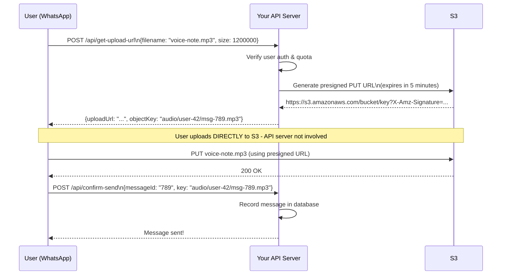

```python
# Backend: Generate a presigned URL for uploading
import boto3
import uuid
from datetime import datetime

def get_presigned_upload_url(user_id: str, content_type: str,
                              max_size_bytes: int) -> dict:
    s3 = boto3.client("s3", region_name="ap-south-1")

    # Generate a unique key for this upload
    file_id = str(uuid.uuid4())
    key = f"user-uploads/{user_id}/{file_id}"

    # Generate the presigned URL - AWS signs it with our credentials
    # but the client uses it directly without needing our credentials
    presigned_url = s3.generate_presigned_url(
        ClientMethod="put_object",
        Params={
            "Bucket": "whatsapp-media-bucket",
            "Key": key,
            "ContentType": content_type,
            # ContentLength constraint prevents users from uploading huge files
        },
        ExpiresIn=300  # URL expires in 5 minutes
    )

    return {
        "uploadUrl": presigned_url,
        "objectKey": key,
        "expiresAt": datetime.utcnow().isoformat()
    }
```

```javascript
// Frontend: Upload directly to S3
async function sendVoiceNote(audioBlob) {
  // Step 1: Ask our API for a presigned upload URL
  const { uploadUrl, objectKey } = await fetch("/api/get-upload-url", {
    method: "POST",
    headers: { "Content-Type": "application/json" },
    body: JSON.stringify({
      filename: "voice-note.mp3",
      size: audioBlob.size,
      contentType: "audio/mpeg"
    }),
  }).then(r => r.json());

  // Step 2: Upload DIRECTLY to S3 - our server never touches the bytes
  const uploadResponse = await fetch(uploadUrl, {
    method: "PUT",
    body: audioBlob,
    headers: { "Content-Type": "audio/mpeg" }
  });

  if (!uploadResponse.ok) {
    throw new Error("Upload failed");
  }

  // Step 3: Tell our backend the upload succeeded
  await fetch("/api/send-message", {
    method: "POST",
    headers: { "Content-Type": "application/json" },
    body: JSON.stringify({ mediaKey: objectKey, type: "audio" })
  });
}
```

**Presigned URLs for download too:**

```python
# Generate a presigned URL for a private file download
# Useful for: invoice PDFs, private user photos, paid content

def get_presigned_download_url(key: str, expires_seconds: int = 3600) -> str:
    s3 = boto3.client("s3")
    return s3.generate_presigned_url(
        ClientMethod="get_object",
        Params={
            "Bucket": "private-user-docs",
            "Key": key
        },
        ExpiresIn=expires_seconds
    )

# Use case: User clicks "Download Invoice" on Razorpay
# Backend generates URL valid for 1 hour
# User downloads PDF directly from S3
invoice_url = get_presigned_download_url(
    key="invoices/user-123/invoice-2025-06.pdf",
    expires_seconds=3600
)
```

**Benefits of presigned URLs:**
- Your backend never handles binary data — massive bandwidth savings
- S3 handles all the scale (not your servers)
- Time-limited = secure (URL expires, can't be shared indefinitely)
- No AWS credentials needed on the client side
- Works for both uploads and downloads

---

## S3 Replication: Cross-Region and Same-Region

### Why Replicate?

Scenario: You're building a product used heavily in both India (Mumbai) and Europe (Frankfurt). Your S3 bucket is in Mumbai. European users experience 200ms+ latency fetching your media files. You want European users to get <20ms.

Solution: **S3 Cross-Region Replication (CRR)** — automatically copy every new object to a bucket in another region.

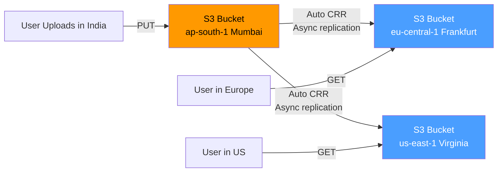

```python
# Enable cross-region replication (via Python/boto3)
s3 = boto3.client("s3")

replication_config = {
    "Role": "arn:aws:iam::123456789:role/replication-role",
    "Rules": [
        {
            "Status": "Enabled",
            "Filter": {"Prefix": ""},  # Replicate everything
            "Destination": {
                "Bucket": "arn:aws:s3:::app-media-frankfurt",
                "StorageClass": "STANDARD"
            }
        }
    ]
}

s3.put_bucket_replication(
    Bucket="app-media-mumbai",
    ReplicationConfiguration=replication_config
)
```

**CRR Use Cases:**
- Low-latency access from multiple geographic regions
- Disaster recovery — if Mumbai region goes down, Frankfurt bucket is the DR copy
- Data sovereignty — some countries require data to stay within their borders, but you want a replica elsewhere for reads
- Compliance requirements

**Same-Region Replication (SRR):**
- Copy objects within the same region to a different bucket
- Use case: Separate prod and dev/test environments with the same data
- Use case: Keep a "log aggregation" bucket that collects from multiple application buckets

**Important:** Replication is asynchronous — there may be a short lag between the original bucket and the replica. It is not a synchronous mirror.

---

## CDN + S3: The Standard Global Delivery Architecture

### Why CDN is Non-Negotiable at Scale

Samjho aise: Zomato has restaurant photos. A user in Chennai opens the app. The S3 bucket is in Mumbai. Distance: ~1000 km. TCP round trip: ~20-30ms just for network. Add S3 processing time: you're at 50-100ms per image. Multiply by 20 images on one restaurant page: 1-2 seconds just for images.

Now put CloudFront (CDN) in front:
- CloudFront has an edge in Chennai (and 400+ other locations globally).
- First user request: CloudFront fetches from S3 (cache miss). But every user after that in Chennai gets the image from the local edge in ~5ms.
- 99% of requests never touch S3.

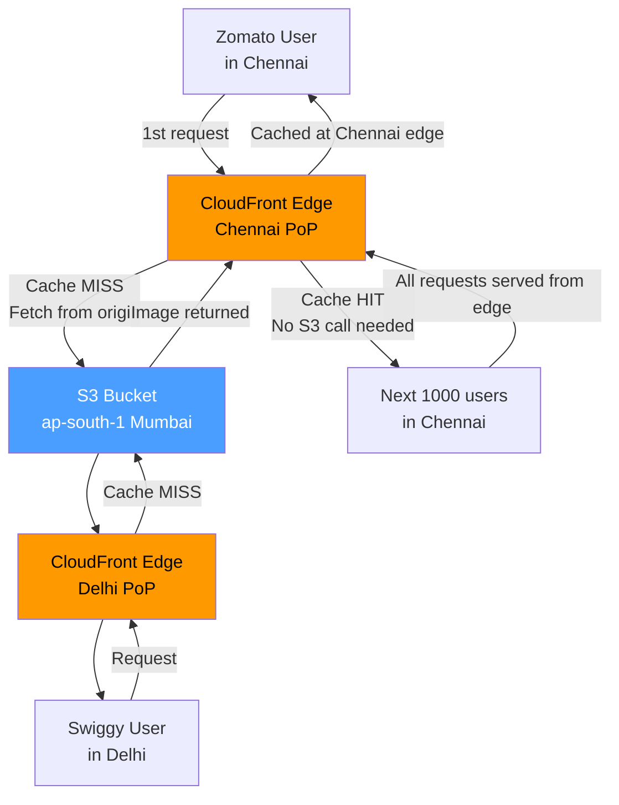

### CDN Caching Strategy

The key to effective CDN caching is the `Cache-Control` HTTP header you set on your S3 objects:

```python
# Upload static assets with aggressive caching
# Use content-addressed filenames (hash in name) → cache forever
s3.put_object(
    Bucket="zomato-static-assets",
    Key="assets/restaurant-card.abc12345.js",  # hash in filename
    Body=open("restaurant-card.js", "rb"),
    ContentType="application/javascript",
    # Cache this FOREVER - the hash ensures we create a new file if content changes
    CacheControl="public, max-age=31536000, immutable"
)

# For restaurant photos (change rarely but CAN change)
s3.put_object(
    Bucket="zomato-restaurant-media",
    Key="restaurants/mumbai/taj-foods/cover.jpg",
    Body=open("cover.jpg", "rb"),
    ContentType="image/jpeg",
    # Cache for 1 day, allow stale while revalidating
    CacheControl="public, max-age=86400, stale-while-revalidate=3600"
)

# For HTML pages (must be fresh)
s3.put_object(
    Bucket="zomato-static-assets",
    Key="index.html",
    Body=open("index.html", "rb"),
    ContentType="text/html",
    # Don't cache HTML - always fetch fresh
    CacheControl="no-cache, no-store, must-revalidate"
)
```

**Cache invalidation (when you need to force CDN to refresh):**
```bash
# Invalidate specific paths in CloudFront when you deploy new code
aws cloudfront create-invalidation \
  --distribution-id E1ABCDEF123456 \
  --paths "/index.html" "/assets/main.*.js"
```

---

## Real-World Architecture Patterns

### Pattern 1: Instagram-Style Photo Upload Flow

This is the flow that serves billions of photos per day:

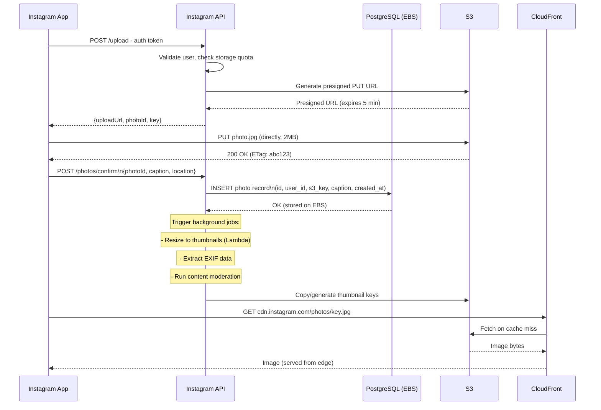

### Pattern 2: Netflix Video Storage and Delivery

Netflix's storage architecture is famous for scale:

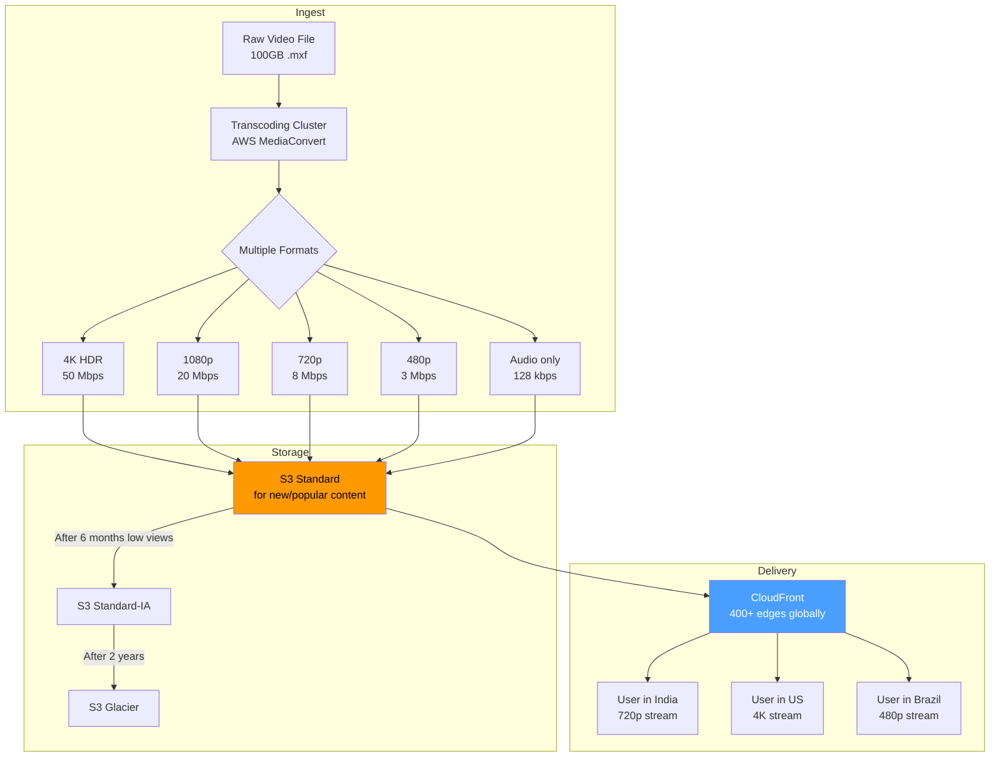

**What Netflix actually stores in S3:**
- Thousands of different encoded variants of every title (different resolutions, bitrates, codecs, audio tracks, subtitle files)
- Each 90-minute movie might have 1,200+ different files in S3
- Total S3 usage: exabytes

### Pattern 3: Complete Social App Architecture (All Three Storage Types)

This pattern shows when you'd use all three storage types together:

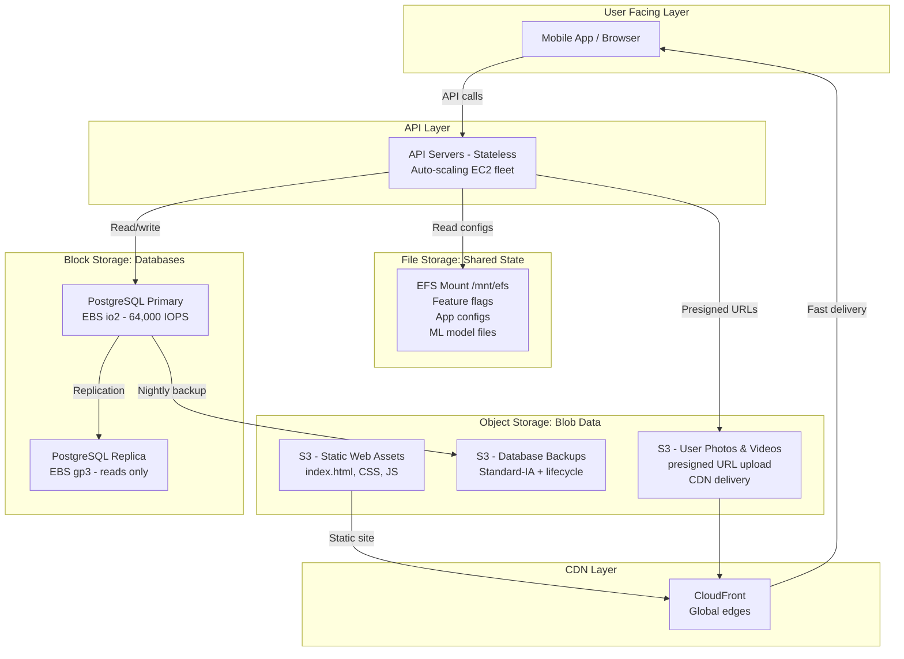

---

## Self-Hosted Object Storage: MinIO

Not every company wants to be locked into AWS S3. Some have data sovereignty requirements (data must stay on-premise). Some want to avoid egress fees. Some just want an S3-compatible API on their own hardware. Enter **MinIO**.

### What is MinIO?

MinIO is an open-source, self-hosted object storage server that is fully compatible with the AWS S3 API. Any code written for S3 works with MinIO with zero changes — just change the endpoint URL.

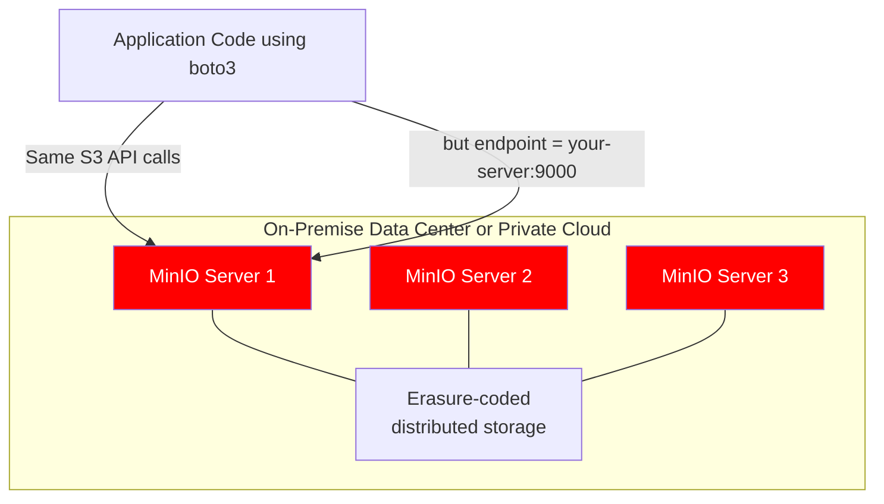

```python
# MinIO works with the exact same boto3 code - just change the endpoint
import boto3
from botocore.config import Config

# For AWS S3
s3_aws = boto3.client("s3", region_name="us-east-1")

# For MinIO (self-hosted) - identical API!
s3_minio = boto3.client(
    "s3",
    endpoint_url="http://your-minio-server:9000",
    aws_access_key_id="minioadmin",
    aws_secret_access_key="minioadmin",
    config=Config(signature_version="s3v4"),
    region_name="us-east-1"
)

# This code works identically on both!
def upload_file(s3_client, bucket: str, key: str, data: bytes):
    s3_client.put_object(Bucket=bucket, Key=key, Body=data)

upload_file(s3_aws, "my-bucket", "test.txt", b"Hello from AWS S3")
upload_file(s3_minio, "my-bucket", "test.txt", b"Hello from MinIO")
```

**Run MinIO locally with Docker:**
```bash
docker run -d \
  -p 9000:9000 \
  -p 9001:9001 \
  --name minio \
  -e "MINIO_ROOT_USER=minioadmin" \
  -e "MINIO_ROOT_PASSWORD=minioadmin" \
  -v /data/minio:/data \
  quay.io/minio/minio server /data --console-address ":9001"

# Access MinIO console: http://localhost:9001
# Access S3-compatible API: http://localhost:9000
```

**MinIO vs S3:**

| Feature | MinIO | AWS S3 |
|---|---|---|
| Cost | Hardware + electricity | Pay per GB + requests |
| Control | Full control | AWS managed |
| Compliance | Data stays on-prem | Data in AWS DCs |
| Durability | DIY (erasure coding) | 11 nines (AWS managed) |
| S3 API Compatible | Yes | Native |
| Setup | You manage everything | Zero setup |
| Global Replication | Manual setup | Built-in (CRR) |
| Best for | Private clouds, regulated industries | Most companies |

**When to use MinIO:**
- Healthcare/finance where data must stay on-premise
- Air-gapped environments (no internet)
- Cost optimization at very high storage volumes (>PB)
- Development/testing locally without real S3 costs
- Edge computing scenarios

---

## Security Best Practices for Object Storage

Security is critical — misconfigured S3 buckets have caused massive data breaches at Capital One, Facebook, Toyota, and hundreds of other companies.

### Access Control: Never Public Unless Necessary

```python
# WRONG: Never make a bucket fully public
# s3.put_bucket_acl(Bucket="my-bucket", ACL="public-read")  # DON'T DO THIS

# RIGHT: Block all public access at the bucket level
s3.put_public_access_block(
    Bucket="my-private-bucket",
    PublicAccessBlockConfiguration={
        "BlockPublicAcls": True,
        "IgnorePublicAcls": True,
        "BlockPublicPolicy": True,
        "RestrictPublicBuckets": True
    }
)

# For public content (static website assets), use CloudFront + Origin Access Control
# CloudFront accesses S3 privately, users access CloudFront publicly
# S3 bucket stays private but CloudFront can read from it
```

### Encryption at Rest and in Transit

```python
# Server-side encryption with KMS (recommended for sensitive data)
s3.put_object(
    Bucket="user-medical-records",
    Key="patient-123/report.pdf",
    Body=report_bytes,
    ServerSideEncryption="aws:kms",
    SSEKMSKeyId="arn:aws:kms:us-east-1:123456789:key/your-key-id"
)

# Enforce HTTPS-only access via bucket policy
bucket_policy = {
    "Statement": [
        {
            "Effect": "Deny",
            "Principal": "*",
            "Action": "s3:*",
            "Resource": [
                "arn:aws:s3:::user-medical-records",
                "arn:aws:s3:::user-medical-records/*"
            ],
            "Condition": {
                "Bool": {"aws:SecureTransport": "false"}  # Block HTTP
            }
        }
    ]
}
```

### S3 Access Logs and Monitoring

```bash
# Enable access logging - every request logged to another S3 bucket
aws s3api put-bucket-logging \
  --bucket production-media \
  --bucket-logging-status '{
    "LoggingEnabled": {
      "TargetBucket": "production-media-logs",
      "TargetPrefix": "access-logs/"
    }
  }'
```

---

## When to Use Object Storage: The Decision Guide

Object storage is the right choice when you answer YES to any of these:

| Question | If Yes |
|---|---|
| Will this data be accessed via HTTP URL? | Use object storage |
| Is the total data potentially > 1TB? | Use object storage |
| Do users need to upload files directly? | Use object storage + presigned URLs |
| Is this a backup/archive? | Use object storage (S3 Standard-IA or Glacier) |
| Are these static website assets (HTML/CSS/JS/images)? | Use object storage + CDN |
| Is this ML training data or data lake? | Use object storage (S3 is the standard) |
| Is this video content? | Use object storage + transcoding + CDN |
| Is this log data for analytics? | Use object storage (S3 → Athena / Spark) |

**Real companies, real use cases:**

| Company | What They Store in S3 | Estimated Scale |
|---|---|---|
| Instagram | Every photo and video ever uploaded | Exabytes |
| Netflix | All video files in all formats and qualities | Exabytes |
| GitHub | Release artifacts, Git LFS objects, package registry | Petabytes |
| Airbnb | Property photos, host documents | Petabytes |
| Spotify | Audio files (backed by their own CDN/storage) | Petabytes |
| Dropbox | User file storage (migrated FROM S3 to own storage at scale) | Exabytes |
| Zomato | Restaurant photos, menu images, delivery partner documents | Petabytes |
| WhatsApp | Media messages (photos, videos, audio, documents) | Exabytes |

---

## Common Interview Questions

These are questions that come up repeatedly in system design and backend engineering interviews. Practice answering these thoroughly.

**Q1: Design Instagram's photo upload system. Where and how do you store photos?**

Strong answer pattern:
- Object storage (S3) for the actual binary data — infinite scale, HTTP-native, cheap
- Presigned URLs for upload — client uploads directly to S3, your servers never handle binary data
- PostgreSQL on EBS for metadata (user, caption, location, S3 key, timestamps)
- CloudFront CDN in front of S3 for fast global delivery
- Lambda/container jobs for thumbnails (resize to multiple dimensions and store back to S3)
- Lifecycle policies: hot photos in Standard, older ones move to Standard-IA or Glacier

**Q2: What is the difference between block, file, and object storage?**

| | Block | File | Object |
|---|---|---|---|
| Protocol | iSCSI/NVMe | NFS/SMB | HTTP REST |
| Latency | Sub-ms | Low-medium | 50-200ms |
| Sharing | One machine | Many machines | Anyone via URL |
| Use for | Databases | Shared configs | Media, backups |

**Q3: What is a presigned URL and when would you use it?**

- A presigned URL is a time-limited URL generated by your backend using your AWS credentials
- It allows a client (browser, mobile app) to upload or download an object directly to/from S3 without needing AWS credentials
- Use it for: user file uploads, serving private files to authenticated users, allowing temporary access to otherwise private content
- Key benefit: your server never handles the binary data — massive bandwidth and compute savings

**Q4: How does S3 achieve 11 nines of durability?**

- Each object is automatically replicated across **at least 3 Availability Zones** within the region
- The replication is synchronous — the 200 OK response only comes back after all 3 copies are written
- AWS also runs continuous data integrity checksums (bit rot detection)
- The math: 11 nines means losing 1 object out of 100 billion objects once every 10,000 years

**Q5: A large file upload (10GB) is failing halfway through. How do you handle this?**

- Use **multipart upload**: split the file into chunks (e.g., 100MB each)
- Each part is uploaded independently and can be retried if it fails
- Only the failed part needs to be re-uploaded, not the entire 10GB file
- Parts can be uploaded in parallel (4-8 threads) for much faster upload times
- `CompleteMultipartUpload` assembles the final object once all parts succeed

**Q6: How would you reduce costs for storing 100 million photos when 80% of them are rarely accessed?**

- Enable S3 Intelligent-Tiering (automatic) OR set lifecycle policies:
  - Photos older than 30 days → Standard-IA (saves ~46%)
  - Photos older than 90 days → Glacier Instant Retrieval (saves ~83%)
  - Photos older than 1 year → Glacier Deep Archive (saves ~96%)
- Add CloudFront in front — reduces S3 GET request costs (CDN cache hits = no S3 request charges)
- Use S3 Inventory to analyze actual access patterns and tune policies

**Q7: How is S3 different from a traditional database?**

- S3 is not queryable — you can't do `SELECT * WHERE user_id = 123` on S3
- S3 retrieves whole objects by key — no partial column reads
- No ACID transactions, no joins, no indexes
- S3 is for binary blobs (files); databases are for structured records with relationships
- In practice: metadata (user_id, caption, s3_key) lives in PostgreSQL; actual binary (the photo bytes) lives in S3

**Q8: What is S3 Cross-Region Replication and why would you use it?**

- CRR automatically copies every new object from a source bucket to a destination bucket in a different AWS region
- Uses: global low-latency access (read from nearest region), disaster recovery (if one region fails), data sovereignty/compliance
- Replication is asynchronous (small delay possible)
- You can replicate to multiple regions simultaneously
- CRR adds storage cost (you're paying for the copies)

**Q9: Your startup just got acquired and needs to migrate 50TB from MinIO to AWS S3. How?**

1. Use **AWS Snowball** (physical device) for bulk migration if bandwidth is limited
2. Or use **s3cmd sync** or **rclone** for network-based transfer
3. Since MinIO is S3-compatible, the API is identical — just change endpoint URL in application config
4. Validate checksums (ETags) after transfer
5. Update DNS/CDN to point to the new S3 bucket
6. Run both in parallel for a period, then cut over

**Q10: How would you serve static assets (HTML/CSS/JS) to a global audience with minimum latency?**

1. Build and upload assets to S3 (use content-addressed filenames for cache busting)
2. Set `Cache-Control: public, max-age=31536000, immutable` on static assets
3. Set `Cache-Control: no-cache` on `index.html`
4. Create a CloudFront distribution with S3 as origin
5. Use Origin Access Control (OAC) — CloudFront can access S3, but S3 is not publicly accessible
6. Point your custom domain (e.g., cdn.yoursite.com) to CloudFront
7. On deploy: upload new assets, then invalidate `index.html` in CloudFront (everything else auto-updates due to content-addressed names)

---

## Key Takeaways

1. **Three types of storage, three different jobs.** Block storage (EBS) = one machine, sub-ms latency, for databases. File storage (EFS) = shared filesystem across many machines, for legacy apps. Object storage (S3) = flat key-value, HTTP-native, unlimited scale, for blobs.

2. **S3 is the default answer for most scale problems.** Images, videos, user uploads, logs, ML training data, database backups, static websites — object storage is the right tool. When in doubt in an interview, reach for S3.

3. **Never proxy binary uploads through your backend.** Use presigned URLs to let clients upload directly to S3. Your servers will thank you — bandwidth costs drop to near zero.

4. **S3 durability (11 nines) comes from synchronous multi-AZ replication.** Every write is replicated to 3 Availability Zones before returning 200 OK. Essentially impossible to lose data.

5. **S3 is strongly consistent since December 2020.** Write an object, immediately read it back — you get the new version. No more eventual consistency workarounds.

6. **S3 storage classes can cut costs by 50-96%.** Use lifecycle policies to automatically move data from Standard → Standard-IA → Glacier as it ages. For 100TB of data, this can save tens of thousands of dollars per month.

7. **CDN + S3 is the standard pattern for global delivery.** CloudFront in front of S3 means 99% of reads never touch S3. Latency drops from 100-200ms to 5-15ms for cached content at the edge.

8. **Multipart upload for large files.** Required for files over 5GB, recommended over 100MB. Enables parallel uploads (faster) and per-part retries (reliable).

9. **S3 replication for multi-region.** CRR (Cross-Region Replication) automatically copies objects to other regions for low-latency global reads and disaster recovery.

10. **MinIO for when you can't use AWS S3.** Fully S3-API compatible, open source, self-hosted. Use it for on-premise data requirements, regulated industries, or local development.

11. **Security: block public access by default.** Most S3 data breaches happen because someone accidentally made a bucket public. Block all public access, use CloudFront with OAC for public content, presigned URLs for private content, and KMS encryption for sensitive data.

12. **In interviews:** If asked "where do you store images/videos?" → object storage + CDN. If asked "where does your database store data?" → block storage. If asked "how do multiple app servers share config files?" → file storage. These mappings should be reflexive.

---

*Next: Chapter 25 — Message Queues and Event Streaming (Kafka, SQS, RabbitMQ)*
