# 25 — Geo-Distributed Systems and Multi-Region Architecture

> "If your server is in Virginia and your user is in Bangalore, you are asking light itself to work overtime. And light charges extra." — every infrastructure engineer ever

---

## Why Does Geography Matter in System Design?

Imagine you live in Pune and your favourite pizza restaurant is in Delhi. Every time you order, they physically make the pizza there, put it on a flight, and deliver it to you. That is insane — and that is exactly what single-region systems do to users far from the datacenter.

When Instagram launched, their servers were in California. A user in Mumbai opening the app waited for every photo to travel 13,000 km through undersea cables and back. As Instagram grew globally, they had no choice — they had to move the "kitchen" closer to the "customers."

**This is the core problem geo-distributed systems solve**: bring computation and data physically closer to users so the speed-of-light tax is minimised.

Yeh kyun important hai? Three big reasons:

1. **Latency kills revenue.** Amazon found that every 100ms of added latency costs them 1% in sales. For a company doing $500 billion revenue per year, that is $5 billion per 100ms. Physics is expensive.

2. **Single datacenter = single point of catastrophe.** When AWS us-east-1 went down in December 2021, it took down Slack, Netflix, Disney+, Robinhood, and thousands of other apps simultaneously. All eggs, one basket.

3. **The law says you have no choice.** GDPR says EU citizen data must stay in Europe. China's Cybersecurity Law says Chinese user data must stay in China. You either build regional isolation or you face fines and bans.

---

## The Speed of Light Problem (Physics is Non-Negotiable)

Samjho aise: the internet is like a highway network made of glass fibre. Even if the highway is completely empty — zero traffic, zero construction — data still travels at roughly 200,000 km per second (2/3 the speed of light in a vacuum, due to the glass medium).

| Route | Distance | Minimum Theoretical RTT | Real-World RTT |
|---|---|---|---|
| Mumbai → Singapore | ~6,300 km | ~63 ms | ~80–100 ms |
| Mumbai → California | ~13,500 km | ~135 ms | ~180–220 ms |
| Mumbai → Frankfurt | ~7,000 km | ~70 ms | ~110–140 ms |
| New York → London | ~5,500 km | ~55 ms | ~70–90 ms |
| New York → Tokyo | ~10,800 km | ~108 ms | ~150–180 ms |
| London → Sydney | ~17,000 km | ~170 ms | ~250–300 ms |

Real-world numbers are 1.5–2x higher than the theoretical minimum because of:
- Routing hops through multiple routers and switches
- Queuing delays at congested peering points
- Processing time at each network node
- TCP handshake overhead (adds one full RTT before data even starts flowing)

**Key insight you cannot engineer away:** You cannot make light faster. You can only move your servers closer to users. Full stop.

**Interview tip:** When asked "how do you reduce latency for global users?" — the first answer should always be "move compute and data closer to users via regional deployments and CDNs." Don't jump to caching without mentioning geography first.

---

## Core Motivations for Multi-Region Architecture

### 1. Latency — Users in Every Corner Deserve Fast Experiences

A 100ms delay is perceptible. A 300ms delay feels noticeably slow. A 1-second delay makes users think something is broken.

Real numbers from real studies:
- **Google:** 0.5 second delay → 20% drop in search traffic
- **Amazon:** 100ms delay → 1% reduction in sales
- **Akamai:** 2-second delay → 47% of users abandon the page
- **Zomato:** Discovered that order completion rates dropped significantly for users with >500ms API response times

For **Swiggy**, a user in Hyderabad ordering food cannot afford to wait 300ms+ for every menu item API call. The nearest datacenter in Mumbai vs. the previous setup in Delhi made a measurable difference in conversion.

### 2. Disaster Recovery (DR) — Don't Put All Eggs in One Datacenter

Think of a bank with only one branch. If that branch burns down, nobody can access their money. Banks have always had multiple branches for exactly this reason.

Real incidents that required multi-region failover:
- **AWS us-east-1 (Dec 2021):** Took down Slack, Netflix, Disney+, Robinhood, Ring cameras, Roomba robots — yes, people's vacuum cleaners stopped working
- **Google Cloud us-central1 (Nov 2023):** Wide network disruption impacting multiple services
- **Fastly CDN outage (June 2021):** Amazon, Reddit, GitHub, Twitter, Spotify, Twitch — all down simultaneously for ~1 hour because they all used the same CDN
- **Facebook (Oct 2021):** DNS misconfiguration took down Facebook, WhatsApp, Instagram — ALL of them — for ~6 hours. Two billion users locked out.

**Key terms:**
- **RTO (Recovery Time Objective):** How long can the system be down? (e.g., "max 30 seconds")
- **RPO (Recovery Point Objective):** How much data loss is acceptable? (e.g., "max 5 seconds of lost writes")

Multi-region DR directly addresses both RTO and RPO.

### 3. Compliance and Data Sovereignty — The Law is Not Optional

This is the most underappreciated reason in system design interviews. Regulations are not guidelines — violations carry existential penalties.

| Regulation | Region | Key Requirement | Max Penalty |
|---|---|---|---|
| GDPR | European Union | EU citizen personal data must stay in EU | €20M or 4% global revenue |
| DPDP Act 2023 | India | Indian user data processing rules | ₹250 crore per violation |
| China Cybersecurity Law | China | Chinese data must stay in China | Business ban + fines |
| Russia Federal Law 149-FZ | Russia | Russian citizen data must be in Russia | Domain blocking |
| HIPAA | USA | Healthcare data must stay in HIPAA-compliant environments | $100 to $50,000 per violation |
| LGPD | Brazil | Brazilian personal data protection | 2% of Brazil revenue, max R$50M |

**Real case:** In 2018, Google Analytics was declared illegal in Austria under GDPR because it sent Austrian user data (IP addresses) to US servers. Companies using Google Analytics in EU had to reconfigure or face penalties.

---

## Active-Passive vs Active-Active — The Fundamental Choice

This is the most important architectural decision in multi-region design. Everything else flows from this choice.

### The Analogy

**Active-Passive** is like the BCCI having one cricket stadium in Mumbai (open and running matches) and one in Ahmedabad (built, fully equipped, but sitting empty as backup). If Mumbai stadium floods, Ahmedabad opens. But right now, every fan travels to Mumbai.

**Active-Active** is like having cricket matches running in Mumbai, Ahmedabad, AND Kolkata simultaneously. Fans go to their nearest stadium. If one closes, tickets are just redistributed to the others automatically. Zero interruption.

---

### Active-Passive in Detail

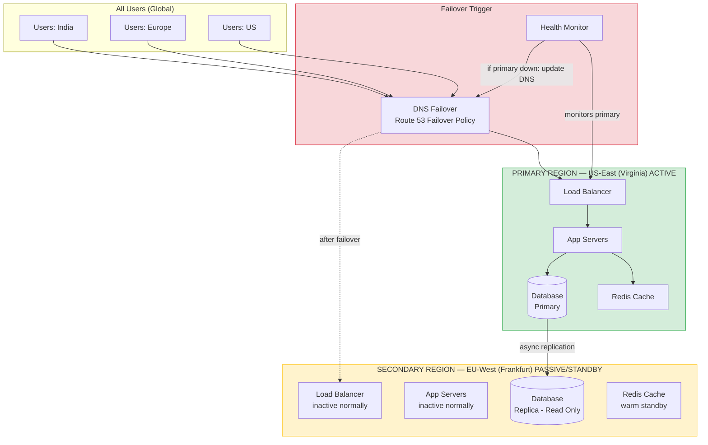

**How failover works (step by step):**

1. Health monitor detects primary region is down (typically via HTTP health checks every 10–30 seconds)
2. After N consecutive failures (e.g., 3 checks), failover triggers
3. DNS record for `api.myapp.com` is updated to point to secondary region
4. DNS TTL expires across the internet (can take 1–10 minutes depending on TTL setting)
5. New traffic flows to secondary
6. Secondary is promoted from replica to primary
7. Total downtime: typically 5–15 minutes

| Property | Value |
|---|---|
| Write complexity | Low — one place to write |
| Read latency for remote users | High (everyone hits same region) |
| Failover time (RTO) | 5–15 minutes typically |
| Secondary resource usage | Near-zero (just maintaining replica) |
| Cost | Lower (~1.2x single region) |
| RPO (data loss on failure) | Seconds to minutes (async replication lag) |

**When Active-Passive makes sense:**
- Early-stage product with users primarily in one geography (Zomato initially was India-only)
- Budget is a hard constraint
- Can tolerate minutes of downtime in a worst-case scenario
- Writes need a single authoritative source
- Your team is small and operational complexity matters

**When to avoid Active-Passive:**
- Significant user populations in 3+ regions
- Zero-downtime failover is a hard requirement (fintech, healthcare)
- The secondary region is doing nothing 99.9% of the time — that is wasted money at scale

---

### Active-Active in Detail

Both regions serve live traffic. Both can handle reads AND writes. This is where the hard distributed systems problems begin.

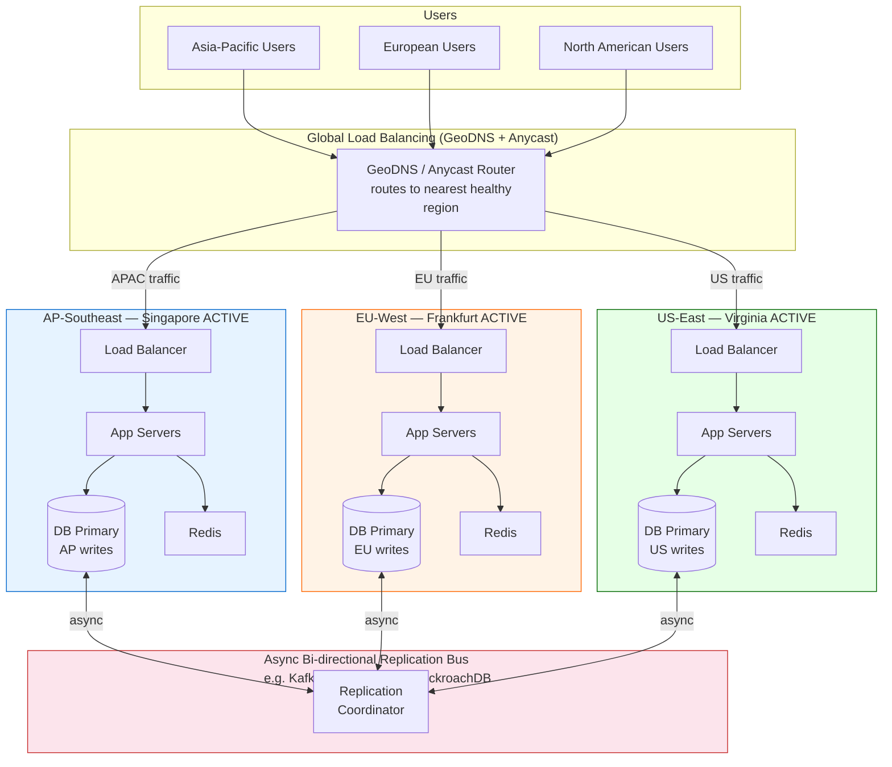

| Property | Value |
|---|---|
| Write complexity | High — writes can happen in any region, conflict resolution needed |
| Read latency | Low — reads from the nearest region |
| Failover time (RTO) | Seconds (automatic rerouting via BGP/Anycast) |
| Cost | High (~2–3x single region) |
| RPO with async replication | Seconds |
| RPO with sync replication | Zero |
| Operational complexity | Very high |

**When Active-Active makes sense:**
- Large global user base spread across multiple continents (Netflix, YouTube, WhatsApp)
- Downtime is very expensive (fintech, healthcare SaaS, B2B platforms)
- Need 99.99%+ availability SLA
- Users need fast writes from anywhere (collaborative tools, real-time apps)

**When to avoid Active-Active:**
- Strong consistency requirements that are impossible to reconcile cross-region
- Small or geographically concentrated user base
- Budget does not support running multiple full stacks

---

## Data Replication Across Regions

### The Core Trade-off: Speed vs Safety

Samjho aise: You are driving from Mumbai to Pune. You have two choices for saving your work on a document:

1. **Auto-save to Google Drive (async):** You keep typing, saves happen in the background. Fast! But if your laptop dies mid-journey, you lose the last 30 seconds of typing.

2. **Wait for save confirmation (sync):** After every paragraph, you wait for Google Drive to confirm it saved before you type the next one. Zero data loss, but really annoying and slow.

This is exactly the choice between async and sync replication.

### Synchronous Replication — Zero Data Loss, Higher Latency

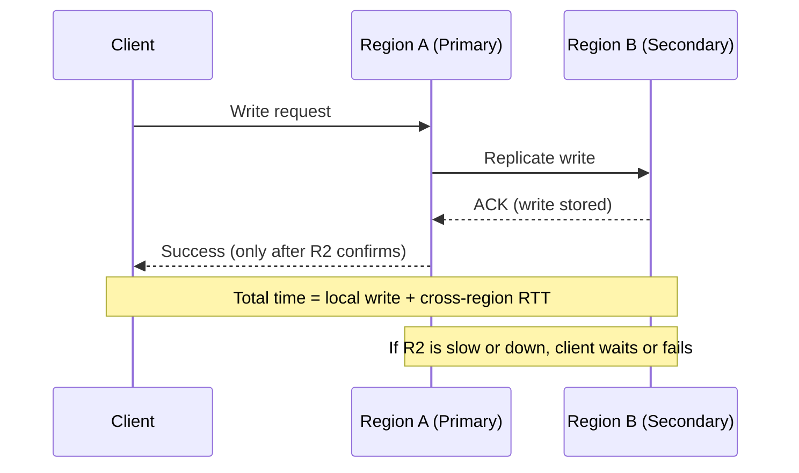

**Latency cost:** The cross-region round-trip time is added to every single write. Mumbai to Singapore is ~80ms RTT. Every write now takes 80ms more. If your writes normally take 5ms locally, sync replication makes them 85ms — 17x slower.

**When sync is worth it:**
- Bank transfers and financial transactions — you cannot lose even one transaction
- Healthcare record updates — patient safety depends on it
- Payment processing — double-spend prevention requires it
- User authentication records — if a user changes their password, the change must be universal instantly

**Real example:** Google Spanner uses atomic clocks and GPS receivers to achieve globally synchronous replication. They built custom hardware just to make sync replication practical at planetary scale.

### Asynchronous Replication — Fast Writes, Small Risk

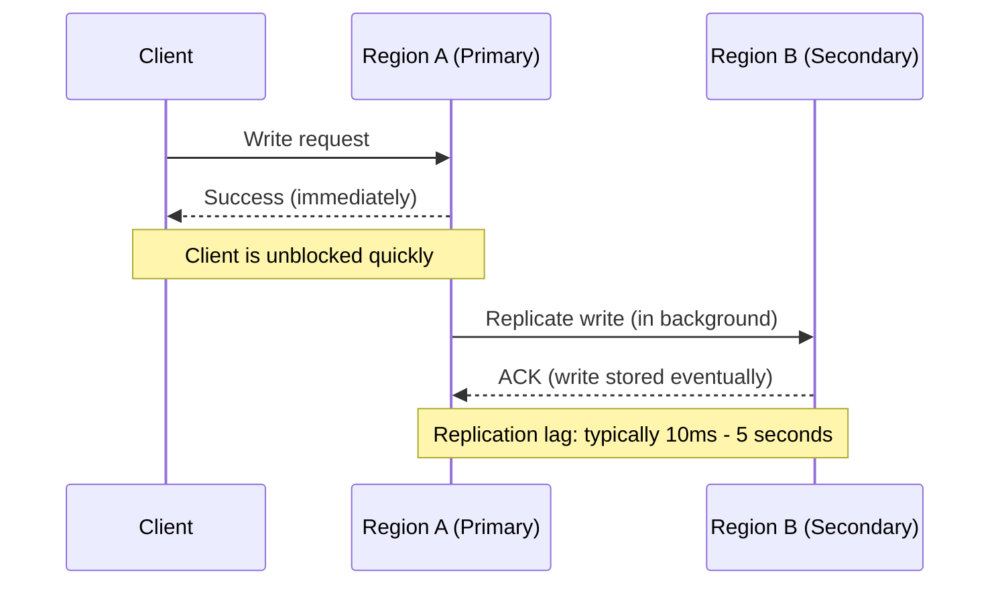

**Replication lag** is the time between a write being confirmed to the client and it being available in other regions. Under normal conditions: 10–500ms. Under network congestion or partition: can be seconds to minutes.

**The risk:** If Region A crashes in that window, the writes that were confirmed to clients but not yet replicated are lost. This is your **RPO** — Recovery Point Objective.

**When async is acceptable:**
- Social media posts — if a tweet takes 2 seconds to appear in India after posting from Japan, nobody cares
- Product catalogue updates — a new item description being 1 second stale is fine
- Search indexes — rebuilt from source of truth periodically anyway
- Recommendation feeds — slightly stale recommendations are invisible to users

**Real example:** Instagram uses async replication for media and post metadata. When you post a photo, your Indian followers might see it 1–2 seconds after your US followers. This is completely acceptable for a social app.

| Property | Sync Replication | Async Replication |
|---|---|---|
| Write latency | High (local + cross-region RTT) | Low (local only) |
| Data loss on failure | Zero | Possible (seconds of RPO) |
| Write throughput | Lower (blocked waiting for acks) | Higher |
| Complexity | Lower | Higher (must handle divergence) |
| Cost | Higher (always-on cross-region write path) | Lower |
| Use case | Finance, healthcare, auth | Social, catalogue, analytics |

**Industry practice:** Most large systems use **async replication by default** and add sync replication only for specific critical paths. Even banks use sync only for the money movement records, not for audit logs or user preferences.

---

## Conflict Resolution — What Happens When Two Regions Disagree?

This is where geo-distribution gets genuinely hard. Yeh wala part bahut important hai for interviews.

### The Problem

Imagine Priya in Delhi opens Instagram and edits her bio to "Engineer at Zomato" at exactly 2:00:00 PM IST. Simultaneously, Instagram's backend in Singapore has a scheduled job that also writes to her profile to add a verified badge. Both writes happen concurrently before either region has received the other's update.

Which write wins? Or do you merge them somehow? Or do you surface both to the application and let a human decide?

This is the conflict resolution problem.

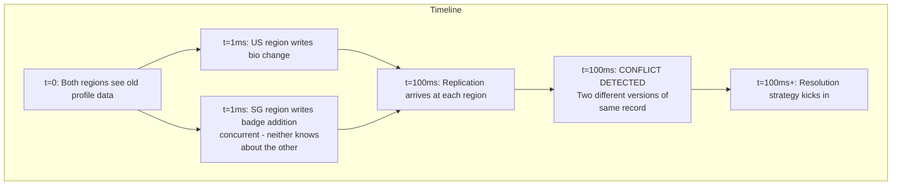

### Strategy 1: Last-Write-Wins (LWW)

The simplest approach. Every write carries a timestamp. When two writes conflict, the one with the higher timestamp wins. The other write is silently discarded.

```python
import time

class LWWRegister:
    """Last-Write-Wins Register — simplest conflict resolution"""

    def __init__(self):
        self.value = None
        self.timestamp = 0

    def write(self, value, timestamp=None):
        if timestamp is None:
            timestamp = time.time_ns()  # nanosecond precision
        if timestamp > self.timestamp:
            self.value = value
            self.timestamp = timestamp
            return True, "accepted"
        return False, "rejected (older write)"

    def read(self):
        return self.value, self.timestamp


# Scenario: Two concurrent profile updates
profile = LWWRegister()

# US region writes at t=1000 (Delhi user changes bio)
accepted, reason = profile.write("Engineer at Zomato", timestamp=1000)
print(f"US write: {reason}")  # accepted

# Singapore region writes at t=999 (badge addition — clock slightly behind)
accepted, reason = profile.write("Engineer at Zomato [verified]", timestamp=999)
print(f"SG write: {reason}")  # rejected (older write)

print(f"Final value: {profile.read()[0]}")
# "Engineer at Zomato" — badge addition was SILENTLY LOST
```

**The clock skew problem:** Server clocks are never perfectly synchronised. NTP (Network Time Protocol) typically maintains clock sync within 1–50ms. Under load or network issues, drift can be 100ms+. Two writes that happen 10ms apart can have their timestamps reversed due to clock skew — meaning the "winner" is random.

**Who uses LWW:** DynamoDB Global Tables (default), Cassandra (default), Redis.

**When LWW is acceptable:** When losing occasional writes is OK — shopping cart "last state wins," user settings updates, feature flag overrides. Not OK for bank balances.

### Strategy 2: Vector Clocks — Detect Conflicts Precisely

Instead of a single wall-clock timestamp, each node maintains a vector of counters — one counter per region. This lets you detect *whether* a conflict happened (was one write causally after the other, or were they truly concurrent?).

```python
class VectorClock:
    """
    Vector clock for tracking causality in distributed systems.
    A vector clock is a dictionary: {region_id: counter}
    """

    def __init__(self, regions):
        self.clock = {r: 0 for r in regions}

    def increment(self, my_region):
        """Call this before making a write in my_region"""
        self.clock[my_region] += 1
        return dict(self.clock)

    def merge(self, other: dict):
        """Merge another clock — take max of each entry"""
        for region in other:
            self.clock[region] = max(
                self.clock.get(region, 0),
                other.get(region, 0)
            )

    def happens_before(self, other: dict) -> bool:
        """
        Returns True if self causally happened before other.
        Meaning: self saw all events that other built upon.
        """
        return (
            all(self.clock.get(r, 0) <= other.get(r, 0) for r in other)
            and any(self.clock.get(r, 0) < other.get(r, 0) for r in other)
        )

    def is_concurrent_with(self, other: dict) -> bool:
        """True if neither happened-before the other = CONFLICT"""
        return (
            not self.happens_before(other)
            and not all(other.get(r, 0) <= self.clock.get(r, 0) for r in self.clock)
        )


# Example: Priya's profile in two regions
regions = ["us-east", "eu-west", "ap-south"]

# Initial: both regions have same profile version
us_vc = VectorClock(regions)
ap_vc = VectorClock(regions)

# US region makes a write (bio change)
us_clock_v1 = us_vc.increment("us-east")
# us_clock_v1 = {"us-east": 1, "eu-west": 0, "ap-south": 0}

# AP region makes a concurrent write (badge addition — didn't see US write yet)
ap_clock_v1 = ap_vc.increment("ap-south")
# ap_clock_v1 = {"us-east": 0, "eu-west": 0, "ap-south": 1}

# Now check if there is a conflict
print(f"US happened before AP? {us_vc.happens_before(ap_clock_v1)}")  # False
print(f"AP happened before US? {ap_vc.happens_before(us_clock_v1)}")  # False
print(f"CONFLICT DETECTED: These are concurrent writes")
# Application must now decide what to do — vector clocks only detect, not resolve
```

**What vector clocks tell you:**
- If VC_A ≤ VC_B everywhere: A happened before B — no conflict, B wins
- If VC_A and VC_B are incomparable: CONCURRENT — conflict!

**Who uses vector clocks:** Amazon DynamoDB (internally), Riak, Voldemort.

**Downside:** Vector clock size grows with number of nodes. Amazon's Dynamo paper noted that after years, vector clocks accumulated thousands of entries from old nodes.

### Strategy 3: CRDTs — Conflict-Free by Mathematical Design

CRDTs (Conflict-free Replicated Data Types) are data structures designed so that **concurrent updates from any order always converge to the same result.** No coordination required, no conflicts possible.

The secret: operations must be **commutative** (A+B = B+A), **associative**, and **idempotent** (applying twice = applying once).

```python
class GCounter:
    """
    Grow-Only Counter CRDT.
    Each region can only increment its own slot.
    Merge = take max of each slot.
    Result converges to the same value regardless of merge order.
    """

    def __init__(self, my_node, all_nodes):
        self.my_node = my_node
        self.counts = {n: 0 for n in all_nodes}

    def increment(self, amount=1):
        self.counts[self.my_node] += amount

    def value(self):
        return sum(self.counts.values())

    def merge(self, other_counter: 'GCounter') -> 'GCounter':
        """Safe merge — always correct regardless of order"""
        result = GCounter(self.my_node, list(self.counts.keys()))
        for node in self.counts:
            result.counts[node] = max(
                self.counts.get(node, 0),
                other_counter.counts.get(node, 0)
            )
        return result


# Scenario: Counting YouTube video views across regions simultaneously
nodes = ["us-east", "eu-west", "ap-south"]
us_views = GCounter("us-east", nodes)
eu_views = GCounter("eu-west", nodes)
ap_views = GCounter("ap-south", nodes)

# All three regions record views concurrently
us_views.increment(1000)   # 1000 views from US users
eu_views.increment(750)    # 750 views from EU users
ap_views.increment(500)    # 500 views from APAC users

# Merge in ANY order — always gets 2250
merged = us_views.merge(eu_views).merge(ap_views)
print(f"Total views: {merged.value()}")  # 2250 — always correct!

# Merge in different order — same result
merged2 = ap_views.merge(us_views).merge(eu_views)
print(f"Total views (different merge order): {merged2.value()}")  # 2250 — mathematically guaranteed
```

**Real-world CRDTs you should know:**
- **G-Counter / PN-Counter:** Page view counts, upvote counters, like counts (YouTube uses this)
- **OR-Set (Observed-Remove Set):** Shopping cart items — add/remove without conflicts
- **LWW-Element-Set:** Each element has its own LWW, giving per-element conflict resolution
- **RGA (Replicated Growable Array):** Used in Google Docs for collaborative text editing — concurrent character insertions always merge correctly
- **MV-Register (Multi-Value):** Stores all concurrent values (like Dynamo's "siblings") and lets the application choose

| Strategy | Complexity | Data Loss Risk | Detects Conflicts | Resolves Conflicts | Best For |
|---|---|---|---|---|---|
| Last-Write-Wins | Low | Yes (clock skew) | No | Automatically (timestamp) | Shopping carts, settings |
| Vector Clocks | Medium | No | Yes | Application must decide | General key-value data |
| CRDTs | High to implement | No | N/A (never conflicts) | Mathematically | Counters, sets, collaborative editing |
| Application-level | Varies | No | Yes | Domain-specific logic | Complex business objects |

**Interview tip:** When asked about conflicts in distributed systems, show that you know: (1) the problem exists, (2) LWW is the easy escape hatch, (3) vector clocks detect but don't resolve, (4) CRDTs are the elegant solution for certain data types, (5) sometimes you just need to surface the conflict to the user.

---

## Global Traffic Routing — Getting Users to the Right Region

### GeoDNS — Route by Geography

When a user types `api.zomato.com`, their DNS resolver asks "what IP is this?" The DNS server's answer depends on *where the user is asking from*.

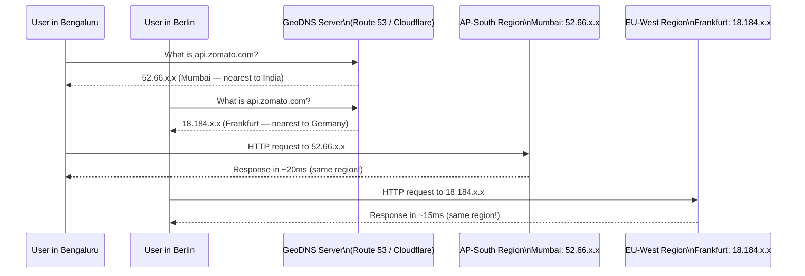

**How GeoDNS works:**
1. DNS provider maintains a database mapping IP prefixes to geographic regions (MaxMind GeoIP or similar)
2. When a DNS query arrives, the provider looks up the requester's IP in this database
3. Returns the IP of the nearest healthy endpoint based on the geo-lookup
4. TTL controls how long this mapping is cached (typically 60–300 seconds)

**Providers:**
- **AWS Route 53:** Latency-based routing (measures actual latency, not just geography), Geolocation routing, Geoproximity routing
- **Cloudflare:** Load balancing with geographic steering
- **NS1:** Advanced traffic management with filters

**Critical limitation — DNS TTL:**

When a region goes down, you update the DNS record to point away from it. But DNS is cached! If TTL is 300 seconds, users worldwide take up to 5 minutes to get the updated record. During those 5 minutes, some users are still being sent to the down region.

This is why GeoDNS alone is insufficient for zero-downtime failover.

### Anycast — Same IP, Nearest Server

Anycast is a fundamentally different approach. Multiple servers in different locations all **advertise the same IP address** to the internet's routing system (BGP). The internet's infrastructure automatically routes each packet to the nearest advertiser.

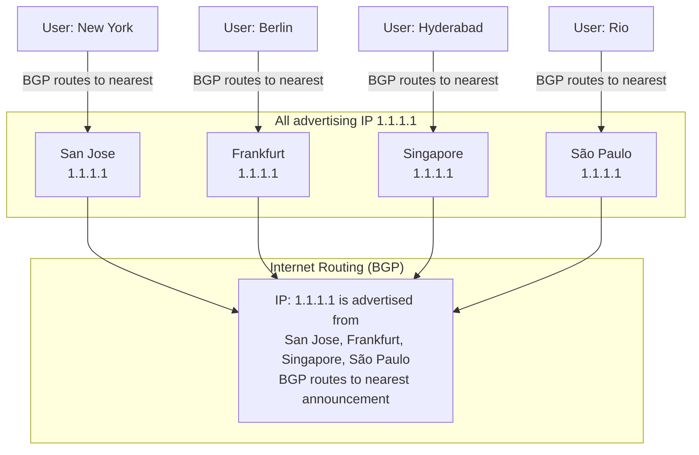

**Why Anycast is superior to GeoDNS for failover:**

- GeoDNS failover: DNS record updated → TTL expires → users get new IP (minutes)
- Anycast failover: Server in Frankfurt stops advertising 1.1.1.1 → BGP reconverges → users auto-routed to next nearest (seconds, typically 30–90 seconds for BGP convergence)

**Who uses Anycast:**
- **Cloudflare:** Their entire network. When you hit 1.1.1.1 (their DNS) from anywhere in the world, you reach the nearest Cloudflare PoP
- **Google:** 8.8.8.8 DNS resolver — same IP routes to different Google datacenters worldwide
- **Fastly, Akamai, AWS CloudFront:** CDN edge routing
- **Stripe:** Payment API endpoints use Anycast for global low-latency access

| Feature | GeoDNS | Anycast |
|---|---|---|
| Works at layer | DNS (Application) | Network (BGP) |
| Failover speed | Minutes (DNS TTL) | Seconds (BGP convergence) |
| Granularity | Geographic regions | Any BGP-speaking server |
| Cost | Low | High (need BGP infrastructure or CDN) |
| Complexity | Low | High |
| Used by | Most companies as baseline | Cloudflare, Google, CDNs |

---

## The "Read Local, Write Home" Pattern

This is one of the most practical and elegant patterns for global apps. Bahut useful hai yeh pattern for interviews.

**Analogy:** Think of how you manage your bank account when travelling abroad. You can check your balance at any ATM worldwide — that is fast and local. But when you transfer money, your home bank in India processes it. Reads are distributed globally; writes have a single authoritative home.

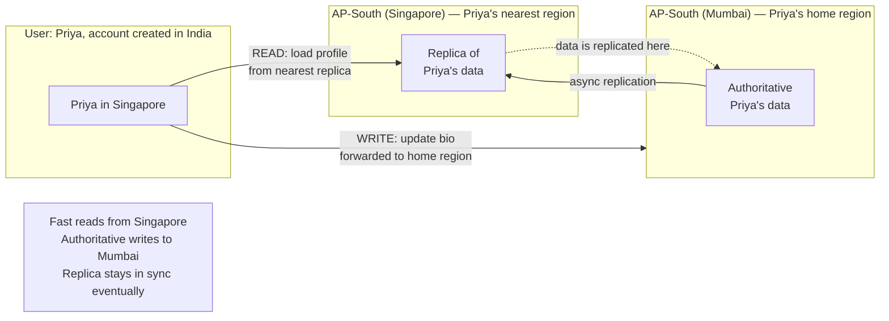

```python
class GeoAwareRouter:
    """
    Routes reads to nearest region, writes to user's home region.
    Used by systems like Facebook, WhatsApp, Instagram.
    """

    REGION_MAP = {
        # country_code -> nearest_region
        "IN": "ap-south",
        "SG": "ap-south",
        "JP": "ap-northeast",
        "AU": "ap-southeast",
        "DE": "eu-west",
        "FR": "eu-west",
        "GB": "eu-west",
        "US": "us-east",
        "CA": "us-east",
        "BR": "sa-east"
    }

    def get_nearest_region(self, country_code: str) -> str:
        return self.REGION_MAP.get(country_code, "us-east")

    def get_home_region(self, user_id: str, db) -> str:
        """
        User's home region is determined at account creation time
        and stored in a globally-replicated directory table.
        This table is tiny (just user_id -> home_region mappings)
        so it can be fully replicated everywhere with minimal cost.
        """
        return db.global_directory.get(user_id, {}).get("home_region", "us-east")

    def route(self, operation: str, user_id: str, country: str, db) -> str:
        if operation == "READ":
            # Reads go to nearest region — fast, may be slightly stale
            return self.get_nearest_region(country)
        elif operation == "WRITE":
            # Writes go to home region — authoritative, consistent
            return self.get_home_region(user_id, db)
        elif operation == "AUTH":
            # Auth always goes to home region — consistency critical
            return self.get_home_region(user_id, db)


# Facebook uses this pattern extensively
# When you like a post from Singapore, the like is processed in Singapore (nearest)
# but your profile write (bio change) goes to your home region datacenter
```

**Trade-off:** Writes from a region far from the user's home can have higher latency. An Indian user updating their profile while in the US will have that write routed back to India — adding ~200ms. This is usually acceptable for infrequent write operations.

---

## Data Residency and Compliance — Building for Legal Requirements

### GDPR Deep Dive

GDPR (General Data Protection Regulation) came into effect in May 2018. It applies to any company processing EU resident data, regardless of where the company is based.

**What counts as "personal data" under GDPR:**
- Name, email, phone number
- IP addresses (yes, even these)
- Cookie identifiers
- Location data
- Biometric data
- Any data that can identify a person directly or indirectly

**Article 44 data transfer restriction:** Personal data cannot leave the EU (or EEA) unless the destination country provides "adequate protection." The EU has approved a limited list of countries (Switzerland, Japan, UK, etc.). The US is approved under the Data Privacy Framework (after Schrems II invalidated Privacy Shield).

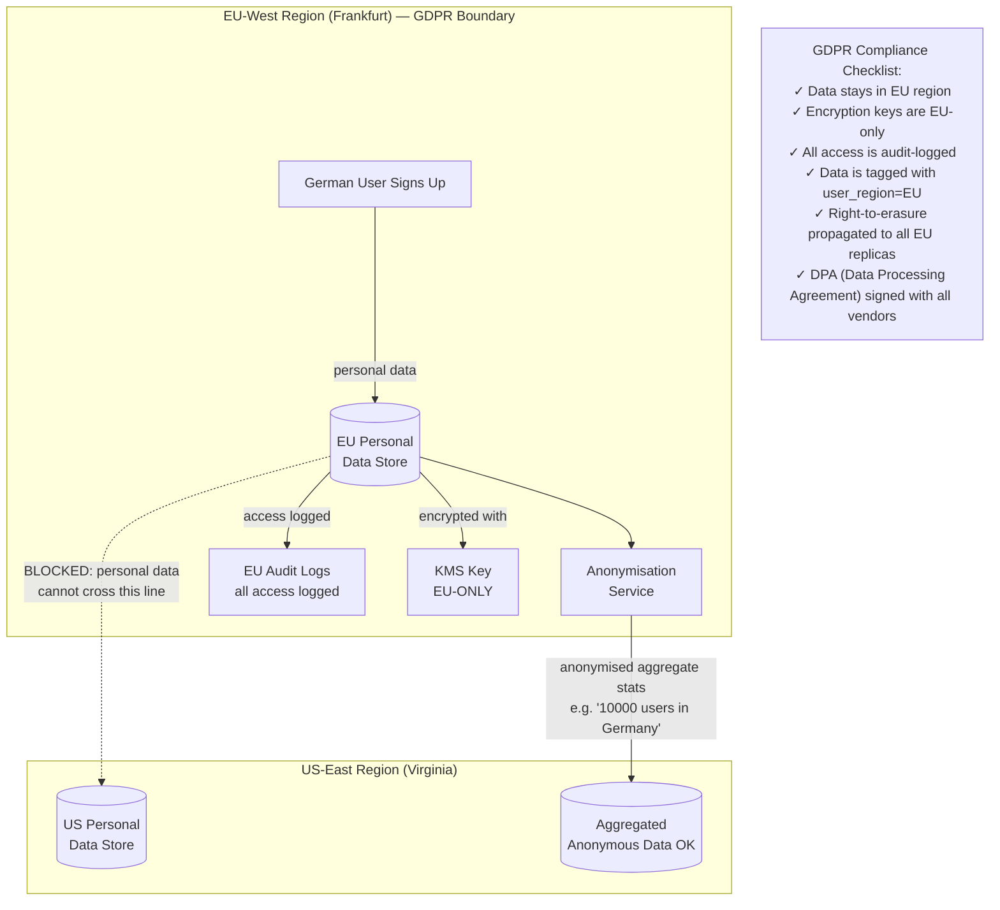

**Implementation patterns for GDPR compliance:**

1. **Data tagging:** Every record has `data_region: "EU"`. Query layer enforces EU data only goes to EU databases.

2. **Regional encryption keys:** EU data encrypted with a KMS key that exists only in `eu-west-1`. Even if someone copies the ciphertext to a US server, it cannot be decrypted without the EU key.

3. **Audit logging:** Every access to EU personal data is logged with timestamp, user ID, and purpose. Required for demonstrating compliance.

4. **Right to Erasure (Article 17):** When an EU user says "delete my data," deletion must propagate to ALL replicas (including backups) within 30 days.

5. **Data minimisation:** Only store what you actually need. Don't ship EU user data to US analytics pipelines "just in case."

```python
class GDPRCompliantUserStore:
    """
    Example of a data store that enforces EU data residency.
    In practice this is enforced at multiple layers:
    infrastructure, application, and audit.
    """

    def __init__(self, region: str):
        self.region = region
        self.store = {}
        self.audit_log = []
        self.deletion_queue = []  # cross-region deletion propagation

    def write_user_data(self, user_id: str, data: dict, user_region: str) -> bool:
        """Route personal data to the correct regional store"""
        if user_region == "EU" and self.region != "eu-west":
            raise PermissionError(
                f"EU personal data cannot be stored in {self.region}. "
                f"Route this request to eu-west."
            )
        # Tag data with region for enforcement
        tagged_data = {**data, "_data_region": user_region, "_created_at": "2025-01-01"}
        self.store[user_id] = tagged_data
        self._audit(f"WRITE user={user_id} region={user_region}")
        return True

    def read_user_data(self, user_id: str, requester_id: str, purpose: str) -> dict:
        """All reads are audit-logged (GDPR requirement)"""
        data = self.store.get(user_id)
        if data:
            self._audit(f"READ user={user_id} by={requester_id} purpose={purpose}")
        return data

    def delete_user_data(self, user_id: str) -> dict:
        """
        GDPR Article 17 — Right to Erasure.
        Must delete from this region AND queue deletion in all others.
        """
        deleted_regions = []
        if user_id in self.store:
            del self.store[user_id]
            deleted_regions.append(self.region)
            self._audit(f"DELETE user={user_id} (right-to-erasure request)")

        # Queue for cross-region propagation
        self.deletion_queue.append({
            "user_id": user_id,
            "target_regions": ["all"],
            "deadline": "30_days"
        })

        return {"deleted_from": deleted_regions, "queued_propagation": True}

    def _audit(self, action: str):
        self.audit_log.append({"action": action, "timestamp": "2025-01-01T00:00:00Z"})
```

---

## Multi-Region Databases — The Real Options

This is where the rubber meets the road. What actual databases do teams use for multi-region?

### CockroachDB — Distributed SQL with Sync Replication

**Analogy:** Imagine PostgreSQL, but it natively lives across multiple datacenters and keeps all copies in sync automatically.

CockroachDB uses a consensus protocol (Raft) across nodes. Every write requires a majority of replicas (quorum) to acknowledge before the client gets confirmation — this is synchronous by design.

```
CockroachDB cluster: 3 regions, 1 node each (minimum for HA)
  US-East: node-1
  EU-West: node-2
  AP-South: node-3

Write to US-East:
  1. node-1 proposes write via Raft
  2. node-1 + node-2 confirm (quorum = 2 of 3)
  3. Client gets success
  4. node-3 catches up asynchronously

Result: No data loss. Write latency = cross-region RTT to reach quorum.
```

**Pros:** ACID transactions across regions, zero data loss, SQL compatibility (PostgreSQL wire protocol), automatic failover.

**Cons:** Write latency tied to cross-region RTT. Not suitable for ultra-low-latency writes. Cost is high for 3+ region deployments.

**Who uses it:** Cockroach Labs, various fintech and healthtech companies needing global ACID compliance.

### Apache Cassandra — Tunable Consistency for Scale

**Analogy:** Cassandra is like a company with offices in 10 cities where each office has a complete copy of all files. You can choose per-operation how many offices need to agree before you get an answer.

Cassandra is a masterless, peer-to-peer database. Every node can accept reads and writes. Replication factor (RF) controls how many copies exist. Consistency level (CL) controls how many must respond.

```
Cassandra multi-region setup:
  US-East datacenter: 3 nodes
  EU-West datacenter: 3 nodes
  AP-South datacenter: 3 nodes
  RF = 3 (one copy per datacenter)

Write at CL=LOCAL_QUORUM:
  → 2 of 3 nodes in LOCAL datacenter confirm → success
  → other datacenters get async replication
  → Fast write (local only), eventual consistency cross-region

Write at CL=EACH_QUORUM:
  → 2 of 3 nodes in EACH datacenter must confirm → success
  → Slow (cross-region RTT) but truly consistent everywhere
```

**Consistency levels — the tunable dial:**

| Consistency Level | Meaning | Latency | Use Case |
|---|---|---|---|
| ONE | Any 1 replica responds | Lowest | Logging, analytics (stale ok) |
| LOCAL_QUORUM | Majority in local DC | Low | Most production reads/writes |
| QUORUM | Majority across all DCs | Medium | Important data |
| EACH_QUORUM | Majority in EVERY DC | High | Critical cross-region ops |
| ALL | Every replica responds | Highest | Rarely used |

**Who uses Cassandra multi-region:** Instagram, Apple, Netflix, Spotify, Discord, Uber.

**Instagram's Cassandra usage:** They run Cassandra for social graph data (who follows whom). EU users' follow relationships are replicated to EU datacenters for GDPR. Each region can serve reads locally.

### DynamoDB Global Tables — Managed Active-Active

**Analogy:** DynamoDB Global Tables is like Google Docs but for databases. Any region can write, changes propagate to all others automatically, and conflicts are handled via last-write-wins.

AWS manages all the replication infrastructure. You just create a "global table" and enable the regions you want.

```
DynamoDB Global Table: enabled in us-east-1, eu-west-1, ap-south-1

Write in us-east-1:
  1. Write stored locally in us-east-1
  2. Client gets immediate success
  3. DynamoDB replication service propagates to eu-west-1 and ap-south-1
  4. Replication lag: typically <1 second

Concurrent writes in different regions:
  → Conflict resolution: Last-Write-Wins based on timestamps
  → The write with the higher timestamp wins globally
```

**Pros:** Fully managed (zero operational burden), automatic replication, supports up to 5 regions, tight AWS integration.

**Cons:** LWW conflict resolution only (no custom logic), async only (some data loss possible), proprietary (vendor lock-in), can be expensive at scale.

**Who uses it:** Lyft, Airbnb, Samsung, Coca-Cola (for their global applications).

### Google Cloud Spanner — The Most Ambitious Option

**Analogy:** Spanner is what you'd get if you asked a team of PhDs to build a globally distributed database with zero compromises on consistency, and then gave them atomic clocks and GPS receivers to do it.

Spanner achieves **external consistency** (stronger than serialisability) across global replicas using TrueTime — a system that bounds clock uncertainty using atomic clocks and GPS. Every transaction gets a globally unique, totally ordered timestamp.

```
Spanner region configuration (e.g., nam-eur-asia1):
  Leader: US-East
  Read replicas: EU-West, AP-Southeast

Write:
  1. Leader takes Paxos consensus across all replicas
  2. TrueTime assigns a globally ordered timestamp
  3. Client gets success only after quorum acks
  4. Any replica can serve reads at a given timestamp consistently

Result: Read your own writes from any region. No stale reads.
        Write latency: ~100-200ms cross-continent (price of global sync)
```

**Pros:** Strongest consistency model available commercially, ACID across all regions, SQL, fully managed.

**Cons:** Expensive (significantly more than DynamoDB or Cassandra), write latency is tied to cross-region RTT, Google Cloud only.

**Who uses it:** Google itself (Ads, Spanner started internally), Shopify, Square, Deutsche Bank.

| Database | Type | Consistency | Multi-Region Model | Best For |
|---|---|---|---|---|
| CockroachDB | Distributed SQL | Strong (Raft) | Sync quorum | Global ACID, fintech |
| Cassandra | NoSQL wide-column | Tunable | Async/sync per-op | High-throughput social/IoT |
| DynamoDB Global Tables | Managed NoSQL | Eventual (LWW) | Async active-active | AWS shops, simple KV |
| Spanner | Distributed SQL | External consistency | Sync (TrueTime) | Google Cloud, maximum consistency |
| MongoDB Atlas | Document | Tunable | Async zones | Document data, global reads |

---

## Edge Computing — Running Code at the CDN Edge

### What and Why

**Analogy:** Instead of making every dish at the central kitchen in Delhi and shipping it across India, you have small prep stations at every Swiggy delivery hub — they can do simple stuff (reheating, garnishing, basic preparation) right there without waiting for Delhi.

Edge computing moves code execution to CDN edge nodes — physically close to users, often inside ISP networks. For tasks that don't need your full application backend, this can reduce latency from 100–300ms to single-digit milliseconds.

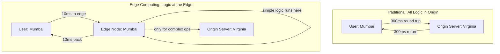

### Cloudflare Workers

Cloudflare operates 300+ PoPs (Points of Presence) worldwide. Cloudflare Workers lets you run JavaScript/WASM at every one of these PoPs.

```javascript
// Cloudflare Worker — runs at the edge node nearest to the user
// This code executes in Mumbai, Singapore, Frankfurt, etc. — wherever user is closest

addEventListener('fetch', event => {
  event.respondWith(handleRequest(event.request))
})

async function handleRequest(request) {
  const url = new URL(request.url)

  // 1. A/B testing at the edge — no origin server needed
  const userId = request.headers.get('X-User-ID')
  const variant = userId && parseInt(userId) % 2 === 0 ? 'A' : 'B'

  // 2. Geolocation at the edge — Cloudflare provides this automatically
  const country = request.cf.country
  const city = request.cf.city

  // 3. GDPR check at the edge — before hitting origin
  if (country === 'DE' || country === 'FR') {
    // Ensure EU traffic only goes to EU origin
    const euOrigin = 'https://eu-api.myapp.com'
    return fetch(euOrigin + url.pathname, {
      headers: {
        ...request.headers,
        'X-User-Country': country,
        'X-AB-Variant': variant
      }
    })
  }

  // 4. Simple cache check at edge
  const cache = caches.default
  const cachedResponse = await cache.match(request)
  if (cachedResponse) {
    return cachedResponse  // served from edge, zero origin load
  }

  // 5. Forward to origin only if needed
  const response = await fetch('https://api.myapp.com' + url.pathname, request)

  // Cache for 60 seconds at edge
  const responseToCache = response.clone()
  event.waitUntil(cache.put(request, responseToCache))

  return response
}
```

**Use cases for Cloudflare Workers / Lambda@Edge:**
- Authentication token validation (no origin server needed)
- A/B testing routing
- Geographic redirects and GDPR enforcement
- Request/response transformation
- Bot detection
- Serving personalised cached content
- Image resizing and optimisation

### AWS Lambda@Edge

Lambda@Edge runs your code at CloudFront edge locations (200+ globally).

```javascript
// Lambda@Edge: Viewer Request function
// Runs at CloudFront edge before even checking the cache

exports.handler = async (event) => {
  const request = event.Records[0].cf.request
  const headers = request.headers

  // Extract country from CloudFront-added header
  const country = headers['cloudfront-viewer-country']?.[0]?.value

  // Route EU users to EU origin
  if (['DE', 'FR', 'NL', 'IT', 'ES'].includes(country)) {
    request.origin.custom.domainName = 'eu-api.myapp.com'
    headers['host'] = [{ key: 'host', value: 'eu-api.myapp.com' }]
  }

  // Add personalisation headers based on device
  const ua = headers['user-agent']?.[0]?.value || ''
  if (/Mobile/.test(ua)) {
    headers['x-client-type'] = [{ key: 'X-Client-Type', value: 'mobile' }]
  }

  return request
}
```

| Feature | Cloudflare Workers | Lambda@Edge |
|---|---|---|
| PoP count | 300+ | 200+ |
| Runtime | V8 Isolates (JS/WASM) | Node.js, Python |
| Cold start | Near-zero | Milliseconds |
| Pricing model | Per-request | Per-request + compute time |
| Integration | Cloudflare ecosystem | AWS ecosystem |
| Request limits | 50ms CPU per request | Varies by trigger type |
| Key advantage | Fastest cold starts, KV store at edge | Deep AWS integration |

---

## How Real Companies Handle Multi-Region

### WhatsApp — 2 Billion Users, Hub-and-Spoke Model

WhatsApp has datacenters in multiple regions. Their core design principle:

- **Each user is "homed"** to a region based on where they signed up (phone number prefix gives geographic hint)
- **Messages flow hub-to-hub:** When you (India) message someone (Brazil), the message goes from the India datacenter to the Brazil datacenter, then to your friend's device
- **Media (photos, videos)** is stored separately on Facebook's (Meta's) CDN — image bytes are replicated to the nearest PoP, not kept at the user's home datacenter
- **End-to-end encryption** is a gift for data residency — since WhatsApp servers never see plaintext content, encrypted blobs can be replicated more freely across regions without privacy concerns
- **Delivery receipts** (the blue ticks) are strongly consistent — WhatsApp ensures both sender and receiver agree on delivery status

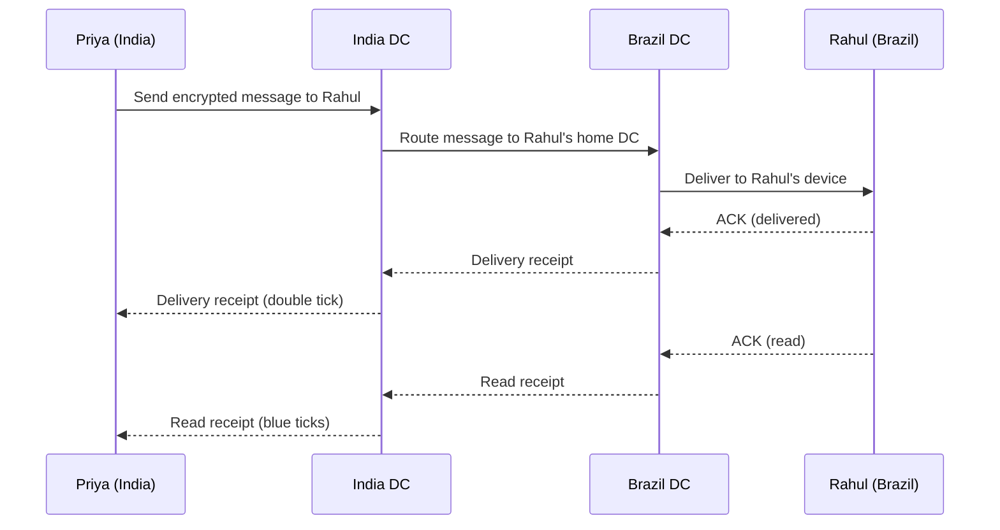

### Netflix — The Gold Standard of Geo-Distribution

Netflix is probably the most sophisticated geo-distributed consumer application ever built. Yahan se bahut kuch seekhne ko milta hai.

**Open Connect — Netflix's Custom CDN:**

Netflix built their own CDN called Open Connect. They physically place dedicated servers inside ISP networks worldwide (like inside Airtel's datacenter in India, or Comcast's facilities in the US). These servers hold copies of popular content.

```
Netflix content delivery path:
1. You press Play on "Sacred Games" in Pune
2. Netflix app asks: what Open Connect server is nearest to you?
3. Answer: An Airtel Open Connect Appliance (OCA) inside Airtel's Pune facility
4. Your video streams from that OCA — it NEVER leaves Airtel's network
5. Latency: milliseconds (same building as your ISP)
6. Netflix's Virginia servers: never involved in serving your video bytes
```

This is edge computing taken to its logical extreme — the content is so close to the user that it's inside their ISP's building.

**Account and control plane:**

- **Apache Cassandra** for user profiles, viewing history, preferences
- Reads at `ONE` consistency level (lowest) for recommendation data — slightly stale is fine
- Writes at `LOCAL_QUORUM` for critical data (playback position, to prevent rewind after refresh)
- EU user data stays in EU Cassandra clusters for GDPR
- **Chaos Engineering:** Netflix's Chaos Kong deliberately kills entire AWS regions in production to test that failover works. If you cannot survive a region failure in your test, you will not survive it in production.

**For rural India specifically:**

1. Pre-positioning: Netflix pre-downloads episodes to Open Connect servers inside Airtel/Jio/BSNL datacenters in tier-2 cities
2. ABR (Adaptive Bitrate): Starts playback at low quality immediately, upgrades quality as buffer fills
3. The control plane (homepage, search) may have slightly higher latency than the video itself — that is acceptable

### Zomato / Swiggy — India-First, Multi-Region within India

These are primarily India-focused apps but face the same geo-distribution challenges within India: a user in Kochi vs. Mumbai vs. Delhi should all get fast responses.

**Zomato's approach (approximated from public sources):**
- Primary infrastructure in AWS `ap-south-1` (Mumbai)
- **CDN:** Cloudflare for static assets (menu images, restaurant photos) — edge-cached globally
- **Read replicas:** Read replicas of their primary database in different availability zones within Mumbai for low-latency reads
- **As they expand internationally** (UAE, Australia): New AWS regions with async replication of restaurant/order data to local regions
- **Orders** are processed with strong consistency (cannot lose an order!) — single region as source of truth with replicas for DR

### Uber — Location Data is Special

Uber is fascinating because their core data (driver locations) changes thousands of times per second per city.

- **Each city is its own "cell":** São Paulo, London, Hyderabad — each runs mostly independently
- **Driver location updates:** Written to a regional in-memory store (Redis or similar) — not globally replicated. Your Mumbai driver's location stays in Mumbai. No Delhi servers need to know about Mumbai traffic.
- **Surge pricing:** Computed regionally based on local supply and demand
- **Cross-region sync:** Only high-level metrics, user profiles, and payment data need to cross regions
- **The insight:** Not all data needs to be globally distributed. Identify what is genuinely global vs. what is regional, and only pay the cross-region cost for truly global data.

### Instagram — Read-Heavy Social Graph

Instagram is one of the most read-heavy systems ever built (orders of magnitude more reads than writes).

- **Media files** are on Facebook's CDN — a photo uploaded in India is served from the nearest CDN PoP to each viewer globally
- **Feed generation:** Precomputed in background, cached regionally. When you refresh your feed in Singapore, you are reading from a Singapore-region cache that was pre-warmed by their feed fanout system
- **Social graph** (who follows whom): Cassandra multi-region with eventual consistency. If you follow someone, it might take 1–2 seconds to appear for them — acceptable.
- **Likes/comments:** Eventually consistent across regions. The like count you see might be 1–2 seconds stale if you are in a different region from where the like happened.

---

## Designing a Multi-Region System — Step-by-Step Framework

When you get a system design question with global users, here is the structured approach:

### Step 1: Understand the Geography

```
Questions to ask:
- What percentage of users are in each region?
- What is the write-to-read ratio?
- What is the latency requirement? (200ms? 50ms? 10ms?)
- Is this read-heavy or write-heavy?
```

### Step 2: Choose Active-Passive or Active-Active

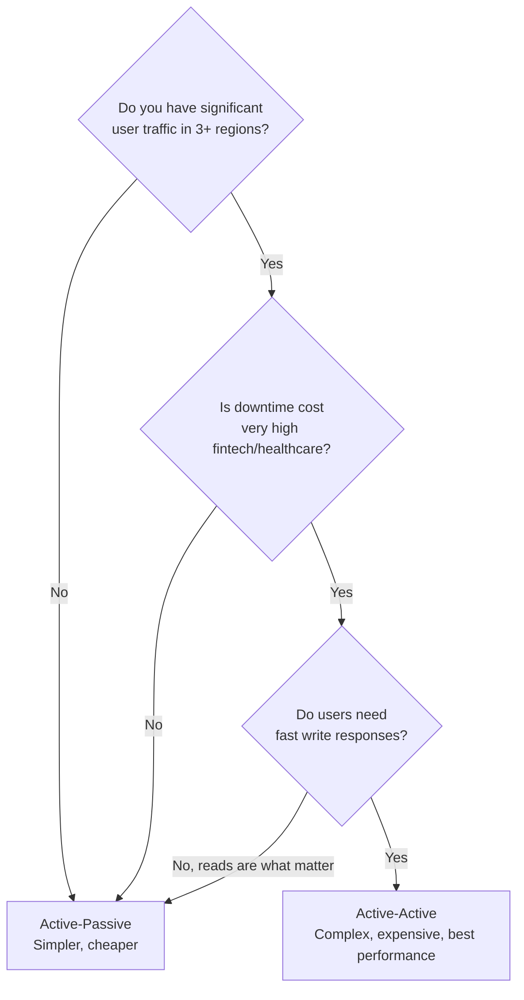

### Step 3: Choose Replication Strategy

```
RPO = 0 (zero data loss allowed)?
  → Sync replication (accept higher write latency)

RPO > 0 (some data loss ok, e.g., 5 seconds)?
  → Async replication (lower write latency, accept small risk)

Mix?
  → Sync for critical paths (payments, auth)
  → Async for everything else (feeds, catalogue, search)
```

### Step 4: Choose Conflict Resolution

```
Can you tolerate silent data loss on conflict?
  → Last-Write-Wins

Need to detect conflicts and handle them?
  → Vector Clocks + application-level resolution

Working with counters, sets, or collaborative data?
  → CRDTs
```

### Step 5: Choose the Database

```
Need SQL + ACID + global transactions?
  → CockroachDB or Spanner

Need tunable consistency + high throughput?
  → Cassandra

On AWS + simple KV/document?
  → DynamoDB Global Tables

On Google Cloud?
  → Spanner or Firestore
```

### Step 6: Design the Traffic Routing

```
Fast reads + eventual consistency for global users?
  → GeoDNS + Read Local, Write Home

Zero-downtime failover + CDN integration?
  → Anycast

GDPR/data residency enforcement?
  → Cloudflare Workers or Lambda@Edge at the boundary
```

---

## Complete Multi-Region Architecture — Bringing It All Together

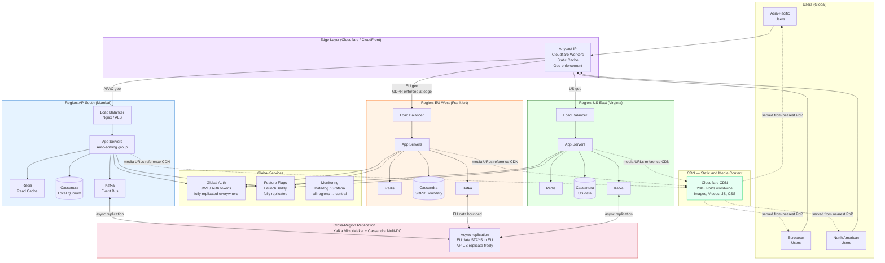

---

## Failure Modes and How to Handle Them

### Scenario 1: Region Goes Completely Down

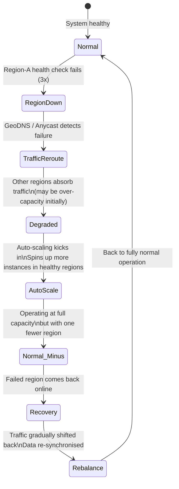

**Key design decisions for region failures:**
- Over-provision each region to handle N+1 traffic (if 3 regions and one fails, each of the remaining 2 can handle 50% more)
- Auto-scaling groups in each region with headroom configured
- Circuit breakers in the application to prevent cascading failures
- Health checks that are meaningful (not just TCP ping, but actual app-level health)

### Scenario 2: Replication Lag Spike

When a region gets behind on replication (network issue, high write load), you have a choice:

```python
class ReplicationLagHandler:
    """
    Handle high replication lag in a read-local, write-home pattern
    """

    MAX_ACCEPTABLE_LAG_MS = 5000  # 5 seconds

    def read_data(self, key: str, user_region: str, home_region: str):
        lag = self.get_replication_lag(user_region, home_region)

        if lag < self.MAX_ACCEPTABLE_LAG_MS:
            # Normal: read from local region (fast, slightly stale is ok)
            return self.local_store.get(key)
        else:
            # Replication lag too high: two options
            option = self.get_config("high_lag_strategy")

            if option == "read_home":
                # Option A: Read from home region (slower, but fresh)
                # Cost: cross-region latency
                return self.remote_store[home_region].get(key)

            elif option == "serve_stale":
                # Option B: Serve stale data with a warning
                # Good for: non-critical reads (feed, recommendations)
                data = self.local_store.get(key)
                return {"data": data, "warning": "may_be_stale", "lag_ms": lag}

            elif option == "reject":
                # Option C: Return error, ask client to retry
                # Good for: critical reads (account balance)
                raise ServiceUnavailableError("Replication lag too high, try again")
```

### Scenario 3: Network Partition Between Regions

This is the CAP theorem in action. During a partition, you have to choose: keep serving requests (Availability) or refuse until consistent (Consistency).

**The practical answer:** Most consumer apps choose Availability + Eventual Consistency (AP systems). Return potentially stale data and fix it when the partition heals.

**Fintech apps:** May choose Consistency + Partition tolerance (CP systems). Return errors during partition. Users hate it but cannot have their account balance wrong.

---

## Common Interview Questions

### Q1: "Design a global social media app like Instagram"

**Expected answer structure:**
1. Start with GeoDNS + CDN for static content and media
2. Active-Active regions in US, EU, APAC
3. Read-local pattern for feeds (async replicated, eventual consistency is fine)
4. Write-home pattern for profile updates
5. Async replication between regions via Kafka MirrorMaker or similar
6. Cassandra multi-DC for social graph data
7. GDPR: EU user data bounded to EU Cassandra cluster
8. Conflict resolution: LWW for likes/comments (good enough)
9. CDN (Cloudflare) for all media assets

### Q2: "How would you reduce latency for a global fintech app?"

**Expected answer:**
- CDN for all static content and API responses that can be cached
- Regional deployments (active-active) for API serving
- BUT writes must be strong consistency — accept higher write latency or use sync replication to nearest partner region
- Read replicas for account balance queries (with stale-read detection logic)
- GeoDNS + Anycast for routing
- Do NOT sacrifice consistency for latency in fintech — explain the trade-off explicitly

### Q3: "How do you handle GDPR in a multi-region system?"

**Expected answer:**
- EU users get a dedicated EU region
- Personal data (PII) tagged with `data_region=EU` at write time
- Query layer enforces EU data never crosses to non-EU databases
- EU-specific KMS encryption keys (cannot decrypt outside EU)
- Audit logging for all PII access
- Right-to-erasure pipeline: deletion propagated to all EU replicas within 30 days
- EU data can be anonymised/aggregated and then shared globally (aggregates are not PII)

### Q4: "What is the difference between GeoDNS and Anycast?"

| | GeoDNS | Anycast |
|---|---|---|
| Mechanism | Different IPs returned by DNS based on user geo | Same IP, BGP routes to nearest advertiser |
| Layer | Application (DNS) | Network (BGP) |
| Failover speed | Minutes (DNS TTL) | Seconds (BGP reconvergence) |
| Complexity | Low | High (need BGP infrastructure) |
| Who uses | Most companies | Cloudflare, Google, CDNs |

### Q5: "Explain the CAP theorem in the context of multi-region systems"

**Expected answer:**
- CAP: Consistency, Availability, Partition Tolerance — pick 2 of 3
- In distributed systems, partitions WILL happen — you always get P
- So the real choice is CP (consistent during partition, may be unavailable) vs AP (available during partition, may be inconsistent)
- CP examples: CockroachDB, Spanner, Zookeeper — return errors during partition
- AP examples: Cassandra (with LOCAL_QUORUM), DynamoDB — serve potentially stale data during partition
- **Key insight for interviews:** Most consumer systems choose AP (users hate unavailability more than staleness); fintech chooses CP (wrong balance is worse than "try again in 10 seconds")

### Q6: "What is replication lag and how do you handle it?"

**Answer:**
- Replication lag = delay between a write being confirmed and it appearing in replica regions
- Causes: network delay, write load spikes, serialisation overhead
- Typical lag: 10ms–5 seconds under normal conditions; can spike during partitions
- Handling strategies: (1) accept stale reads with TTL-based staleness check, (2) route reads to home region when lag exceeds threshold, (3) version tracking so client can detect stale responses

### Q7: "How does Netflix serve video with such low startup latency?"

**Answer:**
- Open Connect CDN with appliances **inside ISP networks** — video bytes served from your ISP's own building
- Content pre-positioned at OCAs based on popularity prediction
- Adaptive Bitrate (ABR): starts at low quality immediately, quality improves as buffer fills
- The "play" button response (Netflix API) comes from the nearest AWS region (not the same as where video bytes come from)
- Control plane (homepage) is separate from data plane (video bytes) — each optimised independently

### Q8: "Design the data layer for an app that must comply with GDPR, CCPA, and India's DPDP Act simultaneously"

**Expected discussion points:**
- Three regulatory regimes with different rules → three isolated data environments
- EU region for GDPR (Frankfurt/Dublin)
- US region for CCPA (multiple US regions fine since CCPA is California-specific but within US)
- India region for DPDP (Mumbai)
- Each user tagged with `regulatory_regime` at signup based on country
- Cross-region replication only for non-PII data (anonymised metrics, model weights, aggregates)
- Separate encryption key management per region
- Unified right-to-erasure pipeline that propagates to all regions for a given user
- Audit log in each region for compliance demonstration

---

## Key Takeaways

**1. Physics is the starting point.** Light through fibre travels at 200,000 km/s. Mumbai-to-California is 135ms minimum RTT. No amount of engineering makes light faster. Moving servers closer is the only solution.

**2. Active-Passive vs Active-Active is your most important early decision.** AP is simpler and cheaper; AA gives best latency and availability. Choose based on your user geography spread, downtime tolerance, and budget — not on what sounds cooler.

**3. Async replication is the default; sync is for critical paths.** Most systems use async for the majority of data and sync only for payments, auth, and other zero-data-loss scenarios. Understand your RPO before choosing.

**4. Conflict resolution is unavoidable in active-active.** Know all three strategies: Last-Write-Wins (simple, lossy), Vector Clocks (detect conflicts, app resolves), CRDTs (conflict-free by math). Each has its place.

**5. GeoDNS routes traffic, Anycast routes packets.** GeoDNS is DNS-layer, fails over in minutes (TTL). Anycast is network-layer, fails over in seconds (BGP). Use CDNs (which use Anycast) for the fastest failover.

**6. "Read Local, Write Home" is the practical sweet spot.** Reads from nearest region (fast, eventual consistency). Writes to home region (authoritative, consistent). Works for most social/consumer apps.

**7. GDPR and data residency are not afterthoughts.** Design regional data isolation from day one. EU personal data must never leave EU databases. Separate encryption keys per region. Audit everything. Right-to-erasure must propagate everywhere.

**8. Not all data needs to be globally distributed.** Uber's Mumbai driver locations don't need to be in Delhi. Only truly global data (user profiles, payments, auth) crosses regions. Everything else stays regional. This is how you contain costs and complexity.

**9. CDN gives you 80% of the benefit for 20% of the cost.** Before building multi-region databases, put a CDN in front. It handles static content, caches API responses, and gives you global edge PoPs. Then add active-active databases only for what CDN cannot handle.

**10. The order is: CDN → Read Replicas → Active-Active.** Start simple. CDN covers static content. Read replicas handle read-heavy traffic from remote regions. Only then, if writes also need to be global and fast, go full active-active. Each step adds complexity.

---

*Next: 26 — Rate Limiting and Throttling at Scale*
