# Consensus Algorithms: Raft & Paxos

> The problem that makes distributed systems genuinely hard — and how the smartest engineers in the world solved it.

---

## Table of Contents

1. [Why Consensus is the Hardest Problem](#why-consensus)
2. [The Generals Problem Analogy](#generals-problem)
3. [Two Generals Problem: The Impossibility](#two-generals)
4. [What We Need Consensus For](#use-cases)
5. [Byzantine Fault Tolerance: When Nodes Lie](#byzantine)
6. [FLP Impossibility: The Theoretical Limit](#flp)
7. [Paxos Algorithm: The Original](#paxos)
8. [Raft Algorithm: Paxos Made Understandable](#raft)
9. [etcd and ZooKeeper: Consensus in Production](#etcd-zookeeper)
10. [Kafka and KRaft: Moving Away from ZooKeeper](#kafka-kraft)
11. [Kubernetes and etcd: Real Stakes](#kubernetes-etcd)
12. [Raft vs Paxos Comparison](#comparison)
13. [Common Interview Questions](#interview-questions)
14. [Key Takeaways](#key-takeaways)

---

## 1. Why Consensus is the Hardest Problem in Distributed Systems {#why-consensus}

**Analogy pehle:** Imagine aap 5 doston ke saath ek group me ho aur decide karna hai — "Is weekend beach pe jayenge ya movie dekhenge?" Simple lagta hai. Lekin ab assume karo:

- Kuch doston ke phones ki battery dead ho gayi (node crash)
- WhatsApp messages sometimes deliver nahi hote (network packet loss)
- Messages out of order arrive hote hain (network reordering)
- Ek dost deliberately wrong information spread kar raha hai (Byzantine fault)

Ab bhi guarantee karni hai ki SABHI agree karein — ek hi decision pe — chahe jo bhi ho.

Yahi hai distributed consensus. Aur yeh genuinely difficult hai.

**Yeh kyun important hai:** Jab aapki company ka Zomato order database 5 servers pe replicated hai, toh sabko agree karna padta hai ki "order #12345 placed hai" — nahi toh ek server pe order show hoga, doosre pe nahi. Customer confuse, delivery partner confuse, Zomato ka reputation down.

**The core guarantees consensus must provide:**

| Property | Meaning | If violated |
|---|---|---|
| **Safety** | All nodes agree on the SAME value | Two servers say different leaders — split brain |
| **Liveness** | Eventually SOME value is agreed upon | System stuck forever, no progress |
| **Fault Tolerance** | Works even if minority of nodes fail | Single point of failure |

Simple baat hai: **Safety is non-negotiable. Liveness can sometimes be temporarily sacrificed.** Real algorithms (Raft, Paxos) always choose safety over liveness when forced to choose.

---

## 2. The Generals Problem Analogy {#generals-problem}

Leslie Lamport (the grandfather of distributed systems) framed this brilliantly in 1982.

**The Setup:**

Imagine a Byzantine empire is being attacked. Three army generals surround the enemy city from different sides:
- General A is at the North gate
- General B is at the East gate  
- General C is at the South gate

They can ONLY communicate via messenger on horseback. The city is in the middle — messengers have to ride through enemy territory.

**The Goal:** All loyal generals must agree on the SAME plan — either all ATTACK or all RETREAT.

**The Problem:**
- Messengers can be killed (messages can be lost)
- A general himself might be a traitor (malicious node)
- Messages can arrive out of order (network delays)

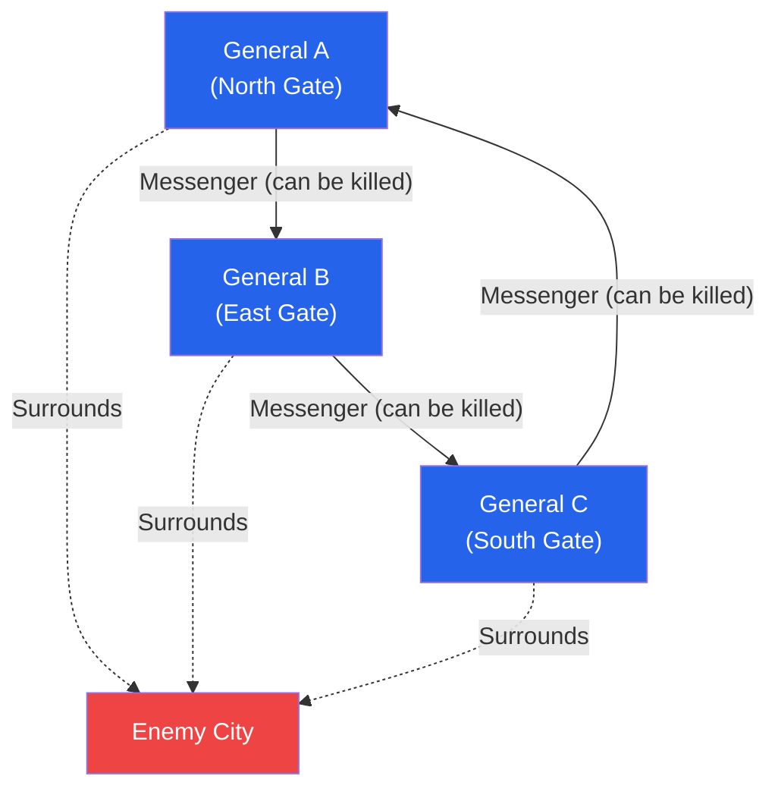
```mermaid
graph TB
    A["General A\n(North Gate)"]
    B["General B\n(East Gate)"]
    C["General C\n(South Gate)"]
    City["Enemy City"]

    A -->|"Messenger (can be killed)"| B
    B -->|"Messenger (can be killed)"| C
    C -->|"Messenger (can be killed)"| A
    A -.->|"Surrounds"| City
    B -.->|"Surrounds"| City
    C -.->|"Surrounds"| City

    style City fill:#ef4444,color:#fff
    style A fill:#2563eb,color:#fff
    style B fill:#2563eb,color:#fff
    style C fill:#2563eb,color:#fff
```

**Why this maps to distributed systems perfectly:**

| Army Problem | Distributed System |
|---|---|
| General | Server/Node |
| Messenger | Network message (TCP packet) |
| Messenger killed | Packet lost / network partition |
| Traitor general | Byzantine/malicious node |
| Attack or Retreat | True or False / Commit or Abort |
| All generals agree | Consensus |

**The key insight:** If even ONE general attacks while another retreats — both will be defeated individually. Partial agreement is WORSE than no agreement. Same in databases: partial commits = corrupted data.

---

## 3. Two Generals Problem: Why Consensus Over Unreliable Channels is Impossible {#two-generals}

**Analogy:** Aap aur aapka best friend ek saath WhatsApp pe plan kar rahe ho — "7 PM pe mall ke bahar milte hain?" Problem: WhatsApp unreliable hai (messages deliver nahi hote).

Aap: "7 PM?"
Friend: "Yes, 7 PM" — lekin message aata hai ya nahi, pata nahi.
Aap: "Got your yes, confirming!" — lekin yeh bhi deliver hoga ya nahi?
Friend: "Got your confirmation" — lekin...

**Yeh infinite loop kabhi end nahi hogi.** Har ek last message uncertain rehta hai.

**The Formal Problem:**

```
Two armies want to attack a city simultaneously.
Attack only succeeds if BOTH attack at the same time.
They can only communicate via messages that might be lost.

Army 1 → Army 2: "Attack at dawn?"
Army 2 → Army 1: "Confirmed, dawn attack" (might be lost!)
Army 1 → Army 2: "Got your confirm" (might be lost!)
Army 2 → Army 1: "Got your got..." (might be lost!)

This goes on FOREVER. The last message is ALWAYS uncertain.
```

**This was mathematically PROVEN impossible in 1975** — you cannot achieve consensus between two nodes over an unreliable network.

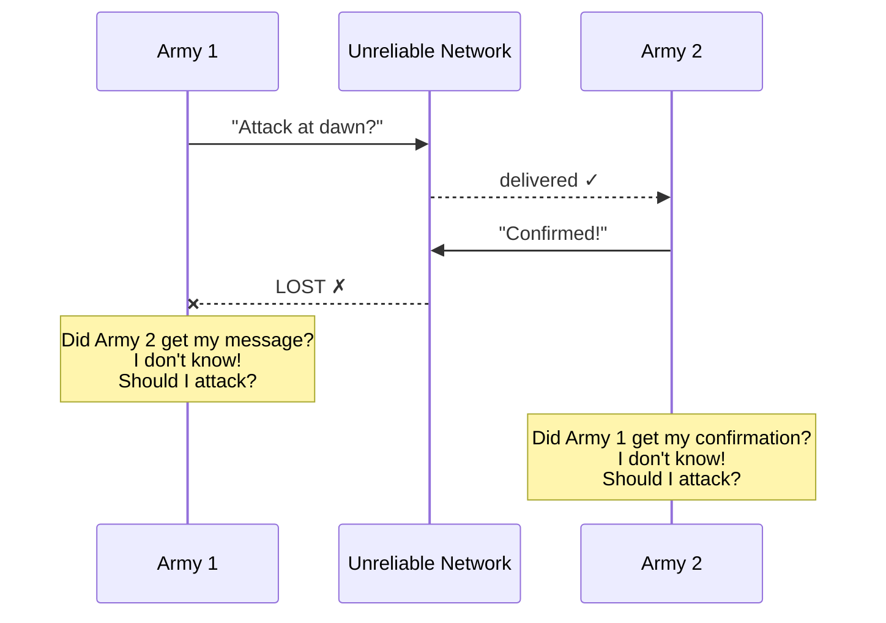
```mermaid
sequenceDiagram
    participant A as Army 1
    participant N as Unreliable Network
    participant B as Army 2

    A->>N: "Attack at dawn?"
    N-->>B: delivered ✓
    B->>N: "Confirmed!"
    N--xA: LOST ✗

    Note over A: Did Army 2 get my message?<br/>I don't know!<br/>Should I attack?

    Note over B: Did Army 1 get my confirmation?<br/>I don't know!<br/>Should I attack?
```

**Why this matters for real systems:**

This is exactly why a basic TCP connection between two servers can't guarantee consensus. Even TCP's 3-way handshake doesn't fully solve it — the SYN-ACK-ACK can be lost.

**The solution real systems use:** Stop trying to solve it with 2 nodes. Use 3+ nodes and require a MAJORITY (quorum). With 3 nodes, if 1 message is lost, the other 2 can still agree. This is the foundation of Paxos and Raft.

> Interview tip: "The Two Generals Problem proves consensus is impossible with just 2 nodes over unreliable networks. That's why all production consensus systems (Raft, Paxos) use odd-numbered clusters of 3, 5, or 7 nodes."

---

## 4. What We Need Consensus For {#use-cases}

**Basically kya hota hai:** Koi bhi situation jahan multiple servers ko agree karna ho — koi ek "truth" decide karni ho.

### 4.1 Leader Election

**Real example:** Netflix ke video streaming cluster me ek "primary" server hota hai jo decides karta hai ki kaun sa server request handle karega. Agar yeh primary crash ho jaaye, baaki servers ko agree karna hota hai ki naaya primary kaun banega — without getting into a fight.

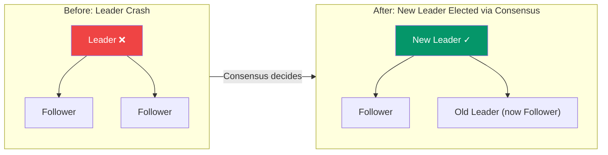
```mermaid
flowchart LR
    subgraph Before["Before: Leader Crash"]
        L1["Leader ❌"]
        F1["Follower"]
        F2["Follower"]
        L1 --> F1
        L1 --> F2
    end

    subgraph After["After: New Leader Elected via Consensus"]
        NL["New Leader ✓"]
        NF1["Follower"]
        NF2["Old Leader (now Follower)"]
        NL --> NF1
        NL --> NF2
    end

    Before -->|"Consensus decides"| After
    style L1 fill:#ef4444,color:#fff
    style NL fill:#059669,color:#fff
```

### 4.2 Distributed Transactions

**Real example:** Swiggy pe order place karte ho. Two things must happen atomically:
1. Debit your bank account
2. Create the order in Swiggy's database

These happen on different servers. Consensus decides: "Both succeeded? Commit. Any failure? Rollback." Without consensus, you could get charged but order not placed. Ya order placed but not charged.

### 4.3 Configuration Management (etcd, ZooKeeper)

**Real example:** Kubernetes cluster me 500 pods hain. Suddenly cluster config change hoti hai — "sabko env variable DATABASE_URL=new-db update karo." Consensus ensures ALL nodes see the SAME config at the SAME logical time.

- **etcd** — Used by Kubernetes (Raft-based)
- **ZooKeeper** — Used by Kafka, Hadoop (ZAB protocol)

### 4.4 Kafka Partition Leadership

**Real example:** Instagram ke notification system me Kafka use hota hai. Har Kafka topic ke multiple partitions hote hain. Har partition ka ek "leader broker" hota hai. ZooKeeper (or KRaft now) decides which broker is the leader for which partition. 1000 partitions = 1000 consensus decisions.

### 4.5 Distributed Locks

**Real example:** WhatsApp pe ek viral message send karte waqt, sirf ek server process kare — duplicate nahi. Distributed lock via etcd/ZooKeeper ensures only one worker "owns" a task at a time.

---

## 5. Byzantine Fault Tolerance: When Nodes Lie {#byzantine}

**Analogy:** Imagine aap 5 logon se rasta pooch rahe ho aur ek person deliberately wrong direction bata raha hai (woh aapka competitor hai aur chahta hai aap late paho). Crash fault toh yeh hota ki woh banda so gaya aur jawab hi nahi diya. Byzantine fault = jaag raha hai lekin jhooth bol raha hai.

**Two types of faults:**

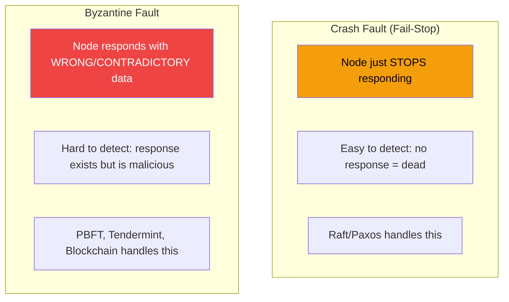
```mermaid
graph TB
    subgraph Crash["Crash Fault (Fail-Stop)"]
        CF["Node just STOPS responding"]
        CE["Easy to detect: no response = dead"]
        CS["Raft/Paxos handles this"]
    end

    subgraph Byzantine["Byzantine Fault"]
        BF["Node responds with WRONG/CONTRADICTORY data"]
        BE["Hard to detect: response exists but is malicious"]
        BS["PBFT, Tendermint, Blockchain handles this"]
    end

    style CF fill:#f59e0b,color:#000
    style BF fill:#ef4444,color:#fff
```

**Why Byzantine matters for blockchain:**

Bitcoin, Ethereum — they assume ANYONE can be a node. Some nodes are run by hackers who want to double-spend. So blockchain consensus (Proof of Work, PBFT, Tendermint) must handle Byzantine faults.

**Why crash-fault tolerance is enough for most systems:**

Google, Netflix, Zomato — unke servers unke own datacenters mein hain. Servers crash karte hain (power failure, OOM kill, hardware failure) lekin deliberately jhooth nahi bolte. Isliye **Raft and Paxos are crash-fault tolerant only** — and that's fine for 99% of real systems.

**The math:**

| Fault Type | Nodes Needed | Formula | Example |
|---|---|---|---|
| Crash Fault Tolerance | 2f+1 | Tolerate f crashes | 3 nodes → 1 crash OK |
| Byzantine Fault Tolerance | 3f+1 | Tolerate f traitors | 4 nodes → 1 traitor OK |

**Why 3f+1 for Byzantine?** With Byzantine faults, you need enough honest nodes to outvote traitors even when f more nodes are slow. You need f+1 honest responses minimum, out of 3f+1 total, the honest majority is 2f+1. Complex math, simple intuition: you need MORE redundancy when nodes can actively lie.

> We focus on crash-fault tolerance (Raft/Paxos) for the rest of these notes. Byzantine is a separate world (blockchain territory).

---

## 6. FLP Impossibility: The Theoretical Limit {#flp}

**Analogy:** Einstein proved nothing can travel faster than light. FLP proved something similar about consensus.

**Fischer, Lynch, Paterson (1985) proved:**

> "In an asynchronous distributed system with even ONE potentially faulty node, no deterministic consensus algorithm can guarantee both safety AND liveness."

**What "asynchronous" means:** Messages can be delayed by ANY amount of time — there's no upper bound. You can't distinguish "slow" from "crashed."

**What this means practically:**

```
You CANNOT build an algorithm that ALWAYS:
✅ Terminates (makes a decision, liveness)
✅ Makes the correct decision (safety)
✅ Tolerates even 1 crash
...in a system with no time bounds on messages.

YOU MUST sacrifice one of these.
```

**How real algorithms deal with it:**

Raft and Paxos **sacrifice liveness, never safety**:
- If majority unreachable → system halts (no progress)
- But it NEVER makes a wrong decision
- It NEVER has two leaders simultaneously
- It NEVER commits contradictory values

**Randomization saves us:** Raft uses randomized election timeouts (150-300ms random window). This breaks the theoretical impossibility — randomized algorithms can achieve consensus with very high probability, even if not 100% deterministic guarantee.

---

## 7. Paxos Algorithm: Lamport's Original {#paxos}

**Analogy:** Imagine ek company mein proposal pass karna ho (like Parliament). Koi bhi proposal kar sakta hai. Lekin pass hone ke liye majority "yes" chahiye. Aur ek strict rule hai: agar purana proposal already approved ho gaya hai, toh naaya proposal SAME value adopt karna padega — usse override nahi kar sakte.

Leslie Lamport ne 1998 mein Paxos publish kiya. It was so confusing that even he admitted it was hard to understand.

### Roles in Paxos

```
Proposer:  Proposes values (like a bill sponsor in Parliament)
Acceptor:  Votes to accept values (like Parliament members)
Learner:   Learns the final chosen value (like public who follows the law)

Note: In practice, one node plays all three roles.
```

### Phase 1: Prepare → Promise (The "Campaign Phase")

**Analogy:** Election mein candidate poochta hai — "Kya tum mujhe vote doge?" Voters promise: "Haan, aur main kisi aur ko vote nahi dunga jiska number tumhare se chhota hai."

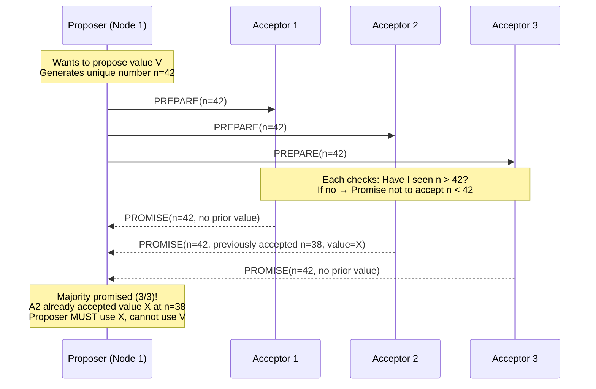
```mermaid
sequenceDiagram
    participant P as Proposer (Node 1)
    participant A1 as Acceptor 1
    participant A2 as Acceptor 2
    participant A3 as Acceptor 3

    Note over P: Wants to propose value V<br/>Generates unique number n=42

    P->>A1: PREPARE(n=42)
    P->>A2: PREPARE(n=42)
    P->>A3: PREPARE(n=42)

    Note over A1,A3: Each checks: Have I seen n > 42?<br/>If no → Promise not to accept n < 42

    A1-->>P: PROMISE(n=42, no prior value)
    A2-->>P: PROMISE(n=42, previously accepted n=38, value=X)
    A3-->>P: PROMISE(n=42, no prior value)

    Note over P: Majority promised (3/3)!<br/>A2 already accepted value X at n=38<br/>Proposer MUST use X, cannot use V
```

**Phase 1 rules:**

```
Proposer:
  1. Generate unique n (higher than any I've seen)
  2. Send PREPARE(n) to majority of acceptors
  3. Wait for PROMISE from majority

Acceptor (receiving PREPARE(n)):
  If n > my highest_n_seen:
    → promise: "I won't accept anything < n"
    → return any value I've already accepted
  Else:
    → Reject (I already promised someone with higher n)

Unique n trick: use (round_number, server_id)
  Server 1 uses: 1, 11, 21, 31...
  Server 2 uses: 2, 12, 22, 32...
  Server 3 uses: 3, 13, 23, 33...
```

### Phase 2: Accept → Accepted (The "Vote Phase")

**Analogy:** Candidate ab officially vote maang raha hai. Rule: agar kisi purane candidate ka vote already casted ho chuka hai, toh naaya candidate USI value ke liye vote maangega — apni value nahi.

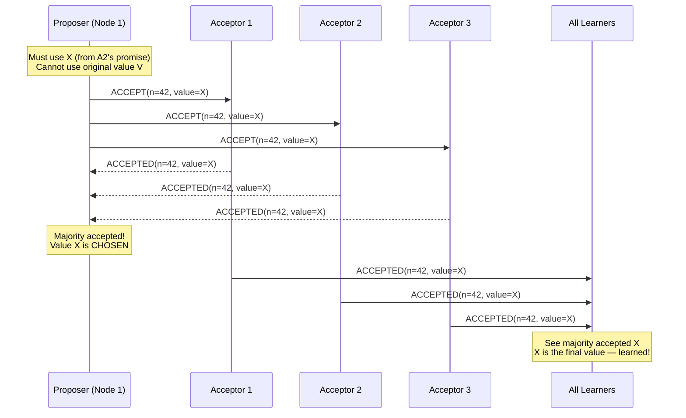
```mermaid
sequenceDiagram
    participant P as Proposer (Node 1)
    participant A1 as Acceptor 1
    participant A2 as Acceptor 2
    participant A3 as Acceptor 3
    participant L as All Learners

    Note over P: Must use X (from A2's promise)<br/>Cannot use original value V

    P->>A1: ACCEPT(n=42, value=X)
    P->>A2: ACCEPT(n=42, value=X)
    P->>A3: ACCEPT(n=42, value=X)

    A1-->>P: ACCEPTED(n=42, value=X)
    A2-->>P: ACCEPTED(n=42, value=X)
    A3-->>P: ACCEPTED(n=42, value=X)

    Note over P: Majority accepted!<br/>Value X is CHOSEN

    A1->>L: ACCEPTED(n=42, value=X)
    A2->>L: ACCEPTED(n=42, value=X)
    A3->>L: ACCEPTED(n=42, value=X)

    Note over L: See majority accepted X<br/>X is the final value — learned!
```

### Why Paxos is Safe (The Key Invariant)

```
Once a value is chosen, NO future proposal can choose a different value.

How? Majority overlap (pigeonhole principle):

If 5 nodes exist:
  First majority: {A, B, C}  (chose value X)
  Second majority: {B, C, D} (any future proposal)
  Overlap: {B, C}

  B and C already accepted X.
  They send X in their PROMISE.
  New proposer MUST propose X.

Result: System is "sticky" — once committed, never changed.
```

### Multi-Paxos: Making Paxos Practical

**Problem:** Basic Paxos reaches consensus on ONE value with 2 round trips. A replicated log needs consensus on THOUSANDS of values — too slow!

**Solution:** Elect a stable leader who skips Phase 1 for subsequent proposals.

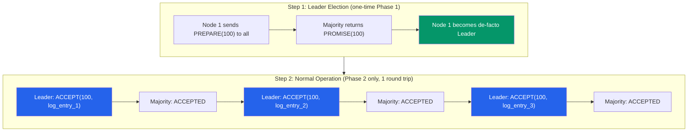
```mermaid
flowchart TB
    subgraph Election["Step 1: Leader Election (one-time Phase 1)"]
        E1["Node 1 sends PREPARE(100) to all"]
        E2["Majority returns PROMISE(100)"]
        E3["Node 1 becomes de-facto Leader"]
        E1 --> E2 --> E3
    end

    subgraph Normal["Step 2: Normal Operation (Phase 2 only, 1 round trip)"]
        N1["Leader: ACCEPT(100, log_entry_1)"]
        N2["Majority: ACCEPTED"]
        N3["Leader: ACCEPT(100, log_entry_2)"]
        N4["Majority: ACCEPTED"]
        N5["Leader: ACCEPT(100, log_entry_3)"]
        N6["Majority: ACCEPTED"]

        N1 --> N2 --> N3 --> N4 --> N5 --> N6
    end

    Election --> Normal

    style E3 fill:#059669,color:#fff
    style N1 fill:#2563eb,color:#fff
    style N3 fill:#2563eb,color:#fff
    style N5 fill:#2563eb,color:#fff
```

**Paxos in the real world:**

| System | Uses Paxos For |
|---|---|
| **Google Chubby** | Distributed lock service, powers BigTable/GFS |
| **Google Spanner** | Replication within each shard |
| **Apache Zookeeper** | ZAB (similar to Multi-Paxos) |

**Problems with Paxos (yahi kyun Raft banaya gaya):**

- Hard to understand even for experts (Lamport himself wrote a simplified version 13 years later)
- Hard to implement correctly — many subtle edge cases
- Original paper doesn't cover: log compaction, membership changes, client interaction
- Multiple "interpretations" of Paxos exist — different teams implement it differently

---

## 8. Raft Algorithm: Paxos Made Understandable {#raft}

**Analogy:** Paxos ek genius professor ki lecture hai — technically correct but samajh nahi aati. Raft usi cheez ko clear textbook style mein explain karta hai. Same guarantees, drastically simpler mental model.

Diego Ongaro aur John Ousterhout ne 2014 mein Raft banaya. Their PhD thesis literally said: **"Paxos is too hard to understand — we built Raft to be understandable."**

**Raft decomposes consensus into three clean problems:**
1. Leader Election — who's in charge?
2. Log Replication — how does data spread?
3. Safety — how do we guarantee nothing bad happens?

### 8.1 Three Roles: Leader, Follower, Candidate

**Analogy:** Ek office ka structure:
- **Leader** = Manager (handles all decisions, delegates to team)
- **Follower** = Employee (does what manager says, raises hand if manager missing)
- **Candidate** = Someone campaigning to be the new manager

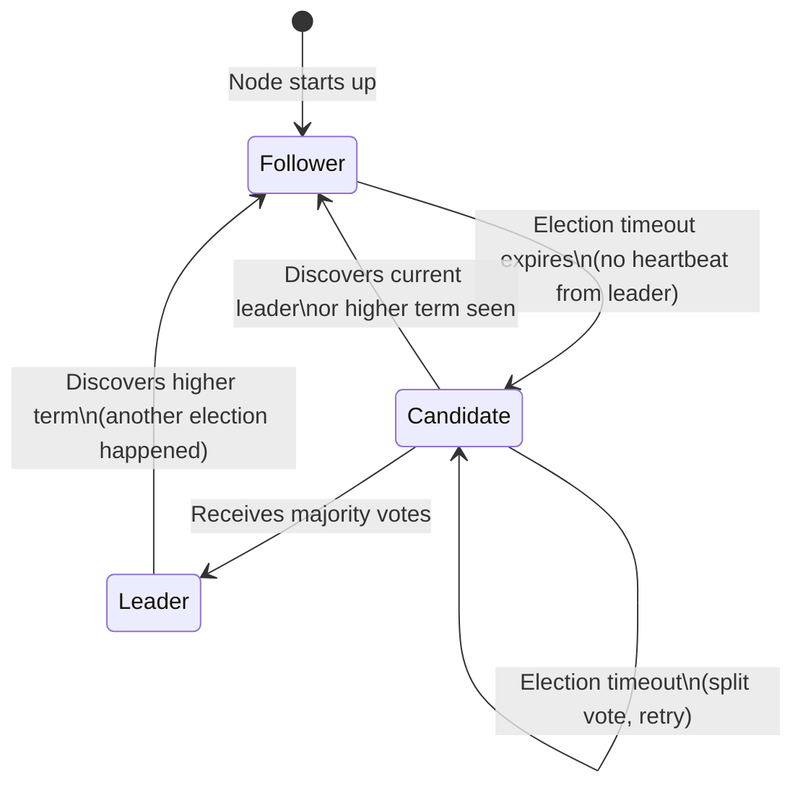
```mermaid
stateDiagram-v2
    [*] --> Follower : Node starts up

    Follower --> Candidate : Election timeout expires\n(no heartbeat from leader)
    Candidate --> Leader : Receives majority votes
    Candidate --> Follower : Discovers current leader\nor higher term seen
    Candidate --> Candidate : Election timeout\n(split vote, retry)
    Leader --> Follower : Discovers higher term\n(another election happened)
```

**Key rule:** At any point in time, there is AT MOST one Leader per Term. Period.

### 8.2 Terms: The Logical Clock

**Analogy:** Think of Terms like "seasons" in a TV show. Season 1, Season 2... Each season has one main character (Leader). If that character dies, Season 2 begins with a new Leader.

```
Term 1    Term 2    Term 3    Term 4    Term 5
──────    ──────    ──────    ──────    ──────
Leader A  Leader B   [No Leader    Leader C  Leader C
                     split vote]
```

**Why Terms matter:**
- Every message carries the sender's current Term number
- If you receive a message with Term > yours → you're outdated, become Follower
- If you receive a message with Term < yours → ignore it (stale leader)
- This prevents "zombie leaders" from causing split-brain

### 8.3 Leader Election: Step by Step

**Analogy:** Ek hostel mein warden chala jaata hai. Kuch time baad, jis student ka patience sabse pehle khatam hota hai, woh "I'll be warden" declare karta hai aur votes maangta hai. Jise majority support milti hai, woh naya warden.

**The randomized timeout trick:** Har node 150ms se 300ms ke beech random wait karta hai. Jo pehle timeout hoga, woh pehle election start karega. Majority chance hai ki ek hi node election start kare — split vote avoid hota hai.

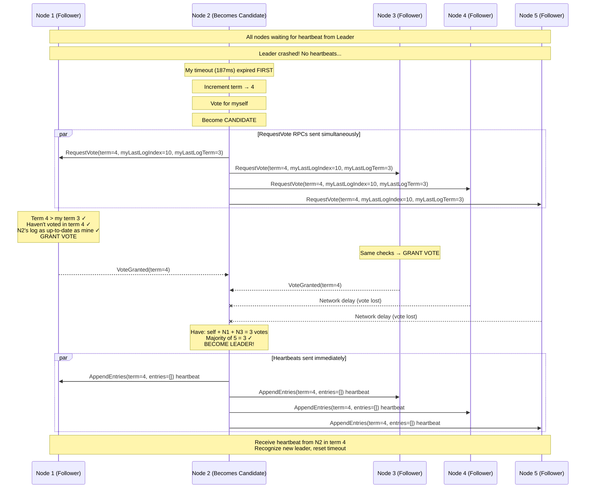
```mermaid
sequenceDiagram
    participant N1 as Node 1 (Follower)
    participant N2 as Node 2 (Becomes Candidate)
    participant N3 as Node 3 (Follower)
    participant N4 as Node 4 (Follower)
    participant N5 as Node 5 (Follower)

    Note over N1,N5: All nodes waiting for heartbeat from Leader
    Note over N1,N5: Leader crashed! No heartbeats...

    Note over N2: My timeout (187ms) expired FIRST
    Note over N2: Increment term → 4
    Note over N2: Vote for myself
    Note over N2: Become CANDIDATE

    par RequestVote RPCs sent simultaneously
        N2->>N1: RequestVote(term=4, myLastLogIndex=10, myLastLogTerm=3)
        N2->>N3: RequestVote(term=4, myLastLogIndex=10, myLastLogTerm=3)
        N2->>N4: RequestVote(term=4, myLastLogIndex=10, myLastLogTerm=3)
        N2->>N5: RequestVote(term=4, myLastLogIndex=10, myLastLogTerm=3)
    end

    Note over N1: Term 4 > my term 3 ✓<br/>Haven't voted in term 4 ✓<br/>N2's log as up-to-date as mine ✓<br/>GRANT VOTE

    Note over N3: Same checks → GRANT VOTE

    N1-->>N2: VoteGranted(term=4)
    N3-->>N2: VoteGranted(term=4)
    N4--xN2: Network delay (vote lost)
    N5--xN2: Network delay (vote lost)

    Note over N2: Have: self + N1 + N3 = 3 votes<br/>Majority of 5 = 3 ✓<br/>BECOME LEADER!

    par Heartbeats sent immediately
        N2->>N1: AppendEntries(term=4, entries=[]) heartbeat
        N2->>N3: AppendEntries(term=4, entries=[]) heartbeat
        N2->>N4: AppendEntries(term=4, entries=[]) heartbeat
        N2->>N5: AppendEntries(term=4, entries=[]) heartbeat
    end

    Note over N1,N5: Receive heartbeat from N2 in term 4<br/>Recognize new leader, reset timeout
```

**Voting rules — a node grants vote ONLY IF:**

```
1. Candidate's term >= voter's current term
2. Voter hasn't already voted in this term (first-come first-served)
3. Candidate's log is "at least as up-to-date" as voter's log:
   → Candidate's last log TERM is higher, OR
   → Candidate's last log TERM equals voter's AND candidate's log is longer

Rule #3 is CRITICAL: prevents nodes with stale logs from becoming leader
and accidentally overwriting committed entries.
```

**What is a "split vote"?**

```
5 nodes, two candidates start election simultaneously:
  Candidate A gets: A, B (2 votes)
  Candidate B gets: C, D (2 votes)
  Node E: timed out or partitioned

Neither gets majority (need 3). Both election timeouts fire again.
But — timeouts are RANDOMIZED. One will fire before the other.
That one campaigns, gets majority, becomes leader.

Probability of repeated split votes: exponentially low.
```

### 8.4 Log Replication: The Heart of Raft

**Analogy:** Leader ek manager hai jo sab kuch apni diary mein likhta hai pehle. Phir assistants (followers) ko copy bhejta hai. Jab majority assistants confirm karein ki unhone copy kar li — tab manager officially announce karta hai ki "yeh decision final hai."

```
Log structure:
─────────────────────────────────────────────────────────
Index:  1    2    3    4    5    6    7    8    9   10
Term:   1    1    1    2    2    3    3    3    3    3
Cmd:   x=1  y=2  z=3  x=4  y=5  x=6  y=7  z=8  a=1  b=2
        └────────committed──────────┘  └──not committed yet─┘

commitIndex = 6  (majority of followers have entries 1-6)
lastApplied = 6  (entries 1-6 applied to state machine)
```

**The replication flow — step by step:**

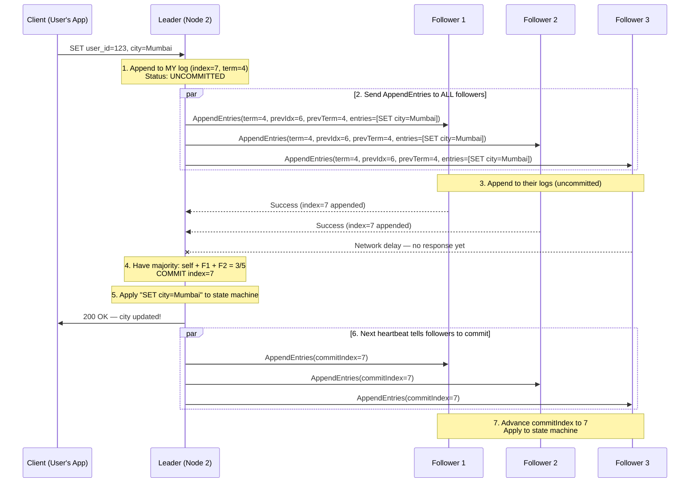
```mermaid
sequenceDiagram
    participant C as Client (User's App)
    participant L as Leader (Node 2)
    participant F1 as Follower 1
    participant F2 as Follower 2
    participant F3 as Follower 3

    C->>L: SET user_id=123, city=Mumbai

    Note over L: 1. Append to MY log (index=7, term=4)<br/>   Status: UNCOMMITTED

    par 2. Send AppendEntries to ALL followers
        L->>F1: AppendEntries(term=4, prevIdx=6, prevTerm=4, entries=[SET city=Mumbai])
        L->>F2: AppendEntries(term=4, prevIdx=6, prevTerm=4, entries=[SET city=Mumbai])
        L->>F3: AppendEntries(term=4, prevIdx=6, prevTerm=4, entries=[SET city=Mumbai])
    end

    Note over F1,F3: 3. Append to their logs (uncommitted)

    F1-->>L: Success (index=7 appended)
    F2-->>L: Success (index=7 appended)
    F3--xL: Network delay — no response yet

    Note over L: 4. Have majority: self + F1 + F2 = 3/5<br/>   COMMIT index=7

    Note over L: 5. Apply "SET city=Mumbai" to state machine

    L->>C: 200 OK — city updated!

    par 6. Next heartbeat tells followers to commit
        L->>F1: AppendEntries(commitIndex=7)
        L->>F2: AppendEntries(commitIndex=7)
        L->>F3: AppendEntries(commitIndex=7)
    end

    Note over F1,F3: 7. Advance commitIndex to 7<br/>   Apply to state machine
```

**AppendEntries RPC contains:**

```
term:          Leader's current term
leaderId:      Followers use to redirect clients
prevLogIndex:  Index of entry BEFORE new ones (consistency check)
prevLogTerm:   Term of that previous entry (consistency check)
entries[]:     New log entries (empty = heartbeat only)
leaderCommit:  Leader's current commitIndex
```

**Follower's consistency check:**

The `prevLogIndex + prevLogTerm` pair acts like a "checksum of history." If a follower's log at that position has a DIFFERENT term → something diverged → reject. Leader then backs up and finds where they agree.

### 8.5 Handling Log Inconsistencies After Crash

**Analogy:** Boss was absent for a week (crashed). In that time, temporary boss made some decisions. Now real boss is back with correct decisions. Temporary boss's decisions need to be overwritten.

```
Scenario: Leader crashed, new leader elected in term 6

New Leader (term 6):
Log: [1,1,1,2,2,3,3,4,4,5,5,6,6]

Follower A (was in sync): matches leader ✓

Follower B (missed recent entries):
Log: [1,1,1,2,2,3,3,4,4]
→ Leader sends missing entries 10-13

Follower C (had uncommitted entries from old leader):
Log: [1,1,1,2,2,3,3,4,4,5,5,5,5,5]
                              ↑ these were never committed
→ Leader overwrites with correct entries

Follower D (way behind):
Log: [1,1,1,2,2]
→ Leader walks back, finds match point, sends all missing entries
```

**Leader uses `nextIndex[]` per follower:**

```
Initial: nextIndex[each follower] = leader's last log index + 1

If AppendEntries rejected (prevLogIndex/prevLogTerm mismatch):
  → Decrement nextIndex for that follower
  → Retry with earlier prevLogIndex

Optimization: Follower returns (conflictTerm, firstIndexInConflictTerm)
  Leader jumps back to start of that term — fewer round trips
```

### 8.6 Network Partition: Safety Guaranteed

**Analogy:** Ek office mein power cut ki wajah se 2 floors disconnect ho gayi (partition). Floor A mein 2 log hain, Floor B mein 3 log. Important decisions sirf Floor B wale le sakte hain (majority). Floor A wale baith rahe hain — koi decision nahi.

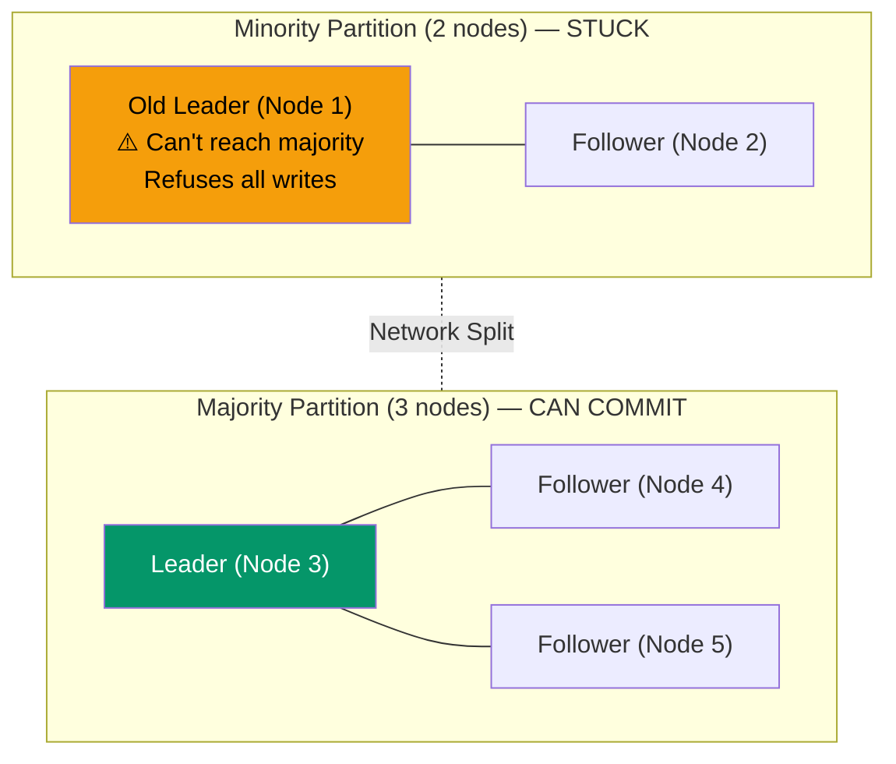
```mermaid
graph TB
    subgraph PartitionB["Majority Partition (3 nodes) — CAN COMMIT"]
        LB["Leader (Node 3)"]
        F4["Follower (Node 4)"]
        F5["Follower (Node 5)"]
        LB --- F4
        LB --- F5
    end

    subgraph PartitionA["Minority Partition (2 nodes) — STUCK"]
        N1["Old Leader (Node 1)\n⚠️ Can't reach majority\nRefuses all writes"]
        N2["Follower (Node 2)"]
        N1 --- N2
    end

    PartitionA -.-|"Network Split"| PartitionB

    style LB fill:#059669,color:#fff
    style N1 fill:#f59e0b,color:#000
```

**What happens in the minority partition:**

- Old leader (Node 1) tries to commit writes
- Sends AppendEntries to followers — gets only N2's ack (1 + 1 = 2, not majority of 5)
- Refuses to commit — correctly returns error to clients
- This is the right behavior — safety is preserved

**When partition heals:**

- Old leader (Node 1) receives heartbeat from Node 3 with term > its own
- Old leader steps down immediately, becomes Follower
- Log is repaired to match new leader's log
- Uncommitted entries are overwritten — this is correct, they were never committed

### 8.7 Log Compaction (Snapshots)

**Problem:** Raft log grows forever. A system running for years would have billions of log entries. New node joining would take years to replay.

**Solution:** Periodically take a snapshot — a point-in-time capture of the entire state machine. Then delete all log entries before that snapshot.

```
Before snapshot:
Log: [x=1, y=2, x=4, z=3, y=7, x=9, z=5]  (7 entries)

After snapshot at index 7:
Snapshot: {x:9, y:7, z:5}  (current state)
Log: []  (cleared)

New node joining:
1. Receive snapshot via InstallSnapshot RPC
2. Apply snapshot (fast — just copy the state)
3. Replay only new entries after snapshot
```

---

## 9. etcd and ZooKeeper: Consensus in Production {#etcd-zookeeper}

### etcd: Raft in Production

**Analogy:** etcd ek super-reliable diary hai jo pure cluster ko yaad rakhti hai — "kaun sa pod kaun se node pe hai, kaun sa service kaun se IP se accessible hai." Aur yeh diary Raft se guarantee karti hai ki saari copies identical hain.

**etcd architecture:**

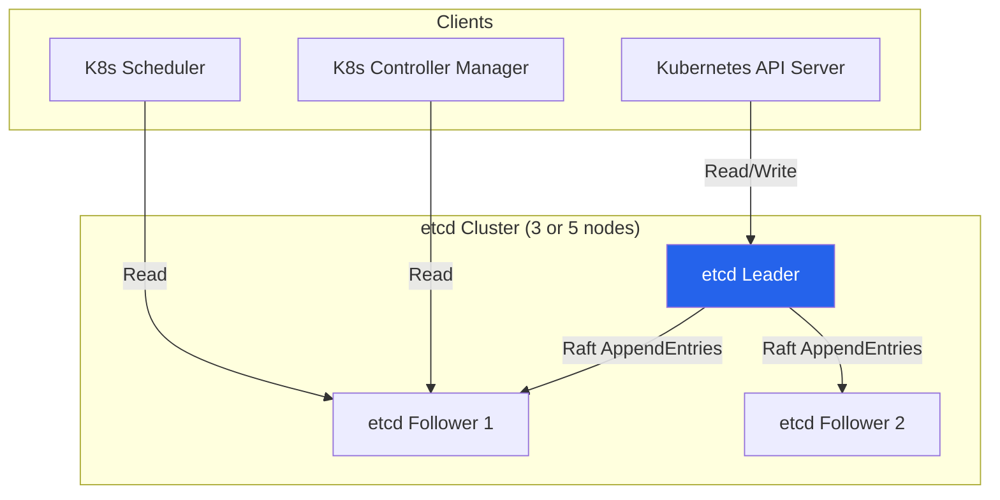
```mermaid
graph TB
    subgraph etcd_cluster["etcd Cluster (3 or 5 nodes)"]
        EL["etcd Leader"]
        EF1["etcd Follower 1"]
        EF2["etcd Follower 2"]

        EL -->|"Raft AppendEntries"| EF1
        EL -->|"Raft AppendEntries"| EF2
    end

    subgraph clients["Clients"]
        K8s["Kubernetes API Server"]
        KCM["K8s Controller Manager"]
        KSched["K8s Scheduler"]
    end

    K8s -->|"Read/Write"| EL
    KCM -->|"Read"| EF1
    KSched -->|"Read"| EF1

    style EL fill:#2563eb,color:#fff
```

**What etcd stores for Kubernetes:**

```
/registry/pods/default/nginx-pod          → pod spec
/registry/services/default/my-service     → service definition
/registry/deployments/default/app         → deployment spec
/registry/nodes/worker-1                  → node info
/registry/namespaces/production           → namespace
```

**etcd guarantees:**
- **Linearizable writes**: All writes go through leader, ordered globally
- **Watch API**: Subscribe to key changes (how K8s controllers react to state changes)
- **Leases**: TTL-based keys that auto-expire (used for leader election by K8s controllers)
- **Transactions**: Compare-and-swap atomically

**etcd leader election pattern (used by K8s controllers):**

```
1. Controller A tries:
   PUT /registry/controllers/leader
   value="controller-A"
   lease=15s
   IF NOT EXISTS (atomic)

2. If succeeds → Controller A is leader, renews every 10s

3. If Controller A crashes → lease expires in 15s → key deleted

4. Controller B watching /registry/controllers/leader sees deletion
   → B tries to acquire → becomes new leader

This is exactly how Kubernetes controller-manager works!
```

### ZooKeeper: The Original Coordinator

**Analogy:** ZooKeeper ek centralized secretary hai jo sab distributed systems ke liye appointments, bookings aur records maintain karta hai. Kafka kab start hota hai, kaun sa Kafka broker leader hai — sab kuch ZooKeeper ke pass.

**ZooKeeper uses ZAB (ZooKeeper Atomic Broadcast)** — similar to Multi-Paxos but optimized for ZooKeeper's use case.

**ZAB vs Raft difference:**

```
ZAB phases:
  Phase 0: Leader Election
  Phase 1: Discovery (new leader learns latest state)
  Phase 2: Synchronization (align all followers)
  Phase 3: Broadcast (normal operation)

Raft: Leader Election + Log Replication (cleaner decomposition)
```

**ZooKeeper data model — it's a filesystem-like tree:**

```
/
├── /kafka/
│   ├── /kafka/brokers/
│   │   ├── /kafka/brokers/ids/1   (ephemeral — broker 1 alive)
│   │   ├── /kafka/brokers/ids/2   (ephemeral — broker 2 alive)
│   │   └── /kafka/brokers/ids/3
│   ├── /kafka/controller           (ephemeral — who is Kafka controller)
│   └── /kafka/topics/my-topic/
│       └── partitions/0/state      (who is partition 0 leader)
├── /hadoop/
└── /hbase/
```

**Ephemeral nodes** — automatically deleted when the creating session dies. This is how ZooKeeper detects failures — if a broker crashes, its ephemeral node disappears.

**ZooKeeper's consistency model (important interview topic):**

| Operation | Consistency | Who Handles It |
|---|---|---|
| Writes | Linearizable (goes to leader) | Leader only |
| Reads | Sequential consistency (may be stale) | Any follower |
| Sync + Read | Linearizable | Leader (sync forces update) |

This is why ZooKeeper can serve reads from followers — higher throughput but potentially slightly stale. For most coordination tasks (like "is broker 2 alive?"), slightly stale is fine.

**Performance:**
```
Reads:  100k+ ops/sec (from any follower, local disk)
Writes: ~10-20k ops/sec (go through leader, 2-phase commit via ZAB)
```

---

## 10. Kafka and KRaft: Moving Away from ZooKeeper {#kafka-kraft}

### Kafka's Original Architecture with ZooKeeper

**Analogy:** Imagine Kafka ek busy train network hai. ZooKeeper ek central railway control room tha jo track karta tha — kaun si train (broker) kaun si platform (partition) pe hai aur kab.

**What ZooKeeper did for Kafka:**

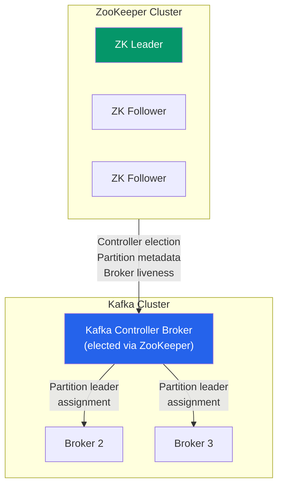
```mermaid
graph TB
    subgraph ZK["ZooKeeper Cluster"]
        ZL["ZK Leader"]
        ZF1["ZK Follower"]
        ZF2["ZK Follower"]
    end

    subgraph Kafka["Kafka Cluster"]
        KC["Kafka Controller Broker\n(elected via ZooKeeper)"]
        B2["Broker 2"]
        B3["Broker 3"]
    end

    ZK -->|"Controller election\nPartition metadata\nBroker liveness"| KC
    KC -->|"Partition leader\nassignment"| B2
    KC -->|"Partition leader\nassignment"| B3

    style KC fill:#2563eb,color:#fff
    style ZL fill:#059669,color:#fff
```

**The Kafka Controller role:**

- One Kafka broker is elected "Controller" via ZooKeeper
- Controller watches ZooKeeper for broker liveness (ephemeral nodes)
- When a broker dies, Controller reassigns its partition leaders
- This involves thousands of ZooKeeper writes — slow for large clusters

**Problems with ZooKeeper-based Kafka:**

```
1. Operational complexity: Run and maintain BOTH Kafka AND ZooKeeper clusters
2. Slow controller failover: New controller must read ALL partition state from ZooKeeper
   → With 1M partitions, this takes minutes
3. ZooKeeper metadata bottleneck: All partition changes go through ZooKeeper writes
4. Separate security models: Configure ACLs for both ZK and Kafka
5. Scale limits: ZooKeeper struggles above ~200k partitions
```

### KRaft: Kafka Removes ZooKeeper

**KIP-500** (Kafka Improvement Proposal 500) — released in Kafka 2.8 (2021), production-ready in 3.3 (2022).

**KRaft = Kafka + Raft.** Kafka now runs its own internal Raft implementation for metadata consensus.

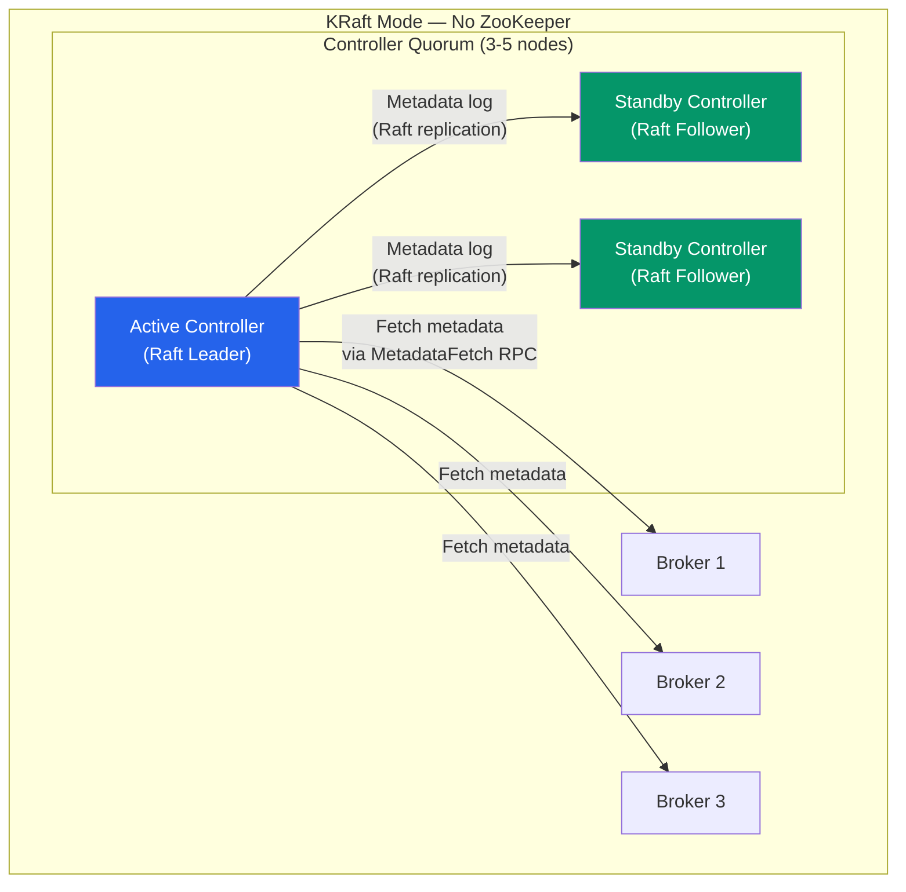
```mermaid
graph TB
    subgraph KRaft["KRaft Mode — No ZooKeeper"]
        subgraph Controllers["Controller Quorum (3-5 nodes)"]
            AC["Active Controller\n(Raft Leader)"]
            SC1["Standby Controller\n(Raft Follower)"]
            SC2["Standby Controller\n(Raft Follower)"]

            AC -->|"Metadata log\n(Raft replication)"| SC1
            AC -->|"Metadata log\n(Raft replication)"| SC2
        end

        B1["Broker 1"]
        B2["Broker 2"]
        B3["Broker 3"]

        AC -->|"Fetch metadata\nvia MetadataFetch RPC"| B1
        AC -->|"Fetch metadata"| B2
        AC -->|"Fetch metadata"| B3
    end

    style AC fill:#2563eb,color:#fff
    style SC1 fill:#059669,color:#fff
    style SC2 fill:#059669,color:#fff
```

**Key difference in KRaft:**

```
Old way (ZooKeeper): Partition metadata stored in ZooKeeper znodes
  → 1M partitions = 1M ZK writes on broker failure

New way (KRaft): Metadata stored in a Raft-replicated event log
  → Controller failure: new controller REPLAYS the log
  → Sub-second failover instead of minutes
  → 10x-100x more partitions possible
```

**KRaft timeline:**
- Kafka 2.8 (2021): KRaft preview
- Kafka 3.3 (2022): KRaft production-ready
- Kafka 3.7 (2024): ZooKeeper mode deprecated
- Future: ZooKeeper mode removed entirely

> Real example: Uber, LinkedIn (Kafka's creators), Confluent — all migrating to KRaft for the operational simplicity and scale improvements.

---

## 11. Kubernetes and etcd: Real Stakes {#kubernetes-etcd}

**Why this section exists:** Consensus isn't academic. When Kubernetes uses etcd for cluster state, every running pod, every service, every deployment definition lives in etcd. If etcd goes down or loses data — your entire cluster is gone.

**Kubernetes architecture with etcd:**

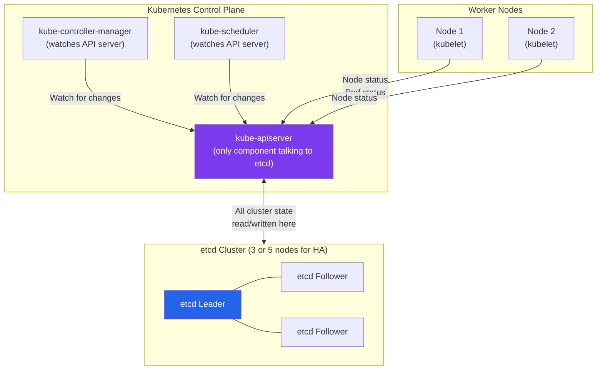
```mermaid
graph TB
    subgraph Control["Kubernetes Control Plane"]
        API["kube-apiserver\n(only component talking to etcd)"]
        CM["kube-controller-manager\n(watches API server)"]
        Sched["kube-scheduler\n(watches API server)"]
    end

    subgraph etcd_cluster["etcd Cluster (3 or 5 nodes for HA)"]
        EL["etcd Leader"]
        EF1["etcd Follower"]
        EF2["etcd Follower"]
        EL --- EF1
        EL --- EF2
    end

    subgraph Workers["Worker Nodes"]
        W1["Node 1\n(kubelet)"]
        W2["Node 2\n(kubelet)"]
    end

    API <-->|"All cluster state\nread/written here"| etcd_cluster
    CM -->|"Watch for changes"| API
    Sched -->|"Watch for changes"| API
    W1 -->|"Node status\nPod status"| API
    W2 -->|"Node status"| API

    style EL fill:#2563eb,color:#fff
    style API fill:#7c3aed,color:#fff
```

**What's stored in etcd:**

```
Everything. Literally everything about your cluster:
- Pod definitions (spec + status)
- Service definitions
- Deployment specs
- ConfigMaps and Secrets
- RBAC roles and bindings
- PersistentVolumeClaims
- Node registrations
- Custom Resource Definitions (CRDs)
```

**What happens if etcd loses quorum:**

```
3-node etcd cluster:
  All 3 alive: writes work, cluster healthy
  1 node down: 2/3 quorum, writes work (can lose 1 more and be stuck)
  2 nodes down: 1/3, NO QUORUM
    → All Kubernetes API writes FAIL
    → New pods can't be scheduled
    → Existing pods keep running (kubelet runs independently)
    → Cluster is read-only from kubectl's perspective
```

**Production etcd best practices:**

```
1. Always run 3 or 5 etcd nodes (odd for majority calculation)
2. Put etcd nodes on separate physical hosts / availability zones
3. Use dedicated SSDs (etcd is I/O sensitive — uses fsync heavily)
4. Regular etcd backups (etcdctl snapshot save)
5. Monitor etcd metrics: leader elections, fsync duration, Raft heartbeats
6. Use hardware with low network latency between etcd nodes (< 10ms ideal)
```

**Real-world etcd failure story:** In 2019, a GitHub production incident caused an etcd leader election storm. During the leader churn, Kubernetes couldn't write state. Thousands of pods appeared "unknown." The fix was tuning etcd election timeouts and heartbeat intervals. This is why consensus tuning matters.

---

## 12. Raft vs Paxos Comparison {#comparison}

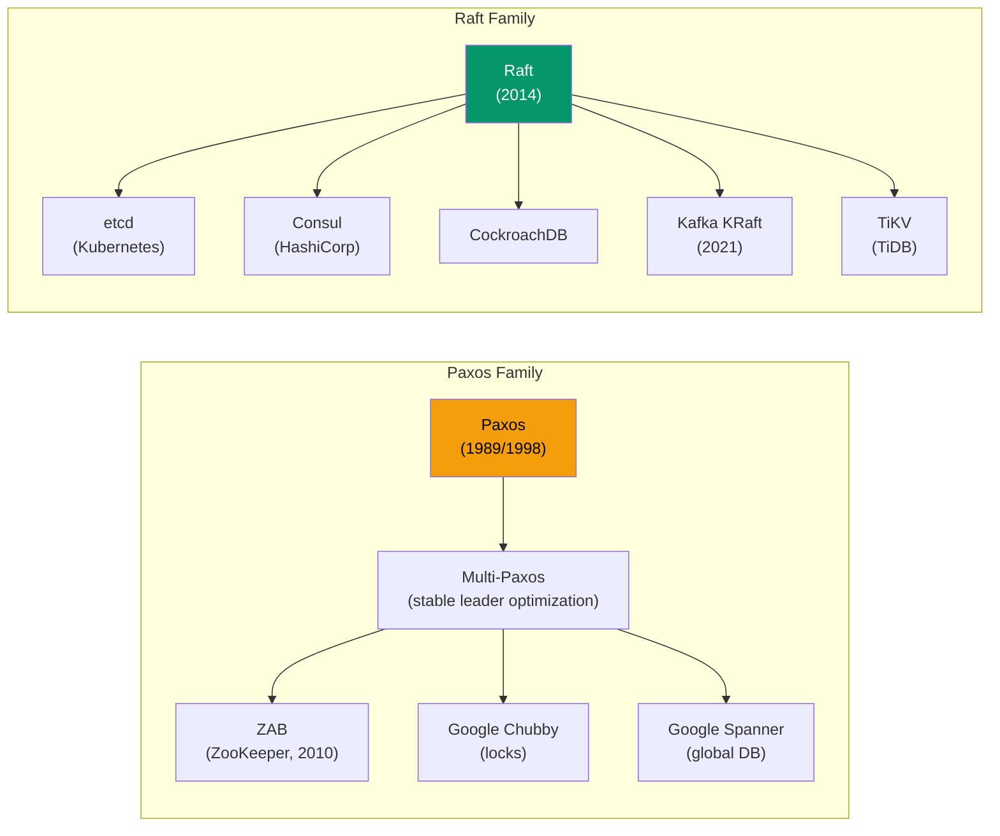
```mermaid
graph LR
    subgraph Paxos_side["Paxos Family"]
        P["Paxos\n(1989/1998)"]
        MP["Multi-Paxos\n(stable leader optimization)"]
        ZAB["ZAB\n(ZooKeeper, 2010)"]
        Chubby["Google Chubby\n(locks)"]
        Spanner["Google Spanner\n(global DB)"]

        P --> MP
        MP --> ZAB
        MP --> Chubby
        MP --> Spanner
    end

    subgraph Raft_side["Raft Family"]
        R["Raft\n(2014)"]
        etcd["etcd\n(Kubernetes)"]
        Consul["Consul\n(HashiCorp)"]
        CDB["CockroachDB"]
        KRaft["Kafka KRaft\n(2021)"]
        TiKV["TiKV\n(TiDB)"]

        R --> etcd
        R --> Consul
        R --> CDB
        R --> KRaft
        R --> TiKV
    end

    style P fill:#f59e0b,color:#000
    style R fill:#059669,color:#fff
```

**Detailed comparison:**

| Aspect | Raft | Paxos (Multi-Paxos) |
|---|---|---|
| **Understandability** | Designed to be understandable | Notoriously difficult |
| **Leader model** | Strong leader — ONLY leader writes log | Weak leader — multiple proposers possible |
| **Log holes** | Not allowed — log must be contiguous | Allowed — holes possible |
| **Election** | Randomized timeouts → simple | Prepare/Promise phases → complex |
| **Normal operation latency** | 1 round trip (leader → followers) | 1 round trip (with Multi-Paxos) |
| **Log repair** | Leader overwrites follower divergence | Complex merge logic |
| **Membership changes** | Joint consensus (2-phase) | Not specified in original paper |
| **Implementation size** | ~2000 lines (reference in Go) | Much larger, subtle edge cases |
| **Formal verification** | TLA+ spec, model-checked by Ongaro | Multiple interpretations exist |
| **Performance** | Equivalent | Equivalent (when optimized) |
| **Real-world usage** | etcd, Consul, CockroachDB, Kafka KRaft | Chubby, Spanner (Google-internal mostly) |

**Bottom line:** Raft and Paxos provide equivalent safety guarantees. Choose Raft for new systems — it's easier to understand, implement, and debug.

---

## 13. Common Interview Questions {#interview-questions}

---

**Q1: What is the Two Generals Problem and why does it matter?**

Two generals communicating over an unreliable channel (messages can be lost) can never guarantee both will attack simultaneously — the last acknowledgment is always uncertain. This proves consensus is impossible with just 2 nodes over an unreliable network. Real systems solve this by using 3+ nodes and requiring a majority (quorum) — if one message is lost, the other 2 can still agree.

---

**Q2: Explain Raft leader election step by step.**

1. All nodes start as Followers with randomized election timeouts (150–300ms)
2. When timeout fires without receiving a heartbeat, node becomes Candidate
3. Candidate increments its Term, votes for itself, sends RequestVote RPC to all
4. Other nodes grant vote if: candidate's term >= theirs, they haven't voted in this term yet, candidate's log is at least as up-to-date as theirs
5. First candidate to get majority (n/2 + 1) votes becomes Leader
6. Leader immediately sends heartbeat (empty AppendEntries) to prevent new elections
7. If split vote: timeout fires, new term, new election (randomization prevents repeated splits)

---

**Q3: How does Raft handle network partitions?**

Raft requires a majority quorum. If a 5-node cluster splits into [A,B] and [C,D,E]:

- Majority partition [C,D,E] elects a new leader, keeps accepting writes
- Minority [A,B]: Old leader tries to commit writes, gets only 1 ack (A+B = 2 of 5), cannot reach majority, refuses all writes — correctly returns error to clients

When partition heals: Old leader sees heartbeat from new leader with higher Term → steps down → log repaired. Safety was never violated: minority never committed anything.

---

**Q4: What's the difference between crash-fault tolerance and Byzantine fault tolerance?**

Crash-fault: nodes fail by stopping (fail-stop model). Easy to detect — no response = dead. Need 2f+1 nodes to tolerate f crashes. Raft and Paxos handle this.

Byzantine fault: nodes behave arbitrarily — send conflicting messages, lie, corrupt data. Could be malicious. Need 3f+1 nodes to tolerate f traitors. PBFT, Tendermint, blockchain consensus handle this.

Most enterprise systems (Kubernetes, Kafka, databases) use crash-fault tolerance only — their nodes run in trusted datacenters and don't need Byzantine protection. Blockchain needs Byzantine because anyone can run a node.

---

**Q5: Explain Paxos prepare/promise and accept/accepted phases.**

Paxos single-value consensus has two phases:

Phase 1 (Prepare/Promise): Proposer generates unique n, sends PREPARE(n) to majority. Each acceptor that hasn't seen a higher n sends back PROMISE: "I won't accept anything < n" plus any value it already accepted. If any promise includes an accepted value, proposer MUST use that value — cannot propose its own.

Phase 2 (Accept/Accepted): Proposer sends ACCEPT(n, value) to majority. Acceptors accept if they haven't promised to ignore this n. When majority accepts, learners learn the chosen value.

Key invariant: Once a value is chosen, any future majority overlaps with the choosing majority. Overlap nodes send the chosen value in their promises. New proposers are forced to re-propose the same value. Nothing gets overwritten.

---

**Q6: Why is etcd critical for Kubernetes and what happens if it goes down?**

etcd stores ALL Kubernetes cluster state: pods, services, deployments, configmaps, secrets, RBAC. The API server is the only component that talks to etcd — all other components go through the API server.

If etcd loses quorum: kube-apiserver cannot process writes. New pods can't be scheduled. Deployments can't be updated. Existing running pods continue (kubelet is independent), but the cluster is effectively read-only. Full cluster state could be lost if etcd data is not backed up.

Production practice: Always run 3 or 5 etcd nodes across availability zones. Take regular snapshots with `etcdctl snapshot save`.

---

**Q7: Why did Kafka move from ZooKeeper to KRaft?**

ZooKeeper problems for Kafka:
- Operational complexity: two separate systems to run and maintain
- Slow controller failover: new controller must read all partition state from ZK (minutes for large clusters)
- Scale limits: ZooKeeper struggles above ~200k partitions
- Separate security models for ZK and Kafka

KRaft solution: Kafka runs its own Raft-based metadata quorum (3-5 controller nodes). Metadata is stored in a Raft-replicated event log. Controller failover is sub-second (replay the log). Supports millions of partitions. One system to secure and operate.

---

**Q8: What is Multi-Paxos and how does it relate to Raft?**

Basic Paxos reaches consensus on one value with 2 round trips (Prepare + Accept). For a replicated log (thousands of entries), this is too slow.

Multi-Paxos: elect a stable leader who runs Phase 1 once (gets majority promises). For all subsequent values, leader skips Phase 1 and goes directly to Phase 2 (Accept only). 1 round trip per log entry in steady state.

This is essentially what Raft's normal operation looks like: Leader directly sends AppendEntries (= Paxos Accept) to followers. Raft's leader election = Multi-Paxos Phase 1. They're equivalent in performance.

---

**Q9: What does "up-to-date log" mean in Raft's election restriction?**

Candidate A's log is "at least as up-to-date" as node B's log if:
- A's last log entry has a HIGHER term than B's, OR
- A's last log entry has the SAME term as B's AND A's log is at least as long

This ensures only nodes with committed entries can become leader. A node with a stale log can't get votes from nodes with newer committed entries — those nodes will correctly refuse because the candidate's log is "behind."

This is Raft's "Leader Completeness" guarantee: any new leader has all committed entries.

---

**Q10: How would you explain consensus to a non-technical person?**

Imagine 5 bank managers must all agree on your loan application before it's approved. They can only communicate by post (letters can get lost). The rule: your loan is approved ONLY when a majority (3 of 5) send you the same answer.

Even if 2 managers' letters get lost, 3 agree → loan approved. If the head manager quits (crashes), the others elect a new head (election). The new head reviews all decisions the old head made and continues from there.

This is exactly how Raft works — replace managers with servers, letters with network messages, loan decision with any distributed decision.

---

## 14. Key Takeaways {#key-takeaways}

```
╔══════════════════════════════════════════════════════════════════╗
║                     KEY TAKEAWAYS                                ║
╠══════════════════════════════════════════════════════════════════╣
║                                                                  ║
║  FUNDAMENTALS                                                    ║
║  • Consensus = all nodes agree on same value despite failures   ║
║  • Two Generals Problem: IMPOSSIBLE with 2 nodes → use 3+       ║
║  • FLP Impossibility: can't have safety+liveness+fault tolerance ║
║    in async network → real systems sacrifice liveness            ║
║  • Crash faults (2f+1 nodes) vs Byzantine faults (3f+1 nodes)  ║
║                                                                  ║
║  PAXOS                                                           ║
║  • Original consensus algorithm (Lamport, 1998)                 ║
║  • Prepare→Promise, Accept→Accepted phases                      ║
║  • Safety via overlapping majorities (chosen value is "sticky") ║
║  • Multi-Paxos: stable leader skips Phase 1 → 1 round trip      ║
║  • Hard to understand & implement → rarely used in new systems  ║
║                                                                  ║
║  RAFT                                                            ║
║  • Designed for understandability (Ongaro & Ousterhout, 2014)  ║
║  • Three roles: Leader (1 per term), Follower, Candidate        ║
║  • Terms = logical clock, prevent zombie leaders                ║
║  • Randomized timeouts → prevent split votes                    ║
║  • Leader election: majority votes, up-to-date log required     ║
║  • Log replication: leader → followers → majority ack → commit  ║
║  • Network partition: minority REFUSES writes (safety first)    ║
║  • Used by: etcd, Consul, CockroachDB, Kafka KRaft, TiKV       ║
║                                                                  ║
║  PRODUCTION SYSTEMS                                              ║
║  • etcd (Raft): all Kubernetes cluster state lives here         ║
║  • ZooKeeper (ZAB): Kafka metadata, Hadoop coordination        ║
║  • Kafka KRaft: Kafka now has its own Raft, no ZK needed       ║
║  • etcd quorum loss = Kubernetes API writes fail               ║
║                                                                  ║
║  DESIGN DECISIONS                                                ║
║  • Use Raft for new systems: understandable, well-tested        ║
║  • 3 nodes: tolerate 1 failure | 5 nodes: tolerate 2 failures  ║
║  • Consensus is CP (sacrifice availability during partitions)   ║
║  • For high availability > consistency → eventual consistency   ║
║    (DynamoDB/Cassandra, not Raft/Paxos)                        ║
║                                                                  ║
╚══════════════════════════════════════════════════════════════════╝
```

---

## Further Reading

- [Replication](../16-replication/README.md) — how consensus relates to database replication
- [CAP Theorem](../07-cap-theorem/README.md) — why consensus systems are CP, not AP
- [Consistency Models](../08-consistency/README.md) — linearizability, sequential consistency
- [Raft Paper](https://raft.github.io/raft.pdf) — original paper by Ongaro & Ousterhout
- [Raft Visualization](https://raft.github.io/) — interactive demo of leader election and log replication
- [etcd Documentation](https://etcd.io/docs/) — production Raft implementation
- [KIP-500](https://cwiki.apache.org/confluence/display/KAFKA/KIP-500) — Kafka's KRaft design

---

*Yeh notes itne comprehensive hain ki interview mein koi bhi consensus-related question aaye, aap confidently answer kar sako. The key: always explain WHY before HOW, aur real examples (Kubernetes, Kafka, Instagram) se ground karo har concept ko.*
