# Message Queues & Kafka — The Complete Guide

> "Yeh topic system design ke sabse important topics mein se ek hai. Almost every large-scale system uses message queues. Agar aap Netflix, Swiggy, ya Zomato jaisa system design karna chahte ho, toh yeh concepts aapko deeply samajhne honge."

---

## Table of Contents

1. [What is a Message Queue? (The Post Office Analogy)](#1-what-is-a-message-queue)
2. [Why Message Queues? Problems Without Them](#2-why-message-queues)
3. [Core Concepts: Producer, Consumer, Broker](#3-core-concepts)
4. [Queue vs Pub/Sub (Topic)](#4-queue-vs-pubsub)
5. [Delivery Guarantees](#5-delivery-guarantees)
6. [Push vs Pull Models](#6-push-vs-pull-models)
7. [Kafka — Deep Dive](#7-kafka-deep-dive)
8. [RabbitMQ — The Flexible Router](#8-rabbitmq)
9. [AWS SQS — The Managed Option](#9-aws-sqs)
10. [Kafka vs RabbitMQ vs SQS — When to Use What](#10-kafka-vs-rabbitmq-vs-sqs)
11. [Message Queue Patterns](#11-message-queue-patterns)
12. [Dead Letter Queue](#12-dead-letter-queue)
13. [Real-World Use Cases](#13-real-world-use-cases)
14. [Common Interview Questions](#14-common-interview-questions)
15. [Key Takeaways](#15-key-takeaways)

---

## 1. What is a Message Queue?

### The Post Office Analogy

Simple baat hai. Imagine you want to send a letter to your friend.

You walk to the **post office**, drop your letter in the box, and **walk away**. You don't wait for your friend to be home. You don't wait for them to read the letter. You don't even wait for the letter to reach them. Aap apna kaam karte ho aur nikal jaate ho.

The **post office** holds the letter. Your friend, whenever they're ready — maybe tonight, maybe tomorrow — goes and picks it up.

**That's a message queue.**

- **You** = Producer (the one sending the message)
- **Post Office** = Message Queue Broker (holds the messages)
- **Friend** = Consumer (processes the message when ready)
- **Letter** = Message

Key insight: **The sender doesn't wait for the receiver.** They are completely decoupled in time.

### In Software Terms

```
WITHOUT message queue (synchronous):
─────────────────────────────────────
Swiggy App  ──calls──▶  Email Service  ──waits──▶  SMS Service
    │                       │
    └── User waits 2 seconds while all this happens

WITH message queue (asynchronous):
────────────────────────────────────
Swiggy App  ──publish──▶  [Message Queue]  ◀── Email Service picks up when ready
    │                                       ◀── SMS Service picks up when ready
    └── User gets response in 50ms!
```

> **Interview Tip:** When asked "what is a message queue?", start with the post office analogy, then map it to producer/broker/consumer. Interviewers love when you ground abstract concepts in real analogies.

---

## 2. Why Message Queues?

### The Problem: Tight Coupling

Yeh kyun important hai? Let's see what happens at Zomato when a user places an order WITHOUT a message queue.

```
User places order on Zomato
         │
         ▼
   Order Service
         │
         ├──synchronously calls──▶ Payment Service   (300ms)
         │                              wait...
         ├──synchronously calls──▶ Email Service     (200ms)
         │                              wait...
         ├──synchronously calls──▶ SMS Service       (150ms)
         │                              wait...
         ├──synchronously calls──▶ Inventory Svc     (100ms)
         │                              wait...
         └──synchronously calls──▶ Analytics Svc     (400ms)
                                        wait...

Total user wait: 300+200+150+100+400 = 1150ms = over 1 second!
```

**Problems with this tight coupling:**

| Problem | What Happens |
|---------|-------------|
| Slow dependency | If Email Service takes 5s, user waits 5s just to place an order |
| Downstream crash | If Analytics Service is down, ORDER PLACEMENT FAILS. User can't order food! |
| Traffic spike | 10,000 orders in 1 minute? Email Service crashes, entire system goes down |
| Adding new service | Want to add a WhatsApp notification? You must modify Order Service code |
| Data loss | If Order Service crashes after payment but before email — no trace of what happened |

### The Solution: Message Queue

```
User places order on Zomato
         │
         ▼
   Order Service
         │
         ├── saves order to DB
         ├── publishes "OrderPlaced" event to queue   (5ms)
         └── returns 201 Created to user             (total: ~50ms!)

Meanwhile, asynchronously:
         ▼
   [Message Queue]
         │
         ├──▶ Payment Service processes payment
         ├──▶ Email Service sends confirmation
         ├──▶ SMS Service sends OTP/confirmation
         ├──▶ Inventory Service updates stock
         └──▶ Analytics Service records the sale
```

### Five Benefits — Explained Deeply

**1. Decoupling**

Producers and consumers don't know about each other. Zomato's Order Service doesn't know if Email Service exists. It just throws a message into the queue. Email Service just reads from the queue. They can be deployed, scaled, or broken independently.

*Real example:* When Zomato added WhatsApp notifications as a new channel, they didn't touch a single line in Order Service. They just added a new consumer that reads from the same queue.

**2. Async Processing (Non-blocking)**

The user gets their "Order Placed!" response in 50ms. They don't wait for the email to be sent, the SMS to be delivered, or analytics to be recorded. All of that happens in the background.

*Real example:* When you upload a video to YouTube, you get "Upload successful!" immediately. But the video is still processing — thumbnail generation, transcoding to different resolutions (360p, 720p, 1080p, 4K) — all of that is happening via a task queue in the background. You don't wait 10 minutes on the upload screen.

**3. Load Leveling (Buffering)**

```
Traffic spike scenario at Swiggy (Friday 8pm dinner rush):

Orders arriving:    ████████████████████  50,000/min
Email Svc capacity: ████████              5,000/min

WITHOUT queue: Email Service gets 10x traffic → crashes → orders fail
WITH queue:    Messages buffer in queue → Email Service processes at its own pace
               → Users get emails within 10 minutes → nobody is blocked
```

*Real example:* Big Billion Days on Flipkart. Millions of orders in minutes. Without queues, every downstream service would immediately collapse. Queues act as shock absorbers.

**4. Retry and Reliability**

If Email Service crashes mid-processing, the message stays in the queue (unacknowledged) and gets redelivered when the service comes back up. No data loss.

**5. Fan-out**

One "OrderPlaced" event reaches Email Service, SMS Service, Inventory Service, Analytics Service, Fraud Detection — all independently and simultaneously. One message, many consumers. This is the pub/sub pattern.

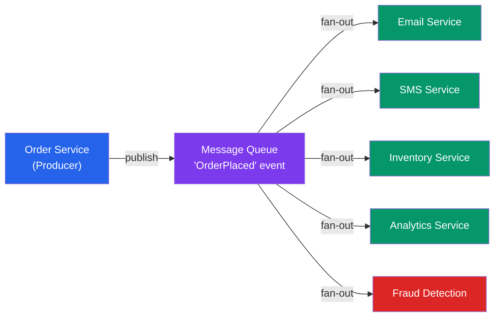

---

## 3. Core Concepts

Basically kya hota hai yeh concepts mein — let's map each one to a real-world Swiggy example.

### Producer

The **producer** creates and sends messages to the queue. It doesn't care who reads them.

- *Swiggy example:* The Order Service is the producer. When you place an order, it publishes an `OrderPlaced` event.
- *YouTube example:* The Upload Service is the producer. When you upload a video, it publishes a `VideoUploaded` event with the S3 path.

### Consumer

The **consumer** reads messages from the queue and processes them. It doesn't know who sent the messages.

- *Swiggy example:* Email Service, SMS Service, and Inventory Service are all consumers. Each independently picks up `OrderPlaced` events and processes them.

### Broker

The **broker** is the middleware — the actual queue system. It stores messages, routes them, and manages delivery.

- Examples: Apache Kafka, RabbitMQ, AWS SQS, Google Pub/Sub, Azure Service Bus

### Queue

A **queue** is a line of messages. Like a ticket line at a movie theater — First In, First Out (FIFO). In a basic queue, **each message is consumed by exactly one consumer.** If you have 3 workers reading from the same queue, the work gets distributed among them.

### Topic

A **topic** is a category or channel of messages. Multiple consumers can subscribe to a topic, and **each subscriber gets a copy of every message.** Think of it like a newspaper — when the Times of India publishes an edition, everyone who subscribed gets their own copy.

### Partition

A topic can be split into **partitions** for scalability. Each partition is like a separate lane on a highway. Multiple partitions = parallel processing = higher throughput.

*Kafka only.* More on this in the Kafka deep dive.

### Consumer Group

A **consumer group** is a set of consumers that work together to consume a topic. Each partition is assigned to exactly one consumer within the group, but different groups can consume the same topic independently and at their own pace.

*Think of it as:* Two different teams (Email team and Analytics team) both reading the same newspaper, but each team gets their own copy.

### Offset

An **offset** is a pointer that says "I've read up to message #47 in this partition." The consumer manages its own offset. This is a Kafka concept — it allows consumers to replay old messages by resetting their offset.

```
Partition 0 (ordered log):
  [msg 0] [msg 1] [msg 2] [msg 3] [msg 4] [msg 5] [msg 6] ...
                                              ▲
                                         Consumer offset = 4
                                    (means: I've read up to msg 3,
                                     msg 4 onwards is unread)
```

---

## 4. Queue vs Pub/Sub

This is a VERY common interview question. Let's nail it.

### Queue: One Consumer Gets Each Message

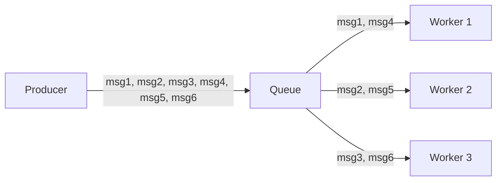

- Message is removed from queue once consumed by one worker
- Used for **load balancing** work across multiple workers
- If Worker 1 is busy, Worker 2 or 3 picks up the next message

**Use case:** YouTube video processing. When you upload a video, a message goes into a work queue. One of many transcoding workers picks it up, transcodes the video, and removes the message. The same video should NOT be transcoded twice — that would waste resources.

### Pub/Sub (Topic): ALL Subscribers Get Each Message

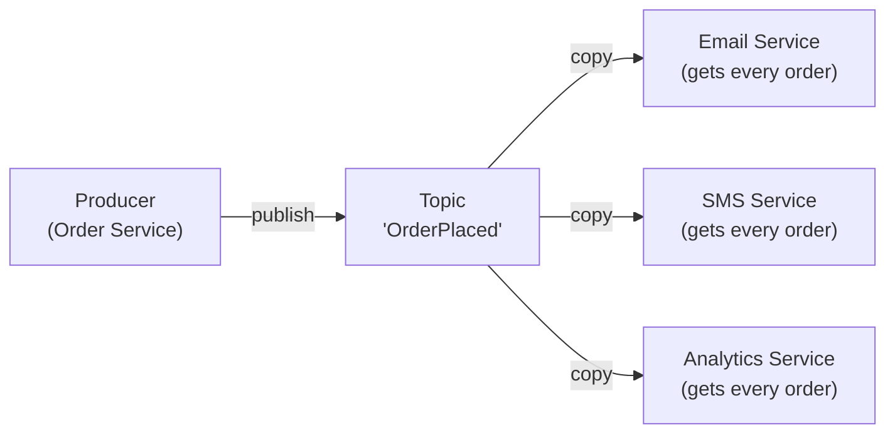

- Every subscriber gets a full copy of every message
- Used for **fan-out** — one event triggers many independent reactions
- Adding a new subscriber doesn't affect the producer or existing subscribers

**Use case:** Instagram. When a celebrity posts a photo, Pub/Sub sends the event to: notification service (to notify followers), feed generation service (to add post to followers' feeds), analytics service (to count impressions), content moderation service (to scan for violations). Each gets the same event; each acts independently.

### The Hybrid (Kafka's Superpower)

Kafka supports BOTH patterns simultaneously using **topics + consumer groups**:

- **Multiple partitions + consumer group** → Queue-like behavior (load balancing within the group)
- **Multiple consumer groups** → Pub/Sub-like behavior (each group gets all messages)

```
Topic: "order-placed" (3 partitions)

Consumer Group: "email-workers" (3 consumers)
  → Worker A reads Partition 0  ← queue-like load balancing
  → Worker B reads Partition 1
  → Worker C reads Partition 2

Consumer Group: "analytics" (1 consumer)
  → Analytics reads all 3 partitions  ← gets ALL events, independent of email-workers
```

> **Interview Tip:** "Kafka achieves both queue and pub/sub semantics through consumer groups. Within a group, it's load-balanced. Across groups, it's pub/sub."

---

## 5. Delivery Guarantees

Yeh ek critical concept hai. The question is: what happens if the consumer crashes mid-processing?

### Analogy: Signing a Package Delivery

Imagine a courier (broker) delivers a package (message) to you (consumer).

- **At-most-once:** The courier throws the package at your door and drives away. If it falls in a puddle — too bad.
- **At-least-once:** The courier rings your bell, gives you the package, and waits for you to sign. If you don't sign (crash), they come back and try again. Maybe you get the package twice if the signature got lost.
- **Exactly-once:** The courier uses a magical delivery system that guarantees you receive the package exactly once, no matter what. Very hard to implement in real life.

### At-Most-Once (Fire and Forget)

```
Broker sends message
Consumer receives it
Broker deletes message immediately (no waiting for ACK)
Consumer processes it...
  └── If consumer crashes here → MESSAGE LOST FOREVER
```

**Trade-offs:**
- Pro: Lowest latency, no overhead
- Pro: No duplicate processing ever
- Con: Data loss is possible

**When to use:** Metrics, logs, telemetry — where losing occasional data is acceptable. If you miss 1 in 10,000 page-view events, nobody cares.

*Example:* Netflix sends real-time streaming quality metrics (buffer rate, bitrate drops) via at-most-once. Missing a few doesn't affect the user experience; it just means slightly less precise analytics.

### At-Least-Once (Retry Until ACK)

```
Broker sends message
Consumer receives it
Consumer processes it
Consumer sends ACK to broker
Broker deletes message

If consumer crashes before ACK:
  Broker redelivers → consumer processes again → may process TWICE
```

**The idempotency requirement:** Since messages can be processed twice, your consumer MUST be idempotent — processing the same message twice gives the same result.

```
Examples of idempotent vs non-idempotent:

✅ IDEMPOTENT (safe to do twice):
   "SET user_status = 'VERIFIED' WHERE user_id = 123"
   → Running this 10 times has same effect as running once

   "INSERT INTO notifications (id, msg) VALUES (uuid, 'Order confirmed')
    ON CONFLICT (id) DO NOTHING"
   → Second insert is silently ignored (same UUID = same message)

❌ NOT IDEMPOTENT (dangerous):
   "Charge $10 to card ending in 4242"
   → Two charges = two real money deductions!

✅ MADE IDEMPOTENT:
   "Charge $10 with idempotency_key='order-456-payment-1'"
   → Payment provider checks: if this key was already charged, skip
```

**When to use:** Most business events — orders, notifications, user signups. 99% of real systems use at-least-once with idempotent consumers.

*Example:* Swiggy order notifications. If the notification goes out twice, user gets two "Your order is confirmed!" messages. Slightly annoying, but not catastrophic. Idempotency key: message_id in a Redis set — if already sent, skip.

### Exactly-Once (The Holy Grail)

**Basically:** Very hard. Almost never truly achieved at the infrastructure layer.

The typical approach is: **at-least-once + idempotent consumer = effectively exactly-once.**

Kafka's approach for true exactly-once (within Kafka):
1. **Idempotent producer:** Each producer gets a unique ID; each message gets a sequence number. Broker deduplicates.
2. **Transactional API:** Consume from one topic + produce to another topic as an atomic transaction. Either both happen or neither does.

```python
# Kafka exactly-once (Python)
producer.init_transactions()
producer.begin_transaction()
try:
    for msg in consumer.poll():
        result = process(msg)
        producer.produce('output-topic', result)
    producer.send_offsets_to_transaction(offsets, consumer_group)
    producer.commit_transaction()
except Exception:
    producer.abort_transaction()
```

**When to use:** Financial transactions, billing, inventory deduction — where duplicates have real money consequences.

**Trade-off:** Significant performance cost (~20-30% throughput reduction), complex to implement, only works within Kafka ecosystem.

---

## 6. Push vs Pull Models

### Push (Broker Pushes to Consumer)

The broker actively delivers messages to the consumer as soon as they arrive. The consumer just sits and waits.

```
Broker: "Hey Consumer, here's a message!" → sends immediately
Consumer: "Got it, processing..."
```

- **Used by:** RabbitMQ, AWS SQS (long polling)
- **Pro:** Low latency — message processed almost immediately
- **Con:** Broker must track consumer capacity; consumer can be overwhelmed

### Pull (Consumer Polls the Broker)

The consumer asks the broker periodically: "Do you have any messages for me?"

```
Consumer: "Any messages?" → poll every 100ms
Broker: "Here's 50 messages!" → returns a batch
Consumer: processes 50 → next poll
```

- **Used by:** Kafka, AWS SQS (default), Amazon Kinesis
- **Pro:** Consumer controls its own rate; can batch efficiently
- **Pro:** Consumer can pause (just stop polling)
- **Con:** Small latency from the poll interval

```python
# Kafka pull pattern
while True:
    records = consumer.poll(timeout_ms=1000, max_records=500)
    for record in records:
        process(record)
    consumer.commit()  # update offset after processing
```

> **Kafka is pull-based.** This is one reason Kafka can handle millions of messages/second — consumers pull at their own pace and batch efficiently. The broker doesn't track consumer state (beyond offsets).

---

## 7. Kafka Deep Dive

### What is Kafka, Really?

First, the analogy. Imagine a **newspaper archive** in a library.

- **Reporters** (producers) write articles and publish them in the newspaper
- The **library** (Kafka broker) stores every newspaper edition, filed by date, indefinitely
- **Readers** (consumers) can come in anytime and read from yesterday's edition, last week's, or last year's
- Multiple readers can read the same newspaper independently — one researcher is at page 3, another is at page 47
- The newspaper is never destroyed just because someone read it

This is fundamentally different from a post-office (traditional queue) where once a letter is picked up, it's gone.

**Kafka is NOT a queue — it's a distributed log (event streaming platform).** Every message is appended to an immutable, ordered log and retained for a configurable period (default: 7 days). Messages aren't deleted when consumed; they're deleted based on time or size.

LinkedIn invented Kafka. They now process **trillions of messages per day** with it.

### Topics and Partitions

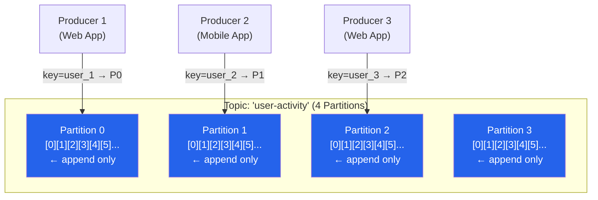

**Why partitions?**
- A single machine can only handle so much throughput
- Partitions spread the load across multiple machines (brokers)
- More partitions = more parallelism = higher throughput
- Kafka can horizontally scale by adding more partitions

**Key property:** Within a single partition, messages are **strictly ordered**. Across partitions, no ordering guarantee.

### Partition Key

The **partition key** determines which partition a message goes to. Kafka hashes the key and assigns it to a partition.

```
key="user_123" → hash → always goes to Partition 2
key="user_456" → hash → always goes to Partition 0
key=null → round-robin across all partitions
```

**Why this matters:** All events for `user_123` always land in Partition 2, in the exact order they occurred. This is critical for event sourcing — you can replay a user's complete activity history in order.

*Real example:* Uber tracks driver location. The partition key is `driver_id`. All location updates for Driver X go to the same partition, guaranteeing they're processed in order. A ride-matching service can see: Driver X was at A, then B, then C — in exact sequence.

### Consumer Groups and the Rebalancing Dance

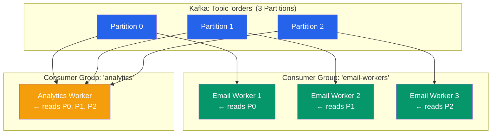

**Rules:**
1. Each partition is consumed by **exactly one consumer** within a consumer group
2. You can have more consumers than partitions — extra consumers sit idle (wasteful)
3. Fewer consumers than partitions — one consumer reads multiple partitions (fine, just less parallelism)
4. Different consumer groups are completely independent — each has its own offset per partition

**Rebalancing:** When a consumer joins or leaves a group, Kafka reassigns partitions. During rebalancing, consumption pauses briefly. This is called a **rebalance**.

### Offset Management

```
Partition 0 log:
  offset 0: {"user":"alice","action":"login"}
  offset 1: {"user":"alice","action":"view_product"}
  offset 2: {"user":"alice","action":"add_to_cart"}
  offset 3: {"user":"alice","action":"checkout"}    ← latest

Consumer Group "email-workers" offset for Partition 0: 2
  → has processed offsets 0, 1 (already done)
  → will next consume offset 2 ("add_to_cart")

Consumer Group "fraud-detection" offset for Partition 0: 0
  → just started, will process from the very beginning
```

Consumers commit their offset after processing. If a consumer crashes at offset 5, it restarts and resumes from offset 5 — messages 0-4 already processed are not re-read (unless you reset the offset deliberately).

**Replay capability:** Reset offset to 0 → process all messages from the beginning. This is incredibly powerful for debugging, re-training ML models on historical data, or backfilling new consumers.

### Message Retention

Kafka retains messages for a **configurable time period** (default: 7 days) or until the log reaches a size limit. After that, old messages are deleted.

```
retention.ms = 604800000   ← 7 days (default)
retention.bytes = -1       ← unlimited size (default)
```

This is what enables:
- A new ML model to be trained on the last 30 days of user events
- A new analytics service to backfill historical data on launch
- Debugging: "Show me everything that happened last Tuesday at 3pm"

### Full Kafka Architecture

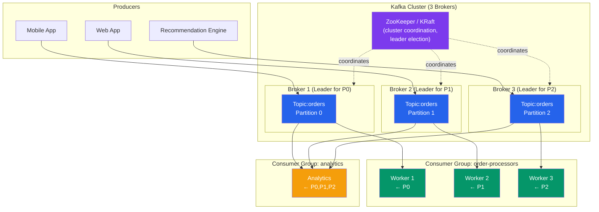

### Kafka Replication

Each partition has one **leader** and N **replicas** (followers). Leaders handle all reads and writes; replicas stay in sync.

```
Partition 0:
  Leader: Broker 1 (serves reads/writes)
  Replica: Broker 2 (synced copy)
  Replica: Broker 3 (synced copy)

If Broker 1 fails → ZooKeeper/KRaft elects Broker 2 as new leader → no data loss
```

Replication factor of 3 = can tolerate 2 broker failures. Standard for production.

### Kafka Code Example

```python
# Kafka Producer (Python - confluent_kafka)
from confluent_kafka import Producer
import json

producer = Producer({
    'bootstrap.servers': 'kafka-broker-1:9092,kafka-broker-2:9092',
    'acks': 'all',                    # wait for all replicas to confirm
    'enable.idempotence': True,       # idempotent producer
    'retries': 5,
})

def delivery_callback(err, msg):
    if err:
        print(f'Message delivery failed: {err}')
    else:
        print(f'Message delivered to {msg.topic()} [{msg.partition()}] @ offset {msg.offset()}')

order_event = {
    'order_id': 'ORD-789',
    'user_id': 'USR-123',
    'total': 450.00,
    'items': ['Biryani', 'Raita'],
    'timestamp': '2026-06-26T19:30:00Z'
}

producer.produce(
    topic='orders',
    key='USR-123',                    # partition key: same user → same partition → ordered
    value=json.dumps(order_event),
    callback=delivery_callback
)
producer.flush()  # wait for delivery

# Kafka Consumer (Python)
from confluent_kafka import Consumer

consumer = Consumer({
    'bootstrap.servers': 'kafka-broker-1:9092',
    'group.id': 'email-notification-workers',
    'auto.offset.reset': 'earliest',  # start from beginning if no committed offset
    'enable.auto.commit': False,      # manual commit for at-least-once
})

consumer.subscribe(['orders'])

try:
    while True:
        msg = consumer.poll(timeout=1.0)
        if msg is None:
            continue
        if msg.error():
            print(f"Consumer error: {msg.error()}")
            continue

        order = json.loads(msg.value().decode('utf-8'))
        send_confirmation_email(order)  # process the message

        consumer.commit(msg)           # commit AFTER processing → at-least-once
finally:
    consumer.close()
```

### Consumer Lag — The Heartbeat of Your Queue

**Consumer lag** = the difference between the latest message in a partition and the consumer's current offset.

```
Partition 0: latest offset = 10,000
Consumer offset: 9,500
Lag: 500 messages behind

Partition 0: latest offset = 10,000
Consumer offset: 3,000
Lag: 7,000 messages behind  ← ALERT! Consumer is severely behind
```

Growing lag = consumers can't keep up with producers. This is one of the most important metrics to monitor in any Kafka deployment.

**Response to growing lag:**
1. Add more consumers (up to the number of partitions)
2. Increase partition count (allows more consumers)
3. Optimize consumer processing logic
4. Check if there's a slow external dependency (DB query, HTTP call inside consumer)

---

## 8. RabbitMQ

### What is RabbitMQ?

The analogy: RabbitMQ is like a **smart post office with a sorting department**. Not only does it hold your letters, it reads the address and forwards it to the right mailbox based on complex routing rules.

RabbitMQ is a traditional message broker built on the **AMQP (Advanced Message Queuing Protocol)**. Unlike Kafka, it's designed for complex message routing rather than high-throughput log streaming.

**Key difference from Kafka:** In RabbitMQ, messages are **deleted once consumed**. There's no log retention, no replay. It's a true queue — once the message is processed and acknowledged, it's gone.

### RabbitMQ Core Model

```
Producer → Exchange → Binding → Queue → Consumer
```

The **Exchange** is the routing brain. It receives messages from producers and decides which queues to route them to, based on routing rules.

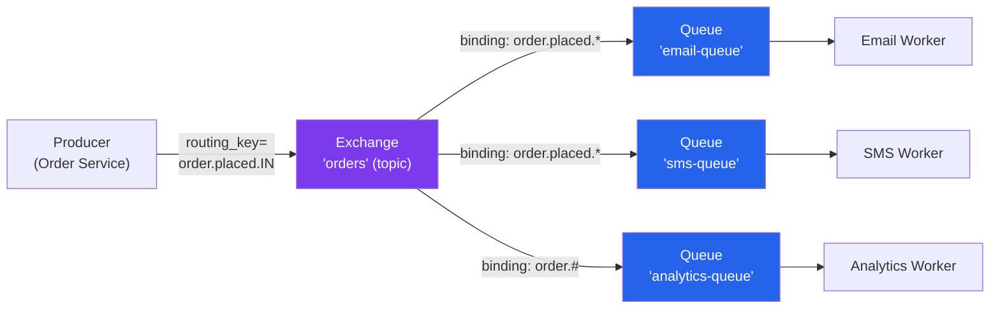

### Exchange Types

| Exchange Type | How it Routes | Use Case |
|--------------|---------------|----------|
| **Direct** | Exact routing_key match | Specific task routing |
| **Topic** | Pattern match (`*` = one word, `#` = zero or more words) | Flexible routing by event type |
| **Fanout** | All bound queues get the message | Broadcast to all consumers |
| **Headers** | Match on message header attributes | Complex attribute-based routing |

**Topic Exchange examples:**

```
routing_key = "order.placed.IN"

Queue bound to "order.placed.*"   → ✅ matches (India orders)
Queue bound to "order.#"          → ✅ matches (all orders)
Queue bound to "order.cancelled.#"→ ❌ no match
Queue bound to "*.placed.*"       → ✅ matches (anything.placed.anything)
```

### Acknowledgements and Reliability

RabbitMQ uses **acknowledgements (ACKs)** for at-least-once delivery:

```python
# RabbitMQ consumer with manual ACK
import pika, json

def callback(ch, method, properties, body):
    try:
        order = json.loads(body)
        send_email(order)
        ch.basic_ack(delivery_tag=method.delivery_tag)   # success → remove from queue
    except Exception as e:
        ch.basic_nack(delivery_tag=method.delivery_tag, requeue=True)  # fail → requeue

channel.basic_qos(prefetch_count=1)  # don't give me more than 1 message until I ACK
channel.basic_consume(queue='email-queue', on_message_callback=callback)
channel.start_consuming()
```

**Negative ACK (NACK):** Consumer signals failure. Message is either requeued or sent to Dead Letter Exchange.

### RabbitMQ vs Kafka: The Key Mental Model

| | RabbitMQ | Kafka |
|--|---------|-------|
| Message after consumption | Deleted | Retained |
| Routing | Complex, flexible | By partition key |
| Replay | Not possible | Yes (by offset) |
| Focus | Routing flexibility | Throughput & streaming |
| Protocol | AMQP | Custom binary |

---

## 9. AWS SQS

### What is SQS?

Analogy: SQS is like a **managed post office where AWS does all the maintenance**. You don't manage servers, scaling, or replication. You just create a queue and start sending/receiving messages.

SQS is Amazon's fully managed queue service. There are no brokers to manage, no servers to patch. You pay per request.

### Standard Queue vs FIFO Queue

| Feature | Standard Queue | FIFO Queue |
|---------|---------------|------------|
| Ordering | Best-effort | Strict FIFO |
| Delivery | At-least-once | Exactly-once (within SQS) |
| Throughput | Nearly unlimited | 3,000 messages/sec |
| Deduplication | Must handle yourself | Built-in (5-min window) |
| Use case | High throughput, order doesn't matter | Order matters (payments, inventory) |

### Visibility Timeout

This is SQS's mechanism for at-least-once delivery.

```
SQS Visibility Timeout mechanism:

1. Consumer polls SQS: "Give me a message"
2. SQS returns message AND makes it INVISIBLE to other consumers for 30 seconds (visibility timeout)
3. Consumer processes the message
4. Consumer deletes the message from SQS
5. Done!

What if consumer crashes at step 3?
  → After 30 seconds, message becomes VISIBLE again
  → Another consumer picks it up
  → At-least-once: message processed again
```

```python
# AWS SQS (Python - boto3)
import boto3, json

sqs = boto3.client('sqs', region_name='ap-south-1')
queue_url = 'https://sqs.ap-south-1.amazonaws.com/123456789/swiggy-orders'

# Producer
sqs.send_message(
    QueueUrl=queue_url,
    MessageBody=json.dumps({
        'order_id': 'ORD-999',
        'user_id': 'USR-456',
        'total': 350.0
    }),
    MessageGroupId='orders',  # FIFO queue only
    MessageDeduplicationId='ORD-999'  # FIFO: prevents duplicates in 5-min window
)

# Consumer
while True:
    response = sqs.receive_message(
        QueueUrl=queue_url,
        MaxNumberOfMessages=10,
        WaitTimeSeconds=20,       # long polling: wait up to 20s for messages
        VisibilityTimeout=60      # 60 seconds to process before message reappears
    )
    for message in response.get('Messages', []):
        order = json.loads(message['Body'])
        process_order(order)
        sqs.delete_message(       # MUST delete after processing
            QueueUrl=queue_url,
            ReceiptHandle=message['ReceiptHandle']
        )
```

---

## 10. Kafka vs RabbitMQ vs SQS

### When to Use What — The Decision Framework

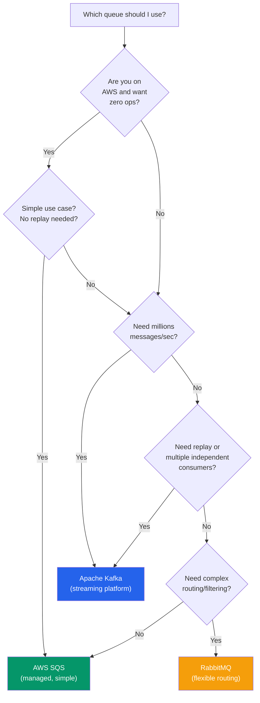

### Comparison Table

| Factor | Kafka | RabbitMQ | AWS SQS |
|--------|-------|----------|---------|
| **Model** | Distributed log (pull) | Broker with exchanges (push) | Managed queue (pull) |
| **Throughput** | Millions/sec | 100k/sec | Millions/sec (managed) |
| **Message retention** | Days/weeks/forever | Until consumed | Up to 14 days |
| **Message replay** | Yes — by offset | No | No |
| **Ordering** | Strict per-partition | Per-queue | Best-effort (FIFO queues: strict) |
| **Routing** | By partition key | Exchanges (complex rules) | Simple, by queue |
| **Multiple consumers** | Yes (consumer groups) | Yes (with fanout exchange) | Yes |
| **Exactly-once** | Within Kafka | No | FIFO queues only |
| **Operational overhead** | High (cluster) | Medium | None (managed) |
| **Message size limit** | 1MB default | 128MB | 256KB |
| **Cost** | Infrastructure + ops | Infrastructure + ops | Pay per request |
| **Learning curve** | Steep | Medium | Low |

### Use Case Guide

**Choose Kafka when:**
- You need event streaming at massive scale (Uber driver locations, Netflix watch events)
- Multiple independent services need to consume the same events
- You need to replay historical events (new service backfill, ML retraining)
- You want a long-term audit log of everything that happened
- You need strict ordering per entity (by partition key)

**Choose RabbitMQ when:**
- You have complex routing requirements (route by event type, country, priority)
- You need task queues with priority levels
- Lower per-message latency matters (RabbitMQ can be faster for small messages)
- You're doing traditional work queue patterns (video encoding jobs, email sending)

**Choose SQS when:**
- You're already on AWS and want zero operational overhead
- Simple async task distribution
- You don't need replay or complex routing
- You need FIFO with exactly-once for ordered processing (use SQS FIFO)

---

## 11. Message Queue Patterns

### Pattern 1: Work Queue (Task Distribution)

The analogy: A restaurant kitchen with one order printer and multiple chefs. Orders come in, each chef picks up the next available order.

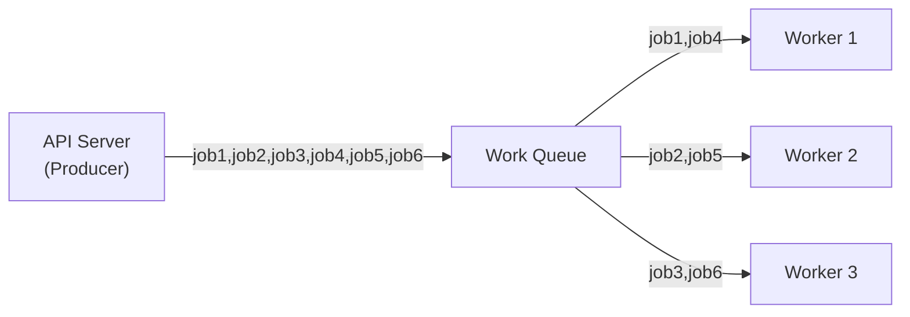

**Real example:** YouTube video transcoding.
1. User uploads video → Upload Service publishes `{"video_id": "xyz", "s3_path": "raw/xyz.mp4"}` to a work queue
2. One of 100 transcoding workers picks it up
3. Worker transcodes to 360p, 720p, 1080p, 4K → uploads to CDN → ACKs
4. Video becomes available

Why not let all workers transcode the same video? Waste of resources. Work queue ensures each job is done exactly once by exactly one worker.

### Pattern 2: Pub/Sub (Event Fan-out)

The analogy: A WhatsApp group broadcast. The admin sends one message; everyone in the group gets a copy.

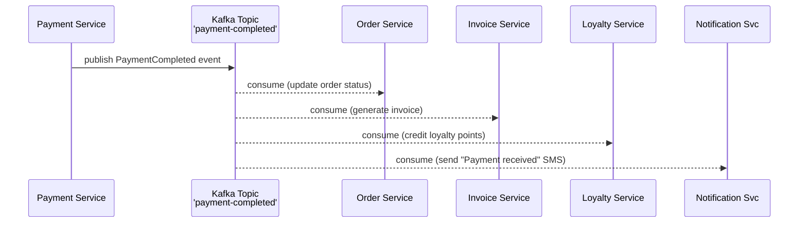

**Real example:** Zomato payment completion.
When a payment succeeds, a single `PaymentCompleted` event fans out to:
- Order Service: mark order as paid
- Invoice Service: generate PDF invoice
- Loyalty Service: credit Zomato points
- Notification Service: SMS "Payment of ₹450 received"

### Pattern 3: Event Sourcing with Kafka

The analogy: A bank ledger. Instead of storing the current balance, you store every transaction. The balance is computed by replaying all transactions.

```
Traditional approach (store current state):
  User account: { balance: 5000 }
  → Update balance when transaction happens

Event Sourcing approach (store events):
  Event log:
    [0] AccountCreated { balance: 0 }
    [1] MoneyDeposited { amount: 10000 }
    [2] MoneyWithdrawn { amount: 3000 }
    [3] MoneyTransferred { amount: 2000 }
    Current balance = 10000 - 3000 - 2000 = 5000

Benefits:
  → Full audit trail of every change
  → Can replay events to reconstruct any past state
  → Debug: "What was the account balance last Tuesday at 2pm?"
  → New feature: build a new aggregate by replaying from offset 0
```

**Real example:** LinkedIn's activity feed is event sourced via Kafka. Every like, comment, share, connection is an event in Kafka. The feed is built by consuming these events. When LinkedIn redesigned their feed algorithm, they replayed historical events to backfill the new experience.

### Pattern 4: Request/Reply via Queue

The analogy: Two-way radio. You send a message, wait for a response on a dedicated reply channel.

```
Client                    Work Queue              Service
  │                           │                      │
  ├─publish request──────────▶│                      │
  │  reply_to="response-q"    │                      │
  │  correlation_id="abc123"  │                      │
  │                           │◀─consume────────────│
  │                           │                      │
  │                           │      process...      │
  │                           │                      │
  │                           │         publish ─────▶ response-q
  │◀──consume from response-q─────────────────────────│
  │   correlation_id="abc123"                         │
  │                                                   │
```

Less common in microservices (direct HTTP is simpler for sync request/reply), but useful when the "server" is a legacy system that only communicates via queue.

### Pattern 5: CQRS with Kafka

Command Query Responsibility Segregation — separate the write model (commands) from the read model (queries).

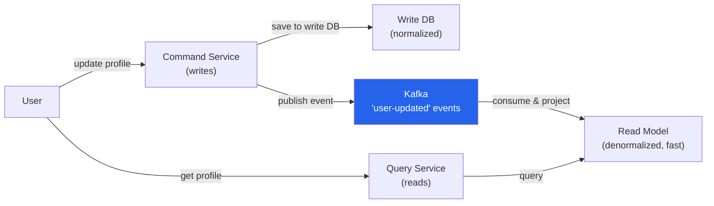

---

## 12. Dead Letter Queue

### What is a Dead Letter Queue (DLQ)?

The analogy: In a post office, if a letter can't be delivered after 3 attempts (wrong address, no one home), it goes to the **returned mail department** — a special shelf where undeliverable mail waits for investigation.

A DLQ is a special queue where messages go when they repeatedly fail processing. Instead of the system retrying forever (causing an infinite loop of failures), failed messages are parked in the DLQ for human investigation.

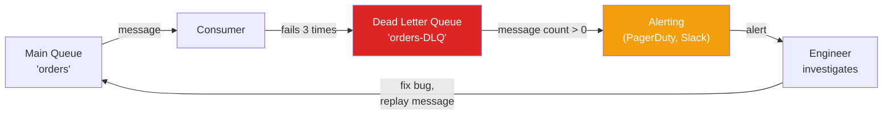

### Why DLQ Matters

Without DLQ:
```
Message arrives → Consumer fails → Message requeued → Consumer fails → requeued → forever
```
This is called a **poison message** — a message that can never be successfully processed (e.g., malformed JSON, a user_id that no longer exists). Without DLQ, it clogs your queue forever.

With DLQ:
```
Message fails 3 times → Auto-moved to DLQ → Alert fires → Engineer investigates
→ Fix the bug → Replay the message from DLQ → Success
```

### DLQ in Practice

**RabbitMQ:**
```python
# Configure DLQ with dead-letter-exchange
channel.queue_declare(
    queue='orders',
    durable=True,
    arguments={
        'x-dead-letter-exchange': 'dlx',   # route failed messages to this exchange
        'x-max-retries': 3                  # after 3 NACKs, go to DLX
    }
)
channel.queue_declare(queue='orders-dlq', durable=True)
channel.queue_bind(exchange='dlx', queue='orders-dlq', routing_key='orders')
```

**AWS SQS:**
```python
# Configure DLQ on source queue
sqs.set_queue_attributes(
    QueueUrl=source_queue_url,
    Attributes={
        'RedrivePolicy': json.dumps({
            'deadLetterTargetArn': 'arn:aws:sqs:ap-south-1:123:orders-dlq',
            'maxReceiveCount': '5'  # after 5 failed receives, move to DLQ
        })
    }
)
```

**Monitoring DLQ:** Set an alarm on `ApproximateNumberOfMessagesVisible > 0` in the DLQ. Any message landing there should wake up an on-call engineer.

### Retry Strategies

Don't just retry immediately — exponential backoff prevents hammering a failing service:

```
Retry 1: wait 1 second
Retry 2: wait 2 seconds
Retry 3: wait 4 seconds
Retry 4: wait 8 seconds
Retry 5: → Dead Letter Queue

Total wait before DLQ: 15 seconds (not 5 immediate hammers)
```

---

## 13. Real-World Use Cases

### Uber — Kafka for Driver Location Events

Uber processes **millions of driver location updates per second** globally.

Every driver's phone sends a GPS update every 4 seconds. With millions of drivers:
- 1M drivers × (1/4 updates/sec) = 250,000 location events/second
- Each event needs to reach: ride-matching service, surge pricing calculator, ETA predictor, map display

**Kafka setup:**
- Topic: `driver-locations`
- Partition key: `driver_id` → ensures all updates for one driver are ordered
- Consumer Groups:
  - `ride-matching`: reads all partitions, matches riders to nearby drivers
  - `surge-pricing`: aggregates density per zone, calculates surge multiplier
  - `eta-predictor`: uses location history to predict arrival times
  - `fraud-detection`: detects anomalies (GPS spoofing, impossible speeds)

Without Kafka, coordinating this fan-out at this scale would require each consumer to call a centralized location API — which would collapse under load.

### LinkedIn — The Birthplace of Kafka

LinkedIn invented Kafka in 2010. They needed to stream activity events — profile views, job applications, connection requests, feed interactions — across multiple data centers.

**The problem they faced:** They had 60+ distinct data pipelines, each pulling data differently. Adding a new metric required modifying multiple pipelines.

**Kafka solution:**
- Every activity event goes into Kafka topics
- Any new consumer subscribes to the relevant topic
- Old consumers continue unchanged

Today LinkedIn processes **7 trillion messages per day** with Kafka.

### Netflix — Multi-Region Event Streaming

Netflix uses Kafka for:
- **Member activity events:** What you watched, when you paused, what quality
- **Error tracking:** If your stream buffers, an event fires. Teams monitor error rate in real-time
- **Recommendation engine:** Your viewing history → Kafka → ML pipeline → personalized homepage
- **Content delivery optimization:** Which CDN server to route you to, based on current load events

Netflix's Kafka cluster spans multiple AWS regions with cross-region replication for disaster recovery.

### WhatsApp / Instagram — Message Delivery

WhatsApp uses a custom message broker based on XMPP/Erlang, but the pattern is identical to a queue:

1. You send a message → goes into a queue per-recipient
2. If your friend is offline, the message sits in the queue
3. When they come online, the queue drains — they get all messages in order
4. Double tick (delivered) = message left the queue. Blue tick (read) = friend's app acknowledged

Instagram's Direct Messages use a similar pattern built on a distributed queue, scaled to billions of messages per day.

### Swiggy — Order Processing Pipeline

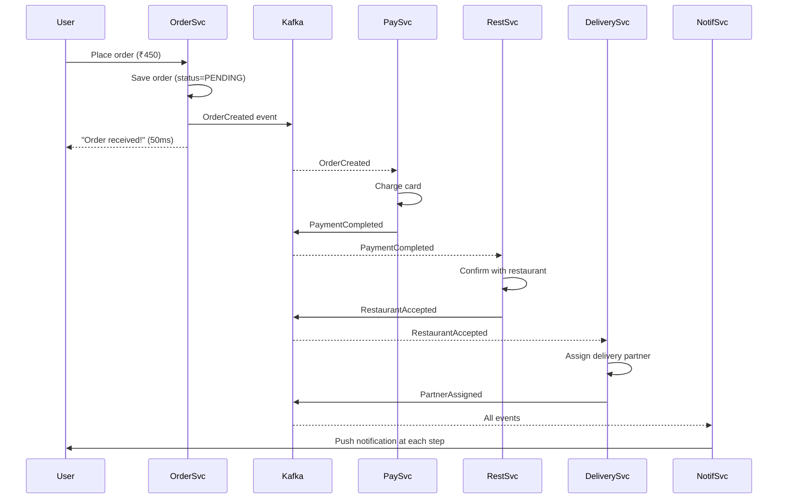

Each step is decoupled. If the Notification Service is down for 2 minutes, orders still process. Notifications queue up and deliver when the service recovers.

---

## 14. Common Interview Questions

### Q1: "Why would you use a message queue instead of a direct API call?"

**Answer framework:**
- **Decoupling:** Producer doesn't need to know consumers exist. Add/remove consumers without touching producer.
- **Reliability:** If consumer is temporarily down, messages queue up and deliver when it recovers. Direct call = lost request.
- **Load leveling:** Queue absorbs traffic spikes. Direct call = downstream service gets 50x load instantly and crashes.
- **Async processing:** Producer can return immediately to user without waiting for all downstream processing.
- **Fan-out:** One message → many independent consumers. With direct calls, producer must call each service sequentially.

---

### Q2: "What's the difference between a queue and a topic/pub-sub?"

**Answer:**
- **Queue:** Each message is consumed by **exactly one consumer**. Used for work distribution — you don't want the same job processed twice.
- **Topic/Pub-Sub:** Each subscriber gets **a full copy** of every message. Used for fan-out — every service needs to react to the same event.
- **Kafka's power:** Consumer groups give you both. Within a consumer group = queue (load balanced). Multiple consumer groups = pub-sub (each group gets all messages).

---

### Q3: "Explain at-least-once delivery and why you need idempotency."

**Answer:**
- At-least-once: message is delivered, consumer processes it, consumer sends ACK. If crash before ACK, broker redelivers. Consumer may see the same message twice.
- Idempotency: processing the same message N times = same result as processing once.
- Example: "Charge ₹450 for order ORD-123" — if processed twice, user gets charged twice. Bad. Instead: "Charge ₹450 with idempotency_key='ORD-123-payment'" — payment provider deduplicates on this key. Safe.
- Implementation: Redis SET with NX flag. Before processing: `SET processed:msg_id 1 NX EX 86400`. If key already exists → skip.

---

### Q4: "How does Kafka achieve high throughput?"

**Answer:**
1. **Sequential disk writes:** Kafka writes messages sequentially to disk (append-only log). Sequential I/O is 100x faster than random I/O. Even HDDs can do 100MB/s sequential.
2. **Zero-copy:** Uses OS-level sendfile() to transfer data from disk to network without copying to user space. Saves CPU.
3. **Batching:** Producers batch multiple messages into one network request. Consumers receive batches.
4. **Pull-based:** Consumers control their rate. No backpressure issues.
5. **Partitions:** Horizontal scaling — more partitions = more parallel writers and readers.
6. **Compression:** Messages compressed at batch level (snappy, lz4, gzip).

---

### Q5: "What is consumer lag and how do you handle it?"

**Answer:**
- Consumer lag = difference between the latest offset in a partition and the consumer's current committed offset.
- Growing lag means consumers can't keep up with producers.
- Monitoring: `kafka-consumer-groups.sh --describe` or via JMX metrics; Datadog/Grafana dashboards.
- Resolution:
  1. Add more consumers to the consumer group (up to # of partitions)
  2. Increase number of partitions (allows more consumers)
  3. Optimize consumer code (batch DB writes, reduce external calls)
  4. Identify slow operations (N+1 queries, synchronous HTTP calls inside consumer)

---

### Q6: "What is a Dead Letter Queue and when would you use it?"

**Answer:**
- DLQ is a special queue where messages go after repeatedly failing processing (e.g., after 3 retries).
- Purpose: Prevent poison messages (malformed, invalid, or permanently failing messages) from blocking the main queue forever.
- Workflow: Message fails → retried N times with exponential backoff → moved to DLQ → alert fires → engineer investigates → fixes bug → replays message.
- In AWS SQS: configure `RedrivePolicy` with `maxReceiveCount`. In RabbitMQ: configure `x-dead-letter-exchange`.

---

### Q7: "How would you design a notification system using message queues?"

**Answer:**

```
Topic: user-events (all events: new_follower, like, comment, order_shipped)

Event Fan-out Service (consumer group "fan-out"):
  - Reads user-events
  - Checks user notification preferences (cached in Redis)
  - Routes to appropriate queues:
    → email-queue (if user has email enabled)
    → sms-queue (if user has SMS enabled)
    → push-queue (if user has push enabled)

Each queue has its own consumer group:
  - email-workers (consumer group "email")
  - sms-workers (consumer group "sms")
  - push-workers (consumer group "push")

Idempotency: track notification_id in Redis. If already sent, skip.
DLQ for each queue: if SMS provider fails, messages go to sms-dlq. Alert fires.
Retry: exponential backoff (1s, 2s, 4s, 8s → DLQ)
```

---

### Q8: "Kafka vs RabbitMQ — when do you choose each?"

**Answer:**

| Choose Kafka | Choose RabbitMQ |
|-------------|-----------------|
| High throughput (millions/sec) | Complex routing (topic exchange patterns) |
| Multiple independent consumer groups | Lower latency per message |
| Event replay needed | Messages deleted after consumption is fine |
| Long-term event log / audit trail | Traditional task queue |
| Event sourcing / CQRS | Priority queues |
| Large-scale streaming | Simpler operational model |

---

### Q9: "How does Kafka guarantee message ordering?"

**Answer:**
- Kafka guarantees ordering **within a single partition**.
- All messages with the same partition key always go to the same partition → ordered for that key.
- Example: `key="user_123"` → always Partition 2 → all events for user_123 are ordered.
- No global ordering across partitions (by design — needed for scalability).
- If you need global ordering → single partition → sacrifices throughput. Generally not recommended.

---

### Q10: "What happens when a Kafka consumer group rebalances?"

**Answer:**
- Rebalance occurs when: new consumer joins, consumer crashes, consumer heartbeat timeout, partition count changes.
- During rebalance: all consumers in the group stop processing (stop-the-world). Partitions are reassigned.
- After rebalance: consumers resume from their last committed offset.
- Problem: Long rebalances can cause consumer lag and duplicate processing (messages inflight during rebalance may be reprocessed).
- Mitigation: Use `CooperativeStickyAssignor` (incremental rebalancing — only reassigns partitions that need to move, others continue processing). Set appropriate `session.timeout.ms` and `heartbeat.interval.ms`.

---

## 15. Key Takeaways

```
╔════════════════════════════════════════════════════════════════════════════╗
║                         KEY TAKEAWAYS                                     ║
╠════════════════════════════════════════════════════════════════════════════╣
║                                                                            ║
║  1. MESSAGE QUEUES = DECOUPLING                                            ║
║     Producer and consumer don't know each other. Each evolves             ║
║     independently. Add consumers without touching producer.                ║
║                                                                            ║
║  2. AT-LEAST-ONCE + IDEMPOTENT = THE PRAGMATIC CHOICE                     ║
║     Never lose messages. Handle duplicates in your consumer logic.         ║
║     Idempotency key pattern: check before processing, mark after.          ║
║                                                                            ║
║  3. KAFKA IS NOT A QUEUE — IT'S A DISTRIBUTED LOG                         ║
║     Messages are retained after consumption. Replay is possible.           ║
║     Consumer groups give you both queue (load-balanced) and                ║
║     pub-sub (multiple groups, each gets all messages).                     ║
║                                                                            ║
║  4. KAFKA ORDERING: WITHIN A PARTITION, NOT GLOBALLY                       ║
║     Use partition key = entity ID for per-entity ordering.                 ║
║     Cross-partition ordering is not guaranteed.                            ║
║                                                                            ║
║  5. MONITOR CONSUMER LAG                                                   ║
║     Growing lag = consumers can't keep up. Add consumers, optimize,       ║
║     or increase partition count.                                           ║
║                                                                            ║
║  6. DEAD LETTER QUEUE IS MANDATORY IN PRODUCTION                           ║
║     Every queue needs a DLQ. Poison messages will happen.                  ║
║     Alert on DLQ depth > 0.                                                ║
║                                                                            ║
║  7. KAFKA VS RABBITMQ VS SQS                                               ║
║     Kafka: streaming, high throughput, replay, multiple consumers          ║
║     RabbitMQ: complex routing, traditional task queue                      ║
║     SQS: AWS-native, zero ops, simple use cases                            ║
║                                                                            ║
║  8. QUEUE DEPTH IS A HEALTH METRIC                                         ║
║     Growing queue = downstream pressure. Shrinking = recovery.             ║
║     Set alarms on queue depth and age of oldest message.                   ║
║                                                                            ║
╚════════════════════════════════════════════════════════════════════════════╝
```

---

## Next Steps

Continue to [API Gateway](../19-api-gateway/README.md) to learn how API gateways sit in front of microservices to handle cross-cutting concerns.

---

*"Message queues shift your system from synchronous (fragile, coupled) to asynchronous (resilient, decoupled). The trade-off is complexity — eventual consistency, idempotency, and monitoring consumer lag become your new responsibilities. Master these, and you can design systems at LinkedIn/Uber/Netflix scale."*
