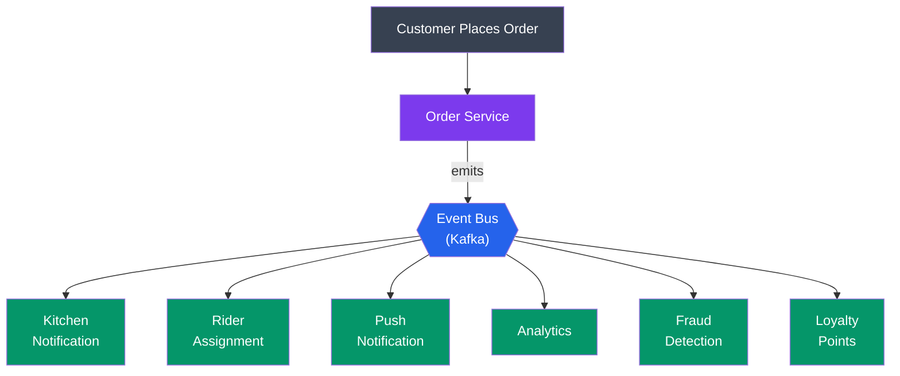
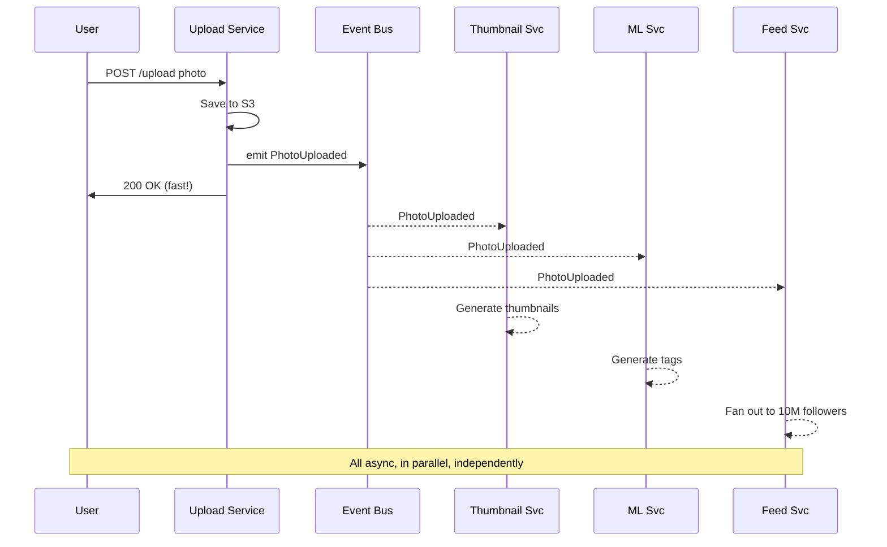
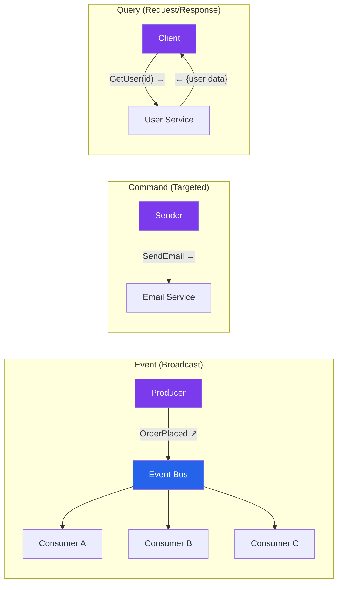
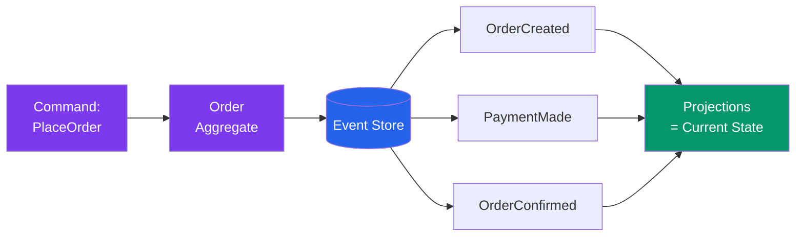
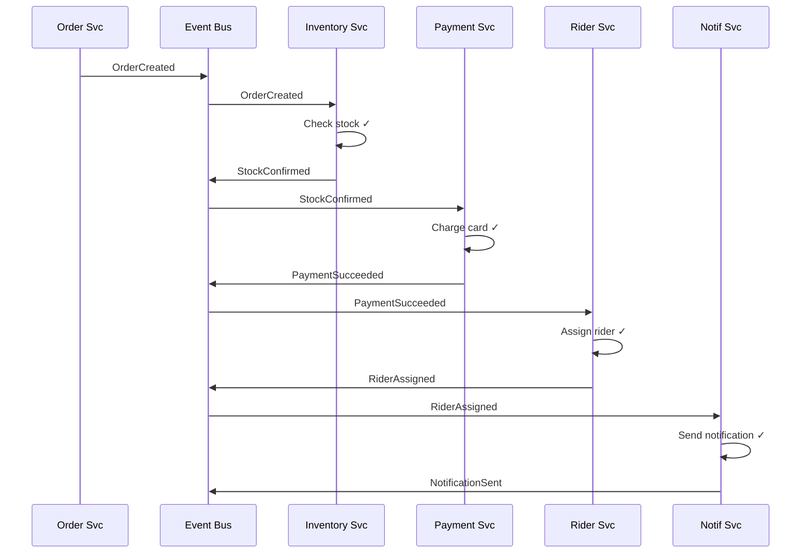
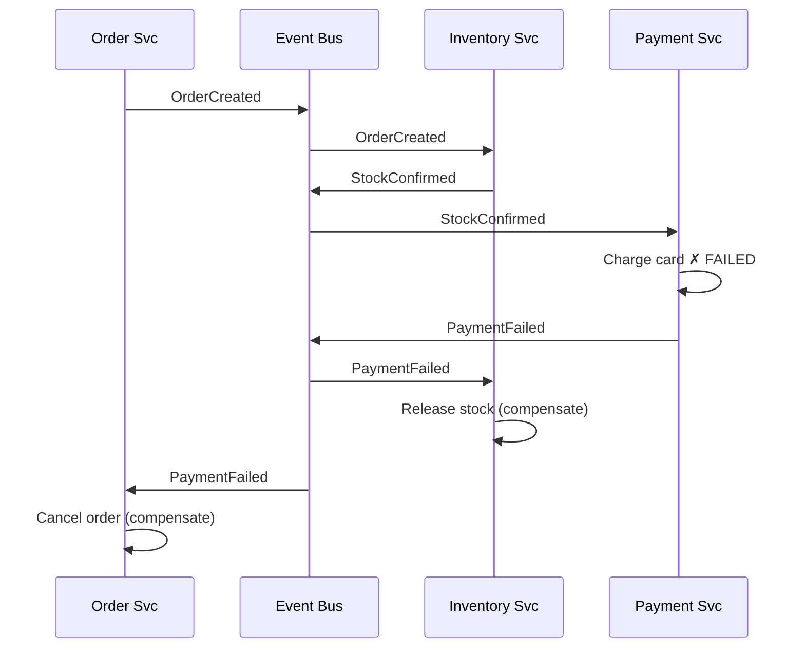
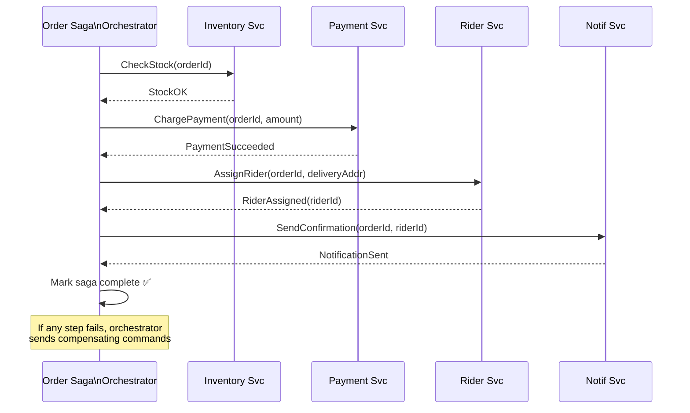
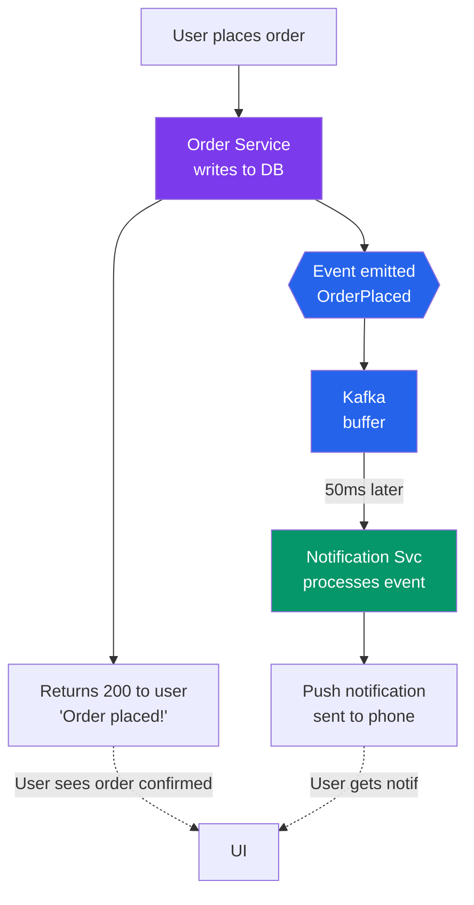
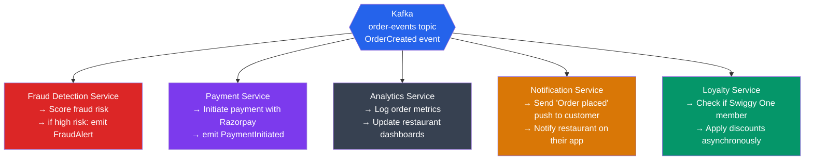
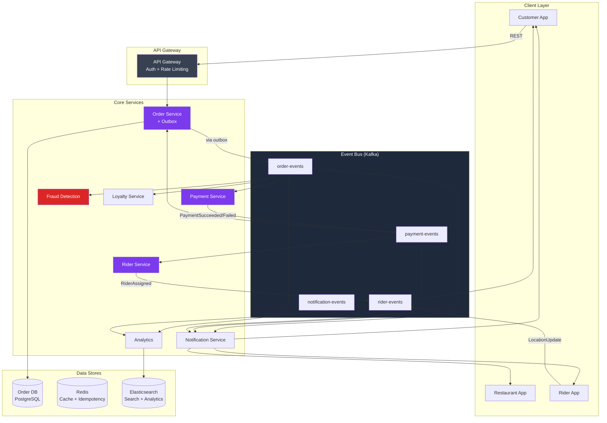

# Event-Driven Architecture

> "The difference between a good system and a great system is not the features — it's how the pieces talk to each other."

---

## Table of Contents

1. [What Is Event-Driven Architecture?](#1-what-is-event-driven-architecture)
2. [Event-Driven vs Request-Driven](#2-event-driven-vs-request-driven)
3. [Events vs Commands vs Queries](#3-events-vs-commands-vs-queries)
4. [Types of Events](#4-types-of-events)
5. [Pub/Sub Pattern with Kafka](#5-pubsub-pattern-with-kafka)
6. [Event Sourcing — Brief Introduction](#6-event-sourcing--brief-introduction)
7. [Choreography vs Orchestration](#7-choreography-vs-orchestration)
8. [Eventual Consistency in Event-Driven Systems](#8-eventual-consistency-in-event-driven-systems)
9. [Event Schema Evolution](#9-event-schema-evolution)
10. [Idempotent Event Handling](#10-idempotent-event-handling)
11. [Event Ordering](#11-event-ordering)
12. [Real Architecture: Swiggy Order Processing](#12-real-architecture-swiggy-order-processing)
13. [Trade-offs and When NOT to Use EDA](#13-trade-offs-and-when-not-to-use-eda)
14. [Common Interview Questions](#14-common-interview-questions)
15. [Key Takeaways](#15-key-takeaways)

---

## 1. What Is Event-Driven Architecture?

### The Analogy: Newspaper Subscription

Socho ek baar — every morning you want to read the news. You have two choices:

**Option A (Request-Driven):** Every morning at 6am, you call the newspaper office and ask: "Is there any news today?" They say yes. You go pick it up. Tomorrow morning, you call again. And again. And again. Har roz phone karo. Agar newspaper office band hai — you get nothing.

**Option B (Event-Driven):** You *subscribe* to the newspaper. The moment there's news, they print it and deliver it to your door. You don't ask — they tell. You can even subscribe to multiple newspapers. Each delivers independently. If one paper shuts down temporarily, you still get the others.

**Option B is Event-Driven Architecture.**

In software terms:
- **Option A** = Service A calls Service B's API, waits for a response (synchronous, tightly coupled)
- **Option B** = Service A emits an event to a bus, Service B (and C and D) listen and react (asynchronous, loosely coupled)

### Definition

**Event-Driven Architecture (EDA)** is a software design pattern where services communicate by producing and consuming **events** — notifications that something happened — rather than calling each other directly.

An **event** is an immutable record of a fact: something occurred at a point in time. It's not a request. It's not an instruction. It's just: "This happened."

```
event = {
  eventId:   "evt_7f3a9",
  eventType: "OrderPlaced",
  timestamp: "2024-01-15T10:30:00Z",
  data: {
    orderId:    "ord_123",
    customerId: "usr_456",
    amount:     450,
    items:      ["Biryani", "Raita"]
  }
}
```

### Why Does It Exist?

Ek real problem se samjhte hain. Swiggy ke paas ek order system hai. Jab koi order place karta hai, kya karna chahiye?

1. Kitchen ko notify karo (restaurant)
2. Nearby rider assign karo
3. Customer ko push notification bhejo
4. Analytics system mein log karo
5. Fraud detection system check karo
6. Loyalty points add karo

**Without EDA:** Order Service calls each of these one by one. Synchronously. 6 API calls. Agar ek bhi down hai — order placement fails or hangs.

**With EDA:** Order Service emits one event: `OrderPlaced`. All 6 systems independently listen and react. Order Service ki responsibility khatam. Wo khud chillax mode mein hai.



**Interview Tip:** When someone asks "what is EDA", don't just define it — explain the problem it solves. The newspaper analogy + Swiggy example will make you stand out.

---

## 2. Event-Driven vs Request-Driven

### The Analogy: Phone Call vs WhatsApp Message

**Request-Driven** is like a phone call. You call someone, they must pick up NOW, you talk, you hang up. If they don't pick up — failure. You're blocked until they respond.

**Event-Driven** is like a WhatsApp message. You send it and move on. The receiver reads it whenever they're online. You're not blocked. They can even read it 3 hours later when their phone comes back online.

### Side-by-Side Comparison

| Dimension | Request-Driven (Synchronous) | Event-Driven (Asynchronous) |
|---|---|---|
| Communication | Direct API call | Via event bus |
| Coupling | Tight — caller knows callee's address | Loose — producer doesn't know consumers |
| Availability | If B is down, A fails | If B is down, events queue up, B catches up |
| Latency | Low (immediate response) | Higher (event propagation delay) |
| Consistency | Strong (response confirms completion) | Eventual (consumers process in own time) |
| Debugging | Easier — single call stack | Harder — distributed event chains |
| Scaling | Both sides must scale together | Each service scales independently |
| Use case | Need immediate result (login, payment confirm) | Fire and forget (notifications, analytics) |

### How Request-Driven Fails at Scale

Instagram ke paas socho ek scenario: jab koi photo upload karta hai, kya hota hai?

```
REQUEST-DRIVEN approach:
───────────────────────
Upload Service
   → calls Thumbnail Service (waits 2s)
       → calls CDN Upload Service (waits 1s)
           → calls ML Tagging Service (waits 3s)
               → calls Feed Fanout Service (waits 5s)
                   → calls Notification Service (waits 1s)
                       → returns "done"

Total time: 12 seconds just for upload to "complete"!
If ML Service is down: upload FAILS for the user!
```

```
EVENT-DRIVEN approach:
──────────────────────
Upload Service
   → saves photo to S3
   → emits PhotoUploaded event
   → returns "upload successful" immediately (< 200ms)

Meanwhile, independently:
   Thumbnail Service   ← subscribes to PhotoUploaded → creates thumbnails
   CDN Service         ← subscribes to PhotoUploaded → distributes
   ML Service          ← subscribes to PhotoUploaded → generates tags
   Feed Service        ← subscribes to PhotoUploaded → fans out to followers
   Notification Service← subscribes to PhotoUploaded → notifies followers
```

The user gets their response in 200ms. The rest happens in the background. This is how Instagram actually works (at a high level).



**Interview Tip:** The key phrase is **temporal decoupling** — producer and consumer don't need to be available at the same time. Yeh phrase interviewer ko impress karega.

---

## 3. Events vs Commands vs Queries

### The Analogy: Three Types of Communication

Imagine you're a manager:
- **Command:** "Rahul, file this report by 5pm." — Specific person, imperative, you expect it done.
- **Event:** You send a broadcast email: "The quarterly results are out." — You don't care who reads it or when. It's a fact.
- **Query:** "Priya, what's the current headcount?" — You want information, no action required.

Same three patterns exist in distributed systems.

### Events

An event is a **notification that something happened in the past**. It is:
- **Past tense:** `OrderPlaced`, `UserRegistered`, `PaymentFailed`, `VideoUploaded`
- **Immutable:** Once emitted, you can't un-emit it
- **Broadcast:** Doesn't care who consumes it — zero, one, or ten services can subscribe
- **No expectation of response:** The producer moves on

```json
{
  "eventType": "UserRegistered",
  "userId": "usr_789",
  "email": "rahul@gmail.com",
  "registeredAt": "2024-01-15T09:00:00Z"
}
```

Who might listen to `UserRegistered`?
- Email service → sends welcome email
- Analytics → tracks signup metrics
- Onboarding service → starts tutorial flow
- Marketing → adds to drip campaign

The user registration service doesn't care. It just says "this happened" and moves on.

### Commands

A command is an **instruction directed at a specific service** to do something. It is:
- **Imperative:** `SendEmail`, `ChargeCard`, `ResizeImage`, `DeleteUser`
- **Targeted:** Goes to exactly one handler
- **Expects action:** The sender knows something will be done
- **May have a result:** Success/failure response expected (though not always immediate)

```json
{
  "commandType": "SendWelcomeEmail",
  "to": "rahul@gmail.com",
  "templateId": "welcome_v2",
  "userId": "usr_789"
}
```

### Queries

A query is a **request for data** with no side effects. It is:
- **Read-only:** `GetUserById`, `ListOrders`, `GetProductDetails`
- **Synchronous:** Caller waits for the result
- **No state change:** Asking a question doesn't change anything

This is the foundation of **CQRS** (Command Query Responsibility Segregation) which gets its own chapter.

### Comparison Table

| Property | Event | Command | Query |
|---|---|---|---|
| Tense | Past ("happened") | Present ("do this") | Present ("give me") |
| Direction | Broadcast (1-to-many) | Targeted (1-to-1) | Targeted (1-to-1) |
| Response expected | No | Optional | Yes (data) |
| Side effects | Triggers reactions | Causes action | None |
| Examples | OrderPlaced, UserDeleted | SendEmail, ChargeCard | GetUser, ListOrders |
| Named by | What occurred | What to do | What you want |



**Interview Tip:** When asked "how do services communicate in microservices?", cover all three — events, commands, queries — and explain when to use which. Most candidates only talk about REST APIs (queries/commands) and miss events entirely.

---

## 4. Types of Events

### The Analogy: Types of Announcements in a Company

Socho ek company mein teen tarah ki announcements hoti hain:

1. **Business news:** "We signed a new client!" — directly about what the business does
2. **Cross-department news:** "The accounting system is now integrated with HR" — affects how departments work together
3. **Infrastructure news:** "The server room will be under maintenance Saturday night" — internal IT stuff

Events in software are categorized the same way.

### Domain Events

**Domain events** represent things that happened *within your business domain*. They are the most important type — they capture real business facts.

- `OrderPlaced` — a customer placed an order
- `PaymentFailed` — a payment attempt failed
- `UserRegistered` — a new user signed up
- `ItemAddedToCart` — a cart item was added
- `VideoUploaded` — a video was uploaded (YouTube)
- `RiderAcceptedTrip` — a Zomato rider accepted a delivery
- `MessageDelivered` — WhatsApp message was delivered

These events live in your bounded context (the service/domain that owns them). They carry business meaning.

```json
{
  "eventType": "OrderPlaced",
  "version": "v2",
  "orderId": "ord_4521",
  "customerId": "usr_8834",
  "restaurantId": "rest_112",
  "items": [
    { "name": "Chicken Biryani", "quantity": 2, "price": 280 }
  ],
  "totalAmount": 560,
  "deliveryAddress": { "lat": 12.97, "lng": 77.59 },
  "placedAt": "2024-01-15T19:30:00Z"
}
```

### Integration Events

**Integration events** are domain events that have been promoted across service boundaries — they're published to other services (or other companies via webhooks). They often have a slightly different shape than the internal domain event.

The key difference: internal domain events may contain implementation details. Integration events are a **public contract** — you can't change them without coordinating with consumers.

For example, internally Swiggy's Order Service might emit:
```json
{ "type": "OrderPlaced", "orderId": "ord_4521", "dbRowId": 999, "shardKey": "shard_3" }
```

But the integration event sent to Payment Service would NOT include `dbRowId` and `shardKey` — those are internal implementation details. The integration event is:
```json
{ "type": "OrderPlaced", "orderId": "ord_4521", "customerId": "usr_8834", "amount": 560 }
```

**Real example:** When Zomato's Order Service tells Payment Service an order was placed, that's an integration event. Zomato also sends integration events to their partner restaurants via webhooks — "you have a new order".

### System Events

**System events** are infrastructure-level events, not about business logic. They're about what the *system itself* is doing.

- `ServiceInstanceStarted` — a pod came up
- `HealthCheckFailed` — a service is unhealthy
- `DatabaseConnectionLost` — DB connection dropped
- `DiskSpaceLow` — disk is 90% full
- `AutoscalingTriggered` — new instance spinning up

These are consumed by monitoring systems, alerting tools, auto-remediation scripts. Netflix's Chaos Engineering tools react to system events. AWS CloudWatch is full of system events.

### Comparison

| Type | Who cares | Example | Who produces | Who consumes |
|---|---|---|---|---|
| Domain | Business stakeholders | OrderPlaced | Business services | Other business services |
| Integration | Other services/teams | PaymentConfirmed | Service boundary | External services, partners |
| System | Operations/SRE | PodCrashed | Infrastructure | Monitoring, alerting |

**Interview Tip:** Most people only know about domain events. Mentioning integration events and system events shows you've thought about real production systems.

---

## 5. Pub/Sub Pattern with Kafka

### The Analogy: YouTube Channel Subscription

YouTube ka example bilkul perfect hai. Ek YouTube channel (producer) videos upload karta hai (publishes events). Lakhs of subscribers (consumers) independently watch those videos. 

- YouTube channel doesn't know or care who subscribed
- Each subscriber watches at their own pace
- New subscriber can watch old videos (replay)
- One video goes to millions — but each subscriber's watch history is independent

**This is exactly how Kafka's pub/sub works.**

### Kafka Core Concepts

**Topic:** A named channel where events are published. Like a YouTube channel. `order-events`, `payment-events`, `user-events`.

**Producer:** A service that publishes events to a topic. Order Service publishes to `order-events`.

**Consumer:** A service that reads events from a topic. Payment Service, Analytics, Notification — all read from `order-events`.

**Consumer Group:** A group of consumer instances that together process all events from a topic. Think of it as a team. If you have 3 instances of Payment Service, they form one consumer group — each event is processed by exactly ONE instance in the group.

**Partition:** A topic is split into partitions — ordered, append-only logs. Events within a partition are ordered. Partitions enable parallelism.

**Offset:** Each event in a partition has a sequential number (offset). Consumers track their offset — "I've read up to offset 450." This is how replay works — just reset to offset 0.

```mermaid
flowchart TB
    subgraph PROD ["Producers"]
        OS[Order Service]
        PS[Payment Service]
    end

    subgraph KAFKA ["Kafka Topic: order-events"]
        subgraph P0 ["Partition 0"]
            direction LR
            M1[evt@0] --> M2[evt@1] --> M3[evt@2]
        end
        subgraph P1 ["Partition 1"]
            direction LR
            M4[evt@0] --> M5[evt@1] --> M6[evt@2]
        end
        subgraph P2 ["Partition 2"]
            direction LR
            M7[evt@0] --> M8[evt@1] --> M9[evt@2]
        end
    end

    subgraph CG1 ["Consumer Group: analytics"]
        A1[Analytics\nInstance 1]
        A2[Analytics\nInstance 2]
        A3[Analytics\nInstance 3]
    end

    subgraph CG2 ["Consumer Group: notifications"]
        N1[Notif\nInstance 1]
        N2[Notif\nInstance 2]
    end

    OS --> P0
    OS --> P1
    PS --> P2
    P0 --> A1
    P1 --> A2
    P2 --> A3
    P0 --> N1
    P1 --> N2
    P2 --> N1

    style KAFKA fill:#1e293b,color:#fff
    style OS fill:#7c3aed,color:#fff
    style PS fill:#7c3aed,color:#fff
    style A1 fill:#059669,color:#fff
    style A2 fill:#059669,color:#fff
    style A3 fill:#059669,color:#fff
    style N1 fill:#d97706,color:#fff
    style N2 fill:#d97706,color:#fff
```

### Key Properties of Kafka Pub/Sub

**1. Multiple Independent Consumer Groups**

Analytics and Notifications are completely independent consumer groups. Each group maintains its own offset. If Analytics is slow, it doesn't affect Notifications. If you add a new consumer group (say, Fraud Detection), it can start reading from the beginning without affecting anyone.

```
Topic: order-events
┌──────────────────────────────────────────────────────────┐
│ offset:    0    1    2    3    4    5    6    7    8      │
│ events: [Ord] [Ord] [Pay] [Ord] [Pay] [Ord] [Pay] ...   │
└──────────────────────────────────────────────────────────┘
                                         ↑
           Analytics consumer group  offset=7 (reading event 7)

                              ↑
           Notifications group offset=4 (slow, processing event 4)

   ↑
   Fraud Detection (new!) offset=0 (replaying all events from start)
```

**2. Retention and Replay**

Kafka retains messages for a configurable period (hours, days, forever). This enables:
- Replaying events for a new service joining
- Replaying events after a bug fix (reprocess historical data)
- Time-travel debugging

Netflix uses Kafka with very long retention periods so they can replay events for new analytics pipelines.

**3. Ordering within a Partition**

Events in the same partition are strictly ordered. You can ensure related events go to the same partition by using a **partition key** (e.g., `orderId`). All events for `orderId=123` go to partition 2 — so they're processed in order.

**4. At-Least-Once Delivery (Default)**

Kafka guarantees each event is delivered at least once. In failure scenarios, you might get duplicates. This is why consumer idempotency matters (more on this in section 10).

### Kafka vs Traditional Message Queues

| Feature | Kafka | RabbitMQ / SQS |
|---|---|---|
| Model | Append-only log | Queue |
| Message after consumption | Retained (configurable) | Deleted |
| Multiple consumers | Each group reads independently | Competing consumers share load |
| Ordering | Per partition | Per queue |
| Throughput | ~1M+ msgs/sec | ~50K msgs/sec |
| Replay | Yes — seek to any offset | No |
| Best for | Event streaming, audit log, event sourcing | Task distribution, work queues |
| Example use | Netflix play tracking, Swiggy order events | Email sending, image resizing |

**Simple baat hai:** Use Kafka when you need multiple services consuming the same events, or when you need replay. Use RabbitMQ/SQS when you need simple task queues where each message is processed once.

**Real Example:** When you press play on Netflix:
- Kafka receives a `VideoPlayStarted` event
- Analytics consumer group reads it → updates watch history
- Recommendations consumer group reads it → updates your taste profile
- Billing consumer group reads it → tracks streaming hours
- Quality consumer group reads it → monitors stream quality

One event, four independent consumers. Perfect pub/sub.

**Interview Tip:** Know the difference between consumer groups and consumer instances. "Consumer group" is the unit of independent subscription. "Consumer instance" is one pod within that group. Interviewers love this distinction.

---

## 6. Event Sourcing — Brief Introduction

### The Analogy: Bank Statement vs Bank Balance

Your bank app shows you a balance: ₹15,000. That's the **current state**.

But the bank also keeps every transaction: deposit ₹50,000, rent debit ₹20,000, grocery ₹5,000, salary credit ₹10,000... — these are **events**. The balance (current state) is just the sum of all these events.

If there's an error in the balance, the bank can replay all transactions to recalculate it. They have a complete audit trail.

**Event Sourcing** is this idea applied to your database: instead of storing the current state of an object, you store every event that led to that state. Current state is computed by replaying events.

```
Traditional approach (state stored):
  orders table row: { orderId: 123, status: "delivered", amount: 450 }

Event Sourcing approach (events stored):
  OrderCreated   at 10:00 → { orderId: 123, items: [...], amount: 450 }
  PaymentMade    at 10:02 → { method: "UPI", txnId: "txn_xyz" }
  OrderConfirmed at 10:05 → { restaurantId: "rest_5" }
  OutForDelivery at 10:40 → { riderId: "rider_88" }
  Delivered      at 11:15 → { deliveredAt: "11:15:00" }
```

Current state = replay all 5 events. You know exactly what happened and when.

**Why it matters:**
- Complete audit trail — who changed what and when
- Time travel — reconstruct state at any past moment
- Bug recovery — replay events with fixed code
- New projections — build new read models from historical events

**Note:** Event Sourcing is a deep topic covered in chapter 40. Here, just know it exists and how it relates to EDA — in event-driven systems, it's natural to store the events themselves rather than just the resulting state.



**Interview Tip:** Event sourcing ≠ Event-driven architecture. EDA is about how services communicate. Event sourcing is about how you store state. You can use EDA without event sourcing. But they work beautifully together.

---

## 7. Choreography vs Orchestration

### The Analogy: Dance Performance vs Dance with a Director

**Choreography:** A Bollywood dance sequence where every dancer has memorized their part. No one is directing them live — each dancer knows their cues (when the music changes, they move). Decentralized, no single coordinator.

**Orchestration:** A live concert where the conductor (orchestrator) tells each section (strings, brass, percussion) exactly when to play. Everything is centralized through one entity.

Yeh kyun important hai? Because in microservices, when multiple services need to coordinate for a single business process (like placing an order), you need a strategy. Your two choices are choreography and orchestration.

### Scenario: Placing a Swiggy Order

Five things need to happen in sequence:
1. Order Service: create order record
2. Inventory Service: check restaurant stock
3. Payment Service: charge the customer
4. Rider Service: assign a delivery rider
5. Notification Service: tell customer their order is confirmed

### Choreography: Services React to Each Other

Each service listens to events and reacts by emitting new events. There's no central controller.



**Failure scenario with choreography:**



**Choreography properties:**
- Services only know about events, not about each other
- Adding a new step = add a new listener, no changes to existing services
- Complex to trace: "what is the current state of order 123?"
- Debugging is hard — you need distributed tracing to follow the event chain
- Risk of circular events (Service A listens to B, B listens to A — infinite loop)

### Orchestration: A Central Coordinator

A dedicated Saga Orchestrator directs each step explicitly by sending commands and waiting for responses.



**Orchestration properties:**
- Clear flow: the orchestrator's state machine IS the business process documentation
- Easy to debug: check orchestrator's state — "order 123 is at step 3: awaiting rider assignment"
- Easier to add compensation logic
- Orchestrator becomes a coupling point — it must know about all services
- Orchestrator must be highly available — single point of failure risk

### Choreography vs Orchestration — Full Comparison

| Dimension | Choreography | Orchestration |
|---|---|---|
| Control | Decentralized (each service decides) | Centralized (orchestrator directs) |
| Coupling | Services coupled to events only | Services coupled to orchestrator |
| Traceability | Hard — distributed event chain | Easy — check orchestrator state |
| Adding new steps | Easy — add new listener | Requires orchestrator change |
| Failure handling | Each service handles its own compensation | Orchestrator coordinates compensation |
| Single point of failure | No | Orchestrator (must be HA) |
| Complexity grows | Harder to reason about | Manageable with one central definition |
| Best for | Simple flows, independent reactions | Complex multi-step business processes |

**The Saga Pattern:** Distributed transactions across services use choreography or orchestration. Each step is a local transaction. On failure, compensating transactions undo the work. This gets its own deep-dive in chapter 41.

**Real example:**
- **Choreography:** Instagram's photo processing — upload triggers thumbnail generation, triggers CDN push, triggers ML tagging. Simple linear flow, each step independent.
- **Orchestration:** Swiggy's order placement — complex flow with failure scenarios, partial completion states, compensation needed. An Order Saga Orchestrator manages the whole process.

**Interview Tip:** When asked about sagas, always clarify: "Are you asking about choreography-based or orchestration-based sagas?" Most interviewers don't distinguish — this shows depth. Then explain the trade-off with an example.

---

## 8. Eventual Consistency in Event-Driven Systems

### The Analogy: WhatsApp "Delivered" vs "Read" Ticks

Jab tum WhatsApp par message bhejte ho, first ek grey tick aata hai (sent). Phir do grey ticks (delivered). Phir do blue ticks (read). There's a delay between each. Your friend's phone doesn't instantly know you sent a message — it propagates.

This is eventual consistency. The state on your phone and your friend's phone start different, but eventually converge to the same truth.

### How It Works in EDA

When Service A emits an event and Service B processes it, there's a propagation delay. During that window:
- Service A's database might say "order is confirmed"
- Service B (notifications) hasn't processed the event yet — it doesn't know

Eventually, B processes the event. Now both are in sync. The system reached **consistency eventually** — not immediately.

```
Timeline:
─────────
T+0ms:  Order Service writes "OrderConfirmed" to DB, emits event
T+0ms:  Client gets "order confirmed" response ✅

T+50ms: Kafka receives event
T+80ms: Notification Service reads event from Kafka
T+100ms: Notification Service sends push notification to user
T+120ms: User's phone receives push notification

Between T+0ms and T+120ms: Order DB says "confirmed" but phone hasn't been notified yet.
After T+120ms: Both are consistent ✅
```

### Trade-offs of Eventual Consistency

**What you gain:**
- Availability — services can function independently even if one is slow
- Resilience — if Notification Service is down, events queue up, it catches up later
- Performance — you don't wait for all downstream services before responding

**What you give up:**
- Immediate consistency — a brief window where different parts of the system see different state
- Users may see stale data momentarily (refresh and it updates)

### Handling It in Practice

**1. Design for it:** Tell users "You'll receive an email confirmation shortly" — not "You have received an email." The delay is expected.

**2. Read-your-writes consistency:** After a user performs an action, their subsequent reads can be routed to the write replica temporarily (not the eventually-consistent read replica). Avoids the "I just posted but can't see my own post" problem.

**3. UI optimistic updates:** Update the UI immediately (assume success), then correct if the event processing reveals a failure. This is how Facebook likes work — click like, it immediately shows +1, actual event processes in background.

**4. Idempotent retries:** If a consumer fails to process an event, retry. Eventual consistency relies on events eventually being processed — retries make this reliable.



**Interview Tip:** The question "how do you handle consistency in event-driven systems?" is extremely common. Answer: "We accept eventual consistency as a trade-off for availability and decoupling. We design UX to set correct expectations, use optimistic UI updates, and ensure all consumers are idempotent so retries are safe."

---

## 9. Event Schema Evolution

### The Analogy: Updating a Contract Without Breaking Partners

Socho ek legal contract hai between two companies. Company A wants to add new terms. But Company B signed the old contract. You can't just change the contract without them agreeing — that would break the partnership.

Events are contracts between services. The producer defines the event schema. All consumers depend on it. Changing the schema carelessly breaks consumers.

**Event schema evolution** is the discipline of changing event schemas without breaking existing consumers.

### The Two Directions of Compatibility

**Forward Compatible (additive):** Old consumers can still read events produced with the NEW schema.

**Backward Compatible:** New consumers can still read events produced with the OLD schema.

Ideally, changes should be **both** — this is called **full compatibility**.

### Safe Changes (Non-Breaking)

**Adding optional fields** — The simplest, safest change.

```
Old event:
{
  "eventType": "OrderPlaced",
  "orderId": "ord_123",
  "amount": 450
}

New event (added optional field):
{
  "eventType": "OrderPlaced",
  "orderId": "ord_123",
  "amount": 450,
  "discountCode": "SAVE20"   ← NEW optional field
}
```

Old consumers: see the event, don't know about `discountCode`, ignore it. Works fine — **forward compatible**.

New consumers: handle events from old producers that don't have `discountCode`. Default to null/absent. Works fine — **backward compatible**.

**Rule:** Never add a required field without a default. Always add fields as optional.

### Unsafe Changes (Breaking)

**Removing a field** — Old consumers may depend on it.

```
Old event: { "orderId": "ord_123", "customerId": "usr_456", "amount": 450 }
New event: { "orderId": "ord_123", "amount": 450 }
              ↑ "customerId" removed!

Old consumers that read "customerId" → NullPointerException or wrong behavior
```

**Renaming a field** — Effectively a remove + add.

```
Old: { "amount": 450 }
New: { "totalAmount": 450 }
           ↑ Renamed!
```

Old consumers look for `amount` — they get null. Breaking change.

**Changing a field's type** — Almost always breaking.

```
Old: { "orderId": 123 }          ← integer
New: { "orderId": "ord_123" }    ← string
```

Any consumer that parses `orderId` as an integer will fail.

### Strategies for Handling Schema Evolution

**1. Schema Registry (Confluent Schema Registry with Avro)**

All event schemas are registered in a central schema registry. When a producer publishes a new schema version, the registry validates it for compatibility before accepting. Consumers fetch the schema by ID embedded in the event.

```
Producer → Schema Registry → "Is v2 compatible with v1?" → YES → publish
Consumer → read event → look up schema_id=2 → Registry → get schema → deserialize
```

Used by Kafka-heavy companies like LinkedIn, Uber.

**2. Version the event type**

When a breaking change is needed, introduce a new event type version:

```
"eventType": "OrderPlaced.v1"   ← old consumers subscribe to this
"eventType": "OrderPlaced.v2"   ← new consumers subscribe to this
```

Both versions run in parallel. Producer publishes both. Old consumers read v1. New consumers read v2. Eventually migrate all consumers to v2, then deprecate v1.

**3. Expand-Contract pattern**

- **Expand:** Add new field alongside old field (both exist)
- **Migrate:** Update all consumers to use new field
- **Contract:** Remove old field once no consumer uses it

```
Phase 1 (Expand):  { "amount": 450, "totalAmount": 450 }  ← both!
Phase 2 (Migrate): consumers switch from "amount" to "totalAmount"
Phase 3 (Contract): { "totalAmount": 450 }  ← "amount" removed
```

### Compatibility Matrix

| Change | Forward Compatible? | Backward Compatible? | Safe? |
|---|---|---|---|
| Add optional field with default | Yes | Yes | Safe |
| Add required field | No | Yes | Breaking |
| Remove optional field | Yes | No | Breaking |
| Rename a field | No | No | Breaking |
| Change field type | No | No | Breaking |
| Add new event type | Yes | Yes | Safe |

**Interview Tip:** Schema evolution is a production-reality problem. If you mention Avro + Schema Registry and the expand-contract pattern, you'll sound very experienced. Most candidates don't cover this at all.

---

## 10. Idempotent Event Handling

### The Analogy: Elevator Button

Elevator ka button press karo — ghar aata hai. Press karo fir se — kuch nahi hota, elevator fir se nahi aata. Same button, same result regardless of how many times you press it. Yeh idempotency hai.

**Idempotency** means: processing the same event multiple times produces the same result as processing it once.

### Why Is This Needed?

Because Kafka (and most messaging systems) provide **at-least-once delivery** — in failure scenarios, you may receive duplicates.

```
Scenario:
─────────
1. Kafka delivers OrderPlaced event to Notification Service
2. Notification Service sends push notification ✅
3. Notification Service tries to commit offset to Kafka... CRASH!
4. Kafka doesn't know the event was processed
5. Notification Service restarts, reads same event again
6. Notification Service sends push notification AGAIN ❌
```

User gets the same notification twice. Without idempotency: billing systems may charge twice, emails sent twice, inventory decremented twice.

### Implementation Strategies

**Strategy 1: Idempotency Key Table**

Before processing, check if you've already processed this event. If yes, skip.

```sql
-- Create a table to track processed events
CREATE TABLE processed_events (
  event_id    VARCHAR(100) PRIMARY KEY,
  processed_at TIMESTAMP DEFAULT NOW()
);

-- Before processing:
INSERT INTO processed_events (event_id) VALUES ('evt_7f3a9')
  ON CONFLICT DO NOTHING
  RETURNING event_id;
-- If nothing returned → already processed → skip
-- If returned → process now
```

**Strategy 2: Database Unique Constraints**

Use unique constraints so the operation is naturally idempotent.

```sql
-- Sending a welcome email
INSERT INTO sent_emails (user_id, template_id, sent_at)
  VALUES ('usr_789', 'welcome_v2', NOW())
  ON CONFLICT (user_id, template_id) DO NOTHING;
-- Second attempt does nothing — user_id + template_id is unique
```

**Strategy 3: Optimistic locking with version checks**

```sql
UPDATE orders 
SET status = 'confirmed', version = version + 1
WHERE order_id = 'ord_123' AND version = 5 AND status = 'pending';
-- If version is not 5 anymore → already processed → 0 rows affected → skip
```

**Strategy 4: Natural idempotency**

Design operations to be naturally idempotent:

```
Not idempotent:  balance = balance + 100
Idempotent:      SET balance = 150 WHERE balance = 50 AND tx_id = 'txn_99'
```

```
Not idempotent:  INSERT INTO riders (assigned_rider='rider_88') WHERE orderId='ord_123'
Idempotent:      UPDATE riders SET assigned_rider='rider_88' WHERE orderId='ord_123'
                 -- UPDATE is idempotent: running it 10 times has same effect as once
```

### Idempotency + At-Least-Once = Exactly-Once (effectively)

```
At-least-once delivery + Idempotent consumer = Effectively exactly-once semantics

Even if Kafka delivers an event 3 times:
  1st delivery: processed, idempotency key recorded
  2nd delivery: key found, skip
  3rd delivery: key found, skip
Net effect: processed exactly once ✅
```

**Note:** Idempotent event handling is such an important topic it has its own full chapter (chapter 22). This is just the EDA context.

**Interview Tip:** Never say "I'll use exactly-once delivery" without qualification. Kafka supports exactly-once within its own ecosystem (with transactions) but across services you need idempotent consumers. This distinction matters.

---

## 11. Event Ordering

### The Analogy: Stack of Newspapers

Agar tumhare ghar 3 din ke newspapers ek saath aaye — you'd read them in date order. You wouldn't read Tuesday's paper, then Sunday's, then Monday's. Order matters for events that build on each other.

### The Problem

Distributed systems process events concurrently. Events can arrive out of order due to:
- Network delays
- Multiple partitions being processed in parallel
- Consumer restarts catching up at different rates

Example: `OrderCancelled` event arrives before `OrderCreated` — consumer doesn't know the order exists yet!

### Kafka's Ordering Guarantee

**Kafka guarantees ordering WITHIN a partition, but NOT across partitions.**

If all events for `orderId=123` go to partition 2, they're ordered:
```
Partition 2:
[OrderCreated @ offset 45] → [PaymentMade @ offset 46] → [OrderCancelled @ offset 47]
Always in this order ✅
```

But if events for `orderId=123` are spread across partitions:
```
Partition 0: [OrderCreated]   processed by Consumer A at T+0ms
Partition 1: [OrderCancelled] processed by Consumer B at T+5ms

Consumer B might process OrderCancelled before Consumer A processes OrderCreated ❌
```

### Solution: Partition Key

Use the entity ID as the partition key. Kafka hashes the key to determine partition. All events with the same key go to the same partition.

```
Kafka.send(
  topic = "order-events",
  key   = "ord_123",        ← Partition key! All events for this order → same partition
  value = OrderPlaced { orderId: "ord_123", ... }
)

Kafka.send(
  topic = "order-events",
  key   = "ord_123",        ← Same key → same partition → ordered
  value = OrderCancelled { orderId: "ord_123", ... }
)
```

```mermaid
flowchart LR
    subgraph EVENTS ["Events Published"]
        E1["OrderCreated\nkey=ord_123"]
        E2["PaymentMade\nkey=ord_123"]
        E3["OrderCancelled\nkey=ord_123"]
        E4["OrderCreated\nkey=ord_456"]
    end

    subgraph KAFKA ["Kafka Partitions"]
        P0["Partition 0\nord_456 events"]
        P1["Partition 1\nord_123 events\n(ordered!)"]
        P2["Partition 2\n..."]
    end

    E1 -->|hash(ord_123)=1| P1
    E2 -->|hash(ord_123)=1| P1
    E3 -->|hash(ord_123)=1| P1
    E4 -->|hash(ord_456)=0| P0

    style P1 fill:#059669,color:#fff
    style P0 fill:#2563eb,color:#fff
```

### When Ordering Isn't Enough: Sequence Numbers

Even with partition keys, distributed systems can have edge cases. Add sequence numbers to events for strict ordering validation:

```json
{
  "eventType": "OrderStatusUpdated",
  "orderId": "ord_123",
  "sequence": 3,
  "previousSequence": 2,
  "status": "delivered"
}
```

Consumer checks: "is this event's `previousSequence` equal to the last sequence I processed? If not — out of order — wait or reorder."

### Global Ordering

Sometimes you need ordering across all events regardless of entity. This is very hard to do at scale — it requires a single partition (no parallelism) or a distributed coordination mechanism. YouTube's comment system uses a mix: per-video ordering (partition by videoId), not global ordering across all videos.

**Interview Tip:** When designing an event-driven system in an interview, always ask: "Does ordering matter here? For which entity?" Then explain: "I'll use the entity ID as the Kafka partition key to guarantee ordering for that entity's events."

---

## 12. Real Architecture: Swiggy Order Processing

### The Full Picture

Chalo ab ek complete real-world flow dekhte hain. Jab tum Swiggy par order place karte ho, yeh pura drama hota hai behind the scenes.

**Services involved:**
- **Order Service** — creates and manages orders
- **Restaurant Service** — manages restaurant/menu
- **Payment Service** — handles payments via Razorpay/UPI
- **Rider Service** — assigns delivery riders
- **Notification Service** — push/SMS/email notifications
- **Analytics Service** — metrics, dashboards
- **Fraud Detection Service** — real-time fraud scoring
- **Loyalty Service** — Swiggy One, points management

**Infrastructure:**
- Kafka as event bus
- Outbox pattern for reliable event publishing
- PostgreSQL for transactional data
- Redis for caching, session, idempotency keys

### The Actual Flow

**Step 1: Customer places order**

```
POST /api/orders
{
  "restaurantId": "rest_112",
  "items": [{"itemId": "itm_55", "quantity": 2}],
  "deliveryAddress": {...},
  "paymentMethod": "UPI"
}
```

**Step 2: Order Service processes synchronously**

```
Order Service:
  1. Validate request (menu items exist, restaurant is open)
  2. BEGIN TRANSACTION
     - INSERT INTO orders (status='pending', ...) → orderId = 'ord_7701'
     - INSERT INTO outbox (event_type='OrderCreated', payload={...}, published=false)
     COMMIT  ← Atomic!
  3. Return 201 { orderId: 'ord_7701', status: 'pending' }
```

**Step 3: Outbox Relay publishes event**

A background process (runs every ~100ms) reads unpublished outbox rows and publishes to Kafka:

```
Outbox Relay:
  SELECT * FROM outbox WHERE published = false
  FOR each row:
    kafka.publish("order-events", key="ord_7701", payload=row.payload)
    UPDATE outbox SET published=true WHERE id=row.id
```

**Step 4: Parallel processing by consumers**

All these happen in parallel, independently:



**Step 5: Payment processing**

```
Payment Service:
  1. Reads OrderCreated event
  2. Initiates UPI payment via Razorpay API
  3. Waits for webhook from Razorpay (async)
  4. On success → emits PaymentSucceeded { orderId, amount, txnId }
  5. On failure → emits PaymentFailed { orderId, reason }
```

**Step 6: Rider Assignment**

```
Rider Service:
  Listens to PaymentSucceeded:
  1. Query nearby available riders (geo-indexed)
  2. Send offer to closest rider (30s timeout)
  3. Rider accepts → emit RiderAssigned { orderId, riderId, ETA }
  4. No riders → retry with wider radius
```

**Step 7: Order Confirmation**

```
Order Service:
  Listens to RiderAssigned:
  1. Update order status = 'confirmed'
  2. Emit OrderConfirmed

Notification Service:
  Listens to OrderConfirmed:
  1. Send customer: "Your order is confirmed! Rider Ravi is on the way. ETA 30 mins"
  2. Send restaurant: "Order confirmed, start preparing"
```

**Step 8: Real-time tracking events**

```
Rider's app emits location events every 10 seconds:
  RiderLocationUpdated { riderId, orderId, lat, lng, timestamp }

Customer's app subscribes → real-time map tracking
ETA Service subscribes → recalculates delivery time
Operations dashboard subscribes → fleet overview
```

### Full Architecture Diagram



### Key Design Decisions

**Why Outbox pattern?** Dual-write problem — if Order Service writes to DB and then crashes before publishing to Kafka, the event is lost. Outbox makes it atomic.

**Why Kafka over REST for inter-service communication?** Payment Service, Rider Service, Notifications can all be independently developed and deployed. New services (like Loyalty) can be added without touching Order Service — just subscribe to the event.

**Why partition by orderId?** All events for one order (Created, Paid, RiderAssigned, Delivered) must be in order. Same partition = guaranteed order.

**Why Analytics is event-driven?** Analytics writes are high-volume, write-heavy, and don't need to block the order flow. Perfect for async event consumption. Restaurant dashboards are eventually consistent — showing "15 orders today" with a few seconds of lag is fine.

---

## 13. Trade-offs and When NOT to Use EDA

### The Honest Assessment

Event-driven architecture is powerful but it has real costs. Simple baat hai — every engineering decision is a trade-off.

### Benefits Summary

| Benefit | What it means in practice |
|---|---|
| Loose coupling | Services evolve independently; no cascade failures |
| Scalability | Consumers scale independently based on their load |
| Resilience | If one service is down, events queue up; it catches up |
| Extensibility | Add new consumers without changing producers |
| Temporal decoupling | Producer and consumer don't need to be online simultaneously |
| Audit trail | Kafka log = complete history of what happened |

### Costs and Challenges

| Challenge | Description | Mitigation |
|---|---|---|
| Eventual consistency | Data may be stale during propagation | Design UX for it; optimistic updates |
| Debugging complexity | No single call stack; events spread across services | Distributed tracing (Jaeger, Zipkin) with correlation IDs |
| Ordering guarantees | Hard to ensure global order | Partition key by entity ID |
| Duplicate processing | At-least-once delivery | Idempotent consumers |
| Schema evolution | Breaking consumers silently | Schema registry, versioned event types |
| Operational overhead | Kafka cluster to manage | Managed Kafka (Confluent, AWS MSK) |
| Testing | Hard to write integration tests | Event-driven test frameworks, contract testing |
| Dead Letter Queues | Failed events need somewhere to go | DLQ + alerting + manual review process |

### When NOT to Use EDA

Event-driven isn't always the answer. Don't use it when:

**1. You need an immediate response:**
- "Is this username available?" — You need an answer NOW. This is a query. Synchronous REST is correct.
- Payment authorization — you need to know immediately if the card worked before telling the user.

**2. Your system is simple:**
- A simple CRUD app with 2-3 services doesn't need Kafka. REST APIs are simpler to develop, test, and debug.
- Premature event-driven architecture adds complexity without benefit.

**3. Strong consistency is non-negotiable:**
- Bank account transfers that must be ACID-compliant across two accounts
- Inventory deduction that must immediately reflect everywhere

**4. Your team isn't ready:**
- EDA requires understanding of distributed systems, Kafka, idempotency, schema evolution, DLQs
- A small team building an MVP should start simple and evolve

```
Rule of thumb:
─────────────
Start with synchronous REST.
Add async messaging when you have:
  - Multiple services needing the same event
  - Work that can happen in the background
  - Resilience needs (downstream can be temporarily unavailable)
  - Audit/replay requirements
```

---

## 14. Common Interview Questions

### Conceptual Questions

**Q: What is event-driven architecture and why would you use it?**

A: EDA is a design pattern where services communicate through events rather than direct API calls. I'd use it when: I have multiple services that need to react to the same occurrence (like order placement triggering notifications, analytics, and rider assignment independently), when I need temporal decoupling (consumer doesn't need to be available when producer acts), or when I need resilience (if notifications service is down, events queue up and it catches up). The key trade-off is eventual consistency — you lose immediate consistency for resilience and scalability.

**Q: What's the difference between events, commands, and queries?**

A: An event is a notification that something happened (past tense, broadcast — `OrderPlaced`). A command is an instruction to a specific service to do something (`SendEmail`). A query asks for data and expects a result synchronously (`GetUserById`). Events are 1-to-many, commands are 1-to-1, queries are request-response.

**Q: How do you ensure ordering in event-driven systems?**

A: Kafka guarantees ordering within a partition, not across partitions. To ensure ordering for related events, I use the entity ID (like `orderId`) as the partition key. This guarantees all events for the same order land on the same partition and are processed in order. If I need global ordering across entities, that's much harder — it requires a single partition (killing parallelism) or distributed sequencing which is expensive.

**Q: How do you handle duplicate events?**

A: Make consumers idempotent. Strategies: maintain an idempotency key table (insert event ID with ON CONFLICT DO NOTHING, skip if already exists), use database unique constraints so re-insertion is a no-op, or design operations to be naturally idempotent (use SET instead of increment). At-least-once delivery + idempotent consumers = effectively-once semantics.

**Q: What is the difference between choreography and orchestration in sagas?**

A: Choreography: each service reacts to others' events and emits its own. Decentralized, loosely coupled, but hard to trace and reason about. Orchestration: a central orchestrator directs each step explicitly, easier to debug and reason about but the orchestrator is a coupling point. I'd use choreography for simple independent reactions (analytics, notifications) and orchestration for complex multi-step business processes where failure compensation is needed (order fulfillment).

### Design Questions

**Q: Design an event-driven order system for Swiggy.**

Cover: Order Service emitting `OrderCreated`, Kafka as event bus, independent consumers (Payment, Rider, Notification, Analytics, Fraud). Outbox pattern for reliable publishing. Partition by `orderId` for ordering. Idempotency keys in each consumer. Schema registry for event evolution. Choreography for simple flows, orchestration for the payment-rider assignment saga.

**Q: A new requirement arrives: add a loyalty points service that awards points when an order is delivered. How do you add it without changing existing services?**

A: Since Order Service already emits `OrderDelivered` to Kafka, just add a new Loyalty Service that subscribes to that event. Zero changes to existing services. This is exactly the extensibility benefit of EDA — producers don't need to know about consumers.

**Q: How would you handle a situation where your notification service is down for 2 hours?**

A: This is the beauty of EDA. Events are buffered in Kafka. The notification service's consumer group maintains its offset. When the service comes back up, it reads from where it left off and processes all 2 hours of queued events. Users get their notifications slightly late but nothing is lost. Compare this to synchronous: if Notification Service is down, Order Service would fail for 2 hours.

**Q: How do you evolve an event schema without breaking consumers?**

A: Three strategies: (1) Only add optional fields — old consumers ignore new fields, new consumers handle absent fields. (2) Use schema registry (Confluent) to enforce compatibility before publishing. (3) If breaking change is needed, version the event type (`OrderPlaced.v2`) and run both versions in parallel until all consumers migrate. Key rule: never remove or rename a field without a migration plan.

**Q: What is the Outbox pattern and why do you need it?**

A: The dual-write problem — if you write to DB and then publish to Kafka, a crash between the two leaves you inconsistent. The Outbox pattern writes the event to an `outbox` table in the same DB transaction as the business data. A relay process then reads unpublished outbox rows and publishes to Kafka. Since the DB write + outbox write are one atomic transaction, you either have both or neither. The relay provides at-least-once Kafka delivery (retry on failure), making consumers need idempotency.

### Scenario/Trade-off Questions

**Q: When would you NOT use event-driven architecture?**

A: When you need immediate responses (user login, payment authorization), when the system is small and simple (overhead isn't worth it), when strong consistency is non-negotiable (bank transfers), or when the team lacks experience with distributed systems. Start synchronous, migrate to async when you hit specific scaling or coupling pain points.

**Q: How do you debug a production issue in an event-driven system?**

A: Distributed tracing is critical — I'd use a correlation ID injected at the entry point (API gateway or first service) and passed through every event. Tools like Jaeger or Zipkin collect spans from all services. I'd trace the `correlationId` to see the full event chain. I'd also check Kafka consumer group lag to see if consumers are backed up, and inspect Dead Letter Queues for failed events.

---

## 15. Key Takeaways

```
╔══════════════════════════════════════════════════════════════════════════╗
║                    KEY TAKEAWAYS: Event-Driven Architecture            ║
╠══════════════════════════════════════════════════════════════════════════╣
║                                                                          ║
║  CORE CONCEPT                                                            ║
║  • EDA = services communicate via events, not direct API calls           ║
║  • Producer emits event → bus → multiple consumers react independently   ║
║  • Like newspaper subscription: they send to you, you don't ask          ║
║                                                                          ║
║  EVENTS vs COMMANDS vs QUERIES                                           ║
║  • Event: "this happened" (broadcast, past tense, no expected receiver)  ║
║  • Command: "do this" (targeted, imperative, one handler)                ║
║  • Query: "give me data" (synchronous, read-only)                        ║
║                                                                          ║
║  EVENT TYPES                                                             ║
║  • Domain events: business facts (OrderPlaced, UserRegistered)           ║
║  • Integration events: cross-service contracts (public API)              ║
║  • System events: infrastructure facts (ServiceDown, DiskFull)           ║
║                                                                          ║
║  KAFKA PUB/SUB                                                           ║
║  • Topics → Partitions → Consumer Groups                                 ║
║  • Each consumer group reads independently at its own pace               ║
║  • Partition key ensures ordering within an entity's events              ║
║  • Kafka retains messages for replay — powerful for new services         ║
║                                                                          ║
║  CHOREOGRAPHY vs ORCHESTRATION                                           ║
║  • Choreography: decentralized, hard to trace, loosely coupled           ║
║  • Orchestration: centralized, easy to debug, single point of control    ║
║  • Neither is always better — choose based on complexity + team needs    ║
║                                                                          ║
║  CRITICAL PATTERNS                                                       ║
║  • Outbox pattern: solves dual-write problem                             ║
║  • Idempotency: at-least-once + idempotent consumer = effectively-once   ║
║  • Schema registry: safe evolution of event contracts                    ║
║  • Partition by entity ID: ordering guarantee for related events         ║
║                                                                          ║
║  CONSISTENCY MODEL                                                       ║
║  • Accept eventual consistency as the default trade-off                  ║
║  • Design UX around it ("you'll receive an email shortly")               ║
║  • Use optimistic UI updates where appropriate                           ║
║                                                                          ║
║  WHEN NOT TO USE                                                         ║
║  • Need immediate response (queries, payment auth)                       ║
║  • Simple system (complexity isn't worth it)                             ║
║  • Strong consistency non-negotiable                                     ║
║                                                                          ║
╚══════════════════════════════════════════════════════════════════════════╝
```

### Chapter Connections

| Concept | Deep Dive Chapter |
|---|---|
| Event Sourcing (store events as source of truth) | Chapter 40 |
| Saga Pattern (distributed transactions) | Chapter 41 |
| Idempotent event handling | Chapter 22 |
| CQRS (Command Query Responsibility Segregation) | Embedded above |
| Outbox Pattern (reliable event publishing) | This chapter |
| Kafka internals (partitions, replication, offsets) | Chapter 29 |
| Distributed tracing for debugging EDA | Chapter 26 (Monitoring) |

---

*Continue to [Kafka Deep Dive](../29-kafka/README.md) to understand the event bus powering all of this.*

*Or revisit [Monitoring & Observability](../26-monitoring/README.md) to learn how to debug these distributed event flows.*
