# WebSockets vs SSE vs Long Polling vs Short Polling

> The complete guide to real-time communication on the web — from zero to production-ready.

---

## Why Real-Time is Hard (The Fundamental Problem)

Before we jump into solutions, let's deeply understand *why* this is a problem at all.

Samjho aise — HTTP was designed in 1991 for a very simple use case: you ask for a webpage, the server gives it to you. Like ordering at a restaurant counter. You walk up, say "one dosa please", they hand you a dosa, and the interaction is done. The server doesn't chase you to your table to say "oh by the way, the sambar is ready now."

HTTP is a **request-response** protocol. The **client always initiates**. The server can only reply to requests — it can never reach out and say "hey, something just happened, come check this out."

This works perfectly for:
- Loading a product page on Flipkart
- Submitting a form
- Fetching your order history

But it completely breaks for:
- WhatsApp messages arriving in real-time
- Seeing "Alice is typing..." in a chat
- Watching your Swiggy delivery rider move on the map live
- Live cricket scores on Cricbuzz
- Google Docs showing your colleague's cursor moving in real-time
- Stock prices updating on Zerodha every millisecond

For all of these, you need the server to **push data** to the client the moment something happens. There are four fundamentally different ways people have solved this — each with different trade-offs. Let's understand each one from first principles.

---

## The Four Approaches — A Quick Map

| Approach | Direction | Protocol | Latency | Complexity |
|---|---|---|---|---|
| Short Polling | Client asks server repeatedly | HTTP | Up to N seconds | Very Low |
| Long Polling | Client waits, server holds | HTTP | Near real-time | Medium |
| Server-Sent Events (SSE) | Server pushes continuously | HTTP | Real-time | Low |
| WebSockets | Both sides push freely | WS/WSS (TCP) | Real-time | High |

Think of it like this: these four evolved over time, each solving the limitations of the previous one. Let's go through them in historical order.

---

## Short Polling

### The Analogy

Imagine you're waiting for a parcel from Amazon. Every 30 minutes you go downstairs and check the door. No parcel yet? Go back up. Check again in 30 minutes. The delivery person can't ring your doorbell — so you have to keep checking yourself.

That's short polling. You ask. They answer. You wait. You ask again. Repeat forever.

### How it Works

The client sends a regular HTTP request every N seconds (could be 2 seconds, 5 seconds, whatever you configure). The server replies immediately with whatever data it has right now — even if nothing changed. Rinse and repeat.

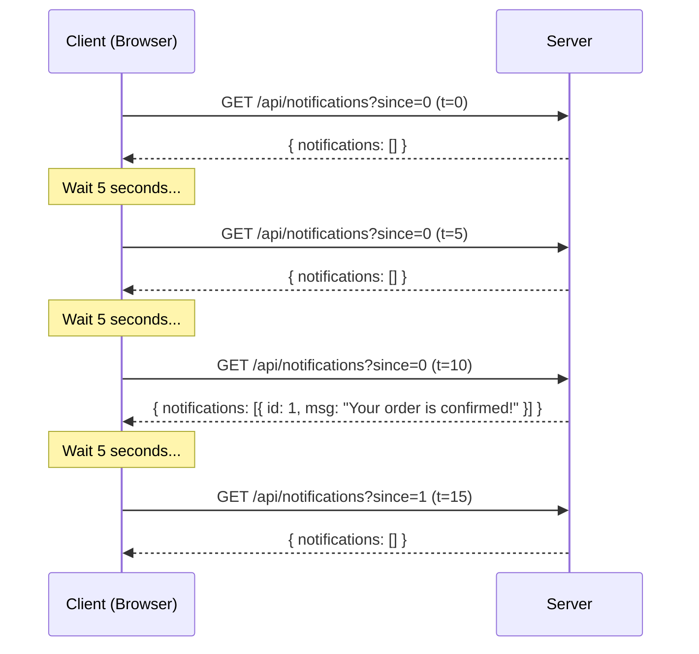

Notice: two out of four requests returned absolutely nothing useful. The server wasted time, the network wasted bandwidth, and the client waited up to 5 seconds for data that was ready at t=10.1 seconds.

### Code Example

**Client-side (JavaScript):**

```javascript
let lastNotificationId = 0;

function startShortPolling() {
  setInterval(async () => {
    try {
      const response = await fetch(`/api/notifications?since=${lastNotificationId}`);
      const data = await response.json();

      if (data.notifications.length > 0) {
        data.notifications.forEach(n => showNotification(n));
        // Track the latest ID so we don't re-fetch old ones
        lastNotificationId = data.notifications[data.notifications.length - 1].id;
      }
    } catch (err) {
      console.error('Poll failed:', err);
    }
  }, 5000); // Poll every 5 seconds
}

startShortPolling();
```

**Server-side (Node.js / Express):**

```javascript
app.get('/api/notifications', async (req, res) => {
  const since = parseInt(req.query.since) || 0;

  // Just query DB and return — no waiting, no magic
  const notifications = await db.notifications
    .where('id > ?', since)
    .where('userId = ?', req.user.id)
    .orderBy('id ASC')
    .getAll();

  res.json({ notifications });
});
```

### The Math That Shows Why This is Terrible

Let's say you have 100,000 users with your app open (reasonable for a mid-size product). Each polls every 5 seconds.

```
Requests per second = 100,000 / 5 = 20,000 req/sec
```

Now, what percentage of those actually have useful data? Let's say a user gets 5 notifications per hour on average.

```
Useful requests per user per hour = 5
Total requests per user per hour = 3600 / 5 = 720
Useful request percentage = 5 / 720 = 0.7%
```

**99.3% of your requests are completely useless.** You're burning server CPU, network bandwidth, and database connections for nothing. Yeh kyun important hai — at scale, this is the difference between a $500/month infra bill and a $50,000/month one.

### When Short Polling Makes Sense

- Checking if a background job finished (e.g., video processing, report generation) — poll every 10 seconds, nobody cares about 10 seconds of extra latency
- Admin dashboards showing metrics that update every minute
- Simple systems with very few users where engineering simplicity matters more
- When WebSockets are blocked (corporate firewalls) and long polling feels over-engineered

### When NOT to Use Short Polling

- Chat applications (5-second delay is awful for conversation)
- Live tracking (Uber/Swiggy map — would be jerky)
- Stock prices or sports scores
- Multiplayer games
- Anything where the user expects immediate feedback

---

## Long Polling

### The Analogy

You call the restaurant to check on your order. Instead of telling you "I don't know, call back later", the staff says "hold on, let me check." You stay on hold. The moment your order is ready, they come back to the phone and tell you. You hang up, then immediately call back to wait for the next update.

This is much better! You get told the instant something is ready. The restaurant doesn't have to deal with 50 repeated calls from you — just one at a time.

### Why It's Better Than Short Polling

The key insight: **the server can wait**. Instead of answering "nothing to report" immediately, the server holds the connection open and only responds when it actually has data (or a timeout occurs). This means:

1. Lower latency — you get the update the instant it's ready, not at the next poll interval
2. Fewer empty responses — the server only responds when there's something to say
3. Less wasted bandwidth — no more 99% useless responses

### How it Works

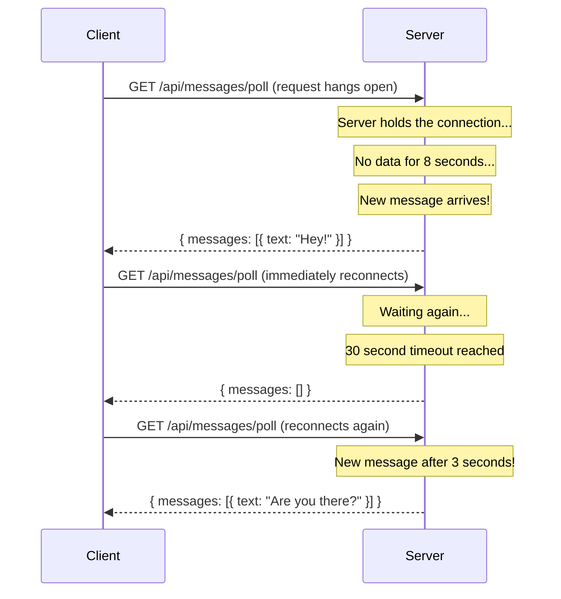

The client immediately reconnects after every response — whether it got data or hit a timeout. This creates a continuous "virtual" stream using plain HTTP.

### Code Example

**Server-side (Node.js / Express):**

```javascript
// Store waiting response objects, keyed by userId
const waitingClients = new Map(); // userId -> res object

app.get('/api/messages/poll', (req, res) => {
  const userId = req.user.id;

  // Set timeout — don't hold forever (proxies will cut us off anyway)
  const timeoutMs = 30000;

  const timeout = setTimeout(() => {
    // Time's up — send empty response. Client will reconnect.
    if (waitingClients.get(userId) === res) {
      waitingClients.delete(userId);
    }
    res.json({ messages: [] });
  }, timeoutMs);

  // Clean up if client disconnects before we respond
  req.on('close', () => {
    clearTimeout(timeout);
    if (waitingClients.get(userId) === res) {
      waitingClients.delete(userId);
    }
  });

  // Park this client — we'll respond when we have something
  waitingClients.set(userId, { res, timeout });
});

// Called when a new message arrives for a specific user
async function deliverMessageToUser(userId, message) {
  const waiting = waitingClients.get(userId);

  if (waiting) {
    // Client is currently waiting — respond immediately!
    clearTimeout(waiting.timeout);
    waitingClients.delete(userId);
    waiting.res.json({ messages: [message] });
  } else {
    // Client isn't polling right now — persist to DB for next poll
    await db.messages.insert({ userId, ...message });
  }
}
```

**Client-side:**

```javascript
async function longPoll() {
  // This runs in a loop forever
  while (true) {
    try {
      const response = await fetch('/api/messages/poll', {
        signal: AbortSignal.timeout(35000) // Client-side safety timeout
      });
      const data = await response.json();

      if (data.messages.length > 0) {
        data.messages.forEach(msg => displayMessage(msg));
      }

      // Whether we got data or a timeout, immediately reconnect
      // No sleep needed — server handles the waiting
    } catch (err) {
      if (err.name === 'AbortError') {
        // Timeout — just reconnect
        continue;
      }
      console.error('Long poll error:', err);
      // Network error — wait a bit before retrying
      await new Promise(r => setTimeout(r, 2000));
    }
  }
}

longPoll(); // Start it!
```

### The Hidden Costs of Long Polling

Even though it's better than short polling, long polling has real problems at scale:

1. **One connection per waiting client**: 100,000 users = 100,000 open HTTP connections. Most servers handle this okay, but it uses file descriptors and memory.

2. **HTTP overhead per message**: Every message delivery requires a full HTTP request-response cycle. Headers, cookies, TCP setup — all of this overhead happens for every single message.

3. **Can't parallelize**: While waiting for one message, the client can't easily do other things on the same connection.

4. **Complex server code**: You're fighting against HTTP's normal request-response nature. Keeping connections open, managing timeouts, handling disconnects — all of this is manual work.

5. **Proxy/timeout issues**: Enterprise proxies love killing long-lived HTTP connections. You need to tune timeouts carefully.

### When Long Polling Makes Sense

- When WebSockets are genuinely blocked (strict corporate firewalls or legacy infrastructure)
- Simple notification systems with low message frequency
- Legacy codebases where adding a WebSocket server is too much change
- Socket.io uses long polling as its fallback, so you often get it "for free"

---

## Server-Sent Events (SSE)

### The Analogy

Basically, SSE is like a radio broadcast. You tune your radio to FM 98.3 (make one HTTP request). The station (server) keeps broadcasting music and announcements continuously. You receive everything — you can't talk back to the radio station, but you don't need to. The radio station is always on, always broadcasting, and you just listen.

If your connection drops, your radio auto-tunes back to the same station when it can. This is the key magic of SSE — **automatic reconnection is built in**.

### Why SSE Exists

Long polling and short polling both have the same fundamental problem: they fight against HTTP's request-response nature. Every message requires starting a new conversation.

SSE says: "What if we just... kept the conversation open? The server just keeps talking, and the client just keeps listening?"

It works because HTTP has always supported **chunked transfer encoding** — the ability to send a response in multiple chunks over time, without specifying the total size upfront. SSE abuses this feature (in the best way) to create a long-lived one-directional stream.

### How it Works

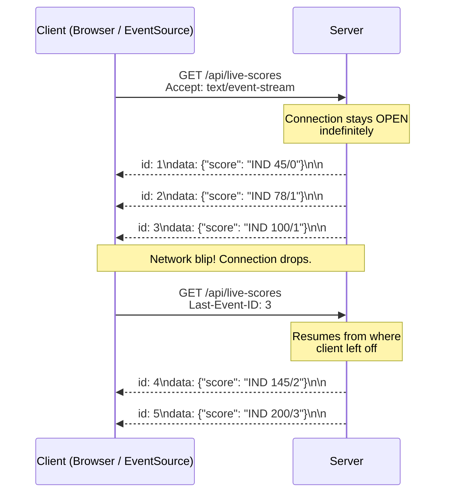

Notice that `Last-Event-ID` header — when the browser reconnects, it automatically tells the server where it left off. The server can then replay any missed events. This is a superpower that long polling doesn't have.

### The SSE Wire Format

This is beautifully simple. Over the wire, SSE events look like this:

```
id: 1
event: score-update
data: {"team": "IND", "score": "45/0", "overs": 10}

id: 2
event: wicket
data: {"player": "Rohit Sharma", "runs": 45, "mode": "caught"}

id: 3
event: score-update
data: {"team": "IND", "score": "78/1", "overs": 15.3}

: this is a comment line — used for keepalive pings, ignored by client

id: 4
event: boundary
data: {"player": "Virat Kohli", "type": "four"}

```

Key rules:
- `id:` — unique event ID, used for reconnection
- `event:` — optional event type name (for routing in browser)
- `data:` — the payload (can be multiple lines)
- `: ` — comment line (starts with colon) — ignored by EventSource, used for keepalive pings
- **Blank line** (`\n\n`) — separates events. This is mandatory.

### Code Example

**Server (Node.js / Express):**

```javascript
const EventEmitter = require('events');
const scoreEmitter = new EventEmitter(); // In real life, this'd be Redis pub/sub

app.get('/api/live-scores', (req, res) => {
  // These headers are the magic that tells browser "this is SSE"
  res.setHeader('Content-Type', 'text/event-stream');
  res.setHeader('Cache-Control', 'no-cache');
  res.setHeader('Connection', 'keep-alive');
  res.setHeader('X-Accel-Buffering', 'no'); // Crucial for Nginx — prevents response buffering
  res.setHeader('Access-Control-Allow-Origin', '*');

  // Flush headers immediately so the browser knows the connection is open
  res.flushHeaders();

  let eventId = parseInt(req.headers['last-event-id']) || 0;

  // Helper function to send a formatted SSE event
  const sendEvent = (eventType, data) => {
    eventId++;
    let message = `id: ${eventId}\n`;
    if (eventType) message += `event: ${eventType}\n`;
    message += `data: ${JSON.stringify(data)}\n\n`;
    res.write(message);
  };

  // Send initial state immediately
  sendEvent('connected', { message: 'Stream connected', eventId });

  // Subscribe to score updates (from Redis, DB triggers, etc.)
  const onScoreUpdate = (update) => sendEvent('score-update', update);
  const onWicket = (data) => sendEvent('wicket', data);
  const onBoundary = (data) => sendEvent('boundary', data);

  scoreEmitter.on('score', onScoreUpdate);
  scoreEmitter.on('wicket', onWicket);
  scoreEmitter.on('boundary', onBoundary);

  // Keepalive: send a comment line every 20 seconds
  // This prevents proxies and load balancers from killing idle connections
  const keepAliveInterval = setInterval(() => {
    res.write(': keepalive\n\n');
  }, 20000);

  // Cleanup when client disconnects
  req.on('close', () => {
    console.log('SSE client disconnected');
    clearInterval(keepAliveInterval);
    scoreEmitter.off('score', onScoreUpdate);
    scoreEmitter.off('wicket', onWicket);
    scoreEmitter.off('boundary', onBoundary);
    res.end();
  });
});

// Somewhere else in your code — triggering events
function updateScore(scoreData) {
  scoreEmitter.emit('score', scoreData);
}
```

**Client (Browser — the EventSource API):**

```javascript
// The browser's built-in EventSource API — no libraries needed!
const eventSource = new EventSource('/api/live-scores');

// Listen for connection
eventSource.onopen = () => {
  console.log('SSE connection established');
  updateConnectionStatus('connected');
};

// Listen for specific named events
eventSource.addEventListener('score-update', (event) => {
  const score = JSON.parse(event.data);
  updateScoreBoard(score);
  console.log(`Score: ${score.team} ${score.score} (${score.overs} overs)`);
});

eventSource.addEventListener('wicket', (event) => {
  const wicket = JSON.parse(event.data);
  showWicketAlert(wicket);
});

eventSource.addEventListener('boundary', (event) => {
  const boundary = JSON.parse(event.data);
  showBoundaryAnimation(boundary);
});

// The 'message' event fires for unnamed events (no 'event:' field)
eventSource.onmessage = (event) => {
  console.log('Generic message:', event.data);
};

// Error handling — browser automatically reconnects on error
eventSource.onerror = (err) => {
  if (eventSource.readyState === EventSource.CLOSED) {
    console.log('SSE connection closed');
    updateConnectionStatus('disconnected');
  } else if (eventSource.readyState === EventSource.CONNECTING) {
    console.log('SSE reconnecting...');
    updateConnectionStatus('reconnecting');
  }
  // Note: you do NOT need to manually reconnect — EventSource does it automatically!
};

// To manually close (e.g., user navigates away)
// eventSource.close();
```

### SSE on HTTP/2

One SSE limitation on HTTP/1.1: browsers have a **6 connections per domain** limit. If you open 6 SSE connections (say, for 6 different data streams), you've used up all your browser connections. No more requests until one closes.

HTTP/2 solves this completely. With HTTP/2's **multiplexing**, hundreds of streams run over a single TCP connection. SSE on HTTP/2 is essentially free — no connection limit issues. Most modern apps served over HTTPS use HTTP/2 by default, so this is less of a concern today.

### Real-World SSE Examples

- **GitHub**: When you watch a long-running action workflow, the log lines stream to your browser in real-time using SSE
- **Vercel deployment logs**: That live log output you see when deploying? SSE.
- **ChatGPT token streaming**: When you see Claude/ChatGPT typing its response character by character — that's SSE streaming from the LLM API
- **Cricbuzz live scores**: Real-time ball-by-ball updates use SSE-style streaming

### SSE Trade-offs

| Pro | Con |
|---|---|
| Single persistent connection (efficient) | One-directional only (server to client) |
| Auto-reconnect with Last-Event-ID | Text only — no binary data |
| Simple, plain HTTP (proxy/firewall friendly) | HTTP/1.1: browser limit of 6 connections per domain |
| Named events (built-in routing) | Cannot send data from client after initial request |
| Works with standard load balancers | Less universally known than WebSockets |
| No extra library — EventSource is native | Need keepalive pings for proxy compatibility |

---

## WebSockets

### The Analogy

WebSockets are like a phone call. You dial (handshake), the other person picks up (connection established), and now both of you can speak at any time. You don't have to wait for the other person to finish before you talk. Neither person has to hang up between messages. It's a true, open, two-way conversation.

Compare this to SSE (a radio broadcast — one direction) or long polling (a series of individual calls that you hang up and redial). WebSockets are the closest thing to a direct, persistent communication channel the web has.

### Why WebSockets Exist

SSE is great, but it only goes one way. What if the client needs to send data too?

- In a chat app, you receive messages (server → client) AND you send messages (client → server)
- In a multiplayer game, the server pushes everyone's position (server → client) AND you send your own position (client → server)
- In a collaborative editor like Google Docs, you receive other people's edits AND you send your own edits

For these use cases, you need a truly **bidirectional**, **persistent** channel. WebSockets provide this.

### The WebSocket Handshake

This is clever engineering. WebSockets start life as a regular HTTP/1.1 request, then **upgrade** to the WebSocket protocol. This means they can pass through standard web infrastructure (load balancers, firewalls) that only understand HTTP.

```
# Step 1: Client sends an HTTP upgrade request
GET /chat HTTP/1.1
Host: chat.example.com
Connection: Upgrade
Upgrade: websocket
Sec-WebSocket-Key: dGhlIHNhbXBsZSBub25jZQ==
Sec-WebSocket-Version: 13
Sec-WebSocket-Protocol: chat, superchat
Origin: https://example.com

# Step 2: Server agrees to upgrade
HTTP/1.1 101 Switching Protocols
Upgrade: websocket
Connection: Upgrade
Sec-WebSocket-Accept: s3pPLMBiTxaQ9kYGzzhZRbK+xOo=
Sec-WebSocket-Protocol: chat
```

The `101 Switching Protocols` response means: "Deal. The HTTP conversation is over. This TCP connection now belongs to WebSocket."

After this exchange, the connection is just raw TCP frames — no more HTTP headers, no more request-response cycle. Both sides can send whenever they want.

The `Sec-WebSocket-Key` / `Sec-WebSocket-Accept` is a security handshake to prevent certain types of cross-protocol attacks. The server computes `ACCEPT = base64(sha1(KEY + magic_string))`.

### WebSocket Connection Lifecycle

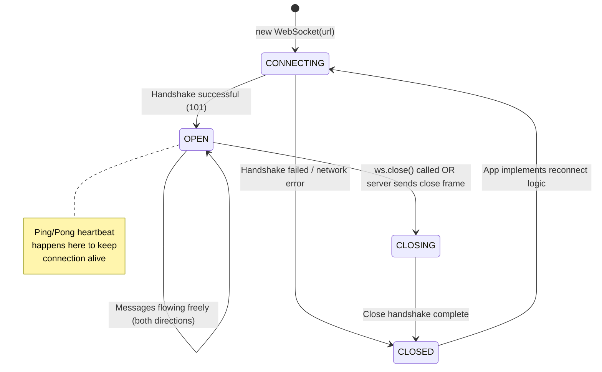

**The Four States:**
1. `CONNECTING` (0) — handshake in progress
2. `OPEN` (1) — connected, messages flowing
3. `CLOSING` (2) — close handshake initiated
4. `CLOSED` (3) — connection terminated

### Heartbeat: Ping/Pong

WebSocket connections can **silently die**. NAT routers, load balancers, and proxies often kill idle TCP connections after 60-90 seconds. Your code thinks the connection is open, but the socket is actually dead.

The solution: **ping/pong heartbeat**. The server sends a ping frame periodically; the client must respond with a pong frame. If no pong arrives, the server knows the connection is dead and can clean up.

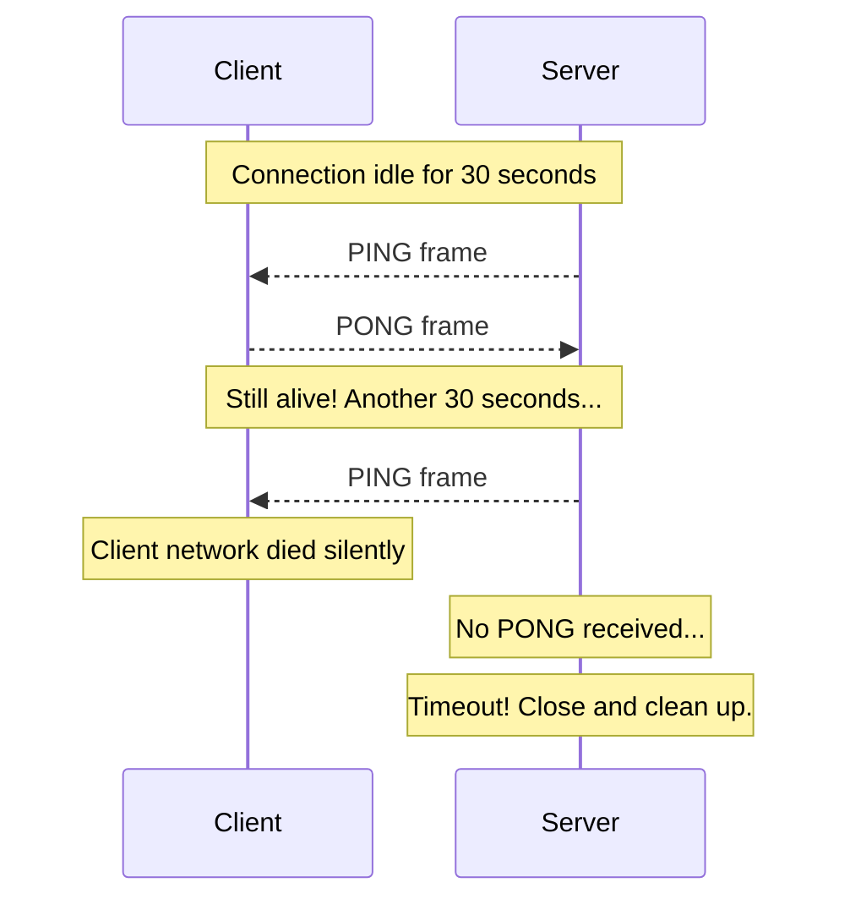

### Code Example — Full WebSocket Chat

**Server (Node.js with the `ws` library):**

```javascript
const WebSocket = require('ws');
const http = require('http');

const server = http.createServer();
const wss = new WebSocket.Server({ server });

// Room management
const rooms = new Map(); // roomId -> Set<WebSocket>
const clients = new Map(); // WebSocket -> { userId, roomId }

wss.on('connection', (ws, req) => {
  // Extract userId from query params or session
  const userId = new URLSearchParams(req.url.slice(1)).get('userId');
  clients.set(ws, { userId, roomId: null });

  console.log(`User ${userId} connected`);

  ws.on('message', (rawData) => {
    let message;
    try {
      message = JSON.parse(rawData);
    } catch {
      ws.send(JSON.stringify({ type: 'error', message: 'Invalid JSON' }));
      return;
    }

    const clientInfo = clients.get(ws);

    switch (message.type) {
      case 'join-room': {
        // Leave current room if in one
        if (clientInfo.roomId) {
          leaveRoom(ws, clientInfo.roomId);
        }

        // Join new room
        const roomId = message.roomId;
        clientInfo.roomId = roomId;

        if (!rooms.has(roomId)) rooms.set(roomId, new Set());
        rooms.get(roomId).add(ws);

        // Notify others in the room
        broadcast(roomId, ws, {
          type: 'user-joined',
          userId: clientInfo.userId,
          timestamp: Date.now()
        });

        ws.send(JSON.stringify({
          type: 'room-joined',
          roomId,
          memberCount: rooms.get(roomId).size
        }));
        break;
      }

      case 'chat-message': {
        if (!clientInfo.roomId) {
          ws.send(JSON.stringify({ type: 'error', message: 'Join a room first' }));
          return;
        }

        // Broadcast to everyone in the room (including sender)
        broadcastAll(clientInfo.roomId, {
          type: 'chat-message',
          from: clientInfo.userId,
          text: message.text,
          timestamp: Date.now()
        });
        break;
      }

      case 'typing': {
        if (clientInfo.roomId) {
          // Broadcast "user is typing" to others only
          broadcast(clientInfo.roomId, ws, {
            type: 'user-typing',
            userId: clientInfo.userId
          });
        }
        break;
      }
    }
  });

  ws.on('close', (code, reason) => {
    console.log(`User ${clients.get(ws)?.userId} disconnected: ${code}`);
    const clientInfo = clients.get(ws);
    if (clientInfo?.roomId) {
      leaveRoom(ws, clientInfo.roomId);
    }
    clients.delete(ws);
  });

  ws.on('error', (err) => {
    console.error(`WebSocket error for user ${clients.get(ws)?.userId}:`, err);
  });

  // Ping every 30 seconds to keep connection alive
  const pingInterval = setInterval(() => {
    if (ws.readyState === WebSocket.OPEN) {
      ws.ping(); // ws library handles pong automatically
    } else {
      clearInterval(pingInterval);
    }
  }, 30000);

  ws.on('close', () => clearInterval(pingInterval));
});

// Broadcast to all in room EXCEPT sender
function broadcast(roomId, senderWs, data) {
  const room = rooms.get(roomId);
  if (!room) return;

  const message = JSON.stringify(data);
  room.forEach(client => {
    if (client !== senderWs && client.readyState === WebSocket.OPEN) {
      client.send(message);
    }
  });
}

// Broadcast to ALL in room (including sender)
function broadcastAll(roomId, data) {
  const room = rooms.get(roomId);
  if (!room) return;

  const message = JSON.stringify(data);
  room.forEach(client => {
    if (client.readyState === WebSocket.OPEN) {
      client.send(message);
    }
  });
}

function leaveRoom(ws, roomId) {
  const room = rooms.get(roomId);
  if (!room) return;
  room.delete(ws);
  if (room.size === 0) rooms.delete(roomId);
  else {
    broadcast(roomId, ws, {
      type: 'user-left',
      userId: clients.get(ws)?.userId,
      timestamp: Date.now()
    });
  }
}

server.listen(3000, () => console.log('WebSocket server running on :3000'));
```

**Client (Browser):**

```javascript
class ChatClient {
  constructor(serverUrl, userId) {
    this.serverUrl = serverUrl;
    this.userId = userId;
    this.ws = null;
    this.reconnectAttempts = 0;
    this.maxReconnectAttempts = 10;
    this.connect();
  }

  connect() {
    this.ws = new WebSocket(`${this.serverUrl}?userId=${this.userId}`);

    this.ws.onopen = () => {
      console.log('Connected to chat server');
      this.reconnectAttempts = 0; // Reset on successful connection
      updateUIStatus('connected');
    };

    this.ws.onmessage = (event) => {
      const message = JSON.parse(event.data);
      this.handleMessage(message);
    };

    this.ws.onclose = (event) => {
      console.log(`Disconnected: ${event.code} - ${event.reason}`);
      updateUIStatus('disconnected');
      this.scheduleReconnect();
    };

    this.ws.onerror = (err) => {
      console.error('WebSocket error:', err);
    };
  }

  handleMessage(message) {
    switch (message.type) {
      case 'chat-message':
        displayMessage(message);
        break;
      case 'user-joined':
        showSystemMessage(`${message.userId} joined the room`);
        break;
      case 'user-left':
        showSystemMessage(`${message.userId} left the room`);
        break;
      case 'user-typing':
        showTypingIndicator(message.userId);
        break;
      case 'error':
        console.error('Server error:', message.message);
        break;
    }
  }

  scheduleReconnect() {
    if (this.reconnectAttempts >= this.maxReconnectAttempts) {
      console.error('Max reconnection attempts reached');
      updateUIStatus('failed');
      return;
    }

    // Exponential backoff: 1s, 2s, 4s, 8s, 16s, ... max 30s
    const delay = Math.min(1000 * Math.pow(2, this.reconnectAttempts), 30000);
    this.reconnectAttempts++;

    console.log(`Reconnecting in ${delay}ms (attempt ${this.reconnectAttempts})`);
    setTimeout(() => this.connect(), delay);
  }

  joinRoom(roomId) {
    this.send({ type: 'join-room', roomId });
  }

  sendMessage(text) {
    this.send({ type: 'chat-message', text });
  }

  sendTyping() {
    this.send({ type: 'typing' });
  }

  send(data) {
    if (this.ws && this.ws.readyState === WebSocket.OPEN) {
      this.ws.send(JSON.stringify(data));
    } else {
      console.warn('WebSocket not connected, message dropped');
    }
  }

  disconnect() {
    if (this.ws) {
      this.ws.close(1000, 'User logged out'); // 1000 = normal closure
    }
  }
}

// Usage
const chat = new ChatClient('wss://chat.example.com', 'user123');
chat.joinRoom('room:general');
chat.sendMessage('Hello everyone!');
```

---

## WebSockets at Scale — The Real Challenge

### The Problem: Stateful Connections

Here's where things get genuinely hard. WebSockets create a **stateful**, persistent connection between a specific client and a specific server. In a world where we horizontally scale servers, this is a big problem.

Imagine WhatsApp with 3 backend servers:

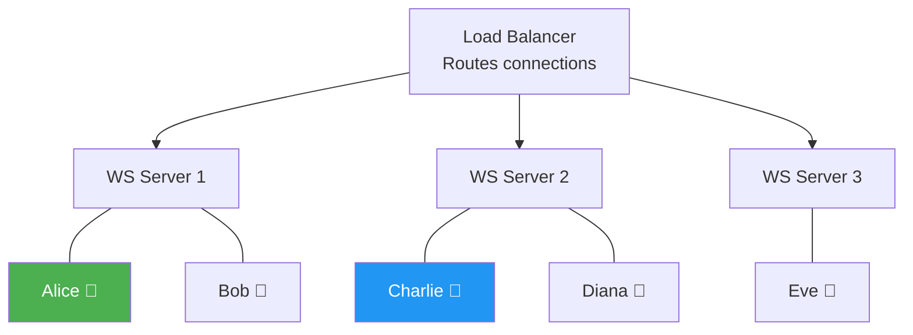

Alice is on Server 1. She sends a message to Charlie. The message arrives at Server 1.

**But Charlie is connected to Server 2. Server 1 has no idea where Charlie is.**

How does Server 1 deliver the message to Charlie?

### Solution 1: Sticky Sessions (Simple, Fragile)

Configure the load balancer to always route the same client to the same server — usually based on IP or a session cookie.

```
Client A always goes to Server 1
Client B always goes to Server 2
```

Pros: Simple to set up. No coordination needed between servers.

Cons:
- **No true horizontal scaling**: All of Alice's friends get routed to Server 1, overloading it
- **Single point of failure**: Server 1 goes down → Alice, Bob lose their connections (and potentially queued messages)
- **Uneven load**: Some servers get hot, others sit idle

Sticky sessions are a **temporary hack**, not a real solution.

### Solution 2: Redis Pub/Sub (The Right Way)

Every WebSocket server subscribes to a shared Redis channel. When Server 1 receives a message for Charlie, it publishes to Redis. Redis fans it out to all servers. Server 2 is subscribed and delivers it to Charlie.

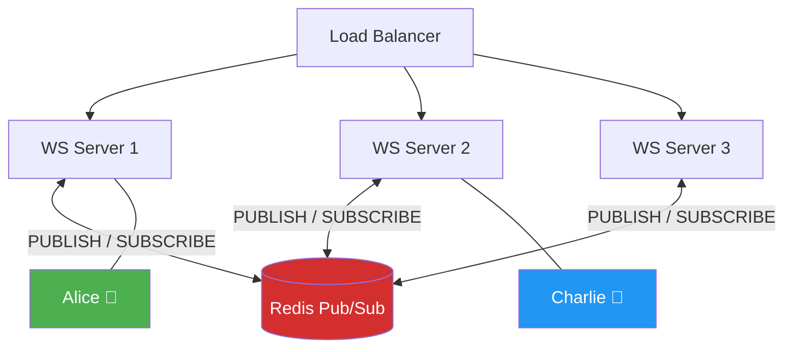

**The message flow:**
1. Alice sends "Hey Charlie!" to WS Server 1
2. Server 1 looks up Charlie's userId → publishes to Redis channel `user:charlie`
3. Redis broadcasts to all WS servers subscribed to `user:charlie`
4. Server 2 receives it (it has Charlie's connection) → delivers to Charlie
5. Charlie receives the message, responds
6. Charlie's message hits Server 2 → Server 2 publishes to `user:alice` → Server 1 delivers to Alice

```javascript
const { createClient } = require('redis');
const WebSocket = require('ws');

// Redis requires separate clients for pub and sub
const pubClient = createClient({ url: 'redis://redis-server:6379' });
const subClient = pubClient.duplicate();

await pubClient.connect();
await subClient.connect();

// Track which users are on THIS server
const localClients = new Map(); // userId -> WebSocket

// Subscribe to messages meant for users on this server
// In production, each server subscribes to a wildcard or specific channels
await subClient.pSubscribe('user:*', (message, channel) => {
  const userId = channel.replace('user:', '');
  const ws = localClients.get(userId);

  if (ws && ws.readyState === WebSocket.OPEN) {
    ws.send(message); // Deliver to the local connection
  }
  // If user not here, message is ignored (another server delivered it)
});

wss.on('connection', (ws, req) => {
  const userId = getUserIdFromRequest(req);
  localClients.set(userId, ws);

  ws.on('message', async (rawData) => {
    const { targetUserId, text } = JSON.parse(rawData);

    // Publish to Redis — the server that has targetUserId will deliver it
    await pubClient.publish(`user:${targetUserId}`, JSON.stringify({
      from: userId,
      text,
      timestamp: Date.now()
    }));
  });

  ws.on('close', () => {
    localClients.delete(userId);
  });
});
```

### Solution 3: Managed WebSocket Services

For most companies, building and maintaining this Redis infrastructure is not worth it. Services like **Ably**, **Pusher**, and **Socket.io Cloud** handle all of this:
- Connection management and scaling
- Redis-style fan-out, built-in
- Global edge servers (low latency worldwide)
- Presence (who's online?)
- Message history and replay

Slack, for example, uses a sophisticated version of this — their real-time messaging layer handles millions of persistent WebSocket connections, using their own internal pub/sub infrastructure.

---

## Socket.io: WebSockets with Superpowers

Socket.io is not just a WebSocket wrapper — it's a complete real-time framework that adds:

- **Automatic fallback**: Tries WebSockets first; falls back to long polling if blocked
- **Rooms**: Group multiple clients together. `io.to('room1').emit(...)` broadcasts to all in room1
- **Namespaces**: Logical separation within one server (`/chat`, `/notifications`, `/admin`)
- **Acknowledgements**: Client can confirm receipt: `socket.emit('msg', data, callback)`
- **Auto-reconnect**: Exponential backoff reconnection built-in
- **Redis adapter**: Horizontal scaling via Redis, one line of config

```javascript
// Server — Socket.io with Redis adapter for horizontal scaling
const { Server } = require('socket.io');
const { createAdapter } = require('@socket.io/redis-adapter');
const { createClient } = require('redis');

const io = new Server(httpServer, {
  cors: { origin: '*' },
  transports: ['websocket', 'polling'] // Try WebSocket first, fall back to polling
});

// Redis adapter for scaling across multiple servers
const pubClient = createClient({ url: 'redis://redis:6379' });
const subClient = pubClient.duplicate();
await Promise.all([pubClient.connect(), subClient.connect()]);
io.adapter(createAdapter(pubClient, subClient));

// Namespaces
const chatNs = io.of('/chat');
const notifNs = io.of('/notifications');

chatNs.on('connection', (socket) => {
  console.log(`User connected: ${socket.id}`);

  socket.on('join-room', (roomId, callback) => {
    socket.join(roomId); // One line! No manual room management.

    // Emit to everyone in the room that user joined
    socket.to(roomId).emit('user-joined', {
      userId: socket.data.userId,
      roomId
    });

    // Acknowledgement back to the joining client
    callback({ success: true, roomId });
  });

  socket.on('chat-message', (data) => {
    // Broadcast to everyone in the room — works across ALL servers!
    // The Redis adapter handles fan-out automatically.
    io.of('/chat').to(data.roomId).emit('new-message', {
      from: socket.data.userId,
      text: data.text,
      timestamp: Date.now()
    });
  });

  socket.on('disconnect', (reason) => {
    console.log(`User disconnected: ${reason}`);
  });
});

// Client-side Socket.io
// <script src="/socket.io/socket.io.js"></script>
const socket = io('https://example.com/chat', {
  auth: { token: 'user-jwt-token' },
  reconnectionAttempts: 10,
  reconnectionDelay: 1000,
  reconnectionDelayMax: 30000
});

socket.on('connect', () => {
  console.log('Connected:', socket.id);
  socket.emit('join-room', 'room:general', (response) => {
    console.log('Joined room:', response.roomId);
  });
});

socket.on('new-message', (message) => {
  displayMessage(message);
});

socket.on('disconnect', (reason) => {
  if (reason === 'io server disconnect') {
    // Server explicitly kicked us — reconnect manually
    socket.connect();
  }
  // Otherwise Socket.io reconnects automatically
});
```

### When to Use Socket.io vs Raw WebSockets

| Use Socket.io when... | Use raw WebSockets when... |
|---|---|
| Building a chat app or notification system | Building a multiplayer game (need low overhead, binary) |
| You need rooms and namespaces | You need pure WebSocket binary frames |
| You want automatic fallback | Your team has WebSocket expertise |
| You need auto-reconnect out of the box | You're using a language/platform without Socket.io |
| Redis scaling adapter is a plus | You need sub-millisecond performance |

---

## The Complete Comparison Table

| Feature | Short Polling | Long Polling | SSE | WebSockets |
|---|---|---|---|---|
| **Direction** | Client → Server (asks) | Client → Server (waits) | Server → Client only | Full-duplex (both ways) |
| **Latency** | Up to poll interval (N sec) | Near real-time | Real-time | Real-time |
| **Protocol** | HTTP | HTTP | HTTP (chunked) | WS/WSS (TCP) |
| **Connection** | New connection per request | Held open, reopened per message | Single persistent connection | Single persistent connection |
| **Binary support** | No (base64 workaround) | No | No | Yes (native) |
| **Auto-reconnect** | Manual (setInterval survives) | Manual | Yes (EventSource built-in) | Manual |
| **Browser support** | All | All | All modern (IE: No) | All modern (IE11: partial) |
| **Proxy/Firewall** | Excellent | Good | Good (it's HTTP) | Sometimes blocked |
| **Server memory** | Low (stateless) | Medium (held connections) | Low (streaming) | Medium (persistent sockets) |
| **Overhead per message** | Full HTTP round-trip | Full HTTP round-trip | Nearly zero (already connected) | Nearly zero (tiny WS frame) |
| **Horizontal scaling** | Trivial (stateless) | Easy | Easy (each client on one server) | Hard (need Redis pub/sub) |
| **Complexity** | Very Low | Medium | Low | High |
| **Named event types** | No | No | Yes (event: field) | No (you implement manually) |
| **Sending client data** | Every request | Every reconnect request | Cannot (separate POST) | Anytime, effortlessly |
| **Best for** | Background job status, rare updates | Legacy systems, notifications | Live feeds, scores, logs, AI streaming | Chat, gaming, collaborative editing |

---

## Real-World Technology Mapping

| Company / Product | Technology Used | Why |
|---|---|---|
| **Slack** | WebSockets | Full bidirectional chat, typing indicators, presence |
| **WhatsApp Web** | WebSockets | Real-time messaging, delivery receipts |
| **GitHub Actions logs** | SSE | One-way log streaming from server to browser |
| **ChatGPT / Claude** | SSE | AI token streaming — server pushes tokens as generated |
| **Twitter/X Streaming API** | Chunked HTTP (like SSE) | One-way tweet stream to subscribed clients |
| **Google Docs** | WebSockets | Bidirectional: send your edits, receive others' edits |
| **Figma** | WebSockets | Multiplayer cursor positions, real-time collaborative design |
| **Zerodha (stock prices)** | WebSockets | Sub-second price updates, bidirectional order placement |
| **Swiggy live tracking** | WebSockets | Rider position updates, chat with delivery person |
| **Cricbuzz scores** | SSE or WebSockets | Ball-by-ball updates (largely one-way) |
| **YouTube live comments** | SSE or Long Polling | One-way comment stream |
| **Vercel deploy logs** | SSE | Real-time log streaming |

---

## Architecture Diagrams

### Short Polling Architecture (Simple)

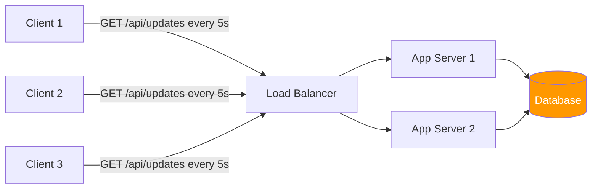

Stateless, scales trivially. No special infra needed. But 95% of requests return nothing useful.

### SSE Architecture (One-Way Push)

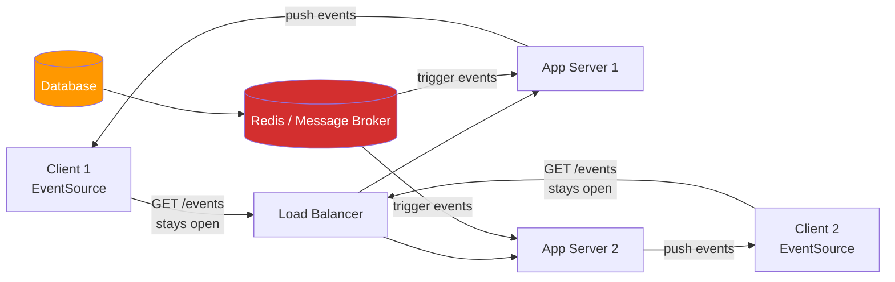

Each client's SSE stream lives on one server. No cross-server coordination needed (unlike WebSockets) because SSE is one-way. The server just needs to know when to push an update.

### WebSocket Architecture at Scale (Redis Pub/Sub)

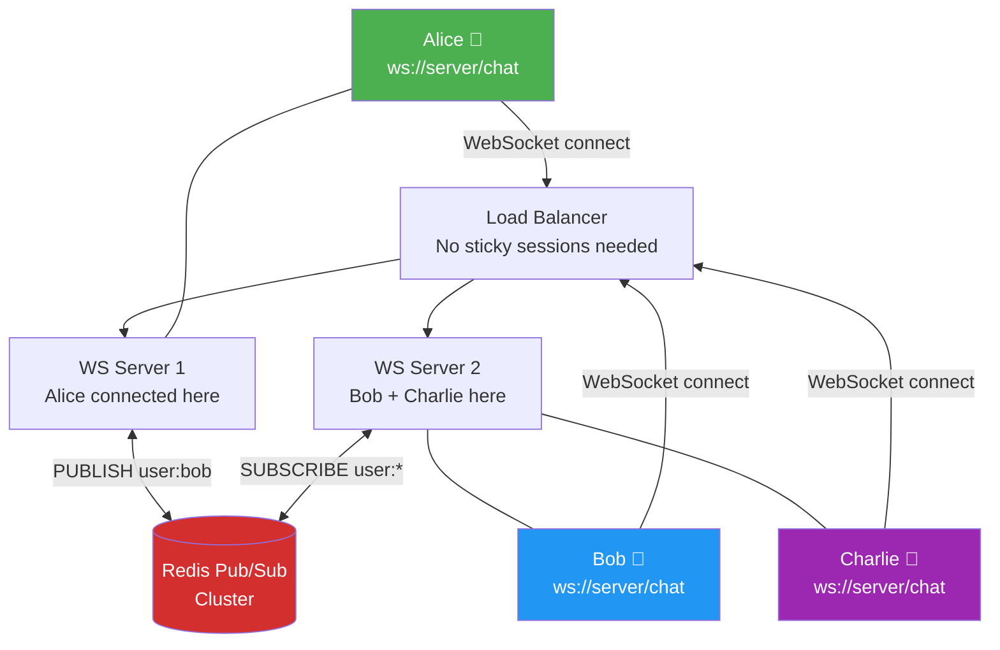

**Message flow: Alice sends to Bob**
1. Alice sends `{to: "bob", text: "Hey!"}` → WS Server 1
2. WS Server 1: `redis.publish("user:bob", message)`
3. Redis fans out to all WS servers
4. WS Server 2 receives it (Bob is here) → delivers to Bob's socket
5. Bob replies → WS Server 2: `redis.publish("user:alice", reply)`
6. WS Server 1 receives it → delivers to Alice

### Decision Flow: Which Approach to Choose?

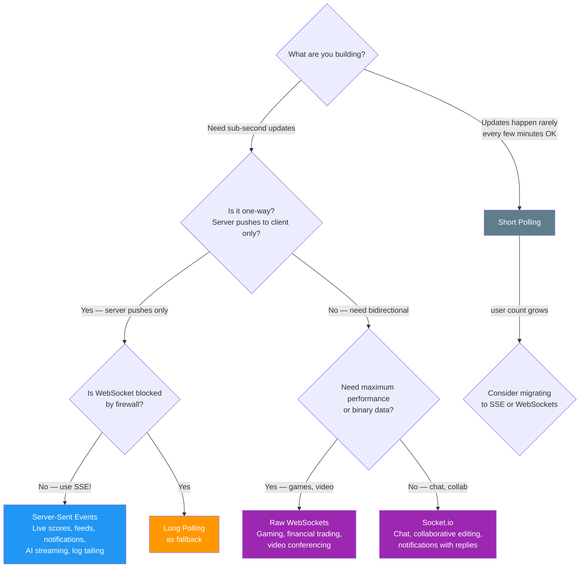

---

## Common Pitfalls and How to Avoid Them

### WebSocket Pitfalls

**1. No message queue = messages lost on disconnect**

If a client disconnects and reconnects, any messages sent during that gap are gone forever. Always persist messages to a database or message queue:

```javascript
// Bad: fire and forget
ws.send(JSON.stringify({ text: 'Hello!' }));

// Better: persist first, then deliver
await db.messages.insert({ to: userId, text: 'Hello!', status: 'pending' });
await deliverToUserIfOnline(userId, message);
// If offline, message stays in DB — delivered on next connect
```

**2. Silent connection death without heartbeat**

NAT boxes and proxies kill idle TCP connections after 60-120 seconds. Without heartbeat, your server thinks Alice is connected when she's actually been gone for 10 minutes.

```javascript
// Always implement ping/pong
const HEARTBEAT_INTERVAL = 30000; // 30 seconds
const HEARTBEAT_TIMEOUT = 10000;  // 10 second timeout for pong

wss.on('connection', (ws) => {
  ws.isAlive = true;
  ws.on('pong', () => { ws.isAlive = true; }); // Client responded

  const interval = setInterval(() => {
    if (!ws.isAlive) {
      ws.terminate(); // No pong received — kill and clean up
      return;
    }
    ws.isAlive = false; // Reset, waiting for next pong
    ws.ping();
  }, HEARTBEAT_INTERVAL);

  ws.on('close', () => clearInterval(interval));
});
```

**3. Memory leaks from uncleaned room memberships**

Always clean up on disconnect:

```javascript
ws.on('close', () => {
  // ALWAYS do this cleanup
  localClients.delete(userId);
  if (currentRoomId) {
    rooms.get(currentRoomId)?.delete(ws);
  }
  clearInterval(pingInterval);
  subscription.unsubscribe(); // Redis subscription
});
```

### SSE Pitfalls

**1. Proxy/Nginx buffering kills SSE**

By default, Nginx buffers responses. SSE events get held until the buffer fills. Add these headers:

```javascript
res.setHeader('X-Accel-Buffering', 'no'); // For Nginx
res.setHeader('Cache-Control', 'no-cache');
```

And in Nginx config:
```nginx
location /api/events {
    proxy_buffering off;
    proxy_cache off;
    proxy_pass http://backend;
}
```

**2. No keepalive = proxy kills idle SSE connections**

Send a comment line every 15-20 seconds:

```javascript
const keepAlive = setInterval(() => {
  res.write(': keepalive\n\n');
}, 20000);
```

**3. Browser limit of 6 SSE connections per domain (HTTP/1.1)**

On HTTP/1.1, each SSE connection uses one of the browser's 6 connections to your domain. A user with 2 tabs open and 3 SSE connections per tab could hit the limit. Solutions:
- Serve your app over HTTP/2 (which multiplexes — no limit)
- Share one SSE connection across tabs using BroadcastChannel
- Route all SSE through a single connection with a multiplexing layer

### Long Polling Pitfalls

**1. Race conditions on reconnect**

The client might reconnect before the server has processed the close. Use a small delay on reconnect and ensure server-side state is cleaned up synchronously:

```javascript
req.on('close', () => {
  // Synchronously remove from waiting list
  // Don't leave orphan timeouts hanging
  clearTimeout(timeoutRef);
  waitingClients.delete(userId);
});
```

---

## Summary: When to Use What

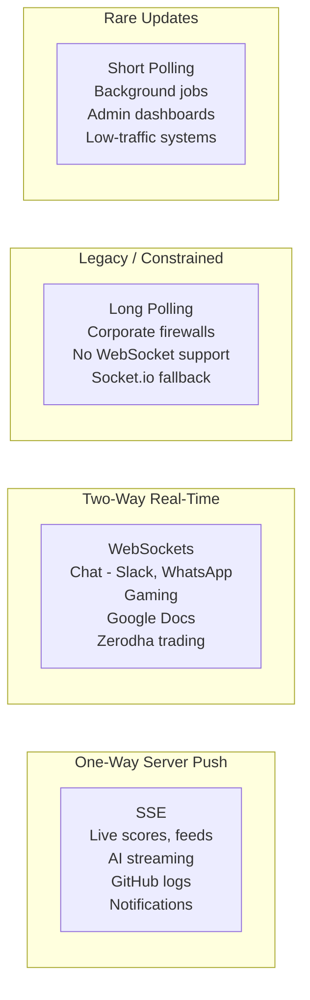

---

## Common Interview Questions

### "How does real-time work in a chat application like WhatsApp?"

**Answer structure:**
1. Each client connects via WebSocket to a WS server
2. Message flow: client → WS server → Redis pub/sub → other WS servers → recipient client
3. If recipient is offline: persist to DB → deliver on reconnect
4. Mention: connection state management, heartbeat, reconnection logic
5. Scaling: horizontal WS servers + Redis pub/sub, no sticky sessions

### "What's the difference between WebSockets and SSE? Which would you use for a live sports dashboard?"

**Answer:**
- WebSocket: full-duplex, client and server can both send at any time. Needed for chat, gaming.
- SSE: server to client only, but simpler, HTTP-based, auto-reconnects, named events.
- For a sports dashboard: **SSE**. The browser only receives score updates — it doesn't need to send anything to the score server. SSE is simpler, works through proxies, and auto-reconnects.
- If you also need a "bet now" button → that's a separate POST request. SSE for scores, REST for actions.

### "How would you scale WebSockets to 1 million concurrent users?"

**Answer:**
1. Horizontal scaling: multiple WS servers behind a load balancer (no sticky sessions)
2. Redis pub/sub for cross-server message routing
3. Connection limits: each server handles ~50,000 connections (file descriptor limits, tune with `ulimit`)
4. So 1M users ÷ 50K per server = ~20 WS servers
5. Stateless routing: store user → server mapping in Redis (which server is each user on?)
6. Message durability: persist to DB or Kafka for offline delivery, message history
7. Consider managed solutions: Ably, Pusher for further scale

### "Why does WebSocket still start with an HTTP handshake?"

**Answer:**
- Port compatibility: HTTP and WebSockets use the same ports (80, 443)
- Firewall compatibility: firewalls that only allow HTTP traffic will let the initial upgrade request through
- Load balancer compatibility: HTTP-aware load balancers can route the initial request, then let the TCP connection pass through
- After the 101 response, it's pure TCP WebSocket frames — no more HTTP overhead

### "What is SSE's Last-Event-ID and why is it useful?"

**Answer:**
- Every SSE event can have an `id:` field
- The browser automatically stores the last received ID
- On reconnection, the browser sends `Last-Event-ID: <id>` in the reconnect request
- The server can use this to **replay missed events** (from a message queue or DB)
- This makes SSE resilient to network drops — clients never miss events

### "How do you prevent WebSocket connections from silently dying?"

**Answer:**
- Implement ping/pong heartbeat: server pings every 30 seconds
- Client must pong within 10 seconds
- If no pong: server terminates and cleans up the connection
- On client side: use `ws.onclose` to detect and implement exponential backoff reconnection

### "Short polling vs Long Polling — when would you choose one over the other?"

**Answer:**
- Short polling when: updates are infrequent (every few minutes), simplicity matters, very few users, or real-time doesn't matter
- Long polling when: you need near real-time, WebSockets are blocked, and you can't use SSE. It's the "works everywhere" fallback.
- In modern systems, you'd rarely choose either — SSE or WebSockets are almost always better. Long polling exists as a fallback (Socket.io uses it automatically).

---

## Key Takeaways

1. **HTTP is request-response by design** — the server cannot initiate. All four approaches are creative workarounds for this fundamental constraint.

2. **Short polling** is the simplest approach but wasteful. Most requests return nothing. Only use for rare updates or when engineering simplicity truly matters.

3. **Long polling** is HTTP-only near-real-time. The server holds the connection open until it has data, then the client immediately reconnects. Better than short polling but has HTTP overhead per message and complex server-side code.

4. **SSE is underrated**. For one-way server push (live scores, notifications, AI token streaming, log tailing), SSE is the right tool — simple, HTTP-based, auto-reconnects with Last-Event-ID, and named event types. Most engineers jump straight to WebSockets when SSE would be simpler and sufficient.

5. **WebSockets** are for true bidirectionality — when both client and server need to initiate messages. Chat, multiplayer games, collaborative editing. They are powerful but come with real complexity around scaling.

6. **The WebSocket horizontal scaling problem is real**: Client A on Server 1 cannot directly send to Client B on Server 2. The solution is **Redis Pub/Sub** — all servers subscribe to Redis; any server can publish; the server with the target client delivers it. Sticky sessions are a fragile workaround.

7. **Heartbeat (ping/pong) is not optional** in WebSockets. NAT routers and proxies silently kill idle TCP connections. Without heartbeat, your server will hold dead connections for hours.

8. **Socket.io** adds rooms, namespaces, auto-reconnect, Redis adapter, and fallback to long polling. It's the pragmatic production choice for most chat/notification systems.

9. **For the interview**, the decision framework is:
   - One-way push? → **SSE** (unless legacy/firewalls → long polling)
   - Two-way real-time? → **WebSockets** (Socket.io for most apps, raw WS for games/trading)
   - Rare updates, don't need real-time? → **Short polling** for simplicity
   - Scale WebSockets? → Always say **Redis Pub/Sub**, never sticky sessions as a final answer

10. **Real examples to drop in interviews**: Slack and WhatsApp use WebSockets. GitHub Actions logs and ChatGPT/Claude use SSE. Twitter Streaming API uses chunked HTTP (essentially SSE). Zerodha uses WebSockets for live price feeds.

---

*Chapter 29 | System Design Notes | HLD Series*
