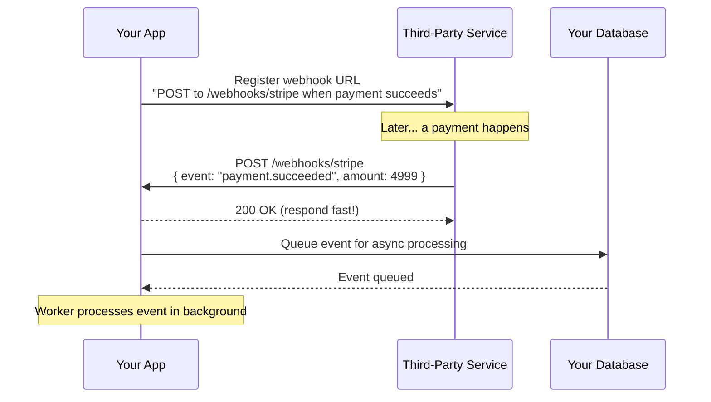
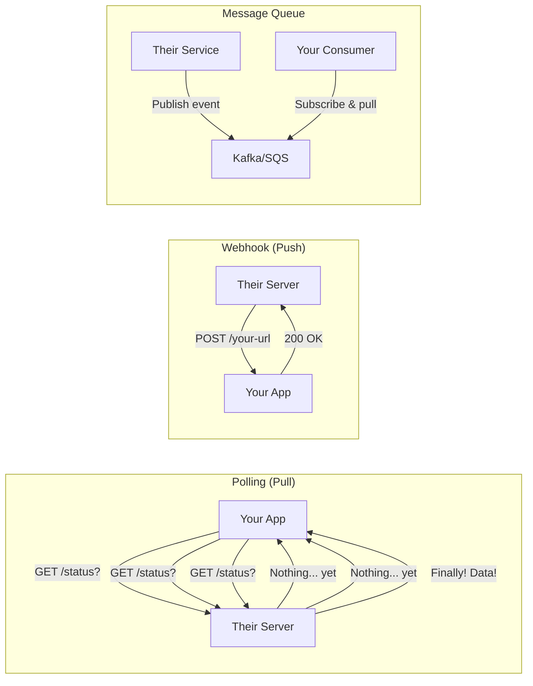
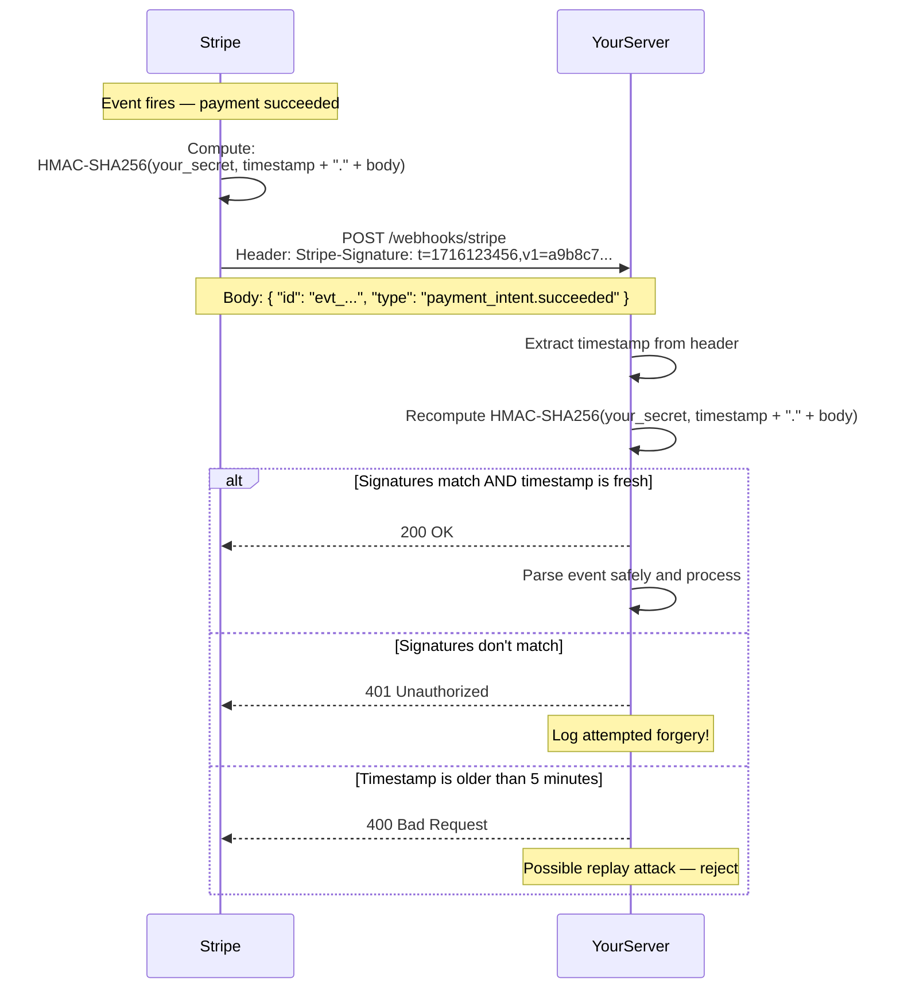
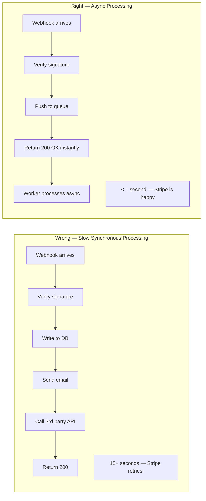
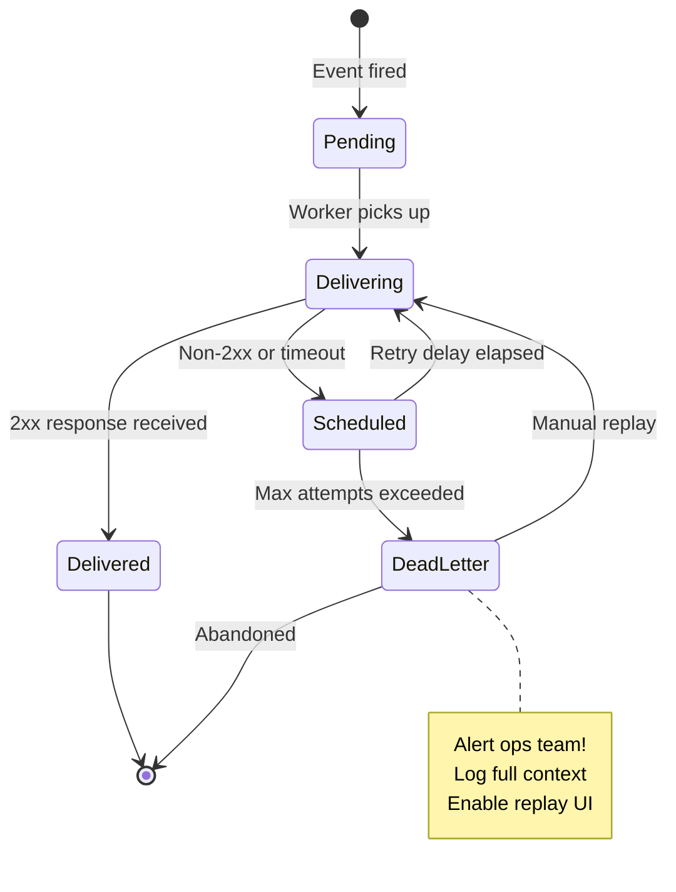
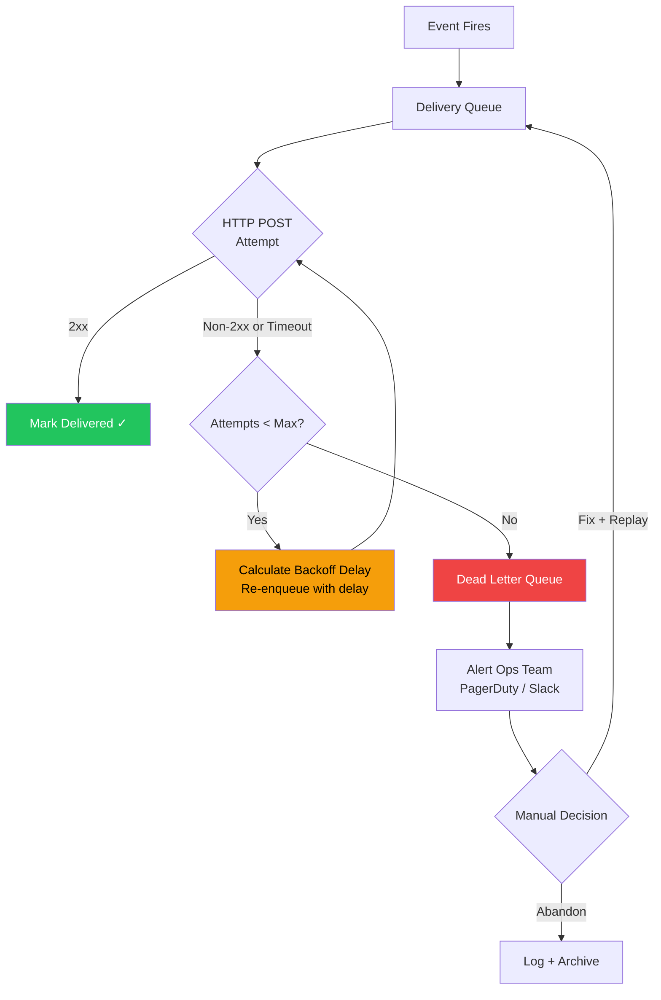
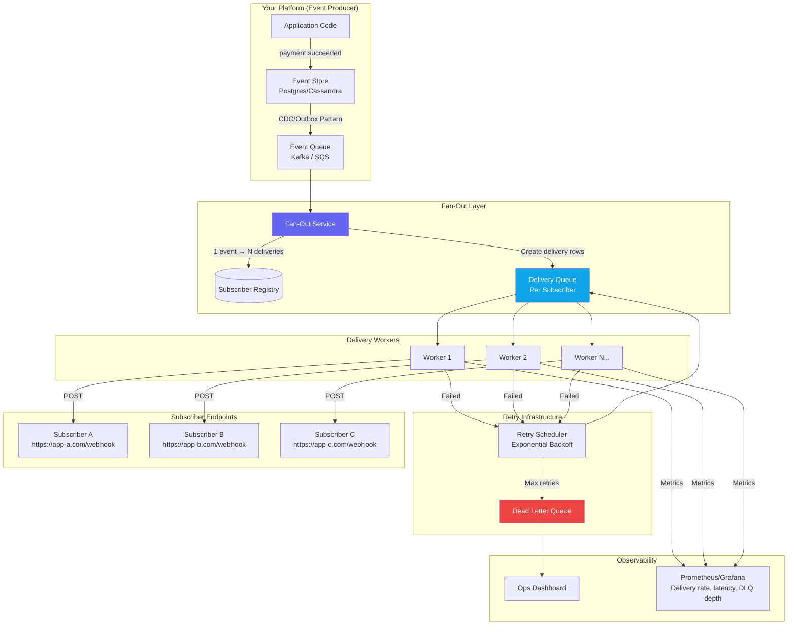
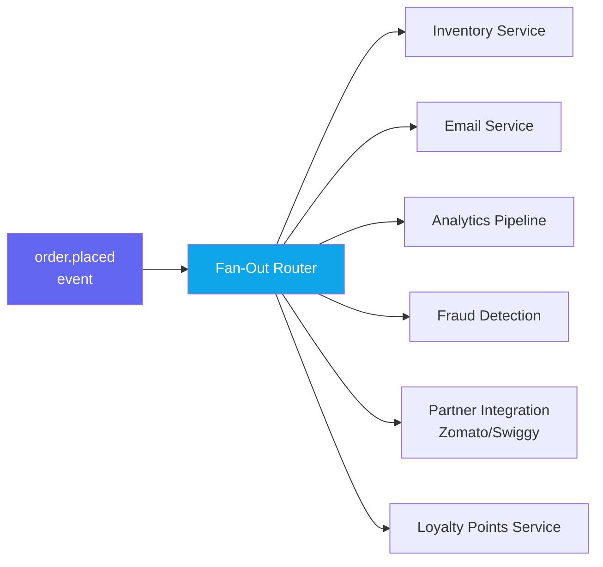
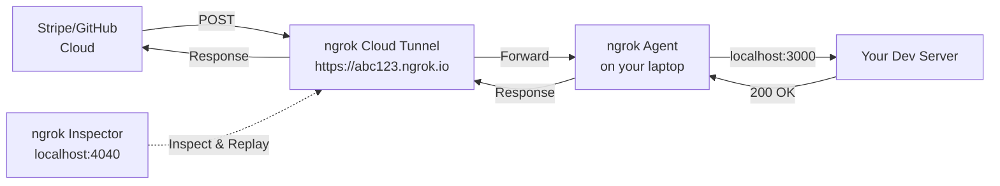

# Webhooks — Event-Driven APIs Done Right

> "Don't call us, we'll call you." — The entire webhook philosophy in one sentence.

---

## The Problem: Polling Is Painful (and Expensive)

Yeh samjho aise — you just ordered biryani on Swiggy. Now imagine if Swiggy's app had no live tracking. Instead, every 30 seconds your phone calls Swiggy's server asking: "Kya order ready hai? Kya order ready hai?" 99 times out of 100 the answer is "nahi yaar, wait karo." That is **polling**. Your phone is doing all the work. Your battery drains. Swiggy's servers get hammered by thousands of apps all asking the same useless question simultaneously.

Now imagine instead: Swiggy's server texts YOU the moment your order status changes — "Your order has been picked up by Rahul." You do nothing until you're told. That is a **webhook**. The server calls you when something actually happens.

This shift from "you ask" to "they tell" — from **pull to push** — is the core of event-driven APIs. It sounds simple, but doing it correctly in production involves security, reliability, idempotency, retries, fan-out, and dead letters. Yeh sab cover karenge is chapter mein.

---

## What Exactly IS a Webhook?

**Analogy:** Leaving your number at the restaurant vs. calling every 5 minutes.

Imagine you're waiting for a table at a packed restaurant. You have two options:
1. Call them every 5 minutes: "Table ready?" "No." "Table ready?" "No." (Polling)
2. Leave your phone number and go sit outside. They call you when the table is free. (Webhook)

Option 2 is clearly smarter. You're free to do other things. The restaurant only calls when there's something real to say. Nobody's time is wasted.

**Technically:** A webhook is a **reverse API call** — an HTTP POST request that a third-party service sends TO your server when an event occurs, instead of you calling their API to check for changes.

The normal API flow:
```
You → GET /api/payment-status → Their Server → "Processing..."
You → GET /api/payment-status → Their Server → "Processing..."
You → GET /api/payment-status → Their Server → "Success!"
```

The webhook flow:
```
[Event happens on their side]
Their Server → POST /your-webhook-url → Your Server (with event data)
```

You register once, and they call you. Clean, efficient, real-time.

---

## The HTTP Lifecycle of a Webhook

Numbered steps because order matters here:

1. **You register a URL** — You tell the third-party service: "When X happens, send a POST to `https://myapp.com/webhooks/stripe`"
2. **Event happens on their side** — A customer pays, a push is made to GitHub, an SMS is received
3. **They POST to your URL** — Carrying a JSON payload with everything about that event
4. **You respond with 200 OK** — Immediately (within 5 seconds max)
5. **They mark delivery as successful** — Done



If you return anything other than `2xx`, most webhook providers will **retry**. More on that soon.

---

## Real-World Webhook Use Cases

Webhooks aren't theoretical. They run critical infrastructure for apps you use every day.

### Stripe → Your E-commerce Server
Swiggy, Zomato, Amazon — every payment flow works like this:

```json
POST /webhooks/stripe
{
  "id": "evt_3OxZAELkdIwHu7ix1234",
  "type": "payment_intent.succeeded",
  "data": {
    "object": {
      "id": "pi_3OxZAELkdIwHu7ix1234",
      "amount": 49900,
      "currency": "inr",
      "customer": "cus_PQR456",
      "metadata": { "order_id": "ORD-789" }
    }
  }
}
```

Your server receives this → marks order as paid → triggers delivery → sends confirmation email. All without you ever polling Stripe.

### GitHub → Your CI/CD Pipeline

GitHub webhooks power ALL of CI/CD. GitHub Actions, Jenkins, CircleCI — none of them poll GitHub every 5 seconds asking "any new commits?" That would be insane at scale. Instead:

```json
POST /webhooks/github
{
  "ref": "refs/heads/main",
  "repository": { "full_name": "siddesh/my-app" },
  "pusher": { "name": "siddesh" },
  "commits": [{ "id": "abc123", "message": "fix: login bug" }]
}
```

GitHub fires this → your CI system gets notified → build starts → tests run → deploy happens. The entire software delivery pipeline runs on this one webhook.

### Twilio → Your Customer Support System

Someone texts your business number:
```json
POST /webhooks/twilio
{
  "MessageSid": "SM1234",
  "From": "+919876543210",
  "To": "+14155550000",
  "Body": "Where is my order?"
}
```

Your support bot gets this → looks up order → replies automatically. No polling Twilio every second.

### WhatsApp Business API → Your Chatbot

Meta's WhatsApp Business API uses webhooks to deliver messages to your bot. Every message a customer sends, every delivery receipt, every read receipt — all come as webhook POSTs to your server.

### Razorpay → Indian E-commerce Apps

For Indian apps using Razorpay (Meesho, Nykaa, Urban Company etc.):
- `payment.captured` — payment received, fulfill order
- `subscription.charged` — recurring payment successful
- `refund.created` — refund initiated

---

## Webhooks vs Polling vs Message Queues

Yeh ek important comparison hai. Interview mein yeh zaroor poochha jaata hai.

**Analogy for all three:**
- **Polling:** You keep calling the doctor's office every hour asking "Is my report ready?"
- **Webhook:** Doctor's office calls you the moment your report is ready
- **Message Queue (Kafka/SQS):** Report goes into your digital health portal. You read it whenever you want, at your own pace. Even if you were asleep, it's waiting for you.



| Dimension | Polling | Webhooks | Message Queue (Kafka/SQS) |
|---|---|---|---|
| **Latency** | High (= poll interval) | Near real-time | Near real-time |
| **Wasted requests** | Massive (99% empty) | Zero | Zero |
| **Your server needs public URL** | No | Yes | No |
| **Fault tolerance** | You control retries | Provider retries | Built-in, guaranteed delivery |
| **Ordering guarantee** | No | No | Yes (within partition) |
| **Backpressure** | You control the pace | Provider controls pace | You control the pace |
| **Volume** | Bad at high volume | Moderate volume | Excellent at high volume |
| **Best for** | Behind firewall, simple cases | Third-party integrations | Internal services, high volume |
| **Avoid when** | Real-time needed | No public endpoint | Low event volume, simple use case |

### When Should You Choose Which?

**Use Polling when:**
- Your consumer is behind a corporate firewall (no public IP)
- The event frequency is low and latency doesn't matter
- You're integrating with an API that doesn't support webhooks

**Use Webhooks when:**
- You're integrating with third-party services (Stripe, GitHub, Razorpay, Twilio)
- Events are unpredictable in timing — polling interval is wasteful
- You want real-time notification without persistent connections
- You're building a platform that will send notifications to other services

**Use Message Queues (Kafka/SQS) when:**
- Internal service-to-service communication
- High event volume (millions per day)
- You need ordering guarantees
- Consumers might be slow — you need backpressure control
- You need replay from any point in time
- Multiple independent consumer groups need to process the same events

---

## Webhook Security: HMAC Signature Verification

**Analogy:** Your doorbell rings. You look through the peephole before opening, right? You don't just open the door for anyone.

Your webhook URL is publicly accessible. Anyone on the internet can send a POST to `https://myapp.com/webhooks/stripe` with a fake "payment succeeded" payload. If you process that without verification, an attacker can get free orders.

The solution: **HMAC-SHA256 signatures**. The provider signs every request using a shared secret. You verify the signature before trusting the payload.

### How HMAC Signing Works



### Node.js: Complete Stripe Webhook Verification

```javascript
const express = require('express');
const crypto = require('crypto');

const app = express();

// CRITICAL: Must use raw body buffer — JSON.parse() destroys the original bytes
// that the HMAC was computed over. Parsed body != original body.
app.post('/webhooks/stripe', express.raw({ type: 'application/json' }), async (req, res) => {
  const STRIPE_WEBHOOK_SECRET = process.env.STRIPE_WEBHOOK_SECRET;
  const signatureHeader = req.headers['stripe-signature'];

  // 1. Header must exist
  if (!signatureHeader) {
    console.warn('Webhook received without signature header');
    return res.status(401).json({ error: 'Missing signature' });
  }

  // 2. Parse the Stripe-Signature header: "t=<timestamp>,v1=<sig>"
  const parts = Object.fromEntries(
    signatureHeader.split(',').map(part => part.split('='))
  );
  const timestamp = parts['t'];
  const receivedSig = parts['v1'];

  if (!timestamp || !receivedSig) {
    return res.status(401).json({ error: 'Malformed signature header' });
  }

  // 3. Replay attack prevention: reject events older than 5 minutes
  const now = Math.floor(Date.now() / 1000);
  if (Math.abs(now - parseInt(timestamp)) > 300) {
    console.warn(`Stale webhook rejected. Timestamp: ${timestamp}, Now: ${now}`);
    return res.status(400).json({ error: 'Webhook timestamp too old — possible replay attack' });
  }

  // 4. Recompute expected signature
  const signedPayload = `${timestamp}.${req.body}`;
  const expectedSig = crypto
    .createHmac('sha256', STRIPE_WEBHOOK_SECRET)
    .update(signedPayload, 'utf8')
    .digest('hex');

  // 5. Constant-time comparison — NEVER use === here (timing attack risk)
  const receivedBuffer = Buffer.from(receivedSig, 'hex');
  const expectedBuffer = Buffer.from(expectedSig, 'hex');

  if (
    receivedBuffer.length !== expectedBuffer.length ||
    !crypto.timingSafeEqual(receivedBuffer, expectedBuffer)
  ) {
    console.warn('Webhook signature verification FAILED');
    return res.status(401).json({ error: 'Invalid signature' });
  }

  // 6. Signature verified — safe to parse
  const event = JSON.parse(req.body);

  // 7. Respond immediately — do NOT do slow work here
  res.status(200).json({ received: true });

  // 8. Async processing — push to queue, process in background
  await processWebhookAsync(event);
});

async function processWebhookAsync(event) {
  switch (event.type) {
    case 'payment_intent.succeeded':
      await queue.push({ type: 'FULFILL_ORDER', data: event.data.object });
      break;
    case 'customer.subscription.deleted':
      await queue.push({ type: 'CANCEL_SUBSCRIPTION', data: event.data.object });
      break;
    case 'payment_intent.payment_failed':
      await queue.push({ type: 'NOTIFY_PAYMENT_FAILURE', data: event.data.object });
      break;
    default:
      console.log(`Unhandled event type: ${event.type}`);
  }
}
```

### GitHub-Style Webhook Verification (X-Hub-Signature-256)

```javascript
function verifyGitHubWebhook(req, secret) {
  const signature = req.headers['x-hub-signature-256'];

  if (!signature) throw new Error('Missing X-Hub-Signature-256 header');

  // Format: "sha256=<hex_digest>"
  const receivedHex = signature.replace('sha256=', '');

  const expectedHex = crypto
    .createHmac('sha256', secret)
    .update(req.rawBody)  // raw body, not parsed JSON
    .digest('hex');

  const received = Buffer.from(receivedHex, 'hex');
  const expected = Buffer.from(expectedHex, 'hex');

  if (received.length !== expected.length || !crypto.timingSafeEqual(received, expected)) {
    throw new Error('Signature mismatch — possible forgery');
  }
}
```

### Security Rules — Never Skip Any of These

| Rule | Why It Matters |
|---|---|
| Verify HMAC signature on every request | Anyone can POST fake data to your URL |
| Use `timingSafeEqual`, not `===` | Prevents timing attacks — attacker can measure response time to guess signature byte by byte |
| Check timestamp, reject events older than 5 min | Prevents replay attacks — attacker captures a valid webhook and resends it later |
| Use HTTPS only, never HTTP | Plain HTTP = signature visible in transit, man-in-middle can intercept |
| Use raw body for HMAC computation | JSON parsing changes bytes (whitespace, key order) — breaks signature |
| Rotate secrets periodically | If secret leaks, limit the damage window |

---

## Webhook Receiver Best Practices

Yaar, receiving a webhook correctly is a whole art. Most bugs in webhook integrations come from people not following these practices.

### Rule 1: Respond Immediately with 200 OK

**Why:** If your webhook handler does slow work (DB queries, sending emails, calling other APIs) before responding, you'll time out. The provider sees a timeout = failure = they retry. Now you're getting double deliveries.

**The rule:** Respond with `200 OK` within **5 seconds** (Stripe's limit is 30 seconds, but 5 is safer). Do ALL actual processing asynchronously after the response.



### Rule 2: Process Asynchronously

```javascript
// Pattern: receive → acknowledge → queue → process
app.post('/webhooks/stripe', rawBodyMiddleware, async (req, res) => {
  verifySignature(req); // fast operation

  const event = JSON.parse(req.body);

  // Push to queue immediately (Redis, SQS, BullMQ, etc.)
  await eventQueue.add('stripe-event', {
    eventId: event.id,
    eventType: event.type,
    payload: event
  });

  // Respond NOW — don't wait for processing
  res.status(200).json({ received: true });
  // Worker processes queue in background
});
```

### Rule 3: Handle Retries Idempotently

**Analogy:** If your dad asks you "Beta, did you pay the electricity bill?" and you say yes, he shouldn't pay it again when he asks next time. Idempotency means doing something twice has the same result as doing it once.

Webhook providers guarantee **at-least-once delivery** — never exactly-once. Your endpoint will receive the same event multiple times. If you process "payment succeeded" twice, you might ship two orders, give double credits, or send two OTPs.

**The fix:** Store event IDs and skip reprocessing:

```javascript
async function processWebhookEvent(event) {
  const eventId = event.id; // e.g., "evt_3OxZAELkdIwHu7ix1234"

  // Check if already processed — Redis SETNX or DB unique constraint
  const alreadyProcessed = await redis.exists(`webhook:processed:${eventId}`);

  if (alreadyProcessed) {
    console.log(`Duplicate event ${eventId} — skipping gracefully`);
    return; // Return successfully — DO NOT throw error or return 4xx
    // Throwing causes the provider to retry endlessly!
  }

  // Mark as processing BEFORE side effects (use a transaction if DB)
  await redis.setex(`webhook:processed:${eventId}`, 60 * 60 * 24 * 7, '1');
  // TTL = 7 days (longer than Stripe's 3-day retry window)

  // Now safely execute side effects
  await fulfillOrder(event.data.object);
  await sendConfirmationEmail(event.data.object);
}
```

**Idempotency checklist:**
- Store the event ID before doing any side effects
- Set the TTL longer than the provider's retry window (Stripe = 3 days → use 7 days)
- Return `200` even for duplicates — `4xx` = provider keeps retrying forever
- Use `SETNX` (set-if-not-exists) or DB unique constraint to prevent race conditions

---

## Retry Logic and Exponential Backoff

**Analogy:** Aap ghar mein nahi hain, pizza delivery boy baar baar knock karta hai. Pehli baar gaya — 1 minute baad aaya. Dusri baar gaya — 5 minute baad aaya. Teesri baar gaya — 30 minute baad aaya. Woh exponentially zyada wait karta jaata hai. Yahi exponential backoff hai.

When your server is down or returns an error, good webhook providers retry with **exponential backoff** — waiting longer between each attempt. This prevents hammering a struggling server.

### Stripe's Retry Schedule

```
Attempt 1:  Immediately
Attempt 2:  ~1 hour later
Attempt 3:  ~6 hours later
Attempt 4:  ~24 hours later
Attempt 5:  ~48 hours later
Attempt 6:  ~72 hours later
→ After 3 days total, event is abandoned (goes to dashboard for manual inspection)
```

### Exponential Backoff Formula

```
delay = min(base_delay * 2^attempt, max_delay)

Attempt 0: min(30 * 2^0, 3600) = 30 seconds
Attempt 1: min(30 * 2^1, 3600) = 60 seconds
Attempt 2: min(30 * 2^2, 3600) = 120 seconds
Attempt 3: min(30 * 2^3, 3600) = 240 seconds
Attempt 4: min(30 * 2^4, 3600) = 480 seconds
Attempt 5: min(30 * 2^5, 3600) = 960 seconds
Attempt 6: min(30 * 2^6, 3600) = 1920 seconds
Attempt 7: min(30 * 2^7, 3600) = 3600 seconds (capped)
```

Adding **jitter** (random delay) prevents thundering herd — all retries hitting at the same millisecond:

```javascript
function getRetryDelay(attempt, baseDelay = 30, maxDelay = 3600) {
  const exponential = baseDelay * Math.pow(2, attempt);
  const capped = Math.min(exponential, maxDelay);
  // Add up to 20% random jitter
  const jitter = capped * 0.2 * Math.random();
  return Math.floor(capped + jitter);
}
```

### Webhook Delivery State Machine



---

## Dead Letter Queue (DLQ) for Webhooks

**Analogy:** The post office delivers your letter 5 times. Nobody answers. They don't throw it in the trash — they put it in a "return to sender" pile. A human reviews it. Yahi DLQ hai.

When an event exhausts all retry attempts, it must NOT be silently dropped. It goes to a **Dead Letter Queue** — a separate storage for failed deliveries that requires human attention or automated replay.



```javascript
// Delivery worker pseudocode
async function deliverWebhook(delivery) {
  const MAX_ATTEMPTS = 7;

  try {
    const response = await fetch(delivery.url, {
      method: 'POST',
      headers: {
        'Content-Type': 'application/json',
        'X-Webhook-Signature': computeHMAC(delivery.secret, delivery.body),
        'X-Delivery-ID': delivery.id,
        'X-Event-Type': delivery.eventType,
      },
      body: delivery.body,
      signal: AbortSignal.timeout(10_000), // 10s timeout
    });

    if (response.ok) {
      await markDelivered(delivery.id);
      await recordDeliveryMetric('success', delivery);
      return;
    }

    throw new Error(`HTTP ${response.status}: ${response.statusText}`);

  } catch (err) {
    delivery.attempts += 1;
    await logDeliveryAttempt(delivery, err.message);

    if (delivery.attempts >= MAX_ATTEMPTS) {
      await moveToDLQ(delivery, { reason: err.message, finalAttempt: new Date() });
      await alertOpsTeam({
        title: 'Webhook delivery failed after all retries',
        deliveryId: delivery.id,
        subscriberUrl: delivery.url,
        eventType: delivery.eventType,
        error: err.message,
      });
      return;
    }

    const delaySeconds = getRetryDelay(delivery.attempts);
    await requeueWithDelay(delivery, delaySeconds);
  }
}
```

---

## Full Production Webhook Architecture

Yaar, ab samjhte hain ki Stripe, GitHub, Razorpay jaisi companies ka webhook system kaise kaam karta hai. Yahi interview mein poochha jaata hai.



### Key Design Decisions Explained

**1. Outbox Pattern (Event Store First)**

Why: Write the event to your DB in the same transaction as your business operation. Then deliver from there. This prevents the "I charged the customer but forgot to fire the event" bug.

```sql
-- In same DB transaction:
UPDATE orders SET status = 'paid' WHERE id = $1;
INSERT INTO webhook_events (type, payload) VALUES ('payment.succeeded', $2);
-- If transaction fails, neither happens. Consistent!
```

**2. Separate Queue Per Subscriber**

Why: If Subscriber A is slow or down, Subscriber B and C should still get their events. Separate queues = separate failure domains.

**3. Stateless Workers, Horizontal Scale**

Workers just pull from queue, attempt delivery, update delivery record. Add more workers for more throughput. No shared state.

**4. Delivery Logs**

Every attempt (success or failure) gets logged with: timestamp, HTTP status code, response body, duration. This is what makes your webhook dashboard work — subscribers can see exactly what happened.

---

## Fan-Out: One Event, Many Subscribers

**Analogy:** Breaking news on TV. The news channel broadcasts once. Every TV watching that channel gets the news simultaneously. One broadcast → millions of viewers. Yahi fan-out hai.

When your platform grows, a single event might need to reach multiple systems:



Each subscriber gets their own delivery record, their own retry cycle. Fraud detection failing at midnight shouldn't delay the email confirmation you need RIGHT NOW.

```javascript
async function fanOutEvent(event) {
  // Find all subscribers who want this event type
  const subscribers = await db.subscribers.findAll({
    where: {
      eventTypes: { [Op.contains]: [event.type] },
      active: true,
    }
  });

  // Create one delivery record per subscriber
  const deliveries = subscribers.map(sub => ({
    id: generateUUID(),
    eventId: event.id,
    subscriberId: sub.id,
    url: sub.webhookUrl,
    secret: sub.signingSecret,
    body: JSON.stringify(event),
    attempts: 0,
    status: 'pending',
    scheduledAt: new Date(),
  }));

  // Batch insert (atomic)
  await db.webhookDeliveries.bulkCreate(deliveries);

  // Enqueue all for async processing
  await Promise.all(
    deliveries.map(d => deliveryQueue.add('deliver', { deliveryId: d.id }))
  );

  console.log(`Fanned out ${event.type} to ${subscribers.length} subscribers`);
}
```

---

## Building a Webhook Gateway (When You're Stripe)

**Analogy:** Stripe is basically a webhook post office. They accept millions of events, sign them, route them to the right addresses, retry on failure, and keep logs of every delivery. If you're building a platform that sends webhooks to YOUR customers (like Stripe does to you), you need this infrastructure.

What a Webhook Gateway provides:

| Feature | Why Needed |
|---|---|
| **Retry logic** | Subscriber endpoints fail and need automatic retries |
| **HMAC signing** | Subscribers need to verify requests are authentic |
| **Delivery logs** | Subscribers need to debug "why didn't I get event X?" |
| **Replay capability** | Subscriber fixes a bug, wants to reprocess missed events |
| **Event filtering** | Subscriber only wants payment events, not all events |
| **Rate limiting per subscriber** | Don't overwhelm slow subscribers |
| **Alerting on failures** | Know when a subscriber's endpoint is consistently failing |

### Building It Yourself vs. Using a Gateway Service

If you're a startup, you probably shouldn't build this from scratch. Use:

| Tool | What It Is | Best For |
|---|---|---|
| **Svix** | Hosted webhook gateway as a service | Startups, fast time-to-market |
| **Hookdeck** | Webhook infrastructure (receive + route + retry) | Consuming webhooks reliably |
| **AWS EventBridge** | Managed event bus | AWS ecosystem |
| **Kafka + custom delivery** | DIY, full control | Large scale, existing Kafka infra |

Svix example — sending a webhook in 3 lines:
```javascript
import { Svix } from 'svix';
const svix = new Svix('your-auth-token');

await svix.message.create('app_abc123', {
  eventType: 'payment.succeeded',
  payload: { orderId: '789', amount: 4999, currency: 'inr' }
});
// Svix handles signing, delivery, retries, logs — you're done
```

---

## Local Development: Testing Webhooks Without a Server

**The problem:** Stripe, GitHub, Razorpay need to reach your webhook URL. But during development your server is at `localhost:3000` — not reachable from the internet. Toh kya karein?

**Solution: ngrok** — creates a public tunnel from the internet to your local machine.

```bash
# Install ngrok
npm install -g ngrok
# or: brew install ngrok

# Start your local server
node server.js  # running on port 3000

# In another terminal: create a public tunnel
ngrok http 3000
```

ngrok gives you:
```
Session Status: online
Forwarding: https://abc123def.ngrok.io → localhost:3000

# Use this URL in Stripe/GitHub dashboard:
https://abc123def.ngrok.io/webhooks/stripe
         ↓ tunnels to ↓
localhost:3000/webhooks/stripe
```

ngrok also has a **Web Inspector** at `http://localhost:4040` where you can:
- See all incoming requests with full headers and body
- **Replay** any request — incredibly useful when debugging



### Alternatives to ngrok

| Tool | Cost | Best For |
|---|---|---|
| ngrok | Free tier available | General purpose, best UX |
| `cloudflared tunnel` | Free | Cloudflare users |
| `localtunnel` | Free, open source | Quick testing |
| `smee.io` | Free | GitHub webhooks specifically |
| VS Code Port Forwarding | Free | VS Code users |

---

## When to Use Webhooks and When NOT To

### Use Webhooks When

- Integrating with third-party services (Stripe, GitHub, Razorpay, Twilio)
- Event frequency is unpredictable — polling would be wasteful
- Near real-time notification matters but not millisecond precision
- You want to avoid polling and API rate limit consumption
- Building a platform that will notify customer apps when events happen

### Do NOT Use Webhooks When

| Situation | Why | Better Alternative |
|---|---|---|
| Consumer is behind firewall/NAT | No public IP to receive POST | Polling, WebSockets, SSE |
| Browser-based clients | Browsers can't receive server-initiated HTTP POSTs | WebSockets, SSE |
| Need strict ordering across event types | Webhooks have no ordering guarantee | Kafka with partitioning |
| Very large payloads | HTTP is expensive for large data | Send event ID, let consumer fetch full data |
| Synchronous request/response needed | Webhooks are async fire-and-forget | REST, gRPC |
| Internal service-to-service at high volume | Too much overhead, no backpressure | Kafka, SQS, RabbitMQ |

---

## Complete Comparison: All Real-Time Patterns

| Feature | Polling | Webhooks | WebSockets | Server-Sent Events (SSE) | Message Queue |
|---|---|---|---|---|---|
| **Direction** | Client pulls | Server pushes | Bidirectional | Server pushes | Async push |
| **Real-time** | No (poll interval) | Near real-time | Real-time | Near real-time | Near real-time |
| **Wasted requests** | Very high | Zero | None (persistent conn) | None (persistent conn) | Zero |
| **Persistent connection** | No | No | Yes | Yes | No |
| **Works behind firewall** | Yes | No | Sometimes | Sometimes | Yes |
| **Retry built-in** | Manual | Provider handles | Manual | Manual | Yes |
| **Ordering guarantee** | No | No | No | No | Yes (partitioned) |
| **Browser support** | Yes | No (server only) | Yes | Yes | No |
| **Best for** | Simple, behind firewall | Third-party integrations | Chat, gaming, collaboration | Live feeds, dashboards | Internal services, high volume |
| **Real-world use** | Legacy systems | Stripe, GitHub, Razorpay | WhatsApp Web, Google Docs | Stock tickers, scores | Uber surge pricing, Netflix recommendations |

---

## Operational Checklist

Keep this as a reference when building webhook integrations.

### As a Webhook Consumer (Receiving Webhooks from Stripe/GitHub)

- [ ] Verify HMAC signature on every request before processing anything
- [ ] Use `timingSafeEqual` — never `===` for signature comparison
- [ ] Check timestamp — reject events older than 5 minutes (replay attack prevention)
- [ ] Use raw body (Buffer) for HMAC computation, not parsed JSON
- [ ] Use HTTPS endpoints only — never HTTP
- [ ] Respond with `200 OK` within 5 seconds
- [ ] Do all heavy processing asynchronously (queue-based)
- [ ] Implement idempotency using event IDs (Redis / DB unique constraint)
- [ ] Return `200` for duplicate events — not `4xx`
- [ ] Log all received events (for debugging and audit)
- [ ] Set idempotency key TTL longer than provider's retry window

### As a Webhook Provider (Sending Webhooks to Your Customers)

- [ ] Sign every request with HMAC-SHA256
- [ ] Include timestamp in the signed payload (replay attack prevention)
- [ ] Implement exponential backoff retries
- [ ] Separate delivery queue per subscriber
- [ ] Implement Dead Letter Queue with alerting
- [ ] Provide a UI to view delivery history
- [ ] Enable manual replay from dashboard
- [ ] Document all event types and their payloads with versioning
- [ ] Allow subscribers to filter which event types they receive
- [ ] Rate limit per subscriber (don't overwhelm slow endpoints)
- [ ] Rotate signing secrets without downtime (dual-key transition period)

---

## Testing Your Webhook Handler

Good webhook handlers need tests. Here's what to cover:

```javascript
// Jest + Supertest example
const crypto = require('crypto');
const request = require('supertest');
const app = require('./app');

describe('Stripe Webhook Handler', () => {
  const WEBHOOK_SECRET = 'test_whsec_abc123';

  function buildStripeSignature(body, secret) {
    const timestamp = Math.floor(Date.now() / 1000);
    const payload = `${timestamp}.${body}`;
    const signature = crypto
      .createHmac('sha256', secret)
      .update(payload)
      .digest('hex');
    return { header: `t=${timestamp},v1=${signature}`, timestamp };
  }

  it('accepts valid signed request and returns 200', async () => {
    const body = JSON.stringify({ id: 'evt_001', type: 'payment_intent.succeeded', data: { object: {} } });
    const { header } = buildStripeSignature(body, WEBHOOK_SECRET);

    const res = await request(app)
      .post('/webhooks/stripe')
      .set('stripe-signature', header)
      .set('Content-Type', 'application/json')
      .send(Buffer.from(body));

    expect(res.status).toBe(200);
    expect(res.body).toEqual({ received: true });
  });

  it('rejects request with missing signature header → 401', async () => {
    const res = await request(app)
      .post('/webhooks/stripe')
      .send({ id: 'evt_002', type: 'payment_intent.succeeded' });

    expect(res.status).toBe(401);
  });

  it('rejects request with wrong signature → 401', async () => {
    const body = JSON.stringify({ id: 'evt_003', type: 'payment_intent.succeeded' });
    const { header } = buildStripeSignature(body, 'wrong_secret');

    const res = await request(app)
      .post('/webhooks/stripe')
      .set('stripe-signature', header)
      .send(Buffer.from(body));

    expect(res.status).toBe(401);
  });

  it('rejects request with stale timestamp → 400 (replay attack)', async () => {
    const body = JSON.stringify({ id: 'evt_004', type: 'payment_intent.succeeded' });
    const oldTimestamp = Math.floor(Date.now() / 1000) - 600; // 10 minutes ago
    const payload = `${oldTimestamp}.${body}`;
    const sig = crypto.createHmac('sha256', WEBHOOK_SECRET).update(payload).digest('hex');

    const res = await request(app)
      .post('/webhooks/stripe')
      .set('stripe-signature', `t=${oldTimestamp},v1=${sig}`)
      .send(Buffer.from(body));

    expect(res.status).toBe(400);
  });

  it('processes duplicate event ID only once', async () => {
    const body = JSON.stringify({ id: 'evt_005', type: 'payment_intent.succeeded', data: { object: {} } });
    const { header } = buildStripeSignature(body, WEBHOOK_SECRET);

    // First delivery
    await request(app)
      .post('/webhooks/stripe')
      .set('stripe-signature', header)
      .send(Buffer.from(body));

    // Rebuild signature (timestamp changes)
    const { header: header2 } = buildStripeSignature(body, WEBHOOK_SECRET);

    // Second delivery (duplicate)
    const res = await request(app)
      .post('/webhooks/stripe')
      .set('stripe-signature', header2)
      .send(Buffer.from(body));

    // Still returns 200
    expect(res.status).toBe(200);
    // But handler was only called once
    expect(mockFulfillOrder).toHaveBeenCalledTimes(1);
  });
});
```

---

## Common Interview Questions

Yaar, yeh questions expect karo webhook topic par. Answers bhi de raha hoon.

### Q1: What is a webhook and how is it different from a REST API call?

**Answer:** A webhook is a reverse HTTP callback. In a normal REST API, you (the client) initiate the request. With a webhook, the server initiates the call to YOUR endpoint when an event occurs. It's push vs. pull. Webhooks eliminate polling — you only receive a request when something actually happens, reducing wasted network traffic and achieving near-real-time delivery.

### Q2: Why should you respond to a webhook with 200 OK immediately and process asynchronously?

**Answer:** Webhook providers have strict timeout thresholds (Stripe: 30 seconds, GitHub: 10 seconds). If your handler does slow work — DB writes, external API calls, sending emails — before responding, you'll exceed the timeout. The provider sees this as a failure and retries, potentially causing duplicate processing. By responding immediately and queuing the event for async processing, you decouple acknowledgment from processing.

### Q3: What is HMAC signature verification and why is it critical?

**Answer:** Your webhook URL is public — anyone can POST to it with fake data. HMAC (Hash-based Message Authentication Code) signatures solve this. The provider computes `HMAC-SHA256(shared_secret, payload)` and sends it in a header. You recompute the same HMAC and compare. If they match, the payload genuinely came from the provider. You must use constant-time comparison (`timingSafeEqual`) to prevent timing attacks, and check the timestamp to prevent replay attacks.

### Q4: What is idempotency in webhooks and why is it needed?

**Answer:** Webhook providers guarantee at-least-once delivery, not exactly-once. Network timeouts, your server restarting mid-response, or provider bugs can cause the same event to arrive multiple times. Idempotency means processing an event twice produces the same result as processing it once. Implementation: store the event ID in a Redis/DB unique key before executing side effects. If the key exists, skip processing but still return 200 (otherwise the provider retries endlessly).

### Q5: Compare webhooks vs polling vs message queues. When would you use each?

**Answer:**
- **Polling:** Client repeatedly asks "any updates?" Simple but wastes bandwidth. Use when consumer is behind a firewall (no public endpoint) or the API doesn't support webhooks.
- **Webhooks:** Provider pushes event to your endpoint. Efficient, near real-time. Use for third-party integrations (Stripe, GitHub, Razorpay). Requires a public HTTPS endpoint.
- **Message queues (Kafka/SQS):** Events go into a durable queue. Consumers pull at their own pace. Use for internal service communication, high volume, when you need ordering guarantees, backpressure control, or replay capability.

### Q6: What happens when a webhook endpoint is down? How do providers handle it?

**Answer:** Providers retry with exponential backoff. Each retry waits longer than the previous (e.g., 1min, 5min, 30min, 2hr, 8hr...). This prevents hammering a struggling server and gives it time to recover. After max attempts (Stripe: 3 days), the event moves to a Dead Letter Queue or dashboard for manual inspection. On your side, you need a DLQ too if you're building the sender side — after max retries, alert ops and enable replay.

### Q7: How do you design a webhook system that sends webhooks to thousands of subscribers?

**Answer:**
1. **Event Store first** (Outbox Pattern) — write event to DB in the same transaction as business operation
2. **Fan-out Service** — reads the event and creates one delivery record per subscriber
3. **Per-subscriber delivery queues** — independent failure domains; one slow subscriber doesn't block others
4. **Stateless delivery workers** — pull from queue, attempt POST, update delivery record; scale horizontally
5. **Retry scheduler** — exponential backoff with jitter; re-enqueue failed deliveries
6. **Dead Letter Queue** — after max retries, alert ops team; enable manual replay
7. **Signing** — HMAC-SHA256 each request with subscriber's shared secret
8. **Observability** — delivery logs, success rate, DLQ depth, p95 latency

### Q8: What is a timing attack and how do you prevent it in webhook signature verification?

**Answer:** A timing attack exploits the fact that `===` string comparison returns early on the first mismatching character. An attacker can send many requests and measure response time — shorter time means more characters matched. By brute-forcing character by character, they can reconstruct the valid signature. Prevention: use `crypto.timingSafeEqual()` (Node.js) or `hmac.Equal()` (Go), which compare all bytes regardless of where the first mismatch is, taking constant time.

### Q9: What is the Outbox Pattern and why does it matter for webhooks?

**Answer:** The Outbox Pattern ensures webhook events are never lost. Without it, you might do: "charge customer → fire webhook event" as two separate operations. If the process crashes between them, the customer is charged but the event is never fired. The fix: write the event to an `outbox` table in the SAME database transaction as your business operation. A separate CDC (Change Data Capture) process reads the outbox and delivers to the event queue. The event exists as soon as the business operation commits.

### Q10: A subscriber reports they're not receiving webhooks. How do you debug this?

**Answer:**
1. Check your delivery logs — was the event delivered? What HTTP status was returned?
2. If HTTP 4xx — subscriber is rejecting (check their signature verification, maybe secret mismatch)
3. If HTTP 5xx — subscriber's server is erroring (their bug, not yours)
4. If timeout — subscriber is too slow to respond within your timeout window
5. Check DLQ — is the event sitting there after max retries?
6. Check if subscriber's URL changed and wasn't updated in your registry
7. Check if the event type matches their subscription filter
8. Enable manual replay from the delivery dashboard to resend specific events

---

## Key Takeaways

Agar tumhe sirf 10 cheezein yaad rakhni hain is topic se:

1. **Webhooks are reverse HTTP callbacks** — instead of you polling "any updates?", the server POSTs to your URL when something happens. Yeh restaurant wala analogy yaad rakho.

2. **Always verify HMAC signatures** — your webhook URL is public. Anyone can POST fake data to it. Signature verification + `timingSafeEqual` + timestamp check = the security trifecta.

3. **Respond fast (200 OK in < 5 seconds), process slow (async queue)** — your handler must acknowledge immediately. Anything slower = provider sees a timeout = retry storm = duplicate processing.

4. **Idempotency is not optional** — at-least-once delivery is guaranteed. Exactly-once is not. Store event IDs, skip duplicates, always return 200 for duplicates.

5. **Exponential backoff protects your server** — when you're down, linear retries make recovery harder. Exponential backoff with jitter is the industry standard.

6. **Dead Letter Queue = no silent data loss** — events that exhaust retries must go somewhere observable. Without DLQ, you lose events and never know.

7. **Fan-out needs per-subscriber queues** — one slow or broken subscriber cannot block everyone else. Independent queues = independent failure domains.

8. **Webhooks power all CI/CD** — GitHub webhooks trigger GitHub Actions, Jenkins, CircleCI. Stripe webhooks are critical path for e-commerce. These aren't toys — they're critical infrastructure.

9. **Outbox Pattern = event consistency** — write event to your DB in the same transaction as your business operation. Never fire events from application memory where crashes can lose them.

10. **Use ngrok for local development** — you need a public URL to test with real providers. ngrok + its inspector + replay capability = essential webhook dev tool.

---

*Next: Chapter 31 — Rate Limiting and Throttling*
