# gRPC vs REST vs GraphQL — Choosing the Right API Protocol

> "Choosing the wrong API protocol is like choosing the wrong language for a conversation — you can make it work, but everyone is frustrated."

---

## Why Does This Topic Matter? (Yeh kyun important hai)

Imagine you are building the backend for Zomato. You have:
- A **React web app** that needs restaurant listings, user profiles, reviews, and order history — all on one screen
- An **Android app** that only has 3G and needs minimal data
- A **delivery partner app** that needs real-time location updates streaming constantly
- **50+ internal microservices** (restaurant service, payment service, ETA service, notification service, driver matching) all talking to each other at thousands of calls per second

If you use REST everywhere, your mobile app drowns in over-fetching. If you use GraphQL everywhere, your internal service-to-service calls are needlessly complex. If you use gRPC for the browser, it breaks.

This is why engineers at Uber, Netflix, Google, and Zomato use **different protocols for different layers** of their system. This note will teach you exactly that.

---

## The Big Picture First — The Restaurant Analogy

Samjho aise — aap ek restaurant mein hain. Three types of ordering systems exist:

- **REST** is like a fixed thali (set meal). You order "Thali A" and you get dal, roti, sabzi, rice, chaas — the whole thing. You wanted only dal-chaas? Too bad, you get everything. The waiter (server) brings a standard plate no matter what you asked for.

- **GraphQL** is like a custom order at a high-end restaurant. You tell the waiter exactly: "I want dal, extra roti, no rice, and a glass of lassi." You get precisely that — nothing extra, nothing missing. You are the boss of what comes to your table.

- **gRPC** is the walkie-talkie between the restaurant kitchen staff. Chef to sous-chef: super fast, compressed, binary messages, constant streams of coordination. Civilians (browser users) cannot use a walkie-talkie — they need to go through the front-of-house staff (API Gateway).

Each has its place. Let's understand all three from the ground up.

---

## Part 1: REST — The Universal Language of the Web

### What is REST? (Simple bolo)

REST (Representational State Transfer) is not a technology or a protocol — it is an **architectural style**, a set of rules for designing web APIs. Roy Fielding defined it in his PhD dissertation in 2000, and it has been the backbone of the internet ever since.

Think of it as the "grammar rules" for how web services should talk to each other. You follow these rules, you have a REST API.

**The 6 core REST constraints:**
1. **Stateless** — every request must contain all information needed. The server has zero memory between calls
2. **Client-Server separation** — the UI and the data layer are decoupled
3. **Cacheable** — responses should declare themselves cacheable or not
4. **Uniform Interface** — resources are nouns, HTTP verbs are actions
5. **Layered System** — you can have load balancers, CDNs, gateways between client and server
6. **Code on Demand** (optional) — server can send executable code (like JavaScript)

### Why REST Was Invented

Before REST, SOAP (Simple Object Access Protocol) was everywhere — and it was a nightmare. XML envelopes, WSDL contracts, dozens of standards. Building a SOAP API took weeks of setup just for configuration.

Roy Fielding looked at the web itself — how browsers and servers already talked to each other via HTTP — and said: "What if APIs just used the same principles the web already uses?"

That insight gave us REST. Simple, HTTP-native, human-readable, no special protocol needed.

### How REST Works — Step by Step

```
Client (Browser/Mobile)          Server (Node.js/Django/Spring)
        |                                    |
        |--- GET /restaurants/123 ---------->|  (Read restaurant 123)
        |                                    |  (looks up DB)
        |<-- 200 OK + JSON payload ----------|
        |    { id:123, name:"Dominos",       |
        |      address:"...", menu:[...],    |  Over-fetching: got ALL
        |      ratings:[...], ... }          |  fields even if you
        |                                    |  only needed "name"
        |                                    |
        |--- POST /orders ------------------>|  (Create new order)
        |    { restaurantId:123, items:[...] }|
        |<-- 201 Created + { orderId: 456 } -|
        |                                    |
        |--- PUT /orders/456/status -------->|  (Update order status)
        |    { status: "confirmed" }          |
        |<-- 200 OK --------------------------|
```

### REST Resource Design — The Right Way

The key insight of REST: **resources are nouns, HTTP verbs are actions**.

```
WRONG (RPC-style, not RESTful):
  POST /getUser
  POST /createOrder
  POST /cancelOrder

RIGHT (RESTful):
  GET    /users/{id}           → fetch user
  POST   /users                → create user
  PUT    /users/{id}           → replace user (full update)
  PATCH  /users/{id}           → partial update
  DELETE /users/{id}           → delete user

  GET    /restaurants/{id}/reviews     → get reviews for a restaurant
  POST   /restaurants/{id}/reviews     → post a review
  GET    /users/{id}/orders            → get all orders for a user
  GET    /orders/{id}                  → get specific order
```

### REST Code Example — A Zomato-like API

```javascript
// server.js — Express.js REST API (Node.js)
const express = require('express');
const app = express();
app.use(express.json());

// Imagine this is our database
const restaurants = {
  '123': {
    id: '123',
    name: 'Dominos',
    cuisine: 'Italian',
    rating: 4.2,
    deliveryTime: 30,
    address: { street: 'MG Road', city: 'Bangalore', pin: '560001' },
    menu: [/* 50 items */],
    photos: [/* 20 URLs */],
    openingHours: { /* complex object */ },
    owner: { name: 'Priya Sharma', phone: '9876543210' }
    // ... 30 more fields
  }
};

// GET a restaurant — the classic over-fetching problem
// Client only wanted name + rating + deliveryTime
// But they get ALL 40 fields
app.get('/restaurants/:id', (req, res) => {
  const restaurant = restaurants[req.params.id];
  if (!restaurant) {
    return res.status(404).json({ error: 'Restaurant not found' });
  }
  res.json(restaurant); // Returns EVERYTHING — 40 fields
});

// POST create an order
app.post('/orders', async (req, res) => {
  const { userId, restaurantId, items } = req.body;

  // Input validation
  if (!userId || !restaurantId || !items?.length) {
    return res.status(400).json({ error: 'Missing required fields' });
  }

  const order = {
    id: `order_${Date.now()}`,
    userId,
    restaurantId,
    items,
    status: 'pending',
    createdAt: new Date().toISOString()
  };

  // Save to DB (pseudocode)
  // await db.orders.create(order);

  res.status(201).json(order);
});

// PATCH update order status
app.patch('/orders/:id/status', (req, res) => {
  const { status } = req.body;
  const validStatuses = ['pending', 'confirmed', 'preparing', 'out_for_delivery', 'delivered'];

  if (!validStatuses.includes(status)) {
    return res.status(400).json({ error: 'Invalid status' });
  }

  // Update in DB...
  res.json({ id: req.params.id, status, updatedAt: new Date().toISOString() });
});

app.listen(3000, () => console.log('REST API running on :3000'));
```

```javascript
// client.js — Consuming the REST API
// The over-fetching problem in action

async function loadHomePage(userId) {
  // We need: user name + their 5 favorite restaurants (just name + rating)
  // But REST forces us to make multiple calls and get too much data

  // Call 1: Get user (returns 15 fields, we need 2)
  const userRes = await fetch(`/users/${userId}`);
  const user = await userRes.json();

  // Call 2: Get favorites list (returns IDs)
  const favRes = await fetch(`/users/${userId}/favorites`);
  const favorites = await favRes.json();

  // Calls 3-7: Get each restaurant (returns 40 fields each, we need 3)
  // This is the N+1 problem
  const restaurants = await Promise.all(
    favorites.map(id => fetch(`/restaurants/${id}`).then(r => r.json()))
  );

  // Total: 7 HTTP calls, ~300KB of data, when we needed ~5KB
  // On 3G network in rural India: this is a disaster
}
```

### The Over-Fetching and Under-Fetching Problem — Explained Visually

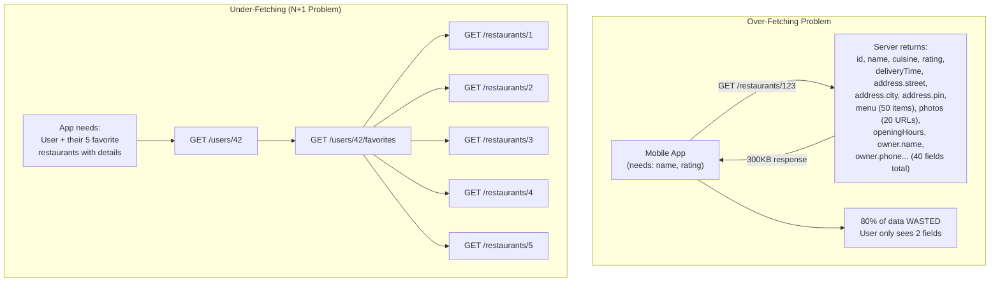

This is exactly why GraphQL was invented. Basically, REST was designed when servers were simple and clients were browsers displaying full HTML pages. In the mobile era, with bandwidth-constrained devices and complex UIs, REST started showing its age.

### REST Pros and Cons

**Pros:**
- Universal — every language, framework, and tool supports it
- Browser-native — no special library needed, plain `fetch()` works
- HTTP caching works out of the box (CDNs, browser cache)
- Easy to debug — `curl` it, Postman it, read the JSON
- Every developer already knows it — minimal learning curve
- HTTP status codes give semantic meaning (404 = not found, etc.)

**Cons:**
- Over-fetching — always returns the full resource shape
- Under-fetching — related resources need separate round trips
- No strict contract by default (OpenAPI helps, but optional)
- Versioning is messy (`/v1/`, `/v2/`)
- Poor fit for real-time (SSE and WebSockets are add-ons, not native)

### Real Companies Using REST

- **Stripe API** — the gold standard of REST API design
- **Twilio** — SMS/call APIs, perfectly RESTful
- **GitHub REST API** (v3) — massive ecosystem built around it
- **Twitter/X public API** — tweet creation, reading timeline
- **Zomato public API** — restaurant search, menu lookup
- **Swiggy** external partner integrations

---

## Part 2: GraphQL — Ask for Exactly What You Need

### What is GraphQL? (Yaar, game-changer hai yeh)

GraphQL is a **query language for APIs** — emphasis on *query language*. It was built by Facebook (Meta) engineers in 2012 to solve the exact problems they faced building the Facebook mobile app.

Think about the Facebook newsfeed. One screen shows: your name, your profile picture, 10 friends' names and photos, their posts (text + images), reactions (with counts), comment previews, ads, suggested friends, birthday reminders... A single screen needs data from 20+ different "resources."

With REST, you'd need 20+ API calls — or one huge, bloated "feed" endpoint that returns everything and becomes impossible to maintain.

With GraphQL, the client writes a **query** describing exactly what it needs, sends it to a **single endpoint**, and gets back precisely that data — nothing more, nothing less.

### GraphQL Analogy — The Custom Thali

Imagine you go to a South Indian restaurant with a buffet. With REST, you tell the server "give me the south indian set" and they bring a tray with 15 items — even if you hate idlis. With GraphQL, you walk up to the counter and say: "I want 2 dosas, 1 vada, sambar, and green chutney — that's it." You get exactly those 5 things. No wasted plate space, no food you don't want.

That's GraphQL — you specify exactly what fields you want, including nested relationships, and get back a JSON response shaped exactly like your query.

### How GraphQL Works — The Three Operations

GraphQL has exactly three operation types:

1. **Query** — read data (like GET in REST)
2. **Mutation** — write/modify data (like POST/PUT/DELETE in REST)
3. **Subscription** — real-time event streams (like WebSockets)

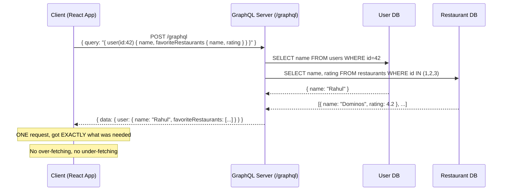

### GraphQL Schema — The Contract

The schema is the heart of GraphQL. It defines:
- What data types exist
- What fields each type has
- What queries are available
- What mutations are allowed
- What subscriptions are supported

```graphql
# schema.graphql — This IS the contract. Both sides agree on this.

# Types — your data model
type User {
  id: ID!              # "!" means non-null (required)
  name: String!
  email: String!
  phone: String        # nullable — might not exist
  profilePic: String
  createdAt: String!
  orders: [Order!]     # Relationship — a user has many orders
  reviews: [Review!]
}

type Restaurant {
  id: ID!
  name: String!
  cuisine: String!
  rating: Float!
  deliveryTimeMinutes: Int!
  isOpen: Boolean!
  menu: [MenuItem!]!
  reviews: [Review!]!
  location: Location!
}

type MenuItem {
  id: ID!
  name: String!
  price: Float!
  isVeg: Boolean!
  category: String!
}

type Order {
  id: ID!
  user: User!
  restaurant: Restaurant!
  items: [OrderItem!]!
  status: OrderStatus!
  totalAmount: Float!
  estimatedDelivery: Int
  createdAt: String!
}

enum OrderStatus {
  PENDING
  CONFIRMED
  PREPARING
  OUT_FOR_DELIVERY
  DELIVERED
  CANCELLED
}

type Location {
  lat: Float!
  lng: Float!
  address: String!
}

type Review {
  id: ID!
  rating: Int!
  comment: String
  author: User!
  restaurant: Restaurant!
  createdAt: String!
}

# Query — what you can READ
type Query {
  # Get a specific user
  user(id: ID!): User

  # Get a specific restaurant
  restaurant(id: ID!): Restaurant

  # Search restaurants near a location
  nearbyRestaurants(lat: Float!, lng: Float!, radiusKm: Float!): [Restaurant!]!

  # Get orders for a user
  userOrders(userId: ID!, status: OrderStatus): [Order!]!
}

# Mutation — what you can WRITE/MODIFY
type Mutation {
  # Place an order
  placeOrder(restaurantId: ID!, items: [OrderItemInput!]!): Order!

  # Update order status (for restaurants/delivery)
  updateOrderStatus(orderId: ID!, status: OrderStatus!): Order!

  # Post a review
  addReview(restaurantId: ID!, rating: Int!, comment: String): Review!
}

# Subscription — real-time events (WebSocket-based)
type Subscription {
  # Track an order in real-time
  orderStatusUpdated(orderId: ID!): Order!

  # New orders for a restaurant (for restaurant dashboard)
  newOrderForRestaurant(restaurantId: ID!): Order!
}

input OrderItemInput {
  menuItemId: ID!
  quantity: Int!
}

type OrderItem {
  menuItem: MenuItem!
  quantity: Int!
  price: Float!
}
```

### GraphQL Server Implementation (Apollo Server — Node.js)

```javascript
// server.js — Apollo GraphQL Server
const { ApolloServer } = require('@apollo/server');
const { startStandaloneServer } = require('@apollo/server/standalone');
const { readFileSync } = require('fs');

// Load schema from file
const typeDefs = readFileSync('./schema.graphql', 'utf8');

// Resolvers — HOW each field gets its data
// Think of these as the "implementation" for each field in the schema
const resolvers = {
  Query: {
    // Each resolver: (parent, args, context, info) => data
    user: async (_, { id }, { db }) => {
      return db.users.findById(id);
    },

    restaurant: async (_, { id }, { db }) => {
      return db.restaurants.findById(id);
    },

    nearbyRestaurants: async (_, { lat, lng, radiusKm }, { db }) => {
      return db.restaurants.findNearby(lat, lng, radiusKm);
    },
  },

  // Field-level resolvers — how to resolve relationships
  User: {
    // This runs for EACH user object — N+1 risk!
    // Solution: DataLoader (shown below)
    orders: async (user, _, { db }) => {
      return db.orders.findByUserId(user.id);
    },
  },

  Restaurant: {
    menu: async (restaurant, _, { db }) => {
      return db.menuItems.findByRestaurantId(restaurant.id);
    },
    reviews: async (restaurant, _, { loaders }) => {
      // Using DataLoader to batch and cache
      return loaders.reviewsByRestaurant.load(restaurant.id);
    },
  },

  Order: {
    // When client asks for order.user — resolve it
    user: async (order, _, { loaders }) => {
      return loaders.users.load(order.userId); // Batched!
    },
    restaurant: async (order, _, { loaders }) => {
      return loaders.restaurants.load(order.restaurantId); // Batched!
    },
  },

  Mutation: {
    placeOrder: async (_, { restaurantId, items }, { db, currentUser }) => {
      // currentUser comes from JWT in context
      if (!currentUser) throw new Error('You must be logged in');

      const order = await db.orders.create({
        userId: currentUser.id,
        restaurantId,
        items,
        status: 'PENDING',
        totalAmount: await calculateTotal(items, db),
        createdAt: new Date().toISOString(),
      });

      // Publish event to subscribers
      pubsub.publish(`ORDER_CREATED_${restaurantId}`, { newOrderForRestaurant: order });

      return order;
    },

    updateOrderStatus: async (_, { orderId, status }, { db, pubsub }) => {
      const order = await db.orders.update(orderId, { status });
      // Notify the subscriber (the user tracking their order)
      pubsub.publish(`ORDER_STATUS_${orderId}`, { orderStatusUpdated: order });
      return order;
    },
  },

  Subscription: {
    orderStatusUpdated: {
      subscribe: (_, { orderId }) =>
        pubsub.asyncIterator(`ORDER_STATUS_${orderId}`),
    },
    newOrderForRestaurant: {
      subscribe: (_, { restaurantId }) =>
        pubsub.asyncIterator(`ORDER_CREATED_${restaurantId}`),
    },
  },
};

const server = new ApolloServer({ typeDefs, resolvers });

const { url } = await startStandaloneServer(server, {
  context: async ({ req }) => ({
    db,
    loaders: createLoaders(db),  // DataLoaders for batching
    currentUser: await getUserFromToken(req.headers.authorization),
  }),
  listen: { port: 4000 },
});

console.log(`GraphQL API ready at ${url}`);
```

### The N+1 Problem and DataLoader — The Must-Know Fix

This is one of the most important GraphQL concepts for interviews.

**The N+1 Problem:**

```
You query 10 restaurants → 1 DB call
Each restaurant has reviews → 10 separate DB calls (one per restaurant)
Total: 11 DB calls for what should be 2

At scale: query 1000 restaurants = 1001 DB calls. Your DB melts.
```

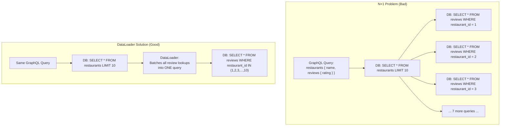

```javascript
// dataloader.js — The N+1 Fix
const DataLoader = require('dataloader');

function createLoaders(db) {
  return {
    // Instead of 10 separate DB calls, DataLoader BATCHES them
    // It collects all the IDs requested in one "tick" of the event loop
    // then fires ONE batch query

    users: new DataLoader(async (userIds) => {
      // userIds = [1, 2, 3, 4, 5, ...] — all requested in this tick
      const users = await db.query(
        'SELECT * FROM users WHERE id = ANY($1)',
        [userIds]
      );
      // MUST return in same order as input IDs
      return userIds.map(id => users.find(u => u.id === id) || null);
    }),

    restaurants: new DataLoader(async (restaurantIds) => {
      const restaurants = await db.query(
        'SELECT * FROM restaurants WHERE id = ANY($1)',
        [restaurantIds]
      );
      return restaurantIds.map(id => restaurants.find(r => r.id === id) || null);
    }),

    reviewsByRestaurant: new DataLoader(async (restaurantIds) => {
      const reviews = await db.query(
        'SELECT * FROM reviews WHERE restaurant_id = ANY($1)',
        [restaurantIds]
      );
      // Group reviews by restaurant_id
      return restaurantIds.map(id =>
        reviews.filter(r => r.restaurant_id === id)
      );
    }),
  };
}
```

### GraphQL Client — React with Apollo

```javascript
// UserOrdersPage.jsx — React component using GraphQL
import { useQuery, useMutation, useSubscription, gql } from '@apollo/client';

// Define queries as constants — these are type-checked with your schema
const GET_USER_DASHBOARD = gql`
  query GetUserDashboard($userId: ID!) {
    user(id: $userId) {
      name
      profilePic       # ← only ask for what we render
      # email NOT requested — saves bandwidth
      orders(status: ACTIVE) {
        id
        status
        estimatedDelivery
        restaurant {
          name          # ← nested field, one request handles it all
          # rating NOT requested — not shown on this page
        }
        items {
          menuItem {
            name
            price
          }
          quantity
        }
        totalAmount
      }
    }
  }
`;

const PLACE_ORDER = gql`
  mutation PlaceOrder($restaurantId: ID!, $items: [OrderItemInput!]!) {
    placeOrder(restaurantId: $restaurantId, items: $items) {
      id
      status
      estimatedDelivery
    }
  }
`;

const TRACK_ORDER = gql`
  subscription TrackOrder($orderId: ID!) {
    orderStatusUpdated(orderId: $orderId) {
      id
      status
      estimatedDelivery
    }
  }
`;

function UserDashboard({ userId }) {
  // Query — fetches on mount, auto-updates cache
  const { loading, error, data } = useQuery(GET_USER_DASHBOARD, {
    variables: { userId },
  });

  // Mutation — returns a function to call + loading/error state
  const [placeOrder, { loading: ordering }] = useMutation(PLACE_ORDER);

  // Subscription — real-time updates via WebSocket
  const activeOrderId = data?.user?.orders?.[0]?.id;
  const { data: trackData } = useSubscription(TRACK_ORDER, {
    variables: { orderId: activeOrderId },
    skip: !activeOrderId,
  });

  if (loading) return <Spinner />;
  if (error) return <Error message={error.message} />;

  const user = data.user;

  return (
    <div>
      <h1>Welcome, {user.name}!</h1>
      {user.orders.map(order => (
        <OrderCard
          key={order.id}
          order={order}
          // Real-time status overrides fetched status if subscription active
          liveStatus={trackData?.orderStatusUpdated?.status}
        />
      ))}
    </div>
  );
}
```

### GraphQL vs REST — Solving the Zomato Home Screen Problem

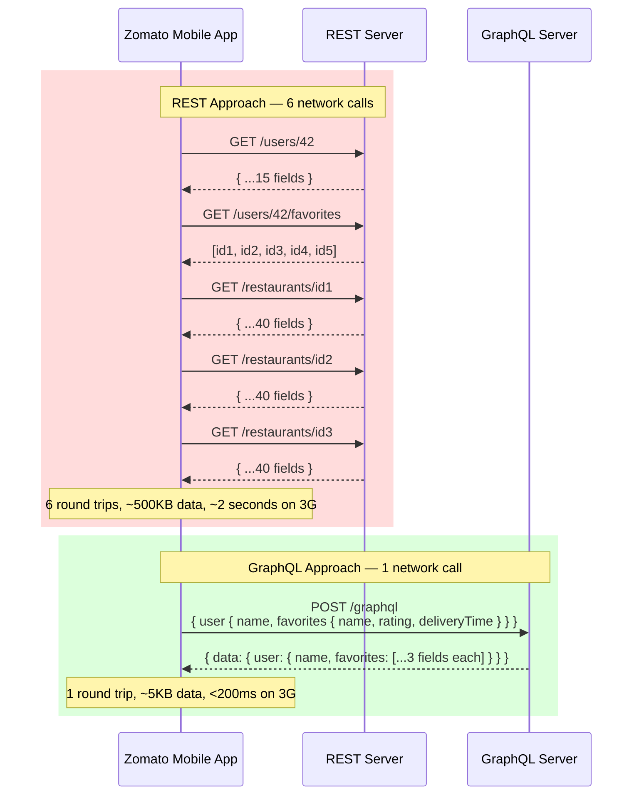

### GraphQL Pros and Cons

**Pros:**
- Zero over-fetching and under-fetching — you get exactly what you ask for
- Self-documenting schema — GraphiQL playground is built-in documentation
- Single endpoint simplifies client code
- Perfect for mobile (bandwidth constrained) — Swiggy, Zomato, Instagram mobile
- Strong typing — schema is the contract, errors are caught early
- Excellent for rapidly evolving products — deprecate fields gracefully
- One query can span multiple data sources (user DB + restaurant DB + order DB)

**Cons:**
- Complex server implementation — DataLoader, resolvers, schema design
- N+1 query problem (requires DataLoader discipline)
- HTTP caching is broken — all requests go to `POST /graphql`, CDNs can't cache
- Learning curve — Apollo, schema design, resolver patterns
- Overkill for simple CRUD APIs
- File uploads are awkward (not native to GraphQL)
- Performance overhead — parsing and validating queries on every request

### Real Companies Using GraphQL

- **Facebook/Meta** — invented it, uses it for the newsfeed
- **GitHub GraphQL API v4** — you can query exactly the repo data you need
- **Shopify Admin API** — merchants build apps with precise data queries
- **Twitter** — internal BFF layer for the web frontend
- **Airbnb** — listing search with complex nested data
- **Netflix** — some internal APIs
- **Instagram** — mobile app BFF

---

## Part 3: gRPC — The Speed Demon for Internal Services

### What is gRPC? (Yeh hai asli rocket fuel)

gRPC (Google Remote Procedure Call) was created by Google in 2015, born from their internal RPC framework called "Stubby" that had been running Google's internal systems for over a decade.

The core idea: **call a function on another machine as if it's a local function**. No designing URLs, no deciding HTTP verbs, no serializing/deserializing JSON. You call `GetUser(42)` and get back a `User` object. The network is invisible.

gRPC runs over **HTTP/2** and uses **Protocol Buffers (Protobuf)** — a binary serialization format that is 3-10x smaller than JSON and parses 5-10x faster.

### Why gRPC Was Invented

Google runs tens of thousands of microservices. At 2017 scale, Google was handling **3.5 billion** requests per second internally. With REST+JSON, the serialization overhead alone would require thousands of extra servers.

They needed:
- **Binary protocol** — no text parsing overhead
- **Multiplexed connections** — multiple concurrent streams over one TCP connection
- **Streaming** — send and receive continuous data, not just request-response
- **Generated clients** — developers shouldn't write boilerplate networking code
- **Contract enforcement** — if you change a service's API, the proto file changes, and all clients fail to compile until they update

### The gRPC Speed Advantage — Why 5-10x Faster?

Let's break down exactly where the speed comes from:

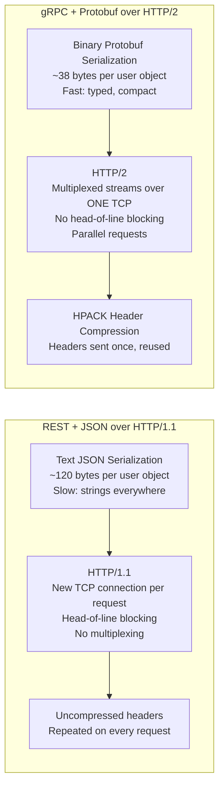

| Factor | REST + JSON | gRPC + Protobuf | Speed Gain |
|--------|------------|----------------|------------|
| Serialization | Text (slow) | Binary (fast) | 5-7x faster parse |
| Payload size | ~120 bytes | ~38 bytes | 3x smaller |
| Transport | HTTP/1.1 (1 req/conn) | HTTP/2 (multiplexed) | No connection overhead |
| Header compression | None | HPACK | 90% header savings |
| Connection | New TCP per request | Persistent | No TCP handshake overhead |
| **Overall** | **Baseline** | **5-10x faster** | |

### Protocol Buffers — The Secret Sauce

Protobuf is NOT just a serialization format. It is a **schema language + code generator + binary format** all in one.

You write a `.proto` file (your schema), run the `protoc` compiler, and it generates type-safe client and server code in Go, Java, Python, Node.js, C++, Ruby, PHP, Dart (Flutter) — any language. Basically, you write the schema once and get a strongly-typed client library for free in every language your team uses.

```protobuf
// delivery.proto — A Zomato delivery system in Protobuf

syntax = "proto3";

package delivery;

// ==========================================
// SERVICE DEFINITION — what functions exist
// ==========================================

service DeliveryService {
  // Unary: assign a delivery partner to an order
  rpc AssignPartner (AssignRequest) returns (Assignment);

  // Server Streaming: track delivery partner location in real-time
  // Client opens ONE request, server keeps sending location updates
  rpc TrackDelivery (TrackRequest) returns (stream LocationUpdate);

  // Client Streaming: delivery partner sends batch GPS pings
  // Partner sends many GPS pings, server responds with one summary
  rpc UploadRoute (stream GpsPoint) returns (RouteStats);

  // Bidirectional Streaming: live chat between customer and delivery partner
  rpc DeliveryChat (stream ChatMessage) returns (stream ChatMessage);
}

// ==========================================
// MESSAGE DEFINITIONS — your data types
// ==========================================

message AssignRequest {
  string order_id = 1;       // Field number 1 — NEVER change
  double pickup_lat = 2;
  double pickup_lng = 3;
  double drop_lat = 4;
  double drop_lng = 5;
}

message Assignment {
  string partner_id = 1;
  string partner_name = 2;
  string partner_phone = 3;
  int32 estimated_minutes = 4;
  double partner_lat = 5;
  double partner_lng = 6;
}

message TrackRequest {
  string order_id = 1;
}

message LocationUpdate {
  string partner_id = 1;
  double lat = 2;
  double lng = 3;
  int64 timestamp = 4;        // Unix ms
  int32 estimated_minutes = 5;
  DeliveryStatus status = 6;
}

enum DeliveryStatus {
  ASSIGNED = 0;
  PICKED_UP = 1;
  EN_ROUTE = 2;
  NEARBY = 3;
  DELIVERED = 4;
}

message GpsPoint {
  double lat = 1;
  double lng = 2;
  int64 timestamp = 3;
  float speed_kmh = 4;
}

message RouteStats {
  double total_distance_km = 1;
  int32 duration_minutes = 2;
  float average_speed_kmh = 3;
}

message ChatMessage {
  string sender_id = 1;
  string text = 2;
  int64 timestamp = 3;
}
```

### gRPC Server — Node.js Implementation

```javascript
// delivery-server.js — gRPC server
const grpc = require('@grpc/grpc-js');
const protoLoader = require('@grpc/proto-loader');

// Load and parse the proto file
const packageDef = protoLoader.loadSync('./delivery.proto', {
  keepCase: true,
  longs: String,
  enums: String,
  defaults: true,
  oneofs: true,
});
const deliveryProto = grpc.loadPackageDefinition(packageDef).delivery;

// ==========================================
// IMPLEMENT THE SERVICE
// ==========================================

const server = new grpc.Server();

server.addService(deliveryProto.DeliveryService.service, {

  // 1. UNARY RPC — like a regular REST endpoint
  AssignPartner: async (call, callback) => {
    const { order_id, pickup_lat, pickup_lng, drop_lat, drop_lng } = call.request;

    try {
      // Find nearest available partner using geospatial query
      const partner = await findNearestPartner(pickup_lat, pickup_lng);

      if (!partner) {
        // gRPC error codes: NOT_FOUND, UNAVAILABLE, INTERNAL, INVALID_ARGUMENT, etc.
        return callback({
          code: grpc.status.UNAVAILABLE,
          message: 'No delivery partners available in your area',
        });
      }

      const assignment = {
        partner_id: partner.id,
        partner_name: partner.name,
        partner_phone: partner.phone,
        estimated_minutes: partner.etaMinutes,
        partner_lat: partner.currentLat,
        partner_lng: partner.currentLng,
      };

      callback(null, assignment); // null = no error, assignment = the response
    } catch (err) {
      callback({ code: grpc.status.INTERNAL, message: err.message });
    }
  },

  // 2. SERVER STREAMING — server sends multiple messages over one connection
  // Think of it like: client asks "track my order" and server keeps sending
  // location updates every 5 seconds until delivery is complete
  TrackDelivery: (call) => {
    const { order_id } = call.request;

    // Subscribe to GPS updates from partner
    const subscription = gpsEventBus.subscribe(order_id, (gpsUpdate) => {
      // Each .write() sends one message to the client
      call.write({
        partner_id: gpsUpdate.partnerId,
        lat: gpsUpdate.lat,
        lng: gpsUpdate.lng,
        timestamp: Date.now(),
        estimated_minutes: gpsUpdate.eta,
        status: gpsUpdate.status,
      });

      // When delivered, end the stream
      if (gpsUpdate.status === 'DELIVERED') {
        subscription.unsubscribe();
        call.end(); // Close the stream
      }
    });

    // Handle client disconnect (user closes the app)
    call.on('cancelled', () => {
      subscription.unsubscribe();
    });
  },

  // 3. CLIENT STREAMING — client sends many messages, server sends one response
  // Delivery partner's phone sends GPS points continuously
  // Server processes them all and returns route statistics at the end
  UploadRoute: (call, callback) => {
    const points = [];

    call.on('data', (gpsPoint) => {
      points.push(gpsPoint); // Collect each GPS ping
    });

    call.on('end', () => {
      // Client done sending — compute stats and respond once
      const stats = computeRouteStats(points);
      callback(null, {
        total_distance_km: stats.distance,
        duration_minutes: stats.duration,
        average_speed_kmh: stats.avgSpeed,
      });
    });

    call.on('error', (err) => {
      console.error('Client stream error:', err);
    });
  },

  // 4. BIDIRECTIONAL STREAMING — both sides send messages simultaneously
  // Customer and delivery partner chatting in real-time
  DeliveryChat: (call) => {
    const partnerId = call.metadata.get('partner-id')[0];

    call.on('data', (message) => {
      // Forward message to the other party
      chatEventBus.publish(message.sender_id, {
        sender_id: message.sender_id,
        text: message.text,
        timestamp: Date.now(),
      });
    });

    // Listen for messages meant for this call's user
    const sub = chatEventBus.subscribe(partnerId, (msg) => {
      call.write(msg);
    });

    call.on('end', () => {
      sub.unsubscribe();
      call.end();
    });
  },
});

server.bindAsync(
  '0.0.0.0:50051',
  grpc.ServerCredentials.createInsecure(),
  (err, port) => {
    if (err) throw err;
    server.start();
    console.log(`gRPC Delivery Service running on port ${port}`);
  }
);
```

### gRPC Client — Using the Service

```javascript
// delivery-client.js — gRPC client in Node.js
// (Could equally be Python, Go, Java, Dart — same proto file generates them all)
const grpc = require('@grpc/grpc-js');
const protoLoader = require('@grpc/proto-loader');

const packageDef = protoLoader.loadSync('./delivery.proto', { keepCase: true });
const deliveryProto = grpc.loadPackageDefinition(packageDef).delivery;

// Create client stub — the generated proxy object
const client = new deliveryProto.DeliveryService(
  'delivery-service:50051',  // internal Kubernetes service name
  grpc.credentials.createInsecure()  // use SSL in production!
);

// 1. UNARY call — just like calling a local function
async function assignDeliveryPartner(orderId, pickupLat, pickupLng, dropLat, dropLng) {
  return new Promise((resolve, reject) => {
    client.AssignPartner({
      order_id: orderId,
      pickup_lat: pickupLat,
      pickup_lng: pickupLng,
      drop_lat: dropLat,
      drop_lng: dropLng,
    }, (err, assignment) => {
      if (err) reject(err);
      else resolve(assignment);
    });
  });
}

// Usage
const assignment = await assignDeliveryPartner('order_123', 12.97, 77.59, 12.93, 77.61);
console.log(`Partner ${assignment.partner_name} assigned, ETA: ${assignment.estimated_minutes} mins`);

// 2. SERVER STREAMING — react to each location update
function startTracking(orderId) {
  const stream = client.TrackDelivery({ order_id: orderId });

  stream.on('data', (update) => {
    // Each update has partner's current location + ETA
    updateMapMarker(update.lat, update.lng);
    updateETA(update.estimated_minutes);

    if (update.status === 'DELIVERED') {
      console.log('Order delivered!');
    }
  });

  stream.on('error', (err) => console.error('Tracking error:', err));
  stream.on('end', () => console.log('Tracking stream closed'));
}

// 3. BIDIRECTIONAL streaming — chat
function startChat(myId, partnerId) {
  const chatStream = client.DeliveryChat(
    new grpc.Metadata().set('partner-id', partnerId)
  );

  chatStream.on('data', (msg) => {
    displayMessage(msg.sender_id, msg.text, msg.timestamp);
  });

  chatStream.on('end', () => console.log('Chat ended'));

  // Return a send function for the UI to call
  return {
    send: (text) => chatStream.write({ sender_id: myId, text, timestamp: Date.now() }),
    end: () => chatStream.end(),
  };
}
```

### The 4 gRPC Streaming Modes — Visual Explanation

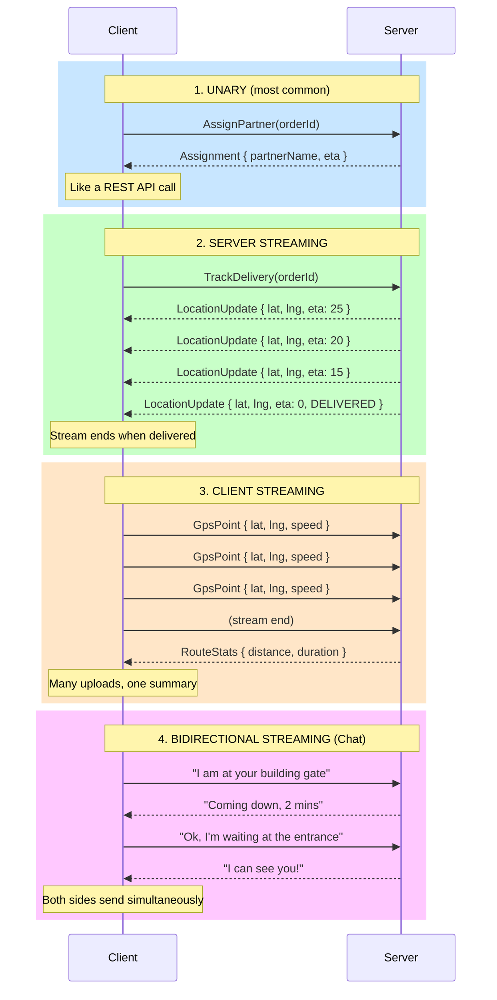

### Protobuf Wire Format — Why It's So Compact

```
JSON encoding of a User:
{ "id": 42, "name": "Rahul", "email": "rahul@gmail.com" }
= 52 bytes (human readable, lots of quotes, colons, spaces)

Protobuf encoding of the same User:
[0x08 0x2A 0x12 0x05 0x52 0x61 0x68 0x75 0x6C 0x1A 0x0F 0x72 0x61 0x68 ...]
= ~18 bytes (binary, field numbers + values, no field name strings)

At 1 million requests/second between microservices:
  JSON: 52 MB/s of data
  Protobuf: 18 MB/s of data
  Savings: 34 MB/s → millions in infrastructure savings at Google scale
```

### Protobuf Schema Evolution — Backwards Compatibility

This is gRPC's secret superpower for versioning. No more `/v1` vs `/v2` in URLs.

```protobuf
// version 1 of the schema
message UserV1 {
  int32 id = 1;
  string name = 2;
  string email = 3;
}

// version 2 — add new fields safely
// Old clients that receive this just IGNORE fields 4 and 5
// New clients that receive a V1 message get default values for 4 and 5
message UserV2 {
  int32 id = 1;        // SAME field number — never change these
  string name = 2;     // SAME field number
  string email = 3;    // SAME field number
  string phone = 4;    // NEW — old clients ignore this safely
  bool is_verified = 5; // NEW — old clients ignore this safely
}

// version 3 — removing a field MUST use reserved
// to prevent reusing field number 4 (would corrupt old data)
message UserV3 {
  int32 id = 1;
  string name = 2;
  string email = 3;
  reserved 4;                    // phone was removed — mark reserved
  reserved "phone";              // also reserve the name
  bool is_verified = 5;
  repeated string roles = 6;    // NEW — list of roles
}
```

The rule: **field numbers are forever**. Add new ones freely. Never change or reuse existing ones. This gives you zero-downtime deployments when evolving internal service APIs.

### gRPC Error Codes — Not HTTP Codes

```javascript
// gRPC has its own status code system (not HTTP 404, 500, etc.)
const grpc = require('@grpc/grpc-js');

// Common gRPC status codes:
// grpc.status.OK               (0) — success
// grpc.status.CANCELLED        (1) — client cancelled the request
// grpc.status.UNKNOWN          (2) — unknown error
// grpc.status.INVALID_ARGUMENT (3) — bad input
// grpc.status.NOT_FOUND        (5) — resource doesn't exist
// grpc.status.ALREADY_EXISTS   (6) — resource already exists
// grpc.status.PERMISSION_DENIED (7) — no permission
// grpc.status.UNAUTHENTICATED  (16) — not authenticated
// grpc.status.RESOURCE_EXHAUSTED (8) — rate limited
// grpc.status.UNAVAILABLE      (14) — service temporarily down
// grpc.status.DEADLINE_EXCEEDED (4) — timeout

// Server returning an error
callback({
  code: grpc.status.NOT_FOUND,
  message: 'Order not found',
  details: 'Order ID does not exist in the system',
});

// Client handling errors
client.GetOrder({ order_id: 'bad-id' }, (err, order) => {
  if (err) {
    switch (err.code) {
      case grpc.status.NOT_FOUND:
        console.log('Order not found');
        break;
      case grpc.status.UNAUTHENTICATED:
        // Refresh token and retry
        refreshTokenAndRetry();
        break;
      case grpc.status.UNAVAILABLE:
        // Retry with exponential backoff
        retryWithBackoff();
        break;
      default:
        console.error('Unexpected error:', err.message);
    }
  }
});
```

### gRPC Pros and Cons

**Pros:**
- 5-10x faster than REST+JSON (binary + HTTP/2)
- Strongly typed contracts via proto files — compile-time error catching
- Code generation — free client libraries in all languages
- Native streaming (4 modes) — real-time without WebSocket hacks
- HTTP/2 multiplexing — multiple concurrent calls over one connection
- Perfect for microservices on Kubernetes + service mesh (Istio, Envoy)
- Backwards-compatible schema evolution via field numbers

**Cons:**
- Not browser-native — browsers cannot speak gRPC without grpc-web proxy
- Binary format — you cannot `curl` it and read the output
- Harder to debug — need special tools (grpcurl, BloomRPC, Kreya)
- Proto file changes require recompiling clients — coordinated deploys
- Learning curve — protobuf schema design, generated code, streaming patterns
- Not suitable for public APIs — third-party developers expect REST

### Real Companies Using gRPC

- **Google** — built it, runs all internal APIs on gRPC (Google Cloud APIs are gRPC)
- **Netflix** — internal microservice mesh runs on gRPC
- **Uber** — dispatch system, matching service, real-time driver tracking
- **Square** — payment processing internal services
- **Lyft** — internal service-to-service communication
- **Slack** — internal backend communications
- **Cockroach Labs** — distributed database nodes communicate via gRPC

---

## Part 4: Full Comparison — REST vs GraphQL vs gRPC

### The Grand Comparison Table

| Feature | REST | GraphQL | gRPC |
|---------|------|---------|------|
| **Year Created** | 2000 | 2015 (FB) | 2015 (Google) |
| **Transport** | HTTP/1.1 | HTTP/1.1 or 2 | HTTP/2 only |
| **Data Format** | JSON (text) | JSON (text) | Protobuf (binary) |
| **Browser Support** | Native, universal | Native (Apollo client) | No (needs grpc-web proxy) |
| **Performance** | Moderate | Moderate | 5-10x faster |
| **Payload Size** | Large | Medium (no over-fetch) | 3-10x smaller |
| **Type Safety** | None (OpenAPI optional) | Strong (SDL schema) | Very strong (proto files) |
| **Schema/Contract** | Optional | Mandatory | Mandatory |
| **Learning Curve** | Very low | Medium-high | High |
| **Streaming** | Limited (SSE, WS add-on) | Subscriptions (WS) | Native (4 modes) |
| **Caching** | Easy (HTTP cache) | Hard (no URL caching) | No built-in caching |
| **Error Handling** | HTTP status codes | Custom (always 200!) | gRPC status codes |
| **Code Generation** | Optional (OpenAPI → SDK) | Optional | Strongly recommended |
| **Versioning** | URL-based (/v1/, /v2/) | Schema evolution | Field numbers (seamless) |
| **Debugging** | Easy (curl, Postman) | Good (GraphiQL) | Hard (need grpcurl) |
| **Tooling** | Excellent | Good | Growing |
| **File Uploads** | Easy (multipart) | Awkward | Awkward |
| **Real-time** | Add-on (SSE/WebSocket) | Subscriptions | Native streaming |
| **Public API** | Yes, ideal | Yes, good | No |
| **Browser clients** | Yes | Yes | No (without proxy) |
| **Internal services** | Works | Overkill | Ideal |
| **Mobile apps** | Works | Ideal (bandwidth) | No |
| **Ideal For** | Public APIs, CRUD | Complex UIs, mobile BFF | Microservice mesh |

### When to Use What — Decision Flowchart

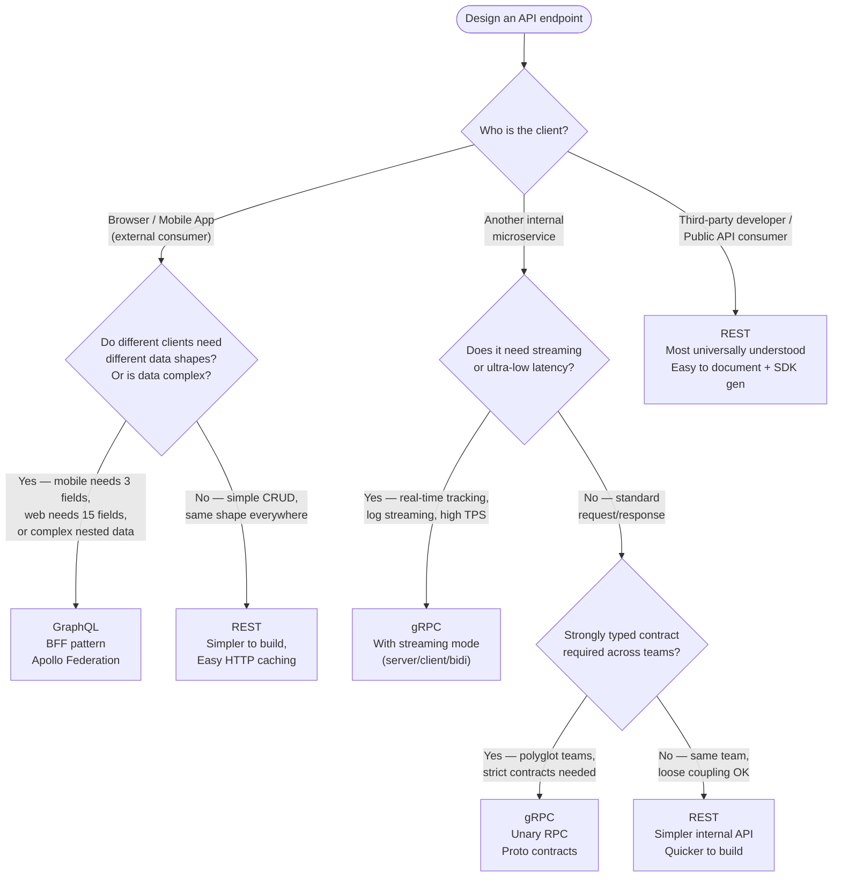

### Typical Architecture — Using All Three Together

This is the pattern used by Swiggy, Zomato, Uber, Netflix. Study this architecture carefully — it's the most common system design answer.


---

## Part 5: Advanced Topics

### gRPC-Web — Bringing gRPC to Browsers

Browsers cannot speak HTTP/2 binary framing directly (the browser's Fetch API is too high-level). So for browser → gRPC, you need an **Envoy proxy** that translates grpc-web (browser protocol) to gRPC (binary HTTP/2).

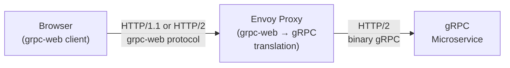

Most teams don't bother with grpc-web. Instead, they expose REST or GraphQL for browser clients and use gRPC only for server-to-server.

### GraphQL Federation — Scaling GraphQL Across Teams

When you have many teams each owning their own service, you don't want one centralized GraphQL schema. Apollo Federation lets each service define its own schema, and a **gateway** stitches them together.

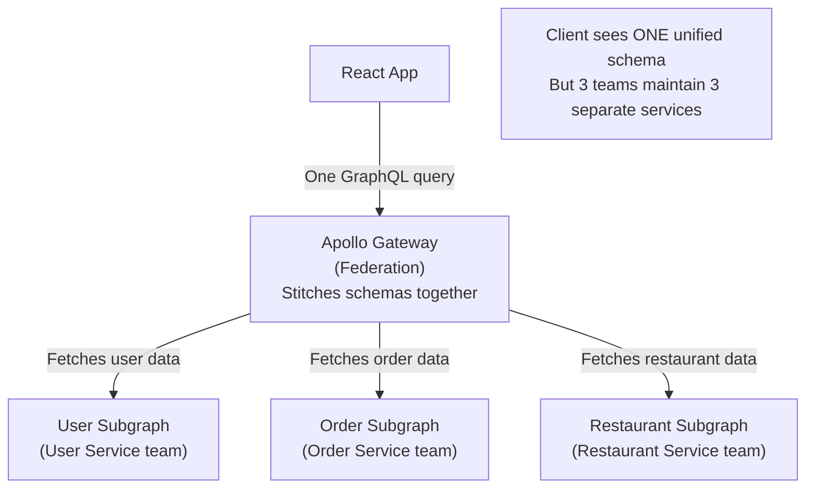

```graphql
# Each service defines its own schema + extends others

# user-service/schema.graphql
type User @key(fields: "id") {
  id: ID!
  name: String!
  email: String!
}

# order-service/schema.graphql
type Order @key(fields: "id") {
  id: ID!
  status: String!
  user: User!  # References User from user-service
}

extend type User @key(fields: "id") {
  id: ID! @external
  orders: [Order!]!  # order-service extends User to add orders
}
```

### REST API Versioning Strategies

```
1. URL Versioning (most common):
   /v1/restaurants/{id}
   /v2/restaurants/{id}   ← breaking changes go here
   Pro: Clear, explicit
   Con: Pollutes URLs, old versions pile up

2. Header Versioning:
   GET /restaurants/{id}
   Accept: application/vnd.myapp.v2+json
   Pro: Clean URLs
   Con: Less visible, harder to test in browser

3. Query Parameter:
   GET /restaurants/{id}?version=2
   Pro: Easy to test
   Con: Can be forgotten, cache key issues

4. GraphQL approach — deprecate fields, never version:
   type Restaurant {
     cuisine: String @deprecated(reason: "Use cuisineType instead")
     cuisineType: CuisineType!  ← new enum field
   }

5. gRPC approach — field numbers + reserved:
   No versions needed. Add fields (new numbers), reserve removed ones.
```

### Caching Strategies for Each Protocol

```
REST — Easiest Caching:
  GET /restaurants/123
  ↓ CDN caches the response
  ↓ Browser caches the response  
  Cache-Control: max-age=300, public
  ETag: "abc123"  (for conditional requests)

GraphQL — Hard to Cache:
  POST /graphql  (all requests go to same URL)
  ↓ CDN cannot cache POST requests by default
  Solutions:
  1. Persisted Queries — hash the query, use GET /graphql?operationId=<hash>
  2. Apollo Cache — in-memory client-side cache (smart normalization)
  3. DataLoader — server-side batching + per-request caching

gRPC — No HTTP Caching:
  No CDN caching at all (binary, stateful streams)
  Solutions:
  1. Redis — cache results in application layer
  2. Service Mesh (Istio) — can cache at the mesh level
  3. Design idempotent endpoints so clients can safely retry
```

### Error Handling Philosophy — A Key Difference

```javascript
// REST — HTTP status codes carry meaning
// 200 = OK, 201 = Created, 400 = Bad Request, 401 = Unauthorized,
// 403 = Forbidden, 404 = Not Found, 429 = Rate Limited, 500 = Server Error

const response = await fetch('/restaurants/999');
if (response.status === 404) {
  showError('Restaurant not found');
} else if (response.status === 429) {
  showError('Too many requests — please wait');
} else if (!response.ok) {
  showError('Something went wrong');
}

// GraphQL — ALWAYS returns 200 OK, errors are in the body
// This surprises people — even catastrophic errors return 200 HTTP
const response = await fetch('/graphql', {
  method: 'POST',
  body: JSON.stringify({ query: '{ restaurant(id: "999") { name } }' }),
});
// response.status is 200 even if the query failed!
const { data, errors } = await response.json();
if (errors) {
  // Errors are in the body, not the HTTP status
  errors.forEach(err => console.error(err.message));
}

// gRPC — Status codes in the gRPC metadata, not HTTP
client.GetRestaurant({ id: '999' }, (err, restaurant) => {
  if (err) {
    if (err.code === grpc.status.NOT_FOUND) {
      showError('Restaurant not found');
    } else if (err.code === grpc.status.DEADLINE_EXCEEDED) {
      showError('Request timed out — try again');
    }
  }
});
```

### Load Balancing Considerations

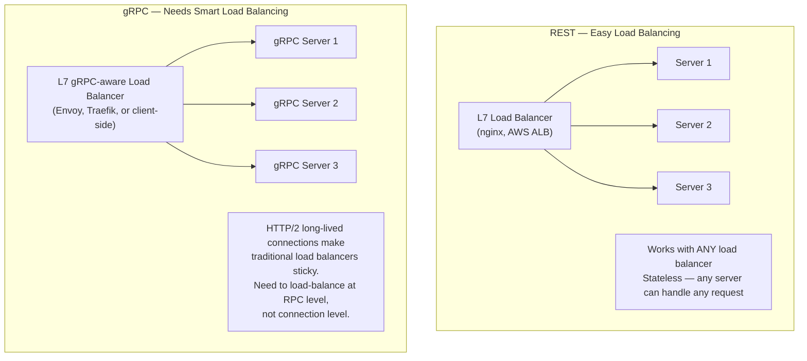

---

## Part 6: Putting It All Together — System Design Examples

### Example 1: Design Uber's Backend API Layer

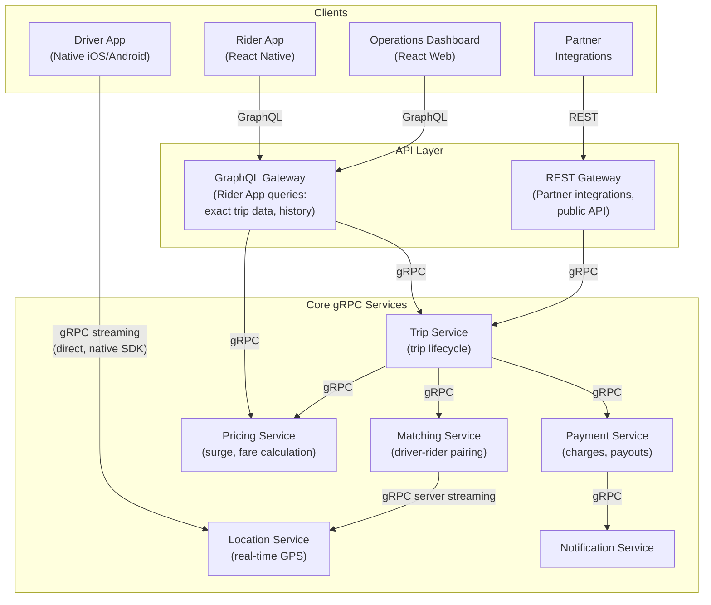

**Why this design:**
- Rider app uses GraphQL — the home screen shows trip history, nearby drivers, estimated fare, user profile all in one query
- Driver app uses gRPC streaming directly — the driver needs real-time GPS coordination, streaming new trip requests, bidirectional chat
- Partner integrations use REST — third-party developers are familiar with REST, easy to onboard
- All internal services use gRPC — millisecond latency matters when matching drivers to riders (Uber does this in <100ms globally)

### Example 2: Design Instagram's API Layer

Instagram's architecture (simplified):

```
Mobile App (iOS/Android/Web)
  ↓
GraphQL API (for the feed, explore, stories)
  → Why GraphQL? The feed screen needs:
    - User profile (name, pic, follower count)
    - 10 posts (image URLs, caption, like count, top 3 comments)
    - Stories (15 avatar thumbnails with unseen indicator)
    - Reel suggestions (thumbnail + view count)
    All in ONE query. Rest would need 5+ calls.
  ↓
Internal Services (gRPC)
  - Feed Generation Service (ML ranking of posts)
  - Media Service (CDN URLs for images/videos)
  - User Service (profile data)
  - Engagement Service (likes, comments, shares)
  - Notification Service (real-time push via WebSocket + gRPC)
  ↓
REST for public API
  - Instagram Basic Display API (third-party apps)
  - Instagram Graph API (business analytics)
```

---

## Common Interview Questions

### Q1: "Explain the difference between REST and GraphQL"

**Strong Answer Framework:**

REST uses multiple endpoints (one per resource) and returns fixed data shapes — you get everything the server defined for that resource, whether you need it all or not. This causes over-fetching (getting 40 fields when you need 3) and under-fetching (needing 5 separate requests for related data).

GraphQL uses a single endpoint where the client sends a query describing exactly what data it needs — fields, nested relationships, and all. The server returns exactly that structure. This eliminates over-fetching and under-fetching.

Trade-off: GraphQL adds server complexity (resolver tree, DataLoader for N+1), breaks HTTP caching, and has a higher learning curve. REST is simpler, universally understood, and has excellent HTTP caching support.

When to use REST: public APIs, simple CRUD, partner integrations.
When to use GraphQL: complex frontends, mobile apps (bandwidth-sensitive), BFF pattern.

---

### Q2: "Why is gRPC faster than REST?"

**Strong Answer Framework:**

Three reasons:

1. **Binary protocol** — JSON is text. `"name": "Rahul"` is 16 characters of ASCII. Protobuf encodes the same as ~8 bytes of binary with no field names repeated. Parsing binary is also faster than parsing text.

2. **HTTP/2** — HTTP/1.1 sends one request per TCP connection (or needs multiple connections). HTTP/2 multiplexes many concurrent requests over ONE TCP connection — no connection setup overhead for each call. Plus HPACK header compression.

3. **Persistent connections** — gRPC maintains long-lived connections between services (a client connection pool), avoiding the TCP handshake overhead that REST incurs per request.

Combined: 5-10x faster throughput and 3-5x smaller payloads. At Google's scale (billions of RPCs/day), this saves enormous infrastructure costs.

---

### Q3: "What is the N+1 problem in GraphQL and how do you fix it?"

**Strong Answer Framework:**

If you query 10 posts and each post has an `author` field, GraphQL's resolver pattern executes `db.users.findById(authorId)` once per post — that's 10 separate database queries for what should be a single `SELECT ... WHERE id IN (...)` query.

Fix: **DataLoader** (Facebook's library). DataLoader collects all individual load requests that happen in one "tick" of the Node.js event loop, then fires ONE batched database query, and maps results back to individual requests.

```
Without DataLoader: 1 query (get posts) + 10 queries (get each author) = 11 total
With DataLoader: 1 query (get posts) + 1 query (get all authors) = 2 total
```

---

### Q4: "When would you NOT use gRPC?"

**Strong Answer:**

1. **Browser clients** — browsers cannot speak gRPC natively. You need grpc-web + Envoy proxy, adding operational complexity. For browser clients, use REST or GraphQL.

2. **Public APIs** — third-party developers expect REST or GraphQL. They don't want to work with proto files and generated clients for a simple integration.

3. **Debugging-sensitive environments** — gRPC binary messages cannot be read with `curl` or browser network inspector. Need specialized tooling (grpcurl, Postman with gRPC support). For APIs that need easy debugging, REST wins.

4. **Legacy infrastructure** — HTTP/2 requires TLS in many implementations, and older proxies/load balancers may not support HTTP/2 correctly.

5. **Small teams / simple APIs** — the overhead of protobuf schemas, code generation, and gRPC server setup is not justified unless performance is critical.

---

### Q5: "Design the API layer for a food delivery app (like Zomato)"

**Strong Answer Structure:**

Use three protocols at different layers:

**External (browser + mobile app) → GraphQL** because:
- The home screen needs restaurant list + user location + past orders + promotions in one query
- Mobile is bandwidth-constrained — GraphQL's exact-data-fetch saves MB of data on 3G
- Multiple screens need different data shapes from the same resources

**Public/Partner API → REST** because:
- Third-party restaurant aggregators, payment partners need standard HTTP integration
- Easy to document with OpenAPI/Swagger
- No learning curve for partner developers

**Internal microservices → gRPC** because:
- Restaurant service, order service, payment service, delivery matching — all talk at high frequency
- Delivery tracking needs server-streaming gRPC (partner sends GPS, users track in real-time)
- Polyglot teams (Go for matching, Java for payments, Node for notifications) — proto files generate clients for all

---

### Q6: "How does Protobuf ensure backwards compatibility?"

**Strong Answer:**

Protobuf assigns **field numbers** to each field (e.g., `string name = 2`). These numbers are what gets encoded in the binary wire format — not the field name. This means:

- **Adding new fields** is safe. Old clients that receive a new-field message just skip unknown field numbers. Old servers that receive a new-field message ignore the new fields.
- **Removing fields** must be marked `reserved` to prevent the number from being reused (reusing a field number would corrupt data for clients that have the old schema).
- **Renaming fields** is safe as long as the field number stays the same — only the number is on the wire.

This enables seamless schema evolution without URL versioning. You can add fields to a proto and deploy new services while old services are still running — they interoperate without issues. This is called **zero-downtime schema evolution**.

---

### Q7: "What is the BFF (Backend for Frontend) pattern and when do you use GraphQL for it?"

**Strong Answer:**

BFF is an API layer custom-built for a specific frontend client (the iOS app gets its own BFF, the web app gets its own BFF). Instead of one general API serving all clients, each client gets a tailor-made API that speaks exactly the language its UI needs.

GraphQL is a perfect fit for BFF because:
- The BFF's GraphQL schema is designed around the UI's exact data needs
- The web BFF can expose queries for complex dashboard screens; the mobile BFF can expose stripped-down queries for bandwidth efficiency
- With Apollo Federation, multiple teams can own their domain services but expose a unified GraphQL schema to the BFF

**Real example:** Twitter uses GraphQL as the BFF for its web frontend. The web app sends queries shaped around its UI components, the BFF resolves these by calling internal gRPC microservices, and stitches the responses together before returning the exact shape the UI expects.

---

### Q8: "What are the 4 gRPC streaming modes? Give a real-world use case for each."

| Mode | How It Works | Real-World Example |
|------|-------------|-------------------|
| **Unary** | 1 request → 1 response | Looking up a restaurant by ID |
| **Server Streaming** | 1 request → many responses | Customer tracking a delivery in real-time (one "track" request → continuous GPS updates) |
| **Client Streaming** | Many requests → 1 response | Delivery partner app uploading batch GPS route data → server returns route summary |
| **Bidirectional Streaming** | Many ↔ Many simultaneously | Real-time chat between customer and delivery partner during an order |

---

### Q9: "Why does GraphQL always return HTTP 200 even for errors?"

**Short Answer:** It's a design choice. GraphQL is a query language that can partially succeed — some fields might resolve successfully while others fail. A single HTTP status code cannot represent partial success. So GraphQL standardized on always returning 200 OK and putting errors inside a top-level `"errors"` array in the JSON response body. The `"data"` and `"errors"` fields coexist.

**Implication for monitoring:** You cannot use HTTP 5xx rates to monitor GraphQL error rates. You must parse response bodies and track the presence of the `errors` field. This is a common operational trap teams fall into.

---

### Q10: "What is the difference between REST's URL versioning and gRPC's schema evolution?"

**REST URL Versioning:**
```
/v1/users/{id}  → maintained indefinitely (old clients still use it)
/v2/users/{id}  → new contract, breaking changes here
```
Problem: You now maintain 2 versions of every endpoint. Deprecating v1 requires all clients to migrate first. Operationally expensive.

**gRPC Schema Evolution:**
```protobuf
message User {
  int32 id = 1;     // original fields — never change
  string name = 2;
  string phone = 4; // new field in "v2" — just add it
  // old clients receive this and simply IGNORE field 4
  // new clients receive a v1 message and get default value for phone
}
```
No URL changes needed. Old and new clients interoperate transparently. The proto file itself tracks history via field numbers. This is a major operational advantage in microservice environments where dozens of services evolve independently.

---

## Key Takeaways

1. **REST is the universal default** — use it for public APIs, partner integrations, and anything where third-party developer experience matters. Every developer knows it, every tool supports it, HTTP caching works out of the box.

2. **GraphQL solves the over-fetching and under-fetching problem** — when your frontend needs exact control over data shape (especially on mobile where bandwidth matters), GraphQL wins. Essential pattern: GraphQL as a BFF layer on top of gRPC microservices. Must know DataLoader to solve the N+1 problem.

3. **gRPC is the performance king for internal services** — binary + HTTP/2 + persistent connections = 5-10x faster than REST. Strongly typed proto contracts eliminate entire classes of integration bugs between services. Native streaming makes it the right choice for real-time service-to-service communication.

4. **The winning architecture uses all three** — browser/mobile → GraphQL (via API gateway). Public/partner APIs → REST. Internal microservice mesh → gRPC. This pattern is used by Uber, Netflix, Google, Meta, and every major tech company at scale.

5. **gRPC is not for browsers** — the most common gRPC mistake. Browsers cannot speak HTTP/2 binary framing directly. gRPC is for server-to-server, or native mobile apps with generated SDKs.

6. **GraphQL's N+1 problem is real** — always use DataLoader in production GraphQL servers. Naive resolver implementations will hammer your database with N+1 queries and bring down your system under load.

7. **Protobuf field numbers are sacred** — in gRPC, field numbers are forever. Add new fields with new numbers freely. Never change or reuse existing field numbers. `reserved` removed field numbers to prevent corruption.

8. **Error handling differs fundamentally** — REST uses HTTP status codes, gRPC uses its own status code enum, GraphQL always returns HTTP 200 (errors are in the body). This affects how you do monitoring and alerting.

9. **Choose based on constraints, not hype** — a startup with 5 engineers probably doesn't need gRPC. A system processing 100K requests/second between 30 internal services probably does. Always match the tool to the problem.

10. **Streaming is gRPC's superpower** — four streaming modes (unary, server streaming, client streaming, bidirectional) cover every real-time use case without WebSocket hacks. Uber's real-time driver matching and Google's live APIs run on gRPC streaming.

---

> "Use REST to talk to the world. Use GraphQL to give your frontends superpowers. Use gRPC to make your microservices fly."
