# Real-Time Communication Systems

> "The moment something happens, you know about it." — That's the promise of real-time. And building it at scale is genuinely hard.

---

## Table of Contents

1. [Why Real-Time is Hard](#why-real-time-is-hard)
2. [The Evolution of Real-Time on the Web](#the-evolution)
3. [Short Polling](#short-polling)
4. [Long Polling](#long-polling)
5. [Server-Sent Events (SSE)](#server-sent-events)
6. [WebSockets — Deep Dive](#websockets)
7. [Scaling WebSockets](#scaling-websockets)
8. [Chat System Architecture (WhatsApp-like)](#chat-system-architecture)
9. [Collaborative Editing (Google Docs-like)](#collaborative-editing)
10. [Live Scores and Stock Tickers](#live-scores-and-stock-tickers)
11. [Gaming and UDP](#gaming-and-udp)
12. [WebRTC (Peer-to-Peer)](#webrtc)
13. [Technology Decision Guide](#decision-guide)
14. [Common Interview Questions](#interview-questions)
15. [Key Takeaways](#key-takeaways)

---

## Why Real-Time is Hard

### The Analogy First

Imagine you ordered food on Swiggy. Now think about two ways you could track your order:

**Option 1 (Bad):** You call Swiggy every 30 seconds: "Hello, is my food ready? Hello, is my food ready? Hello..." You make 20 calls before the food actually arrives. 19 of those calls were wasted.

**Option 2 (Good):** Swiggy calls YOU the moment something changes — "Your order is confirmed!", "Your rider has picked it up!", "Your rider is 2 mins away!" You don't have to do anything.

Real-time systems are about building Option 2.

### The Actual Problem

HTTP, the protocol that powers the web, is fundamentally **request-response**. This means:

- The **client always initiates** (asks first)
- The **server only responds** (never speaks first)
- Once the response is sent, **the connection closes**

```
Normal HTTP (Request-Response):
────────────────────────────────
Client → Server:  "Hey, any new messages?"
Server → Client:  "No."
[Connection closes]

Client → Server:  "Hey, any new messages?"
Server → Client:  "No."
[Connection closes]

[Meanwhile, at t=7 seconds, a new message arrives on the server...]

Client → Server:  "Hey, any new messages?"
Server → Client:  "Yes! Here's 1 message."
[Connection closes]
```

The server has NO way to say "Hey client, something happened!" unless the client asks first. This is the fundamental mismatch between HTTP's model and what real-time apps need.

### Why This Matters in Real Life

| App | What needs to be real-time | Why HTTP alone fails |
|-----|---------------------------|----------------------|
| WhatsApp | New messages delivered instantly | Server can't push message to your phone |
| Zomato | Live order tracking on a map | Rider location changes every second |
| NSE/BSE trading | Stock prices updating | Prices change thousands of times per minute |
| YouTube Live | Comments appearing in real-time | Server can't push comments to your browser |
| PUBG/Free Fire | Player positions, game state | 60 updates/second needed, latency < 50ms |
| Google Docs | Co-author's cursor position | Every keystroke must sync instantly |

---

## The Evolution of Real-Time on the Web

Yeh journey basically ek problem ko solve karte karte evolve hui hai. Let's trace it chronologically:

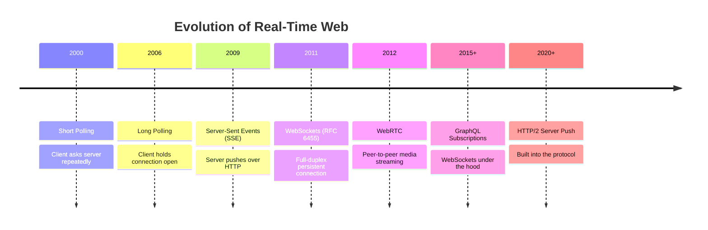

Each step was invented because the previous one had a specific weakness. Let's go through each one deeply.

---

## Short Polling

### The Analogy

You're waiting for a parcel. Every 5 minutes you go to the door and check if it arrived. Most times you open the door for nothing. Eventually, on one of those trips, the parcel is actually there.

That's short polling. Simple, dumb, but works.

### What It Is

The client makes a new HTTP request every N seconds to ask the server: "Any new data?"

```
Short Polling Timeline:
────────────────────────
t=0s:   Client → GET /messages  → Server: "No new messages"
t=5s:   Client → GET /messages  → Server: "No new messages"
t=10s:  Client → GET /messages  → Server: "No new messages"
t=13s:  [New message arrives on server — client doesn't know yet]
t=15s:  Client → GET /messages  → Server: "1 new message!" ← 2s delay
t=20s:  Client → GET /messages  → Server: "No new messages"
```

**Average latency = half the poll interval.** If you poll every 10 seconds, on average you get messages 5 seconds late.

### How It Works

```javascript
// Client-side short polling
function startPolling() {
  setInterval(async () => {
    const response = await fetch('/api/messages?since=' + lastMessageId);
    const data = await response.json();

    if (data.messages.length > 0) {
      displayMessages(data.messages);
      lastMessageId = data.messages[data.messages.length - 1].id;
    }
  }, 5000); // poll every 5 seconds
}
```

```python
# Server-side (simple)
@app.route('/api/messages')
def get_messages():
    since_id = request.args.get('since', 0)
    messages = db.query("SELECT * FROM messages WHERE id > ?", since_id)
    return jsonify({'messages': messages})
```

### Real Example

Instagram's notification bell, before 2015, used short polling. Your browser would ping their servers every few seconds to check for new likes/follows. You've probably noticed notifications appearing with a delay — that was short polling in action.

### Trade-offs

| Aspect | Detail |
|--------|--------|
| Pros | Dead simple to implement, stateless server, works everywhere |
| Cons | 99% of requests are wasted, delay = poll interval/2, high server load |
| Server Load | 1M users polling every 5s = 200K requests/second on server |
| When to use | Internal dashboards, simple admin panels, infrequent updates |

### Interview Tip

> "Short polling is the baseline that everyone understands. In an interview, mention it first, explain its problems, then evolve to better solutions. Interviewers love seeing this thought process."

---

## Long Polling

### The Analogy

Now imagine instead of going to the door every 5 minutes, you stand at the door and wait. You don't leave until the parcel arrives. The moment it comes, you take it and go back inside. Then you come back to the door and wait again for the next parcel.

That's long polling. The client goes to the server, and the server keeps the client waiting until something happens.

### What It Is

The client makes an HTTP request. The server **holds the request open** (doesn't respond immediately). When data arrives, the server responds. The client immediately makes another request.

```
Long Polling Timeline:
───────────────────────
t=0s:   Client → GET /messages  [server holds connection]
        Server: "I have nothing yet... waiting..."
t=7s:   [New message arrives on server]
        Server → Client: "Here's your message!" [connection closes]
t=7s:   Client → GET /messages  [immediately opens new connection]
        Server: "I have nothing yet... waiting..."
t=25s:  [timeout, server sends empty response]
        Server → Client: "Nothing yet, try again"
t=25s:  Client → GET /messages  [new connection]
```

**Key insight:** The message is delivered within milliseconds of arrival. Zero polling delay!

### How It Works

```javascript
// Client-side long polling
async function longPoll() {
  try {
    const response = await fetch('/api/messages/poll', {
      timeout: 30000  // 30 second timeout
    });
    const data = await response.json();

    if (data.messages.length > 0) {
      displayMessages(data.messages);
    }

    // Immediately open a new long poll
    longPoll();
  } catch (error) {
    // Network error or timeout — wait a bit, then retry
    setTimeout(longPoll, 1000);
  }
}

longPoll(); // start
```

```python
# Server-side long polling
import asyncio

@app.route('/api/messages/poll')
async def poll_messages():
    user_id = get_current_user()
    start_time = time.time()
    timeout = 30  # 30 seconds

    while time.time() - start_time < timeout:
        messages = db.get_new_messages(user_id, since=request.args.get('since'))
        if messages:
            return jsonify({'messages': messages})
        await asyncio.sleep(0.5)  # check every 500ms

    return jsonify({'messages': []})  # timeout, return empty
```

### Real Example

Facebook's original chat (early 2000s) used long polling. So did Twitter's streaming API at one point. HipChat (before Slack dominated) used long polling as its primary mechanism.

### The Thundering Herd Problem

```
Thundering Herd:
─────────────────
All 100K long-poll connections timeout at t=30s
t=30s: 100K clients all disconnect
t=30s: 100K clients all immediately reconnect
Server: overwhelmed with 100K simultaneous connection setups!

Solution: Randomize timeout (28s to 32s) to spread reconnects
```

### Trade-offs

| Aspect | Detail |
|--------|--------|
| Pros | Near-zero latency, works with plain HTTP, no special infra |
| Cons | Each message = a new HTTP request (overhead), thundering herd, server holds many open connections |
| Memory | Each held connection uses memory on the server |
| When to use | Real-time notifications when WebSocket infrastructure isn't available |

### Interview Tip

> "Long polling is the 'good enough' solution. It works. But mention that every message delivery requires a full HTTP round-trip — headers, TLS handshake if expired, etc. That overhead adds up."

---

## Server-Sent Events (SSE)

### The Analogy

You subscribe to a newspaper. Every morning, the newspaper delivery person pushes the newspaper into your letterbox. You don't have to do anything — just wait. If delivery stops (strike, whatever), your subscription renews automatically after a few days.

That's SSE. One persistent connection, server pushes data when it has something, auto-reconnect built in.

### What It Is

SSE is a **one-directional, persistent HTTP connection** where the server can push multiple events to the client over time. The client opens one connection and keeps it open. The server writes events to it whenever it has data.

It's part of the HTML Living Standard. Built right into browsers. No libraries needed.

```
SSE Wire Protocol:
──────────────────
Client → GET /api/events
         Accept: text/event-stream

Server → HTTP 200 OK
         Content-Type: text/event-stream
         Cache-Control: no-cache

         data: {"type": "message", "text": "Hello!"}\n\n

         data: {"type": "notification", "count": 5}\n\n

         event: price-update
         id: 1234
         data: {"symbol": "RELIANCE", "price": 2456.70}\n\n

         : heartbeat\n\n

         data: {"type": "message", "text": "Another message"}\n\n

         [connection stays open...]
```

**The `\n\n` is crucial** — that's what separates events. A single `\n` is a field separator within an event.

### SSE Wire Format — Every Field Explained

```
Fields in an SSE event:
────────────────────────
data: the actual message payload (required)
      multi-line: use multiple "data:" lines, browser joins with \n

event: custom event name
       client uses addEventListener('eventname', handler)
       default is "message" if not specified

id: event identifier
    browser sends this as "Last-Event-ID" on reconnect
    critical for resuming streams without missing messages

retry: reconnection delay in milliseconds
       browser uses this if connection drops
       default is 3000ms (3 seconds)

: comment line (starts with colon)
  ignored by browser, used as keepalive heartbeat
  middleboxes and proxies drop idle connections — comments prevent this
```

### SSE Auto-Reconnect — The Killer Feature

This is what makes SSE special. The browser handles reconnection for you:

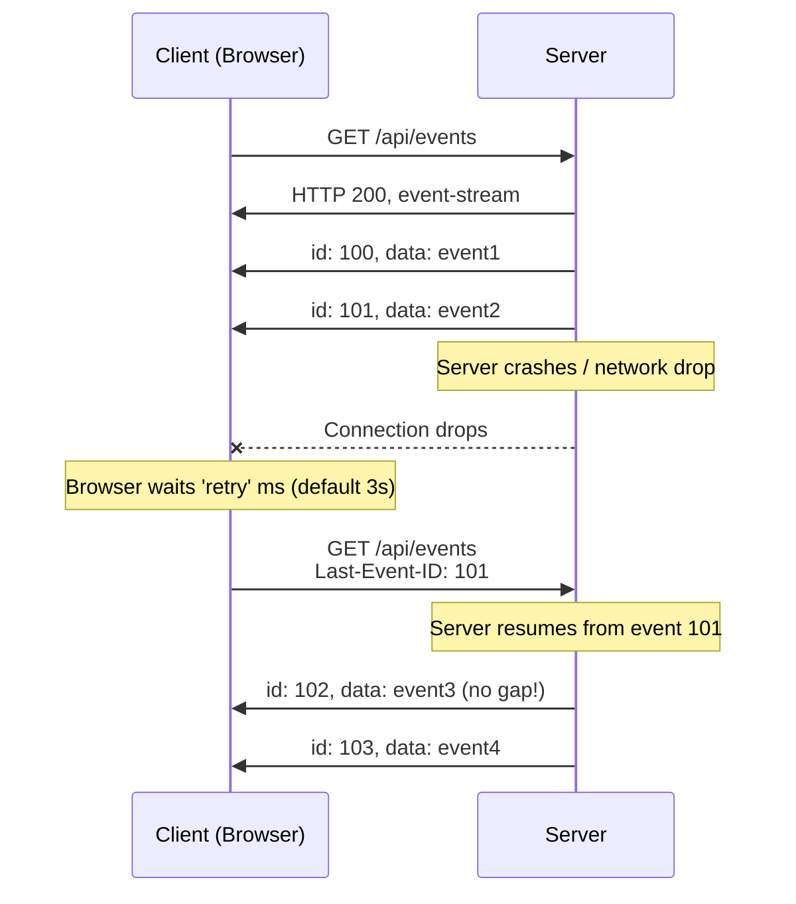

The server receives `Last-Event-ID: 101` and knows to replay everything after event 101. The client never misses a message even through network glitches. This is why SSE beats WebSocket for one-directional use cases — you'd have to build this yourself with WebSockets.

### How It Works — Full Example

```javascript
// Client — that's it. Browser handles everything else.
const evtSource = new EventSource('/api/events');

// Default "message" events
evtSource.onmessage = (event) => {
  const data = JSON.parse(event.data);
  updateDashboard(data);
};

// Custom event types
evtSource.addEventListener('price-update', (event) => {
  const price = JSON.parse(event.data);
  updateStockTicker(price);
});

evtSource.addEventListener('notification', (event) => {
  showToast(JSON.parse(event.data));
});

// Error handling (browser auto-reconnects, this is just for logging)
evtSource.onerror = (event) => {
  if (event.readyState === EventSource.CLOSED) {
    console.log('Connection closed, browser will reconnect...');
  }
};

// To close manually:
// evtSource.close();
```

```python
# Server — Python/Flask example
from flask import Response, stream_with_context, request
import json, time

message_store = {}  # In reality, use Redis or DB

@app.route('/api/events')
def sse_events():
    user_id = get_current_user()
    last_event_id = request.headers.get('Last-Event-ID', '0')

    def generate():
        # First, replay missed events
        missed = get_events_since(user_id, last_event_id)
        for event in missed:
            yield f"id: {event['id']}\n"
            yield f"data: {json.dumps(event['data'])}\n\n"

        # Then stream new events
        while True:
            events = get_new_events(user_id)
            for event in events:
                yield f"id: {event['id']}\n"
                yield f"event: {event['type']}\n"
                yield f"data: {json.dumps(event['data'])}\n\n"

            # Heartbeat every 15 seconds to keep connection alive
            yield ": heartbeat\n\n"
            time.sleep(15)

    return Response(
        stream_with_context(generate()),
        content_type='text/event-stream',
        headers={
            'Cache-Control': 'no-cache',
            'X-Accel-Buffering': 'no'  # Disable nginx buffering!
        }
    )
```

> **Important gotcha:** Nginx and other reverse proxies buffer responses by default. This will break SSE. You MUST set `X-Accel-Buffering: no` header (Nginx) or equivalent.

### Real-World SSE Use Cases

- **Zomato/Swiggy order tracking** — "Your order is confirmed → Rider picked up → 2km away" — perfect SSE, server pushes status changes
- **NSE/BSE stock tickers** — prices push from server to browser every few milliseconds
- **GitHub Actions / CI/CD logs** — you see logs streaming as your build runs
- **Sports scores** — cricket scorecard updating ball-by-ball
- **Twitter/X search** — new tweets appearing in real-time on search results

### SSE Limitations

```
SSE Limitations:
─────────────────
❌ One-directional ONLY — client cannot send data over SSE
   (use regular HTTP POST for that)
❌ HTTP/1.1 browsers limit 6 concurrent SSE connections per domain
   HTTP/2 removes this limit (multiplexing)
❌ Not supported in all older browsers (IE 11, early Edge)
❌ Binary data not natively supported (must base64 encode)
```

### Trade-offs

| Aspect | Detail |
|--------|--------|
| Pros | Built-in auto-reconnect, simple HTTP, works through proxies, event IDs |
| Cons | One-directional only, HTTP/1.1 connection limit |
| Use when | Server needs to push to client, client doesn't need to send back |
| Don't use when | You need bidirectional communication |

### Interview Tip

> "SSE is the most underrated real-time technology. Many engineers jump straight to WebSockets without considering SSE. If communication is only server-to-client, SSE is simpler, auto-reconnects, and works better through corporate proxies. Always ask: does the client need to send data? If no, SSE wins."

---

## WebSockets

### The Analogy

Imagine a phone call (not texting, an actual call). Once you pick up:
- **Both sides can talk at any time** — you don't have to wait for the other to finish
- The **line stays open** for the entire conversation
- When someone speaks, the other hears it instantly (no "is anyone there?" needed)
- You hang up only when one of you decides the conversation is done

That's a WebSocket. A persistent, two-way communication channel.

### The Problem WebSockets Solve

HTTP is like sending letters:
- You send a letter (request)
- Wait for a reply (response)
- The postman doesn't spontaneously send you things

WebSockets are like a phone call — once established, both sides communicate freely without the letter-writing overhead each time.

### The WebSocket Handshake

WebSockets start as an HTTP request and then "upgrade" to the WebSocket protocol. This is clever because it works through existing HTTP infrastructure (firewalls, proxies).

```
Step 1: Client sends HTTP Upgrade request
──────────────────────────────────────────
GET /chat HTTP/1.1
Host: chat.whatsapp.com
Upgrade: websocket          ← "I want to upgrade"
Connection: Upgrade
Sec-WebSocket-Key: dGhlIHNhbXBsZSBub25jZQ==   ← random nonce
Sec-WebSocket-Version: 13
Origin: https://web.whatsapp.com

Step 2: Server accepts upgrade
───────────────────────────────
HTTP/1.1 101 Switching Protocols
Upgrade: websocket
Connection: Upgrade
Sec-WebSocket-Accept: s3pPLMBiTxaQ9kYGzzhZRbK+xOo=
                      ↑ SHA-1(key + magic string) — proves server read the key

After this: NO MORE HTTP.
The TCP connection is now a raw WebSocket channel.
Both sides can send frames at any time.
```

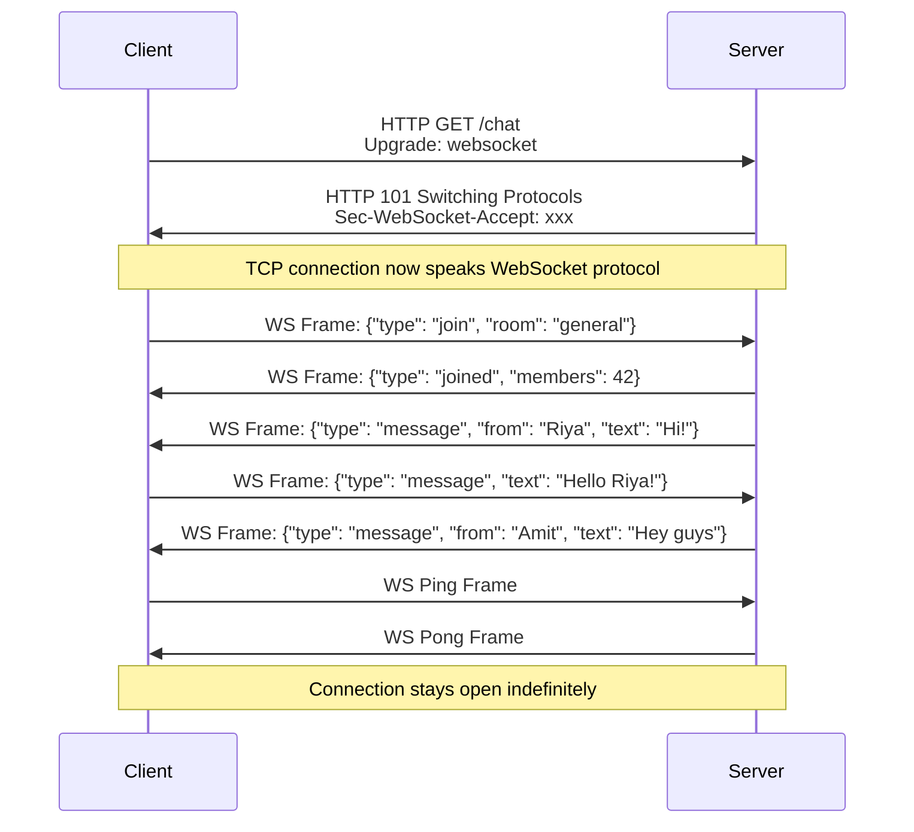

### WebSocket Frame Structure

Every WebSocket message is a "frame". The protocol is much more efficient than HTTP headers:

```
WebSocket Frame (simplified):
───────────────────────────────
Bit:    0       4    5 6 7    8        9       14/22/86      ...
Field: [FIN|RSV|Opcode|MASK|Payload Len|Extended Len|Masking Key|Payload]

FIN: 1 = this is the last (or only) fragment
Opcode: What type of frame?
  0x0 = Continuation frame
  0x1 = Text frame (UTF-8)
  0x2 = Binary frame
  0x8 = Close frame
  0x9 = Ping frame (keepalive)
  0xA = Pong frame (keepalive response)
MASK: Client→Server frames MUST be masked (XOR with 4-byte key)
      Server→Client frames are NOT masked
Payload Length: 7-bit, 16-bit, or 64-bit depending on size
```

Compare this to HTTP headers which can be 500-2000 bytes. A WebSocket text frame adds only 2-14 bytes of overhead. For a chat app sending thousands of messages per second, this is significant.

### Heartbeats — Detecting Dead Connections

Real-time connections die silently. A user's phone goes into airplane mode. Their router reboots. A NAT entry expires. The server has no idea the connection is dead.

Without heartbeats, you'd have "zombie connections" — the server thinks the user is connected, but they're not.

```
Heartbeat mechanism:
─────────────────────
Server sends Ping frame every 30 seconds:
  → PING [optional data]

Client MUST respond with Pong:
  → PONG [same data echoed back]

If no Pong received within 10 seconds:
  → Server closes connection and cleans up resources
  → Client-side reconnection kicks in

Why this matters:
  Without heartbeats:
    User goes offline → server keeps "sending" to dead connection
    Redis pub/sub keeps routing messages to disconnected client
    Memory leak: connections accumulate
    Messages lost silently
```

```javascript
// Server-side heartbeat (Node.js example)
const WebSocket = require('ws');
const wss = new WebSocket.Server({ port: 8080 });

const HEARTBEAT_INTERVAL = 30000; // 30 seconds
const PONG_TIMEOUT = 10000;       // 10 seconds to respond

wss.on('connection', (ws) => {
  ws.isAlive = true;

  ws.on('pong', () => {
    ws.isAlive = true; // got pong, mark as alive
  });
});

// Check every 30 seconds
setInterval(() => {
  wss.clients.forEach((ws) => {
    if (!ws.isAlive) {
      console.log('Dead connection detected, terminating');
      return ws.terminate();
    }

    ws.isAlive = false;
    ws.ping(); // send ping
  });
}, HEARTBEAT_INTERVAL);
```

### Full WebSocket Implementation

```javascript
// Client (browser)
class ChatClient {
  constructor(url) {
    this.url = url;
    this.reconnectDelay = 1000; // start with 1s
    this.connect();
  }

  connect() {
    this.ws = new WebSocket(this.url);

    this.ws.onopen = () => {
      console.log('Connected');
      this.reconnectDelay = 1000; // reset on success

      // Authenticate right after connection
      this.send({ type: 'auth', token: getAuthToken() });
    };

    this.ws.onmessage = (event) => {
      const message = JSON.parse(event.data);
      this.handleMessage(message);
    };

    this.ws.onclose = (event) => {
      console.log(`Closed: ${event.code} ${event.reason}`);

      // Exponential backoff reconnection
      setTimeout(() => this.connect(), this.reconnectDelay);
      this.reconnectDelay = Math.min(this.reconnectDelay * 2, 30000);
    };

    this.ws.onerror = (error) => {
      console.error('WebSocket error:', error);
      // onclose will fire after onerror, so reconnect logic is there
    };
  }

  send(data) {
    if (this.ws.readyState === WebSocket.OPEN) {
      this.ws.send(JSON.stringify(data));
    }
  }

  handleMessage(message) {
    switch (message.type) {
      case 'chat': displayMessage(message); break;
      case 'user_joined': showNotification(message); break;
      case 'typing': showTypingIndicator(message); break;
    }
  }
}

const client = new ChatClient('wss://chat.example.com/ws');
```

```python
# Server (Python asyncio + websockets)
import asyncio
import websockets
import json
from typing import Set, Dict

# Track connections: user_id → websocket
connections: Dict[str, websockets.WebSocketServerProtocol] = {}

async def handle_client(websocket, path):
    user_id = None
    try:
        # First message must be auth
        auth_msg = json.loads(await websocket.recv())
        user_id = validate_token(auth_msg['token'])

        if not user_id:
            await websocket.close(1008, "Unauthorized")
            return

        connections[user_id] = websocket
        print(f"User {user_id} connected. Total: {len(connections)}")

        async for raw_message in websocket:
            message = json.loads(raw_message)
            await handle_message(user_id, message)

    except websockets.exceptions.ConnectionClosed:
        print(f"Connection closed for {user_id}")
    finally:
        if user_id and user_id in connections:
            del connections[user_id]

async def handle_message(sender_id, message):
    if message['type'] == 'chat':
        recipient_id = message['to']
        payload = json.dumps({
            'type': 'chat',
            'from': sender_id,
            'text': message['text'],
            'timestamp': get_timestamp()
        })

        if recipient_id in connections:
            await connections[recipient_id].send(payload)
        else:
            # Store for offline delivery
            store_offline_message(recipient_id, payload)

async def main():
    async with websockets.serve(handle_client, "0.0.0.0", 8765):
        await asyncio.Future()  # run forever

asyncio.run(main())
```

### ws:// vs wss://

```
ws://  — WebSocket without encryption (like HTTP)
wss:// — WebSocket over TLS (like HTTPS)

Always use wss:// in production.
ws:// sends data in plaintext — anyone on the network can read it.
Also: many corporate firewalls block ws://, but allow wss:// (port 443).
```

### Trade-offs

| Aspect | Detail |
|--------|--------|
| Pros | Full-duplex, low overhead per message, persistent connection |
| Cons | Stateful (hard to scale), manual reconnect, more complex infra |
| Memory | ~50KB per connection on server |
| Use when | Bidirectional real-time needed: chat, gaming, collaborative tools |

---

## Scaling WebSockets

### The Core Problem

Yeh problem samajhna bahut important hai. WebSockets are **stateful**. Each server holds open connections. When you scale to multiple servers, you have a routing problem.

```
The Multi-Server Problem:
──────────────────────────
User A connects → Load Balancer → Server 1
User B connects → Load Balancer → Server 2

Now User A sends a message to User B:
  Server 1 knows: User A is connected here
  Server 1 thinks: where is User B?
  Server 1: I don't have User B's connection!
  Server 2 has User B's connection but Server 1 has no idea!

❌ The message cannot be delivered!
```

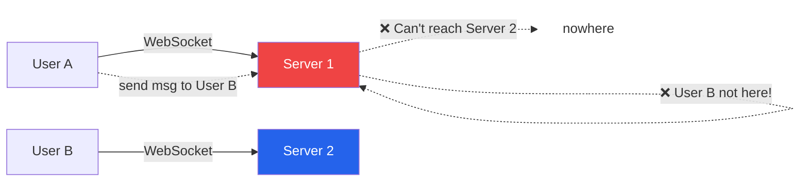

### Solution 1: Sticky Sessions

The load balancer always routes the same user to the same server. Problem solved! Sort of.

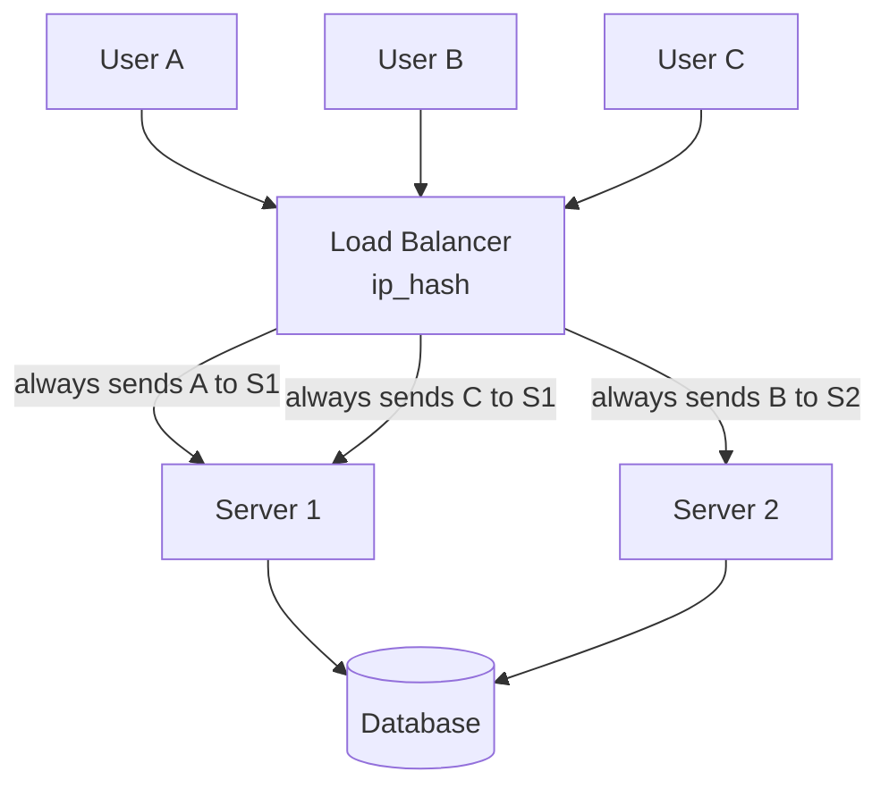

```nginx
# Nginx config for sticky sessions (ip_hash)
upstream websocket_servers {
    ip_hash;    # route same IP to same server
    server 10.0.0.1:8080;
    server 10.0.0.2:8080;
    server 10.0.0.3:8080;
}

server {
    location /ws {
        proxy_pass http://websocket_servers;
        proxy_http_version 1.1;
        proxy_set_header Upgrade $http_upgrade;
        proxy_set_header Connection "upgrade";
    }
}
```

**The problem with sticky sessions:**

```
Problems with sticky sessions:
────────────────────────────────
❌ Uneven load: if User A is very active and User B is idle,
   Server 1 gets overloaded while Server 2 sits idle.

❌ Server crash: Server 1 crashes, User A's connection is gone.
   User A reconnects — load balancer sends to different server.
   All state is lost. User A must re-authenticate.

❌ Scaling: adding a new server? ip_hash values change.
   All existing connections might be re-routed. Thundering herd.

❌ Mobile IPs: mobile users change IP as they move (cell towers).
   ip_hash breaks — user keeps getting new server assignments.

Verdict: Works for small scale, not for production at Slack/WhatsApp scale.
```

### Solution 2: Redis Pub/Sub (The Standard Solution)

This is how almost every major real-time system works. Redis acts as a message bus between servers.

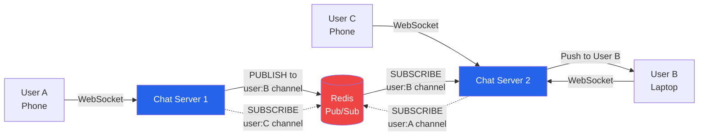

**The flow, step by step:**

```
1. User A (connected to Server 1) sends message to User B:
   → Server 1 stores message in database (durability first!)
   → Server 1: PUBLISH user:B '{"from": "A", "text": "Hello!"}'

2. Redis broadcasts to all subscribers of "user:B" channel

3. Server 2 subscribed to "user:B" (because User B is connected there):
   → Server 2 receives the message from Redis
   → Server 2 finds User B's WebSocket connection
   → Server 2 sends message to User B

4. User B receives "Hello!" from User A instantly
```

```python
# Server using Redis Pub/Sub
import redis
import json
import asyncio
import websockets

redis_client = redis.Redis(host='localhost', port=6379)
redis_pubsub = redis_client.pubsub()

connections = {}  # user_id → websocket

async def handle_connection(websocket, path):
    user_id = authenticate(websocket)
    connections[user_id] = websocket

    # Subscribe to this user's Redis channel
    redis_pubsub.subscribe(f"user:{user_id}")

    try:
        async for raw_msg in websocket:
            msg = json.loads(raw_msg)
            recipient = msg['to']
            payload = {'from': user_id, 'text': msg['text']}

            # Save to DB first (durability)
            save_to_db(payload)

            # Publish to Redis — correct server will deliver
            redis_client.publish(f"user:{recipient}", json.dumps(payload))

    finally:
        redis_pubsub.unsubscribe(f"user:{user_id}")
        del connections[user_id]

async def redis_listener():
    """Listen to Redis and push to local WebSocket connections"""
    while True:
        message = redis_pubsub.get_message()
        if message and message['type'] == 'message':
            user_id = message['channel'].decode().split(':')[1]
            data = message['data'].decode()

            if user_id in connections:
                ws = connections[user_id]
                await ws.send(data)

        await asyncio.sleep(0.001)  # non-blocking
```

**Redis Pub/Sub vs Redis Streams:**

```
Redis Pub/Sub:
  ✅ Simple, fire-and-forget
  ❌ No message persistence (subscriber must be online)
  ❌ No message replay on reconnect

Redis Streams (newer):
  ✅ Messages persisted
  ✅ Consumer groups (competing consumers)
  ✅ Message replay (XREAD with last ID)
  → Better for durability requirements
```

### Solution 3: Kafka as Message Broker (Large Scale)

For Slack/Discord scale, Redis pub/sub can become a bottleneck. Kafka provides higher throughput:

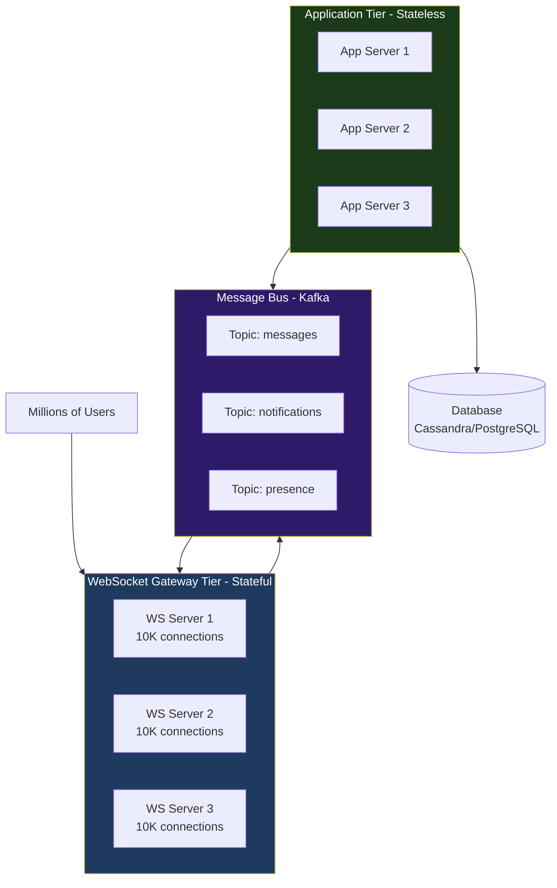

```
Architecture split:
────────────────────
WS Gateway Tier: STATEFUL
  - Holds WebSocket connections
  - Routes messages: WebSocket ↔ Kafka
  - Knows: which user is on which server
  - Scales by: connection count

Application Tier: STATELESS
  - Business logic (who can see what, message validation, etc.)
  - Reads from Kafka, writes to Kafka
  - Writes to database
  - Scales by: compute load

This separation lets each tier scale independently.
```

### Capacity Planning

```
How many WebSocket connections can a server handle?

Memory per connection: ~50 KB (socket buffer + app state)
1 server with 8 GB RAM: ~160K connections

But reality check:
  Linux default file descriptor limit: 1024 per process
  After tuning (ulimit -n): 1 million

  With 1M connections × 50KB = 50 GB RAM needed
  So memory, not fd count, is usually the bottleneck

Real numbers:
  - Slack: ~50K connections per WebSocket server
  - Discord: ~100K connections per server
  - Each server team has different tuning

For 1 million concurrent users:
  10 servers × 100K connections = 1M users
  Each server: 16 GB RAM, 8 cores
  Redis cluster: 3-6 nodes
  Message throughput: 1M users × 10 msg/day / 86400 = 115 msg/sec (manageable)
  But peak: 1M users × 5 msg/minute = 83K msg/sec (need Kafka)
```

---

## Chat System Architecture (WhatsApp-like)

### Full Architecture Diagram

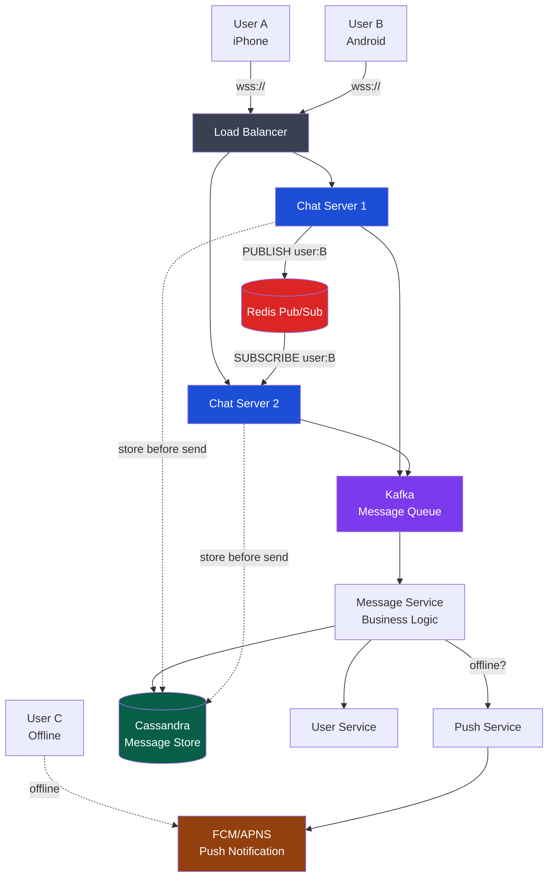

### Message Flow — One Message, Step by Step

```
User A sends "Hello!" to User B:

Step 1: Durability first (Write to DB before delivery)
─────────────────────────────────────────────────────
  User A → Chat Server 1 (via WebSocket)
  Chat Server 1 → Cassandra: INSERT message (id, from=A, to=B, text, timestamp)
  Cassandra confirms write
  → Only now do we try to deliver

Step 2: Delivery to online user
───────────────────────────────
  Chat Server 1: Is User B online? Check Redis (user:B:server → server2)
  Chat Server 1: PUBLISH user:B '{"from":"A","text":"Hello!","id":"msg123"}'
  Redis: broadcasts to all subscribers of "user:B"
  Chat Server 2: receives from Redis, finds User B's websocket
  Chat Server 2 → User B: push the message
  User B receives "Hello!"

Step 3: Delivery receipt
─────────────────────────
  User B's client sends ACK: {"type": "received", "msg_id": "msg123"}
  Server updates DB: messages.status = 'delivered'
  Server notifies User A: single grey tick → double grey tick

Step 4: Read receipt
─────────────────────
  User B opens chat
  Client sends: {"type": "read", "msg_id": "msg123"}
  Server updates DB: messages.status = 'read'
  Server notifies User A: double grey → double blue tick
```

### Handling Offline Users

```
User C is offline (airplane mode, dead battery):

Step 1: Delivery attempt fails
────────────────────────────────
  Chat Server: PUBLISH user:C '...'
  Redis: no subscribers for user:C (not connected)
  Nobody receives the message

Step 2: Detect offline
────────────────────────
  Check presence service: user:C last seen 2 hours ago = offline
  OR: Redis subscription failed = offline

Step 3: Store and notify
──────────────────────────
  Message is already in DB (from Step 1 of sending)
  Push Service → FCM (Android) or APNS (iOS):
    "New message from User A"
  Phone shows notification even with app closed

Step 4: User comes online
──────────────────────────
  User C opens WhatsApp
  Client connects WebSocket, sends: {"type": "sync", "since": "last_msg_id"}
  Server queries DB: all messages for User C since last_msg_id
  Server sends all missed messages in bulk
  Client marks them as delivered
```

### Message Ordering

```
The ordering problem:
──────────────────────
User A sends: "Hello!" at t=0
User A sends: "How are you?" at t=1

Due to network conditions:
  "How are you?" arrives at server at t=1.001
  "Hello!" arrives at server at t=1.005 (delayed)

Without ordering guarantees:
  User B sees: "How are you?" then "Hello!" ← WRONG ORDER

Solutions:
───────────
1. Sequence numbers per conversation:
   Each conversation has a monotonic counter.
   "Hello!" gets seq=1, "How are you?" gets seq=2.
   Client orders by sequence number, not arrival time.

2. Timestamps + client clock sync:
   Client timestamp + server timestamp combined.
   Problem: client clocks drift. Use server timestamp as final arbiter.

3. Lamport clocks / Vector clocks:
   For distributed systems where multiple servers can accept writes.
   Each event gets a logical timestamp.
   Used in systems like Cassandra, Riak.

WhatsApp approach: sequence numbers per conversation,
                   assigned by the chat server (single point of assignment).
```

### Message Storage — Why Cassandra?

```
Message storage requirements:
───────────────────────────────
Write pattern: heavy writes (every message = a write)
Read pattern: recent messages (show last 50 msgs), occasional history
Data size: billions of messages
Retention: 1-5 years typically
Query pattern: "give me messages for conversation X, sorted by time"

Why Cassandra works well:
  ✅ Write-optimized (LSM tree, O(1) writes)
  ✅ Time-series data fits naturally (partition by conversation_id, cluster by timestamp)
  ✅ Horizontal scaling out of the box
  ✅ High availability (no single point of failure)

Schema example:
  CREATE TABLE messages (
    conversation_id  UUID,
    sequence_num     BIGINT,
    sender_id        UUID,
    content          TEXT,
    timestamp        TIMESTAMP,
    status           TEXT,
    PRIMARY KEY (conversation_id, sequence_num)
  ) WITH CLUSTERING ORDER BY (sequence_num DESC);

Partition key = conversation_id → all messages in one conversation on same node
Clustering key = sequence_num → ordered within partition
```

---

## Collaborative Editing (Google Docs-like)

### The Analogy

You and your friend are editing the same Word document. You're on page 1, they're on page 3. You type "Hello" at position 5. They simultaneously type "World" at position 5.

Without coordination: the document is corrupt — one person's changes overwrite the other's.

With smart algorithms: both changes merge correctly — "HelloWorld" or "WorldHello" depending on who went first.

### The Conflict Problem

```
Conflict scenario:
───────────────────
Original document: "Hello World"
                    0123456789...

User A (Delhi):     inserts "Beautiful " at position 6
                    → "Hello Beautiful World"

User B (Mumbai):    inserts "Wonderful " at position 6
                    → "Hello Wonderful World"

Both operations happen simultaneously.
What should the final result be?
  → "Hello Beautiful Wonderful World" ?
  → "Hello Wonderful Beautiful World" ?
  → Depends on who "won" — but how do we decide?
```

### Operational Transformation (OT)

OT transforms operations based on concurrent operations that have already been applied.

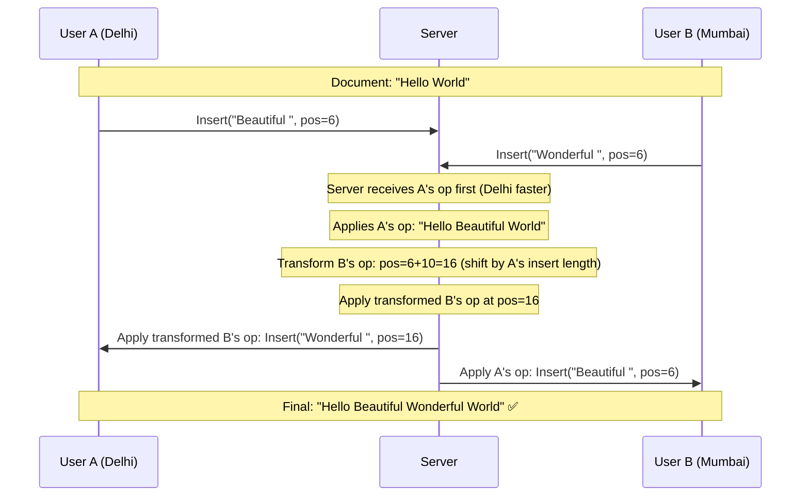

```
OT transformation rule:
────────────────────────
If Op_A = Insert(text, pos) and Op_B = Insert(text, pos):

  If A applied first, B must be transformed:
    If B.pos >= A.pos:
      B'.pos = B.pos + len(A.text)   ← shift right by A's insertion

  Then apply A, then B' → consistent result
```

OT is hard to implement correctly. Google Docs, Microsoft Office 365, and Notion use OT.

### CRDT (Conflict-free Replicated Data Types)

CRDTs take a different approach: design the data structure so conflicts are **mathematically impossible**.

```
CRDT approach:
───────────────
Instead of character positions (which shift), use unique IDs for each character.

"Hello" as CRDT:
  H → id: [A, 1]
  e → id: [A, 2]
  l → id: [A, 3]
  l → id: [A, 4]
  o → id: [A, 5]

User A inserts "X" between H and e:
  X → id: [A, 1.5]  (fractional position between 1 and 2)

User B inserts "Y" between H and e:
  Y → id: [B, 1.5]  (same position, different author = different ID)

Merge: sort by ID → H, [A,1.5]X, [B,1.5]Y, e, l, l, o
       or:          → H, [B,1.5]Y, [A,1.5]X, e, l, l, o
       → deterministic, consistent, no server needed

CRDT guarantee: any two nodes that apply the same set of operations
                reach the same state, regardless of order.
```

| Approach | OT | CRDT |
|----------|-----|-------|
| Complexity | High (hard to get right) | Moderate (well-studied structures) |
| Server needed | Yes (central ordering) | No (peer-to-peer possible) |
| Used by | Google Docs, Office 365 | Figma, Apple Notes, Automerge |
| Performance | Better for large docs | More memory overhead |
| Offline support | Complex | Excellent |

---

## Live Scores and Stock Tickers

### Why SSE is Perfect Here

Cricket score on Cricinfo, stock price on Zerodha, live election results — these are all **one-directional**. The server has data, it pushes to the browser. The browser just displays.

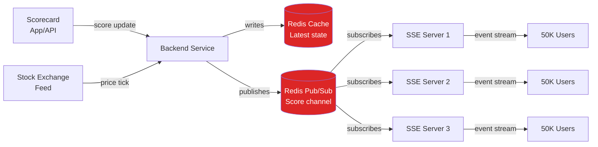

```python
# SSE for live cricket scores
@app.route('/scores/live/<match_id>')
def live_score_stream(match_id):
    def generate():
        last_event_id = request.headers.get('Last-Event-ID', '0')

        # Subscribe to this match's Redis channel
        pubsub = redis_client.pubsub()
        pubsub.subscribe(f"match:{match_id}")

        event_id = int(last_event_id)

        while True:
            message = pubsub.get_message()
            if message and message['type'] == 'message':
                event_id += 1
                score_data = message['data'].decode()
                yield f"id: {event_id}\n"
                yield f"event: score-update\n"
                yield f"data: {score_data}\n\n"
            else:
                yield ": heartbeat\n\n"

            time.sleep(0.1)

    return Response(
        stream_with_context(generate()),
        content_type='text/event-stream'
    )
```

```javascript
// Client — just 5 lines to show live cricket scores
const scoreStream = new EventSource(`/scores/live/${matchId}`);

scoreStream.addEventListener('score-update', (event) => {
  const score = JSON.parse(event.data);
  document.getElementById('score').textContent =
    `${score.team1}: ${score.runs}/${score.wickets} (${score.overs} overs)`;
});
```

**Fan-out at scale:**

```
Problem: 1 million users watching same IPL match
  Match update triggers 1M WebSocket pushes = thundering herd

Smart fan-out:
  Source → 1 Redis channel → SSE servers (fan-out to servers only)
  Each SSE server → fans out to its local connections

  1 Redis message → 10 SSE servers → each pushes to 100K users
  10 × 100K = 1M users. Redis overhead: just 10 messages per score update!

This is called "fan-out on write" at the server level.
```

---

## Gaming and UDP

### The Analogy

Imagine you're playing kabaddi. If the referee misses one raid call, the game doesn't stop to replay it — everyone just continues. A few missed moments are acceptable because the game must keep flowing.

That's UDP for gaming. Speed matters more than perfect delivery.

### Why TCP (and thus WebSockets) Fails for Games

```
TCP's head-of-line blocking:
─────────────────────────────
Packet 1: Player position at t=100ms
Packet 2: Player position at t=110ms
Packet 3: Player position at t=120ms

Packet 2 gets lost.

TCP behavior:
  → Waits for Packet 2 to be retransmitted
  → Packet 3 arrives but is HELD until Packet 2 is re-delivered
  → Player position at t=120ms is delayed by 50-100ms while TCP retransmits

Result: input lag, rubber-banding in games

UDP behavior:
  → Packet 2 lost? Forget it.
  → Deliver Packet 3 immediately
  → We already have a newer position anyway, Packet 2 is useless
```

### Why UDP is Preferred for Games

```
Game data characteristics:
───────────────────────────
✅ Time-sensitive: old position is useless, latest is all that matters
✅ Redundant: if one packet lost, next packet has updated state anyway
✅ Latency-critical: 100ms delay = unplayable in FPS/sports games
✅ High frequency: 60 packets/second per player

UDP wins because:
  ✅ No connection setup overhead
  ✅ No retransmission delays
  ✅ No head-of-line blocking
  ✅ Application controls what to retransmit (if needed)

What games implement themselves:
  - Their own reliability (for important events like kills, health)
  - Sequence numbers (to ignore out-of-order packets)
  - Delta compression (send only what changed)
  - Interpolation (smooth movement between packets)
```

### Browser Games and WebSockets

```
Problem: UDP is not available in browsers.
         Browsers only support TCP-based protocols.

Solutions:
───────────
1. WebSockets (TCP) with application-level tricks:
   - Send position 60x/second (high frequency reduces impact of any single loss)
   - Client-side interpolation (smooth rendering between server updates)
   - Lag compensation on server (rollback + replay)
   - Used by: most browser-based multiplayer games

2. WebRTC Data Channel:
   - Uses SCTP over UDP (can be unreliable/unordered)
   - Closest thing to UDP in a browser
   - Used by: high-performance browser games, some real-time collaboration

3. Native apps (PUBG Mobile, Free Fire, Call of Duty Mobile):
   - Full UDP, custom game protocols (Unreal Engine's netcode, Valve's DTLS)
   - Complete control over reliability, ordering, compression
```

```
PUBG Mobile network architecture:
───────────────────────────────────
Client (Android/iOS)
  ↕ UDP (Unreal Engine netcode)
Game Server (dedicated server per 100-player match)
  ↕ TCP (reliable)
Backend Services (matchmaking, statistics, anti-cheat)
```

---

## WebRTC (Peer-to-Peer)

### The Analogy

WhatsApp video call vs a TV broadcast. TV broadcast: everything goes through a central tower, then out to you. WhatsApp call: you connect directly with the person you're calling — no middleman for the actual video data.

WebRTC is the protocol that enables that direct connection between browsers.

### The Problem WebRTC Solves

```
Traditional video call through server:
───────────────────────────────────────
User A (Mumbai) → Server (Singapore) → User B (Delhi)
  Two hops, double the latency, server pays for ALL video bandwidth

WebRTC P2P:
────────────
User A (Mumbai) ←──────────────────→ User B (Delhi)
  Direct path, lowest possible latency, server only signals

Scale difference:
  10,000 concurrent video calls
  Server approach: server needs 10,000 × 2 × bitrate bandwidth
  WebRTC P2P: server needs near-zero media bandwidth (just signaling)
```

### How WebRTC Works (Simplified)

```mermaid
sequenceDiagram
    participant A as User A (Browser)
    participant Sig as Signaling Server (your WebSocket server)
    participant B as User B (Browser)

    Note over A,B: Phase 1: Signaling (via your server)

    A->>Sig: "I want to call User B"<br/>{type: "offer", sdp: "..."}
    Sig->>B: Forward offer to User B

    B->>Sig: {type: "answer", sdp: "..."}
    Sig->>A: Forward answer to User A

    A->>Sig: ICE candidate (network info)
    Sig->>B: Forward ICE candidates
    B->>Sig: ICE candidate
    Sig->>A: Forward ICE candidates

    Note over A,B: Phase 2: Direct P2P Connection
    Note over A,B: (or TURN relay if P2P blocked by NAT)

    A<->>B: Video/Audio/Data streams directly
    Note over Sig: Server no longer in media path
```

### Components

```
Signaling: Your server (WebSocket/HTTP)
  → Exchange SDP (Session Description Protocol):
    "I support H.264 video, Opus audio, my capabilities are..."
  → Exchange ICE candidates: "My public IP is X, port is Y"
  → This is the ONLY server involvement once call starts

STUN (Session Traversal Utilities for NAT):
  → "What is my public IP address and port?" (NAT discovery)
  → Public STUN servers: stun.l.google.com:19302
  → Free, stateless, very low bandwidth

TURN (Traversal Using Relays around NAT):
  → Relay server for when direct P2P is blocked
  → Corporate firewalls, symmetric NATs block direct UDP
  → ~20% of calls need TURN relay
  → Expensive! TURN servers handle all media for these calls

ICE (Interactive Connectivity Establishment):
  → Algorithm that tries all possible paths (direct UDP, TURN, TCP)
  → Picks the best working path
```

### Use Cases

| Use Case | Technology | Why |
|----------|-----------|-----|
| 1:1 video calls | WebRTC P2P | Lowest latency, no server bandwidth |
| Group video (2-10) | WebRTC with SFU | Selective forwarding unit routes streams |
| Large video conference (100+) | WebRTC with MCU | Mixing server combines streams |
| Screen sharing | WebRTC | Built-in screen capture API |
| Google Meet, Zoom, Jitsi | WebRTC | Standard in the industry |

---

## Technology Decision Guide

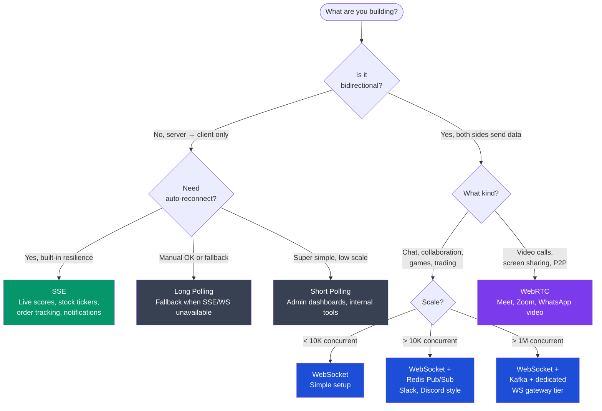

### Full Comparison Table

| Technology | Direction | Connection | Protocol | Auto-Reconnect | Overhead | Browser Support | Best For |
|-----------|-----------|-----------|---------|---------------|----------|----------------|---------|
| Short Polling | C → S | New per request | HTTP | N/A | Very High | All | Simple, low-traffic |
| Long Polling | S → C | Held | HTTP | Manual | High | All | Fallback |
| SSE | S → C | Persistent | HTTP | Built-in ✅ | Low | All modern | Feeds, notifications |
| WebSocket | Both | Persistent | WS/WSS | Manual | Very Low | All modern | Chat, games, collab |
| WebRTC | Both (P2P) | P2P | DTLS/SRTP | Complex | High setup | All modern | Video, audio, P2P |

### Real Companies and What They Use

| Company | Product | Technology | Why |
|---------|---------|-----------|-----|
| Slack | Messaging | WebSocket + Socket.IO | Full-duplex, Socket.IO for fallback |
| Discord | Gaming chat | WebSocket + Elixir/Phoenix | Elixir handles 5M+ concurrent connections |
| WhatsApp | Messaging | XMPP (WebSocket underneath) | Industry-standard messaging protocol |
| Zerodha Kite | Stock trading | WebSocket | Sub-millisecond price updates |
| Hotstar | Live cricket | SSE + WebSocket | SSE for scores, WS for interactive |
| PUBG Mobile | Gaming | UDP (custom protocol) | Latency over reliability |
| Google Meet | Video | WebRTC | P2P media, lowest latency |
| GitHub Actions | CI/CD logs | SSE | One-way log streaming |
| Linear | Project management | WebSocket | Collaborative features |

---

## Common Interview Questions

### Question 1: Design WhatsApp/Messenger

**What they're looking for:** WebSocket for real-time, message persistence, offline delivery, scaling.

**Strong answer structure:**
```
1. WebSocket for real-time messaging
2. Write-ahead to DB (Cassandra) before delivery
3. Redis Pub/Sub for cross-server routing
4. FCM/APNS for offline push notifications
5. Message status: sent → delivered → read
6. Sequence numbers for ordering
7. Horizontal scaling: WebSocket tier + Redis cluster
```

---

### Question 2: How do you scale WebSockets to 1 million concurrent connections?

**What they're looking for:** You understand stateful vs stateless, sticky sessions, Redis pub/sub, dedicated gateway tier.

**Strong answer:**
```
Three-pronged approach:
1. Sticky sessions as baseline (simple, works for small scale)
2. Redis Pub/Sub for cross-server message routing
   - Each server subscribes to channels for connected users
   - PUBLISH when message for user on different server
3. Dedicated WebSocket gateway tier + stateless app tier
   - Gateway: just hold connections, route to/from Kafka
   - App tier: business logic, scales independently
4. Capacity: 10 servers × 100K connections = 1M users
   - Each server: 16GB RAM (50KB per conn)
   - Redis cluster for high availability
```

---

### Question 3: When would you choose SSE over WebSocket?

**What they're looking for:** You know SSE exists and can articulate the trade-offs.

**Strong answer:**
```
Choose SSE when:
✅ Communication is server → client only (no client-initiated events)
✅ You want built-in auto-reconnect with Last-Event-ID replay
✅ You need to work through corporate proxies (SSE is plain HTTP)
✅ Simpler infrastructure (no WebSocket upgrade complexity)

Real examples where SSE wins:
- Stock ticker (server pushes prices, client just displays)
- CI/CD log streaming (server streams build output)
- Order status updates (Swiggy/Zomato — server pushes status changes)
- Notifications (server pushes, user just reads)

WebSocket wins when:
- Chat (user also sends messages)
- Collaborative editing (both sides constantly sending)
- Gaming (bidirectional state sync)
```

---

### Question 4: What is the difference between WebSocket's ping/pong and application-level heartbeats?

**What they're looking for:** Deep understanding of connection health detection.

**Strong answer:**
```
WebSocket Ping/Pong (protocol-level):
- Part of WebSocket spec (RFC 6455)
- Opcode 0x9 (Ping) and 0xA (Pong) frames
- Server sends Ping, client MUST respond with Pong
- Used to detect dead connections at the protocol level
- Browser handles Pong automatically (usually)

Application-level heartbeats:
- JSON messages: {"type": "ping"} / {"type": "pong"}
- Used when you need to carry additional info (server load, timestamp)
- More portable across environments
- Useful when browser doesn't expose protocol-level ping/pong

Best practice: use protocol-level ping/pong for connection health,
               application-level for latency measurement or custom keepalive.
```

---

### Question 5: Design a live cricket score system for 10 million concurrent viewers

**What they're looking for:** Fan-out architecture, SSE vs WebSocket, caching.

**Strong answer:**
```
Architecture:
1. Score input: match official uses admin app → REST API → DB + Redis
2. Fan-out: score update → Redis Pub/Sub → SSE server cluster
3. SSE servers: 100 servers × 100K connections = 10M users
4. CDN: edge SSE servers in Mumbai, Delhi, Bangalore for lower latency
5. Caching: latest score in Redis, served to new connections immediately
   (don't make them wait for next update)

Why SSE over WebSocket?
- Pure server → client (scores push, viewers don't send data)
- Built-in reconnect handles mobile network switches
- Simpler infrastructure

Scaling math:
  10M viewers × 50KB per SSE connection = 500 GB RAM → 100 servers
  Score updates: maybe 1 per 6 balls = every ~24 seconds
  Pub/Sub message: 1 update → 100 SSE servers → 10M viewers
  Redis handles the fan-out to servers efficiently
```

---

### Question 6: How does Google Docs handle simultaneous edits?

**What they're looking for:** OT vs CRDT, conflict resolution.

**Strong answer:**
```
Google Docs uses Operational Transformation (OT):

1. Every edit is an "operation": Insert(pos, text) or Delete(pos, len)
2. Server is the authority — receives all operations
3. When two concurrent operations arrive:
   - Server applies first one, then TRANSFORMS second one
   - Transformation adjusts positions to account for first operation
4. All clients receive transformed operations in same order
5. All clients reach same state (convergence guaranteed)

Why not CRDT?
- OT is better for large documents (lower memory overhead)
- CRDT requires unique IDs per character → memory scales with doc size
- But CRDT is better for offline-first (Figma, Apple Notes use CRDT)

Interview follow-up: CRDTs don't need a central server,
                    making them better for P2P or offline scenarios.
```

---

### Question 7: Design Slack (simplified)

**What they're looking for:** Channel-based messaging, workspace isolation, WebSocket scaling.

```
Core architecture:
1. WebSocket per user session (wss://slack.com/ws)
2. Workspace isolation: each workspace has its own Kafka topic
3. Channel fan-out:
   User sends message → Server → Kafka topic:workspace_id
   → Message service → Redis PUBLISH channel:channel_id
   → All servers with members of that channel receive
   → Each pushes to connected members
4. Offline: store in DB (PostgreSQL per workspace), push via mobile push
5. Threading: messages have parent_message_id, separate thread feed
6. Presence: Redis set workspace:online_users (TTL-based)

Slack's actual tech:
- 5 WebSocket servers handling millions of connections
- Elixir/Phoenix for connection handling (lightweight processes)
- Kafka for async message processing
- MySQL per workspace (sharded)
- Socket.IO for WebSocket with HTTP long-poll fallback
```

---

## Key Takeaways

```
┌─────────────────────────────────────────────────────────────┐
│                    KEY TAKEAWAYS                            │
├─────────────────────────────────────────────────────────────┤
│                                                             │
│  THE EVOLUTION:                                             │
│  Short Poll → Long Poll → SSE → WebSocket → WebRTC         │
│  (Each solves the previous one's biggest pain point)        │
│                                                             │
│  PICK BY DIRECTION:                                         │
│  Server → Client only?  → SSE (auto-reconnect is free!)    │
│  Both directions?       → WebSocket                         │
│  P2P media?             → WebRTC                            │
│                                                             │
│  WEBSOCKET SCALING:                                         │
│  Sticky sessions (small) → Redis Pub/Sub (medium)          │
│  → Kafka + dedicated gateway (large/Slack scale)           │
│                                                             │
│  ALWAYS:                                                    │
│  Write to DB BEFORE delivering (durability first)           │
│  Use heartbeats (connections die silently)                  │
│  Handle offline users (FCM/APNS + DB catch-up)             │
│  Use sequence numbers for message ordering                  │
│                                                             │
│  REAL-WORLD:                                                │
│  Slack = WebSocket + Socket.IO fallback                    │
│  WhatsApp = XMPP over WebSocket + FCM/APNS                 │
│  Google Docs = WebSocket + Operational Transformation       │
│  PUBG Mobile = UDP (custom protocol, latency first)         │
│  Zomato order tracking = SSE or WebSocket                  │
│  Stock tickers = SSE                                        │
│                                                             │
│  INTERVIEW GOLDEN RULE:                                     │
│  "It depends on whether communication is bidirectional.    │
│   If server-to-client only, SSE with auto-reconnect.       │
│   If bidirectional, WebSocket with Redis Pub/Sub."         │
│                                                             │
└─────────────────────────────────────────────────────────────┘
```

---

## Next Steps

- [System Design Overview](../README.md) — back to the index
- Study WebSocket connection lifecycle in depth — reconnection strategies, state recovery
- Read about Elixir/Phoenix Channels — how Discord handles millions of WebSocket connections with Elixir's lightweight processes
- Explore Redis Streams (vs Pub/Sub) — for durable message delivery
- Look at Socket.IO — WebSocket with automatic fallback to long polling

---

*This is your complete reference for Real-Time Communication Systems in system design interviews. Yeh notes kaafi cheezein cover karte hain — ek baar padhlo, diagrams samjho, aur interview mein confidently bolo.*
