# Microservices Architecture

> **"Microservices solve a people problem first, and a technical problem second."**
> — Martin Fowler

---

## Table of Contents

1. [Start With a Monolith — Seriously](#1-start-with-a-monolith--seriously)
2. [What Is a Microservice?](#2-what-is-a-microservice)
3. [Monolith vs Microservices — Deep Comparison](#3-monolith-vs-microservices--deep-comparison)
4. [When to Consider Microservices](#4-when-to-consider-microservices)
5. [Service Decomposition Principles](#5-service-decomposition-principles)
6. [Communication Between Services](#6-communication-between-services)
7. [Service Discovery](#7-service-discovery)
8. [Data Isolation — The Most Critical Rule](#8-data-isolation--the-most-critical-rule)
9. [Challenges of Microservices](#9-challenges-of-microservices)
10. [Containers and Kubernetes](#10-containers-and-kubernetes)
11. [Anti-Patterns to Avoid](#11-anti-patterns-to-avoid)
12. [Real World: Amazon's Story](#12-real-world-amazons-story)
13. [Strangler Fig — Safe Migration Path](#13-strangler-fig--safe-migration-path)
14. [Common Interview Questions](#14-common-interview-questions)
15. [Key Takeaways](#15-key-takeaways)

---

## 1. Start With a Monolith — Seriously

### The Analogy First

Soch lo ek ghar ka kitchen. Ek hi kitchen mein mom sabkuch banati hai — roti, dal, sabzi, kheer. Sab kuch ek hi jagah hota hai. Koi coordination problem nahi. Ek hi gas cylinder, ek hi refrigerator, ek hi team (mom).

Ab imagine karo ki tumhe ek hotel khola hai. Abhi 5 customers hain. Kya tum 20 chefs hire karoge, 20 alag kitchens banwaoge? Bilkul nahi. Ek chef, ek kitchen se shuru karo. Jab 500 customers aane lagte hain, TAB decide karo kya change karna hai.

**Yahi baat software mein hai.** Monolith pehle, microservices baad mein.

### Why Monolith Is the RIGHT Starting Point

Bahut saare engineers sunke hi "microservices!" bol dete hain. But Martin Fowler — jo microservices ke ek inventor hain — unka famous quote hai:

> *"Don't start with microservices. Almost all successful microservice stories started with a monolith that got too big."*

Kyon? Because:

1. **Domain boundaries pata nahi hotein shuru mein** — Zomato ne shuru mein nahi socha tha ki unka business delivery + restaurant + B2B mein split hoga. Domain samajhne mein time lagta hai.
2. **Premature optimization is the root of all evil** — Bina problem ke solution mat banao.
3. **Operational overhead bahut bada hota hai** — 20 services ka matlab 20 CI/CD pipelines, 20 monitoring dashboards, 20 alert channels. Kya ek 3-person startup ye handle kar sakti hai?
4. **Testing ka darr** — Integration testing ek process mein easy hota hai. 10 services mein? Nightmare.

### The Modular Monolith — Best of Both Worlds

Monolith ka matlab spaghetti code nahi hota. A **modular monolith** is the goldilocks zone:

```
Modular Monolith (e.g., Shopify was this for years):
─────────────────────────────────────────────────────
One deployable unit, BUT internally well-structured:

┌─────────────────────────────────────────────┐
│            E-Commerce App                    │
│                                             │
│  ┌────────────┐    ┌────────────┐            │
│  │  User      │    │  Orders    │            │
│  │  Module    │    │  Module    │            │
│  │ (strict    │    │ (strict    │            │
│  │  boundary) │    │  boundary) │            │
│  └────────────┘    └────────────┘            │
│                                             │
│  ┌────────────┐    ┌────────────┐            │
│  │ Payments   │    │ Inventory  │            │
│  │  Module    │    │  Module    │            │
│  └────────────┘    └────────────┘            │
│                                             │
│          Shared Database (ACID!)             │
└─────────────────────────────────────────────┘
         Single Deployment Unit

✅ Fast to develop
✅ Easy to test
✅ Clean module boundaries (ready to split later)
✅ One transaction across all modules
✅ No network overhead
```

**Interview Tip:** Agar koi puche "how would you design X?" — pehle bolna "I'd start with a modular monolith and extract services as team size and pain points justify it." Yeh mature answer hai.

---

## 2. What Is a Microservice?

### The Analogy

Old Delhi ki Chandni Chowk imagine karo. Ek giant "super-dhaba" nahi hai jahan ek banda biryani bhi banata hai, chai bhi, mithai bhi, paratha bhi. Instead:

- **Biryani wala** — only biryani, he's the best at it, he has his own tandoor
- **Chai wala** — only chai, been doing it for 30 years, has his own recipe
- **Mithai wala** — only sweets, specialized tools, his own cold storage
- **Paratha wala** — only parathas, fastest in the market

Each stall is **independent** — biryani wala ke gas cylinder band hone se chai wali nahi ruki. Each stall can **scale independently** — biryani ki demand zyada hai? Two biryani walas, one chai wala (chai is slow business in summer).

**Yahi microservices hain.**

### The Formal Definition

A **microservice** is a small, independently deployable service that:

- Owns a **single business capability** (e.g., "I handle payments" or "I handle user profiles")
- Has its **own database** — no sharing
- Communicates with other services only via **well-defined APIs or events**
- Can be **deployed, scaled, and restarted** without touching any other service
- Is **owned by one team** — end to end

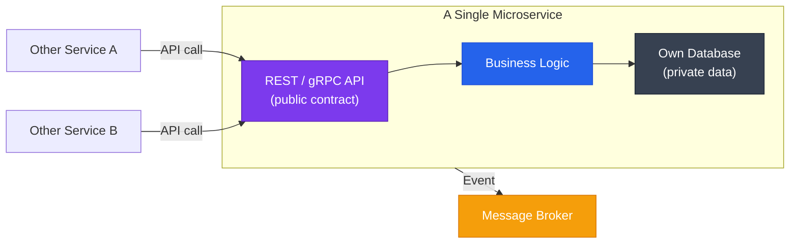

### Size — How "Micro" Is Micro?

"Micro" is misleading — yeh size ke baare mein nahi hai. It's about **single responsibility and independent deployability**.

| Wrong Way to Think | Right Way to Think |
|---|---|
| "A microservice must be < 1000 lines" | "Can I deploy this without coordinating with another team?" |
| "Split everything into smallest possible pieces" | "Does this own exactly ONE business capability?" |
| "More services = more microservices" | "Each service = one team, one domain, one database" |

**Real Example:** Netflix's API Gateway service is "micro" but handles millions of requests. Their recommendation engine is complex but is still one microservice because one team owns recommendations end to end.

---

## 3. Monolith vs Microservices — Deep Comparison

### Architecture View

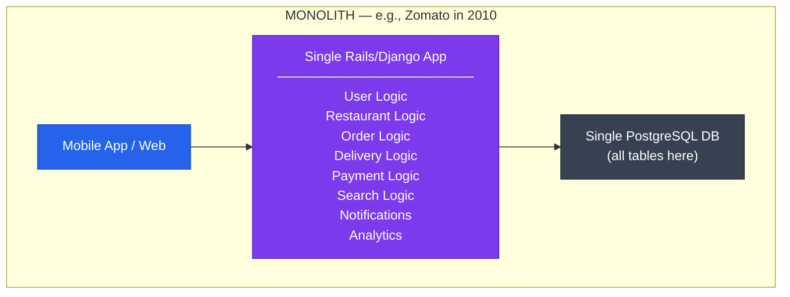

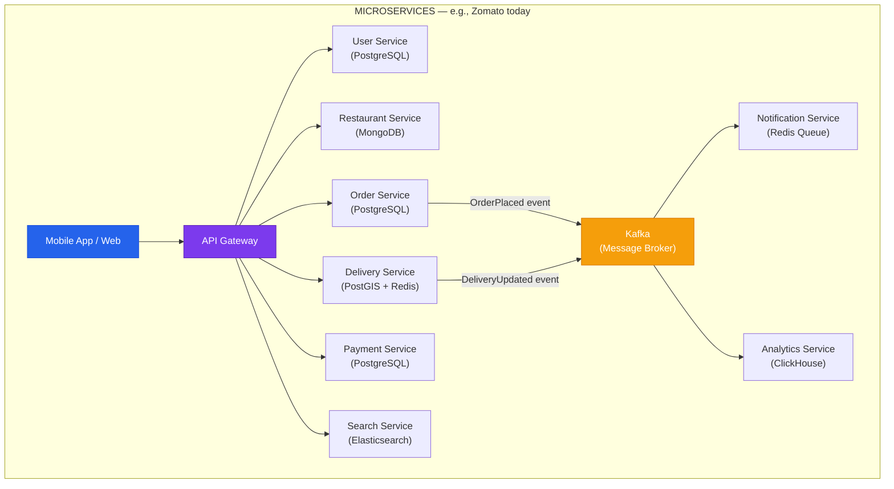

### Feature-by-Feature Comparison Table

| Factor | Monolith | Microservices |
|---|---|---|
| **Development speed (early stage)** | Very fast — everything in one place | Slow — infra setup, service contracts needed |
| **Development speed (at scale, 50+ engineers)** | Slow — coordination hell | Fast — teams work independently |
| **Deployment** | One command, one unit | Complex — each service has its own pipeline |
| **Testing** | Simple — run one process, test everything | Hard — need multiple services running locally |
| **Debugging** | Easy — one log file, one process | Hard — request spans 5 services, need tracing |
| **Scaling** | Must scale entire app (waste!) | Scale only the bottleneck service |
| **Fault isolation** | One bug crashes everything | Failure isolated to one service |
| **Database** | One DB — easy ACID transactions | Each service has its own DB — consistency is hard |
| **Technology choice** | Everyone uses same language/framework | Polyglot — each team picks best tool |
| **Operational overhead** | Low — one thing to monitor | Very high — N services to monitor, alert on |
| **Team ownership** | Unclear — everyone touches everything | Clear — team A owns Service A |

### The Deployment Pain That Forces the Switch

Soch lo Swiggy mein 200 engineers hain. Ek monolith hai. Ek din:

- Team A (Order) ne ek bug fix kiya
- Team B (Delivery) ne ek feature add kiya
- Team C (Payments) ne database migration kiya

Ab deploy karna hai. **Teen teamo ko coordinate karna padega.** Ek ki mistake = sab ka deployment hold. Is problem ko **deployment coupling** kehte hain. Yahi pain microservices solve karta hai.

---

## 4. When to Consider Microservices

### Conway's Law — Sabse Important Concept

> *"Organizations which design systems are constrained to produce designs which are copies of the communication structures of those organizations."*
> — Melvin Conway, 1967

**Simple baat:** Your software architecture will look like your org chart.

```
Small team (5 engineers):         Large org (200 engineers):
─────────────────────────         ────────────────────────────
Everyone talks to everyone        Team A: User Platform
→ One codebase makes sense        Team B: Search & Discovery
                                  Team C: Orders & Fulfillment
                                  Team D: Payments & Finance
                                  Team E: Delivery Logistics
                                  → Each team wants their own service!
```

If your team is 200 people and everyone deploys from one repo, they will constantly block each other. Conway's Law says: **your architecture should match your teams, not the other way around.**

### The Signals That Tell You It's Time

**Signal 1: Team Size > 10-15 Engineers on Same Codebase**

Amazon's "two-pizza rule" — if a team can't be fed by two pizzas (6-8 people), it's too big. When multiple such teams share one codebase, chaos begins.

**Signal 2: Deployment Frequency Drops**

If you used to deploy 10 times a day and now it's once a week because of "coordination", that's a microservices signal.

**Signal 3: Different Scaling Needs**

```
Swiggy's traffic pattern (during dinner time):
──────────────────────────────────────────────
Order Service:        100x normal load (everyone ordering)
Search Service:       80x normal load (browsing restaurants)
Delivery Service:     90x normal load (tracking delivery)
Profile Service:       1x normal load (no one updating profiles at 8pm)
Payment Service:      100x normal load (peak payments)

In a monolith: Must scale everything 100x just to handle orders.
In microservices: Scale Order, Search, Delivery, Payment independently.
                  Profile stays at 1x. Huge cost saving!
```

**Signal 4: Clear Domain Boundaries Exist**

If you can draw a clean box around "this is everything related to Payments" and that box doesn't need to know about "Restaurant Menu Management", you have a natural service boundary.

**Signal 5: Different Tech Requirements**

- Search needs Elasticsearch
- Recommendations need Python ML models
- Real-time tracking needs WebSockets + Redis
- Financial data needs PostgreSQL with strict ACID

A monolith forces one tech stack. If your teams are fighting over this, it's time.

### When NOT to Use Microservices

```
DO NOT use microservices if:
──────────────────────────────
❌ Your team is < 10-15 engineers
❌ You don't understand your domain yet (pre-product-market fit)
❌ You don't have a platform/DevOps team to manage K8s + CI/CD
❌ The monolith isn't actually painful yet
❌ You're building an MVP or prototype
❌ Your team has never operated distributed systems before

REAL EXAMPLE: Instagram was a monolith for its first 2+ years.
By the time they had 13 employees and 30M users, THEN they started
extracting services. Before that? Pure Django monolith.
```

---

## 5. Service Decomposition Principles

### The Analogy

Soch lo tum ek company ko departments mein kaise toadte ho? HR, Finance, Engineering, Marketing — yeh sab **business capabilities** ke basis par separate hain. HR ke log Finance ka kaam nahi karte. Finance team HR ka kaam nahi karti. Clear ownership.

Microservices mein bhi yehi karna hai.

### Principle 1: Decompose by Business Capability

Business capability = "what does this part of the business DO?"

```
E-Commerce Platform (e.g., Amazon, Flipkart):
──────────────────────────────────────────────
Business Capability          →  Microservice
───────────────────────────────────────────────────────────────
Managing user accounts       →  User Service
Showing products             →  Product Catalog Service
Storing user carts           →  Cart Service
Placing and tracking orders  →  Order Management Service
Processing payments          →  Payment Service
Managing stock levels        →  Inventory Service
Sending emails/SMS/push      →  Notification Service
Searching products           →  Search Service
Generating recommendations   →  Recommendation Service
Tracking deliveries          →  Logistics Service
```

Each capability is owned by **one team, end to end.**

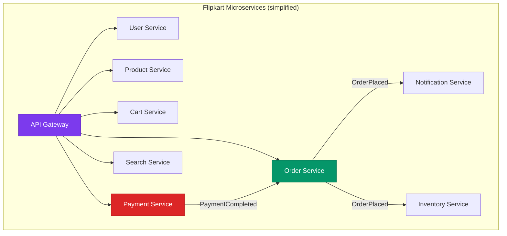

### Principle 2: Domain-Driven Design (DDD) — Bounded Contexts

Yeh Martin Fowler aur Eric Evans ka concept hai. **Bounded Context** ka matlab:

> A bounded context is a part of the system where a particular domain model applies consistently.

Simple example: "Customer" word ka matlab alag alag context mein alag hota hai:

```
"Customer" in different bounded contexts:
──────────────────────────────────────────
Order Service view of Customer:
  { customerId, shippingAddress, orderHistory }

Payment Service view of Customer:
  { customerId, paymentMethods, billingAddress, fraudScore }

Marketing Service view of Customer:
  { customerId, preferences, browsingHistory, segments }

IMPORTANT: Each service has its OWN model of "Customer".
They do NOT share one giant Customer table.
Each model has only what THAT service needs.
```

Har bounded context = potential microservice.

### Principle 3: Single Responsibility — Each Service Owns ONE Thing

```
BAD decomposition:
──────────────────
"UserAndOrderService" — does user management AND orders
"ProductAndInventoryAndSearchService" — three different things!

WHY IT'S BAD:
If order logic changes, user team gets disrupted.
Can't scale orders independently from users.

GOOD decomposition:
───────────────────
User Service      — user accounts, profiles, authentication
Order Service     — placing orders, order history, order status
Product Service   — product details, images, descriptions
Inventory Service — stock counts, warehouse locations

Each service: one reason to change, one team, one deployment.
```

**Interview Tip:** Agar koi puche "how do you decompose services?" — answer mein DDD bounded contexts + business capabilities dono mention karo. Bonus points for mentioning the "two-pizza team" rule.

### The "Right Size" Test

Ask yourself these three questions for each proposed service boundary:

1. **Can one team own this end-to-end?** (6-8 engineers)
2. **Does it own exactly ONE business domain?**
3. **Can it be deployed without coordinating with other teams?**

If yes to all three → good boundary.

---

## 6. Communication Between Services

### The Restaurant Analogy

Ek restaurant mein order karte ho. **Do tarike hote hain:**

**Tarika 1 (Synchronous):** Waiter ke paas jaate ho, order dete ho, waiter seedha kitchen ke paas jaata hai, chef se directly puchta hai "yeh dish kab ready hogi", chef bolte hai "10 minutes", waiter tumhare paas aata hai "10 minute wait karo". Tum wait karte ho. Yeh **synchronous** hai — ek chain of waiting.

**Tarika 2 (Asynchronous):** Waiter ko order dete ho. Waiter ek chit kitchen ke bahar ke board par chipka deta hai. Tum chale jaate ho seat par. Kitchen apne pace se chit uthata hai, dish banata hai, aur jab ready hoti hai tab tumhare paas deliver karta hai. Tum beech mein apna kaam karte rahe. Yeh **asynchronous** hai — decoupled.

### Synchronous Communication: REST and gRPC

**REST** (covered in Chapter 31) — HTTP-based, request-response.

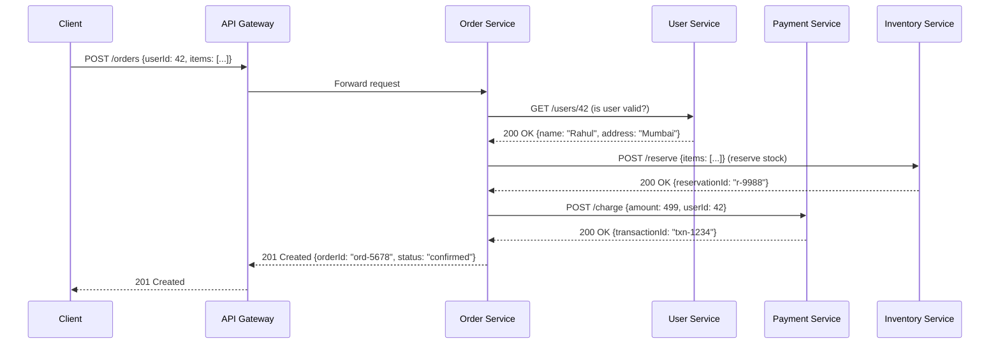

**gRPC** — Protocol Buffers, binary, faster, strongly typed. Best for internal service-to-service communication. (Covered in Chapter 31)

**Trade-offs of Synchronous:**

| Pro | Con |
|---|---|
| Simple to understand (like a function call) | If one service is slow, the entire chain waits |
| Immediate response — know if it worked | Tight coupling — caller must know callee's address |
| Easy to debug (request-response logs) | Cascading failures — one service down = whole flow fails |
| Strong consistency (you know the result) | Network timeouts must be carefully managed |

### Asynchronous Communication: Event-Driven / Message Queues

**The key insight:** Jab Order Service kisi ko notify karna chahta hai (Email, Inventory, Analytics), use unhe directly call karne ki zaroorat nahi hai. Use bas ek **event publish** karna hai — "Order 5678 was placed!" — aur jo bhi sun raha hai, sune.

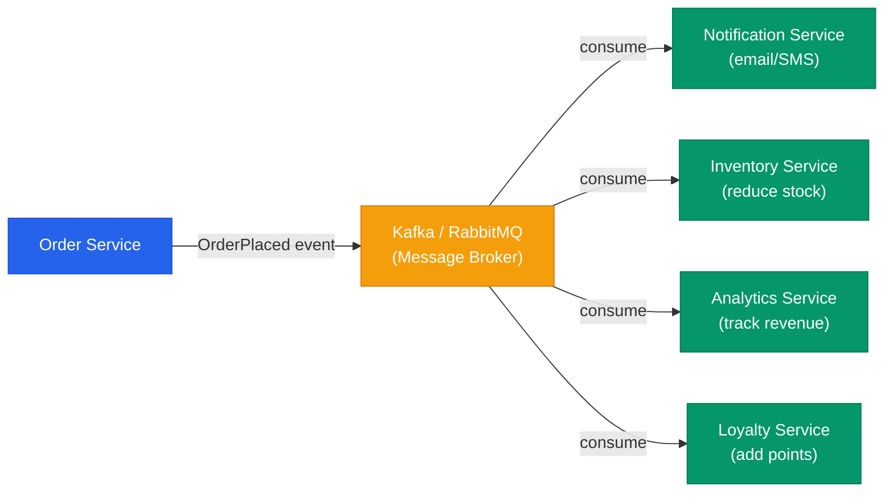

**The OrderPlaced event payload:**

```json
{
  "eventType": "OrderPlaced",
  "eventId": "evt-abc123",
  "timestamp": "2025-01-15T19:30:00Z",
  "orderId": "ord-5678",
  "userId": 42,
  "items": [
    { "productId": "p-99", "quantity": 2, "price": 249 }
  ],
  "totalAmount": 499,
  "restaurantId": "rest-77"
}
```

Now:
- **Notification Service** listens → sends "Your order is confirmed!" email
- **Inventory Service** listens → decrements stock for product p-99
- **Analytics Service** listens → records the revenue event
- **Loyalty Service** listens → adds reward points to user 42

**Kal agar ek aur service banana hai (e.g., "Fraud Detection Service")**, bas usse bhi Kafka topic subscribe karao. **Order Service ko touch karna nahi padega.** Yahi power hai async ka.

**Trade-offs of Asynchronous:**

| Pro | Con |
|---|---|
| Loose coupling — services don't know about each other | Eventual consistency — email may arrive 2 seconds after order |
| Resilient — if Notification Service is down, events queue up | Harder to trace — "why didn't I get the email?" needs Kafka + logs |
| Easy to add new consumers without changing publisher | Event schema changes must be backward compatible |
| Natural audit log — event history is stored | Operational overhead — need Kafka/RabbitMQ running |

### Choosing the Right Pattern

```
Use SYNCHRONOUS (REST/gRPC) when:
──────────────────────────────────
✅ You need an immediate response to continue the flow
   Example: "Is the user valid before I create the order?"
✅ Strong consistency is required
   Example: "Did the payment succeed before I confirm the order?"
✅ The called service being down should block the caller
   Example: Payment must succeed — don't proceed if it fails

Use ASYNCHRONOUS (Events/Queue) when:
──────────────────────────────────────
✅ The action is a side effect — not needed to complete the main flow
   Example: Sending confirmation email after order is created
✅ Multiple services care about the same event
   Example: Order placed → Inventory, Notification, Analytics all react
✅ The called service being slow/down should NOT block the caller
   Example: Analytics can process hours later, order flow shouldn't wait
✅ You want to add new consumers in future without changing existing code
```

---

## 7. Service Discovery

### The Analogy

Socho tum ek naye shahar mein aaye ho aur pizza order karna chahte ho. Pehle tum **Just Dial ya Google Maps** pe search karte ho "pizza near me". Woh tumhe address deta hai. Tum wahan jaate ho.

Microservices mein bhi yehi problem hai. Service A ko Service B call karna hai. But in a cloud environment, Service B ke 10 instances hain, unke IP addresses dynamically assign hote hain, aur Kubernetes anytime ek instance ko kill karke nayi IP pe restart kar sakta hai. **"Where is the Order Service right now?"** — yeh Service Discovery ka kaam hai.

(Covered in depth in Chapter 37. Here's the summary:)

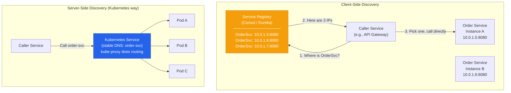

**Interview Tip:** Kubernetes mein alag se service discovery implement karne ki zaroorat nahi. Kubernetes Services automatically handle it via DNS (`order-service.default.svc.cluster.local`). Just know this exists and why it's needed.

---

## 8. Data Isolation — The Most Critical Rule

### The Analogy

Yeh samajhna bahut important hai. **Do restaurants ka shared kitchen** imagine karo. Biryani wala aur Chinese wala ek hi kitchen share kar rahe hain. Ab biryani wale ne kitchen ko reorganize kiya — ingredients ki shelf ki jagah badal di. Chinese wale ka kya hua? Unka kaam disrupted ho gaya kyunki unhe pata hi nahi tha kuch badal gaya.

**Yahi hota hai jab do microservices ek hi database share karti hain.**

### The Golden Rule

> **Each microservice must own its own database. No other service can query it directly.**

```
WRONG — Shared Database (Distributed Monolith Anti-Pattern):
─────────────────────────────────────────────────────────────
Order Service     ──┐
User Service      ──┤──► Shared PostgreSQL DB
Payment Service   ──┤
Inventory Service ──┘

Problems:
❌ Schema change in "orders" table → coordinate with ALL teams
❌ One service's slow query brings down everyone's DB
❌ Can't scale databases independently
❌ Hidden coupling — services depend on each other's data structure
❌ Testing one service requires the full DB schema

CORRECT — Database per Service:
─────────────────────────────────
Order Service     ──► Order DB (PostgreSQL)
User Service      ──► User DB (PostgreSQL)
Payment Service   ──► Payment DB (PostgreSQL)
Inventory Service ──► Inventory DB (Redis + PostgreSQL)
Search Service    ──► Elasticsearch
Analytics Service ──► ClickHouse (columnar)

✅ Schema changes are local — no coordination needed
✅ Each DB scales independently
✅ Services are truly isolated
✅ Can choose the right DB for each use case
```

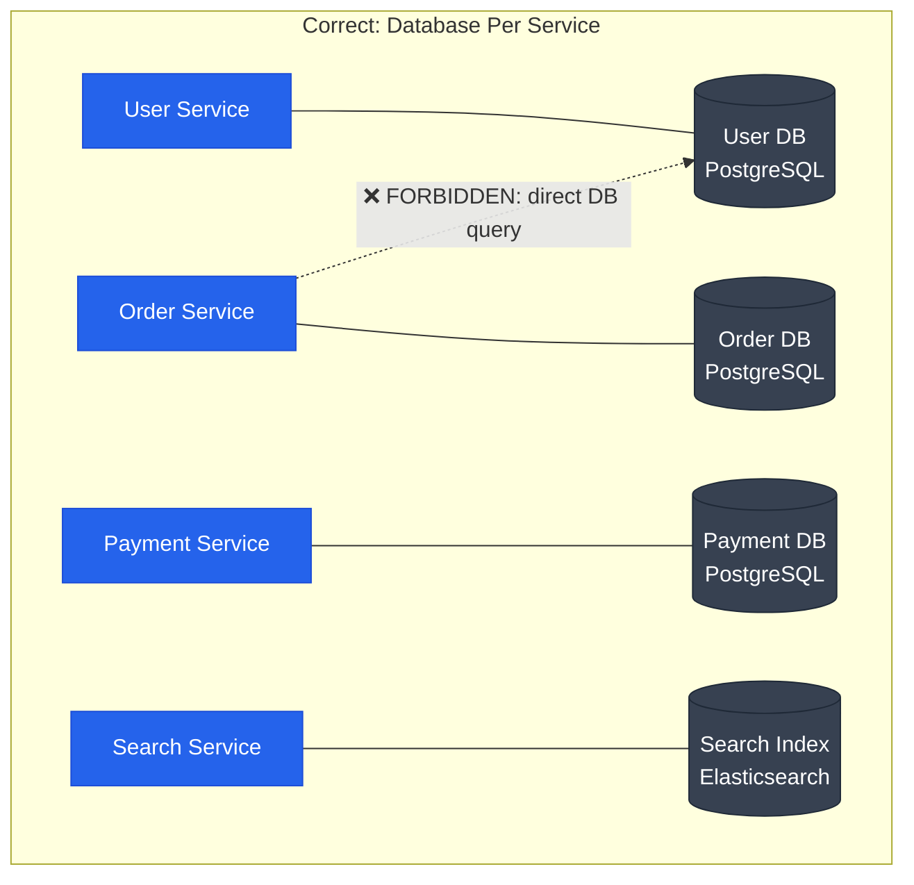

### The Hard Problem: Cross-Service Queries

Ab problem yeh hai — "Get order details with user name, product info, and payment status" — yeh data 4 different databases mein hai!

**Option 1: API Composition (Simple but Slow)**

```
API Gateway or Order Service calls:
  1. User Service → GET /users/42 → {name: "Rahul"}
  2. Product Service → GET /products/p-99 → {name: "Biryani"}
  3. Payment Service → GET /payments/txn-1234 → {status: "SUCCESS"}
Assembles response and returns.

✅ Simple to implement
❌ N network calls = latency adds up
❌ If any one service is down, entire response fails
```

**Option 2: CQRS + Read Models (Eventual Consistency)**

```
When Order is created → publish OrderPlaced event
A "Read Model Service" listens to all events:
  - UserCreated/Updated → store user name
  - OrderPlaced → store order
  - PaymentCompleted → store payment status

Build a DENORMALIZED read store:
{
  orderId: "ord-5678",
  userName: "Rahul",          ← from User Service event
  productName: "Biryani",     ← from Product Service event
  paymentStatus: "SUCCESS",   ← from Payment Service event
  totalAmount: 499
}

Query the read model directly — one fast query.
✅ Fast reads
✅ Services remain decoupled
❌ Eventual consistency (read model may lag by seconds)
❌ More complexity to build and maintain
```

**Interview Tip:** Yeh ek bahut common interview question hai. "How do services share data?" — The answer is: they don't share databases. They share data through APIs (synchronous) or events (asynchronous). CQRS is the advanced answer for complex read scenarios.

---

## 9. Challenges of Microservices

### Distributed Systems Are Hard — No Free Lunch

Microservices adopt karte waqt sab log benefits ke baare mein bolte hain. But interview mein agar tum challenges bhi clearly bol sako, toh tumhara answer standout hota hai.

### Challenge 1: Distributed Tracing

```
Problem:
A user reports: "My order failed." You look at logs.
Order Service logs: "Request received, forwarded to Payment"
Payment Service logs: "Received request, called Bank API"
Bank API logs: "Timeout after 5 seconds"

Teen different log files. Different servers. Different timestamps.
No way to connect them without a correlation ID.

Solution: Distributed Tracing (see Chapter 23)
────────────────────────────────────────────
1. Assign a Trace ID to every incoming request
2. Pass it as HTTP header X-Trace-ID to all downstream calls
3. Each service logs its own "span" with start time, end time, Trace ID

Visualization (Jaeger / Datadog APM):

Request: Trace ID = abc123
  API Gateway    [████████████████████] 800ms total
  ├─ User Svc    [███] 50ms
  ├─ Order Svc   [█████████████] 600ms  ← slow!
  │  ├─ DB query [████████████] 580ms   ← root cause!
  └─ Notification [██] 30ms (async)

Tools: Jaeger, Zipkin, Datadog APM, AWS X-Ray, OpenTelemetry
```

### Challenge 2: Distributed Transactions and Sagas

Ek monolith mein: `BEGIN TRANSACTION; update users; update orders; update inventory; COMMIT;` — ya toh sab hoga ya kuch nahi.

Microservices mein yeh impossible hai (alag databases hain). Solution: **Saga Pattern** (Covered in Chapter 41)

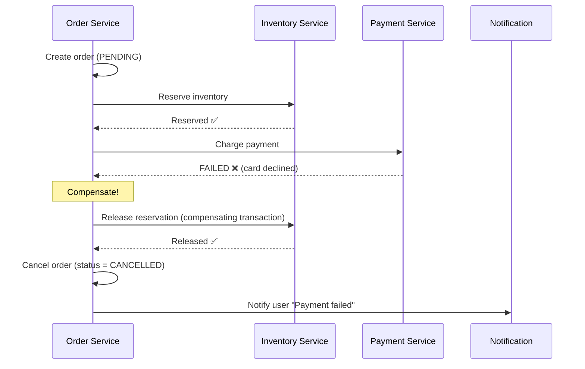

**The Saga Pattern:** Ek sequence of local transactions. Agar beech mein koi step fail ho, **compensating transactions** run hoti hain to undo previous steps.

### Challenge 3: Network Failures and Circuit Breakers

(Covered in Chapter 36)

```
Problem:
Payment Service is slow (GC pause, high load).
Order Service calls it → waits 30 seconds → timeout
1000 users placing orders simultaneously → 1000 threads waiting
Order Service runs out of threads → crashes
API Gateway → crashes
Everything is down. Called "cascading failure".

Solution: Circuit Breaker Pattern
────────────────────────────────────
Like an electrical circuit breaker — trips when overloaded.

CLOSED state (normal):
  Requests flow through. Count failures.
  If failures > threshold (e.g., 50%) in 10 seconds → OPEN

OPEN state (tripped):
  Don't even try calling Payment Service.
  Immediately return error or fallback response.
  Wait 30 seconds, then try once (HALF-OPEN)

HALF-OPEN state:
  Send one test request.
  If success → go back to CLOSED
  If failure → go back to OPEN

Tools: Netflix Hystrix (legacy), Resilience4j, Istio service mesh
```

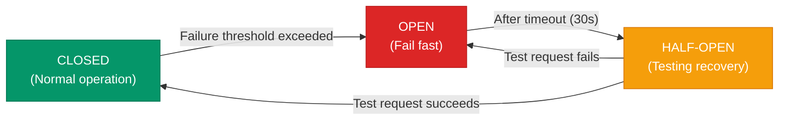

### Challenge 4: Testing Complexity

```
Unit testing: Same as monolith — easy.

Integration testing: Hard.
  "I want to test Order Service calling Payment Service."
  Do I mock Payment Service? Or spin up a real instance?
  If real instance: I need a running Kafka, running DB, etc.

Solution: Contract Testing with Pact
──────────────────────────────────────
Consumer (Order Service) defines:
  "I expect Payment Service to respond with:
   POST /charge → { transactionId: string, status: 'SUCCESS' | 'FAILED' }"

Provider (Payment Service) verifies:
  "Does our API actually match what Order Service expects?"

Tests run independently. No need to spin up both services together.
Breaks are caught BEFORE deployment, not in production.

Tools: Pact.io — industry standard for contract testing in microservices
```

### Challenge 5: Operational Overhead

```
Monolith: 1 service
  - 1 CI/CD pipeline
  - 1 monitoring dashboard
  - 1 log file to search
  - 1 alert channel

50 Microservices:
  - 50 CI/CD pipelines to maintain
  - 50 monitoring dashboards (or one complex one)
  - 50 log streams to correlate
  - Centralized logging (ELK Stack: Elasticsearch + Logstash + Kibana)
  - Service mesh for inter-service security (mTLS)
  - API gateway for all external traffic

This is why you need a PLATFORM/DevOps team before going microservices.
Netflix has an entire "Cloud Platform" org of hundreds of engineers
just to make microservices manageable for product teams.
```

---

## 10. Containers and Kubernetes

### Why This Matters for Microservices

### The Container Analogy

Pehle zamaane mein, shipping bahut messy thi — alag alag shapes ke saman ko alag alag tarike se load karna padta tha. Phir **shipping containers** aaya — standard size ka ek box. Kuch bhi andar daal do — tractor ho ya T-shirts. Port, ship, train — sab ne ek hi container handle karna seekh liya.

**Docker containers = shipping containers for software.**

```
Before Docker (The "it works on my machine" problem):
──────────────────────────────────────────────────────
Developer's laptop: Node 18, Ubuntu 22, npm 9
Staging server:     Node 16, CentOS 7, npm 8
Production server:  Node 14, Amazon Linux 2, npm 6

Code works locally → breaks in prod. Classic.

After Docker:
─────────────
Docker image contains: Node 18 + Ubuntu 22 + npm 9 + your code
Run it anywhere: dev laptop, CI server, production → same behavior.
No "works on my machine" ever again.
```

**With microservices, you have 20-50 services.** Without Docker, deploying each with its own specific Node/Python/Java version on every server = nightmare. Docker makes each service a self-contained unit.

### Kubernetes — The Orchestrator

Docker solves packaging. **Kubernetes (K8s)** solves running thousands of containers in production.

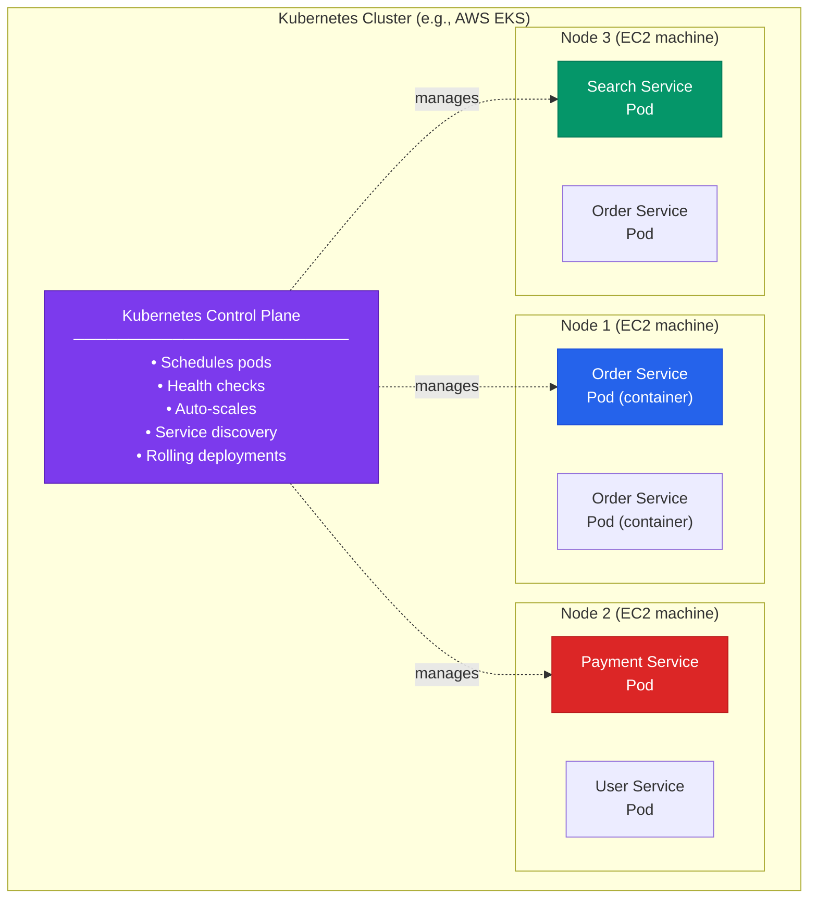

**What Kubernetes handles automatically:**

| Problem | Kubernetes Solution |
|---|---|
| A pod crashes | Restarts it automatically |
| Traffic spikes | Auto-scales pods (HPA — Horizontal Pod Autoscaler) |
| Deploy new version | Rolling update — zero downtime |
| Service discovery | DNS-based — stable name even as pod IPs change |
| Load balancing | Kubernetes Service distributes traffic across pods |
| Config/secrets | ConfigMaps and Secrets |

**Real Example:** Swiggy, Flipkart, PayTM — sab Kubernetes pe run hote hain. During sale events (Big Billion Day), Kubernetes automatically 10x the number of Order Service pods. Traffic drops, K8s scales down. **You don't manually intervene.**

---

## 11. Anti-Patterns to Avoid

### Anti-Pattern 1: Nanoservices (Too Fine-Grained)

**The mistake:** "Microservices matlab har function ek alag service!"

```
Nanoservice hell:
─────────────────
CreateUserService     — only creates users
UpdateUserService     — only updates users
DeleteUserService     — only deletes users
GetUserByIdService    — only gets user by ID
GetUserByEmailService — only gets user by email

All deployed separately, each with its own DB, own CI/CD...

Problems:
❌ Chatty communication — GetOrder needs to call 10 nanoservices
❌ Impossible to do a transaction across them
❌ Operational overhead 10x worse
❌ Team can't own 50 tiny services each doing nothing useful
❌ Network latency explodes

Right approach:
UserService — handles all user-related operations (CRUD + business logic)
```

### Anti-Pattern 2: Distributed Monolith

**The mistake:** Services exist on paper, but they're not actually independent.

```
Distributed Monolith symptoms:
──────────────────────────────
❌ All services share the same database
❌ Services must be deployed together (synchronized releases)
❌ Changing one service requires changing 3 others
❌ One service's DB schema change breaks other services
❌ Services call each other synchronously in long chains (A→B→C→D→E)

This is the WORST of both worlds:
- Monolith complexity (tight coupling)
- Distributed system complexity (network failures, latency)
- NONE of the benefits (no independent scaling, no independent deployment)

How it happens:
Teams split services physically but kept shared DB.
Or: services are so tightly coupled via sync calls that they
can't be deployed independently.

Real signal: "We can only deploy all services on Friday night together."
If this sounds familiar, you have a distributed monolith.
```

### Anti-Pattern 3: Chatty Services

**The mistake:** Service A needs to make 10 API calls to Service B to complete one user request.

```
Chatty pattern (bad):
─────────────────────
To render "My Orders" page:
  1. GET /users/42 (User Service)
  2. GET /orders?userId=42 (Order Service) → returns 20 order IDs
  3. GET /products/p-1 (Product Service) × 20 times
  4. GET /payments/txn-xxx × 20 times
= 42 API calls for one page load!

Solution 1: BFF (Backend for Frontend)
────────────────────────────────────────
Create a "My Orders BFF" service that aggregates:
  - Calls all services internally (fast, in datacenter)
  - Returns one rich response to mobile/web
  - Single API call from client perspective

Solution 2: GraphQL Gateway
────────────────────────────
Client specifies exactly what data it needs in one query.
Gateway fetches from multiple services, assembles response.

Solution 3: Denormalized Read Model (CQRS)
───────────────────────────────────────────
Pre-build "My Orders with product details" read model.
Single DB query instead of N service calls.
```

---

## 12. Real World: Amazon's Story

Yeh story sabse important hai. Amazon ne literally define kiya hai how large companies do microservices.

### Timeline

```
2000 — Amazon is a monolith
────────────────────────────
One giant C++ / Perl application.
All engineering teams work in the same codebase.
Deployments take weeks.
Teams block each other constantly.
Jeff Bezos is furious.

2002 — The Famous "Bezos API Mandate"
───────────────────────────────────────
Jeff Bezos sent an internal memo (now legendary):

1. All teams will expose their data and functionality through service interfaces.
2. Teams must communicate with each other through these interfaces.
3. There will be no other form of inter-process communication allowed:
   no direct linking, no direct reads of another team's data store,
   no shared memory model, no back-doors whatsoever.
4. The only communication allowed is via service interface calls over the network.
5. It doesn't matter what technology they use.
6. All service interfaces must be designed from the ground up to be externalizable.
   That is, the team must plan and design to be able to expose the interface to
   developers in the outside world. No exceptions.
7. Anyone who doesn't do this will be fired.

— Jeff Bezos, 2002

This memo is WHY AWS exists. When Amazon was forced to build
clean service APIs internally, they realized: "We can sell these
APIs externally." → AWS was born.

2006 — AWS launches
────────────────────
EC2, S3 — built on internal service infrastructure.

Today — Amazon has THOUSANDS of services
─────────────────────────────────────────
Each team owns their service.
Amazon ships code to production every 11.7 seconds (on average).
No team blocks another.
Individual services scale independently during Prime Day.
```

### What This Means for You

The key lesson from Amazon: **Microservices are primarily an organizational decision.** Bezos didn't mandate microservices because of technical reasons — he did it because **teams were blocking each other.** That's Conway's Law in action.

---

## 13. Strangler Fig — Safe Migration Path

### The Analogy

Ek Strangler Fig (anjeer ki ek prakar) tropical forests mein ek host tree par ugate hain. Dheere dheere, saalon tak, woh tree ko wrap karte hain. Eventually, original tree rot ho jaata hai. Sirf fig ki vine bachti hai — but tree ki shape same rehti hai.

**Yahi approach monolith se microservices migrate karne ki hai.**

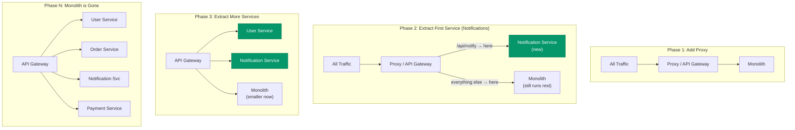

### Migration Strategy

**Step 1: Never rewrite from scratch.** Bahut saari companies ne "Let's rewrite everything in microservices!" kiya aur fail ho gayi. Too risky — you're building a new system while the old one is live.

**Step 2: Start with the least risky service to extract:**

```
Good first candidates for extraction:
──────────────────────────────────────
✅ Notification Service (Email/SMS)
   - Low risk: failure just delays emails, doesn't break orders
   - Clear boundary: sends messages, that's it
   - Easy to make event-driven (subscribe to monolith events)

✅ Search Service
   - Clearly separate technology (Elasticsearch)
   - Reads-only — won't break write operations
   - Can run in parallel (monolith search still works as fallback)

❌ Avoid extracting first:
   - Payment Service (too critical, failure = lost revenue)
   - Order Service (complex, touches everything)
   - Authentication (security implications)
```

**Step 3: Strangle one service at a time.** Test thoroughly. Then next.

**Interview Tip:** Agar koi puche "How would you migrate a monolith to microservices?" — Strangler Fig pattern + start with low-risk services + never big-bang rewrite. Yeh complete answer hai.

---

## 14. Common Interview Questions

### Q1: "What is a microservice? How is it different from a monolith?"

**Answer:** A microservice is an independently deployable service that owns a single business capability and its own database. Unlike a monolith where everything is deployed together, microservices allow teams to deploy, scale, and fail independently. The key difference is organizational as much as technical — microservices align with team boundaries (Conway's Law).

---

### Q2: "How do two microservices communicate?"

**Answer:**

1. **Synchronous (REST/gRPC):** Direct API calls. Use when caller needs an immediate response to continue (e.g., checking if payment succeeded before confirming order).

2. **Asynchronous (Message queue — Kafka/RabbitMQ):** Publisher emits event, consumers process independently. Use for side effects (notifications, analytics, inventory updates) where caller doesn't need to wait.

**Never share databases** — that's the key rule. Data is shared only through APIs or events.

---

### Q3: "How do you handle a transaction across multiple microservices?"

**Answer:** You don't use distributed transactions (2PC) — they're fragile and cause tight coupling. Instead, use the **Saga Pattern**:

- **Choreography-based Saga:** Each service publishes events; next service reacts. No central coordinator.
- **Orchestration-based Saga:** A central "Saga Orchestrator" tells each service what to do.

Each step has a **compensating transaction** to undo it on failure. Accept eventual consistency — this is the trade-off for distributed systems.

(Covered in depth in Chapter 41)

---

### Q4: "When would you NOT use microservices?"

**Answer:** Small teams (< 10-15 engineers), early-stage startups where domain isn't understood yet, systems with complex multi-entity transactions that need strong consistency, and teams without DevOps maturity to operate distributed systems. A well-structured modular monolith often outperforms microservices for small teams.

---

### Q5: "What is a service mesh?"

**Answer:** A service mesh is an infrastructure layer that handles service-to-service communication transparently. It injects a **sidecar proxy** (Envoy) alongside every service container. The sidecar handles:

- mTLS (mutual TLS) for encryption between services
- Circuit breaking and retries
- Observability (metrics, traces) without code changes
- Traffic management (canary deployments, A/B testing)

Examples: Istio, Linkerd. App code doesn't change — the sidecar does all of this.

---

### Q6: "Design the microservices architecture for Zomato / Swiggy."

**Answer structure:**

```
Services:
──────────
User Service      — auth, profiles, addresses
Restaurant Service — restaurant listings, menus
Search Service    — Elasticsearch-backed discovery
Order Service     — cart to confirmed order
Payment Service   — payment processing, refunds
Delivery Service  — driver assignment, real-time tracking
Notification Svc  — email, SMS, push notifications
Loyalty Service   — coins, rewards

Communication:
──────────────
User → Restaurant: Sync (need menu right now)
Order → Payment: Sync (need success/failure immediately)
Order → Delivery: Sync (assign driver immediately)
Order → Notification: Async (email can be slightly delayed)
Order → Loyalty: Async (points can be added later)
All events via Kafka

Databases:
──────────
User Service      → PostgreSQL
Restaurant Service → MongoDB (flexible menu schema)
Search Service    → Elasticsearch
Order Service     → PostgreSQL
Payment Service   → PostgreSQL (ACID critical)
Delivery Service  → PostGIS (geospatial) + Redis (real-time)
```

---

### Q7: "What are microservices anti-patterns?"

**Answer:**

1. **Distributed Monolith** — services exist but share DB or are deployed together; worst of both worlds
2. **Nanoservices** — too granular; one service per CRUD operation; chatty and unmaintainable
3. **Chatty services** — one user request triggers 20+ inter-service calls; use BFF or CQRS
4. **Sharing databases** — violates the fundamental rule; creates implicit coupling
5. **No service contracts** — APIs change without versioning; breaks consumers silently

---

### Q8: "How do you test microservices?"

**Answer:**

| Test Type | Scope | Tool |
|---|---|---|
| Unit tests | Single service, mocked dependencies | Jest, JUnit |
| Contract tests | API contract between two services | Pact.io |
| Integration tests | Service + its real DB | Testcontainers |
| End-to-end tests | Full user flow across services | Cypress, Playwright |
| Chaos testing | Random service failures | Chaos Monkey (Netflix) |

**Contract testing with Pact** is the key insight — consumers define what they expect, providers verify they deliver it. Tests run independently without spinning up multiple services.

---

### Q9: "How do you monitor microservices?"

**Answer (The Three Pillars of Observability):**

1. **Logs** — Centralized logging (ELK Stack: Elasticsearch + Logstash + Kibana). Every log includes trace ID.

2. **Metrics** — Prometheus + Grafana. CPU, memory, request rate, error rate, latency per service.

3. **Traces** — Distributed tracing (Jaeger / Datadog APM / AWS X-Ray). See full request path across services with timing.

Without all three, operating microservices in production is blind.

---

## 15. Key Takeaways

```
╔════════════════════════════════════════════════════════════════════════╗
║                    MICROSERVICES — KEY TAKEAWAYS                       ║
╠════════════════════════════════════════════════════════════════════════╣
║                                                                        ║
║  1. MONOLITH FIRST                                                     ║
║     Start with a modular monolith. Split into services only when       ║
║     the coordination pain is real and team is > 10-15 engineers.       ║
║                                                                        ║
║  2. CONWAY'S LAW                                                       ║
║     Architecture mirrors org structure. Microservices solve a          ║
║     people problem (team autonomy) first, technical problem second.    ║
║                                                                        ║
║  3. THE GOLDEN RULE                                                     ║
║     Each service owns its own database. Period. No shared DB.          ║
║     Data is shared only through APIs or events — never direct queries. ║
║                                                                        ║
║  4. SYNC vs ASYNC                                                      ║
║     Synchronous (REST/gRPC) for immediate responses.                   ║
║     Asynchronous (Kafka/RabbitMQ) for side effects and decoupling.     ║
║     Most real systems use both.                                        ║
║                                                                        ║
║  5. SAGA PATTERN                                                       ║
║     No distributed transactions (2PC). Use Saga with compensating      ║
║     transactions. Accept eventual consistency.                         ║
║                                                                        ║
║  6. STRANGLER FIG MIGRATION                                            ║
║     Never big-bang rewrite. Extract one service at a time.             ║
║     Start with low-risk services (notifications, search).              ║
║                                                                        ║
║  7. ANTI-PATTERNS TO AVOID                                             ║
║     Distributed Monolith > Nanoservices > Chatty Services              ║
║     The worst outcome: complexity of distributed systems with          ║
║     zero benefits of microservices.                                    ║
║                                                                        ║
║  8. DOCKER + KUBERNETES = MICROSERVICES MADE PRACTICAL                 ║
║     Docker packages each service. Kubernetes orchestrates them         ║
║     at scale — auto-scaling, self-healing, zero-downtime deploys.      ║
║                                                                        ║
║  9. OBSERVABILITY IS NOT OPTIONAL                                       ║
║     Three pillars: Logs + Metrics + Traces.                            ║
║     Without distributed tracing, debugging is nearly impossible.       ║
║                                                                        ║
║  10. AMAZON'S LESSON                                                   ║
║      Bezos's 2002 API mandate: all teams expose service interfaces.    ║
║      This is what created AWS. Microservices = API-first culture.      ║
║                                                                        ║
╚════════════════════════════════════════════════════════════════════════╝
```

---

## Related Chapters

| Topic | Chapter |
|---|---|
| REST and gRPC (service communication protocols) | Chapter 31 |
| Distributed Tracing | Chapter 23 |
| Service Discovery | Chapter 37 |
| Distributed Transactions and Sagas | Chapter 41 |
| Circuit Breakers | Chapter 36 |
| Message Queues (Kafka, RabbitMQ) | Chapter 18 |
| API Gateway | Chapter 34 |

---

> **Final thought:** Microservices are not a goal — they're a tool. The goal is teams shipping value independently without stepping on each other. If a monolith achieves that for your team size and domain, use the monolith. If it doesn't, extract services carefully, one at a time, with full observability. Never adopt microservices because they sound cool — adopt them because the organizational pain is real.
