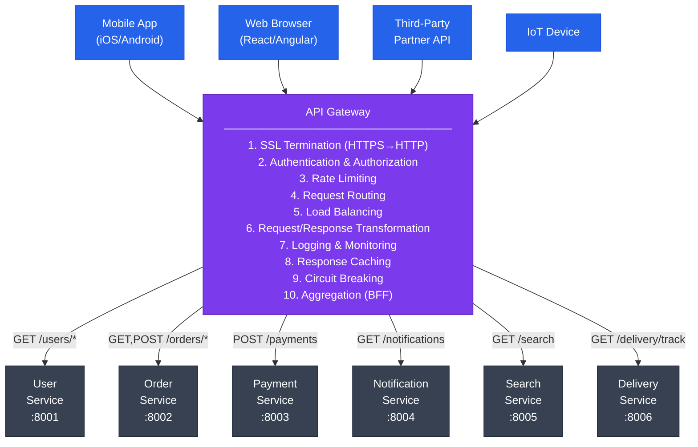
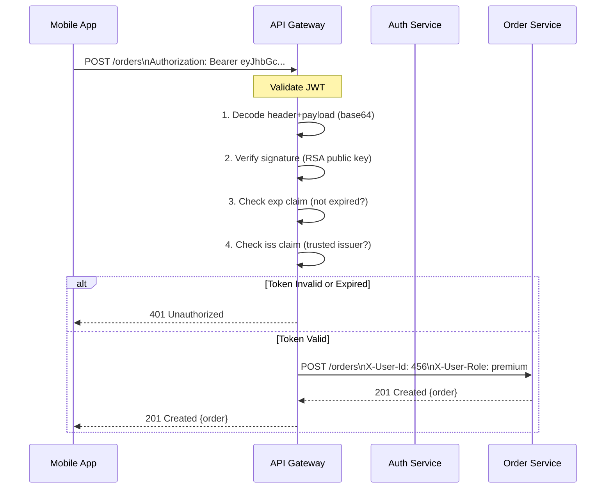
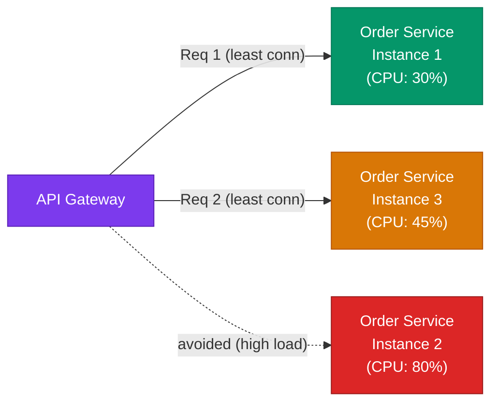
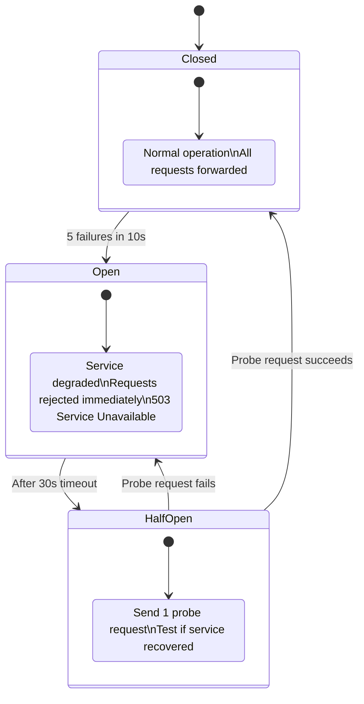
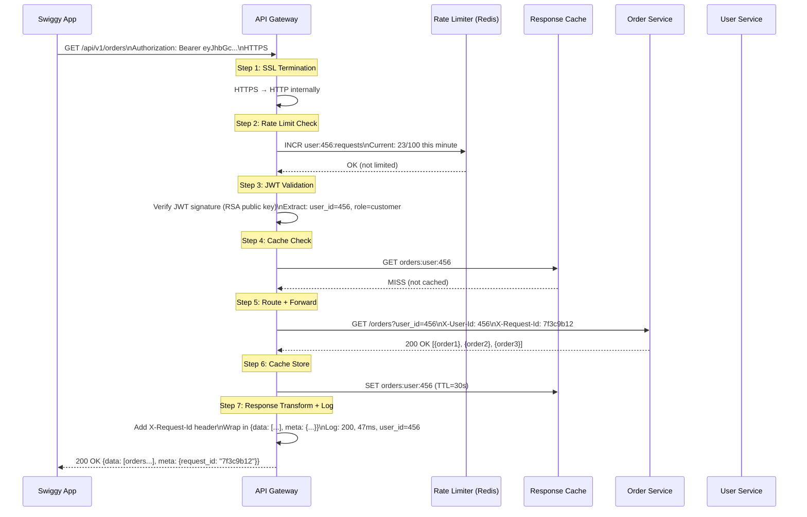
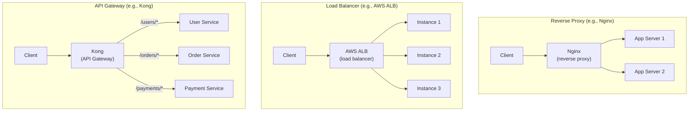
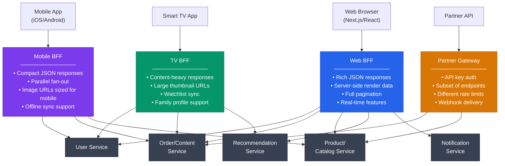
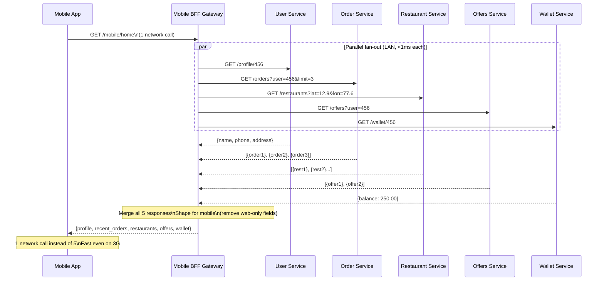
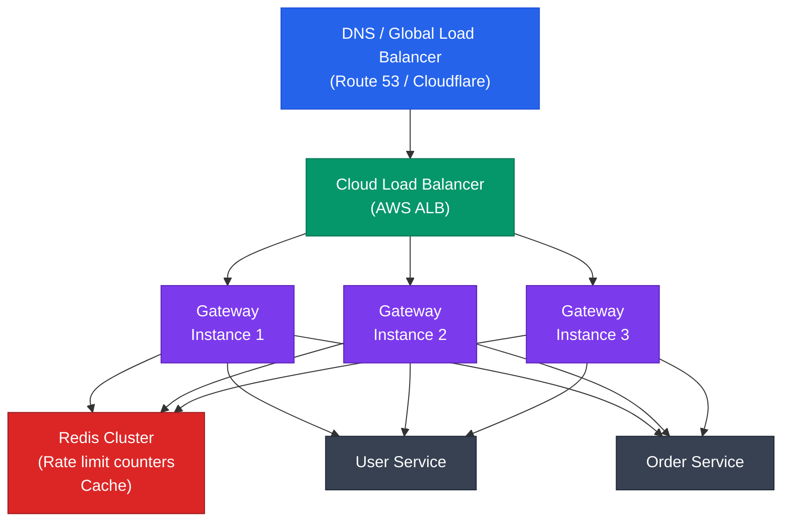

# API Gateway

> "Every great system has a single, well-guarded front door. The API Gateway is that door."

---

## The Receptionist Analogy — Samajhte hain pehle

Imagine you're visiting a large company — say, Infosys headquarters. You don't just walk in and directly go to the engineering floor, the finance department, or the HR office. You:

1. Walk through the **main reception**
2. The receptionist **checks your ID** (authentication)
3. They **log your visit** in a register (logging)
4. They **tell you which floor to go to** (routing)
5. If too many people are arriving at once, they make you **wait in a queue** (rate limiting)
6. Sensitive departments are **not visible** to visitors — you only see "Reception" (abstraction)

Yeh wahi hai **API Gateway**. Your microservices are the different departments. The API Gateway is the receptionist. Clients (mobile apps, web apps, third-party systems) never walk directly to any service — they always go through the gateway first.

Simple baat hai: **Gateway = single entry point for all clients into your entire system.**

---

## Why Does the API Gateway Even Exist? — Problem First

Before understanding what an API Gateway does, let's understand the **mess it prevents**.

### The World Without an API Gateway

Imagine Zomato has these microservices:

- **User Service** — login, profile, addresses
- **Restaurant Service** — menus, ratings, timings
- **Order Service** — cart, checkout, order status
- **Payment Service** — pay, refund, wallet
- **Delivery Service** — assign rider, track location
- **Notification Service** — push, SMS, email

**Without an API Gateway, the Zomato mobile app would need to:**

```
Mobile App must directly call:

POST https://user-service.internal:8001/login
GET  https://restaurant-service.internal:8002/restaurants?lat=12.9&lon=77.6
GET  https://menu-service.internal:8003/menus/restaurant/456
POST https://order-service.internal:8004/cart
POST https://payment-service.internal:8005/pay
GET  https://delivery-service.internal:8006/track/order/789
```

Kya problems hain yahan?

| Problem | Impact |
|---|---|
| Client knows internal URLs of every service | If you rename/move a service, all clients break |
| Auth/JWT validation logic in EVERY service | 6 services, 6 copies of the same auth code |
| Rate limiting logic in EVERY service | 6 copies, inconsistent limits |
| Mobile app makes 6 requests to load one screen | Slow, battery-draining, high data usage |
| CORS, SSL, logging — duplicated everywhere | Maintenance nightmare |
| Changing internal service topology | Requires updating all clients simultaneously |

**Real example — Instagram pe sochte hain.** Jab aap Instagram kholta hai, aapka feed load hota hai. Behind the scenes, it needs:
- Your profile data
- Who you follow
- Posts from those accounts
- Suggested content
- Stories
- Ad data

Without a gateway, the Instagram app would be making 6-8 separate API calls just to render the home screen. On a 2G connection in rural India, that's painfully slow. **Yeh kyun important hai** — aggregation at the gateway level means the app makes ONE call, and the gateway fans out to all 6 services internally.

---

## What is an API Gateway? — Full Definition

An **API Gateway** is an application-layer component that sits between all clients and all backend services. It acts as the **single point of entry** for all API traffic and handles cross-cutting concerns so that individual services don't have to.



---

## What the API Gateway Does — 9 Core Functions

### 1. Routing

**Analogy:** A post office sorting center. Letters (requests) come in from everywhere, and the sorting center reads the address (URL path) and routes each letter to the correct delivery van (service).

**How it works:**
- Gateway inspects the incoming request URL, HTTP method, and/or headers
- Matches it against a routing table
- Forwards the request to the correct upstream service

```
Routing table example (Netflix-style):

/api/v1/users/*         →  User Service         (user profile, preferences)
/api/v1/content/*       →  Content Service      (movies, shows)
/api/v1/search          →  Search Service        (Elasticsearch backed)
/api/v1/recommendations →  ML Service            (personalized recs)
/api/v1/payments/*      →  Billing Service       (subscriptions)
/api/v1/streams/*       →  Streaming Service     (actual video delivery)
```

**Real example — YouTube.** When you go to youtube.com/watch?v=abc123, the gateway routes:
- The video metadata request → Video Metadata Service
- The recommendation sidebar → Recommendations Service
- Your subscription status → User Service
- The ad → Ad Targeting Service

All from one page load. Client sees one domain: `youtube.com`.

**Trade-off:** Routing rules must be kept in sync with actual service locations. Use service discovery (Consul, Kubernetes DNS) so gateway always has updated addresses.

**Interview tip:** When asked "how does routing work in a gateway?", mention path-based routing, header-based routing (routing by `X-Client-Type: mobile`), and method-based routing. These are all real patterns used in production.

---

### 2. Authentication and Authorization

**Analogy:** A bouncer at a nightclub. You show your ID (JWT token) at the door (gateway). The bouncer verifies it — checks it's not fake, not expired. You don't show ID again to the bartender, the DJ, or the coat check. The bouncer already cleared you.

**Why at the gateway?** Without gateway-level auth, every microservice would need to:
- Import JWT library
- Fetch the public key to verify signatures
- Handle token expiry
- Parse claims
- Implement role-based access

6 services × repeated auth logic = bugs, inconsistency, and pain.

**How JWT validation works at the gateway:**



**Authorization (what you can do) vs Authentication (who you are):**

| Concern | Gateway handles | Service handles |
|---|---|---|
| Is the token valid? | Yes — always at gateway | No — trust gateway headers |
| Is the user who they say they are? | Yes — JWT signature | No |
| Can this user access this specific order? | Partially (role check) | Yes (owns this order?) |
| Is this user's account banned? | Yes (check deny list) | No |

**Real example — Swiggy.** When you place a Swiggy order:
- Gateway validates your JWT
- Extracts `user_id: 12345` and `role: customer`
- Forwards to Order Service with `X-User-Id: 12345`
- Order Service uses that user ID to save the order — it never re-validates the token

**Trade-off:** If the Auth Service is down and the gateway can't validate tokens, all authenticated requests fail. Solution: use stateless JWTs (self-contained, no DB lookup needed to verify) + cache the public key locally in the gateway.

---

### 3. Rate Limiting

**Analogy:** A highway toll booth. Only a certain number of cars can pass per minute. If too many come at once, they wait. If someone tries to rush through without paying, they're blocked.

**Why rate limiting?**
- Without it, one malicious user can send 100,000 requests/second and bring your entire backend down
- Even legitimate users can accidentally cause DDoS with retry loops
- Protects backend services from overload
- Enables fair usage among all clients

**Rate limiting algorithms:**

```
1. Fixed Window
   ─────────────
   Allow 100 requests per minute. Reset at top of every minute.

   Problem: "thundering herd" at window boundary
   User sends 100 at 12:00:59 → all allowed
   User sends 100 at 12:01:00 → all allowed again
   = 200 requests in 2 seconds — defeats the purpose

   ┌──────────────────────────────────────┐
   │ Minute 1:00     │ Minute 2:00        │
   │ ████████████100 │ ████████████100    │
   └──────────────────────────────────────┘
        ↑↑↑↑↑↑↑ boundary burst possible here ↑↑↑↑↑↑↑

2. Sliding Window
   ───────────────
   Count requests in the last 60 seconds (rolling).
   No boundary problem. Accurately enforces 100/min.
   Cost: store timestamp of each request (more memory)

3. Token Bucket  ← most common in production
   ─────────────
   Bucket holds N tokens. Refills at R tokens/second.
   Each request consumes 1 token.
   If bucket empty → reject request.

   Bucket size: 100 (max burst)
   Refill rate: 10 tokens/second

   Allows short bursts (up to 100) while enforcing
   100 req/10s = 10 req/s long-term average.
   Used by: AWS, Twitter, Stripe API

4. Leaky Bucket
   ─────────────
   Queue of fixed size. Process at constant rate.
   Smooth outbound traffic regardless of bursty input.
   Problem: adds latency for bursty clients.
```

**Rate limit scopes:**

| Scope | Example | Use case |
|---|---|---|
| Per IP | 60 req/min per IP | Prevent DDoS from single IP |
| Per user | 1000 req/min per user_id | Fair usage per user |
| Per API key | 50,000 req/min per key | B2B partner limits |
| Per endpoint | `/search` = 100/min, `/payments` = 10/min | Protect expensive endpoints differently |
| Global | 500,000 req/min total | Overall capacity protection |

**Rate limit response (standard):**

```http
HTTP/1.1 429 Too Many Requests
Retry-After: 30
X-RateLimit-Limit: 100
X-RateLimit-Remaining: 0
X-RateLimit-Reset: 1720000000

{"error": "Rate limit exceeded. Try again in 30 seconds."}
```

**Real example — WhatsApp Business API.** WhatsApp enforces per-number rate limits for sending messages. Their gateway rejects requests beyond the limit with `429`. If a business sends too many messages too fast, the gateway throttles them — the underlying message delivery system never even sees those requests.

**Trade-off:** Rate limit counters must be stored in a **shared Redis** (not in-process memory), because the gateway runs on multiple machines. If counters are in-memory per instance, User A's 100 requests might be split across 3 gateway machines — each machine sees only 33, none enforce the limit.

---

### 4. Load Balancing

**Analogy:** A restaurant with multiple checkout counters. The manager (gateway) sees 10 customers (requests) waiting and directs them to whichever counter (service instance) has the shortest queue.

**How it works:**



**Load balancing algorithms:**

| Algorithm | How it works | Best for |
|---|---|---|
| Round Robin | Request 1→Instance A, 2→B, 3→C, 4→A... | Stateless services with similar capacity |
| Least Connections | Send to instance with fewest active connections | Long-lived requests, mixed workloads |
| Weighted Round Robin | Instance A gets 2x traffic of Instance B | Mixed instance sizes (c5.xlarge vs c5.large) |
| IP Hash | Same client IP always goes to same instance | Session affinity (sticky sessions) |
| Random | Random selection | Simple, works well for uniform workloads |

**Trade-off:** Load balancer must know which instances are healthy. Gateway does **health checks** — periodic HTTP GETs to `/health` on each instance. If an instance returns 500 or times out, it's removed from the pool until it recovers.

---

### 5. SSL Termination

**Analogy:** An airport security checkpoint. Everyone entering the airport goes through one central security check. Once inside, you don't go through security again at every gate. The external world sees "secured," the internal world (gates) operates without repeated checks.

**Why terminate SSL at the gateway?**

```
Without SSL termination:
  Client → HTTPS → Service 1
  Client → HTTPS → Service 2
  Client → HTTPS → Service 3
  (Each service needs its own certificate, SSL library, TLS handshake overhead)

With SSL termination at gateway:
  Client → HTTPS → Gateway → HTTP → Service 1
                           → HTTP → Service 2
                           → HTTP → Service 3
  (One certificate, one TLS library, services use plain HTTP internally)
```

**Benefits:**
- Centralized certificate management (renew in one place)
- Internal network (between gateway and services) is usually trusted (VPC/private network), so HTTP is fine
- Offload TLS computation from services (TLS is CPU-intensive)
- Use Let's Encrypt / ACM to auto-renew certificates

**Real example:** Netflix runs AWS services inside VPCs. Their API Gateway terminates TLS. Internal traffic between services in the same VPC is plain HTTP — no performance overhead of TLS handshakes per internal call.

**Trade-off:** If the internal network is not completely trusted (e.g., multi-region setup), use mTLS internally too. Zero-trust architectures encrypt everything end-to-end.

---

### 6. Request and Response Transformation

**Analogy:** A translator at an international meeting. The speaker says something in Japanese. The translator reshapes it — translates, adjusts tone for the audience, adds context — before delivering it in English. Both sides get what they need.

**What the gateway can transform:**

```
Incoming request transformation (before forwarding to service):
──────────────────────────────────────────────────────────────
Add headers:
  X-Request-Id: 7f3c9b12-a4d1-4e2a-b6c3-1f2e3d4a5b6c   ← correlation ID for tracing
  X-Forwarded-For: 203.0.113.45                          ← original client IP
  X-User-Id: 456                                         ← extracted from JWT
  X-User-Role: premium                                   ← extracted from JWT claims

Remove headers:
  Remove: Authorization  ← service shouldn't re-validate or log raw tokens

Path rewriting:
  External: GET /api/v2/users/123
  Internal: GET /users/123
  (version external API without changing internal service URLs)

Protocol translation:
  External client → REST/JSON → Gateway → gRPC/Protobuf → Internal service
  (Mobile apps use REST; internal services communicate via gRPC for performance)

Outgoing response transformation (before sending back to client):
────────────────────────────────────────────────────────────────
Wrap in envelope:
  Raw service: { "id": 123, "name": "Siddesh" }
  After gateway: { "data": { "id": 123, "name": "Siddesh" }, "meta": { "request_id": "7f3c9b12", "api_version": "v2" } }

Filter sensitive fields:
  Remove internal fields: _db_id, _shard_key, internal_flags

Add CORS headers:
  Access-Control-Allow-Origin: https://www.zomato.com
  Access-Control-Allow-Methods: GET, POST, PUT, DELETE
```

**Real example — Mobile vs Web.** Swiggy's restaurant listing on mobile sends a compact response (name, rating, ETA, one image URL). The same data on web sends rich responses (full menu preview, multiple images, extended reviews). The **gateway transforms** the response from one Restaurant Service into mobile-appropriate vs web-appropriate payloads.

---

### 7. Logging and Monitoring

**Analogy:** CCTV at a bank. Every single person entering and exiting is recorded — who came in, when, what they did, how long they stayed. If something goes wrong, you have a full audit trail.

**What the gateway logs:**

```
Every request gets logged with:
─────────────────────────────
timestamp: 2024-03-15T14:23:45.123Z
request_id: 7f3c9b12-a4d1-4e2a-b6c3-1f2e3d4a5b6c
client_ip: 203.0.113.45
user_id: 456                     ← from JWT if authenticated
method: POST
path: /api/v1/orders
upstream_service: order-service
upstream_latency_ms: 47
total_latency_ms: 52             ← includes gateway processing
response_status: 201
response_size_bytes: 423
user_agent: Zomato/5.1 iPhone
```

**Why a single point of logging is powerful:**
- One place to see ALL traffic across all services
- Calculate p50/p95/p99 latency per endpoint per service
- Alert when error rate crosses threshold
- Trace a specific user's journey across multiple services using `request_id`

**Real example — YouTube.** Every video play, every search, every like goes through their API Gateway. YouTube's recommendation system is partly trained on this gateway log data — what users searched, what they clicked, how long they watched. The gateway log is gold.

**Trade-off:** Logging everything is expensive at scale. YouTube serves 500 hours of video per minute uploaded — imagine the request volume. Solution: **sample logs** (log 1% of successful requests, 100% of errors), use structured logging (JSON), ship to Kafka → Elasticsearch.

---

### 8. Caching

**Analogy:** A chef who keeps commonly-ordered dishes ready. If 100 people order "dal makhani," the chef doesn't cook it 100 times from scratch. The first one is cooked, the rest are served from the warm pot.

**What the gateway caches:**

```
Cacheable responses (GET, HEAD — idempotent, no side effects):
  GET /api/v1/restaurants?city=bangalore  → cache for 5 minutes
  GET /api/v1/products/bestsellers        → cache for 10 minutes
  GET /api/v1/users/456/profile           → cache for 60 seconds

Not cacheable:
  POST /api/v1/orders     ← creates new order — cannot be cached
  PUT  /api/v1/cart       ← updates state
  DELETE /api/v1/items/1  ← destroys data

Cache keys:
  Full URL + query params + user_id (if user-specific data)
  
Cache headers (standard):
  Cache-Control: max-age=300, public        ← 5 minutes, cacheable by any cache
  Cache-Control: max-age=60, private        ← 60 seconds, only user-specific (no shared cache)
  ETag: "a3f4b2c1..."                       ← fingerprint of response content
  Vary: Accept-Language                     ← different cache entry per language
```

**Real example — Amazon.** The product listing page at amazon.in for "iPhone 15" is the same for millions of users. Amazon's gateway caches this response. Instead of hitting the Product Service millions of times, the same response is served from cache. This is why Amazon product pages load so fast — most requests never reach a backend service.

**Trade-off:** Caching stale data. If the iPhone 15 price drops, the cached response shows the old price for up to `max-age` seconds. Solution: use **cache invalidation** — when price changes, publish an event that clears the cache for affected product pages.

---

### 9. Circuit Breaking

**Analogy:** A circuit breaker in your home's electrical panel. If too much current flows (appliance malfunction), the breaker trips. Power stops flowing. This prevents the entire building from catching fire. After you fix the appliance, you reset the breaker.

**Why circuit breaking at the gateway?**

Without it:
```
Order Service is down / timing out (say, database is overloaded)

Without circuit breaker:
  Client Request 1 → Gateway → Order Service → wait 30s → timeout
  Client Request 2 → Gateway → Order Service → wait 30s → timeout
  Client Request 3 → Gateway → Order Service → wait 30s → timeout
  ... 10,000 requests stuck waiting → Gateway itself runs out of threads → Gateway is now down → ALL services are unreachable
```

This is called a **cascading failure**. One bad service brings down the whole system.

**Circuit breaker states:**



**Real example — Swiggy during IPL final.** Massive surge in orders. Restaurant service gets overwhelmed. Circuit breaker opens:
- New order requests → Gateway immediately returns "Service temporarily unavailable, please retry in 30s"
- This saves the Restaurant Service from being hammered while it recovers
- Gateway's health check probes the service every 30 seconds
- When service recovers, circuit closes, orders flow again

**Trade-off:** False positives — network blip triggers circuit breaker unnecessarily. Solution: tune thresholds carefully. Don't open on 1 failure — open on 5 failures in 10 seconds. Use percentage-based thresholds (>50% error rate) rather than absolute counts.

---

## Complete Request Flow — End to End

Let's trace a real request: User opens Swiggy app, clicks "My Orders"



**Total latency breakdown (typical production numbers):**

| Step | Time |
|---|---|
| TLS handshake (first connection) | 5-10ms |
| Rate limit check (Redis GET) | 0.5ms |
| JWT validation (in-memory) | 0.1ms |
| Cache lookup (Redis GET) | 0.5ms |
| Upstream service response | 30-50ms |
| Response transform | 0.1ms |
| **Total gateway overhead** | **~2-3ms** |
| **Total with upstream** | **~35-55ms** |

**Gateway adds only 2-3ms overhead** — completely acceptable.

---

## API Gateway vs Load Balancer vs Reverse Proxy — Ek Bar Clear Karte Hain

Yeh teen cheezein bahut confuse karti hain interviews mein. Clear comparison:



| Feature | Reverse Proxy | Load Balancer | API Gateway |
|---|---|---|---|
| OSI Layer | L7 (Application) | L4/L7 | L7 (Application) |
| SSL Termination | Yes | Yes (L7 LB) | Yes |
| Routes to | Same service (multiple instances) | Same service (multiple instances) | Different services (by path/header) |
| Authentication | No | No | Yes |
| Rate Limiting | Basic | No | Yes (per user, per key) |
| Request Transformation | Basic | No | Yes (full) |
| Aggregation (BFF) | No | No | Yes |
| Protocol Translation | No | No | Yes (REST→gRPC) |
| Circuit Breaking | No | No | Yes |
| Examples | Nginx, HAProxy, Caddy | AWS ALB/NLB, Nginx upstream | Kong, AWS API GW, Apigee |
| Business Logic | No | No | Routing policies only |

**Simple rule:**
- **Reverse Proxy** = hide your backend, handle SSL
- **Load Balancer** = distribute traffic to IDENTICAL instances of ONE service
- **API Gateway** = route to DIFFERENT services + auth + rate limiting + transformation

**In production, you typically use ALL THREE:**
```
Internet → Load Balancer (AWS ALB) → API Gateway (Kong × 3 instances) → Services
```

The LB distributes traffic across 3 gateway instances. The gateway then routes to services.

---

## Backend for Frontend (BFF) Pattern — Client-Specific Gateways

**Analogy:** Different hotels have different room service menus. The menu for a business traveler (quick breakfast, power outlets, fast WiFi info) is different from the menu for a family with kids (kids menu, activity guide, pool hours). Same hotel, different menus for different needs.

**The problem with a single generic API:**
- Mobile app gets the same response as web — too much data, wastes bandwidth
- Web app needs to make 4 separate API calls to assemble one page
- TV app needs completely different data structure than mobile

**BFF solution: one gateway per client type**



**Real example — Netflix.**

Netflix serves:
- iPhone app (small screen, touch, cellular data conscious)
- Samsung Smart TV (large screen, remote navigation, Dolby Atmos)
- Web browser (keyboard + mouse, Chrome extensions, picture-in-picture)
- PlayStation (game controller navigation)

Each of these has a **BFF**. The iPhone BFF fetches user profile + recently watched + recommendations and returns a compact, mobile-optimized JSON. The TV BFF fetches the same data but returns 4K poster URLs, Dolby metadata, and controller-navigation-friendly structure.

**Aggregation example — Mobile BFF for Zomato home screen:**

```
Client calls:  GET /mobile/home

Mobile BFF internally (in parallel):
  ① GET /users/456/profile        → name, address, wallet balance
  ② GET /restaurants?lat=12.9&lon=77.6&limit=10  → nearby restaurants
  ③ GET /orders/456/latest        → last order (for reorder prompt)
  ④ GET /offers?user_id=456       → personalized offers

BFF waits for all 4 (parallel, not sequential)
BFF merges and shapes response

Client gets ONE response — no 4 separate round trips
On 4G in India: 4 calls × 150ms = 600ms, vs 1 call = 160ms (parallel backend)
```

**Trade-offs of BFF:**

| Pro | Con |
|---|---|
| Optimized responses per client | More gateways to maintain |
| Reduces client round trips | Risk of duplicating logic across BFFs |
| Teams can own their BFF independently | More deployment pipelines |
| Client changes don't cascade to other BFFs | More infrastructure cost |

**When to use BFF:** When mobile and web have significantly different data needs, or when you have a dedicated mobile team that wants to own their API contract.

---

## API Gateway Implementations — Real Tools

### Kong

**What it is:** Open-source API Gateway built on NGINX + Lua. Plugin-based architecture.

**Analogy:** A Swiss Army knife. The base tool is solid (NGINX), and you add the blades (plugins) you need.

```yaml
# Kong declarative config (kong.yml)
_format_version: "3.0"

services:
  - name: order-service
    url: http://order-service.internal:8002
    routes:
      - name: orders-route
        paths: [/api/v1/orders]
        methods: [GET, POST, PUT, DELETE]
    plugins:
      - name: jwt
      - name: rate-limiting
        config:
          minute: 100
          policy: redis
          redis_host: redis.internal
      - name: request-transformer
        config:
          add:
            headers:
              - "X-Gateway-Version: 1.0"
      - name: prometheus

  - name: user-service
    url: http://user-service.internal:8001
    routes:
      - name: users-route
        paths: [/api/v1/users]
        methods: [GET, PUT]
    plugins:
      - name: jwt
      - name: rate-limiting
        config:
          minute: 200
          policy: redis
```

**Key Kong plugins:**

| Plugin | Purpose |
|---|---|
| `key-auth` | API key authentication |
| `jwt` | JWT validation |
| `rate-limiting` | Token bucket per user/IP |
| `proxy-cache` | Response caching |
| `request-transformer` | Add/remove/rename headers |
| `response-transformer` | Modify responses |
| `zipkin` | Distributed tracing |
| `prometheus` | Metrics endpoint for Grafana |
| `openid-connect` | OAuth2/OIDC/SSO integration |
| `bot-detection` | Block known bots |
| `cors` | CORS headers management |

**Best for:** Self-hosted, open-source, teams with Kubernetes.

---

### AWS API Gateway

**What it is:** Fully managed API Gateway by AWS. No servers to run.

```
AWS API Gateway features:
──────────────────────────
✅ Managed (AWS handles scaling, patching, availability)
✅ REST, HTTP, and WebSocket API types
✅ Native Lambda integration (path → triggers Lambda function)
✅ Cognito integration (JWT auth without writing code)
✅ Usage plans + API keys (different limits per partner)
✅ Response caching (TTL per endpoint, built-in)
✅ OpenAPI/Swagger import (define API in YAML, import to API GW)
✅ CloudWatch integration (automatic logging + metrics)
✅ WAF integration (block SQLi, XSS at gateway level)

Example routing (AWS CDK):
  GET  /users/{userId}   → Lambda: GetUserFunction
  POST /orders           → Lambda: CreateOrderFunction
  GET  /products         → HTTP integration → EC2 Product Service
  GET  /search           → HTTP integration → OpenSearch Service

Cost model:
  REST API: $3.50 per million API calls + $0.09/GB data transfer
  HTTP API: $1.00 per million API calls (cheaper, fewer features)
  WebSocket: $1.00 per million messages

Limitations:
  ❌ 29-second hard timeout per request
  ❌ Vendor lock-in (hard to migrate to self-hosted)
  ❌ Complex VPC integration (internal services need VPC Link)
  ❌ Expensive at very high volume (self-hosted Kong is cheaper at scale)
```

**Best for:** AWS-native apps, serverless (Lambda) architectures, teams that don't want to manage infrastructure.

---

### Nginx as API Gateway

```nginx
# nginx.conf — configured as API gateway

# Rate limiting zone: 10MB shared mem, 100 req/s per IP
limit_req_zone $binary_remote_addr zone=api_limit:10m rate=100r/s;

upstream user_service {
    # Round-robin across 2 instances
    server user-svc-1:8001 weight=1;
    server user-svc-2:8001 weight=1;
    keepalive 32;  # Connection pool
}

upstream order_service {
    server order-svc-1:8002;
    server order-svc-2:8002;
    keepalive 32;
}

server {
    listen 443 ssl http2;
    server_name api.example.com;

    # SSL Termination
    ssl_certificate /etc/ssl/certs/api.example.com.crt;
    ssl_certificate_key /etc/ssl/private/api.example.com.key;
    ssl_protocols TLSv1.2 TLSv1.3;

    # Route /api/v1/users → User Service
    location /api/v1/users/ {
        # Rate limiting: allow burst of 20, then enforce limit
        limit_req zone=api_limit burst=20 nodelay;

        # JWT validation via auth_request subrequest
        auth_request /internal/auth/validate;
        auth_request_set $auth_user_id $upstream_http_x_user_id;
        auth_request_set $auth_user_role $upstream_http_x_user_role;

        # Forward with user info from JWT
        proxy_set_header X-User-Id $auth_user_id;
        proxy_set_header X-User-Role $auth_user_role;
        proxy_set_header X-Request-Id $request_id;
        proxy_set_header X-Forwarded-For $remote_addr;

        # Strip authorization header (service doesn't need raw token)
        proxy_set_header Authorization "";

        # Rewrite path: /api/v1/users/123 → /users/123
        rewrite ^/api/v1/users/(.*) /$1 break;
        proxy_pass http://user_service;
    }

    # Route /api/v1/orders → Order Service
    location /api/v1/orders/ {
        auth_request /internal/auth/validate;
        auth_request_set $auth_user_id $upstream_http_x_user_id;
        proxy_set_header X-User-Id $auth_user_id;
        proxy_set_header X-Request-Id $request_id;
        rewrite ^/api/v1/orders/(.*) /$1 break;
        proxy_pass http://order_service;
    }

    # Internal JWT validation endpoint
    location = /internal/auth/validate {
        internal;  # Not accessible from outside
        proxy_pass http://auth-service:8000/validate;
        proxy_pass_request_body off;
        proxy_set_header Content-Length "";
        proxy_set_header X-Original-URI $request_uri;
    }
}
```

**Best for:** Teams already using Nginx, simple gateway needs without plugin ecosystem.

---

### Apigee (Google Cloud)

**What it is:** Enterprise-grade API Gateway by Google. Full lifecycle API management.

```
Apigee features:
─────────────────
✅ API design, development, publishing, and analytics in one platform
✅ Developer portal (auto-generate docs, API keys for devs)
✅ Advanced analytics (which APIs are most used, by whom, from where)
✅ Monetization (charge developers for API access — tiered plans)
✅ API versioning and lifecycle management
✅ SOAP to REST mediation (for legacy enterprise systems)
✅ OAuth2, JWT, SAML, API key authentication
✅ Threat protection (SQL injection, XML injection detection)

Best for: Large enterprises, API-as-a-product (APIs you sell to other companies)
Examples: Telcos selling SMS APIs, Banks offering Open Banking APIs

Cost: Expensive (enterprise pricing). For startups, Kong or AWS API GW is better.
```

---

### Comparison Table

| Tool | Type | Best For | Rate | Auth | BFF | Kubernetes |
|---|---|---|---|---|---|---|
| Kong | Open source | Self-hosted, plugin flexibility | Yes | Yes | Manual | Yes (Ingress) |
| AWS API Gateway | Managed | AWS/Lambda, no-ops | Yes | Cognito | Manual | No |
| Nginx | Open source | Simple routing, already using Nginx | Basic | Via module | No | Via Ingress |
| Apigee | Enterprise | API monetization, enterprise | Yes | Yes | No | Yes |
| Traefik | Open source | Kubernetes, auto-discovery | Yes | Via plugin | No | Yes (native) |
| Envoy | Open source | Service mesh, L7 proxy | Yes | External | No | Yes |

---

## Aggregation at the Gateway — Mobile Round Trip Problem

**The problem is real.** On a 4G Indian network (average 15 Mbps, 50ms RTT), making 5 sequential API calls:

```
Sequential calls (without aggregation):
  Call 1: GET /profile     → 60ms
  Call 2: GET /orders      → 55ms
  Call 3: GET /restaurants → 80ms
  Call 4: GET /offers      → 45ms
  Call 5: GET /wallet      → 40ms
  Total: ~280ms + network latency × 5 = 280ms + 250ms = 530ms
  (User sees spinner for half a second just to load home screen)

Parallel calls at gateway (with aggregation):
  Gateway calls all 5 in parallel internally (low-latency LAN)
  LAN latency between gateway and services: 0.5ms
  Wall-clock time = max(60, 55, 80, 45, 40) = 80ms
  Gateway overhead = 2ms
  Total: 82ms (6x faster!)
```



---

## Single Point of Failure — Aur Usse Kaise Bachein

**The fear:** "If the API Gateway goes down, ALL services are unreachable."

This is valid. Here's how production systems solve it:



**Rules for high-availability gateway:**

1. **Stateless gateway** — Rate limit counters, session data, cache all live in Redis (external). Any gateway instance can handle any request.
2. **Multiple instances** — Run 3+ instances of the gateway. If one dies, others handle traffic.
3. **Load Balancer in front** — AWS ALB / GCP Load Balancer distributes across gateway instances with health checks.
4. **Health checks** — ALB checks `/health` on each gateway. Unhealthy instances are removed.
5. **Auto-scaling** — Scale gateway instances horizontally under load (Kubernetes HPA or ECS auto-scaling).
6. **Multi-region** — For global apps (WhatsApp, Instagram), run gateways in multiple AWS regions. Route 53 does latency-based routing.

**Real example — Cloudflare.** Cloudflare acts as a global API Gateway for millions of websites. They run in 300+ cities worldwide. If one data center goes down, DNS automatically fails over to the next nearest. That's the gold standard of HA for an API gateway.

---

## When NOT to Use an API Gateway

**Simple baat hai:** API Gateways are for **external (north-south) traffic** — requests from clients outside your system.

**Don't use API Gateway for internal service-to-service (east-west) calls.**

```
Wrong:
  Order Service → API Gateway → User Service
  (adds latency, goes through auth/rate limiting unnecessarily)

Right:
  Order Service → User Service directly (internal service URL)
  OR
  Order Service → Service Mesh (Istio/Linkerd) → User Service
```

**Use a Service Mesh for internal communication:**

| Concern | API Gateway | Service Mesh |
|---|---|---|
| Traffic direction | External (clients → services) | Internal (service → service) |
| Auth | JWT / API keys | mTLS (mutual TLS between services) |
| Rate limiting | Per client | Per-service quotas |
| Observability | External request logs | Internal call graphs |
| Examples | Kong, AWS API GW | Istio, Linkerd, Envoy |

**Real example — Google.** Google uses Envoy as both an API Gateway (external traffic) and as a service mesh sidecar (internal traffic). But these are two different deployments — one for north-south, one for east-west.

**Other cases where you might skip the gateway:**
- Tiny startup with 2-3 services (overhead not worth it yet)
- Batch processing jobs (no client-facing API)
- Pure event-driven systems (Kafka consumers — no HTTP)

---

## GraphQL Federation as a Gateway Pattern

**An alternative approach:** Instead of REST routing, expose one unified GraphQL schema.

```
Traditional REST Gateway:
  /api/v1/users/123       → User Service
  /api/v1/users/123/posts → Post Service

GraphQL Federation Gateway (Apollo Router):
  One endpoint: POST /graphql

  Query:
  {
    user(id: "123") {        ← goes to User Service
      name
      email
      posts {               ← goes to Post Service
        title
        createdAt
      }
    }
  }

  Apollo Router:
  1. Parses query
  2. Plans which subgraphs to call (User Service for user, Post Service for posts)
  3. Calls them (in parallel where possible)
  4. Stitches results
  5. Returns unified response
```

**Used by:** GitHub GraphQL API, Shopify, Netflix (partial), Twitter.

**Trade-offs:**

| GraphQL Federation | REST API Gateway |
|---|---|
| Client gets exactly what it asks for | Over/under fetching possible |
| Strong typing (schema is contract) | API docs can drift from implementation |
| Complex caching (POSTs, dynamic queries) | HTTP caching works naturally (GETs) |
| N+1 problem (need DataLoader) | Services handle own DB queries |
| Learning curve | Familiar REST |
| Introspection (tooling advantage) | OpenAPI/Swagger |

---

## Gateway Anti-Patterns — Kya Nahi Karna Chahiye

**These are real mistakes teams make in production:**

| Anti-pattern | What's wrong | What to do instead |
|---|---|---|
| Business logic in gateway | "Calculate discount based on tier" in gateway = new monolith | Business logic stays in services |
| Stateful gateway | Rate limit counters in gateway process memory | Store state in Redis |
| No circuit breaking | Failing service cascades, brings down gateway | Add circuit breaker per upstream |
| Routing internal calls through gateway | Adds latency, unnecessary auth overhead | Direct service URLs or service mesh |
| One giant gateway for all teams | Every team touching same config = conflicts | Team-owned BFFs or namespace isolation |
| Synchronous aggregation without timeout | One slow service blocks all aggregated responses | Set timeout per upstream call, return partial data |
| No versioning | Changing `/api/v1` breaks all clients | Version at gateway level, sunset old versions gracefully |

---

## Trade-offs Summary

| Concern | With API Gateway | Without API Gateway |
|---|---|---|
| Auth implementation | Once in gateway | Once per service (6× code) |
| Rate limiting | Centralized, consistent | Per service or none |
| Routing complexity | Centralized config | Clients must know all service URLs |
| Latency per request | +2-5ms (gateway overhead) | Slightly less |
| SPOF risk | Yes — mitigate with HA (3+ instances) | Distributed failure modes |
| Client simplicity | Simple (one domain, one contract) | Complex (many endpoints, many versions) |
| Internal service changes | Transparent to clients | Requires client code changes |
| Operational overhead | One gateway to monitor/scale | Cross-cutting concerns duplicated everywhere |
| Security policy enforcement | One place | Many places, risk of inconsistency |

---

## Common Interview Questions

### Q1: "What is an API Gateway and why would you use one?"

**Strong answer:**
- Single entry point for all clients into a microservices backend
- Handles cross-cutting concerns: auth (once, not per service), rate limiting, SSL termination, logging, caching
- Decouples clients from internal service topology — services can be renamed, split, or merged without clients knowing
- Enables BFF pattern: aggregate multiple service calls into one response (critical for mobile performance)

### Q2: "What's the difference between an API Gateway, Load Balancer, and Reverse Proxy?"

**Strong answer:**
- Load balancer: distributes traffic across IDENTICAL instances of ONE service (health checks, round-robin/least-conn)
- Reverse proxy: hides backend, handles SSL, caches, compresses — for ONE service type
- API Gateway: routes to DIFFERENT services by path/header + adds auth, rate limiting, transformation, BFF aggregation
- In production, often used together: LB → API Gateway instances → services

### Q3: "What is the BFF pattern? When would you use it?"

**Strong answer:**
- Backend for Frontend: one gateway per client type (mobile BFF, web BFF, partner BFF)
- Each BFF aggregates calls to multiple services, shapes response for its specific client
- Mobile BFF returns compact data optimized for small screens/cellular; web BFF returns richer data
- Use it when: mobile and web have very different data needs, or mobile is making too many round trips

### Q4: "How do you prevent the API Gateway from being a single point of failure?"

**Strong answer:**
- Deploy 3+ gateway instances (active-active, not active-passive)
- Put a cloud load balancer (AWS ALB) in front of gateway instances
- Keep gateway stateless: rate limit counters and cache in Redis, not in-process memory
- Health checks + auto-restart (Kubernetes liveness probes, ECS health checks)
- Circuit breaking: failing upstream doesn't cascade to bring down the gateway
- Multi-region deployment with DNS-level failover for global availability

### Q5: "How does rate limiting work at the API Gateway?"

**Strong answer:**
- Token bucket algorithm: each client has a bucket with N tokens, refills at R/sec. Each request consumes one token. Burst up to N, average of R/sec.
- Counters stored in Redis (shared across all gateway instances)
- Rate limit scopes: per IP, per user ID, per API key, per endpoint
- Response: HTTP 429 with Retry-After and X-RateLimit-* headers
- Why Redis: in-memory counters per gateway instance would be wrong — same user hitting different instances would each see only partial count

### Q6: "What is circuit breaking and why does a gateway need it?"

**Strong answer:**
- If a backend service is failing/slow, circuit breaker stops routing requests to it temporarily
- Without it: requests pile up waiting for timeouts → gateway runs out of threads → cascading failure
- Three states: Closed (normal), Open (failing fast, reject immediately), Half-Open (probe to test recovery)
- Gateway-level circuit breaking protects all clients simultaneously from a degraded service
- Implementation: track error rate over sliding window (e.g., >50% errors in 10s → open circuit)

### Q7: "How would you handle authentication at the API Gateway for a system that has both regular users (JWT) and partner companies (API keys)?"

**Strong answer:**
- Detect auth type from request: `Authorization: Bearer <jwt>` vs `X-API-Key: <key>`
- For JWT: validate signature using cached public key (no network call for each request), extract claims
- For API keys: lookup key in Redis cache (backed by DB), get associated partner ID + rate limit plan
- Strip auth headers before forwarding to services; pass extracted identity via trusted internal headers (X-User-Id, X-Partner-Id)
- Apply different rate limit plans: users might get 100/min, partners might get 10,000/min per their SLA

### Q8: "Design an API Gateway for a food delivery app (Zomato/Swiggy)"

**Strong answer — cover these points:**
- Clients: mobile iOS/Android, web browser, restaurant partner dashboard, delivery partner app
- BFF: Mobile BFF (compact home screen aggregation), Restaurant BFF (different auth, different rate limits), Delivery BFF (real-time location updates, WebSocket support)
- Auth: JWT for users, API key for restaurant partners, different auth for delivery partners (OAuth2)
- Rate limits: tiered — anonymous users (20/min), authenticated users (200/min), restaurant partners (5,000/min)
- Critical: circuit breaker on Payment Service (payment failures can't cascade), on Search Service (show cached results if search is down)
- Aggregation: mobile home screen = one request → gateway fans out to Restaurant Service + User Service + Offers Service → merged response
- HA: 3 gateway instances behind AWS ALB, state in ElastiCache (Redis)

---

## Key Takeaways

> **The API Gateway is the "smart front door" of your microservices system.**

```
┌─────────────────────────────────────────────────────────────────────┐
│                     KEY TAKEAWAYS                                    │
├─────────────────────────────────────────────────────────────────────┤
│                                                                       │
│  1. Single entry point — clients only know ONE URL (your gateway)    │
│                                                                       │
│  2. Cross-cutting concerns belong here — auth, rate limiting, SSL,   │
│     logging handled ONCE instead of per-service                       │
│                                                                       │
│  3. BFF pattern — separate gateways for mobile vs web vs partner;    │
│     each aggregates and shapes data for its client                    │
│                                                                       │
│  4. Gateway MUST be stateless — all shared state in Redis            │
│     (rate counters, cache, session data)                              │
│                                                                       │
│  5. HA = multiple instances + LB in front + health checks            │
│                                                                       │
│  6. Circuit breaking prevents cascading failures                      │
│                                                                       │
│  7. API Gateway = external traffic (north-south)                      │
│     Service Mesh = internal traffic (east-west)                       │
│                                                                       │
│  8. Don't put business logic in the gateway — it becomes a monolith  │
│                                                                       │
│  9. Gateway overhead = ~2-5ms. Acceptable. The savings in            │
│     mobile round trips far outweigh this.                             │
│                                                                       │
│  10. Latency order: in-memory (0.1ms) < Redis (0.5ms) <             │
│      same-DC service call (1-5ms) < cross-AZ (10ms) <               │
│      cross-region (50-150ms)                                          │
│                                                                       │
└─────────────────────────────────────────────────────────────────────┘
```

---

## Practice Exercise

**Design an API Gateway for a multi-platform e-commerce system**

```
Requirements:
─────────────
Clients: mobile app, web browser, third-party seller API
Services: User, Product, Order, Payment, Search, Notification
Auth: users → JWT; partners → API keys
Rate limits: users = 100 req/min; partners = 10,000 req/min
Mobile home screen needs: user info + recent orders + recommendations in ONE request
Partners may only access: Product and Order endpoints
Payment Service sometimes goes down during peak load
```

**Questions:**
1. How would you structure the routing rules?
2. How would you implement the mobile BFF?
3. How would you enforce different rate limits per client type?
4. What happens if the Payment Service is down?
5. How do you prevent the gateway itself from being a SPOF?

<details>
<summary>Solution (Click to Expand)</summary>

```
1. Routing rules:
   ──────────────
   /api/v1/users/*         → User Service      (JWT required)
   /api/v1/products/*      → Product Service   (JWT or API key)
   /api/v1/orders/*        → Order Service     (JWT or API key)
   /api/v1/payments/*      → Payment Service   (JWT required)
   /api/v1/search          → Search Service    (optional auth)
   /api/v1/notifications/* → Notification Svc  (JWT required)

   /mobile/v1/home         → Mobile BFF        (JWT required)
   /partner/v1/*           → Partner Gateway   (API key required)

2. Mobile BFF (GET /mobile/v1/home):
   ──────────────────────────────────
   Fan-out in parallel (all on LAN, <1ms each):
   ① GET /users/{user_id}                    (User Service)
   ② GET /orders?user_id={id}&limit=5        (Order Service)
   ③ GET /recommendations?user_id={id}       (Product Service)

   Merge results:
   {
     profile: { name, address, avatar },
     recent_orders: [{ id, status, restaurant, total }],
     recommended: [{ product_id, name, image_url_small }]
   }

   Mobile gets 1 call instead of 3. RTT saved: ~200ms on mobile network.

3. Rate limiting by client type:
   ──────────────────────────────
   JWT request → extract user_id from token → key: "rl:user:{user_id}"
   API key request → lookup key → get partner_id → key: "rl:partner:{partner_id}"

   Redis: INCR rl:user:456 (sliding window with TTL=60s)
   < 100: allow (users)
   ≥ 100: 429 Too Many Requests

   INCR rl:partner:99 (sliding window with TTL=60s)
   < 10000: allow (partners)
   ≥ 10000: 429 Too Many Requests

4. Payment Service is down:
   ──────────────────────────
   Circuit breaker (at gateway, per upstream service):
   - Threshold: 5 failures in 10 seconds → circuit opens
   - Open state: return 503 immediately (no request forwarded to Payment Service)
     Body: {"error": "Payment temporarily unavailable", "retry_after": 30}
   - After 30s: half-open, send 1 probe request
   - Probe succeeds → circuit closes, resume normal routing
   - Probe fails → stay open, reset 30s timer

   Alert: PagerDuty notification to on-call engineer when circuit opens.
   Frontend: show "Payment service is temporarily down. Please retry in a few minutes."

5. Prevent gateway SPOF:
   ──────────────────────
   - Run 3 gateway instances (Kubernetes Deployment with replicas: 3)
   - AWS ALB in front: health check every 30s on /health endpoint
   - Gateway stateless: rate limit counters → ElastiCache Redis Cluster (3 nodes)
   - Response cache → same Redis Cluster
   - Kubernetes HPA: auto-scale when CPU > 70% (scale up to 10 instances)
   - Multi-AZ: instances spread across 3 AZs (us-east-1a, 1b, 1c)
   - Multi-region (if global): Route 53 latency-based routing to nearest region
```

</details>

---

## Related Topics

- [Microservices](../17-microservices/README.md) — why microservices need an API Gateway
- [Load Balancing](../load-balancing/README.md) — works alongside the gateway
- [Rate Limiting](../rate-limiting/README.md) — deep dive on algorithms
- [Service Mesh](../service-mesh/README.md) — for internal service-to-service (east-west) traffic
- [Caching](../caching/README.md) — response caching strategies at the gateway layer

---

*"The API Gateway is powerful infrastructure — but it can also become a bottleneck or a logic dumping ground. Keep it stateless, keep it focused on routing and cross-cutting policies, deploy it in high-availability configuration, and you'll have a system that scales without drama."*
