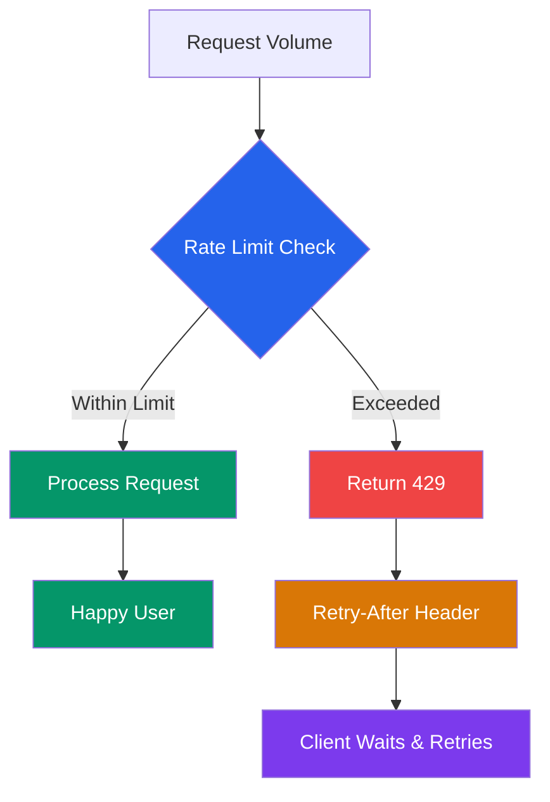
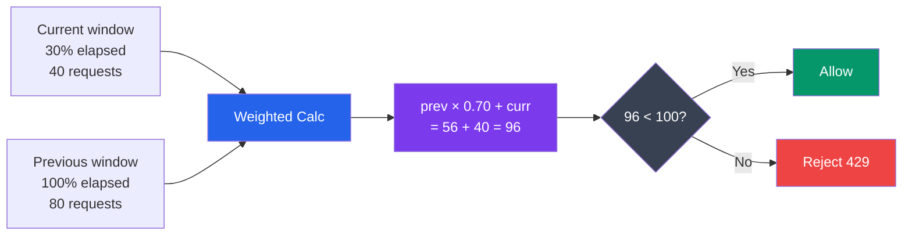
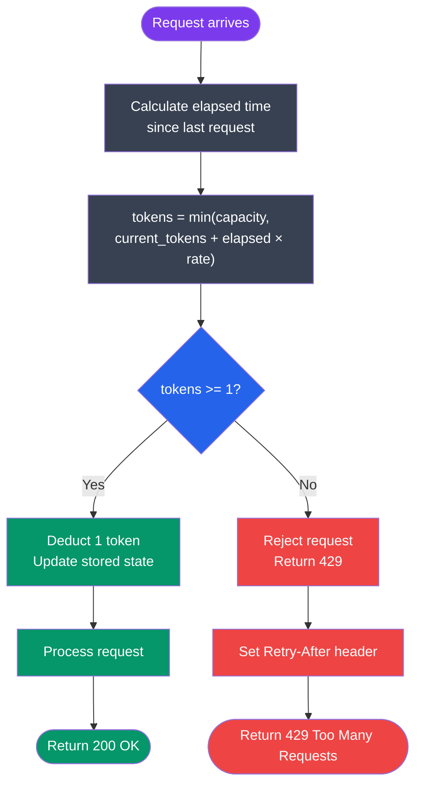
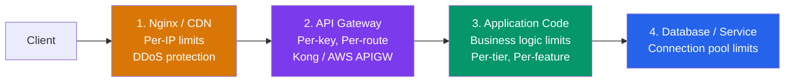
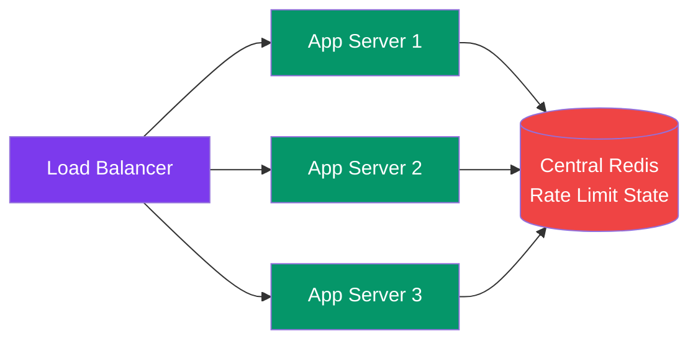
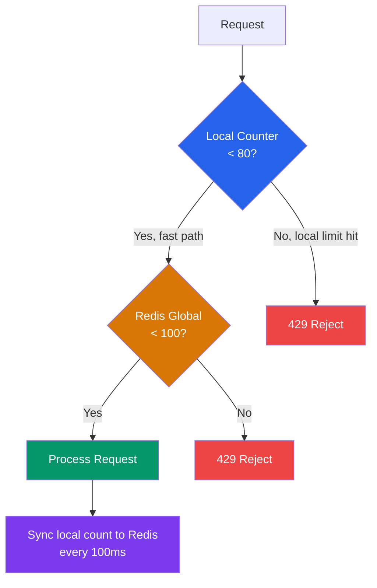
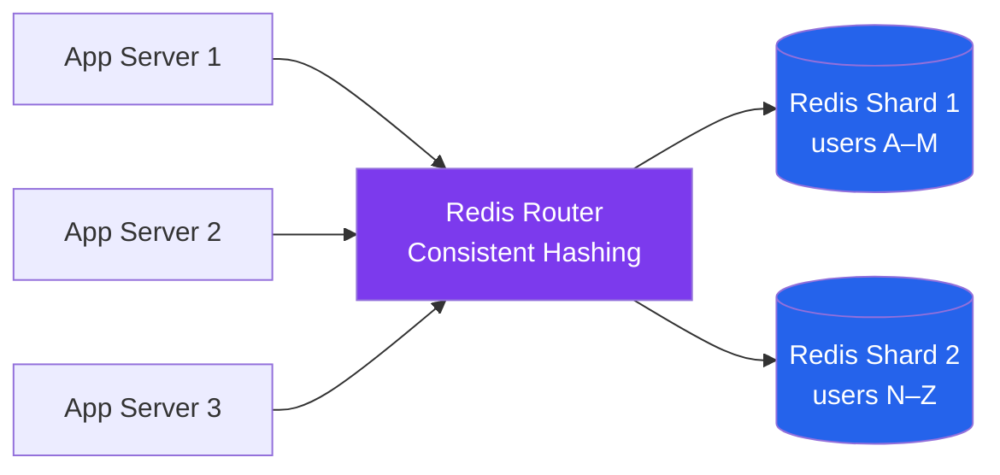
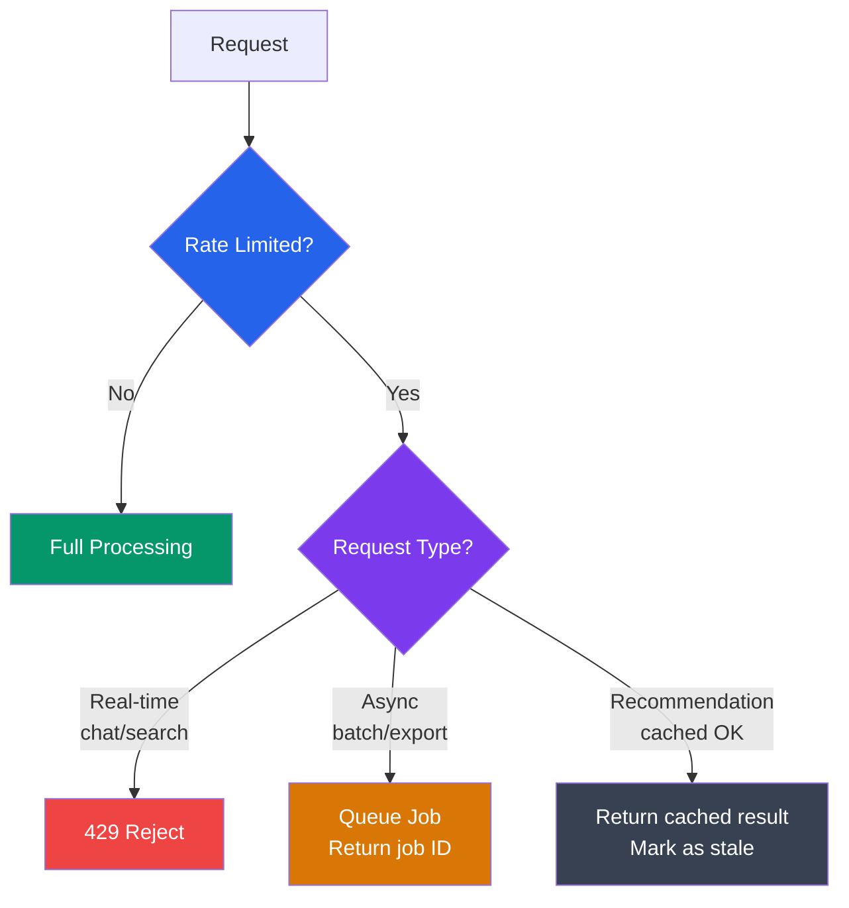
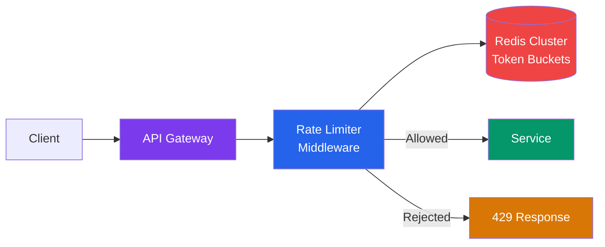

# Rate Limiting

> "Control is not a constraint — it is the foundation of reliability."

---

## What is Rate Limiting? (Analogy se samjho)

Imagine you walk into a McDonald's. The counter can handle 10 orders per minute — that's the max speed the kitchen can process. Now suppose 50 people rush the counter at once. What does the manager do? He puts up a sign: "Please wait — we will take your order in 2 minutes." The kitchen doesn't explode. The burgers still come out hot. Everyone eventually gets served (or told to come back later).

**Rate limiting is exactly this.** Your server is the McDonald's kitchen. Each API request is a hungry customer. Rate limiting is the counter staff saying "please wait" or "come back later" when traffic exceeds what the system can healthily handle.

Technically: rate limiting is a technique to **control the rate of requests** a client can make to a server within a defined time window. Exceed that limit, and you get a `429 Too Many Requests` response.

```
Without rate limiting:
──────────────────────
One angry user (or bot) sends 100,000 requests/second
├─ Server CPU: 100%
├─ Database overwhelmed — queries piling up
├─ Legitimate users: 503 Service Unavailable
└─ Your AWS bill: $10,000 in a single hour

With rate limiting:
────────────────────
Same user capped at 1,000 requests/minute
├─ Server: normal load
├─ Database: stable
├─ Legitimate users: happy
└─ Bill: under control
```

---

## Why Rate Limiting? (Yeh kyun important hai)

### 1. Prevent Abuse and DDoS Attacks

A Distributed Denial of Service (DDoS) attack is basically thousands of machines (or a botnet) hammering your server. Swiggy ke peak dinner time pe imagine karo — agar bots ne lakhs of fake orders daalna shuru kar diye, toh real customers ka order hi nahi process hoga.

Rate limiting caps what any single source can do, making DDoS expensive and ineffective.

### 2. Ensure Fair Usage

Zomato has millions of users. Without rate limiting, one power-user with a badly written script could consume 80% of API capacity, leaving everyone else slow. Rate limiting means one noisy neighbour cannot ruin the experience for others.

### 3. Cost Control (Especially for LLM APIs)

This one is critical in 2024+. If you are building on top of GPT-4, Claude, or Gemini — **every request costs real money**. A bug in a client app that sends requests in a tight loop can run up thousands of dollars in minutes. Instagram reels generation, Netflix recommendation APIs, AI chatbots — sab ke sab cost me hai. Rate limiting is a financial safety valve.

### 4. Protect Downstream Services

Your API calls your database, which calls a cache, which calls a third-party payment gateway. Each downstream service has its own capacity. Rate limiting at the API layer prevents cascading overloads.

### 5. Stop Accidental Runaway Clients

A developer writes a retry loop without exponential backoff. Their app crashes and retries 1000 times per second. Without rate limiting, this single buggy client can take down production. With rate limiting, the client gets 429s, the developer sees the error, and the system survives.



---

## Rate Limiting Dimensions (Kahan apply karte hain?)

Simple baat hai — rate limiting is not one-size-fits-all. Alag-alag scenarios mein alag-alag dimensions pe limit lagaate hain.

### 1. Per User / Per API Key (Most Common)

Each authenticated user or API key gets its own quota.

```
GitHub: 5,000 requests/hour per authenticated user
        60 requests/hour for unauthenticated

OpenAI: Varies by model + plan
        GPT-4: 10,000 tokens/minute on free tier
        GPT-4: 1,000,000 tokens/minute on enterprise
```

**Use when:** You want fair access per individual. Most REST APIs do this.

### 2. Per IP Address

Limit based on the client's IP address, no authentication required.

```
Cloudflare: blocks IPs sending > 10,000 req/10 seconds
Login page: max 5 login attempts per minute per IP (brute force protection)
```

**Use when:** You need to protect unauthenticated endpoints (login, signup, password reset).

**Problem:** NAT (Network Address Translation) — entire offices share one IP. 100 employees from the same office = 1 IP, so they all share one limit. Unfair!

### 3. Per Endpoint

Different endpoints have different costs. A search query is cheap. Generating a PDF report is expensive. Rate them differently.

```
GET  /api/feed          → 1000 req/min  (cheap read)
POST /api/send-sms      → 10 req/min    (costs money per SMS)
POST /api/export-report → 5 req/min     (CPU-intensive)
POST /api/ai/generate   → 20 req/min    (LLM costs $$$)
```

**Netflix karta hai yeh:** generating video recommendations is expensive, so it is rate-limited separately from browsing the UI.

### 4. Per Tenant (B2B SaaS)

In B2B products (like Razorpay, Stripe, Salesforce), your customer IS a company, not an individual. Each company ("tenant") gets its own quota. All users within that company share it.

```
Tenant: BigCorp (paid plan)    → 1,000,000 req/day
Tenant: SmallStartup (free)    → 10,000 req/day

Users within BigCorp share the 1,000,000 limit.
```

**Use when:** Building multi-tenant SaaS where pricing is per company.

### 5. Global Rate Limit

Your entire system — across all users — caps at some maximum to protect infrastructure.

```
Total system capacity: 100,000 req/second
If load exceeds this: shed traffic globally (circuit breaker or global throttle)
```

**Use when:** You have absolute infrastructure limits (database connection pool, third-party API quota, etc.).

### Dimension Summary

| Dimension | Granularity | Use Case | Trade-off |
|-----------|-------------|----------|-----------|
| Per IP | Coarse | Unauthenticated endpoints, DDoS | NAT problem |
| Per User | Fine | Fair individual quotas | Needs auth |
| Per API Key | Fine | Monetization, teams | Key management |
| Per Endpoint | Very fine | Cost-based protection | Complex config |
| Per Tenant | Medium | B2B SaaS | Tenant management |
| Global | Coarsest | Infrastructure limits | Over-restricts |

---

## Rate Limiting Algorithms (Yeh hai asli mazaa)

Five algorithms. Each has a different mental model, trade-off, and use case. Learn all five — interviewers LOVE this.

---

### Algorithm 1: Fixed Window Counter

**Analogy:** A movie hall sells 100 tickets per show. The show is 2 hours. Simple. If 100 tickets are sold, no more — wait for next show. The "window" is one show.

**How it works:**
1. Divide time into fixed windows (e.g., 1 minute each)
2. Maintain a counter per client per window
3. Each request increments the counter
4. If counter > limit → reject
5. When window expires → reset counter to 0

```
Time: ──────────────|──────────────|──────────────
       Window 1     |  Window 2    |  Window 3
       (0s – 60s)   |  (60s–120s)  |  (120s–180s)

Limit: 100 requests per window

Window 1: 99 requests  → all OK
Window 1: 100th req    → OK
Window 1: 101st req    → REJECTED (429)

Window 2 starts: counter resets to 0 — fresh start!
```

**The Boundary Problem (yeh important hai!):**

```
Window 1 ends at :60. Window 2 starts at :60.

Attacker sends:
  :59 → 100 requests (fills Window 1)
  :61 → 100 requests (fills Window 2)

Result: 200 requests pass in just 2 seconds!
Effective rate = 2x the limit at window boundaries!
```

This is called the "boundary burst" problem. The window boundary creates a blind spot.

```mermaid
gantt
    title Fixed Window Boundary Burst Problem
    dateFormat s
    axisFormat %S

    section Window 1
    100 requests at :59 :crit, a1, 59, 1s

    section Window 2
    100 requests at :61 :crit, a2, 61, 1s

    section Problem Zone
    200 requests in 2 seconds! :active, p1, 59, 2s
```

| Pros | Cons |
|------|------|
| Simple — one counter per key | Boundary burst allows 2x traffic |
| Minimal memory (1 integer per client) | Not smooth — spiky behavior |
| Fast: Redis INCR + EXPIRE | Stale state if Redis restarts |

**Interview tip:** Always mention the boundary burst problem when talking about fixed window. It shows you understand the weakness, not just the algorithm.

---

### Algorithm 2: Sliding Window Log

**Analogy:** A bouncers at a club keeps a notebook. Every person who enters, he writes down the time. When someone new wants to enter, he flips back exactly 60 minutes and counts how many names are written. If it's under 100, in you go. This is perfect accuracy — no blind spots.

**How it works:**
1. Maintain a log of timestamps for every request
2. When a new request arrives, remove all timestamps older than the window
3. Count remaining timestamps — if under limit, allow and add new timestamp

```
User log (timestamps): [10:00:01, 10:00:03, 10:00:45, 10:00:58, 10:01:02]

At 10:01:10, checking last 60 seconds:
├─ Remove entries before 10:00:10
│   → 10:00:01 and 10:00:03 removed
├─ Remaining: [10:00:45, 10:00:58, 10:01:02]
├─ Count = 3

Limit = 5 → allow this request, add 10:01:10 to log
Limit = 3 → REJECT (already at limit)
```

**Redis implementation:**
```
ZADD  rate:user:123  <timestamp>  <timestamp>    # Add request
ZREMRANGEBYSCORE rate:user:123  0  <now - 60s>   # Remove old
ZCARD rate:user:123                              # Count remaining
```

| Pros | Cons |
|------|------|
| Perfectly accurate — no boundary burst | High memory: stores all timestamps |
| Works for low-volume strict APIs | O(n) cleanup on every check |
| Simple logic to understand | Not practical for millions of users |

**Real-world note:** Sliding window log is used in low-volume, high-accuracy scenarios — like GitHub's webhook delivery retry system or financial audit APIs.

---

### Algorithm 3: Sliding Window Counter (Hybrid)

**Analogy:** You don't read every page of a book to estimate how many words are in it. You count words on one page, then multiply by total pages. It is an approximation — but 99% accurate and 100x faster. Sliding Window Counter is this approximation for rate limiting.

**Why it exists:** Sliding window log is too memory-heavy. Fixed window has boundary bursts. This is the best of both worlds.

**How it works:**
1. Keep counters for the current window and previous window
2. Calculate a weighted count: `prev_count × (1 - elapsed%) + current_count`
3. Compare weighted count against limit

```
Limit: 100 requests per minute
Current window: 30% elapsed, 40 requests so far
Previous window (full): 80 requests

Weighted count = 80 × (1 - 0.30) + 40
               = 80 × 0.70 + 40
               = 56 + 40
               = 96

96 < 100 → ALLOW this request

(The idea: in the last 60 seconds, ~70% of the previous window's requests are "still in scope")
```



| Pros | Cons |
|------|------|
| Low memory (only 2 counters per key) | Approximation — not exact |
| Smooth — boundary bursts greatly reduced | Slight over/under-counting at boundaries |
| Practical for large-scale systems | Slightly more complex than fixed window |

**Used by:** Cloudflare, many large API platforms use this for its sweet spot of accuracy vs efficiency.

---

### Algorithm 4: Token Bucket

**Analogy:** You have a bucket that can hold 10 coins. Every hour, someone drops coins in at a rate of 1 coin per 6 minutes. Each time you make an API call, you spend 1 coin. If you have no coins, you wait. If you saved coins overnight, you can spend a bunch quickly. This is Token Bucket — it allows bursts while enforcing a long-term rate.

**This is the most important algorithm. Learn it inside-out.**

**How it works:**
1. Bucket starts full with N tokens (bucket capacity)
2. Each request consumes 1 token
3. Tokens refill at a fixed rate (e.g., 10 tokens/second)
4. If bucket is empty → reject request (429)
5. Bucket never exceeds capacity — tokens don't accumulate past max

```
bucket_capacity = 100 tokens
refill_rate     = 10 tokens/second

t=0s:  bucket = 100 (full)
t=0s:  50 requests arrive instantly → bucket = 50  (all allowed)
t=0s:  60 more requests → 50 allowed (bucket empties), 10 REJECTED
t=5s:  5 seconds pass → +50 tokens → bucket = 50 (capped at 100)
t=5s:  30 requests → bucket = 20 (all allowed)
t=8s:  3 more seconds → +30 tokens → bucket = 50

Key insight:
- Short-term: bursts up to bucket_capacity are allowed
- Long-term: sustained rate cannot exceed refill_rate
```



**Real example — Swiggy:** Flash sales on Swiggy (like Republic Day 50% off coupons) cause massive bursts of orders. Token bucket handles this: allow a burst of orders to rush in at once, but the kitchen (backend) only processes orders at a steady rate long-term.

| Pros | Cons |
|------|------|
| Allows natural, controlled bursting | Two parameters to tune (capacity + rate) |
| Smooth long-term rate enforcement | State must be stored per user |
| Intuitive mental model | Distributed sync adds complexity |
| Industry standard for most APIs | Token refill calculation adds logic |

---

### Algorithm 5: Leaky Bucket

**Analogy:** Imagine a bucket with a small hole at the bottom. You can pour water in fast or slow — that's variable. But the water drips OUT at a constant, fixed rate through the hole. If you pour too much too fast, the bucket overflows (requests dropped). The output is always steady. Yeh hai Leaky Bucket.

**How it works:**
1. Requests enter a queue (the bucket) at any rate
2. Requests are processed from the queue at a fixed rate (the leak)
3. If queue is full → overflow → request dropped

```
Incoming:  ██████████████████ (bursty — variable)
           │
           ▼
          [  queue (capacity=10)  ]
           │
           ▼ fixed drip rate = 5 req/sec
Outgoing:  █ █ █ █ █ █ █ █    (steady — uniform)

If queue fills: new requests → DROPPED
```

**Key difference from Token Bucket:**
- Token Bucket: **output** can burst (10 tokens spend in 1 second)
- Leaky Bucket: **output** is always fixed (exactly 5 req/sec out, always)

**Use case:** Traffic shaping for video streaming. YouTube needs to send data to you at a steady bitrate — not in bursts. Leaky bucket smooths the output.

| Pros | Cons |
|------|------|
| Perfectly smooth output rate | Does NOT allow bursting |
| Great for rate-sensitive downstream | Queue adds latency |
| Protects slow backends | Requests can be queued or dropped |
| Network traffic shaping | Queue management complexity |

---

### Algorithm Comparison Table

| Algorithm | Memory | Allows Burst | Output Smooth | Accuracy | Complexity | Best For |
|-----------|--------|--------------|---------------|----------|------------|----------|
| Fixed Window | Low | Yes (2x at edge) | No | Good | Low | Simple APIs, internal services |
| Sliding Log | High | No | Yes | Perfect | Medium | Low-volume, strict APIs |
| Sliding Counter | Low | Minimal | Yes | ~99% | Medium | Large-scale APIs |
| Token Bucket | Low | Yes (controlled) | Yes | Good | Medium | Most production APIs |
| Leaky Bucket | Low | No | Perfect | Good | Medium | Traffic shaping, streaming |

**Rule of thumb:**
- Most APIs → **Token Bucket** (burst-friendly, industry standard)
- Strict metering / billing → **Sliding Window Counter**
- Even output for streaming → **Leaky Bucket**
- Quick prototype → **Fixed Window** (then upgrade later)

---

## Implementation with Redis

Redis is the go-to store for rate limiting state — it is fast (in-memory), has atomic operations, and supports TTL natively. Basically Redis + rate limiting = made for each other.

### Fixed Window: INCR + EXPIRE

```python
def is_rate_limited(user_id: str, limit: int, window_seconds: int) -> bool:
    key = f"rate:user:{user_id}:{int(time.time() // window_seconds)}"

    # Pipeline for atomicity
    pipe = redis.pipeline()
    pipe.incr(key)
    pipe.expire(key, window_seconds)
    count, _ = pipe.execute()

    return count > limit
```

**Problem:** INCR and EXPIRE are two commands — non-atomic. In theory, INCR can succeed and EXPIRE can fail (if Redis crashes between them), leaving a key that never expires. Use Lua script for true atomicity.

### Sliding Window Log: Sorted Sets

```python
def is_rate_limited_sliding(user_id: str, limit: int, window_ms: int) -> bool:
    now = int(time.time() * 1000)  # milliseconds
    window_start = now - window_ms
    key = f"rate:log:{user_id}"

    pipe = redis.pipeline()
    pipe.zremrangebyscore(key, 0, window_start)  # Remove old entries
    pipe.zadd(key, {str(now): now})              # Add current timestamp
    pipe.zcard(key)                              # Count entries
    pipe.expire(key, window_ms // 1000 + 1)
    results = pipe.execute()

    count = results[2]
    return count > limit
```

### Token Bucket: Lua Script (Atomic)

Lua scripts run atomically in Redis — no race conditions between check and update.

```lua
-- Redis Lua script for token bucket
-- KEYS[1] = rate limit key
-- ARGV[1] = bucket capacity
-- ARGV[2] = refill rate (tokens per second)
-- ARGV[3] = current timestamp (seconds, float)
-- ARGV[4] = tokens requested

local key = KEYS[1]
local capacity    = tonumber(ARGV[1])
local refill_rate = tonumber(ARGV[2])
local now         = tonumber(ARGV[3])
local requested   = tonumber(ARGV[4])

-- Get current bucket state
local bucket = redis.call('HMGET', key, 'tokens', 'last_refill')
local tokens     = tonumber(bucket[1]) or capacity
local last_refill = tonumber(bucket[2]) or now

-- Calculate how many tokens to add
local elapsed   = now - last_refill
local new_tokens = math.min(capacity, tokens + elapsed * refill_rate)

if new_tokens >= requested then
    -- Allow: consume tokens
    redis.call('HMSET', key,
        'tokens', new_tokens - requested,
        'last_refill', now)
    redis.call('EXPIRE', key, 3600)
    return {1, math.floor(new_tokens - requested)}  -- allowed, tokens remaining
else
    -- Reject: update refill time but don't consume
    redis.call('HMSET', key, 'tokens', new_tokens, 'last_refill', now)
    return {0, math.floor(new_tokens)}  -- rejected, tokens available
end
```

### Redis Cell Module (Production Shortcut)

If you can install Redis modules, `redis-cell` implements token bucket natively:

```
CL.THROTTLE user:123  99  100  60  1
             key    max  rate  period  cost

Returns: [0, 100, 99, -1, 0]
          ^   ^    ^   ^   ^
          |   |    |   |   └─ retry after seconds (-1 = allowed)
          |   |    |   └─ seconds until bucket full
          |   |    └─ tokens remaining
          |   └─ total limit
          └─ 0=allowed, 1=rejected
```

Single atomic command. Production-ready. Used by many companies.

---

## Where to Implement Rate Limiting

### The Four Layers



### Layer 1: CDN / Nginx (Network Edge)

Rate limit at the very edge — before traffic hits your application at all.

```nginx
# Nginx rate limiting
http {
    limit_req_zone $binary_remote_addr zone=api:10m rate=100r/m;

    server {
        location /api/ {
            limit_req zone=api burst=20 nodelay;
            limit_req_status 429;
        }
    }
}
```

- Pros: No application code changes. Extremely fast.
- Cons: Only per-IP, no business logic (can't differentiate free vs paid users).

### Layer 2: API Gateway

```
Internet → [Kong / AWS API Gateway / Traefik] → [Microservices]

Kong plugin config:
{
  "name": "rate-limiting",
  "config": {
    "minute": 1000,
    "policy": "redis",
    "redis_host": "redis.internal"
  }
}
```

- Pros: Centralized. Language-agnostic. Per-route, per-consumer, per-plan.
- Cons: Adds a hop. Vendor lock-in for managed services.

### Layer 3: Application Code

```python
# Django middleware example
class RateLimitMiddleware:
    def __init__(self, get_response):
        self.get_response = get_response

    def __call__(self, request):
        user_id = request.user.id if request.user.is_authenticated else None
        ip = request.META.get('REMOTE_ADDR')
        key = f"rate:{user_id or ip}"

        count = cache.incr(key, default=0)
        if count == 1:
            cache.expire(key, 60)

        if count > 1000:
            response = HttpResponse(status=429)
            response['Retry-After'] = '60'
            response['X-RateLimit-Limit'] = '1000'
            response['X-RateLimit-Remaining'] = '0'
            return response

        response = self.get_response(request)
        response['X-RateLimit-Remaining'] = str(max(0, 1000 - count))
        return response
```

- Pros: Full access to business logic (subscription tier, user type).
- Cons: Must implement in every service. Can be bypassed by direct service calls.

### Layer 4: Service Mesh (Istio / Envoy)

```yaml
# Istio rate limit example
apiVersion: networking.istio.io/v1alpha3
kind: EnvoyFilter
spec:
  configPatches:
  - applyTo: HTTP_FILTER
    match:
      context: SIDECAR_INBOUND
    patch:
      operation: INSERT_BEFORE
      value:
        name: envoy.filters.http.local_ratelimit
        typed_config:
          token_bucket:
            max_tokens: 1000
            tokens_per_fill: 100
            fill_interval: 60s
```

- Pros: Works at service-to-service level. No app code changes.
- Cons: Complex to configure. Requires service mesh infrastructure.

---

## Distributed Rate Limiting: The Hard Part

Single server rate limiting is easy. When you have 10 app servers, it becomes interesting. Yeh hai jahan real engineers struggle karte hain.

### The Problem

```
Load Balancer distributes traffic across 3 servers:

Without shared state:
  Server 1: user has 80 requests this minute → allow (thinks limit is 100)
  Server 2: user has 80 requests this minute → allow (thinks limit is 100)
  Server 3: user has 80 requests this minute → allow (thinks limit is 100)

Reality: User sent 240 requests. Limit was 100!
```

Each server only knows about the requests IT received — no shared state.

### Solution 1: Centralized Redis

All servers check and update the same Redis instance.



- Pros: Exact rate limiting. Single source of truth.
- Cons: Redis becomes a bottleneck. Every request needs a Redis round-trip (~1ms). At 100,000 req/sec, Redis can handle it — but it is a SPOF.

### Solution 2: Two-Layer (Local + Central)

**The best production approach.** Local in-memory counter for speed + central Redis for accuracy.

```
Each server keeps a LOCAL counter (approx):
  Server 1: local count = 30 (real = some portion of total)
  Periodically sync to Redis every 100ms

Global Redis counter = 95 (true aggregate)

If local count > local_threshold → fast reject (no Redis hit)
Else → check Redis for exact count
```



**Trade-off:** You might allow slightly more than the limit during the sync window — but at massive scale, ~1% overage is acceptable. No system-wide bottleneck.

### Solution 3: Redis Cluster (Sharding)

For extreme scale, shard rate limit state across multiple Redis nodes:

```
Redis Shard 1: user IDs A–M
Redis Shard 2: user IDs N–Z

CRC32(user_id) % num_shards → determines which Redis to hit
```

- Pros: Linear scalability, no single SPOF.
- Cons: Cross-shard operations don't exist — global limits cannot be computed exactly.



---

## Rate Limit Response: What to Return

When a client is rate-limited, you owe them a good response. Bas 429 return karke mat chhordo — bata bhi do ki kya karna chahiye.

### HTTP Status Code

```
429 Too Many Requests
```

That's it. RFC 6585 defines it. Always 429 — not 503 (that's server error), not 403 (that's forbidden).

### Response Headers

```http
HTTP/1.1 429 Too Many Requests
Content-Type: application/json
Retry-After: 47
X-RateLimit-Limit: 1000
X-RateLimit-Remaining: 0
X-RateLimit-Reset: 1706745660

{
  "error": "rate_limit_exceeded",
  "message": "Too many requests. Please retry after 47 seconds.",
  "retry_after": 47
}
```

| Header | Value | Meaning |
|--------|-------|---------|
| `X-RateLimit-Limit` | `1000` | Max requests allowed in the window |
| `X-RateLimit-Remaining` | `0` | Requests left in current window |
| `X-RateLimit-Reset` | Unix timestamp | When the window resets (absolute) |
| `Retry-After` | Seconds | How long to wait before retrying |
| `X-RateLimit-Policy` | `1000;w=3600` | Machine-readable policy (IETF draft) |

**Also send these on 200 OK responses:**

```http
HTTP/1.1 200 OK
X-RateLimit-Limit: 1000
X-RateLimit-Remaining: 847
X-RateLimit-Reset: 1706745660
```

Clients can read these on every response and slow down proactively — before hitting the limit. This is great UX.

### Why Retry-After Matters

```
Without Retry-After:
  Client hits 429 → immediately retries → 429 → retry → 429...
  Thundering herd when window resets: 1000 clients all hit at :00

With Retry-After:
  Client hits 429 → waits 47 seconds → retries once → succeeds
  Traffic is naturally spread out after window reset
```

Well-behaved clients (good SDKs, Postman, curl) respect `Retry-After` and implement exponential backoff. Badly behaved clients will still hammer — hence you need server-side limits regardless.

---

## Real World Rate Limits (Actual Numbers)

### GitHub API

```
Authenticated users:   5,000 requests/hour
Unauthenticated:         60 requests/hour
GitHub Actions:        1,000 requests/hour per repository
Search API:               30 requests/minute (authenticated)
                          10 requests/minute (unauthenticated)
```

Headers returned:
```http
X-RateLimit-Limit: 5000
X-RateLimit-Remaining: 4923
X-RateLimit-Reset: 1706745660
X-RateLimit-Used: 77
X-RateLimit-Resource: core
```

### Twitter / X API

```
Free tier:       500 tweets/month (write)
Basic tier:      3,000 tweets/month
Pro tier:        300,000 tweets/month
Search API:      1 request/second (free), 450 req/15 min (basic)
```

### OpenAI API (GPT-4)

```
Tier 1 (new users):    500 RPM, 10,000 TPM
Tier 4 (established):  10,000 RPM, 300,000 TPM
Enterprise:            Custom

RPM = Requests Per Minute
TPM = Tokens Per Minute (both input + output count!)
```

### Zomato / Swiggy (Internal — estimated)

Public-facing APIs on their developer platforms are not published, but internally:
- Menu fetch: ~100 req/min per user session
- Order placement: ~5 req/min per user (prevents double ordering)
- Search: ~60 req/min per user

---

## Graceful Degradation vs Hard Rejection

Jab rate limit hit ho — do you immediately reject, or can you be smarter?

### Option 1: Hard Rejection (Immediate 429)

```
Request arrives → limit exceeded → 429 returned immediately

Pro: Simple, predictable
Con: Bad UX for bursty legitimate traffic
```

### Option 2: Queue the Request

```
Request arrives → limit exceeded → add to queue → process when slot opens

Pro: Better UX, no wasted requests
Con: Adds latency, queue can grow unbounded, memory pressure
```

**When to queue:** For tasks that can tolerate delay (async jobs, report generation, bulk exports). Queue it and return a job ID — client polls for result.

**When to reject immediately:** For real-time interactions (chat messages, search queries, checkout). Users cannot wait 30 seconds for a search result.

### Option 3: Degrade Quality

```
Request arrives → limit exceeded → return cached/lower-quality result

Example: Instead of fresh AI recommendation → return cached recommendation from 1 hour ago
```

YouTube does this: during peak load, it may serve slightly stale recommendations rather than computing fresh ones. The user barely notices.



---

## Hybrid Rate Limiting Strategy (Production Pattern)

In production, you never use one strategy alone. Layers pe layers hoti hain — like security in depth.

### Instagram's Hypothetical Rate Limit Stack

```
Layer 1: CloudFlare/CDN
  → Block IPs with > 10,000 req/10 seconds (DDoS)

Layer 2: Nginx
  → 1,000 req/min per IP for all endpoints
  → 10 req/min per IP for /login (brute force)

Layer 3: API Gateway (Kong)
  → 5,000 req/hour per authenticated user
  → 60 req/hour for unauthenticated

Layer 4: Application Code
  → 10 req/min per user for POST /comment (spam prevention)
  → 5 req/min per user for POST /dm (messaging abuse)
  → 100 req/min per user for GET /feed (reads are cheap)

Layer 5: Endpoint-specific
  → POST /api/story/publish: 20/day per user
  → POST /api/report/user: 10/day per user
```

This is defense in depth. If one layer fails or is bypassed, others still hold.

---

## Rate Limiting for B2B SaaS (Per-Tenant Design)

Razorpay, Stripe, Twilio — these are B2B SaaS platforms. Their customers are OTHER companies, not individual users. Rate limiting needs to be at the tenant level.

```
Razorpay API customer: BigRetailer (Enterprise plan)
→ 10,000 payment API calls/minute
→ All BigRetailer developers share this quota
→ BigRetailer's CTO can see quota usage in dashboard

Razorpay API customer: SmallStore (Starter plan)
→ 100 payment API calls/minute
→ Can upgrade plan to increase quota
```

**Implementation:**

```python
def rate_limit_check(api_key: str, endpoint: str) -> bool:
    # Look up tenant and plan from API key
    tenant = db.get_tenant_by_api_key(api_key)
    plan_limits = PLAN_LIMITS[tenant.plan]
    endpoint_limit = plan_limits.get(endpoint, plan_limits['default'])

    key = f"rate:tenant:{tenant.id}:{endpoint}:{current_window()}"
    count = redis.incr(key)
    if count == 1:
        redis.expire(key, WINDOW_SECONDS)

    return count > endpoint_limit

PLAN_LIMITS = {
    'starter':    {'default': 100, '/payments': 50},
    'growth':     {'default': 1000, '/payments': 500},
    'enterprise': {'default': 10000, '/payments': 5000},
}
```

---

## Common Pitfalls and How to Avoid Them

### Pitfall 1: Race Condition in INCR + EXPIRE

```python
# WRONG — non-atomic, EXPIRE can fail
count = redis.incr(key)
redis.expire(key, 60)  # If server crashes here, key never expires!

# RIGHT — use pipeline or Lua
pipe = redis.pipeline()
pipe.incr(key)
pipe.expire(key, 60)
pipe.execute()  # Atomic pipeline
```

### Pitfall 2: Clock Skew in Distributed Systems

Different servers have slightly different clocks. For sliding window algorithms that use timestamps, this causes subtle bugs.

**Fix:** Use Redis server time (`TIME` command) instead of application server time. Redis is the source of truth.

```lua
local now = redis.call('TIME')  -- Returns [seconds, microseconds]
local timestamp = tonumber(now[1]) * 1000 + math.floor(tonumber(now[2]) / 1000)
```

### Pitfall 3: Key Expiry Not Set

If you forget to set TTL on rate limit keys, Redis fills up with stale counters forever.

**Fix:** Always set TTL. For token bucket keys, set TTL to at least one full refill cycle.

### Pitfall 4: Using Strings as Keys (Collision Risk)

```python
# WRONG — user "123" and endpoint "456" can collide
key = user_id + endpoint

# RIGHT — use structured keys with separators
key = f"rl:user:{user_id}:endpoint:{endpoint}:window:{window}"
```

### Pitfall 5: Not Handling Redis Failures

What happens when Redis is down? You have two choices:

```python
try:
    is_limited = check_rate_limit(redis, user_id)
except RedisConnectionError:
    # Fail open: allow the request (might get abused)
    is_limited = False
    # OR
    # Fail closed: reject all requests (safe but breaks the app)
    is_limited = True
```

**Best practice:** Fail open (allow requests) when Redis is down. Use a secondary in-memory counter as fallback. A few extra requests during Redis downtime is better than taking down your entire service.

---

## Rate Limiting in the Interview Room

Here is how a typical rate limiting system design question plays out:

**Q: "Design a rate limiter for a REST API serving 10 million users."**

**Step 1: Clarify requirements**
```
- What type of limits? Per user? Per IP? Per endpoint?
- What scale? 10M users, what's peak RPS?
- What algorithm? Do they care about burst tolerance?
- Where to implement? API gateway or application code?
- Distributed? How many app servers?
- Consistency requirement? Exact or approximate?
```

**Step 2: High-level design**



**Step 3: Algorithm choice**

"I'd use Token Bucket because it allows short bursts — real users have bursty patterns — while enforcing a long-term rate. It's also the most commonly used in production."

**Step 4: Redis implementation**

"I'd store token bucket state in Redis as a HASH with `tokens` and `last_refill` fields. I'd use a Lua script for atomic read-modify-write. For very high scale, I'd use Redis Cluster sharded by user ID."

**Step 5: Distributed consideration**

"With 10 servers, every request hitting Redis adds ~1ms latency. For ultra-high throughput, I'd use a two-layer approach: local in-memory counter (approximate) + Redis (exact), syncing every 100ms. This trades ~1% overage for much better performance."

**Step 6: Response**

"On rate limit, return 429 with Retry-After and X-RateLimit-* headers so clients back off gracefully instead of hammering."

---

## Common Interview Questions

### Conceptual

1. **What is the difference between rate limiting and throttling?**
   Rate limiting is a hard cap (reject after N requests). Throttling is slowing down responses without hard rejection (return responses slowly, add artificial delays). In practice, the terms are often used interchangeably.

2. **Which rate limiting algorithm would you choose and why?**
   Token Bucket for most APIs — allows bursts, intuitive, industry standard. Leaky Bucket for strict output shaping (streaming, metered queues). Sliding Window Counter when exact metering is needed at scale.

3. **How does rate limiting differ from circuit breaking?**
   Rate limiting protects against too many requests FROM a client. Circuit breaking protects against failures in a DOWNSTREAM dependency — it "opens the circuit" when error rate exceeds threshold, stopping calls to a struggling service.

4. **How would you rate limit a user who rotates IPs?**
   Switch to per-user authentication-based limiting. If they try to use multiple accounts, use device fingerprinting, behavior analysis, or require payment/phone verification which limits account creation.

5. **What are the risks of setting rate limits too low?**
   Legitimate users get blocked. Heavy users (power users, automation scripts for valid use) are frustrated. In B2B SaaS, angry enterprise customers. Too strict limits hurt product growth.

### Implementation

6. **Why use a Lua script for token bucket in Redis?**
   The read (get tokens) → calculate → write (update tokens) sequence must be atomic. Without atomicity, two concurrent requests could both read the same token count, both think there are enough tokens, and both consume — causing over-consumption. Lua scripts run as a single atomic unit in Redis.

7. **How would you handle rate limiting when Redis is down?**
   Fail open (allow requests) with an in-memory fallback counter. Accept that a small window of over-requests is better than a complete service outage. Alert on Redis failures, fix quickly.

8. **Design rate limiting for an SMS OTP endpoint.**
   Multiple layers: per-phone-number (5 OTPs/day, 1/minute), per-IP (20 OTPs/hour), per-user (if logged in, 3/hour). This prevents OTP bombing attacks where someone spams another person's phone. Use the most restrictive applicable limit.

9. **How would you implement per-tenant rate limiting in a microservices architecture?**
   Centralize in the API Gateway. API key maps to tenant + plan. Gateway maintains per-tenant counters in Redis. Each service does not need to know about rate limiting — it just processes valid requests.

10. **What is the thundering herd problem in rate limiting?**
    When a rate limit window resets, all blocked clients retry simultaneously — creating a new spike. Fix: add jitter to Retry-After (random offset so not all clients retry at exact same second). Fix: sliding window doesn't have this problem because the reset is gradual.

### Architecture

11. **How does Cloudflare do rate limiting at massive scale?**
    Cloudflare uses approximate counters with distributed state. They accept slight inaccuracy (allowing ~10% over limit) in exchange for not needing global coordination. Each PoP (Point of Presence) manages local counters. Good enough protection at millions of RPS.

12. **How would you rate limit a GraphQL API?**
    GraphQL is tricky — one HTTP request can contain many operations. Options: (a) rate limit by HTTP request, (b) rate limit by query complexity score (calculated from field depth/count), (c) rate limit by time (total CPU time consumed). Query complexity scoring is the most accurate.

---

## Key Takeaways

```
╔══════════════════════════════════════════════════════════════════════╗
║                    RATE LIMITING — KEY TAKEAWAYS                     ║
╠══════════════════════════════════════════════════════════════════════╣
║                                                                      ║
║  WHY                                                                 ║
║  • Prevent abuse, DDoS, and runaway clients                          ║
║  • Control costs (LLM APIs, SMS, etc.)                               ║
║  • Ensure fair usage across all users                                ║
║                                                                      ║
║  ALGORITHMS                                                          ║
║  • Fixed Window: simple, but 2x boundary burst problem               ║
║  • Sliding Log: perfect accuracy, too memory-heavy for scale         ║
║  • Sliding Counter: best accuracy + memory balance for large scale   ║
║  • Token Bucket: industry standard, burst-friendly, intuitive        ║
║  • Leaky Bucket: smooth output, no bursts, for traffic shaping       ║
║                                                                      ║
║  IMPLEMENTATION                                                      ║
║  • Redis is the standard backend for distributed rate limit state    ║
║  • Always use Lua scripts for atomicity (no race conditions)         ║
║  • Two-layer (local + Redis) for extreme scale                       ║
║                                                                      ║
║  RESPONSE                                                            ║
║  • Always return 429 Too Many Requests                               ║
║  • Always include Retry-After header                                 ║
║  • Include X-RateLimit-Limit, Remaining, Reset on every response     ║
║                                                                      ║
║  ARCHITECTURE                                                        ║
║  • Layer your limits: IP (edge) → Gateway → App code → Endpoint     ║
║  • For B2B SaaS: per-tenant limits tied to pricing plans             ║
║  • Fail open when Redis is down — don't take down production         ║
║                                                                      ║
║  INTERVIEW                                                           ║
║  • Start with WHY (abuse, cost, fairness) before HOW                 ║
║  • Token Bucket is usually the right answer                          ║
║  • Mention distributed coordination as the hard problem              ║
║  • Boundary burst problem in Fixed Window = shows depth              ║
║                                                                      ║
╚══════════════════════════════════════════════════════════════════════╝
```

---

## Next Steps

Continue to [Circuit Breaker](../21-circuit-breaker/README.md) to learn how to protect services from cascading failures when a downstream dependency is struggling.

---

**Primary Takeaway:** Rate limiting is your first line of defence — use Token Bucket + Redis for most production systems, layer your limits at multiple points in the stack, and always return Retry-After so well-behaved clients back off gracefully instead of thundering back.
