# Circuit Breaker Pattern

> **Simple baat hai**: One slow service can kill your entire application. Circuit Breaker is the pattern that stops this from happening. It is one of the most important resilience patterns in distributed systems — and one of the most frequently asked about in system design interviews.

---

## The Analogy: Your Home's Electrical Circuit Breaker

Imagine the electrical circuit breaker in your home.

When you plug in too many appliances — AC, geyser, microwave, all at once — the current flowing through the wire becomes dangerously high. If nothing stopped it, the wire would overheat and start a fire.

That is where the circuit breaker comes in. It detects the excess current, **trips** (switches off), and cuts the power. Your entire house does not burn down. You go to the fuse box, fix the problem (turn off some appliances), and **manually reset** the breaker. Power comes back.

Key insight: **the breaker does not keep trying to push power through a dangerous wire. It stops immediately. It waits. Then it allows power again only after you signal it is safe.**

Now apply this to software.

Your "wire" is the connection between two services. Your "too much current" is too many failing requests to a slow or down service. The Circuit Breaker in software works exactly the same way:

- **Detects** that a downstream service is failing
- **Trips open** — stops sending requests to that service immediately
- **Waits** for a timeout period
- **Tests** cautiously (half-open state) to see if the service recovered
- **Closes again** if everything looks good

Simple? Yes. Lifesaving in production? Absolutely.

---

## The Problem: Cascading Failures

Yeh samjho pehle — asal problem kya hai.

### Service A depends on B depends on C

In a microservices architecture, services call other services. This is normal. But when one service gets slow or goes down, the failure can propagate upward and take down everything. This is called a **cascading failure**.

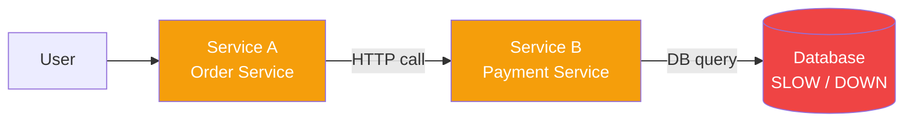

Here is what happens, step by step, when the database becomes slow:

### Step-by-step Cascade (Without Circuit Breaker)

```
t=0s   — Database starts responding slowly (500ms → 30s per query)

t=1s   — Payment Service threads start waiting for DB
         Thread 1: waiting...
         Thread 2: waiting...
         ...

t=5s   — Payment Service thread pool (say 50 threads) = 45 used, all waiting

t=10s  — Order Service calls Payment Service.
         Payment Service is not responding fast.
         Order Service threads start waiting.
         Thread 1: waiting for Payment...
         Thread 2: waiting for Payment...

t=20s  — Order Service thread pool: 50/50 used, all blocked

t=25s  — New user requests come in to Order Service.
         No threads available. Requests queue up.
         Queue fills up → requests start failing.

t=30s  — API Gateway's connection pool to Order Service fills up.
         Health checks start failing.
         Load Balancer sees errors and retries → MORE load.

t=35s  — API Gateway starts returning 503 to users.
         All users see "Service Unavailable".

t=40s  — PagerDuty fires. On-call engineer wakes up at 3am. :(
```

One slow database → entire system down. Yeh hai cascading failure.

### Real-world Example: The Zomato Scenario

Imagine Zomato's order flow:

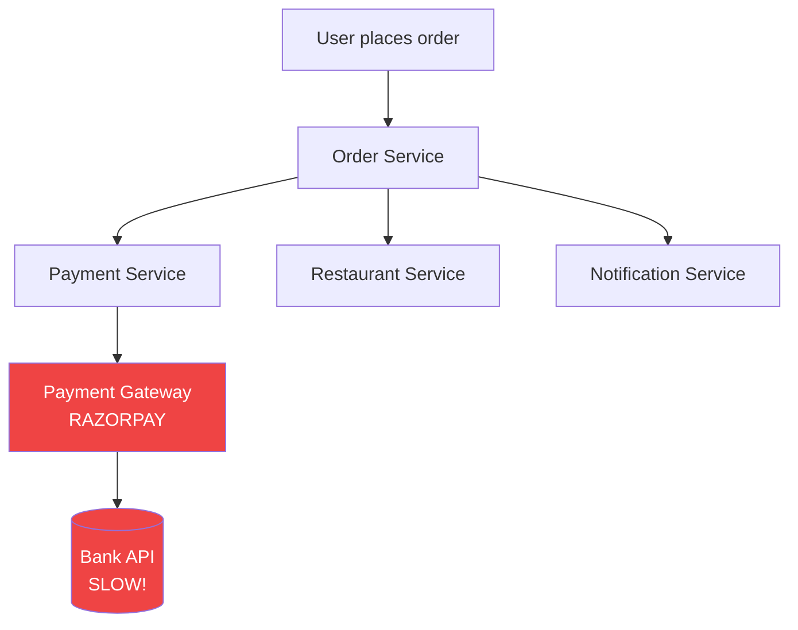

If Bank API becomes slow:
- Payment Gateway starts hanging
- Payment Service threads fill up
- Order Service, which calls Payment Service, starts hanging
- Notification Service (called by Order Service) also gets starved of threads
- Restaurant Service calls fail
- User sees spinning loader forever
- Eventually 503

The bank's problem became Zomato's problem. **Without circuit breakers, a third-party dependency can take down your entire platform.**

---

## The Solution: Circuit Breaker Pattern

Ab solution dekho. Simple aur elegant.

The Circuit Breaker pattern wraps every call to a potentially-failing service. It acts as a **proxy** that monitors the health of the calls and decides whether to let them through or fail fast.

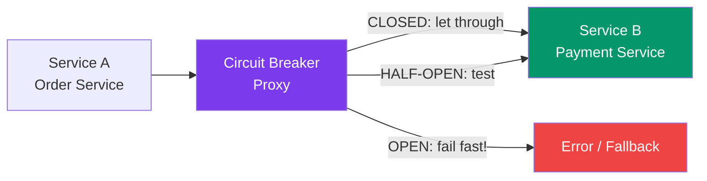

The Circuit Breaker has **three states**. This is the core of the pattern.

---

## The Three States: State Machine

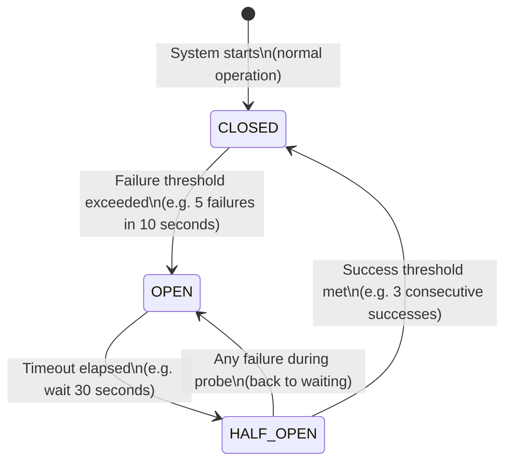

Let us go through each state in deep detail.

---

## State 1: CLOSED (Normal Operation)

### What it means

CLOSED means the circuit is **closed** — current (requests) flows through normally. This is the happy path. Everything is working.

Think of it like a closed electrical circuit where electricity flows freely.

### What happens here

- Every request passes through to the downstream service
- The circuit breaker **counts failures** in a sliding time window
- As long as failures stay below the threshold, it stays CLOSED
- When failures cross the threshold → **TRIPS to OPEN**

```
CLOSED state — traffic flows normally:

Request ──► [CB: CLOSED] ──► Payment Service ──► Response
Request ──► [CB: CLOSED] ──► Payment Service ──► Response
Request ──► [CB: CLOSED] ──► Payment Service ──► Response

CB is tracking internally:
  window: last 10 seconds
  total calls: 20
  failures: 2
  failure rate: 10%
  threshold: 50%
  status: under threshold → STAY CLOSED
```

### What counts as a failure?

Not every error should trip the circuit. You configure which errors count:

| Error Type | Count as Failure? | Why |
|---|---|---|
| Network timeout | Yes | Service is unresponsive |
| 5xx HTTP errors | Yes | Server-side error |
| Connection refused | Yes | Service is down |
| 4xx HTTP errors | No | Client bug, not service fault |
| Business logic errors | No | Service is healthy, just rejecting |

---

## State 2: OPEN (Tripped — Fail Fast)

### What it means

OPEN means the circuit is **open** — no current flows. Just like a tripped electrical breaker. Requests are **immediately rejected** without even attempting to reach the downstream service.

### Why this is powerful

Yeh kyun important hai — think about it.

When a service is down, every request that tries to reach it:
1. Waits for the connection timeout (3-5 seconds)
2. Then gets an error
3. The caller's thread is blocked for that entire time

With OPEN circuit breaker:
1. Request comes in
2. CB immediately returns error — **in under 1 millisecond**
3. Caller thread is free immediately

Thread savings = massive. This is what stops the cascade.

```
OPEN state — requests rejected immediately, no downstream calls:

Request 1 ──► [CB: OPEN] ──X──► Payment Service (no call made!)
                    │
                    ▼
             Instant error/fallback returned
             Latency: ~1ms instead of 30s

Request 2 ──► [CB: OPEN] ──X──► (no call made)
Request 3 ──► [CB: OPEN] ──X──► (no call made)

Meanwhile:
  - Payment Service gets zero traffic → can recover
  - Order Service threads are free → can handle other requests
  - System is degraded but NOT dead
  
Timeout countdown running: 30 seconds...
```

### What does the caller get?

The caller (your service) receives a fast error. What you do with that is up to you (see Fallback Strategies section). But critically, you get it **fast** — not after a 30-second timeout.

---

## State 3: HALF-OPEN (Testing Recovery)

### What it means

After the OPEN timeout expires, the circuit breaker enters HALF-OPEN. This is the "cautious probe" state.

Analogy: After the flood warning ends, you don't immediately open all the floodgates. You open just a small valve, see if the river level is safe, then slowly open more.

### How it works

- A **limited number** of test requests are allowed through
- If they succeed → move to CLOSED (service recovered)
- If even one fails → move back to OPEN (still broken, wait longer)

```
HALF-OPEN state — only a few test requests pass through:

Request 1 ──► [CB: HALF-OPEN] ──► Payment Service ──► SUCCESS ✓
Request 2 ──► [CB: HALF-OPEN] ──► Payment Service ──► SUCCESS ✓
Request 3 ──► [CB: HALF-OPEN] ──► Payment Service ──► SUCCESS ✓
              ─────────────────────────────────────────────
              3/3 successes → success_threshold met → CLOSED!
              Normal traffic resumes.

              OR:

Request 1 ──► [CB: HALF-OPEN] ──► Payment Service ──► FAILURE ✗
              ─────────────────────────────────────────────
              First failure → immediately back to OPEN
              Timeout resets (another 30 seconds)
```

### Why this three-state design is smart

Without HALF-OPEN, you'd have a binary choice:
- Keep the circuit OPEN forever (never recovers automatically)
- Switch back to CLOSED after timeout and risk a thundering herd of requests hitting a partially-recovered service

HALF-OPEN is the elegant middle ground. It lets you **validate recovery** before fully opening the floodgates.

---

## Full Flow: With vs Without Circuit Breaker

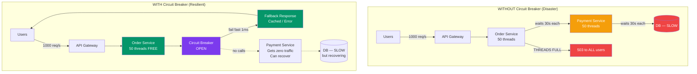

---

## Configuration Thresholds: Tuning the Circuit Breaker

Yeh numbers matter karte hain. Wrong configuration = circuit breaker is either useless or too aggressive.

### The Key Parameters

| Parameter | What it Controls | Example Value |
|---|---|---|
| `failure_threshold` | % or count of failures before OPEN | 50% failure rate |
| `window_size` | Time window for counting failures | 10 seconds |
| `minimum_requests` | Min calls before CB can trip | 10 requests |
| `open_timeout` | How long to stay OPEN before HALF-OPEN | 30 seconds |
| `success_threshold` | Successes in HALF-OPEN to close | 3 successes |
| `permitted_half_open_calls` | How many test calls in HALF-OPEN | 5 calls |

### Detailed Explanation of Each

**failure_threshold**
"How bad does it have to get before I trip?"
- Too low (e.g., 5%): Circuit trips on normal transient errors. False positives everywhere.
- Too high (e.g., 90%): Circuit never trips until catastrophic. Cascade begins.
- Sweet spot: 40-60% for most services.

**minimum_requests**
"Don't make decisions on too little data."
- If only 2 requests have come in and 1 fails, that's 50% failure rate — but might just be noise.
- Minimum of 10-20 requests ensures the failure rate is statistically meaningful.

**window_size**
"Look at failures over how long a period?"
- Short window (5s): Reacts faster to failures, but more sensitive to spikes.
- Long window (60s): Slower to react, but more stable.

**open_timeout**
"How long do we freeze things?"
- Too short (5s): Hammers a recovering service with HALF-OPEN probes too often.
- Too long (5min): Users experience degradation for too long.
- 30 seconds is a common starting point.

**success_threshold**
"How confident do we need to be before fully reopening?"
- 1 success: Risky — one lucky request doesn't mean service is healthy.
- 5 successes: Safer. More validation before full traffic.

### Tuning for Different Services

```
Payment Service (CRITICAL):
  failure_threshold  = 20%       # low tolerance for payment failures
  minimum_requests   = 5         # react quickly (fewer requests anyway)
  window_size        = 10s
  open_timeout       = 15s       # check back quickly (payment UX matters)
  success_threshold  = 3

Recommendation Service (NON-CRITICAL, e.g., Netflix "You may also like"):
  failure_threshold  = 70%       # lenient — degraded recs are fine
  minimum_requests   = 50        # wait for enough signal
  window_size        = 60s
  open_timeout       = 60s       # give it time
  success_threshold  = 5

Analytics/Logging Service (FIRE-AND-FORGET):
  failure_threshold  = 90%       # almost never trip
  open_timeout       = 120s      # long wait, not urgent
  success_threshold  = 1
```

### Sliding Window Types

Modern circuit breaker libraries support two types of counting windows:

**Count-based**: Track last N requests
- Simple: "If 5 out of last 20 calls failed → trip"
- Problem: If traffic is very low (1 request/minute), window never fills

**Time-based**: Track requests in last N seconds
- More practical: "If failure rate > 50% in last 10 seconds → trip"
- Better for variable traffic

```
Count-based window:
[req1:✓][req2:✓][req3:✗][req4:✗][req5:✗][req6:✓][req7:✗][req8:✗]...
 oldest ────────────────────────────────────────────────── newest
        track last 20 requests, calculate failure %

Time-based window:
|──── last 10 seconds ────|
 req1✓ req2✓ req3✗ req4✗ req5✗ req6✓ req7✗ req8✗
                    failure rate = 62.5% → TRIP
```

Resilience4j supports both. Time-based is usually more practical.

---

## What To Do When Circuit is OPEN: Fallback Strategies

Circuit OPEN hai — request reject ho gayi. Ab kya karo?

This is where **graceful degradation** comes in. The goal: give the user *something* even when a dependency is down.

### Strategy 1: Fail Fast — Return an Error

Simplest approach. Return an error immediately.

```
Circuit OPEN → return HTTP 503 Service Unavailable
Body: { "error": "Payment service temporarily unavailable" }
```

When to use:
- Payment processing — you cannot fake a payment
- Any operation where a stale/fake response is dangerous
- User needs to know explicitly that the action failed

### Strategy 2: Cached Response

Return the last successful response you have stored.

```
Circuit OPEN → return cached data

Example (Product Service down):
  Instead of: 503 error
  Return: last known product catalog (cached 5 minutes ago)

User sees slightly stale prices/inventory.
Better than: error page.
```

Real example: **Instagram's feed**. If the recommendation service is down, Instagram can show your chronological feed (cached) instead of personalized recommendations. Users barely notice.

### Strategy 3: Default/Static Response

Return a safe, hardcoded fallback.

```
Circuit OPEN → return default response

Example (Swiggy — Restaurant ratings down):
  Instead of: error
  Return: restaurants WITHOUT ratings shown
  
  Instead of: "Rating: 4.3 ⭐"
  Show: "Rating: unavailable"
```

Real example: **Netflix**. If the personalization service is down, return a static list of "Top 10 Popular Movies" instead of personalized recommendations. Users get content. Netflix doesn't show a blank screen.

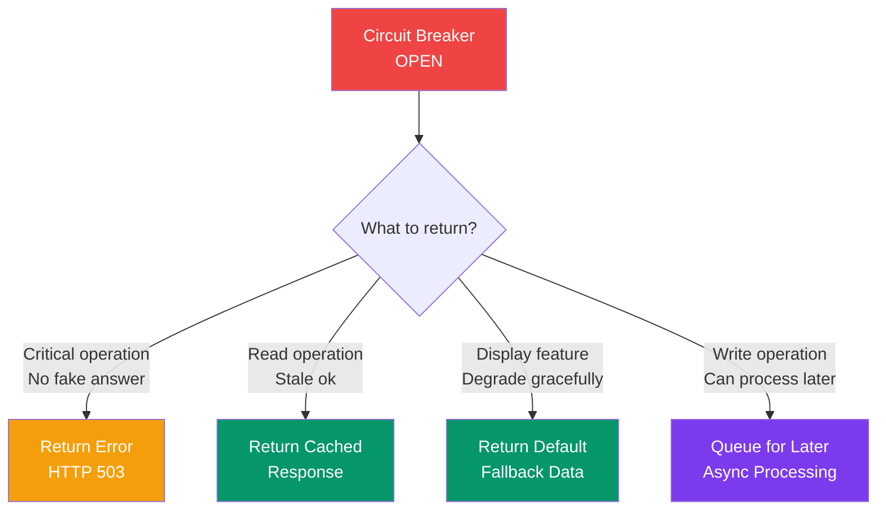

### Strategy 4: Queue for Later (Async Fallback)

For write operations, accept the request and process it later.

```
Circuit OPEN → queue the request

Example (WhatsApp — Message delivery service down):
  User sends message.
  Message queued locally / in Kafka.
  When service recovers → deliver.
  User sees "clock icon" (sending...) instead of error.
```

### Strategy 5: Redirect to Fallback Service

If you have a backup/replica service, redirect traffic there.

```
Primary Payment Service: OPEN (circuit tripped)
     ↓
Fallback Payment Service (read-only / cached state)
     ↓
Show "pending" status, complete payment when primary recovers
```

### Fallback Decision Table

| Service Type | Recommended Fallback | Why |
|---|---|---|
| Payment, Transfer | Return error | No fake transactions |
| Product catalog | Cached response | Stale is OK |
| Recommendations | Default popular list | Something is better than nothing |
| Search | Empty results + message | Safe fallback |
| Analytics/Logging | Drop silently | Non-critical |
| Notifications | Queue for later | Eventually consistent |
| Authentication | No fallback — deny access | Security cannot degrade |

---

## Circuit Breaker vs Retry: The Great Debate

Interview mein yeh zaroor poochha jaata hai. Bahut log confuse ho jaate hain.

### What is Retry?

Retry is simple: if a request fails, try again.

```
Request → fails → wait → try again → fails → wait → try again → success!
```

Good for: **transient errors**. Network blip, momentary DB spike, GC pause. The error is brief and the service recovers in milliseconds.

### What is Circuit Breaker?

Stop trying when a service has been failing persistently.

```
50 requests → all fail → STOP TRYING → wait → probe → still failing → wait longer
```

Good for: **prolonged outages**. Service is down for 30 seconds, 2 minutes, or longer.

### The Key Insight: Retry Can Make Things Worse

Imagine a service is down. You are getting 1000 requests/second.

Without circuit breaker, each request retries 3 times:
- Effective requests to failing service: 3000/second
- Each waits for timeout: 30 seconds
- You have just created a **retry storm** that makes the recovering service even harder to recover

**Retrying into a down service amplifies the problem. Circuit breaker stops the amplification.**

### Use Both Together: The Right Pattern

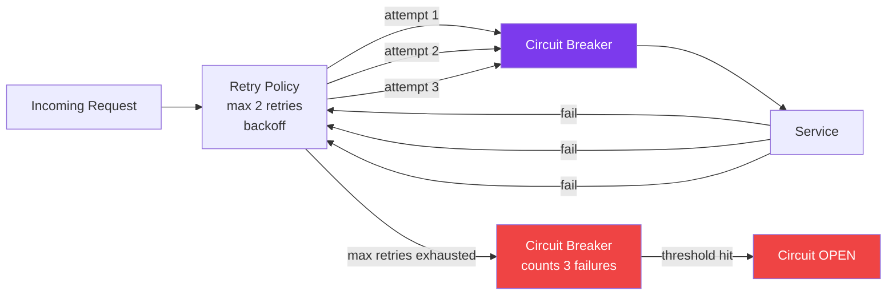

The combination:
1. **Retry** handles brief, transient errors (network blip lasting < 1 second)
2. If retries keep failing, those failures **count toward circuit breaker threshold**
3. **Circuit breaker trips** — stops all retry attempts against the broken service
4. After timeout, circuit enters HALF-OPEN to test recovery

```
Flow Example:
  - Request fails → retry after 1s → fails → retry after 2s → fails
  - 3 failures counted by circuit breaker
  - 5 requests do this → 15 total failures counted
  - CB threshold (10 failures) exceeded → OPEN
  - All subsequent requests fail fast (no retries)
```

### Side-by-Side Comparison

| Aspect | Retry | Circuit Breaker |
|---|---|---|
| What it handles | Transient failures (< 1s) | Prolonged outages (> 30s) |
| Behavior | Try again, with delay | Stop trying, fail fast |
| Effect on failing service | Adds load (can amplify) | Reduces load (gives time to recover) |
| Latency impact | Increases latency (waiting for retries) | Reduces latency (fast fail) |
| When to use | Network blips, GC pauses | Service crashes, DB down |
| Works best with | Idempotent operations | Any operation |
| Dangerous without | Backoff + jitter | Fallback strategy |

**Interview answer**: "Retry is for brief, transient errors. Circuit Breaker is for sustained failures. Use both together — retry within the circuit breaker's allowed calls. When retries consistently fail, the circuit breaker detects the pattern and trips open."

---

## Retry with Exponential Backoff and Jitter

Yeh retry ka sahi tarika hai. Naive retry mat karo.

### Why Naive Retry is Bad

```
Service fails at t=0.

Naive retry (BAD — everyone retries at same time):
  t=0ms:   request fails
  t=0ms:   retry 1 → fails (instantly!)
  t=0ms:   retry 2 → fails (instantly!)
  t=0ms:   retry 3 → fails (instantly!)

Result: 4x traffic spike to already-struggling service
```

### Exponential Backoff

Wait longer between each retry:

```
t=0:    original request → fails
t=1s:   retry 1 → fails
t=2s:   retry 2 → fails
t=4s:   retry 3 → fails
t=8s:   retry 4 → fail → give up

Wait time: 2^(attempt) seconds
```

Better, but still a problem: If 1000 clients all failed at t=0, they all retry at t=1s, t=2s, t=4s... **Thundering herd**.

### Jitter (Add Randomness)

Spread out the retries by adding random delay:

```
t=0:      original fails
t=1.3s:   retry 1 (1s ± 0.5s random)
t=2.7s:   retry 2 (2s ± 1s random)
t=5.1s:   retry 3 (4s ± 2s random)

1000 clients:
  Client 1: retries at 0.8s, 1.7s, 3.9s
  Client 2: retries at 1.2s, 2.3s, 4.7s
  Client 3: retries at 0.6s, 2.1s, 5.2s
  ...

Result: load spread across time → service can recover
```

```python
import random
import time

def retry_with_backoff(fn, max_retries=3, base_delay=1.0, max_delay=60.0):
    """
    Retry with exponential backoff + jitter.
    Use this for idempotent operations only!
    """
    for attempt in range(max_retries + 1):
        try:
            return fn()
        except Exception as e:
            if attempt == max_retries:
                raise  # exhausted all retries, propagate
            
            # Exponential backoff: 1s, 2s, 4s, 8s...
            delay = min(base_delay * (2 ** attempt), max_delay)
            
            # Jitter: ±50% of delay
            jitter = random.uniform(0, delay * 0.5)
            
            total_wait = delay + jitter
            print(f"Attempt {attempt + 1} failed. Retrying in {total_wait:.2f}s...")
            time.sleep(total_wait)
```

---

## Bulkhead Pattern: Isolate Resources

Yeh circuit breaker ka best friend hai. Dono saath use karo.

### The Ship Analogy

Old ships had **bulkheads** — watertight compartments. If one compartment flooded, the bulkhead prevented water from spreading to other compartments. The ship could survive with one flooded compartment.

Without bulkheads: one hole → entire ship floods → ship sinks.
With bulkheads: one hole → one compartment floods → ship survives.

Apply this to thread pools.

### The Problem Without Bulkhead

```
Shared thread pool: 200 threads (for all services)

Normal operation:
  Payment calls:      30 threads
  Order calls:        40 threads
  User calls:         20 threads
  Search calls:       10 threads
  Idle:              100 threads

Payment Service becomes slow:
  Payment calls:     190 threads (all waiting for slow payment!)
  Order calls:         5 threads left
  User calls:          3 threads left
  Search calls:        2 threads left

Now ALL services are degraded because of ONE slow service.
```

### The Solution: Per-Service Thread Pools

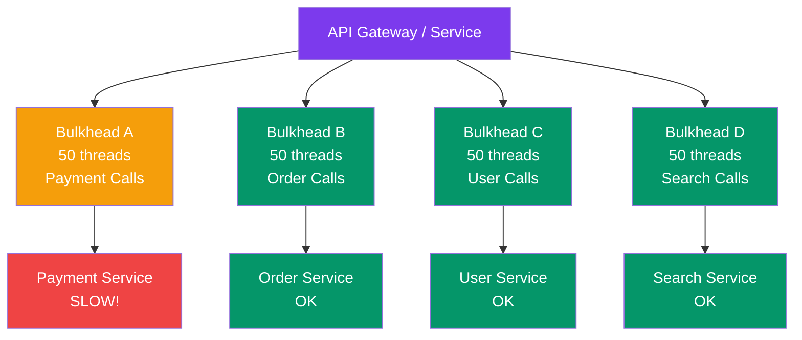

With bulkheads:
- Payment calls fill up Bulkhead A's 50 threads
- Order, User, Search calls still have their own 50 threads each
- Payment being slow only affects payment features
- Everything else keeps working

### Bulkhead Configuration

```
Thread pool sizing considerations:
  - Expected concurrent calls to service
  - Average latency of the service
  - Little's Law: threads_needed = request_rate × average_latency

Example:
  Payment service:
    Expected: 100 req/s
    Average latency: 200ms = 0.2s
    Threads needed: 100 × 0.2 = 20 threads
    With headroom (2x): 40 threads
    Bulkhead size: 40-50 threads
```

### Bulkhead + Circuit Breaker Together

The two patterns are complementary:

| Pattern | Prevents |
|---|---|
| Bulkhead | One service's problems from consuming all threads |
| Circuit Breaker | Requests from reaching a failing service at all |

Use both:
- Bulkhead limits the **blast radius** (how many threads are affected)
- Circuit Breaker stops the **bleeding** (stops requests to failing service)

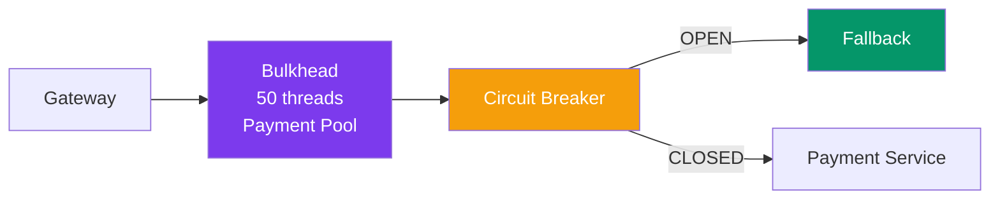

---

## Implementations: Real Libraries

Yeh sirf theory nahi — real tools dekho.

### 1. Hystrix (Netflix — The Pioneer)

Netflix created Hystrix in 2011 to handle the scale problems they faced after moving to microservices. It was **the first widely-adopted circuit breaker library** and popularized the pattern.

**How Hystrix worked:**

Every external call was wrapped in a `HystrixCommand`:

```java
public class PaymentServiceCommand extends HystrixCommand<PaymentResponse> {
    private final PaymentService paymentService;
    private final PaymentRequest request;

    public PaymentServiceCommand(PaymentService service, PaymentRequest req) {
        super(HystrixCommandGroupKey.Factory.asKey("PaymentGroup"));
        this.paymentService = service;
        this.request = req;
    }

    @Override
    protected PaymentResponse run() throws Exception {
        // Actual call to payment service
        return paymentService.processPayment(request);
    }

    @Override
    protected PaymentResponse getFallback() {
        // What to do when circuit is open or call fails
        return PaymentResponse.pending(request.getOrderId());
    }
}

// Usage
PaymentResponse response = new PaymentServiceCommand(service, req).execute();
```

**Hystrix Dashboard** — Netflix built a real-time monitoring dashboard. Every circuit breaker's state, failure rate, throughput was visible in a web UI. You could see the exact moment a circuit tripped and recovered.

**Netflix's Real Use Case:**

Netflix ran hundreds of microservices. The recommendation engine, playback authorizer, content catalog, search — all called each other. Hystrix wrapped every inter-service call.

Famous example: **If the recommendations service is down, fall back to a static "Top Movies" list.**

```
Normal flow:
  User opens Netflix → Recommendations Service → personalized row

Circuit tripped (recommendations down):
  User opens Netflix → Hystrix: OPEN → Top Movies list (fallback)
  
User still sees content. Not an error page.
Netflix doesn't lose the viewer.
This is graceful degradation in practice.
```

**Why Hystrix is deprecated now:**

Netflix put Hystrix into maintenance mode in 2018. Reason: it used thread pools for isolation (every command runs in its own thread pool). For reactive/async programming (Project Reactor, RxJava), thread-based isolation does not make sense. They recommended moving to Resilience4j.

---

### 2. Resilience4j (Java — The Modern Standard)

Resilience4j is the go-to circuit breaker library for Java today. It is lightweight, modular, and built for functional programming.

```java
// Configuration
CircuitBreakerConfig config = CircuitBreakerConfig.custom()
    .failureRateThreshold(50)                    // trip at 50% failure rate
    .waitDurationInOpenState(Duration.ofSeconds(30)) // stay open 30s
    .slidingWindowType(SlidingWindowType.TIME_BASED) // time-based window
    .slidingWindowSize(10)                       // 10-second window
    .minimumNumberOfCalls(10)                    // need 10 calls before tripping
    .permittedNumberOfCallsInHalfOpenState(5)    // 5 test calls in half-open
    .automaticTransitionFromOpenToHalfOpenEnabled(true)
    .recordExceptions(IOException.class, TimeoutException.class)
    .ignoreExceptions(BusinessException.class)   // don't count biz errors
    .build();

CircuitBreakerRegistry registry = CircuitBreakerRegistry.of(config);
CircuitBreaker circuitBreaker = registry.circuitBreaker("paymentService");

// Decorate your function
Supplier<PaymentResponse> decoratedSupplier = CircuitBreaker
    .decorateSupplier(circuitBreaker, () -> paymentService.charge(request));

// Execute with fallback
Try<PaymentResponse> result = Try.ofSupplier(decoratedSupplier)
    .recover(CallNotPermittedException.class, ex -> {
        // Circuit is OPEN — return fallback
        log.warn("Payment circuit open, returning fallback");
        return PaymentResponse.pending(request.getOrderId());
    });

// Monitor state transitions
circuitBreaker.getEventPublisher()
    .onStateTransition(event ->
        log.info("CB state: {} -> {}",
            event.getStateTransition().getFromState(),
            event.getStateTransition().getToState()));
```

**Resilience4j also provides:**
- `Retry` — with backoff and jitter
- `RateLimiter` — limit requests per second
- `Bulkhead` — thread pool isolation
- `TimeLimiter` — timeout for async calls

**Combining them:**

```java
// The full resilience chain:
// TimeLimiter → CircuitBreaker → Retry → Bulkhead

Supplier<PaymentResponse> supplier = () -> paymentService.charge(request);

supplier = Bulkhead.decorateSupplier(bulkhead, supplier);
supplier = Retry.decorateSupplier(retry, supplier);
supplier = CircuitBreaker.decorateSupplier(circuitBreaker, supplier);
// TimeLimiter wraps the whole thing for timeout

Try.ofSupplier(supplier).recover(ex -> fallback());
```

---

### 3. Polly (.NET)

Polly is the standard resilience library for .NET. Clean, fluent API.

```csharp
// Circuit breaker policy
var circuitBreakerPolicy = Policy
    .Handle<HttpRequestException>()
    .Or<TaskCanceledException>()
    .CircuitBreakerAsync(
        exceptionsAllowedBeforeBreaking: 5,
        durationOfBreak: TimeSpan.FromSeconds(30),
        onBreak: (exception, breakDuration) => {
            Log.Warning("Circuit OPEN. Break for {Duration}s. Reason: {Msg}",
                breakDuration.TotalSeconds, exception.Message);
        },
        onReset: () => Log.Info("Circuit CLOSED. Service recovered."),
        onHalfOpen: () => Log.Info("Circuit HALF-OPEN. Testing recovery...")
    );

// Retry policy with exponential backoff + jitter
var retryPolicy = Policy
    .Handle<HttpRequestException>()
    .WaitAndRetryAsync(
        retryCount: 3,
        sleepDurationProvider: (attempt, ex, ctx) => {
            var backoff = TimeSpan.FromSeconds(Math.Pow(2, attempt));
            var jitter = TimeSpan.FromMilliseconds(new Random().Next(0, 500));
            return backoff + jitter;
        },
        onRetry: (exception, timeSpan, attempt, context) => {
            Log.Warning("Retry {Attempt} after {Delay}ms", attempt, timeSpan.TotalMilliseconds);
        });

// Combine: retry first, then circuit breaker guards overall
var resiliencePolicy = Policy.WrapAsync(retryPolicy, circuitBreakerPolicy);

// Execute
var response = await resiliencePolicy.ExecuteAsync(async () =>
    await httpClient.PostAsync("/api/payment", content));
```

---

### 4. Python — `circuitbreaker` Library

```python
from circuitbreaker import circuit

@circuit(
    failure_threshold=5,   # trip after 5 failures
    recovery_timeout=30,   # wait 30s before half-open
    expected_exception=ConnectionError
)
def call_payment_service(order_id: str, amount: float):
    """
    This function is wrapped with a circuit breaker.
    If it raises ConnectionError 5 times in a row → circuit opens.
    """
    response = requests.post(
        "https://payment-service/charge",
        json={"order_id": order_id, "amount": amount},
        timeout=5
    )
    response.raise_for_status()
    return response.json()


# Usage with fallback
def process_payment(order_id: str, amount: float):
    try:
        return call_payment_service(order_id, amount)
    except CircuitBreakerError:
        # Circuit is OPEN
        logger.warning(f"Payment circuit open for order {order_id}")
        return {"status": "pending", "message": "Payment will be processed shortly"}
    except Exception as e:
        logger.error(f"Payment failed: {e}")
        raise
```

---

## Deep Dive: Netflix's Hystrix in Production

Netflix ke baare mein thoda aur detail mein baat karte hain — yeh real production story hai.

### The Scale Problem That Created Hystrix

When Netflix moved to AWS and microservices (around 2011), they had a problem. Their monolith became dozens of services. When one service was slow, it was taking down others.

The API layer called:
- Personalization service
- Rating service
- Playback rights service
- Content metadata service
- Video encoding service
- Device capabilities service
- ...and dozens more

All it took was one service having a bad GC pause for 5 seconds to cascade and affect every user.

### Hystrix's Key Innovations

1. **Command Pattern Wrapping**: Every remote call was wrapped in a `HystrixCommand`. This gave Hystrix control over:
   - Thread pool isolation (each service got its own thread pool)
   - Timeout enforcement
   - Fallback execution
   - Metrics collection

2. **Real-time Metrics**: Hystrix collected metrics every 10ms using a rolling window. It computed:
   - Success rate
   - Failure rate
   - Timeout rate
   - Rejection rate (bulkhead full)

3. **Hystrix Dashboard**: A real-time turbine stream showing every circuit breaker across all instances. Engineers could watch circuits trip and recover in real time.

4. **Graceful Degradation at Scale**: Netflix had carefully designed fallbacks for every circuit:
   - Recommendations down → Top Movies
   - Ratings service down → Show no rating
   - Playback authorization slow → Use cached auth (with short TTL)

### The Netflix Recommendation Fallback Example (Deep)

```
Normal Operation:
  User: opens Netflix on TV
  
  API Gateway calls:
    1. Auth service → validated ✓
    2. Profile service → get user preferences ✓
    3. Recommendation service → personalized rows ✓
    4. Content metadata → titles, thumbnails ✓
    5. Playback rights → what's licensed in your region ✓
  
  Result: Beautiful personalized home screen

Recommendation Service Outage (without CB):
  3. Recommendation service → TIMEOUT (30s)
  API call hangs for 30s
  User sees loading spinner for 30s
  Then gets error page
  
Recommendation Service Outage (with CB — OPEN):
  3. Recommendation service → CB: OPEN → fallback in 1ms
  Fallback: return pre-computed popular movies for this region
  
  Result: User gets "Popular on Netflix" instead of personalized
  Latency: normal (no 30s wait)
  User experience: degraded but not broken
  
When Recommendation Service Recovers:
  CB: HALF-OPEN → lets a few requests through → SUCCESS
  CB: CLOSED → personalized recommendations return
  Engineers see recovery on dashboard
```

This is why Netflix users often see "Popular on Netflix" rows — it is the fallback when personalization is unavailable. Most users never realize it.

---

## Observability: You Cannot Manage What You Cannot Measure

Circuit breaker lagaana kafi nahi. Dekhna bhi padega ki kya ho raha hai.

### Metrics to Track

```
Core Circuit Breaker Metrics:
─────────────────────────────

cb_state                  gauge     0=CLOSED, 1=OPEN, 2=HALF_OPEN
  Alert: if cb_state == 1 (OPEN) for > 5 minutes

cb_calls_total            counter   {service, result: success|failure|rejected}
  Derive: failure_rate = failures / (successes + failures)
  Alert: if failure_rate > 20% for > 2 minutes

cb_state_transitions      counter   {from_state, to_state}
  Use: track how often circuits trip

cb_open_duration_seconds  histogram time circuit spends in OPEN state
  Alert: if p99 > 120 seconds (circuit not recovering)

cb_rejected_calls_total   counter   calls rejected because circuit is OPEN
  Use: estimate "damage" while circuit is open
```

### What to Alert On

| Condition | Severity | Action |
|---|---|---|
| Circuit OPEN > 5 minutes | CRITICAL | Page on-call, escalate |
| Failure rate > 30% for 2 min | WARNING | Investigate immediately |
| Circuit OPEN → CLOSED | INFO | Log recovery event |
| Rejection rate spike | WARNING | Check upstream traffic |
| CB state flapping | WARNING | Threshold too sensitive, reconfigure |

### Logging Circuit Breaker Events

Always log state transitions with context:

```java
circuitBreaker.getEventPublisher()
    .onStateTransition(event -> {
        log.warn("CIRCUIT BREAKER [{}] state change: {} → {} | " +
                 "failure_rate={}% | slow_call_rate={}%",
                 circuitBreaker.getName(),
                 event.getStateTransition().getFromState(),
                 event.getStateTransition().getToState(),
                 circuitBreaker.getMetrics().getFailureRate(),
                 circuitBreaker.getMetrics().getSlowCallRate());
    })
    .onCallNotPermitted(event ->
        log.info("CIRCUIT OPEN — request rejected for [{}]",
                 circuitBreaker.getName()))
    .onSuccess(event ->
        log.debug("Call success [{}] in {}ms",
                  circuitBreaker.getName(),
                  event.getElapsedDuration().toMillis()));
```

---

## Timeout Strategy: Always Set Timeouts

Yeh basic hai but bahut log bhul jaate hain.

**A request without a timeout can wait forever.**

If your HTTP client has no timeout and the server stops responding mid-transfer, your thread waits. Permanently. One thread per hanging connection. You leak threads until the server runs out of memory.

### Timeout Types

| Timeout | What it covers | Recommended value |
|---|---|---|
| Connection timeout | Time to establish TCP connection | 3-5 seconds |
| Read timeout | Time to receive response data after connection | Depends on service SLA |
| Write timeout | Time to send request body | Depends on payload size |
| Circuit breaker open timeout | Time to wait before HALF-OPEN | 30-60 seconds |

### Cascading Timeout Budget

The rule: **each layer's timeout must be smaller than its caller's timeout**.

```
Client:           30s timeout
  API Gateway:    25s timeout
    Order Service:  20s timeout
      Payment Svc:    10s timeout
        DB query:        5s timeout
```

Why? If Payment Service has a 30-second timeout but Order Service only waits 20 seconds, the 30-second wait is wasted — Order Service already gave up and returned an error. The Payment Service thread is still running (doing work nobody will use) for another 10 seconds.

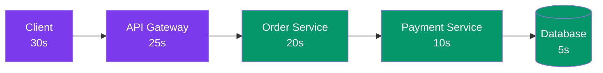

Each arrow timeout < parent timeout. This prevents **orphaned requests** — requests running on a thread after the caller has already given up.

---

## Full Architecture: Production-Grade Resilience

Ab sab kuch saath mein dekho. Yeh hai production mein kya lagte hain.

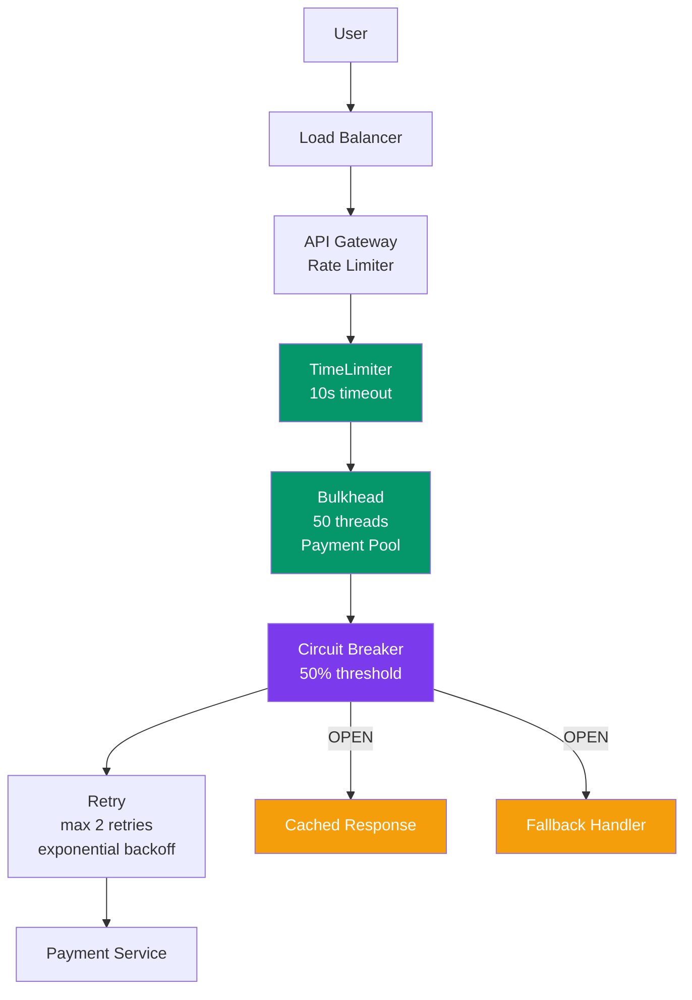

The layers, from outermost to innermost:

1. **Load Balancer**: Distributes traffic across instances
2. **Rate Limiter**: Prevents request flooding (protect your own service)
3. **TimeLimiter**: End-to-end timeout for the entire call chain
4. **Bulkhead**: Limits threads per downstream service
5. **Circuit Breaker**: Stops calls when service is failing
6. **Retry**: Handles brief transient failures
7. **Fallback**: What to do when circuit is OPEN

Each layer has a specific job. They compose together.

---

## Design Exercise: Checkout Service Resilience

**Scenario: Swiggy checkout flow**

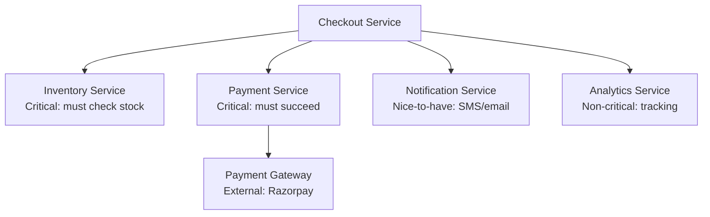

**Design questions:**
1. Which services get circuit breakers?
2. What are the fallbacks for each?
3. What retry policy for Payment?
4. How to size the bulkheads?

<details>
<summary>Solution (Click to Expand)</summary>

**1. Circuit Breakers — All four, with different thresholds:**

| Service | Threshold | Open Timeout | Reason |
|---|---|---|---|
| Inventory | 30% | 10s | Important but faster to check |
| Payment | 20% | 15s | Critical — low tolerance |
| Notification | 60% | 30s | Lenient — not blocking checkout |
| Analytics | 80% | 60s | Best-effort, nearly never trip |

**2. Fallbacks:**

- **Inventory**: Use last-known cached stock count (stale up to 30s). Better than blocking checkout.
- **Payment**: NO fallback — return error to user. Cannot fake payment.
- **Notification**: Queue the notification in Kafka. Send when service recovers. User doesn't know.
- **Analytics**: Drop silently. Log locally. Process later in batch.

**3. Retry Policy for Payment:**

```
Retries: 2 (not 3 — payment, be conservative)
Delays: 1s, then 2s (with ±500ms jitter)
Retry on: 503, 504, connection timeout, network error
DO NOT retry on: 400, 402 (insufficient funds), 409 (conflict)
MUST USE: idempotency key — prevent double charge
```

**4. Bulkhead Sizing (200 total threads):**

| Service | Threads | Reasoning |
|---|---|---|
| Payment | 60 | Critical, moderate latency (external gateway) |
| Inventory | 50 | Important, fast calls |
| Notification | 40 | Slower (SMS gateway), but not blocking |
| Analytics | 20 | Best effort |
| Reserve | 30 | For unexpected load spikes |

</details>

---

## Trade-offs and When Not to Use Circuit Breakers

Hamesha circuit breaker mat lagao. Jab nahi chahiye, tab mat lagao.

### When Circuit Breakers Are Valuable

- Synchronous calls to downstream services
- User-facing request paths where latency matters
- Services with variable reliability
- Any cross-network call

### When Circuit Breakers Are Overkill

| Situation | Why CB is Overkill |
|---|---|
| In-memory function calls | No network, no latency — too much overhead |
| Database within same pod | High bandwidth, low latency, different failure modes |
| Message queue consumption | Pull model — just stop consuming, no need for CB |
| Very low traffic service | Hard to gather meaningful failure statistics |

### The False Positive Problem

If `failure_threshold` is too low, circuit breaker trips on normal transient errors.

```
Scenario: slight network degradation during deployment (5% error rate)
CB configured: failure_threshold = 5%
Result: CB opens → entire feature down for 30 seconds
Real problem: 5% errors are acceptable, this was over-reaction

Fix: Raise threshold, increase minimum_requests, use longer window
```

### The Overhead

Each circuit breaker:
- Adds slight CPU overhead (metrics calculation)
- Adds memory (state tracking per circuit)
- Adds complexity to debugging

For a service with 50 downstream dependencies, you have 50 circuit breakers. Their state must be observable, their thresholds must be tuned, and their fallbacks must be tested.

**This is real operational cost.** Do not add circuit breakers and forget about them.

---

## Common Interview Questions

Yeh questions definitely poochhe jayenge. Prepare karo.

### Q1: "Explain the Circuit Breaker pattern."

**Answer framework:**
1. Start with the problem: cascading failures. Service A → B → C. C goes down, B's threads exhaust, A's threads exhaust, everything down.
2. The solution: a proxy that monitors failure rate and trips open when threshold exceeded.
3. Three states: CLOSED (normal), OPEN (fail fast), HALF-OPEN (probe).
4. Key benefit: fail fast prevents thread exhaustion, gives downstream time to recover.
5. Fallback: what you return when circuit is open.

### Q2: "What are the three states and transitions?"

```
CLOSED → OPEN: failure_threshold exceeded (e.g., >50% failures in 10 seconds)
OPEN → HALF-OPEN: after open_timeout (e.g., 30 seconds pass)
HALF-OPEN → CLOSED: success_threshold met (e.g., 3 consecutive successes)
HALF-OPEN → OPEN: any single failure
```

Draw the state machine. Always. Interviewers love it.

### Q3: "Circuit Breaker vs Retry — when to use which?"

"Retry is for transient errors — brief network blips where retrying immediately or after short wait succeeds. Circuit Breaker is for prolonged outages — when the service has been failing for seconds or minutes. Retrying into a down service adds load and makes recovery harder. Use both together: retry up to N times, and those failures count toward the circuit breaker threshold."

### Q4: "What happens when circuit is OPEN? What do you return?"

"Depends on the service criticality:
- For payments: return error — cannot fake a transaction
- For recommendations: return cached or default list — degraded is better than broken
- For notifications: queue for async processing
- For analytics: drop silently

The key is designing fallbacks in advance, not as an afterthought."

### Q5: "How does Netflix use circuit breakers?"

"Netflix wrapped every external service call with Hystrix. The most famous fallback: if recommendations service is down, return a pre-computed list of popular movies for that region. Users see content instead of an error page. They rarely notice the degradation. Netflix also built a real-time dashboard (Hystrix Dashboard) to monitor circuit states across thousands of service instances."

### Q6: "What is the Bulkhead pattern and how does it relate to Circuit Breaker?"

"Named after ship bulkheads — watertight compartments that contain flooding. In software: separate thread pools for each downstream service. If payment service is slow and fills its thread pool, other services (orders, users, search) still have their own thread pools and are unaffected. Circuit Breaker stops you from calling a failing service. Bulkhead ensures a failing service cannot starve other services of threads. Use both together."

### Q7: "What configuration parameters matter?"

"Five key parameters:
1. Failure threshold — at what failure rate/count does the circuit trip (typically 40-60%)
2. Minimum requests — don't trip on too-little data (e.g., 10 requests minimum)
3. Window size — evaluate failures over what time period (e.g., 10-60 seconds)
4. Open timeout — how long to stay OPEN before probing (e.g., 30 seconds)
5. Success threshold — how many successes in HALF-OPEN to close (e.g., 3-5)"

### Q8: "Design resilience for a payment system."

Key points to cover:
- Circuit breaker on every external call (payment gateway, bank APIs)
- Retry with idempotency key (to avoid double charges)
- Bulkhead to isolate payment threads from other services
- Timeout at every level (connection, read, total)
- Clear fallback: fail cleanly rather than return fake success
- Observability: alert when CB opens, dashboard for state

### Q9: "What is a 'retry storm' and how do you prevent it?"

"If 1000 clients all fail at the same moment and retry without delay, they all hit the recovering service at the same instant — potentially crashing it again. Prevent it with:
1. Exponential backoff — wait longer between retries
2. Jitter — add randomness to spread retries across time
3. Circuit breaker — once enough failures accumulate, stop retrying entirely"

### Q10: "Hystrix is deprecated — what do you use instead?"

"Resilience4j for Java. It is the modern replacement — lightweight, built for functional/reactive programming, no thread pool overhead for non-blocking calls. For .NET: Polly. For Python: circuitbreaker library. The pattern itself is framework-agnostic — in some architectures (service mesh with Istio/Envoy), circuit breaking is handled at the infrastructure level without code changes."

---

## Key Takeaways

> This is your cheat sheet. Yeh yaad kar lo.

```
┌──────────────────────────────────────────────────────────────────┐
│                    CIRCUIT BREAKER: KEY POINTS                   │
├──────────────────────────────────────────────────────────────────┤
│                                                                  │
│  PROBLEM                                                         │
│  One slow dependency → thread exhaustion → cascading failure    │
│  → entire system down. Happens more often than you think.       │
│                                                                  │
│  THE THREE STATES                                                │
│  CLOSED  → requests flow normally, failures counted             │
│  OPEN    → fail fast, no downstream calls, return fallback      │
│  HALF-OPEN → probe recovery, careful test requests              │
│                                                                  │
│  TRANSITIONS                                                     │
│  CLOSED → OPEN: failure threshold exceeded                      │
│  OPEN → HALF-OPEN: after open_timeout                           │
│  HALF-OPEN → CLOSED: success threshold met                      │
│  HALF-OPEN → OPEN: any single failure                           │
│                                                                  │
│  KEY CONFIGS                                                     │
│  failure_threshold, window_size, minimum_requests               │
│  open_timeout, success_threshold                                │
│                                                                  │
│  CIRCUIT BREAKER vs RETRY                                        │
│  Retry: transient errors (<1s)  ← use for brief blips           │
│  CB: prolonged outages (>30s)  ← stop hammering failing svc    │
│  Use both: retry counts toward CB threshold                     │
│                                                                  │
│  FALLBACKS (design BEFORE you need them)                         │
│  Payment → error (never fake)                                   │
│  Recommendations → cached/default list                          │
│  Notifications → queue async                                    │
│  Analytics → drop silently                                      │
│                                                                  │
│  COMPANION PATTERNS                                              │
│  Bulkhead: isolate thread pools per service                     │
│  Timeout: always set, cascade properly                          │
│  Retry + jitter: prevent retry storms                           │
│                                                                  │
│  REAL TOOLS                                                      │
│  Java: Resilience4j (modern), Hystrix (legacy)                 │
│  .NET: Polly                                                    │
│  Python: circuitbreaker                                         │
│  Infrastructure: Istio / Envoy (service mesh)                   │
│                                                                  │
│  NETFLIX REAL EXAMPLE                                            │
│  Recommendations down → return Top Movies list                  │
│  Users prefer degraded experience over error page               │
│  Hystrix Dashboard: real-time circuit state visualization        │
│                                                                  │
│  INTERVIEW TIP                                                   │
│  Always start with WHY (cascading failures).                    │
│  Draw the state machine. Discuss fallbacks.                     │
│  Mention Bulkhead as the companion. Name real libraries.        │
│                                                                  │
└──────────────────────────────────────────────────────────────────┘
```

---

## Next Steps

Continue to [Real-Time Communication](../22-real-time/README.md) to learn about WebSockets, SSE, and scaling live connections.

---

**Key Takeaway**: Circuit breakers stop failure from spreading. Fail fast, recover safely, and always — **always** — have a fallback ready before the circuit trips.
