# Service Discovery

---

## The Problem That Started It All — Samjho Aise

Imagine Zomato has 200 delivery partners in Bangalore. Every morning the dispatcher writes down each partner's current location on a piece of paper. When someone orders biryani, the dispatcher calls the partner at the last-known location. But partners move. Their phones change numbers. Some finish shifts and go home.

If the dispatcher is still calling old numbers, orders never get delivered. The paper-based system collapses the moment things become dynamic.

That is exactly what happens in a microservices architecture. And service discovery is the solution.

---

## Why Hardcoding IPs Is a Death Sentence

In the old world — a single monolith on a single server — life was simple:

```python
# Old world: one server, one IP, done
DATABASE_URL = "http://192.168.1.10:5432"
```

But Swiggy does not run on one server. They run hundreds of microservices: Order Service, Restaurant Service, Payment Service, Delivery Tracking Service, Notification Service, Search Service... each running dozens or hundreds of instances.

The moment you containerise with Docker and orchestrate with Kubernetes, this happens:

```
Payment Service starts at 10.0.1.45:8080
Order Service hardcodes: PAYMENT_URL = "http://10.0.1.45:8080"

→ Container crashes
→ Kubernetes restarts it on a different node
→ New IP: 10.0.2.87:8080
→ Order Service still calling 10.0.1.45:8080 (dead address)
→ 💥 Orders stop processing
→ Users angry
→ Twitter on fire
```

Three specific things make hardcoding impossible in modern systems:

1. **Auto-scaling:** During 8pm dinner rush, Swiggy scales from 10 to 100 Payment Service instances. Where do 90 new instances live? Unknown until runtime.
2. **Container restarts:** Kubernetes kills and restarts unhealthy pods. New pod = new IP.
3. **Rolling deployments:** During a deployment, old instances go down, new ones come up with different IPs.

**Service Discovery** solves this by creating a dynamic phone book — services register themselves when they start, and other services look them up by name, not IP.

---

## The Two Sides of Every Discovery Story

Before we go deep, understand there are always two problems to solve:

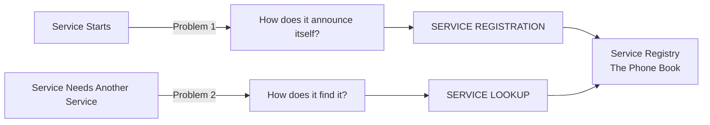

**Service Registration:** A service starts up and says, "Hey, I am the Payment Service. I am healthy. My IP is 10.0.2.87, port 8080. Write me down."

**Service Lookup:** Order Service needs to pay — it asks the phone book, "Who are the Payment Service instances right now that are healthy?"

Every service discovery system solves both. They just do it differently.

---

## The Three Big Patterns

There are three main patterns. Think of them as three ways to find a restaurant in a new city:

1. **Client-Side Discovery:** You open Zomato yourself, search for restaurants near you, pick one, and go directly. You are doing the work.
2. **Server-Side Discovery:** You call a concierge. They check the list, pick a restaurant, and send a cab for you. You just said "find me food."
3. **Built-in Platform Discovery (Kubernetes):** You live in a smart building where every floor has a restaurant directory built into the elevator. Just press "Food."

---

## Pattern 1: Client-Side Discovery

### The Analogy

You are at a Mumbai local train station. There is a big board showing which trains are running, which platform, and current status. You look at the board yourself, decide which train to take, and walk to that platform. The board does not escort you — it just gives you information.

In client-side discovery, **the calling service (client) is responsible for:**
1. Querying the service registry to get a list of healthy instances
2. Choosing which instance to call (load balancing — round-robin, least connections, etc.)
3. Making the direct network call to that instance

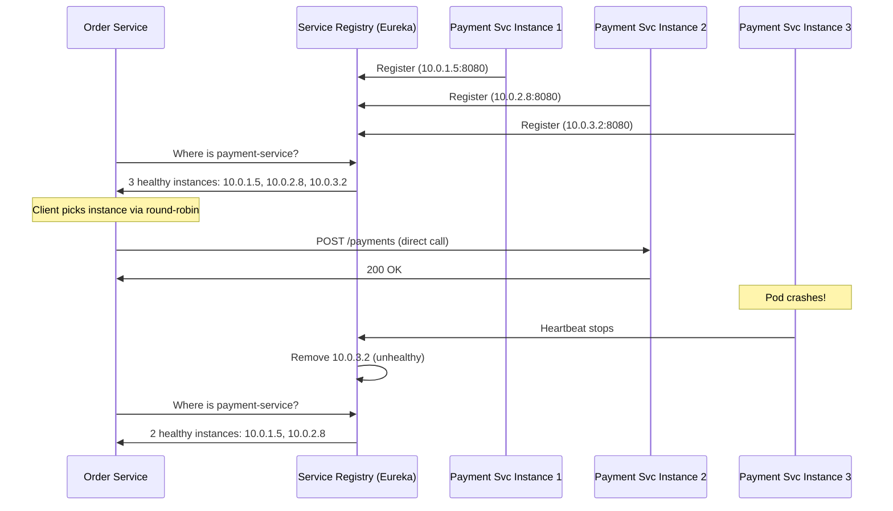

### Netflix Eureka — The Real-World Example

Netflix built Eureka because they had hundreds of microservices and thousands of instances. Yeh kyun important hai — Netflix cannot afford a single call to fail during peak streaming hours. They needed a system where each service knows, at all times, which other services are healthy and reachable.

**How registration works:**

```java
// build.gradle — add the dependency
implementation 'org.springframework.cloud:spring-cloud-starter-netflix-eureka-client'
```

```yaml
# application.yml — this is all config you need
spring:
  application:
    name: payment-service   # This is the service's identity in the registry

eureka:
  client:
    serviceUrl:
      defaultZone: http://eureka-server:8761/eureka/
    # Cache registry locally — don't hit Eureka on every call
    registry-fetch-interval-seconds: 30
    fetch-registry: true
    register-with-eureka: true
  instance:
    preferIpAddress: true
    lease-renewal-interval-in-seconds: 30    # Heartbeat every 30s
    lease-expiration-duration-in-seconds: 90 # Evict if no heartbeat for 90s
    instance-id: ${spring.application.name}:${random.value}
```

```java
// Main class — @EnableEurekaClient is all you need
@SpringBootApplication
@EnableEurekaClient
public class PaymentServiceApplication {
    public static void main(String[] args) {
        SpringApplication.run(PaymentServiceApplication.class, args);
    }
}
```

**How discovery and load balancing work:**

```java
// Option 1: Manual — query registry, pick instance
@Service
public class OrderService {

    @Autowired
    private DiscoveryClient discoveryClient;

    public PaymentResponse processPayment(PaymentRequest request) {
        // Get all healthy instances
        List<ServiceInstance> instances = discoveryClient.getInstances("payment-service");
        
        if (instances.isEmpty()) {
            throw new ServiceUnavailableException("No payment-service instances available");
        }
        
        // Simple random selection (or implement round-robin yourself)
        ServiceInstance instance = instances.get(
            (int)(Math.random() * instances.size())
        );
        
        String url = "http://" + instance.getHost() + ":" + instance.getPort() + "/payments";
        return restTemplate.postForObject(url, request, PaymentResponse.class);
    }
}
```

```java
// Option 2: @LoadBalanced RestTemplate — Spring does the registry lookup for you
@Configuration
public class AppConfig {
    @Bean
    @LoadBalanced  // This annotation makes RestTemplate Eureka-aware
    public RestTemplate restTemplate() {
        return new RestTemplate();
    }
}

@Service
public class OrderService {
    @Autowired
    private RestTemplate restTemplate; // This is the @LoadBalanced one

    public PaymentResponse processPayment(PaymentRequest request) {
        // Spring Cloud intercepts this call, queries Eureka, picks an instance
        // You just use the service name — no IP needed
        return restTemplate.postForObject(
            "http://payment-service/payments",
            request,
            PaymentResponse.class
        );
    }
}
```

```java
// Option 3: Modern — Spring Cloud LoadBalancer with WebClient
@Service
public class OrderService {
    
    private final WebClient.Builder webClientBuilder;
    
    public OrderService(WebClient.Builder webClientBuilder) {
        this.webClientBuilder = webClientBuilder;
    }
    
    public Mono<PaymentResponse> processPayment(PaymentRequest request) {
        return webClientBuilder.build()
            .post()
            .uri("http://payment-service/payments")  // service name, not IP
            .bodyValue(request)
            .retrieve()
            .bodyToMono(PaymentResponse.class);
    }
}
```

### Client-Side Discovery Trade-offs

| Aspect | Detail |
|--------|--------|
| Advantage | Client controls load balancing — can do weighted, zone-aware, latency-based |
| Advantage | One fewer network hop — direct call to the service |
| Advantage | Simple architecture, fewer moving parts |
| Advantage | Client can cache registry data locally (resilient to registry downtime) |
| Disadvantage | Every client SDK must implement discovery logic |
| Disadvantage | Different languages need different Eureka clients (Node.js, Python, Go — all need separate libraries) |
| Disadvantage | Client code becomes more complex |
| Disadvantage | Polyglot environments become painful |
| Disadvantage | Registry becomes a dependency — must be clustered for HA |

**Interview tip:** When someone asks "what is the problem with client-side discovery," say: **coupling**. The client is tightly coupled to the registry. If you swap Eureka for Consul, every client SDK needs updating.

---

## Pattern 2: Server-Side Discovery

### The Analogy

Imagine you call Swiggy customer care and say "I want to order from a good biryani place near me." The agent checks their internal system, finds the best available restaurant, places the order for you. You did not need to know anything about the restaurant list. The agent handled it.

In server-side discovery, **the client (Order Service) knows nothing about the registry.** It just sends a request to a load balancer. The load balancer:
1. Receives the request
2. Queries the registry: "Who are the healthy Payment Service instances?"
3. Picks one
4. Forwards the request

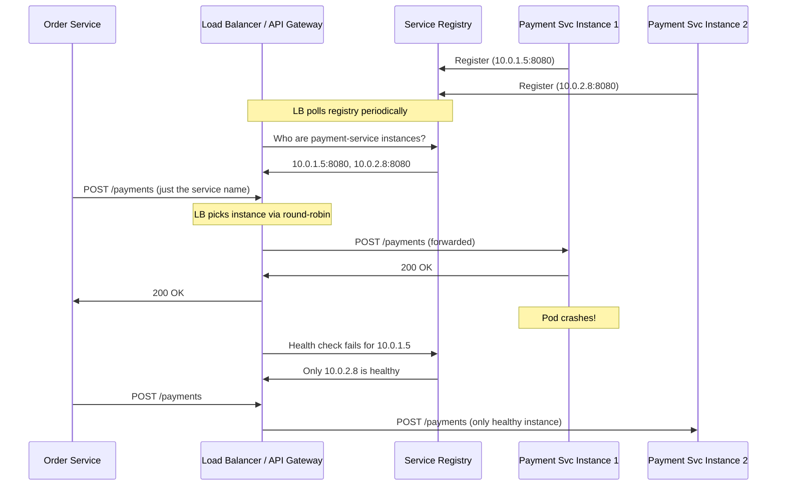

### AWS ECS + ALB — The Managed Cloud Way

When Instagram (Meta) runs on AWS, this is roughly how service-to-service communication works. AWS ECS (Elastic Container Service) automatically registers tasks into a target group. The Application Load Balancer (ALB) handles routing.

```json
// ECS Task Definition — service registers itself automatically when task starts
{
  "family": "payment-service",
  "containerDefinitions": [
    {
      "name": "payment-service",
      "image": "company/payment-service:v2.1",
      "portMappings": [
        {
          "containerPort": 8080,
          "protocol": "tcp"
        }
      ],
      "healthCheck": {
        "command": ["CMD-SHELL", "curl -f http://localhost:8080/health || exit 1"],
        "interval": 30,
        "timeout": 5,
        "retries": 3,
        "startPeriod": 60
      },
      "environment": [
        {"name": "SPRING_PROFILES_ACTIVE", "value": "production"}
      ]
    }
  ]
}
```

```hcl
# Terraform: Wire ALB to ECS — server-side discovery in practice
resource "aws_lb_target_group" "payment_service" {
  name        = "payment-service-tg"
  port        = 8080
  protocol    = "HTTP"
  vpc_id      = var.vpc_id
  target_type = "ip"  # ECS Fargate uses IP targets, not EC2 instance IDs

  health_check {
    path                = "/health"
    healthy_threshold   = 2   # Mark healthy after 2 consecutive passes
    unhealthy_threshold = 3   # Mark unhealthy after 3 consecutive failures
    interval            = 30  # Check every 30 seconds
    timeout             = 10
    matcher             = "200"
  }
}

resource "aws_ecs_service" "payment" {
  name            = "payment-service"
  cluster         = aws_ecs_cluster.main.id
  task_definition = aws_ecs_task_definition.payment.arn
  desired_count   = 3  # Run 3 instances

  # ECS auto-registers/deregisters from target group
  load_balancer {
    target_group_arn = aws_lb_target_group.payment_service.arn
    container_name   = "payment-service"
    container_port   = 8080
  }
  
  # Wait for service to be healthy before marking task as running
  health_check_grace_period_seconds = 60
}

resource "aws_lb_listener_rule" "payment_service" {
  listener_arn = aws_lb_listener.internal.arn

  action {
    type             = "forward"
    target_group_arn = aws_lb_target_group.payment_service.arn
  }

  condition {
    host_header {
      values = ["payment-service.internal"]
    }
  }
}
```

Now Order Service just calls `http://payment-service.internal/payments`. The ALB handles everything else. Order Service has zero knowledge of the registry — clean, language-agnostic, simple.

### NGINX Plus as a Server-Side Discovery Load Balancer

```nginx
# nginx.conf with dynamic upstream resolution via Consul template
upstream payment_service {
    # consul-template rewrites this file every time registry changes
    server 10.0.1.5:8080;
    server 10.0.2.8:8080;
    server 10.0.3.2:8080;
    keepalive 32;
}

server {
    listen 80;
    server_name payment-service.internal;
    
    location / {
        proxy_pass http://payment_service;
        proxy_set_header Host $host;
        proxy_set_header X-Real-IP $remote_addr;
        proxy_connect_timeout 5s;
        proxy_read_timeout 60s;
    }
    
    location /health {
        return 200 "healthy\n";
    }
}
```

### Server-Side Discovery Trade-offs

| Aspect | Detail |
|--------|--------|
| Advantage | Client is completely dumb — no discovery library needed |
| Advantage | Works with any language — REST, gRPC, any protocol |
| Advantage | Centralize TLS termination, rate limiting, auth at load balancer |
| Advantage | Load balancer can do path-based, header-based routing |
| Disadvantage | Extra network hop adds latency (typically 1-5ms) |
| Disadvantage | Load balancer must be highly available — it IS the single point of failure |
| Disadvantage | More infrastructure to manage and pay for |
| Disadvantage | Load balancer can become a bottleneck under very high traffic |

**Interview tip:** Server-side discovery is also called the "proxy pattern." The load balancer is the proxy that does the discovery work on behalf of the client.

---

## Registration Patterns: Self-Registration vs Third-Party Registration

Yeh ek important distinction hai jo log bhool jaate hain. How does a service actually get into the registry?

### Self-Registration

The service itself, on startup, makes an API call to register with the registry. On shutdown (graceful), it deregisters.

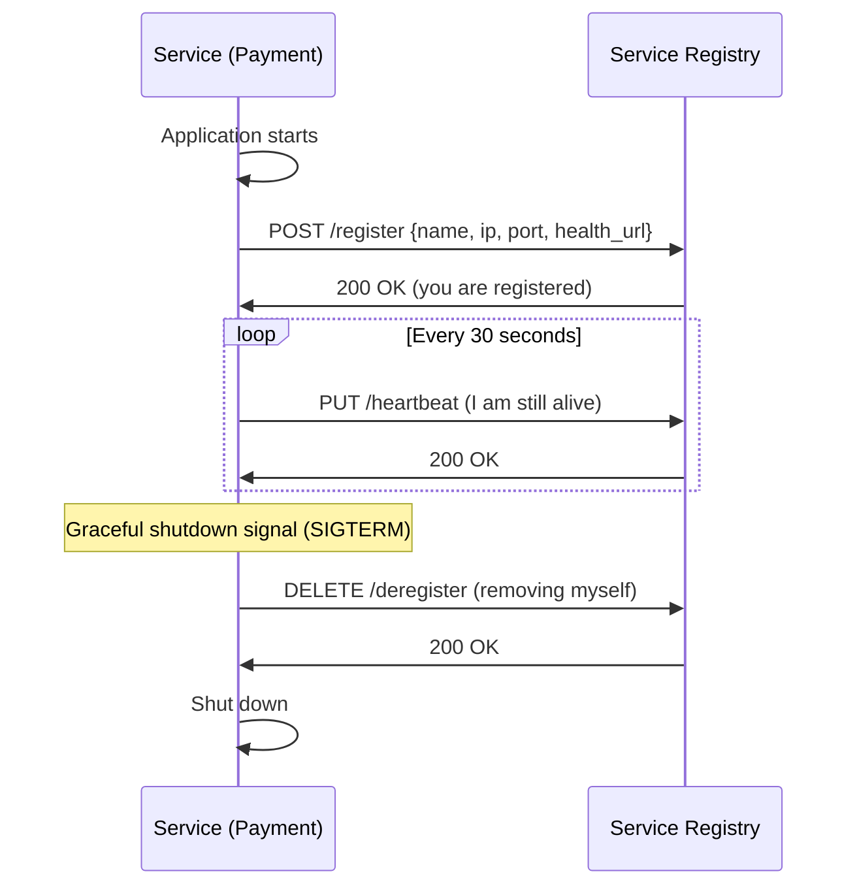

```python
# Python service doing self-registration with Consul
import consul
import atexit
import os
import signal

c = consul.Consul(host='consul.internal', port=8500)

service_id = f"payment-service-{os.getenv('HOSTNAME')}"
service_ip = os.getenv('POD_IP', '127.0.0.1')
service_port = int(os.getenv('PORT', '8080'))

# Register on startup
c.agent.service.register(
    name='payment-service',
    service_id=service_id,
    address=service_ip,
    port=service_port,
    tags=['v2', 'production', 'payment'],
    check=consul.Check.http(
        url=f"http://{service_ip}:{service_port}/health",
        interval='10s',
        timeout='3s',
        deregister='30s'  # Auto-deregister if critical for 30s
    )
)

print(f"Registered with Consul as {service_id}")

# Deregister on graceful shutdown
def deregister():
    print(f"Deregistering {service_id} from Consul")
    c.agent.service.deregister(service_id)

atexit.register(deregister)
signal.signal(signal.SIGTERM, lambda sig, frame: (deregister(), exit(0)))
```

**Pros:** Simple. Service knows its own metadata best.
**Cons:** Every service must implement registration logic. Different languages = different implementations. If service crashes ungracefully, it stays in registry until TTL expires.

### Third-Party Registration

An external system (deployer, Kubernetes, sidecar agent) handles registration. The service itself knows nothing about the registry.

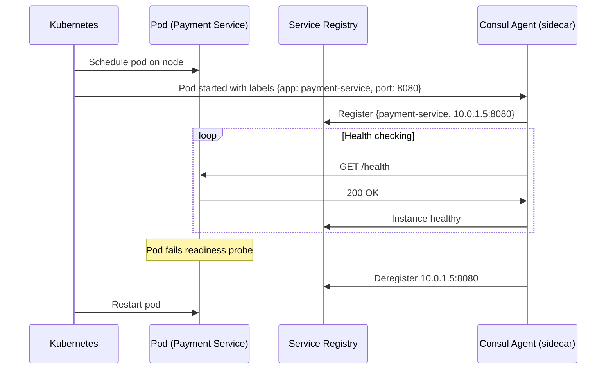

In Kubernetes, this is built-in. The kubelet monitors pod readiness and manages which endpoints are included in Service. The Service controller handles the "registry" automatically.

**Pros:** Service code stays clean. Language agnostic. Centralized control.
**Cons:** More moving parts. Service startup can have a gap before it is registered.

---

## Service Registries: The Phone Books of Microservices

Basically, the registry is a distributed database with one job: "who is healthy and where are they."

### Consul (HashiCorp) — The Swiss Army Knife

Consul is the most popular standalone service registry. Used by Uber, Pinterest, and many more. Yeh sab kuch karta hai — service registry, health checking, key-value config store, and even service mesh.

**Architecture — important to understand:**

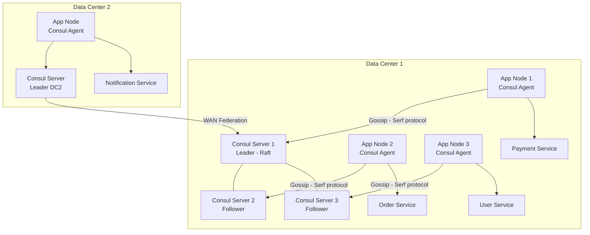

Every node runs a **Consul Agent**. Agents are lightweight — they gossip with other agents using the Serf protocol (like a rumor spreading through a network). A small subset of agents are **Consul Servers** — they maintain the authoritative state using the Raft consensus algorithm.

**Registering with Consul:**

```bash
# Method 1: Config file (declarative, preferred for production)
cat > /etc/consul.d/payment-service.json << 'EOF'
{
  "service": {
    "name": "payment-service",
    "id": "payment-service-node-3-8080",
    "address": "10.0.3.2",
    "port": 8080,
    "tags": ["v2.1.0", "production", "payment", "primary"],
    "meta": {
      "version": "2.1.0",
      "region": "ap-south-1",
      "team": "payments"
    },
    "check": {
      "id": "payment-service-health",
      "name": "Payment Service HTTP Check",
      "http": "http://10.0.3.2:8080/health",
      "method": "GET",
      "interval": "10s",
      "timeout": "3s",
      "deregister_critical_service_after": "1m"
    }
  }
}
EOF

consul reload  # Hot reload without restart
```

```bash
# Method 2: API call (useful for dynamic environments)
curl -X PUT http://consul.internal:8500/v1/agent/service/register \
  -H "Content-Type: application/json" \
  -d '{
    "Name": "payment-service",
    "ID": "payment-service-pod-xyz",
    "Address": "10.0.3.2",
    "Port": 8080,
    "Tags": ["v2", "production"],
    "Check": {
      "HTTP": "http://10.0.3.2:8080/health",
      "Interval": "10s",
      "Timeout": "3s",
      "DeregisterCriticalServiceAfter": "1m"
    }
  }'
```

**Discovering services via Consul:**

```python
# Python: Get healthy instances
import consul
import random

c = consul.Consul(host='consul.internal', port=8500)

# passing=True means only return instances that pass health checks
index, services = c.health.service('payment-service', passing=True)

if not services:
    raise Exception("No healthy payment-service instances!")

# Simple random selection — replace with weighted/zone-aware for production
instance = random.choice(services)
host = instance['Service']['Address']
port = instance['Service']['Port']
version = instance['Service']['Meta'].get('version', 'unknown')

print(f"Calling Payment Service v{version} at {host}:{port}")
payment_url = f"http://{host}:{port}/payments"
```

```go
// Go: Long-polling for real-time updates (blocking query)
package main

import (
    "fmt"
    consulapi "github.com/hashicorp/consul/api"
)

func watchPaymentService(client *consulapi.Client) {
    var lastIndex uint64
    
    for {
        // Blocking query: wait until registry changes, then return
        services, meta, err := client.Health().Service(
            "payment-service",
            "",
            true,  // passing only
            &consulapi.QueryOptions{
                WaitIndex: lastIndex,  // Block until this index changes
                WaitTime:  5 * time.Minute,
            },
        )
        if err != nil {
            log.Printf("Error querying Consul: %v", err)
            time.Sleep(5 * time.Second)
            continue
        }
        
        lastIndex = meta.LastIndex  // Next query will wait for changes after this
        
        fmt.Printf("Payment service instances updated: %d healthy\n", len(services))
        for _, svc := range services {
            fmt.Printf("  - %s:%d\n", svc.Service.Address, svc.Service.Port)
        }
        
        updateLocalCache(services)  // Update in-memory routing table
    }
}
```

**Consul DNS — the killer feature:**

```bash
# Any service can query Consul via DNS without any SDK
# Format: <service>.service.<datacenter>.consul

# Get all healthy instances as A records
dig @127.0.0.1 -p 8600 payment-service.service.consul

# Get instances with port info as SRV records
dig @127.0.0.1 -p 8600 payment-service.service.consul SRV

# Filter by tag
dig @127.0.0.1 -p 8600 v2.payment-service.service.consul SRV
```

### Netflix Eureka — The Java Ecosystem Hero

Eureka is AP (Availability over Consistency). During network partitions, Eureka chooses to keep serving stale data rather than refusing to serve. This is the right choice for Netflix — a slightly stale instance list is better than no response at all.

**Self-Preservation Mode — genius feature:**

```
Normal: Eureka evicts instances that don't heartbeat for 90s

Self-Preservation Mode trigger:
- If more than 15% of all registered instances stop heartbeating at once...
- Eureka says: "This looks like a network partition, not actual failures"
- It STOPS evicting instances — keeps them in registry
- Why? Better to route to a potentially dead instance than to silently drop services

Real scenario: AWS network hiccup affects heartbeat traffic
Without self-preservation: Eureka mass-evicts half your services → chaos
With self-preservation: Eureka keeps everyone registered → some calls fail but system survives
```

### etcd — Kubernetes' Backbone

etcd is what Kubernetes uses internally to store all cluster state — including service endpoints. You can use it directly for service discovery too.

```python
# Python: Service registration with auto-expiring TTL lease
import etcd3
import json
import threading
import time

client = etcd3.client(host='etcd.internal', port=2379)

# Create a 30-second TTL lease
# If not renewed, key automatically disappears → service auto-deregisters on crash
lease = client.lease(ttl=30)

service_data = json.dumps({
    "host": "10.0.1.5",
    "port": 8080,
    "version": "2.1.0",
    "timestamp": time.time()
})

# Register: put key with lease
client.put(
    '/services/payment-service/instance-pod-xyz-123',
    service_data,
    lease=lease
)

# Heartbeat: refresh lease every 10 seconds
def keep_alive():
    while True:
        try:
            lease.refresh()
            print("Lease refreshed — still registered")
        except Exception as e:
            print(f"Failed to refresh lease: {e}")
        time.sleep(10)

heartbeat_thread = threading.Thread(target=keep_alive, daemon=True)
heartbeat_thread.start()

# Discovery: list all instances
def get_payment_service_instances():
    instances = []
    results = client.get_prefix('/services/payment-service/')
    for value, metadata in results:
        if value:
            info = json.loads(value)
            instances.append(info)
    return instances

# Watch for real-time changes
def watch_payment_service():
    events_iterator, cancel = client.watch_prefix('/services/payment-service/')
    for event in events_iterator:
        if isinstance(event, etcd3.events.PutEvent):
            print(f"New instance registered: {event.value}")
        elif isinstance(event, etcd3.events.DeleteEvent):
            print(f"Instance deregistered: {event.key}")
```

### ZooKeeper — The Veteran

ZooKeeper is the grandfather of distributed coordination. HBase, Kafka (before KRaft), and older Hadoop components use it. Ephemeral znodes are the key concept for service discovery:

```java
// Java: ZooKeeper service discovery using curator framework
// (Apache Curator makes ZooKeeper usage much saner)
import org.apache.curator.framework.CuratorFramework;
import org.apache.curator.x.discovery.ServiceDiscovery;
import org.apache.curator.x.discovery.ServiceDiscoveryBuilder;
import org.apache.curator.x.discovery.ServiceInstance;
import org.apache.curator.x.discovery.strategies.RandomStrategy;

// Registration
ServiceInstance<PaymentServiceDetails> instance = ServiceInstance
    .<PaymentServiceDetails>builder()
    .name("payment-service")
    .address("10.0.1.5")
    .port(8080)
    .payload(new PaymentServiceDetails("v2.1.0", "production"))
    .build();

serviceDiscovery.registerService(instance);

// Discovery
ServiceProvider<PaymentServiceDetails> provider = serviceDiscovery
    .serviceProviderBuilder()
    .serviceName("payment-service")
    .providerStrategy(new RandomStrategy<>())
    .build();

provider.start();

ServiceInstance<PaymentServiceDetails> paymentInstance = provider.getInstance();
String url = "http://" + paymentInstance.getAddress() + ":" + paymentInstance.getPort() + "/payments";
```

### Registry Comparison — The Definitive Table

| Feature | Consul | Eureka | etcd | ZooKeeper |
|---------|--------|--------|------|-----------|
| CAP theorem | CP (Raft) | AP (eventual) | CP (Raft) | CP (Zab) |
| Health checks built-in | Yes (HTTP, TCP, script, TTL, gRPC) | Heartbeat only | TTL via leases | Session timeout only |
| Multi-datacenter | Native, first-class | Limited, manual | Manual | Manual |
| DNS interface | Yes (built-in) | No | No | No |
| Key-value store | Yes (config management too) | No | Yes (primary purpose) | Yes (znodes) |
| Web UI | Yes | Yes | No (use Etcdkeeper) | No (use ZooNavigator) |
| Language support | Any (HTTP API + DNS) | Primarily Java | Any (HTTP/gRPC API) | Java-centric, limited others |
| Gossip protocol | Yes (Serf) | No | No | No |
| Learning curve | Medium | Low (for Spring) | Medium | High |
| Production maturity | Very high | High (Java ecosystem) | Very high | Very high (but declining use) |
| Best for | General-purpose, multi-DC, polyglot | Spring Cloud / JVM monorepos | Kubernetes backend, config | Legacy Java, Kafka, HBase |
| Performance | High | High | Very high | High |

---

## Health Checks: The Heartbeat of Service Discovery

Samjho aise — a hospital has many doctors. But you only want to book an appointment with doctors who are currently in their office, not on leave. Health checks are how the hospital directory stays current.

If health checks did not exist, a crashed service would stay in the registry. Traffic would keep routing to it. Users would see errors. Yeh disaster hai.

### The Four Health Check Types

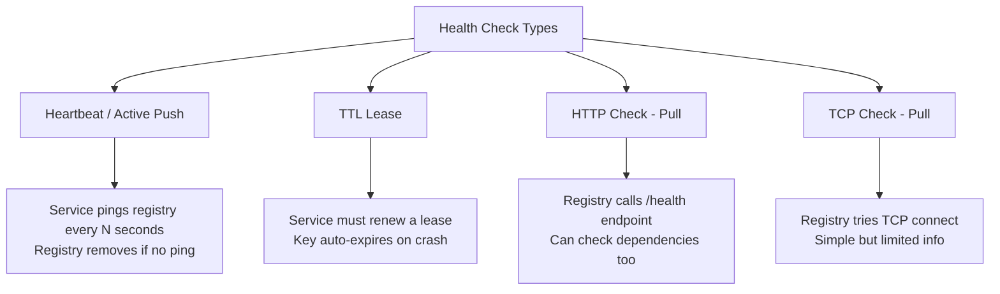

### HTTP Health Check — The Gold Standard

```go
// Go: A production-grade health check endpoint
package main

import (
    "context"
    "database/sql"
    "encoding/json"
    "net/http"
    "time"
    
    "github.com/go-redis/redis/v8"
)

type HealthStatus struct {
    Status    string            `json:"status"`
    Timestamp time.Time         `json:"timestamp"`
    Version   string            `json:"version"`
    Checks    map[string]string `json:"checks"`
}

var (
    db          *sql.DB
    redisClient *redis.Client
)

func healthHandler(w http.ResponseWriter, r *http.Request) {
    status := HealthStatus{
        Timestamp: time.Now(),
        Version:   "2.1.0",
        Checks:    make(map[string]string),
    }
    
    httpCode := http.StatusOK
    allHealthy := true
    
    // Check 1: Database connectivity
    ctx, cancel := context.WithTimeout(r.Context(), 2*time.Second)
    defer cancel()
    if err := db.PingContext(ctx); err != nil {
        status.Checks["database"] = "unhealthy: " + err.Error()
        allHealthy = false
    } else {
        status.Checks["database"] = "healthy"
    }
    
    // Check 2: Redis connectivity
    ctx2, cancel2 := context.WithTimeout(r.Context(), 1*time.Second)
    defer cancel2()
    if err := redisClient.Ping(ctx2).Err(); err != nil {
        status.Checks["redis"] = "unhealthy: " + err.Error()
        allHealthy = false
    } else {
        status.Checks["redis"] = "healthy"
    }
    
    // Check 3: Disk space (example)
    // status.Checks["disk"] = checkDiskSpace()
    
    if allHealthy {
        status.Status = "healthy"
    } else {
        status.Status = "unhealthy"
        httpCode = http.StatusServiceUnavailable
    }
    
    w.Header().Set("Content-Type", "application/json")
    w.WriteHeader(httpCode)
    json.NewEncoder(w).Encode(status)
}
```

**Consul health check config to use this:**

```json
{
  "service": {
    "name": "payment-service",
    "check": {
      "id": "payment-http-health",
      "name": "Payment Service HTTP Health",
      "http": "http://localhost:8080/health",
      "method": "GET",
      "interval": "10s",
      "timeout": "3s",
      "deregister_critical_service_after": "1m"
    }
  }
}
```

### Readiness vs Liveness — The Kubernetes Distinction

This is a critical nuance that even senior engineers often conflate:

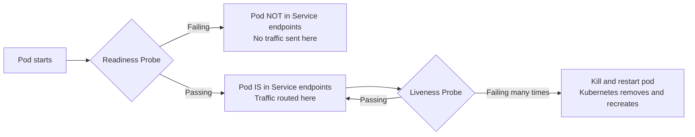

```yaml
# Kubernetes pod spec — both probes defined
containers:
- name: payment-service
  image: company/payment-service:v2
  
  # READINESS: "Am I ready to serve traffic?"
  # Use: Service only routes to ready pods
  # Fail scenario: DB connection not established yet, cache warming up
  readinessProbe:
    httpGet:
      path: /ready      # Different endpoint from liveness!
      port: 8080
    initialDelaySeconds: 15   # Wait 15s after container starts before checking
    periodSeconds: 5          # Check every 5s
    failureThreshold: 3       # Remove from endpoints after 3 fails
    successThreshold: 1       # Add back to endpoints after 1 success
  
  # LIVENESS: "Am I alive enough to keep running?"
  # Use: Kubernetes restarts dead/stuck pods
  # Fail scenario: Deadlock, OOM, infinite loop
  livenessProbe:
    httpGet:
      path: /health
      port: 8080
    initialDelaySeconds: 30   # Wait longer — let app fully initialize
    periodSeconds: 10
    failureThreshold: 5       # Don't restart too aggressively
  
  # STARTUP: "Have I finished starting up?"
  # Use: Slow-starting apps that need more time (prevents premature liveness failures)
  startupProbe:
    httpGet:
      path: /health
      port: 8080
    failureThreshold: 30      # 30 * 10s = 5 minutes to start
    periodSeconds: 10
```

```python
# Flask: Separate readiness vs liveness endpoints
from flask import Flask, jsonify
import redis
import psycopg2

app = Flask(__name__)

# /health — liveness check (is the process alive?)
# Should be VERY lightweight — just return 200
@app.route('/health')
def liveness():
    return jsonify({"status": "alive"}), 200

# /ready — readiness check (can I serve traffic?)
# Check ALL dependencies
@app.route('/ready')
def readiness():
    checks = {}
    all_ready = True
    
    # Check DB
    try:
        conn = get_db_connection()
        conn.cursor().execute("SELECT 1")
        checks['database'] = 'ready'
    except Exception as e:
        checks['database'] = f'not ready: {str(e)}'
        all_ready = False
    
    # Check Redis
    try:
        redis_client.ping()
        checks['redis'] = 'ready'
    except Exception as e:
        checks['redis'] = f'not ready: {str(e)}'
        all_ready = False
    
    # Check dependent service
    try:
        r = requests.get('http://user-service/health', timeout=1)
        if r.status_code == 200:
            checks['user-service'] = 'ready'
        else:
            checks['user-service'] = 'not ready'
            all_ready = False
    except:
        checks['user-service'] = 'unreachable'
        all_ready = False
    
    status_code = 200 if all_ready else 503
    return jsonify({
        "status": "ready" if all_ready else "not ready",
        "checks": checks
    }), status_code
```

### Health Check Strategy Comparison

| Strategy | Who initiates | Detects slow responses | Checks app dependencies | Works on crash | Overhead |
|----------|--------------|----------------------|------------------------|----------------|----------|
| Heartbeat (Eureka) | Service | No | No | Only via timeout | Low |
| TTL Lease (etcd) | Service | No | No | Yes (lease expires) | Low |
| HTTP Check (Consul) | Registry | Yes (timeout) | Yes (custom) | Yes (no response) | Medium |
| TCP Check (Consul) | Registry | Yes (timeout) | No | Yes | Low |
| Readiness Probe (K8s) | Kubernetes | Yes | Yes | Yes | Medium |
| Liveness Probe (K8s) | Kubernetes | Yes | Depends | Yes | Medium |

---

## DNS-Based Service Discovery

### The Analogy

When you type `flipkart.com` in your browser, you do not type `13.235.41.190`. Your computer asks DNS: "What is the IP for flipkart.com?" DNS answers. This exact same mechanism can be used for service-to-service communication.

DNS-based discovery is the most language-agnostic approach. Any language that can make a DNS query can discover services. No SDK. No special library. Just DNS.

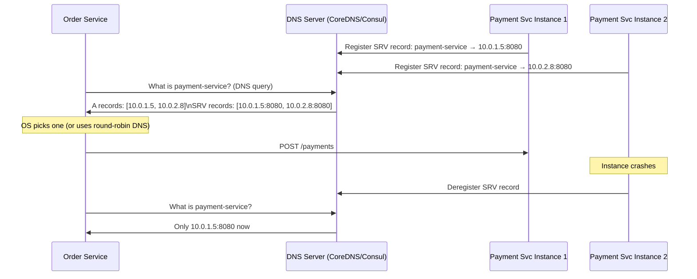

### DNS Record Types for Service Discovery

```bash
# A record: service name → IP address (no port)
payment-service.internal.  60 IN A  10.0.1.5
payment-service.internal.  60 IN A  10.0.2.8

# SRV record: service name → host:port (with priority and weight)
# Format: _service._proto.name TTL IN SRV priority weight port target
_payment-service._tcp.internal.  60 IN SRV 0 50 8080 host1.internal.
_payment-service._tcp.internal.  60 IN SRV 0 50 8080 host2.internal.

# Using SRV records for discovery
# Priority 0 means same priority — load balance between them
# Weight 50 means equal weight — use weighted load balancing if different
```

**Consul DNS discovery:**

```bash
# Consul automatically creates DNS entries for registered services
# Query syntax: <service-name>.service.<datacenter>.consul

# Get all healthy instances
dig @127.0.0.1 -p 8600 payment-service.service.consul

# Get with port information (SRV records)
dig @127.0.0.1 -p 8600 payment-service.service.consul SRV

# Filter by tag (only v2 instances)
dig @127.0.0.1 -p 8600 v2.payment-service.service.consul SRV

# Filter by datacenter
dig @127.0.0.1 -p 8600 payment-service.service.dc1.consul SRV

# Example output:
# _payment-service._tcp.service.consul. 0 IN SRV 1 1 8080 machine1.node.dc1.consul.
# _payment-service._tcp.service.consul. 0 IN SRV 1 1 8080 machine2.node.dc1.consul.
```

```python
# Python: DNS-based service discovery — no Consul SDK needed
import dns.resolver
import random

def get_payment_service_instances():
    try:
        # Query SRV records for host AND port info
        answers = dns.resolver.resolve('payment-service.service.consul', 'SRV')
        instances = []
        for rdata in answers:
            host = str(rdata.target).rstrip('.')
            port = rdata.port
            weight = rdata.weight
            instances.append({
                'host': host,
                'port': port,
                'weight': weight
            })
        return instances
    except dns.resolver.NXDOMAIN:
        raise Exception("payment-service not found in DNS")
    except dns.resolver.NoAnswer:
        raise Exception("No healthy payment-service instances")

# Usage
instances = get_payment_service_instances()
instance = random.choice(instances)
payment_url = f"http://{instance['host']}:{instance['port']}/payments"
```

### The DNS TTL Problem — Important!

DNS caches responses for the TTL (Time-To-Live) duration. If a service goes down but your DNS client has cached its IP for 60 seconds, you will keep routing to that dead instance for up to 60 seconds.

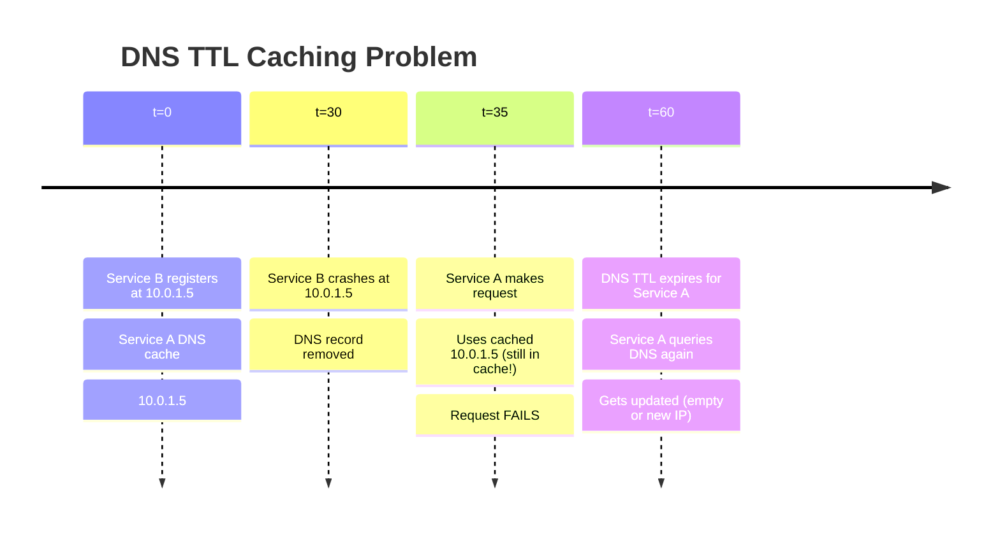

**Solutions to DNS TTL problem:**

1. **Low TTL (10-30 seconds):** Reduces staleness window but increases DNS query load.
2. **DNS negative caching:** Handle NXDOMAIN gracefully — retry with exponential backoff.
3. **Health checks at client:** Even after DNS lookup, do connection health checks before routing.
4. **Service mesh:** Bypass DNS-level caching entirely with direct control plane pushes.

### DNS Discovery Trade-offs

| Aspect | Detail |
|--------|--------|
| Advantage | Works with ANY language — universal protocol |
| Advantage | Standard protocol, works with existing DNS tools |
| Advantage | No additional SDK dependencies |
| Advantage | Simple mental model for developers |
| Disadvantage | DNS TTL caching causes stale data |
| Disadvantage | SRV records carry no health info directly |
| Disadvantage | Low TTL = high DNS query volume = cost/load |
| Disadvantage | JVM famously caches DNS forever by default (must configure `networkaddress.cache.ttl`) |
| Disadvantage | DNS does not push updates — clients must poll |

**Java DNS TTL fix — critical for production:**

```properties
# In JVM: DNS caches forever by default!
# Add to JVM startup or security.properties
# Cache successful lookups for 30 seconds (not forever)
networkaddress.cache.ttl=30
# Cache negative lookups for 5 seconds
networkaddress.cache.negative.ttl=5
```

---

## Kubernetes Built-In Service Discovery — The Modern Standard

### The Analogy

Think of a company with internal extensions. You do not need to know which desk or floor your colleague is sitting at. You just dial their extension "Payment Team — ext 4501." The building's PABX system routes your call to whoever is currently at that desk. The desk can change, people can move, but the extension never changes.

That is exactly what Kubernetes does. Services get a stable DNS name (the extension). Pods behind it can change — restart, scale, move nodes — but the DNS name stays constant.

### How Kubernetes Service Discovery Works — Step by Step

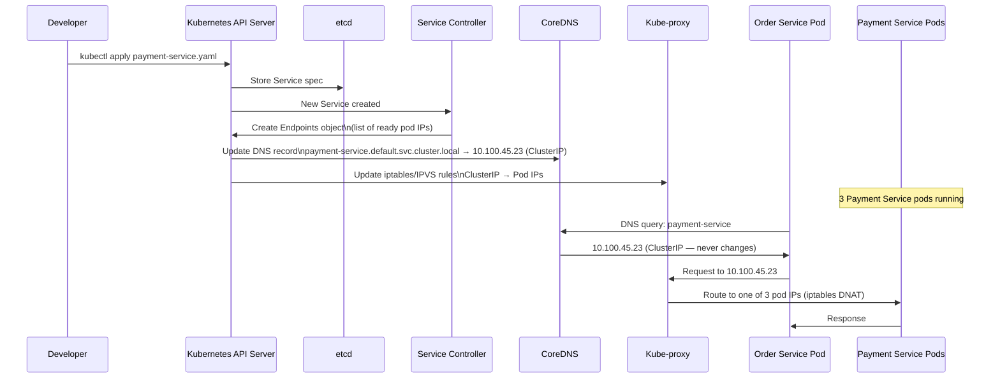

### Kubernetes Service Types

```yaml
# ClusterIP — internal only (default)
# Use: service-to-service communication inside cluster
apiVersion: v1
kind: Service
metadata:
  name: payment-service
  namespace: default
spec:
  type: ClusterIP
  selector:
    app: payment-service
    version: v2
  ports:
  - name: http
    port: 80          # Port the Service exposes
    targetPort: 8080  # Port the container listens on
    protocol: TCP
```

```yaml
# NodePort — expose on every node's IP at a static port
# Use: Development, on-prem clusters without cloud LB
apiVersion: v1
kind: Service
metadata:
  name: payment-service-external
spec:
  type: NodePort
  selector:
    app: payment-service
  ports:
  - port: 80
    targetPort: 8080
    nodePort: 30080  # Range: 30000-32767
```

```yaml
# LoadBalancer — creates a cloud provider load balancer
# Use: Production, exposing to internet or other namespaces
apiVersion: v1
kind: Service
metadata:
  name: payment-service-lb
spec:
  type: LoadBalancer
  selector:
    app: payment-service
  ports:
  - port: 80
    targetPort: 8080
```

```yaml
# Headless Service — no ClusterIP, direct pod DNS records
# Use: StatefulSets (Cassandra, Kafka, PostgreSQL), when you need to address pods individually
apiVersion: v1
kind: Service
metadata:
  name: cassandra
spec:
  clusterIP: None   # Makes it headless
  selector:
    app: cassandra
  ports:
  - port: 9042

# DNS result: individual pod A records
# cassandra-0.cassandra.default.svc.cluster.local → 10.0.1.5
# cassandra-1.cassandra.default.svc.cluster.local → 10.0.2.8
# cassandra-2.cassandra.default.svc.cluster.local → 10.0.3.2
```

### DNS Naming Convention in Kubernetes

```bash
# From WITHIN the same namespace (default):
http://payment-service/          # Short name works

# From a DIFFERENT namespace (e.g., from "order" namespace):
http://payment-service.default/  # namespace-qualified

# Fully Qualified Domain Name (always works from anywhere):
http://payment-service.default.svc.cluster.local/

# Pod-specific (headless services, StatefulSets):
http://payment-service-0.payment-service.default.svc.cluster.local/
```

```python
# Python inside a Kubernetes pod — it just works
import requests

# No SDK, no configuration, just use the service name
# Kubernetes injects DNS config into every pod automatically

# Same namespace
response = requests.post(
    "http://payment-service/payments",
    json={"order_id": "123", "amount": 99.99},
    timeout=5
)

# Cross-namespace
response = requests.get(
    "http://user-service.users.svc.cluster.local/users/456"
)
```

### CoreDNS — How K8s DNS Works Under the Hood

Kubernetes runs CoreDNS as a deployment inside the cluster. Every pod is configured (via `/etc/resolv.conf` injected by kubelet) to use CoreDNS as its DNS server.

```bash
# Inside a Kubernetes pod, check DNS config:
cat /etc/resolv.conf
# nameserver 10.96.0.10        # CoreDNS ClusterIP
# search default.svc.cluster.local svc.cluster.local cluster.local
# options ndots:5

# This search list means:
# When you query "payment-service":
# 1. Try: payment-service.default.svc.cluster.local
# 2. Try: payment-service.svc.cluster.local  
# 3. Try: payment-service.cluster.local
# 4. Try: payment-service (bare)
# This is why short names work!
```

```bash
# Debug DNS inside a pod
kubectl run debug --rm -it --image=busybox -- sh

# Inside the debug pod:
nslookup payment-service
# Server:    10.96.0.10
# Address 1: 10.96.0.10 kube-dns.kube-system.svc.cluster.local
# Name:      payment-service
# Address 1: 10.100.45.23 payment-service.default.svc.cluster.local

nslookup payment-service.default.svc.cluster.local
# Returns the ClusterIP

# For headless service — returns pod IPs directly:
nslookup cassandra.default.svc.cluster.local
# Address 1: 10.0.1.5 cassandra-0.cassandra.default.svc.cluster.local
# Address 2: 10.0.2.8 cassandra-1.cassandra.default.svc.cluster.local
```

---

## Service Mesh: Service Discovery on Autopilot

### The Analogy

Imagine every employee in a company has a personal assistant. When you need to talk to someone in another department, your assistant handles everything — finds who is available, sets up a secure call, records the conversation, retries if the first attempt fails, and reports back to management. You just say "I need to talk to the payments team." Your assistant does the rest.

That is a service mesh. Every service pod gets a sidecar proxy. All network traffic goes through this proxy. The mesh control plane pushes real-time routing maps to all proxies.

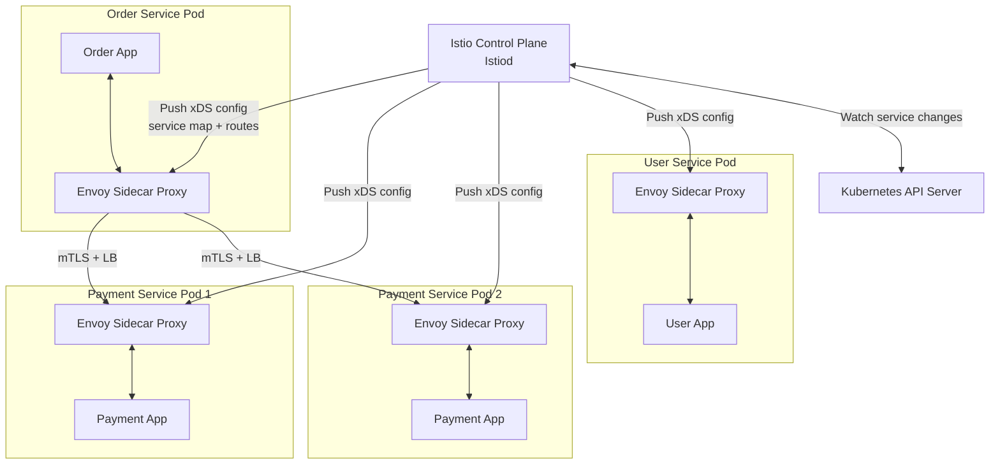

### What a Service Mesh Gives You (Beyond Discovery)

| Feature | Without Service Mesh | With Service Mesh (Istio) |
|---------|---------------------|--------------------------|
| Service Discovery | DNS / Registry SDK | Automatic via xDS protocol push |
| Load Balancing | Round-robin DNS or LB | Round-robin, least connections, locality-aware |
| mTLS between services | Manual cert management | Automatic, zero config |
| Retries | Manual retry logic in code | Declarative YAML policy |
| Circuit breaking | Manual (Hystrix, Resilience4j) | Declarative YAML policy |
| Distributed tracing | Manual instrumentation | Automatic (headers injected) |
| Traffic splitting (canary) | Manual, complex | Declarative % split in VirtualService |
| Rate limiting | Manual or gateway-only | Per-service policy |

### Istio VirtualService — Service Discovery + Traffic Control

```yaml
# Canary deployment: route 90% to v1, 10% to v2
# Instagram uses this pattern for new feature rollouts
apiVersion: networking.istio.io/v1alpha3
kind: VirtualService
metadata:
  name: payment-service
spec:
  hosts:
  - payment-service
  http:
  - match:
    - headers:
        x-canary-user:
          exact: "true"
    route:
    - destination:
        host: payment-service
        subset: v2       # Canary users always get v2
  - route:               # Everyone else: 90/10 split
    - destination:
        host: payment-service
        subset: v1
      weight: 90
    - destination:
        host: payment-service
        subset: v2
      weight: 10
    retries:
      attempts: 3
      perTryTimeout: 2s
    timeout: 10s
---
apiVersion: networking.istio.io/v1alpha3
kind: DestinationRule
metadata:
  name: payment-service
spec:
  host: payment-service
  trafficPolicy:
    connectionPool:
      tcp:
        maxConnections: 100
    outlierDetection:   # Circuit breaker!
      consecutiveErrors: 5
      interval: 30s
      baseEjectionTime: 30s
  subsets:
  - name: v1
    labels:
      version: v1
  - name: v2
    labels:
      version: v2
```

### When to Use a Service Mesh

Use it when you need:
- mTLS between all services (zero-trust network security)
- Advanced traffic management (canary, A/B testing, fault injection)
- Automatic distributed tracing without code changes
- Consistent retry and circuit breaking policies across all services

Do NOT use it when:
- You have fewer than ~20 services (overhead not worth it)
- Your team does not have Kubernetes/Istio expertise
- Latency is critical (sidecar adds ~1ms per hop)
- Simple apps that just need basic routing

---

## Real-World Examples: How The Big Companies Do It

### Netflix

Netflix runs on AWS. They use:
- **Eureka** for service registration and discovery (they built it)
- **Ribbon** (now deprecated, replaced by Spring Cloud LoadBalancer) for client-side load balancing
- **Hystrix** for circuit breaking (now replaced by Resilience4j)
- Everything in Java/Spring Boot

Their key insight: Eureka's AP model (availability over consistency) is correct for their use case. A briefly stale instance list is better than no response.

### Uber

Uber has a complex polyglot environment — Go, Java, Python, Node.js. They use:
- **Consul** for service registry (language-agnostic HTTP API + DNS)
- **Custom sidecar proxies** for service-to-service traffic
- **Envoy** at the network layer

### Google (Kubernetes creator)

Kubernetes was created at Google based on their internal Borg/Omega systems. Their service discovery philosophy:
- Built-in to the platform — no external registry needed
- DNS-based within the cluster
- Label-based service targeting (not IP-based)
- Health checking via liveness/readiness probes

### Swiggy / Zomato (India)

These companies run heavily on Kubernetes on AWS/GCP:
- Kubernetes native service discovery for internal services
- AWS ALB for ingress (external traffic)
- Consul for multi-region coordination
- Service mesh experiments for advanced routing

---

## Anti-Patterns and Common Mistakes

Yeh mistakes mat karna — interview mein bhi poochhte hain:

### 1. Not Handling Stale Registry Data

```python
# BAD: Trust registry blindly, crash on connection failure
def call_payment_service(request):
    instance = registry.get_healthy_instance("payment-service")
    return http.post(f"http://{instance.ip}:{instance.port}/payments", request)
    # If instance just became unhealthy but registry hasn't caught up: crash!

# GOOD: Handle failures gracefully, retry with different instance
def call_payment_service(request, retries=3):
    for attempt in range(retries):
        try:
            instance = registry.get_healthy_instance("payment-service")
            return http.post(
                f"http://{instance.ip}:{instance.port}/payments",
                request,
                timeout=5
            )
        except (ConnectionError, Timeout) as e:
            if attempt == retries - 1:
                raise
            # Mark instance as suspicious, try another
            registry.report_failure(instance)
            time.sleep(0.1 * (2 ** attempt))  # Exponential backoff
```

### 2. Using Liveness Probe for Dependency Checks

```yaml
# BAD: Liveness probe checks database
livenessProbe:
  httpGet:
    path: /health-with-db-check  # If DB is down, pod restarts INFINITELY
    port: 8080
  # This kills your pods when DB is temporarily down!
  # You now have no Payment Service pods AND a DB issue

# GOOD: Liveness checks only the process, readiness checks dependencies
livenessProbe:
  httpGet:
    path: /alive       # Only: is this process running?
    port: 8080
readinessProbe:
  httpGet:
    path: /ready       # Is this process ready? (checks DB, cache, etc.)
    port: 8080
```

### 3. Not Deregistering Gracefully

```python
# BAD: Service exits without deregistering
import sys
if __name__ == "__main__":
    register_with_consul()
    app.run(port=8080)
    # Process killed: stays in registry until TTL expires (30-90s of bad routing!)

# GOOD: Graceful shutdown with deregistration
import signal
import atexit

def shutdown():
    print("Deregistering from service registry...")
    consul.deregister(service_id)
    print("Deregistered. Goodbye.")

atexit.register(shutdown)
signal.signal(signal.SIGTERM, lambda sig, frame: (shutdown(), sys.exit(0)))
signal.signal(signal.SIGINT, lambda sig, frame: (shutdown(), sys.exit(0)))
```

### 4. Registry as a Single Point of Failure

```bash
# BAD: Single Consul server
consul agent -server -bootstrap

# If this node dies → entire service discovery fails → nothing can find anything

# GOOD: Consul cluster with 3 or 5 servers (Raft quorum)
# Node 1 (bootstrap):
consul agent -server -bootstrap-expect=3 -node=consul-1

# Node 2:
consul agent -server -bootstrap-expect=3 -node=consul-2 -join=consul-1-ip

# Node 3:
consul agent -server -bootstrap-expect=3 -node=consul-3 -join=consul-1-ip

# Now: Can lose 1 server and keep working
# 3 servers: can lose 1 (quorum = 2)
# 5 servers: can lose 2 (quorum = 3)
```

### 5. Ignoring DNS TTL in JVM

```java
// BAD: Default JVM behavior — caches DNS forever
// java.security.Security.setProperty("networkaddress.cache.ttl", "-1"); // FOREVER!
// Every DNS lookup is cached indefinitely → stale IPs for hours

// GOOD: Set reasonable TTL
java.security.Security.setProperty("networkaddress.cache.ttl", "30");  // 30 seconds
java.security.Security.setProperty("networkaddress.cache.negative.ttl", "5"); // 5 seconds for failures
```

---

## Choosing the Right Pattern: The Decision Tree

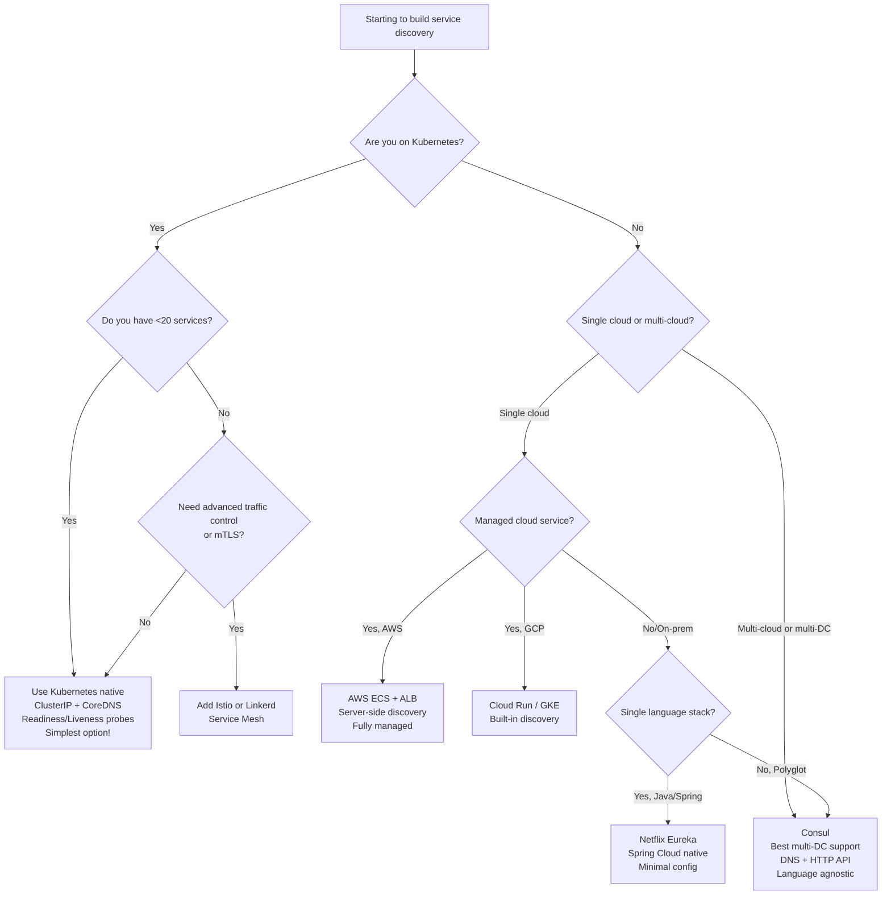

### Quick Reference: When to Use What

| Scenario | Recommended Approach |
|----------|---------------------|
| On Kubernetes, < 50 services | Kubernetes native (ClusterIP + CoreDNS) |
| On Kubernetes, need canary deployments | Add Istio VirtualService |
| On Kubernetes, need mTLS between services | Istio or Linkerd service mesh |
| AWS ECS / Fargate | ALB + Target Groups (server-side) |
| Spring Boot / JVM only | Spring Cloud + Eureka |
| Multi-cloud / multi-datacenter | Consul |
| Hybrid (K8s + VMs + bare metal) | Consul |
| Need DNS-based discovery (polyglot) | Consul DNS or CoreDNS |
| Maximum simplicity, single cloud | Cloud provider's managed solution |

---

## Full Architecture Comparison

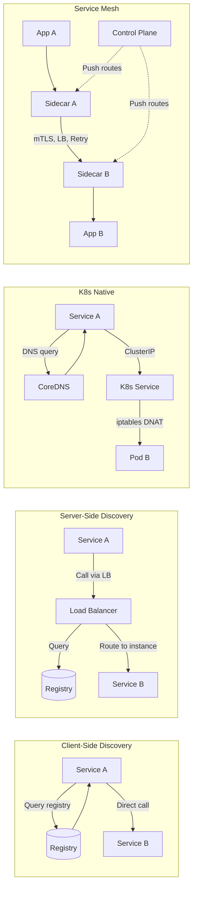

| Approach | Network Hops | Complexity | Language Agnostic | Extra Infra | Best For |
|----------|-------------|-----------|-------------------|-------------|---------|
| Client-Side (Eureka) | 1 (direct) | Medium | No (SDK required) | Registry cluster | Java/Spring monorepos |
| Server-Side (ALB) | 2 (via LB) | Low | Yes | Load balancer | Cloud-native, polyglot |
| DNS-Based | 1 (after lookup) | Low | Yes | DNS server | Legacy systems, simple use cases |
| Kubernetes Native | 1 (ClusterIP) | Low | Yes | None | K8s workloads |
| Service Mesh (Istio) | 2 (via sidecar) | High | Yes | Sidecars + control plane | Large, complex K8s environments |
| Consul | 1 (direct) | Medium | Yes | Consul cluster | Multi-DC, multi-cloud |

---

## Common Interview Questions

### Q1: "What is service discovery? Why do we need it?"

**Answer framework:**
- **Problem:** In microservices, services run on dynamic infrastructure. IPs change when containers restart, autoscaling adds/removes instances, rolling deployments cycle pods.
- **Old solution:** Hardcode IPs — breaks the moment anything changes.
- **Service discovery:** A dynamic system where services register themselves with a central registry on startup and other services look them up by name.
- **Two components:** Registration (announcing yourself) + Lookup (finding others).

### Q2: "Explain client-side vs server-side discovery. Trade-offs?"

**Client-side:**
- Client queries registry, gets list of instances, load-balances itself
- Example: Netflix Eureka with Spring Cloud
- Pro: Direct call (lower latency), client controls LB strategy
- Con: Every client needs SDK, polyglot environments are painful

**Server-side:**
- Client calls load balancer, LB queries registry and routes
- Example: AWS ALB + ECS, NGINX + Consul
- Pro: Client is dumb (language agnostic), centralized control
- Con: Extra network hop, LB can be bottleneck/SPOF

### Q3: "How does Kubernetes handle service discovery?"

- Kubernetes Services get a stable ClusterIP and DNS name via CoreDNS
- `payment-service.default.svc.cluster.local` always resolves to the same ClusterIP
- kube-proxy updates iptables/IPVS rules to DNAT requests from ClusterIP to actual pod IPs
- Readiness probes control which pods are in the endpoints list
- Pods that fail readiness are removed from the Service endpoints — no traffic sent
- No external registry needed for in-cluster communication

### Q4: "Compare Consul vs Eureka"

| | Consul | Eureka |
|-|--------|--------|
| CAP | CP (Raft) | AP (eventual) |
| Health checks | HTTP, TCP, script, TTL, gRPC | Heartbeat only |
| Language | Any (HTTP API + DNS) | Primarily Java |
| Multi-DC | Native | Manual |
| DNS interface | Yes | No |
| Self-preservation | No | Yes (stops eviction on mass failure) |

**When Eureka's AP is better:** Netflix scenario — during network partition, you want to keep routing (even to potentially stale instances) rather than refusing all requests.

**When Consul's CP is better:** Banking/payments — you need accurate information. Better to fail fast than route to wrong instance.

### Q5: "What are the different health check strategies? Which is best?"

- **Heartbeat:** Service pings registry every N seconds. Simple but doesn't verify actual health.
- **TTL Lease:** Service must renew a lease. Auto-expires on crash. Good for detecting sudden crashes.
- **HTTP Check:** Registry calls /health endpoint. Best — can verify DB connections, cache, downstream services.
- **TCP Check:** Registry opens TCP connection. Simple, catches process death but not internal health.

**Best for production:** HTTP check with meaningful health logic (check dependencies, not just "process is running").

**Critical distinction:** Kubernetes readiness probe (traffic routing) vs liveness probe (restart trigger) — never put dependency checks in liveness probe or you will cause cascading restarts.

### Q6: "What is the DNS TTL problem in service discovery?"

DNS caches responses for the TTL duration. If a service instance goes down and its DNS record is removed, clients that have cached the old record will still route traffic to the dead instance until their cache expires.

**Solutions:**
1. Set low TTLs (10-30 seconds) — reduces staleness but increases DNS query load
2. Fix JVM's default infinite DNS caching (`networkaddress.cache.ttl=30`)
3. Build retry logic — when a connection fails, retry with fresh DNS lookup
4. Use service mesh (Istio) — bypasses DNS caching with direct control plane push

### Q7: "When would you choose Consul over Kubernetes native service discovery?"

Kubernetes native is great for single-cluster scenarios. Choose Consul when:
1. **Multi-cluster:** Services in multiple Kubernetes clusters need to find each other
2. **Hybrid:** Mix of Kubernetes pods + traditional VMs + bare metal servers
3. **Multi-cloud:** Services split across AWS + GCP + on-prem
4. **Non-Kubernetes services:** Legacy services not yet containerized need to participate
5. **Advanced features:** Need Consul's key-value store for configuration management alongside service discovery

### Q8: "What is a service mesh? How does it relate to service discovery?"

A service mesh (Istio, Linkerd) extends service discovery by running a sidecar proxy alongside every service. The mesh control plane maintains a real-time topology map and pushes it to all sidecars.

Beyond discovery, it adds:
- mTLS encryption between services
- Retries and circuit breaking (declarative, no code changes)
- Distributed tracing
- Traffic splitting for canary deployments
- Rate limiting and access policies

Trade-off: ~1ms additional latency per hop, significant operational complexity.

### Q9: "What is self-preservation mode in Eureka?"

If more than 15% of all registered instances stop sending heartbeats simultaneously, Eureka suspects a network partition rather than actual failures. It stops evicting instances and preserves the current registry state.

Why: During a network blip, heartbeat traffic may fail but actual services are fine. Without self-preservation, Eureka would mass-evict healthy services, causing unnecessary outages.

Risk: Stale instances stay in registry longer than they should after actual failures.

### Q10: "How would you design service discovery for a system spanning two AWS regions?"

**Answer:**
1. Deploy Consul in each region — 3-5 servers per region in HA mode
2. Configure Consul WAN federation between regions
3. Services register with local region's Consul
4. For cross-region discovery, query the remote DC: `service.service.us-east-1.consul`
5. Implement health checks at the region level
6. Use latency-based routing — prefer same-region instances, only cross-region on failure
7. Consider: service mesh (Istio multi-cluster) if on Kubernetes

---

## Key Takeaways

1. **Hardcoding IPs is fundamentally broken in cloud-native systems.** Containers restart with new IPs, autoscaling adds unknown instances, rolling deployments cycle pods. Service discovery is not a luxury — it is a requirement.

2. **Two patterns, one goal.** Client-side (Eureka) = client does the lookup + load balancing. Server-side (ALB) = client is dumb, load balancer does the work. Choose based on your language diversity and latency requirements.

3. **Two sides of every discovery system.** Registration (announcing yourself) and lookup (finding others). Both must be solved. Both must handle failure gracefully.

4. **Health checks are the soul of service discovery.** A registry that has dead instances is worse than no registry — it actively routes traffic to dead instances. HTTP health checks that verify real dependencies (DB, cache, downstream services) are the gold standard.

5. **Kubernetes users: use what the platform gives you.** ClusterIP + CoreDNS + Readiness Probes handle 95% of discovery needs with zero additional infrastructure. Only add Consul or a service mesh when you have multi-cluster, multi-cloud, or advanced traffic management requirements.

6. **CAP theorem applies to registries too.** Consul (CP) gives you accurate data but may reject requests during partitions. Eureka (AP) gives you stale-but-available data during partitions. Pick based on your tolerance for stale vs unavailable.

7. **DNS caching is the silent killer.** Low TTLs, fixed JVM defaults (`networkaddress.cache.ttl=30`), and client-side retry logic are essential. Service meshes solve this by pushing updates directly to proxies.

8. **Service mesh = discovery + security + observability.** If your team is ready for the operational complexity, Istio or Linkerd gives you everything in one platform: automatic mTLS, retries, circuit breaking, distributed tracing, canary deployments — without changing application code.

9. **Always cluster your registry.** A single-node registry is a single point of failure for your entire microservices system. 3 or 5 nodes for Consul, clustered Eureka with multiple instances, multi-master etcd.

10. **Start simple, evolve.** Day 1: Kubernetes native discovery. Month 6: Add Consul for multi-cluster. Year 2: Evaluate service mesh if complexity warrants it. Do not design for scale you do not have yet.

---

*Chapter 37 of System Design Notes — High-Level Design Series*
