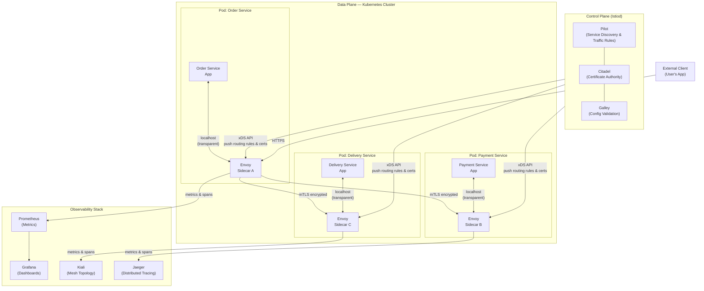
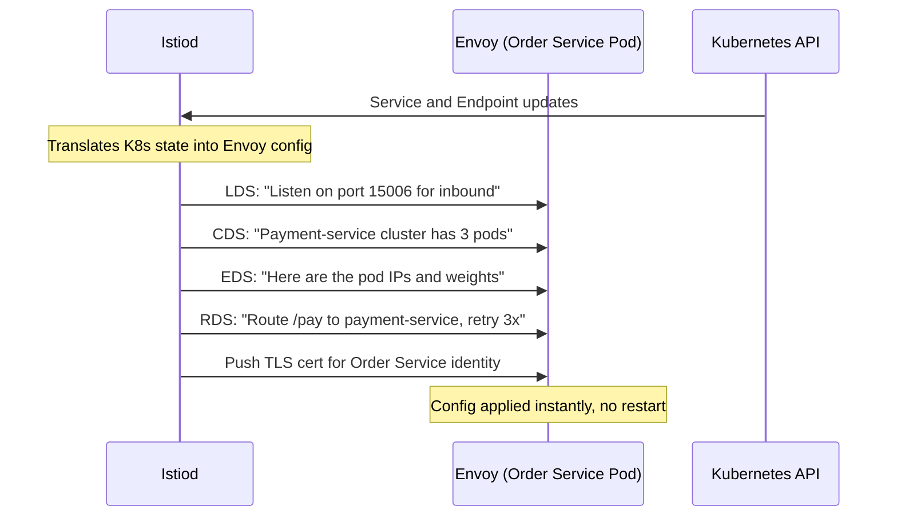
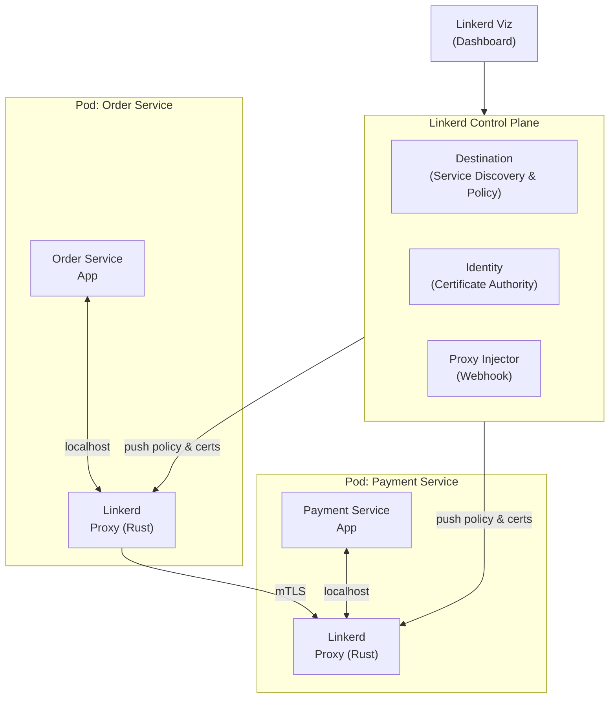
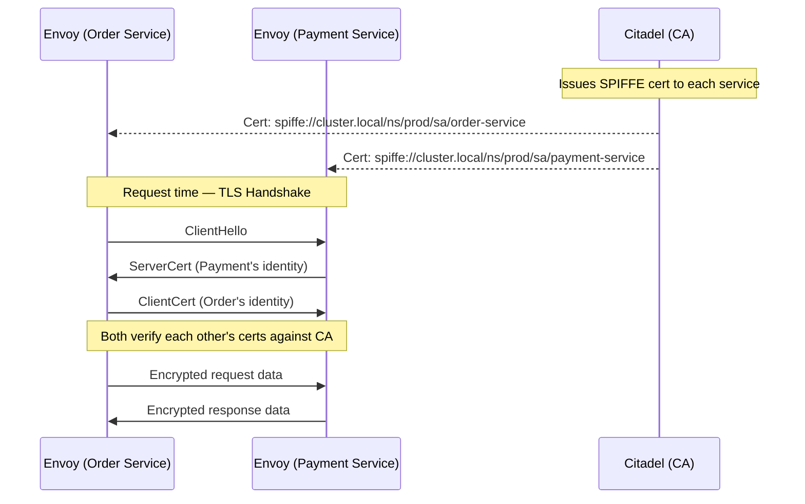
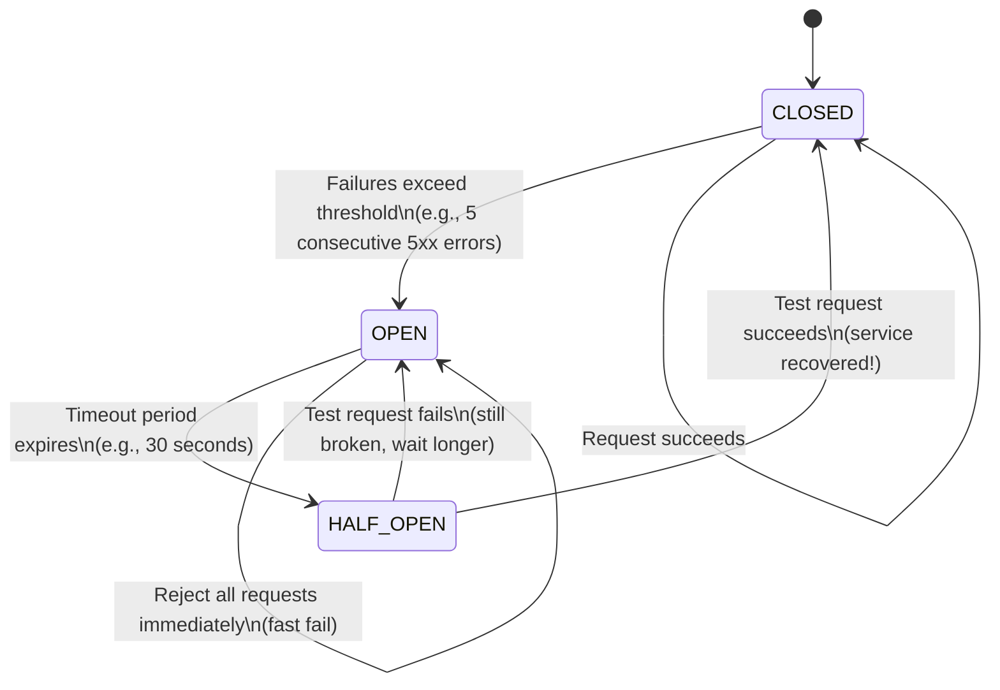
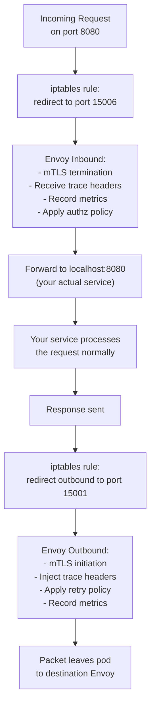
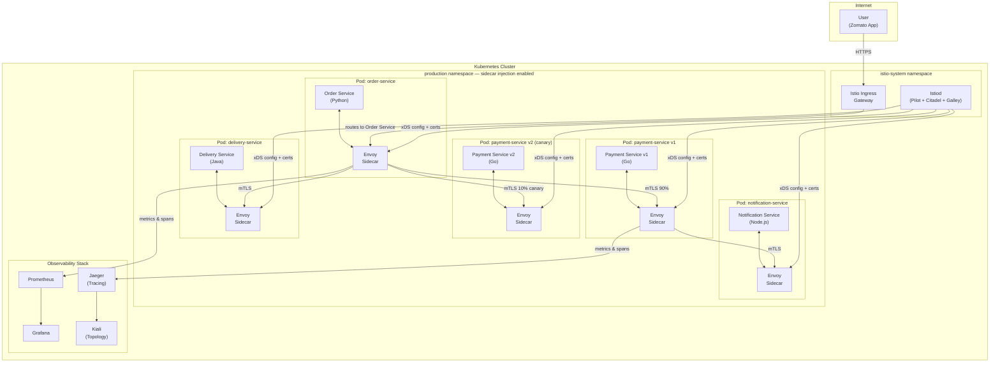
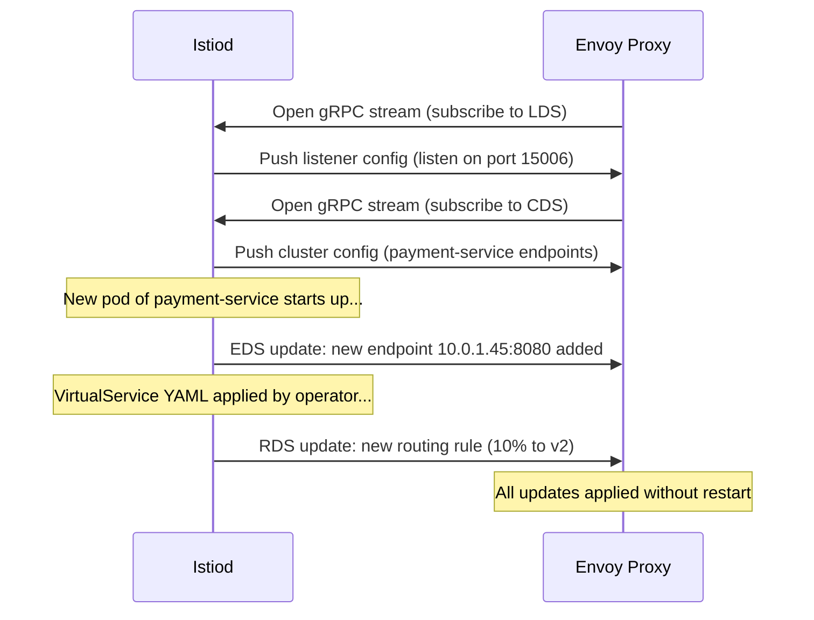

# 38 — Service Mesh (Istio, Linkerd)

---

## Why Does This Topic Even Exist?

Samjho aise — imagine you are building a large apartment complex. You are the builder. Every flat needs electricity, water, security cameras, fire alarms, and an intercom. Now, do you ask every flat-owner to install their own wiring system independently? Of course not — that would be chaos. You build the infrastructure once, into the building itself, and every flat gets it for free.

Microservices have the exact same problem. And **service mesh** is the answer.

---

## The Problem at Scale: Every Service Re-invents the Wheel

When you move from a monolith to microservices — like Swiggy splitting into Order Service, Delivery Service, Restaurant Service, Payment Service — every one of those services needs to talk to others over the network. And every single one of them needs to handle:

- **Retries** — if the Payment Service times out, do we try again?
- **Timeouts** — how long do we wait before giving up?
- **Circuit breaking** — if the Delivery Service is down, do we keep hammering it?
- **Mutual TLS (mTLS)** — how do we make sure Order Service is really talking to Payment Service and not some rogue service?
- **Distributed tracing** — a user's order involves 12 service hops; how do we trace where latency came from?
- **Metrics** — how many requests per second? What's the error rate?
- **Rate limiting** — prevent one angry customer from DDoSing the entire review service

The naive approach: every team implements all of this themselves. The Python team uses `requests` with retry logic. The Go team uses `go-resiliency`. The Java team uses Resilience4J. Each has slightly different behaviour, slightly different bugs, and slightly different configuration. One team forgets timeouts entirely. Another team writes retries without jitter, triggering a thundering herd that takes down the database.

```
❌ Without Service Mesh — Cross-cutting concerns live inside EVERY service

┌─────────────────────────────────────┐   ┌─────────────────────────────────────┐
│  Order Service (Python)             │   │  Payment Service (Go)               │
│  ┌────────────────────────────────┐ │   │  ┌────────────────────────────────┐ │
│  │  Business Logic                │ │   │  │  Business Logic                │ │
│  │  + retry logic                 │ │   │  │  + retry logic      (again!)   │ │
│  │  + timeout handling            │ │   │  │  + timeout handling (again!)   │ │
│  │  + circuit breaker             │ │   │  │  + circuit breaker  (again!)   │ │
│  │  + TLS cert management         │ │   │  │  + TLS cert mgmt    (again!)   │ │
│  │  + metrics export              │ │   │  │  + metrics export   (again!)   │ │
│  │  + trace injection             │ │   │  │  + trace injection  (again!)   │ │
│  └────────────────────────────────┘ │   │  └────────────────────────────────┘ │
└─────────────────────────────────────┘   └─────────────────────────────────────┘

    ┌─────────────────────────────────────┐   ┌─────────────────────────────────────┐
    │  Delivery Service (Node.js)         │   │  Restaurant Service (Java)          │
    │  ┌────────────────────────────────┐ │   │  ┌────────────────────────────────┐ │
    │  │  Business Logic                │ │   │  │  Business Logic                │ │
    │  │  + retry logic      (AGAIN!)   │ │   │  │  + retry logic      (AGAIN!)   │ │
    │  │  + timeout handling (AGAIN!)   │ │   │  │  + timeout handling (AGAIN!)   │ │
    │  │  + circuit breaker  (AGAIN!)   │ │   │  │  + circuit breaker  (AGAIN!)   │ │
    │  │  + TLS cert mgmt    (AGAIN!)   │ │   │  │  + TLS cert mgmt    (AGAIN!)   │ │
    │  └────────────────────────────────┘ │   │  └────────────────────────────────┘ │
    └─────────────────────────────────────┘   └─────────────────────────────────────┘
```

This is the actual reality at large companies before service meshes. Yeh kyun important hai — because at Uber, Google, or Netflix scale with 1000+ microservices, this duplication is not just annoying; it is a serious reliability and security risk.

---

## What is a Service Mesh?

**Simple analogy for a 5-year-old:** Imagine every house in your colony has a postman assigned to it. This postman lives right outside your door. Whenever you want to send a letter, you hand it to your postman — he knows the best routes, he knows if the destination postman is unavailable, he handles the stamps and security seals, and he keeps a record of every letter sent. You never deal with any of that — you just write the letter.

A service mesh is a **dedicated infrastructure layer** for service-to-service communication. It is deployed alongside your services and handles all the networking concerns automatically — without any changes to your application code.

What you get for free:
1. **mTLS** — encrypt and authenticate every internal call automatically
2. **Distributed tracing** — every request gets traced across all service hops
3. **Metrics** — latency, error rate, throughput for every service pair
4. **Retries and timeouts** — configured per-route, not per-service
5. **Circuit breaking** — automatic protection from cascading failures
6. **Traffic splitting** — send 5% of traffic to a new version for canary deployments
7. **Rate limiting** — protect services from overload
8. **Authorization policies** — "only Order Service may call Payment Service"

The critical insight: **your services do not change a single line of code.** The mesh intercepts traffic at the network layer.

---

## The Sidecar Proxy Pattern: The Core Mechanic

**Analogy:** Think of a racing driver with a co-pilot in a rally car. The driver (your service) focuses entirely on driving (business logic). The co-pilot (the sidecar proxy) handles the map, the pace notes, the radio communication, and safety instructions. The driver doesn't do any of that — it's handled by the person right beside them.

For every service you deploy in Kubernetes, the mesh automatically injects a second container — a **proxy** — right next to it in the same pod. This proxy intercepts every byte of network traffic going in and out of your service.

```
✅ With Service Mesh — The sidecar handles ALL cross-cutting concerns

┌──────────────────────────────────────────────────────────┐
│  Kubernetes Pod                                          │
│                                                          │
│  ┌─────────────────────┐   ┌────────────────────────┐   │
│  │  Order Service      │   │  Envoy Sidecar Proxy   │   │
│  │  (Python)           │◄──►│                        │   │
│  │                     │   │  - retries             │   │
│  │  Pure business      │   │  - timeouts            │   │
│  │  logic only.        │   │  - circuit breaking    │   │
│  │                     │   │  - mTLS                │   │
│  │  No retry code.     │   │  - metrics collection  │   │
│  │  No TLS code.       │   │  - distributed tracing │   │
│  │  No tracing code.   │   │  - rate limiting       │   │
│  └─────────────────────┘   └────────────────────────┘   │
│           App Container           Sidecar Container      │
└──────────────────────────────────────────────────────────┘
```

The most widely used proxy is **Envoy** — written in C++, originally built at Lyft, and now a CNCF graduated project. It supports HTTP/1.1, HTTP/2, gRPC, and raw TCP. Linkerd uses its own Rust-based microproxy instead of Envoy.

### How Traffic Actually Flows

When Order Service calls Payment Service, here is what actually happens:

```
Order Service → [localhost] → Envoy Sidecar A
                              (encrypts with mTLS,
                               records trace span,
                               applies retry policy)
                                    |
                                    | mTLS encrypted traffic over network
                                    |
                              Envoy Sidecar B
                              (decrypts mTLS,
                               records trace span,
                               forwards to Payment Service)
                                    |
                              Payment Service
```

Both the Order Service and Payment Service think they are making/receiving plain localhost calls. All the complexity happens between the sidecars. Basically, the services are blissfully ignorant.

---

## Data Plane vs Control Plane

This is one of the most important distinctions in networking and distributed systems — not just service mesh.

**Analogy that actually sticks:** Think of a highway system.
- The **data plane** is the actual roads, cars, and traffic moving. That is the real work happening.
- The **control plane** is the traffic police department, the Google Maps servers, the highway authority. They don't drive any cars — they decide the rules, update signage, and tell drivers where to go.

| Layer | Role | Examples | In the hot path? |
|---|---|---|---|
| **Data Plane** | Handles actual network traffic between services | Envoy sidecars in every pod | YES — every request goes through here |
| **Control Plane** | Configures and manages all proxies centrally | Istiod (Istio), Linkerd control plane | NO — it pushes config, doesn't handle requests |

The control plane pushes routing rules, TLS certificates, retry policies, and circuit breaker config to all data plane proxies. The proxies act on that configuration in real-time. If the control plane goes down temporarily, the data plane keeps running with the last configuration it received — your traffic does not stop.



---

## Istio: The Full-Featured Service Mesh

Istio was built by engineers from Google, IBM, and Lyft. It is the most popular service mesh and the one you are most likely to see in large enterprise deployments. Think of it as the "enterprise grade" choice — incredibly powerful, but demanding.

### Istiod: The Modern Control Plane

Early versions of Istio had multiple separate control plane components. In Istio 1.5 (2020), they were merged into a single binary: **Istiod**.

Istiod contains:

| Component (historical name) | What it does |
|---|---|
| **Pilot** | Watches Kubernetes services, translates them into Envoy routing config via the xDS API |
| **Citadel** | Acts as a Certificate Authority, issues SPIFFE-compliant X.509 certs to every service, auto-rotates them |
| **Galley** | Validates and distributes Istio configuration |

### The xDS API: How Istiod Talks to Envoy

xDS ("x Discovery Service") is a family of APIs that Envoy uses to receive dynamic configuration. Instead of reading a static config file at startup, Envoy connects to a management server (Istiod) and gets configuration pushed to it in real-time. No restart required when routing rules change.

The key xDS APIs:
- **LDS** — Listener Discovery Service (which ports to listen on)
- **RDS** — Route Discovery Service (routing rules per virtual host)
- **CDS** — Cluster Discovery Service (upstream service clusters)
- **EDS** — Endpoint Discovery Service (which pods are healthy in each cluster)



### Istio's Custom Resources (CRDs)

Istio adds its own Kubernetes Custom Resource Definitions. These are the main ones you need to know:

| CRD | Purpose |
|---|---|
| **VirtualService** | Defines routing rules — where to send traffic, retries, timeouts, rewrites |
| **DestinationRule** | Defines policies for traffic going TO a service — load balancing, circuit breaking, TLS settings, subsets |
| **Gateway** | Manages ingress/egress traffic at the mesh boundary |
| **PeerAuthentication** | Configures mTLS mode (STRICT, PERMISSIVE, DISABLE) |
| **AuthorizationPolicy** | Who is allowed to call what (RBAC for service-to-service) |
| **ServiceEntry** | Register external services (outside the mesh) as mesh-aware |

---

## Linkerd: The Simpler Alternative

**Analogy:** If Istio is a fighter jet cockpit — incredible capability, but you need serious training — Linkerd is a well-designed car. You get in, it works, you are safe. You don't need to be a pilot.

Linkerd is written in Rust (its data plane proxy) and Go (its control plane). It is a CNCF graduated project maintained by Buoyant. It prioritises simplicity and low resource overhead over feature completeness.

Key differences in architecture:
- Uses its own Rust-based "microproxy" instead of Envoy — it is much lighter (a few MB) and has a tiny attack surface
- mTLS is ON by default for everything — there's no permissive mode to accidentally leave you unprotected
- Much simpler configuration — less powerful, but also less rope to hang yourself with
- "Golden metrics" (latency, success rate, requests/sec) are built in and displayed beautifully



---

## Istio vs Linkerd: The Full Comparison

| Feature | Istio | Linkerd |
|---|---|---|
| Data plane proxy | Envoy (C++) | Rust microproxy |
| Control plane language | Go | Go |
| mTLS | Automatic (configurable) | Automatic, always-on |
| Traffic splitting | Full (weights, headers, mirrors) | Basic weights |
| Circuit breaking | Full Envoy config | Basic |
| gRPC support | Yes | Yes (first-class) |
| Header-based routing | Yes | No |
| Traffic mirroring | Yes | No |
| Fault injection (chaos) | Yes | No |
| Rate limiting | Yes (via Envoy) | Basic |
| Resource overhead | Medium (~50MB/pod sidecar) | Very low (~10MB/pod) |
| Setup complexity | High | Low |
| Observability | Rich (Kiali, Jaeger, Grafana) | Built-in golden metrics dashboard |
| Learning curve | Steep | Moderate |
| CNCF status | Graduated | Graduated |
| Backed by | Google, IBM, Lyft (open governance) | Buoyant |
| Best for | Complex, large-scale systems needing fine control | Most production systems; simplicity-first |

---

## Feature Deep Dive: Mutual TLS (mTLS)

**Analogy for a 5-year-old:** You and your friend have a secret handshake. Before you share any secrets, you both do the handshake to prove who you are. If someone pretends to be your friend but doesn't know the handshake — rejected.

Normal HTTPS/TLS: only the server proves its identity to the client (like when your browser verifies google.com's certificate). The server does not verify who the client is.

**Mutual TLS**: both sides present certificates and verify each other. The Order Service proves it is Order Service. The Payment Service proves it is Payment Service. A rogue container that sneaks into the cluster cannot impersonate either — it does not have a valid certificate.

### Why mTLS Matters at Scale

Real scenario at Zomato: you have 50 microservices. Without mTLS, if an attacker compromises one service, they can call any other service's internal APIs directly. With mTLS in strict mode, every service call requires a valid mesh identity certificate. Compromising one service does not automatically give access to all others.

### How mTLS Works in Istio



### The YAML You Write (Just This Much)

```yaml
# Enable strict mTLS for the entire production namespace
# One YAML file. Done. All pod-to-pod calls are now encrypted and authenticated.
apiVersion: security.istio.io/v1beta1
kind: PeerAuthentication
metadata:
  name: default
  namespace: production
spec:
  mtls:
    mode: STRICT  # Reject any non-mTLS traffic
```

Certificates are automatically issued by Citadel using **SPIFFE** (Secure Production Identity Framework for Everyone) — an open standard for workload identity. Certs are rotated automatically every 24 hours. You do not manage a single certificate manually.

### Authorization: Who Can Call Whom

```yaml
# Only allow Order Service to call Payment Service's /pay endpoint
apiVersion: security.istio.io/v1beta1
kind: AuthorizationPolicy
metadata:
  name: payment-service-policy
  namespace: production
spec:
  selector:
    matchLabels:
      app: payment-service
  rules:
    - from:
        - source:
            principals:
              - "cluster.local/ns/production/sa/order-service"
      to:
        - operation:
            methods: ["POST"]
            paths: ["/pay", "/pay/*"]
```

This is zero-trust networking. Every service-to-service call is explicitly allowed or denied based on identity. Bilkul no implicit trust.

---

## Feature Deep Dive: Traffic Splitting (Canary Deployments)

**Analogy:** You run a chai stall. You have a new tea recipe. Instead of switching all customers immediately — what if the new recipe is bad? — you serve it to 10% of customers first. If they like it, you increase to 50%, then 100%. If complaints come, you switch back. Zero drama.

This is canary deployment. And in Istio, it is pure configuration.

### Real Example: Swiggy Deploying a New Payment Service

Swiggy wants to deploy Payment Service v2. They don't want to risk 100% of traffic on an untested version. With Istio:

**Step 1: Deploy both versions**
```yaml
# v1 deployment (existing, stable)
apiVersion: apps/v1
kind: Deployment
metadata:
  name: payment-service-v1
spec:
  replicas: 9
  selector:
    matchLabels:
      app: payment-service
      version: v1
  template:
    metadata:
      labels:
        app: payment-service
        version: v1
    spec:
      containers:
        - name: payment
          image: swiggy/payment-service:1.0.0

---
# v2 deployment (new, canary)
apiVersion: apps/v1
kind: Deployment
metadata:
  name: payment-service-v2
spec:
  replicas: 1
  selector:
    matchLabels:
      app: payment-service
      version: v2
  template:
    metadata:
      labels:
        app: payment-service
        version: v2
    spec:
      containers:
        - name: payment
          image: swiggy/payment-service:2.0.0
```

**Step 2: Define subsets in DestinationRule**
```yaml
apiVersion: networking.istio.io/v1alpha3
kind: DestinationRule
metadata:
  name: payment-service
spec:
  host: payment-service
  subsets:
    - name: v1
      labels:
        version: v1
    - name: v2
      labels:
        version: v2
```

**Step 3: Split traffic 90/10 via VirtualService**
```yaml
apiVersion: networking.istio.io/v1alpha3
kind: VirtualService
metadata:
  name: payment-service
spec:
  hosts:
    - payment-service
  http:
    - route:
        - destination:
            host: payment-service
            subset: v1
          weight: 90    # 90% goes to stable v1
        - destination:
            host: payment-service
            subset: v2
          weight: 10    # 10% goes to new v2
```

Monitor Kiali for 10 minutes. v2 looks good? Update weights to 50/50, then 0/100. v2 breaks something? Change weight back to 100/0. Zero downtime. No code changes. No kubectl rollback drama.

### A/B Testing by User Segment

```yaml
apiVersion: networking.istio.io/v1alpha3
kind: VirtualService
metadata:
  name: checkout-ui
spec:
  hosts:
    - checkout-ui
  http:
    - match:
        - headers:
            x-user-cohort:
              exact: "premium"   # Premium users get new checkout UI
      route:
        - destination:
            host: checkout-ui
            subset: v2
    - match:
        - headers:
            x-ab-test:
              exact: "beta"
      route:
        - destination:
            host: checkout-ui
            subset: v2
    - route:
        - destination:
            host: checkout-ui
            subset: v1           # Everyone else gets stable v1
```

The header `x-user-cohort` is set by your API gateway or auth service. Istio does the routing based on it.

---

## Feature Deep Dive: Circuit Breaking

**Analogy:** The electrical circuit breaker in your home's fuse box. When too many appliances overload the wiring, the breaker trips — cutting power to prevent a fire. You don't lose your entire house. Just one circuit shuts off. You reset it manually once you unplug some things.

In microservices, if the Delivery Service starts responding slowly (maybe its database is struggling), every service calling it will have threads/goroutines piling up waiting for responses. This causes them to run out of connection pools too. The failure cascades upstream until your entire system is down. This is the dreaded **cascading failure**.

A circuit breaker stops this chain by failing fast — returning an error immediately instead of waiting. The upstream service can then serve a fallback (cached data, degraded experience) instead of just timing out.

### Circuit Breaker State Machine



| State | Behaviour |
|---|---|
| **CLOSED** | Normal operation. All requests forwarded. Failures counted. |
| **OPEN** | Circuit tripped. All requests rejected immediately with error. No requests sent to service. |
| **HALF-OPEN** | Trial mode. One request allowed through. If it succeeds, close the circuit. If it fails, reopen. |

### Circuit Breaking in Istio

```yaml
apiVersion: networking.istio.io/v1alpha3
kind: DestinationRule
metadata:
  name: delivery-service
spec:
  host: delivery-service
  trafficPolicy:
    connectionPool:
      tcp:
        maxConnections: 100          # Max concurrent TCP connections to this service
      http:
        http1MaxPendingRequests: 50  # Max requests queued while waiting for a connection
        maxRequestsPerConnection: 10 # Prevent persistent keep-alive abuse
        h2UpgradePolicy: UPGRADE     # Prefer HTTP/2
    outlierDetection:
      consecutive5xxErrors: 5        # Open circuit after 5 consecutive 5xx responses
      interval: 10s                  # Scan for outliers every 10 seconds
      baseEjectionTime: 30s          # Eject unhealthy host for 30 seconds minimum
      maxEjectionPercent: 50         # Eject at most 50% of hosts (safety valve)
      minHealthPercent: 30           # Stop ejecting if less than 30% of hosts are healthy
```

**Key insight:** Istio's "outlier detection" works at the *host* level — it ejects specific pods that are failing, not the entire service. If one of your 10 Delivery Service pods is bad, only that pod is ejected. The other 9 keep serving traffic. This is smarter than a simple on/off circuit breaker.

---

## Feature Deep Dive: Retries and Timeouts

**Analogy:** You are calling a government office. If the line is busy, you try again (retry). But you also decide: if nobody picks up after 3 rings, you hang up (timeout). And you will try at most 3 times (max attempts). You do not call 100 times.

```yaml
apiVersion: networking.istio.io/v1alpha3
kind: VirtualService
metadata:
  name: inventory-service
spec:
  hosts:
    - inventory-service
  http:
    - timeout: 5s              # Total budget: entire call must complete in 5s
      retries:
        attempts: 3            # Try up to 3 times
        perTryTimeout: 1.5s    # Each attempt gets 1.5 seconds
        retryOn: "5xx,connect-failure,retriable-4xx,reset"
        # retryOn conditions:
        #   5xx           — any 5xx server error
        #   connect-failure — TCP connection refused
        #   retriable-4xx — only 409 Conflict is retriable by default
        #   reset         — upstream reset the connection
      route:
        - destination:
            host: inventory-service
```

Your Order Service makes one call. It does not know about the 3 retries happening inside Envoy. It just gets a response (or a final error after all retries are exhausted).

**Critical warning:** Retries can amplify load on a struggling service. Always use retries with:
1. Exponential backoff + jitter (Envoy does this automatically)
2. A sensible overall timeout budget so you do not retry indefinitely
3. Only on idempotent operations (GET requests, or POST if your service is idempotent)

---

## Feature Deep Dive: Observability for Free

This is arguably the biggest win of a service mesh for platform teams. Yeh toh ekdum bina kuch kiye milta hai.

Every Envoy sidecar automatically generates:

### 1. Metrics (to Prometheus)

Every request between any two services produces metrics:
- Request count
- Request duration (P50, P75, P99, P999)
- Error rate by status code
- Bytes sent/received
- Active connections

You get a full RED dashboard (Rate, Errors, Duration) for every single service pair — without touching application code.

```
Service: order-service → payment-service
  ├── Total Requests (last 5m): 12,450
  ├── Success Rate: 99.3%
  ├── P50 Latency: 8ms
  ├── P99 Latency: 47ms
  ├── P999 Latency: 120ms
  └── Error Breakdown:
        ├── 502 Bad Gateway: 0.5%
        └── 504 Timeout: 0.2%
```

### 2. Distributed Tracing (to Jaeger/Zipkin)

Each Envoy sidecar automatically creates trace spans for every request and propagates the `traceparent` header (W3C Trace Context standard) or `x-b3-*` headers (Zipkin B3 format). You get an end-to-end trace of a user's order across 12 service hops — without any instrumentation in your services.

**The one thing your apps DO need:** propagate the trace headers. When your Order Service receives a request with a `x-b3-traceid` header, it must include that header when it calls Payment Service. Otherwise Envoy cannot link the spans together. This is the only "code change" a service mesh requires — and it is trivial.

```mermaid
gantt
    title Distributed Trace: Zomato Place Order Request (total 180ms)
    dateFormat X
    axisFormat %Lms

    section API Gateway
    API Gateway receive & auth   :0, 15

    section Order Service
    Order Service processing     :15, 50

    section Payment Service
    Payment call (from Order)    :50, 100

    section Inventory Service
    Inventory call (from Order)  :50, 80

    section Notification Service
    Notification (async)         :100, 130
```



You see immediately that Payment Service took 50ms and is your bottleneck. Without a service mesh, you would spend hours adding tracing libraries to every service.

### 3. Service Topology (Kiali)

Kiali reads the Prometheus metrics and renders a live graph of your entire service mesh — which services talk to which, the health of each connection, error rates, latency. It is the Google Maps of your microservices.

---

## Feature Deep Dive: Rate Limiting

**Analogy:** The velvet rope at a club. The bouncer lets people in at a controlled rate. No matter how many people are in the queue, only so many enter per minute. This keeps the dance floor from becoming dangerously overcrowded.

In Istio, you can use Envoy's local rate limiting (per-pod) or integrate with a global rate limiting service (like `envoy-ratelimit`) for cluster-wide limits.

```yaml
# Local rate limiting on Inventory Service
# Applied via EnvoyFilter (advanced Istio config)
apiVersion: networking.istio.io/v1alpha3
kind: EnvoyFilter
metadata:
  name: inventory-local-ratelimit
spec:
  workloadSelector:
    labels:
      app: inventory-service
  configPatches:
    - applyTo: HTTP_FILTER
      match:
        context: SIDECAR_INBOUND
        listener:
          filterChain:
            filter:
              name: "envoy.filters.network.http_connection_manager"
      patch:
        operation: INSERT_BEFORE
        value:
          name: envoy.filters.http.local_ratelimit
          typed_config:
            "@type": type.googleapis.com/udpa.type.v1.TypedStruct
            type_url: type.googleapis.com/envoy.extensions.filters.http.local_ratelimit.v3.LocalRateLimit
            value:
              stat_prefix: http_local_rate_limiter
              token_bucket:
                max_tokens: 1000         # Allow burst of 1000 requests
                tokens_per_fill: 100     # Refill 100 tokens
                fill_interval: 1s        # Every 1 second (= 100 req/sec sustained)
              filter_enabled:
                runtime_key: local_rate_limit_enabled
                default_value:
                  numerator: 100
                  denominator: HUNDRED
              filter_enforced:
                runtime_key: local_rate_limit_enforced
                default_value:
                  numerator: 100
                  denominator: HUNDRED
```

---

## How Envoy Intercepts Traffic: The iptables Magic

You might wonder: if your service binds to port 8080, how does Envoy intercept traffic without any code change? Black magic? Nahi, it's iptables.

When Istio injects the sidecar, it also injects an **init container** that runs before your service starts. This init container sets up iptables rules inside the pod's network namespace:

- All **inbound** TCP traffic on any port → redirected to Envoy's port 15006
- All **outbound** TCP traffic → redirected to Envoy's port 15001
- Traffic from Envoy itself is excluded (to prevent infinite loops)



Your application code sees a completely normal TCP connection. The iptables redirect is invisible to it.

---

## Real-World Adoption: Who Uses What

| Company | Service Mesh | Use Case |
|---|---|---|
| **Lyft** | Built Envoy (the data plane used by Istio!) | Service-to-service communication at scale |
| **Airbnb** | Envoy (custom control plane) | Traffic management, observability |
| **Google** | Istio (Google Cloud's Traffic Director is built on it) | GKE Autopilot, Google-managed ASM |
| **IBM** | Istio | Enterprise Kubernetes deployments |
| **Shopify** | Envoy + custom control plane | Inter-service mTLS and security |
| **Square** | Envoy | Payment system reliability |
| **Pinterest** | Envoy | Service mesh for Kubernetes-based services |
| **Netflix** | Custom (Zuul, Ribbon, Hystrix in-app) | Pre-dates service mesh; now migrating to Envoy |
| **GitHub** | Istio | Canary deployments, traffic shifting |

Note that many companies use Envoy directly with a custom control plane, rather than using full Istio. The separation of data plane (Envoy) and control plane (xDS API) means you can mix and match.

---

## Quick Start: Istio on Kubernetes

```bash
# 1. Download istioctl (the Istio CLI)
curl -L https://istio.io/downloadIstio | sh -
cd istio-1.*/bin
export PATH=$PWD:$PATH

# 2. Verify cluster is ready for Istio
istioctl x precheck

# 3. Install Istio with the demo profile
# (demo includes all addons for learning; use 'production' profile for prod)
istioctl install --set profile=demo -y

# 4. Verify Istio is running
kubectl get pods -n istio-system
# NAME                                    READY   STATUS    RESTARTS   AGE
# istiod-xxxx-yyyy                        1/1     Running   0          60s
# istio-ingressgateway-xxxx              1/1     Running   0          60s

# 5. Enable automatic sidecar injection for your namespace
kubectl label namespace default istio-injection=enabled

# 6. Deploy your app — sidecars are injected automatically via webhook
kubectl apply -f your-app.yaml

# 7. Verify sidecars are running (READY should show 2/2)
kubectl get pods
# NAME                          READY   STATUS    RESTARTS   AGE
# order-service-abc123          2/2     Running   0          30s
#                               ^^^
#              App container + Envoy sidecar = 2 containers

# 8. Install observability addons
kubectl apply -f samples/addons/  # Prometheus, Grafana, Jaeger, Kiali

# 9. Open the Kiali service mesh dashboard
istioctl dashboard kiali

# 10. Open Grafana dashboards
istioctl dashboard grafana
```

---

## Quick Start: Linkerd on Kubernetes

```bash
# 1. Install the Linkerd CLI
curl --proto '=https' --tlsv1.2 -sSfL https://run.linkerd.io/install | sh
export PATH=$HOME/.linkerd2/bin:$PATH

# 2. Validate cluster compatibility
linkerd check --pre

# 3. Install Linkerd CRDs
linkerd install --crds | kubectl apply -f -

# 4. Install Linkerd control plane
linkerd install | kubectl apply -f -

# 5. Verify everything is healthy
linkerd check

# 6. Annotate namespace for sidecar injection
kubectl annotate namespace default linkerd.io/inject=enabled

# 7. Deploy your app
kubectl apply -f your-app.yaml

# 8. Install the Linkerd viz extension (dashboard + metrics)
linkerd viz install | kubectl apply -f -

# 9. Open the Linkerd dashboard
linkerd viz dashboard
```

Linkerd is noticeably simpler. Fewer steps, fewer failure modes.

---

## When to Use a Service Mesh

Use a service mesh when you have these problems:

| Situation | Why a Mesh Helps |
|---|---|
| **20+ microservices** | Cross-cutting concerns at this scale become unmanageable without a mesh |
| **Polyglot services** (Python + Go + Java + Node) | Mesh is language-agnostic; you don't maintain retry logic in 5 languages |
| **mTLS requirement** for compliance (PCI DSS, SOC 2, HIPAA) | Mesh gives you mTLS automatically without per-service TLS cert management |
| **Need canary/blue-green deployments** | Traffic splitting is trivial with VirtualService |
| **Consistent observability needed** across all services | Mesh gives you RED metrics and distributed tracing for free |
| **Zero-trust security model** | AuthorizationPolicy lets you define which services can call which endpoints |
| **Need to debug service-to-service failures** | Kiali + Jaeger makes this dramatically easier |

---

## When NOT to Use a Service Mesh

This is equally important. Service mesh adds real operational complexity.

| Situation | Recommendation |
|---|---|
| **Fewer than 5-6 services** | The overhead (learning curve, resource cost, debugging complexity) outweighs benefits |
| **Team is new to Kubernetes** | Master K8s fundamentals first. Istio on top of confusion = double confusion |
| **Ultra-low latency requirements** | Sidecar proxy adds 1-5ms per hop. High-frequency trading, real-time gaming — measure before adopting |
| **Primarily serverless/FaaS workloads** | Meshes are designed for long-running services; sidecars don't make sense for ephemeral functions |
| **You only need ONE feature** | If you just need retries — use a client library. If you just need mTLS — use cert-manager. A mesh is a sledgehammer for a nail problem. |
| **Small team, limited ops maturity** | Istio has historically had complex upgrades and debugging. Invest in training first. |
| **Batch/offline workloads** | Service mesh is designed for synchronous request/response; less relevant for batch jobs |

---

## Service Mesh Architecture: The Full Picture



---

## Chaos Engineering with Service Mesh

**Bonus feature:** Istio lets you inject faults into your system to test resilience. Think of it as deliberately causing problems in a controlled way to see how your system handles them.

### Inject a 500ms delay for 50% of requests to Payment Service

```yaml
apiVersion: networking.istio.io/v1alpha3
kind: VirtualService
metadata:
  name: payment-service
spec:
  hosts:
    - payment-service
  http:
    - fault:
        delay:
          percentage:
            value: 50.0   # 50% of requests get delayed
          fixedDelay: 500ms
    - route:
        - destination:
            host: payment-service
```

### Inject HTTP 503 errors for 10% of requests

```yaml
apiVersion: networking.istio.io/v1alpha3
kind: VirtualService
metadata:
  name: inventory-service
spec:
  hosts:
    - inventory-service
  http:
    - fault:
        abort:
          percentage:
            value: 10.0
          httpStatus: 503
    - route:
        - destination:
            host: inventory-service
```

Apply this, watch your monitoring, verify your circuit breakers and retry logic work correctly, then remove it. No code needed, no test doubles. Pure infrastructure-level chaos engineering.

---

## Traffic Mirroring (Shadow Traffic)

**Analogy:** You have a stunt double on a movie set. The main actor (your production service) does the real scene. The stunt double (your new service version) does the same actions alongside — but their actions don't affect the movie. You are testing the stunt double's performance without any real risk.

```yaml
apiVersion: networking.istio.io/v1alpha3
kind: VirtualService
metadata:
  name: payment-service
spec:
  hosts:
    - payment-service
  http:
    - route:
        - destination:
            host: payment-service
            subset: v1
          weight: 100       # 100% of real traffic goes to v1
      mirror:
        host: payment-service
        subset: v2          # A COPY of every request also goes to v2
      mirrorPercentage:
        value: 100.0        # Mirror 100% (or set to 10% for lighter load)
```

v2 receives all the real traffic, processes it, but its responses are discarded. You can check v2's logs and metrics to verify it handles real production traffic correctly — before routing any real users to it.

---

## The xDS Protocol: Under the Hood

For interviews at Google, Uber, or Lyft-level companies, understanding xDS is impressive.

Envoy does not read a static config file at startup (well, it can, but in production it connects to a management server). The xDS protocol is a streaming gRPC protocol where Istiod pushes configuration updates to all Envoy proxies in real-time.



This is why service meshes can do live traffic splitting, live cert rotation, and live policy changes without any downtime.

---

## Service Mesh vs Other Approaches

| Approach | What it is | Pros | Cons |
|---|---|---|---|
| **Library-based** (Resilience4J, Hystrix, Polly) | Client library added to each service | Works without K8s, fine-grained per-code-path control | Polyglot problem, each team must adopt, version drift |
| **API Gateway** (Kong, Nginx, AWS API GW) | Handles north-south traffic (external to internal) | Good for external traffic, auth, rate limiting | Does not handle east-west (service-to-service) traffic inside the cluster |
| **Service Mesh** | Infrastructure layer for east-west traffic | Language-agnostic, zero code change, mTLS, full observability | Operational complexity, resource overhead, K8s-centric |
| **eBPF-based** (Cilium) | Network policies at the kernel level, no sidecar | No sidecar overhead, even lower latency | Less mature, fewer features, deeper kernel knowledge required |

They are not mutually exclusive. Many systems use an API gateway for north-south traffic AND a service mesh for east-west traffic.

---

## Common Interview Questions

### Foundation Questions

**Q1: What problem does a service mesh solve?**
> At microservice scale, every service needs to implement retries, timeouts, circuit breaking, mTLS, distributed tracing, and metrics. In a polyglot environment (Python + Go + Java + Node), each team re-implements this in their language — inconsistently, with bugs. A service mesh pulls all of this out of application code into a dedicated infrastructure layer (sidecar proxies), so every service gets it for free without code changes.

**Q2: What is the sidecar proxy pattern? Why is it used?**
> Every service pod gets a second container — a proxy (Envoy) — injected alongside it. iptables rules redirect all traffic through this proxy. The app sees normal TCP connections; all the cross-cutting concerns happen in the proxy. It is used because it is language-agnostic (the proxy does not care if your app is Python or Go), transparent to the app (zero code changes), and centrally configurable (via the control plane).

**Q3: What is the difference between the data plane and control plane in a service mesh?**
> Data plane: the actual proxies (Envoy sidecars) that handle real traffic. Every byte of traffic between services goes through the data plane. Control plane: the management system (Istiod) that configures the proxies. It pushes routing rules, certificates, and policies to all proxies via the xDS API. The control plane is never in the hot path of requests.

**Q4: How does mTLS work in Istio? What is SPIFFE?**
> Istio's Citadel component acts as a Certificate Authority. It issues SPIFFE-compliant X.509 certificates to every service, identifying them by their Kubernetes service account (e.g., `spiffe://cluster.local/ns/prod/sa/payment-service`). When Order Service calls Payment Service, both Envoy proxies do a mutual TLS handshake — each presents its certificate and verifies the other's certificate against Citadel as the trusted CA. A single `PeerAuthentication` YAML with `mode: STRICT` enforces this cluster-wide.

**Q5: What is the xDS API?**
> xDS (x Discovery Service) is a family of gRPC APIs used by Envoy to receive dynamic configuration from a management server (like Istiod). Instead of static config files, Envoy maintains persistent gRPC streams to Istiod and receives push updates for listeners (LDS), routes (RDS), clusters (CDS), and endpoints (EDS). This enables live traffic splitting, live certificate rotation, and live policy changes without restarting proxies.

### Depth Questions

**Q6: How does Istio intercept traffic without modifying the application?**
> When the sidecar is injected, Istio also injects an init container that runs iptables commands inside the pod's network namespace before the app starts. These rules redirect all inbound TCP traffic to Envoy port 15006 and all outbound TCP traffic to Envoy port 15001. Traffic originating from Envoy itself is excluded to prevent infinite loops. The app never knows — it receives and sends what appear to be normal connections on its configured ports.

**Q7: How would you do a canary deployment with Istio?**
> Deploy two versions of the service (v1, v2). Define a DestinationRule with two subsets (v1 and v2) matching on pod labels. Apply a VirtualService with weighted routing — e.g., 90% weight to v1 subset and 10% to v2. Monitor metrics in Kiali/Grafana. Gradually shift weights (50/50, then 0/100) if v2 is healthy, or revert to 100/0 if issues appear. Zero downtime, zero code changes.

**Q8: What are the trade-offs between Istio and Linkerd?**
> Istio is feature-rich (traffic splitting by headers, fault injection, traffic mirroring, fine-grained AuthorizationPolicy) but complex, resource-heavy (~50MB/pod sidecar), and has historically had painful upgrades. Linkerd is simpler, lighter (~10MB/pod), uses a Rust microproxy, and has mTLS always on by default — but it lacks advanced traffic control features (no header-based routing, no traffic mirroring). For most production systems needing basic mTLS and observability, Linkerd is often the better starting point. Istio is appropriate when you need full traffic control.

**Q9: When would you NOT use a service mesh?**
> Small number of services (overhead exceeds benefit), team new to Kubernetes (learn K8s first), ultra-low latency systems where 1-5ms sidecar overhead matters, primarily serverless/FaaS workloads, or if you only need one cross-cutting feature (use a focused library instead).

**Q10: How does circuit breaking work in Istio, and how is it different from standard circuit breaking?**
> Standard circuit breaking trips the entire circuit to a service. Istio's Envoy implements "outlier detection" — it ejects specific unhealthy pods (instances) from the load balancing pool, not the entire service. If 10 pods are running and 2 start returning 5xx errors, those 2 pods are ejected for a configurable period while the other 8 continue serving traffic. This is more precise and resilient than all-or-nothing circuit breaking.

**Q11: What is traffic mirroring and when would you use it?**
> Traffic mirroring (shadow traffic) sends a copy of every production request to a second destination (e.g., a new service version). The real traffic goes to production; the mirror destination processes it but its responses are discarded. Used for pre-production validation: verify that a new service version handles real production traffic correctly (no crashes, acceptable performance, correct logic) before routing any real users to it.

**Q12: How does a service mesh relate to an API gateway? Are they the same?**
> No. API gateway handles north-south traffic — requests from external clients entering the cluster. It does auth, rate limiting, SSL termination at the edge. Service mesh handles east-west traffic — service-to-service communication inside the cluster. They complement each other: use an API gateway at the edge, service mesh inside the cluster. Istio also has an ingress gateway component that can replace a standalone API gateway for the edge.

---

## Key Takeaways

1. **The core problem:** at microservice scale, every service needs retries, timeouts, circuit breaking, mTLS, tracing, and metrics. Implementing this in every service, in every language, leads to inconsistency, bugs, and missed concerns. Service mesh solves this by pulling it into the infrastructure layer.

2. **The sidecar pattern is the mechanism:** an Envoy proxy is injected next to every service. iptables redirects all traffic through the proxy. Your application code changes zero lines.

3. **Data plane vs control plane:** the data plane (Envoy sidecars) carries all traffic. The control plane (Istiod) configures all sidecars via the xDS API and is never in the request hot path.

4. **mTLS is automatic and certificate-managed:** Citadel issues SPIFFE identity certificates to every service. One YAML file enables strict mutual authentication across an entire namespace.

5. **Traffic splitting enables safe deployments:** canary deployments, A/B testing, and traffic mirroring are pure infrastructure configuration — no code changes, no deployment risk.

6. **Circuit breaking protects from cascades:** Envoy's outlier detection ejects specific unhealthy pods, not entire services — more precise than traditional circuit breakers.

7. **Observability is free:** Prometheus metrics (RED), Jaeger traces, and Kiali topology graphs for every service pair, automatically, without instrumentation code.

8. **Istio vs Linkerd:** Istio is the Swiss Army knife — powerful, complex, resource-heavy. Linkerd is the pocket knife — simple, lightweight, mTLS-first. Match the tool to your team's operational maturity and requirements.

9. **xDS API is the key to dynamic configuration:** Envoy receives all routing rules, certificates, and policies via streaming gRPC from Istiod. Live updates with no proxy restart.

10. **Do not adopt too early:** for small systems (under ~10 services), the operational cost of running and debugging a service mesh exceeds the benefit. Wait until the pain of managing cross-cutting concerns manually is real.

---

> **Final thought:** A service mesh does not eliminate complexity — it relocates it. Application code becomes simpler, but your platform becomes more complex. The trade-off is worth it when you have many services and a dedicated platform team to own the mesh. Jab tak team ready nahi hai, wait karo. A mesh operated poorly is worse than no mesh at all.
