# CQRS (Command Query Responsibility Segregation)

---

## The Problem: One Model Trying to Do Everything

### Analogy: The Overwhelmed Bank Teller

Samjho aise — imagine a single bank teller who:
- Accepts your cash deposit (a write operation, needs precision and locking)
- Also answers "what's my balance?" questions from 500 people in the queue (read operations)
- Updates loan accounts (complex write with business rules)
- Prints account statements (heavy read, requires joins across multiple records)

That teller is overwhelmed. And worse, every time they update your account balance, they have to pause the whole system so no one reads partial data. The person who just wants a quick balance check has to wait while the system processes complex transactions.

This is exactly what happens in most traditional applications. One single data model forced to serve every possible need — both reads AND writes.

### The Classic CRUD Trap

In a standard application, the architecture looks like this:

```
Client → Service Layer → One Model → One Database
```

That single model is responsible for:
- Saving a Zomato order (write — complex, needs inventory checks)
- Fetching all orders for a customer (read — needs customer name, restaurant name, item names)
- Running restaurant analytics for Zomato's dashboard (read — aggregations across millions of rows)
- Updating order status when delivery person picks up (write — simple state change)

Sounds fine for a small app. But as your system reaches Zomato scale (1.5 crore orders per day), problems compound fast.

### What Goes Wrong at Scale

| Problem | Why It Happens | Real Impact |
|---|---|---|
| **Slow reads** | Write-optimized schemas (normalized tables) require complex JOINs to reconstruct read views | Zomato's order history page becomes a 3-second nightmare |
| **Complex SQL** | You write 10-table JOIN queries just to show an order list | Difficult to maintain, impossible to optimize |
| **Lock contention** | Reads and writes compete for the same DB rows/pages | Every order placement slows down every status check |
| **One model can't serve everyone** | Mobile app needs different data shape than reporting dashboard | Either over-fetch or under-fetch — no winning |
| **Can't scale independently** | Reads are 100x writes but you scale both together | Waste money scaling write capacity for read traffic |
| **Domain logic gets tangled** | Business validation mixed with display formatting | Code becomes a mess of "is this for display or validation?" |

---

## What is CQRS?

CQRS stands for **Command Query Responsibility Segregation**.

The idea is elegantly simple:

> **Commands change data. Queries read data. Give them completely separate models.**

### Analogy: The Restaurant Kitchen vs Display Board

Think about a Swiggy restaurant partner:
- The **kitchen (Command side)**: Receives orders, follows cooking procedures, updates kitchen tickets, enforces "we're out of biryani" rules. This is where the action happens, the business logic lives, and state changes occur.
- The **display board (Query side)**: Shows current order statuses to delivery partners. Pre-computed, fast, read-only. The delivery partner does NOT go into the kitchen and ask the chef to run a fresh calculation — they read the board.

The chef doesn't restructure the kitchen every time someone wants to read the display board faster. The display board doesn't block the kitchen from accepting new orders. **Separate concerns, separate models.**

### The Core Separation

```
Old way:
  One Model → Handles BOTH reads AND writes

CQRS way:
  Commands → Write Model → Write Database (normalized, ACID)
  Queries  → Read Model  → Read Database (denormalized, fast)
```

A **Command** is an *intent to change state*:
- `PlaceOrder(customerId, items)`
- `CancelOrder(orderId, reason)`
- `MarkDelivered(orderId, deliveryPartnerId)`
- `UpdateRestaurantMenu(restaurantId, menuItems)`

A **Query** is a *request for data with zero side effects*:
- `GetOrderById(orderId)`
- `GetCustomerOrderHistory(customerId, page, pageSize)`
- `GetTopRestaurantsNearby(lat, lng, radius)`
- `GetRevenueReport(startDate, endDate)`

The golden rule: **Queries NEVER change state. Commands NEVER return rich data** (at most return a success/ID acknowledgment).

---

## The Full Architecture

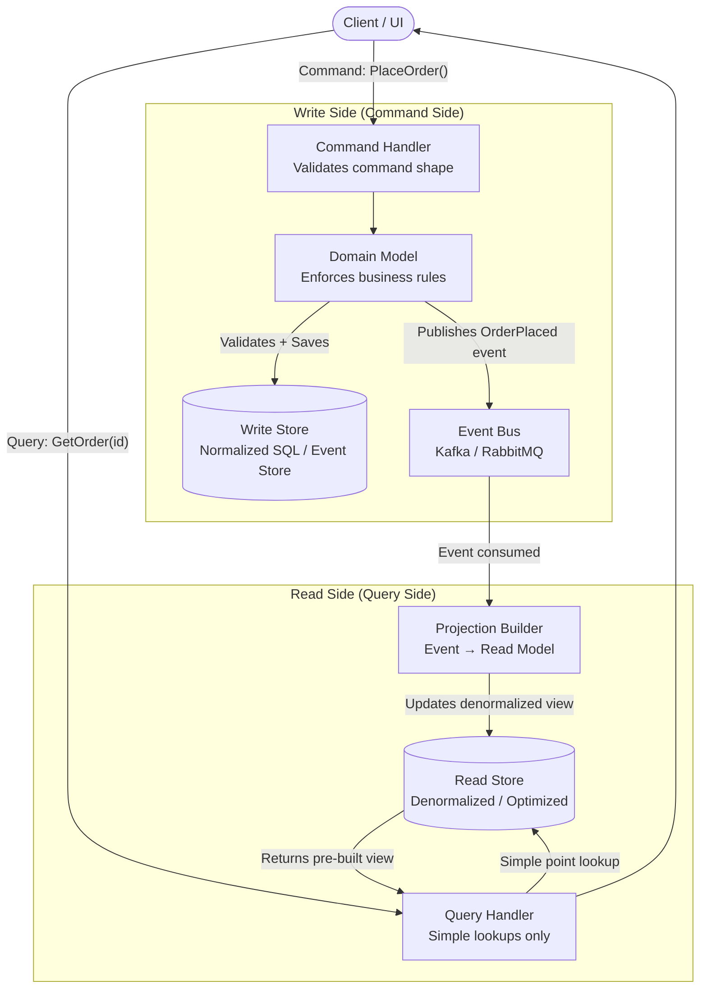

Two completely separate flows. The write side doesn't know the read side exists. The read side is a passive consumer of events produced by the write side.

---

## How the Write Side Works

### Analogy: A Court of Law

When someone files a case (Command), the judge (Domain Model) reviews it against the law (business rules), enters the verdict in the official court record (Write Store), and announces the verdict publicly via gazette notification (publishes an event). The filing, the judgment, and the recording happen atomically. Everyone can later read the gazette — but they don't interfere with the court's process.

The write side is all about **changing state correctly and safely**.

### Step-by-Step Write Flow

1. Client sends a Command: `PlaceOrder { customerId: "C1", items: [...], totalAmount: 450 }`
2. **Command Handler** receives it — validates shape (is this a well-formed command?)
3. **Domain Model** is loaded from write store — the current state of the Order aggregate
4. Domain Model applies **business rules**: Is restaurant open? Is item available? Is payment method valid? Does address fall in delivery zone?
5. If valid, state change is persisted to the **Write Store** (normalized PostgreSQL, or Event Store)
6. Domain Model publishes an event: `OrderPlaced { orderId: "O1", customerId: "C1", timestamp: ..., items: [...] }`
7. Write side returns a minimal acknowledgment: `{ orderId: "O1", status: "ACCEPTED" }`

The write store is optimized for:
- **ACID transactions** — all-or-nothing, no partial writes
- **Data integrity** — referential constraints, check constraints
- **Business rule enforcement** — normalized schema makes it easy to validate against current state
- **Concurrency control** — optimistic or pessimistic locking prevents conflicting updates

It does NOT need to serve complex read queries. That's not its job.

### Code: Command and Domain Model (Python)

```python
from dataclasses import dataclass, field
from datetime import datetime
from typing import Optional
import uuid

# ── Commands (plain data objects — just intent, no behavior) ──────────────────

@dataclass
class PlaceOrderCommand:
    customer_id: str
    restaurant_id: str
    items: list[dict]  # [{"product_id": "P1", "quantity": 2, "price": 89.0}]
    delivery_address: str

@dataclass
class CancelOrderCommand:
    order_id: str
    customer_id: str
    reason: str

@dataclass
class MarkDeliveredCommand:
    order_id: str
    delivery_partner_id: str

# ── Domain Events (immutable facts about what happened) ──────────────────────

@dataclass
class OrderPlacedEvent:
    order_id: str
    customer_id: str
    restaurant_id: str
    items: list[dict]
    total: float
    delivery_address: str
    timestamp: datetime

@dataclass
class OrderCancelledEvent:
    order_id: str
    reason: str
    cancelled_by: str
    timestamp: datetime

@dataclass
class OrderDeliveredEvent:
    order_id: str
    delivery_partner_id: str
    timestamp: datetime

# ── Domain Model (enforces ALL business rules) ────────────────────────────────

class Order:
    VALID_TRANSITIONS = {
        "PLACED":     ["CONFIRMED", "CANCELLED"],
        "CONFIRMED":  ["PREPARING", "CANCELLED"],
        "PREPARING":  ["OUT_FOR_DELIVERY"],
        "OUT_FOR_DELIVERY": ["DELIVERED"],
    }

    def __init__(self):
        self.order_id = None
        self.customer_id = None
        self.status = None
        self.items = []
        self.total = 0.0
        self._pending_events = []

    def place(self, cmd: PlaceOrderCommand, inventory_svc, restaurant_svc) -> None:
        # Business rule: restaurant must be open
        if not restaurant_svc.is_open(cmd.restaurant_id):
            raise DomainError("Restaurant is currently closed")

        # Business rule: all items must be available
        for item in cmd.items:
            if not inventory_svc.is_available(item["product_id"], item["quantity"]):
                raise DomainError(f"Item {item['product_id']} is not available")

        # Business rule: minimum order value
        total = sum(i["price"] * i["quantity"] for i in cmd.items)
        if total < 50.0:
            raise DomainError("Minimum order value is Rs. 50")

        # State change
        self.order_id = str(uuid.uuid4())
        self.customer_id = cmd.customer_id
        self.status = "PLACED"
        self.items = cmd.items
        self.total = total

        # Record the event
        self._pending_events.append(OrderPlacedEvent(
            order_id=self.order_id,
            customer_id=cmd.customer_id,
            restaurant_id=cmd.restaurant_id,
            items=cmd.items,
            total=total,
            delivery_address=cmd.delivery_address,
            timestamp=datetime.utcnow()
        ))

    def cancel(self, cmd: CancelOrderCommand) -> None:
        # Business rule: validate state transition
        if "CANCELLED" not in self.VALID_TRANSITIONS.get(self.status, []):
            raise DomainError(f"Cannot cancel order in status: {self.status}")

        self.status = "CANCELLED"
        self._pending_events.append(OrderCancelledEvent(
            order_id=self.order_id,
            reason=cmd.reason,
            cancelled_by=cmd.customer_id,
            timestamp=datetime.utcnow()
        ))

    def pull_pending_events(self) -> list:
        events = self._pending_events.copy()
        self._pending_events.clear()
        return events

# ── Command Handlers (orchestrate: load → apply → save → publish) ─────────────

class PlaceOrderCommandHandler:
    def __init__(self, order_repo, event_bus, inventory_svc, restaurant_svc):
        self.order_repo = order_repo
        self.event_bus = event_bus
        self.inventory_svc = inventory_svc
        self.restaurant_svc = restaurant_svc

    def handle(self, cmd: PlaceOrderCommand) -> str:
        order = Order()
        order.place(cmd, self.inventory_svc, self.restaurant_svc)

        # Persist to write store (PostgreSQL — normalized, ACID)
        self.order_repo.save(order)

        # Publish domain events to event bus (Kafka)
        for event in order.pull_pending_events():
            self.event_bus.publish(event)

        # Return just the ID — NOT the full order data
        # If caller needs full data, they query the read side
        return order.order_id
```

Notice: the command handler returns only `order_id`. The caller must query the read side if they want full order details. This is the discipline CQRS imposes.

---

## How the Read Side Works

### Analogy: A Newspaper

Reporters (write side) go out and gather facts. The printing press (projection builder) takes those facts and formats them into the newspaper layout — headlines, captions, photographs all arranged perfectly. Readers (query side) simply pick up the pre-printed newspaper. They don't call the reporter for every question. The newspaper is already optimized for reading.

The read side is about **serving the right data, in the right shape, as fast as possible**.

### Projections: Building Read-Optimized Views

A **projection** listens to events from the write side and maintains a **denormalized, pre-computed view** that's perfect for a specific query pattern.

Instead of joining 5 tables every time someone asks "show me orders with customer name, restaurant name, and item details," the projection pre-joins everything the moment the event arrives. Query time = simple point lookup.

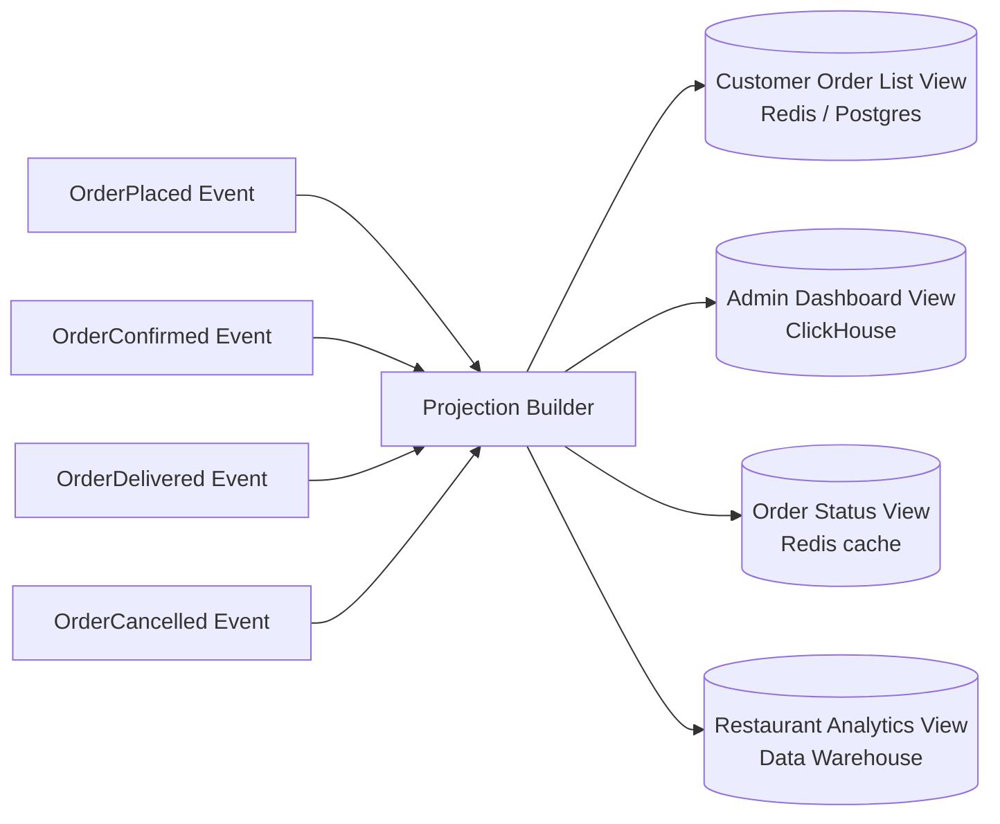

Each view is shaped exactly for its consumer. Different query needs, different shapes, different storage engines — no compromise.

### Code: Projection Builder and Query Handlers

```python
from dataclasses import dataclass
from datetime import datetime
from typing import Optional

# ── Read Models (flat, denormalized — exactly what the UI needs) ──────────────

@dataclass
class OrderSummaryView:
    """Used for: customer's order list page"""
    order_id: str
    restaurant_name: str      # Pre-joined — no JOIN needed at read time
    restaurant_logo_url: str
    status: str
    total: float
    item_count: int
    created_at: datetime

@dataclass
class OrderDetailView:
    """Used for: order detail / tracking page"""
    order_id: str
    status: str
    customer_name: str        # Pre-joined
    customer_phone: str
    restaurant_name: str
    restaurant_address: str
    items: list[dict]         # Includes product names, photos — all pre-denormalized
    total: float
    delivery_address: str
    created_at: datetime
    delivered_at: Optional[datetime]
    cancellation_reason: Optional[str]

@dataclass
class RestaurantRevenueView:
    """Used for: restaurant partner dashboard"""
    restaurant_id: str
    date: str
    total_orders: int
    total_revenue: float
    avg_order_value: float
    top_items: list[dict]

# ── Projection Builder ────────────────────────────────────────────────────────

class OrderProjectionBuilder:
    """
    Consumes events from Kafka.
    Maintains denormalized read models in the read store.
    One instance, multiple views maintained.
    """

    def __init__(self, read_db, customer_svc, restaurant_svc):
        self.read_db = read_db
        self.customer_svc = customer_svc
        self.restaurant_svc = restaurant_svc

    def on_order_placed(self, event: OrderPlacedEvent) -> None:
        # Enrich: fetch customer and restaurant data ONCE at write time
        customer = self.customer_svc.get(event.customer_id)
        restaurant = self.restaurant_svc.get(event.restaurant_id)

        # Build order summary view (for order list page)
        summary = OrderSummaryView(
            order_id=event.order_id,
            restaurant_name=restaurant["name"],
            restaurant_logo_url=restaurant["logo_url"],
            status="PLACED",
            total=event.total,
            item_count=len(event.items),
            created_at=event.timestamp
        )

        # Build order detail view (for order tracking page)
        enriched_items = []
        for item in event.items:
            product = restaurant["menu"][item["product_id"]]
            enriched_items.append({
                **item,
                "product_name": product["name"],
                "product_image": product["image_url"],
            })

        detail = OrderDetailView(
            order_id=event.order_id,
            status="PLACED",
            customer_name=customer["name"],
            customer_phone=customer["phone"],
            restaurant_name=restaurant["name"],
            restaurant_address=restaurant["address"],
            items=enriched_items,
            total=event.total,
            delivery_address=event.delivery_address,
            created_at=event.timestamp,
            delivered_at=None,
            cancellation_reason=None
        )

        # Save both views — ready for instant serving
        self.read_db.save_order_summary(event.customer_id, summary)
        self.read_db.save_order_detail(event.order_id, detail)

    def on_order_cancelled(self, event: OrderCancelledEvent) -> None:
        # Update both affected views
        self.read_db.update_order_status(event.order_id, "CANCELLED")
        self.read_db.update_cancellation_reason(event.order_id, event.reason)

    def on_order_delivered(self, event: OrderDeliveredEvent) -> None:
        self.read_db.update_order_status(event.order_id, "DELIVERED")
        self.read_db.update_delivered_at(event.order_id, event.timestamp)

# ── Query Handlers (dead simple — just lookups, no business logic) ────────────

class OrderQueryHandler:
    def __init__(self, read_db):
        self.read_db = read_db

    def get_order_detail(self, order_id: str) -> OrderDetailView:
        # No JOINs. No complex logic. Just a point lookup.
        return self.read_db.get_order_detail(order_id)

    def get_customer_orders(self, customer_id: str,
                             page: int = 1, page_size: int = 20) -> list[OrderSummaryView]:
        # Pre-built paginated list. Just return it.
        return self.read_db.get_order_summaries(customer_id, page, page_size)
```

Notice how trivially simple `OrderQueryHandler` is. The complexity was **moved to write time** — paid once when the event arrives, not on every read request. Yeh hi CQRS ka magic hai.

---

## The Sync Mechanism: How Read Stays in Sync with Write

This is the heart of CQRS. Yeh kyun important hai — without this mechanism, your read models become stale forever.

### The Event-Driven Sync Flow

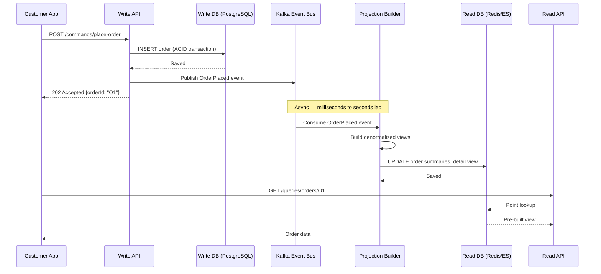

Three things to notice:
1. The write API returns `202 Accepted` — not `200 OK`. It's saying "I accepted your command, will process."
2. Between the write API returning and the read DB being updated, there is a **gap** — this is where eventual consistency lives.
3. The read API is completely decoupled from the write flow.

---

## Eventual Consistency: The Trade-off You Must Understand

### Analogy: Instagram Post Going Live

Agar tumne kabhi notice kiya ho — jab you post an Instagram Reel, your followers don't all see it at the exact same microsecond. It propagates. First your own profile, then your close friends' feeds, then slowly out to all 50,000 followers. There's a lag.

This is **eventual consistency**. The truth (you posted a reel) happened at one moment, but all the read models (everyone's feeds) catch up gradually.

In CQRS:
1. Command executes → write store updated → event published ← this is the truth moment
2. Event travels through Kafka/RabbitMQ (takes milliseconds)
3. Projection builder consumes event → read store updated
4. **During steps 2-3**, the read model is "stale"

### What This Means in Practice

| Scenario | What Happens |
|---|---|
| User places order, immediately opens order history | Might see stale state (order not yet in list) |
| User cancels order, immediately checks order status | Might still see "PLACED" status briefly |
| Admin updates restaurant menu, user instantly browses | Old menu items might show for seconds |

This lag is typically **milliseconds to a few seconds** under normal load. Under heavy load or Kafka lag, it could be longer.

### Handling Eventual Consistency in the UI

```javascript
// Strategy 1: Optimistic UI
// Show the assumed result immediately without waiting for read model
async function placeOrder(orderData) {
  const response = await api.post('/commands/place-order', orderData);
  const { orderId } = response.data;

  // Don't query read API — show optimistic "PLACED" state immediately
  // Update UI assuming success
  dispatch({ type: 'ORDER_PLACED_OPTIMISTICALLY', orderId, status: 'PLACED' });

  // Quietly sync in background when read model catches up
  syncOrderInBackground(orderId);
}

// Strategy 2: Version-based polling
// Write side returns a version number; poll until read model has that version
async function placeOrder(orderData) {
  const { orderId, version } = await api.post('/commands/place-order', orderData);

  // Poll until read model has caught up to this version
  const order = await pollUntilReady({
    check: () => api.get(`/queries/orders/${orderId}`),
    condition: (order) => order.version >= version,
    maxAttempts: 15,
    delayMs: 200
  });

  showOrderConfirmation(order);
}

// Strategy 3: WebSocket push
// After write, subscribe to a "your order updated" websocket channel
// Read model pushes an update when it's ready — no polling needed
async function placeOrder(orderData) {
  const { orderId } = await api.post('/commands/place-order', orderData);
  showOrderPlacedSpinner(orderId);

  // Server pushes via WebSocket when read model is ready
  websocket.on(`order:${orderId}:updated`, (orderData) => {
    hideSpinner();
    showOrderDetails(orderData);
  });
}
```

The right strategy depends on your UX requirements. For Zomato's order confirmation, they use optimistic UI + WebSocket push — instant feedback, then live tracking updates.

---

## Multiple Read Models for Different Consumers

Yeh CQRS ka ek bahut powerful feature hai that people often miss.

### Analogy: Same Raw Data, Many Newspaper Editions

A news agency (Reuters) collects the raw facts (events). Different publications subscribe to those facts and format them differently:
- Times of India: Detailed article with context
- Twitter Breaking News: 280-character summary
- Analytics Dashboard: Just the numbers
- Mobile Alert: Push notification headline only

Same underlying event. Four completely different read models.

### Real Example: Swiggy's Order Data, Multiple Views

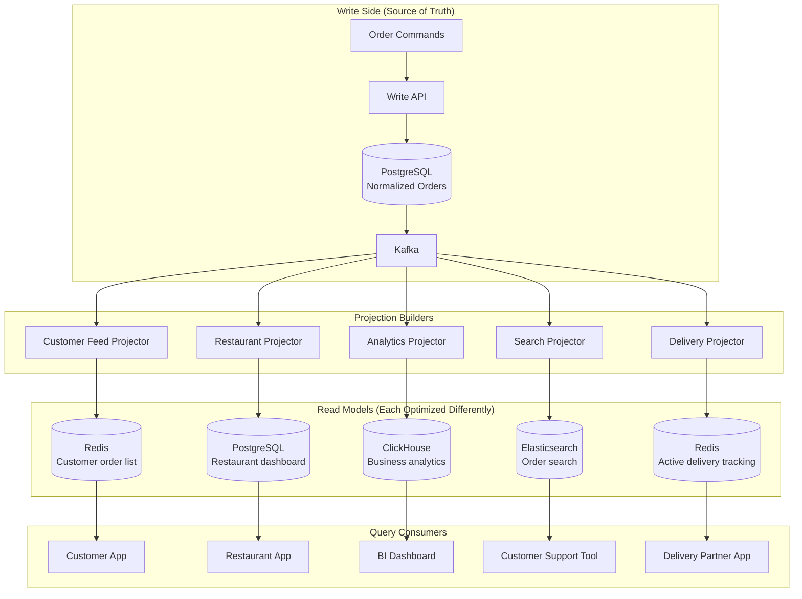

Each consumer gets exactly what they need, from a store optimized for their access pattern:

| Consumer | Read Store | Why This Store |
|---|---|---|
| Customer app — order list | Redis (sorted set by time) | Sub-millisecond list retrieval |
| Restaurant partner dashboard | PostgreSQL | Complex queries with filters |
| Business intelligence | ClickHouse | Columnar, blazing fast analytics |
| Customer support search | Elasticsearch | Full-text search, facets |
| Delivery partner tracking | Redis | Real-time position + order state |

---

## CQRS + Event Sourcing: The Power Combo

### Analogy: Bank Ledger vs Account Balance

A traditional bank might store your **current balance**: Rs. 5,000.

An event-sourced bank stores the **complete transaction history**:
- `Deposited Rs. 10,000 on Jan 1`
- `Withdrew Rs. 2,000 on Jan 5`
- `Transferred Rs. 3,000 on Jan 10`

Your current balance (Rs. 5,000) is **derived** by replaying these transactions. The events ARE the truth. The balance is just a cached view.

### Why CQRS Loves Event Sourcing

Without Event Sourcing, when state changes, the old state is gone forever. Your projections can only react to future events — they can't see history.

With Event Sourcing:
- Every state change is captured as an **immutable event** in an append-only store
- You can **replay all events from the beginning** to rebuild any read model from scratch
- You can **create new projections retroactively** — new feature needs a new view? Just replay all history through the new projector
- Perfect **audit trail** built-in (SEBI compliance, banking regulators love this)
- You can build **temporal queries** — "what did the order look like at 2pm yesterday?"

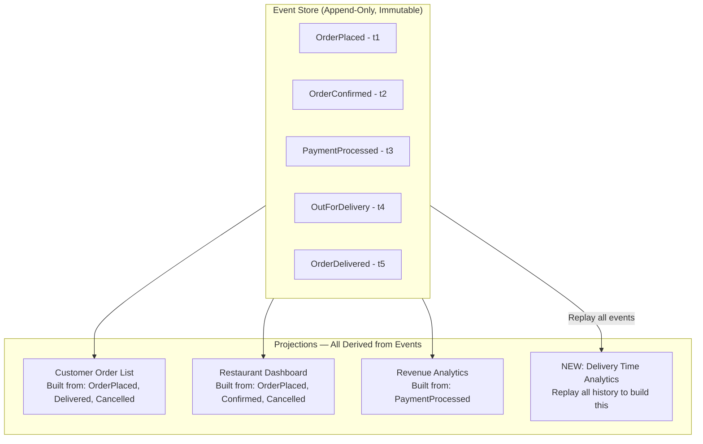

### Event Store Implementation

```python
import json
from datetime import datetime
from typing import Optional

class EventStore:
    """
    Append-only store for all domain events.
    This IS the write side's source of truth in an Event Sourced system.
    Never UPDATE or DELETE — only APPEND.
    """

    def __init__(self, db):
        self.db = db

    def append(self, aggregate_id: str, aggregate_type: str,
                events: list, expected_version: int) -> None:
        """
        Optimistic concurrency control via expected_version.
        Prevents two concurrent updates from overwriting each other.
        """
        current_version = self.db.get_current_version(aggregate_id)

        if current_version != expected_version:
            raise ConcurrencyConflictError(
                f"Expected version {expected_version}, "
                f"found {current_version}. Retry your command."
            )

        for event in events:
            expected_version += 1
            self.db.insert_event({
                "event_id": str(uuid.uuid4()),
                "aggregate_id": aggregate_id,
                "aggregate_type": aggregate_type,
                "event_type": type(event).__name__,
                "event_data": json.dumps(event.__dict__, default=str),
                "version": expected_version,
                "occurred_at": datetime.utcnow().isoformat()
            })

    def load_events(self, aggregate_id: str,
                     from_version: int = 0) -> list:
        """Replay events for a specific aggregate to reconstruct state."""
        return self.db.fetch_events(
            aggregate_id=aggregate_id,
            from_version=from_version,
            order="version ASC"
        )

    def replay_all(self, event_types: Optional[list[str]] = None,
                    from_position: int = 0) -> iter:
        """
        Used to rebuild projections from scratch.
        Stream all events (or filtered by type) from a given position.
        """
        return self.db.stream_all_events(
            event_types=event_types,
            from_position=from_position
        )

class OrderAggregate:
    """
    Reconstructs order state by replaying events.
    No state stored in DB — only events.
    """

    def __init__(self):
        self.order_id = None
        self.status = None
        self.version = 0
        self._pending_events = []

    @classmethod
    def load(cls, events: list) -> 'OrderAggregate':
        """Reconstruct state from event history."""
        order = cls()
        for event in events:
            order._apply(event)
            order.version += 1
        return order

    def _apply(self, event) -> None:
        """Apply an event to update internal state."""
        if isinstance(event, OrderPlacedEvent):
            self.order_id = event.order_id
            self.status = "PLACED"
        elif isinstance(event, OrderCancelledEvent):
            self.status = "CANCELLED"
        elif isinstance(event, OrderDeliveredEvent):
            self.status = "DELIVERED"
        # ... etc.
```

---

## Real-World Example: E-Commerce at Scale (Flipkart/Amazon India)

Let's build this out end-to-end for an e-commerce order system.

### The Problem Without CQRS

At Flipkart scale:
- 5 lakh orders per hour during Big Billion Days sale
- 50 lakh product page views per hour
- 10 different consumers: mobile app, desktop web, warehouse system, customer support, analytics, delivery tracking, restaurant partner, logistics partner, finance team, fraud detection

A single database model means:
- Complex 8-table JOINs on every order history fetch
- Write operations blocked by read queries holding locks
- Can't use Elasticsearch for product search without duplicating data manually
- One schema change breaks all consumers simultaneously

### The CQRS Architecture

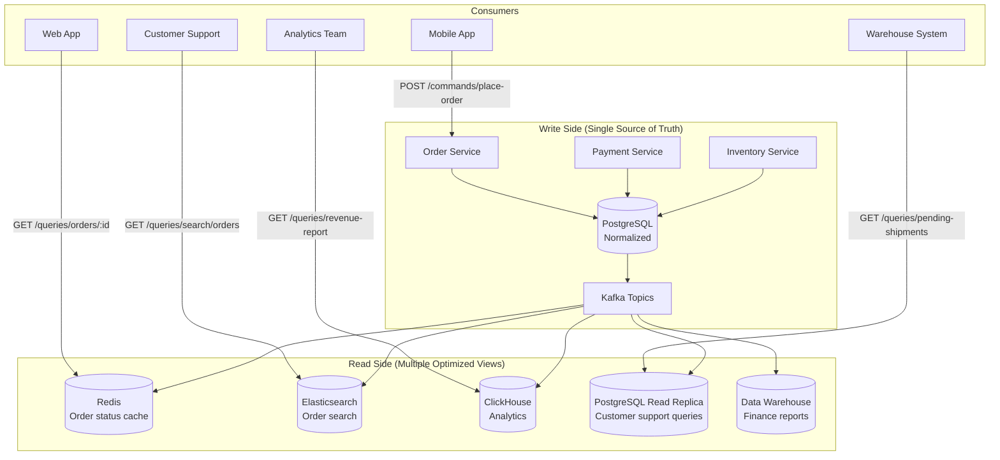

**Write side handles:**
- `PlaceOrder` — validates inventory, payment, address; ACID transaction
- `CancelOrder` — validates cancellation eligibility, initiates refund
- `UpdateShippingAddress` — validates new address, only allowed before dispatch

**Read side optimized by consumer:**

| Read Model | Store | Shape | Latency |
|---|---|---|---|
| Customer order list | Redis sorted set | `{orderId, status, total, itemCount, restaurantName}` | <2ms |
| Order tracking | Redis hash | `{orderId, status, currentLocation, estimatedArrival}` | <2ms |
| Customer support search | Elasticsearch | Full order with all fields, searchable by email/phone/orderId | 10-50ms |
| Business analytics | ClickHouse | Columnar — date, revenue, region, category aggregations | 100ms-2s |
| Finance reconciliation | Data Warehouse | Order + payment + refund joined, partitioned by date | Minutes (batch) |

### Sequence: Placing a Big Billion Days Order

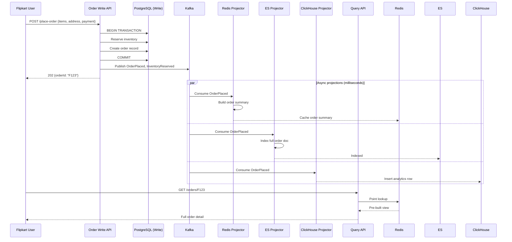

---

## Real-World Example: Social Media Feed (Instagram/Twitter)

Fan-out on write is a textbook CQRS application.

### The Problem

Virat Kohli posts a photo. He has 2.5 crore followers. If you compute his followers' feeds at read time ("give me all posts from people I follow, sorted by time"), that's:
- 2.5 crore followers × potentially millions of people each has thousands of followees
- Computing this in real-time = impossible

### CQRS Fan-Out Solution

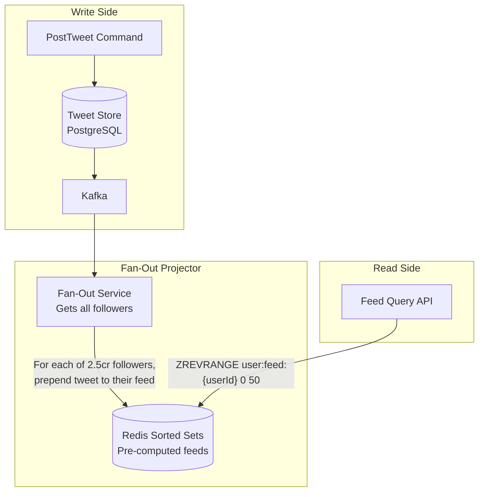

**Write time (expensive once)**: Fan-out to 2.5 crore followers' Redis sorted sets. This is done asynchronously by many worker processes in parallel.

**Read time (cheap, every request)**: `ZREVRANGE user:feed:{userId} 0 50` — returns the 50 most recent tweets for this user from their pre-built Redis sorted set. Takes <2ms.

Instagram actually uses a hybrid:
- Normal users (< 1M followers): full fan-out on write
- Celebrity users (> 1M followers): fan-out only to active users + lazy computation for others

This nuance is exactly what makes their system scale.

---

## CQRS Without Event Sourcing

Important to know: **CQRS and Event Sourcing are separate patterns.** You can use CQRS without Event Sourcing.

In a simpler CQRS setup:

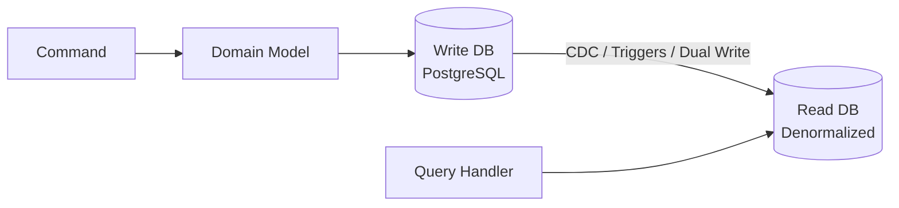

Ways to sync without a full event bus:
1. **Change Data Capture (CDC)**: Tools like Debezium watch PostgreSQL's WAL (write-ahead log) and stream changes to Kafka. No code changes needed on write side.
2. **Database triggers**: Trigger fires on INSERT/UPDATE to write store, updates read store synchronously (careful — synchronous, may add latency)
3. **Dual write**: Write to both stores in the same transaction (risk: partial failures)
4. **Read replicas + materialized views**: Simplest form of CQRS — read from replica with pre-computed views

The "lite" version using CDC is the easiest entry point into CQRS.

---

## Common CQRS Mistakes and How to Avoid Them

### Mistake 1: Putting Business Logic in Projections

```python
# WRONG — projection is making business decisions
def on_order_placed(self, event):
    if event.total > 10000:   # THIS IS BUSINESS LOGIC — not here!
        self.notify_fraud_team(event)
    self.read_db.save(...)

# RIGHT — projections only shape data for reading
def on_order_placed(self, event):
    self.read_db.save(OrderDetailView(
        order_id=event.order_id,
        status="PLACED",
        ...
    ))
    # Fraud detection is a separate event handler, not part of the projection
```

### Mistake 2: Returning Rich Data from Commands

```python
# WRONG — command returning full domain object
class PlaceOrderHandler:
    def handle(self, cmd):
        order = Order()
        order.place(cmd)
        self.repo.save(order)
        return order  # DON'T return rich domain object

# RIGHT — command returns minimal acknowledgment
class PlaceOrderHandler:
    def handle(self, cmd):
        order = Order()
        order.place(cmd)
        self.repo.save(order)
        return order.order_id  # Just the ID. Query side will provide details.
```

### Mistake 3: Querying the Write Store for Reads

```python
# WRONG — bypassing the read model to query write store directly
class OrderQueryHandler:
    def get_order(self, order_id):
        # This bypasses the whole read model — defeats CQRS purpose
        return self.write_db.execute(
            "SELECT o.*, c.name, c.email, r.name "
            "FROM orders o JOIN customers c JOIN restaurants r ..."
        )

# RIGHT — always use the read store for queries
class OrderQueryHandler:
    def get_order(self, order_id):
        return self.read_db.get_order_detail(order_id)  # Point lookup
```

### Mistake 4: Using CQRS for Simple CRUD

```python
# You have a User management system:
# - Create user
# - Update user profile
# - Get user by ID
# - List users with search

# WRONG decision: adding CQRS to this
# You now need: Write DB, Read DB, Event Bus, Projectors, Command Handlers, Query Handlers
# For something that worked fine with: User model → PostgreSQL

# RIGHT decision: this is a CRUD app. Use CRUD.
# CQRS adds complexity that you haven't justified with genuine need.
```

---

## When to Use CQRS

### Use CQRS When...

| Scenario | Why CQRS Helps | Real Example |
|---|---|---|
| **Read/write ratio heavily imbalanced** | Scale read side independently | YouTube: 1 upload vs 1 million views |
| **Different read consumers need different shapes** | Multiple projections, zero compromise | Swiggy: customer app vs restaurant app vs analytics |
| **Complex domain with rich business rules** | Write model focuses on rules, read model focuses on display | Banking: loan approval logic vs account statement view |
| **High-throughput writes + complex reads** | Separate DBs, optimize each | Zomato: order writes + analytics queries |
| **Audit/compliance requirements** | Event Sourcing + CQRS = complete history | Fintech: every transaction must be auditable |
| **Microservices** | Each service owns its write, projects data for others | Any large distributed system |

### Do NOT Use CQRS When...

| Scenario | Why CQRS Hurts |
|---|---|
| **Simple CRUD apps** | Over-engineering — a todo app doesn't need this |
| **Strong consistency required** | Eventual consistency may be unacceptable (e.g., financial debit) |
| **Small team (< 5 engineers)** | Operational complexity too high for the payoff |
| **Simple domain** | If business logic is trivial, rich write models add zero value |
| **Low traffic** | Single DB handles both reads and writes perfectly |
| **Fast feature iteration** | Schema changes hit commands, events, AND projections — slow |

> Rule of thumb: If you can explain your entire data flow in one sentence, you don't need CQRS. If you're writing JOINs across 5 tables just to show a simple list, it's time to consider CQRS.

---

## CQRS vs Related Patterns

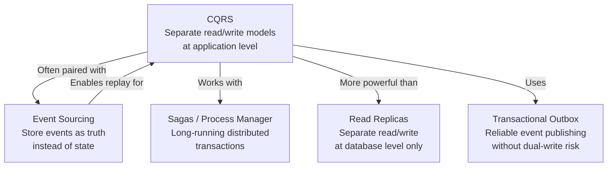

| Pattern | What It Solves | Relationship to CQRS |
|---|---|---|
| **Read Replicas** | Read scalability via DB replication | CQRS at DB level only — CQRS is at application model level. Read replicas are a stepping stone. |
| **Event Sourcing** | How to store state changes (events not state) | Natural write-side complement to CQRS — enables projection replay |
| **Sagas** | Multi-step distributed transactions | Handles workflows that span multiple CQRS commands across services |
| **Transactional Outbox** | Reliable event publishing (avoid dual-write bugs) | Used inside CQRS write side to reliably publish events to Kafka |
| **CQRS Lite** | Simpler CQRS using CDC (Debezium) without full event bus | Entry-level CQRS — good starting point |

---

## The Transactional Outbox Pattern (Reliable Event Publishing)

Yeh ek common gotcha hai in CQRS. What happens if you write to the DB but Kafka publish fails?

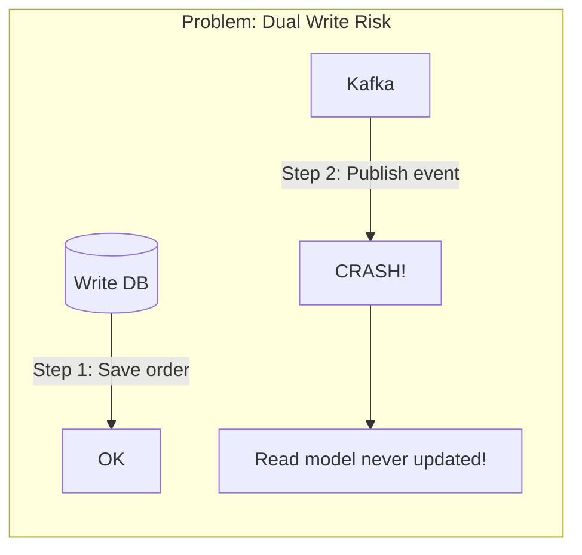

**Solution: Transactional Outbox**

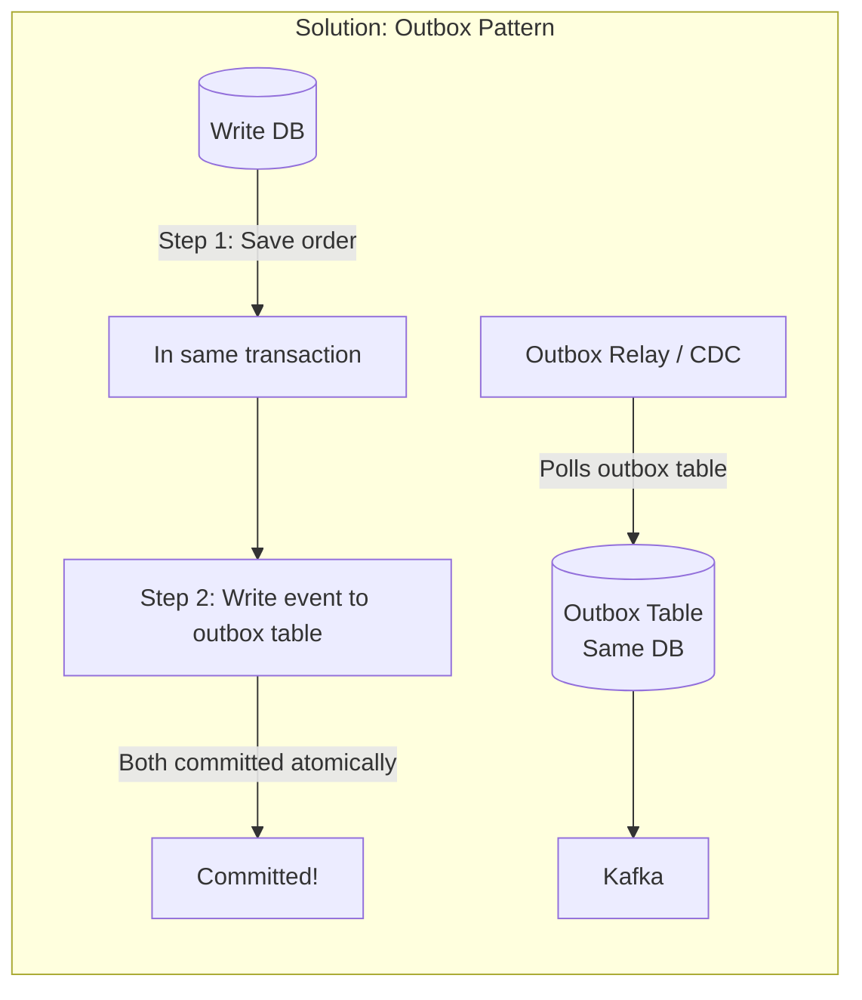

```python
# Transactional Outbox: write order + event in SAME DB transaction
class PlaceOrderCommandHandler:
    def handle(self, cmd: PlaceOrderCommand) -> str:
        with self.db.transaction():
            # Step 1: Save the order (to orders table)
            order_id = self.db.insert_order({
                "customer_id": cmd.customer_id,
                "status": "PLACED",
                "total": calculate_total(cmd.items)
            })

            # Step 2: Write event to outbox table (same transaction!)
            # If either fails, BOTH are rolled back. Atomicity guaranteed.
            self.db.insert_outbox({
                "event_type": "OrderPlaced",
                "payload": json.dumps({
                    "order_id": order_id,
                    "customer_id": cmd.customer_id,
                    "total": calculate_total(cmd.items)
                }),
                "published": False
            })

        # A separate Outbox Relay process (or Debezium CDC) reads outbox
        # and publishes to Kafka — at-least-once delivery guaranteed
        return order_id
```

The outbox relay (or Debezium watching the `outbox` table via CDC) publishes to Kafka independently. Even if the relay crashes, it can restart and republish unpublished events. Your projections must be **idempotent** (processing the same event twice gives the same result).

---

## Idempotent Projections

Since events can be delivered more than once (Kafka at-least-once delivery), projections must handle duplicates gracefully.

```python
class OrderProjectionBuilder:
    def on_order_placed(self, event: OrderPlacedEvent) -> None:
        # WRONG: naive insert — will fail or duplicate on replay
        self.read_db.insert_order(event.order_id, ...)

        # RIGHT: upsert — safe to run multiple times with same event
        self.read_db.upsert_order(
            order_id=event.order_id,
            data={...},
            idempotency_key=event.event_id  # Track which events we've processed
        )

    # Even better: track processed event IDs to skip duplicates
    def process_event(self, event) -> None:
        if self.read_db.already_processed(event.event_id):
            return  # Skip duplicate
        self.handle_event(event)
        self.read_db.mark_processed(event.event_id)
```

---

## Monitoring CQRS Systems

Alag-alag components hone ki wajah se, monitoring bhi alag approach se karni padti hai.

### Key Metrics to Track

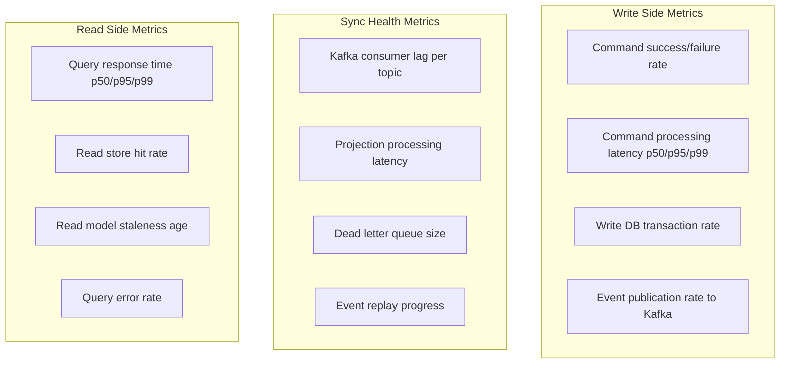

**The most important metric**: **Projection lag** — how far behind is your read model from the write model? If Kafka consumer lag on your projector is growing, your read models are getting staler and staler.

```python
# Monitoring endpoint example
@app.get("/health/projection-lag")
def check_projection_lag():
    kafka_lag = kafka_admin.get_consumer_lag("order-projector-group")
    oldest_unprocessed_event_age = calculate_event_age(kafka_lag)

    return {
        "kafka_consumer_lag_events": kafka_lag,
        "estimated_staleness_seconds": oldest_unprocessed_event_age,
        "status": "HEALTHY" if oldest_unprocessed_event_age < 5 else "DEGRADED"
    }
```

---

## The Full Trade-off Picture

| Concern | Traditional CRUD | CQRS (Simple) | CQRS + Event Sourcing |
|---|---|---|---|
| **Complexity** | Low | High | Very High |
| **Read performance** | Medium (JOINs) | Very High (pre-computed) | Very High |
| **Write performance** | Medium | High | High |
| **Independent scaling** | No | Yes | Yes |
| **Consistency** | Strong (immediate) | Eventual (ms-seconds) | Eventual |
| **Audit trail** | Requires extra logging | Partial (events exist) | Complete (events ARE truth) |
| **Time travel queries** | No | No | Yes (replay to any point) |
| **New read views** | Easy (write SQL query) | Medium (write new projector) | Easy (replay all events!) |
| **Schema evolution** | Easy | Hard (commands + events + projections) | Harder |
| **Debugging** | Easy (one flow) | Hard (distributed events) | Very Hard |
| **Operational overhead** | Low | High (multiple stores, event bus) | Very High |
| **Team size needed** | Any | Medium+ | Large |
| **Best for** | Simple domains | Complex, high-scale | Complex + full audit needs |

---

## Implementation Checklist

If you decide CQRS is right for your system, here's what you need to build:

**Write Side:**
- [ ] Define Commands (plain data objects — intent to change, no behavior)
- [ ] Build Command Handlers (receive, validate command shape, orchestrate)
- [ ] Build Domain Models (enforce all business rules, emit events)
- [ ] Choose Write Store (PostgreSQL for most cases; EventStore for full ES)
- [ ] Implement Transactional Outbox (reliable event publishing)
- [ ] Set up Event Bus (Kafka for high-throughput; RabbitMQ for simpler cases)

**Read Side:**
- [ ] Identify query use cases for each consumer
- [ ] Design read model schemas (denormalized, shaped for the query)
- [ ] Build Projection Builders per consumer type
- [ ] Choose Read Stores (Redis for cache, ES for search, ClickHouse for analytics)
- [ ] Build Query Handlers (simple lookups — zero business logic)
- [ ] Make projections idempotent

**Cross-Cutting:**
- [ ] Handle eventual consistency in UX (optimistic UI / polling / WebSockets)
- [ ] Build projection replay mechanism (for new projections or bug recovery)
- [ ] Add monitoring: Kafka lag, projection health, command failure rates
- [ ] Plan schema evolution strategy (adding event fields backward-compatibly)
- [ ] Define SLA for acceptable read model staleness

---

## Common Interview Questions

### Conceptual

**Q1: What is CQRS and why does it exist?**

CQRS stands for Command Query Responsibility Segregation. It separates the models used for reading data (queries) from the models used for changing data (commands). It exists because reads and writes have fundamentally different requirements — writes need ACID transactions, normalized schemas, and business rule enforcement; reads need denormalized, fast, pre-computed views optimized for specific query patterns. Trying to serve both from one model forces compromises on both.

**Q2: What is eventual consistency in CQRS, and how do you handle it?**

In CQRS, after a command is executed and the write store is updated, an event is published to a message bus. The read model is updated asynchronously by a projection builder consuming that event. The gap between the write completing and the read model being updated is the eventual consistency window — typically milliseconds to seconds. You handle it in the UI through: optimistic updates (show assumed state immediately), version-based polling (poll until read model reaches the expected version), or WebSocket push (server pushes when read model is ready).

**Q3: When would you NOT use CQRS?**

For simple CRUD applications, small teams, apps requiring strong consistency (read-your-own-writes immediately), low-traffic systems, or when the team needs to iterate quickly. CQRS adds significant complexity — multiple stores, event bus, projections, eventual consistency handling. If your data flow is simple enough to explain in one sentence, CQRS is overkill.

**Q4: What is the difference between CQRS and read replicas?**

Read replicas are a database-level solution — you replicate the same data to a replica and send reads there. The data model is identical. CQRS is an application-level pattern — you have genuinely different models for reads and writes. The read model can be in a completely different database type (Redis, Elasticsearch) with a completely different schema, shaped specifically for the query patterns.

**Q5: How does CQRS relate to Event Sourcing?**

They are separate patterns that complement each other well. CQRS separates read and write models. Event Sourcing makes events (not state) the source of truth on the write side. Together: commands produce events → events are stored in an event store → projections read events and build read models. The synergy is that with Event Sourcing, you can replay all events to rebuild any projection — even add new read models retroactively by replaying history.

### Design Questions

**Q6: Design Twitter's feed system using CQRS.**

Write side: `PostTweet` command → save tweet to write DB (PostgreSQL) → publish `TweetPosted` event to Kafka.

Read side: Fan-out projector consumes `TweetPosted` → for each follower of the author → prepend tweet ID to follower's pre-computed feed (Redis sorted set). Feed Query API: `ZREVRANGE user:feed:{userId} 0 49` — returns last 50 tweets from Redis in <2ms.

For celebrities (100M+ followers), use hybrid: full fan-out to active followers, lazy computation for inactive users.

**Q7: How would you rebuild a corrupted read model in production?**

1. Stop the projection builder (pause Kafka consumer group)
2. Truncate / drop the affected read store tables
3. Reset the Kafka consumer offset to position 0 (beginning of time) OR replay from the event store
4. Restart the projection builder — it replays all events and rebuilds from scratch
5. Use a feature flag or separate read endpoint to keep serving old (stale but working) data while rebuild is in progress
6. Cut over once projection catches up to current events
7. Resume live Kafka consumption

This is one of the biggest advantages of Event Sourcing + CQRS — full rebuild is always possible.

**Q8: How do you handle a bug in a projector that causes corrupted read model data?**

1. Fix the bug in the projector code
2. Deploy the fix
3. Rebuild the projection from scratch (see Q7 above)
4. With Event Sourcing, this is safe — events are immutable, only the derived projection was corrupted

**Q9: What is the Transactional Outbox pattern and why is it needed in CQRS?**

Without it: if you write to the DB and then publish to Kafka in separate steps, you risk writing to DB successfully but Kafka failing — your read model never gets updated, creating permanent inconsistency.

Transactional Outbox: write both the business entity AND the event-to-publish to the outbox table in the SAME DB transaction. A separate relay process (or Debezium CDC) reads the outbox and publishes to Kafka. Atomicity is guaranteed by the DB transaction; reliability is guaranteed by the relay's retry mechanism.

**Q10: How would you implement CQRS for Zomato's order system? What read models would you build?**

Write side: `PlaceOrder`, `CancelOrder`, `UpdateDeliveryStatus` commands → PostgreSQL (normalized) → Kafka.

Read models:
1. **Customer order list** (Redis sorted set) — `{orderId, status, restaurantName, total, itemCount}` — fast O(log n) list for app home screen
2. **Order tracking** (Redis hash) — `{orderId, status, deliveryPartnerLocation, ETA}` — real-time tracking
3. **Restaurant order queue** (PostgreSQL read replica) — orders filtered by restaurant, sortable by time
4. **Customer support search** (Elasticsearch) — full-text search by customer phone, email, orderId
5. **Revenue analytics** (ClickHouse) — columnar, partitioned by date — for BI dashboards
6. **Fraud detection feed** (Redis stream) — real-time order stream for fraud ML models

---

## Key Takeaways

1. **CQRS separates read and write at the model level — not just the database level.** Commands change state. Queries read state. They use completely different code paths, different schemas, potentially different database technologies.

2. **The write side is about correctness.** Normalized schema, ACID transactions, business rule enforcement. It doesn't need to be fast for reads — that's not its job.

3. **The read side is about speed and shape.** Projections pre-compute exactly what the UI needs. Query handlers become trivially simple point lookups. The complexity is paid once at write time, not on every read.

4. **Eventual consistency is the fundamental trade-off.** The read model lags behind the write model by milliseconds to seconds. Design your UX to handle this gracefully via optimistic UI, polling, or WebSocket push.

5. **One write, many reads.** A single event from the write side can update multiple different read models — customer view, admin view, analytics, search index. Each optimized for its specific consumer.

6. **CQRS and Event Sourcing are natural partners.** Event Sourcing on the write side gives you an immutable, replayable event log. This means you can add new read models retroactively and rebuild corrupted projections safely.

7. **Use the Transactional Outbox for reliable event publishing.** Never dual-write to DB + Kafka in separate steps — use the outbox pattern to guarantee atomicity.

8. **Make projections idempotent.** Events can be delivered more than once. Your projectors must produce the same result whether they process an event once or ten times.

9. **Monitor projection lag.** The most important CQRS health metric is how far behind your projectors are consuming events. Growing lag = growing staleness = degraded user experience.

10. **Don't use CQRS for simple apps.** It adds enormous operational complexity — multiple stores, event bus, eventual consistency handling, projection management. The payoff is only worth it when read/write scaling imbalance or domain complexity genuinely demands it.

---

> **Bottom line:** CQRS is not about splitting your API into GET and POST endpoints. It is about having genuinely different models — different schemas, different databases, different code paths — for the act of changing state versus the act of reading state. Done right at the right scale, it unlocks independent scalability, multiple optimized views, and clean domain modeling. Done wrong on a todo app, it is expensive infrastructure for zero benefit.
>
> Yeh pattern tab use karo jab tumhare reads aur writes ke requirements itne alag ho jaate hain ki ek model dono ko satisfy nahi kar sakta. Tab CQRS tumhara dost hai.
