# Event Sourcing — The Complete Guide

---

## Why Does This Chapter Even Exist?

Samjho aise — imagine you check your bank app and it just shows: **Balance: ₹12,500.**

That's it. No history. No transactions. Just a number.

Now you're confused — you thought you had ₹18,000. You call the bank. They say, "Sorry, ₹12,500 is what our system says." No record of the ₹3,000 grocery run, no record of the ₹2,500 Netflix subscription charge, no record of anything. Just a final number someone stored.

You'd be furious — and rightfully so.

But here's the twist: **most software systems work exactly like that.** They store the current state. Every update overwrites the previous state. History is gone.

Event Sourcing flips this entirely. Instead of storing **what the current state is**, you store **every event that ever happened**. The current state is just what you get when you replay all those events.

Your bank account statement is already event-sourced. Each line is an event. The balance at the bottom is derived. That's it — that's the whole idea.

This chapter will make you understand event sourcing so deeply that you can explain it, design it, debate its trade-offs, and nail any interview question about it.

---

## Table of Contents

1. [The Core Idea — What Is Event Sourcing?](#the-core-idea)
2. [Traditional CRUD vs Event Sourcing — The Real Difference](#traditional-vs-event-sourcing)
3. [The Event Store — Heart of the System](#the-event-store)
4. [Aggregates — The Building Blocks](#aggregates)
5. [Replaying Events — Deriving Current State](#replaying-events)
6. [Snapshots — When Replaying 10,000 Events Is Too Slow](#snapshots)
7. [Temporal Queries — Time Travel in Your Database](#temporal-queries)
8. [Event Schema Evolution — When Events Need to Change](#schema-evolution)
9. [CQRS + Event Sourcing — The Natural Pair](#cqrs-event-sourcing)
10. [Projections — Building Read Models from Events](#projections)
11. [Real-World Examples at Scale](#real-world-examples)
12. [GDPR and the Right to Be Forgotten](#gdpr)
13. [When to Use vs When NOT to Use](#when-to-use)
14. [Challenges and Trade-offs](#challenges)
15. [Event Sourcing vs Related Patterns](#related-patterns)
16. [Interview-Ready Architecture Diagrams](#architecture)
17. [Common Interview Questions](#interview-questions)
18. [Key Takeaways](#key-takeaways)

---

## The Core Idea — What Is Event Sourcing? {#the-core-idea}

### The Analogy: A Court Case

Think of a court case. The judge doesn't just walk in and hear: "The defendant is guilty." The judge hears **everything that happened** — the sequence of events, witness by witness, evidence by evidence — and then derives the verdict from that full sequence.

If the court just stored "verdict: guilty," and you wanted to appeal, there'd be nothing to appeal against. You need the full event log — the testimony, the cross-examinations, the evidence submissions — to understand how the verdict was reached.

Event Sourcing works the same way. The full sequence of events is the truth. The current state is just a conclusion you derive from it.

### The Technical Definition

**Event Sourcing** is a design pattern where the state of an application is derived from an ordered, immutable sequence of events — rather than stored directly.

Instead of storing the current snapshot:
```json
{
  "orderId": "ORD-001",
  "status": "shipped",
  "total": 599.00,
  "trackingId": "TRK-789"
}
```

You store what happened, step by step:
```
1. OrderPlaced      { orderId: "ORD-001", total: 599.00,    at: "2024-01-10T09:00Z" }
2. PaymentConfirmed { orderId: "ORD-001", amount: 599.00,   at: "2024-01-10T09:03Z" }
3. OrderPacked      { orderId: "ORD-001", warehouseId: "W2", at: "2024-01-10T14:00Z" }
4. OrderShipped     { orderId: "ORD-001", trackingId: "TRK-789", at: "2024-01-11T08:00Z" }
```

To know the current state, you **replay** these events in order. The final state is the result of applying all events sequentially.

### The Git Analogy — You Already Know This

If you've used Git, you already understand event sourcing.

Git does not store the current state of your files. It stores **commits** — each commit is a snapshot of changes (an event). When you run `git checkout`, Git replays all commits to reconstruct the files. `git log` is your event stream. `git revert` is a compensating event.

Your codebase's current state is derived from the history of commits. That's event sourcing.

---

## Traditional CRUD vs Event Sourcing {#traditional-vs-event-sourcing}

### The Overwrite Problem

Yeh kyun important hai? Let's say Zomato stores your order like a typical CRUD system:

```sql
UPDATE orders SET status = 'delivered' WHERE order_id = 'ORD-001';
```

The moment that runs, the previous status (`picked_up`) is gone. Forever.

Now a customer calls support: "My order shows delivered but I never received it." Support wants to know: when did the status change? Who changed it? What was the delivery partner's location at that point? All gone. You've overwritten the truth.

With Event Sourcing:

```
OrderPlaced        → 10:00 AM
RestaurantAccepted → 10:05 AM
DeliveryAssigned   → 10:15 AM  (partner: Ramesh, id: DEL-42)
PickedUp           → 10:45 AM
DeliveryAttempted  → 11:10 AM  (location: GPS coords, door not opened)
Delivered          → 11:12 AM  (OTP: 4523 entered)
```

Now support can see exactly what happened, step by step, with timestamps and context. That's the power.

### Side-by-Side Comparison

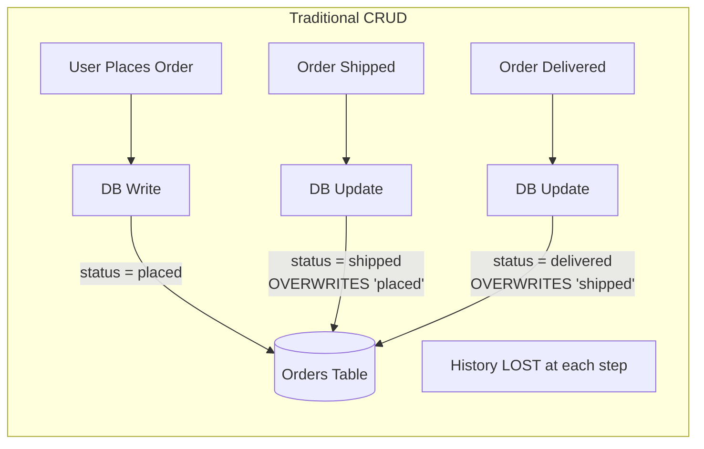

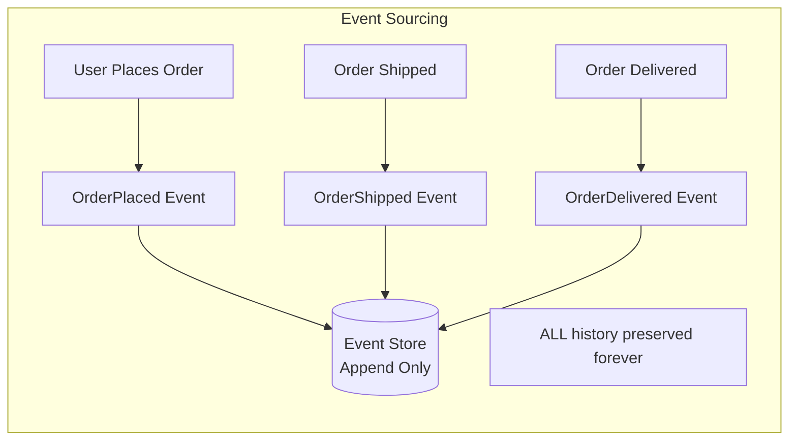

### The Comparison Table

| Dimension | Traditional CRUD | Event Sourcing |
|---|---|---|
| **What's stored** | Current state only | Every event that caused the state |
| **History** | Discarded on every update | Permanently preserved |
| **Audit log** | Needs separate implementation | Built-in, completely free |
| **Time travel** | Nearly impossible | Natural — replay up to time T |
| **Debugging prod issues** | Hard (state already mutated) | Easy — replay the exact event sequence |
| **Write performance** | Simple overwrite (fast) | Append-only (also fast, often faster) |
| **Read performance** | Instant (state is pre-computed) | Requires replay or cached projections |
| **Storage cost** | Low (one row per entity) | Higher (grows with events) |
| **Complexity** | Low — everyone knows CRUD | High — new mental model required |
| **Schema changes** | `ALTER TABLE` (painful but familiar) | Event versioning + upcasting |
| **Undo/rollback** | Manual, error-prone | Natural — apply compensating event |
| **Integration** | Needs extra CDC/ETL | Events naturally feed other systems |
| **GDPR compliance** | Easy — delete the row | Hard — append-only conflicts with deletion |
| **Good for** | Simple apps, CRUD, prototypes | Financial, order, audit, medical systems |

---

## The Event Store — Heart of the System {#the-event-store}

### The Analogy: An Accounting Ledger

An accountant's ledger is the most important document in a company. Here's the rule that's been true for 600 years: **you never erase a ledger entry.** You made a mistake? You add a correcting entry. The original wrong entry stays. The correction is its own new entry.

Why? Because anyone auditing the books needs to see exactly what happened, including mistakes and corrections.

An **event store** is your system's accounting ledger. It is an **append-only** database of events. Nothing is ever updated. Nothing is ever deleted. Every event goes in and stays in forever.

### What an Event Store Needs to Support

1. **Append events** to a stream (an aggregate's event sequence)
2. **Read all events** for a stream, in order
3. **Read events after a given position** (for catch-up reading)
4. **Optimistic concurrency control** — prevent two concurrent writers from creating conflicting events at the same position
5. **Subscribe to new events** — notify downstream projections when new events arrive

### The Schema

```sql
CREATE TABLE events (
    id           BIGSERIAL PRIMARY KEY,
    stream_id    VARCHAR(255) NOT NULL,     -- e.g., "order-ORD-001"
    version      INT NOT NULL,              -- position within this stream
    event_type   VARCHAR(255) NOT NULL,     -- e.g., "OrderPlaced"
    event_version INT NOT NULL DEFAULT 1,  -- schema version of this event type
    payload      JSONB NOT NULL,           -- the event data itself
    metadata     JSONB,                    -- correlation ID, user ID, IP, etc.
    created_at   TIMESTAMPTZ NOT NULL DEFAULT NOW(),

    UNIQUE (stream_id, version)            -- enforces optimistic concurrency
);

-- Index for fast stream reads
CREATE INDEX idx_events_stream_version ON events (stream_id, version);

-- Index for replaying all events globally (for projections)
CREATE INDEX idx_events_created_at ON events (created_at);
```

The `UNIQUE (stream_id, version)` constraint is the secret weapon. It means if two processes try to write version 5 of the same stream simultaneously, only one will succeed. The other gets a concurrency error, reloads the stream, and retries. No optimistic locking middleware needed — the database enforces it.

### Specialized Event Store Databases

While PostgreSQL works fine, purpose-built event stores exist:

| Tool | Best For | Notes |
|---|---|---|
| **EventStoreDB** | Purpose-built event store | Native subscriptions, projections, clustering |
| **Apache Kafka** | High-throughput event streaming | Excellent durability, great for >millions events/sec |
| **PostgreSQL** | Small to medium systems | Simple, reliable, familiar — great starting point |
| **Amazon DynamoDB Streams** | AWS-native serverless | Combined event store + stream |
| **Azure Cosmos DB + Change Feed** | Azure ecosystem | Global distribution built-in |

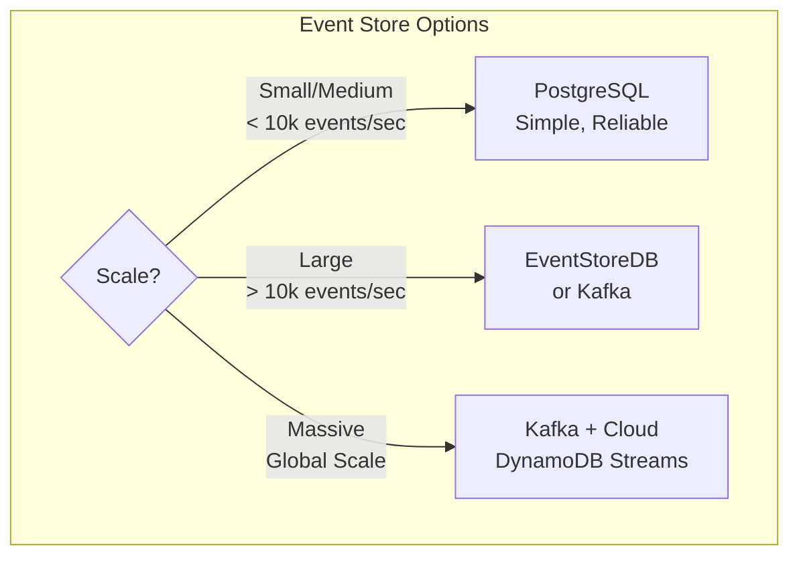

---

## Aggregates — The Building Blocks {#aggregates}

### The Analogy: A File Folder

An aggregate is like a file folder. All documents (events) related to one case go in the same folder. The folder has a unique ID. When you want to know the current state of a case, you open the folder and read every document in order.

In event sourcing, an **aggregate** is the unit of consistency. An `Order` is an aggregate. A `BankAccount` is an aggregate. A `UserProfile` is an aggregate.

All events for one aggregate instance live in one **event stream**, identified by a stream ID like `order-ORD-001` or `account-ACC-42`.

### Why Aggregates Matter for Consistency

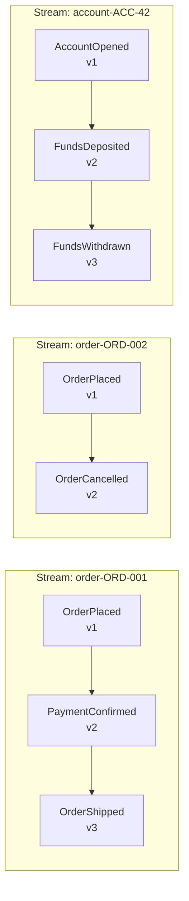

Each stream is completely independent. Concurrency is managed per-stream. You can't have a version conflict between two different orders — they're in different streams.

### The Aggregate Class

```python
from dataclasses import dataclass, field
from typing import List, Any
from enum import Enum

class OrderStatus(Enum):
    PENDING   = "pending"
    PAID      = "paid"
    PACKED    = "packed"
    SHIPPED   = "shipped"
    DELIVERED = "delivered"
    CANCELLED = "cancelled"

# --- Events ---

@dataclass
class OrderPlaced:
    order_id: str
    customer_id: str
    items: list
    total: float
    timestamp: str

@dataclass
class PaymentConfirmed:
    order_id: str
    amount: float
    payment_method: str
    transaction_id: str
    timestamp: str

@dataclass
class OrderShipped:
    order_id: str
    tracking_id: str
    carrier: str
    timestamp: str

@dataclass
class OrderDelivered:
    order_id: str
    delivered_at: str
    otp_verified: bool
    timestamp: str

@dataclass
class OrderCancelled:
    order_id: str
    reason: str
    cancelled_by: str  # "customer" | "system" | "restaurant"
    timestamp: str

# --- Aggregate ---

@dataclass
class Order:
    """The Order aggregate — represents the consistent boundary."""
    order_id:    str = ""
    customer_id: str = ""
    total:       float = 0.0
    status:      OrderStatus = OrderStatus.PENDING
    tracking_id: str = ""
    carrier:     str = ""
    version:     int = 0  # current event count (used for concurrency)
    pending_events: List[Any] = field(default_factory=list)

    def apply(self, event: Any) -> "Order":
        """Pure function: given an event, return new state. No side effects."""
        v = self.version + 1

        if isinstance(event, OrderPlaced):
            return Order(
                order_id=event.order_id,
                customer_id=event.customer_id,
                total=event.total,
                status=OrderStatus.PENDING,
                version=v
            )
        elif isinstance(event, PaymentConfirmed):
            return Order(**{**self.__dict__, "status": OrderStatus.PAID, "version": v,
                           "pending_events": []})
        elif isinstance(event, OrderShipped):
            return Order(**{**self.__dict__,
                           "status": OrderStatus.SHIPPED,
                           "tracking_id": event.tracking_id,
                           "carrier": event.carrier,
                           "version": v,
                           "pending_events": []})
        elif isinstance(event, OrderDelivered):
            return Order(**{**self.__dict__, "status": OrderStatus.DELIVERED, "version": v,
                           "pending_events": []})
        elif isinstance(event, OrderCancelled):
            return Order(**{**self.__dict__, "status": OrderStatus.CANCELLED, "version": v,
                           "pending_events": []})
        return self

    @classmethod
    def from_events(cls, events: List[Any]) -> "Order":
        """Rebuild the aggregate from its event history."""
        state = cls()
        for event in events:
            state = state.apply(event)
        return state
```

---

## Replaying Events — Deriving Current State {#replaying-events}

### The Analogy: Reading a Recipe's History

Imagine you're cooking and you write down every step you took:
1. Added 2 cups of flour
2. Added 1 egg
3. Added too much salt — added water to compensate
4. Stirred for 5 minutes

From these notes, you can derive exactly what's in the bowl right now. That's event replay.

### How Replay Works

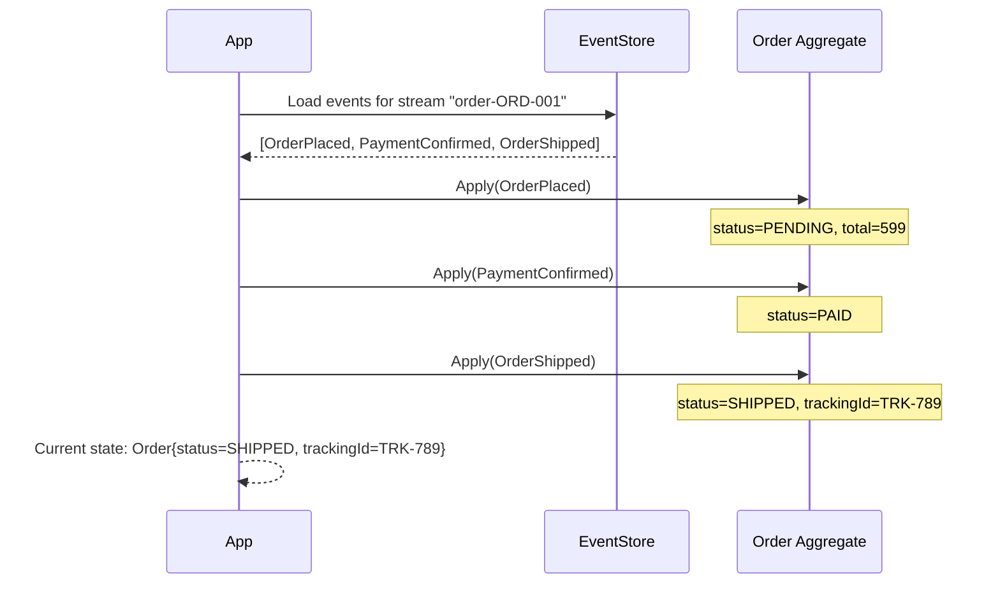

### The Event Store Service

```python
import psycopg2
import json
from typing import List, Optional, Tuple

class EventStore:
    def __init__(self, connection_string: str):
        self.conn = psycopg2.connect(connection_string)

    def append_events(
        self,
        stream_id: str,
        events: List[dict],
        expected_version: int  # optimistic concurrency — what version we expect
    ) -> None:
        cursor = self.conn.cursor()
        for i, event in enumerate(events):
            new_version = expected_version + i + 1
            try:
                cursor.execute("""
                    INSERT INTO events (stream_id, version, event_type, payload, metadata)
                    VALUES (%s, %s, %s, %s, %s)
                """, (
                    stream_id,
                    new_version,
                    event['type'],
                    json.dumps(event['payload']),
                    json.dumps(event.get('metadata', {}))
                ))
            except psycopg2.IntegrityError:
                self.conn.rollback()
                raise ConcurrencyError(
                    f"Version conflict on stream {stream_id} at version {new_version}. "
                    f"Another process wrote first — reload and retry."
                )
        self.conn.commit()

    def load_events(
        self,
        stream_id: str,
        from_version: int = 0
    ) -> List[dict]:
        cursor = self.conn.cursor()
        cursor.execute("""
            SELECT version, event_type, payload, metadata, created_at
            FROM events
            WHERE stream_id = %s AND version > %s
            ORDER BY version ASC
        """, (stream_id, from_version))
        return [
            {
                'version': row[0],
                'type': row[1],
                'payload': row[2],
                'metadata': row[3],
                'timestamp': row[4].isoformat()
            }
            for row in cursor.fetchall()
        ]

class ConcurrencyError(Exception):
    pass
```

### The Command Handler — Bringing It Together

```python
class OrderCommandHandler:
    def __init__(self, event_store: EventStore):
        self.store = event_store

    def ship_order(self, order_id: str, tracking_id: str, carrier: str):
        stream_id = f"order-{order_id}"

        # Step 1: Load all events for this order
        raw_events = self.store.load_events(stream_id)
        
        # Step 2: Replay events to rebuild current state
        order = self._deserialize_and_replay(raw_events)

        # Step 3: Validate business rules
        if order.status != OrderStatus.PAID:
            raise ValueError(f"Cannot ship order in status {order.status}. Must be PAID first.")

        # Step 4: Create the new event
        new_event = {
            'type': 'OrderShipped',
            'payload': {
                'order_id': order_id,
                'tracking_id': tracking_id,
                'carrier': carrier,
                'timestamp': datetime.utcnow().isoformat()
            }
        }

        # Step 5: Append to event store (optimistic concurrency check)
        self.store.append_events(
            stream_id=stream_id,
            events=[new_event],
            expected_version=order.version  # fails if someone wrote in between
        )

    def _deserialize_and_replay(self, raw_events: List[dict]) -> Order:
        events = [self._deserialize(e) for e in raw_events]
        return Order.from_events(events)
```

---

## Snapshots — When Replaying Is Too Slow {#snapshots}

### The Analogy: Video Game Save Points

You're playing a 40-hour RPG. You don't restart from the beginning every time you die — you load from the last save point. The save point captures your entire game state at that moment.

Snapshots are save points for your aggregates.

### Why Snapshots Exist

Imagine an `Account` aggregate that processes 500 transactions per day. After one year, it has 180,000+ events. Replaying 180,000 events every time you want to check the balance would be catastrophically slow.

Snapshots solve this:
1. Take a snapshot of the current state every N events (e.g., every 100)
2. When loading the aggregate, load the latest snapshot first
3. Then replay only the events **after** the snapshot

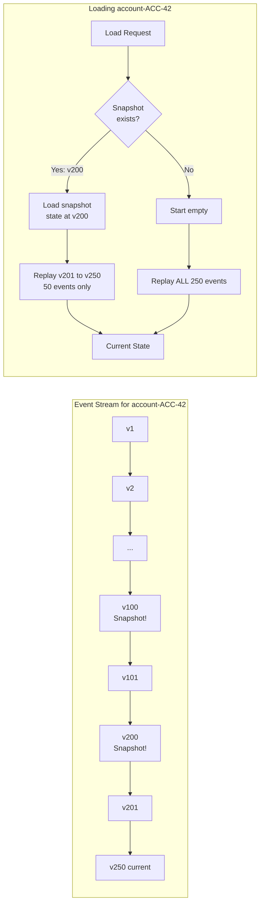

### Snapshot Implementation

```python
@dataclass
class Snapshot:
    stream_id:  str
    version:    int
    state_json: str   # serialized aggregate state
    created_at: str

class SnapshotStore:
    def __init__(self, conn):
        self.conn = conn

    def save(self, snapshot: Snapshot):
        cursor = self.conn.cursor()
        cursor.execute("""
            INSERT INTO snapshots (stream_id, version, state_json, created_at)
            VALUES (%s, %s, %s, %s)
            ON CONFLICT (stream_id) DO UPDATE
            SET version = EXCLUDED.version,
                state_json = EXCLUDED.state_json,
                created_at = EXCLUDED.created_at
        """, (snapshot.stream_id, snapshot.version,
              snapshot.state_json, snapshot.created_at))
        self.conn.commit()

    def load_latest(self, stream_id: str) -> Optional[Snapshot]:
        cursor = self.conn.cursor()
        cursor.execute("""
            SELECT version, state_json, created_at
            FROM snapshots
            WHERE stream_id = %s
        """, (stream_id,))
        row = cursor.fetchone()
        if not row:
            return None
        return Snapshot(stream_id=stream_id, version=row[0],
                       state_json=row[1], created_at=row[2])

SNAPSHOT_THRESHOLD = 50  # Take snapshot every 50 events

class OrderRepositoryWithSnapshots:
    def __init__(self, event_store: EventStore, snapshot_store: SnapshotStore):
        self.events    = event_store
        self.snapshots = snapshot_store

    def load(self, order_id: str) -> Order:
        stream_id = f"order-{order_id}"
        snapshot  = self.snapshots.load_latest(stream_id)
        
        start_version = 0
        initial_state = Order()

        if snapshot:
            initial_state = json.loads(snapshot.state_json)
            start_version = snapshot.version

        raw_events    = self.events.load_events(stream_id, from_version=start_version)
        domain_events = [deserialize_event(e) for e in raw_events]

        # Replay only delta events on top of snapshot
        state = initial_state
        for event in domain_events:
            state = state.apply(event)

        # Take a new snapshot if we've crossed the threshold
        if state.version % SNAPSHOT_THRESHOLD == 0:
            self.snapshots.save(Snapshot(
                stream_id=stream_id,
                version=state.version,
                state_json=json.dumps(state.__dict__),
                created_at=datetime.utcnow().isoformat()
            ))

        return state
```

### Snapshot Strategy

| Frequency | Pro | Con |
|---|---|---|
| Every event | Always fast reads | Huge storage cost |
| Every 50–100 events | Good balance | Slight extra read at load |
| Every 500+ events | Low storage cost | Slower reads after many events |
| Time-based (e.g., daily) | Predictable | May have big gaps |

**Rule of thumb**: Start with every 50–100 events. Adjust based on measured performance.

---

## Temporal Queries — Time Travel in Your Database {#temporal-queries}

### The Analogy: Rewinding a Video

Netflix lets you scrub back to any point in a video and see exactly what was playing at that timestamp. Event sourcing gives your data the same superpower.

"What was Swiggy's order #ORD-4521 status at 7:32 PM when the customer called?" With a traditional database: unknown, overwritten. With event sourcing: replay events up to 7:32 PM and you have the exact answer.

### How Temporal Queries Work

```python
from datetime import datetime, timezone

def get_order_state_at(
    events: List[Any],
    target_time: str  # ISO 8601: "2024-01-10T19:32:00Z"
) -> Order:
    """
    Replay events up to target_time. Stop when an event's
    timestamp exceeds the target. That gives state-as-of.
    """
    state = Order()
    cutoff = datetime.fromisoformat(target_time.replace("Z", "+00:00"))

    for event in events:
        event_time = datetime.fromisoformat(
            event.timestamp.replace("Z", "+00:00")
        )
        if event_time > cutoff:
            break  # Past the target time — stop replaying
        state = state.apply(event)

    return state

# Example: Customer calls at 7:32 PM
# Timeline:
# 7:00 PM — OrderPlaced
# 7:15 PM — RestaurantAccepted
# 7:25 PM — DeliveryAssigned
# 7:45 PM — PickedUp (AFTER the call)
# 7:55 PM — Delivered

state_at_call_time = get_order_state_at(events, "2024-01-10T19:32:00Z")
# Returns: status=DeliveryAssigned (the last event before 7:32 PM)
```

### Real-World Use Cases for Time Travel

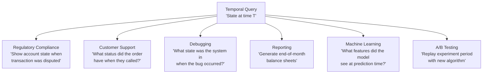

| Industry | Temporal Query Use Case |
|---|---|
| **Banking** | Show account state at dispute time |
| **E-Commerce (Swiggy, Zomato)** | Order status at any point during delivery |
| **Healthcare** | Patient record state at time of prescription |
| **Insurance** | Policy state at time of claim |
| **Legal/Compliance** | Data state at audit date |
| **Gaming** | Player state at time of suspected cheating |

---

## Event Schema Evolution — When Events Need to Change {#schema-evolution}

### The Analogy: Translating Old Letters

Your great-grandfather wrote letters in 1940 using old language conventions. When you read them today, you mentally "translate" old words to modern equivalents. You don't rewrite the original letter — you interpret it in the context of today.

Event schema evolution works the same way. Old events were written in the "language" of your old domain model. When you read them today, you **upcast** them to the current schema.

### The Golden Rule

> **You can add fields to events. You can NEVER remove or rename fields from events that are already stored.**

Old events will be replayed forever. Any code that reads events must handle both old and new formats. Breaking this rule breaks replay — and that breaks everything.

### Evolution Strategies

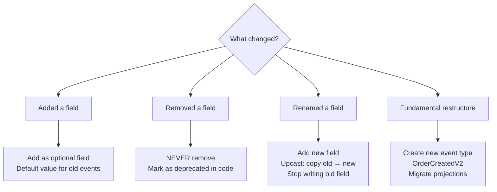

### Upcasting in Practice

```python
from typing import Dict, Any, List, Callable

# Version 1 event (stored in DB from 2022):
# { "event_type": "OrderPlaced", "event_version": 1,
#   "order_id": "ORD-001", "customer_id": "CUST-42", "total": 599.99 }

# Version 2 event (2023: we added "currency" field):
# { "event_type": "OrderPlaced", "event_version": 2,
#   "order_id": "ORD-001", "customer_id": "CUST-42", "total": 599.99,
#   "currency": "INR" }

# Version 3 event (2024: we split "total" into "subtotal" + "taxes"):
# { "event_type": "OrderPlaced", "event_version": 3,
#   "order_id": "ORD-001", "customer_id": "CUST-42",
#   "subtotal": 508.47, "taxes": 91.52, "currency": "INR" }

UpcasterFn = Callable[[Dict[str, Any]], Dict[str, Any]]

class EventUpcaster:
    """Chain of upcasters: v1 → v2 → v3 → ... → current."""

    def __init__(self):
        # Maps (event_type, from_version) → upcaster_fn
        self._upcasters: Dict[tuple, UpcasterFn] = {}

    def register(self, event_type: str, from_version: int, fn: UpcasterFn):
        self._upcasters[(event_type, from_version)] = fn

    def upcast(self, raw: Dict[str, Any]) -> Dict[str, Any]:
        """Apply all applicable upcasters until we reach the latest version."""
        CURRENT_VERSIONS = {"OrderPlaced": 3, "PaymentConfirmed": 1}
        event_type = raw["event_type"]
        current_version = CURRENT_VERSIONS.get(event_type, 1)

        while raw.get("event_version", 1) < current_version:
            from_v = raw.get("event_version", 1)
            upcaster = self._upcasters.get((event_type, from_v))
            if not upcaster:
                break
            raw = upcaster(raw)

        return raw

# --- Register upcasters ---

upcaster = EventUpcaster()

# v1 → v2: add "currency" field
upcaster.register("OrderPlaced", 1, lambda e: {
    **e,
    "currency": "INR",   # Assume INR for historical orders
    "event_version": 2
})

# v2 → v3: split "total" into "subtotal" + "taxes"
upcaster.register("OrderPlaced", 2, lambda e: {
    **e,
    "subtotal": round(e["total"] * 0.85, 2),  # Approximate 15% tax
    "taxes":    round(e["total"] * 0.15, 2),
    "event_version": 3
    # "total" kept for backward compat but marked deprecated
})

# Usage:
old_event = {
    "event_type": "OrderPlaced",
    "event_version": 1,
    "order_id": "ORD-001",
    "customer_id": "CUST-42",
    "total": 599.99
}

modern_event = upcaster.upcast(old_event)
# Now has: currency="INR", subtotal=509.99, taxes=89.99, event_version=3
```

### Schema Evolution Rules

| Rule | Description |
|---|---|
| **Add fields as optional** | New fields must have defaults for old events |
| **Never remove fields** | Old code may still read old events referencing them |
| **Never rename fields** | Treat rename as: add new + upcast from old + deprecate old |
| **Version your events** | Store `event_version` in every event payload |
| **Write upcasters immediately** | When schema changes, write the upcaster before deploying |
| **Test upcasters with old data** | Use sample events from production in tests |

---

## CQRS + Event Sourcing — The Natural Pair {#cqrs-event-sourcing}

### The Analogy: A Restaurant

In a restaurant, the kitchen (write side) and the waiter taking orders (read side) are separate. The waiter doesn't cook — they just describe what's available. The kitchen doesn't serve — they just produce food.

CQRS separates your system the same way:
- **Command side** = kitchen. Processes changes. Uses event sourcing.
- **Query side** = waiter. Returns data. Uses pre-built read models (projections).

### Why They Go Together

Event Sourcing naturally produces events. Those events need to go somewhere useful. CQRS provides the answer: events flow to projections that build fast read models optimized for specific query patterns.

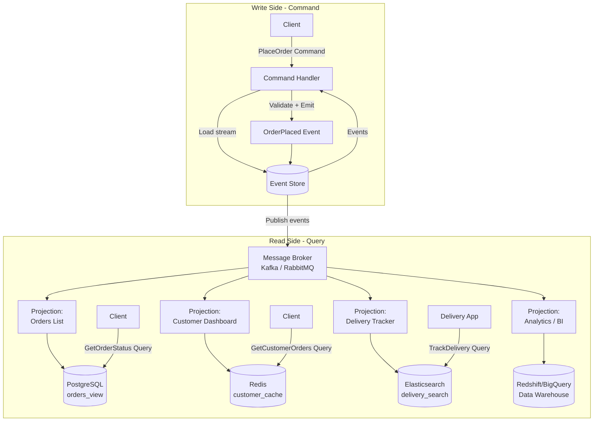

### Commands vs Events — The Crucial Difference

| Concept | Command | Event |
|---|---|---|
| **Tense** | Imperative (do this!) | Past tense (this happened) |
| **Examples** | `PlaceOrder`, `ShipOrder`, `CancelOrder` | `OrderPlaced`, `OrderShipped`, `OrderCancelled` |
| **Can fail?** | Yes — validation may reject it | No — once stored, it happened |
| **Who creates?** | Client sends to command handler | Command handler emits after validation |
| **Directed at** | A specific aggregate | Anyone who's interested |

### The Command-Event-Projection Lifecycle

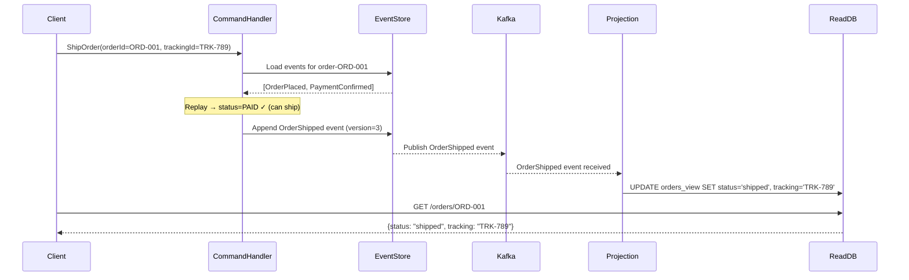

---

## Projections — Building Read Models from Events {#projections}

### The Analogy: Multiple Reports from One Database

A company's accounting team has one ledger of transactions. But the CEO wants a profit/loss summary, the tax team wants a tax report, and operations wants a cash flow report. They all derive their views from the same raw transaction data — but each view is structured differently for its purpose.

Projections do exactly this. Same events, different read models for different needs.

### Why Projections Are a Superpower

The most powerful thing about projections: **if your read model schema is wrong, drop it and rebuild.** The events are still there. Replay them all through the updated projection. You have a correct read model again.

No data migration. No data loss. Just replay.

```python
class ZomatoOrderProjection:
    """Builds a fast-read orders table for the customer-facing API."""

    def __init__(self, db):
        self.db = db

    def handle(self, event: dict):
        handlers = {
            'OrderPlaced':       self._on_order_placed,
            'RestaurantAccepted': self._on_restaurant_accepted,
            'DeliveryAssigned':  self._on_delivery_assigned,
            'PickedUp':          self._on_picked_up,
            'OrderDelivered':    self._on_order_delivered,
            'OrderCancelled':    self._on_order_cancelled,
        }
        handler = handlers.get(event['type'])
        if handler:
            handler(event['payload'])

    def _on_order_placed(self, payload: dict):
        self.db.execute("""
            INSERT INTO orders_view (
                order_id, customer_id, restaurant_id,
                total, status, placed_at
            ) VALUES (%s, %s, %s, %s, 'placed', %s)
        """, (payload['order_id'], payload['customer_id'],
              payload['restaurant_id'], payload['total'], payload['timestamp']))

    def _on_delivery_assigned(self, payload: dict):
        self.db.execute("""
            UPDATE orders_view
            SET status = 'delivery_assigned',
                delivery_partner_id = %s,
                delivery_partner_name = %s
            WHERE order_id = %s
        """, (payload['partner_id'], payload['partner_name'], payload['order_id']))

    def _on_order_delivered(self, payload: dict):
        self.db.execute("""
            UPDATE orders_view
            SET status = 'delivered',
                delivered_at = %s
            WHERE order_id = %s
        """, (payload['timestamp'], payload['order_id']))
```

### Multiple Projections from the Same Events

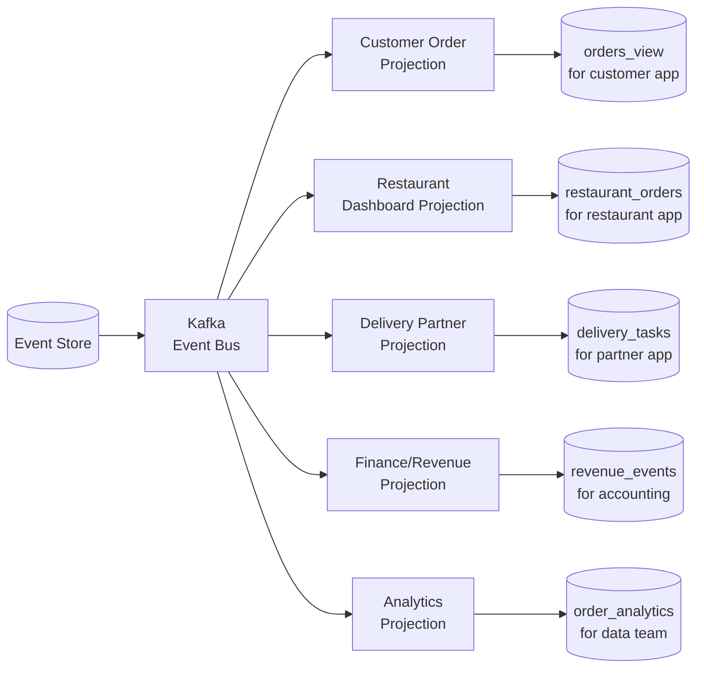

Same events. Five completely different read models. Each optimized for its consumer. This is the superpower.

### Rebuilding a Projection

```python
class ProjectionRebuilder:
    """Replay ALL historical events to rebuild a projection from scratch."""

    def __init__(self, event_store: EventStore, projection):
        self.events     = event_store
        self.projection = projection

    def rebuild(self, projection_name: str):
        print(f"Rebuilding projection: {projection_name}")

        # Step 1: Clear the existing read model
        self.projection.truncate()

        # Step 2: Load all events in chronological order
        all_events = self.events.load_all_events()

        # Step 3: Replay every event through the projection
        for i, event in enumerate(all_events):
            self.projection.handle(event)
            if i % 10000 == 0:
                print(f"  Processed {i:,} events...")

        print(f"Rebuild complete. Processed {len(all_events):,} total events.")
```

---

## Real-World Examples at Scale {#real-world-examples}

### 1. Swiggy / Zomato — Food Delivery Order Lifecycle

Every Swiggy order goes through a detailed lifecycle. Event sourcing is perfect here.

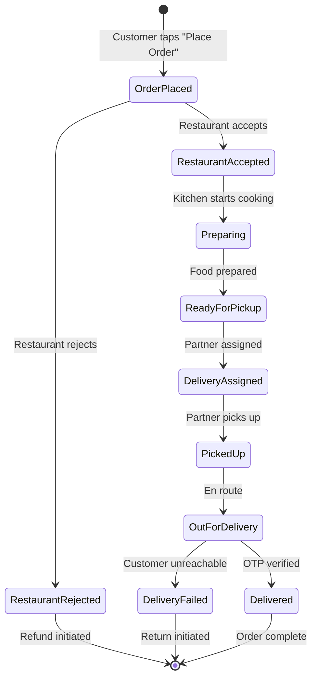

Events stored:
```json
[
  { "type": "OrderPlaced",         "orderId": "SWG-4521", "total": 340, "at": "19:10:00" },
  { "type": "RestaurantAccepted",  "orderId": "SWG-4521", "eta": 30,    "at": "19:11:00" },
  { "type": "DeliveryAssigned",    "orderId": "SWG-4521", "partnerId": "DEL-42", "at": "19:25:00" },
  { "type": "PickedUp",            "orderId": "SWG-4521", "partnerLoc": [12.9, 77.6], "at": "19:38:00" },
  { "type": "Delivered",           "orderId": "SWG-4521", "otpVerified": true, "at": "19:52:00" }
]
```

Customer calls at 19:40 asking "where is my order?" Support replays to 19:40 — sees PickedUp at 19:38, partner location at that time, ETA. Perfect.

### 2. Banking / PhonePe / Google Pay

Financial systems are the canonical event-sourced system. This isn't a choice — it's a regulatory requirement.

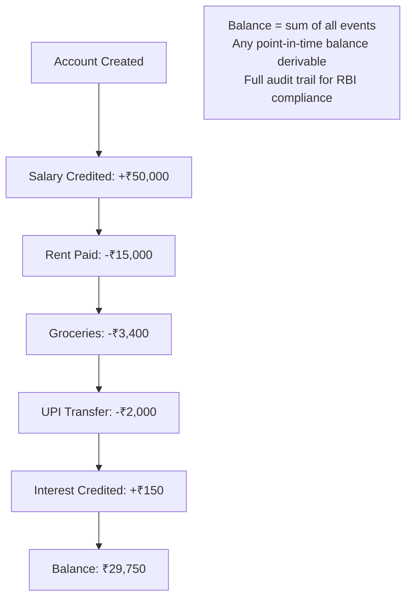

You cannot "delete" a transaction from a bank ledger. You add a **reversal entry** — which is itself an event. The original event stays forever. This is why banks can produce statements from 10 years ago.

### 3. Netflix — Watch History and Recommendations

Netflix stores every interaction as an event:
- `VideoStarted`, `VideoPaused`, `VideoResumed`, `VideoCompleted`, `VideoAbandoned`
- `SearchPerformed`, `ThumbnailClicked`, `RatingGiven`

These events power:
- **Watch history** (projection: last 100 videos per user)
- **Recommendation engine** (replay all events to train models)
- **Content analytics** (what percentage of viewers finish episode 3?)
- **A/B testing** (replay experiment period with new algorithm)

### 4. GitHub — Code Review Events

GitHub's PR system is event-sourced:
```
PullRequestOpened
ReviewRequested → user: alice
CommitPushed → sha: abc123
ReviewSubmitted → alice: "requested changes"
CommitPushed → sha: def456
ReviewSubmitted → alice: "approved"
MergeCompleted
```

The PR timeline you see in the UI is a projection built from these events. If GitHub wants to add a new timeline feature, they replay all PR events through a new projection.

### 5. Uber — Ride Lifecycle

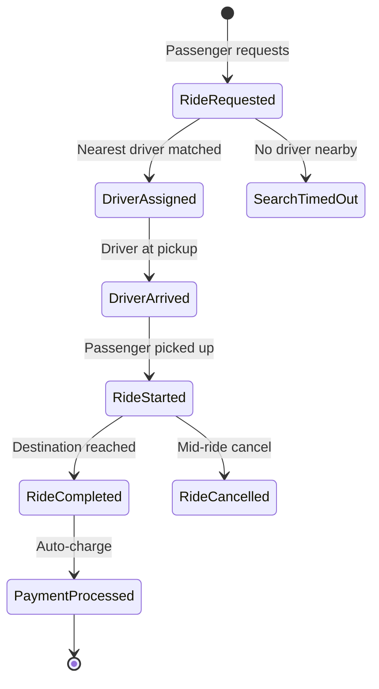

Each state transition is an event with GPS coordinates, timestamps, driver ID. This powers:
- Fare calculation (distance from GPS events)
- Dispute resolution (exact timeline of the ride)
- Surge pricing analytics (event volume per area)
- Safety features (abnormal ride patterns from event sequences)

---

## GDPR and the Right to Be Forgotten {#gdpr}

### The Problem

GDPR (General Data Protection Regulation) gives users the right to have their personal data deleted. But event sourcing is append-only. How do you delete from an immutable log?

This is a genuine tension. There are two main approaches.

### Approach 1: Crypto Shredding (Preferred)

The idea: encrypt all personal data in events with a per-user key. Deleting the key makes the data unreadable — effectively deleted.

```python
from cryptography.fernet import Fernet
import base64

class CryptoShredder:
    def __init__(self, key_store):
        self.key_store = key_store  # AWS KMS, HashiCorp Vault, etc.

    def get_or_create_key(self, user_id: str) -> bytes:
        key = self.key_store.get(user_id)
        if not key:
            key = Fernet.generate_key()
            self.key_store.set(user_id, key)
        return key

    def encrypt_pii(self, user_id: str, plaintext: str) -> str:
        key = self.get_or_create_key(user_id)
        f = Fernet(key)
        return f.encrypt(plaintext.encode()).decode()

    def decrypt_pii(self, user_id: str, ciphertext: str) -> str:
        key = self.key_store.get(user_id)
        if not key:
            return "[DATA DELETED — GDPR]"  # Key was shredded
        f = Fernet(key)
        try:
            return f.decrypt(ciphertext.encode()).decode()
        except Exception:
            return "[DECRYPT ERROR]"

    def forget_user(self, user_id: str):
        """
        GDPR Right to Be Forgotten.
        Delete the encryption key. All PII in events becomes unreadable.
        The events themselves remain (for audit integrity), but
        personal data is cryptographically erased.
        """
        self.key_store.delete(user_id)
        # Log this action as a ForgottenUserRequested event
        # (for compliance proof — the action itself is recorded)
```

### Approach 2: Pseudonymization

Replace real PII with pseudonyms in events. Store the mapping separately. Deleting the mapping table entry effectively removes the link between events and the person.

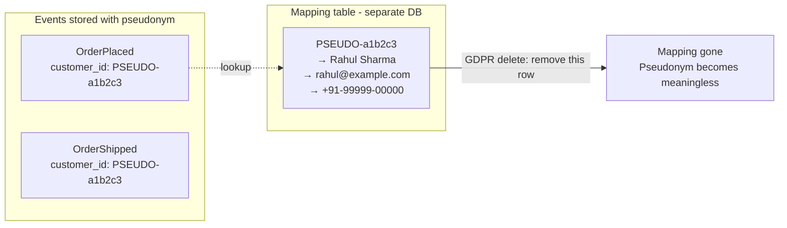

---

## When to Use vs When NOT to Use {#when-to-use}

### Use Event Sourcing When...

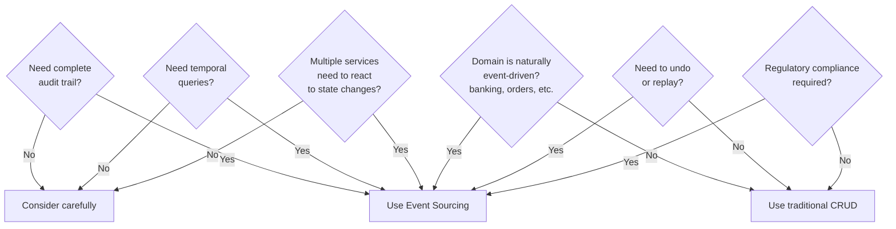

**Ideal use cases:**
- Financial systems (banking, payments, insurance)
- E-commerce order lifecycle (Swiggy, Amazon, Flipkart)
- Healthcare records (audit is regulatory requirement)
- Legal document management
- Inventory management
- Event-driven microservices architectures
- Systems that need to rebuild read models over time

### Do NOT Use Event Sourcing When...

| Situation | Why NOT |
|---|---|
| Simple CRUD app (blog, admin panel) | Massive overkill — adds complexity for zero benefit |
| Team is new to the pattern | Steep learning curve will slow you down significantly |
| You need strongly consistent immediate reads | Eventual consistency of projections may be unacceptable |
| Storage is constrained | Events accumulate forever |
| GDPR-heavy with lots of personal data | Append-only + deletion requirement = constant tension |
| You need ad-hoc cross-aggregate queries | Events are stream-per-aggregate; querying across is hard |
| Short-lived data (temp caches, sessions) | No history needed — event sourcing adds noise |

---

## Challenges and Trade-offs {#challenges}

### 1. Eventual Consistency

Events flow to projections asynchronously. A customer ships an order; the projection updates a second later. During that window, the read model is stale.

**Mitigation options:**
- Return the command result directly to the client (don't wait for the read model)
- Use synchronous projections for critical paths (slower but consistent)
- Show optimistic UI updates while the projection catches up
- Add version numbers to responses so clients know if they have fresh data

### 2. Querying Across Aggregates

Event sourcing stores events per aggregate. Querying across aggregates (e.g., "all orders by customer X in the last 30 days") requires either:
- A projection that maintains a cross-aggregate view
- A separate read model built from events

You cannot just `JOIN` across streams — the events are per-entity.

### 3. Storage Growth

Events never get deleted. For a high-traffic system like Swiggy (millions of orders/day, dozens of events per order), storage grows rapidly.

**Strategies:**
- **Event archiving**: Move events older than N years to cold storage (S3 Glacier)
- **Snapshotting**: Reduces need to replay old events
- **Event stream compaction**: For some domains, you can "compact" a stream to a snapshot + prune old events (careful — loses history)

### 4. The Learning Curve

Event sourcing requires a fundamental mental model shift. Developers trained on CRUD think in terms of entities and their current state. Event sourcing requires thinking in terms of what happened and why.

This leads to common mistakes:
- Making events too granular ("FieldChanged" instead of "OrderShipped")
- Making events too coarse ("OrderUpdated" with a diff blob — useless)
- Forgetting to version events from day one
- Not writing upcasters when schemas change

### 5. Debugging Projections

If a projection has a bug and produces wrong data, you need to:
1. Fix the projection code
2. Drop the faulty read model
3. Replay all events through the fixed projection

This can take hours for large event streams. During rebuild, the read model is unavailable or stale.

**Mitigation**: Build projections with a version number. Deploy the new version in parallel, let it catch up, then switch traffic.

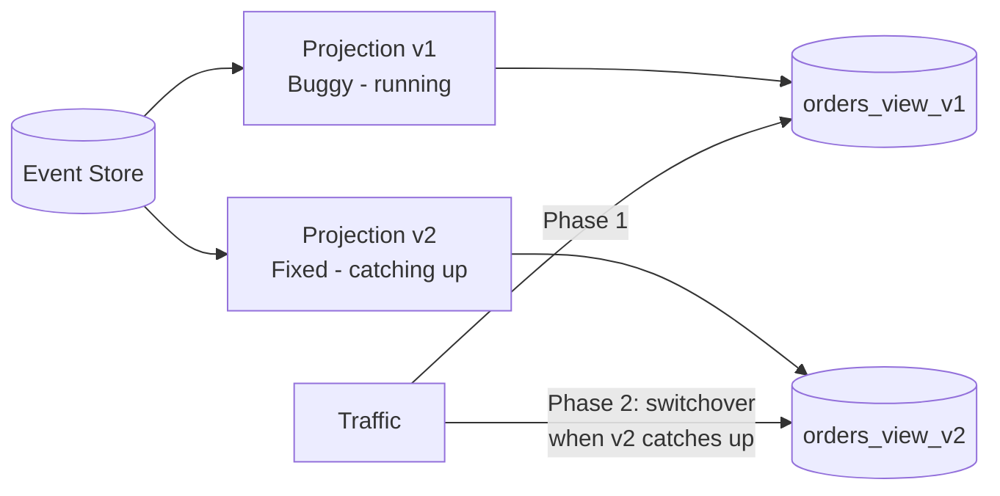

---

## Event Sourcing vs Related Patterns {#related-patterns}

### Event Sourcing vs Change Data Capture (CDC)

| Aspect | Event Sourcing | Change Data Capture |
|---|---|---|
| **What it captures** | Domain events (business intent) | Database-level row changes |
| **Granularity** | Business-meaningful events | Low-level INSERT/UPDATE/DELETE |
| **Designed** | Intentional, by developers | Automatic, from DB transaction log |
| **Richness** | Carries business context and intent | Just the changed data |
| **Use case** | Event-driven systems, audit | Data integration, replication |
| **Example** | `OrderShipped` with carrier info | `UPDATE orders SET status='shipped'` |

### Event Sourcing vs Event-Driven Architecture

Event Sourcing is **about storage** — how you persist state.
Event-Driven Architecture is **about communication** — how services talk to each other.

They complement each other perfectly but are independent:
- You can have event sourcing without event-driven architecture (single service, events not published)
- You can have event-driven architecture without event sourcing (services publish events but store state traditionally)
- Best systems often use both

### Event Sourcing vs Outbox Pattern

| Aspect | Event Sourcing | Outbox Pattern |
|---|---|---|
| **Purpose** | State persistence via events | Reliable event publishing |
| **Problem solved** | How to store state | How to atomically write state + publish event |
| **Works with** | Any architecture | Traditional CRUD systems |
| **Complementary?** | Yes — use Outbox to publish events from event store | Yes |

---

## Interview-Ready Architecture Diagrams {#architecture}

### Full Event-Sourced Microservices Architecture

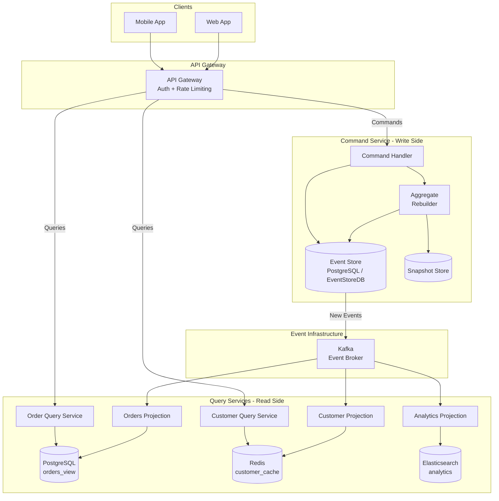

### Decision Flow for Using Event Sourcing

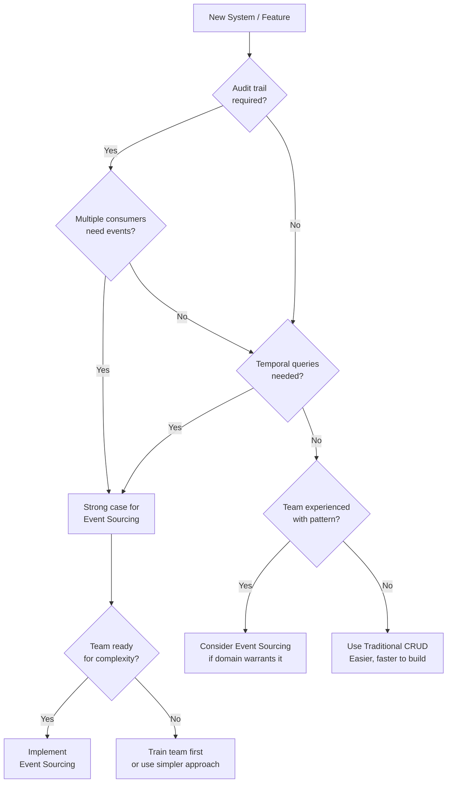

---

## Common Interview Questions {#interview-questions}

### Conceptual Questions

**Q1: What is Event Sourcing and how does it differ from traditional state storage?**

*Answer:* Traditional systems store the current state of an entity — when you update an order, the old status is overwritten. Event sourcing stores every event that caused a state change, in order. Current state is derived by replaying those events. The analogy: traditional is like only knowing your bank balance; event sourcing is like having the full bank statement with every transaction.

---

**Q2: What is the difference between Event Sourcing and Event-Driven Architecture?**

*Answer:* They are different concepts that often complement each other. Event Sourcing is about *how you store state* — events are the source of truth for an entity's state. Event-Driven Architecture is about *how services communicate* — services publish events and others react. A system can use one without the other, but many production systems use both.

---

**Q3: How do you handle schema evolution in event sourcing? Old events can't be changed.**

*Answer:* Through **upcasting** — transformation functions that convert old event formats to new formats at read time. You never modify stored events. Instead, when reading an old event, you detect its version and apply a chain of upcasters to bring it up to the current schema. The rules: always add fields as optional, never remove or rename stored fields, version every event type.

---

**Q4: What are snapshots and when would you use them?**

*Answer:* Snapshots are periodic saves of an aggregate's current state at a specific event version. Instead of replaying all events (potentially millions), you load the latest snapshot and replay only events since the snapshot. Use them when: aggregates have thousands of events, replay time noticeably impacts latency, or read performance is critical. Common threshold: take a snapshot every 50–100 events.

---

**Q5: How do you handle GDPR's right to erasure in an event-sourced system?**

*Answer:* Two main approaches: (1) **Crypto shredding** — encrypt PII in events with a per-user key stored separately. Deleting the key makes the data cryptographically unreadable. Events remain but PII is gone. (2) **Pseudonymization** — store a pseudonym in events, map to real identity separately. Delete the mapping on GDPR request. The pseudonym becomes meaningless.

---

### Design Questions

**Q6: How would you design an event-sourced order management system for Swiggy?**

Key points to cover:
- Aggregates: `Order`, `Restaurant`, `DeliveryPartner`
- Event store: PostgreSQL or Kafka as durable store
- Events per order: `OrderPlaced → RestaurantAccepted → DeliveryAssigned → PickedUp → Delivered`
- Projections: Customer view, Restaurant dashboard, Delivery partner view, Analytics
- CQRS: Command handlers for write, separate query services for reads
- Snapshots for high-event aggregates
- Optimistic concurrency via version number

---

**Q7: An aggregate has 500,000 events. How do you handle reads efficiently?**

*Answer:* Snapshots. Take a snapshot every 100 events. When loading, find the latest snapshot (say, version 499,900), load it, then replay only the 100 events after it. Snapshot storage is separate from event store. Snapshot frequency is a tuning parameter — more frequent = faster reads but more storage.

---

**Q8: How do you rebuild a corrupted projection without downtime?**

*Answer:* Deploy the fixed projection as a new version in parallel. It starts replaying all events from position 0 into a new read model table (`orders_view_v2`). The old projection (`orders_view_v1`) continues serving traffic. Once the new projection catches up to the current event position, switch the query service to point to `orders_view_v2`. Zero downtime.

---

**Q9: Why is optimistic concurrency important in event sourcing, and how is it implemented?**

*Answer:* Without it, two concurrent processes could both load an aggregate at version 5, both apply business rules, and both try to write version 6 — creating conflicting, inconsistent events. Optimistic concurrency: when appending, specify the expected version. The event store has a `UNIQUE(stream_id, version)` constraint. If another process already wrote version 6, your insert fails. You reload the stream, re-apply business rules with the fresh state, and retry.

---

**Q10: What are the main challenges of Event Sourcing and when would you NOT use it?**

*Answer:* Main challenges: eventual consistency of read models, storage growth, event schema evolution complexity, difficult cross-aggregate queries, steep learning curve, GDPR tension. Do NOT use when: team is unfamiliar with the pattern, CRUD is sufficient (simple admin apps, blogs), immediate strong consistency is required, storage is highly constrained, or the domain has lots of personal data with frequent GDPR requests.

---

**Q11: How does CQRS complement Event Sourcing?**

*Answer:* Event Sourcing produces an immutable event log optimized for writes (append-only). But reading from it requires replay, which is slow. CQRS solves this by separating the write model (event store) from read models (projections). Events flow to projections that build denormalized, query-optimized tables in PostgreSQL, Redis, or Elasticsearch. The write side is correct and durable; the read side is fast and flexible.

---

**Q12: How would you explain Event Sourcing to a non-technical stakeholder?**

*Answer (use in interviews to show communication skills):* "Imagine your bank only shows you the balance and never shows statements. If your balance is wrong, you can't prove it. Now imagine you could see every deposit, withdrawal, and fee — that full history is the proof. Event sourcing is like giving your software a full bank statement instead of just a balance. You always know what happened and why."

---

## Key Takeaways {#key-takeaways}

1. **Events are the source of truth.** Current state is derived by replaying events — never stored directly. This is the fundamental inversion of traditional thinking.

2. **The event store is append-only.** Nothing is ever updated or deleted. This immutability gives you audit logs, time travel, and replay for free.

3. **Git is event sourcing.** If you use Git, you already understand the core concept. Commits are events. The working tree is derived state. `git checkout` is a temporal query.

4. **Bank ledgers were event-sourced before computers.** Double-entry bookkeeping, transaction statements, never deleting entries — all event sourcing. It's 600 years old and proven.

5. **Snapshots are a performance optimization — not part of the core concept.** Take periodic snapshots to avoid replaying millions of events. The snapshot replaces replay from the beginning; only events after the snapshot need replaying.

6. **Temporal queries are a superpower.** "What was the state 2 hours ago?" is a natural question in event sourcing — just replay up to that timestamp. In traditional systems, that data is gone forever.

7. **Schema evolution uses upcasters.** Never modify stored events. Write transformation functions that upgrade old events to new formats at read time. Always version your events from day one.

8. **CQRS is the natural partner.** Event store for writes, projections for reads. Multiple read models built from the same events — each optimized differently. You can rebuild any read model by replaying events.

9. **This pattern has real costs.** Eventual consistency, storage growth, complexity, schema evolution overhead, GDPR tension — these are production realities. Adopt event sourcing only when the benefits clearly outweigh the costs.

10. **Not for simple CRUD.** Event sourcing is not the default pattern. It's the right pattern for financial systems, order management, audit-heavy domains, and event-driven microservices. A blog doesn't need it. An e-commerce checkout flow at Swiggy scale does.

11. **The rebuild superpower.** If your read model, cache, projection, or schema is wrong — drop it and replay all events through the fixed version. The event store is your ground truth. Nothing is ever truly lost.

---

*Next Chapter: CQRS — Splitting Reads and Writes at Scale*
