# Saga Pattern: Distributed Transactions

> "In a distributed system, you can't have your cake and eat it too — but the Saga pattern lets you eat it in slices, and if something goes wrong, you spit each slice back out in reverse order."

---

## Why Does This Topic Even Matter?

Yeh kyun important hai? Let's start with a story.

You open Swiggy and place an order for biryani. Behind the scenes, at least four things must happen together:

1. Your order gets created in the Order Service
2. Your money gets deducted in the Payment Service
3. The restaurant's inventory gets updated in the Inventory Service
4. A delivery partner gets assigned in the Dispatch Service

Now imagine: Payment succeeds. Inventory updates. But the Dispatch Service crashes. Your money is gone, your inventory is reserved, but nobody is coming to deliver your food.

**This is the nightmare of distributed transactions.** And it happens every single day at Swiggy, Zomato, Uber, Amazon, Flipkart — everywhere. The Saga pattern is how they solve it.

---

## Part 1: The Problem — ACID Doesn't Scale Across Services

### The Simple Analogy

Samjho aise — imagine you're playing Lego. When you build a single Lego castle, you can take it apart and put it back together easily. Everything is in one box.

But now imagine your Lego set was split between five different boxes, each locked in five different rooms. To build the castle, you need pieces from all five rooms. If you grab pieces from rooms 1, 2, and 3, then room 4 is locked — you can't just "undo" putting the pieces together. You have to walk back to rooms 3, 2, and 1 and physically return the pieces.

**That's exactly the distributed transaction problem.**

### The Technical Reality

In a monolith, you have one database. You can do this:

```sql
BEGIN TRANSACTION;
  INSERT INTO orders (user_id, status) VALUES (1, 'PENDING');
  UPDATE payments SET balance = balance - 500 WHERE user_id = 1;
  UPDATE inventory SET stock = stock - 1 WHERE product_id = 42;
COMMIT;
-- If ANYTHING fails above, the entire thing rolls back. Perfect.
```

In microservices, **each service owns its own database**. That's a core principle — called "Database per Service." The Order Service has its PostgreSQL. The Payment Service has its own MySQL. The Inventory Service has its own MongoDB.

You literally **cannot write a SQL transaction that spans three different databases on three different servers**. It's physically impossible.

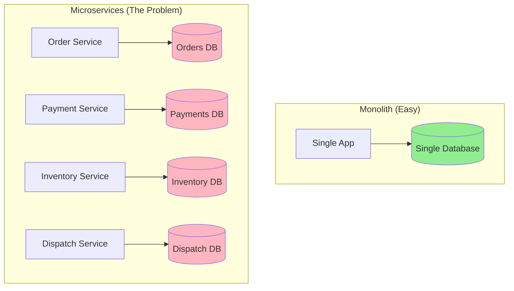

### ACID Properties — A Quick Recap

| Property | What It Means | Example |
|---|---|---|
| **Atomicity** | All or nothing — no partial updates | Either both debit and credit happen, or neither |
| **Consistency** | Data is always in a valid state | Account balance never goes negative |
| **Isolation** | Concurrent transactions don't see each other's partial work | Two transfers don't see each other mid-way |
| **Durability** | Committed data survives crashes | Once you get a "Transfer complete", it won't vanish |

These are beautiful guarantees. But they require a single database engine managing everything. Across microservices — forget it.

---

## Part 2: The Naive Fix — Two-Phase Commit (2PC) and Why It's a Trap

### The Wedding Analogy

Think of 2PC like a wedding ceremony. The minister asks both parties: "Are you READY to commit to this marriage?" If both say "I do", the minister declares it official. If either says "No", the ceremony is cancelled and nothing happened.

2PC works the same way:

- **Phase 1 (Prepare/Voting):** A coordinator asks all participants: "Can you commit?" Each participant locks its resources and says "Yes, I'm ready" or "No, I can't."
- **Phase 2 (Commit/Abort):** If all said yes, coordinator sends "Commit!" and everyone applies changes. If anyone said no, coordinator sends "Rollback!" and everyone undoes their locked changes.

Sounds great in theory. In practice, it's a disaster at scale.

### Why 2PC Fails in Production

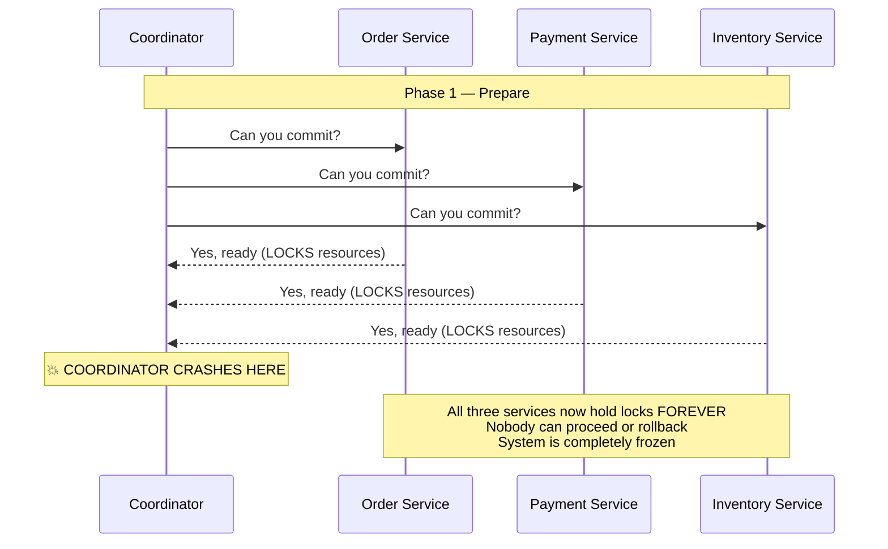

| Problem | What Happens in Production |
|---|---|
| **Blocking protocol** | All participants hold locks while waiting for Phase 2. If coordinator is slow, your whole system freezes. |
| **Single point of failure** | Coordinator crashes after Phase 1 = everyone stuck in limbo forever. |
| **Latency multiplier** | Every write requires 2 network round trips. With 10 services, your p99 latency becomes catastrophic. |
| **Tight coupling** | Every service must understand the 2PC protocol. One service update can break the whole protocol. |
| **Slow participant tax** | One service having a bad day makes everyone wait. No isolation. |
| **Not cloud-native** | Modern cloud services (DynamoDB, Firestore, managed Kafka) don't even support 2PC. |

**Bottom line:** 2PC is a distributed transaction protocol from the 1970s, designed for tightly coupled systems. In 2024's microservices world, it's a round peg in a square hole. Basically mat use karo.

---

## Part 3: The Saga Pattern — The Real Solution

### The Vacation Booking Analogy

This is my favorite analogy. Imagine you're planning an international trip — Goa trip with friends planning that always falls apart.

You book:
1. **Flight tickets** on MakeMyTrip — ₹15,000 paid. Flight booked.
2. **Hotel** on OYO — ₹8,000 paid. Room reserved.
3. **Cab rental** on Zoomcar — you try to book, but no cars available on that date!

Now what do you do? You don't get a magical undo button. You:
1. Cancel the hotel booking on OYO (get ₹8,000 back)
2. Cancel the flight on MakeMyTrip (get ₹15,000 back, minus cancellation fee — which is a real-world saga problem!)

Each booking was a **separate, independent transaction with a separate vendor**. When step 3 failed, you performed **compensating transactions** in reverse order.

**That's a Saga.**

### What Is a Saga, Formally?

A **Saga** is a sequence of **local transactions** where:

1. Each local transaction updates **one service's database** and publishes an **event or message**
2. The next step is triggered by that event/message
3. If step N fails, **compensating transactions** are executed for steps N-1, N-2, ... 1 in reverse order
4. There are **no distributed locks** — each service does its own thing independently

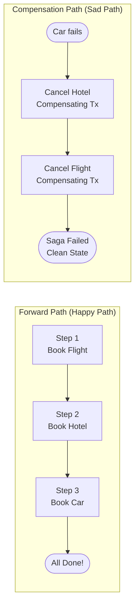

### The Saga State Machine

Every saga has a well-defined state. This is crucial — especially when services crash mid-way.

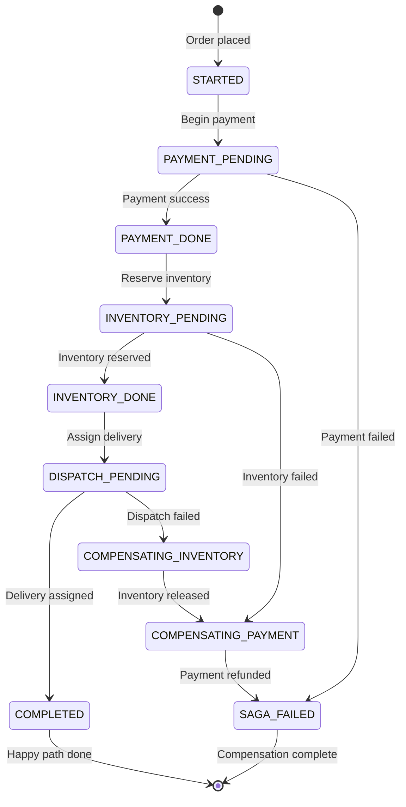

Key insight: **the saga state is persisted.** If the orchestrator crashes at `INVENTORY_PENDING`, it can recover and continue from where it left off. This is not possible with 2PC.

---

## Part 4: Choreography-Based Saga

### The Jazz Band Analogy

Think of a jazz band. Nobody tells the drummer when to play. Nobody tells the pianist when to start. Each musician **listens to the others** and responds accordingly. There is no conductor. The music emerges from their interaction.

Choreography-based Saga works exactly like this. Each service:
- **Listens** on an event bus (Kafka, RabbitMQ, AWS SNS/SQS)
- **Reacts** to events published by other services
- **Publishes** its own events when it's done

No central controller. Pure event-driven. Decentralized by design.

### Real World: How Zomato Might Handle an Order

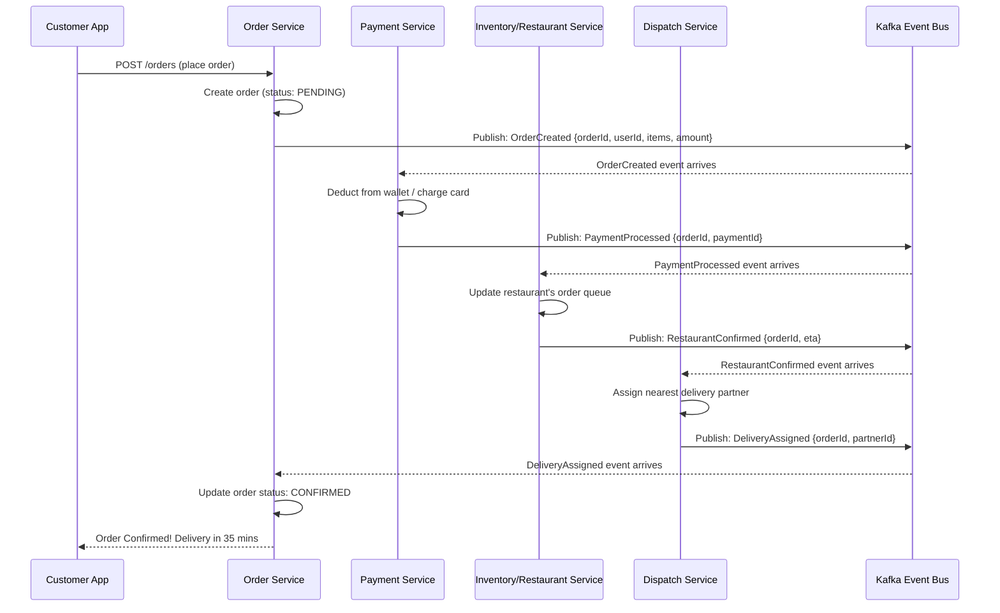

### The Failure Path — Choreography Compensation

Now let's say the restaurant is full and rejects the order:

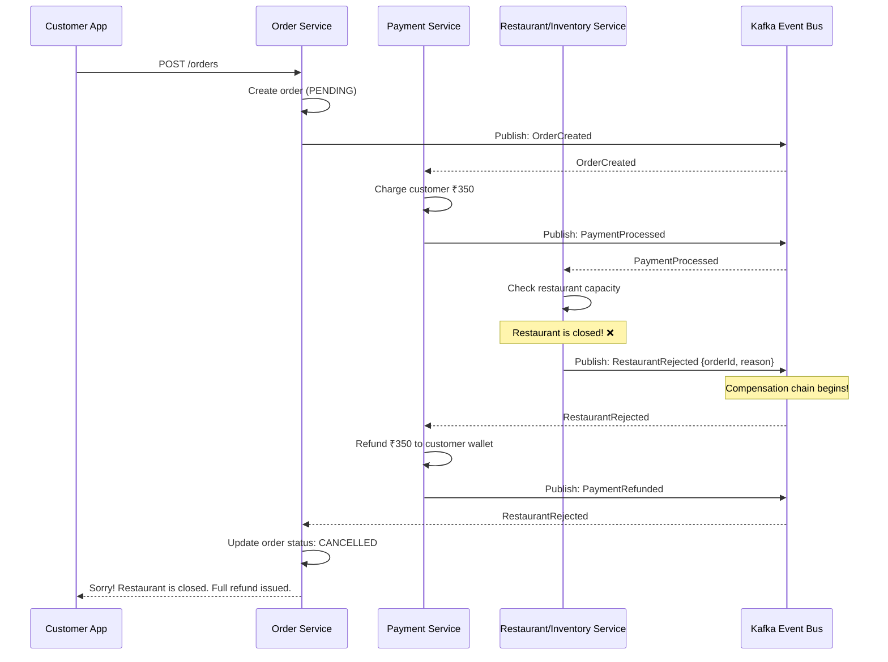

### Code: Choreography with Node.js + Kafka

```javascript
// order-service/src/saga/order-saga-consumer.js
const { Kafka } = require('kafkajs');
const OrderRepository = require('../repositories/order-repository');
const producer = require('../kafka/producer');

const kafka = new Kafka({ brokers: ['kafka:9092'] });
const consumer = kafka.consumer({ groupId: 'order-service-saga' });

async function startSagaConsumer() {
  await consumer.connect();

  // Order service listens for terminal events
  await consumer.subscribe({
    topics: ['DeliveryAssigned', 'RestaurantRejected', 'PaymentFailed'],
  });

  await consumer.run({
    eachMessage: async ({ topic, message }) => {
      const payload = JSON.parse(message.value.toString());

      switch (topic) {
        case 'DeliveryAssigned':
          // Happy path complete
          await OrderRepository.updateStatus(payload.orderId, 'CONFIRMED');
          break;

        case 'RestaurantRejected':
        case 'PaymentFailed':
          // Saga failed — mark order cancelled
          await OrderRepository.updateStatus(payload.orderId, 'CANCELLED');
          break;
      }
    },
  });
}

// order-service/src/handlers/create-order.js
async function createOrder(req, res) {
  const order = await OrderRepository.create({
    userId: req.body.userId,
    items: req.body.items,
    totalAmount: req.body.totalAmount,
    status: 'PENDING',
  });

  // Fire the first event to kick off the saga
  await producer.send({
    topic: 'OrderCreated',
    messages: [{
      key: order.id,               // Use orderId as partition key — ensures ordering
      value: JSON.stringify({
        orderId: order.id,
        userId: order.userId,
        items: order.items,
        totalAmount: order.totalAmount,
        timestamp: Date.now(),
      }),
    }],
  });

  // Return 202 Accepted — order is being processed asynchronously
  res.status(202).json({ orderId: order.id, status: 'PENDING' });
}
```

```javascript
// payment-service/src/saga/payment-consumer.js
// Payment service handles both FORWARD and COMPENSATING logic

const kafka = new Kafka({ brokers: ['kafka:9092'] });
const consumer = kafka.consumer({ groupId: 'payment-service' });
const producer = kafka.producer();
const PaymentProcessor = require('../services/payment-processor');
const PaymentRepository = require('../repositories/payment-repository');

async function start() {
  await consumer.connect();
  await producer.connect();

  await consumer.subscribe({
    topics: ['OrderCreated', 'RestaurantRejected'], // forward + compensation
  });

  await consumer.run({
    eachMessage: async ({ topic, message }) => {
      const payload = JSON.parse(message.value.toString());

      if (topic === 'OrderCreated') {
        // FORWARD step: charge the customer
        try {
          const payment = await PaymentProcessor.chargeIdempotent({
            orderId: payload.orderId,
            userId: payload.userId,
            amount: payload.totalAmount,
          });

          await producer.send({
            topic: 'PaymentProcessed',
            messages: [{ key: payload.orderId, value: JSON.stringify({
              orderId: payload.orderId,
              paymentId: payment.id,
            })}],
          });
        } catch (err) {
          await producer.send({
            topic: 'PaymentFailed',
            messages: [{ key: payload.orderId, value: JSON.stringify({
              orderId: payload.orderId,
              reason: err.message,
            })}],
          });
        }
      }

      if (topic === 'RestaurantRejected') {
        // COMPENSATING step: refund the customer
        const payment = await PaymentRepository.findByOrderId(payload.orderId);
        if (payment && payment.status !== 'REFUNDED') {
          await PaymentProcessor.refund(payment.id);
          await PaymentRepository.updateStatus(payment.id, 'REFUNDED');

          await producer.send({
            topic: 'PaymentRefunded',
            messages: [{ key: payload.orderId, value: JSON.stringify({
              orderId: payload.orderId,
            })}],
          });
        }
      }
    },
  });
}
```

### Pros and Cons of Choreography

| Dimension | Detail |
|---|---|
| **Loose coupling** | Services only know about events, not each other. You can add a new service by just subscribing to events. |
| **No single point of failure** | There is no coordinator to crash. The event bus (Kafka) is HA by design. |
| **Natural scalability** | Each service scales independently. No orchestrator bottleneck. |
| **Hard to trace** | To answer "what state is order #123 in?" you must correlate events across 4 different service logs. |
| **Cyclic risk** | Service A reacts to Service B's event, which reacts back to Service A — infinite loop. Be careful. |
| **End-to-end testing is hard** | You need a full integration test environment with Kafka running. |
| **Implicit saga logic** | The saga flow is scattered across services. New engineers struggle to understand the full flow. |

---

## Part 5: Orchestration-Based Saga

### The Movie Director Analogy

Imagine a movie director on set. They don't just let actors do whatever they want. The director says: "Okay, in this scene: Actor A enters first, speaks this line. Then Actor B responds. If Actor B forgets their line, we do a reshoot — Actor A goes back, we reset the scene."

The director has the complete script. They know every step, every contingency, every retry.

An **Orchestration-based Saga** works exactly like this. A dedicated **Saga Orchestrator** service:
- Holds the complete saga definition (the "script")
- Sends **commands** to each service (not events — commands are directed)
- Waits for each service's **reply**
- Tracks the overall saga state in its own database
- Handles failures by executing compensations in the right order

### Real World: How Uber's Dispatch Works

When you book an Uber, a saga runs:
1. Create trip record
2. Hold payment method (pre-authorization)
3. Find and assign a driver
4. Start trip tracking

If driver assignment fails (no drivers nearby), Uber:
- Releases the payment hold
- Marks trip as failed
- Notifies you "No drivers available"

Uber's internal system uses a saga-like workflow for this — the orchestrator knows every step and every compensation.

### Happy Path — Orchestration Flow

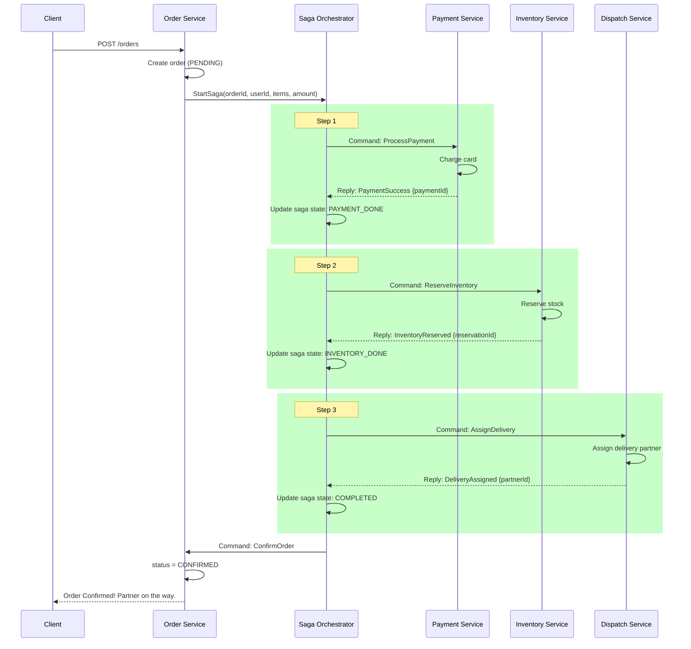

### Failure Path — Orchestration Compensation

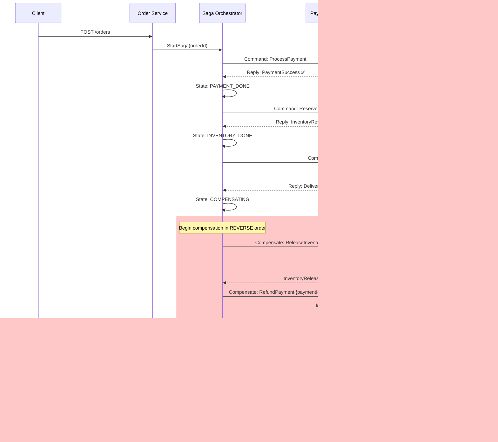

### Code: Orchestration Saga with State Machine

```javascript
// saga-orchestrator/src/sagas/order-saga.js

// Every possible state the saga can be in
const SagaState = {
  STARTED:                 'STARTED',
  PAYMENT_PROCESSING:      'PAYMENT_PROCESSING',
  PAYMENT_DONE:            'PAYMENT_DONE',
  INVENTORY_RESERVING:     'INVENTORY_RESERVING',
  INVENTORY_DONE:          'INVENTORY_DONE',
  DISPATCH_ASSIGNING:      'DISPATCH_ASSIGNING',
  COMPLETED:               'COMPLETED',
  // Compensation states (reverse order)
  COMPENSATING_DISPATCH:   'COMPENSATING_DISPATCH',
  COMPENSATING_INVENTORY:  'COMPENSATING_INVENTORY',
  COMPENSATING_PAYMENT:    'COMPENSATING_PAYMENT',
  SAGA_FAILED:             'SAGA_FAILED',
};

class OrderSagaOrchestrator {
  constructor({ sagaRepo, paymentClient, inventoryClient, dispatchClient, orderClient }) {
    this.sagaRepo = sagaRepo;
    this.paymentClient = paymentClient;
    this.inventoryClient = inventoryClient;
    this.dispatchClient = dispatchClient;
    this.orderClient = orderClient;
  }

  async startSaga({ sagaId, orderId, userId, items, totalAmount }) {
    // Persist saga state FIRST — crash recovery depends on this
    await this.sagaRepo.create({
      sagaId,
      orderId,
      state: SagaState.STARTED,
      compensationData: {},    // accumulated data needed for compensation
      data: { userId, items, totalAmount },
      createdAt: new Date(),
    });

    await this.step(sagaId);
  }

  async step(sagaId) {
    const saga = await this.sagaRepo.findById(sagaId);
    console.log(`[Saga ${sagaId}] Current state: ${saga.state}`);

    try {
      switch (saga.state) {
        case SagaState.STARTED:
          await this.processPayment(saga);
          break;
        case SagaState.PAYMENT_DONE:
          await this.reserveInventory(saga);
          break;
        case SagaState.INVENTORY_DONE:
          await this.assignDelivery(saga);
          break;
        case SagaState.COMPLETED:
          console.log(`[Saga ${sagaId}] Already completed.`);
          break;
        // Recovery: if we crashed mid-step, retry it
        case SagaState.PAYMENT_PROCESSING:
          await this.processPayment(saga);
          break;
        case SagaState.INVENTORY_RESERVING:
          await this.reserveInventory(saga);
          break;
        case SagaState.DISPATCH_ASSIGNING:
          await this.assignDelivery(saga);
          break;
        // Compensation states
        case SagaState.COMPENSATING_INVENTORY:
          await this.compensateInventory(saga);
          break;
        case SagaState.COMPENSATING_PAYMENT:
          await this.compensatePayment(saga);
          break;
      }
    } catch (err) {
      console.error(`[Saga ${sagaId}] Step failed: ${err.message}`);
      await this.beginCompensation(sagaId, saga.state);
    }
  }

  async processPayment(saga) {
    await this.sagaRepo.updateState(saga.sagaId, SagaState.PAYMENT_PROCESSING);

    // This call must be idempotent — use sagaId as idempotency key
    const result = await this.paymentClient.processPayment({
      idempotencyKey: `${saga.sagaId}-payment`,
      orderId: saga.orderId,
      userId: saga.data.userId,
      amount: saga.data.totalAmount,
    });

    // Save paymentId for potential compensation
    await this.sagaRepo.updateState(saga.sagaId, SagaState.PAYMENT_DONE, {
      compensationData: { paymentId: result.paymentId },
    });

    await this.step(saga.sagaId); // move to next step
  }

  async reserveInventory(saga) {
    await this.sagaRepo.updateState(saga.sagaId, SagaState.INVENTORY_RESERVING);

    const result = await this.inventoryClient.reserve({
      idempotencyKey: `${saga.sagaId}-inventory`,
      orderId: saga.orderId,
      items: saga.data.items,
    });

    await this.sagaRepo.updateState(saga.sagaId, SagaState.INVENTORY_DONE, {
      compensationData: {
        ...saga.compensationData,
        reservationId: result.reservationId,
      },
    });

    await this.step(saga.sagaId);
  }

  async assignDelivery(saga) {
    await this.sagaRepo.updateState(saga.sagaId, SagaState.DISPATCH_ASSIGNING);

    const result = await this.dispatchClient.assign({
      idempotencyKey: `${saga.sagaId}-dispatch`,
      orderId: saga.orderId,
      deliveryAddress: saga.data.deliveryAddress,
    });

    // All steps done! Confirm the order.
    await this.orderClient.confirm(saga.orderId);
    await this.sagaRepo.updateState(saga.sagaId, SagaState.COMPLETED, {
      compensationData: {
        ...saga.compensationData,
        partnerId: result.partnerId,
      },
    });

    console.log(`[Saga ${saga.sagaId}] COMPLETED successfully!`);
  }

  async beginCompensation(sagaId, failedState) {
    // Determine where to start compensating based on how far we got
    const compensationStateMap = {
      [SagaState.DISPATCH_ASSIGNING]:   SagaState.COMPENSATING_INVENTORY,
      [SagaState.INVENTORY_RESERVING]:  SagaState.COMPENSATING_PAYMENT,
      [SagaState.INVENTORY_DONE]:       SagaState.COMPENSATING_INVENTORY,
      [SagaState.PAYMENT_PROCESSING]:   SagaState.SAGA_FAILED, // nothing to undo
    };

    const nextState = compensationStateMap[failedState] || SagaState.SAGA_FAILED;
    await this.sagaRepo.updateState(sagaId, nextState);
    await this.step(sagaId);
  }

  async compensateInventory(saga) {
    // Idempotent: if already released, this is a no-op
    await this.inventoryClient.release({
      idempotencyKey: `${saga.sagaId}-inventory-release`,
      reservationId: saga.compensationData.reservationId,
    });

    await this.sagaRepo.updateState(saga.sagaId, SagaState.COMPENSATING_PAYMENT);
    await this.step(saga.sagaId);
  }

  async compensatePayment(saga) {
    // Idempotent: if already refunded, this is a no-op
    await this.paymentClient.refund({
      idempotencyKey: `${saga.sagaId}-payment-refund`,
      paymentId: saga.compensationData.paymentId,
    });

    await this.orderClient.cancel(saga.orderId, 'Saga compensation complete');
    await this.sagaRepo.updateState(saga.sagaId, SagaState.SAGA_FAILED);

    console.log(`[Saga ${saga.sagaId}] Compensation complete. FAILED.`);
  }
}

module.exports = OrderSagaOrchestrator;
```

### Pros and Cons of Orchestration

| Dimension | Detail |
|---|---|
| **Full visibility** | Query the saga table: "Show me all orders stuck in INVENTORY_RESERVING for > 5 mins" |
| **Clear failure handling** | Compensation is explicit and centralized. No guessing which service handles which failure. |
| **Crash recovery** | Orchestrator saves state before each step. On restart, it picks up exactly where it left off. |
| **Easy to add steps** | Add a new step in one place — the orchestrator. Not scattered across 6 services. |
| **Testable in isolation** | Mock all service clients and test the orchestrator's state machine logic alone. |
| **SPOF risk** | Orchestrator is a single point of failure (mitigated by running it as a stateless cluster + durable DB) |
| **Service coupling** | Orchestrator knows about all downstream services. New dependencies = update orchestrator. |
| **"God service" risk** | If all your business logic ends up in the orchestrator, you've rebuilt a monolith. Keep orchestrators thin. |

---

## Part 6: Choreography vs Orchestration — Head to Head

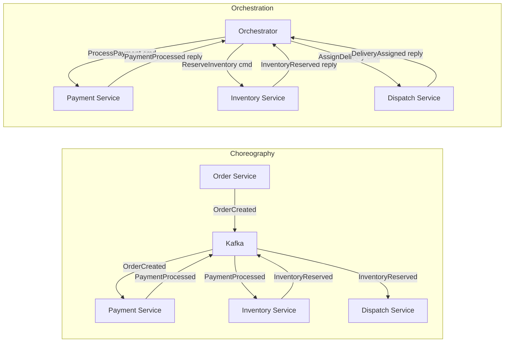

| Dimension | Choreography | Orchestration |
|---|---|---|
| **Architecture** | Decentralized, event-driven | Centralized, command-driven |
| **Who decides next step** | Each service decides based on events | Orchestrator decides |
| **Saga state** | Implicit, scattered across services | Explicit, in orchestrator's DB |
| **Visibility** | Low — you need distributed tracing | High — query orchestrator directly |
| **Coupling** | Services coupled to events (loose) | Services coupled to orchestrator (tighter) |
| **Failure handling** | Each service must implement its own compensation listener | Orchestrator handles all compensation centrally |
| **Debugging** | Hard — correlate events across 5 service logs | Easy — look at orchestrator state |
| **Best for** | Simple sagas (2-3 steps), highly autonomous teams | Complex sagas (4+ steps), clear ownership |
| **Risk** | Cyclic events, hard to find "stuck" sagas | Orchestrator becomes SPOF, God service risk |
| **Real example** | Basic event-driven flows | Temporal.io, AWS Step Functions, Axon |

**Interview tip:** If asked "which would you choose?" — always say "it depends". For simple 2-3 step sagas with autonomous teams: choreography. For complex business processes with 4+ steps, retries, timeouts, monitoring requirements: orchestration. In practice, many systems start with choreography and graduate to orchestration as complexity grows.

---

## Part 7: Compensating Transactions — The Art of Undoing

### The Pencil and Eraser Analogy

A database rollback is like using Ctrl+Z — it's as if you never typed that word. It erases all evidence.

A compensating transaction is like using an eraser on pencil — you can clearly see the faint marks where you wrote before. You've corrected it, but the original action happened.

This distinction matters enormously. When Swiggy refunds your money, two transactions exist in the ledger: the original charge and the refund. Both are permanent records. Neither erases the other.

### Mapping Every Step to Its Compensation

For every forward action in your saga, you MUST define the compensation before you write a single line of code. This is a design discipline, not an afterthought.

| Service | Forward Action | Compensating Action | Can It Truly Undo? |
|---|---|---|---|
| Order Service | Create order (PENDING) | Cancel order (CANCELLED) | Yes — status change |
| Payment Service | Charge customer ₹350 | Refund ₹350 | Yes — but takes 3-5 business days in real life |
| Inventory Service | Reserve 1 unit | Release reservation | Yes — put stock back |
| Restaurant Service | Notify restaurant | Send cancellation | Partial — restaurant may have started cooking |
| Notification Service | Send "Order placed!" SMS | Send "Order cancelled" SMS | No — can't un-send, but semantic undo works |
| Loyalty Service | Add 50 points | Deduct 50 points | Yes |
| Analytics Service | Log order event | Log cancellation event | N/A — append-only, no need to compensate |

### The Pivotal Transaction Problem

Sometimes compensation is genuinely impossible. In saga theory, there's a concept called a **pivotal transaction**: a point of no return. After the pivotal transaction commits, you cannot safely compensate — you must let it complete and deal with consequences forward.

Example: Uber's taxi assignment. Once a driver accepts your ride, you don't "un-assign" them — you send a cancellation (which is itself a new business process, with its own fees).

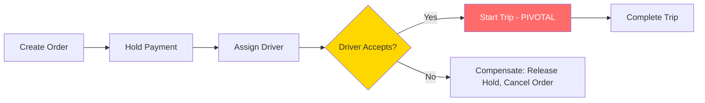

Once the trip starts (pivotal), there's no backward compensation. The saga goes forward-only.

### Idempotency — Absolutely Non-Negotiable

This is where most saga implementations fail in production. Yeh miss mat karna.

**Why do you need idempotency?**

In a distributed system, messages can be delivered more than once. This happens because:
- Network retries after timeout
- Kafka's at-least-once delivery guarantee
- Orchestrator retries a step after crash recovery
- Service restarts mid-processing

If your payment step is not idempotent, a retry can charge the customer twice. That's a very bad day.

**Implementation pattern:**

```javascript
// payment-service/src/services/payment-processor.js

async function chargeIdempotent({ idempotencyKey, orderId, userId, amount }) {
  // Step 1: Check if we've already processed this exact operation
  const existing = await PaymentRepository.findByIdempotencyKey(idempotencyKey);

  if (existing) {
    // Already processed — return the same result without charging again
    console.log(`[Idempotency] Already processed ${idempotencyKey}, skipping`);
    return existing;
  }

  // Step 2: Process for the first time
  // Use Stripe's built-in idempotency key for the payment provider too
  const charge = await stripe.charges.create(
    {
      amount: Math.round(amount * 100), // Stripe wants paise/cents
      currency: 'inr',
      customer: userId,
      metadata: { orderId },
    },
    {
      idempotencyKey: idempotencyKey, // Stripe deduplicates on their end too
    }
  );

  // Step 3: Save with idempotency key — this is the atomic "lock"
  const payment = await PaymentRepository.save({
    idempotencyKey,
    orderId,
    chargeId: charge.id,
    amount,
    status: 'PROCESSED',
    createdAt: new Date(),
  });

  return payment;
}
```

**The key principle:** Before doing anything, check if you've already done it. If yes, return the same result. Make this check + operation atomic using database constraints (unique index on `idempotency_key`).

---

## Part 8: Real-World Systems Using Sagas

### Uber's Dispatch System

Uber's trip-booking is a classic saga:

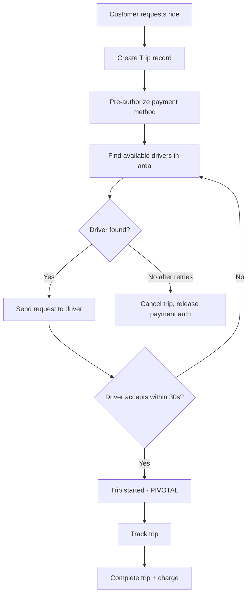

The retry loop (finding another driver) is itself a saga pattern — each driver request is a mini-saga within the larger trip saga.

### Amazon's Order Fulfillment

Amazon's order fulfillment runs a saga across:
- Order Management System
- Payment Gateway
- Warehouse Management System (pick + pack)
- Shipping (UPS/FedEx/Amazon Logistics)
- Returns Processing

Each step can fail independently. Amazon's fulfillment saga runs for **hours to days** — a flight booking saga runs in seconds. Both are sagas.

### Netflix — Content Licensing

When Netflix acquires a new show, a saga runs:
1. Create content record
2. Process licensing agreements
3. Upload and transcode video (takes hours!)
4. Publish to regional CDNs
5. Activate in the catalog

If step 4 fails for a specific region, they compensate only that region — not the whole saga. This is called a **partial compensation**, which is more complex but valid.

### Airline Booking Systems

"Book flight + hotel + car" is the textbook saga example:

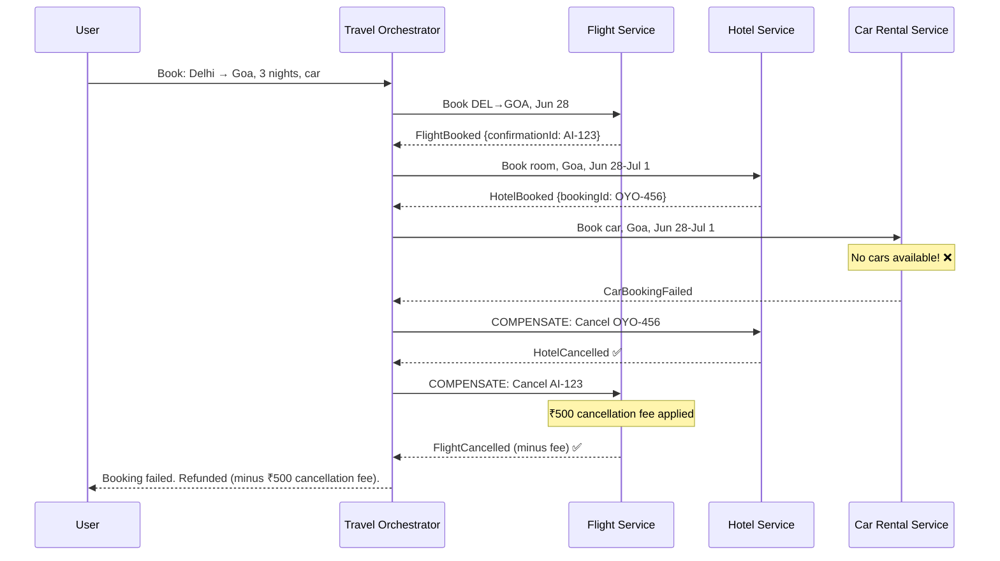

Note the nuance: the cancellation fee is a real-world example of compensation not being a perfect undo. The saga fails cleanly, but with a business cost baked in.

---

## Part 9: Saga Frameworks and Libraries

You don't have to build sagas from scratch. Several mature tools exist:

### Temporal.io

Temporal is arguably the best modern saga orchestration platform. It's used by Uber, Netflix, Hashicorp, and Snapchat.

**Why Temporal is brilliant:**
- Write your saga as regular code (Python, Go, Java, TypeScript)
- Temporal handles persistence, retries, timeouts, crash recovery
- Your workflow code looks synchronous — Temporal makes it fault-tolerant behind the scenes

```typescript
// Temporal workflow — looks like normal code but is fault-tolerant
import { proxyActivities, sleep } from '@temporalio/workflow';
import type * as activities from './activities';

const { processPayment, reserveInventory, assignDelivery,
        refundPayment, releaseInventory } = proxyActivities<typeof activities>({
  startToCloseTimeout: '30 seconds',
  retry: { maximumAttempts: 3 },
});

export async function orderFulfillmentWorkflow(order: Order): Promise<void> {
  let paymentId: string | undefined;
  let reservationId: string | undefined;

  try {
    // Step 1: Payment
    const payment = await processPayment(order);
    paymentId = payment.id;

    // Step 2: Inventory
    const reservation = await reserveInventory(order);
    reservationId = reservation.id;

    // Step 3: Delivery
    await assignDelivery(order, reservationId);

    // Done!
  } catch (err) {
    // Compensation — Temporal handles retries of these too
    if (reservationId) await releaseInventory(reservationId);
    if (paymentId) await refundPayment(paymentId);
    throw err;
  }
}
```

Temporal persists every step. If the server running this code crashes mid-saga, Temporal replays the workflow from the last checkpoint. Your code literally resumes from where it crashed — like magic.

### AWS Step Functions

AWS Step Functions is Amazon's managed workflow service. Perfect if you're already in the AWS ecosystem.

```json
{
  "Comment": "Order Fulfillment Saga",
  "StartAt": "ProcessPayment",
  "States": {
    "ProcessPayment": {
      "Type": "Task",
      "Resource": "arn:aws:lambda:us-east-1:123:function:processPayment",
      "Next": "ReserveInventory",
      "Catch": [{
        "ErrorEquals": ["PaymentFailed"],
        "Next": "SagaFailed"
      }]
    },
    "ReserveInventory": {
      "Type": "Task",
      "Resource": "arn:aws:lambda:us-east-1:123:function:reserveInventory",
      "Next": "AssignDelivery",
      "Catch": [{
        "ErrorEquals": ["InventoryFailed"],
        "Next": "RefundPayment"
      }]
    },
    "AssignDelivery": {
      "Type": "Task",
      "Resource": "arn:aws:lambda:us-east-1:123:function:assignDelivery",
      "Next": "OrderComplete",
      "Catch": [{
        "ErrorEquals": ["DeliveryFailed"],
        "Next": "ReleaseInventory"
      }]
    },
    "ReleaseInventory": {
      "Type": "Task",
      "Resource": "arn:aws:lambda:us-east-1:123:function:releaseInventory",
      "Next": "RefundPayment"
    },
    "RefundPayment": {
      "Type": "Task",
      "Resource": "arn:aws:lambda:us-east-1:123:function:refundPayment",
      "Next": "SagaFailed"
    },
    "OrderComplete": { "Type": "Succeed" },
    "SagaFailed": { "Type": "Fail" }
  }
}
```

Step Functions gives you a visual workflow diagram, execution history, CloudWatch integration — everything you need for observability.

### Axon Framework (Java)

Axon is the go-to for Java/Spring-based microservices implementing CQRS + Event Sourcing + Saga.

```java
@Saga
public class OrderSaga {

    @Autowired
    private transient CommandGateway commandGateway;

    private String orderId;
    private String paymentId;

    @StartSaga
    @SagaEventHandler(associationProperty = "orderId")
    public void handle(OrderCreatedEvent event) {
        this.orderId = event.getOrderId();
        commandGateway.send(new ProcessPaymentCommand(event.getOrderId(), event.getAmount()));
    }

    @SagaEventHandler(associationProperty = "orderId")
    public void handle(PaymentProcessedEvent event) {
        this.paymentId = event.getPaymentId();
        commandGateway.send(new ReserveInventoryCommand(event.getOrderId(), event.getItems()));
    }

    @SagaEventHandler(associationProperty = "orderId")
    public void handle(InventoryReservationFailedEvent event) {
        // Compensate payment
        commandGateway.send(new RefundPaymentCommand(this.paymentId));
    }

    @EndSaga
    @SagaEventHandler(associationProperty = "orderId")
    public void handle(OrderCompletedEvent event) {
        // Saga ends here
    }
}
```

### Framework Comparison

| Framework | Language | Cloud? | Best For |
|---|---|---|---|
| **Temporal.io** | Go, Java, Python, TypeScript | Self-hosted or Temporal Cloud | Complex workflows, long-running, retries |
| **AWS Step Functions** | JSON/ASL (any Lambda runtime) | AWS native | AWS-heavy shops, visual workflows |
| **Axon Framework** | Java | Any | Spring/Java microservices with CQRS |
| **Apache Camel** | Java | Any | Enterprise integration patterns |
| **Cadence** | Go, Java | Self-hosted | Uber's open-source (Temporal is its successor) |
| **DIY on Kafka** | Any | Any | Simple sagas, full control |

---

## Part 10: Saga vs 2PC vs Local Transactions

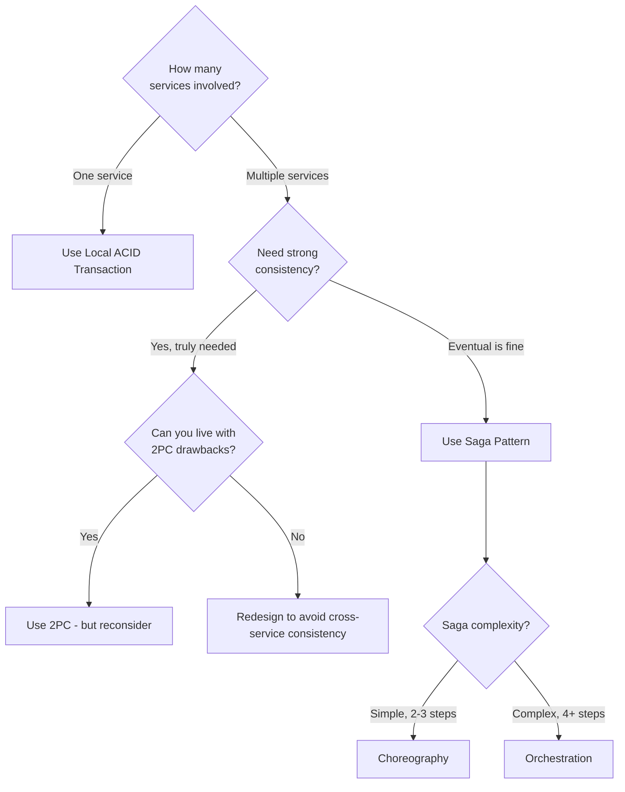

| Dimension | Local Transaction | Two-Phase Commit | Saga |
|---|---|---|---|
| **Consistency** | Strong (ACID) | Strong (ACID) | Eventual |
| **Scope** | Single DB | Multiple DBs (same protocol) | Multiple independent services |
| **Blocking** | No | Yes — holds locks | No |
| **Performance** | Excellent | Poor (2 RTTs + locks) | Good (async) |
| **Complexity** | Low | Medium-High | Medium-High (compensation) |
| **Failure handling** | DB rollback | Recovery protocol | Compensating transactions |
| **Cloud native** | Yes | No | Yes |
| **Use case** | Microservices: always prefer | Legacy tightly-coupled systems | Microservices standard choice |

---

## Part 11: Observability — The Thing Everyone Forgets

A saga without observability is like driving at night with no headlights. You'll crash and not know why.

### What You Must Monitor

| Metric | Why It Matters | Alert Threshold |
|---|---|---|
| Sagas in `STARTED` state > 5 mins | Saga is stuck at beginning | > 10 sagas |
| Sagas in any intermediate state > 30 mins | Step is hung or timed out | > 5 sagas |
| Compensation rate | Business health metric | > 5% of sagas |
| Saga completion time p99 | Performance indicator | > SLA |
| Failed sagas with no compensation | Data inconsistency risk | > 0 |

### Building a Saga Dashboard

Your orchestrator's database is a goldmine for observability:

```sql
-- Find all stuck sagas (in non-terminal state for > 10 minutes)
SELECT saga_id, order_id, state, created_at,
       NOW() - created_at AS age
FROM saga_instances
WHERE state NOT IN ('COMPLETED', 'SAGA_FAILED')
  AND created_at < NOW() - INTERVAL '10 minutes'
ORDER BY created_at ASC;

-- Compensation rate over the last hour
SELECT
  COUNT(*) FILTER (WHERE state = 'COMPLETED') AS successes,
  COUNT(*) FILTER (WHERE state = 'SAGA_FAILED') AS failures,
  ROUND(
    100.0 * COUNT(*) FILTER (WHERE state = 'SAGA_FAILED')
    / NULLIF(COUNT(*), 0),
    2
  ) AS failure_rate_pct
FROM saga_instances
WHERE created_at > NOW() - INTERVAL '1 hour';
```

---

## Part 12: Common Pitfalls and How to Avoid Them

| Pitfall | What Goes Wrong | How to Fix |
|---|---|---|
| **Non-idempotent steps** | Retry charges customer twice | Add idempotency key check before every action |
| **Missing compensation for a step** | Saga fails but data is partially inconsistent | Design compensation for EVERY step upfront |
| **No timeout on saga steps** | One slow service hangs the entire saga | Add step-level timeouts; treat timeout as failure |
| **Lost events (choreography)** | Event published but consumer was down | Use durable Kafka topics; implement dead letter queue |
| **Out-of-order events** | Compensation arrives before forward step completes | Use saga state machine; reject invalid state transitions |
| **No saga state persistence** | Orchestrator crashes, saga starts from scratch on restart | Always persist state BEFORE executing a step |
| **God orchestrator** | All business logic in one orchestrator service | Keep orchestrators thin; one orchestrator per bounded context |
| **Compensation not idempotent** | Retry of compensation refunds twice | Same idempotency pattern for forward AND compensation steps |
| **No observability** | Saga gets stuck, no alert | Build saga dashboard; alert on age of non-terminal sagas |
| **Cyclic events (choreography)** | A → B → A → B → infinite loop | Carefully map your event graph; test for cycles |

---

## Common Interview Questions

**Q1: What is the Saga pattern and why is it needed?**

A: The Saga pattern is a way to maintain data consistency across multiple microservices without using distributed transactions. It needed because: (1) each microservice owns its own database, (2) you can't use ACID transactions across databases, and (3) 2PC is blocking and fragile at scale. A saga breaks a cross-service operation into a sequence of local transactions, each publishing an event for the next step, with compensating transactions to undo completed steps if any step fails.

---

**Q2: What is the difference between Choreography and Orchestration sagas?**

A: In choreography, services react to each other's events directly — no central coordinator, decentralized. In orchestration, a central Saga Orchestrator sends commands to each service and tracks the overall state. Choreography is looser coupling but harder to trace. Orchestration is easier to monitor and debug but introduces a central component that can become a bottleneck.

---

**Q3: What are compensating transactions? How are they different from database rollbacks?**

A: A database rollback erases all evidence of an operation — as if it never happened. A compensating transaction is a new business action that counteracts a previous action. The original action happened and is recorded. The compensation is also recorded. Example: charging a credit card cannot be "rolled back" — you issue a refund (a separate transaction). Both the charge and refund appear in the ledger.

---

**Q4: Why must saga steps be idempotent?**

A: Because in distributed systems, messages can be delivered more than once (at-least-once delivery in Kafka), services can crash after processing but before acknowledging, and orchestrators can retry timed-out steps. Without idempotency, retries cause duplicate charges, duplicate reservations, etc. Implementation: check if you've already processed this operation (via idempotency key) before acting.

---

**Q5: How does a saga handle the case where the orchestrator itself crashes?**

A: The orchestrator persists the saga state to its own database BEFORE executing each step. On restart, it reads the current state and continues from there. Each step is idempotent, so re-executing a step that was already completed is safe. This is exactly how Temporal.io works — it replays the workflow from the last persisted checkpoint.

---

**Q6: What is a "pivotal transaction" in a saga?**

A: A pivotal transaction is a point of no return — after it commits, compensation is not attempted. Instead, the saga must proceed forward and handle consequences as new business processes. Example: once a taxi driver accepts your Uber request, you can't "un-accept" them — you send a cancellation (which is itself a business process with its own fee). Design your saga to identify the pivotal point explicitly.

---

**Q7: When would you choose choreography over orchestration?**

A: Choose choreography when: (1) the saga has 2-3 simple steps, (2) your teams are highly autonomous and don't want a central dependency, (3) you already have strong event-driven architecture, (4) operational simplicity matters more than traceability. Choose orchestration when: (1) the saga has 4+ steps, (2) you need clear visibility into saga state, (3) compensation order is complex, (4) you have timeouts and retry requirements.

---

**Q8: How does the Saga pattern relate to eventual consistency?**

A: Sagas provide **eventual consistency**, not strong consistency. There is a window during saga execution where data is partially updated across services. For example, payment has been charged but inventory not yet reserved. The system is temporarily inconsistent. After the saga completes (either successfully or via compensation), consistency is restored. Your system design and UX must account for this window — e.g., show "order pending" status rather than "order confirmed" until the saga completes.

---

**Q9: Can you give a real-world example of a saga?**

A: Swiggy order placement: (1) Create order in Order Service → (2) Deduct from Payment Service → (3) Notify restaurant via Restaurant Service → (4) Assign delivery partner via Dispatch Service. If step 4 fails (no partners available), compensations run: notify restaurant to ignore the order, refund the customer, cancel the order record. This is a 4-step saga with 3 compensating transactions.

---

**Q10: What tools/frameworks exist for implementing sagas?**

A: (1) **Temporal.io** — write workflows as normal code, handles persistence/retries/recovery automatically. Used by Uber, Netflix. (2) **AWS Step Functions** — visual workflow service, native AWS integration. (3) **Axon Framework** — Java/Spring ecosystem, integrates with CQRS/Event Sourcing. (4) **Apache Kafka** — the event bus for choreography-based sagas. (5) **DIY** — implement your own state machine + persistent saga table (fine for simple sagas).

---

## Key Takeaways

1. **ACID doesn't cross service boundaries.** In microservices, each service owns its database. Traditional transactions cannot span multiple databases on different servers.

2. **Two-Phase Commit (2PC) is a trap.** It introduces blocking (locks held across phases), a single point of failure (the coordinator), and poor performance. Avoid it in microservice architectures.

3. **A Saga is a sequence of local transactions.** Each step updates one service's database and emits an event/message. If a step fails, compensating transactions undo the completed steps in reverse order.

4. **Compensation is NOT rollback.** Compensating transactions are new business actions that counteract previous actions. Both the original action and the compensation are permanent records. Design compensations explicitly for every step before you write code.

5. **Choreography** means services react to each other's events without a central coordinator. Loose coupling, good for simple flows, hard to trace and debug.

6. **Orchestration** means a central Saga Orchestrator directs every step. Clear state, easy to monitor and debug, compensation is explicit, but introduces a central component.

7. **Idempotency is non-negotiable.** Every saga step — both forward and compensating — must safely handle duplicate executions. Use idempotency keys and check-before-act patterns.

8. **Persist saga state before each step.** This enables crash recovery. The orchestrator saves its state to its own database before calling a service. On restart, it picks up from the last saved state.

9. **Eventual consistency is the trade-off.** Sagas give you a window of temporary inconsistency. Your system and UX must be designed to handle the "pending" state gracefully.

10. **Observability is critical.** Build a saga dashboard. Alert on sagas that are stuck in intermediate states. Know your compensation rate. A stuck saga with no visibility is a 3 AM production incident waiting to happen.

11. **Use frameworks.** Temporal.io, AWS Step Functions, or Axon Framework handle the hard parts — persistence, retries, timeouts, crash recovery. Don't build your own saga infrastructure unless you have very specific requirements.

12. **Every action needs a defined compensation upfront.** This is a design discipline. If you can't define the compensation for a step, you cannot safely include that step in a saga. Identify your pivotal transactions early.

---

> The Saga pattern does not make distributed transactions easy. It makes them **explicit**. And explicit is always better than implicit — especially when ₹350 of biryani money is involved.
