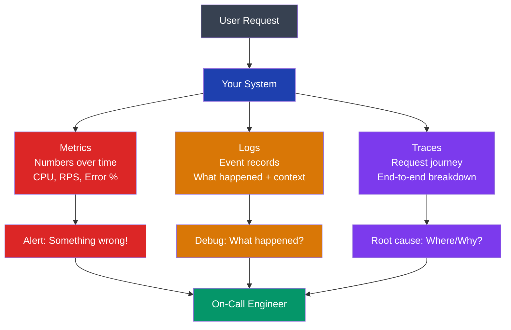
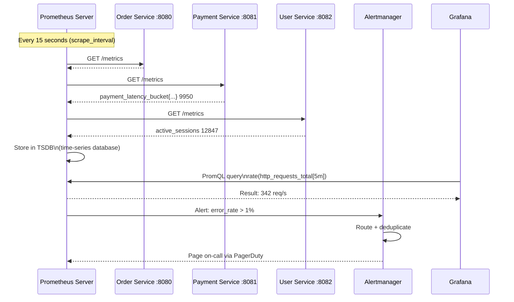
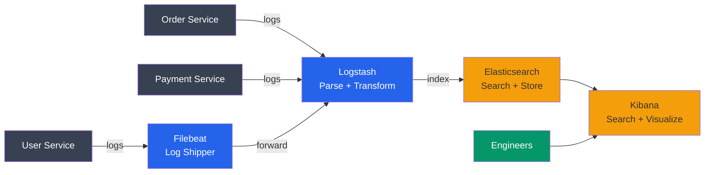
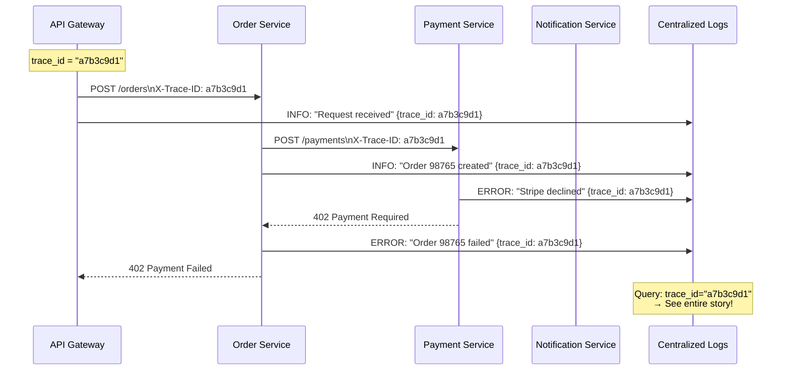
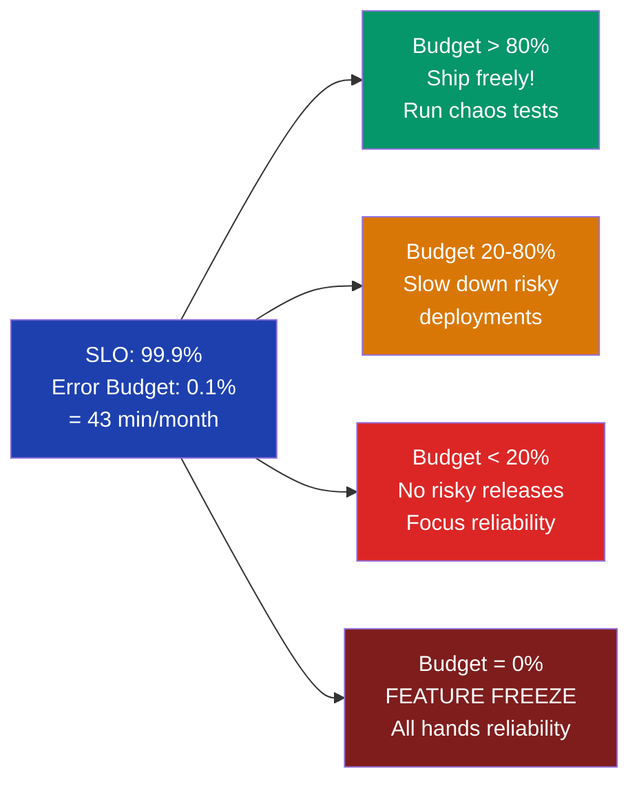
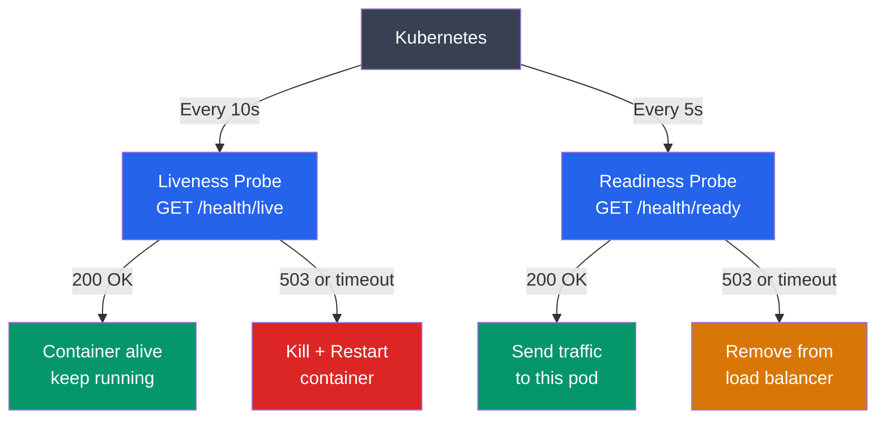
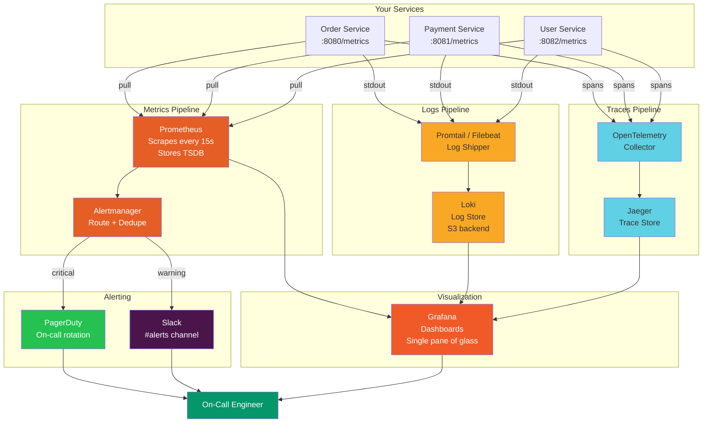

# Monitoring, Observability & Alerting

> "You can't fix what you can't see." — Every SRE, ever.

---

## Why Observability? (Ek Hospital ka Example)

Socho tumhare paas ek patient hai. Agar tumhare paas koi instrument nahi hai — no thermometer, no blood pressure monitor, no ECG — toh tum sirf yeh keh sakte ho: "patient theek nahi lag raha." Lekin kya hua, kyun hua, kahan hua — kuch nahi pata.

Ab socho same patient ke saath ICU mein: heart monitor beep kar raha hai, oxygen level dikhta hai, blood pressure chart update ho raha hai. Kuch bhi galat hone par alarm baj jaata hai. Doctor turant action le sakta hai.

Yahi hai observability. **Aapka production system woh patient hai.** Bina monitoring ke, jab user report karta hai "app slow hai", tum aankhon pe patti baandh ke production server mein ghuste ho. With monitoring, alert ata hai 3 AM par: "p99 latency > 2s on /checkout since 2:47 AM" — aur tumhare paas already sab data hai.

```
Bina monitoring ke:
───────────────────
User: "Bhai app bahut slow hai!"
Engineer: "Uh... SSH karta hoon server mein..."
[30 mins baad]
Engineer: "Kuch nahi mila yaar."

Monitoring ke saath:
─────────────────────
3:02 AM — Alert fires: p99 latency > 2s for POST /checkout
3:02 AM — Dashboard: DB connection pool at 98/100
3:03 AM — Logs: "Too many connections" errors since 2:47 AM
3:04 AM — Trace: DB query taking 8s — missing index on orders table
3:12 AM — Fix deployed, latency back to 120ms
```

**Real example:** Zomato ke order placement flow mein agar DB slow ho jaaye, toh thousands of orders fail ho sakte hain per minute. Unka on-call engineer sirf tab quickly fix kar sakta hai jab proper monitoring ho.

---

## The Three Pillars of Observability

Analogy: Socho tum detective ho aur ek crime scene investigate kar rahe ho.

- **Metrics** = Crime statistics ("Is area mein last month 47 robberies hue") — SOMETHING is wrong
- **Logs** = Witness statements ("Raat 2 baje ek aadmi kala coat pehne bahar nikla") — WHAT happened
- **Traces** = CCTV footage — end-to-end path showing exactly WHERE and WHEN

```
METRICS          LOGS                    TRACES
─────────────    ─────────────────────   ─────────────────────────────────
Numbers only     Timestamped events      Full request journey (end-to-end)
"Is there a      "What happened?"        "Where in the system did it fail?"
problem?"
CPU: 94%         ERROR: DB timeout       API → OrderSvc → DB [8.2s ← here!]
Error rate: 12%  at 2024-01-15 03:07     PaymentSvc → Stripe [320ms]

Tells you:       Tells you:              Tells you:
SOMETHING        WHAT                    WHERE + WHY
is wrong         went wrong              it went wrong
```



**Interview tip:** Interviewer puche "how do you debug production issues?" — Teen pillars bolna, with clear distinction of what each one tells you.

---

## Pillar 1: Metrics (Deep Dive)

### Metrics kya hote hain?

Analogy: Socho tumhari car ka dashboard — speedometer (gauge), trip meter (counter), fuel indicator. Yeh sab **quantitative measurements over time** hain. Tumhe pata chalta hai ki car ki speed kya hai, kitni petrol bachi hai — tumhe exact detail nahi chahiye ki konsa wheel kitna ghoom raha hai.

Metrics = numbers sampled at regular intervals, stored as time series.

---

### The 4 Golden Signals (Google SRE Book)

Google ka SRE book kehta hai: **minimum yeh 4 monitor karo, har service ke liye.**

```
1. LATENCY — How long do requests take?
   ├─ p50 (median): typical user ka experience
   ├─ p95: 1 in 20 users yeh experience karta hai
   ├─ p99: 1 in 100 users (often your biggest/most important users!)
   └─ NEVER use average — it hides tail latency!

   Example: [1ms, 1ms, 1ms, 1ms, 1ms, 1ms, 1ms, 1ms, 1ms, 400ms]
   Average = 41ms   (looks fine!)
   p99     = 400ms  (1 in 10 users stuck for 400ms — NOT fine!)

2. TRAFFIC — How much demand is the system handling?
   ├─ Requests per second (RPS) — for web services
   ├─ Queries per second (QPS) — for databases
   └─ Messages per second — for queues/Kafka

3. ERRORS — What fraction of requests are failing?
   ├─ HTTP 5xx error rate
   ├─ Application-level errors (business logic failures)
   └─ Silent failures (wrong data returned, no HTTP error)

4. SATURATION — How "full" is the system?
   ├─ CPU: alert at 80% (not 100% — by then it's too late)
   ├─ Memory: heap usage approaching limit
   ├─ Disk: fill rate + available space
   ├─ Connection pool: used/max connections
   └─ Queue depth: how backed up is the work queue?
```

**Real example — Netflix:** Netflix monitors latency on every API call. Their p99 latency SLO for the home page load is < 1 second. Agar p99 2 seconds cross kare, on-call engineer gets paged instantly.

---

### Metric Types

#### Counter

Analogy: Odometer in your car — sirf badhta hai, kabhi reset nahi hota (restart ke alawa).

```
Always increasing. Resets to 0 only on restart.

Examples:
  http_requests_total{method="GET", status="200"}  → 1,482,392
  errors_total{type="timeout"}                      → 47
  orders_placed_total{region="mumbai"}              → 8,412

Use for:
  ├─ Request counts
  ├─ Error counts
  └─ Bytes processed

Useful pattern — Rate calculation (per second over 5 min window):
  rate(http_requests_total[5m])  →  342 req/s

Why rate() and not raw value?
  Raw value at 10 AM: 1,000,000 requests
  Raw value at 10:05 AM: 1,100,000 requests
  → Rate = 100,000 / 300 seconds = 333 req/s  ← useful!
```

#### Gauge

Analogy: Fuel gauge in your car — goes up when you fill, goes down as you drive.

```
Can go up or down. Current value at a point in time.

Examples:
  active_connections           → 312
  memory_usage_bytes           → 2,147,483,648
  queue_depth{queue="orders"}  → 44
  active_users_current         → 12,847

Use for:
  ├─ Current resource utilization
  ├─ Queue lengths
  ├─ Active sessions
  └─ In-progress requests

No rate() needed — just read the current value.
```

#### Histogram

Analogy: Swiggy ke delivery times ka distribution — kitni deliveries 20 min mein huin, kitni 30 min mein, kitni 60 min mein. Isse pata chalta hai the SHAPE of your performance.

```
Samples observations and counts them in configurable buckets.

Example: http_request_duration_seconds for Order Service
  bucket{le="0.05"}  → 3,000   (requests completed in ≤ 50ms)
  bucket{le="0.1"}   → 8,420   (requests completed in ≤ 100ms)
  bucket{le="0.25"}  → 9,200   (requests completed in ≤ 250ms)
  bucket{le="0.5"}   → 9,812   (requests completed in ≤ 500ms)
  bucket{le="1.0"}   → 9,950   (requests completed in ≤ 1s)
  bucket{le="+Inf"}  → 10,000  (ALL requests)
  _sum               → 1,832.4 seconds total
  _count             → 10,000 requests total

Calculate p99 with PromQL:
  histogram_quantile(0.99, rate(http_request_duration_seconds_bucket[5m]))

Use for:
  ├─ Request latency distributions  ← MOST COMMON USE CASE
  ├─ Response sizes
  └─ Database query durations

KEY: Histograms are AGGREGATABLE — you can combine histograms
     from 10 pods to get the overall p99. Summaries cannot do this.
```

#### Summary

```
Similar to histogram but quantiles computed CLIENT-SIDE.

Example:
  rpc_duration_seconds{quantile="0.5"}   → 0.047s
  rpc_duration_seconds{quantile="0.9"}   → 0.213s
  rpc_duration_seconds{quantile="0.99"}  → 0.847s

Histogram vs Summary — comparison:

| Feature                   | Histogram          | Summary            |
|---------------------------|--------------------|--------------------|
| Aggregation across pods   | YES ✅             | NO ❌              |
| Any quantile post-facto   | YES ✅             | Must define upfront|
| Accuracy at extremes      | Less accurate      | More accurate      |
| Server resource usage     | Low                | Higher             |
| Recommended for           | Most cases ✅      | Very specific needs|

Verdict: Use Histogram almost always. Summary sirf tab jab tum ek specific
         quantile chahte ho aur aggregation ki zarurat nahi.
```

---

### Key Metrics Every System Should Track

```
LATENCY METRICS:
  http_request_duration_seconds (histogram)
  → p50, p95, p99 per endpoint, per service

  db_query_duration_seconds (histogram)
  → p99 per query type

ERROR METRICS:
  http_requests_total{status=~"5.."} (counter)
  → Error rate = errors / total requests

  application_errors_total{type="...", service="..."} (counter)
  → Business-level errors

THROUGHPUT METRICS:
  http_requests_total (counter)
  → rate() gives RPS

  kafka_messages_consumed_total (counter)
  → Processing throughput

SATURATION METRICS:
  process_cpu_seconds_total (counter)  → CPU usage %
  process_resident_memory_bytes (gauge) → Memory
  db_connection_pool_used (gauge) → Pool saturation
  kafka_consumer_lag (gauge) → How behind is consumer
  disk_usage_bytes (gauge) → Disk saturation
```

---

### RED Method (For Services)

Analogy: Jab tum kisi restaurant ka review karte ho, tum poochte ho — kitne customers aaye (Rate), kitni complaints thi (Errors), average waiting time kya tha (Duration). Yahi RED hai.

```
RED is per-SERVICE, per-ENDPOINT monitoring:

R — Rate     : Requests per second coming into this service
E — Errors   : Fraction of those requests that fail
D — Duration : How long those requests take (p50, p95, p99)

Example: Zomato Order Service RED Dashboard
  Rate:     342 req/s  (POST /orders endpoint)
  Errors:   0.12%      (error rate)
  Duration: p50=45ms, p95=180ms, p99=312ms

PromQL for RED:
  Rate:    rate(http_requests_total{service="order-service"}[1m])
  Errors:  rate(http_requests_total{service="order-service",status=~"5.."}[1m])
           / rate(http_requests_total{service="order-service"}[1m])
  Duration: histogram_quantile(0.99,
              rate(http_request_duration_seconds_bucket{service="order-service"}[5m]))

When to use RED:
  ✅ Monitoring microservices
  ✅ API gateway metrics
  ✅ Any service that handles requests
```

---

### USE Method (For Infrastructure/Resources)

Analogy: Jab tum apni car ki health check karte ho — fuel kitna use hua (Utilization), traffic mein kitna stuck raha (Saturation), koi error aayi kya (Errors). Yahi USE hai infrastructure ke liye.

```
USE is per-RESOURCE (CPU, memory, disk, network) monitoring:

U — Utilization  : What % of resource capacity is being used?
S — Saturation   : How much work is queued/waiting?
E — Errors       : Error events for this resource

Example: USE for a Database Server
  CPU:
    Utilization: 67% used
    Saturation:  CPU run-queue length: 2.3 (threads waiting for CPU)
    Errors:      0 CPU errors

  Memory:
    Utilization: 82% used (13.1 GB of 16 GB)
    Saturation:  Swap usage: 0 (good — no swapping)
    Errors:      0 OOM kills

  Disk:
    Utilization: I/O utilization: 45%
    Saturation:  I/O queue depth: 8 (high — I/O bottleneck!)
    Errors:      3 read errors in last hour (investigate!)

When to use USE:
  ✅ Infrastructure health monitoring
  ✅ Capacity planning
  ✅ Diagnosing resource bottlenecks

RED vs USE:
  RED = What is the SERVICE doing?
  USE = How are the RESOURCES holding up?
  Use BOTH together for full picture.
```

---

### Prometheus: Pull-Based Metrics Collection

Analogy: Instead of every service sending data to a central collector (push), Prometheus jaata hai aur khud data collect karta hai. Jaise ek reporter jo har department mein jaake news collect karta hai, instead of waiting for press releases.



```
Prometheus Architecture:
  ├─ Pull-based: Prometheus FETCHES metrics from services
  │   └─ Each service exposes GET /metrics endpoint
  ├─ Storage: Local time-series DB (TSDB)
  ├─ PromQL: Query language for metrics
  ├─ Alertmanager: Handles routing, deduplication, silencing
  └─ Exporters: For systems that can't expose /metrics natively
      ├─ node_exporter → OS-level metrics (CPU, disk, memory)
      ├─ postgres_exporter → PostgreSQL metrics
      └─ redis_exporter → Redis metrics

Prometheus config (prometheus.yml):
  scrape_configs:
    - job_name: 'order-service'
      scrape_interval: 15s
      static_configs:
        - targets: ['order-service:8080']  # /metrics auto-appended

    - job_name: 'payment-service'
      scrape_interval: 15s
      static_configs:
        - targets: ['payment-service:8081']

Push vs Pull debate:
  Pull (Prometheus) advantages:
    ✅ Easy to see which services are DOWN (failed scrapes)
    ✅ Central config — no service-side config needed
    ✅ Easier debugging (curl /metrics manually)

  Push advantages:
    ✅ Better for short-lived jobs (batch, cron)
    ✅ Works across network boundaries more easily
    → Prometheus Pushgateway solves this for Prometheus
```

---

### Grafana: Dashboards and Alerting

```
Grafana = The "face" of your observability stack.

What Grafana does:
  ├─ Connects to multiple data sources:
  │   ├─ Prometheus (metrics)
  │   ├─ Loki (logs)
  │   ├─ Jaeger (traces)
  │   ├─ Elasticsearch, InfluxDB, etc.
  │
  ├─ Builds dashboards with panels (graphs, tables, gauges, heatmaps)
  │
  └─ Alerting: visual rule builder on top of data sources

Sample Grafana Dashboard layout for a microservice:

┌────────────────────────────────────────────────────────────┐
│  Order Service — Last 1 Hour                [Refresh: 30s] │
├─────────────────┬─────────────────┬────────────────────────┤
│  Rate           │  Error Rate     │  Duration              │
│  342 req/s      │  0.12%          │  p50: 45ms             │
│  [line graph]   │  [line graph]   │  p95: 180ms            │
│                 │   ▲ spike 3AM   │  p99: 312ms            │
├─────────────────┴─────────────────┴────────────────────────┤
│  CPU: 34%  [bar]   Memory: 61% [bar]   DB Pool: 28/100     │
├──────────────────────────────────────────────────────────  ─┤
│  Top 5 slowest endpoints (p99)                             │
│  POST /checkout       → 892ms                              │
│  POST /orders         → 312ms                              │
│  GET  /product-detail → 145ms                              │
└─────────────────────────────────────────────────────────   ─┘
```

---

## Pillar 2: Logs (Deep Dive)

### Logs kya hote hain?

Analogy: Log matlab diary. Jab kuch bhi system mein hota hai — request aaya, error aaya, user login kiya — sab record hota hai timestamp ke saath. Metrics sirf numbers hain; logs mein context hota hai — "kya hua, kab hua, kis context mein hua."

**Metrics tell you THAT something went wrong. Logs tell you WHAT exactly went wrong.**

---

### Structured Logging (JSON Format)

```
Unstructured log (BAD — printf style):
────────────────────────────────────────
2024-01-15 10:23:41 ERROR Failed to process order 12345 for user alice@example.com

Problems:
  ❌ Hard to parse programmatically — regex required
  ❌ No consistent fields to query
  ❌ Can't easily filter by order_id="12345"
  ❌ Different services log differently — inconsistent

─────────────────────────────────────────────────────────────

Structured JSON log (GOOD — machine-readable):
──────────────────────────────────────────────
{
  "timestamp": "2024-01-15T10:23:41.123Z",
  "level": "error",
  "service": "order-service",
  "version": "2.4.1",
  "host": "pod-order-service-abc123",
  "trace_id": "abc123def456",
  "span_id": "789xyz",
  "message": "Failed to process order",
  "order_id": "12345",
  "user_id": "u_8847",
  "error": "payment_declined",
  "error_code": "INSUFFICIENT_FUNDS",
  "duration_ms": 342,
  "environment": "production"
}

Benefits:
  ✅ Query by ANY field: level=error AND service=order-service
  ✅ Aggregate: count errors by error_code
  ✅ Correlate: find all logs with trace_id=abc123def456
  ✅ Machine processing: no regex needed
  ✅ Dashboard charts from log data

Code example (Node.js with Winston):
  const logger = winston.createLogger({
    format: winston.format.json()
  });
  logger.error('Failed to process order', {
    order_id: '12345',
    user_id: 'u_8847',
    error: 'payment_declined',
    trace_id: req.headers['x-trace-id'],
    duration_ms: Date.now() - startTime
  });
```

---

### Log Levels: What Goes Where

```
TRACE  (most verbose)
  → Extremely detailed, developer-level debugging
  → "Entering function processPayment with args: {...}"
  → "Cache key computed: user:12345:cart"
  → NEVER enable in production (too much volume, performance hit)

DEBUG
  → Developer debugging information
  → "Cache miss for key user:123, querying database"
  → "Retry attempt 2/3 for payment API"
  → Enable TEMPORARILY in production when investigating issues

INFO   ← DEFAULT production level
  → Normal operational events that are useful to record
  → "Order 12345 placed successfully by user u_8847"
  → "Service started on port 3000"
  → "Kafka consumer connected to topic orders-v2"

WARN
  → Something unexpected, but request still completed
  → "Retry attempt 1/3 succeeded for Stripe API (took 520ms extra)"
  → "DB connection pool at 80% capacity (80/100)"
  → "Feature flag cache stale, using fallback values"

ERROR
  → An error occurred, this request/operation FAILED
  → "Order 12345 failed: Stripe returned CARD_DECLINED"
  → "DB query timeout after 5s: SELECT * FROM orders WHERE..."
  → Someone needs to know about this

FATAL  (least common)
  → Service is about to crash or is non-functional
  → "Cannot connect to database after 5 retries, shutting down"
  → "Out of memory, exiting"
  → Page someone NOW

Production default: INFO
Investigation mode: DEBUG (temporarily for specific service)
Never in prod: TRACE
```

| Level  | Volume    | Example                             | Who cares?       |
|--------|-----------|-------------------------------------|------------------|
| TRACE  | Enormous  | Function entry/exit                 | Developer only   |
| DEBUG  | High      | Cache miss, retry attempt           | Developer        |
| INFO   | Medium    | Order placed, user login            | Ops + Product    |
| WARN   | Low       | Slow query, high pool usage         | Ops team         |
| ERROR  | Very low  | Request failed, payment declined    | On-call engineer |
| FATAL  | Rare      | Cannot connect to DB                | Wake everyone up |

---

### Centralized Logging: ELK Stack vs Loki

#### ELK Stack



```
ELK Stack (Elasticsearch + Logstash + Kibana):

Elasticsearch:
  ├─ Distributed search and analytics engine
  ├─ Stores logs as JSON documents
  ├─ Full-text search + field-based queries
  └─ Scales horizontally for petabytes of logs

Logstash:
  ├─ Log ingestion pipeline
  ├─ Parse, transform, enrich logs
  └─ Route to Elasticsearch (or other outputs)

Kibana:
  ├─ UI for querying Elasticsearch
  ├─ "Discover" tab: full-text log search
  ├─ Dashboards: visualize log data
  └─ Alerting on log patterns

Filebeat / Fluentd / Fluentbit:
  → Lightweight log shippers that run as sidecars or DaemonSets
  → Ship logs from files/stdout to Logstash or Elasticsearch

ELK pros:
  ✅ Powerful full-text search
  ✅ Very mature, huge ecosystem
  ✅ Good for complex parsing

ELK cons:
  ❌ Expensive — Elasticsearch is resource-heavy
  ❌ Complex to operate and tune
  ❌ Can't easily correlate with metrics (separate system)
```

#### Loki + Grafana (Cheaper Alternative)

```
Loki (by Grafana Labs):
  ├─ "Prometheus for logs" — only indexes metadata (labels)
  ├─ Stores log content compressed in object storage (S3)
  ├─ Does NOT full-text index (much cheaper!)
  ├─ LogQL: query language similar to PromQL
  └─ Native Grafana integration — one UI for metrics + logs

Loki query example:
  {service="order-service", level="error"} |= "payment_declined"
  → Find all error logs from order-service containing "payment_declined"

  {service="order-service"} | json | duration_ms > 1000
  → Parse JSON, filter requests slower than 1 second

Loki pros:
  ✅ Very cheap — no full-text indexing
  ✅ Same UI as Prometheus (Grafana)
  ✅ Perfect for Kubernetes (label-based)
  ✅ Easy to correlate logs + metrics in one dashboard

Loki cons:
  ❌ No full-text search — must know what you're looking for
  ❌ Slower for ad-hoc exploration than Elasticsearch
```

| Feature              | ELK Stack             | Loki + Grafana        |
|----------------------|-----------------------|-----------------------|
| Full-text search     | YES (powerful)        | Substring match only  |
| Storage cost         | High                  | Low (S3 + compression)|
| Setup complexity     | High                  | Medium                |
| Metrics integration  | Separate setup        | Native (same Grafana) |
| Best for             | Log-heavy, search-heavy| Kubernetes, cost-aware|

---

### Log Correlation: Request ID Across Microservices

Analogy: Socho tum ek parcel deliver karte ho. Agar package par tracking number nahi hai, tum sirf yeh keh sakte ho "parcel Mumbai mein tha, Pune mein tha" — but in kaun se events ek hi parcel ke hain? Trace ID woh tracking number hai.

```
Problem: User complaint — "Order 98765 placed at 10:23 AM failed"
You need to find logs across: API Gateway → Order Service → Payment Service → Notification Service

Without correlation ID:
  Elasticsearch mein search "order 98765" → thousands of results, kaun sa?

With correlation ID (trace_id):

Step 1: API Gateway generates unique ID at edge:
  trace_id = UUID()  →  "a7b3c9d1-e5f2-4a8b-9c0d-1e2f3a4b5c6d"
  Add to request headers: X-Trace-ID: a7b3c9d1-...

Step 2: Order Service receives request:
  trace_id = request.headers['X-Trace-ID']
  logger.info("Order received", {trace_id, order_id: "98765"})
  // Call Payment Service — PASS the trace_id in headers!
  axios.post('/payments', data, { headers: {'X-Trace-ID': trace_id} })

Step 3: Payment Service:
  trace_id = request.headers['X-Trace-ID']
  logger.info("Processing payment", {trace_id, order_id: "98765"})
  logger.error("Stripe declined", {trace_id, error: "INSUFFICIENT_FUNDS"})

Step 4: Debug — query all systems with trace_id:
  Kibana: trace_id = "a7b3c9d1-..."
  → API Gateway log: "POST /orders 200 at 10:23:41.100"
  → Order Service log: "Order received 98765 at 10:23:41.200"
  → Payment Service log: "Processing payment at 10:23:41.350"
  → Payment Service error: "Stripe declined: INSUFFICIENT_FUNDS at 10:23:41.820"

  Full picture in seconds! Without this → hours of searching.
```



---

### Log Sampling: Don't Log Everything

```
Problem: WhatsApp sends 100 billion messages per day.
If every message logs at DEBUG level:
  100 billion × 5 log lines × 500 bytes = 250 TB of logs PER DAY
  → Unmanageable, expensive, noisy

Solution: Log Sampling

Head-based sampling (decision at start):
  → 100% of error requests: log everything
  → 1% of successful requests: log one in 100

Tail-based sampling (decision at end, after seeing outcome):
  → If request was slow (p99+) or errored: keep all logs
  → If request was fast and successful: discard 99%
  → Better: captures the interesting cases

Dynamic log levels:
  → Normally: INFO level only
  → During incident: temporarily raise to DEBUG for specific service
  → After incident: back to INFO

Production guideline:
  FATAL, ERROR  → Log 100% (never sample)
  WARN          → Log 100%
  INFO          → Log 100% (but be selective WHAT you log at INFO)
  DEBUG         → Log 0% in production (enable per-service during incidents)
  TRACE         → Never enable in production
```

---

## Pillar 3: Distributed Tracing (Deep Dive)

### Traces kya hote hain?

Analogy: Socho tum Mumbai se Pune road trip karte ho. Metrics batata hai "trip 4 ghante ka tha." Logs batata hai "Expressway pe jam tha." **Trace batata hai: Ghar se nikle 0:00, Highway mila 0:15, Toll 0:45, Jam 1:00–2:30, Pune pahunche 4:00." — exact breakdown, exactly where time was spent.

```
A TRACE is the complete journey of ONE request through ALL services.
A SPAN is one unit of work within that journey.

Each span captures:
  ├─ Operation name ("DB: SELECT orders", "HTTP: POST /payments")
  ├─ Start time + duration
  ├─ Service name
  ├─ Parent span ID (who called me)
  ├─ Tags/metadata (order_id, user_id, status)
  └─ Logs/events during this span

Example: POST /checkout — trace abc-123
─────────────────────────────────────────

Span 1: API Gateway                 [0ms ──────────────────── 892ms]
  Span 2: Order Service             [10ms ─────────────────── 882ms]
    Span 3: Validate cart           [10ms ── 25ms]
    Span 4: DB: Check inventory     [26ms ──── 45ms]
    Span 5: Call Payment Service    [46ms ──────────────────  862ms]  ← SLOW
      Span 6: Stripe API call       [50ms ────────────────── 855ms]  ← ROOT CAUSE
    Span 7: DB: Insert order        [863ms ──── 870ms]
    Span 8: Kafka: Publish event    [871ms ──── 878ms]

Analysis:
  Total request: 892ms
  Stripe API call: 805ms (90% of total time!)
  Root cause: Stripe latency spike
  Everything else: perfectly fast

  Without traces: you'd see "p99 latency is 900ms" — where though?
  With traces: "Stripe is causing 90% of our latency" — specific!
```

---

### Trace Context Propagation

```
W3C Trace Context Standard (industry standard):

Header: traceparent
Format: {version}-{trace-id}-{parent-span-id}-{flags}

Example:
  traceparent: 00-4bf92f3577b34da6a3ce929d0e0e4736-00f067aa0ba902b7-01
               │  │                                │                │
               │  trace-id (128-bit hex)           span-id (64-bit) flags
               version

Each service in the chain:
  1. Read traceparent from incoming request headers
  2. Create a NEW child span (new span-id, same trace-id)
  3. Record work being done (DB queries, API calls)
  4. Pass traceparent FORWARD to all downstream calls
  5. When done, send span data to tracing backend (Jaeger/Zipkin)

OpenTelemetry (the modern standard):
  → Vendor-neutral instrumentation library
  → One SDK, works with Jaeger, Zipkin, AWS X-Ray, Datadog, etc.
  → Replaces Jaeger SDK, Zipkin SDK, etc.
  → Highly recommended: instrument with OTel, swap backends freely
```

---

### Jaeger vs Zipkin vs AWS X-Ray

| Feature               | Jaeger             | Zipkin              | AWS X-Ray          |
|-----------------------|--------------------|---------------------|--------------------|
| Origin                | Uber → CNCF        | Twitter             | AWS                |
| Open source           | YES                | YES                 | Managed service    |
| UI quality            | Excellent          | Good                | Good               |
| Scalability           | Excellent (Kafka)  | Good                | Excellent (managed)|
| Kubernetes native     | YES (Helm charts)  | YES                 | EKS integration    |
| OTel support          | YES                | YES                 | YES                |
| Cost                  | Free (self-hosted) | Free (self-hosted)  | Pay per trace      |
| Best for              | Open source shops  | Simpler setups      | AWS-native systems |

```
Modern recommendation:
  Instrument your code with OpenTelemetry SDK (language-specific)
  → Python: opentelemetry-sdk
  → Java: opentelemetry-java
  → Node.js: @opentelemetry/sdk-node

  Send traces to Jaeger for open-source setups
  OR send to your cloud provider (AWS X-Ray, GCP Cloud Trace, Azure Monitor)

  Do NOT instrument with Jaeger SDK directly — it ties you to Jaeger.
```

---

## SLIs, SLOs, SLAs, and Error Budgets

### The Difference — Ek Simple Analogy

Socho tum ek pizza delivery company chalate ho:

- **SLI** = Actual measurement: "Is month 97.3% deliveries 30 min ke andar huin"
- **SLO** = Tumhara internal target: "99% deliveries 30 min mein karni hain"
- **SLA** = Customer ke saath contract: "95% deliveries 30 min mein, warna refund"
- **Error Budget** = Kitna "failure" afford kar sakte ho: 1% of deliveries can be late

```
SLI (Service Level Indicator):
  The actual measurement. A specific metric.

  Examples:
  ├─ "Fraction of requests with latency < 200ms"
  │   → Measured: 99.2% of requests in last 30 days
  ├─ "Fraction of requests returning non-5xx"
  │   → Measured: 99.97% success rate
  └─ "Availability: fraction of 1-minute windows with error rate < 1%"
      → Measured: 99.91% of windows were "available"

SLO (Service Level Objective):
  Your internal target for an SLI. Not shared externally.

  Examples:
  ├─ "99% of requests should have latency < 200ms"
  ├─ "99.9% of requests should succeed (non-5xx)"
  └─ "99.95% availability per month"

  SLO should be ASPIRATIONAL but ACHIEVABLE.
  Set SLO stricter than SLA (to have buffer).

SLA (Service Level Agreement):
  External contract with customers. CONSEQUENCES if violated.

  Examples:
  ├─ "99.9% uptime per month, or 10% service credit"
  ├─ "API p99 latency < 500ms, or we refund that month"
  └─ AWS S3: "99.99% availability, or billing credits"

  IMPORTANT:
  SLA should be LESS strict than SLO (you need buffer!)

  ┌──────────────────────────────────┐
  │  SLA ≤ SLO (internal is harder) │
  │                                  │
  │  SLA:  99.5%  (customer promise) │
  │  SLO:  99.9%  (internal target)  │
  │  SLI:  99.97% (actual measured)  │
  │                                  │
  │  Buffer = SLO - SLA = 0.4%      │
  │  If SLI drops to 99.6%:         │
  │    SLO violated? YES (99.9% miss)│
  │    SLA violated? NO (99.6 > 99.5)│
  │    → Time to fix before SLA hit! │
  └──────────────────────────────────┘
```

---

### Error Budgets: The Key to Balancing Speed and Reliability

Analogy: Socho tumhara monthly "fun budget" Rs. 5,000 hai. Agar pehle 20 din mein 4,500 kharach kar diye, toh baaki 10 din bahut carefully spend karo. SLO error budget same logic hai reliability ke liye.

```
Error Budget = 1 - SLO

SLO = 99.9%  →  Error budget = 0.1%

Monthly error budget in time:
  30 days × 24 hours × 60 minutes = 43,200 minutes
  0.1% of 43,200 = 43.2 minutes of allowed downtime per month

  If your service was down 20 minutes this month:
  Budget remaining = 23.2 minutes
  → Still room to ship risky features

  If your service was down 50 minutes this month:
  Budget EXCEEDED by 6.8 minutes
  → SLO violated. STOP new features. Fix reliability.

Error Budget as policy:
─────────────────────────
Budget > 50% remaining:
  ✅ Ship freely, experiment, run chaos tests
  ✅ Accept more technical risk for faster delivery

Budget 20-50% remaining:
  ⚠️  Slow down risky deploys
  ⚠️  Prioritize reliability improvements
  ⚠️  Review recent incidents

Budget < 20% remaining:
  🚫 No risky deployments
  🚫 Focus on reliability engineering
  🚫 Postmortems on all recent incidents

Budget exhausted (0%):
  🚨 FEATURE FREEZE
  🚨 All engineering bandwidth → reliability
  🚨 No new releases until budget replenishes next period

Why error budgets are brilliant:
  ✅ Makes "how much risk to take" OBJECTIVE, not a fight
  ✅ Product teams (want features) + Eng teams (want reliability) share one metric
  ✅ Incentivizes reliability work — it directly increases shipping speed
  ✅ Google uses this. Netflix uses this. Spotify uses this.
```



---

## Alerting Best Practices

### Alert on Symptoms, NOT Causes

Analogy: Ek doctor ko patient ka symptom dekh ke treat karna chahiye, cause ko nahi. "Patient ko 104 degree fever hai" (symptom) → treat karo. "Patient ke blood mein ek specific bacteria hai" (cause) — that's the root cause, but the SYMPTOM is what affects the patient.

**Alert on what USERS experience, not on internal metrics.**

```
BAD alerts (cause-based):
  ❌ "CPU > 80%" — CPU high hone se users affected nahi honge
      Maybe it's expected (batch job), maybe it's fine
  ❌ "DB connections > 90%" — maybe still serving fine
  ❌ "Memory > 70%" — maybe the system is designed to use high memory

GOOD alerts (symptom-based):
  ✅ "Error rate > 1% for 5 minutes" — users are failing!
  ✅ "p99 latency > 2 seconds" — users are experiencing slowness!
  ✅ "Success rate < 99.5% on /checkout" — revenue is impacted!

The Rule: Alert only when a human MUST take action.
  → If the alert fires and the on-call engineer can't do anything, don't alert
  → If the alert fires at 3 AM but can wait till morning, use low-severity or email

Example Prometheus alert rules:
  # GOOD: user-facing symptom
  alert: HighErrorRate
  expr: |
    rate(http_requests_total{status=~"5.."}[5m])
    / rate(http_requests_total[5m]) > 0.01
  for: 5m    ← must be sustained, not just a spike
  labels:
    severity: critical
  annotations:
    summary: "Error rate {{ $value | humanizePercentage }} on {{ $labels.service }}"
    runbook_url: "https://wiki.company.com/runbooks/high-error-rate"

  # OK: infrastructure metric used as CAPACITY ALERT (warning, not critical)
  alert: HighCPUSustained
  expr: rate(container_cpu_usage_seconds_total[10m]) > 0.85
  for: 15m   ← must be sustained for 15 min (not a spike)
  labels:
    severity: warning   ← not critical — doesn't require 3AM wake-up
```

---

### Alert Fatigue: The Worst Problem in On-Call

```
Alert fatigue = Too many alerts → engineers stop caring → incidents missed

The vicious cycle:
  Too many alerts fire
  → Engineers get paged constantly
  → Engineers start ignoring "noisy" alerts
  → Real incident fires
  → Engineer ignores it (assumed noise)
  → Major outage!

How alert fatigue happens:
  ├─ Low thresholds: "Alert if CPU > 70%" (fires constantly)
  ├─ No "for" duration: alert fires on any spike, even 1-second ones
  ├─ Too many info-level alerts going to pager
  └─ Alerts with no clear action (what do I DO when this fires?)

How to fight alert fatigue:
  ✅ Every alert MUST have a runbook (clear action steps)
  ✅ Every alert MUST be actionable right now
  ✅ "for: 5m" — alert must sustain, not just spike
  ✅ Separate: critical (wake-up) vs warning (Slack) vs info (email)
  ✅ Regular alert review: "Did this alert fire in the last month?"
      → If yes and it was false positive → raise threshold or delete
      → If never fired → is it still needed?
  ✅ Alert on SLO burn rate, not raw metrics
```

---

### SLO Burn Rate Alerting (Advanced)

```
Instead of alerting when error rate > 1% (instantaneous),
alert when your ERROR BUDGET is burning too fast.

Burn rate = how fast you're consuming error budget
  Normal burn rate = 1x (budget consumed evenly over month)
  Burn rate = 2x = at this rate, budget exhausted in 15 days
  Burn rate = 14.4x = budget exhausted in 2 days (CRITICAL!)

Multi-window, multi-burn-rate alerting (Google's recommendation):
  Critical (5-min + 1-hour window):
    → Burn rate > 14.4x (2% budget in 1 hour)
    → Page on-call immediately!

  Warning (30-min + 6-hour window):
    → Burn rate > 6x
    → Slack notification, investigate soon

  Ticket (6-hour + 3-day window):
    → Burn rate > 3x
    → Create ticket, fix this week

This approach:
  ✅ Fewer false positives (looks at longer windows)
  ✅ Catches both sharp spikes AND slow burns
  ✅ Directly tied to user impact (SLO)
```

---

### PagerDuty and OpsGenie: On-Call Management

```
PagerDuty / OpsGenie = On-call rotation management systems

What they do:
  ├─ Receive alerts from Prometheus Alertmanager / Grafana
  ├─ Route to correct on-call person (based on schedule)
  ├─ Escalate if not acknowledged within time limit
  ├─ Track incident history and MTTD/MTTR metrics
  └─ Manage on-call rotation schedules

On-call rotation example (PagerDuty):
  Week 1: Engineer A is primary, Engineer B is secondary
  Week 2: Engineer B is primary, Engineer C is secondary
  Week 3: Engineer C is primary, Engineer A is secondary

  If alert fires:
    1. Page Engineer A (primary)
    2. If no ack in 15 min → page Engineer B (secondary)
    3. If no ack in 30 min → page team lead
    4. If no ack in 1 hour → page VP Engineering

Alert routing (Alertmanager config):
  routes:
    - match:
        severity: critical
      receiver: pagerduty-critical
      continue: true

    - match:
        severity: warning
      receiver: slack-warnings

    - match:
        severity: info
      receiver: email-digest

  receivers:
    - name: pagerduty-critical
      pagerduty_configs:
        - service_key: "<your-PD-key>"
    - name: slack-warnings
      slack_configs:
        - channel: "#alerts-warning"
    - name: email-digest
      email_configs:
        - to: "team@company.com"
```

---

## Health Checks: /health Endpoint

Analogy: Jaise doctor patient ka pulse check karta hai — alive hai ya nahi, theek se kaam kar raha hai ya nahi. Health endpoint wahi karta hai tumhare service ke liye.

```
Health check endpoint: GET /health

Basic response:
  HTTP 200: {"status": "healthy"}
  HTTP 503: {"status": "unhealthy", "reason": "db_connection_failed"}

What to check in /health:
  ├─ Database connectivity: can you run a simple query?
  ├─ Cache connectivity: Redis ping/pong?
  ├─ External service: can you reach critical dependencies?
  └─ Disk space: not critically low

Example /health implementation (Node.js):
  app.get('/health', async (req, res) => {
    try {
      await db.query('SELECT 1');          // DB check
      await redis.ping();                  // Cache check
      res.json({ status: 'healthy' });
    } catch (err) {
      res.status(503).json({
        status: 'unhealthy',
        reason: err.message
      });
    }
  });
```

---

### Kubernetes: Liveness vs Readiness Probes

```
Kubernetes has TWO types of health checks:

LIVENESS PROBE: "Is the container alive? Or stuck/deadlocked?"
  → If fails: Kubernetes KILLS and RESTARTS the container
  → Check: basic process alive, no deadlock
  → Don't check dependencies (DB) here — if DB is down, don't restart!

  livenessProbe:
    httpGet:
      path: /health/live
      port: 8080
    initialDelaySeconds: 30    ← wait 30s for startup
    periodSeconds: 10          ← check every 10s
    failureThreshold: 3        ← restart after 3 failures

READINESS PROBE: "Is the container ready to serve traffic?"
  → If fails: Kubernetes REMOVES from load balancer (no traffic sent)
  → Container NOT killed, just taken out of rotation
  → Check: DB connected, cache connected, warm-up complete

  readinessProbe:
    httpGet:
      path: /health/ready
      port: 8080
    initialDelaySeconds: 10    ← wait for initial startup
    periodSeconds: 5           ← check every 5s
    failureThreshold: 2        ← remove from LB after 2 failures

STARTUP PROBE: "Has the container finished starting up?"
  → Prevents liveness from killing slow-starting containers
  → Use for services with long startup time (JVM apps, ML models)

  startupProbe:
    httpGet:
      path: /health/live
      port: 8080
    failureThreshold: 30       ← allow up to 5 min to start
    periodSeconds: 10

Summary:
  /health/live  → Am I running? (liveness)
  /health/ready → Am I ready to serve? (readiness)
  /health       → General health (for external monitoring)
```



---

## Google's SRE Model

### What is SRE (Site Reliability Engineering)?

Analogy: Traditional ops log ke baad sirf "system chalao." SRE socha Google ne — "Software engineers ko operations karne do, woh systems ko automate aur improve karenge, sirf manually run nahi karenge."

```
SRE Core Principles:
  1. ERROR BUDGETS: Balance features vs reliability (covered above)

  2. TOIL REDUCTION:
     Toil = manual, repetitive, automatable operational work
     "Manually restarting a service when it crashes = toil"
     "Writing an alert + auto-restart = eliminating toil"
     SRE rule: Cap toil at 50% of time. Rest goes to engineering.

  3. BLAMELESS POSTMORTEMS:
     After every significant incident:
     ├─ Focus on SYSTEMS and PROCESSES, not people
     ├─ "Why did the system allow this?" not "Why did Bob do this?"
     ├─ Psychological safety → people admit mistakes honestly
     └─ Better learning → actual root cause found

  4. AUTOMATION FIRST:
     If you do something manually more than twice, automate it.

  5. SLO-BASED ALERTING:
     Alert when SLO is at risk, not on arbitrary thresholds.

Real SRE metrics to track:
  MTTD — Mean Time To Detect (how fast did we know about the issue?)
  MTTR — Mean Time To Recover (how fast did we fix it?)
  MTTA — Mean Time To Acknowledge (how fast did on-call respond?)
  Incident frequency (how often do we have incidents?)
  Toil percentage (what % of eng time is manual work?)
```

---

### Blameless Postmortem Template

```
INCIDENT POSTMORTEM: ORDER SERVICE OUTAGE
==========================================
Date: 2024-01-15
Duration: 43 minutes (10:17 AM – 11:00 AM)
Severity: SEV-2
Author: [On-call engineer]

SUMMARY:
Order service became unavailable for 43 minutes due to DB connection
pool exhaustion caused by a missing index on a new query added in release v2.4.1.

IMPACT:
  Users affected: ~12,000
  Orders failed: ~800 (estimated $40,000 revenue impact)
  Error rate: 100% for POST /orders during incident

TIMELINE:
  10:17 AM — Prometheus alert fires: error rate > 1% on order-service
  10:19 AM — On-call engineer acknowledges
  10:22 AM — Incident channel created, status page updated
  10:28 AM — Root cause identified: DB connection pool at 100/100
  10:31 AM — Slow query found: SELECT without index on new "status" column
  10:45 AM — Hotfix deployed: added index + increased connection pool
  11:00 AM — Error rate back to 0%, incident resolved

ROOT CAUSE:
  v2.4.1 added a new query filtering by order.status without an index.
  Under load, this query took 8-12 seconds (normally <10ms with index).
  Connection pool filled with threads waiting for slow queries.
  New connections rejected → 100% error rate.

5 WHYS:
  Why did orders fail? → DB connection pool exhausted
  Why was pool exhausted? → Queries taking 8-12 seconds instead of <10ms
  Why were queries slow? → Missing index on new column
  Why was index missing? → PR review didn't check query plans
  Why didn't review catch it? → No automated slow query detection in CI/CD

ACTION ITEMS:
  [ ] Add query plan analysis to CI/CD pipeline [Owner: Team A, Due: 2024-01-22]
  [ ] Alert on p99 DB query duration > 500ms [Owner: Team B, Due: 2024-01-20]
  [ ] Auto-scaling for DB connection pool [Owner: Team C, Due: 2024-01-31]
  [ ] Load test new DB queries in staging [Owner: Team A, Due: 2024-01-22]

WHAT WENT WELL:
  - Alert fired within 2 minutes of issue start (good MTTD)
  - On-call acknowledged quickly
  - Root cause found in under 15 minutes (good tooling)

WHAT WENT POORLY:
  - No automated check for missing indexes
  - Staging load was too low to catch this

LESSONS LEARNED:
  Every new DB query should be reviewed with EXPLAIN ANALYZE.
  Query plan review should be part of our code review checklist.
```

---

## The Complete Observability Stack

### Architecture Overview



### Tool Comparison: Self-Hosted vs Managed

| Component | Self-Hosted (Open Source) | Managed/Cloud |
|-----------|--------------------------|---------------|
| Metrics   | Prometheus               | Datadog, New Relic, AWS CloudWatch |
| Logs      | ELK Stack or Loki        | Splunk, Datadog Logs, GCP Cloud Logging |
| Traces    | Jaeger / Zipkin          | Datadog APM, AWS X-Ray, Honeycomb |
| Dashboards| Grafana                  | Datadog, New Relic |
| Alerting  | Alertmanager             | PagerDuty, OpsGenie |
| Cost      | Infrastructure only      | Expensive, can be $100K+/month at scale |
| Ops burden| HIGH (you manage it)     | LOW (vendor manages) |

**Small team / startup:** Use Datadog or New Relic (expensive but no ops burden)
**Large company:** Self-hosted Prometheus + Grafana + Loki + Jaeger (big savings)

---

## PromQL Examples (Essential Queries)

```promql
# ─── RATE & THROUGHPUT ───────────────────────────────────────────

# Requests per second (5-min window)
rate(http_requests_total[5m])

# Requests per second, by service
sum by (service) (rate(http_requests_total[5m]))

# ─── ERROR RATES ─────────────────────────────────────────────────

# Overall error rate (fraction, 0.0 to 1.0)
rate(http_requests_total{status=~"5.."}[5m])
/ rate(http_requests_total[5m])

# Error rate as percentage
100 * (
  rate(http_requests_total{status=~"5.."}[5m])
  / rate(http_requests_total[5m])
)

# ─── LATENCY PERCENTILES ─────────────────────────────────────────

# p50 (median) latency
histogram_quantile(0.50,
  rate(http_request_duration_seconds_bucket[5m])
)

# p99 latency in milliseconds
histogram_quantile(0.99,
  rate(http_request_duration_seconds_bucket[5m])
) * 1000

# p99 latency per service
histogram_quantile(0.99,
  sum by (service, le) (
    rate(http_request_duration_seconds_bucket[5m])
  )
)

# ─── SATURATION ──────────────────────────────────────────────────

# CPU usage per pod (% of requested CPU)
rate(container_cpu_usage_seconds_total[5m]) * 100

# Memory usage in MB
container_memory_working_set_bytes / 1024 / 1024

# DB connection pool utilization
db_connection_pool_used / db_connection_pool_max * 100

# ─── ALERT RULES ─────────────────────────────────────────────────

# Alert: high error rate
alert: HighErrorRate
expr: |
  rate(http_requests_total{status=~"5.."}[5m])
  / rate(http_requests_total[5m]) > 0.01
for: 5m
labels:
  severity: critical
annotations:
  summary: "High error rate: {{ $value | humanizePercentage }} on {{ $labels.service }}"
  runbook_url: "https://wiki.company.com/runbooks/high-error-rate"

# Alert: high p99 latency
alert: HighLatency
expr: |
  histogram_quantile(0.99,
    rate(http_request_duration_seconds_bucket[5m])
  ) > 2.0
for: 10m
labels:
  severity: critical
annotations:
  summary: "p99 latency {{ $value | humanizeDuration }} on {{ $labels.service }}"

# Alert: DB connection pool nearly exhausted
alert: DBPoolNearlyFull
expr: db_connection_pool_used / db_connection_pool_max > 0.85
for: 2m
labels:
  severity: warning
annotations:
  summary: "DB pool {{ $value | humanizePercentage }} full on {{ $labels.instance }}"
```

---

## Incident Response Process

```
Severity Levels:
─────────────────
SEV-1: Complete outage — all users affected, core service down
  Response: Immediate page, war room, all hands
  Resolution target: 1 hour
  Example: "Swiggy app down for all users in India"

SEV-2: Partial outage or severe degradation (>10% of requests failing)
  Response: Page on-call engineer, start investigation
  Resolution target: 4 hours
  Example: "Checkout failing for 30% of users"

SEV-3: Minor degradation, workaround available
  Response: Slack notification, fix next business day
  Resolution target: 3 days
  Example: "Invoice emails delayed by 2 hours"

SEV-4: Cosmetic issue, low user impact
  Response: Create ticket
  Resolution target: Next sprint

Incident Response Steps:
  00:00  Alert fires (Prometheus/Grafana/PagerDuty)
  00:05  On-call acknowledges, starts investigation
  00:10  Incident channel created in Slack (#incident-YYYY-MM-DD)
  00:10  Status page updated: "Investigating issues with order placement"
  00:12  Severity declared (SEV-1/SEV-2/SEV-3)
  00:15  Incident commander takes control
  00:20  Root cause found (using metrics → logs → traces)
  00:25  Remediation started
  00:35  System returning to normal
  00:40  Incident resolved, status page updated
  00:45  Post-mortem scheduled (within 3 business days)
  Next week: Post-mortem conducted, action items assigned
```

---

## Real-World Examples: How Companies Do It

### Swiggy / Zomato (Food Delivery)

```
Key SLIs:
  - Order placement success rate (target: 99.5%)
  - Time to confirm order (p99 < 3 seconds)
  - Restaurant availability check latency (p99 < 500ms)
  - Delivery tracking update frequency

Error budget thinking:
  If SLO = 99.5% order success rate:
  Error budget = 0.5% of orders can fail per month
  At 500,000 orders/day = 15M orders/month
  0.5% = 75,000 failed orders allowed

  When a deploy causes 2% failure rate:
  → Burning budget 4x faster than allowed
  → Rollback immediately!
```

### Instagram / WhatsApp (Meta)

```
Key metrics:
  - Photo upload success rate (p99 < 2 seconds)
  - Message delivery rate (must be 99.99%)
  - Story view CDN hit rate (target > 98%)
  - Push notification delivery latency

Instagram's observability:
  - Custom internal metrics system (IRIS)
  - Traces for every photo upload path
  - Separate SLOs per feature (stories, reels, DMs)
  - Error budgets per team, per quarter
```

### Netflix

```
Key SLIs:
  - Stream start success rate
  - Rebuffer rate (video stopping to buffer)
  - Time to first frame (p99 < 3 seconds)
  - Playback failure rate per device type

Netflix's approach:
  - Chaos Engineering (Chaos Monkey) actively runs in production
  - Error budgets let them know how much chaos they can afford
  - Regional SLOs — different targets for different countries
  - Canary deployments with automatic rollback based on error rate
```

---

## Dashboard Design Best Practices

```
Every service dashboard should have these panels:

Row 1 — HEADLINE (RED Method):
  ┌─────────────┬─────────────┬──────────────┐
  │ Rate        │ Error Rate  │ Latency      │
  │ 342 req/s   │ 0.12%       │ p50: 45ms    │
  │ [timeseries]│ [timeseries]│ p99: 312ms   │
  └─────────────┴─────────────┴──────────────┘

Row 2 — SATURATION (USE Method):
  ┌─────────────┬─────────────┬──────────────┐
  │ CPU %       │ Memory %    │ DB Pool %    │
  │ 34%         │ 61%         │ 28/100 (28%) │
  │ [gauge]     │ [gauge]     │ [gauge]      │
  └─────────────┴─────────────┴──────────────┘

Row 3 — BREAKDOWN:
  ┌─────────────────────────────────────────┐
  │ Error rate by endpoint (table)          │
  │ POST /checkout → 0.8%                  │
  │ POST /orders   → 0.05%                 │
  └─────────────────────────────────────────┘

Row 4 — DOWNSTREAM:
  ┌─────────────┬─────────────┐
  │ DB latency  │ Redis hit % │
  │ p99: 12ms   │ 94.2%       │
  │ [timeseries]│ [timeseries]│
  └─────────────┴─────────────┘

Dashboard guidelines:
  ✅ Add links to runbooks in panel descriptions
  ✅ Add threshold lines (red at SLO violation point)
  ✅ Use consistent time ranges (last 1h / 6h / 24h)
  ✅ Share dashboard URLs in incident channels
  ✅ Mobile-friendly (on-call checks phone at 3 AM)
```

---

## Common Interview Questions

**Q1: What is the difference between metrics, logs, and traces?**
> Metrics = numbers over time (is something wrong?). Logs = timestamped event records (what happened?). Traces = request journey through distributed systems (where did it fail?). All three together give full observability.

**Q2: Why is p99 latency more important than average latency?**
> Average hides tail latency. [1ms, 1ms, 1ms, 400ms] → avg = 100ms but p99 = 400ms. Your worst customers (often the most important/biggest) experience p99. Average latency makes your system look healthy when p99 users are suffering.

**Q3: Explain SLI, SLO, and SLA with an example.**
> SLI = the actual measurement ("99.2% requests succeeded this month"). SLO = internal target ("99.9% success rate"). SLA = customer contract with consequences ("99.5% uptime or credits"). SLO > SLA to maintain buffer. If SLI drops below SLO but above SLA, you can fix quietly; below SLA means customer compensation.

**Q4: What is an error budget and how do you use it?**
> Error budget = 1 - SLO. With 99.9% SLO, error budget = 0.1% = ~43 minutes/month. When budget is full, ship features freely. When budget is low, reduce risky deployments. When budget is 0%, freeze features and focus on reliability. Aligns product and engineering teams on shared risk tolerance.

**Q5: What is the RED method?**
> Rate, Errors, Duration — the three key metrics for every service. Rate = requests/sec, Errors = error fraction, Duration = p50/p95/p99 latency. Every microservice dashboard should show these three.

**Q6: What is the difference between the RED and USE methods?**
> RED (Rate, Errors, Duration) is for SERVICES — monitoring what a service is doing. USE (Utilization, Saturation, Errors) is for RESOURCES/INFRASTRUCTURE — monitoring how resources (CPU, memory, disk, network) are holding up.

**Q7: How does distributed tracing work?**
> Each request generates a unique trace ID at the entry point (API gateway). Every service reads the trace ID from request headers, creates a child span, does its work, and passes the trace ID downstream. Span data is sent to a tracing backend (Jaeger). The resulting "trace" shows the full request journey with timing for each service hop.

**Q8: What is alert fatigue and how do you prevent it?**
> Alert fatigue = so many alerts that engineers start ignoring them. Causes: too many alerts, low thresholds, no "for" duration (alerts on 1-second spikes). Prevention: alert on symptoms not causes, every alert must be actionable, separate critical (pager) from warning (Slack), include runbook links, regularly prune unused alerts.

**Q9: What is the difference between liveness and readiness probes in Kubernetes?**
> Liveness probe = is the container alive? Failure → restart container. Readiness probe = is the container ready to serve traffic? Failure → remove from load balancer but keep running. Use liveness for deadlock detection, readiness for dependency checks (DB connected, warm-up complete).

**Q10: How do you design monitoring for a new system?**
> Start with 4 Golden Signals (Latency, Traffic, Errors, Saturation) for every service. Add RED method dashboards per service. Add USE method for infrastructure. Define SLIs (what to measure), SLOs (what to target), and calculate error budgets. Set up structured JSON logging with trace IDs. Add distributed tracing for multi-service flows. Write runbooks for every alert before the system goes to production.

**Q11: Prometheus is pull-based vs Datadog is push-based. When do you prefer each?**
> Pull (Prometheus): easier to see which services are down, central config, good for stable services in known network topology. Push: better for short-lived jobs (batch, lambdas), works across network boundaries. Prometheus Pushgateway adds push support for batch jobs.

**Q12: Design the monitoring stack for an e-commerce checkout service.**
> Metrics: Prometheus scraping checkout service → Grafana dashboard with RED + saturation panels. SLIs: checkout success rate, latency p99. SLO: 99.5% success, p99 < 2s. Alerts: error rate > 0.5% → critical, p99 > 2s → critical. Logs: structured JSON with trace_id, order_id, user_id, to Loki. Traces: OpenTelemetry → Jaeger, trace from API through payment service. Health checks: /health/live + /health/ready in Kubernetes.

---

## Key Takeaways

```
┌─────────────────────────────────────────────────────────────────┐
│                    KEY TAKEAWAYS                                 │
│                                                                  │
│  THREE PILLARS:                                                  │
│  Metrics = SOMETHING is wrong (numbers over time)               │
│  Logs = WHAT happened (timestamped event records)               │
│  Traces = WHERE it went wrong (request journey)                  │
│                                                                  │
│  METRIC TYPES:                                                   │
│  Counter (only up), Gauge (current), Histogram (distribution)   │
│  Use Histogram for latency — it's aggregatable across pods       │
│                                                                  │
│  MONITORING METHODS:                                             │
│  RED (Rate, Errors, Duration) → for services                    │
│  USE (Utilization, Saturation, Errors) → for resources          │
│  4 Golden Signals → Latency, Traffic, Errors, Saturation        │
│                                                                  │
│  SLI / SLO / SLA:                                               │
│  SLI = actual measurement, SLO = internal target                │
│  SLA = customer contract. SLO must be stricter than SLA.        │
│  Error budget = 1 - SLO → guides feature vs reliability trade   │
│                                                                  │
│  LOGGING:                                                        │
│  Always structured JSON. Always include trace_id.               │
│  Default to INFO in production. DEBUG only temporarily.         │
│  Centralize with ELK or Loki.                                   │
│                                                                  │
│  ALERTING:                                                       │
│  Alert on SYMPTOMS (error rate) not CAUSES (CPU > 80%)          │
│  Every alert = actionable + runbook. Fight alert fatigue.       │
│  Critical → PagerDuty, Warning → Slack, Info → email.          │
│                                                                  │
│  STACK:                                                          │
│  Prometheus (metrics) + Grafana (dashboards)                    │
│  + Loki (logs) + Jaeger (traces) = full open-source stack       │
│                                                                  │
│  GOOGLE SRE:                                                     │
│  Error budgets, toil reduction, blameless postmortems.          │
│  MTTD/MTTR are the key operational metrics to improve.          │
│                                                                  │
│  REMEMBER: Instrument everything from day one.                  │
│  Adding monitoring to an existing system is 10x harder.         │
└─────────────────────────────────────────────────────────────────┘
```

---

## Related Topics

- [Distributed Systems](../01-distributed-systems/README.md) — CAP theorem, consistency models
- [Distributed Tracing (Chapter 23)](../23-distributed-tracing/README.md) — Deep dive on Jaeger, Zipkin, sampling strategies
- [Load Balancers](../05-load-balancers/README.md) — Health checks at the infrastructure layer
- [Kubernetes](../40-kubernetes/README.md) — Liveness/readiness probes, pod autoscaling based on metrics
- [Microservices](../15-microservices/README.md) — Why distributed tracing becomes essential at microservice scale
