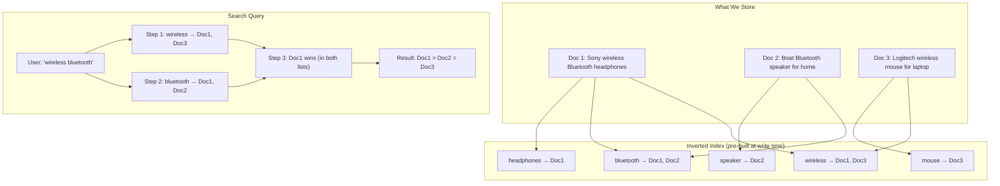
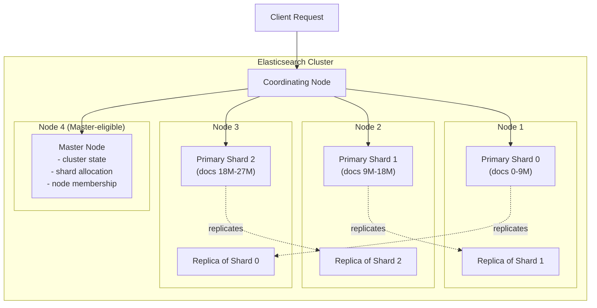
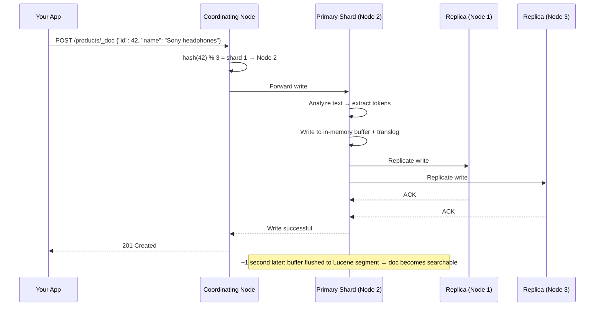
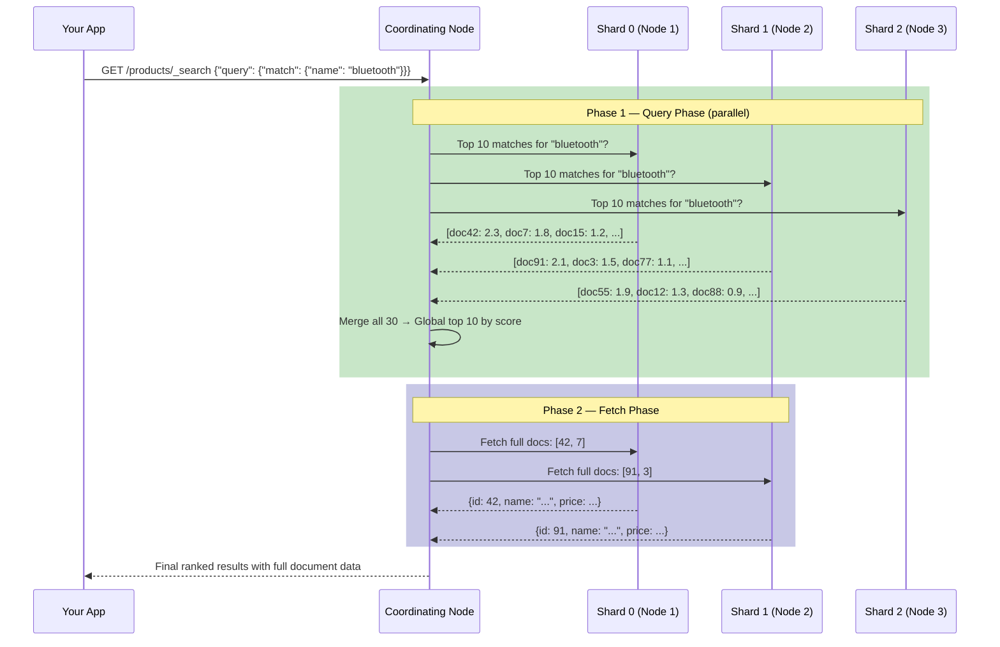
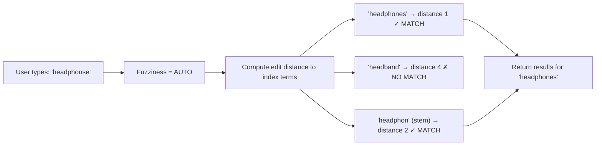
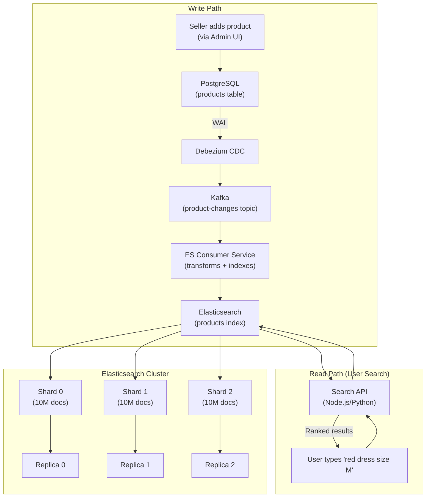

# Search Systems — Elasticsearch, Inverted Index, and the Art of Finding Things Fast

> "Google does not scan the entire internet every time you type a word. It did the hard work months ago and stored the answer. When you search, it just looks it up."

---

## Why Does Search Even Need a Separate System?

Samjho aise — imagine you wrote a 1,000-page book and someone asks, "On which pages is the word 'photosynthesis' mentioned?" You have two options:

1. Read the entire book, page by page, searching for the word.
2. Flip to the index at the back, find "photosynthesis", and read: "pages 42, 87, 103, 210."

Option 1 is what a SQL `LIKE` query does. Option 2 is what a search engine does.

The whole point of a search system is: **do the expensive scanning work once at write time, so reads are instant.** This is the fundamental trade-off — you spend more time and storage when data comes IN, so that queries going OUT are blazing fast.

---

## Why Regular Databases Fail for Search

Let's say you are building Zomato. You have 2 million restaurants in your database. A user types "north indian food near me, vegetarian". Here is what happens if you use a SQL query:

```sql
SELECT * FROM restaurants
WHERE description LIKE '%north indian%'
  AND description LIKE '%vegetarian%';
```

This query will:

1. **Scan every single row** — all 2 million restaurants, one by one, checking if the description contains those words. No shortcut. No index helps here because `LIKE '%keyword%'` with a leading `%` cannot use a B-tree index.
2. **Return no ranking** — if 50,000 restaurants match, which one comes first? SQL has absolutely no idea. Results come back in random (or insertion) order.
3. **Miss obvious matches** — a restaurant described as "North Indian cuisine" (capital N), "Punjabi food" (a synonym), or "Veg thali" will NOT match because SQL does exact string matching.
4. **Be painfully slow** — full table scan on 2 million rows takes 5-10 seconds. Users will leave.
5. **Have no typo tolerance** — user typed "vegetarean" by mistake? Zero results.

This is yeh kyun important hai — these are not edge cases. They are the everyday reality of any real search feature.

| Problem | SQL LIKE | Elasticsearch |
|---|---|---|
| Speed on millions of rows | Full table scan — seconds | Pre-built index — milliseconds |
| Relevance ranking | None — random order | BM25 score — best results first |
| Language awareness | Exact string match only | Tokenization, stemming, synonyms |
| Typo tolerance | None | Fuzzy matching (edit distance) |
| Partial word matching | Only with leading wildcard (slow) | Analyzers handle natively |
| Aggregations / facets | Possible but very slow | Built-in, extremely fast |
| Multi-language support | None | Language-specific analyzers |
| Autocomplete | Not possible efficiently | Built-in completion suggester |

The core issue: **SQL was designed for structured data lookups. Elasticsearch was designed for text relevance search.** They solve different problems. Use the right tool.

**Real numbers**: Elastic has published benchmarks showing that Elasticsearch can return search results over 1 billion documents in under 100ms. Doing a `LIKE` query over even 10 million rows in PostgreSQL typically takes 5-30 seconds.

---

## The Inverted Index — The Core Data Structure of All Search

This is the concept that everything else builds on. Understand this deeply.

**The textbook analogy**: You have a 1,000-page textbook. At the back is an index. Instead of organizing content by page number, it organizes by word — and for each word, lists the pages where it appears. When you want to find "photosynthesis", you don't read 1,000 pages. You look up the word, get the page list, and go directly there.

An **inverted index** works exactly like this, but for documents instead of pages, and words instead of page numbers.

### Forward Index vs Inverted Index

| Type | Structure | Good for |
|---|---|---|
| Forward Index | Document → List of words it contains | "What words are in document 5?" |
| Inverted Index | Word → List of documents that contain it | "Which documents contain 'bluetooth'?" |

Search needs the inverted index. SQL databases use forward index internally (B-tree on row data), which is why they cannot answer "which rows contain this word" efficiently.

### Visual Example

You have three product listings on Amazon India:

```
Doc 1: "Sony wireless Bluetooth headphones"
Doc 2: "Boat Bluetooth speaker for home"
Doc 3: "Logitech wireless mouse for laptop"
```

The inverted index (simplified) looks like:

```
"sony"        → [Doc1]
"wireless"    → [Doc1, Doc3]
"bluetooth"   → [Doc1, Doc2]
"headphones"  → [Doc1]
"boat"        → [Doc2]
"speaker"     → [Doc2]
"home"        → [Doc2]
"logitech"    → [Doc3]
"mouse"       → [Doc3]
"laptop"      → [Doc3]
```

Now when a user searches "wireless bluetooth":

1. Look up "wireless" → `[Doc1, Doc3]`
2. Look up "bluetooth" → `[Doc1, Doc2]`
3. Doc1 appears in both lists → strongest match
4. Doc2 and Doc3 each appear in one list → weaker matches
5. Sort by score → `[Doc1, Doc2 or Doc3]`

This lookup is a **dictionary key lookup** — O(1) time. No scanning. That is why it is fast.



**Interview tip**: When asked "how does a search engine work?", start with the inverted index. It is the foundation. Everything else (scoring, sharding, analyzers) builds on top of this.

---

## The Analysis Pipeline — Turning Raw Text into Searchable Tokens

Here is the problem with a naive inverted index: if you store the text exactly as written, then "Bluetooth" and "bluetooth" are different words. "running" and "ran" are different words. "headphones" and "headphone" are different words.

You would miss perfectly relevant documents because of capitalization and grammar.

**Analogy**: Think of a food processor in a kitchen. You put in a whole onion (raw text). The processor chops it finely (tokenizes), removes the outer skin (stop words), and makes it uniform in size (normalizes). Now you can cook (search) with it effectively.

This processing is called the **analysis pipeline**, and it runs every time you index a document AND every time you run a search query (so they both speak the same "language").

### The Three Stages

```
Input: "Running Bluetooth Headphones for Runners!"
        |
        v  STAGE 1: Character Filters
"Running Bluetooth Headphones for Runners!"  ← strip HTML, replace &amp; with &, etc.
        |
        v  STAGE 2: Tokenizer
["Running", "Bluetooth", "Headphones", "for", "Runners"]  ← split on whitespace/punctuation
        |
        v  STAGE 3: Token Filters (applied in sequence)
  lowercase:   ["running", "bluetooth", "headphones", "for", "runners"]
  stop words:  ["running", "bluetooth", "headphones", "runners"]  ← "for" removed
  stemming:    ["run", "bluetooth", "headphon", "runner"]  ← reduce to root form
        |
        v
Stored in inverted index: ["run", "bluetooth", "headphon", "runner"]
```

So when a user searches "ran", it gets stemmed to "run", which matches the document. When they search "headphone" (singular), it stems to "headphon" and matches "headphones". This is why search feels intelligent.

### Stage 1: Character Filters

Pre-processes raw characters before splitting into words:
- Strip HTML: `<b>Sale</b>` → `Sale`
- Replace symbols: `&` → `and`, `©` → `copyright`
- Map characters: `fi` (ligature) → `fi`

### Stage 2: Tokenizer

Splits text into tokens. The **standard tokenizer** splits on whitespace and punctuation. But there are others:
- **Whitespace tokenizer**: splits only on spaces — `"C++"` stays as one token
- **N-gram tokenizer**: `"type"` → `["ty", "yp", "pe", "typ", "ype", "type"]` — used for substring search
- **Edge N-gram tokenizer**: `"type"` → `["t", "ty", "typ", "type"]` — perfect for autocomplete

### Stage 3: Token Filters

Post-processes each token:
- **Lowercase**: `Wireless` → `wireless` (case-insensitive matching)
- **Stop words**: removes "the", "is", "at", "for", "a" — words so common they add no search value
- **Stemming**: `running → run`, `headphones → headphon`, `beautiful → beauti`
- **Synonyms**: `"BT"` → `"bluetooth"`, `"mobile"` → `"cellphone"`, `"sofa"` → `"couch"`
- **ASCII folding**: `"résumé"` → `"resume"` — handles accented characters

### Built-in Analyzers

| Analyzer | What it does | Best for |
|---|---|---|
| `standard` | Tokenize on whitespace/punctuation, lowercase, remove stop words | General English text |
| `simple` | Split on non-letters, lowercase | Simple name/title search |
| `english` | Standard + English stemming + English stop words | English-language content |
| `hindi` | Standard + Hindi stop words + devanagari normalization | Hindi content |
| `whitespace` | Split on whitespace only — no lowercasing | Code, IDs, structured tokens |
| `keyword` | Treats entire input as one single token | Exact match fields (email, username) |

**Real example — Swiggy**: When you search "pizza", Swiggy wants to match restaurants that serve "pizzas", "pizza margherita", "thin crust pizza". Their search pipeline would use stemming (pizza/pizzas) and n-gram tokenization for partial word matching. When you type just "piz", the edge n-gram index returns results starting with "piz".

---

## TF-IDF and BM25 — How Relevance Scoring Works

Finding matching documents is easy. Knowing which document is MOST relevant — that is the hard part. This is what separates a good search engine from a great one.

**Analogy**: Imagine you ask 10 friends for restaurant recommendations. One friend says "try that place" — not very helpful. Another friend says "specifically go to Farzi Cafe on Tuesday evening, ask for the window seat, try the molecular biryani" — that is a very relevant, specific answer. The more specific and rare the information, the more valuable it is.

### TF-IDF (Term Frequency × Inverse Document Frequency)

Two factors determine how relevant a document is for a query term:

**Term Frequency (TF)**: How often does the search term appear in this document?

- Doc A: "bluetooth" appears 5 times
- Doc B: "bluetooth" appears 1 time
- Doc A is likely more focused on Bluetooth → higher score

**Inverse Document Frequency (IDF)**: How rare is this word across ALL documents?

- "the" appears in 10 million documents → IDF = near zero → searching "the" is useless
- "cryogenic" appears in 300 documents → IDF = very high → it is a meaningful signal

```
TF-IDF Score = TF(term in this doc) × IDF(term across all docs)
```

**Intuition**: A rare word that appears many times in a document is a very strong indicator that the document is about that topic.

### BM25 — The Actual Algorithm Elasticsearch Uses

TF-IDF has two known weaknesses that BM25 (Best Match 25) fixes:

**Problem 1 — TF grows unboundedly**: If "bluetooth" appears 100 times in a doc vs 5 times, should the score be 20x higher? No — there is diminishing relevance after a few mentions. BM25 caps this with a saturation function.

**Problem 2 — Document length bias**: "bluetooth" appearing 5 times in a 10-word product title is much more significant than 5 times in a 5,000-word essay. TF-IDF does not account for this. BM25 normalizes by document length.

```
BM25(term, doc) = IDF(term) × [ TF × (k1 + 1) ]
                              ─────────────────────────────────────────────
                              [ TF + k1 × (1 - b + b × (docLen / avgDocLen)) ]

Where:
  k1  = term saturation constant (default 1.2) — controls TF saturation
  b   = length normalization (default 0.75) — 0 = no length norm, 1 = full norm
```

You do not need to memorize this formula for interviews. What you need to know:

1. **Rare words that appear often in a SHORT document score highest**
2. **Common words like "the" score near zero regardless**
3. **BM25 is Elasticsearch's default and is very well-tuned for English text**

**Real example — YouTube**: When you search "python tutorial for beginners", YouTube's ranking is influenced by:
- Does "python" appear in the title? (TF — and title has higher weight than description)
- Is "python" a common word in this context? (IDF — "python" in a programming context is rare enough to matter)
- Is the video specifically about this or does it just mention it once?

Plus additional signals like click-through rate, watch time, etc. Elasticsearch handles the text matching part; business logic adds on top.

---

## Elasticsearch Architecture — Nodes, Shards, and Replicas

Basically, Elasticsearch is a distributed system built on top of Apache Lucene (a Java library that handles the actual inverted index). Elasticsearch adds distributed coordination, REST API, and horizontal scaling on top of Lucene.

**Analogy**: Think of a massive public library system across Mumbai. The overall system (BMC Library System = Cluster) has many branches (Nodes). Each branch stores a portion of the book collection (Shards). Important branches keep backup copies of certain sections in case one branch is damaged (Replica Shards). One branch is the administrative headquarters that coordinates everything (Master Node).

### Core Building Blocks

| Concept | What it is | Analogy |
|---|---|---|
| **Cluster** | Multiple nodes working as one system | BMC Library System |
| **Node** | One server/machine in the cluster | One library branch |
| **Index** | Logical collection of related documents | All books on "Computer Science" |
| **Document** | One JSON record | One book in the collection |
| **Shard** | Physical partition of an index | A section stored at one branch |
| **Primary Shard** | Original copy of a shard | The original catalog section |
| **Replica Shard** | Copy of a primary shard | Backup copy at another branch |

### Sharding — Why We Split Indexes

An index with 50 million products is too large for one machine. Each shard is a fully functional, independent Lucene index. If you split into 5 shards:

- Each shard holds ~10 million documents
- 5 shards on 5 different nodes = queries run in PARALLEL across all shards
- Coordinating node collects results from all 5 and merges them
- Result: query time is roughly 1/5th of what it would be on one node



### Replica Shards — Availability and Read Scaling

Replica shards serve two purposes:

1. **Fault tolerance**: If Node 1 dies and Primary Shard 0 is lost, the Replica of Shard 0 on Node 3 gets promoted to primary automatically. No data loss, no downtime.

2. **Read scaling**: Search queries can be served by EITHER the primary shard OR any replica. More replicas = more nodes can serve reads = higher read throughput.

**Writes** only go to the primary shard, which then replicates to replicas. **Reads** can go to any copy.

### Node Roles

| Role | Responsibility | Recommended for |
|---|---|---|
| **Master** | Cluster state, shard allocation, node joins/leaves | Dedicated master nodes in large clusters |
| **Data** | Stores shards, handles indexing and search | Most nodes in a cluster |
| **Coordinating** | Routes requests, merges results | All nodes can do this; dedicated coordinators in very large clusters |
| **Ingest** | Transforms documents before indexing | Pre-processing pipelines |
| **ML** | Runs machine learning jobs | Dedicated ML nodes |

In small setups (dev/staging), one node plays all roles. In production at Netflix or LinkedIn scale, you dedicate specific nodes to each role.

**Critical limitation**: The number of **primary shards** is fixed at index creation time and CANNOT be changed without reindexing. Plan for your expected data volume upfront. Rule of thumb: keep each shard between **10GB and 50GB** for optimal performance.

---

## The Write Path — Exactly How a Document Gets Indexed

When you send a product listing to Elasticsearch, here is exactly what happens step by step:

```
Step 1: Client → Coordinating Node
   Your app POSTs the document to any Elasticsearch node.
   That node becomes the "coordinating node" for this request.

Step 2: Route to the right shard
   Coordinating node computes: shard = hash(document_id) % num_primary_shards
   This deterministically assigns every document to a shard.

Step 3: Forward to Primary Shard
   The coordinating node forwards the write to the node holding
   the correct primary shard.

Step 4: Primary shard processes the write
   a. Runs the document through the analysis pipeline
      → tokenization → normalization → terms extracted
   b. Writes to in-memory buffer + transaction log (translog)
      (translog is like PostgreSQL's WAL — for crash recovery)
   c. Forwards the write to ALL replica shards in parallel

Step 5: Replicas acknowledge
   Each replica shard applies the write and sends ACK to primary.

Step 6: Primary ACKs the coordinating node → 201 Created sent to client

Step 7: Periodic refresh (every 1 second by default)
   The in-memory buffer is flushed to a new Lucene segment.
   The document is now SEARCHABLE.
   (This is why ES is "near real-time" — not instantly real-time)
```



**Near Real-Time (NRT)**: A document indexed at 12:00:00.000 may not show up in search until 12:00:01.000. This is acceptable for most use cases. If you need faster, you can call the `_refresh` API manually — but doing this per-document destroys write performance. If you need true instant consistency, you need a different tool (PostgreSQL FTS or a database with strong consistency guarantees).

---

## The Read Path — How a Search Query Works

Reading is more complex than writing because the answer to a search query is potentially spread across all shards.

The process is called **query-then-fetch** and has two phases:

**Phase 1 — Query Phase**: Figure out WHICH documents are relevant and their scores
**Phase 2 — Fetch Phase**: Actually retrieve the CONTENT of the winning documents

```
Phase 1 - Query Phase:
  1. Client sends search to any node (coordinating node)
  2. Coordinating node broadcasts query to ALL shards
     (can read from primaries OR replicas — load balanced)
  3. Each shard runs query on its local inverted index
  4. Each shard returns: top N document IDs + their BM25 scores
  5. Coordinating node collects all shard results
  6. Merges all results, globally re-sorts by score
  7. Identifies the final top K document IDs

Phase 2 - Fetch Phase:
  8. Coordinating node asks specific shards for the FULL content
     of only the top K documents
  9. Returns full results to client
```

Why two phases? Because you cannot send full document content from every shard for every query — that is massive bandwidth waste. Only the winners need their content fetched.



---

## Query Types — The Elasticsearch Query DSL

Elasticsearch has a rich query language. Let's cover the most important ones.

### match — Full-text search (most common)

```json
{
  "query": {
    "match": {
      "description": "wireless bluetooth headphones"
    }
  }
}
```

Tokenizes the query, searches each token, combines scores. Default is `OR` — documents matching ANY term are returned. Use `"operator": "and"` to require all terms.

### match_phrase — Exact phrase matching

```json
{
  "query": {
    "match_phrase": {
      "description": "noise cancelling headphones"
    }
  }
}
```

All words must appear in order (with some flexibility). "noise cancelling headphones" will NOT match "headphones with noise cancelling" with strict phrase matching.

### term — Exact value matching (no analysis)

```json
{
  "query": {
    "term": {
      "status": "in_stock"
    }
  }
}
```

No tokenization. Use for exact matches on keyword fields like status codes, IDs, boolean flags. Never use `term` on `text` fields — the stored tokens are lowercase and stemmed, so `term: {"name": "Bluetooth"}` would find nothing because "Bluetooth" was stored as "bluetooth".

### range — Numeric or date ranges

```json
{
  "query": {
    "range": {
      "price": { "gte": 500, "lte": 2000 }
    }
  }
}
```

### bool — Combine queries with logic

The workhorse. Almost every real query uses `bool`:

```json
{
  "query": {
    "bool": {
      "must": [
        { "match": { "name": "bluetooth headphones" } }
      ],
      "filter": [
        { "term": { "in_stock": true } },
        { "range": { "price": { "lte": 3000 } } }
      ],
      "should": [
        { "term": { "brand": "sony" } }
      ],
      "must_not": [
        { "term": { "condition": "refurbished" } }
      ]
    }
  }
}
```

| Clause | Behavior | Affects score? |
|---|---|---|
| `must` | Document MUST match — required | Yes — contributes to score |
| `filter` | Document MUST match — required | No — binary yes/no, cached |
| `should` | Nice to have — boosts score if match | Yes — optional boost |
| `must_not` | Document MUST NOT match | No — excludes document |

**Key insight**: Use `filter` for anything that doesn't need relevance (price range, in-stock status, category). Filter clauses are **cached** by Elasticsearch and dramatically speed up repeated queries. Use `must` only for the actual text matching.

### fuzzy — Typo tolerance

```json
{
  "query": {
    "fuzzy": {
      "name": {
        "value": "googl",
        "fuzziness": 1
      }
    }
  }
}
```

Matches documents where the search term is within 1 edit distance (Levenshtein) from the indexed term. "googl" → "google", "headphonse" → "headphones".

`fuzziness: "AUTO"` automatically chooses 0, 1, or 2 based on term length. Usually the best default.

---

## Fuzzy Search — How Typo Tolerance Works

**Analogy**: Think about autocorrect on your phone. You type "teh" and it suggests "the". It knows that you likely made a typo because "teh" is very close to "the" (just two characters swapped). Search engines use the same idea.

**Levenshtein edit distance** is the number of single-character edits (insert, delete, substitute) needed to turn one word into another:
- "googl" → "google" = 1 edit (insert 'e') → distance = 1
- "headphonse" → "headphones" = 1 edit (swap 'se' to 'es') → distance = 1
- "aple" → "apple" = 1 edit (insert 'p') → distance = 1

Elasticsearch by default allows:
- Distance 0 for words with 1-2 characters (must be exact)
- Distance 1 for words with 3-5 characters
- Distance 2 for words with 6+ characters



**Real example**: On Flipkart, when you search "samsng galaxy" (missing 'u'), the search still finds Samsung Galaxy phones because of fuzzy matching. The user experience feels magical — the system "understood" what you meant.

**Trade-off**: Fuzzy search is more CPU-intensive than exact matching because it must compute edit distances. For very large indexes, limit fuzziness to `max_expansions: 10` to cap how many terms the fuzzy query expands to.

---

## Autocomplete — Real-Time Prefix Suggestions

**Analogy**: When you start typing a Google search, suggestions appear instantly as you type each character. Google does not run a search for every keystroke — it has a pre-built structure that makes prefix lookups extremely fast.

Elasticsearch provides two main approaches:

### Approach 1: Edge N-gram Tokenizer

At indexing time, every prefix of each word is stored separately:

```
"typical" → ["t", "ty", "typ", "typi", "typic", "typica", "typical"]
```

Now when someone types "typi", the index already has the token "typi" → document list. Direct lookup.

**Setup**:

```json
PUT /products
{
  "settings": {
    "analysis": {
      "analyzer": {
        "autocomplete_analyzer": {
          "tokenizer": "autocomplete_tokenizer",
          "filter": ["lowercase"]
        },
        "autocomplete_search": {
          "tokenizer": "standard",
          "filter": ["lowercase"]
        }
      },
      "tokenizer": {
        "autocomplete_tokenizer": {
          "type": "edge_ngram",
          "min_gram": 1,
          "max_gram": 20
        }
      }
    }
  },
  "mappings": {
    "properties": {
      "name": {
        "type": "text",
        "analyzer": "autocomplete_analyzer",
        "search_analyzer": "autocomplete_search"
      }
    }
  }
}
```

Why different analyzers for indexing vs searching? During indexing, store all prefixes. During searching, use standard tokenizer — because if the user types "bluetooth headphones", you want to look up "bluetooth" and "headphones" as complete terms, not their prefixes.

### Approach 2: Completion Suggester

A specialized data structure (Finite State Transducer — an optimized version of a trie) that is kept **entirely in memory** and is orders of magnitude faster than even edge n-gram for prefix lookups.

```json
PUT /products
{
  "mappings": {
    "properties": {
      "name_suggest": {
        "type": "completion"
      }
    }
  }
}
```

Indexing a document:
```json
POST /products/_doc
{
  "name": "Sony WH-1000XM5 Wireless Headphones",
  "name_suggest": {
    "input": [
      "Sony WH-1000XM5 Wireless Headphones",
      "Sony Wireless Headphones",
      "WH-1000XM5"
    ],
    "weight": 50
  }
}
```

Querying (user typed "sony w"):
```json
POST /products/_search
{
  "suggest": {
    "product_suggest": {
      "prefix": "sony w",
      "completion": {
        "field": "name_suggest",
        "size": 5
      }
    }
  }
}
```

Response time: **under 5ms** even with millions of documents.

**When to use which**:
- **Edge n-gram**: Need full-text search AND autocomplete on same field, need relevance scoring with autocomplete
- **Completion suggester**: Need ultra-fast pure prefix completion, no need for relevance ranking beyond the `weight` field

**Real example — Zomato/Swiggy**: When you type "chic" in the search bar, the app suggests "Chicken Biryani", "Chick-fil-A", "Chicken Wings". This is completion suggester. The suggestions come in under 10ms even though there are millions of dishes in the database.

---

## Keeping Elasticsearch in Sync with Your Database

This is the most critical operational question when using Elasticsearch in production. Elasticsearch is NEVER your source of truth. Your primary database (PostgreSQL, MySQL, MongoDB) holds the real data. Elasticsearch is a derived, search-optimized read index.

**Why separate?** Because Elasticsearch trades ACID guarantees for search performance. You would not want your order database to be eventually consistent. But your product search can tolerate 1-2 seconds of lag.

### Pattern 1: Dual Write

Your application code writes to both the DB and Elasticsearch:

```python
def create_product(product_data):
    # Write to primary DB
    product = db.products.insert(product_data)
    
    # Write to Elasticsearch
    es.index(index="products", id=product.id, body=product_data)
    
    return product
```

**Problem**: If the Elasticsearch write fails (ES is down, network hiccup), data is in DB but not in search. Your DB and ES are now out of sync. You need retry logic, idempotency, and monitoring to keep this reliable. Basically you end up rebuilding a distributed transaction system.

**When to use**: Early-stage projects, simple use cases, small teams. Accept that ES might lag occasionally.

### Pattern 2: Change Data Capture (CDC) — The Recommended Pattern

Listen to your database's transaction log. Every write to the DB automatically flows to Elasticsearch — the application code is unaware of ES.


**How it works**:
- PostgreSQL writes a WAL (Write-Ahead Log) entry for every change — inserts, updates, deletes
- Debezium reads the WAL and publishes events to Kafka
- Kafka provides durability and backpressure — if ES is down, events accumulate in Kafka
- A Kafka consumer reads events and applies them to Elasticsearch

**Why Kafka in the middle?**: Kafka acts as a buffer. If Elasticsearch is temporarily unavailable (rolling upgrade, overloaded), events queue in Kafka and replay when ES comes back. Without Kafka, you lose writes during ES downtime.

**Real systems**: Netflix uses CDC for their content catalog. GitHub uses it for repository search. Shopify uses it for product catalog search.

**Latency**: Typically 1-5 seconds end-to-end (WAL → Debezium → Kafka → ES consumer → indexed). Acceptable for search.

### Pattern 3: Scheduled Batch Sync

A cron job runs every N minutes and syncs recently-modified records:

```python
def sync_to_elasticsearch():
    last_sync = get_last_sync_timestamp()
    updated_products = db.products.where(
        updated_at > last_sync
    ).all()
    
    for product in updated_products:
        es.index(index="products", id=product.id, body=product.to_dict())
    
    save_sync_timestamp(now())
```

**When to use**: Non-real-time search where staleness up to 5-15 minutes is acceptable. Reporting dashboards, admin tools, content sites. Simple to implement and understand.

**Problem**: Deletes are hard to detect. If you delete a product from DB, the batch sync will not see it (it only queries for updated records). You need a soft-delete pattern or a separate deletion tracking table.

| Pattern | Latency | Complexity | Reliability | Best for |
|---|---|---|---|---|
| Dual Write | Near real-time | Low | Medium (failure risk) | Small projects |
| CDC + Kafka | 1-5 seconds | High | Very high | Production at scale |
| Batch Sync | 5-60 minutes | Low | High | Reporting, non-critical search |

---

## Real-World Use Cases — How the Big Players Use Search

### GitHub Code Search

GitHub uses Elasticsearch to index all public code. When you search for `language:python def connect_to_db`, Elasticsearch:
- Filters by language field (filter clause — no scoring)
- Full-text matches on code content using special code analyzers that handle camelCase, snake_case, function signatures
- Returns ranked results with file path, repository, and line numbers

**Scale**: Hundreds of millions of files, petabytes of code. They use thousands of shards across many nodes.

### LinkedIn Search

LinkedIn's people search and job search use a custom system called Galene (built on Lucene, not standard Elasticsearch). It handles:
- People search: "Software engineers in Bangalore with 5+ years Python experience"
- Job search: Relevance + personalization (your profile vs job requirements)
- Query-time personalization: The same query returns different results for different users based on their network and history

### Amazon Product Search

Amazon's search is a custom system. Interesting aspects:
- Multi-stage ranking: First pass is BM25 (fast), second pass is ML re-ranking (slower but more accurate)
- A/B testing is built into search: different users see different ranking models
- Features: title, description, reviews, sales velocity, price, category all feed into ranking
- Query understanding: "iphone charger 20w" is parsed into structured fields (product type + spec)

### Netflix Content Search

When you search on Netflix, it uses Elasticsearch with custom scoring:
- BM25 text matching (title, description, cast, director)
- Boosted by your viewing history (personalization)
- Boosted by freshness (new releases get a boost)
- Filtered by your region (content licensing)

---

## Elasticsearch vs OpenSearch

In 2021, Elastic changed Elasticsearch's license from Apache 2.0 to SSPL + Elastic License 2.0 (not OSI-approved open source). Amazon forked Elasticsearch 7.10 and created OpenSearch under Apache 2.0 license.

| Feature | Elasticsearch | OpenSearch |
|---|---|---|
| License | Elastic License 2.0 (not true open source) | Apache 2.0 (fully open source) |
| Managed service | Elastic Cloud | AWS OpenSearch Service |
| Core search features | Identical (both use Lucene) | Identical |
| Security features | Free since 7.x | Always free |
| Vector/kNN search | Available | Available |
| Dashboard UI | Kibana | OpenSearch Dashboards |
| Community | Elastic-driven | AWS + open source community |

**When to pick Elasticsearch**: You need Elastic's ML features (ELSER, semantic search), you are already on Elastic Cloud, or your team knows the Elastic ecosystem well.

**When to pick OpenSearch**: You are AWS-native and want seamless integration, you want Apache 2.0 licensing without ambiguity, or cost is a concern.

---

## Elasticsearch vs PostgreSQL Full-Text Search

PostgreSQL has built-in full-text search via `tsvector` and `GIN` indexes. For many applications, this is good enough and eliminates the operational complexity of running a separate Elasticsearch cluster.

```sql
-- PostgreSQL full-text search
CREATE INDEX idx_products_fts ON products USING GIN(to_tsvector('english', name || ' ' || description));

SELECT *, ts_rank(to_tsvector('english', name || ' ' || description),
                 to_tsquery('english', 'bluetooth & headphones')) AS score
FROM products
WHERE to_tsvector('english', name || ' ' || description) @@ to_tsquery('english', 'bluetooth & headphones')
ORDER BY score DESC;
```

| Factor | PostgreSQL FTS | Elasticsearch |
|---|---|---|
| Setup complexity | Zero (already in your DB) | Separate cluster to operate |
| Relevance scoring | Basic ts_rank | BM25, pluggable ML ranking |
| Scale sweet spot | Up to ~5-10M documents | Billions of documents |
| Fuzzy search | Limited | Excellent (Levenshtein) |
| Autocomplete | Complex to build | Built-in completion suggester |
| Aggregations/facets | Slow on large datasets | Extremely fast |
| Real-time indexing | Immediate (ACID) | Near real-time (1s delay) |
| Infrastructure cost | Zero (reuses existing DB) | $300-$1000+/month for production cluster |
| ACID consistency | Full ACID | Eventually consistent |
| Vector/semantic search | pgvector extension | Native KNN |

**Decision guide**:
- Under 1M documents + search is secondary feature → **PostgreSQL FTS**
- 1-5M documents, moderate search requirements → **PostgreSQL FTS or Elasticsearch** (either works)
- 5M+ documents, search is core feature, need fuzzy/autocomplete/facets → **Elasticsearch**
- Need to join search results with relational data frequently → **PostgreSQL FTS** (avoid cross-system joins)

---

## When to Use and When NOT to Use Elasticsearch

### Use Elasticsearch When:

- **Product/catalog search** — millions of products, users expect ranked, typo-tolerant, faceted results in under 100ms
- **Log analytics and observability** — ELK stack (Elasticsearch + Logstash + Kibana) is the standard for log aggregation
- **Autocomplete/typeahead** — prefix completion in under 10ms regardless of dataset size
- **Document search** — searching across articles, PDFs, knowledge bases (Confluence, Notion-style)
- **E-commerce faceted search** — "show me blue running shoes, size 10, under ₹5000" with live counts per filter
- **Geo-proximity search** — "restaurants within 3km of my location"
- **Full-text search on unstructured data** — when you do not know in advance what users will search for

### Do NOT Use Elasticsearch When:

- **You need ACID transactions** — Elasticsearch is not a primary database; writes are eventually consistent
- **Simple exact-match lookups** — searching by user ID, order number? Use your primary DB with a proper index.
- **Tiny dataset** — adding Elasticsearch for a 10,000-row table is massive over-engineering and operational burden
- **Cannot afford operational complexity** — a production ES cluster needs monitoring, snapshot management, capacity planning, version upgrades
- **Complex relational queries** — ES is document-oriented; joins across types are painful and non-performant
- **Budget constraints** — a 3-node production cluster on Elastic Cloud costs $300-$1000+/month

---

## Worked Example: Building Product Search for an E-Commerce App

Let's put it all together. You are building product search for an app like Nykaa or Myntra. Here is the full architecture:



The Elasticsearch query for "red dress size M under ₹2000":

```json
POST /products/_search
{
  "query": {
    "bool": {
      "must": [
        {
          "multi_match": {
            "query": "red dress",
            "fields": ["name^3", "description", "tags^2", "category"],
            "fuzziness": "AUTO",
            "operator": "and"
          }
        }
      ],
      "filter": [
        { "term": { "size": "M" } },
        { "range": { "price": { "lte": 2000 } } },
        { "term": { "in_stock": true } }
      ],
      "should": [
        { "term": { "is_featured": true } },
        { "range": { "rating": { "gte": 4.0 } } }
      ]
    }
  },
  "sort": [
    { "_score": "desc" },
    { "sold_last_30_days": "desc" }
  ],
  "aggs": {
    "by_brand": {
      "terms": { "field": "brand.keyword", "size": 10 }
    },
    "by_color": {
      "terms": { "field": "color.keyword", "size": 20 }
    },
    "price_histogram": {
      "histogram": { "field": "price", "interval": 500 }
    }
  },
  "size": 24,
  "from": 0
}
```

What this query does:
- `multi_match` with `^3`: Matches in name count 3x more than description matches
- `fuzziness: AUTO`: "drss" still finds "dress"
- `filter` clauses: Size M, under ₹2000, in stock — binary, cached, don't affect score
- `should`: Featured products and high-rated products get a small score boost
- `sort`: Primary sort is relevance score; ties broken by sales (popularity)
- `aggs`: Returns brand filters, color filters, and price histogram alongside results — this powers the sidebar filters in the UI

---

## Key Performance Considerations

### Pagination at Scale

Elasticsearch's default `from + size` pagination has a limit. If you try `from: 10000, size: 24`, you are asking Elasticsearch to compute 10,024 results per shard and discard the first 10,000. With 5 shards, that is 50,120 documents computed and mostly thrown away. Very expensive.

**Solutions**:
1. **Limit pagination depth** — most e-commerce sites only let you go to page 100 or so. Amazon stops at page 400.
2. **Search After** — cursor-based pagination using the sort values of the last document. Much more efficient for deep pagination.
3. **Scroll API** — for large batch exports (not for user-facing pagination).

### Mapping and Field Types

Every field has a type. Getting this wrong causes problems:

```json
{
  "mappings": {
    "properties": {
      "name": { "type": "text" },          ← analyzed, for full-text search
      "brand": {
        "type": "text",                     ← for full-text: "sony wireless"
        "fields": {
          "keyword": { "type": "keyword" }  ← for exact aggregations and sorting
        }
      },
      "price": { "type": "float" },         ← for range queries and sorting
      "in_stock": { "type": "boolean" },    ← for term filter
      "created_at": { "type": "date" },     ← for date range queries
      "location": { "type": "geo_point" }  ← for geo_distance queries
    }
  }
}
```

`text` fields are analyzed (tokenized, lowercased, stemmed). `keyword` fields are stored as-is. Use `keyword` for exact values you sort or aggregate on (brand name, status, category). Use `text` for things users full-text search on.

---

## Common Interview Questions

### Conceptual Questions

**Q: Why can't we just use SQL LIKE for search?**

A: `LIKE '%keyword%'` requires a full table scan — no index can help when the pattern starts with a wildcard. It does not rank results by relevance, has no typo tolerance, and does not understand language (stemming, synonyms). At scale (millions of rows), it is seconds-slow. Elasticsearch pre-builds an inverted index at write time so lookups at read time are near-instant dictionary lookups.

**Q: Explain the inverted index.**

A: An inverted index maps each unique word to the list of documents containing it. When a new document is indexed, it is analyzed (tokenized, normalized, stemmed) and each resulting token is added to its posting list. At query time, the query is analyzed the same way and the posting lists are looked up and intersected/unioned. This is the same structure as the index at the back of a textbook — word → page numbers.

**Q: What is the difference between a primary shard and a replica shard?**

A: Primary shards handle all write operations. When a document is written to a primary shard, the primary shard replicates the write to all its replicas before acknowledging success. Replica shards serve two purposes: fault tolerance (if the primary fails, a replica is promoted to primary) and read scaling (search queries can be served by either the primary or any replica, spreading the read load).

**Q: Why is Elasticsearch "near real-time" rather than real-time?**

A: After a document is written to the primary shard, it goes into an in-memory buffer. Elasticsearch creates a new Lucene segment (which makes the document searchable) on a configurable schedule — by default every 1 second. This 1-second refresh interval is the source of the "near real-time" label. You can call the `_refresh` API manually for immediate visibility, but doing it per-write kills write performance.

**Q: How does BM25 scoring work?**

A: BM25 scores a document for a query by combining two factors: term frequency (how often the search terms appear in this document) with saturation (additional occurrences add diminishing extra score) and inverse document frequency (how rare the term is across all documents — rare words are stronger signals). BM25 also normalizes by document length so that short, focused documents score higher than long documents that merely mention the term in passing.

**Q: How do you keep Elasticsearch in sync with your primary database?**

A: Three common patterns: (1) Dual write — application writes to both DB and ES simultaneously, simple but risky if ES write fails. (2) Change Data Capture (CDC) via Debezium — reads DB transaction log, publishes to Kafka, ES consumer indexes changes. Most reliable. (3) Scheduled batch sync — cron job queries recently-modified records and syncs them. Simple but introduces staleness. For production systems, CDC with Kafka is recommended for reliability and fault tolerance.

**Q: How do you implement autocomplete in Elasticsearch?**

A: Two approaches. Edge n-gram tokenizer indexes all prefixes of each term at write time ("typ" → ["t", "ty", "typ"]), so prefix queries become standard term lookups. The Completion Suggester is a specialized data structure (FST — Finite State Transducer) kept entirely in memory, designed specifically for ultra-fast prefix lookups. Completion Suggester is faster but has less flexibility; edge n-gram is more flexible but slightly slower.

**Q: How does fuzzy search work?**

A: Fuzzy search uses Levenshtein edit distance — the number of single-character inserts, deletes, or substitutions needed to transform one word into another. With `fuzziness: AUTO`, Elasticsearch expands a search term into all terms in the index within the specified edit distance. "googl" with fuzziness 1 matches "google" (one insert). The `max_expansions` parameter limits how many variants are generated to control performance.

**Q: What is the difference between `filter` and `must` in a bool query?**

A: Both `filter` and `must` require a condition to be true for a document to be included in results. The critical difference: `must` clauses contribute to the relevance score (BM25 scoring runs), while `filter` clauses are binary — a document either passes or it does not, and the clause has NO effect on score. Filter clauses are also cached by Elasticsearch. Use `filter` for anything that is not about text relevance (price ranges, category, in-stock status, date ranges). Use `must` for the actual text search.

### Architecture Questions

**Q: How would you design the search system for an e-commerce platform with 100 million products?**

Structure your answer around:
1. **Inverted index** as the core — why SQL LIKE fails at this scale
2. **Sharding**: 100M products × ~1KB average doc = ~100GB. Split into 10 primary shards (~10GB each). Spread across 10+ data nodes.
3. **Replicas**: 1 replica per shard minimum for fault tolerance. Gives you 2x read capacity.
4. **Sync strategy**: CDC with Debezium + Kafka for reliable, low-latency sync from PostgreSQL
5. **Query strategy**: bool query with multi_match for text, filter for facets, aggregations for sidebar counts
6. **Caching**: ES filter caches (built-in), plus Redis for caching popular query results at application layer
7. **Relevance**: BM25 base score + ML re-ranking using sales velocity, rating, personalization signals

**Q: What are the trade-offs between more shards and fewer shards?**

More shards:
- Pro: Higher parallelism at query time, can distribute data across more nodes
- Con: More overhead per shard (memory, file handles), merging results from many shards adds latency, harder to rebalance

Fewer shards:
- Pro: Less coordination overhead, simpler cluster management
- Con: Each shard is large — queries on one shard are slower, fewer nodes can participate in parallel query execution

Rule of thumb: 10-50GB per shard. Start with fewer shards and scale by adding nodes + data routing.

---

## Key Takeaways

- **SQL LIKE is not search** — full table scan with no relevance ranking. Breaks at scale. Cannot handle language or typos.

- **The inverted index is the foundation** — maps words to documents containing them. Built at write time, so reads are dictionary lookups. This is why search is fast.

- **The analysis pipeline makes search smart** — tokenization + normalization + stemming means "running" and "ran" match the same documents. Applied symmetrically at index time AND query time.

- **BM25 is how relevance works** — rare words in short, focused documents score highest. Common words ("the", "is") score near zero. Elasticsearch uses BM25 by default.

- **Shards enable horizontal scale** — an index is split into shards, each a full Lucene index. Queries run across all shards in parallel. Cannot change shard count post-creation without reindexing.

- **Replicas give fault tolerance and read scale** — reads serve from primaries or replicas. If a primary dies, a replica promotes automatically. Add replicas to handle more read traffic.

- **Write path: primary → replicas → ack** — durability guaranteed before client gets success. New documents searchable within ~1 second (near real-time, not real-time).

- **Read path: scatter-gather in two phases** — query phase fans out to all shards for IDs + scores. Fetch phase retrieves full content only for winners. Efficient bandwidth use.

- **filter vs must in bool queries** — filter is binary + cached + no score effect; must contributes to relevance score. Use filter for price/category/status; use must for text matching.

- **Fuzzy search via edit distance** — `fuzziness: AUTO` handles typos transparently. "headphonse" finds "headphones".

- **Autocomplete via edge n-gram or Completion Suggester** — Completion Suggester is fastest (in-memory FST), edge n-gram is more flexible.

- **CDC + Kafka is the recommended sync strategy** — CDC reads DB transaction log, Kafka provides durability buffer. Application code never touches ES directly.

- **PostgreSQL FTS for small-medium scale** — zero extra infra, ACID consistency. Reach for Elasticsearch when search is core, scale is large, or you need advanced capabilities.

- **Never use Elasticsearch as your only datastore** — it is a derived search index, not the source of truth. Always have a primary DB.

- **Real-world**: GitHub uses Elasticsearch for code search. Netflix uses it for content search with personalization on top. ELK stack is the standard for log analytics.
