# Data Pipelines & Streaming

---

## Why Should You Care About Data Pipelines?

Socho aise — aapka favourite Zomato app open karo. The food recommendations on the home screen? That came from a pipeline processing your last 30 orders. The "estimated delivery time"? A pipeline pulling live traffic data, restaurant prep time signals, and Dunzo rider location events. The surge pricing you hate? A pipeline watching supply-demand in your locality every 30 seconds.

Basically, every intelligent feature in every modern app is powered by data moving through pipes, being cleaned, joined, aggregated, and served — faster than you can blink.

If you're going into a system design interview at any product company — Flipkart, Swiggy, CRED, Google, Meta — understanding data pipelines is non-negotiable. Yeh notes usi ke liye hain.

---

## What Is a Data Pipeline?

### Analogy: The City Water Treatment Plant

Think of a data pipeline like Mumbai's water treatment system. Raw water is pulled from Tulsi Lake (your raw data source — app logs, user clicks, payment events). It flows through pipes (network/message queues) into the treatment plant (your processing system). Inside, it gets filtered (data cleaning), treated with chemicals (enrichment/transformation), quality-tested (validation), and then distributed through smaller pipes to homes (your dashboards, ML models, search indexes, recommendation engines).

The water in your tap looks nothing like the lake water — it's been transformed. That's exactly what a data pipeline does.

**Formal definition**: A data pipeline is an automated series of steps that moves data from one or more sources to one or more destinations, applying transformations, validations, and enrichments along the way.

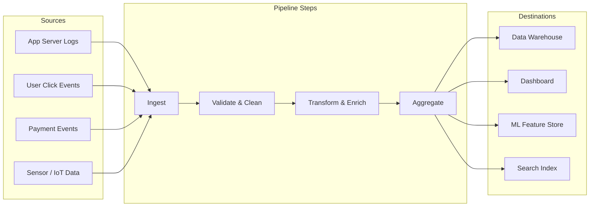

**The two major flavors:**
- **Batch Processing** — collect data over a period, process it all at once
- **Stream Processing** — process each event the moment it arrives

The rest of this chapter goes deep on both.

---

## Part 1: Batch Processing

### Analogy: The Newspaper

Imagine you want to know what's happening in the world. You wait until 6 AM, buy the Times of India, and read everything that happened yesterday in one go. The newspaper is complete, well-organized, and accurate. But it's always at least 12 hours old.

That's batch processing — collect a big chunk of data, then process it all at once on a schedule.

### How Batch Processing Works

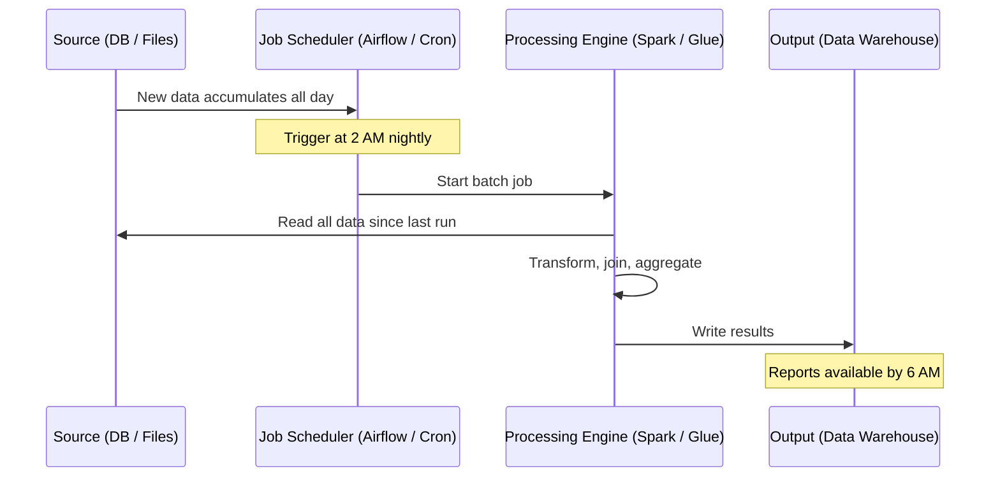

**Numbered steps in a typical batch job:**
1. **Extract**: Read data from source (database, files on S3, API exports)
2. **Validate**: Check for nulls, schema mismatches, duplicates
3. **Transform**: Clean, enrich, join with other datasets, apply business logic
4. **Aggregate**: Sum, count, average, group-by operations
5. **Load**: Write final results to data warehouse or serving store
6. **Alert**: Notify if job failed or data quality checks failed

### Tools for Batch Processing

| Tool | What It Does | Best For |
|---|---|---|
| Apache Spark | Distributed in-memory processing; handles TB of data | Large-scale ETL, ML preprocessing |
| Hadoop MapReduce | Disk-based distributed processing (older) | Very large data on commodity hardware |
| AWS Glue | Managed Spark on AWS; auto-discovers schema | AWS-native ETL pipelines |
| dbt (data build tool) | SQL-based transforms inside a data warehouse | Analytics engineers doing ELT |
| Apache Airflow | Workflow orchestrator (schedules and monitors jobs) | Orchestrating multi-step pipelines |
| Google Dataflow | Managed Apache Beam on GCP | GCP-native unified batch/stream |

### Real Example: Zomato's Nightly Restaurant Analytics

Every night, Zomato runs a batch job that:
1. Reads all orders from the transactional PostgreSQL database (billions of rows)
2. Joins with restaurant metadata (cuisine type, city, rating)
3. Computes: average rating per restaurant, total revenue by city, popular dishes by area
4. Loads results into a data warehouse (Snowflake or BigQuery)
5. Powers the restaurant owner dashboard available each morning

This doesn't need to be real-time. A restaurant owner checking their weekly stats doesn't need the last 5 minutes of orders included. Batch is perfect here.

### When to Use Batch

- Payroll (run once a month — no one expects their salary to update in real-time)
- Training ML models on historical data
- Generating monthly business reports
- End-of-day bank reconciliation
- Data migration between systems
- Reprocessing historical data after a bug fix in your logic

### When Batch Fails You

- **Fraud detection**: By the time your nightly batch runs, the fraudster has already withdrawn the money and is in Bali
- **Live sports scores**: Users want Kohli's score right now, not tomorrow morning
- **Real-time dashboards**: "How many users are on our app RIGHT NOW?"
- **Alerting**: Your server is on fire — you can't wait for the 2 AM job to find out

---

## Part 2: Stream Processing

### Analogy: The Twitter Feed vs The Newspaper

Instead of waiting for the newspaper, you follow Twitter. Events happen in Bengaluru — you see them in seconds. The stream is always on, always flowing. Each tweet (event) is processed the moment it appears.

Stream processing means: **process each event as soon as it arrives, without waiting to collect a batch.**

### How Stream Processing Works

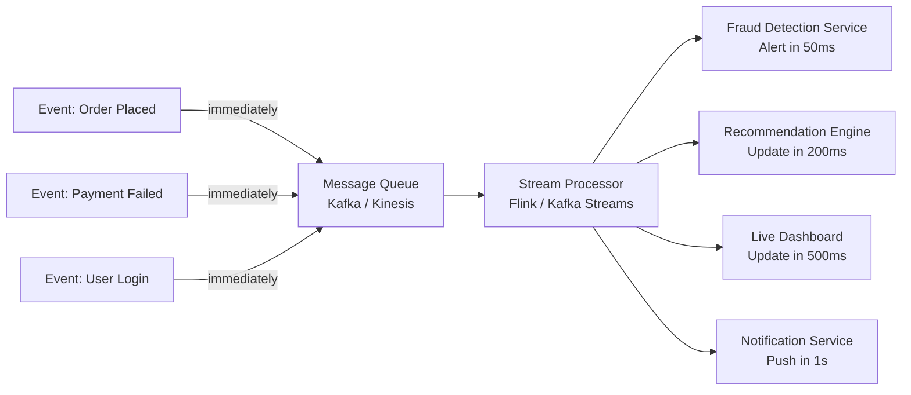

### Real Example: Uber's Real-Time Driver Earnings

Uber processes **billions of events per day** through Kafka. Every time a trip ends:
1. A `trip_completed` event hits Kafka (contains: driver_id, rider_id, distance, fare, tip, timestamp)
2. Flink consumes this event within milliseconds
3. Driver's earnings are updated in real-time (they see it in the app instantly)
4. Fraud detection checks for anomalies (suspiciously long trip at 3 AM?)
5. Trip analytics pipeline aggregates it for city-level demand forecasting

None of this can be batch. Drivers check their earnings constantly. Fraud must be caught before the driver disputes the trip.

### When to Use Stream Processing

- **Fraud detection**: Catch the bad transaction BEFORE it completes
- **Real-time recommendations**: Netflix updating "Because you watched..." immediately
- **Live dashboards**: Active users right now, orders in the last 60 seconds
- **IoT monitoring**: Temperature sensor exceeds 80°C → trigger alert immediately
- **Event-driven microservices**: Order placed → notify kitchen → update inventory
- **Personalization**: User watches 3 thriller trailers on Netflix → surface more thrillers immediately

### When Batch Still Wins Over Stream

- Heavy aggregations over months/years of history (too much state for stream)
- When exact results matter more than speed (batch is more accurate, stream can miss late events)
- When your data arrives in daily files from a vendor (no stream available)
- When you have a small team and limited infra budget (stream is operationally expensive)

---

## Batch vs Stream: The Full Comparison

| Dimension | Batch | Stream |
|---|---|---|
| Latency | Minutes to hours | Milliseconds to seconds |
| Throughput | Very high (bulk-optimized) | Lower per unit time |
| Complexity | Simple | Much higher |
| Cost | Cheaper (spot instances, off-peak) | Higher (always-on infrastructure) |
| Fault tolerance | Easy (just rerun the job) | Hard (exactly-once is complex) |
| Late data handling | Not an issue (wait for all data) | Complex (watermarks, out-of-order events) |
| State management | Simple (stateless transforms) | Complex (state per key, per window) |
| Tooling | Spark, Hadoop, dbt, Glue | Flink, Kafka Streams, Kinesis |
| Use for | Historical reports, ETL, ML training | Real-time decisions, alerts, live features |

**Interview tip**: Don't just say "I'd use Kafka for this." Explain WHY. Latency requirement? Volume? Need for replay? That reasoning is what distinguishes senior candidates.

---

## Part 3: Lambda Architecture

### Why Does Lambda Architecture Exist?

Yeh kyun important hai — samjho aise. You want BOTH: accurate historical analysis AND real-time dashboards. But:
- Batch is accurate but slow
- Stream is fast but approximate (can miss late events, harder to recompute)

Lambda architecture says: run both in parallel. Use stream for "right now" answers. Use batch for "correct historical" answers. Merge them.

### Analogy: The Two-Kitchen Restaurant

Imagine a high-end restaurant during lunch rush. There's a **fast counter** that gives you a quick pre-made sandwich in 2 minutes (approximate, a bit stale). There's the **full kitchen** that cooks your proper meal from fresh ingredients in 30 minutes (accurate, takes time).

When your full meal arrives, you stop eating the sandwich. The better result replaces the approximate one. That's the serving layer.

### Lambda Architecture Diagram

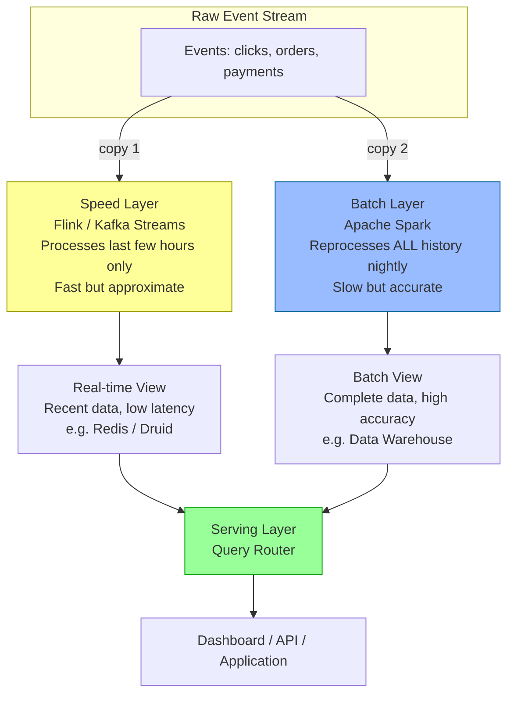

**How queries work in Lambda:**
- For recent data (last few hours): Serving layer queries the **speed layer** (fast, approximate)
- For historical data (older): Serving layer queries the **batch layer** (complete, accurate)
- For data that spans both: Serving layer merges results from both

### Lambda Real Example: Netflix Viewing History

Netflix uses a Lambda-like approach:
- **Speed layer**: When you finish watching an episode, the "Recently Watched" list updates in seconds
- **Batch layer**: Nightly job recomputes your complete viewing history, accurate percentages ("82% watched"), content quality scores
- **Serving layer**: When you open Netflix, it shows both: your instant recent activity + your accurate history

### Lambda Drawbacks

| Problem | Impact |
|---|---|
| Two codebases | Batch logic (Spark SQL) and stream logic (Flink Java) must stay in sync |
| Subtle bugs | Batch and stream can disagree on the same metric — which one is "right"? |
| Operational complexity | Two clusters, two monitoring systems, two deployment pipelines |
| Data consistency lag | During the batch re-computation window, users see stale data |

**The Lambda pain**: Imagine having two teams, one writing the same business logic in two different languages for two different systems. And then debugging why they produce different numbers. Bahut dard hai yeh.

---

## Part 4: Kappa Architecture

### The Philosophy: One Road Is Enough

Kappa was proposed by LinkedIn engineer Jay Kreps (creator of Kafka) in 2014. His insight: if Kafka can store events for weeks/months, why do we need a separate batch layer at all?

**Just stream everything. And if you need to reprocess history, replay the stream.**

### Analogy: The Single Highway

Instead of building two roads — a fast lane and a slow lane — just build ONE very wide, fast highway. All traffic flows through it. If you need to retrace a route (reprocess data), you just drive the same highway from the starting point.

### Kappa Architecture Diagram

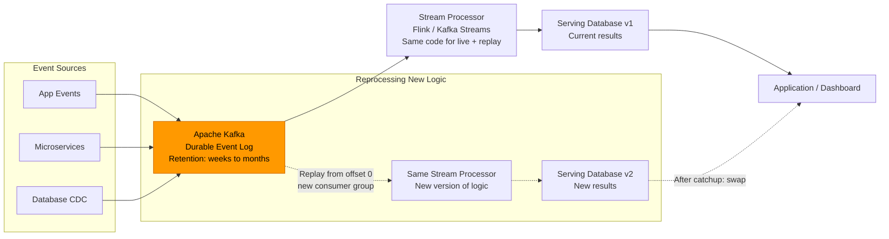

### Kappa Reprocessing: Step by Step

1. An event arrives → goes into Kafka topic (retention: 90 days, 30 TB)
2. Stream processor consumes it and writes aggregated results to serving DB
3. Your fraud detection logic has a bug — you need to recompute last 30 days
4. Deploy new version of stream processor with bug fix, start a **new consumer group** from offset 0
5. New processor replays all 30 days of events through the SAME code
6. When it catches up to the current moment, you **swap the serving layer** to the new DB
7. Old DB is deleted. One codebase, one system. Done.

### Lambda vs Kappa: Which to Choose?

| Aspect | Lambda | Kappa |
|---|---|---|
| Architecture | Batch layer + Speed layer + Serving | Stream-only + Kafka replay |
| Codebase | Two (batch + stream) | One (stream only) |
| Complexity | Very high | Lower |
| Reprocessing | Run a new batch job | Replay Kafka from offset 0 |
| Consistency | Hard to guarantee | Easier (same code path) |
| Kafka retention | Not central | Core requirement |
| Best for | Legacy systems with existing batch | Modern event-driven systems |
| Industry trend | Being replaced by Kappa | Preferred in new systems |

**Interview answer**: "For a new system where we control the infrastructure, I'd prefer Kappa. If we inherit a system with a robust batch pipeline, Lambda lets us add streaming without throwing away the batch work."

---

## Part 5: Apache Kafka — The Backbone of Modern Data Pipelines

### Why Kafka Exists: The Decoupling Problem

Socho aise: Zomato has 50 microservices. When an order is placed:
- The kitchen notification service needs to know
- The inventory service needs to update stock
- The analytics service needs to record the event
- The recommendation engine needs to update user preferences
- The fraud detection service needs to check the order

Without Kafka, the order service would need to call all 50 services directly. If any one is down, the order fails. If you add a 51st service, you modify the order service. Tightly coupled, fragile.

**Kafka decouples producers from consumers.** The order service just publishes one event. All 50 services independently consume it at their own pace. If fraud detection is slow, it doesn't slow down the kitchen notification. If recommendation engine is down for 2 hours, it catches up when it restarts.

### Analogy: The City Post Office Sorting Center

Kafka is like a massive postal sorting center. Letters (events) arrive from all senders (producers: app servers, mobile apps, IoT devices). They're sorted into labeled bins (topics). Mail carriers (consumers: analytics, fraud, recommendations) collect from their assigned bins. The sorting center keeps copies of all letters for 7 days (retention). New mail carriers can join and get letters from any point in time.

### Kafka Core Concepts

```mermaid
graph TD
    subgraph Producers
        P1[Order Service<br/>Producer]
        P2[Payment Service<br/>Producer]
        P3[User Service<br/>Producer]
    end

    subgraph Kafka Cluster - Topic: user-events
        subgraph Partition 0
            M1[offset 0: login]
            M2[offset 1: search]
            M3[offset 2: click]
        end
        subgraph Partition 1
            M4[offset 0: purchase]
            M5[offset 1: review]
        end
        subgraph Partition 2
            M6[offset 0: logout]
            M7[offset 1: login]
        end
    end

    subgraph Consumer Group A - Analytics Service
        CA1[Consumer 1<br/>owns Partition 0]
        CA2[Consumer 2<br/>owns Partition 1]
        CA3[Consumer 3<br/>owns Partition 2]
    end

    subgraph Consumer Group B - Fraud Detection
        CB1[Consumer 1<br/>owns all Partitions]
    end

    P1 --> Partition 0
    P2 --> Partition 1
    P3 --> Partition 2

    Partition 0 --> CA1
    Partition 1 --> CA2
    Partition 2 --> CA3

    Partition 0 --> CB1
    Partition 1 --> CB1
    Partition 2 --> CB1
```

**Topics**: A named channel for a type of event. Like folders in your email. Examples: `orders`, `user-clicks`, `payment-events`, `driver-locations`.

**Partitions**: Each topic is split into N partitions. This is why Kafka is scalable — each partition can be on a different machine, and each can be consumed by a different consumer in parallel. More partitions = more parallelism.

**Offsets**: Each message in a partition gets a sequential ID called an offset (0, 1, 2, 3...). Consumers track their offset — "I've processed up to offset 847." This lets them resume after a restart, or replay from any point.

**Consumer Groups**: Multiple consumers working together to process a topic in parallel. Within a group, each partition is owned by exactly one consumer. Different groups are completely independent — Consumer Group A (Analytics) and Consumer Group B (Fraud Detection) both get ALL messages, independently. Adding a new consumer group never affects existing ones.

**Retention**: Kafka keeps messages for a configurable period (default 7 days, can be weeks/months). After that, old messages are deleted. This retention is what enables Kappa-style reprocessing.

**Replication**: Each partition is replicated across N brokers (typically 3). If one broker dies, another takes over. No data loss, no consumer disruption.

### Kafka Partitioning Strategy

```
No key → round-robin across partitions
         Pro: even load distribution
         Con: no ordering guarantee

With key → hash(key) % numPartitions → same key always same partition
           Pro: ordering within a key
           Con: hot partitions if key distribution is skewed
```

**Real example**: On Swiggy, all events for a single order (order_placed, payment_done, restaurant_accepted, rider_assigned, delivered) use the `order_id` as the Kafka key. This ensures they all land in the same partition and are processed in order — critical for state machines.

```python
# Kafka producer with key for ordering guarantee
from kafka import KafkaProducer
import json

producer = KafkaProducer(
    bootstrap_servers=['kafka-broker-1:9092', 'kafka-broker-2:9092'],
    enable_idempotence=True,      # Prevents duplicates on retry
    acks='all',                    # Wait for all replicas to acknowledge
    retries=5,
    value_serializer=lambda v: json.dumps(v).encode('utf-8'),
    key_serializer=lambda k: k.encode('utf-8')
)

# Swiggy order event — key is order_id for ordering
event = {
    "event_type": "payment_completed",
    "order_id": "ORD-2024-987654",
    "user_id": "USR-12345",
    "restaurant_id": "REST-678",
    "amount": 349.00,
    "timestamp": "2026-06-27T18:30:00+05:30"
}

producer.send(
    topic='order-events',
    key='ORD-2024-987654',   # Same key = same partition = ordering
    value=event
)
producer.flush()
print("Event published to Kafka")
```

### Exactly-Once Semantics: The Holy Grail

This is where most Kafka beginners struggle. Delivering each message exactly once — not lost, not duplicated — is hard in distributed systems.

**Why is it hard?** The producer sends a message. Network fails. Producer doesn't know: did Kafka receive it or not? It retries. Now Kafka gets the message twice. That's a duplicate payment. Bahut buri baat.

Kafka offers three delivery guarantees:

| Mode | Risk | How |
|---|---|---|
| At most once | Data loss (messages can be dropped) | Fire and forget, no retries |
| At least once | Duplicates (most common, acceptable for idempotent ops) | Retry on failure, consumer deduplicates |
| Exactly once | No loss, no duplicates | Kafka transactions + idempotent producers + transactional consumers |

**Exactly-once in Kafka requires:**
1. **Idempotent producer**: Kafka assigns sequence numbers; broker detects and discards duplicates
2. **Transactions**: Group writes to multiple partitions atomically (all or nothing)
3. **Read-process-write atomicity**: Reading from one topic and writing to another is one atomic operation

```python
# Kafka consumer with manual offset commit for at-least-once
from kafka import KafkaConsumer
import json

consumer = KafkaConsumer(
    'order-events',
    bootstrap_servers=['kafka-broker-1:9092'],
    group_id='fraud-detection-service',
    auto_offset_reset='earliest',     # Start from beginning if no offset saved
    enable_auto_commit=False,         # Manual commit — commit only after processing
    value_deserializer=lambda m: json.loads(m.decode('utf-8'))
)

for message in consumer:
    event = message.value
    partition = message.partition
    offset = message.offset

    try:
        # Process event (fraud check)
        result = run_fraud_check(event)

        if result.is_fraudulent:
            trigger_alert(event)

        # ONLY commit after successful processing
        # If processing fails, we reprocess this message on restart
        consumer.commit()
        print(f"Processed event at partition={partition}, offset={offset}")

    except Exception as e:
        # Do NOT commit — will reprocess this message
        print(f"Processing failed at offset {offset}: {e}")
        # Could also dead-letter-queue this message
```

### Kafka in Production: Key Metrics to Monitor

| Metric | What It Means | Alert If |
|---|---|---|
| Consumer lag | Difference between latest offset and consumer's current offset | Lag growing continuously |
| Under-replicated partitions | Partitions not fully replicated | Any > 0 |
| Producer error rate | Failed produce requests | Any > 0 |
| Partition leader elections | Leadership changes (indicates broker issues) | Frequent elections |
| Disk usage | Kafka log storage | > 80% |

---

## Part 6: Stream Processing Engines

### Apache Flink: True Stream Processing

#### Analogy: The Running Scoreboard

Imagine a cricket match scoreboard. The scoreboard keeper must remember the current score (state) across each ball. Each new ball's events (four, six, wicket) update the ongoing tally. The keeper can't reset after every ball — they maintain cumulative state. Flink does this at massive scale, across millions of "score keepers" (one per user/session/key) simultaneously.

#### Event Time vs Processing Time

This is the most important concept in stream processing. Yeh bahut important hai — samjho carefully.

```
Scenario: User is on a Delhi Metro with no internet.
They click 5 items in your app at 9:00, 9:01, 9:02, 9:03, 9:04 AM.
Phone reconnects at 9:15 AM. All 5 events arrive at Kafka at 9:15 AM.

Processing Time: All 5 events are at "9:15 AM" — WRONG.
                 Your 9:00-9:10 AM window would be empty.

Event Time:      Events are at 9:00, 9:01, 9:02, 9:03, 9:04 AM — CORRECT.
                 Your 9:00-9:10 AM window correctly captures them.
```

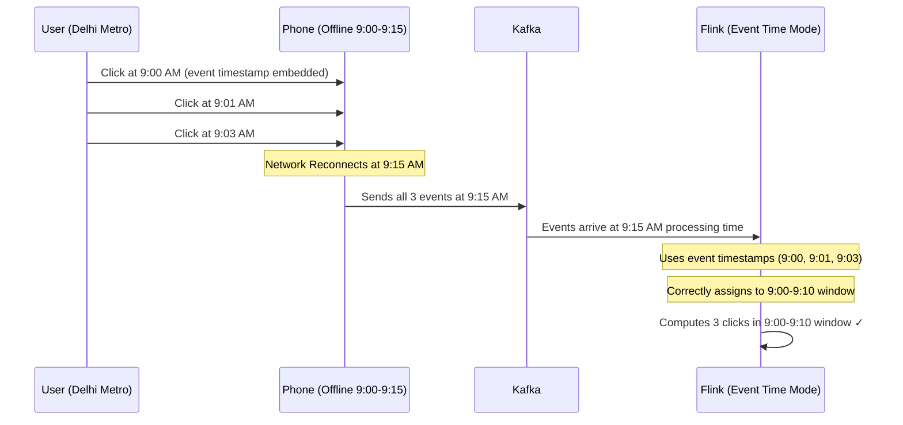

#### Watermarks: Telling Flink When to Close a Window

Watermarks are Flink's way of saying "I believe all events up to timestamp T have now arrived." Without watermarks, Flink would wait forever for potentially late events.

```
Events streaming in (event times): 9:00, 9:02, 8:58, 9:05, 9:01, 9:07, 9:10...

Watermark with 2-minute lag:
  When processing time is 9:07, watermark is at 9:05
  Flink says: "All events up to 9:05 have arrived"
  → Close the 9:00-9:05 window and compute results

Events arriving after the watermark → "late events"
  Flink can: drop them, send to side output, or allow with allowed lateness
```

#### Flink Windowing Types

```mermaid
graph TD
    subgraph Tumbling Window - 5 min
        TW1[9:00-9:05] 
        TW2[9:05-9:10]
        TW3[9:10-9:15]
        Note1[No overlap. Clean buckets.]
    end

    subgraph Sliding Window - 10 min window, 5 min slide
        SW1[9:00-9:10]
        SW2[9:05-9:15]
        SW3[9:10-9:20]
        Note2[Overlapping. Smoother trends.]
    end

    subgraph Session Window - gap 30 min
        SeSW1[9:00-9:22<br/>user active session]
        SeSW2[10:05-10:34<br/>next session after 30min gap]
        Note3[Sized by user behavior, not clock]
    end
```

```java
// Flink: real-time click analytics — count clicks per URL per 5-minute window
DataStream<ClickEvent> clicks = env
    .addSource(new FlinkKafkaConsumer<>("user-events", new ClickEventSchema(), kafkaProps));

clicks
    .assignTimestampsAndWatermarks(
        WatermarkStrategy
            .<ClickEvent>forBoundedOutOfOrderness(Duration.ofSeconds(30))  // 30s late tolerance
            .withTimestampAssigner((event, ts) -> event.getTimestamp())
    )
    .keyBy(ClickEvent::getUrl)                        // One state per URL
    .window(TumblingEventTimeWindows.of(Time.minutes(5)))
    .aggregate(new ClickCountAggregator())
    .addSink(new FlinkClickHouseSink("click_analytics"));
```

#### Flink Stateful Fraud Detection

```java
// Flink: stateful fraud detection per user
public class FraudDetector extends KeyedProcessFunction<String, Transaction, Alert> {

    // State per user — persisted to RocksDB, checkpointed to S3
    private ValueState<Double> totalSpendToday;
    private ValueState<Integer> transactionCount;
    private ValueState<Long> firstTransactionTimestamp;

    @Override
    public void open(Configuration config) {
        totalSpendToday = getRuntimeContext().getState(
            new ValueStateDescriptor<>("totalSpend", Double.class)
        );
        transactionCount = getRuntimeContext().getState(
            new ValueStateDescriptor<>("txnCount", Integer.class)
        );
        firstTransactionTimestamp = getRuntimeContext().getState(
            new ValueStateDescriptor<>("firstTxnTime", Long.class)
        );
    }

    @Override
    public void processElement(Transaction txn, Context ctx, Collector<Alert> out) throws Exception {
        Double spend = totalSpendToday.value();
        Integer count = transactionCount.value();
        if (spend == null) spend = 0.0;
        if (count == null) count = 0;

        spend += txn.getAmount();
        count += 1;
        totalSpendToday.update(spend);
        transactionCount.update(count);

        // Rule 1: Spent more than ₹1,00,000 today
        if (spend > 100_000) {
            out.collect(new Alert(txn.getUserId(), "HIGH_SPEND",
                "Total spend ₹" + spend + " today"));
        }

        // Rule 2: More than 20 transactions in last hour
        if (count > 20) {
            out.collect(new Alert(txn.getUserId(), "HIGH_FREQUENCY",
                count + " transactions today"));
        }

        // Reset state at midnight (register a timer)
        long midnight = getMidnightTimestamp(txn.getTimestamp());
        ctx.timerService().registerEventTimeTimer(midnight);
    }

    @Override
    public void onTimer(long timestamp, OnTimerContext ctx, Collector<Alert> out) {
        // Midnight — reset daily counters
        totalSpendToday.clear();
        transactionCount.clear();
    }
}
```

### Apache Spark Structured Streaming

Spark Structured Streaming is the "easier" path. It treats a live stream as an infinite table. You write SQL-like code, and Spark keeps running it on micro-batches as new data arrives.

**Mental model**: Imagine a spreadsheet that auto-refreshes with new rows every 500ms. You write a formula once. It keeps computing on fresh data.

```python
from pyspark.sql import SparkSession
from pyspark.sql.functions import window, count, col, from_json
from pyspark.sql.types import StructType, StringType, TimestampType, DoubleType

spark = SparkSession.builder \
    .appName("SwiggyOrderAnalytics") \
    .getOrCreate()

# Treat Kafka as a streaming table
orders_stream = spark.readStream \
    .format("kafka") \
    .option("kafka.bootstrap.servers", "kafka:9092") \
    .option("subscribe", "order-events") \
    .option("startingOffsets", "latest") \
    .load()

# Define schema and parse
schema = StructType() \
    .add("order_id", StringType()) \
    .add("restaurant_id", StringType()) \
    .add("city", StringType()) \
    .add("amount", DoubleType()) \
    .add("event_time", TimestampType())

parsed = orders_stream \
    .select(from_json(col("value").cast("string"), schema).alias("d")) \
    .select("d.*")

# Revenue per city per 10-minute window, with 30s watermark for late events
result = parsed \
    .withWatermark("event_time", "30 seconds") \
    .groupBy(
        window(col("event_time"), "10 minutes", "5 minutes"),  # sliding window
        col("city")
    ) \
    .agg(
        count("*").alias("order_count"),
        # sum("amount").alias("total_revenue")   # would need sum import
    )

# Write to console (replace with Kafka/ClickHouse/Delta sink in production)
query = result.writeStream \
    .outputMode("update") \
    .format("console") \
    .option("truncate", False) \
    .start()

query.awaitTermination()
```

### Flink vs Spark Streaming vs Kafka Streams

| Aspect | Apache Flink | Spark Structured Streaming | Kafka Streams |
|---|---|---|---|
| Processing model | True event-by-event | Micro-batch (tiny batches) | Event-by-event |
| Latency | Sub-second (< 100ms) | 500ms - few seconds | Sub-second |
| State management | Excellent: RocksDB, checkpoints | Good: checkpoints | Good: local RocksDB |
| Deployment | Separate cluster | Needs Spark cluster | Runs in-process (library) |
| Scalability | Excellent | Excellent | Good (limited to Kafka partitions) |
| SQL support | Flink SQL (excellent) | Spark SQL (excellent) | Limited (KSQL separately) |
| Learning curve | Steep | Easy if you know Spark | Easy |
| Best for | Low-latency, complex stateful | Mixed batch + stream teams | Simple Kafka-to-Kafka pipelines |
| AWS managed | Amazon Kinesis Data Analytics | EMR Spark | MSK-based |

**Real world usage:**
- **Flink**: Uber, LinkedIn, Alibaba (heavy stateful pipelines)
- **Spark Streaming**: Databricks customers, teams that already use Spark for batch
- **Kafka Streams**: Confluent customers, simple Kafka-to-Kafka enrichment

---

## Part 7: ETL vs ELT

### The Cooking Analogy

**ETL (Extract → Transform → Load)**: You're a chef. You go to the market (extract), prep and cook everything in your kitchen (transform — chop, marinate, cook), then serve the finished dish to the customer (load). The customer only ever sees the finished product.

**ELT (Extract → Load → Transform)**: You bring ALL the raw ingredients directly to the customer's table (load raw data into warehouse). Then you cook right there at the table using the restaurant's powerful built-in induction cooktop (transform inside the warehouse using SQL). The customer can cook different dishes from the same ingredients.

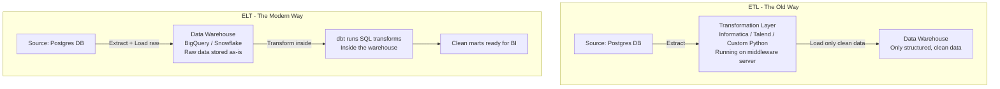

### Why ELT Won

1. **Modern data warehouses are stupidly powerful**: BigQuery can scan 1 TB in seconds using serverless compute. Transform inside the warehouse is fast and cheap.
2. **Raw data is preserved**: In ETL, if your transform logic had a bug, raw data is gone — you have to re-extract from source. In ELT, raw data is always there. Just re-run the dbt model.
3. **Flexibility**: Analysts can define their own transforms in SQL without touching the pipeline code. No engineering ticket needed.
4. **dbt is magic**: Data Build Tool lets analysts write SQL transforms, test them, document them, and version-control them like software engineers.

### ETL vs ELT Comparison

| Aspect | ETL | ELT |
|---|---|---|
| Transform location | Middleware / ETL server | Inside data warehouse |
| Raw data preserved | No (only transformed data stored) | Yes (raw layer always available) |
| Schema requirement | Schema defined before loading | Schema-on-read possible |
| Flexibility | Less (pipeline changes needed) | More (SQL changes only) |
| Re-transformation | Re-run entire pipeline | Re-run dbt model (fast) |
| Modern tooling | Informatica, Talend, SSIS | dbt + Fivetran + BigQuery/Snowflake |
| Cost model | Compute on middleware server | Warehouse compute (scales well) |
| Best for | Legacy systems, strict schemas | Cloud-native data teams |

### dbt: The Heart of Modern ELT

```sql
-- dbt model: models/marts/swiggy_daily_city_revenue.sql
-- This SQL runs inside BigQuery/Snowflake on a schedule

{{ config(materialized='incremental', unique_key='date_city_key') }}

WITH raw_orders AS (
    -- Reference raw layer (loaded by Fivetran from source DB)
    SELECT * FROM {{ ref('raw_orders') }}
    WHERE status = 'delivered'
    
      AND created_at > (SELECT MAX(order_date) FROM {{ this }})
    
),

enriched AS (
    SELECT
        DATE(created_at)        AS order_date,
        city,
        restaurant_category,
        COUNT(*)                AS total_orders,
        SUM(order_amount)       AS total_revenue,
        AVG(delivery_time_mins) AS avg_delivery_time,
        CONCAT(DATE(created_at), '_', city) AS date_city_key
    FROM raw_orders
    GROUP BY 1, 2, 3
)

SELECT * FROM enriched
```

---

## Part 8: Change Data Capture (CDC)

### Why CDC Exists: The Polling Problem

You have a PostgreSQL database with 10 million rows in the `orders` table. You want to keep Elasticsearch in sync so users can search orders. How do you do it?

**Naive approach**: Every 5 minutes, query ALL rows where `updated_at > last_check_time`. Problems:
- Adds load to your production database
- Full table scans on large tables are slow
- You might miss deletes (deleted rows don't have `updated_at`)
- Race conditions with transactions

**CDC approach**: Instead of asking the database "what changed?", you listen to the database's internal change log — the Write-Ahead Log (WAL). Every INSERT, UPDATE, DELETE that the database writes to its crash-recovery log also gets published to Kafka as an event. Zero impact on your queries, zero missed changes.

### Analogy: The Audit Stenographer

Imagine a notary in a government office. Every document that gets stamped, every change made — the stenographer writes it all down in a ledger immediately. They're not disrupting anyone's work; they're just observing and recording. That stenographer is CDC. The ledger is Kafka. Other services read the ledger and keep themselves updated.

### How CDC Works with Debezium

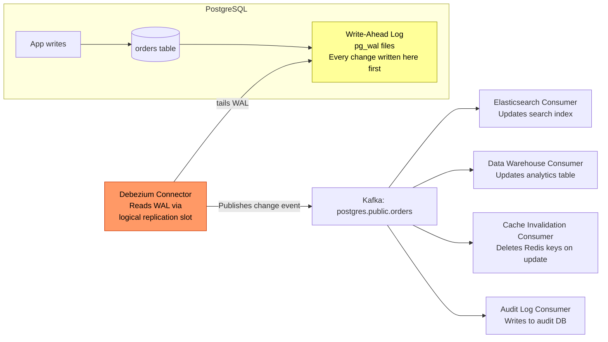

### CDC Event Structure (Debezium)

```json
{
  "schema": { "type": "struct" },
  "payload": {
    "op": "u",
    "ts_ms": 1751001600000,
    "before": {
      "order_id": "ORD-987654",
      "status": "confirmed",
      "amount": 349.00,
      "rider_id": null
    },
    "after": {
      "order_id": "ORD-987654",
      "status": "out_for_delivery",
      "amount": 349.00,
      "rider_id": "RDR-5432"
    },
    "source": {
      "db": "swiggy_prod",
      "table": "orders",
      "ts_ms": 1751001599950,
      "lsn": 245237641
    }
  }
}
```

**`op` field values:**
- `c` → CREATE (INSERT)
- `u` → UPDATE
- `d` → DELETE (before has data, after is null)
- `r` → READ (initial snapshot)

### CDC Consumer: Cache Invalidation on DB Change

```python
# Consumer that invalidates Redis cache when order status changes
from kafka import KafkaConsumer
import json
import redis

consumer = KafkaConsumer(
    'postgres.public.orders',
    bootstrap_servers=['kafka:9092'],
    group_id='cache-invalidation-service',
    value_deserializer=lambda m: json.loads(m.decode('utf-8'))
)

redis_client = redis.Redis(host='redis', port=6379)

for message in consumer:
    event = message.value['payload']
    operation = event['op']
    order_after = event.get('after', {})

    if order_after and 'order_id' in order_after:
        order_id = order_after['order_id']
        cache_key = f"order:{order_id}"

        if operation == 'd':
            # Delete from cache
            redis_client.delete(cache_key)
            print(f"Evicted cache for deleted order {order_id}")
        elif operation in ('u', 'c'):
            # Invalidate stale cache entry
            redis_client.delete(cache_key)
            print(f"Invalidated cache for {operation} on order {order_id}")
            # Next request will re-fetch from DB and re-cache
```

### Debezium Setup: Docker Compose

```yaml
# docker-compose.yml
version: '3.8'
services:
  postgres:
    image: postgres:15
    environment:
      POSTGRES_DB: appdb
      POSTGRES_USER: app
      POSTGRES_PASSWORD: secret
    command: >
      postgres
        -c wal_level=logical
        -c max_replication_slots=4
        -c max_wal_senders=4

  debezium-connect:
    image: debezium/connect:2.5
    environment:
      BOOTSTRAP_SERVERS: kafka:9092
      GROUP_ID: debezium-group
      CONFIG_STORAGE_TOPIC: debezium_configs
      OFFSET_STORAGE_TOPIC: debezium_offsets
      STATUS_STORAGE_TOPIC: debezium_statuses
    ports:
      - "8083:8083"

# Register connector via REST (after services start):
# curl -X POST http://localhost:8083/connectors \
#   -H "Content-Type: application/json" \
#   -d '{
#     "name": "orders-cdc-connector",
#     "config": {
#       "connector.class": "io.debezium.connector.postgresql.PostgresConnector",
#       "database.hostname": "postgres",
#       "database.port": "5432",
#       "database.user": "app",
#       "database.password": "secret",
#       "database.dbname": "appdb",
#       "table.include.list": "public.orders,public.payments",
#       "topic.prefix": "postgres",
#       "plugin.name": "pgoutput"
#     }
#   }'
```

### CDC Use Cases

| Use Case | How CDC Helps |
|---|---|
| DB → Data Warehouse sync | Capture every change, load incrementally without full scans |
| DB → Elasticsearch sync | Update search index on every DB change in near-real-time |
| Cache invalidation | Delete/update Redis cache entry exactly when DB changes |
| Event sourcing from legacy DB | Convert a non-event-sourced DB into a stream of events |
| Audit trail | Record every change to sensitive data (PCI, HIPAA compliance) |
| Microservice sync | Service A changes DB → Service B reacts via CDC event |

---

## Part 9: Real-World Data Pipeline Architectures

### Netflix's Viewing Event Pipeline

Netflix processes billions of events per day. When you watch a show:

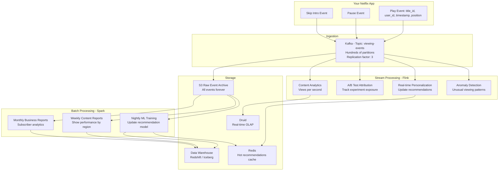

### Uber's Real-Time Data Platform

Uber processes **trillions of events per month**. Here's their simplified architecture:

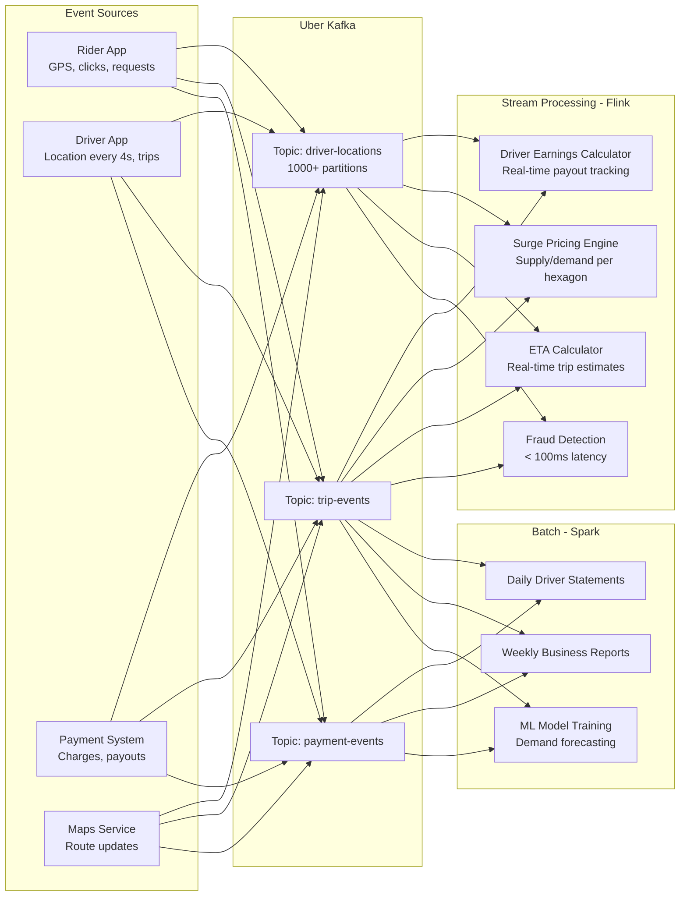

**Key Uber stats that drove their pipeline design:**
- 1+ million drivers generate GPS events every 4 seconds
- That's 15 million location events per minute, just for drivers
- Surge pricing updates every 30 seconds per geo-cell
- Driver earnings update in real-time after every trip completion

---

## Part 10: End-to-End Pipeline Architecture Patterns

### The Modern Data Stack (2024-2026)

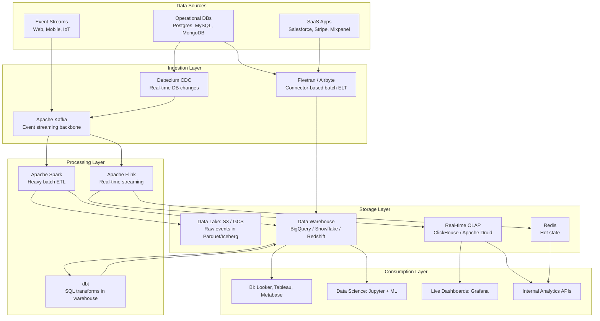

### ClickHouse: The Real-Time OLAP Layer

ClickHouse is what you use when you need to answer analytical queries in milliseconds on billions of rows. It's column-oriented, meaning it reads only the columns you query — perfect for aggregations.

```sql
-- ClickHouse DDL for Swiggy order events
CREATE TABLE order_events (
    event_id       UUID,
    order_id       String,
    event_type     LowCardinality(String),  -- LowCardinality = dictionary encoding
    city           LowCardinality(String),
    restaurant_id  String,
    user_id        String,
    amount         Float64,
    event_time     DateTime64(3, 'Asia/Kolkata')  -- millisecond precision, IST
) ENGINE = MergeTree()
PARTITION BY toYYYYMM(event_time)   -- Partition by month for pruning
ORDER BY (city, event_time)          -- Sorted for fast range queries
SETTINGS index_granularity = 8192;

-- Real-time query: orders per city in the last 5 minutes
-- Runs in milliseconds on billions of rows
SELECT
    city,
    count()             AS order_count,
    sum(amount)         AS total_revenue,
    avg(amount)         AS avg_order_value
FROM order_events
WHERE
    event_type = 'order_placed'
    AND event_time >= now() - INTERVAL 5 MINUTE
GROUP BY city
ORDER BY order_count DESC;
```

---

## Part 11: Common Failure Modes and How to Handle Them

### The Thundering Herd Problem

Your pipeline stops for 2 hours (deployment). When it restarts, all consumers rush to catch up. They read millions of messages at full speed. This kills your downstream databases.

**Solution**: Rate limiting consumer read rate during catch-up. Or use Kafka consumer `max.poll.records` to limit how many events you process per batch.

### The Poison Pill Event

One malformed event (e.g., null where a date is expected) crashes your consumer. Consumer restarts, hits the same event, crashes again. Infinite loop.

**Solution**: Dead Letter Queue (DLQ). After N retries, route the bad event to a separate `dlq.order-events` topic. Continue processing. Alert on DLQ growth. Humans inspect and fix.

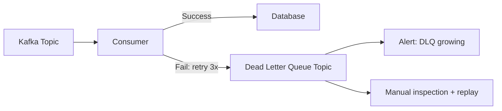

### The Slow Consumer Problem

Your fraud detection service is slow. Consumer lag keeps growing. Kafka can't delete old messages because the consumer hasn't read them yet. Disk fills up.

**Solutions:**
1. Scale consumer group (add more consumer instances, more partitions)
2. Optimize consumer processing (async I/O, batching DB writes)
3. Increase retention period for critical topics
4. Add consumer lag alerts (`max lag > 100,000 messages → page on-call`)

### Backpressure

Your stream processor can't keep up with incoming event rate. Events pile up in Kafka faster than consumed.

**Solutions**: Scale out consumer instances, use bounded queues in the processor, implement producer-side throttling as a last resort.

---

## Part 12: Interview Preparation

### System Design Question Frameworks

**When to choose batch vs stream:**
1. What is the acceptable latency? (minutes → batch, milliseconds → stream)
2. Does the use case need historical context or just recent events?
3. What is the team's expertise and infrastructure budget?
4. Does the result need to be exact or approximate?

**When to choose Kafka:**
- Multiple consumers need the same events independently
- You need event replay capability
- You're decoupling microservices
- Volume is high (millions of events/day)

**When NOT to choose Kafka:**
- Simple job queue with a few consumers (use RabbitMQ / SQS)
- You don't need replay or retention
- Low volume (< 10K events/day)

**When to choose CDC:**
- Need to sync DB to another system without polling
- Source system can't be modified to publish events
- Need exact audit trail of every DB change
- Cache invalidation needs to be precise

---

## Common Interview Questions

**Q1: What's the difference between Kafka topics and queues like RabbitMQ?**

Kafka is a distributed log, not a queue. In a queue (RabbitMQ, SQS), once a message is consumed, it's deleted. In Kafka, messages persist for a configurable retention period. Multiple consumer groups can all read the same message independently. This enables: replay, multiple consumers on same stream, time-travel debugging.

**Q2: How do you handle late-arriving events in a streaming system?**

Use event time processing with watermarks. A watermark is a signal to the processor saying "I believe all events up to timestamp T have arrived." Events after the watermark are considered late. You can: (a) drop late events, (b) update results when late events arrive (append-only output), or (c) set an allowed lateness window and close windows later. In Flink, `forBoundedOutOfOrderness(Duration.ofSeconds(30))` means you tolerate up to 30 seconds of late events.

**Q3: Explain exactly-once semantics in Kafka. Is it achievable?**

Yes, Kafka achieves exactly-once with three components: (1) Idempotent producer — Kafka broker deduplicates based on producer ID and sequence number. (2) Transactions — atomically write to multiple partitions, consumers only read committed messages. (3) Transactional consumers — reading and writing in a single atomic transaction. The caveat: this is exactly-once within the Kafka ecosystem. If your consumer writes to an external system (like a DB), you need idempotent writes on the consumer side too.

**Q4: When would you use Lambda vs Kappa architecture?**

Lambda: When you have an existing robust batch pipeline and want to add streaming without throwing it away. When your batch transforms are complex SQL that's hard to replicate in a stream processor. When you need 100% historical accuracy (batch) combined with real-time approximations (speed layer).

Kappa: For new systems built from scratch. When Kafka retention is long enough to replay history. When you want one codebase for batch and stream. Modern preference.

**Q5: What is consumer lag and why does it matter?**

Consumer lag = (latest offset in partition) - (consumer's current offset). It tells you how far behind the consumer is. A growing lag means the consumer can't keep up with the producer rate — a warning sign. Zero lag means the consumer is real-time. Large lag means your "real-time" system is actually hours behind. Monitor with Kafka's built-in consumer group offset APIs or Burrow/Cruise Control.

**Q6: How does CDC differ from polling for database changes?**

Polling reads from the application table using `WHERE updated_at > last_run`. Problems: adds load to prod DB, misses deletes, schema must have `updated_at` column, race conditions. CDC reads the database's internal write-ahead log (WAL), which the DB was already writing for crash recovery. Zero extra load on the DB, captures all operation types (INSERT/UPDATE/DELETE), no schema changes needed. Debezium reads PostgreSQL's WAL via logical replication; MySQL uses binlog.

**Q7: Design a real-time fraud detection system for a payment processor handling 10,000 transactions/second.**

High-level answer:
- Payments go into Kafka topic `payment-events` (100 partitions for 10K TPS)
- Flink consumes with key=`user_id`, maintaining per-user state: spend velocity, geo-location history, device fingerprint
- Rules: >5 transactions in 60 seconds, location hop > 500km in 10 minutes, amount > 3x average
- Suspicious transactions → `fraud-alerts` Kafka topic → notification service → block transaction API
- All decisions in < 100ms (SLA: fraud check must complete before payment completes)
- State checkpointed to S3 every 30 seconds for fault tolerance

**Q8: What is a data lake vs a data warehouse?**

Data lake (S3, GCS, HDFS): Stores raw data in original format (JSON, CSV, Parquet, images, logs). Schema-on-read. Cheap storage. Flexible but unstructured. Tools: Spark, Athena, Presto to query.

Data warehouse (BigQuery, Snowflake, Redshift): Stores structured, cleaned, schema-enforced data. Schema-on-write. Expensive compute but fast SQL queries. For BI and reporting.

Modern pattern: Data Lakehouse (Delta Lake, Apache Iceberg) — raw data in lake format on cheap S3 storage, but with ACID transactions, schema enforcement, and time-travel capabilities. Best of both worlds.

**Q9: How would you backfill a 2-year data pipeline after fixing a business logic bug?**

Lambda approach: Fix the batch job, re-run Spark job over 2 years of data from S3. Write to new table. Swap serving layer.

Kappa approach: If Kafka retention is 90 days, can only replay 90 days via stream. For 2 years, must load historical data from S3/archive into a new Kafka topic and replay through stream processor.

In practice: Archive all raw events to S3 (Parquet/Iceberg). When you need to backfill, Spark reads from S3 archive, applies new logic, writes results. This is the simplest approach for most teams.

**Q10: Explain ETL vs ELT with a real example.**

ETL (old way): Stripe sends you a CSV of charges. Your ETL server (Informatica) reads it, converts currencies to INR, joins with your user table, calculates net after fees, then loads the final clean table into your warehouse. If the currency conversion logic was wrong, you need the original CSV again.

ELT (modern way): Fivetran connector syncs raw Stripe charges into `raw.stripe_charges` in BigQuery every hour. Then dbt SQL model `marts.revenue` runs inside BigQuery: `SELECT charge_id, amount_usd * fx_rate AS amount_inr, net_amount FROM raw.stripe_charges JOIN ref_fx_rates`. If the logic was wrong, just fix the dbt model and re-run — raw data is safe.

---

## Key Takeaways

**The Fundamental Rule**: Match your pipeline design to your latency requirement. Not everything needs real-time. Not everything can afford to be batch. The cost of stream processing is 10-20x that of batch. Don't gold-plate.

**Batch Processing**
- Collect data over a period → process all at once → output results
- Tools: Apache Spark, Hadoop, AWS Glue, dbt
- Use for: daily reports, ML training, ETL to data warehouse
- Simple, cheap, reliable — don't underestimate it

**Stream Processing**
- Process each event the moment it arrives → continuous output
- Tools: Apache Flink, Kafka Streams, Spark Streaming, AWS Kinesis
- Use for: fraud detection, live dashboards, real-time recommendations
- Complex and expensive — only use when latency requirements demand it

**Lambda Architecture**
- Batch layer (accurate, slow) + Speed layer (fast, approximate) + Serving layer (merges both)
- Powerful but expensive to maintain: two codebases, two systems, consistency nightmares
- Prefer Kappa for new systems

**Kappa Architecture**
- Stream-only, use Kafka as the durable event log
- Replay historical events through same stream processor for reprocessing
- Simpler than Lambda: one codebase, one system

**Apache Kafka**
- Topics (named channels), Partitions (parallelism), Offsets (position tracking), Consumer Groups (independent consumers), Retention (replay capability)
- Key → same partition → ordering within key
- Exactly-once: idempotent producer + transactions + transactional consumer
- Monitor consumer lag — a growing lag is a red flag

**Apache Flink**
- True event-by-event processing, native stateful ops
- Event time (when it happened) vs processing time (when it arrived) — use event time
- Watermarks: tell Flink when to close time windows despite out-of-order events
- State persisted to RocksDB, checkpointed to S3 for fault tolerance

**ETL vs ELT**
- ETL: transform before loading (legacy, inflexible, raw data not preserved)
- ELT: load raw, transform inside warehouse with dbt (modern standard)
- Modern data warehouses (BigQuery, Snowflake) prefer ELT

**Change Data Capture (CDC)**
- Read the DB's WAL instead of polling the table
- Debezium: reads MySQL binlog / PostgreSQL WAL → publishes to Kafka
- Use for: DB → Elasticsearch sync, cache invalidation, audit trails, warehouse sync
- Zero additional load on production database

**The Real World**
- Uber: processes trillions of events/month through Kafka (driver earnings, surge pricing, fraud)
- Netflix: Kafka for viewing event pipeline (personalization, A/B tests, content analytics)
- Zomato/Swiggy: Kafka + Flink for real-time order tracking, driver matching, surge pricing

---

*Data Pipelines & Streaming — System Design Notes*
