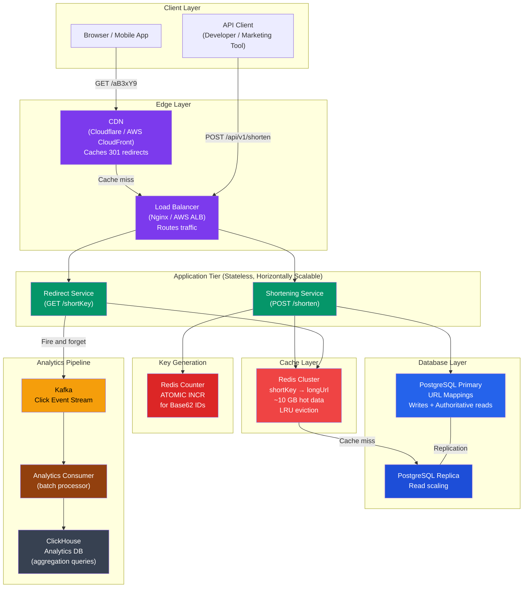
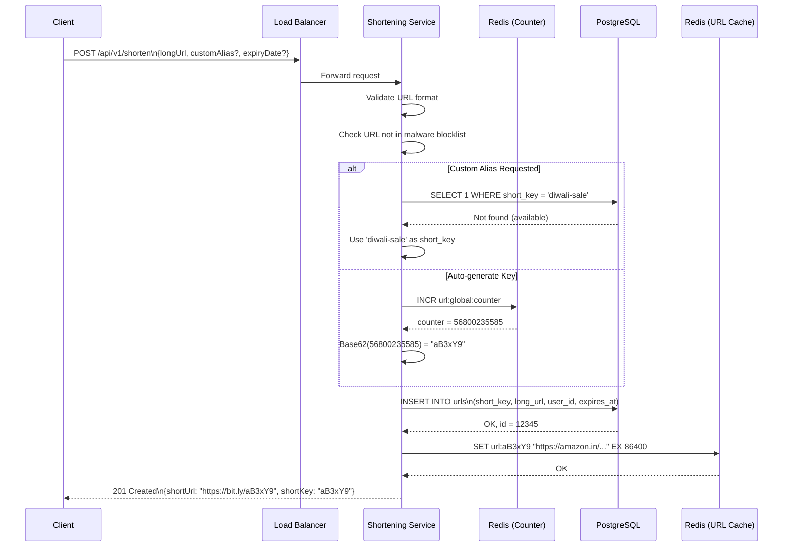
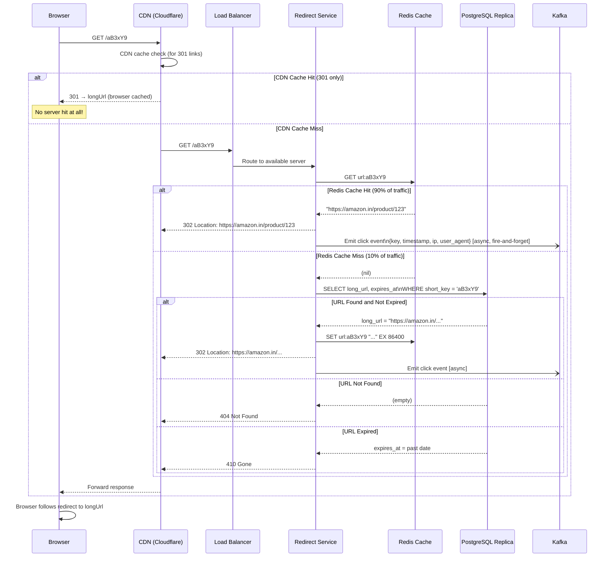
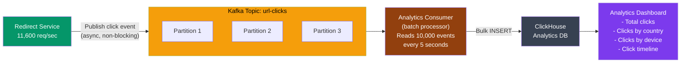
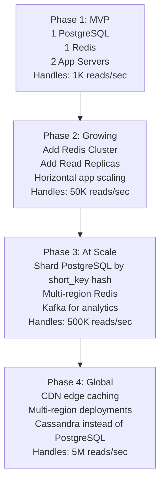

# System Design Case Study: URL Shortener (like bit.ly)

> This is your single complete reference for URL shortener system design — from napkin sketch to production-grade architecture. Master this and you'll handle 80% of system design interviews with confidence.

---

## The Big Picture — Analogy Time

Socho ek **post office** hai. Tumhara dost US mein rehta hai aur tumhe ek package bhejta hai. Package ka address hai:

> `Plot No. 47, Lane 12B, Near the Old Peepal Tree, Behind the Blue Gate, Shivaji Nagar, Pune, Maharashtra, India - 411005`

Ab agar tumhara dost yeh poora address Instagram bio mein likhna chahe — toh woh fit nahi hoga! Instead, post office tumhe ek **tracking number** deta hai: `#IND2024Z`. Tum woh number share karo, post office tumhara asli address jaanta hai.

**Yahi URL shortener karta hai.**

- Long URL = full postal address
- Short code = tracking number
- URL shortener = post office ka lookup counter

Real life mein:
- Twitter/X uses `t.co` — har tweet mein long URLs ko `t.co/xyzABC` bana deta hai taaki character limit bacche
- Instagram bio links work with `linktr.ee` or `bit.ly`
- Zomato restaurant campaigns use short URLs in SMS — `zoma.to/abc123`
- Swiggy discount codes redirect to long promo pages via short links
- YouTube shares video links that sometimes go through `youtu.be/xyzABC`

---

## What We Are Building

```
Input:  https://www.amazon.in/gp/product/B09V3KXJPX?tag=affiliate-21&linkCode=ogi&th=1&psc=1
Output: https://bit.ly/aB3xY9

User visits bit.ly/aB3xY9 → instantly redirected to the original Amazon URL
```

Classic examples: **bit.ly**, **tinyurl.com**, **t.co** (Twitter), **goo.gl** (Google, now retired), **youtu.be** (YouTube)

---

## Step 1: Requirements Gathering

> Interview tip: Pehle requirements poochho. Directly design mat karo. Yeh dikhata hai ki tum product thinking rakhte ho.

### Functional Requirements (What the system MUST do)

```
1. Shorten URL    — User deta hai long URL, system deta hai short code
2. Redirect       — Short URL visit karo → original URL pe redirect ho jao
3. Custom Aliases — User apna naam choose kar sake: bit.ly/my-diwali-sale
4. Expiry Dates   — Link 7 din ke baad automatically expire ho jaye
5. Analytics      — Kitne log ne click kiya? Kahan se? Kab?
```

### Non-Functional Requirements (How well it must work)

| Requirement | Target | Why It Matters |
|---|---|---|
| Write QPS | 100M URLs/day = **1,160 writes/sec** | Scale of creation |
| Read QPS | 1B redirects/day = **11,600 reads/sec** | 10:1 read:write ratio |
| Redirect latency | **< 100ms p99** | User is actively waiting, clicking a link |
| Availability | **99.99%** for reads | A broken short link = broken campaign, broken tweet |
| Short URL uniqueness | **Globally unique** | Two short codes cannot map to different long URLs |
| Durability | **Never lose a mapping** | Once created, a URL must always resolve |

**Why 10:1 read:write ratio?**

Ek URL ek baar create hota hai, lekin **lakho log** us link ko click karte hain. Ek viral Instagram post mein 50 lakh views hote hain — ek hi URL pe. Is wajah se read path ko **extreme scale** ke liye optimize karna padta hai.

### Out of Scope (for this interview)

```
❌ User authentication UI (assume API key auth)
❌ Link editing after creation
❌ GDPR/right to deletion handling
❌ Spam/malware URL filtering
❌ Branded domains for enterprise (company.short.io) — mention but don't deep-dive
```

---

## Step 2: Capacity Estimation

> Anukaan lagao — interviewer dekhna chahta hai ki tum numbers se dar nahi khate.

### Traffic Estimation

```
Writes (URL creation):
  100 million URLs per day
  = 100,000,000 / 86,400 seconds
  = 1,157 writes/second ≈ 1,160 writes/sec

Reads (URL redirects):
  Read:Write ratio = 10:1
  = 1,000,000,000 redirects per day
  = 1,000,000,000 / 86,400
  = 11,574 reads/second ≈ 11,600 reads/sec

Peak traffic (assume 3x average):
  Reads peak = ~35,000 reads/sec
  (think: Zomato link during lunch hour surge)
```

### Storage Estimation

```
One URL record:
  short_key    : 8 bytes   (e.g., "aB3xY9k2")
  long_url     : ~300 bytes (average URL length)
  user_id      : 8 bytes
  created_at   : 8 bytes
  expires_at   : 8 bytes
  click_count  : 8 bytes
  metadata     : ~100 bytes (custom alias flag, etc.)
  ─────────────────────────
  Total        : ~500 bytes per URL record

Daily storage:
  100M URLs × 500 bytes = 50 GB/day

5-year storage:
  50 GB/day × 365 × 5 = 91,250 GB ≈ 90 TB

This is manageable. A single large DB server handles it,
but we'll shard for reliability and performance.
```

### Cache Estimation

```
The 80/20 Rule (Pareto Principle):
  80% of reads come from 20% of URLs
  (viral links, campaign links, popular content)

Hot URLs to cache:
  20% of 1B daily reads = 200M hot requests
  20% of all URLs = 20M unique hot URLs

Memory needed:
  20M URLs × 500 bytes = 10 GB of cache

This fits comfortably in a single Redis instance
(modern Redis servers handle 100+ GB RAM easily).
```

### Bandwidth Estimation

```
Read bandwidth:
  11,600 reads/sec × 500 bytes (redirect response) = 5.8 MB/sec

Write bandwidth:
  1,160 writes/sec × 1 KB (request + response) = 1.2 MB/sec

Total: ~7 MB/sec — trivial for modern infrastructure.
```

---

## Step 3: API Design

> Simple baat: 2 APIs. Ek URL banao, ek URL use karo.

### API 1: Shorten a URL

**POST /api/v1/shorten**

```
Request:
─────────────────────────────────────────
POST /api/v1/shorten
Authorization: Bearer {api_key}
Content-Type: application/json

{
  "longUrl":     "https://amazon.in/dp/B09V3KXJPX?tag=affiliate",
  "customAlias": "diwali-sale",          // optional
  "expiryDate":  "2024-11-15T23:59:59Z"  // optional
}

Response 201 Created:
─────────────────────────────────────────
{
  "shortUrl":  "https://bit.ly/diwali-sale",
  "shortKey":  "diwali-sale",
  "longUrl":   "https://amazon.in/dp/B09V3KXJPX?tag=affiliate",
  "expiryDate": "2024-11-15T23:59:59Z",
  "createdAt": "2024-10-01T10:00:00Z"
}

Error Responses:
─────────────────────────────────────────
400 Bad Request     → malformed URL, invalid JSON
409 Conflict        → custom alias "diwali-sale" already taken
422 Unprocessable   → URL points to known malware/phishing site
429 Too Many Req.   → rate limit exceeded (max 100 URLs/hour/user)
```

### API 2: Redirect to Original URL

**GET /{shortKey}**

```
Request:
─────────────────────────────────────────
GET /diwali-sale
Host: bit.ly

Response (success):
─────────────────────────────────────────
HTTP/1.1 302 Found
Location: https://amazon.in/dp/B09V3KXJPX?tag=affiliate

Response (not found):
─────────────────────────────────────────
HTTP/1.1 404 Not Found

Response (expired link):
─────────────────────────────────────────
HTTP/1.1 410 Gone
```

### 301 vs 302: The Most Asked Interview Question

**Analogy:** Socho tumne ek new shop khola aur purana address change kar liya.

- **301 Permanent**: Post office ek sticker lagata hai tumhare purane address pe — "yeh log ab nayi jagah rehte hain, seedha wahan jao." Next time koi aaye, post office directly nayi jagah bhejega, tumse poochhe bina.
- **302 Temporary**: Post office baar baar tumse poochhta hai — "abhi wahan rehte ho na?" Slower, lekin information fresh rehti hai.

```
301 Moved Permanently:
────────────────────────────────────────────────
  - Browser caches the redirect permanently
  - Future visits go DIRECTLY to destination (no server call)
  - ✅ Advantage: Huge reduction in server load
  - ❌ Disadvantage: We lose analytics — browser never calls us again
  - Use case: When analytics don't matter (static documentation links)

302 Found (Temporary Redirect):
────────────────────────────────────────────────
  - Browser does NOT cache the redirect
  - EVERY visit calls our server first
  - ✅ Advantage: We see every click → perfect analytics
  - ❌ Disadvantage: Higher server load, more latency
  - Use case: Marketing campaigns, affiliate tracking, analytics needed

WINNER: 302 for URL shorteners (bit.ly, t.co both use 302)
Reason: Analytics is the whole point of a URL shortener for businesses.

Pro tip: Yeh question interview mein 90% cases mein aata hai.
Answer confidently: "302 because we need click tracking."
```

---

## Step 4: Short Key Generation — The Core Problem

> Yeh sabse interesting part hai. Basically kya hota hai: hume ek **short, unique identifier** banana hai for each URL. Multiple approaches hain, sabke trade-offs hain.

### Analogy

Socho tumhare school mein 1000 students hain. Har student ka roll number ek unique ID hai. Ab question yeh hai: roll number kaise assign karein?

- **Option A**: Random number dedo — lekin check karna padega ki already exist toh nahi karta
- **Option B**: 1 se start karo, sequentially badhaate jao — predictable but guaranteed unique
- **Option C**: Student ka naam hash karo → number nikalo — same naam = same number (collision!)
- **Option D**: Pehle ek bunch of numbers pre-generate karo, shelf pe rakhdo, jab chahiye tab ek le lo

Yahi 4 options URL shortener mein hain.

---

### Approach 1: Random Key Generation

```
Algorithm:
  1. Generate random 7-char alphanumeric string
  2. Check DB: does this key already exist?
  3a. If NO  → save it, done
  3b. If YES → collision! Retry with new random string

Base62 alphabet: 0-9 a-z A-Z = 62 characters
7-char space: 62^7 = 3,521,614,606,208 (3.5 trillion combinations)

At 1,160 writes/sec for 5 years:
  Total URLs = 1,160 × 86,400 × 365 × 5 = 182 billion URLs
  Collision probability at 1% fill: extremely low

Pros:
  ✅ Simple to implement
  ✅ Unpredictable keys (security benefit — hard to enumerate)

Cons:
  ❌ DB check required before every insert (extra round trip)
  ❌ As DB fills up, collision probability grows
  ❌ At high scale, retry storms under load
```

### Approach 2: Hash + Truncate (MD5/SHA256)

```
Algorithm:
  1. MD5(longUrl) → 128-bit hash
  2. Take first 43 bits → convert to Base62 → 7-character key

Example:
  longUrl = "https://amazon.in/product/123"
  MD5     = "1bc29b36f623ba82aaf6724fd3b16718"
  First 7 Base62 chars → "fR9kLmP"

Same URL = Same key (deterministic):
  Advantage: deduplication automatic
  Disadvantage: two different URLs might hash to same first 43 bits

Collision on SAME URL:
  "amazon.in/product/123" + user_id to make unique

Pros:
  ✅ Stateless — no coordination between servers needed
  ✅ Same URL always gets same key (natural dedup)

Cons:
  ❌ Collisions possible (though rare at 62^7 space)
  ❌ Still needs DB check to verify no collision
  ❌ MD5 has known weaknesses (not a security concern here, but worth noting)
```

### Approach 3: Base62 Encoding of Auto-Increment ID (RECOMMENDED)

> Yeh sabse elegant solution hai. No collision, guaranteed unique.

**Analogy:** Zomato ka order number — Order #10045721. Koi collision nahi. Sequentially badhta hai. Simple.

```
Algorithm:
  1. Database has auto-increment ID (1, 2, 3, 4, ...)
  2. Convert that integer to Base62

Base62 Conversion:
  Alphabet: "0123456789abcdefghijklmnopqrstuvwxyzABCDEFGHIJKLMNOPQRSTUVWXYZ"

  def to_base62(n):
      chars = '0123456789abcdefghijklmnopqrstuvwxyzABCDEFGHIJKLMNOPQRSTUVWXYZ'
      result = []
      while n > 0:
          result.append(chars[n % 62])
          n //= 62
      return ''.join(reversed(result))

Examples:
  ID = 1          → "1"
  ID = 62         → "10"
  ID = 1,000,000  → "4c92"     (4 chars)
  ID = 56,800,235 → "aB3xY9"  (7 chars)

Capacity:
  7 chars = 62^7 = 3.5 trillion unique URLs
  At 1,160 writes/sec → 3.5 trillion / 1,160 = ~96,000 years
  (practically infinite)

Pros:
  ✅ ZERO collisions — each ID is globally unique
  ✅ Short codes start short, grow naturally with scale
  ✅ Simple algorithm, no DB lookup needed for uniqueness
  ✅ Efficient: O(log n) conversion

Cons:
  ❌ Sequential IDs are predictable (enumerable) → attacker can walk all URLs
     Fix: shuffle bits or XOR with a secret before encoding
  ❌ Requires coordinated ID generation across distributed servers
     Fix: Use Redis INCR or database sequence
```

**Base62 vs Base64:**

| | Base62 | Base64 |
|---|---|---|
| Characters | `0-9 a-z A-Z` | `0-9 a-z A-Z + /` |
| URL-safe? | Yes | No (`+` and `/` need encoding) |
| Space size (7 chars) | 62^7 = 3.5T | 64^7 = 4.4T |
| Used by | bit.ly, YouTube | Not ideal for URLs |

### Approach 4: Key Generation Service (KGS)

> Yeh production-grade approach hai for extreme scale. Pre-generate karo, store karo, distribute karo.

```
Architecture:
  ┌─────────────────────────────┐
  │     Key Generation Service  │
  │  (separate microservice)    │
  │                             │
  │  Generates Base62 keys in   │
  │  bulk (e.g., 1M at a time)  │
  │  Stores in two tables:      │
  │   - unused_keys             │
  │   - used_keys               │
  └──────────┬──────────────────┘
             │ Give me 1000 keys
             ▼
  ┌─────────────────────────────┐
  │     App Server Memory       │
  │  (in-memory key pool)       │
  │  Holds 1000 pre-fetched     │
  │  keys, grabs next batch     │
  │  when running low           │
  └─────────────────────────────┘

Flow:
  1. KGS pre-generates 1 million unique keys offline
  2. Stores them in `unused_keys` table
  3. App servers claim batches of 1000 keys into memory
  4. On URL creation: pick next key from memory pool
  5. No DB roundtrip, no collision check needed

Pros:
  ✅ Extremely fast — key retrieval is O(1) from memory
  ✅ No collision possible
  ✅ App servers are stateless (can scale horizontally)

Cons:
  ❌ KGS itself can be a SPOF → mitigate with KGS replicas
  ❌ If app server crashes, in-memory keys are lost (wasted, not reused)
  ❌ More complex to implement and operate

When to use: >10,000 writes/sec, where DB sequence coordination becomes a bottleneck.
```

### Comparison Table: Key Generation Approaches

| Approach | Collision? | Coordination Needed? | Scalability | Complexity |
|---|---|---|---|---|
| Random + DB check | Possible | No | Medium | Low |
| Hash + truncate | Possible | No | Medium | Low |
| Base62 counter | None | Yes (Redis/DB) | High | Medium |
| KGS | None | Pre-generate | Very High | High |

**Interview recommendation:** Start with Base62 counter (Redis INCR). Mention KGS as scaling evolution.

---

## Step 5: Database Design

### URL Mapping Table (Core)

```sql
CREATE TABLE urls (
    id           BIGSERIAL PRIMARY KEY,          -- auto-increment, used for Base62
    short_key    VARCHAR(16)  NOT NULL UNIQUE,   -- "aB3xY9" — the short code
    long_url     TEXT         NOT NULL,           -- original URL (no length limit)
    user_id      BIGINT,                          -- who created it (nullable for anonymous)
    is_custom    BOOLEAN      DEFAULT FALSE,      -- was it a custom alias?
    created_at   TIMESTAMPTZ  NOT NULL DEFAULT NOW(),
    expires_at   TIMESTAMPTZ,                     -- NULL = never expires
    click_count  BIGINT       DEFAULT 0,          -- cached counter (not real-time)
    is_active    BOOLEAN      DEFAULT TRUE        -- soft delete support
);

-- PRIMARY access pattern: short_key → long_url (the hot path)
CREATE UNIQUE INDEX idx_urls_short_key ON urls(short_key);

-- For expiry cleanup jobs
CREATE INDEX idx_urls_expires_at ON urls(expires_at)
    WHERE expires_at IS NOT NULL;

-- For user's URL management
CREATE INDEX idx_urls_user_id ON urls(user_id);
```

### Click Analytics Table

```sql
-- High write volume table — separate from URL table
CREATE TABLE url_clicks (
    id           BIGSERIAL    PRIMARY KEY,
    short_key    VARCHAR(16)  NOT NULL,
    clicked_at   TIMESTAMPTZ  NOT NULL DEFAULT NOW(),
    ip_address   INET,
    user_agent   TEXT,
    referrer     TEXT,
    country_code CHAR(2),                         -- resolved from IP via MaxMind GeoLite2
    device_type  VARCHAR(20)                       -- 'mobile', 'desktop', 'tablet'
);

-- Partition by month for analytics queries
CREATE INDEX idx_clicks_key_time
    ON url_clicks(short_key, clicked_at DESC);
```

### SQL vs NoSQL Decision

```
Why start with SQL (PostgreSQL)?
  ✅ ACID transactions — critical for UNIQUE constraint on short_key
  ✅ Familiar, battle-tested, easy to query
  ✅ 90 TB of URL data is manageable with proper sharding
  ✅ Great for MVP and up to ~100M URLs

When to move to NoSQL?
  Cassandra or DynamoDB at massive scale (>1B URLs):
  ✅ Horizontal scaling built-in
  ✅ short_key as partition key → O(1) lookup guaranteed
  ✅ Tunable consistency (AP system — prefer availability)
  ❌ No JOINS, no complex queries
  ❌ Eventual consistency (acceptable for URL lookups)

Analytics table → always NoSQL or columnar:
  - ClickHouse: columnar, incredible for aggregation queries
  - Cassandra: great for time-series click data
  - BigQuery/Redshift: for batch analytics

Rule of thumb:
  URL table: PostgreSQL → shard by short_key hash when needed
  Analytics: Cassandra or ClickHouse (designed for high write + aggregation)
```

---

## Step 6: Full System Architecture



---

## Step 7: URL Shortening Flow (Write Path)

> Jab koi user "Shorten this URL" button press karta hai, yeh hota hai:



---

## Step 8: Redirect Flow (Read Path — The Hot Path)

> Yeh **critical path** hai. 11,600 reads/sec yahan aate hain. Har millisecond matters.



**Why is cache the hero here?**

```
Without Cache:
  11,600 reads/sec → 11,600 DB queries/sec
  PostgreSQL typical capacity: ~10,000 QPS
  → DB gets overwhelmed, latency spikes, service degrades

With Redis Cache:
  11,600 reads/sec × 90% cache hit = 10,440 served from Redis (~1ms)
  11,600 reads/sec × 10% cache miss = 1,160 DB queries/sec
  → DB is fine, Redis handles 10K QPS easily, latency < 10ms
```

---

## Step 9: Caching Deep Dive

> Cache = ek smart cheat sheet jo tumhare paas hota hai exam mein. DB pe bar bar mat jao.

### Cache Configuration

```
Cache Technology: Redis (industry standard)
Eviction Policy: LRU (Least Recently Used)
  → Agar cache full ho jaye, jo URL sabse purani use hui woh hata do

Cache Key Structure:
  KEY   = "url:{shortKey}"    → e.g., "url:aB3xY9"
  VALUE = longUrl             → e.g., "https://amazon.in/..."
  TTL   = 86400 seconds (24 hours) — refresh on each hit

Cache Size: 10 GB RAM for hot URLs
  20% of all URLs = 20M hot URLs
  20M × 500 bytes = 10 GB
```

### Cache Hit vs Miss Flow

```
Hit (90% of reads):
  Redis GET → instant response
  Latency: ~1ms
  Cost: minimal

Miss (10% of reads):
  Redis GET → nil
  DB SELECT → get longUrl
  Redis SET → populate cache
  Return response
  Latency: ~10-20ms
  Cost: one DB read + one cache write
```

### Cache Invalidation

```
When do we need to invalidate cache entries?

1. URL Expires:
   → Background job runs every minute
   → Finds URLs where expires_at < NOW()
   → DEL url:{shortKey} from Redis
   → Soft-delete in DB (is_active = FALSE)

2. URL Deleted by user:
   → DEL url:{shortKey} immediately on delete API call

3. URL updated (if we support it):
   → DEL then SET with new longUrl

Cache invalidation is one of the two hardest problems in CS.
(The other is naming things.)

For URL shortener: invalidation is RARE, simplifying our design significantly.
```

---

## Step 10: Analytics Deep Dive

> Har ek click track karna hai — kahan se aaya, kab aaya, kaun tha — lekin without slowing down redirects.

### Why Async Analytics?

**Analogy:** Socho McDonald's counter pe cashier hai. Order lene ke baad woh seedha kitchen mein jayega aur saaf-safai bhi karega? Nahi. Woh order deta hai kitchen ko (Kafka), aur cashier (Redirect Service) free ho jata hai next customer ke liye.

```
Synchronous (BAD for analytics):
  User clicks → Redirect Service writes to DB → responds to user
  Problem: DB write adds 10-20ms to every redirect
  At 11,600 reads/sec: 11,600 DB writes/sec on analytics table
  → Analytics table becomes bottleneck

Asynchronous (GOOD):
  User clicks → Redirect Service responds immediately (302)
             → Fire-and-forget: publish to Kafka
  Analytics Consumer: reads from Kafka in batches
                    → batch inserts to ClickHouse
  User never waits for analytics to be written.
```

### Analytics Pipeline Architecture



### Click Event Schema (Kafka Message)

```json
{
  "event_type": "url_click",
  "short_key": "aB3xY9",
  "timestamp": "2024-10-01T14:32:00.123Z",
  "ip_address": "103.47.12.88",
  "user_agent": "Mozilla/5.0 (iPhone; CPU iPhone OS 17_0)",
  "referrer": "https://instagram.com/",
  "country_code": "IN",
  "device_type": "mobile"
}
```

### Analytics Queries (ClickHouse)

```sql
-- Total clicks on a URL (last 30 days)
SELECT count(*) as total_clicks
FROM url_clicks
WHERE short_key = 'aB3xY9'
  AND clicked_at > NOW() - INTERVAL 30 DAY;

-- Top countries for a URL
SELECT country_code, count(*) as clicks
FROM url_clicks
WHERE short_key = 'aB3xY9'
GROUP BY country_code
ORDER BY clicks DESC
LIMIT 10;

-- Hourly click distribution
SELECT toHour(clicked_at) as hour, count(*) as clicks
FROM url_clicks
WHERE short_key = 'aB3xY9'
  AND clicked_at > NOW() - INTERVAL 7 DAY
GROUP BY hour
ORDER BY hour;
```

---

## Step 11: Handling Edge Cases

### 1. Duplicate Long URLs

```
Scenario: User submits same Amazon URL twice

Option A: Return same short code (deduplication)
  SELECT short_key FROM urls WHERE long_url = ? AND user_id = ?
  If found → return existing short code
  Pros: Cleaner UX, no wasted codes
  Cons: Needs long_url lookup (TEXT column — expensive, needs hash index)
  Fix: Store MD5(long_url) as a column, index that for fast dedup lookup

Option B: Always create new short code
  Every submission = new code
  Pros: Simple, allows per-campaign tracking
  Cons: Same URL gets many codes (not DRY)

Recommendation: Dedup per (user_id, long_url) — same user, same URL = same code.
Different users get different codes even for same URL.
```

### 2. Custom Alias Conflicts

```sql
-- Check availability
SELECT 1 FROM urls WHERE short_key = 'diwali-sale';

-- If no row returned → alias is available
-- If row exists → 409 Conflict, ask user to choose another
```

### 3. Expired Links

```
On redirect request:
  - Check expires_at in cached value (include it in cache value)
  - If expires_at < NOW() → return 410 Gone
  - Do NOT redirect expired links

Background cleanup job (runs every hour):
  DELETE FROM urls
  WHERE expires_at < NOW() - INTERVAL '7 days'
    AND is_active = FALSE;
  -- Keep analytics data longer (click records)

Why keep expired links for 7 days?
  Grace period for analytics reports running in background.
```

### 4. URL Validation

```
Validate before shortening:
  1. Must be a valid URL (protocol, domain)
  2. Reject localhost, 127.0.0.1, internal IPs (SSRF prevention)
  3. Check against malware/phishing URL database (Google Safe Browsing API)
  4. Reject URLs > 2048 characters (browser URL bar limit)
  5. Rate limit: max 100 URLs per hour per API key
```

### 5. Hotlink Protection (Rate Limiting)

```
Problem: One viral URL gets 1M clicks in 5 minutes
         → Sudden spike → Cache warms up → fine
         But: 1M events → Kafka, analytics consumer overwhelmed

Solution:
  1. Redis rate limiter per short_key:
     INCR clicks:aB3xY9:minute
     If > 100,000 → start sampling (record 1 in 10 clicks)

  2. Backpressure in Kafka: consumer controls its own pace
     Process 10,000 events/batch, sleep 1 second between batches

  3. Cache handles traffic spike automatically — Redis serves all reads
```

---

## Step 12: Scaling Discussion

### Current Design Capacity

```
With our design (single region):
  Redirect Service: 10 servers × 5,000 req/sec = 50,000 req/sec ✅
  Redis Cache: 10 GB, 100K ops/sec ✅
  PostgreSQL: primary + 3 replicas, 30K read QPS ✅
  Kafka: 100K events/sec easily ✅

We can handle 10x our target with this design.
```

### When We Need to Scale Further



### Database Sharding Strategy

```
Shard by: hash(short_key) % num_shards

short_key "aB3xY9" → hash → shard 3
short_key "xK2pLm" → hash → shard 1

Why NOT shard by creation date?
  Time-based sharding creates HOT SHARDS
  (all new writes go to "today" shard)
  Hash-based spreads load evenly

Shard count: Start with 8 shards, scale to 64 as needed
```

---

## Step 13: Custom Domains (Enterprise Feature)

> Yeh advanced feature hai — mention karo interview mein to show product depth.

```
Default:      https://bit.ly/aB3xY9
Enterprise:   https://go.nike.com/summer-sale
              https://link.zomato.com/pizza-20off

Architecture:
  1. Enterprise client registers custom domain "go.nike.com"
  2. Nike's DNS CNAME → our load balancer
  3. We receive request with Host: go.nike.com
  4. Lookup which tenant owns this domain → route to their URL space

DB addition:
  CREATE TABLE custom_domains (
      domain     VARCHAR(255) PRIMARY KEY,
      user_id    BIGINT NOT NULL,
      created_at TIMESTAMPTZ DEFAULT NOW()
  );

  Modify urls table:
    ADD COLUMN domain_id BIGINT REFERENCES custom_domains(id)

  short_key uniqueness scoped to domain:
    UNIQUE (domain_id, short_key)
```

---

## Step 14: Interview Walkthrough — 45 Minutes Structure

> Yeh ek **template** hai. Follow karo, deviate mat karo. Har step pe interviewer ke saath sync lo.

```
Minutes 0-5: Clarify Requirements
  ├─ "Before I design, let me clarify requirements."
  ├─ Functional: create, redirect, custom alias, expiry, analytics?
  ├─ Scale: How many URLs/day? Read:write ratio?
  └─ Confirm: "Does that sound right to you?"

Minutes 5-10: Capacity Estimation
  ├─ Writes: 100M/day = 1,160/sec
  ├─ Reads: 1B/day = 11,600/sec (10:1 read heavy)
  ├─ Storage: 50 GB/day, 90 TB over 5 years
  └─ Cache: 10 GB for hot URLs

Minutes 10-15: API Design
  ├─ POST /api/v1/shorten → returns shortUrl + shortKey
  ├─ GET /{shortKey} → 302 redirect
  └─ Discuss 301 vs 302 with trade-offs

Minutes 15-25: Core Design
  ├─ Short key generation: Base62 counter (explain WHY not MD5)
  ├─ DB schema: urls table, analytics table
  ├─ Cache: Redis, LRU, 10 GB
  └─ Draw the main diagram (Client → LB → App → Cache → DB)

Minutes 25-35: Deep Dives
  ├─ Read path: cache hit/miss flow
  ├─ Write path: counter → Base62 → DB insert → cache
  ├─ Analytics: async Kafka pipeline
  └─ Handle edge cases: expiry, duplicates, rate limits

Minutes 35-40: Scale & Bottlenecks
  ├─ Current design handles 50K reads/sec
  ├─ Scale: sharding, multi-region, CDN
  └─ KGS for extreme write scale

Minutes 40-45: Discussion & Questions
  ├─ Trade-offs: 302 over 301 for analytics
  ├─ NoSQL evolution: Cassandra at massive scale
  └─ Ask questions: "What scale are we targeting in year 3?"
```

---

## Common Interview Questions (With Answers)

### Q1: Why 302 over 301?

**Answer:** 302 is temporary — browser doesn't cache it. Every click goes through our server, so we can track every click for analytics. 301 would make the browser bypass us after the first visit, killing our analytics. For a URL shortener, analytics IS the product (for business users), so 302 is the right choice.

---

### Q2: How do you avoid short key collisions?

**Answer:** By using Base62 encoding of an auto-increment integer from Redis (ATOMIC INCR). Each call to `INCR` returns a globally unique number. Since we're encoding unique integers, the resulting Base62 string is also globally unique. No collision possible. This is strictly better than hash-based approaches which have theoretical collision risk.

---

### Q3: How does the system handle 11,600 reads/sec?

**Answer:** 90% of reads are served from Redis cache — in-memory, sub-millisecond. Only 10% (cache misses) hit the database, which is ~1,160 queries/sec — well within PostgreSQL's capacity. The cache holds the top 20% of URLs which drive 80% of traffic (Pareto principle).

---

### Q4: What happens if Redis goes down?

**Answer:** The Redirect Service falls back to direct database reads. Latency increases from ~1ms to ~10ms, but the service stays available. We'd want Redis Cluster or Redis Sentinel for high availability — automatic failover in <30 seconds. Also, we can pre-warm the cache on startup by loading top N most-accessed URLs from DB.

---

### Q5: How would you handle a viral link getting 1M clicks in 5 minutes?

**Answer:** Redis handles this gracefully — it can serve 100K+ ops/sec. The hot URL is cached, so all 1M clicks go to Redis, not the DB. For Kafka, the consumer uses batching and backpressure. For the analytics write path, we can implement sampling (record 1 in 10 clicks) if Kafka lags. Rate limiting per shortKey can prevent abuse (not organic virality, but DDoS via a short URL).

---

### Q6: How do you generate 7-char keys? Won't you run out?

**Answer:** Base62 with 7 characters gives 62^7 = 3.5 trillion unique keys. At 1,160 writes/second running 24/7, we'd exhaust this in about 96,000 years. Not a concern. We can also extend to 8 characters (218 trillion combinations) with a simple config change.

---

### Q7: Should I use SQL or NoSQL?

**Answer:** Start with PostgreSQL for simplicity and ACID guarantees (UNIQUE constraint on short_key). At 100M URLs / 90 TB scale, PostgreSQL with sharding works well. For > 1 billion URLs or extreme write scale, migrate URL table to Cassandra (short_key as partition key). Keep analytics always in ClickHouse or Cassandra for high-write, aggregation-friendly access patterns.

---

### Q8: How does expiry work?

**Answer:** Two mechanisms. First, on every redirect, we check `expires_at` in the cached value or DB row. If `expires_at < NOW()`, we return 410 Gone and delete from cache. Second, a background job (cron every hour) sweeps the DB for expired rows and soft-deletes them (sets `is_active = FALSE`). We keep the rows for 7 days for analytics grace period, then hard-delete.

---

### Q9: How would you design analytics for a URL?

**Answer:** We publish a click event to Kafka asynchronously on every redirect (fire-and-forget — no waiting for confirmation). A batch consumer reads from Kafka in windows of 10,000 events every 5 seconds and bulk inserts into ClickHouse. This decouples the redirect path (latency-critical) from analytics (can tolerate seconds of delay). ClickHouse is a columnar DB optimized for aggregation queries like "clicks per country per day."

---

### Q10: How do you prevent abuse? (Bonus)

**Answer:** Rate limiting per API key (100 URLs/hour), per IP (to prevent anonymous abuse). Malware URL check via Google Safe Browsing API before shortening. Block private IPs and localhost URLs (SSRF prevention). For custom aliases, blacklist reserved words (`admin`, `api`, `login`). Monitor for patterns like bulk creation from one user.

---

## Trade-offs Summary Table

| Design Decision | Option A | Option B | Winner | Why |
|---|---|---|---|---|
| Short key generation | MD5 hash truncation | Base62 of auto-increment | **Base62** | Zero collisions |
| Redirect type | 301 Permanent | 302 Temporary | **302** | Analytics tracking |
| Cache technology | In-memory (per server) | Redis (shared) | **Redis** | Shared across servers |
| Analytics storage | PostgreSQL | ClickHouse + Kafka | **ClickHouse** | Aggregation at scale |
| Counter coordination | DB sequence | Redis INCR | **Redis INCR** | Faster, atomic |
| Scale approach | Single large DB | Sharded DB | **Sharded at scale** | Horizontal scaling |
| Analytics pipeline | Synchronous (slow) | Async Kafka | **Async Kafka** | Keeps redirect fast |
| DB at >1B URLs | PostgreSQL | Cassandra | **Cassandra** | Horizontal scale |

---

## Key Takeaways

```
┌─────────────────────────────────────────────────────────────────────┐
│                     URL SHORTENER CHEAT SHEET                       │
├─────────────────────────────────────────────────────────────────────┤
│                                                                     │
│  CORE INSIGHT: URL shortener = high-read key-value store            │
│  short_key → long_url, with 10:1 read:write ratio                  │
│                                                                     │
│  KEY GENERATION: Base62(auto-increment ID via Redis INCR)           │
│  → 62^7 = 3.5 trillion keys, zero collisions                       │
│                                                                     │
│  REDIRECT: Always 302 (not 301) when analytics matter               │
│  → 301 kills click tracking by caching in browser                  │
│                                                                     │
│  CACHE IS EVERYTHING: Redis caches top 20% URLs                     │
│  → Serves 90% of reads at <1ms, DB sees only 10%                  │
│                                                                     │
│  ANALYTICS: Always async via Kafka + ClickHouse                     │
│  → Never block the redirect path for analytics writes              │
│                                                                     │
│  SCALE ORDER: Cache → Read Replicas → DB Sharding → NoSQL          │
│  → Don't over-engineer; add complexity when needed                 │
│                                                                     │
│  NUMBERS TO REMEMBER:                                               │
│  100M writes/day = 1,160/sec                                        │
│  1B reads/day = 11,600/sec (10:1 ratio)                            │
│  Storage: 50 GB/day, 90 TB over 5 years                           │
│  Cache: 10 GB for hot URLs (20% of URLs = 80% of traffic)         │
│                                                                     │
└─────────────────────────────────────────────────────────────────────┘
```

---

## Next Steps

Continue to [Design Twitter Case Study](../24-design-twitter/README.md) for a significantly more complex distributed system involving feeds, follower graphs, and real-time fanout.

---

*Master URL shortener and you've learned: key-value stores, caching strategies, async pipelines, the 301/302 decision, Base62 encoding, and horizontal scaling — the building blocks of almost every system design problem.*
