# System Design Case Study: Design Twitter / X

> "Designing Twitter is designing the internet's town square — billions of whispers, shouted simultaneously."

This is **the** canonical system design question. It touches every concept: scale, fan-out, caching, CDN, search, real-time, and distributed ID generation. Master this and you've mastered 60% of all other design questions. Let's go deep.

---

## Table of Contents

1. [What Are We Actually Building?](#1-what-are-we-actually-building)
2. [Functional Requirements](#2-functional-requirements)
3. [Non-Functional Requirements](#3-non-functional-requirements)
4. [Capacity Estimation](#4-capacity-estimation)
5. [Data Models](#5-data-models)
6. [Tweet ID Generation — Snowflake IDs](#6-tweet-id-generation--snowflake-ids)
7. [The Core Problem: Home Timeline](#7-the-core-problem-home-timeline)
8. [Fan-Out Deep Dive](#8-fan-out-deep-dive)
9. [Timeline Cache with Redis](#9-timeline-cache-with-redis)
10. [Tweet Storage — Cassandra vs PostgreSQL](#10-tweet-storage--cassandra-vs-postgresql)
11. [Media Storage — S3 + CDN](#11-media-storage--s3--cdn)
12. [Search — Elasticsearch](#12-search--elasticsearch)
13. [Trending Topics](#13-trending-topics)
14. [Notifications](#14-notifications)
15. [Full Architecture Diagram](#15-full-architecture-diagram)
16. [Celebrity Tweet Problem — Deep Dive](#16-celebrity-tweet-problem--deep-dive)
17. [Scaling Bottlenecks and Solutions](#17-scaling-bottlenecks-and-solutions)
18. [Trade-offs Summary Table](#18-trade-offs-summary-table)
19. [Common Interview Questions](#19-common-interview-questions)
20. [Key Takeaways](#20-key-takeaways)

---

## 1. What Are We Actually Building?

**Analogy (5-year-old version):** Imagine a giant school where every student has a notice board. When you write something on your notice board, all your friends who "follow" you automatically see it on their own notice board. If a teacher (celebrity) writes something, 10,000 students need to see it on their boards instantly. That's Twitter.

**Real world:** When Virat Kohli tweets after a match — 50 million followers need to see it on their home feed, within seconds, while simultaneously 600 other tweets per second are being posted by everyone else.

Twitter is fundamentally:
- A **write-rarely, read-constantly** messaging system
- A **social graph** (who follows whom)
- A **real-time feed** (your home timeline)
- A **media platform** (images, videos)
- A **search engine** (full text over billions of tweets)

---

## 2. Functional Requirements

These are things the system MUST do. In an interview, establish these in the first 2 minutes.

### Must Have (Core Features)

| # | Feature | Description |
|---|---------|-------------|
| 1 | Post Tweet | 280-character text, optional images/videos |
| 2 | Follow / Unfollow | Follow other users, unfollow them |
| 3 | Home Timeline | Chronological feed of people you follow |
| 4 | User Profile Timeline | See all tweets from a specific user |
| 5 | Like | Like/unlike a tweet |
| 6 | Retweet | Share someone else's tweet to your followers |
| 7 | Search | Full-text search across tweets |
| 8 | Trending Topics | Top hashtags right now, by region |

### Nice to Have (Mention, Don't Design)

- Direct Messages (DMs)
- Twitter Spaces (audio rooms)
- Ads targeting
- Verified badges / Blue
- Thread (series of connected tweets)

> **Interview Tip:** Always separate "must have" from "nice to have." Interviewers want to see that you can scope. Say: "I'll focus on post, timeline, and search — these cover the hardest design problems."

---

## 3. Non-Functional Requirements

Yeh kyun important hai? Because these numbers will drive every single decision you make. Get these wrong and your architecture is wrong.

```
Scale:
──────
DAU (Daily Active Users):    300 million
Tweets per second (write):   600 tweets/sec
Timeline reads per second:   600,000 reads/sec (read-heavy!)
Read : Write ratio:          1000 : 1

Latency:
─────────
Home timeline load:          < 200ms (p95)
Tweet posting:               < 500ms
Search results:              < 300ms

Availability:
─────────────
Timeline reads:   99.99% (4 nines — your core product)
Tweet posting:    99.9%  (3 nines — slightly more forgiving)

Consistency:
────────────
Eventual consistency is ACCEPTABLE for timeline:
  "You tweet → your follower may see it 1-5 seconds later" = OK
  "You tweet → it disappears" = NOT OK
  Strong consistency NOT needed — saves massive complexity
```

> **Key insight yeh hai:** 600K reads/sec vs 600 writes/sec. This 1000:1 ratio tells us: optimize everything for reads. Caching, pre-computation, denormalization — all justified.

---

## 4. Capacity Estimation

**Analogy:** Before building a highway, you calculate how many cars per hour will use it. Agar 100 cars/hour expected hain aur aapne 10 lanes banai, waste hai. 1 lane banai, jam hai. Estimation forces you to right-size everything.

### Write Estimates

```
Tweets per second:
  600 tweets/sec (given)
  Each tweet: ~300 bytes (text + metadata, no media)

Tweet write throughput:
  600 tweets/sec × 300 bytes = 180 KB/sec writes

Daily tweet storage (text):
  600 tweets/sec × 86,400 sec/day = 51.8 million tweets/day
  51.8M tweets × 300 bytes = ~15 GB/day (text only)

Per year:
  15 GB/day × 365 = ~5.5 TB/year (text)

5-year storage (text):
  ~27 TB — manageable
```

### Read Estimates

```
Timeline reads:
  600,000 reads/sec (given)
  Each read: fetch 20 tweets

Data read per second:
  600,000 reads × 20 tweets × 300 bytes = 3.6 GB/sec reads

This is MASSIVE — database cannot handle this directly.
→ Redis cache is mandatory.
```

### Media Estimates

```
Tweet media:
  30% of tweets have images/videos
  51.8M tweets/day × 30% = 15.5M media tweets/day
  Average image size: 500 KB

Image storage per day:
  15.5M × 500 KB = 7.75 TB/day (just images)
  Videos are much larger — 10-100 MB each

5-year media storage:
  ~14 PB — requires distributed object storage (S3)
```

### Fan-Out Estimates

```
When a user tweets, tweet must reach all followers' timelines:
  Average user has: 200 followers
  600 tweets/sec × 200 followers = 120,000 timeline writes/sec (regular users)

Celebrity problem:
  Lady Gaga: 50 million followers
  1 tweet → 50M timeline cache writes needed
  At 100K writes/sec → 500 seconds = 8+ minutes of lag!

This is the CORE scaling challenge of Twitter.
```

### Timeline Cache Size

```
Redis sorted set per user:
  Keep last 800 tweet IDs in cache
  Each entry: tweet_id (8 bytes) + score/timestamp (8 bytes) = 16 bytes
  Per user: 800 × 16 bytes = 12.8 KB

For 300M DAU:
  300M × 12.8 KB = 3.84 TB of Redis memory
  
  But! Only ~50M users are active at peak simultaneously
  50M × 12.8 KB = 640 GB — manageable with Redis Cluster
```

---

## 5. Data Models

**Analogy:** Think of this as designing the filing cabinets before you open your office. Agar filing system galat ho, toh documents dhundhne mein hi din nikal jaayega.

### User Table (PostgreSQL)

```sql
CREATE TABLE users (
    user_id         BIGINT PRIMARY KEY,     -- Snowflake ID
    username        VARCHAR(50) NOT NULL UNIQUE,
    display_name    VARCHAR(100),
    bio             TEXT,
    profile_pic_url VARCHAR(500),
    follower_count  INT DEFAULT 0,
    following_count INT DEFAULT 0,
    tweet_count     INT DEFAULT 0,
    is_verified     BOOLEAN DEFAULT FALSE,
    created_at      TIMESTAMPTZ DEFAULT NOW(),
    
    -- Index for username lookup (typeahead, @mentions)
    CONSTRAINT idx_username UNIQUE (username)
);

CREATE INDEX idx_users_username ON users(username);
```

Why store `follower_count` as a column? Because we need it constantly (for celebrity threshold checks, profile display) and counting rows from the follows table every time would be catastrophically slow.

### Tweet Table (Cassandra — explained in Section 10)

```sql
-- Conceptual schema (Cassandra CQL-style)
CREATE TABLE tweets (
    tweet_id      BIGINT PRIMARY KEY,      -- Snowflake ID (time-sortable)
    user_id       BIGINT NOT NULL,
    content       VARCHAR(280),
    media_urls    LIST<TEXT>,              -- CDN URLs for images/videos
    reply_to_id   BIGINT,                 -- NULL = original tweet
    retweet_of_id BIGINT,                 -- NULL = original tweet
    like_count    COUNTER,
    retweet_count COUNTER,
    reply_count   COUNTER,
    created_at    TIMESTAMP,
    is_deleted    BOOLEAN DEFAULT FALSE
);

-- Query pattern: get all tweets by a user, sorted by time
CREATE TABLE tweets_by_user (
    user_id   BIGINT,
    tweet_id  BIGINT,
    created_at TIMESTAMP,
    PRIMARY KEY (user_id, tweet_id)
) WITH CLUSTERING ORDER BY (tweet_id DESC);
```

### Follower Table (Graph Edge)

```sql
-- PostgreSQL
CREATE TABLE follows (
    follower_id  BIGINT NOT NULL,    -- who is following
    followee_id  BIGINT NOT NULL,    -- who is being followed
    created_at   TIMESTAMPTZ DEFAULT NOW(),
    PRIMARY KEY (follower_id, followee_id)
);

-- Two indexes needed:
-- "Who are all followers of user X?" (for fan-out)
CREATE INDEX idx_follows_followee ON follows(followee_id);
-- "Who does user X follow?" (for feed generation)
CREATE INDEX idx_follows_follower ON follows(follower_id);
```

**Scale note:** With 300M users each following avg 200 people → 60 billion rows. This table needs to be sharded or moved to a graph database (like Neo4j) or a distributed KV store.

### Timeline (Redis — not a DB table)

```
Key:    timeline:{user_id}
Type:   Redis Sorted Set (ZSET)
Member: tweet_id (as string)
Score:  tweet creation timestamp (Unix milliseconds)

Examples:
  timeline:12345 → { tweet_id: "1891234" score: 1750000000123,
                      tweet_id: "1891200" score: 1749999999000, ... }

Operations:
  Add tweet to timeline:
    ZADD timeline:12345 1750000000123 "1891234"

  Read latest 20 tweets:
    ZREVRANGE timeline:12345 0 19

  Trim to keep only last 800:
    ZREMRANGEBYRANK timeline:12345 0 -801
```

### Likes Table

```sql
CREATE TABLE likes (
    user_id   BIGINT NOT NULL,
    tweet_id  BIGINT NOT NULL,
    created_at TIMESTAMPTZ DEFAULT NOW(),
    PRIMARY KEY (user_id, tweet_id)
);

-- To check "did I like this tweet?": O(1) primary key lookup
-- To count likes: denormalized into tweet.like_count (counter)
```

---

## 6. Tweet ID Generation — Snowflake IDs

**Analogy:** Aapko imagine karo ek hotel mein 1000 receptionist hain, sabhi simultaneously room numbers assign kar rahe hain, lekin koi central register nahi hai. Kaise ensure karenge ki duplicate room numbers na hon? Har receptionist ko ek unique ID dedo (datacenter + machine ID) and ek timestamp — ab unka combination globally unique hoga.

That's Snowflake IDs — Twitter's invention, now used by Uber, Discord, Instagram, and dozens of others.

### Why Not Use Auto-Increment?

```
Problem with auto-increment (1, 2, 3, 4...):
  - Requires a CENTRAL counter service
  - Single point of failure
  - Bottleneck at high write rates
  - Reveals business data (competitor can guess your tweet volume)
  
Problem with UUID (random):
  - Not sortable by time
  - Can't tell which tweet was posted first without a timestamp column
  - 128 bits = 2x storage vs 64 bits
```

### Snowflake ID Structure (64-bit Integer)

```
 63        22         17         12        0
  |---------|----------|----------|---------|
  | 41 bits | 5 bits   | 5 bits   | 12 bits |
  |timestamp|datacenter| machine  |sequence |
  |---------|----------|----------|---------|
```

```
Breakdown:
──────────
41 bits  = millisecond timestamp since custom epoch (Twitter's epoch: Nov 4, 2010)
           → supports 2^41 ms = ~69 years before overflow
           → gives us until ~2079

5 bits   = datacenter ID → supports 32 datacenters

5 bits   = machine ID → supports 32 machines per datacenter

12 bits  = sequence number per millisecond
           → 2^12 = 4096 IDs per millisecond per machine
           → 4096 × 1000 ms = 4.096 million IDs/sec per machine

Total capacity: 32 DC × 32 machines × 4096/ms = 4B IDs/second
```

### Why Snowflake IDs Are Perfect for Twitter

```
1. Time-sortable: tweet_id ORDER BY == chronological order
   (no separate created_at index needed for primary sort)

2. No central coordinator: each machine generates independently

3. Globally unique: DC + machine + time + sequence = unique

4. Compact: 64-bit fits in a BIGINT, half the size of UUID

5. Embeds metadata: you can decode creation time from any tweet_id
```

```python
# Decoding a Snowflake ID (Python pseudo-code)
def decode_snowflake(id):
    TWITTER_EPOCH = 1288834974657  # Nov 4, 2010 in ms
    timestamp = (id >> 22) + TWITTER_EPOCH
    datacenter_id = (id & 0x3E0000) >> 17
    machine_id = (id & 0x1F000) >> 12
    sequence = id & 0xFFF
    return {
        "created_at": datetime.fromtimestamp(timestamp / 1000),
        "datacenter": datacenter_id,
        "machine": machine_id,
        "sequence": sequence
    }
```

> **Interview Tip:** When the interviewer asks "how do you generate tweet IDs?" — don't say "UUID" or "auto-increment." Say Snowflake IDs, explain the 4-part structure, and why each part exists. This immediately signals you know production systems.

---

## 7. The Core Problem: Home Timeline

**Analogy:** Sochiye aapke 200 dost hain, aur har dost alag-alag akhbaar padhta hai (Times of India, Hindu, DNA...). Aap unse milne ke baad chahte hain ki sabse important news ek jagah compile ho jaaye. Kya aap:
- (A) Subah uthte hi sabke ghar jaake news collect karo? (Fan-out on Read)
- (B) Har dost ke ghar pe apna ek copy bhej do jab bhi koi news aaye? (Fan-out on Write)
- (C) Regular logo ke liye (B) karo, aur famous logon (PM Modi's speech) ke liye (A)? (Hybrid)

Twitter chose (C). Let's understand why.

### The Problem Statement

```
User A follows 300 people.
When User A opens Twitter:
  → Show me the latest 20 tweets from those 300 people
  → Sorted by time
  → In under 200ms

Naive approach:
  SELECT * FROM tweets 
  WHERE user_id IN (SELECT followee_id FROM follows WHERE follower_id = A)
  ORDER BY created_at DESC 
  LIMIT 20;

Problem: This query touches 300 users' tweet data.
         At 600K reads/sec, this means 600K × 300 = 180M DB queries/sec.
         No database on earth handles this.
```

This is why the home timeline is pre-computed and stored in cache. But how you compute it — that's the art.

---

## 8. Fan-Out Deep Dive

### Model 1: Fan-Out on Write (Push Model)

**Analogy:** Jab aap newspaper mein ad dete ho, toh har subscriber ke ghar pe newspaper already pohonch jaata hai. Aapka ad PUSH ho jaata hai sabke ghar. Reader ko kuch karna nahi padhta.

```
Flow when User posts a tweet:
──────────────────────────────
1. Tweet saved to Cassandra tweets table
2. Tweet event published to Kafka
3. Fan-out workers consume Kafka event
4. Workers: SELECT follower_id FROM follows WHERE followee_id = user_id
5. For EACH follower:
     ZADD timeline:{follower_id} {timestamp} {tweet_id}
6. Done — all followers' Redis caches updated

Flow when User reads timeline:
───────────────────────────────
1. ZREVRANGE timeline:{user_id} 0 19
   → [tweet_id_1, tweet_id_2, ..., tweet_id_20]
2. MGET tweet:{id1} tweet:{id2} ... (batch cache fetch)
3. Return to user

Timeline read time: ~5-10ms (just Redis ops)
```

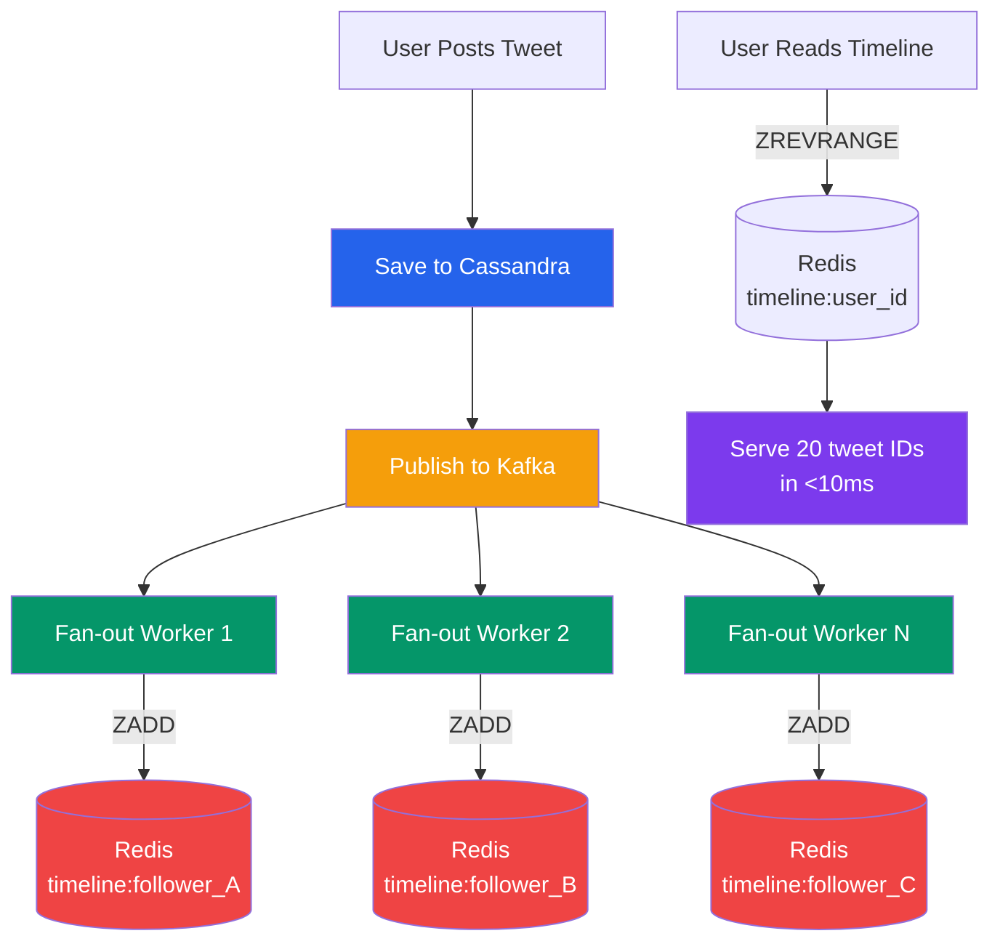

**Pros:**
- Timeline read is blazing fast — just a Redis sorted set lookup
- Handles 600K reads/sec with ease
- Pre-sorted — no merge required at read time

**Cons:**
- Write amplification: 1 tweet → N follower cache writes
- Celebrity problem: Lady Gaga (50M followers) → 50M Redis writes per tweet
- Wasted writes: inactive followers' caches get updated for no reason
- If Redis is down during fan-out, timelines are stale

---

### Model 2: Fan-Out on Read (Pull Model)

**Analogy:** Aap ek news aggregator hain. Aap tabhi news fetch karte ho jab user ne website open ki. Koi push nahi hua — sirf pull hua. Jaise Google News karta hai.

```
Flow when User posts a tweet:
──────────────────────────────
1. Tweet saved to Cassandra
2. Done. No fan-out at all.

Flow when User reads timeline:
───────────────────────────────
1. Fetch all followees: SELECT followee_id FROM follows WHERE follower_id = user_id
   → [user_1, user_2, ..., user_300]
2. For each followee: fetch their recent tweets
   SELECT * FROM tweets WHERE user_id IN (user_1, ..., user_300)
   ORDER BY created_at DESC LIMIT 20
3. Merge and sort in application code
4. Return top 20
```

**Pros:**
- No fan-out during write — celebrities are no problem at all
- Always fresh — no cache staleness
- Inactive users consume zero extra resources

**Cons:**
- Slow reads — querying 300 users' data at 600K reads/sec = 180M queries/sec
- Hard to merge-sort efficiently across multiple data sources
- High DB read load — requires massive read replicas
- Latency is unpredictable — depends on how many people you follow

---

### Model 3: Hybrid (Twitter's Actual Approach)

**Analogy:** Swiggy delivery model: regular restaurant orders are pre-cooked (ready fast), lekin ek special order aaya (celebrity tweet) toh use fresh banate hain when you order. Dono ka best combination.

This is what Twitter actually uses in production. The insight is: celebrities are the problem. For everyone else, push works fine.

```
Decision rule:
  If poster.follower_count < 1,000,000:
    → Fan-out on WRITE (push to all followers' caches)
  Else (celebrity):
    → NO fan-out. Store tweet only.
    → At READ time: merge celebrity tweets into timeline.
```

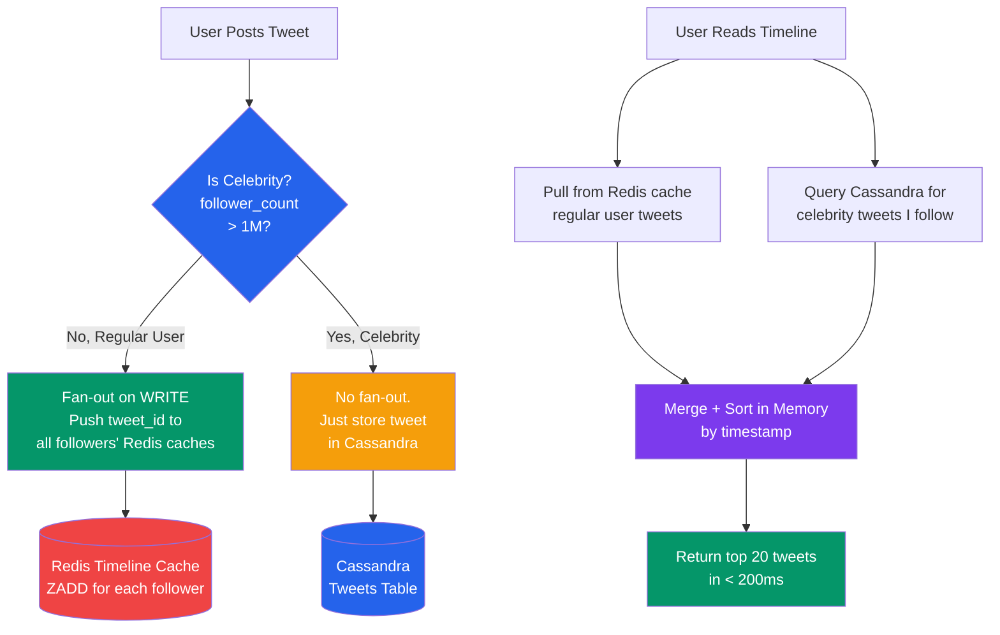

**Read-time merge for celebrity tweets:**
```
When user X (follows 280 regular users + 5 celebrities) loads timeline:

Step 1: ZREVRANGE timeline:{X} 0 99
  → 100 tweet IDs from regular followers (instant, Redis)

Step 2: For each celebrity C that X follows:
  → SELECT tweet_id FROM tweets WHERE user_id = C.user_id 
    AND created_at > NOW() - INTERVAL '48 hours'
    ORDER BY tweet_id DESC LIMIT 20
  (This is fast because celebrity's tweets_by_user partition is small)

Step 3: Merge both lists by timestamp in application memory
Step 4: Return top 20

Total time: <50ms (Redis is fast, celebrity query is indexed and cached)
```

---

### Fan-Out Comparison

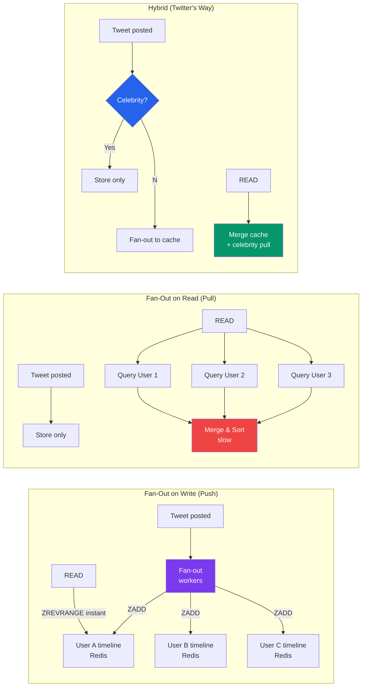

| Dimension | Push (Write) | Pull (Read) | Hybrid |
|-----------|-------------|-------------|--------|
| Write cost | High (N followers) | Low (1 write) | Medium |
| Read cost | Very Low (1 Redis read) | Very High (N queries) | Low |
| Celebrity problem | Severe | None | Managed |
| Staleness | Possible | None | Small for celebrities |
| Complexity | Medium | Medium | High |
| Twitter's choice | Partial | Partial | YES |

---

## 9. Timeline Cache with Redis

**Analogy:** Redis timeline is like your WhatsApp recent chats list — aapka phone already sorted rakhta hai, aapko har baar dhundhna nahi padta.

### Data Structure: Sorted Set (ZSET)

Redis Sorted Set is perfect for timelines because:
- It automatically maintains sort order (by score = timestamp)
- O(log N) insert
- O(log N + K) range query (get top K elements)
- Deduplication: same tweet_id can't appear twice

```bash
# Fan-out worker adds tweet to follower's timeline
ZADD timeline:follower_123  1750000001000  "tweet_id_9876"

# User reads their 20 latest tweets
ZREVRANGE timeline:12345  0  19
# Returns: ["tweet_id_9876", "tweet_id_9800", ...]

# Get tweets in a time range (e.g., after yesterday)
ZREVRANGEBYSCORE timeline:12345  +inf  1749913600000  LIMIT 0 20

# Remove oldest entries, keep only last 800
ZREMRANGEBYRANK timeline:12345  0  -801

# Count tweets in timeline
ZCARD timeline:12345
```

### Memory Management Strategy

```
Per user:
  800 tweet IDs × 16 bytes each = 12.8 KB

For 50M concurrent active users:
  50M × 12.8 KB = 640 GB

Redis Cluster setup:
  10 shards × 100 GB each = 1 TB capacity (comfortable headroom)

Eviction policy:
  - LRU eviction for users inactive > 30 days
  - When user returns after 30 days: rebuild timeline from Cassandra
  - Rebuilding: last 800 tweets from followees — one-time cold start
```

### Tweet Object Cache (Second Layer)

```
The sorted set stores only tweet_IDs.
We still need tweet content (text, user info, like count).

Second cache layer:
  Key:   tweet:{tweet_id}
  Type:  Redis Hash or JSON string
  Value: {user_id, username, content, media_urls, like_count, ...}
  TTL:   Hot tweet (< 1 hour old): 1 hour
         Normal tweet: 24 hours
         Old tweet: not cached, fetch from Cassandra

Read timeline flow:
  1. ZREVRANGE timeline:456 0 19
     → [id1, id2, ..., id20]

  2. MGET tweet:id1 tweet:id2 ... tweet:id20
     → Batch fetch from Redis (1 round-trip)

  3. For cache misses (say id7, id15 not in cache):
     SELECT * FROM tweets WHERE tweet_id IN (id7, id15)
     → Populate Redis cache

  4. Return merged result to user
```

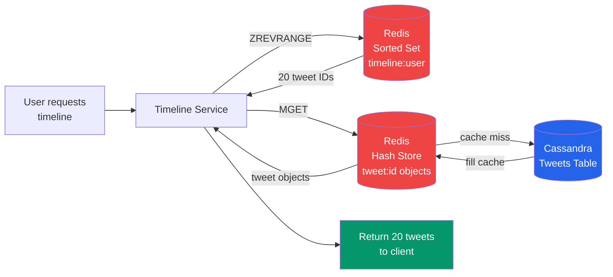

---

## 10. Tweet Storage — Cassandra vs PostgreSQL

**Analogy:** Cassandra is like a massive spreadsheet factory — it writes fast and scales infinitely, but you can only query it the way you designed it. PostgreSQL is like a smart filing system with a great index — flexible queries but needs careful tuning at massive scale.

### Why Cassandra for Tweets?

Tweets have very specific access patterns:
1. Write tweet (high volume, constant)
2. Read tweets by user ID (for profile timeline)
3. Read tweet by tweet ID (for detail page)
4. Read by tweet IDs batch (for timeline hydration)

Cassandra excels at:
- High write throughput (log-structured storage, no random I/O)
- Linear horizontal scaling (add nodes, linearly increase capacity)
- Time-series data (tweets are naturally time-ordered by tweet_id)
- Geographic replication (multi-datacenter built-in)

```
Cassandra partition design for tweets:
  partition key: user_id
  clustering key: tweet_id DESC (snowflake = time-sorted)

Means: "Give me @ViratKohli's last 20 tweets" = single partition scan
       Fast, no joins, no coordination

Cassandra write path:
  1. Write to commit log (sequential, fast)
  2. Write to memtable (in-memory)
  3. Flush to SSTable periodically
  4. Compaction runs in background

→ ~50,000 writes/sec per node easily achievable
```

### PostgreSQL for User Data

Users table stays in PostgreSQL because:
- You need ACID transactions (follow/unfollow must be consistent)
- Follower counts need atomic increments
- User authentication data needs strong consistency
- You need flexible queries (search by username, filter by verified status)

```sql
-- These operations need ACID — only PostgreSQL:
BEGIN;
  INSERT INTO follows (follower_id, followee_id) VALUES (A, B);
  UPDATE users SET following_count = following_count + 1 WHERE user_id = A;
  UPDATE users SET follower_count = follower_count + 1 WHERE user_id = B;
COMMIT;
```

### Storage Architecture Decision

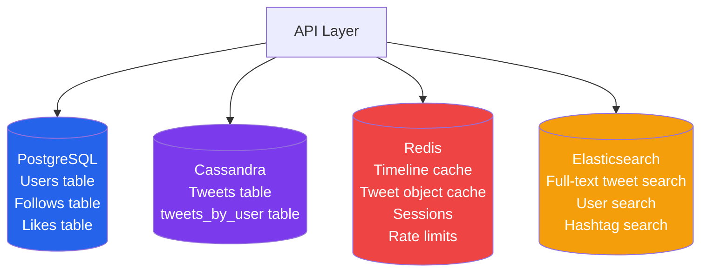

| Data | Store | Why |
|------|-------|-----|
| Users, Follows | PostgreSQL | ACID needed, relational |
| Tweets | Cassandra | Write-heavy, time-series |
| Timelines | Redis Sorted Set | Ultra-fast reads |
| Tweet objects | Redis Hash | Cache layer |
| Full-text search | Elasticsearch | Inverted index |
| Media files | S3 | Object storage |
| Sessions, rate limits | Redis | TTL-based, ephemeral |

---

## 11. Media Storage — S3 + CDN

**Analogy:** YouTube ka video aapke ghar ke paas ek server mein stored hota hai (CDN edge node). Jab aap video play karte ho, wo Mumbai ke server se aata hai, USA se nahi. Isliye buffer nahi hota. Yahi CDN karta hai.

### Why You Can't Store Media on Your App Servers

```
Scale check:
  600 tweets/sec × 30% with media × 500 KB avg = 90 MB/sec uploads
  = 5.4 GB/min = 324 GB/hour

Your app servers handling 324 GB/hour of uploads:
  → You'd need 100s of beefy servers just for uploads
  → Network bandwidth cost is insane
  → Single datacenter means US user uploads slow for India users

Solution: Presigned S3 URLs — client uploads DIRECTLY to S3
  → Your servers never touch media bytes
  → S3 handles unlimited parallel uploads
  → CDN distributes to edge nodes globally
```

### Media Upload Flow

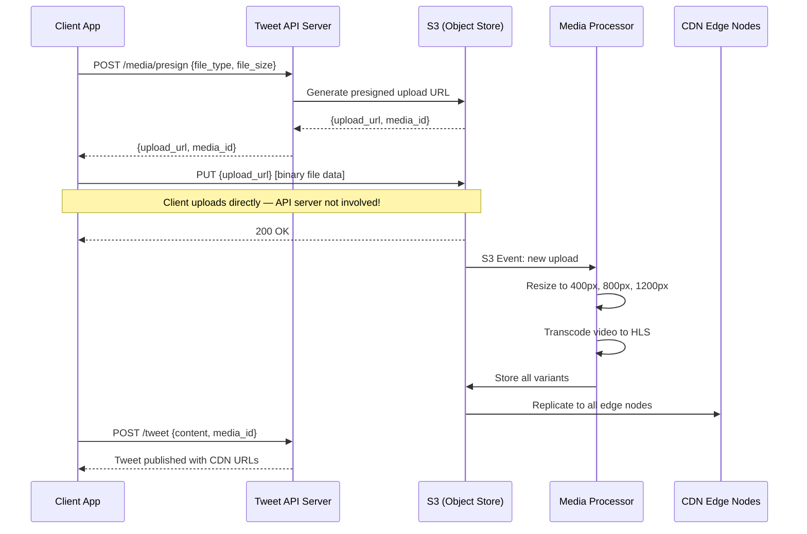

### CDN Strategy

```
What CDN does:
  - Caches content at 200+ edge locations worldwide
  - User in Mumbai gets content from Mumbai edge (5ms)
  - Without CDN: Mumbai → AWS US-East → Mumbai (150ms roundtrip)

Cache TTLs:
  Profile pictures:   TTL = 7 days (rarely change)
  Tweet images:       TTL = 1 year (never change once posted)
  Tweet videos:       TTL = 1 year (immutable)
  Profile HTML pages: TTL = 0 (always fresh)

Why tweet media is immutable:
  Once tweet_id:media_id URL is set, it never changes.
  The URL itself is the cache key.
  CDN can cache forever → massive bandwidth savings.
```

---

## 12. Search — Elasticsearch

**Analogy:** Google search ko socho — aap koi bhi word type karo, toh instantly relevant pages milte hain. Woh ek huge inverted index maintain karta hai: har word ke liye, "yeh word kahan kahan aaya" ka record. Elasticsearch yehi karta hai tweets ke liye.

### Why Not SQL LIKE Queries?

```sql
-- This query is CATASTROPHICALLY slow on 900 billion tweets:
SELECT * FROM tweets WHERE content LIKE '%#IPL%' ORDER BY created_at DESC;

-- Why slow?
-- LIKE with leading wildcard = full table scan
-- 900 billion rows × 300 bytes = can't even read this fast
-- No index helps with LIKE '%...'
```

### Elasticsearch Architecture

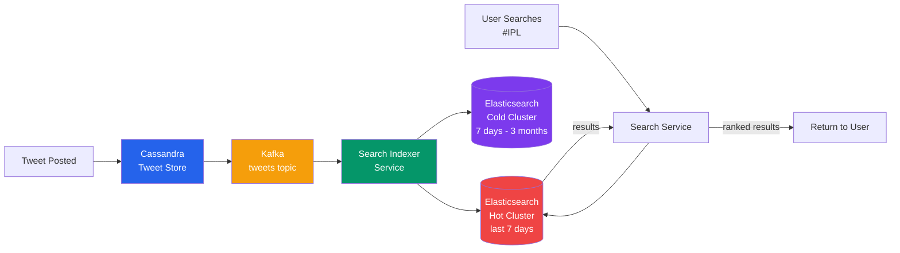

### Elasticsearch Index Design

```json
// Tweet document in Elasticsearch
{
  "tweet_id":   "1891234567890",
  "user_id":    "9876543",
  "username":   "virat.kohli",
  "content":    "What a match! #IPL2025 #MIvsRCB @rohitsharma45",
  "hashtags":   ["IPL2025", "MIvsRCB"],
  "mentions":   ["rohitsharma45"],
  "media_count": 1,
  "like_count":  456789,
  "retweet_count": 23456,
  "created_at": "2025-04-15T20:30:00Z",
  "lang": "en"
}

// Index mapping (field types tell ES how to index each field)
{
  "mappings": {
    "properties": {
      "content":   {"type": "text", "analyzer": "standard"},
      "hashtags":  {"type": "keyword"},  // exact match
      "username":  {"type": "keyword"},
      "created_at":{"type": "date"},
      "like_count":{"type": "integer"}
    }
  }
}
```

### Search Query with Recency Boost

```json
// "Show latest tweets about #IPL, prefer popular ones"
{
  "query": {
    "bool": {
      "must": [
        {"match": {"content": "#IPL"}}
      ],
      "should": [
        {
          "range": {
            "created_at": {
              "gte": "now-1h"
            }
          }
        }
      ]
    }
  },
  "sort": [
    {"created_at": {"order": "desc"}},
    {"like_count": {"order": "desc"}}
  ],
  "size": 20
}
```

### Hot vs Cold Cluster

```
Why separate hot and cold?

Hot cluster (SSD, high memory):
  - Last 7 days of tweets
  - Users mostly search recent content
  - Fast response: <50ms

Cold cluster (HDD, lower cost):
  - 7 days to 3 months old
  - Slower response: 200-500ms
  - Much cheaper per GB

Archive (S3 + AWS Athena):
  - Older than 3 months
  - Batch analytics only
  - No real-time search
  - Very cheap

99% of searches hit hot cluster → cost-effective architecture
```

---

## 13. Trending Topics

**Analogy:** Imagine aap ek city mein hain. Alag alag mohalle mein alag topics popular hain. Mumbai mein #IPL trend kar raha hai, Delhi mein #Parliament. Twitter ka trending system yehi per-region, per-time-window counting karta hai.

### How Trending Works — Sliding Window Counter

```
Naive approach (wrong):
  COUNT(hashtags) WHERE created_at > NOW() - 1 HOUR
  GROUP BY hashtag
  ORDER BY count DESC
  LIMIT 50;

Problem: 600 tweets/sec × 3600 seconds = 2.16M tweets in the window
         Running this query every second on live data = DB killer

Right approach: Redis ZINCRBY with time-bucketed sliding window
```

### Redis-Based Trending Implementation

```bash
# When tweet with #IPL is posted:
# Increment count in current 1-minute bucket
ZINCRBY trending:global:bucket:{current_minute}  1  "IPL"
ZINCRBY trending:IN:bucket:{current_minute}       1  "IPL"   # India-specific
ZINCRBY trending:IN:MH:bucket:{current_minute}    1  "IPL"   # Maharashtra

# Set expiry on each bucket (keep last 60 minutes)
EXPIRE trending:global:bucket:{current_minute}  3600

# To get top trending right now (aggregate last 60 buckets):
# (Run this every 60 seconds, cache the result)
buckets = [trending:global:bucket:{minute} for minute in last_60_minutes]
ZUNIONSTORE trending:global:current 60 {buckets}
ZREVRANGE trending:global:current 0 49  → Top 50 hashtags

# Cache this top-50 list for 60 seconds
SET trending:global:cached  {json_result}  EX 60
```

### Trending Topics Flow

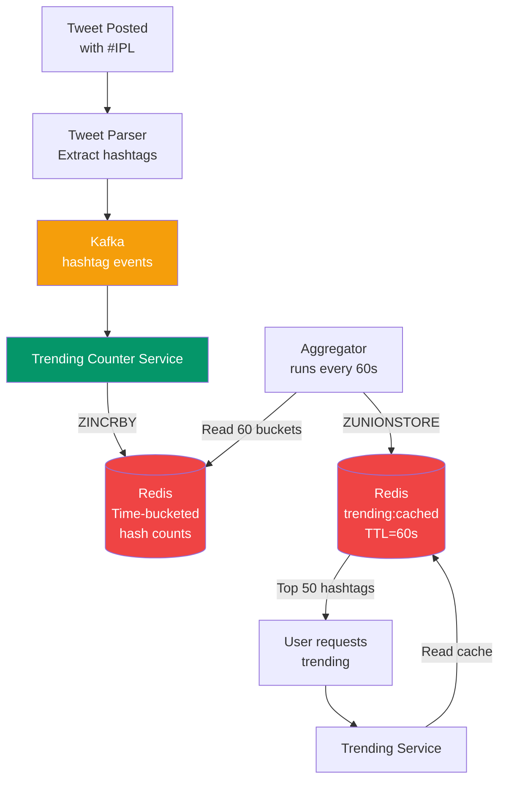

### Geographic Trending

```
Key hierarchy:
  trending:global          → worldwide
  trending:IN              → India
  trending:IN:MH           → Maharashtra
  trending:IN:MH:MUM       → Mumbai

How Twitter determines your location:
  1. Profile location (set by user)
  2. GPS from mobile app (if permission granted)
  3. IP geolocation (fallback)

Scale:
  200 countries × 60 buckets × 1000 trending hashtags
  = 12 million Redis keys (manageable)
```

---

## 14. Notifications

**Analogy:** WhatsApp notification system socho — jab koi aapko message karta hai, aapka phone buzz karta hai chahe app open ho ya band. Yahi push notification hai. Twitter mein yeh notification service karta hai.

### Notification Types and Priority

```
High priority (real-time):
  - Someone mentioned you (@virat)
  - Reply to your tweet
  - New follower (famous person)

Medium priority (near real-time, batched):
  - Like on your tweet
  - Retweet of your tweet
  - New follower (regular user)

Low priority (daily digest):
  - "You have 45 new notifications since yesterday"
  - Account activity summaries
```

### Notification Architecture

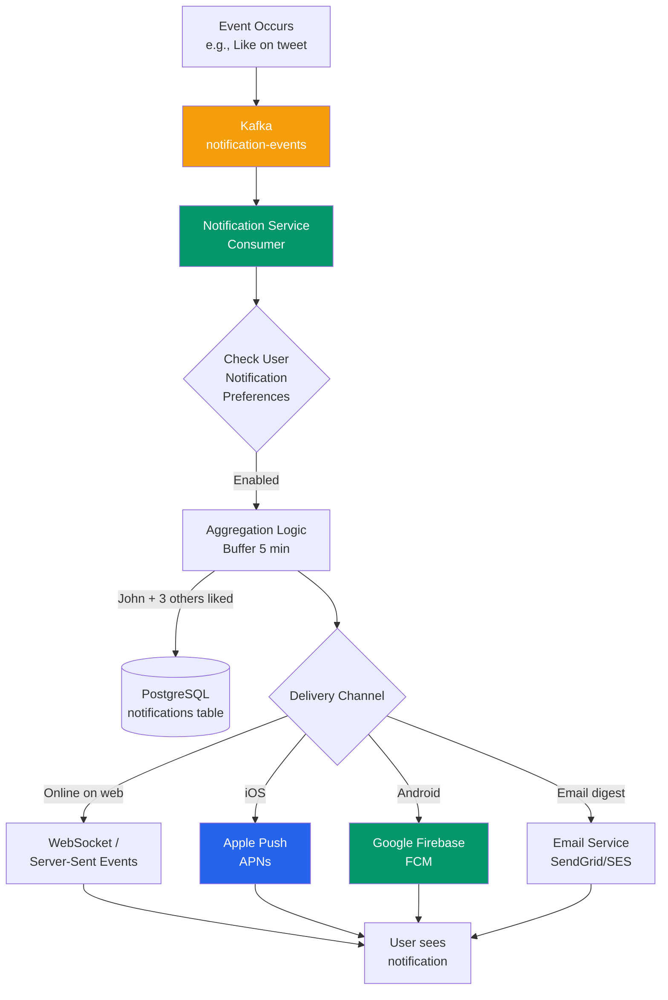

### Notification Storage Schema

```sql
CREATE TABLE notifications (
    notification_id  BIGINT PRIMARY KEY,     -- Snowflake ID
    recipient_id     BIGINT NOT NULL,         -- who gets notified
    type             VARCHAR(50) NOT NULL,    -- 'like', 'follow', 'mention', 'retweet', 'reply'
    actor_id         BIGINT,                  -- who did the action
    entity_id        BIGINT,                  -- which tweet/follow (context)
    is_read          BOOLEAN DEFAULT FALSE,
    created_at       TIMESTAMPTZ DEFAULT NOW()
);

CREATE INDEX idx_notif_recipient ON notifications(recipient_id, created_at DESC);
```

### Unread Count — Redis Counter

```bash
# Fast unread count (don't count rows, use Redis counter)
INCR unread_notif:{user_id}

# When user opens notifications, mark all read:
SET unread_notif:{user_id}  0
UPDATE notifications SET is_read=true WHERE recipient_id = user_id AND is_read=false

# Badge count on mobile: just read unread_notif:{user_id} from Redis
GET unread_notif:12345  → "7"
```

---

## 15. Full Architecture Diagram

Here is the complete system — every component connected. Iss diagram ko samajh lo, Twitter's architecture samajh lo.

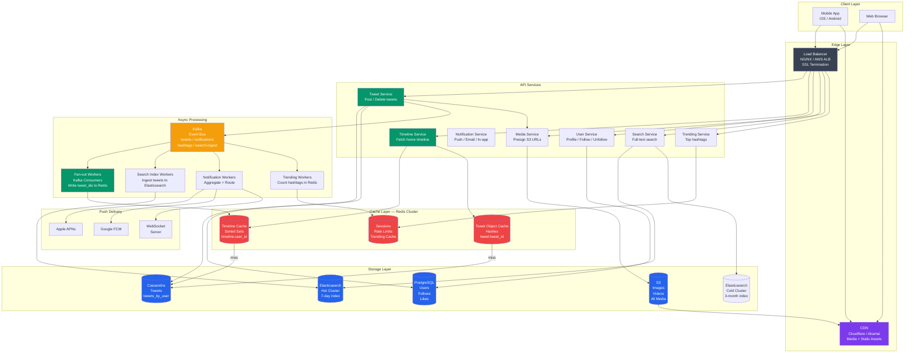

---

## 16. Celebrity Tweet Problem — Deep Dive

**Yeh problem kyun hai?** Normal users ke liye fan-out on write kaam karta hai. But social networks follow a power law distribution — 1% of users have 99% of followers. Lady Gaga, Elon Musk, BTS — unka ek tweet literally 50-100 million cache writes trigger karta hai.

### The Math

```
Normal user case:
  User X has 300 followers
  1 tweet → 300 Redis ZADD operations
  At 100K writes/sec → 0.003 seconds delay
  → Totally fine

Celebrity case (Lady Gaga: 50M followers):
  1 tweet → 50,000,000 Redis ZADD operations
  At 100K writes/sec → 500 seconds = 8+ MINUTES of delay
  → Completely unacceptable

Scale of celebrity problem:
  At 600 tweets/sec total:
  If 10 celebrities tweet in same second:
  10 × 50M = 500M Redis writes needed per second
  → This would saturate any Redis cluster
```

### Solution Deep Dive: The Hybrid Approach

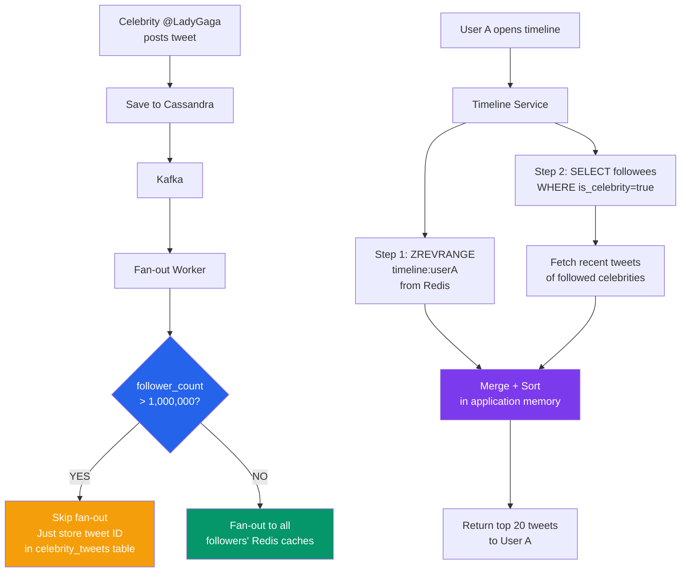

### Identifying Celebrities — Dynamic Threshold

```python
# Not a static list — use follower_count from user table
CELEBRITY_THRESHOLD = 1_000_000  # 1 million followers

def should_fanout(user_id):
    user = get_user(user_id)  # from cache
    return user.follower_count < CELEBRITY_THRESHOLD

# What about edge cases?
# New celebrity: user just crossed 1M followers
# → Their next tweet uses no fan-out
# → Previous tweets already fanned out (fine)

# User unfollowed by many (now below threshold):
# → Gradually shift to fan-out model
# → Use a hysteresis band: celebrity if > 1M, ex-celebrity if < 900K
```

### Solution 2: Async Fan-Out with Priority Queues

```
Instead of skipping fan-out entirely, spread it over time:

High priority queue (regular users, < 10K followers):
  → Fan out immediately (<1 second)

Medium priority queue (popular users, 10K-1M followers):
  → Fan out within 5-30 seconds

Low priority queue (celebrities, > 1M followers):
  → Fan out over 5-10 minutes (acceptable for eventual consistency)
  → Use "your timeline may be slightly delayed for high-profile accounts"

Implementation:
  3 Kafka consumer groups, each with different consumer counts
  High-priority: 200 consumers (large pool)
  Medium-priority: 50 consumers
  Low-priority: 10 consumers (slow drip, don't overload)
```

### Solution 3: Fan-Out Only to Active Followers

```
Observation: 40-60% of Twitter followers are inactive accounts
  (Bots, abandoned accounts, users who haven't logged in for years)

Optimization:
  Only fan-out to followers who were active in last 30 days

Check: SELECT follower_id FROM follows 
       JOIN users ON users.user_id = follows.follower_id
       WHERE followee_id = celebrity_id
       AND users.last_active > NOW() - INTERVAL '30 days'

Effect on celebrity fan-out:
  Lady Gaga: 50M followers → 40% active = 20M active followers
  → Cuts fan-out writes in half
  
Inactive users returning:
  On login → rebuild timeline from scratch
  Fetch tweets from all followees, last 48 hours
  Populate Redis cache → normal operation resumes
```

### Twitter's Actual Production Approach (Combined)

```
Three-layer defense against celebrity fan-out:

Layer 1: Celebrity detection
  If follower_count > threshold → no fan-out, pull-on-read at merge time

Layer 2: Active follower filtering
  For semi-popular users (10K-1M followers):
  Fan-out only to active followers (active in last 30 days)

Layer 3: Rate-limited async fan-out
  For borderline cases: fan-out at controlled rate via priority queues
  Prevents any single tweet from spiking the fan-out workers

Result: Fan-out workers handle predictable, manageable write volumes
        Celebrity tweets appear in timelines with <5 second delay (merge at read)
        System stays stable even during breaking news
```

---

## 17. Scaling Bottlenecks and Solutions

### Bottleneck 1: Fan-Out Workers During Viral Events

```
Scenario: Breaking news tweet by @BBCBreaking (15M followers)
          During IPL final with 10x tweet volume
          
Problem: Fan-out queue backlog builds up
         Followers see tweets 10 minutes late

Solutions:
  a) Scale fan-out workers horizontally (add more Kafka consumers)
  b) Increase Kafka partitions (more parallel processing)
  c) Fan-out only to active followers (reduce work per tweet)
  d) Celebrity threshold reduces worst-case fan-outs automatically
```

### Bottleneck 2: Redis Memory at Scale

```
At 300M DAU × 12.8 KB per timeline = 3.84 TB
Redis Cluster with 40 nodes × 100 GB = 4 TB capacity

When this isn't enough:
  Option A: Evict inactive timelines (LRU eviction)
            → Users inactive for 30 days: evict their timeline
            → On return: rebuild from Cassandra (cold start, 200-500ms)

  Option B: Compress tweet ID storage
            Delta encoding: store diff between consecutive tweet IDs
            Sequential tweet IDs differ by small amounts
            → Can compress 8 bytes to 3-4 bytes per entry
            → 40-50% memory reduction

  Option C: Reduce timeline depth
            Instead of 800 entries, keep only 200
            For older tweets: always fetch from Cassandra
            Trade: small increase in Cassandra reads for memory savings
```

### Bottleneck 3: Cassandra Hotspots

```
Problem: Celebrity user's partition (partition key = user_id) gets hammered
  @ViratKohli tweets → millions of users fetch his tweets_by_user partition
  → All reads go to same Cassandra node

Solutions:
  a) Replication factor 3: reads spread across 3 replicas
  b) Additional L2 cache: cache celebrity's recent tweets in Redis
     Key: celebrity_tweets:{celebrity_id}
     TTL: 60 seconds
     → 1 million reads/sec on celebrity tweets → all from Redis, not Cassandra

  c) Read replicas: designate extra Cassandra nodes for celebrity read traffic
```

### Bottleneck 4: PostgreSQL Follow Graph at 60B Rows

```
60 billion follow relationships don't fit well in PostgreSQL:
  Table scan for "get all followers of user_id": full index scan
  With 60B rows, even indexed queries get slow

Options:
  a) Shard follows table by followee_id
     All followers of celebrity X → same shard
     Good for fan-out (need all followers of one user)
     But cross-shard queries for "who does user X follow?" get harder

  b) Move to graph database (Neo4j)
     Designed for relationship traversal
     Tradeoff: new tech, more complex ops

  c) Cache follow lists in Redis
     follows:celebrity_123 → Redis Set of all follower IDs
     Updated on follow/unfollow events
     Fan-out workers read from Redis, not PostgreSQL
     Tradeoff: memory heavy, but fast
```

---

## 18. Trade-offs Summary Table

| Design Decision | Option A | Option B | Twitter's Choice | Why |
|-----------------|----------|----------|-----------------|-----|
| Timeline generation | Fan-out on Write | Fan-out on Read | **Hybrid** | Read speed vs celebrity problem |
| Celebrity handling | Fan-out everyone | Skip celebrities | **Skip + merge at read** | Fan-out is mathematically impossible at 50M scale |
| Tweet ID scheme | Auto-increment | UUID | **Snowflake (64-bit)** | Time-sortable, no coordinator, compact |
| Tweet store | PostgreSQL | Cassandra | **Cassandra** | Write volume, time-series fit |
| User store | NoSQL | PostgreSQL | **PostgreSQL** | ACID needed for follow operations |
| Timeline cache | Memcached | Redis Sorted Set | **Redis Sorted Set** | Built-in time-ordering |
| Media serving | App servers | S3 + CDN | **S3 + CDN** | 10 TB/day cannot go through app servers |
| Search engine | MySQL LIKE | Elasticsearch | **Elasticsearch** | Full-text at 900B tweet scale |
| Consistency | Strong | Eventual | **Eventual** | 1-5s delay acceptable, saves massive complexity |
| Event bus | Synchronous RPC | Kafka | **Kafka** | Decouples write, fan-out, search, notifications |

---

## 19. Common Interview Questions

### Q1: "Design Twitter's home timeline"
**Framework:** Clarify → Estimate → High-level → Fan-out deep-dive → Redis → Trade-offs
```
Killer moves:
1. Immediately identify it as a fan-out problem (shows expertise)
2. Calculate: 600 tweets/sec × 200 followers = 120K writes/sec
3. Propose hybrid before being asked (shows you know real-world solution)
4. Draw: tweet → Kafka → fan-out workers → Redis sorted set
5. Quantify memory: 50M active users × 12.8 KB = 640 GB Redis
```

### Q2: "How does Twitter handle celebrity users like Elon Musk?"
```
Answer structure:
1. State the problem with math: 100M followers → 100M Redis writes per tweet
2. Naive solution (fan-out) breaks at this scale — explain why
3. Twitter's solution: celebrity threshold (>1M followers)
4. How merge-at-read works: pull celebrity tweets at timeline read time
5. Additional optimizations: active followers only, priority queues
```

### Q3: "How would you generate unique tweet IDs?"
```
Answer:
- NOT auto-increment (single point of failure, coordination needed)
- NOT UUID (not sortable by time, 128 bits)
- Snowflake IDs (Twitter's own invention):
  41 bits timestamp + 5 bits datacenter + 5 bits machine + 12 bits sequence
  → Time-sortable, globally unique, no coordination needed, 64-bit compact
```

### Q4: "How does tweet search work?"
```
Answer:
1. Tweets flow: Cassandra → Kafka → Search Indexer → Elasticsearch
2. Elasticsearch maintains inverted index across all tweet text
3. Hot cluster (SSD, last 7 days) vs Cold cluster (HDD, up to 3 months)
4. Search query with recency boost and like_count boost
5. Scale: index only recent tweets, older tweets in cheaper storage
```

### Q5: "How do trending topics work?"
```
Answer:
1. Extract hashtags from every tweet as it's posted
2. Redis sorted set with time-bucketed counters
3. ZINCRBY trending:global:bucket:{minute} 1 "#hashtag"
4. Aggregate last 60 buckets every 60 seconds → ZUNIONSTORE
5. Cache result for 60 seconds, serve from cache
6. Geographic scoping: trending:IN, trending:IN:MH, etc.
```

### Q6: "What happens if Redis goes down?"
```
Answer:
1. Timeline service falls back to Cassandra (slower but available)
2. Fan-out workers retry with exponential backoff via Kafka replay
3. Circuit breaker prevents cascading failure to other services
4. Redis persistence (AOF/RDB) enables fast recovery
5. Redis Sentinel / Cluster provides automatic failover
6. Even with 2-minute Redis outage: Kafka has buffered events, fan-out resumes
```

### Q7: "How do you handle the storage for 5 years of tweets?"
```
Answer:
1. Text: 600 tweets/sec × 300 bytes × 86400 × 365 × 5 = ~27 TB (manageable)
2. Media: 30% of 51.8M tweets/day × 500 KB = ~7 TB/day → ~12 PB over 5 years
3. Storage hierarchy:
   - Hot (Cassandra): last 3 months tweets
   - Warm (S3 + Parquet): 3 months - 3 years
   - Cold (Glacier): 3+ years
4. Media: S3 standard → S3-IA after 1 year → Glacier after 3 years
5. Content-addressing: same image uploaded twice = stored once
```

### Q8: "How do notifications scale?"
```
Answer:
1. Kafka decouples notification events from delivery
2. Aggregation: buffer likes for 5 minutes before sending "3 others liked..."
3. Delivery: APNs (iOS), FCM (Android), WebSocket (web), Email (digest)
4. Priority: mentions > replies > likes > follows
5. Rate limiting: don't spam user with 1000 individual notifications
6. Unread count: Redis counter (O(1) read/write), not DB count query
```

---

## 20. Key Takeaways

```
╔══════════════════════════════════════════════════════════════════════╗
║                   TWITTER DESIGN — KEY TAKEAWAYS                    ║
╠══════════════════════════════════════════════════════════════════════╣
║                                                                      ║
║  1. FAN-OUT IS THE CORE PROBLEM                                      ║
║     Twitter is 1000:1 read-heavy. Pre-compute timelines.            ║
║     Fan-out on write → fast reads, but celebrity problem.           ║
║                                                                      ║
║  2. HYBRID IS THE ANSWER                                             ║
║     Regular users: push tweet to all followers' Redis caches.       ║
║     Celebrities (>1M followers): skip fan-out, merge at read.       ║
║                                                                      ║
║  3. SNOWFLAKE IDs ARE NON-NEGOTIABLE                                 ║
║     64-bit = timestamp + datacenter + machine + sequence.           ║
║     Time-sortable. No central coordinator. No UUID.                 ║
║                                                                      ║
║  4. REDIS SORTED SET IS TIMELINE'S HOME                              ║
║     ZADD timeline:{uid} {timestamp} {tweet_id}                      ║
║     ZREVRANGE for reads. Trim to last 800. Evict inactive.          ║
║                                                                      ║
║  5. CASSANDRA FOR TWEETS, POSTGRESQL FOR USERS                       ║
║     Tweets = write-heavy time-series → Cassandra                    ║
║     Users/Follows = ACID needed → PostgreSQL                        ║
║                                                                      ║
║  6. KAFKA DECOUPLES EVERYTHING                                       ║
║     Tweet post → Kafka → fan-out + search + notifications           ║
║     Isolated failure, independent scaling, replay on crash.         ║
║                                                                      ║
║  7. S3 + CDN FOR ALL MEDIA — NO EXCEPTIONS                          ║
║     7+ TB/day cannot go through your app servers.                   ║
║     Presigned URLs. Client uploads direct to S3.                    ║
║                                                                      ║
║  8. ELASTICSEARCH FOR SEARCH                                         ║
║     Inverted index over 900B tweets.                                ║
║     Hot cluster (7 days, SSD) + Cold cluster (3 months, HDD).      ║
║                                                                      ║
║  9. EVENTUAL CONSISTENCY IS ACCEPTABLE                               ║
║     1-5 second delay for new tweets in timeline = OK.               ║
║     This saves enormous complexity vs strong consistency.           ║
║                                                                      ║
║  10. CELEBRATE THE CELEBRITY PROBLEM IN YOUR ANSWER                  ║
║      It shows you understand real Twitter, not just theory.         ║
║      Know the math: 50M followers × 1 tweet = why push fails.      ║
║                                                                      ║
╚══════════════════════════════════════════════════════════════════════╝
```

### Quick Reference: The 30-Second Twitter Pitch

> "Twitter's core challenge is fan-out at scale. We pre-compute home timelines using Redis sorted sets, populated via Kafka-driven fan-out workers. For regular users we push tweet IDs to all followers' caches on write. For celebrities (>1M followers), we skip the fan-out and merge their tweets at read time. Tweets are stored in Cassandra, user data in PostgreSQL, media in S3 behind a CDN. Search runs on Elasticsearch. All events flow through Kafka. The system is eventually consistent — a 1-5 second delay for new tweets in timelines is acceptable."

---

### Mental Model: Twitter as Three Systems in One

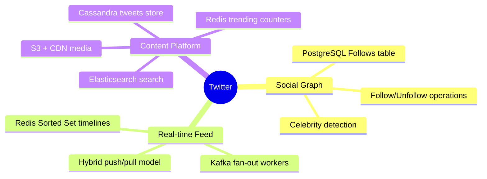

---

*Master the fan-out problem and you've mastered Twitter. Master Twitter and you've mastered distributed systems thinking at internet scale.*
