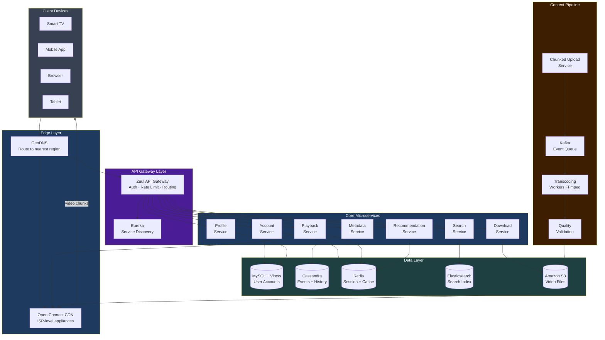
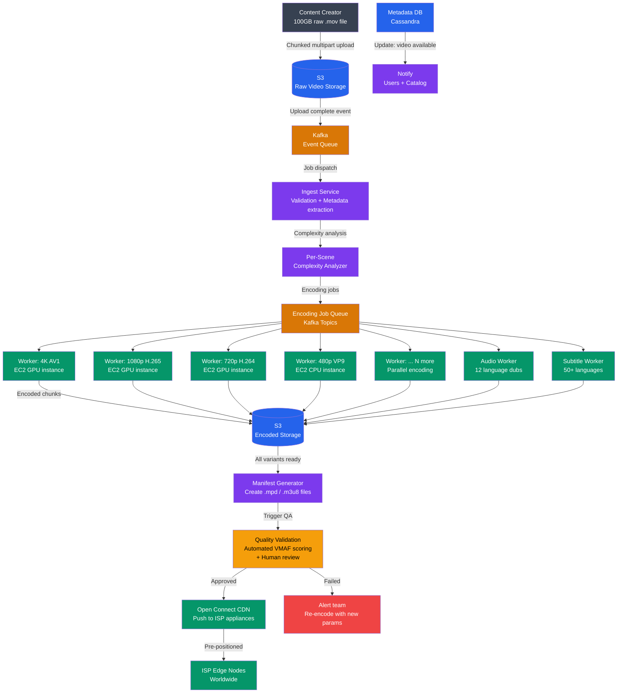
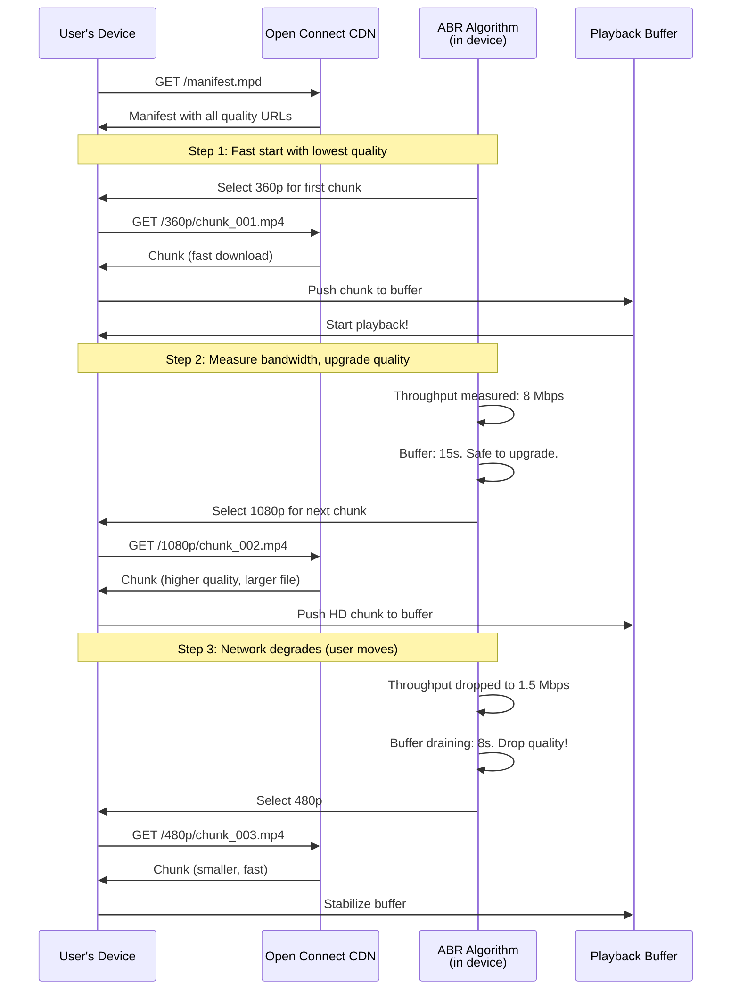
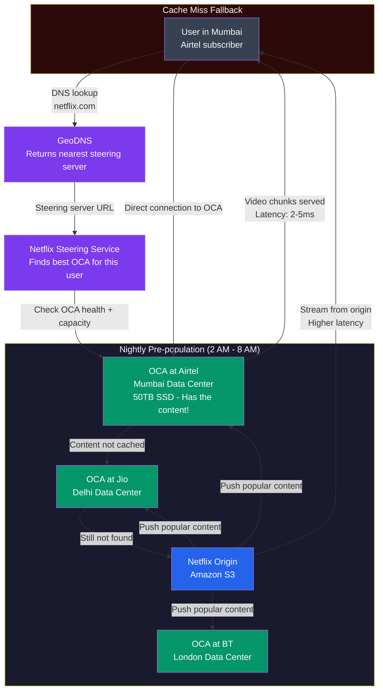
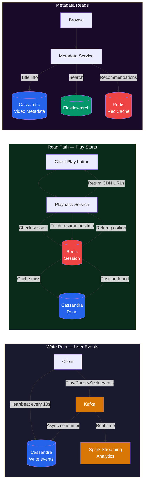
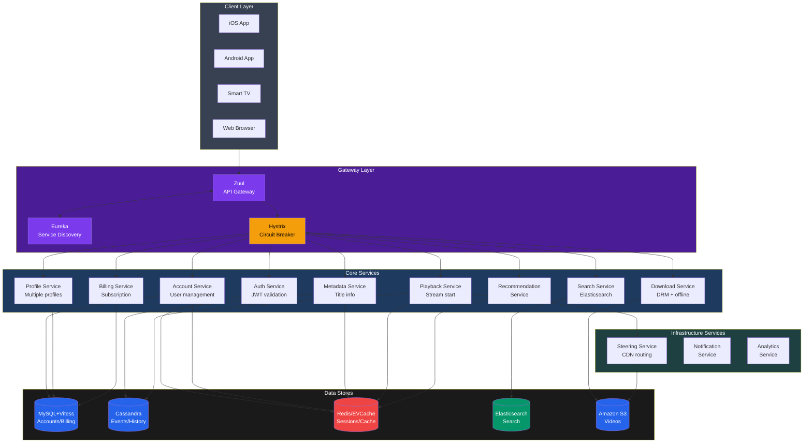
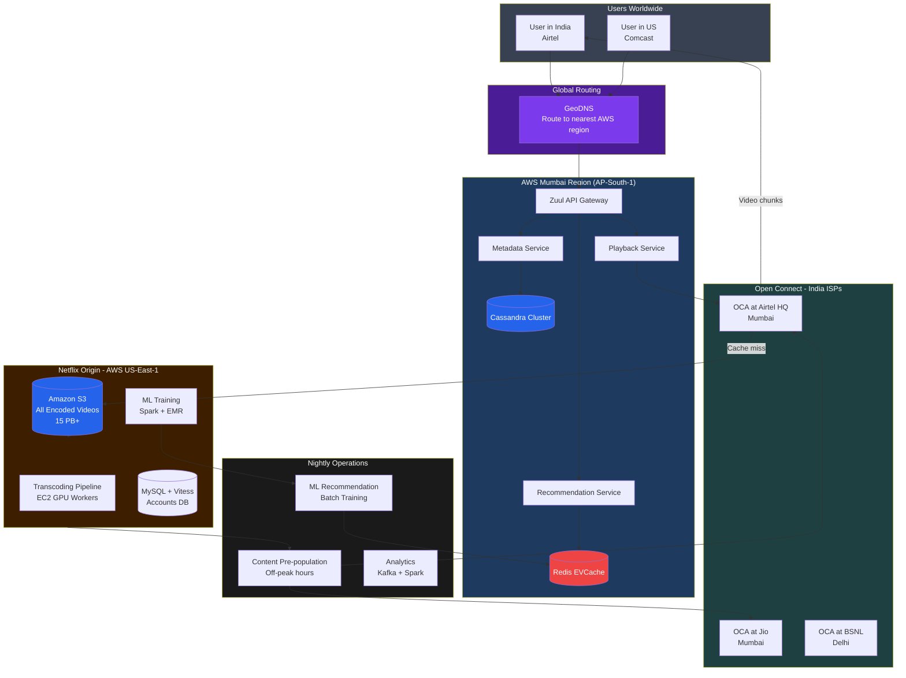

# System Design Case Study: Design Netflix

> "Netflix pe video start hone mein 2 seconds se zyada lag jaaye toh 15% users chhod dete hain. Yeh 2-second window — poori Netflix engineering ki foundation hai."

---

## Table of Contents

1. [Scale and Context](#scale-and-context)
2. [Functional Requirements](#functional-requirements)
3. [Non-Functional Requirements](#non-functional-requirements)
4. [Capacity Estimation](#capacity-estimation)
5. [High-Level Architecture](#high-level-architecture)
6. [Video Upload and Processing Pipeline](#video-upload-and-processing-pipeline)
7. [Streaming with Adaptive Bitrate (ABR)](#streaming-with-adaptive-bitrate-abr)
8. [CDN Strategy: Netflix Open Connect](#cdn-strategy-netflix-open-connect)
9. [Database Architecture](#database-architecture)
10. [Recommendation Engine](#recommendation-engine)
11. [Search](#search)
12. [User Profiles and Continue Watching](#user-profiles-and-continue-watching)
13. [Offline Downloads](#offline-downloads)
14. [Microservice Architecture](#microservice-architecture)
15. [Chaos Engineering](#chaos-engineering)
16. [Common Interview Questions](#common-interview-questions)
17. [Key Takeaways](#key-takeaways)

---

## Scale and Context

Pehle samjhte hain ki hum kis scale ki baat kar rahe hain. Numbers dekho — yeh suno, soch mat:

```
Netflix by the numbers (2024–2025):
──────────────────────────────────────────
Subscribers:           220M+ globally
Daily streaming:       250M+ hours of content
Global bandwidth:      ~15% of ALL internet traffic
Content library:       17,000+ titles
CDN nodes:             Open Connect Appliances in 1,000+ ISPs
Microservices:         1,000+ services
Encoding workers:      Every 1 movie → 1,200+ output files
Uptime target:         99.99% (52 minutes downtime/year allowed)
Countries served:      190+
Video start time SLA:  < 2 seconds
Peak concurrent:       22M+ simultaneous streams
```

**Analogy:** Socho tumhara shahar ka water supply system. Ek jagah se paani aata hai (reservoir), phir puri city mein pipes se jaata hai. Netflix bhi same kaam karta hai — ek jagah videos stored hain, phir poori duniya mein deliver hote hain. Lekin paani constant flow hota hai, video mein tum quality adjust kar sakte ho bandwidth ke hisaab se. Aur Netflix ka bandwidth use poori duniya ke internet traffic ka 15% hai — yeh ek staggering number hai.

---

## Functional Requirements

**Analogy:** Ek Blockbuster video rental shop imagine karo (purana zamana). Wahan aap:
- Shelf pe browse karte the
- DVD utha ke counter pe le jaate the
- Ghar jaake TV pe lagaate the

Netflix ne yahi sab digitize kiya — bas ab DVD nahin, bits hain. Aur ek hi account se 5 log alag alag cheez dekh sakte hain simultaneously.

### Requirements jo hum design karenge:

**User-facing (Consumer) Features:**
1. **Browse catalog** — thumbnails, genres, featured content
2. **Stream videos** — smooth playback, adaptive quality
3. **Search content** — by title, genre, actor, director
4. **Personalized recommendations** — jo user ko pasand aaye
5. **User profiles** — ek account pe multiple profiles (family use)
6. **Continue watching** — jahan chhoda wahan se resume, kisi bhi device pe
7. **Downloads for offline** — airplane mein bhi dekh sako

**Admin/Content (Producer) Features:**
1. **Upload videos** — raw master files, possibly 100GB+
2. **Encoding pipeline** — multiple resolutions aur codecs
3. **Content metadata management** — title, description, cast, subtitles
4. **Analytics** — viewership data, drop-off rates

### What we are NOT designing:
- Billing / subscription management
- Content licensing and DRM (we'll mention it briefly)
- Live streaming (Netflix primarily VOD — Video on Demand)
- Social features (sharing, reviews)

---

## Non-Functional Requirements

Yeh requirements define karti hain ki system **kitna achha perform karna chahiye** — not just "kya kare" but "kitna well kare."

| Requirement | Target | Why It Matters |
|---|---|---|
| Video start latency | < 2 seconds | 15% users abandon after 2s wait |
| Availability | 99.99% (52 min/year downtime) | Global users, 24/7 service |
| Concurrent streams | 22M+ at peak | Must scale horizontally |
| Adaptive streaming | Smooth quality changes | Variable network conditions globally |
| Consistency | Eventual OK for most features | Resume position can lag ~10 seconds |
| Durability | Videos stored forever | Content is expensive to produce |
| Global latency | < 50ms to nearest CDN | Low-latency is key for fast start |
| Security / DRM | Content protection | Prevent piracy of licensed content |

**Interview tip:** Yeh requirements immediately define karte hain ki tumhara system **read-heavy** hai (streaming >> uploading), **availability over consistency** prefer karta hai (agar resume position 10s off ho, it's fine), aur **global CDN** zaroor chahiye.

---

## Capacity Estimation

Yeh section interviews mein sabse important hai. Back-of-envelope calculations — jaldi karo, approximate karo, lekin logic clear rakho.

### Storage Estimation

**Analogy:** Ek library mein kitaabein store karna. Ek kitaab (movie) ek jagah se different sizes mein print hoti hai — paperback (360p), hardcover (1080p), collector's edition (4K). Har format alag shelf space leta hai.

```
Per video storage calculation:
────────────────────────────────────────────────────
Video duration:        2 hours (average movie)
Raw master file:       ~100 GB (4K HDR uncompressed)

Encoded variants per video:
  Resolutions:  240p, 360p, 480p, 720p, 1080p, 4K = 6 levels
  Codecs:       H.264, H.265/HEVC, VP9, AV1 = 4 codecs
  Audio tracks: 12 language dubs × 3 quality levels = 36 audio files
  Subtitles:    50+ languages (text, small size)

Video files alone: 6 resolutions × 4 codecs = 24 video variants
Each variant is chunked into 2-10 second segments

Rough size per video (all variants combined): ~50 GB

Total catalog:
  100,000+ videos × 50 GB = ~5 PB of video storage

With replication (3x across regions):
  5 PB × 3 = ~15 PB total storage
```

**Reality check:** Netflix actually stores ~100PB+ of data across all encoded files, metadata, logs, and ML training data. Our estimate of 15PB is just for video files — reasonable ballpark for interviews.

### Bandwidth Estimation

```
Peak concurrent streaming:
────────────────────────────────────────────────────
Total subscribers:      220M
Peak concurrency:       10% of subscribers at any time
Peak concurrent users:  22M simultaneous streams

Average stream bitrate: 5 Mbps (mix of SD/HD/4K)

Total bandwidth:
  22M × 5 Mbps = 110 Tbps

For context:
  Total global internet traffic ≈ 700 Tbps
  Netflix alone = ~15% of that
```

### Upload Estimation

```
Content ingestion:
────────────────────────────────────────────────────
New content per day:  ~50 new titles
Average raw size:     100 GB per title
Daily raw upload:     50 × 100 GB = 5 TB/day

Encoding output:
  50 titles × 50 GB (all variants) = 2.5 TB new encoded content/day
  (encoding compresses significantly)
```

---

## High-Level Architecture

**Analogy:** Netflix ka system ek bada airport jaisa hai. Passengers (users) aate hain. Check-in counter (API Gateway) pe pehle jaate hain. Wahan se alag alag terminals (microservices) pe jaate hain — koi video dekhna chahta hai, koi recommendations chahta hai, koi account manage karna chahta hai. Planes (video chunks) CDN (local airports) se fly hoti hain — seedha user ke paas.



---

## Video Upload and Processing Pipeline

Yeh Netflix ka **most complex** system hai. Samjhte hain step by step.

### The Core Problem

**Analogy:** Tumne ek chhoti si video banai phone pe — 5 minute ki, 500MB. Ab socho ek Hollywood studio ने 2-hour movie banai — raw footage 10TB ka hai, 4K HDR, Dolby Atmos audio. Yeh Netflix ko bhejte hain. Netflix ko:
1. Yeh safely receive karna hai
2. Isko 1,200+ alag files mein convert karna hai
3. Poori duniya mein ISP servers pe rakhna hai
4. Guarantee karna hai ki koi bhi device pe, kisi bhi network pe — chalega

Yeh sab automatically, fast, aur reliably hona chahiye.

### Step 1: Chunked Upload

Raw video file directly upload karna impractical hai — 100GB file agar beech mein network fail ho toh? Zero se start karo. Isliye Netflix uses **resumable chunked upload**.

```
Chunked Upload Protocol:
────────────────────────────────────────────────────
1. Client splits 100GB file into 10MB chunks (10,000 chunks)
2. For each chunk:
   a. Upload chunk to S3 with unique chunk ID
   b. S3 returns ETag (checksum) confirming receipt
   c. Client records which chunks are done
3. If upload fails mid-way:
   a. Client resumes from last successful chunk
   b. Already-uploaded chunks are NOT re-sent
4. All chunks uploaded → client sends "assembly" signal
5. Server assembles chunks → single raw file in S3

Technology: AWS S3 Multipart Upload
  ├─ Supports parallel chunk uploads
  ├─ Each chunk 5MB–5GB in size
  └─ Up to 10,000 parts per object
```

### Step 2: Transcoding Pipeline

Yeh Netflix ka engineering magic hai. Ek raw file se hundreds of output files.

**Analogy:** Ek musician ne ek song record kiya studio mein. Ab usse:
- Spotify ke liye (128 kbps MP3)
- Apple Music ke liye (256 kbps AAC)
- YouTube ke liye (video ke saath)
- CD ke liye (FLAC lossless)
- Vinyl ke liye (remastered version)

Sab alag format, alag quality, same original content. Netflix yahi karta hai video ke saath.

```
Transcoding Output Matrix per 2-hour movie:
────────────────────────────────────────────────────
Resolutions × Codecs = Video Files
─────────────────────────────────
Resolution  | Bitrate Range | Devices
────────────|─────────────|────────────────────────
240p        | 0.3–0.5 Mbps | Slow mobile networks
360p        | 0.5–1 Mbps   | Mobile, low bandwidth
480p        | 1–2 Mbps     | Standard definition
720p (HD)   | 2–5 Mbps     | Most TVs and phones
1080p (FHD) | 5–10 Mbps    | Smart TVs, laptops
4K (UHD)    | 15–25 Mbps   | 4K TVs, high-end

Codecs supported:
  H.264/AVC   → Universal compatibility (oldest devices)
  H.265/HEVC  → 50% better compression than H.264
  VP9         → Google's codec, YouTube uses this
  AV1         → Best compression, royalty-free, newer devices

Total video variants: 6 resolutions × 4 codecs = 24 video streams
Plus audio: 12 languages × 3 quality levels = 36 audio tracks
Plus subtitles: 50+ text files

Total files per movie: ~1,200+ (including all chunk segments)
```

### Per-Scene Encoding (Netflix Innovation)

**This is the clever part.** Standard encoding uses same bitrate for entire video. Netflix does **per-scene complexity analysis** first.

**Analogy:** Imagine tum ek highway pe ho. Seedhi road pe fuel zyada nahi chahiye (simple scene — static background, low motion). Ghaati mein curves pe more fuel chahiye (action scene — lots of motion, needs more bits). Netflix ka encoder "terrain" ko pehle analyze karta hai, phir accordingly fuel (bits) allocate karta hai.

```
Per-Scene Encoding Process:
────────────────────────────────────────────────────
Step 1: Shot detection
  ├─ Algorithm detects scene cuts and shot boundaries
  └─ Each "shot" = sequence of frames with similar content

Step 2: Complexity scoring per shot
  ├─ High motion (fight scenes, car chases) → needs more bits
  ├─ Static shots (dialogue, landscapes) → fewer bits fine
  └─ High texture (forest, crowd) → more bits needed

Step 3: Dynamic bitrate allocation
  ├─ Allocate high bitrate to complex shots
  ├─ Reduce bitrate for simple shots
  └─ Overall average bitrate stays same — but quality is better

Result: Same file size, better perceived quality
Netflix calls this "Dynamic Optimizer"
```

### The Full Encoding Pipeline



### Quality Validation: VMAF Score

Netflix uses **VMAF (Video Multi-Method Assessment Fusion)** — a perceptual quality metric they open-sourced.

```
VMAF Scoring:
────────────────────────────────────────────────────
Score range: 0–100
  < 60:  Poor quality, unacceptable
  60–75: Acceptable for low-resolution variants
  75–90: Good quality for HD content
  > 90:  Excellent quality (4K content target)

Process:
  1. Compare encoded output against original master
  2. Calculate VMAF score per scene
  3. If score < threshold → reject, re-encode with higher bitrate
  4. If score passes → move to CDN push

Netflix also does human QA for flagship content
```

**Interview tip:** VMAF ka mention karna shows advanced knowledge. Most candidates sirf "encoding" bolte hain. Agar quality validation bhi bologe — interviewer impress hoga.

---

## Streaming with Adaptive Bitrate (ABR)

Yeh woh part hai jo user directly experience karta hai.

### The Core Problem

**Analogy:** Socho tum ek highway pe driving kar rahe ho with variable speed limits. Kuch jagah 120 kmph (fiber internet), kuch jagah 40 kmph (mobile data), kuch jagah construction zone mein 10 kmph (bad signal). Agar tumhara GPS ek fixed speed assume kare toh yeh fail ho jaayega. ABR ek smart GPS jaisa hai jo real-time traffic conditions dekhke adjust karta hai — banda automatically route (quality) change karta rehta hai.

### HLS vs MPEG-DASH

Netflix uses both protocols depending on the platform:

| Feature | HLS (HTTP Live Streaming) | MPEG-DASH |
|---|---|---|
| Created by | Apple | MPEG group (open standard) |
| File format | `.m3u8` playlist | `.mpd` manifest |
| Segment format | `.ts` (MPEG-TS) or fMP4 | fMP4 |
| DRM support | FairPlay | Widevine, PlayReady |
| Used by Netflix on | iOS, Apple TV | Android, Smart TVs, Web |
| Segment length | 2–10 seconds | 2–10 seconds |

### How ABR Works — Step by Step

```
ABR Algorithm Walkthrough:
────────────────────────────────────────────────────
Step 1: User presses "Play"
  └─ Client requests manifest file from CDN
     (.mpd or .m3u8)

Step 2: Client reads manifest
  Manifest lists all quality levels:
  ┌─────────────────────────────────────────────────┐
  │ #EXTM3U                                         │
  │ #EXT-X-STREAM-INF:BANDWIDTH=500000,RESOLUTION=640x360   │
  │ 360p/index.m3u8                                 │
  │ #EXT-X-STREAM-INF:BANDWIDTH=2000000,RESOLUTION=1280x720 │
  │ 720p/index.m3u8                                 │
  │ #EXT-X-STREAM-INF:BANDWIDTH=5000000,RESOLUTION=1920x1080│
  │ 1080p/index.m3u8                                │
  └─────────────────────────────────────────────────┘

Step 3: First chunk always lowest quality (fast start!)
  ├─ 360p chunk downloads in < 1 second
  └─ Playback STARTS immediately (user sees video)

Step 4: ABR algorithm runs continuously
  Every chunk (every 2-10 seconds):
  a. Measure actual download throughput of last chunk
  b. Estimate available bandwidth (smoothed average)
  c. Check current buffer level (seconds ahead)
  d. Select quality for NEXT chunk:
     ├─ Buffer < 5s → drop to lowest quality (emergency)
     ├─ Buffer 5-15s → stay at current quality
     ├─ Buffer 15-30s → try upgrading one level
     └─ Buffer > 30s → upgrade aggressively

Step 5: Request next chunk at selected quality
  └─ Seamless switch — user barely notices quality change

Buffer targets:
  ├─ Target buffer: 30 seconds ahead
  ├─ Emergency buffer: 5 seconds (drop quality immediately)
  └─ Max buffer: 60 seconds (stop downloading ahead)
```

### ABR Flow Diagram



**Interview tip:** ABR ka key insight yeh hai ki **fast start > perfect quality**. Pehla chunk deliberately low quality hota hai taaki < 2 second mein playback shuru ho sake. Quality baad mein upgrade hoti hai — user ko start hi fast chahiye.

---

## CDN Strategy: Netflix Open Connect

Yeh Netflix ka **biggest competitive advantage** hai aur ek engineering masterpiece.

### Why Build a Custom CDN?

**Analogy:** Imagine karo tum ek pizza delivery business chalate ho. Tumhare paas do options hain:
1. **Third-party delivery** — Swiggy/Zomato use karo. Easy, lekin expensive aur slow.
2. **Apna delivery network** — apne delivery boys hire karo, apni bikes, apne boxes. Upfront costly, lekin long-term mein faster, cheaper, aur control tumhare haath mein.

Netflix ne option 2 chuna — aur isko "Netflix Open Connect" naam diya.

```
Why Netflix built its own CDN:
────────────────────────────────────────────────────
Using Akamai/Cloudflare:
  ├─ Cost: ~$0.01–0.05 per GB = billions annually at Netflix scale
  ├─ Control: limited cache policies
  └─ Latency: CDN nodes far from users

Netflix Open Connect:
  ├─ Netflix physically ships servers to ISPs for FREE
  ├─ ISP benefits: less traffic on their backbone links
  ├─ Netflix benefits: content delivered from inside user's ISP
  ├─ Cost: hardware + maintenance vs. $1B+/year to third-party CDN
  └─ Latency: sub-10ms (OCA is inside user's ISP data center)

Result: 95%+ of Netflix traffic served from OCAs
```

### How Open Connect Works

```
Open Connect Appliance (OCA) — Physical Hardware:
────────────────────────────────────────────────────
Each OCA server:
  ├─ 100+ TB of SSD/HDD storage
  ├─ High-speed NICs (100Gbps+)
  ├─ Placed inside ISP data centers
  └─ Maintained by Netflix, hosted by ISP (at no cost to ISP)

Placement strategy:
  ├─ Large ISPs (Comcast, AT&T): dedicated OCAs
  ├─ Smaller ISPs: shared regional OCAs
  └─ 1,000+ ISPs worldwide have OCAs

What's stored on OCAs:
  ├─ Popular content (top 1000 titles cover 90% of streams)
  ├─ Content is pre-positioned based on popularity predictions
  └─ Each OCA holds a curated subset of the catalog
```

### Proactive Caching — The Night Owl Strategy

**Analogy:** Imagine ek school canteen jo raat ko kitchen khol ke khaana bana leta hai jab koi nahi hota, taaki subah rush mein ready milein. Netflix yahi karta hai with content.

```
Proactive Cache Filling:
────────────────────────────────────────────────────
Timing: 2 AM – 8 AM local time (off-peak hours)

Process:
  1. Netflix predicts tomorrow's popular content
     ├─ Based on trending titles
     ├─ New releases / recent additions
     └─ Regional popularity patterns

  2. Central Netflix servers PUSH content to OCAs
     ├─ New episode released → pushed to all OCAs worldwide
     ├─ Seasonal content (e.g., Christmas movies in December)
     └─ Uses cheap off-peak bandwidth

  3. During peak hours (7 PM – 11 PM):
     ├─ OCA serves streams locally (no backbone usage)
     ├─ Cache hit rate: 95%+
     └─ Only cache misses go to origin S3

OCA Miss Fallback:
  └─ Steering service → try next nearest OCA → S3 origin
```

### CDN Architecture Diagram



**Trade-offs of Open Connect:**

| Aspect | Benefit | Cost |
|---|---|---|
| Latency | Sub-10ms from ISP box | Hardware maintenance overhead |
| Cost | No per-GB CDN fees | Upfront hardware investment |
| Control | Full control over cache | Netflix manages 1,000+ locations |
| Availability | Content cached at ISP | New content takes time to propagate |
| ISP Relations | ISPs love it (less backbone) | Must negotiate with each ISP |

---

## Database Architecture

**Analogy:** Netflix ke paas alag-alag types ki "notebooks" hain. Kuch notebooks ACID transactions ke liye (like a bank ledger — must be perfectly accurate), kuch notebooks fast writes ke liye (like a logbook where you scribble quickly), aur kuch notebooks fast lookups ke liye (like an index card system).

Ek database sab kuch handle nahi kar sakta at Netflix scale — isliye **polyglot persistence**: different databases for different purposes.

### Database Decision Matrix

| Data Type | Database | Why This Choice |
|---|---|---|
| User accounts, billing | MySQL + Vitess | ACID transactions, strong consistency |
| Video metadata (titles, episodes, cast) | Cassandra | High read throughput, distributed, 100M+ rows |
| Watch history, play events | Cassandra | High write throughput, eventual consistency OK |
| Session data, auth tokens | Redis | Sub-millisecond reads, TTL-based expiry |
| Recommendations cache | Redis | Pre-computed, fast lookup by userId |
| Resume position | Cassandra | High writes (heartbeat every 10s) |
| Search index | Elasticsearch | Full-text search, faceted filtering |
| Analytics pipeline | Kafka → Spark → S3 | High-volume event streaming |
| ML features (offline) | Amazon S3 | Batch training data |
| ML features (online) | Redis | Low-latency serving |
| Video files | Amazon S3 | Durable object storage, unlimited scale |

### MySQL with Vitess — User Data

```
Why MySQL?
├─ User accounts need ACID: billing must be consistent
├─ Profile management: multiple profiles per account
└─ Strong consistency required

Why Vitess on top of MySQL?
├─ MySQL alone can't scale to 220M users
├─ Vitess = horizontal sharding layer for MySQL
├─ Sharding key: userId → shard → MySQL instance
├─ Vitess handles routing transparently
└─ Used by YouTube too (same reason)

Schema (simplified):
  accounts (account_id, email, password_hash, plan, created_at)
  profiles (profile_id, account_id, name, avatar, preferences)
  billing   (billing_id, account_id, payment_method, next_billing_date)
```

### Cassandra — Events and Watch History

```
Why Cassandra?
├─ Write throughput: 22M concurrent users sending heartbeats
│   = 22M writes/10 seconds = 2.2M writes/second
├─ MySQL can't handle 2.2M writes/second without massive sharding
├─ Cassandra: write-optimized, distributed, no single point of failure
└─ Eventual consistency is acceptable for watch position

Data model:
  Table: watch_history
  Partition key: (user_id, profile_id)
  Clustering key: watched_at (timestamp)
  Columns: title_id, position_ms, device_id, completed

  Table: play_events (finer grain events)
  Partition key: (user_id, session_id)
  Clustering key: event_timestamp
  Columns: event_type (play/pause/seek/complete), position_ms

Why partition by userId?
  └─ All queries are "show me this user's history"
     → All data for one user on one node = fast reads
```

### Redis — Cache Layer

```
Redis usage in Netflix:
────────────────────────────────────────────────────
1. Session cache
   Key: session_token → Value: { userId, profileId, device }
   TTL: 24 hours
   Why Redis: sub-millisecond auth check on every API request

2. Recommendations cache
   Key: userId:profileId → Value: [list of recommended titleIds]
   TTL: 24 hours (re-computed nightly by ML jobs)
   Why Redis: serving recommendations must be < 20ms

3. Trending titles cache
   Key: "trending:region:IN" → Value: [top 100 titleIds]
   TTL: 1 hour
   Why Redis: global trending computed in batch, served fast

4. Resume position cache (hot data)
   Key: userId:titleId → Value: { positionMs, timestamp }
   TTL: 7 days
   Why Redis: fast lookup when user clicks play on a title

Netflix's own EVCache:
  ├─ Netflix's in-house Memcached wrapper
  ├─ Replicated across all AWS Availability Zones
  └─ Ensures cache is available even if one AZ fails
```

### Data Flow Diagram



---

## Recommendation Engine

**Netflix ka "North Star" metric:** tumne kitna time spend kiya platform pe. Recommendations is metric ko drive karti hain. Reportedly **80% of watched content** recommendation-driven hai — sirf 20% log khud search karte hain.

### Why Recommendations Matter

**Analogy:** Socho tum ek huge library mein ho — 17,000 books (movies). Tum overwhelmed ho. Agar librarian tum se kuch baat kare, tumhari past preferences dekhe, aur boldly suggest kare — "Sir, aapko Gone Girl pasand thi, yeh Gone Girl type hi hai, aur aapne thriller in evenings prefer kiye hain" — toh tumhara decision fast hoga aur tum khush rahoge. Yahi Netflix ka recommendation engine karta hai.

### Data Netflix Collects

```
Signals collected per user (you are the product being modeled):
────────────────────────────────────────────────────
Explicit signals:
  ├─ Thumbs up / thumbs down ratings
  └─ Adding to "My List"

Implicit signals (much more powerful):
  ├─ What you watched (and finished vs. abandoned)
  ├─ At what timestamp you stopped (abandoned at 20% = disliked)
  ├─ Did you rewind? (liked a scene)
  ├─ Did you fast-forward? (bored)
  ├─ Time of day (dark thriller at 11 PM vs. comedy at 6 PM)
  ├─ Device (mobile = shorter content, TV = longer)
  ├─ What you searched but didn't watch
  ├─ Language preferences
  └─ Day of week (weekend binge vs. weekday quick episode)

Scale: Trillions of events per day processed by Spark
```

### ML Algorithms Used

#### 1. Collaborative Filtering

**Analogy:** "Logon ki bheed ka faisla." Jo cheez tumhare jaise logo ko pasand ayi, woh tumhe bhi pasand aayegi.

```
Collaborative Filtering:
────────────────────────────────────────────────────
Concept: Find users similar to you → recommend what they liked

User-Item Matrix:
           Stranger  Money   Squid  Breaking  Dark
           Things    Heist   Game   Bad
User A:      5         4       -      5         -
User B:      4         -       5      4         5
User C:      -         5       4      -         3
You:         5         ?       ?      5         ?

Algorithm:
  1. Calculate similarity between you and all other users
     (cosine similarity or Pearson correlation)
  2. You are similar to User A (both: Stranger Things=5, Breaking Bad=5)
  3. User A liked Money Heist (4/5) → recommend it to you
  4. User B liked Dark (5/5) → also recommend

Trade-off:
  ├─ Works well for popular content
  ├─ Cold-start problem: new users have no history
  └─ Doesn't explain WHY (black box)
```

#### 2. Content-Based Filtering

**Analogy:** "Ek hi type ki cheez." Tumhe crime thrillers pasand hain → recommend karo aur crime thrillers.

```
Content-Based Filtering:
────────────────────────────────────────────────────
Each title has features:
  ├─ Genre: [thriller, crime, mystery]
  ├─ Director: David Fincher
  ├─ Cast: [Brad Pitt, Morgan Freeman]
  ├─ Tone: dark, suspenseful
  ├─ Pacing: slow-burn
  └─ Year: 1995

You watched "Se7en" → extract features → find similar titles
  ├─ Same director: "Fight Club", "Gone Girl"
  ├─ Same genre: "Zodiac", "Prisoners"
  └─ Same tone: "Mindhunter"

Trade-off:
  ├─ Doesn't find serendipitous discoveries
  ├─ Can get stuck in a "filter bubble"
  └─ Great for new users with limited history
```

#### 3. Matrix Factorization (Embedding-Based)

**Analogy:** Imagine every movie aur every user ko ek "taste vector" mein represent karo — like a fingerprint. Movies aur users jo similar fingerprints rakhte hain woh match hote hain.

```
Matrix Factorization:
────────────────────────────────────────────────────
User-Item rating matrix M is huge and sparse
  ├─ 220M users × 17K titles = 3.7 trillion cells
  └─ But most cells are empty (you haven't watched 99% of catalog)

Goal: fill in the empty cells (predict what you'd rate)

How:
  1. Factorize M into two smaller matrices:
     M ≈ U (users × latent_factors) × V^T (titles × latent_factors)
  2. Latent factors = hidden "taste dimensions"
     e.g., factor 1 = "how much action?", factor 2 = "how dark?"
  3. Each user gets a vector: [likes_action=0.9, likes_dark=0.7, ...]
  4. Each title gets a vector: [action_level=0.8, dark_level=0.9, ...]
  5. Dot product of user vector × title vector = predicted rating

Training: Gradient descent to minimize prediction error
Library: ALS (Alternating Least Squares) on Apache Spark

Used by Netflix Prize winners (2009) — this approach won the $1M prize
```

### A/B Testing Thumbnails

Yeh Netflix ka secret weapon hai. Same show, alag thumbnails for different users.

**Analogy:** Ek book publisher same novel ke alag covers banata hai different markets ke liye — romance readers ke liye romantic cover, thriller readers ke liye dark cover. Netflix yahi karta hai programmatically.

```
Thumbnail A/B Testing:
────────────────────────────────────────────────────
For "Stranger Things":
  Thumbnail A: Kids on bikes (adventure angle)
  Thumbnail B: Monster closeup (horror angle)
  Thumbnail C: Eleven using powers (sci-fi angle)
  Thumbnail D: Group photo (ensemble drama angle)

How Netflix selects per user:
  1. Your ML profile: you watch horror more than adventure
  2. System shows Thumbnail B (monster) to you
  3. Your friend loves ensemble casts → sees Thumbnail D

Impact:
  ├─ Right thumbnail → 20–30% increase in click-through rate
  ├─ More clicks → more viewing → higher engagement
  └─ Netflix runs 1,000s of A/B tests simultaneously

Scale: Different thumbnails for different users is served from
Redis cache with userId → thumbnailId mapping
```

### Recommendation Pipeline

```mermaid
flowchart TD
    subgraph OFFLINE["Offline Training (Nightly Batch)"]
        EVENTS[User Events\nKafka] --> SPARK[Apache Spark\nBatch Processing]
        SPARK --> TRAIN[ML Training\nCollaborative + Content-based\n+ Matrix Factorization]
        TRAIN --> MODELS[Model Store\nS3 + MLflow]
    end

    subgraph ONLINE["Online Serving (Real-time)"]
        MODELS -->|Deploy models| SERVE[Recommendation\nServing Layer]
        SERVE -->|Pre-compute| REDIS[(Redis\nRec Cache\nuserID → [titleIds])]
    end

    subgraph REQUEST["Per-Request Re-ranking"]
        USER[User opens app] --> FETCH[Fetch base recs\nfrom Redis cache]
        FETCH --> RERANK[Real-time Re-ranking\n- Time of day\n- Current device\n- Recent activity\n- Thumbnail selection]
        RERANK --> RESPONSE[Personalized homepage\n< 20ms response time]
    end

    OFFLINE --> ONLINE
    ONLINE --> REQUEST

    style OFFLINE fill:#1a1a2e,color:#fff
    style ONLINE fill:#0a2a1a,color:#fff
    style REQUEST fill:#1a0a2a,color:#fff
    style EVENTS fill:#d97706,color:#fff
    style SPARK fill:#d97706,color:#fff
    style TRAIN fill:#7c3aed,color:#fff
    style MODELS fill:#2563eb,color:#fff
    style SERVE fill:#7c3aed,color:#fff
    style REDIS fill:#ef4444,color:#fff
    style RERANK fill:#7c3aed,color:#fff
```

**Trade-offs in recommendation:**

| Approach | Pros | Cons |
|---|---|---|
| Collaborative Filtering | Great for popular content | Cold start problem for new users/content |
| Content-Based | Works for new content | Filter bubble, no serendipity |
| Matrix Factorization | Discovers hidden patterns | Expensive to train, needs lots of data |
| Real-time re-ranking | Context-aware | Must be fast (< 20ms) |

---

## Search

**Simple baat hai:** Jab tum Netflix pe "Dark" search karo ya "Christopher Nolan movies" — yeh kaise kaam karta hai?

**Analogy:** Library ka card catalog system. Har book (title) ka ek card hota tha jisme author, subject, keywords sab likha hota tha. Tum keyword se card dhundh te the. Elasticsearch bilkul yahi hai — digital, fast, aur super-smart.

### Search Architecture

```
Elasticsearch for Netflix Search:
────────────────────────────────────────────────────
Index: Every title is a document with fields:
  {
    "title": "Stranger Things",
    "description": "A group of kids face supernatural forces...",
    "genre": ["sci-fi", "horror", "drama"],
    "cast": ["Millie Bobby Brown", "Winona Ryder"],
    "director": ["The Duffer Brothers"],
    "year": 2016,
    "tags": ["80s", "coming-of-age", "monster"],
    "popularity_score": 9.8,
    "regional_availability": ["US", "IN", "UK", ...]
  }

Search types supported:
  1. Exact title match: "Stranger Things" → direct hit
  2. Partial match: "Stranger" → fuzzy match results
  3. Actor/director search: "Millie Bobby Brown movies"
  4. Genre/mood: "comedy movies 2023"
  5. Description-based: "show about a chess player" → "The Queen's Gambit"

Personalization layer on top of search:
  ├─ Base results: Elasticsearch relevance score
  ├─ Personalization boost: multiply by user affinity score
  │   e.g., if user loves sci-fi → boost sci-fi results
  └─ Regional filtering: only show content available in user's country

Query flow:
  User types → Autocomplete from Redis (popular searches)
               → Full search to Elasticsearch
               → Re-rank with personalization scores
               → Return top-N results
```

---

## User Profiles and Continue Watching

### Multiple Profiles per Account

**Analogy:** Ek hi ghar mein alag-alag logon ki alag-alag almariyan. Papa ka profile separate, mummy ka separate, bachon ka separate — same ghar (account) but alag preferences, alag watch history.

```
Profile System:
────────────────────────────────────────────────────
Account (1 per subscription):
  └─ Profiles (up to 5):
       ├─ Dad's Profile (adult, action/thriller preferences)
       ├─ Mom's Profile (adult, romance/drama preferences)
       ├─ Kid's Profile (children mode, no adult content)
       └─ Teen's Profile (limited adult content)

Per-profile storage (MySQL):
  profile_id | account_id | name | avatar | maturity_level | language_pref

Per-profile data (Cassandra):
  ├─ Watch history: separate per profile
  ├─ Recommendations: ML model per profile
  ├─ Resume positions: per profile per title
  └─ Ratings/thumbs: per profile
```

### Continue Watching

```
Continue Watching — Full Flow:
────────────────────────────────────────────────────
During playback (every 10 seconds):
  Client → POST /api/heartbeat
  Body: { profileId, titleId, episodeId, positionMs, deviceId }
  
  Server:
  1. Write to Kafka (non-blocking, fast return to client)
  2. Kafka consumer writes to Cassandra (async)
  3. Also update Redis cache (fast reads when play is clicked)

When user clicks "Continue Watching" row:
  1. Fetch profile's continue-watching list from Redis
     Key: "continueWatching:{profileId}"
     Value: [{ titleId, positionMs, episodeId, thumbnailUrl }]
  2. TTL: 24 hours (re-computed from Cassandra if cache miss)
  3. Sort by: most recently watched timestamp

Consistency trade-off:
  ├─ Position might be 10 seconds behind (last heartbeat)
  ├─ Acceptable: user won't notice 10s difference
  └─ Strong consistency here = extra latency = not worth it
```

---

## Offline Downloads

**Yeh feature interesting hai kyunki yeh DRM (Digital Rights Management) se deeply connected hai.**

**Analogy:** Tumhe ek DVD milti hai — usse tum ghar pe dekh sakte ho, lekin usse copy karke doston ko nahi de sakte (DRM). Netflix downloads same concept pe kaam karte hain — content temporarily lock hota hai tumhare device pe, ek time limit ke saath.

```
Download Flow:
────────────────────────────────────────────────────
1. User clicks "Download" on a title
   
2. Download Service determines:
   ├─ Is this title licensed for offline download?
   ├─ How many downloads allowed? (plan-based)
   └─ Device limit: typically 2 devices per profile

3. DRM key generation:
   ├─ Server generates a time-limited license
   ├─ License: { titleId, profileId, expiryTimestamp, playbackKey }
   ├─ DRM systems: Widevine (Android), FairPlay (iOS/Apple), PlayReady (Windows)
   └─ License expires in 7–30 days (content-dependent)

4. Encrypted video download:
   ├─ Client downloads encrypted video chunks from CDN
   ├─ Chunks stored on device in encrypted format
   ├─ Encryption key = playback license (stored in secure enclave)
   └─ Can ONLY be decrypted on the licensed device

5. Offline playback:
   ├─ Device checks: is license still valid?
   ├─ If yes: decrypt chunks, play locally
   ├─ If expired: must re-download or watch online
   └─ If device offline: license checked, plays from local cache

License validation check:
   ├─ Must connect to Netflix at least every 30 days
   └─ This prevents permanently offline piracy
```

---

## Microservice Architecture

**Analogy:** Netflix is like a huge city with specialist shops. Ek shop sirf billing karta hai, ek shop sirf recommendations karta hai, ek shop sirf video deliver karta hai. Agar ek shop band ho jaaye, baaki shops chalta rehta hai. Yeh microservices ka fayda hai.

### Netflix's Key Infrastructure Components

```
Zuul — API Gateway:
────────────────────────────────────────────────────
├─ Single entry point for all client requests
├─ Responsibilities:
│   ├─ Authentication (validate JWT tokens)
│   ├─ Authorization (profile access check)
│   ├─ Rate limiting (prevent abuse)
│   ├─ Request routing (to appropriate microservice)
│   ├─ A/B test header injection (assign experiment groups)
│   └─ SSL termination
└─ Netflix open-sourced Zuul (GitHub: Netflix/zuul)

Eureka — Service Discovery:
────────────────────────────────────────────────────
Problem: With 1,000+ services, how does Service A find Service B?
├─ Every service registers itself on startup:
│   POST /register { serviceName: "recommendation-service",
│                    ip: "10.0.1.23", port: 8080, healthCheck: "/health" }
├─ Clients query Eureka for service location
├─ When new instances spin up → auto-register
└─ When instances die → Eureka removes after health check fails

Hystrix — Circuit Breaker:
────────────────────────────────────────────────────
Problem: If Recommendation Service is slow → Playback Service waits → 
         entire request chain slows down → cascade failure

Circuit Breaker pattern:
├─ CLOSED state: requests flow normally
├─ OPEN state (triggered when error rate > threshold):
│   ├─ Stop sending requests to failed service
│   └─ Return fallback immediately (e.g., "Popular titles")
├─ HALF-OPEN: after timeout, try one request → if success → CLOSED

Fallbacks at Netflix:
├─ Recommendations fail → "Popular in Your Region"
├─ Search slow → cached popular searches
├─ Metadata service down → show title from cache
└─ NEVER a white error screen — always a degraded response
```

### Full Microservice Diagram



---

## Chaos Engineering

**Yeh Netflix ka sabse famous innovation hai — aur yeh counterintuitive hai.**

### The Problem They Solved

**Analogy:** Ek fire drill karni chahiye? Schools aur offices regular fire drills karte hain — actually alarm bajate hain, log bahar jaate hain. Yeh slightly disruptive hai lekin zaruri hai. Agar kabhi real fire aaye toh sab prepared hain.

Netflix ne yahi soch ko production systems pe apply kiya. "Agar hum khud apne servers randomly band kar de daytime mein, toh hum sure hain ki hamaara system recover kar sakta hai. Agar yeh daytime mein ho toh engineers available hain fix ke liye. Agar raat ko actual failure ho toh bhi system survive karega."

### Chaos Monkey (2010)

```
Chaos Monkey — The Original:
────────────────────────────────────────────────────
What it does: Randomly terminates EC2 instances in production
When: During business hours (engineers are awake)
Why: Forces teams to design for failure from day one

What it forces engineers to do:
  1. No stateful servers (state must be in DB/cache, not RAM)
  2. Multiple instances per service (single instance = Chaos Monkey target)
  3. Health checks + auto-restart configured
  4. Circuit breakers for all service dependencies
  5. Fallback responses for all failure cases

Key insight:
  "If something breaks on Tuesday at 2 PM when engineers are here,
   it's a known issue we can fix. If it breaks Saturday at 2 AM,
   it's a crisis. We prefer Tuesday."
```

### The Simian Army — Full Suite

```
Netflix's Chaos Engineering Tools ("Simian Army"):
────────────────────────────────────────────────────
Chaos Monkey        → Terminates random EC2 instances
Chaos Gorilla       → Simulates an entire AWS AZ failure
Chaos Kong          → Simulates an entire AWS region failure
Latency Monkey      → Injects artificial latency into services
Conformity Monkey   → Checks services violate best practices
Doctor Monkey       → Detects unhealthy instances (high CPU etc.)
Security Monkey     → Checks for security policy violations
10-18 Monkey        → Localization/internationalization issues
Janitor Monkey      → Cleans up unused resources (cost savings)
```

### Modern Chaos Engineering

```
After Netflix, chaos engineering became an industry:
────────────────────────────────────────────────────
Tools born from this movement:
  ├─ Gremlin (commercial, enterprise chaos)
  ├─ Chaos Mesh (open-source, Kubernetes-native)
  ├─ Litmus (CNCF project)
  └─ AWS Fault Injection Simulator (FIS)

Netflix's current practice:
  ├─ "GameDays": planned chaos experiments with teams
  ├─ Automated chaos runs in staging environments
  └─ Production chaos still runs (Chaos Monkey is still active)

Principle: "Hope is not a strategy. Prove resilience continuously."
```

```mermaid
flowchart TD
    CM[Chaos Monkey\nRandom instance killer] -->|Kills| SVC[Random\nMicroservice Instance]
    
    SVC -->|Fails| LB[Load Balancer\nDetects failure]
    LB -->|Reroutes traffic| SVC2[Healthy Instance\nSame service]
    
    SVC -->|Health check fails| EUREKA[Eureka\nRemoves dead instance]
    EUREKA -->|Auto-scaling trigger| ASG[AWS Auto Scaling\nLaunch replacement]
    ASG -->|New instance| SVC3[New Instance\nSelf-registers with Eureka]
    
    SVC -->|Dependency fails| HYSTRIX[Hystrix\nCircuit Breaker opens]
    HYSTRIX -->|Fallback| FALLBACK[Fallback Response\n"Popular titles" or cached data]
    FALLBACK -->|User still sees| USER[User\nDegraded but working]
    
    MONITOR[PagerDuty\nAlerting] -->|Alert engineer| ENG[Engineer\nInvestigates cause]
    SVC -->|Logs/metrics| MONITOR

    style CM fill:#ef4444,color:#fff
    style SVC fill:#374151,color:#fff
    style LB fill:#7c3aed,color:#fff
    style SVC2 fill:#059669,color:#fff
    style EUREKA fill:#7c3aed,color:#fff
    style ASG fill:#2563eb,color:#fff
    style SVC3 fill:#059669,color:#fff
    style HYSTRIX fill:#f59e0b,color:#000
    style FALLBACK fill:#059669,color:#fff
    style USER fill:#374151,color:#fff
    style MONITOR fill:#ef4444,color:#fff
```

**Interview tip:** Chaos Engineering ka mention almost always impresses interviewers. Yeh show karta hai ki tum **resilience design** samajhte ho, sirf happy-path design nahi. Agar interviewer puche "how do you ensure 99.99% availability?" — Chaos Engineering ek great answer hai.

---

## Complete System Architecture (All Together)



---

## Common Interview Questions

### Q1: How does Netflix achieve < 2 second video start time?

```
Answer framework (cover these points):
────────────────────────────────────────────────────
1. CDN proximity: OCAs inside ISPs → sub-10ms latency to get first chunk
2. ABR fast start: First chunk = lowest quality (240p/360p) = smallest file
   → Downloads in < 500ms even on slow connection
3. Pre-fetching: When user hovers/browses to a title, client may prefetch
   manifest file before they click Play
4. Manifest caching: .mpd manifest files cached in Redis (small files)
5. TCP connection pre-warming: TLS handshake done early
6. Steering service: Near-instant OCA assignment (Redis-based)

Timeline of "Press Play":
  0ms:    User clicks Play
  10ms:   Request reaches Zuul API Gateway
  30ms:   Playback Service checks resume position (Redis hit)
  50ms:   Steering Service returns nearest OCA IP
  100ms:  Client connects to OCA (already nearby, fast TCP)
  500ms:  First 360p chunk downloaded (small file, fast)
  500ms:  Playback STARTS (user sees video!)
  2-10s:  Buffer fills up, quality upgrades to 1080p
```

### Q2: How do you handle a user resuming on a different device?

```
Answer:
  Data model in Cassandra:
    Partition key: (user_id, profile_id, title_id)
    Columns: position_ms, device_id, updated_at, episode_id
  
  Write path:
    Client heartbeat (every 10s) → Kafka → Cassandra (async)
    Also write to Redis for fast reads (TTL 7 days)
  
  Read path:
    User clicks Play → Playback Service → Redis lookup
    If Redis miss → Cassandra read → populate Redis → return position
  
  Cross-device sync:
    Position written with device_id and timestamp
    On new device: fetch latest timestamp record = most recent position
    No conflict resolution needed (last-write-wins is fine)
  
  Consistency trade-off:
    Position may be 10 seconds behind → acceptable
    Strong consistency here = extra latency = not worth it
```

### Q3: How does Netflix handle a region going down? (AWS US-East-1 failure)

```
Answer:
  Multi-region architecture:
    ├─ Primary regions: US-East-1, EU-West-1, AP-Southeast-1
    ├─ Each region is independently functional
    └─ Traffic routed via GeoDNS (health-check based)
  
  Data replication:
    ├─ Cassandra: multi-region replication (writes replicated async)
    ├─ MySQL: read replicas in each region
    └─ Redis: regional caches (some stale data OK)
  
  Region failover:
    1. GeoDNS detects US-East-1 unhealthy (health check fails)
    2. DNS TTL expires (60s) → clients get EU-West-1 IPs
    3. Requests route to EU-West-1
    4. Some users may see slightly stale recommendations (eventual)
    5. OCAs still serve video (they're independent of API regions)
  
  Chaos Kong:
    Netflix regularly simulates full region failures with Chaos Kong
    → Proven recovery time < 15 minutes
```

### Q4: How does Netflix handle 22 million concurrent streams?

```
Answer — Horizontal scaling at every layer:
  
  CDN layer (Open Connect):
    ├─ 95% of traffic served by OCAs (not hitting API servers at all)
    ├─ OCAs scale per ISP (more hardware added as needed)
    └─ True horizontal scale: each ISP's OCA is independent
  
  API layer (Zuul + Microservices):
    ├─ All services stateless → add more EC2 instances
    ├─ Auto Scaling Groups (ASG): CPU > 70% → spin up more
    ├─ Eureka auto-registers new instances
    └─ Load balancers distribute traffic (Ribbon for client-side LB)
  
  Database layer:
    ├─ Cassandra: linear scale (add nodes → more capacity)
    ├─ MySQL + Vitess: horizontal sharding (userId modulo N shards)
    └─ Redis: cluster mode (sharded + replicated)
  
  The key insight: MOST requests don't hit the API
    → 95% of bytes served from OCAs directly
    → API only handles play initiation, metadata, recommendations
    → API handles maybe 5-10% of the "volume" of work
```

### Q5: How does the recommendation engine handle a brand new user? (Cold Start Problem)

```
Answer:
  Three phases of new user recommendation:
  
  Phase 1: Onboarding (< 5 data points)
    ├─ Ask explicit preferences: "What genres do you like?"
    ├─ Show "Popular in your country/region"
    └─ Show top-rated globally

  Phase 2: Early learning (5–20 interactions)
    ├─ Content-based: match to genres/actors they liked
    ├─ Popularity-weighted: bias toward crowd favorites
    └─ Use demographic signals (country, age if provided)
  
  Phase 3: Mature profile (20+ interactions)
    ├─ Full collaborative filtering kicks in
    ├─ Matrix factorization model has enough signal
    └─ Personalization becomes highly accurate
  
  Cold start for new titles (content cold start):
    ├─ No user interactions → collaborative filtering can't work
    ├─ Use content features (genre, cast, tone) for content-based
    └─ Show to users with similar taste to the content's genre fans
```

### Q6: Explain Netflix's database choices. Why not just use PostgreSQL for everything?

```
Answer:
  One database cannot serve all workloads at Netflix scale:
  
  | Workload              | Scale           | Need            | DB Choice      |
  |──────────────────────|────────────────|────────────────|───────────────|
  | User accounts         | 220M rows      | ACID, strong   | MySQL+Vitess   |
  | Watch events          | 2.2M writes/s  | High write      | Cassandra      |
  | Session auth          | 22M concurrent | Sub-ms reads   | Redis          |
  | Video search          | Full-text      | Fuzzy, faceted | Elasticsearch  |
  | Recommendations cache | 220M users     | Fast lookup    | Redis          |
  | Analytics             | Trillions/day  | Batch process  | Kafka+Spark+S3 |
  
  PostgreSQL limitations at this scale:
    ├─ Single-primary: can't handle 2.2M writes/second
    ├─ Full-text search: not as powerful as Elasticsearch
    ├─ No native distributed mode (need Citus extension)
    └─ Not write-optimized for time-series event data
  
  Polyglot persistence = right tool for right job
```

---

## Key Takeaways

> Yeh section interview se pehle zarur padho. Agar sirf yeh yaad rahe, toh bhi 80% questions handle ho jaayenge.

```
┌─────────────────────────────────────────────────────────────────────────┐
│                     NETFLIX SYSTEM DESIGN — KEY TAKEAWAYS               │
├─────────────────────────────────────────────────────────────────────────┤
│                                                                         │
│  ENCODING PIPELINE                                                      │
│  ├─ 1 raw video → 1,200+ encoded files (6 resolutions × 4 codecs)      │
│  ├─ Per-scene complexity analysis → better quality at same bitrate      │
│  ├─ Kafka pipeline for parallel, fault-tolerant transcoding             │
│  └─ VMAF score for automated quality validation                         │
│                                                                         │
│  STREAMING (ABR)                                                        │
│  ├─ HLS or MPEG-DASH: video split into 2–10 second chunks              │
│  ├─ Manifest file tells client all available quality levels             │
│  ├─ Client starts at LOWEST quality → upgrades as buffer fills         │
│  └─ KEY: fast start > perfect quality                                   │
│                                                                         │
│  CDN: NETFLIX OPEN CONNECT                                              │
│  ├─ Custom CDN: physical servers inside ISP data centers                │
│  ├─ 95%+ of traffic served from OCAs (not hitting origin S3)           │
│  ├─ Proactive caching: popular content pre-pushed at 2 AM              │
│  └─ Saves Netflix $1B+/year vs. third-party CDN                        │
│                                                                         │
│  DATABASE CHOICES (polyglot persistence)                                │
│  ├─ MySQL + Vitess: user accounts (ACID required)                      │
│  ├─ Cassandra: watch history, events (high write, eventual OK)         │
│  ├─ Redis (EVCache): sessions, recommendations, resume cache            │
│  └─ Elasticsearch: search with personalization                          │
│                                                                         │
│  RECOMMENDATIONS                                                        │
│  ├─ 80% of viewing is recommendation-driven                             │
│  ├─ Collaborative + Content-based + Matrix Factorization                │
│  ├─ Pre-computed nightly, re-ranked real-time in < 20ms                │
│  └─ Even thumbnails are A/B tested per user (20–30% CTR boost)         │
│                                                                         │
│  CHAOS ENGINEERING                                                      │
│  ├─ Chaos Monkey: randomly kills production servers during work hours   │
│  ├─ Forces: no SPOFs, stateless services, circuit breakers, fallbacks  │
│  └─ Principle: prove resilience in production, not just in tests       │
│                                                                         │
│  CAPACITY NUMBERS (memorize these)                                      │
│  ├─ Storage: 100K videos × 50 GB = ~5 PB video (15 PB with replication)│
│  ├─ Bandwidth: 22M concurrent × 5 Mbps = 110 Tbps peak                │
│  ├─ Events: 2.2M Cassandra writes/second at peak                       │
│  └─ CDN: 95%+ cache hit rate from OCAs                                 │
│                                                                         │
│  DESIGN PRINCIPLES                                                      │
│  ├─ Stateless services: scale horizontally by adding instances          │
│  ├─ Availability over consistency (eventual consistency is fine)        │
│  ├─ Graceful degradation: never show a white error page                 │
│  ├─ Async everything: only critical path is synchronous                 │
│  └─ Pre-compute: recommendations, thumbnails, CDN content — all offline │
│                                                                         │
└─────────────────────────────────────────────────────────────────────────┘
```

---

## Further Reading and Next Steps

- **Related case study:** [Design YouTube](../design-youtube/README.md) — similar video streaming, different scale and upload model
- **CDN deep dive:** Understanding edge computing and cache invalidation strategies
- **ML Systems:** Feature stores, model serving at scale (MLflow, Feast)
- **Chaos Engineering:** "Chaos Engineering" book by Casey Rosenthal (Netflix engineer)
- **Netflix Tech Blog:** netflixtechblog.com — actual engineering posts from Netflix engineers

---

*Netflix ka system ek evolutionary product hai — 2008 mein DVD-by-mail, 2010 mein streaming shuru, 2016 mein global, 2020 mein 190 countries, 2024 mein gaming bhi. Har evolution ke saath architecture evolved. Interview mein yeh mindset show karo ki system time ke saath kaise grow hota hai — start simple, add complexity as needed.*
