# System Design Case Study: Design Uber / Ola

> "Agar system design ka ek question hai jo har interview mein aata hai, it's this one. Uber is the perfect storm — real-time, geo-spatial, high-write, eventual consistency, and financial transactions all in one system."

---

## Table of Contents

1. [The Big Picture — What Are We Building?](#1-the-big-picture)
2. [Functional Requirements](#2-functional-requirements)
3. [Non-Functional Requirements](#3-non-functional-requirements)
4. [Capacity Estimation](#4-capacity-estimation)
5. [The Core Problems](#5-the-core-problems)
6. [Geo-Spatial Indexing — The Heart of Uber](#6-geo-spatial-indexing)
7. [Driver Location Storage](#7-driver-location-storage)
8. [Ride Request and Matching Flow](#8-ride-request-and-matching-flow)
9. [Real-Time Location Streaming](#9-real-time-location-streaming)
10. [Routing and ETA](#10-routing-and-eta)
11. [Surge Pricing](#11-surge-pricing)
12. [Payment Processing](#12-payment-processing)
13. [Trip State Machine](#13-trip-state-machine)
14. [Ratings and Feedback](#14-ratings-and-feedback)
15. [Full System Architecture](#15-full-system-architecture)
16. [Deep Dives and Edge Cases](#16-deep-dives-and-edge-cases)
17. [Data and Analytics Pipeline](#17-data-and-analytics-pipeline)
18. [Common Interview Questions](#18-common-interview-questions)
19. [Key Takeaways](#19-key-takeaways)

---

## 1. The Big Picture

### Analogy — Simple Baat Hai

Socho tumhare mohalle mein ek "ride coordinator" baith ta hai. Jab tum bolo "mujhe ride chahiye Bandra se Andheri," woh:
1. Apne notebook mein check karta hai — kaun kaun driver aas-paas hai
2. Unhe message karta hai (WhatsApp group mein)
3. Pehle jo "haan" bole, usse tumse milata hai
4. Dono ke phone pe "zinda" location share karta rehta hai
5. Trip khatam hone pe paisa kaata hai

Uber ne yahi kaam 100 million log ek saath karte hain ke liye design kiya hai. Isliye yeh hard hai.

### What Makes Uber Unique

Uber is not just a "booking app." It has three fundamentally hard sub-problems:

| Problem | Why Hard |
|---|---|
| **Geo-spatial queries** | "Find drivers near me" at 1M+ writes/sec is not a SQL `WHERE lat BETWEEN` query |
| **Real-time streaming** | Rider must see driver's dot moving on map — zero perceived lag |
| **Financial correctness** | Charging the wrong amount or twice = trust destroyed |
| **Matching under time pressure** | You have ~30 seconds to find a driver before the rider gives up |

### Uber by the Numbers (Real Scale)

```
Scale (2024 / peak):
────────────────────────────────────────────
Daily trips:             ~5 million (design target)
Active drivers globally:  6 million (real-time location tracked)
Location update rate:     Every 4 seconds per driver
Location writes/sec:      6,000,000 / 4 = 1,500,000/sec
Matching requests/sec:    5,000,000 / 86,400 ≈ 58/sec
Availability target:      99.9% (< 9 hours downtime/year)
Matching latency:         < 1 minute (ideally < 30 seconds)
Cities:                   10,000+ across 70+ countries
```

---

## 2. Functional Requirements

Interview mein jab "Design Uber" suno, sabse pehle yeh list clarify karo. Scope set karna bahut important hai.

### Core Features (Must Have)

```
1. RIDER SIDE
   ├── Open app → see available drivers on map nearby
   ├── Request a ride (pickup + dropoff location)
   ├── See real-time driver location while waiting
   ├── See ETA (when will driver arrive)
   ├── In-trip: see driver moving on map, ETA to destination
   ├── Trip ends → see fare breakdown
   └── Rate the driver (1-5 stars)

2. DRIVER SIDE
   ├── Go online (make themselves available)
   ├── Continuously broadcast location (every 4 sec)
   ├── Receive ride request notification
   ├── Accept or reject within 15 seconds
   ├── See rider location and navigation route
   └── End trip, get payout info

3. MATCHING ENGINE
   ├── Find drivers within radius of rider
   ├── Rank candidates by distance, rating, ETA
   └── Send request; on timeout try next driver

4. PRICING
   ├── Base fare + per-km + per-minute calculation
   ├── Surge multiplier (dynamic, per area)
   └── Show estimate before rider confirms

5. PAYMENT
   ├── Charge rider's stored card after trip
   ├── Handle failures and retries safely (no double charge)
   └── Send receipt via email/SMS

6. RATINGS
   ├── Rider rates driver (1-5)
   └── Driver rates rider (affects future matching)
```

### Out of Scope (For This Discussion)

- Carpooling / UberPool
- Scheduled rides
- Driver onboarding / background checks
- Fraud detection (mention briefly)
- Promotions / referral codes

---

## 3. Non-Functional Requirements

Yeh "quality attributes" hain — yeh define karte hain ki system ko kaise behave karna chahiye.

| Requirement | Target | Why It Matters |
|---|---|---|
| **Availability** | 99.9% | If Uber is down, drivers lose income, riders are stranded |
| **Matching Latency** | < 60 seconds end-to-end | Rider patience threshold |
| **Location Update Lag** | < 2 seconds on rider screen | Otherwise the dot looks "frozen" and trust breaks |
| **Scalability** | Handle New Year's Eve surge (10x normal) | Demand spikes are predictable |
| **Consistency** | Strong for payment, eventual for location | Money = strong; GPS position = eventual is fine |
| **Durability** | Trip data never lost | Legal, financial, dispute resolution |
| **Geo-awareness** | All queries are inherently spatial | Cannot be bolted on later |

---

## 4. Capacity Estimation

Capacity estimation interview mein dikhata hai ki tum "engineer ki tarah sochte ho." Numbers se fearless rehna padega.

### Location Update Load (The Scary Number)

```
Active drivers:               6,000,000
Update frequency:             every 4 seconds
Location writes/second:       6,000,000 / 4 = 1,500,000 writes/sec

Each location record:
  driver_id:    8 bytes (UUID)
  latitude:     8 bytes (double)
  longitude:    8 bytes (double)
  timestamp:    8 bytes
  geohash:      8 bytes (string)
  ─────────────────────────────
  Total:        ~40 bytes per update

Write throughput:
  1,500,000 × 40 bytes = 60 MB/sec = ~216 GB/hour

  → This is why you CANNOT use a traditional SQL DB for live locations.
    You need Redis (in-memory) + async persistence.
```

### Ride Request Load (Surprisingly Small)

```
Daily rides:                  5,000,000
Seconds in a day:             86,400
Ride requests/sec:            5,000,000 / 86,400 ≈ 58 req/sec

Peak (rush hour, 3x):         ~175 req/sec

→ This is trivially small. Even a single app server handles 10,000 req/sec.
  The matching is hard because of geo-spatial lookup, not volume.
```

### Location Storage

```
Driver location in Redis (live, in-memory):
  6M drivers × 40 bytes = 240 MB
  → Easily fits in RAM! Redis is perfect.

Historical locations (Cassandra, 30 days):
  1,500,000 updates/sec × 86,400 sec/day × 30 days × 40 bytes
  = ~155 TB over 30 days
  → Cassandra with TTL, partitioned by driver_id + day
```

### Summary Table

| Metric | Value | Notes |
|---|---|---|
| Location writes | 1.5M/sec | The hardest problem |
| Ride requests | ~58/sec | Easy |
| Live location RAM | ~240 MB | Fits in Redis |
| Historical storage | ~155 TB/30 days | Cassandra |
| WebSocket connections | ~10M | During peak (active riders + drivers) |

---

## 5. The Core Problems

Teen problems hain jo Uber ko interesting banate hain. Baaki sab secondary hai.

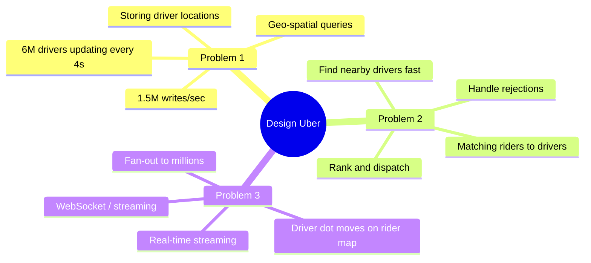

---

## 6. Geo-Spatial Indexing

### The Naive Approach (And Why It Fails)

**Analogy:** Socho tumhare paas ek map hai jisme sab drivers ke pin hain. Rider ne bola "5km ke andar koi driver hai?" Naive approach: har ek pin check karo aur distance calculate karo. 6 million drivers ke liye yeh bahut slow hai.

```sql
-- Naive SQL (WRONG for this scale):
SELECT driver_id, lat, lng
FROM active_drivers
WHERE lat BETWEEN (rider_lat - 0.045) AND (rider_lat + 0.045)
  AND lng BETWEEN (rider_lng - 0.045) AND (rider_lng + 0.045);

-- Problems:
-- 1. Full table scan if no spatial index
-- 2. 2D B-Tree index doesn't compress location well
-- 3. Cannot shard easily by lat/lng
-- 4. Cannot handle "within 5km radius" (only bounding box)
-- 5. 6M rows × every 4 seconds update = lock contention hell
```

We need something smarter. Three approaches are used in production:

### Option A: Geohash

**Analogy:** Socho duniya ko postal codes ki tarah divide kar do. "400001" se shuru hone wale sab codes Mumbai ke paas hain. Waise hi Geohash coordinates ko ek string mein convert karta hai — similar strings = similar locations.

#### How Geohash Works

```
Geohash encodes (latitude, longitude) into a base-32 string.

New York City: 40.7128° N, 74.0060° W
└── Geohash: "dr5ru"      (5 chars = ~5km × 5km cell)
             "dr5ruj"     (6 chars = ~1.2km × 0.6km cell)
             "dr5rujn8"   (8 chars = ~38m × 19m cell)

KEY INSIGHT: Nearby locations share a prefix!
  Times Square:  "dr5ruj"
  Central Park:  "dr5ru7"
  Both start with "dr5ru" → they are in the same ~5km cell

Mumbai:   "te7uv6"
Bandra:   "te7us5"
Andheri:  "te7ute"
Navi Mumbai: "te7tgb"
```

#### Geohash Precision Guide

| Precision | Cell Size | Use Case |
|---|---|---|
| 4 chars | ~40km × 20km | City-level matching |
| 5 chars | ~5km × 5km | Area-level |
| 6 chars | ~1.2km × 0.6km | **Uber matching (1km radius)** |
| 7 chars | ~150m × 150m | Precise pickup point |
| 8 chars | ~38m × 19m | Near-exact address |

#### Using Geohash for Driver Search

```
Step 1: Driver in Bandra sends location update
        lat=19.0596, lng=72.8295
        → Geohash (precision 6) = "te7us5"
        → Store: Redis SET drivers:te7us5 → {driver:101, driver:207, ...}

Step 2: Rider in Bandra requests ride
        lat=19.0612, lng=72.8311
        → Geohash (precision 6) = "te7us5" (same cell!)
        → Also calculate 8 neighboring cells:
          te7us4, te7us6, te7us7, te7us2, te7us3, te7usg, te7ush, te7usu
        → Query all 9 cells: GET drivers:te7us4, te7us5, ... te7usu
        → Get candidate drivers from all 9 cells

Step 3: Calculate exact distance (Haversine) only for candidates
        → Much cheaper — 9 Redis lookups instead of 6M calculations
```

#### The Boundary Problem

```
Problem: Two locations in adjacent geohash cells may be very close
         but have NO shared prefix!

Example:
  Point A: "ezzzz" (cell boundary)
  Point B: "bpbpb" (next cell)
  Actual distance: 50 meters
  Shared prefix:   NONE

Solution: Always query the cell AND its 8 neighbors.
  → Guarantees you find any driver within ~1.5× the cell size
  → 9 Redis lookups (tiny cost)
```

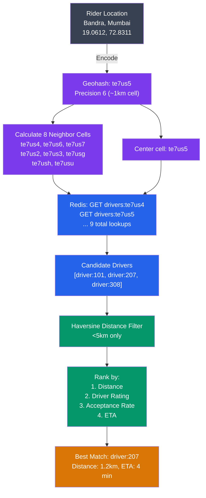

### Option B: S2 Geometry (Google's Approach, Uber Uses This)

**Analogy:** Geohash treats the Earth like a flat rectangle. S2 treats it like what it actually is — a sphere. Better math, better boundaries.

```
S2 divides the sphere into a hierarchical grid of cells.

Key differences from Geohash:
──────────────────────────────────────────────────────────
Geohash:    Flat projection → distortion near poles
            Cell edges are not equal
            Boundary problem is common

S2:         Sphere-aware → uniform cell sizes globally
            Better handling of cell boundaries
            Hierarchical: level 0 = 6 cells (faces of a cube)
                          level 30 = ~1cm² cells

How Uber uses S2:
  1. Encode each driver's location as S2 cell ID (level 15 = ~1km²)
  2. Store in Redis/in-memory index by cell ID
  3. On ride request: get cell IDs within radius → lookup drivers
  4. S2.regionCoverer computes minimal set of cells covering any polygon/circle

Why S2 over Geohash:
  ✅ More accurate radius queries (circular, not square bounding box)
  ✅ Fewer "false positives" at cell boundaries
  ✅ Works globally without distortion
  ❌ More complex to implement from scratch
```

### Option C: QuadTree

**Analogy:** Socho ek city ka map hai. Dense areas (like Connaught Place, Delhi) mein bahut drivers hain, toh woh area zyada zoom-in karo — chhote chhote boxes mein divide karo. Rural areas mein drivers kam hain, toh bade boxes kaafi hain. Yahi QuadTree karta hai — adaptively subdivide karta hai based on density.

```
QuadTree: Recursively divide 2D space into 4 quadrants

Level 0: [Entire World]
Level 1: [NW][NE][SW][SE]
Level 2: Each of those divided into 4 again...

Uber uses QuadTree because:
  Mumbai city center (Nariman Point):  subdivide to level 18 (very dense)
  Outskirts (Navi Mumbai):             only level 12 (sparse)

QuadTree dynamically adjusts as drivers move:
  - Too many drivers in a cell → split into 4 sub-cells
  - Too few drivers in a cell → merge with neighbors

Trade-offs:
  ✅ Adaptive: handles uneven driver density perfectly
  ✅ No wasted space in sparse areas
  ❌ Harder to shard (tree structure is not naturally partitionable)
  ❌ More complex than geohash
```

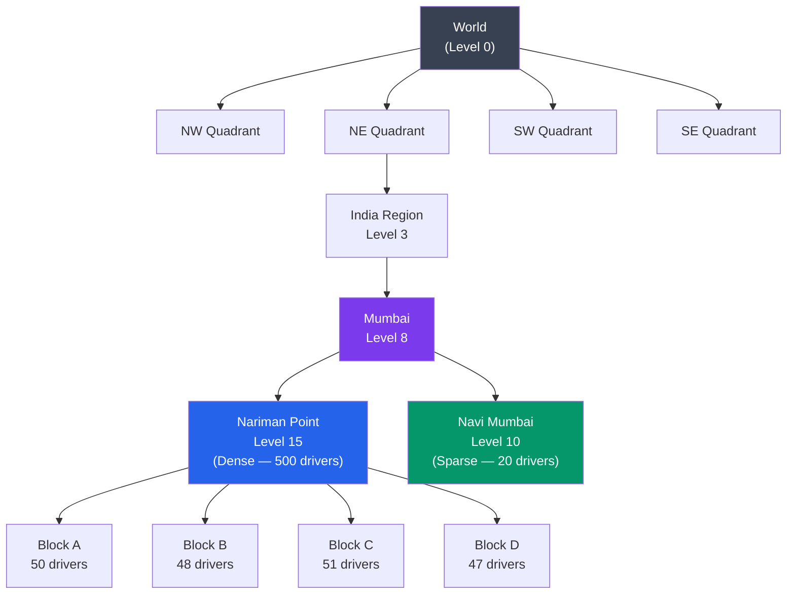

### Comparison: Geohash vs S2 vs QuadTree

| Feature | Geohash | S2 Geometry | QuadTree |
|---|---|---|---|
| **Implementation complexity** | Low | High | Medium |
| **Boundary accuracy** | Medium (prefix problem) | High (sphere-aware) | Medium |
| **Adaptive density** | No (fixed grid) | No (fixed grid) | Yes |
| **Sharding** | Easy (string prefix) | Medium | Hard |
| **Redis native support** | Yes (GEOADD) | No | No |
| **Used by** | Many startups | Uber, Google Maps | Lyft, older Uber |
| **Interview recommendation** | Start here | Mention as upgrade | Mention as alternative |

**Interview tip:** Geohash explain karo with neighbor cells. Fir bolo "Uber actually uses S2 which is sphere-aware and handles boundaries better." Dono ka naam lena enough hai.

---

## 7. Driver Location Storage

### Why Redis and Not PostgreSQL?

**Analogy:** Swiggy delivery partner ki location har 5 second mein update hoti hai. Agar yeh database mein likho — PostgreSQL ke rows update karo — toh database ka kya hoga? 1.5 million writes per second! PostgreSQL max 10,000-50,000 writes/sec handle karta hai normally. Redis in-memory hota hai — 1 million writes/sec easily handle karta hai.

```
Storage requirements:
  6M drivers × location update every 4 seconds
  = 1,500,000 writes/sec

  Each write: {driver_id, lat, lng, timestamp, geohash, status}

  Can traditional databases handle this?
  ─────────────────────────────────────────────────────────
  PostgreSQL:   Max ~50K writes/sec (with indexes)         ❌ 30x too slow
  MySQL:        Similar, ~40K writes/sec                   ❌ Too slow
  Cassandra:    ~200K writes/sec per node, scales out      ✅ Possible
  Redis:        ~1M+ writes/sec in-memory                  ✅ Perfect for live

  Decision: Redis for LIVE locations, Cassandra for HISTORY
```

### Redis GEO Commands

```bash
# Driver sends location update — stored as Redis sorted set (score = geohash)
GEOADD drivers:active 72.8295 19.0596 "driver:101"
GEOADD drivers:active 72.8320 19.0640 "driver:207"
GEOADD drivers:active 72.8260 19.0550 "driver:308"

# Find all drivers within 5km of a rider's location
GEORADIUS drivers:active 72.8311 19.0612 5 km WITHCOORD WITHDIST COUNT 20 ASC
# Returns: [(driver:207, 1.2km, 72.8320, 19.0640), (driver:101, 2.1km, ...), ...]

# Get distance between two drivers
GEODIST drivers:active driver:101 driver:207 km
# Returns: 0.7 (km)

# Get stored location of a driver
GEOPOS drivers:active driver:101
# Returns: (72.8295, 19.0596)
```

### Why Redis is OK Despite Being Non-Durable

```
Redis caveat: If Redis crashes, recent location data is lost!

Is this acceptable? YES, because:
  - Drivers send a new location update every 4 seconds
  - After Redis restarts, within 4-8 seconds all driver locations are re-populated
  - The "loss" is at most 4 seconds of stale data
  - This is acceptable for location (not for money!)

Redis persistence options (if needed):
  - RDB snapshots: point-in-time dump every X minutes
  - AOF (Append Only File): log every write
  - Both together: best durability
  But for live location — even none is OK!
```

### Sharding Strategy for Redis

```
1,500,000 writes/sec is too much for a single Redis node.
A single Redis node handles ~100,000-200,000 writes/sec.

Sharding approach: shard by geohash prefix (first 2 characters)

Geohash prefix → Redis cluster:
  "dr" → Cluster 1 (New York, Eastern US)
  "9q" → Cluster 2 (San Francisco, Western US)
  "te" → Cluster 3 (Mumbai, India)
  "u1" → Cluster 4 (London, Europe)
  "wj" → Cluster 5 (Tokyo, Japan)

Each cluster handles: 1.5M / 5 = ~300,000 writes/sec (manageable)

Benefits:
  ✅ Geographic partitioning = data locality
  ✅ Riders and drivers in same city hit same cluster
  ✅ Easy to add new clusters for new regions
```

### Dual Write: Redis + Cassandra

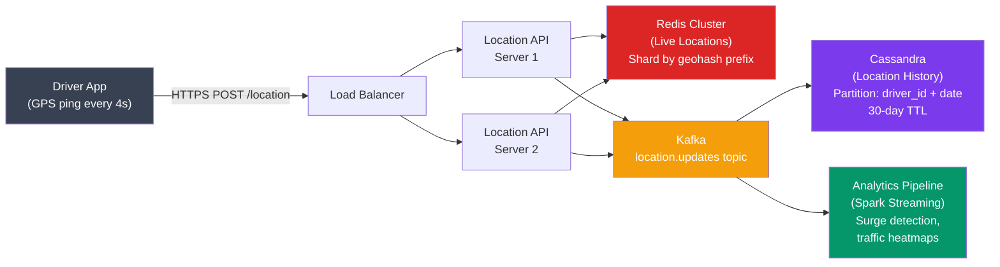

```
Write path (latency-critical):
  Driver → Location API → Redis (synchronous, <5ms)
                        → Kafka (fire-and-forget, async)

Read path (matching):
  Matching Service → Redis GEORADIUS (sub-millisecond)

Historical queries (analytics):
  Data Team → Cassandra (trip replay, fraud analysis)

Cassandra schema:
  PRIMARY KEY ((driver_id, date), timestamp)
  → Partition per driver per day
  → Retrieve a driver's full day GPS trail for trip replay/dispute
```

---

## 8. Ride Request and Matching Flow

### The Matching Problem

**Analogy:** Socho Zomato par order kiya. Zomato ke paas 10 delivery partners hain aas-paas. Woh sabko message nahi karta ek saath (fir 10 log ek rider ke paas aayenge). Woh pehle closest ko bhejta hai — agar woh 15 second mein accept nahi karta, fir dusre ko, phir teesre ko. Yahi Uber karta hai.

### Step-by-Step Matching Flow

```
1. Rider posts /request-ride {pickup: Bandra, dropoff: Andheri}

2. Ride Service:
   a. Creates trip record (status: REQUESTED) in MySQL
   b. Calls Location Service: "Give me all available drivers within 5km"
   c. Location Service: GEORADIUS Redis → returns [driver:207, driver:101, driver:308]

3. Ranking the candidates:
   Score = w1*distance + w2*rating + w3*acceptance_rate + w4*ETA
   driver:207 → score: 0.92 (1.2km, 4.8★, 94% accept)
   driver:101 → score: 0.87 (2.1km, 4.6★, 88% accept)
   driver:308 → score: 0.71 (3.5km, 4.3★, 75% accept)

4. Match Service tries top driver: driver:207
   a. Push notification: "New ride! Bandra → Andheri. ₹180 est."
   b. Start 15-second timer

5a. If driver:207 accepts within 15s:
    - Update trip status: ACCEPTED
    - Assign driver:207 to trip
    - Notify rider: "Driver found! Arriving in 4 min"
    - Share driver's phone number, car details, plate

5b. If driver:207 rejects or 15s timeout:
    - Mark driver:207 as "offered-not-accepted"
    - Try driver:101
    - Repeat until acceptance or exhaustion

6. If no driver accepts after 30s:
   - Expand radius (5km → 10km)
   - Try next batch of drivers

7. If still no driver after 60s total:
   - Respond: "No drivers available right now. Try again?"
   - Offer: schedule for later / premium options
```

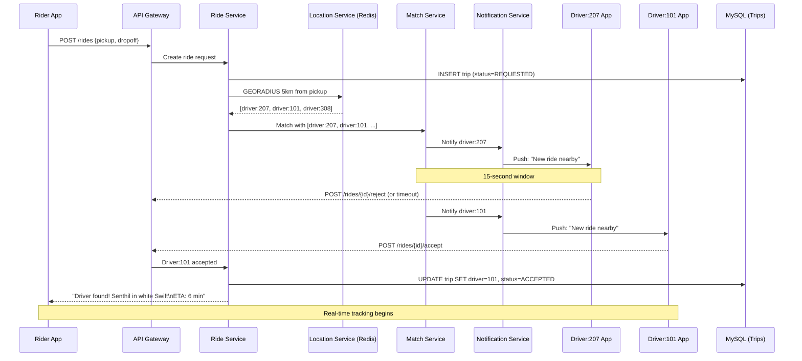

### Matching Service Internals

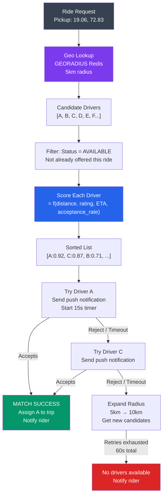

---

## 9. Real-Time Location Streaming

### The Problem After Matching

Matching ke baad ek naya problem shuru hota hai — rider ko driver ka dot real-time mein dekhna hai. Driver har 4 second mein location update karta hai. Yeh update rider ke phone tak kaise pahunchega?

**Analogy:** WhatsApp call pe socho — dono sides continuously audio stream kar rahe hain. Ek ne bola toh doosre ne suna. Agar hum polling karte — "koi audio naya hai kya?" har 1 second mein — toh bahut waste hoga aur lag lagega. WebSockets exactly yahi solve karte hain — ek persistent connection banate hain jisme server khud push karta hai jab kuch naya ho.

### Polling vs WebSockets

```
Option 1: Short Polling (WORST)
  Rider app: GET /driver/207/location — every 2 seconds
  
  10 million active riders × 1 req/2s = 5,000,000 req/sec
  Mostly empty responses (nothing changed in 2 seconds)
  → Massive waste of bandwidth and server resources
  ❌ Rejected

Option 2: Long Polling (OKAY)
  Rider app: GET /driver/207/location (hold connection open)
  Server: respond ONLY when location changes
  
  Better — no empty responses
  But: creates new TCP connection on each response
  → Still 10M connections/sec overhead
  ❌ Acceptable but not ideal

Option 3: Server-Sent Events (SSE) (GOOD)
  Server pushes events over HTTP connection
  One-directional (server → client)
  
  Works well for location streaming
  Simpler than WebSockets for this use case
  ✅ Good option

Option 4: WebSockets (BEST)
  Persistent bidirectional TCP connection
  Very low overhead per message (~2 bytes header vs ~800 bytes HTTP)
  Server pushes location updates as they arrive
  
  Used by: Uber, Ola, Google Maps live traffic
  ✅ Best for interactive real-time use
```

### WebSocket Architecture

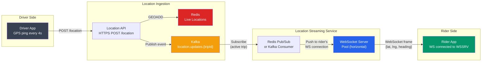

### WebSocket Scaling Challenge

```
Problem: If 10M riders each have a WebSocket connection,
         and each connection is on a different server,
         how does driver's location update reach the right rider?

Solution: Redis Pub/Sub or Kafka per trip

Flow:
  1. Driver updates location → Kafka topic: "location.trip.{trip_id}"
  2. ALL WebSocket servers subscribe to Kafka
  3. WebSocket server that holds rider's connection:
     - Reads from Kafka "location.trip.{trip_id}"
     - Pushes the frame to that specific rider's connection

Alternative: Sticky sessions (simpler but less flexible)
  - Rider always connects to the same WebSocket server
  - Load balancer uses session affinity (cookie/IP hash)
  - Problem: if that server dies, rider loses connection and must reconnect

Production pattern (Uber):
  - Kafka for fan-out (decoupled, persistent, replayable)
  - WebSocket servers are stateless (any server can handle any rider)
  - If server dies, rider reconnects in seconds to any available server
```

### What Data Flows Over WebSocket?

```json
// Message from server → rider app (every 4 seconds)
{
  "type": "driver_location",
  "trip_id": "trip-abc123",
  "driver_id": "driver:207",
  "lat": 19.0621,
  "lng": 72.8305,
  "heading": 45,
  "speed_kmh": 28,
  "eta_seconds": 180,
  "timestamp": 1719456000000
}

// Message from rider → server (when rider cancels)
{
  "type": "rider_cancel",
  "trip_id": "trip-abc123",
  "reason": "waiting_too_long"
}
```

---

## 10. Routing and ETA

### The Problem

**Analogy:** Google Maps pe direction maango toh woh turant shortest path deta hai, live traffic ke saath. City mein lakhs of roads aur intersections hain. Kaise calculate karta hai itni fast?

### Road Network as a Graph

```
Model the road network as a weighted directed graph:
  Nodes (vertices):  Intersections (traffic lights, junctions)
  Edges:             Road segments between intersections
  Edge weight:       Travel time (NOT distance!)
                     = distance / average_speed × traffic_factor

Example (Mumbai):
  Nariman Point → Worli: 4km, usually 8 min, peak hour 25 min
  Edge weight changes dynamically with real-time traffic!

Graph size for a major city (Mumbai):
  Nodes: ~500,000 intersections
  Edges: ~1,200,000 road segments (bidirectional = 2.4M edges)
```

### Routing Algorithms

#### Dijkstra's Algorithm

```
Classic shortest path — works correctly but is slow for city-scale.

Algorithm:
  1. Start at source node (pickup)
  2. Visit all neighbors, update their shortest known distance
  3. Always visit the unvisited node with smallest current distance
  4. Repeat until reaching destination

Time complexity: O((V + E) log V) where V = nodes, E = edges
For Mumbai: O((500K + 2.4M) log 500K) ≈ 60 million operations

Is this fast enough?
  At 10M operations/sec per CPU: ~6 seconds per route calculation
  Uber needs < 100ms per ETA calculation
  → Dijkstra alone is TOO SLOW for production
```

#### A* Algorithm (Heuristic Search)

```
A* is Dijkstra + a heuristic function that guides the search.

Key idea: Instead of exploring in all directions (Dijkstra),
          use GPS distance to destination as a hint:
          "Nodes geographically closer to destination are prioritized"

f(node) = g(node) + h(node)
  g(node) = actual cost from source to node (like Dijkstra)
  h(node) = heuristic: straight-line distance to destination
            (admissible: never overestimates actual travel time)

Result: A* explores ~10x fewer nodes than Dijkstra for city routing.
  Mumbai with A*: ~6M operations → ~0.6 seconds
  Still a bit slow for sub-100ms... need more tricks.
```

#### Production Optimizations

```
Real production routing (what Google Maps, Uber use):

1. Contraction Hierarchies (CH):
   Precompute shortcuts between "important" intersections
   (highways, major roads)
   → Reduces search space by 99%
   → Sub-millisecond queries after precomputation

2. Time-dependent edge weights:
   Edge weight = f(road_segment, time_of_day)
   Monday 9am: Bandra-Worli Sea Link = 15 min
   Monday 2pm: Bandra-Worli Sea Link = 5 min
   Precompute time-of-day profiles per edge

3. Real-time traffic layer:
   Google/HERE Maps API provides live traffic speeds per road segment
   Uber ingests this data every 5 minutes
   Update edge weights in routing graph

4. Precomputed route caching:
   Popular origin→destination pairs are precomputed
   Bandra station → BKC → cached, updated every 5 min
   Cache hit = sub-millisecond response

5. ML-based ETA correction:
   After route computation, apply ML model:
   "Given this route, historically what is actual arrival time?"
   Trains on millions of completed trips
   Corrects for model vs reality gaps (signal at junction, etc.)
```

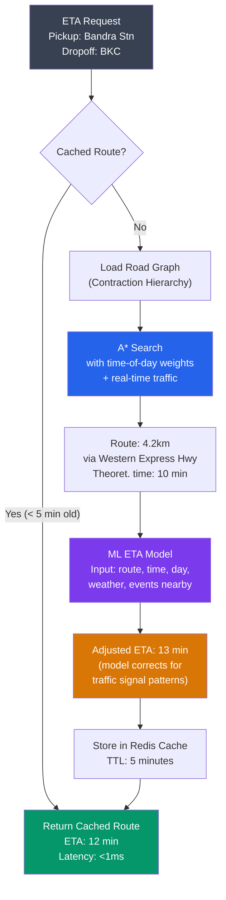

---

## 11. Surge Pricing

### Why Surge Pricing Exists

**Analogy:** Yeh sochna bilkul normal economics hai. New Year's Eve raat 12 baje Mumbai mein socho — sab log ghar jaana chahte hain, lekin drivers already booked hain ya ghar ja chuke hain. Demand bahut zyada, supply bahut kam. Agar price same rahe — sabko ride milni mushkil hogi aur jinhe sabse zyada zaroorat hai unhe nahi milegi. Price badh jaata hai toh:
1. Kuch log decide karte hain "thoda ruk jaate hain" (demand kam hoti hai)
2. Kuch drivers decide karte hain "ab bahar nikalta hoon" (supply badhti hai)
3. Balance restore hota hai

Yeh market mechanism hai. Controversial hai but functionally correct.

### How Surge Pricing Works

```
Surge Multiplier Calculation:

surge_ratio = demand / supply
  demand = count(ride_requests in area, last 5 minutes)
  supply = count(available drivers in area)

surge_multiplier = lookup_table(surge_ratio):
  ratio 0.0 – 1.0:   1.0x  (normal)
  ratio 1.0 – 1.5:   1.2x
  ratio 1.5 – 2.0:   1.5x
  ratio 2.0 – 3.0:   2.0x
  ratio 3.0 – 4.0:   2.5x
  ratio 4.0+:         3.0x  (cap — legal/reputational limit)

Per-geohash surge:
  Each geohash cell (precision 6 = ~1km²) has its own multiplier!
  Juhu beach (party): 3.0x
  Andheri East:       1.0x
  Powai:              1.5x

Why per cell?
  → An event at Juhu shouldn't make rides expensive in Powai
  → Fine-grained pricing = more accurate incentives
```

### Surge Calculation Pipeline

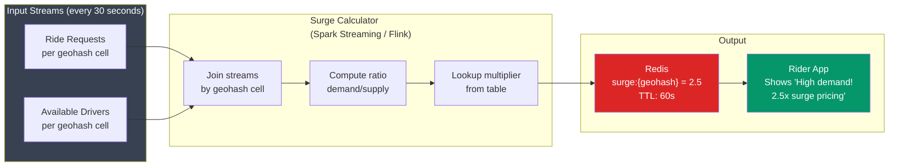

### Showing Surge to Rider

```
Legal requirement in most markets: show surge BEFORE rider confirms.

Rider request flow with surge:
  1. Rider posts pickup/dropoff
  2. Pricing Service queries Redis: surge:{te7us5} = 2.5
  3. Calculate fare estimate:
     base: ₹40 + ₹12/km × 8km + ₹2/min × 15min = ₹166
     surge: ₹166 × 2.5 = ₹415
  4. Show to rider: "High demand in your area. Est fare: ₹350–₹420"
  5. Rider must confirm (or cancel)
  6. Only after confirmation: proceed with matching

Rider protections (Uber policy):
  - Always show multiplier before confirmation
  - Cap multiplier (varies by country — India: typically 3x)
  - During disasters/declared emergencies: mandatory 1.0x
```

---

## 12. Payment Processing

### The Core Problem: Double Charge

**Analogy:** Socho UPI se paisa bheja — "network error" aaya. Kya dobara bhejein? Kya pehla bhi gaya? Yeh exact problem hai payment processing mein. Agar retry karo toh double charge ho sakta hai. Agar retry na karo toh payment fail ho jata hai.

Solution: **Idempotency Keys**

```
Idempotency Key = a unique identifier for this SPECIFIC payment attempt.

Rules:
  Same key → same result (never process twice)
  
Flow:
  Trip ends → Payment Service creates key: "trip-abc123-v1"
  
  Attempt 1:
    POST /charge
    Idempotency-Key: trip-abc123-v1
    {amount: 41500, currency: "INR", card: "tok_xxx"}
    
    Payment Gateway (Stripe/Razorpay):
      - Check DB: "trip-abc123-v1" → not found
      - Process charge → SUCCESS ₹415
      - Store: "trip-abc123-v1" → {status: SUCCESS, charge_id: ch_xyz}
      - Return success
  
  Attempt 2 (network timeout, retry):
    POST /charge
    Idempotency-Key: trip-abc123-v1  ← SAME KEY
    
    Payment Gateway:
      - Check DB: "trip-abc123-v1" → found! {status: SUCCESS}
      - Return stored SUCCESS response (don't charge again!)
```

### Async Payment Architecture

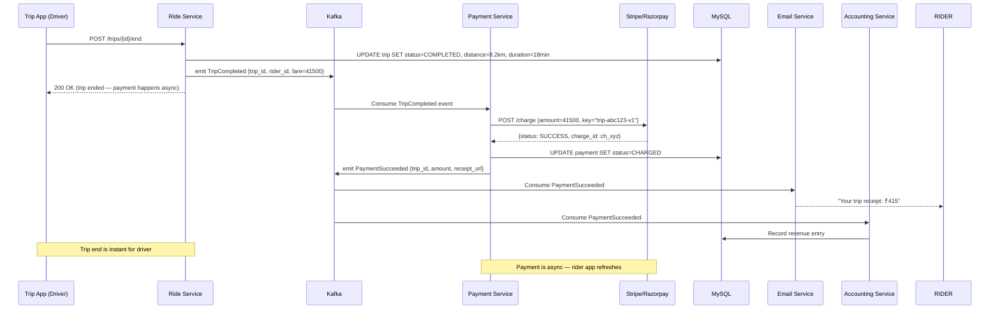

### Why Async Payment?

```
If payment were synchronous (blocking):
  Trip ends → Wait for Stripe call (2-5 seconds) → Confirm to driver
  Problems:
  - Stripe might be slow or down
  - Driver's app hangs for 5 seconds
  - If Stripe is down: should we still end the trip? Yes!
  - Trip completion should NEVER be blocked by payment

Async is better:
  Trip ends → DB updated → Kafka event → Driver app confirmed immediately
  Payment happens in background (within seconds typically)
  If payment fails → retry queue → eventually consistent
  Driver income is recorded separately (batch settlement)
```

### Money Storage: Integer Cents, Not Floats

```
CRITICAL: Never store money as floating point!

float arithmetic is imprecise:
  2.50 + 1.80 = 4.299999999... (JavaScript/Python float)
  → Store as rupee paise (integer):
  250 + 180 = 430 paise = ₹4.30 ✅

Uber stores all monetary values as:
  - Integer (smallest currency unit)
  - Currency code ("INR", "USD")
  - Example: {amount: 41500, currency: "INR"} = ₹415.00

Database type: BIGINT (not DECIMAL, not FLOAT)
  - 64-bit integer can store ₹92 trillion before overflow
  - Perfect for any real-world amount
```

---

## 13. Trip State Machine

**Analogy:** Jaise ek cricket match ke states hote hain — "Toss", "Match in Progress", "Tea Break", "Match Ended" — aur sirf valid transitions hote hain (you can't go from "Toss" directly to "Match Ended"), waise hi Uber trip ke clear states aur transitions hain.

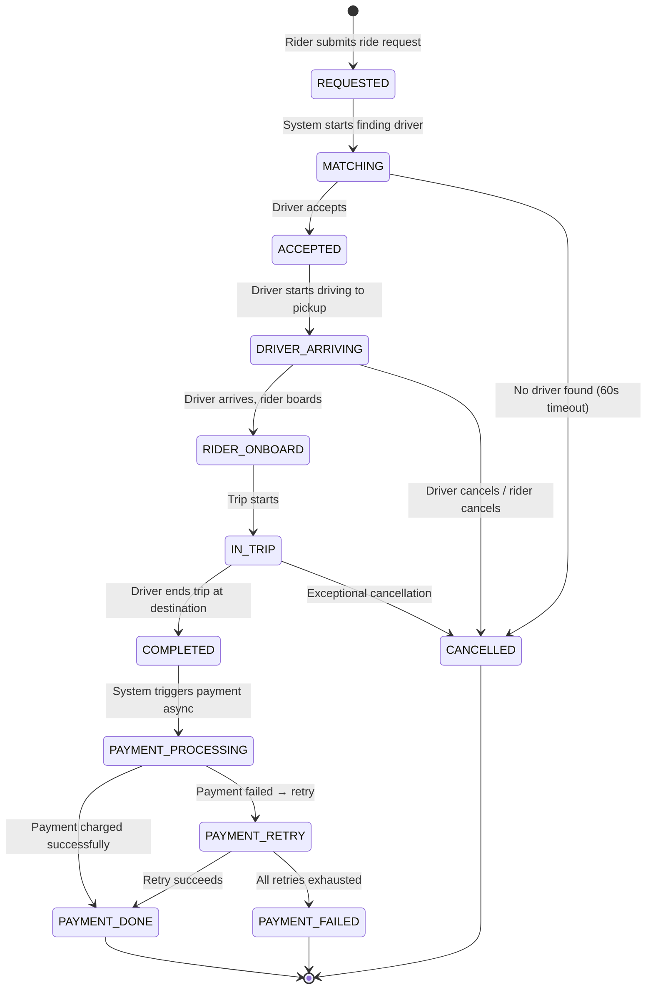

### State Machine in Database

```sql
-- trips table
CREATE TABLE trips (
  trip_id      UUID PRIMARY KEY,
  rider_id     UUID NOT NULL,
  driver_id    UUID,                    -- NULL until matched
  status       VARCHAR(30) NOT NULL,    -- enum in application layer
  pickup_lat   DOUBLE NOT NULL,
  pickup_lng   DOUBLE NOT NULL,
  dropoff_lat  DOUBLE,
  dropoff_lng  DOUBLE,
  fare_paise   BIGINT,                  -- in smallest currency unit
  surge_mult   DECIMAL(3,1),
  created_at   TIMESTAMP NOT NULL,
  matched_at   TIMESTAMP,
  started_at   TIMESTAMP,
  completed_at TIMESTAMP,
  
  CONSTRAINT valid_status CHECK (
    status IN ('REQUESTED','MATCHING','ACCEPTED',
               'DRIVER_ARRIVING','RIDER_ONBOARD',
               'IN_TRIP','COMPLETED','CANCELLED')
  )
);

-- State transitions enforced in application:
-- UPDATE trips SET status='ACCEPTED', driver_id=?, matched_at=NOW()
-- WHERE trip_id=? AND status='MATCHING'  ← optimistic locking
-- If 0 rows updated → race condition, handle appropriately
```

### Race Condition: Two Drivers Accept Simultaneously

```
Scenario: Match Service sends request to driver:207 and driver:101
          (fallback), but BOTH accept at nearly the same time.

Without protection: Two drivers assigned to one rider!

Solution: Optimistic concurrency control

  UPDATE trips
  SET status='ACCEPTED', driver_id='driver:207'
  WHERE trip_id='trip-abc' AND status='MATCHING';

  If rows_affected = 1: SUCCESS, driver:207 gets the ride
  If rows_affected = 0: Another driver already accepted,
                        release driver:207 immediately

MySQL InnoDB handles this correctly with row-level locking.
The first UPDATE to succeed wins; the second UPDATE sees status='ACCEPTED'
and updates 0 rows.
```

---

## 14. Ratings and Feedback

### How Rating System Works

```
After trip completion (30-minute window):
  Rider rates driver: 1–5 stars
  Driver rates rider: 1–5 stars (affects future matching)

Driver rating calculation:
  running_average = (current_avg × trip_count + new_rating) / (trip_count + 1)
  
  Stored in: MySQL drivers table (real-time update)
  Also stored in: Redis (for quick lookup during matching)

Why ratings matter for matching:
  - 4.8★ driver ranked higher than 4.2★ driver (same distance)
  - Riders with low ratings may get fewer driver acceptances
  - Threshold: drivers below 4.0★ get deactivated (in some markets)

Fake rating mitigation:
  - Only matched rider/driver can rate each other
  - Verified by: trip_id + rider_id + driver_id combination
  - IP/device fingerprint checks for coordinated fraud
```

---

## 15. Full System Architecture

### Component Diagram

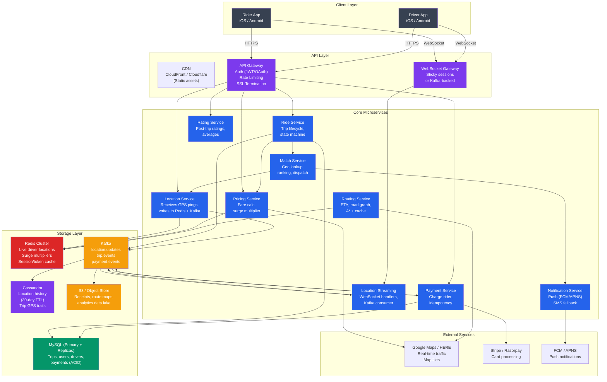

### Data Flow Summary

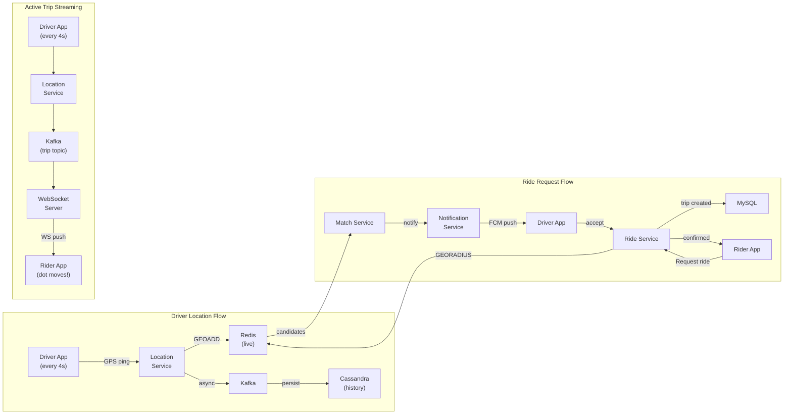

---

## 16. Deep Dives and Edge Cases

Yeh section interview mein "deep dive karo" sunne ke baad important hai.

### Deep Dive 1: Handling 1.5M Location Writes/Sec

```
Challenge: Redis single node handles ~200K ops/sec.
           We need 1.5M writes/sec. How?

Solution: Sharded Redis Cluster

Sharding key: city_id OR geohash prefix (first 2 characters)

Example (India):
  Mumbai drivers    → Redis Cluster IN-1 (te prefix)
  Delhi drivers     → Redis Cluster IN-2 (tt prefix)
  Bangalore drivers → Redis Cluster IN-3 (tdr prefix)
  Hyderabad drivers → Redis Cluster IN-4 (tdr prefix shared, by city_id)

Each cluster: ~6-8 Redis nodes (primary + replica)
Each handles: ~200-300K writes/sec

Location API servers:
  - Stateless — any server handles any driver
  - Consistent hashing → route write to correct Redis cluster
  - No coordination needed between Location API servers

Network:
  Driver app → Load Balancer → Location API → Redis (same datacenter)
  RTT within datacenter: ~0.5ms
  Total write latency: ~2-3ms (well within 4-second update budget)
```

### Deep Dive 2: What Happens When Match Service Crashes?

```
Without Kafka (naive):
  Ride request comes in → Match Service is down → request lost → rider upset

With Kafka (correct):
  Ride request comes in → Ride Service → writes to Kafka (durable)
                                       → responds 202 Accepted to rider app
  Match Service reads from Kafka when it comes back up
  
  Ride Service also stores in MySQL: {trip_id, status=REQUESTED, created_at}
  
  When Match Service restarts:
    1. Reads Kafka from last committed offset
    2. Processes queued requests in order
    3. Checks trip TTL: if created_at > 60 seconds ago → mark as EXPIRED
    4. Processes only non-expired trips
    5. Rider sees "Finding your driver..." during gap
  
  Max rider impact: however long Match Service was down (seconds)
  Trip data: never lost (MySQL + Kafka)
```

### Deep Dive 3: Driver Goes to Wrong Location (Navigation Error)

```
Problem: Driver accepted ride but drove to wrong location.
         Rider is standing somewhere else.

How Uber detects:
  1. Rider location (from rider app GPS) vs driver location (from driver app GPS)
  2. If distance > 500m AND driver moving away → "Are you lost?" alert

Detection query (every 30 seconds for active trips):
  Driver location: (from Redis) driver_lat, driver_lng
  Rider location:  (from rider app periodic update) rider_lat, rider_lng
  Expected distance: < 200m (during DRIVER_ARRIVING state)
  
  If actual_distance > 500m AND driver moving away from rider:
    → Push notification to driver: "Turn around! Rider is in the other direction"
    → Update navigation route in driver app

Trip Service:
  - Tracks both locations for active trips
  - 30-second reconciliation check
```

### Deep Dive 4: Surge Pricing Boundary Effect

```
Problem: Rider is at geohash cell boundary.
         One cell = 3.0x surge, adjacent cell = 1.0x.
         Rider is 10 meters inside 3.0x cell.
         
         Is this fair? Potentially not.

Uber's actual solution:
  1. Use rider's precise location (not just cell center)
  2. Apply a "blending" function near cell boundaries:
     If rider is within 100m of cell edge:
       blend_factor = distance_from_center / cell_radius
       effective_surge = cell1_surge × blend_factor + cell2_surge × (1-blend_factor)
  
  3. Or: use S2 cells (sphere-aware) which have cleaner boundary handling

For interviews: mention this edge case. Shows you think about fairness and edge cases, not just happy path.
```

### Deep Dive 5: What If Redis Goes Down?

```
Scenario: Redis cluster failure. Live driver locations lost.

Response plan:
  1. Drivers continue sending GPS pings (to Location API)
  2. Location API: Redis writes fail → fallback to Cassandra (slower)
     OR: buffer in-memory + retry when Redis recovers
  3. Match Service: cannot do GEORADIUS → falls back to:
     a. Query Cassandra for last known location of all online drivers
     b. Use last update < 30 seconds old
     c. This degrades performance but maintains service

Time to recover:
  Redis restart: < 30 seconds (if replica promoted)
  Redis repopulation: drivers resend location in 4-8 seconds
  
  Total impact: ~30-60 seconds of degraded matching

For truly critical deployments:
  - Redis Sentinel: auto-failover, replica promoted to primary
  - Redis Cluster: automatic sharding + failover
  - Multiple replicas per shard (1 primary + 2 replicas minimum)
```

---

## 17. Data and Analytics Pipeline

### Event Stream

```
Every action in the Uber system emits an event to Kafka.
These events are the foundation of analytics, ML, and fraud detection.

Events emitted:
  RideRequested       {trip_id, rider_id, pickup, dropoff, timestamp}
  DriverMatched       {trip_id, driver_id, distance, wait_time, timestamp}
  DriverArrived       {trip_id, actual_arrival_time}
  TripStarted         {trip_id, actual_start, rider_onboard}
  LocationUpdate      {trip_id, driver_id, lat, lng, timestamp} [every 4s]
  TripCompleted       {trip_id, distance_km, duration_min, route_polyline}
  PaymentProcessed    {trip_id, amount, surge, payment_method}
  RatingSubmitted     {trip_id, rider_rating, driver_rating}
  CancellationEvent   {trip_id, cancelled_by, reason, time_in_flow}
```

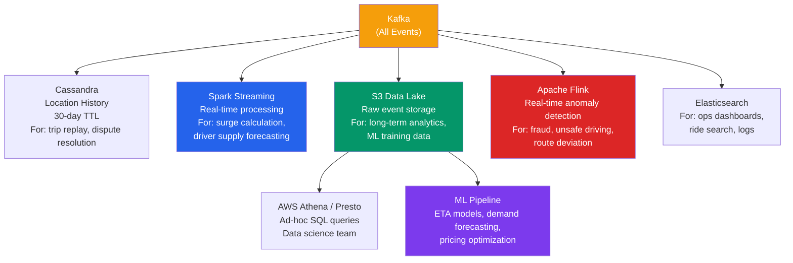

### Analytics Use Cases

| Use Case | Technology | Frequency |
|---|---|---|
| **Surge pricing** | Spark Streaming | Every 30 seconds |
| **Supply forecasting** | ML on historical data | Daily retraining |
| **Driver ETA calibration** | ML (gradient boosting) | Weekly |
| **Fraud detection** | Flink (real-time rules) | Per event |
| **City operations heatmap** | Elasticsearch | Real-time |
| **Long-term revenue analytics** | Athena on S3 | On-demand |

---

## 18. Common Interview Questions

### Q1: "How do you store and query driver locations at scale?"

```
Structured answer (STAR-style):

SITUATION: 6 million drivers sending GPS every 4 seconds = 1.5M writes/sec.
           Need to find all drivers within 5km of a rider in < 100ms.

APPROACH: Two-layer storage
  1. Redis (live locations):
     - GEOADD with driver_id, lat, lng
     - GEORADIUS for proximity search
     - Sharded by geohash prefix (city-level shards)
     - Handles 1.5M writes/sec across cluster

  2. Cassandra (history):
     - Async writes via Kafka
     - Partition: (driver_id, date)
     - 30-day TTL
     - Used for dispute resolution, analytics

RESULT: Sub-millisecond proximity queries, 1.5M writes/sec throughput.

Follow-up: "But Redis isn't durable!"
  Yes — acceptable because drivers resend location every 4 seconds.
  Loss = at most 4 seconds of stale data. Acceptable for location.
```

### Q2: "Walk me through what happens when I request a ride in Uber."

```
Key points to hit (in order):

1. Rider app sends POST /rides {pickup, dropoff}
2. API Gateway authenticates JWT, rate limits
3. Ride Service creates trip record (MySQL, status=REQUESTED)
4. Emit RideRequested event to Kafka
5. Pricing Service calculates fare estimate (surge from Redis)
6. Return estimate to rider (202 Accepted — "searching for driver")

7. Match Service (async, consuming Kafka):
   a. GEORADIUS Redis — find drivers within 5km
   b. Filter: status=AVAILABLE
   c. Score: distance, rating, ETA, acceptance rate
   d. Try top driver: send push notification (FCM)
   e. 15-second window: accept → assign. Reject → next driver.

8. On acceptance:
   - UPDATE trip: status=ACCEPTED, driver_id=207
   - Notify rider via WebSocket: "Driver found! Rajesh, 4.7★, 4 min ETA"
   - WebSocket connection established for live tracking

9. Driver en route → every 4s sends GPS → Location Service → Kafka → WebSocket → rider map
```

### Q3: "How would you implement surge pricing?"

```
Answer:

Surge = per-geohash cell pricing, recalculated every 30 seconds.

Pipeline:
  1. Kafka streams: ride requests + available driver counts per geohash
  2. Spark Streaming joins both streams per geohash cell
  3. Compute ratio = demand / supply
  4. Lookup multiplier from table (1.0x to 3.0x)
  5. Write to Redis: surge:{geohash_cell} = 2.5, TTL=60s

Usage:
  - Pricing Service reads surge at ride request time
  - Shows to rider before confirmation
  - Baked into fare estimate

Edge cases:
  - New geohash cell (no history): default 1.0x
  - Driver moves out of cell: recalculate both cells
  - Emergency/disaster: hardcoded 1.0x override
```

### Q4: "How do you prevent double-charging?"

```
Idempotency keys!

Key = "trip-{trip_id}-charge-v{attempt}"

Payment Service:
  1. Look up key in idempotency store (Redis or DB)
  2. If found → return stored result (no new charge)
  3. If not found → process charge, store result, return

Store: Redis with TTL=24h (or MySQL for permanent record)

For retries: always use the SAME key.
  → Stripe/Razorpay also support idempotency keys natively.
```

### Q5: "How do you scale real-time location streaming to 10 million active riders?"

```
Two components to scale:

1. Ingestion (drivers → system):
   - Stateless Location API servers (horizontal scale)
   - Write to Redis + Kafka (async)
   - Redis sharded by geohash prefix

2. Streaming (system → riders):
   - WebSocket servers (horizontal scale)
   - Kafka as the fan-out mechanism:
     - Topic: "location.trip.{trip_id}"
     - WebSocket server that holds rider's connection subscribes to that topic
     - On new message: push to rider's WebSocket
   - If rider's WS server dies: reconnect to any server, resubscribe to Kafka topic
   - No sticky sessions required (but can use them as optimization)

Scale estimate:
   10M active riders × 1 WebSocket = 10M connections
   Each WebSocket server handles 50,000 connections (Node.js / Go)
   = 200 WebSocket servers needed
   (manageable, auto-scaled)
```

### Q6: "What database would you use for trip data?"

```
Trip data characteristics:
  - Structured, relational (rider, driver, trip, payment all linked)
  - Strong consistency required (money)
  - Moderate write rate (~58 trip completions/sec)
  - Need ACID transactions (trip completion + payment record)

Answer: MySQL / PostgreSQL (relational, ACID)

Schema:
  trips table: trip_id, rider_id, driver_id, status, fare, timestamps
  payments table: payment_id, trip_id, amount, status, idempotency_key
  users table: user_id, name, phone, email, rating
  drivers table: driver_id, user_id, vehicle_info, rating, current_geohash

Read scaling:
  MySQL primary → MySQL replicas (1 write primary + 3 read replicas)
  All SELECTs go to replicas
  All writes go to primary

Caching:
  User profiles, driver info → Redis (hot data, rarely changes)
```

### Q7: "How would you handle a New Year's Eve surge (10x traffic)?"

```
Preparation (predictable event):
  1. Pre-scale infrastructure: add Redis nodes, WebSocket servers, etc.
  2. Pre-warm caches (surge pricing already computed)
  3. Increase Kafka partition count (more parallelism)

During the event:
  - Surge pricing kicks in automatically (designed for this)
  - Auto-scaling for stateless services (Kubernetes HPA)
  - Circuit breakers: if non-critical services (ratings, analytics) are slow,
    disable them temporarily (don't let them cascade to core services)

Specific protections:
  - Rate limiting at API Gateway: 10 req/min per rider for ride requests
  - Match Service: increase radius faster (skip 5km, go to 8km after 10s)
  - Driver incentives: higher payout during surge → more drivers come online
  - Queue visibility: "You're #47 in queue" → sets expectations

Post-event:
  - Gradual scale-down
  - Analytics review: did surge pricing work? How many riders were lost?
```

### Q8: "Design the schema for Uber's trip data."

```sql
-- Core tables

CREATE TABLE users (
  user_id     UUID PRIMARY KEY,
  phone       VARCHAR(15) UNIQUE NOT NULL,
  email       VARCHAR(255),
  name        VARCHAR(255),
  created_at  TIMESTAMP DEFAULT NOW()
);

CREATE TABLE drivers (
  driver_id    UUID PRIMARY KEY,
  user_id      UUID REFERENCES users(user_id),
  vehicle_make VARCHAR(50),
  vehicle_model VARCHAR(50),
  plate_number VARCHAR(20),
  rating_avg   DECIMAL(3,2) DEFAULT 5.0,
  rating_count INT DEFAULT 0,
  status       VARCHAR(20) DEFAULT 'OFFLINE', -- OFFLINE, AVAILABLE, ON_TRIP
  current_geohash VARCHAR(12),               -- updated frequently
  INDEX (status, current_geohash)            -- for matching queries
);

CREATE TABLE trips (
  trip_id      UUID PRIMARY KEY,
  rider_id     UUID REFERENCES users(user_id),
  driver_id    UUID REFERENCES drivers(driver_id),
  status       VARCHAR(30) NOT NULL,
  pickup_lat   DECIMAL(10,7) NOT NULL,
  pickup_lng   DECIMAL(10,7) NOT NULL,
  dropoff_lat  DECIMAL(10,7),
  dropoff_lng  DECIMAL(10,7),
  distance_m   INT,                          -- meters
  duration_s   INT,                          -- seconds
  fare_paise   BIGINT,                       -- INR paise (integer cents)
  surge_mult   DECIMAL(3,1) DEFAULT 1.0,
  created_at   TIMESTAMP NOT NULL,
  matched_at   TIMESTAMP,
  started_at   TIMESTAMP,
  completed_at TIMESTAMP,
  INDEX (rider_id, created_at),
  INDEX (driver_id, created_at),
  INDEX (status)
);

CREATE TABLE payments (
  payment_id        UUID PRIMARY KEY,
  trip_id           UUID REFERENCES trips(trip_id),
  amount_paise      BIGINT NOT NULL,
  currency          VARCHAR(3) DEFAULT 'INR',
  status            VARCHAR(20),             -- PENDING, CHARGED, FAILED
  idempotency_key   VARCHAR(100) UNIQUE,     -- prevents double charge
  gateway_charge_id VARCHAR(100),            -- Stripe/Razorpay charge ID
  charged_at        TIMESTAMP,
  INDEX (trip_id),
  INDEX (idempotency_key)
);

CREATE TABLE ratings (
  rating_id     UUID PRIMARY KEY,
  trip_id       UUID REFERENCES trips(trip_id),
  rater_id      UUID REFERENCES users(user_id),
  ratee_id      UUID REFERENCES users(user_id),
  score         TINYINT CHECK (score BETWEEN 1 AND 5),
  feedback      TEXT,
  created_at    TIMESTAMP DEFAULT NOW(),
  UNIQUE (trip_id, rater_id)                -- one rating per person per trip
);
```

---

## 19. Key Takeaways

```
╔════════════════════════════════════════════════════════════════════════════╗
║                        UBER SYSTEM DESIGN — KEY TAKEAWAYS                 ║
╠════════════════════════════════════════════════════════════════════════════╣
║                                                                            ║
║  CORE INSIGHT: Uber has THREE fundamentally different scaling problems:    ║
║  1. Massive write throughput (location: 1.5M writes/sec) → Redis          ║
║  2. Geo-spatial queries (find nearby drivers) → Geohash / S2              ║
║  3. Real-time streaming (live map) → WebSockets + Kafka                   ║
║                                                                            ║
╠════════════════════════════════════════════════════════════════════════════╣
║  GEO-SPATIAL                                                               ║
║  • Geohash: converts 2D coordinates to 1D string; nearby = shared prefix  ║
║  • Always query center cell + 8 neighbors (boundary problem fix)          ║
║  • S2 Geometry: sphere-aware, what Uber actually uses in production        ║
║  • QuadTree: adaptive density, good for uneven city layouts               ║
║  • Redis GEOADD/GEORADIUS: sub-millisecond radius search                  ║
╠════════════════════════════════════════════════════════════════════════════╣
║  LOCATION STORAGE                                                          ║
║  • Redis for LIVE locations (in-memory, 1M+ writes/sec, ~240MB total)     ║
║  • Cassandra for HISTORICAL (30-day TTL, analytics, dispute resolution)   ║
║  • Kafka as the async bridge between live and historical storage           ║
║  • Shard Redis by geohash prefix (city-level sharding)                    ║
╠════════════════════════════════════════════════════════════════════════════╣
║  MATCHING                                                                  ║
║  • Sequential dispatch: try best driver → 15s → next → ... → 60s total   ║
║  • Ranking: distance + rating + acceptance rate + ETA                     ║
║  • If no match in 30s: expand radius (5km → 10km)                         ║
║  • Race condition: optimistic locking on trip UPDATE (0 rows = lost race) ║
╠════════════════════════════════════════════════════════════════════════════╣
║  REAL-TIME STREAMING                                                       ║
║  • WebSockets > Long Polling > Short Polling (in that order)              ║
║  • Driver location → Kafka topic per trip → WebSocket server → rider      ║
║  • WebSocket servers are stateless (Kafka provides fan-out, decoupling)   ║
╠════════════════════════════════════════════════════════════════════════════╣
║  SURGE PRICING                                                             ║
║  • Per geohash cell, recalculated every 30 seconds                        ║
║  • surge_ratio = demand / supply → lookup multiplier table                ║
║  • Stored in Redis: surge:{geohash} → fast reads at request time          ║
║  • Always shown to rider BEFORE confirmation (regulatory requirement)     ║
╠════════════════════════════════════════════════════════════════════════════╣
║  PAYMENT                                                                   ║
║  • Async: trip ends instantly; payment happens via Kafka consumer         ║
║  • Idempotency keys: same key = same result, never double-charge          ║
║  • Money as integers (paise, cents) — never floating point                ║
║  • MySQL for payment records (ACID, strong consistency)                   ║
╠════════════════════════════════════════════════════════════════════════════╣
║  ROUTING / ETA                                                             ║
║  • Road network = weighted directed graph (nodes=junctions, edges=roads)  ║
║  • A* faster than Dijkstra (heuristic guides search direction)            ║
║  • Contraction Hierarchies for production (sub-millisecond queries)       ║
║  • Real-time traffic from Google Maps/HERE → dynamic edge weights         ║
║  • ML model corrects theoretical ETA with historical actual times         ║
╠════════════════════════════════════════════════════════════════════════════╣
║  INTERVIEW STRATEGY                                                        ║
║  1. Clarify requirements — scope early (no carpooling, no scheduling)     ║
║  2. Estimate: 1.5M location writes/sec is the scary number — mention it   ║
║  3. Lead with the 3 core problems, then solve each                        ║
║  4. Mention Geohash first, then upgrade to S2 if asked                    ║
║  5. For every storage choice: explain WHY (consistency, latency, scale)   ║
║  6. Always mention idempotency for payment — shows seniority              ║
╚════════════════════════════════════════════════════════════════════════════╝
```

---

## Quick Reference Cheat Sheet

| Component | Technology | Why |
|---|---|---|
| Live driver locations | Redis (GEOADD/GEORADIUS) | Sub-ms reads, 1M+ writes/sec |
| Location history | Cassandra | High write throughput, TTL, time-series |
| Trip data | MySQL | ACID, relational, financial consistency |
| Event streaming | Kafka | Decoupling, durability, fan-out |
| Real-time tracking | WebSocket + Kafka | Push-based, low overhead |
| Geo-spatial indexing | Geohash (S2 in production) | 1D string for 2D coordinates |
| Driver notification | FCM / APNS push | Battery-efficient, reliable delivery |
| Routing / ETA | A* + Contraction Hierarchies + ML | Speed + accuracy |
| Surge pricing | Redis (per geohash, 30s TTL) | Fast reads at request time |
| Payment | Stripe/Razorpay + idempotency keys | No double charges |

---

*These notes cover the full system. For a complete interview, practice drawing the architecture diagram from memory and explaining the three core problems (geo-spatial indexing, matching, real-time streaming) clearly and confidently.*

---

**Previous topic:** [CAP Theorem and Consistency](../45-cap-theorem/README.md)  
**Next topic:** [Interview Guide](../INTERVIEW_GUIDE.md)
