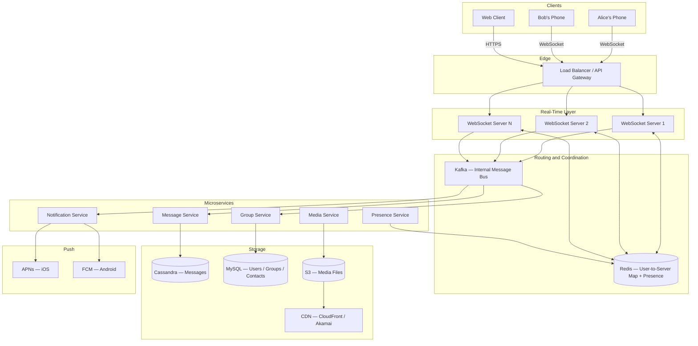
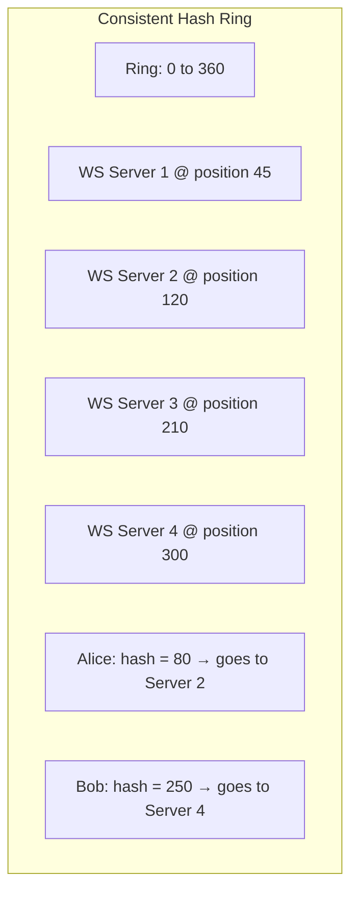
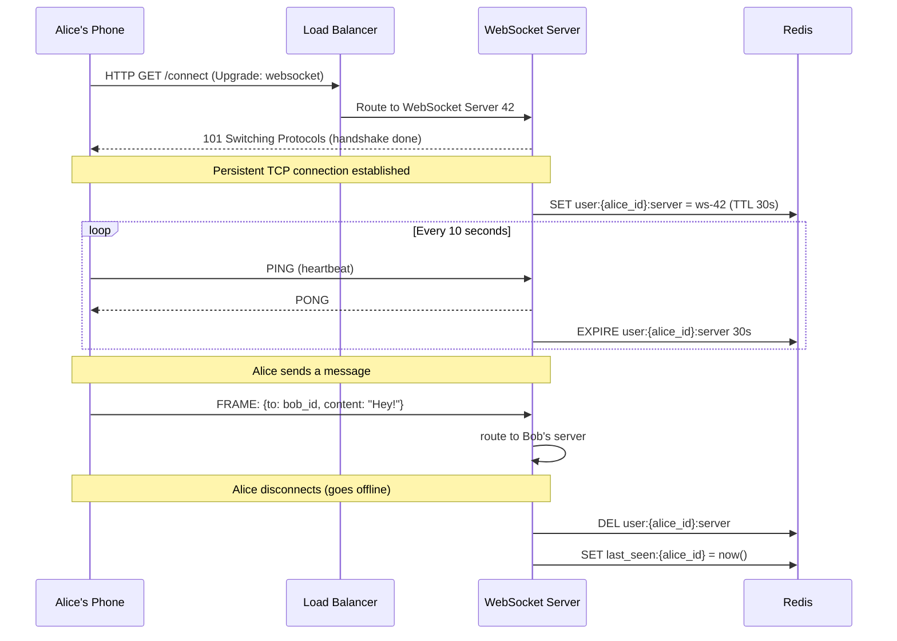
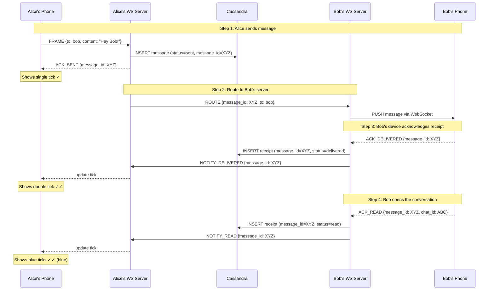
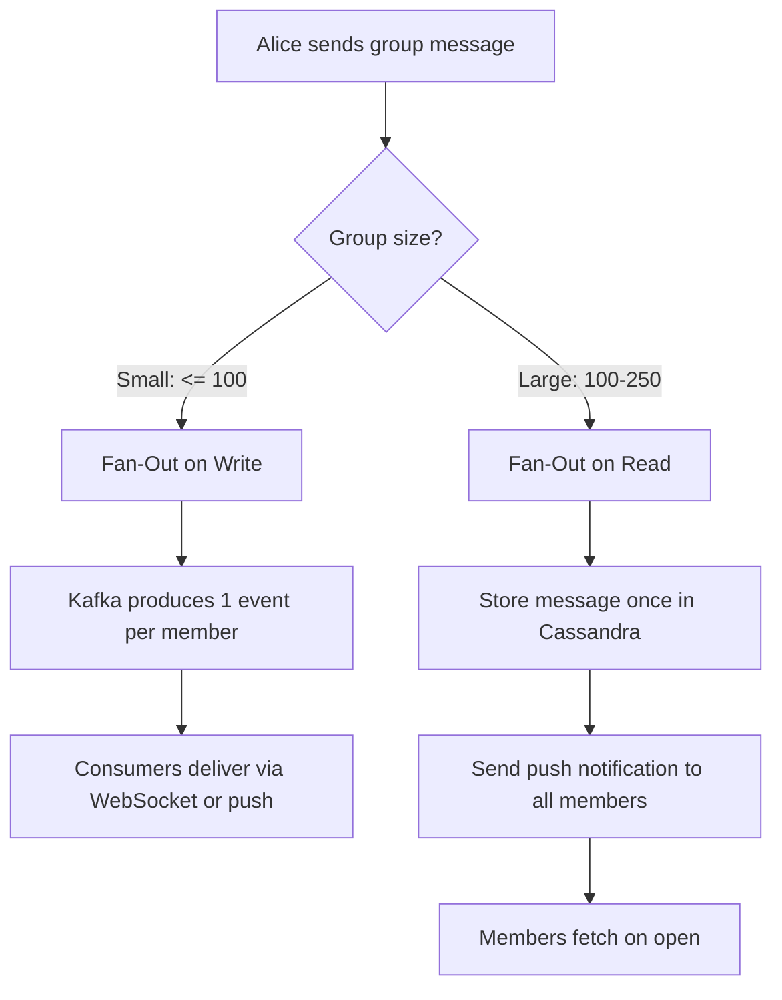
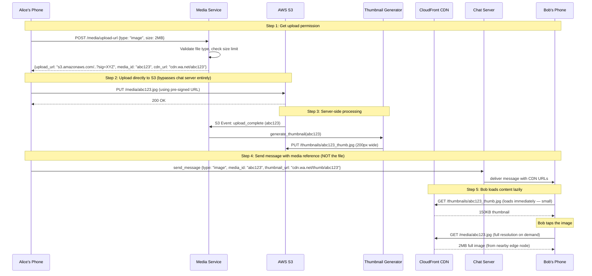
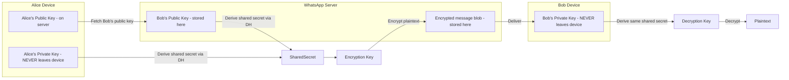
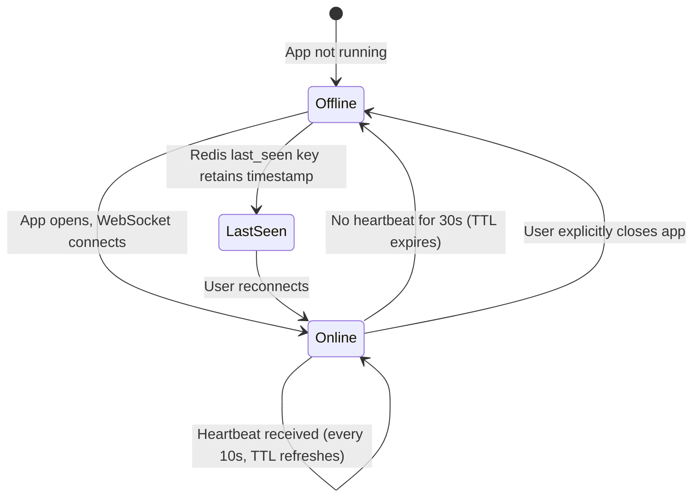
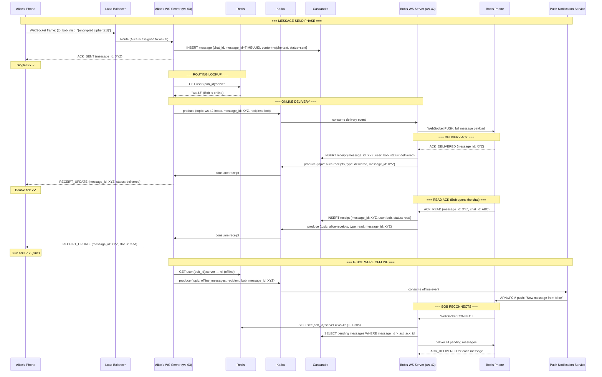

# Case Study: Design WhatsApp

> **System Design Interview Masterclass | Real-Time Messaging at 2 Billion Scale**

Yeh notes padhne ke baad tum WhatsApp ka poora system design kisi bhi interview mein confidently explain kar sakoge. Every decision is explained with a WHY first, then the HOW. Let us go.

---

## Table of Contents

1. [What Are We Actually Building?](#1-what-are-we-actually-building)
2. [Requirements — Functional and Non-Functional](#2-requirements--functional-and-non-functional)
3. [Capacity Estimation — The Math That Drives Every Decision](#3-capacity-estimation--the-math-that-drives-every-decision)
4. [High-Level Architecture Overview](#4-high-level-architecture-overview)
5. [Chat Server Selection — Consistent Hashing](#5-chat-server-selection--consistent-hashing)
6. [WebSocket — The Real-Time Backbone](#6-websocket--the-real-time-backbone)
7. [Message Storage — Why Cassandra](#7-message-storage--why-cassandra)
8. [Message Delivery and ACK Flow — The Three Ticks](#8-message-delivery-and-ack-flow--the-three-ticks)
9. [Offline Message Delivery — Push Notifications](#9-offline-message-delivery--push-notifications)
10. [Group Messaging — The Fan-Out Problem](#10-group-messaging--the-fan-out-problem)
11. [Media Sharing — S3, CDN, and Pre-Signed URLs](#11-media-sharing--s3-cdn-and-pre-signed-urls)
12. [End-to-End Encryption — Signal Protocol](#12-end-to-end-encryption--signal-protocol)
13. [Online Status and Last Seen — Presence System](#13-online-status-and-last-seen--presence-system)
14. [Full End-to-End Message Flow](#14-full-end-to-end-message-flow)
15. [Trade-Off Summary Tables](#15-trade-off-summary-tables)
16. [When to Use / When NOT to Use These Patterns](#16-when-to-use--when-not-to-use-these-patterns)
17. [Common Interview Questions](#17-common-interview-questions)
18. [Key Takeaways](#18-key-takeaways)

---

## 1. What Are We Actually Building?

**Analogy for a 5-year-old:** Imagine you want to pass a note to your friend sitting across the classroom. You could walk over yourself — but that is slow. So you have a note monitor: you hand the note to them, they look up where your friend is sitting, and they pass it instantly. If your friend is absent, the monitor keeps the note safely in their desk until they return. WhatsApp is exactly this — but for 2 billion people, simultaneously, in milliseconds.

Basically, what makes WhatsApp genuinely hard is not sending a single message. Sending one message is easy. The hard parts are:

- How do you route a message among hundreds of servers to find exactly where the recipient is connected?
- How do you confirm delivery without the sender polling constantly?
- How do you send one message to 250 people in a group without your server exploding?
- How do you make sure even WhatsApp's own engineers cannot read what you sent?

Yeh kyun important hai? Because these are exactly the problems interviewers want to hear you reason about. Let us go one by one.

---

## 2. Requirements — Functional and Non-Functional

### Functional Requirements (What the system must do)

| Feature | Specification |
|---|---|
| 1-to-1 Messaging | Two users send and receive text messages in real time |
| Group Messaging | Up to 250 members per group |
| Media Sharing | Images, videos, documents, voice notes |
| Online / Last Seen | Show if a contact is live online, or when they were last active |
| Read Receipts | Single tick (sent), double tick (delivered), blue tick (read) |
| End-to-End Encryption | Only sender and recipient can read the content — not even WhatsApp |
| Push Notifications | Alert offline users when a new message arrives |

### Non-Functional Requirements (How well it must do it)

| Property | Target | Why This Number |
|---|---|---|
| Scale | 2 billion registered users, 500M DAU | WhatsApp's actual numbers as of 2024 |
| Throughput | 100 billion messages/day | ~1.16M messages/second average |
| Latency | < 100ms same-region delivery | Human perception threshold |
| Availability | 99.99% uptime | < 52 minutes downtime/year |
| Durability | Zero message loss | Messages are financial/emotional — cannot be dropped |
| Consistency | Eventual consistency acceptable for presence/receipts | Strong consistency too expensive at this scale |

### Out of Scope (Say this explicitly in your interview)

- Video and voice calls (WebRTC — separate design)
- WhatsApp Pay (payments stack)
- Status/Stories (different read pattern — broadcast, not messaging)
- Account management and registration

---

## 3. Capacity Estimation — The Math That Drives Every Decision

**Analogy:** Before building a bridge, engineers calculate how many cars will cross per day. If you skip this step, you either build something too weak (it collapses) or too expensive (wasted money). Capacity estimation is your bridge engineering calculation.

Interviewers love this section. It shows you think in numbers, not just vague concepts.

### Users and Message Volume

```
Total registered users:    2,000,000,000   (2 billion)
Daily Active Users (DAU):    500,000,000   (25% DAU ratio — typical for messaging apps)
Messages per day:        100,000,000,000   (100 billion)

Average messages per second:
  100B messages / 86,400 seconds = 1,157,407 ≈ 1.16 million msg/sec

Peak throughput (3x average, morning/evening rush):
  1.16M × 3 = ~3.5 million msg/sec at peak
```

### Storage Estimation

```
Average text message size:       100 bytes
Average media message:           300 KB (includes thumbnail + metadata)
Media proportion:                10% of all messages

Text messages:   90B × 100 bytes = 9,000 GB = 9 TB/day
Media messages:  10B × 300 KB   = 3,000 TB = 3 PB/day

Annual text storage:    9 TB × 365     = ~3.3 PB/year
Annual media storage:   3 PB × 365     = ~1 EB/year (before deduplication)
After dedup (same memes sent many times): ~100-200 PB/year
```

### WebSocket Connection Estimation

```
DAU:                        500 million
Average session duration:   2 hours per day
Fraction online at once:    2 hours / 24 hours = ~8.3%

Concurrent WebSocket connections:
  500M × 8.3% = ~42 million simultaneous connections

WebSocket servers needed:
  Each server handles ~50,000 connections (industry standard)
  42M / 50K = 840 WebSocket servers minimum (more for redundancy)
```

### Bandwidth

```
Inbound (messages arriving at servers):
  3.5M msg/sec × 100 bytes = 350 MB/sec inbound

Outbound (fan-out to recipients, ~1.5x on average):
  350 MB/sec × 1.5 = ~525 MB/sec outbound (text only)
  Media adds significant additional bandwidth via CDN
```

**Interview tip:** Write these numbers on the whiteboard first. It forces both you and the interviewer to agree on scale before you start drawing boxes. It also signals — I design for actual numbers, not imaginary ones.

---

## 4. High-Level Architecture Overview

**Analogy:** Think of WhatsApp like a city postal system with many post offices. When you want to send a letter, you go to your nearest post office (chat server). They look up which post office your recipient belongs to (Redis routing table). They forward the letter there. If the recipient is away, the letter waits at the post office (Cassandra) until they return.



**Why this layered design?** Each layer has a single responsibility. WebSocket servers only care about connections. Cassandra only cares about storage. Redis only cares about routing. This means you can scale each layer independently. If writes spike, add Cassandra nodes. If connections spike, add WebSocket servers. You are not stuck scaling the whole system together.

---

## 5. Chat Server Selection — Consistent Hashing

**Analogy:** Imagine a clock face with 12 positions. Each post office is assigned a position on the clock. When a new customer (user) arrives, you spin a pointer and assign them to the nearest post office clockwise. If one post office shuts down, only its customers move to the next one — everyone else stays put. That is consistent hashing.

### Why Do We Need This?

We have 840+ WebSocket servers. When a user connects, we need a deterministic way to assign them to exactly one server. And when someone wants to send them a message, we need to find that server instantly.

Two naive approaches fail:

1. **Round-robin assignment:** Alice connects to server 3. Tomorrow she reconnects — server 3 might be overloaded or gone. Now nobody knows where she is.
2. **Random assignment with a lookup table:** Works, but if we store user→server mapping only in Redis, Redis becomes a bottleneck at 42M lookups/sec.

**Consistent hashing solves both:**

```
1. Map all servers to positions on a 360-degree ring
2. Hash each server ID: hash("ws-server-1") → position 47
3. When user connects: hash(user_id) → position on ring
4. Assign user to the next server clockwise from their position

Result: Same user always hashes to same server range.
If a server goes down, only ~1/N of users need reassignment.
```



### In Practice — Redis as the Source of Truth

Even with consistent hashing as a default assignment, we still write to Redis on every connection, because:

- Users switch networks (WiFi to 4G) → they reconnect to a different server
- Load balancers may override consistent hashing under extreme load
- Redis gives us sub-millisecond routing lookup

```python
# On user connection
def on_connect(user_id: str, ws_server_id: str):
    # Register mapping in Redis with 30-second TTL
    redis.setex(
        key=f"user:{user_id}:server",
        value=ws_server_id,
        time=30
    )
    # Update presence
    redis.setex(f"presence:{user_id}", "online", 30)
    redis.set(f"last_seen:{user_id}", current_unix_timestamp())

# Heartbeat keeps the mapping alive
def on_heartbeat(user_id: str, ws_server_id: str):
    redis.expire(f"user:{user_id}:server", 30)
    redis.expire(f"presence:{user_id}", 30)
```

**Trade-off:** Redis becomes a single point of failure for routing. Solution: Redis Cluster (sharded across multiple nodes) with replication. If the primary shard for a user fails, the replica promotes in seconds.

---

## 6. WebSocket — The Real-Time Backbone

**Analogy:** HTTP is like postal mail — you write a letter, send it, and wait for a reply letter. WebSocket is like a phone call — once you dial in, both sides can speak and listen simultaneously without hanging up and redialing.

### Why Not Use HTTP Polling?

| Approach | How It Works | Message Latency | Server Load | WhatsApp Uses? |
|---|---|---|---|---|
| Short Polling | Client asks every 5 sec: "any messages?" | Up to 5 seconds | Extremely high (N users × N/5 requests/sec) | No |
| Long Polling | Client asks, server holds open until message or timeout | 1-3 seconds | High (blocked threads) | No |
| Server-Sent Events | Server pushes, client cannot send back | < 100ms | Medium | No — need bidirectional |
| **WebSocket** | **Persistent bidirectional TCP connection** | **< 50ms** | **Low (1 connection per user)** | **Yes** |

At 42 million concurrent users, short polling at 5-second intervals means 8.4 million HTTP requests per second just for "any messages?" — before a single actual message is sent. Absolute madness. WebSocket eliminates this entirely.

### WebSocket Connection Lifecycle



### The Routing Problem: Inter-Server Delivery

Here is the interesting part. Alice is connected to WS-Server-3. Bob is connected to WS-Server-42. How does Alice's message get from Server-3 to Server-42?

**Answer: Kafka as the internal message bus**

```python
# On WS Server 3, after receiving Alice's message
def route_message(sender_id: str, recipient_id: str, message: dict):
    # Look up which server Bob is on
    target_server = redis.get(f"user:{recipient_id}:server")

    if target_server:
        # Bob is online — publish to that server's Kafka topic
        kafka.produce(
            topic=f"ws-server-{target_server}-inbox",
            key=recipient_id,
            value=message
        )
    else:
        # Bob is offline — put in offline queue
        kafka.produce(
            topic="offline_messages",
            key=recipient_id,
            value=message
        )
```

Each WebSocket server consumes from its own Kafka topic and delivers to connected users. This decouples routing from delivery completely.

---

## 7. Message Storage — Why Cassandra

**Analogy:** Imagine a hotel guest book. Guests always sign at the bottom — they never cross out old entries or rearrange the book. The book is also duplicated across multiple hotel branches so it cannot be lost. That is exactly how Cassandra stores messages: append-only, fast writes, distributed, fault-tolerant.

### Why Not MySQL?

You might think: "I know MySQL, why not use that?" Let us be honest about the numbers.

At peak: **3.5 million writes per second.** MySQL with the best hardware tops out at ~50,000 writes/sec. You would need 70 MySQL servers and complex sharding logic that you will have to maintain forever. And MySQL is optimized for reads with complex joins — messages do not need joins.

### Why Cassandra Wins for Messages

1. **LSM-Tree writes:** Writes go to memory (MemTable) first, then flush to disk. No random disk I/O. Millions of writes/sec is normal for Cassandra.
2. **Horizontal scaling:** Add a node, capacity increases linearly. No painful re-sharding.
3. **No single point of failure:** Every node is equal. Cassandra is designed to survive node failures without downtime.
4. **Natural partitioning:** Messages for one conversation always read together. One partition key = one conversation = one fast sequential read.

### Schema Design

```sql
-- The messages table — the heart of WhatsApp storage
CREATE TABLE messages (
    chat_id     UUID,        -- Partition key: all msgs in a chat live together
    message_id  TIMEUUID,    -- Clustering key: time-ordered UUID (auto-sorted)
    sender_id   UUID,
    recipient_id UUID,
    content     TEXT,        -- Encrypted ciphertext (NOT plaintext)
    media_url   TEXT,        -- CDN URL if media message
    msg_type    TEXT,        -- 'text', 'image', 'video', 'audio', 'document'
    created_at  TIMESTAMP,
    PRIMARY KEY ((chat_id), message_id)
) WITH CLUSTERING ORDER BY (message_id DESC);
-- DESC = newest messages first (most common scroll pattern)
```

**Why TIMEUUID and not a regular integer ID?**

TIMEUUID (UUID v1) has the timestamp encoded inside it. This means:
- Messages are automatically time-ordered without a separate `ORDER BY` on timestamp
- IDs are globally unique even when 840 servers generate them simultaneously — no coordination needed
- You can extract the exact timestamp from any message_id without querying the database

```python
# Example: generate_timeuuid() is time-based and globally unique
message_id = uuid.uuid1()  # version 1 UUID contains timestamp
# Extract creation time: uuid.UUID(str(message_id)).time
```

### Partitioning Strategy

```
For 1-to-1 chats:
  chat_id = deterministic_hash(min(user_a_id, user_b_id), max(user_a_id, user_b_id))
  This ensures Alice→Bob and Bob→Alice map to the SAME chat_id

For group chats:
  chat_id = group_id
```

### Handling Hot Partitions

**Analogy:** Imagine one post office getting 100x the mail of every other office in the city — it collapses. A Cassandra hot partition is the same problem.

Very active groups can hammer a single partition. Solution: time-bucket the partition key.

```sql
-- For high-traffic groups: partition by (group_id + month)
CREATE TABLE group_messages (
    group_id    UUID,
    bucket      TEXT,        -- "202601" (year-month)
    message_id  TIMEUUID,
    sender_id   UUID,
    content     TEXT,
    PRIMARY KEY ((group_id, bucket), message_id)
) WITH CLUSTERING ORDER BY (message_id DESC);

-- To read the last 50 messages:
-- First query current bucket, if not enough, query previous bucket
```

### Message Receipts — Separate Table

Do NOT update the message row to track delivery status. Cassandra updates are actually tombstones + new inserts — frequent updates on the same row create garbage. Instead, use a separate receipts table:

```sql
CREATE TABLE message_receipts (
    message_id  TIMEUUID,
    user_id     UUID,           -- Which recipient acknowledged
    status      TEXT,           -- 'delivered' or 'read'
    ack_at      TIMESTAMP,
    PRIMARY KEY (message_id, user_id)
);
```

This is append-only, clean, and fast. One INSERT per ACK, never an UPDATE.

---

## 8. Message Delivery and ACK Flow — The Three Ticks

**Analogy:** Think of WhatsApp ticks like a courier service tracker. One tick means "your parcel left the warehouse" (courier company has it). Two ticks mean "your parcel arrived at the destination address" (handed to recipient's building). Blue ticks mean "the recipient physically collected it" (they signed for it).

### The Three States

```
State 1 — SENT        ✓      Server received and stored the message
State 2 — DELIVERED   ✓✓     Recipient's device received the message
State 3 — READ        ✓✓ (blue)   Recipient opened the conversation
```

### Why Three Separate States?

Each state serves a different purpose for the sender:
- **Sent:** "My message is not lost. The network delivered it to WhatsApp servers."
- **Delivered:** "Bob's phone has it. Even if he is in a tunnel, it will pop up when signal returns."
- **Read:** "Bob has actually seen it. He is choosing not to reply." (Aaaaand now relationships get complicated.)

### The ACK Flow — Step by Step



### What Happens If Alice Disconnects Before Seeing the Receipt?

The receipt events are stored in Cassandra. When Alice reconnects, her WebSocket server fetches all pending receipt events for her sent messages and updates the UI. No receipt is ever lost — they persist independently of both users' connection state.

### Group Read Receipts — Slightly Different

For groups, a message is "delivered" when it reaches the first member's device, and fully "delivered" when all members have it. WhatsApp tracks individual delivery/read per member but shows the sender an aggregate view.

```
Single tick  ✓     = Server received it (regardless of group size)
Double tick  ✓✓    = Every member's device has received it
Blue ticks   ✓✓    = Every member has opened the conversation
```

For 250-member groups, this means 250 receipt events per message. Yeh thodi heavy hai — which is why receipts go to a separate Kafka topic and are processed asynchronously.

---

## 9. Offline Message Delivery — Push Notifications

**Analogy:** Think of this like leaving a voicemail. You do not sit on hold waiting for someone to answer. You leave the voicemail, hang up. When they return, the voicemail is waiting. If their phone was off, a notification wakes it up the moment they turn it on.

### What "Offline" Means in This System

A user is considered offline when:
- Their Redis key `user:{user_id}:server` has expired (no heartbeat in 30 seconds)
- Their WebSocket connection dropped (network switch, app backgrounded, phone locked)

### Two-Layer Delivery

**Layer 1 — Push Notification (wakes the device)**

```python
def handle_offline_recipient(recipient_id: str, message: dict):
    # Message is already durably stored in Cassandra

    device_info = mysql.get_device_tokens(recipient_id)

    if device_info.platform == "ios":
        apns_client.send(
            device_token=device_info.token,
            payload={
                "aps": {
                    "alert": "New message",
                    "badge": 1,
                    "sound": "default",
                    "content-available": 1  # wake app silently if needed
                },
                "message_id": str(message["message_id"])
            }
        )
    elif device_info.platform == "android":
        fcm_client.send(
            registration_token=device_info.token,
            notification={
                "title": "New message",
                "body": "You have a new message"
            },
            data={"message_id": str(message["message_id"])}
        )
```

**Layer 2 — Message Pull on Reconnect (delivers the actual content)**

```python
def on_user_reconnect(user_id: str, ws_server_id: str):
    # Step 1: Register in Redis
    redis.setex(f"user:{user_id}:server", ws_server_id, 30)

    # Step 2: Find the last message this user acknowledged
    last_ack = redis.get(f"last_ack:{user_id}") or "0"

    # Step 3: Fetch all pending messages from Cassandra
    pending_chats = mysql.get_user_chats(user_id)

    for chat_id in pending_chats:
        messages = cassandra.query(
            """
            SELECT * FROM messages
            WHERE chat_id = %s AND message_id > %s
            ORDER BY message_id ASC
            LIMIT 100
            """,
            (chat_id, last_ack)
        )

        for msg in messages:
            websocket.push(user_id, msg)
            # Send delivered ACK immediately
            send_ack_delivered(msg.message_id, user_id)
```

### Why Push Notifications Do NOT Contain the Message

This is a privacy choice. APNs and FCM (Apple and Google's notification servers) see your notification payload. If the notification contained the message text, it would be readable by Apple/Google, breaking E2E encryption. So the push is just a "knock knock — wake up and connect." The real message fetches over the encrypted WebSocket.

---

## 10. Group Messaging — The Fan-Out Problem

**Analogy:** Imagine a radio station. One person speaks into the mic, and everyone with a radio tuned to that frequency hears it. The question is: does the radio station broadcast one signal and everyone picks it up (pull), or does the station send individual audio files to each listener's house (push)? Both work — but for different audience sizes.

### The Fan-Out Problem Defined

When Alice sends a message to a group of 250 people:
- Message must reach all 250 members
- 249 delivery ACKs must come back
- Ordering must be maintained per member
- Some members are online, some are offline

**Naive approach:** Server loops through all 250 members and pushes to each.

```
Problem: 1.16M msgs/sec × 250 members = 290M delivery operations/sec
That is catastrophically expensive.
```

### Option A: Fan-Out on Write (Push Model)

Immediately deliver to all members when the message arrives.

```python
def send_group_message_fan_out_write(sender_id, group_id, message):
    # Store message once
    message_id = cassandra.insert(chat_id=group_id, message=message)

    # Get all members
    members = mysql.query(
        "SELECT user_id FROM group_members WHERE group_id = %s",
        group_id
    )

    # Fan out asynchronously via Kafka
    for member_id in members:
        if member_id == sender_id:
            continue
        kafka.produce(
            topic="group_delivery",
            key=str(member_id),  # key ensures per-user ordering
            value={"message_id": message_id, "recipient": member_id}
        )
```

| Pro | Con |
|---|---|
| Recipients always have messages ready | Write amplification: 1 msg = 249 Kafka events |
| Low read latency when opening app | Expensive for large groups with offline members |
| Simple recipient logic | Wasted work if members are mostly offline |

### Option B: Fan-Out on Read (Pull Model)

Store the message once. Members fetch it when they open the app.

```python
def send_group_message_fan_out_read(sender_id, group_id, message):
    # Store message ONCE — that's it
    message_id = cassandra.insert(chat_id=group_id, message=message)

    # Just notify members (no actual delivery yet)
    members = mysql.query("SELECT user_id FROM group_members WHERE group_id = %s", group_id)
    for member_id in members:
        push_notification_service.notify(member_id, "New message in group")

# When user opens the group:
def load_group_messages(user_id, group_id, last_seen_message_id):
    return cassandra.query(
        "SELECT * FROM messages WHERE chat_id = %s AND message_id > %s LIMIT 50",
        (group_id, last_seen_message_id)
    )
```

| Pro | Con |
|---|---|
| One write, no amplification | Higher latency — user must open app to "receive" |
| Perfect for large groups | Not truly real-time for offline members |
| Scales to any group size | More complex unread count tracking |

### WhatsApp's Hybrid Approach (The Real Answer)

```
Group size <= 100 members:   Fan-Out on Write (via Kafka, async)
Group size 100-250 members:  Fan-Out on Read with push notification wake-up
```



### Group Membership Storage

Group metadata is relational — it needs joins ("which groups is this user in?") and transactional consistency ("if you add a member, they must see all future messages"). MySQL is the right choice here.

```sql
CREATE TABLE groups (
    group_id    CHAR(36) PRIMARY KEY,
    name        VARCHAR(100) NOT NULL,
    description TEXT,
    created_by  CHAR(36) NOT NULL,
    created_at  DATETIME NOT NULL,
    max_members INT DEFAULT 250,
    avatar_url  TEXT
);

CREATE TABLE group_members (
    group_id    CHAR(36),
    user_id     CHAR(36),
    role        ENUM('admin', 'member') DEFAULT 'member',
    joined_at   DATETIME NOT NULL,
    added_by    CHAR(36),
    PRIMARY KEY (group_id, user_id)
);

-- Critical: Find all groups for a specific user (for reconnect sync)
CREATE INDEX idx_member_groups ON group_members(user_id, group_id);
```

---

## 11. Media Sharing — S3, CDN, and Pre-Signed URLs

**Analogy:** When you ship a package via FedEx, you do not put the package inside the shipping label envelope. The envelope has the label and tracking number; FedEx ships the actual package separately. WhatsApp media works exactly this way — the message contains a URL (the tracking number), not the actual file.

### Why Never Send Media Through WebSocket or Cassandra

If you tried to push a 10MB video through a WebSocket:
- Your WebSocket server's memory would spike trying to buffer it
- Every re-delivery attempt would resend the full 10MB
- Cassandra rows have size limits and are not designed for blobs
- No content deduplication — the same viral video sent by 1,000 users = 1,000 full copies

### The Pre-Signed URL Pattern (Two-Step Upload)



### Content Deduplication — The Big Win

Same meme sent by 10,000 people? Store it once.

```python
import hashlib

def handle_upload_request(user_id: str, file_bytes: bytes, file_type: str):
    # Compute SHA-256 hash of the file
    file_hash = hashlib.sha256(file_bytes).hexdigest()

    # Check if this exact file already exists
    existing_url = redis.get(f"media_hash:{file_hash}")

    if existing_url:
        # Deduplication win — return existing CDN URL
        return {"cdn_url": existing_url, "media_id": existing_url.split("/")[-1]}

    # New file — upload to S3
    media_id = generate_uuid()
    s3_key = f"media/{media_id}.{file_type}"
    s3.put_object(Bucket="wa-media", Key=s3_key, Body=file_bytes)
    cdn_url = f"https://cdn.whatsapp.net/{s3_key}"

    # Cache hash → url for 30 days
    redis.setex(f"media_hash:{file_hash}", cdn_url, 86400 * 30)

    return {"cdn_url": cdn_url, "media_id": media_id}
```

Duplication savings at WhatsApp scale: industry estimates suggest 30-40% of media messages are duplicates (same meme, same forwarded content). That is 300-400 PB of storage saved annually.

### CDN Strategy

- Media files are served from edge nodes close to the user (CloudFront in 400+ locations worldwide)
- Thumbnails are aggressively cached with long TTLs (immutable content — content ID never reuses)
- Full-resolution media is lazy-loaded only when user taps
- CDN handles ~3 PB/day of media traffic — chat servers see none of it

---

## 12. End-to-End Encryption — Signal Protocol

**Analogy:** Imagine a special lockbox that only you have the key to. Alice puts her message inside a lockbox sealed with Bob's padlock. She sends the lockbox. WhatsApp's servers receive it, forward it — but they cannot open it. Only Bob has the key to his padlock. Even if WhatsApp's servers are hacked, the hacker sees only locked boxes.

### Why Does E2E Encryption Matter?

Without E2E encryption:
- WhatsApp employees could read your messages
- Government subpoenas could expose message contents
- A breach of WhatsApp servers = a breach of every user's private conversations

With E2E encryption, WhatsApp stores encrypted ciphertext. Even with a government court order, WhatsApp can only hand over gibberish.

### Signal Protocol — The Gold Standard

WhatsApp uses the **Signal Protocol**, created by Open Whisper Systems. It consists of two parts:

**Part 1: X3DH — Extended Triple Diffie-Hellman (initial key exchange)**

```
Each user's device generates (NEVER sent to server in private form):
  - Identity Key Pair (IK)  — long-lived, identifies the user
  - Signed PreKey (SPK)     — rotated every few weeks
  - One-Time PreKeys (OPK)  — batch of single-use keys (100 at a time)

Server stores ONLY the public halves of these keys.
When Alice wants to message Bob for the first time:
  1. Alice fetches Bob's public keys from server
  2. Alice performs Diffie-Hellman using her keys + Bob's public keys
  3. This produces a shared secret — same secret Bob will derive independently
  4. Neither Alice nor Bob transmitted the secret — they derived it mathematically
  5. Server never saw the secret
```

**Part 2: Double Ratchet — Per-message key evolution**

```
After the initial session is established:
  - A NEW encryption key is derived for EVERY single message
  - If one key is compromised, past messages remain safe (forward secrecy)
  - The ratchet advances forward only — cannot go backwards
  - Even if Alice's phone is stolen today, yesterday's messages remain encrypted
```



### What the Server Sees vs. What It Cannot See

```
Server CAN see:
  ✓ Sender ID and recipient ID (needed for routing)
  ✓ Message timestamp (needed for ordering)
  ✓ Message size (metadata)
  ✓ Public keys (needed for initial key exchange)
  ✓ Encrypted ciphertext (unreadable without recipient's private key)

Server CANNOT see:
  ✗ Message plaintext (never)
  ✗ Private keys (never leave device)
  ✗ The shared session secret (mathematically derived, never transmitted)
  ✗ Group message contents (same protocol applies)
```

### Simplified Code Illustration

```python
# This is a CONCEPTUAL illustration, not actual Signal Protocol code

def send_e2e_message(
    alice_private_key,      # stays on Alice's device
    bob_public_key,         # fetched from WhatsApp server
    plaintext: str
) -> bytes:
    # 1. Derive shared secret using Diffie-Hellman
    shared_secret = diffie_hellman(alice_private_key, bob_public_key)

    # 2. Derive encryption key using HKDF (key derivation function)
    message_key = hkdf(
        input_key_material=shared_secret,
        salt=b"WhatsApp Message Key",
        length=32
    )

    # 3. Encrypt with AES-GCM (authenticated encryption)
    iv = os.urandom(12)
    ciphertext = aes_gcm_encrypt(
        key=message_key,
        iv=iv,
        plaintext=plaintext.encode("utf-8")
    )

    # 4. Advance the ratchet — message_key is now discarded
    # Next message will use a different derived key
    ratchet.advance()

    # Server only ever stores: ciphertext + iv + sender + recipient + timestamp
    return ciphertext + iv
```

**Interview tip:** You do not need to explain every cryptographic detail. The key points are: (1) keys generated on device, (2) server stores only ciphertext, (3) Double Ratchet gives forward secrecy, (4) each message gets a unique key. That is what interviewers want to hear.

---

## 13. Online Status and Last Seen — Presence System

**Analogy:** Think of the "Available" lamp on an office desk phone. When you sit down, the green light turns on. When you walk away for too long, it turns off. Nobody had to manually update a database — the light just expires. WhatsApp's presence system works on the same principle: Redis TTL keys that expire automatically when the user stops sending heartbeats.

### The Scale Challenge

With 500M DAU, naively broadcasting every user's presence to all their contacts would be:

```
Average contacts per user:   200
Presence update events/day:  500M users × (1 connect + 1 disconnect) = 1B events
Per second average:          ~11,600 presence events/sec (manageable)
Peak (everyone wakes up at 8am): could spike to 500K+ events/sec
```

The trick is: **most people do not need to know most other people's presence.** You only need presence updates from contacts you are currently chatting with or have open conversations with.

### Design: Lazy Presence with TTL

```python
# Called every 10 seconds by the client (heartbeat)
def refresh_presence(user_id: str):
    pipe = redis.pipeline()
    # Mark as online for 30 seconds
    pipe.setex(f"presence:{user_id}", 30, "online")
    # Refresh routing key too
    pipe.expire(f"user:{user_id}:server", 30)
    pipe.execute()

# On graceful disconnect (app closed normally)
def on_disconnect(user_id: str):
    redis.delete(f"presence:{user_id}")
    redis.set(f"last_seen:{user_id}", current_unix_timestamp())

# If user drops connection without logging out (phone dies, network cut)
# The TTL expires automatically in 30 seconds — no special handling needed

# Query presence
def is_online(user_id: str) -> bool:
    return redis.exists(f"presence:{user_id}") == 1

def get_last_seen(user_id: str) -> int | None:
    return redis.get(f"last_seen:{user_id}")
```

### Presence Fan-Out — Efficient Notification

When Alice comes online, which of her 200 contacts need to know?

Only those who are also online AND have Alice's chat open. The rest do not care until they open the app.

```python
def broadcast_presence_change(user_id: str, status: str):
    # Get all contacts of this user from MySQL
    contacts = mysql.get_contacts(user_id)

    for contact_id in contacts:
        # Only notify contacts who are currently online
        if not redis.exists(f"presence:{contact_id}"):
            continue  # They're offline — no point notifying

        target_server = redis.get(f"user:{contact_id}:server")
        if target_server:
            # Push presence event to that contact's WebSocket server
            kafka.produce(
                topic=f"ws-{target_server}-inbox",
                key=contact_id,
                value={
                    "type": "presence_update",
                    "user_id": user_id,
                    "status": status,  # "online" or "offline"
                    "last_seen": redis.get(f"last_seen:{user_id}")
                }
            )
```

### Privacy Settings

WhatsApp lets users choose who sees their last seen. This is a simple filter applied at query time:

```python
def get_user_presence(requester_id: str, target_id: str) -> dict | None:
    # Fetch privacy setting for target user
    privacy = mysql.query_one(
        "SELECT last_seen_privacy FROM user_privacy WHERE user_id = %s",
        target_id
    )

    if privacy.last_seen_privacy == "nobody":
        return None  # Hidden from everyone

    elif privacy.last_seen_privacy == "contacts_only":
        are_contacts = mysql.query_one(
            "SELECT 1 FROM contacts WHERE user_id = %s AND contact_id = %s",
            (target_id, requester_id)
        )
        if not are_contacts:
            return None  # Hidden from non-contacts

    # else "everyone" — return the data
    return {
        "is_online": redis.exists(f"presence:{target_id}") == 1,
        "last_seen": redis.get(f"last_seen:{target_id}")
    }
```

### Presence State Machine



---

## 14. Full End-to-End Message Flow

This is the complete journey of one message. Samjho aise — this is your interview money shot. If you can explain this diagram, you pass the system design round.



---

## 15. Trade-Off Summary Tables

### Message Database Selection

| Database | Write Speed | Read Pattern | Horizontal Scale | Fault Tolerance | Best For |
|---|---|---|---|---|---|
| MySQL | Medium | Complex queries + joins | Hard (sharding) | With replication | User profiles, groups |
| PostgreSQL | Medium | Complex queries + joins | Hard | With replication | Relational data |
| MongoDB | Fast | Document lookups | Good | With replication | Semi-structured data |
| **Cassandra** | **Very Fast** | **Time-series, by partition** | **Native** | **Multi-master** | **Messages** |
| DynamoDB | Fast | Key-value + range | Native (AWS) | Native | Alternative to Cassandra |
| Redis | Fastest | Key lookups only | With Cluster | With Sentinel | Routing, presence, cache |

### Real-Time Transport Options

| Approach | Latency | Server Memory | Bidirectional | Battery (Mobile) | Verdict |
|---|---|---|---|---|---|
| Short Polling (every 5s) | 0-5s | Very high | Yes | Very bad (constant wake) | Never for messaging |
| Long Polling | 0-30s | High | Via separate request | Bad | Acceptable fallback only |
| Server-Sent Events (SSE) | < 100ms | Medium | One-way only | Okay | No — need bidirectional |
| **WebSocket** | **< 50ms** | **Low** | **Yes** | **Good** | **WhatsApp's choice** |

### Group Fan-Out Strategies

| Strategy | Write Cost | Read Latency | Memory | Best Group Size |
|---|---|---|---|---|
| Fan-out on Write | O(n) writes per message | Very low (pre-delivered) | Higher | < 100 members |
| Fan-out on Read | O(1) write per message | Medium (fetch on open) | Lower | 100-250+ members |
| **Hybrid** | **O(n) for small, O(1) for large** | **Low for both** | **Balanced** | **WhatsApp's approach** |

### Media Storage Options

| Option | Cost | Latency | Deduplication | CDN-friendly | Verdict |
|---|---|---|---|---|---|
| Store in DB (Cassandra) | Very high | Slow (row size limits) | No | No | Never |
| Store in server filesystem | High (not distributed) | Fast locally | No | Hard | No |
| **S3 + CDN** | **Low (object storage)** | **Low (edge cache)** | **Yes (hash-based)** | **Native** | **WhatsApp's choice** |

### Presence System Approaches

| Approach | Accuracy | Server Load | Scale |
|---|---|---|---|
| Real-time broadcast (every event) | Perfect | Extremely high | Poor |
| **TTL-based Redis (heartbeat every 10s)** | **Within 30s accuracy** | **Low** | **Excellent** |
| Database polling | Seconds to minutes | Medium | Poor |

---

## 16. When to Use / When NOT to Use These Patterns

### WebSocket

**Use when:**
- Bidirectional communication is required (both sides send data)
- Latency must be < 100ms (messaging, live scores, collaborative editing)
- Users maintain long sessions (chat, trading platforms, multiplayer games)
- Example: WhatsApp, Slack, Google Docs, live stock tickers

**Do NOT use when:**
- Simple request-response is sufficient (REST is simpler)
- Clients connect briefly and infrequently (HTTP is better)
- You need HTTP caching (WebSocket bypasses all caches)
- Your clients are serverless functions (they do not maintain connections)

### Cassandra for Time-Series Data

**Use when:**
- Write throughput is the primary concern (millions/sec)
- Data has a natural partition key (chat_id, user_id, sensor_id)
- Reads are always by partition (not cross-partition joins)
- Horizontal scale is required without sharding complexity
- Eventual consistency is acceptable

**Do NOT use when:**
- You need ACID transactions (use PostgreSQL)
- You need complex joins (use MySQL/PostgreSQL)
- Your team does not understand the consistency model (dangerous)
- Data volume is small — the operational overhead is not worth it

### Fan-Out on Write

**Use when:**
- Groups are small and bounded (WhatsApp: < 100 members)
- Most members are online at message time
- Read latency is the primary concern (social feed of 200 followers)

**Do NOT use when:**
- Groups are large (Twitter-style: 10M followers — use fan-out on read)
- Most members are offline (wasted write amplification)
- Storage cost is critical

### Signal Protocol / E2E Encryption

**Use when:**
- Privacy is a core product guarantee (messaging, healthcare, legal)
- You want zero liability for content (server cannot read = cannot be compelled to reveal)
- Your users are in high-risk environments (journalists, activists)

**Do NOT use when:**
- You need content moderation (E2E prevents server-side scanning)
- You need message recall from server after delivery (impossible — server cannot decrypt)
- Backup/sync across devices adds complexity you cannot support

---

## 17. Common Interview Questions

These are actual questions asked at FAANG, Flipkart, Zomato, Swiggy, PayTM, and startup interviews. Yeh seriously practice karo.

### Q1: How does a message get from Alice's phone to Bob's phone?

**Model Answer:**
1. Alice's app sends an encrypted WebSocket frame to her assigned Chat Server (via load balancer)
2. The Chat Server saves the message to Cassandra and sends Alice an ACK (single tick)
3. The server looks up Bob's current server in Redis
4. If Bob is online: message is published to Bob's server's Kafka topic → Bob's server delivers via WebSocket → Bob's phone sends ACK_DELIVERED → Alice gets double tick
5. If Bob is offline: message goes to offline queue → push notification wakes Bob's phone → on reconnect, Bob's server fetches pending messages from Cassandra → delivers → ACK sent

### Q2: Why not use a database like MySQL for messages instead of Cassandra?

**Model Answer:**
MySQL writes top out at ~50,000/sec on good hardware. At peak load we need 3.5 million writes/sec. You would need 70+ MySQL shards with complex routing logic. Cassandra scales horizontally — add nodes, capacity grows linearly. Messages also have a perfect partition key (chat_id), so all reads for a conversation are one sequential scan on one partition. MySQL joins and ACID overhead are unnecessary for messages.

### Q3: How do you handle the fan-out problem for large groups?

**Model Answer:**
We use a hybrid approach. For groups under 100 members, fan-out on write — one Kafka event per member, processed asynchronously. For groups 100-250 members, fan-out on read — store the message once, send a push notification, and members fetch on open. This prevents the write amplification that would destroy our Kafka throughput if we fan-outed 250 messages for every message in large groups.

### Q4: What happens if a WebSocket server crashes mid-delivery?

**Model Answer:**
The message is already stored in Cassandra before delivery is attempted — so it is durable. The sender has not yet received a delivery ACK, so they will eventually show the message as stuck on single tick. When the recipient reconnects (to a different server, assigned by consistent hashing), they fetch all undelivered messages by querying Cassandra for messages after their last acknowledged message_id. The delivery ACK then flows back to the sender, updating the tick.

### Q5: How does end-to-end encryption work with group messages?

**Model Answer:**
For group messages, Signal Protocol uses a "Sender Key" distribution mechanism. When a group is created, each member generates a Sender Key and distributes it (encrypted to each individual member) to all group participants. When Alice sends a group message, she encrypts once with her Sender Key — not N times, one per member. Each recipient's device already has Alice's Sender Key to decrypt. This avoids the O(n) encryption overhead that would happen if you encrypted separately for each member.

### Q6: How would you handle presence at scale? What if 500M users come online at the same time?

**Model Answer:**
The presence system is already designed for this. Each user heartbeats every 10 seconds — the load is spread. A mass connect event (say, after a power outage) would create ~50M Redis writes in a short window. We handle this with Redis Cluster (sharded across multiple nodes) and rate-limiting reconnects with exponential backoff on the client side. We also make presence eventually consistent — a 30-second stale window is acceptable. The client subscribes only to presence of contacts they have open conversations with, not all 200 contacts.

### Q7: How do you ensure message ordering?

**Model Answer:**
Messages within a conversation are ordered by TIMEUUID (time-based UUID v1), which encodes the timestamp. Since Kafka keys are set to recipient_id, all events for one user are in one Kafka partition = guaranteed ordering. Cassandra reads are always sorted by TIMEUUID. The challenge is clock skew on sender devices — a message with a slightly wrong timestamp could appear out of order. Solution: use server-assigned TIMEUUID at the Chat Server level, not client-provided timestamps.

### Q8: How would you scale from 100M to 2B users?

**Model Answer:**
Each component scales independently:
- WebSocket Servers: add servers, update consistent hashing ring
- Redis: use Redis Cluster with consistent hashing for sharding
- Cassandra: add nodes to the ring; data rebalances automatically
- Kafka: add partitions and consumers; linear throughput increase
- MySQL (group metadata): add read replicas for read scaling; shard by group_id prefix for write scaling
- Media: S3 scales infinitely; add more CDN edge nodes for new regions

The key is stateless WebSocket servers — they hold no data themselves, just connections. This means horizontal scaling is trivial.

### Q9: How does WhatsApp's E2E encryption affect backup and restore?

**Model Answer:**
This is a real tension. Local device backups (to iCloud/Google Drive) can be E2E encrypted using a key derived from the user's phone number — this is what WhatsApp does. The key is never stored on WhatsApp servers; it is derived client-side and stored in the backup. When restoring, the user's phone derives the same key from their number and decrypts the backup. The trade-off: if you lose both your phone and forget your backup password, messages are gone forever — by design.

### Q10: Why do read receipts (blue ticks) require a separate table, not an update to the message row?

**Model Answer:**
In Cassandra, "updates" are actually a new cell with a higher timestamp — they do not modify existing cells in place. Frequent updates to the same row create "tombstones" (deletion markers) that accumulate and slow down reads. For messages with millions of reads across 250-person groups, each message could have hundreds of receipt updates. A separate `message_receipts` table allows pure append-only writes — one INSERT per ACK — with no tombstone accumulation and clean partition access patterns.

---

## 18. Key Takeaways

These are the 12 things you MUST know cold. If an interviewer asks any WhatsApp question, these are your foundation.

**1. WebSocket is the real-time backbone.**
One persistent TCP connection per user. Bidirectional. No polling. At 42M concurrent users, this is the only option that does not melt servers.

**2. Redis is the routing table.**
`user:{user_id}:server → ws-server-id` with 30-second TTL. This is how a message on Server 3 finds a user on Server 42. Without this, you would broadcast to all 840 servers — catastrophic.

**3. Cassandra is the message store.**
Partition by `chat_id`. Cluster by `TIMEUUID`. Append-only. 3.5M writes/sec. No joins needed. Horizontal scale by design.

**4. ACK flow has three distinct states.**
Sent ✓ = server got it. Delivered ✓✓ = recipient device got it. Read ✓✓(blue) = recipient opened it. Each state is a separate event INSERT to a receipts table — not an UPDATE to the message row.

**5. Receipts go in a separate table, not message row updates.**
Cassandra tombstones make frequent updates to hot rows expensive. Append-only receipt inserts are clean and fast.

**6. Offline delivery is two-layer.**
Push notification (APNs/FCM) wakes the device. On reconnect, pending messages are fetched from Cassandra. Push notification NEVER contains message text (E2E privacy).

**7. Group fan-out is a conscious tradeoff.**
Small groups (< 100): fan-out on write via Kafka. Large groups (100-250): fan-out on read + push notification. Hybrid avoids write amplification while keeping latency low for active groups.

**8. Media NEVER goes through chat servers.**
Pre-signed S3 URL → direct client upload → CDN URL in the message. Chat servers only see a URL, not bytes. Content dedup via SHA-256 hash saves 30-40% storage.

**9. E2E encryption means server sees only ciphertext.**
Signal Protocol: X3DH for session establishment, Double Ratchet for per-message keys. Private keys never leave device. Server cannot read messages even with full database access.

**10. Presence uses TTL-based Redis, not database polling.**
Heartbeat every 10s refreshes a 30s TTL key. No heartbeat = key expires = user offline. Last seen timestamp is a separate persistent key. Eventually consistent — and that is fine.

**11. Consistent hashing assigns users to WebSocket servers.**
Same user hashes to same server range. If a server fails, only ~1/N of users need reassignment. Redis still provides authoritative routing on every connection.

**12. Capacity math is your credibility signal.**
Know these cold: 2B users, 500M DAU, 100B msgs/day = 1.16M/sec average, 3.5M/sec peak. 42M concurrent WebSocket connections = ~840 servers at 50K connections each. 10 TB/day text storage. 3 PB/day media (before dedup).

---

> **Final Interview Tip:** When an interviewer asks "how would you scale this?", always start with "What is the bottleneck?" — not "add more servers." Show that you identify the constraint first (write path? read path? connection count? fan-out? media bandwidth?), then prescribe the specific fix. Interviewers want to see you think in bottlenecks and trade-offs, not just list technologies.

> **And one more thing:** In any system design, the best answer is not the most complex one — it is the one you can defend completely. Simpler systems that you understand deeply will always beat complex systems you sketched from memory.
