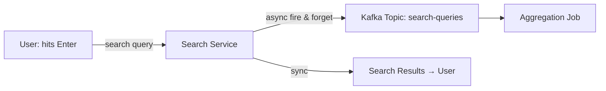
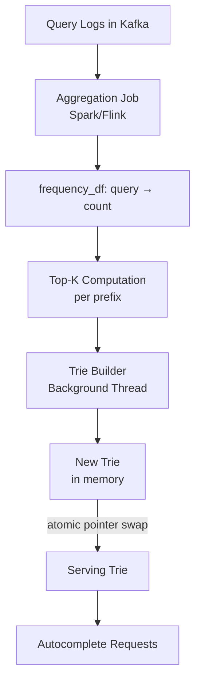
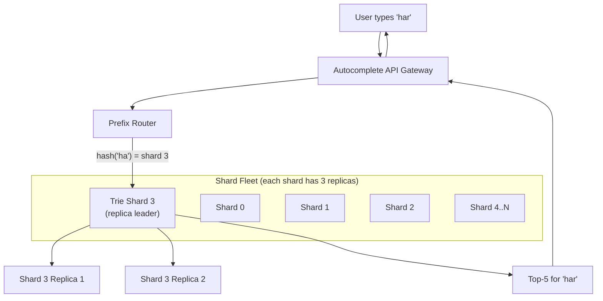
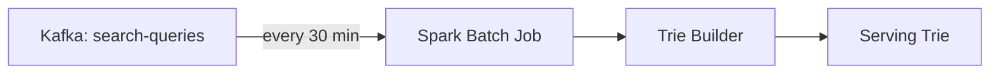
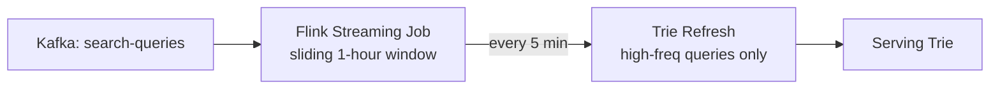
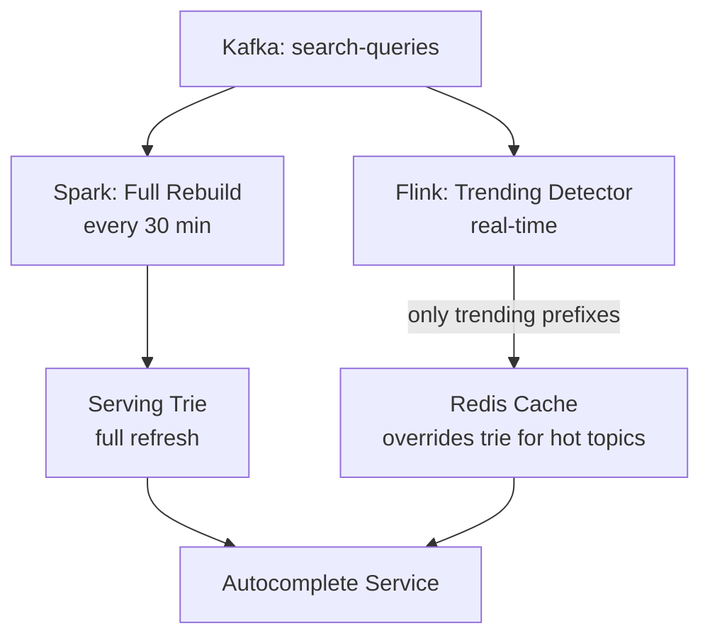
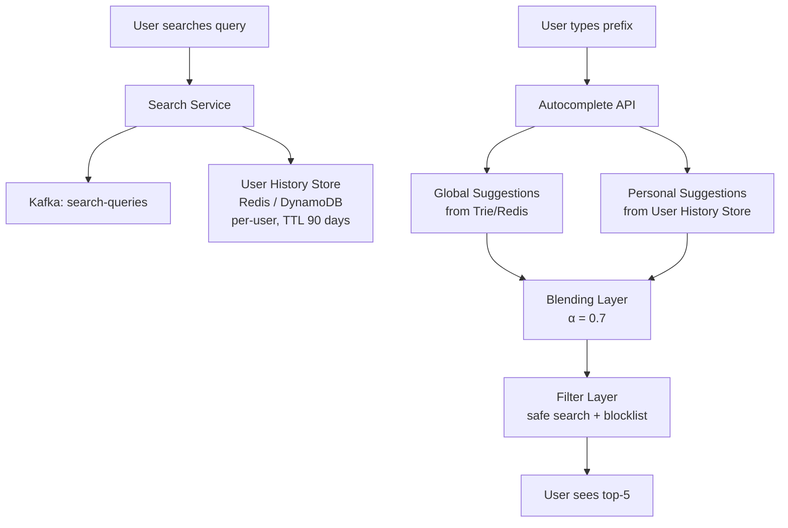
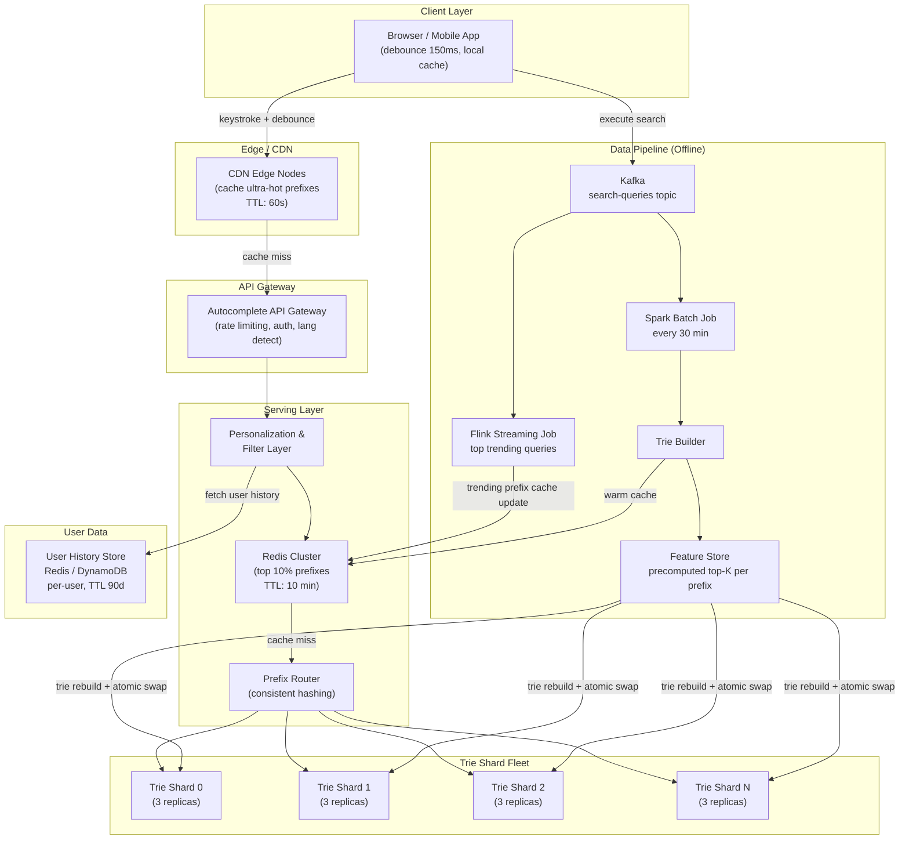

# Case Study: Design Google Search Autocomplete (Typeahead)

> Interview difficulty: Senior / Staff Engineer
> Time box: 45 minutes
> Core concept: Trie + Distributed Systems + Real-time Data Pipelines

---

## Why This Problem Matters

Before we write a single line of design, let's understand *why* autocomplete is a fascinating systems problem.

Jab tum Google mein "how to make bir" type karte ho aur instantly "how to make biryani" dikhai deta hai — yeh magic nahi hai. Yeh engineering hai. And it has to work in under 100 milliseconds, for 500 million requests every single day.

This problem sits at the intersection of:
- **Data structures** (Trie) — how to store and query prefix-based data
- **Distributed systems** — how to scale one data structure across many machines
- **Data pipelines** — how to keep suggestions fresh without rebuilding the world every second
- **Caching** — how to serve 80% of traffic without touching the heavy machinery at all

Yeh ek perfect interview problem hai because it has clear layers: you can start simple and keep adding depth. An E4 might stop at the Trie. An E6 needs to talk about distributed trie sharding, offline pipelines, and freshness trade-offs. Let's go all the way.

---

## Table of Contents

1. [The Problem, Simply Stated](#the-problem-simply-stated)
2. [Requirements](#requirements)
3. [Capacity Estimation](#capacity-estimation)
4. [Core Data Structure: The Trie](#core-data-structure-the-trie)
5. [The Naive Trie Problem and the Fix](#the-naive-trie-problem-and-the-fix)
6. [Data Collection Pipeline](#data-collection-pipeline)
7. [Trie Storage and Updates](#trie-storage-and-updates)
8. [Distributed Trie — Scaling Beyond One Machine](#distributed-trie--scaling-beyond-one-machine)
9. [Caching Layer — Redis for Hot Prefixes](#caching-layer--redis-for-hot-prefixes)
10. [Real-time vs. Batched Updates](#real-time-vs-batched-updates)
11. [Client-Side Optimizations](#client-side-optimizations)
12. [Filtering, Safe Search, and Personalization](#filtering-safe-search-and-personalization)
13. [Multi-Language Support](#multi-language-support)
14. [Full System Architecture](#full-system-architecture)
15. [Trade-offs and Design Decisions](#trade-offs-and-design-decisions)
16. [Common Interview Questions](#common-interview-questions)
17. [Key Takeaways](#key-takeaways)

---

## The Problem, Simply Stated

### The Analogy — Your Desi Panwari

Imagine your local panwari bhaiya who has been running the shop for 30 years. You walk up and say "ek —" and he already has your regular Gold Flake ready. He has seen thousands of customers over years and he *knows* what you want before you finish your sentence.

Google's autocomplete does exactly this — but for billions of people, simultaneously, in under 100 milliseconds. The "panwari" in our case is a distributed system that has:
1. Watched every search ever typed
2. Learned which completions are most popular for every prefix
3. Memorized the top answers so they can be served instantly

**Formal definition:** Given a string prefix typed by a user, return the top-K (usually 5) most popular search queries that start with that prefix, in under 100ms, at global scale.

---

## Requirements

Always start your interview with requirements. This shows the interviewer you think in terms of constraints, not just solutions.

### Functional Requirements

| # | Requirement | Notes |
|---|---|---|
| 1 | Show top-5 search suggestions as user types each character | Per-keystroke suggestions |
| 2 | Suggestions ranked by relevance (primarily search frequency) | Popularity-based ranking |
| 3 | Support personalization — user's own recent searches weighted higher | Optional in MVP, important for depth |
| 4 | Filter out offensive or harmful suggestions | Safe search |
| 5 | Support multiple languages | Separate tries per language |

### Non-Functional Requirements

| # | Requirement | Target |
|---|---|---|
| 1 | Latency | < 100ms end-to-end |
| 2 | Availability | 99.99% (4 nines) |
| 3 | Consistency | Eventual — stale suggestions are fine, downtime is not |
| 4 | Scale | 500M requests/day |
| 5 | Freshness | Suggestions updated within 30–60 minutes of trending events |

**Important mindset:** This is a **read-heavy** system. For every write (a new search query logged), there are thousands of reads (autocomplete requests). Our architecture must optimize heavily for reads.

---

## Capacity Estimation

Interviewers love when you derive numbers yourself. Yeh dikhata hai ki tum engineering sochte ho, parrot nahi karte.

### Traffic Estimation

```
Users:             10 million DAU
Searches per user: 10 searches/day
Keystrokes per search: 5 characters on average (user types 5 chars before clicking a suggestion)

Autocomplete requests per day:
= 10M users × 10 searches × 5 keystrokes
= 500 million requests/day

Requests per second:
= 500M / (24 × 3600)
= 500M / 86,400
≈ 5,800 requests/second (peak could be 3x = ~17,000 req/sec)
```

### Storage Estimation

```
Unique queries in trie:    ~1 billion unique search queries
Average query length:      25 characters
Top-5 completions per node: 5 × 25 chars = 125 bytes
Nodes in trie:             ~10 billion (rough upper bound)

But wait — we don't store all queries. We store only the top queries
per prefix. Let's estimate:
  Unique prefixes:          ~500 million
  Data per prefix (top-5):  ~500 bytes
  Total trie storage:       ~250 GB (fits in memory across a fleet!)
```

### Bandwidth

```
Per request:
  Query string (request):   ~20 bytes
  5 suggestions (response): ~150 bytes

Total bandwidth:
  5,800 req/sec × 170 bytes ≈ ~1 MB/sec  (very manageable)
```

This is a **memory-bound, not bandwidth-bound** problem. The challenge is fitting and serving the trie fast enough, not moving data.

---

## Core Data Structure: The Trie

### The Analogy — A Word Museum

Samjho aise: imagine a museum where every exhibit is a letter. You enter through the main door (root). Door "a" leads to room "a". Inside room "a" there are doors "ap", "am", "an", "ar"... Inside room "ap" there are doors "app", "apr"... and so on.

If you want to find all things starting with "app", you just walk through "a" → "p" → "p" and look at everything in that room and beyond. You don't have to search the entire museum.

This is a **Trie** (pronounced "try", from re**trie**val). It is the fundamental data structure for autocomplete.

### How a Trie Is Structured

Each node represents **one character**. A path from root to a node spells out a prefix.

```
root
├── 'a'
│   └── 'p'
│       └── 'p'                 ← prefix "app"
│           ├── 'l'
│           │   └── 'e' [END]   ← full word "apple"
│           └── 's' [END]       ← full word "apps"
├── 'h'
│   ├── 'o'
│   │   └── 'w'
│   │       └── ' '
│   │           └── 't'
│   │               └── 'o' [END]  ← "how to"
│   └── 'a'
│       └── 'r'
│           ├── 'r'
│           │   └── 'y' [END]   ← "harry potter" (simplified)
│           └── 'd' [END]       ← "hard"
```

### Trie Node Code

```python
class TrieNode:
    def __init__(self):
        self.children: dict[str, 'TrieNode'] = {}
        self.is_end_of_word: bool = False
        self.frequency: int = 0  # how many times this exact query was searched

class Trie:
    def __init__(self):
        self.root = TrieNode()

    def insert(self, query: str, frequency: int):
        """Insert a query with its search frequency."""
        node = self.root
        for char in query.lower():
            if char not in node.children:
                node.children[char] = TrieNode()
            node = node.children[char]
        node.is_end_of_word = True
        node.frequency = frequency

    def get_all_completions(self, prefix: str) -> list[tuple[str, int]]:
        """Naive approach: traverse all descendants of the prefix node."""
        node = self.root
        for char in prefix.lower():
            if char not in node.children:
                return []
            node = node.children[char]
        # DFS from this node to collect all complete words
        results = []
        self._dfs(node, prefix, results)
        return sorted(results, key=lambda x: -x[1])[:5]  # top 5

    def _dfs(self, node: TrieNode, current: str, results: list):
        if node.is_end_of_word:
            results.append((current, node.frequency))
        for char, child in node.children.items():
            self._dfs(child, current + char, results)
```

### Why This Naive Approach Fails at Scale

The problem with the above code: for a popular prefix like "h", you might need to traverse **millions of nodes** to find the top-5 results. At 5,800 requests/second, this is catastrophically slow.

Yeh problem fix karna hi is case study ka core hai. Chalte hain.

---

## The Naive Trie Problem and the Fix

### The Bakery Analogy

Imagine a bakery that makes 500 kinds of pastries. Every time a customer asks "what's your best chocolate pastry?", the baker walks into the kitchen, tastes all 80 chocolate items one by one, and comes back 20 minutes later with an answer.

Now imagine a smarter baker who has a **cheat sheet on the wall**: "Best chocolate items: 1. Chocolate lava cake (98 orders), 2. Choco croissant (75 orders), 3. Death by chocolate (60 orders)." Customer asks, baker glances at the wall — 2 seconds, done.

This is exactly what we do with the optimized trie: **cache the top-K results at every single node**.

### Optimized Trie — Scores at Every Node

```python
class TrieNode:
    def __init__(self):
        self.children: dict[str, 'TrieNode'] = {}
        self.is_end_of_word: bool = False
        self.frequency: int = 0
        # KEY OPTIMIZATION: cache top-5 here, so we never DFS at query time
        self.top_suggestions: list[tuple[str, int]] = []
        # Each entry: (full_query_string, frequency)

class OptimizedTrie:
    def __init__(self, k: int = 5):
        self.root = TrieNode()
        self.k = k

    def insert(self, query: str, frequency: int):
        node = self.root
        for char in query.lower():
            if char not in node.children:
                node.children[char] = TrieNode()
            node = node.children[char]
            # Update top-K cache at EVERY node along the path
            self._update_top_k(node, query, frequency)
        node.is_end_of_word = True
        node.frequency = frequency

    def _update_top_k(self, node: TrieNode, query: str, frequency: int):
        """Keep only the top-K suggestions sorted by frequency."""
        # Add new suggestion
        node.top_suggestions.append((query, frequency))
        # Sort by frequency descending
        node.top_suggestions.sort(key=lambda x: -x[1])
        # Keep only top-K
        node.top_suggestions = node.top_suggestions[:self.k]

    def search(self, prefix: str) -> list[str]:
        """O(length of prefix) lookup — no DFS needed!"""
        node = self.root
        for char in prefix.lower():
            if char not in node.children:
                return []  # No completions for this prefix
            node = node.children[char]
        # Top suggestions are pre-cached — instant return
        return [query for query, freq in node.top_suggestions]

# Demo
trie = OptimizedTrie(k=5)
trie.insert("harry potter", 95000)
trie.insert("hard rock cafe", 30000)
trie.insert("hardware", 25000)
trie.insert("hat", 15000)
trie.insert("have a good day", 8000)

print(trie.search("har"))
# → ['harry potter', 'hard rock cafe', 'hardware']

print(trie.search("h"))
# → ['harry potter', 'hard rock cafe', 'hardware', 'hat', 'have a good day']
```

### Complexity Comparison

| Operation | Naive Trie | Optimized Trie (cached top-K) |
|---|---|---|
| Insert | O(length of query) | O(length of query × K log K) |
| Search/autocomplete | O(nodes in subtree) = SLOW | O(length of prefix) = FAST |
| Space overhead | Minimal | Extra K strings per node |

The trade-off is clear: we use more space (storing top-K at every node) to gain blazing fast reads. Given that this is a read-heavy system with 5,800 reads/sec, this is the right trade-off.

**Interview tip:** Always articulate trade-offs. Don't just say "we cache top-K". Say: "We trade storage space for read latency, which is the right call here because our read-to-write ratio is extremely high."

---

## Data Collection Pipeline

### The Analogy — Mumbai Dabbawalas' Feedback System

Every day, Mumbai dabbawalas deliver 200,000 dabbas. Imagine they collected feedback from every customer: "Today's dal makhani was a hit, saag paneer — not so much." At the end of each day, the head dabbawala compiles: "Top 5 favorite dishes this week: dal makhani, butter chicken..."

Our data pipeline is the same: collect every search query, aggregate frequencies, compute top-K, update the trie. Let's design each stage.

### Stage 1: Query Logging to Kafka

Every time a user executes a search (presses Enter), the event is logged asynchronously to Kafka. We do NOT log autocomplete requests — only actual searches. This is important: we want to capture intent, not exploration.

```
User searches "how to make biryani"
                    ↓
            [Search Service]
                    ↓ (async, non-blocking)
            Kafka Topic: "search-queries"
            Message: {
              "query": "how to make biryani",
              "user_id": "u_xyz123",   (hashed, for privacy)
              "timestamp": 1688000000,
              "language": "en",
              "region": "IN"
            }
```

**Why Kafka?** Because it's a durable, distributed message queue that can handle millions of events per second without slowing down the search service. The search query returns to the user immediately; the logging happens in the background.



### Stage 2: Aggregation Job — Counting Frequencies

We run a batch aggregation job (using Apache Spark or Flink) that:
1. Reads from Kafka (last 24 or 48 hours of queries)
2. Groups by query string
3. Counts occurrences
4. Outputs: (query, count) pairs

```python
# Pseudocode for Spark aggregation job
from pyspark.sql import SparkSession

spark = SparkSession.builder.appName("QueryAggregation").getOrCreate()

# Read last 24 hours from Kafka
queries_df = spark.read.kafka(
    topic="search-queries",
    startTime="now - 24h"
)

# Count by query
frequency_df = queries_df \
    .groupBy("query") \
    .count() \
    .orderBy("count", ascending=False)

# Write top queries to storage
frequency_df \
    .filter(frequency_df["count"] > 100)  # only meaningful queries
    .write.parquet("s3://autocomplete/query-frequencies/daily/2024-01-15/")
```

**How often to run?** Typically every 30–60 minutes for a balance between freshness and cost. For trending events (IPL match starts, a celebrity news breaks), you might push this to every 5 minutes using streaming.

### Stage 3: Top-K Computation for Each Prefix

After getting (query, frequency) pairs, we need to compute top-K for every prefix.

```
Input:
  ("how to make biryani", 500000)
  ("how to make paneer", 300000)
  ("how to make cake", 200000)
  ("how are you", 1000000)
  ...

Output (top-3 for each prefix):
  "h"   → [("how are you", 1M), ("how to make biryani", 500K), ...]
  "ho"  → [("how are you", 1M), ("how to make biryani", 500K), ...]
  "how" → [("how are you", 1M), ("how to make biryani", 500K), ...]
  "how " → [("how to make biryani", 500K), ("how to make paneer", 300K), ...]
  ...
```

```python
from collections import defaultdict
import heapq

def compute_top_k_for_all_prefixes(query_freqs: list[tuple[str, int]], k: int = 5):
    """
    Given a list of (query, frequency) pairs,
    compute top-K suggestions for every prefix.
    """
    prefix_map = defaultdict(list)  # prefix → list of (freq, query)

    for query, freq in query_freqs:
        # For "apple" with freq 100:
        # Update "a", "ap", "app", "appl", "apple" prefixes
        for i in range(1, len(query) + 1):
            prefix = query[:i]
            heapq.heappush(prefix_map[prefix], (freq, query))
            # Keep heap size bounded at k
            if len(prefix_map[prefix]) > k:
                heapq.heappop(prefix_map[prefix])

    # Convert to sorted lists
    result = {}
    for prefix, heap in prefix_map.items():
        result[prefix] = sorted(heap, reverse=True)  # sort by freq desc
    return result
```

### Stage 4: Trie Rebuild and Swap

Once top-K per prefix is computed, we rebuild the trie and atomically swap it.



**Atomic swap** means: the serving trie is behind a pointer/reference. When the new trie is ready, you atomically update the pointer. Old trie is garbage collected. Zero downtime, no request ever sees an incomplete state.

---

## Trie Storage and Updates

### The Analogy — Changing a Tire While Driving

You can't stop the car (your system) to change the tire (update the trie). You need to do it without disrupting traffic. This is the core challenge of trie updates.

### Option 1: In-Place Update

Update individual nodes in the existing trie as new frequency data comes in.

**Pros:** Low memory (no duplicate trie in memory), continuous updates
**Cons:** Thread-safety issues, partial updates visible to users (trie is inconsistent mid-update), complex locking logic

### Option 2: Rebuild and Atomic Swap (Recommended)

Build an entirely new trie in a background thread. When done, atomically swap the pointer.

```python
import threading

class TrieServer:
    def __init__(self):
        self._serving_trie = OptimizedTrie()  # active trie
        self._lock = threading.RLock()

    def get_suggestions(self, prefix: str) -> list[str]:
        """Reads always from _serving_trie — no lock needed for reads!"""
        return self._serving_trie.search(prefix)

    def refresh_trie(self, new_frequency_data: list[tuple[str, int]]):
        """Called by background job every 30 minutes."""
        # Build new trie in background
        new_trie = OptimizedTrie()
        for query, freq in new_frequency_data:
            new_trie.insert(query, freq)

        # Atomic pointer swap — instant, no downtime
        with self._lock:
            old_trie = self._serving_trie
            self._serving_trie = new_trie
        # old_trie is now unreferenced → garbage collected
```

### Serializing the Trie to Disk

When a server restarts, it can't afford to rebuild the trie from scratch (would take minutes). So we serialize the trie to disk and load it on startup.

```python
import pickle

# Serialize trie to disk
def save_trie(trie: OptimizedTrie, path: str):
    with open(path, 'wb') as f:
        pickle.dump(trie, f)

# Load trie from disk on server startup
def load_trie(path: str) -> OptimizedTrie:
    with open(path, 'rb') as f:
        return pickle.load(f)

# On server start:
trie_server = TrieServer()
trie_server._serving_trie = load_trie('/data/trie/latest.pkl')
# Serving in ~5 seconds instead of ~5 minutes
```

In production (Google scale), you'd use a more efficient binary format (Protobuf, or a custom compact encoding) and store it in a distributed file system (GCS, S3).

---

## Distributed Trie — Scaling Beyond One Machine

### The Analogy — India's Postal System

India's postal system doesn't have one building where every letter in the country is sorted. It has regional sorting hubs: all mail for Maharashtra goes to Mumbai hub, for Karnataka goes to Bengaluru hub, and so on. The central system routes your letter to the right hub.

Our distributed trie works the same way: we split the trie into shards, and a router sends each request to the right shard.

### Why We Need Sharding

Our estimated trie size is ~250 GB. A typical machine might have 64–256 GB of RAM. Plus we need replication. So we need to split the trie across multiple machines.

### Sharding Strategy

**Option 1: Shard by first character**

```
Shard A: all queries starting with 'a' - 'f'
Shard B: all queries starting with 'g' - 'm'
Shard C: all queries starting with 'n' - 's'
Shard D: all queries starting with 't' - 'z'
```

**Problem:** 'S' and 'T' are the most common starting letters in English. Shard D gets hammered. This is **hot sharding** — terrible for production.

**Option 2: Shard by first 2 characters (better distribution)**

```
Shard 1:  "aa" - "be"
Shard 2:  "bf" - "co"
...
Shard N:  "wi" - "zz"
```

More even distribution, but still uneven (common bigrams vs. rare ones).

**Option 3: Consistent Hashing on prefix**

Hash the prefix (or first 2 characters) to determine the shard. Consistent hashing also makes it easy to add/remove shards without full resharding.

```python
import hashlib

def get_shard(prefix: str, num_shards: int = 10) -> int:
    """Determine which shard handles this prefix."""
    # Use first 2 chars for routing (normalize short prefixes)
    routing_key = prefix[:2].lower().ljust(2, 'a')
    hash_value = int(hashlib.md5(routing_key.encode()).hexdigest(), 16)
    return hash_value % num_shards

# Example:
print(get_shard("ha", 10))   # → some shard 0-9
print(get_shard("how", 10))  # → routes based on "ho"
print(get_shard("h", 10))    # → routes based on "ha" (padded)
```

### Request Routing Architecture



**Replication:** Each shard has 3 replicas (leader + 2 followers). Reads can be served from any replica. Writes (trie updates) go to the leader and propagate to followers. This gives us high availability — even if one machine dies, the other two replicas keep serving.

---

## Caching Layer — Redis for Hot Prefixes

### The Analogy — The Menu Board at McDonald's

McDonald's doesn't ask the kitchen about the price of a Big Mac every time a customer asks. The price is on the menu board — instantly visible. The kitchen is only involved for actual cooking.

Our Redis cache is the menu board: for the most commonly searched prefixes, the results are right there, no need to touch the trie at all.

### Zipf's Law — Why Caching Works Beautifully Here

Zipf's Law says: in any natural language corpus, the most frequent item appears roughly twice as often as the second most frequent, three times as often as the third, and so on.

Applied to search: "how to", "the", "weather", "what is" — a tiny set of prefixes account for an enormous fraction of all requests.

```
Top 1% of prefixes    →  ~50% of all autocomplete traffic
Top 5% of prefixes    →  ~80% of all autocomplete traffic
Top 10% of prefixes   →  ~90% of all autocomplete traffic
```

So if we cache the top 10% of prefixes in Redis, we handle 90% of traffic without touching the trie shards. Massive win.

### Redis Cache Implementation

```python
import redis
import json

class AutocompleteService:
    def __init__(self):
        self.redis_client = redis.Redis(
            host="redis-cluster.internal",
            port=6379,
            decode_responses=True
        )
        self.trie_router = TrieShardRouter()  # routes to correct shard
        self.CACHE_TTL_SECONDS = 600  # 10 minutes

    def get_suggestions(self, prefix: str) -> list[str]:
        cache_key = f"ac:{prefix.lower()}"

        # Step 1: Check Redis (< 1ms round trip)
        cached = self.redis_client.get(cache_key)
        if cached:
            return json.loads(cached)

        # Step 2: Query trie shard (< 5ms)
        shard = self.trie_router.get_shard(prefix)
        suggestions = shard.search(prefix)

        # Step 3: Cache in Redis for 10 minutes
        if suggestions:
            self.redis_client.setex(
                cache_key,
                self.CACHE_TTL_SECONDS,
                json.dumps(suggestions)
            )

        return suggestions
```

### Cache Warm-Up

On every trie refresh cycle, pre-populate Redis with the top 10,000 prefixes. This ensures the cache is hot before traffic hits it (avoids cold-start cache misses after a deploy).

```python
def warm_cache(top_prefixes: list[str], trie: OptimizedTrie):
    """Called after each trie rebuild to pre-populate Redis."""
    pipe = redis_client.pipeline()  # batch Redis writes
    for prefix in top_prefixes:
        suggestions = trie.search(prefix)
        if suggestions:
            cache_key = f"ac:{prefix}"
            pipe.setex(cache_key, 600, json.dumps(suggestions))
    pipe.execute()
    print(f"Cache warmed with {len(top_prefixes)} prefixes")
```

### Cache Invalidation Strategy

| Event | Action |
|---|---|
| Trie rebuilds every 30 min | Warm cache with new top-10K prefixes |
| Individual prefix TTL expires | Lazy-refill from trie shard on next request |
| Breaking news / trending event | Targeted cache invalidation for affected prefixes |
| Wrong suggestions reported | Manual cache delete + flag for trie update |

---

## Real-time vs. Batched Updates

### The Analogy — Breaking News on TV

When a major event happens (say, India wins the World Cup), people immediately start searching "India wins World Cup", "Rohit Sharma century", "ICC Trophy 2024" — queries that didn't exist 5 minutes ago. Your autocomplete system needs to surface these suggestions quickly. But rebuilding the entire trie every 5 minutes is expensive.

### Three Approaches

#### 1. Pure Batch (Rebuild Every 30-60 Minutes)



**Pros:** Simple, consistent, easy to reason about
**Cons:** 30-minute lag means trending queries don't appear in autocomplete for up to 30 minutes

**When it's fine:** For most queries, 30-minute lag is acceptable. If you search "how to make biryani", the top result doesn't change in 30 minutes.

#### 2. Streaming Update (Kafka + Flink → Trie)



**Pros:** Near-real-time freshness (5-10 minute lag), trending topics surface quickly
**Cons:** More complex, Flink is expensive to operate, trie updates more frequent

#### 3. Hybrid (Recommended for Production)

Run a **full batch rebuild** every 30 minutes AND a **streaming hot-prefix updater** every 5 minutes that only updates the Redis cache for fast-rising queries.



The Flink job detects queries whose frequency in the last 10 minutes is 10x higher than their 24-hour baseline — these are "trending" and get inserted into Redis directly, bypassing the slower trie rebuild cycle.

### Comparison Table

| Strategy | Freshness Lag | Complexity | Cost | Best For |
|---|---|---|---|---|
| Batch (30 min) | 30 minutes | Low | Low | Standard queries |
| Batch (5 min) | 5 minutes | Low-Medium | Medium | Most production use |
| Streaming | 1-2 minutes | High | High | News/trending events |
| Hybrid | 1-2 min (trending), 30 min (rest) | High | High | Best of both worlds |

**Interview answer:** "I'd start with a 30-minute batch pipeline for simplicity and correctness. If the product team needs faster trending topic support, I'd add a streaming layer specifically for high-velocity queries, keeping the batch pipeline as the source of truth."

---

## Client-Side Optimizations

### The Analogy — The Patient Waiter

A terrible waiter runs to the kitchen every time you open your mouth: "I'll—" *sprints to kitchen*, "—have—" *sprints back*, "—the—" *sprints again*. Exhausting and pointless.

A good waiter waits until you've finished your sentence. This is **debouncing** — and it cuts autocomplete requests by 60-70%.

### Debouncing

```javascript
// Without debounce: fires API call for EVERY keystroke
searchInput.addEventListener('keyup', (e) => {
    fetchAutocomplete(e.target.value);  // "h", "ha", "har", "hard" → 4 API calls
});

// With debounce: fires only when user pauses typing (150ms)
function debounce(fn, delayMs) {
    let timer = null;
    return function(...args) {
        clearTimeout(timer);
        timer = setTimeout(() => fn.apply(this, args), delayMs);
    };
}

const debouncedFetch = debounce(fetchAutocomplete, 150);

searchInput.addEventListener('keyup', (e) => {
    debouncedFetch(e.target.value);  // fires once after 150ms pause
});

// Result: user types "hard" quickly → only 1 API call (for "hard")
// instead of 4 calls ("h", "ha", "har", "hard")
```

**Why 150ms?** Research shows users pause typing for ~150ms when thinking. Anything shorter increases requests without better UX. Anything longer feels laggy.

### Additional Client Tricks

**1. Prefix deduplication:** If you got suggestions for "har" and the user types "hard", the suggestions for "hard" are a subset of "har"'s descendants. You can filter client-side for small steps forward (though this isn't always accurate and should be used carefully).

**2. Cancel in-flight requests:** If the user types quickly, cancel the previous XHR before firing a new one. Avoids race conditions where an old request returns after a newer one.

```javascript
let controller = null;

async function fetchAutocomplete(prefix) {
    // Cancel previous in-flight request
    if (controller) controller.abort();
    controller = new AbortController();

    try {
        const response = await fetch(`/api/autocomplete?q=${prefix}`, {
            signal: controller.signal
        });
        const data = await response.json();
        renderSuggestions(data.suggestions);
    } catch (err) {
        if (err.name === 'AbortError') return;  // Expected — user typed more
        console.error('Autocomplete error:', err);
    }
}
```

**3. Browser-level caching:** Cache autocomplete responses in memory for the session. If user backspaces "hard" → "har", serve the cached result for "har" instantly.

```javascript
const suggestionCache = new Map();

async function fetchWithCache(prefix) {
    if (suggestionCache.has(prefix)) {
        return suggestionCache.get(prefix);  // instant, no network
    }
    const suggestions = await fetchAutocomplete(prefix);
    suggestionCache.set(prefix, suggestions);
    return suggestions;
}
```

**4. Optimistic UI:** Show locally cached or previously seen suggestions immediately while fetching fresh ones. Users perceive the system as instant even if the network is slow.

---

## Filtering, Safe Search, and Personalization

### The Analogy — A Thoughtful Librarian

A librarian doesn't just find your book — they also make sure they're not handing you something dangerous, and they remember your preferences. "Oh, you like mystery novels — here's what's new in that section."

Our autocomplete system needs the same thoughtfulness.

### Filtering Offensive Queries

We maintain a blocklist of offensive, harmful, or NSFW query strings. Before inserting any query into the trie pipeline, it is checked against this blocklist.

```python
class QueryFilter:
    def __init__(self):
        # Loaded from a curated blocklist (maintained by content policy team)
        self.blocklist: set[str] = self._load_blocklist()
        self.regex_patterns = self._load_regex_patterns()  # e.g., hate speech patterns

    def is_safe(self, query: str) -> bool:
        query_lower = query.lower().strip()
        # Check exact blocklist
        if query_lower in self.blocklist:
            return False
        # Check regex patterns (for variations)
        for pattern in self.regex_patterns:
            if pattern.search(query_lower):
                return False
        return True

    def filter_suggestions(self, suggestions: list[str]) -> list[str]:
        return [s for s in suggestions if self.is_safe(s)]
```

Applied at two points:
1. **During trie build:** Blocked queries are never inserted into the trie
2. **At serve time:** Any suggestion that slips through (due to blocklist updates) is filtered before returning to the user

### Personalization Layer

Global frequency gives the same "how to make biryani" to everyone. But if you've searched "how to make pasta" 50 times, maybe "how to make pasta" should rank higher for you.

**Formula:**
```
final_score = α × global_frequency + (1 - α) × user_frequency
```

Where `α = 0.7` (70% global, 30% personal) is a typical starting point. Can be A/B tested.

```python
class PersonalizedAutocomplete:
    def __init__(self, base_service: AutocompleteService, user_store):
        self.base = base_service
        self.user_store = user_store  # Redis/DynamoDB with user's recent queries

    def get_suggestions(self, prefix: str, user_id: str) -> list[str]:
        # Step 1: Get global suggestions
        global_suggestions = self.base.get_suggestions(prefix)

        # Step 2: Get user's recent matching queries
        user_queries = self.user_store.get_recent_queries(user_id, limit=200)
        user_prefix_matches = [
            (q, count) for q, count in user_queries
            if q.startswith(prefix)
        ]

        if not user_prefix_matches:
            return global_suggestions  # No personal data, use global

        # Step 3: Blend scores
        alpha = 0.7
        scores = {}

        # Global scores (normalize to 0-1 range)
        for rank, query in enumerate(global_suggestions):
            scores[query] = scores.get(query, 0) + alpha * (1.0 / (rank + 1))

        # User scores
        max_user_count = max(count for _, count in user_prefix_matches)
        for query, count in user_prefix_matches:
            normalized = count / max_user_count
            scores[query] = scores.get(query, 0) + (1 - alpha) * normalized

        # Step 4: Return top-5 blended results
        sorted_queries = sorted(scores, key=lambda q: -scores[q])
        return sorted_queries[:5]
```

**Privacy note:** User query history is stored hashed and expires after 90 days. Used only for personalization, never sold or shared. This is important to mention in interviews — it shows you think about privacy as a first-class concern.

### Personalization Data Flow



---

## Multi-Language Support

### The Analogy — Different Libraries for Different Cities

Just like Mumbai's library stocks Marathi books, Delhi's stocks Hindi books, and Chennai's stocks Tamil books — we maintain separate tries for each language. Ek hi building mein sab kuch mix karna confusion create karega.

### Architecture for Multi-Language

1. **Language detection:** Use the `Accept-Language` HTTP header from the browser. Fallback to IP geolocation if header is missing.

2. **Separate tries per language:** Each language has its own trie with its own top-K suggestions. English trie has different popular queries than Hindi trie.

3. **Separate sharding per language:** Shard assignments per language, since character distributions vary (Hindi has 50+ characters, English has 26).

```python
class MultiLangAutocomplete:
    def __init__(self):
        # One AutocompleteService per supported language
        self.services = {
            'en': AutocompleteService(shard_config='english'),
            'hi': AutocompleteService(shard_config='hindi'),
            'es': AutocompleteService(shard_config='spanish'),
            'pt': AutocompleteService(shard_config='portuguese'),
            # ... 100+ languages
        }
        self.default_lang = 'en'

    def get_suggestions(self, prefix: str, lang: str) -> list[str]:
        lang = lang.split('-')[0].lower()  # "en-US" → "en"
        service = self.services.get(lang, self.services[self.default_lang])
        return service.get_suggestions(prefix)
```

4. **Transliteration support:** Many Indian users type Hindi queries in English characters (e.g., "biryani recipe" vs "बिरयानी रेसिपी"). Support both by maintaining a transliteration map and inserting queries into the relevant trie.

5. **Mixed-language queries:** Some queries mix languages ("best biryani near me" — English + Indian food). These go into the English trie but are tagged with regional metadata for geo-filtering.

---

## Full System Architecture

Now samjho puri picture. Let's put it all together.



### Request Lifecycle — Step by Step

Let's trace a single request: User types "bir" in Google's search bar.

```
1. Browser (t=0ms)
   - User types 'b', 'i', 'r' quickly (< 150ms apart)
   - Debounce timer fires: no request yet

2. Browser (t=150ms after last keystroke)
   - Debounce fires: send GET /autocomplete?q=bir&lang=en&uid=u_xyz

3. CDN Edge (t=155ms)
   - Check edge cache for "bir"
   - Cache miss (assume cold)
   - Forward to API Gateway

4. API Gateway (t=160ms)
   - Detect language from Accept-Language: en-IN
   - Apply rate limiting (< 100 req/sec per user)
   - Forward to Autocomplete Service

5. Autocomplete Service (t=162ms)
   - Check Redis for "bir"
   - Hit! (Redis has "bir" cached)
   - Fetch user history for "bir" prefixes from User History Store

6. Personalization Layer (t=165ms)
   - Blend global suggestions with user's personal history
   - Apply safe search filter

7. Response (t=167ms)
   - Return top-5 suggestions
   - Cache at CDN edge (TTL: 60s)

8. Browser (t=172ms)
   - Render dropdown with suggestions
   - User sees: ["biryani recipe", "biryani near me", "biryani restaurant", ...]

Total: ~172ms (well under 100ms if Redis hit, close with CDN)
```

**Optimizing to < 100ms:** CDN edge caching (serving from edge nodes 20ms from user) + pre-warmed Redis = 30-50ms round trips. The < 100ms target is achievable for the majority of requests.

---

## Trade-offs and Design Decisions

### Decision Table — The Choices That Define the System

| Design Decision | Option A | Option B | Recommended | Why |
|---|---|---|---|---|
| Core data structure | Trie | Hash map (prefix → list) | Trie | Natural prefix support, memory-efficient, supports incremental updates |
| Trie top-K | Compute at query time (DFS) | Pre-cache at every node | Pre-cached | O(prefix length) vs O(subtree size) — massive latency difference at scale |
| Trie update | In-place update | Rebuild + atomic swap | Rebuild + swap | Simpler, no partial states, no complex locking |
| Sharding key | First character | Consistent hash on 2-char prefix | Consistent hash | Even distribution, handles hotspots, easy to rebalance |
| Cache tier | No cache | Redis (hot prefixes) | Redis | Top 10% prefixes = 90% of traffic; Redis hit rate ~90% |
| Update frequency | Real-time streaming | Batch (30 min) | Hybrid | Batch for correctness + streaming for trending |
| Personalization | None | Full ML model | Simple frequency blend | Simpler, debuggable, still effective; ML can be layered later |
| Language support | Single trie | Per-language trie | Per-language | Different character sets, different query distributions |
| Filtering | None | Blocklist at build time | Blocklist at build + serve time | Defense in depth; blocklist updates shouldn't require full trie rebuild |

### Numbers to Nail in Interviews

| Metric | Value | Derivation |
|---|---|---|
| Requests/day | 500M | 10M users × 10 searches × 5 keystrokes |
| Requests/sec | ~5,800 (peak: ~17K) | 500M / 86,400s |
| Trie storage | ~250 GB | 500M prefixes × ~500 bytes |
| Redis hit rate | ~90% | Top 10% prefixes = 90% traffic |
| Update cadence | 30 min (batch) | Balance freshness vs. cost |
| Cache TTL | 10 min (Redis), 60s (CDN edge) | Hot prefixes don't change rapidly |
| Latency target | < 100ms | Product requirement |
| Debounce delay | 150ms | UX research standard |
| Top-K value | 5 | UX research: users rarely look past 5th suggestion |
| Replication factor | 3 | Standard for high availability |

### What Happens When Things Go Wrong

**Trie shard fails:**
- Replicas take over (all reads from any of 3 replicas)
- If leader fails, Raft/Paxos elects new leader in < 30 seconds
- During leader election, Redis cache absorbs the load (< 30 seconds of Redis-only serving)

**Redis fails:**
- Requests fall through to trie shards directly
- Latency increases (5-10ms instead of < 1ms) but system stays up
- Redis is a write-through cache — nothing is lost, just slower

**Aggregation job fails:**
- Trie stays at last successful state
- Stale suggestions for up to 60 minutes (acceptable — mentioned in non-functional requirements)
- Alert fires, on-call engineer investigates

**Trending event not surfacing:**
- Streaming Flink job detects queries rising 10x above baseline
- Updates Redis directly within 5 minutes
- Full trie rebuild at next 30-minute cycle

---

## Common Interview Questions

### Q1: "Why not just use a database with LIKE queries?"

**Answer:** SQL `LIKE 'prefix%'` on a database does a table scan (or at best uses a B-tree index prefix scan). At 5,800 requests/second, each touching potentially millions of rows, this would require enormous database infrastructure and still likely exceed 100ms latency. A trie is purpose-built for prefix lookups — it's O(prefix length), not O(number of records). Plus, the trie can live entirely in memory, while databases are disk-bound.

**Short version:** Trie is O(prefix length), database prefix scan is O(log N to N). At our scale, the difference is 5ms vs 500ms. Easy choice.

---

### Q2: "How do you handle very long trie paths (memory explosion)?"

**Answer:** Two strategies:

1. **Pruning:** Only insert queries with frequency above a threshold (e.g., searched > 100 times). This eliminates rare queries and keeps the trie manageable.

2. **Compressed trie (Patricia trie / Radix tree):** Instead of one node per character, compress chains of single-child nodes into a single node storing a string. "apple" stored as one node "apple" if there's no other word starting with 'a'.

```
Standard Trie:   root → a → p → p → l → e   (6 nodes)
Radix Tree:      root → "apple"               (2 nodes)
```

Radix trees can reduce node count by 2-5x for typical English vocabulary.

---

### Q3: "How would you handle trending queries appearing within seconds?"

**Answer:** Three-layer approach:

1. **Streaming pipeline (Flink/Kafka Streams):** Detect queries with anomalous frequency (> 10x baseline in last 5 minutes). Push these directly to Redis with a 5-minute TTL.

2. **CDN bypass for Redis updates:** Use Redis Pub/Sub to notify all API servers to invalidate their local in-process caches for affected prefixes.

3. **Graceful degradation:** Accept that the very first 1-2 minutes of a trending topic won't be in autocomplete. This is usually acceptable and announced to users via UI ("Trending now" section, not autocomplete).

---

### Q4: "How do you prevent autocomplete from being gamed (spam/SEO manipulation)?"

**Answer:** Multiple defenses:

1. **Bot detection:** Filter out queries from known bots, crawlers, automated scripts using IP reputation, request rate patterns, and behavioral signals.

2. **Query normalization:** Canonicalize queries before counting (lowercase, remove extra spaces, basic spelling normalization). Makes it harder to spam with variations.

3. **Velocity limiting:** A single query gaining more than N% of its total historical frequency in a single hour is flagged for human review.

4. **Diversity constraint:** No single domain/entity should dominate all top-5 slots. If top-5 for "buy" are all from the same e-commerce site, diversify.

5. **Human review pipeline:** Flagged queries go to a review queue. Human reviewers can blocklist specific queries or demote them.

---

### Q5: "Should the trie be sharded by term or by document?"

**Answer:** This question applies more to search engines than autocomplete. For autocomplete, the relevant question is "shard by prefix." But the principle is the same: shard by the lookup key. For autocomplete, we shard by prefix (so all queries starting with "ha" are on the same shard). This means a single autocomplete request goes to exactly one shard, not multiple — minimizing network hops and latency.

---

### Q6: "What's your schema for the user history store?"

**Answer:**

```
Key:   user:{user_id}:recent_queries
Type:  Redis Sorted Set
Score: timestamp (unix epoch, so ZRANGEBYSCORE gives time-filtered results)
Member: query string

Example:
  ZADD user:u_xyz123:recent_queries 1688000000 "how to make biryani"
  ZADD user:u_xyz123:recent_queries 1688001000 "biryani recipe easy"
  ZADD user:u_xyz123:recent_queries 1688002000 "instant pot biryani"

To get queries matching prefix "bir":
  1. ZRANGE user:u_xyz123:recent_queries 0 -1  (get all recent queries)
  2. Filter in application layer for those starting with "bir"
  3. Return top-3 sorted by recency
```

TTL on the key: 90 days (GDPR/privacy compliance).

---

### Q7: "Walk me through the end-to-end latency budget."

**Answer:**

```
Network to CDN edge:         10-20ms  (user to nearest PoP)
CDN edge cache:              < 1ms    (if hit, stop here — total: 20ms)
CDN → API Gateway:           5ms      (if CDN miss)
API Gateway processing:      2ms      (auth, rate limit, lang detect)
Redis lookup:                1-2ms    (if hit, stop here — total: ~30ms)
Redis → Trie shard:          5-10ms   (if Redis miss)
Trie lookup:                 < 1ms    (in-memory, O(prefix length))
Personalization blend:       2ms      (simple score calculation)
Filter + response serialize: 1ms
Network back to user:        10-20ms

Best case (CDN hit):          ~20ms
Good case (Redis hit):        ~30-40ms
Worst case (trie shard hit):  ~50-80ms
Extremely rare cold case:     ~100ms

All within our 100ms budget!
```

---

### Q8: "How does this differ for a smaller scale, like Zomato's restaurant autocomplete?"

**Answer:** At Zomato's scale (tens of millions of users, not billions), the entire trie easily fits in one machine's memory. You don't need distributed sharding. A single Redis cluster with the trie on a few replicas is sufficient. The core design (trie + Redis cache + batch updates from query logs) is the same — just fewer machines. This is an important thing to show in interviews: you know how to right-size the solution, not just apply Google-scale patterns blindly everywhere.

For Zomato:
- Single trie in memory on 3 replicas (HA)
- Redis for hot queries
- Batch update every 10 minutes (data is smaller, faster to rebuild)
- No distributed sharding needed

---

## Key Takeaways

### The Big Ideas

1. **Trie is the right data structure for prefix matching.** It models typing character-by-character naturally and gives O(prefix length) lookup after pre-computation.

2. **Pre-compute top-K at every node.** Never traverse the subtree at query time. This trades storage for latency — the correct trade-off for a read-heavy system.

3. **The caching layers are what make it work at scale.** CDN edge → Redis → Trie shard. Each layer handles most of the traffic before it reaches the next, more expensive layer.

4. **Zipf's Law is your friend.** The top 10% of prefixes cover 90% of traffic. Cache those aggressively. The other 90% of prefixes? Serve from the trie, they're low traffic.

5. **Batch rebuild + atomic swap is simpler than in-place updates.** No locking, no partial states, no race conditions. Build offline, swap atomically. Old trie gets garbage collected.

6. **Shard by prefix, not by document.** All queries for a prefix must be colocated so a single request goes to one shard.

7. **Hybrid pipeline = batch for correctness + streaming for freshness.** 30-minute batch gives you accurate, stable suggestions. 5-minute streaming gives you trending topics. Both run in parallel.

8. **Client-side optimization cuts server load by 60-70%.** Debounce (150ms), cancel in-flight requests, session cache — do these before touching server architecture.

9. **Personalization is a blend, not a replacement.** 70% global + 30% user history is a reasonable starting formula. ML models can improve this, but the simple blend works well.

10. **Multi-language = separate tries.** Never mix languages in one trie. Character distributions and query patterns are too different.

### Numbers You Must Know Cold

| Fact | Number |
|---|---|
| Latency target | < 100ms |
| Requests/day (problem scale) | 500M |
| Requests/second | ~5,800 (peak ~17K) |
| Debounce delay | 150ms |
| Redis TTL | 10 minutes |
| CDN TTL | 60 seconds |
| Top-K shown to user | 5 suggestions |
| Cache hit rate (Redis) | ~90% |
| Batch update cadence | 30 minutes |
| Trie storage | ~250 GB across fleet |
| Replication factor | 3 replicas per shard |
| Personalization weight | 70% global, 30% user |
| User history TTL | 90 days (privacy) |

### The Interview Progression

- **Junior / E3:** Describe the trie, naive search, basic insert/search
- **Mid / E4:** Optimized trie with top-K caching, Redis cache layer, debounce
- **Senior / E5:** Distributed sharding, batch pipeline, trie rebuild + atomic swap
- **Staff / E6:** Hybrid batch + streaming pipeline, personalization, multi-language, failure modes, capacity estimation from scratch

**Final Hinglish wisdom:** Yeh problem isliye important hai kyunki it tests whether you can take a simple concept (trie) and systematically scale it to billions of users without losing your head. Interviewers want to see you think in layers — data structure → single machine → distributed → pipeline → cache → client. Ek ek layer add karo, trade-offs bolo, aur tum set ho.

---

## Further Reading

- *System Design Interview Vol. 1* — Alex Xu, Chapter 13 (Design a Search Autocomplete System)
- *Designing Data-Intensive Applications* — Martin Kleppmann, Chapter 3 (Storage and Retrieval)
- [Elasticsearch documentation on prefix queries](https://www.elastic.co/guide/en/elasticsearch/reference/current/query-dsl-prefix-query.html)
- [Apache Kafka documentation](https://kafka.apache.org/documentation/)
- [Redis Sorted Sets](https://redis.io/docs/data-types/sorted-sets/) — used for user history store
- Zipf's Law — George Kingsley Zipf (1949) — foundational for understanding query distribution
