# Case Study: Design YouTube

> The definitive system design deep-dive. If you read only one resource on large-scale video streaming systems before your interview, this should be it.

---

## Table of Contents

1. [Why This Problem Matters](#why-this-problem-matters)
2. [Requirements Gathering](#requirements-gathering)
3. [Capacity Estimation](#capacity-estimation)
4. [Full Architecture Overview](#full-architecture-overview)
5. [Video Upload Pipeline](#1-video-upload-pipeline)
6. [Video Processing and Transcoding](#2-video-processing-and-transcoding)
7. [Adaptive Bitrate Streaming (HLS/DASH)](#3-adaptive-bitrate-streaming-hlsdash)
8. [CDN for Video Delivery](#4-cdn-for-video-delivery)
9. [Video Metadata Storage](#5-video-metadata-storage)
10. [View Count at Massive Scale](#6-view-count-at-massive-scale)
11. [Video Search with Elasticsearch](#7-video-search-with-elasticsearch)
12. [Recommendation Engine](#8-recommendation-engine)
13. [Comment System](#9-comment-system)
14. [Likes System](#10-likes-system)
15. [Subscriptions and Feed](#11-subscriptions-and-feed)
16. [Notifications](#12-notifications)
17. [Security and Access Control](#13-security-and-access-control)
18. [Bottlenecks and Solutions](#14-bottlenecks-and-solutions)
19. [Common Interview Questions](#common-interview-questions)
20. [Key Takeaways](#key-takeaways)

---

## Why This Problem Matters

Yeh kyun important hai? Because designing YouTube touches almost every hard problem in distributed systems — all in one place.

In a single YouTube design interview you are expected to cover:
- **Large file uploads** that survive bad networks (chunked upload, resumable upload)
- **Media processing pipelines** that convert raw video into playable formats (transcoding)
- **Content delivery at planetary scale** (CDN, adaptive bitrate streaming)
- **Counters at 100K writes/second** (view counts, likes)
- **Full-text search** over 800 million videos
- **Personalized recommendations** that drive 70% of all watch time
- **High-throughput social features** (comments, subscriptions, notifications)

Interviewers at Google, Meta, Amazon, Netflix, and Uber all use this problem because it exposes how you think about scale. It is not just one hard problem — it is twelve hard problems that all need to work together.

---

## Requirements Gathering

Always clarify requirements before drawing anything. This is the first thing your interviewer watches.

### Functional Requirements

| Feature | Description |
|---|---|
| Upload video | Creator can upload a video file (any size, any device) |
| Stream video | Viewer can play any video, on any network speed |
| Search | Search by title, description, tags |
| Recommendations | Personalized "Up Next" and home feed |
| Comments | Top-level comments + nested replies on videos |
| Likes/Dislikes | Viewers can like or dislike a video |
| Subscriptions | Users can subscribe to channels |
| Notifications | Subscribers get notified when channel uploads |

### Non-Functional Requirements

| Requirement | Target |
|---|---|
| Availability | 99.99% (< 1 hour downtime/year) |
| Upload reliability | No lost uploads, resumable on failure |
| Streaming latency | Video starts playing in < 2 seconds |
| Search latency | Results in < 500ms |
| View count accuracy | Approximate okay (within 1%), not real-time |
| Scale | 2B logged-in users/month, 500 hours uploaded/minute, 1B hours watched/day |

### What We Are NOT Designing

- Live streaming (separate problem — different protocols, no pre-transcoding)
- Video editing in browser
- Monetization / ad serving
- Creator Studio analytics

---

## Capacity Estimation

Samjho aise — before you build a highway, you count how many cars will use it. Capacity estimation tells you which roads need six lanes and which need two.

### Upload-Side Math

```
Upload rate:    500 hours of video per minute
             = 500 × 60 seconds / 60 = 500 hours per minute
             = 8.3 hours of video per second

Raw video size: ~5 GB per hour of 1080p footage
Raw ingest:     8.3 hrs/sec × 5 GB/hr = ~41.5 GB/second raw data
             = ~41.5 × 86,400 sec/day = ~3.6 PB/day raw
```

But after transcoding into 4 quality levels (360p, 480p, 720p, 1080p) with compression:

```
Effective storage per hour of video ≈ 5 GB (360p) + 15 GB (720p) + 30 GB (1080p) + 5 GB (360p) ≈ 1 GB equivalent compressed
YouTube stores ~500 hrs/min × 60 min/hr × 1 GB/hr = ~30,000 GB = 30 TB/day (compressed, all versions)

Using the problem's given estimate:
500 hrs × 60 min × 5 GB/hr = 150,000 GB = 150 TB/day
```

### Watch-Side Math

```
Watch: 1 billion hours watched per day
     = 1,000,000,000 / 86,400 seconds
     = ~11,574 hours of video streamed every second
     = ~11,574 concurrent video streams (roughly)

Actually at 50M concurrent users, even at 1 Mbps average = 50 Tbps of egress bandwidth needed
```

### Read vs Write Ratio

```
Uploads per day (writes): ~500 hrs/min × 60 min = 30,000 hrs/day ≈ 720,000 videos/day
Views per day (reads):    ~5 billion views/day

Read:Write ≈ 5,000,000,000 / 720,000 ≈ 7000:1

This is an EXTREMELY read-heavy system.
```

**Interview insight:** State this ratio explicitly. It drives your entire architecture — you optimize every decision for reads, not writes. CDNs, caching, read replicas — all justified by this ratio.

### Summary Table

| Metric | Value |
|---|---|
| Upload rate | 500 hrs/min = 8.3 hrs/sec |
| Raw storage/day | ~150 TB/day |
| Transcoded versions | 4–6 per video |
| Total storage (with versions) | ~600 TB/day |
| Concurrent viewers | ~50 million |
| Egress bandwidth | ~50 Tbps |
| Read:Write ratio | ~7000:1 |
| DB write rate (view counts) | ~1 million events/second |

---

## Full Architecture Overview

Pehle bada picture dekho, phir andar jaao. Here is the complete system before we drill into each piece.

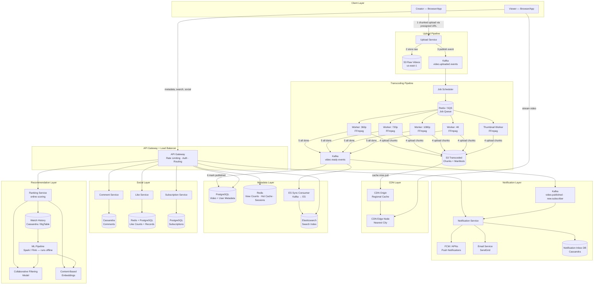

Take a breath — this is the full system. Now let us go room by room.

---

## 1. Video Upload Pipeline

### The Analogy

Uploading a 4 GB video over the internet is like trying to mail a 10,000-page book by stuffing it all into one envelope. The post office will refuse it. The smart way is to tear the book into 20 bundles of 500 pages each, mail each bundle separately, and reassemble at the destination. If one bundle gets lost, you only re-mail that bundle — not the whole book.

That is exactly what chunked upload does.

### Why NOT Upload Directly to Your Server?

Three problems with naive upload:

1. **Single point of failure.** If the connection drops at 3.9 GB of a 4 GB upload, you restart from zero.
2. **Server bottleneck.** Your app server has to receive gigabytes of raw data. This blocks it from handling other requests.
3. **Bandwidth cost.** Data goes: Creator → App Server → S3. Double the network hops, double the cost.

**Solution: Presigned URLs.** The upload service issues a temporary S3 presigned URL directly to the client. The client uploads straight to S3, bypassing your server completely. Your server just gets a "done" notification.

### Upload Flow — Step by Step

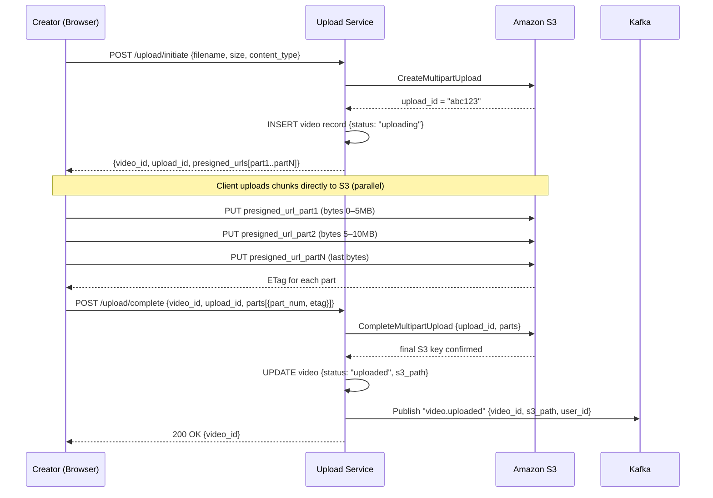

### Key Design Decisions in Upload

**Resumable upload:** The client stores the `upload_id` and which parts were already uploaded. If the browser closes, on re-open it only uploads the missing parts. This is how YouTube does it natively — you have probably seen "Resuming upload…" in YouTube Studio.

**Chunk size:** 5–10 MB per chunk is the sweet spot. Too small = too many HTTP requests (overhead). Too large = a failure means re-uploading a large chunk.

**Validation before storing:**
- File type check (only accept video MIME types)
- File size limit per plan (free user: 15 GB max)
- Content scan (virus/malware) runs async after upload

```python
# Upload Service — simplified pseudocode

def initiate_upload(user_id: str, filename: str, file_size_bytes: int) -> dict:
    video_id = generate_uuid()
    num_parts = math.ceil(file_size_bytes / CHUNK_SIZE_BYTES)  # CHUNK_SIZE = 5MB

    # Create S3 multipart upload session
    mpu = s3.create_multipart_upload(
        Bucket="youtube-raw-videos",
        Key=f"raw/{video_id}/original.mp4",
        ContentType="video/mp4"
    )

    # Generate a presigned URL for each part
    presigned_urls = [
        s3.generate_presigned_url(
            "upload_part",
            Params={"Bucket": "youtube-raw-videos",
                    "Key": f"raw/{video_id}/original.mp4",
                    "UploadId": mpu["UploadId"],
                    "PartNumber": i + 1},
            ExpiresIn=3600  # 1 hour
        )
        for i in range(num_parts)
    ]

    db.insert("videos", {
        "id": video_id, "user_id": user_id,
        "title": filename, "status": "uploading",
        "created_at": datetime.utcnow()
    })

    return {"video_id": video_id, "upload_id": mpu["UploadId"],
            "presigned_urls": presigned_urls}


def complete_upload(video_id: str, upload_id: str, parts: list) -> None:
    s3.complete_multipart_upload(
        Bucket="youtube-raw-videos",
        Key=f"raw/{video_id}/original.mp4",
        UploadId=upload_id,
        MultipartUpload={"Parts": parts}
    )
    db.update("videos", video_id, {
        "status": "uploaded",
        "s3_raw_path": f"raw/{video_id}/original.mp4"
    })
    kafka.publish("video.uploaded", {
        "video_id": video_id,
        "s3_path": f"raw/{video_id}/original.mp4",
        "user_id": db.get_user_id(video_id)
    })
```

**Interview tip:** Interviewers love when you mention presigned URLs. It shows you understand that the data path (upload) and the control path (authentication, metadata) should be separate. Never route large binary data through your application servers.

---

## 2. Video Processing and Transcoding

### The Analogy

Imagine a photo lab in the 1990s. You hand them a roll of raw film (the raw MP4 you uploaded). The lab processes it and gives you back prints in wallet size, 4×6, 8×10, and poster size — the same image, multiple versions for different uses. That is transcoding: the same video content, encoded into multiple resolutions and formats so every device on every network can play it.

### Why Transcoding is Non-Negotiable

Your raw video might be a 10 GB 4K ProRes file recorded on a Sony camera. A viewer on a 3G phone in rural India cannot play that. They need a 360p H.264 stream at 400 Kbps. A viewer on a 4K OLED TV needs 35 Mbps HEVC. Transcoding creates all these versions from the single raw source.

### Resolution and Bitrate Ladder

| Resolution | Dimensions | Avg Bitrate (H.264) | Typical Viewer |
|---|---|---|---|
| 360p | 640×360 | 400 Kbps | Mobile, 3G/4G poor signal |
| 480p | 854×480 | 700 Kbps | Mobile, average 4G |
| 720p | 1280×720 | 2.5 Mbps | Desktop broadband, HDTV |
| 1080p | 1920×1080 | 8 Mbps | Desktop, full HD |
| 1440p | 2560×1440 | 16 Mbps | High-end desktop, 2K display |
| 4K | 3840×2160 | 35 Mbps | Smart TV, premium fiber |

### Codec Wars

| Codec | Owner | Compression | Compatibility | Used For |
|---|---|---|---|---|
| H.264 / AVC | MPEG-LA | Baseline | Universal (every device) | Default fallback |
| H.265 / HEVC | MPEG-LA | 50% better than H.264 | iOS, modern devices | 4K on Apple |
| VP9 | Google | 30–50% better than H.264 | Chrome, Android, YouTube | YouTube default |
| AV1 | Alliance (Google/Mozilla/etc) | 30% better than VP9 | New browsers/devices | YouTube premium quality |

YouTube encodes in VP9 by default (Google owns both), and increasingly in AV1 for newer content.

### The Transcoding Pipeline

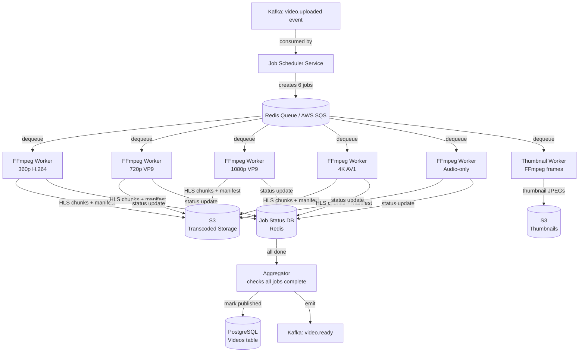

### FFmpeg Commands

```bash
# 720p HLS stream with VP9 codec
ffmpeg \
  -i "s3://youtube-raw/raw/video-abc/original.mp4" \
  -c:v libvpx-vp9 \
  -b:v 2500k \
  -vf scale=1280:720 \
  -c:a libopus \
  -b:a 128k \
  -hls_time 6 \
  -hls_playlist_type vod \
  -hls_segment_filename "segment_%03d.ts" \
  "720p.m3u8"

# Output:
#   720p.m3u8          ← playlist (lists all segments)
#   segment_000.ts     ← seconds 0-6
#   segment_001.ts     ← seconds 6-12
#   segment_002.ts     ← seconds 12-18
#   ...hundreds more

# Thumbnail extraction at 1%, 10%, 50% of video
DURATION=$(ffprobe -v error -show_entries format=duration -of default=noprint_wrappers=1:nokey=1 input.mp4)
ffmpeg -i input.mp4 -ss $(echo "$DURATION * 0.10" | bc) -vframes 1 -vf scale=1280:720 thumb_10pct.jpg
ffmpeg -i input.mp4 -ss $(echo "$DURATION * 0.50" | bc) -vframes 1 -vf scale=1280:720 thumb_50pct.jpg
```

### Worker Pseudocode

```python
class TranscodingWorker:

    def process_job(self, job: dict) -> None:
        video_id   = job["video_id"]
        resolution = job["resolution"]   # e.g. "720p"
        raw_path   = job["s3_raw_path"]

        local_raw = f"/tmp/{video_id}/original.mp4"

        # 1. Download raw video from S3 to local disk
        s3.download_file("youtube-raw", raw_path, local_raw)

        # 2. Run FFmpeg transcoding
        output_dir = f"/tmp/{video_id}/{resolution}"
        os.makedirs(output_dir, exist_ok=True)

        ffmpeg_cmd = self.build_ffmpeg_command(local_raw, resolution, output_dir)
        subprocess.run(ffmpeg_cmd, check=True)

        # 3. Upload all segments + manifest to S3
        for filename in os.listdir(output_dir):
            s3_key = f"transcoded/{video_id}/{resolution}/{filename}"
            s3.upload_file(f"{output_dir}/{filename}", "youtube-transcoded", s3_key)

        # 4. Update job status
        redis.hset(f"transcode_jobs:{video_id}", resolution, "done")

        # 5. Check if all resolutions are done
        all_jobs = redis.hgetall(f"transcode_jobs:{video_id}")
        if all(v == "done" for v in all_jobs.values()):
            self._finalize_video(video_id)

    def _finalize_video(self, video_id: str) -> None:
        # Generate master manifest listing all quality levels
        master_m3u8 = self.build_master_manifest(video_id)
        s3.put_object(
            Bucket="youtube-transcoded",
            Key=f"transcoded/{video_id}/master.m3u8",
            Body=master_m3u8
        )
        db.execute(
            "UPDATE videos SET status='published', published_at=NOW() WHERE id=%s",
            [video_id]
        )
        kafka.publish("video.ready", {"video_id": video_id})
```

### Scaling Transcoding Workers

Transcoding is CPU-intensive. At 500 hours/minute of uploads, you need serious compute.

**Strategy:** Run workers as Kubernetes pods with Horizontal Pod Autoscaler (HPA). When the job queue depth exceeds a threshold (e.g., > 100 jobs), scale up worker pods. YouTube and Netflix both use spot/preemptible instances for transcoding to cut costs — a spot instance being terminated just means the job goes back to the queue and another worker picks it up.

---

## 3. Adaptive Bitrate Streaming (HLS/DASH)

### The Analogy

Imagine driving on a highway where the speed limit changes dynamically based on traffic. When traffic is light (good network), you drive at 120 km/h (1080p). When there is a jam (network congestion), you slow to 60 km/h (480p). You do not stop — you adapt. That is adaptive bitrate streaming.

### How HLS Works

HLS (HTTP Live Streaming, invented by Apple) splits video into small segments and uses playlist files to orchestrate playback.

**Master Manifest (master.m3u8)** — the "table of contents":
```
#EXTM3U
#EXT-X-VERSION:6

# 360p stream
#EXT-X-STREAM-INF:BANDWIDTH=400000,RESOLUTION=640x360,CODECS="avc1.42c01e,mp4a.40.2"
360p/360p.m3u8

# 720p stream
#EXT-X-STREAM-INF:BANDWIDTH=2500000,RESOLUTION=1280x720,CODECS="avc1.64001f,mp4a.40.2"
720p/720p.m3u8

# 1080p stream
#EXT-X-STREAM-INF:BANDWIDTH=8000000,RESOLUTION=1920x1080,CODECS="avc1.640028,mp4a.40.2"
1080p/1080p.m3u8
```

**Quality Manifest (720p/720p.m3u8)** — the "chapter list":
```
#EXTM3U
#EXT-X-VERSION:3
#EXT-X-TARGETDURATION:6
#EXT-X-MEDIA-SEQUENCE:0

#EXTINF:6.0,
segment_000.ts
#EXTINF:6.0,
segment_001.ts
#EXTINF:6.0,
segment_002.ts
...
#EXT-X-ENDLIST
```

### ABR Playback Flow

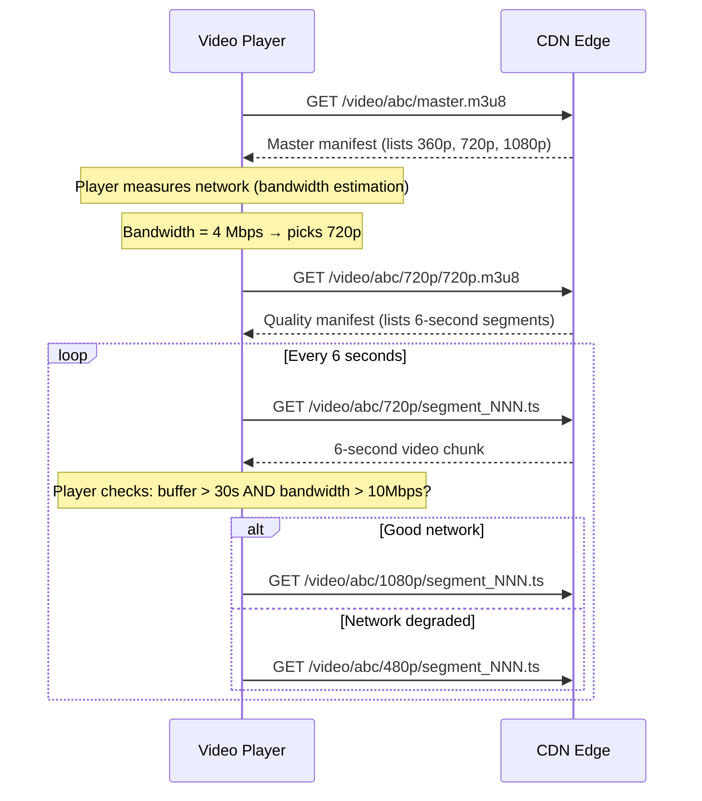

### HLS vs DASH

| Feature | HLS (Apple) | DASH (MPEG) |
|---|---|---|
| Full name | HTTP Live Streaming | Dynamic Adaptive Streaming over HTTP |
| Invented by | Apple (2009) | MPEG consortium (2012) |
| Native support | iOS, macOS, Safari | Chrome, Android, Firefox |
| Segment format | .ts (MPEG Transport Stream) | .mp4 fragments |
| Playlist format | .m3u8 (text) | .mpd (XML) |
| DRM | FairPlay | Widevine (Google), PlayReady (Microsoft) |
| Segment length | Typically 6–10 seconds | Typically 2–10 seconds |
| YouTube uses | Both — DASH for Chrome, HLS for iOS/Safari |

**Interview tip:** When asked "what streaming protocol would you use?" — say both, explain why (device/DRM compatibility), and mention that you'd store both HLS and DASH manifests pointing to the same underlying .ts/.mp4 segments.

---

## 4. CDN for Video Delivery

### The Analogy

Imagine a chai stall that serves the entire city. If there is only one stall downtown, everyone in the suburbs has to travel 1 hour to get chai. Smart solution: set up mini-stalls in every neighbourhood. The main stall makes the chai (origin), and the mini-stalls just store and serve it locally (edge nodes). People get chai instantly without the commute.

CDN is that network of mini-stalls. The S3 bucket is the main stall. Edge nodes are everywhere.

### CDN Architecture for Video

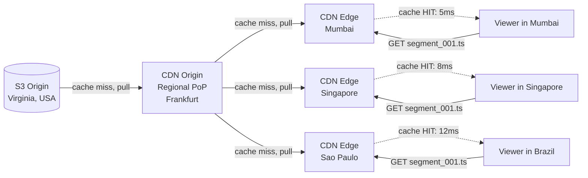

### Cache Hierarchy

```
Viewer request for segment_042.ts
       |
       v
[CDN Edge Node — nearest city]
  Cache HIT  → serve in 5-10ms
  Cache MISS → fetch from:
       |
       v
[CDN Regional Origin — same continent]
  Cache HIT  → serve in 30-50ms, cache at edge
  Cache HIT  → fetch from:
       |
       v
[S3 Bucket — origin, one region]
  Always has it → serve in 100-200ms, cache at regional + edge
```

### What Gets Cached

| Content Type | Cache Duration | Reason |
|---|---|---|
| Video segments (.ts files) | 30 days – forever | Immutable: once created, never change |
| Quality manifests (.m3u8) | 5 minutes | VOD manifests change rarely; live manifests change every few seconds |
| Master manifest | 1 hour | Only changes if quality ladder changes |
| Thumbnail images | 7 days | Can be updated by creator |
| Video metadata (API responses) | 5 minutes | View count changes constantly |

### YouTube's CDN Strategy (Similar to Netflix Open Connect)

YouTube does not fully rely on third-party CDNs like Cloudflare or Akamai at full scale. They operate their own CDN infrastructure and negotiate with ISPs to place their servers inside ISP data centers. This is called **ISP peering / embedded caching**.

Benefits:
- Zero egress cost to the ISP (YouTube delivers traffic directly inside the ISP's network)
- Ultra-low latency (traffic stays inside the same network)
- Better relationship with ISPs

This is exactly what Netflix does with Open Connect Appliances (physical servers Netflix ships to ISPs for free).

**Interview tip:** Mentioning ISP-level peering / embedded caching shows you understand CDN at a very deep level. Even if you cannot implement it, naming it impresses interviewers at Google/Netflix level.

---

## 5. Video Metadata Storage

### The Analogy

Think of a library. Every book (video) has:
1. A catalog card listing the title, author, genre, year (static metadata — changes rarely)
2. A borrowing ledger tracking how many times it was borrowed today (dynamic counters — changes constantly)

You would not use the same system for both. The catalog cards live in a structured filing system (PostgreSQL). The borrowing ledger needs to be very fast to update (Redis).

### PostgreSQL for Static Video Metadata

```sql
-- Videos table: relatively static info
CREATE TABLE videos (
    id              UUID PRIMARY KEY DEFAULT gen_random_uuid(),
    user_id         UUID NOT NULL REFERENCES users(id),
    title           VARCHAR(200) NOT NULL,
    description     TEXT,
    tags            TEXT[],
    status          VARCHAR(20) NOT NULL DEFAULT 'uploading',
                    -- uploading | processing | published | private | deleted
    duration_seconds INTEGER,
    thumbnail_url   TEXT,
    s3_raw_path     TEXT,
    s3_hls_path     TEXT,                  -- path to master.m3u8
    view_count      BIGINT DEFAULT 0,      -- periodically synced from Redis
    like_count      BIGINT DEFAULT 0,
    comment_count   BIGINT DEFAULT 0,
    category        VARCHAR(50),
    language        VARCHAR(10),
    created_at      TIMESTAMPTZ DEFAULT now(),
    published_at    TIMESTAMPTZ,
    updated_at      TIMESTAMPTZ DEFAULT now()
);

-- Users / Channels table
CREATE TABLE users (
    id              UUID PRIMARY KEY DEFAULT gen_random_uuid(),
    username        VARCHAR(50) UNIQUE NOT NULL,
    email           VARCHAR(200) UNIQUE NOT NULL,
    display_name    VARCHAR(100),
    avatar_url      TEXT,
    subscriber_count BIGINT DEFAULT 0,
    created_at      TIMESTAMPTZ DEFAULT now()
);

-- Indexes (critical for performance)
CREATE INDEX idx_videos_user_id        ON videos(user_id);
CREATE INDEX idx_videos_status         ON videos(status);
CREATE INDEX idx_videos_published_at   ON videos(published_at DESC)
                                        WHERE status = 'published';
CREATE INDEX idx_videos_tags           ON videos USING GIN(tags);
```

### Redis for Hot Data

Redis serves two roles: **caching** and **fast counters**.

```python
class VideoCache:

    CACHE_TTL = 300  # 5 minutes

    def get_video(self, video_id: str) -> dict:
        cache_key = f"video:{video_id}"
        cached = redis.get(cache_key)
        if cached:
            return json.loads(cached)             # cache HIT

        video = db.fetchone(                       # cache MISS → DB
            "SELECT * FROM videos WHERE id = %s", [video_id]
        )
        if video:
            redis.setex(cache_key, self.CACHE_TTL, json.dumps(video))
        return video

    def invalidate(self, video_id: str) -> None:
        redis.delete(f"video:{video_id}")          # on video update
```

### Database Sharding for Scale

At 800 million videos (YouTube's real scale), a single PostgreSQL instance is not enough.

**Sharding strategy:** Shard `videos` table by `user_id` (or `video_id` UUID range). Each shard handles a subset of creators.

**Read replicas:** Every shard has 2–3 read replicas. 99% of traffic (reads) goes to replicas. Writes (uploads, metadata updates) go to the primary.

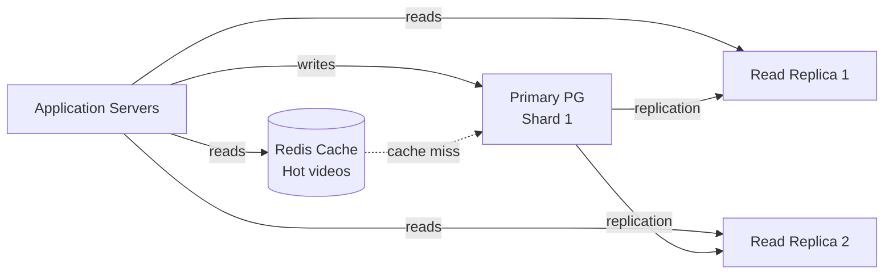

---

## 6. View Count at Massive Scale

### The Analogy

Imagine a cricket stadium with 80,000 fans. Every time India hits a six, the announcer needs to update the score. If the announcer had to walk to each of the 80,000 seats to count who cheered, they'd never finish. Instead, section leaders count their section (say 500 fans each), report to the announcer every minute, and the announcer updates the scoreboard.

That is Redis + batch flush. Redis plays the role of section leaders — fast, local, incremental. PostgreSQL is the scoreboard — updated infrequently but accurately.

### The Problem with Naive View Counting

```
Viral video: 500K views in 5 minutes = 100K views/minute = 1,666 views/second

Naive SQL:
  UPDATE videos SET view_count = view_count + 1 WHERE id = 'video-abc';

At 1,666 writes/second:
  - Row-level lock contention
  - PostgreSQL write-ahead log fills up
  - Query latency spikes to seconds
  - Eventually: database crash
```

### Solution: Redis Counter + Batch Flush

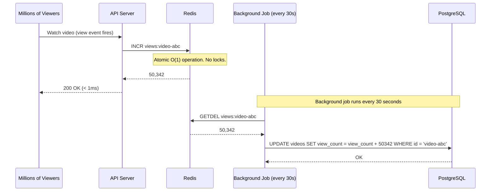

This reduces DB writes from 1,666/second to **2 writes per minute** — a 50,000x reduction.

```python
class ViewCountService:

    def record_view(self, video_id: str, user_id: str) -> None:
        # Deduplicate: don't count if same user viewed in last 30 min
        dedup_key = f"view_dedup:{video_id}:{user_id}"
        if redis.exists(dedup_key):
            return  # already counted this view
        redis.setex(dedup_key, 1800, "1")  # 30-minute TTL

        # Increment view counter
        redis.incr(f"views:{video_id}")

    def flush_view_counts(self) -> None:
        """Called by background job every 30 seconds."""
        cursor = 0
        while True:
            cursor, keys = redis.scan(cursor, match="views:*", count=1000)
            for key in keys:
                count = redis.getdel(key)    # atomic get-and-delete
                if count and int(count) > 0:
                    video_id = key.split(":", 1)[1]
                    db.execute(
                        "UPDATE videos SET view_count = view_count + %s WHERE id = %s",
                        [int(count), video_id]
                    )
            if cursor == 0:
                break
```

### HyperLogLog for Unique View Estimation

For "unique viewers" (not just total views), exact counting requires storing every viewer ID — expensive. Use HyperLogLog instead.

```python
# HyperLogLog uses ~12 KB of memory regardless of input size
# Gives ~0.81% error rate — totally acceptable for "unique views"

def record_unique_viewer(video_id: str, user_id: str) -> None:
    redis.pfadd(f"unique_views:{video_id}", user_id)  # HyperLogLog add

def get_unique_viewers(video_id: str) -> int:
    return redis.pfcount(f"unique_views:{video_id}")  # approximate count
```

**Interview tip:** When asked "how would you count views at scale?" — walk through the naive approach and its failure, then present Redis INCR + batch flush, and optionally mention HyperLogLog for unique counts. This shows you understand the progression from simple to scalable.

---

## 7. Video Search with Elasticsearch

### The Analogy

Finding a specific video using SQL LIKE is like searching a library by reading every book's title one by one. Elasticsearch is like having an index card box where someone has already sorted every word, mapped it to every book it appears in, and ranked books by how often that word appears. You flip to "cooking pasta" and instantly get the top 20 books — without scanning any of them.

### Why Not PostgreSQL Full-Text Search?

PostgreSQL has `tsvector` and `tsquery` for full-text search. At YouTube scale, it falls short because:
- It cannot handle typos ("cookin pasta" vs "cooking pasta") without extra work
- Relevance tuning is limited
- It cannot handle 800 million documents at sub-second latency
- No native support for personalized ranking by watch history

Elasticsearch is purpose-built for this.

### Index Schema

```json
PUT /youtube_videos
{
  "settings": {
    "number_of_shards": 20,
    "number_of_replicas": 2,
    "analysis": {
      "analyzer": {
        "video_analyzer": {
          "type": "custom",
          "tokenizer": "standard",
          "filter": ["lowercase", "stop", "porter_stem", "asciifolding"]
        }
      }
    }
  },
  "mappings": {
    "properties": {
      "video_id":       { "type": "keyword" },
      "title":          { "type": "text", "analyzer": "video_analyzer",
                          "fields": { "keyword": { "type": "keyword" } } },
      "description":    { "type": "text", "analyzer": "video_analyzer" },
      "tags":           { "type": "keyword" },
      "channel_name":   { "type": "text", "analyzer": "video_analyzer" },
      "category":       { "type": "keyword" },
      "language":       { "type": "keyword" },
      "view_count":     { "type": "long" },
      "like_count":     { "type": "long" },
      "published_at":   { "type": "date" },
      "duration_seconds": { "type": "integer" },
      "thumbnail_url":  { "type": "keyword", "index": false }
    }
  }
}
```

### Search Query

```python
def search_videos(query: str, user_id: str = None,
                  page: int = 0, page_size: int = 20) -> list:

    must_clause = {
        "multi_match": {
            "query": query,
            "fields": [
                "title^4",           # title match = 4x weight
                "tags^3",            # tag match = 3x weight
                "channel_name^2",    # channel name = 2x weight
                "description^1"      # description = 1x weight
            ],
            "type": "best_fields",
            "fuzziness": "AUTO",     # handles typos automatically
            "minimum_should_match": "75%"
        }
    }

    # Boost recent videos and popular videos
    should_clauses = [
        {"range": {"published_at": {"gte": "now-30d"}}},   # recency boost
        {"range": {"view_count": {"gte": 1000000}}}         # popularity boost
    ]

    result = es.search(
        index="youtube_videos",
        body={
            "query": {
                "bool": {
                    "must": [must_clause],
                    "should": should_clauses,
                    "filter": [
                        {"term": {"status": "published"}},
                        {"range": {"published_at": {"lte": "now"}}}
                    ]
                }
            },
            "sort": [
                {"_score": "desc"},           # relevance
                {"view_count": "desc"}        # popularity tiebreaker
            ],
            "from": page * page_size,
            "size": page_size,
            "_source": ["video_id", "title", "thumbnail_url",
                        "channel_name", "view_count", "published_at"]
        }
    )

    return [hit["_source"] for hit in result["hits"]["hits"]]
```

### Keeping Elasticsearch in Sync

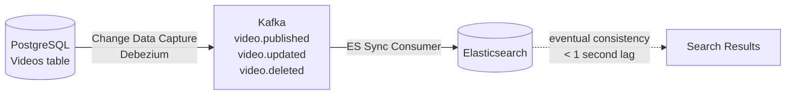

The sync uses **Debezium** (CDC tool) to stream PostgreSQL WAL changes into Kafka. The ES consumer reads those events and upserts documents. Eventual consistency of < 1 second is perfectly fine for search.

### Search Autocomplete

```python
# Separate lightweight index for autocomplete suggestions
PUT /video_suggestions
{
  "mappings": {
    "properties": {
      "suggest": {
        "type": "completion",  # Elasticsearch completion suggester
        "analyzer": "simple"
      }
    }
  }
}

# Query
def autocomplete(prefix: str) -> list:
    result = es.search(index="video_suggestions", body={
        "suggest": {
            "video-suggest": {
                "prefix": prefix,
                "completion": {"field": "suggest", "size": 10}
            }
        }
    })
    return [opt["text"] for opt in result["suggest"]["video-suggest"][0]["options"]]
```

---

## 8. Recommendation Engine

### The Analogy

Two ways a great friend recommends movies to you:
1. **"Log jaise tum ho woh pasand karte hain"** (Collaborative filtering): "People who love the same movies you love also went crazy for this new film."
2. **"Tumhari pasand ke jaise hi hai"** (Content-based): "You love sci-fi movies — this new film is also sci-fi."

YouTube uses both together and ranks the results with a third model that predicts whether you will actually click and watch for a long time.

### The Two-Stage Architecture

YouTube's actual recommendation system (published in a 2016 paper) uses a two-stage architecture:

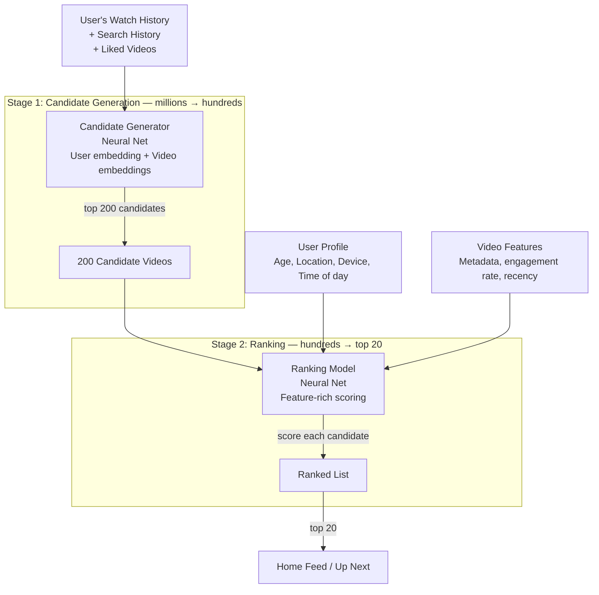

### Stage 1: Candidate Generation

This is like a rough filter. From 800 million videos, get down to ~200 candidates fast.

```python
# Simplified collaborative filtering using user embeddings

class CandidateGenerator:

    def get_candidates(self, user_id: str, n: int = 200) -> list:
        # 1. Get user embedding (trained offline by ML pipeline)
        user_vec = self.embedding_store.get_user_vector(user_id)
        # user_vec is a 256-dimensional float array

        # 2. Approximate nearest neighbour search in video embedding space
        # (using FAISS or ScaNN for billion-scale ANN search)
        candidate_video_ids = self.ann_index.search(user_vec, k=n)

        return candidate_video_ids

    # For cold-start users (new users with no history):
    def get_cold_start_candidates(self) -> list:
        return self.trending_videos_cache.get_top(200)
```

### Stage 2: Ranking

Each of the 200 candidates gets a rich feature set and is scored by a ranking model.

| Feature Type | Examples |
|---|---|
| User features | Age, country, device, time of day, watch history length |
| Video features | Age of video, view count, like:dislike ratio, average watch percentage |
| User-Video interaction features | Has user watched this channel before? Watch percentage of similar videos |
| Context features | What was the last video they watched? How long ago? |

The ranking model outputs two scores:
- **Click-through rate (CTR)** — will the user click?
- **Watch time** — if they click, how long will they watch?

Final score = CTR × predicted watch time (this is why YouTube shows videos you watch fully, not just click).

### Watch History Schema

```sql
-- Stored in Cassandra (writes are frequent, reads are by user_id)
CREATE TABLE watch_history (
    user_id     UUID,
    watched_at  TIMESTAMP,
    video_id    UUID,
    watched_pct FLOAT,         -- 0.0 to 1.0 (how much they watched)
    watch_seconds INTEGER,
    source      VARCHAR(20),   -- 'home', 'search', 'sidebar', 'notification'
    PRIMARY KEY (user_id, watched_at, video_id)
) WITH CLUSTERING ORDER BY (watched_at DESC);

-- Query: get last 100 videos user watched
SELECT video_id, watched_pct, watch_seconds
FROM watch_history
WHERE user_id = ?
ORDER BY watched_at DESC
LIMIT 100;
```

**Interview tip:** When discussing recommendations, always mention the cold-start problem: new users have no history. Solution: show trending/popular as fallback, then progressively personalize as they watch.

---

## 9. Comment System

### The Analogy

Think of comments like a restaurant's suggestion book. People write notes all day, some reply to others' notes. The book fills up fast. If you have a separate page per dish (per video), finding all comments for "Paneer Butter Masala" means you just flip to that page — fast regardless of how many total comments exist in the book. That is how Cassandra's partition key works: `video_id` is the "page."

### Why Cassandra for Comments?

| Requirement | Why Cassandra Fits |
|---|---|
| High write throughput | Cassandra is optimized for writes; no row locks |
| Read by video_id | Partition key = video_id means all comments for a video are co-located |
| Time-series ordering | Clustering key = timestamp gives natural sort |
| Horizontal scale | Cassandra scales by adding nodes, no resharding |
| No complex joins needed | Comments do not need joins; simple access patterns |

### Cassandra Schema

```sql
-- Top-level comments
CREATE TABLE comments (
    video_id    UUID,
    created_at  TIMEUUID,          -- time-based UUID for unique + sortable
    comment_id  UUID,
    user_id     UUID,
    text        TEXT,
    like_count  COUNTER,
    reply_count COUNTER,
    is_deleted  BOOLEAN DEFAULT FALSE,
    PRIMARY KEY (video_id, created_at, comment_id)
) WITH CLUSTERING ORDER BY (created_at DESC);

-- Replies to comments (separate table)
CREATE TABLE comment_replies (
    comment_id  UUID,
    created_at  TIMEUUID,
    reply_id    UUID,
    user_id     UUID,
    text        TEXT,
    like_count  COUNTER,
    PRIMARY KEY (comment_id, created_at, reply_id)
) WITH CLUSTERING ORDER BY (created_at DESC);

-- Example queries
-- Get newest 50 comments for a video:
SELECT * FROM comments WHERE video_id = ? LIMIT 50;

-- Get replies to a comment:
SELECT * FROM comment_replies WHERE comment_id = ? LIMIT 20;
```

### Pagination

Comments use cursor-based pagination, not offset-based. Why? Because on a high-traffic video, new comments are inserted constantly. Page 2 with OFFSET 20 would skip or repeat comments as new ones are added.

```python
def get_comments(video_id: str, cursor: str = None, limit: int = 20) -> dict:
    query = "SELECT * FROM comments WHERE video_id = %s"
    params = [video_id]

    if cursor:
        # cursor is a base64-encoded (created_at, comment_id) from last result
        last_ts, last_id = decode_cursor(cursor)
        query += " AND (created_at, comment_id) < (%s, %s)"
        params.extend([last_ts, last_id])

    query += " LIMIT %s"
    params.append(limit + 1)  # fetch one extra to know if there's a next page

    rows = cassandra.execute(query, params)
    has_more = len(rows) > limit
    if has_more:
        rows = rows[:limit]

    next_cursor = encode_cursor(rows[-1]["created_at"], rows[-1]["comment_id"]) if has_more else None
    return {"comments": rows, "next_cursor": next_cursor}
```

---

## 10. Likes System

### The Analogy

Imagine a voting ballot at your school's talent show. Thousands of people vote simultaneously. You cannot have everyone queue up to add their vote to a single counter — it would take all day. Instead, you hand each audience section a counter clicker. Section leaders report their counts every minute. That is likes using Redis.

### Design Decisions

Two things we need from the likes system:
1. **Did this user like this video?** (yes/no — for showing the filled thumb icon)
2. **How many total likes does this video have?** (aggregate count)

These have very different access patterns. A single table might not serve both optimally.

```mermaid
graph LR
    U[User clicks Like button] -->|POST /like| LS[Like Service]
    LS -->|"SADD user_likes:{user_id} {video_id}"| RD[Redis Sets\nper-user like set]
    LS -->|"INCR like_count:{video_id}"| RC[Redis Counter\nper-video like count]
    LS -->|INSERT likes record| PG[(PostgreSQL\nLikes table)]

    BG[Background job every 60s] -->|GETDEL like_count:{video_id}| RC
    BG -->|UPDATE videos SET like_count = like_count + delta| PG
```

### Schema

```sql
-- Persistent record of every like (for "did this user like this?")
CREATE TABLE likes (
    user_id     UUID NOT NULL,
    video_id    UUID NOT NULL,
    liked_at    TIMESTAMPTZ DEFAULT now(),
    PRIMARY KEY (user_id, video_id)        -- unique: one like per user per video
);

CREATE INDEX idx_likes_video ON likes(video_id);  -- for counting likes per video
```

```python
class LikeService:

    def toggle_like(self, user_id: str, video_id: str) -> dict:
        like_key = f"user_likes:{user_id}"

        if redis.sismember(like_key, video_id):
            # Already liked → unlike
            redis.srem(like_key, video_id)
            redis.decr(f"like_count:{video_id}")
            db.execute("DELETE FROM likes WHERE user_id=%s AND video_id=%s",
                       [user_id, video_id])
            return {"liked": False}
        else:
            # Not liked → like
            redis.sadd(like_key, video_id)
            redis.incr(f"like_count:{video_id}")
            db.execute("INSERT INTO likes (user_id, video_id) VALUES (%s, %s) "
                       "ON CONFLICT DO NOTHING", [user_id, video_id])
            return {"liked": True}

    def has_user_liked(self, user_id: str, video_id: str) -> bool:
        return redis.sismember(f"user_likes:{user_id}", video_id)
```

**Trade-off:** The Redis Set approach works well for a reasonable number of liked videos per user (say up to 10,000). For users who like millions of videos, you would switch to always querying PostgreSQL for the like status, since the Redis set becomes too large.

---

## 11. Subscriptions and Feed

### The Analogy

Subscriptions are like a newspaper delivery list. When a newspaper (channel) publishes a new edition (video), the delivery person needs to know which houses (subscribers) to drop it at. Two ways to do this:

1. **Fan-out on write (push model):** The moment the newspaper is published, immediately deliver copies to all houses. Fast for readers, slow for publishers with millions of subscribers.
2. **Fan-out on read (pull model):** Each house checks the newspaper office every morning for new editions from the papers they subscribed to. Fast for publishers, but readers have to "pull" their feed.

YouTube uses a **hybrid approach** depending on channel size.

### Subscription Data Model

```sql
CREATE TABLE subscriptions (
    subscriber_id   UUID NOT NULL,
    channel_id      UUID NOT NULL,          -- channel_id = user_id of creator
    subscribed_at   TIMESTAMPTZ DEFAULT now(),
    notify_on_upload BOOLEAN DEFAULT TRUE,
    PRIMARY KEY (subscriber_id, channel_id)
);

CREATE INDEX idx_subs_channel ON subscriptions(channel_id);
-- Query: "who subscribes to channel X?" — for fan-out
-- Query: "what channels does user Y subscribe to?" — for feed generation
```

### Subscription Feed Generation

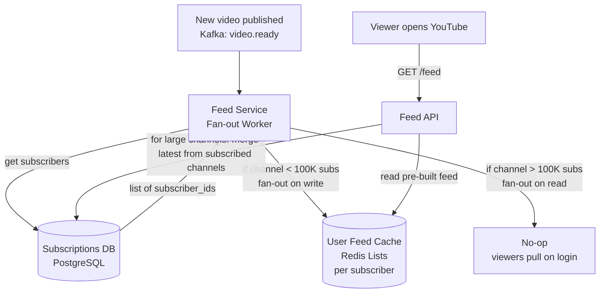

```python
class FeedService:
    LARGE_CHANNEL_THRESHOLD = 100_000  # subscribers

    def on_video_published(self, video_id: str, channel_id: str) -> None:
        channel = db.get_channel(channel_id)

        if channel["subscriber_count"] < self.LARGE_CHANNEL_THRESHOLD:
            # Fan-out on write: push to each subscriber's feed
            self._fanout_to_subscribers(video_id, channel_id)
        # For large channels (MrBeast, PewDiePie), skip fan-out.
        # Subscribers will pull the latest videos when they open YouTube.

    def _fanout_to_subscribers(self, video_id: str, channel_id: str) -> None:
        # Get all subscriber IDs (paginated for large lists)
        cursor = None
        while True:
            subs, cursor = db.get_subscribers(channel_id, cursor=cursor, limit=1000)
            for subscriber_id in subs:
                feed_key = f"feed:{subscriber_id}"
                redis.lpush(feed_key, video_id)       # prepend to feed list
                redis.ltrim(feed_key, 0, 499)         # keep last 500 items
            if cursor is None:
                break

    def get_user_feed(self, user_id: str, page: int = 0) -> list:
        # Get pre-built feed from Redis
        start = page * 20
        video_ids = redis.lrange(f"feed:{user_id}", start, start + 19)

        if len(video_ids) < 10:
            # Not enough pre-built feed; pull latest from subscribed channels
            subscribed = db.get_subscribed_channels(user_id, limit=50)
            video_ids = db.get_latest_videos_from_channels(subscribed, limit=20)

        return [video_cache.get(vid) for vid in video_ids]
```

---

## 12. Notifications

### The Analogy

When your favourite show releases a new episode on Netflix, Netflix sends you a push notification. They do not call every subscriber individually — they use a system that fans out to millions of devices in seconds. That system has several layers: a message queue, a routing layer that figures out whether you get a push, an email, or both, and a delivery layer that talks to Apple/Google servers.

### Notification Types

| Trigger | Notification | Delivery |
|---|---|---|
| Channel uploads new video | "ChannelX uploaded: [title]" | Push + Email (if opted in) |
| Someone replies to your comment | "UserY replied to your comment" | Push |
| Someone likes your video | Batched: "50 people liked your video" | Push (batched, not per like) |
| New subscriber | "UserZ subscribed to your channel" | Push (batched) |
| Live stream starting | "ChannelX is live now!" | Push (urgent) |

### Notification Architecture

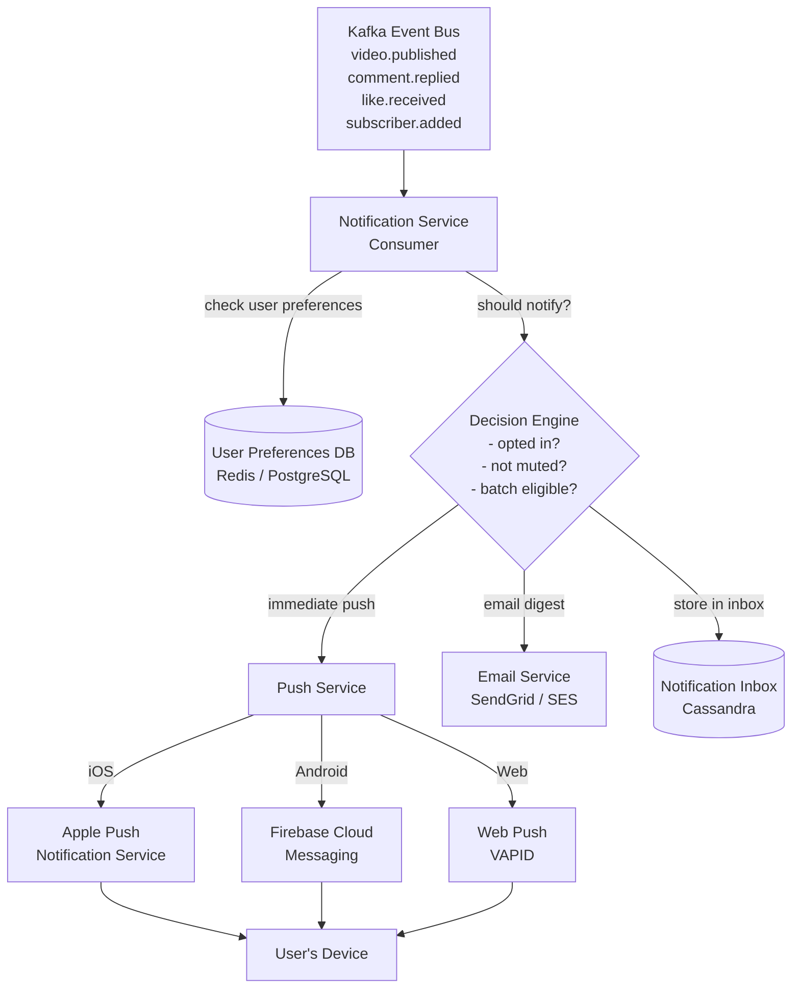

### Notification Inbox Schema (Cassandra)

```sql
-- User's notification inbox
CREATE TABLE notifications (
    user_id         UUID,
    created_at      TIMEUUID,
    notification_id UUID,
    type            VARCHAR,           -- 'upload', 'comment_reply', 'like', 'subscriber'
    actor_id        UUID,              -- who triggered this
    entity_id       UUID,             -- which video/comment
    title           TEXT,
    body            TEXT,
    is_read         BOOLEAN DEFAULT FALSE,
    deep_link       TEXT,             -- e.g. "/watch?v=abc123"
    PRIMARY KEY (user_id, created_at, notification_id)
) WITH CLUSTERING ORDER BY (created_at DESC);

-- Mark as read
UPDATE notifications SET is_read = TRUE
WHERE user_id = ? AND created_at = ? AND notification_id = ?;
```

### Batching Notifications

Sending one push notification every time someone likes your video would be incredibly annoying. Batch them.

```python
class NotificationBatcher:

    def on_like_received(self, video_id: str, creator_id: str,
                         liker_id: str) -> None:
        batch_key = f"notif_batch:like:{creator_id}:{video_id}"

        # Add to batch set
        redis.sadd(batch_key, liker_id)
        redis.expire(batch_key, 3600)  # batch expires in 1 hour

        count = redis.scard(batch_key)

        # Send push at milestones: 1, 10, 100, 1000 likes
        if count in {1, 10, 100, 1000}:
            self._send_batched_like_push(creator_id, video_id, count)

    def _send_batched_like_push(self, creator_id: str,
                                video_id: str, count: int) -> None:
        push_service.send(
            user_id=creator_id,
            title="Your video is getting love!",
            body=f"{count} people liked your video",
            deep_link=f"/watch?v={video_id}"
        )
```

---

## 13. Security and Access Control

### Video Access Control

```
Public video:
  - CDN serves directly, no auth needed
  - Manifest URL is public

Private video (unlisted or private):
  - Viewer must be authenticated
  - API validates user has access
  - CDN serves only via signed URLs (short-lived tokens)

Signed URL generation:
  token = HMAC-SHA256(
      key=CDN_SECRET,
      message=f"{video_id}:{user_id}:{expiry_timestamp}"
  )
  url = f"https://cdn.youtube.com/video/{video_id}/master.m3u8?token={token}&expires={expiry}"
```

### DRM (Digital Rights Management)

For premium content (YouTube Premium movies):

| Platform | DRM System | Encryption |
|---|---|---|
| Chrome, Android | Google Widevine | CENC (Common Encryption) |
| iOS, macOS | Apple FairPlay | HLS encryption |
| Windows | Microsoft PlayReady | CENC |

### Rate Limiting

```python
# Upload rate limiting: 5 uploads per user per hour
def check_upload_rate_limit(user_id: str) -> bool:
    key = f"upload_rate:{user_id}:{datetime.utcnow().strftime('%Y%m%d%H')}"
    current = redis.incr(key)
    redis.expire(key, 3600)
    return current <= 5  # True = allowed

# View rate limiting: prevent fake view inflation
# Require: same user can count as 1 view per video per 30 minutes
# (Already handled in record_view deduplication above)
```

### Content Moderation

```
Upload → Async content scan pipeline
           |
           ├── Video hash check (PhotoDNA / MD5)
           │   Matches known CSAM or copyright? → auto-reject
           |
           ├── ML vision classifier
           │   Violence, adult content, hate symbols?
           │   → flag for human review, suppress from public
           |
           └── Audio fingerprinting (Content ID)
               Matches copyrighted music?
               → apply monetization rules or mute audio
```

---

## 14. Bottlenecks and Solutions

| Bottleneck | Symptom | Root Cause | Solution |
|---|---|---|---|
| Upload server overloaded | Slow uploads, timeouts | All traffic goes through app server | Presigned S3 URLs — client uploads directly to S3 |
| Transcoding queue backs up | New videos stuck in "processing" for hours | Insufficient worker capacity | K8s HPA auto-scales worker pods; use spot instances |
| CDN cache miss storm | Video start time spikes suddenly | Trending video not cached at edge | Pre-warm CDN for trending videos (proactively push segments before demand) |
| DB view count writes overload | PostgreSQL CPU maxes out | Too many direct UPDATE statements | Redis INCR + 30-second batch flush to Postgres |
| Recommendations too slow | Home feed loads in 5+ seconds | On-demand ML inference is expensive | Pre-compute recommendations offline (daily batch); serve from Redis cache |
| Elasticsearch search slow | Search > 1 second | Index too large on one node | Increase shards; add ES nodes; tune query caching |
| Notification fan-out too slow | Large channel upload notification takes hours | Sending millions of push notifications serially | Parallelize fan-out in Kafka consumer group; use async push batch API |
| Feed generation slow for subscribers | "Subscriptions" tab loads slowly | Pull model at read time is expensive | Hybrid model: fan-out on write for small channels, pull on read for mega-channels |
| Redis crashes, lose view counts | View counts reset/incorrect after Redis restart | In-memory only | Enable Redis AOF persistence + also publish events to Kafka as backup |
| Cold start for new creators | 0 views, no recommendations | No engagement data | Boost new videos in "New to You" slot; surface on "Browse" feed for first 48 hours |

---

## Common Interview Questions

### Q1: How would you handle a video going viral with 10 million views in 1 hour?

**Answer:** The viral surge hits three bottlenecks:
1. **View counting** — Redis INCR handles millions of increments/second with no issue. Batch flush to DB every 30 seconds.
2. **CDN cache miss** — The first request to each edge node is a cache miss (slow). Subsequent requests hit cache. Pre-warm edges proactively if we detect trending signals early (e.g., view velocity spike in Redis).
3. **Recommendations** — A viral video should surface in recommendations quickly. Daily batch job may be too slow. Maintain a "trending" feed (top N by view velocity in last hour) served from Redis, separate from personalized feed.

---

### Q2: A creator uploads a 10 GB video. Walk me through exactly what happens.

**Answer:** Step by step:
1. Browser requests presigned URLs from Upload Service (1 per 5MB chunk = 2000 URLs)
2. Browser uploads 2000 chunks in parallel to S3 (bypasses app server)
3. Upload Service receives "complete" call, triggers S3 CompleteMultipartUpload
4. Upload Service publishes `video.uploaded` to Kafka
5. Job Scheduler reads Kafka event, creates 5 jobs: 360p, 720p, 1080p, 4K, thumbnails
6. 5 workers start in parallel; each downloads raw from S3, runs FFmpeg, uploads .ts chunks + manifest back to S3
7. Aggregator sees all 5 jobs complete, updates video status to "published" in PostgreSQL
8. Publishes `video.ready` to Kafka
9. ES Sync Consumer indexes video in Elasticsearch
10. Feed Service fans out video_id to subscribers' feed lists in Redis
11. Notification Service sends push notifications to subscribers

---

### Q3: Why use Cassandra for comments instead of PostgreSQL?

**Answer:** Three reasons:
1. **Write throughput.** A viral video gets thousands of comments per second. Cassandra is a leaderless distributed database with no single master, handling high write throughput with no lock contention.
2. **Partition key = video_id.** All comments for a video are stored on the same node(s). "Get comments for video X" is a single-partition query — O(1) routing.
3. **Time-series ordering.** Clustering by `created_at DESC` gives free sorted access without a sort operation.

Trade-off: Cassandra lacks ACID transactions and joins. But comments do not need joins — we just need "comments for video X, sorted newest first."

---

### Q4: How do you design the recommendation system for a new user with no watch history? (Cold start problem)

**Answer:**
- **Stage 1 (no data):** Show trending videos (top N by view velocity in last 24 hours), stored in Redis, refreshed every 15 minutes.
- **Stage 2 (some data):** After the user watches 3–5 videos, do content-based filtering — find videos similar to what they just watched (same category, similar tags).
- **Stage 3 (enough data):** After 20+ videos, collaborative filtering kicks in — find users with similar taste vectors.
- Also use onboarding signals: ask new users to pick 3 topics they like and 3 channels they know. This bootstraps the profile immediately.

---

### Q5: How would you make video search results personalized?

**Answer:** Two layers of personalization:
1. **Re-ranking in Elasticsearch:** Include user-specific signals in the query. Boost videos from channels the user subscribes to. Boost videos in categories the user watches most.
2. **Post-search ranking:** After ES returns top 50 results by relevance, pass them through the recommendation ranking model (the same model that ranks the home feed). This scores each search result by CTR and predicted watch time for this specific user.

The cold trade-off: pure relevance vs personalized relevance. A new user gets pure relevance (no personalization signal). A returning user gets personalized results.

---

### Q6: Estimate the storage needed for YouTube thumbnails.

**Answer:**
- 800 million videos on YouTube
- 1 thumbnail per video at 1280×720 = approximately 100–300 KB per thumbnail
- YouTube generates 4 auto-thumbnails + 1 creator-chosen = 5 per video
- 800M × 5 × 200 KB average = **800 TB of thumbnail storage**
- Serve from S3 via CDN (thumbnails are the #1 most-served asset — more requests than video segments because thumbnails load on every page view)

---

### Q7: How do subscriptions fan-out when MrBeast (160M subscribers) posts a video?

**Answer:** You cannot fan-out to 160M users synchronously — it would take hours and overwhelm the DB.

**Hybrid approach:**
- **For creators with > 1M subscribers:** Do NOT fan-out on upload. Instead, maintain a sorted set in Redis: `channel_latest_videos:{channel_id}`. Push the new video_id to this set.
- When a subscriber opens YouTube, the feed API fetches the latest video from each of their subscribed mega-channels and merges it with their pre-built feed cache.
- **For creators with < 100K subscribers:** Fan-out on write to subscriber feed lists in Redis. This affects a manageable number of users and completes quickly.
- **Push notifications still go to all subscribers** (just the notification, not feed fan-out). This uses FCM/APNs batch APIs that handle millions of notifications in minutes.

---

### Q8: What databases would you use and why?

| Data | Database | Why |
|---|---|---|
| Video metadata (title, description, status) | PostgreSQL | Relational, ACID, complex queries, moderate write rate |
| View counts, like counts | Redis | Atomic INCR, sub-millisecond, handles millions of writes/sec |
| Watch history | Cassandra | High write rate, access by user_id, time-series |
| Comments | Cassandra | High write rate, access by video_id, time-series |
| Search | Elasticsearch | Full-text search, fuzzy matching, relevance scoring |
| Sessions, hot cache | Redis | TTL-based, fast reads |
| Notifications inbox | Cassandra | High write rate, access by user_id, time-series |
| Subscriptions | PostgreSQL | Relational (subscriber_id, channel_id pairs), moderate scale |
| Video files, thumbnails | S3 | Object storage, unlimited scale, CDN-friendly |

---

## Key Takeaways

1. **Presigned URLs are the right way to handle large uploads.** Never route binary data through application servers. The client uploads directly to S3; your server only handles metadata and job orchestration.

2. **Transcoding is always asynchronous.** The upload response returns immediately; transcoding happens in background workers. Use Kafka to decouple the upload event from the transcoding pipeline. Workers can scale independently.

3. **HLS/DASH + adaptive bitrate is the standard for streaming.** Split video into 6-second segments, generate a manifest file, let the player choose quality per segment based on measured bandwidth. Video never freezes — it just changes quality.

4. **CDN is not optional at scale — it is the product.** Without CDN, streaming video globally is impossible. Every video segment request should be served from an edge node < 50ms from the viewer. The S3 bucket should rarely be hit directly.

5. **Redis counter + batch flush solves the view count problem.** INCR in Redis is O(1), atomic, and handles millions of writes/second. Flush to PostgreSQL every 30 seconds. This reduces DB writes by 50,000x. Accept 30-second staleness — users cannot tell the difference.

6. **Match the database to the access pattern.** PostgreSQL for relational metadata, Cassandra for high-write time-series data (comments, watch history, notifications), Redis for counters and hot cache, Elasticsearch for full-text search. Using PostgreSQL for everything is the most common wrong answer in interviews.

7. **Recommendations are two-stage.** Candidate generation (millions → hundreds, fast and coarse) then ranking (hundreds → top 20, slow and accurate). YouTube's 70% watch-time from recommendations comes from the ranking model optimizing for predicted watch time, not just clicks.

8. **Subscription fan-out is where most candidates get stuck.** Use hybrid: fan-out on write for small channels (push to each subscriber's Redis feed list), fan-out on read for mega-channels (subscribers pull on login). Separating these by channel size is the key insight.

9. **Notifications need batching.** One push notification per like would make YouTube unusable. Batch at milestones (1, 10, 100 likes). For comments, send immediately but only for direct replies. Store all notifications in a Cassandra inbox for in-app display.

10. **The system is read-heavy by 7000:1.** Every design decision should optimize for reads. CDN, read replicas, Redis caching, pre-computed recommendations — all justified by this ratio. Never propose a write-optimized architecture for YouTube.

---

## Further Reading

- [YouTube Scalability (2012 Google Paper)](https://research.google/pubs/pub36396/)
- [Deep Neural Networks for YouTube Recommendations (2016)](https://research.google/pubs/pub45530/) — the actual YouTube recommendation system paper
- [Netflix Tech Blog — ABR Streaming Architecture](https://netflixtechblog.com/tagged/streaming)
- [Netflix Open Connect — ISP Embedded Caching](https://openconnect.netflix.com/en/)
- [HLS Specification — Apple Developer Docs](https://developer.apple.com/streaming/)
- [Cassandra Data Modeling](https://cassandra.apache.org/doc/latest/cassandra/data_modeling/)
- [Elasticsearch Relevance Tuning Guide](https://www.elastic.co/guide/en/elasticsearch/reference/current/query-dsl-multi-match-query.html)
- [FAISS — Facebook AI Similarity Search (for ANN in recommendations)](https://faiss.ai/)
