# Case Study: Design Dropbox / Google Drive

> **Interview Prep** | File Storage & Sync System | HLD + LLD | Scale: 500M users, 200M DAU

---

## What Are We Building?

Samjho aise — you have a notebook. You write something in it at home on your laptop. Then you walk out, open your phone, and the exact same notebook is there, already updated. You can hand the notebook to a friend and both of you can write in it at the same time. Even if you go underground in the Mumbai metro with no internet, you can still write — and when you resurface, it all syncs up automatically.

That is Dropbox / Google Drive. A magical, always-in-sync, never-lost, shareable filing cabinet in the cloud.

We're designing a system that must:

- Accept file uploads of **any type, up to 50 GB per file**
- **Sync changes across all devices** (laptop, phone, tablet) automatically
- Allow **sharing files and folders** with other users
- Handle **conflict resolution** when two people edit the same file offline
- Work **offline** and sync when reconnected
- Keep **version history** so you can roll back to any previous state

Scale: **500 million total users, 200 million daily active users**.

---

## Why This Is Actually Hard — The Core Problems

Before we jump into solutions, let's understand WHY this problem is genuinely difficult. Yeh kyun important hai? Because every single design decision flows from these constraints.

### Problem 1: Efficient Sync (Don't Re-Upload the Whole File)

Imagine you have a 10 GB video project. You tweak the color on one frame. Does your computer re-upload 10 GB every time? Obviously not — that would be insane. But how does the system know exactly what changed, and how does it send only that tiny slice?

### Problem 2: Conflict Resolution

Alice is on a flight to Delhi, editing `report.docx` offline. Bob is in his Mumbai office, editing the same `report.docx` at the same time. When Alice lands and her laptop reconnects, whose version wins? What if they both edited different sections? This is the classic distributed systems consistency problem in disguise.

### Problem 3: Large File Handling

A 50 GB file cannot be uploaded as one HTTP request. The connection will time out. The server will reject it. Even if it worked, one network hiccup at 49.9 GB means starting over. You need chunking, parallelism, and resumability.

### Problem 4: Scale of Deduplication

If 10 million users all store the same Bollywood movie, do you store 10 million copies? No — you store one copy and maintain 10 million references to it. But how do you know two files are identical without comparing every byte?

---

## Requirements Clarification (Ask in the Interview)

Before designing anything, good engineers ask clarifying questions. In an interview, this shows systems thinking.

**Functional Requirements:**

| # | Requirement |
|---|---|
| 1 | Users can upload files of any type, up to 50 GB |
| 2 | Files sync automatically across all of a user's devices |
| 3 | Users can share files/folders with others (viewer, editor) |
| 4 | Conflict resolution when two devices edit simultaneously |
| 5 | Offline editing with sync on reconnect |
| 6 | Version history — restore any previous file version |
| 7 | Large file support: resumable uploads, progress tracking |

**Non-Functional Requirements:**

| # | Requirement | Target |
|---|---|---|
| 1 | Availability | 99.99% (4 nines — ~52 minutes downtime/year) |
| 2 | Durability | 99.999999999% (11 nines — S3 standard) |
| 3 | Sync latency | < 2 seconds for small files on good network |
| 4 | Consistency | Eventual consistency for sync; strong consistency for metadata |
| 5 | Max file size | 50 GB |
| 6 | Storage efficiency | Deduplication across users and files |

**Out of Scope (clarify explicitly):**

- Real-time collaborative editing like Google Docs (OT/CRDT required — separate system)
- Video streaming
- Full-text search inside documents

---

## Scale Estimates (Back of the Envelope)

Every interviewer loves this. Work through the math out loud.

| Metric | Calculation | Value |
|---|---|---|
| Total users | Given | 500 million |
| Daily active users | Given | 200 million |
| Avg files per user | ~200 files (documents, photos, videos) | 200 |
| Avg file size | Mix of docs (100KB), photos (3MB), videos (100MB) | ~500 KB |
| Total storage | 500M users × 200 files × 500 KB | ~50 PB |
| Daily uploads | 200M DAU × 5 file changes/day | 1 billion/day |
| Upload throughput | 1B files/day × 500 KB / 86400 sec | ~5.8 GB/s average |
| Peak throughput (10x) | 10× average | ~58 GB/s peak |
| Metadata reads | 1 billion files/day × 10 reads/file | 10B reads/day = 115K reads/sec |
| QPS for uploads | 1B / 86400 | ~11,500 uploads/sec |

**Storage breakdown:**

```
Total raw storage:  50 PB
After deduplication (~30% savings): ~35 PB
With replication (3×): ~105 PB
With version history (30-day free, ~1.5× overhead): ~157 PB
```

This is petabyte-scale. You need distributed object storage (S3), not a traditional file system.

---

## High-Level Architecture

Think of this like a large post office system. Clients (your devices) are like customers dropping off and picking up letters. The API Gateway is the front desk. Behind the scenes, there are separate departments: one handles sorting (Block Server), one handles the address book (Metadata Service), one handles the physical warehouse (S3), and one handles delivery notifications (Sync/Notification Service).

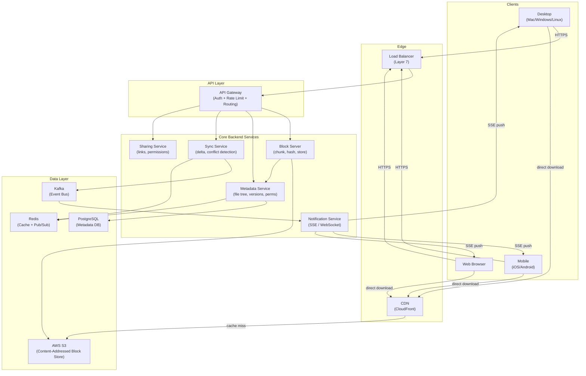

---

## Core Design: The Block Server (Chunking + Hashing + Storing)

### The Analogy

Ek baar samjho: you want to courier a 10,000-page book from Mumbai to Delhi. You can't fit it in one box. So you split it into 100 boxes of 100 pages each. You label each box with a number AND a "fingerprint" (like a bar code unique to those exact 100 pages). If the same 100 pages appear in two different books, they share the same box — you only courier them once.

That fingerprint is a **SHA-256 hash**. The block server is the person who does all this splitting, fingerprinting, and cataloguing.

### Why Chunking Exists

Without chunking:
- A 50 GB upload = one giant HTTP request. If it fails at 49 GB, you restart from zero. Nightmare.
- No parallelism — you're using one connection, one thread, full serialization.
- No deduplication — you can't compare parts of files.
- No delta sync — you must re-upload the whole thing on any change.

With 4 MB chunks:
- 50 GB = 12,500 chunks. Upload in parallel across 10+ connections. Failure retries only the failed chunk.
- Each chunk gets a SHA-256 hash. Same chunk anywhere = same hash = stored only once in S3.
- On file change, only chunks whose hash changed are uploaded (delta sync).

### How the Block Server Works: Step by Step

```
File: vacation_video.mp4 (400 MB)
Chunk size: 4 MB
Total chunks: 100

Step 1: Client calls Block Server: "I want to upload this file"
Step 2: Block Server (or client-side library) splits file → 100 chunks
Step 3: SHA-256 hash computed for each chunk locally on client
Step 4: Client sends list of 100 hashes to Block Server
         → "I have these 100 chunk hashes. Which do you already have?"
Step 5: Block Server checks against Metadata DB
         → "I already have chunks 3, 7, 14, 22, 45, 91... You need to upload 67 chunks"
Step 6: Client uploads only those 67 missing chunks (in parallel to S3)
Step 7: Client sends "upload complete" with ordered list of all 100 hashes
Step 8: Block Server saves the file record + chunk manifest to Metadata DB
```

The key insight: **the S3 key IS the SHA-256 hash**. This is called content-addressed storage. Two identical chunks from two different users, two different files — stored exactly once.

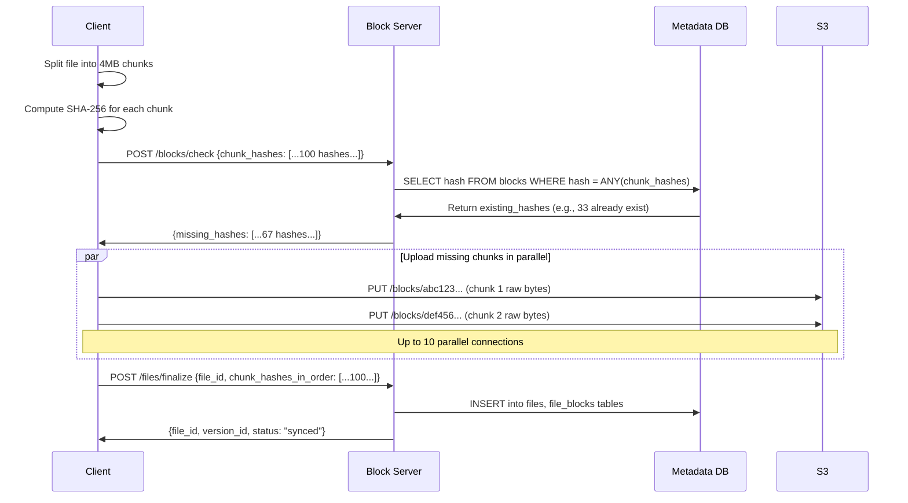

### Client-Side Chunking Code

```python
import hashlib
import os
from dataclasses import dataclass
from typing import List

CHUNK_SIZE = 4 * 1024 * 1024  # 4 MB

@dataclass
class Block:
    index: int
    hash: str       # SHA-256 hex digest
    data: bytes
    size: int

def split_file_into_blocks(file_path: str) -> List[Block]:
    """Split a file into 4MB blocks and compute SHA-256 per block."""
    blocks = []
    index = 0
    with open(file_path, "rb") as f:
        while True:
            data = f.read(CHUNK_SIZE)
            if not data:
                break
            block_hash = hashlib.sha256(data).hexdigest()
            blocks.append(Block(
                index=index,
                hash=block_hash,
                data=data,
                size=len(data)
            ))
            index += 1
    return blocks

def compute_file_fingerprint(blocks: List[Block]) -> str:
    """
    Hash of all block hashes in order = unique fingerprint for the whole file.
    Two files with identical content will have the same fingerprint.
    """
    combined = "".join(b.hash for b in blocks)
    return hashlib.sha256(combined.encode()).hexdigest()
```

### Server-Side Block Storage (Block Server)

```python
import boto3
import hashlib
from database import db

s3_client = boto3.client("s3")
BUCKET_NAME = "my-dropbox-blocks"

def check_existing_blocks(hashes: list[str]) -> set[str]:
    """Return set of hashes we already have stored."""
    result = db.execute(
        "SELECT hash FROM blocks WHERE hash = ANY(%s)",
        [hashes]
    )
    return {row["hash"] for row in result}

def store_block(block_hash: str, block_data: bytes) -> str:
    """
    Store a block in S3. S3 key = SHA-256 hash.
    Idempotent — if it already exists, this is a no-op.
    """
    s3_key = block_hash  # Content-addressed: key IS the hash

    # HEAD request to check existence — very cheap (< 1ms)
    try:
        s3_client.head_object(Bucket=BUCKET_NAME, Key=s3_key)
        return s3_key  # Already exists, deduplication win
    except s3_client.exceptions.ClientError:
        pass

    # Store in S3 with server-side encryption
    s3_client.put_object(
        Bucket=BUCKET_NAME,
        Key=s3_key,
        Body=block_data,
        ServerSideEncryption="AES256"
    )

    # Record in metadata DB (for dedup reference counting)
    db.execute(
        "INSERT INTO blocks (hash, s3_key, size_bytes) VALUES (%s, %s, %s) ON CONFLICT DO NOTHING",
        [block_hash, s3_key, len(block_data)]
    )
    return s3_key

def finalize_file_upload(user_id: str, file_name: str, block_hashes_in_order: list[str]) -> dict:
    """Save the file record + block manifest after all blocks are uploaded."""
    # Insert or update file record
    file_id = db.execute("""
        INSERT INTO files (owner_id, name, updated_at)
        VALUES (%s, %s, now())
        RETURNING id
    """, [user_id, file_name])[0]["id"]

    # Save block manifest (file → ordered list of block hashes)
    for index, block_hash in enumerate(block_hashes_in_order):
        db.execute(
            "INSERT INTO file_blocks (file_id, block_index, block_hash) VALUES (%s, %s, %s)",
            [file_id, index, block_hash]
        )

    # Record version
    version_id = db.execute("""
        INSERT INTO file_versions (file_id, block_hashes, created_by)
        VALUES (%s, %s, %s)
        RETURNING id
    """, [file_id, block_hashes_in_order, user_id])[0]["id"]

    return {"file_id": file_id, "version_id": version_id}
```

---

## The Metadata Database Schema

### The Analogy

Think of the metadata DB as the **library catalog** — not the books themselves, but the index cards that say "Book titled X, by Author Y, is on shelf Z, was last checked out on date D, and Bob and Alice are both allowed to borrow it." The actual books (block bytes) are in the warehouse (S3). The catalog is in PostgreSQL.

### Why These Tables Exist

Every single table solves a specific problem:

- **files** — "what files does this user own?"
- **blocks** — "what blocks are in S3, and how big are they?" (deduplication index)
- **file_blocks** — "what is the ordered sequence of blocks for this file?" (the manifest)
- **file_versions** — "what did this file look like at version N?" (version history)
- **user_file** — "who has access to which file, and what can they do?" (sharing/permissions)

### Full Schema

```sql
-- ============================================================
-- USERS
-- ============================================================
CREATE TABLE users (
    id          UUID PRIMARY KEY DEFAULT gen_random_uuid(),
    email       TEXT UNIQUE NOT NULL,
    display_name TEXT,
    storage_quota_bytes BIGINT DEFAULT 15000000000,  -- 15 GB free tier
    storage_used_bytes  BIGINT DEFAULT 0,
    created_at  TIMESTAMPTZ DEFAULT now()
);

-- ============================================================
-- FILES
-- One row per logical file (not per version).
-- Version history is in file_versions.
-- ============================================================
CREATE TABLE files (
    file_id     UUID PRIMARY KEY DEFAULT gen_random_uuid(),
    name        TEXT NOT NULL,
    size_bytes  BIGINT NOT NULL DEFAULT 0,
    owner_id    UUID REFERENCES users(id) ON DELETE CASCADE,
    parent_folder_id UUID REFERENCES folders(id),  -- NULL = root
    current_version_id UUID,  -- FK to file_versions (set after insert)
    is_deleted  BOOLEAN DEFAULT FALSE,  -- soft delete
    created_at  TIMESTAMPTZ DEFAULT now(),
    updated_at  TIMESTAMPTZ DEFAULT now()
);

-- ============================================================
-- FOLDERS
-- Tree structure via parent_id self-reference.
-- ============================================================
CREATE TABLE folders (
    folder_id   UUID PRIMARY KEY DEFAULT gen_random_uuid(),
    name        TEXT NOT NULL,
    owner_id    UUID REFERENCES users(id),
    parent_folder_id UUID REFERENCES folders(folder_id),  -- NULL = root
    path        TEXT NOT NULL,  -- e.g., /photos/vacation/ (denormalized for fast path lookups)
    is_deleted  BOOLEAN DEFAULT FALSE,
    created_at  TIMESTAMPTZ DEFAULT now()
);

-- ============================================================
-- BLOCKS (Content-Addressed Storage Index)
-- Primary key = SHA-256 hash = S3 key.
-- Two identical blocks from two users → one row here → one S3 object.
-- ============================================================
CREATE TABLE blocks (
    block_hash  TEXT PRIMARY KEY,   -- SHA-256 hex (64 chars)
    s3_key      TEXT NOT NULL,      -- same as block_hash by convention
    size_bytes  INT NOT NULL,
    ref_count   INT DEFAULT 1,      -- how many file_blocks rows reference this
    created_at  TIMESTAMPTZ DEFAULT now()
);

-- ============================================================
-- FILE_BLOCKS (File → Ordered Block Manifest)
-- Maps a specific file version to its blocks in order.
-- To reconstruct file: ORDER BY block_index, download each block, concatenate.
-- ============================================================
CREATE TABLE file_blocks (
    file_id     UUID REFERENCES files(file_id),
    version_id  UUID REFERENCES file_versions(version_id),
    block_index INT NOT NULL,       -- position in file (0-indexed)
    block_hash  TEXT REFERENCES blocks(block_hash),
    PRIMARY KEY (file_id, version_id, block_index)
);

-- ============================================================
-- FILE_VERSIONS
-- Every save/upload creates a new version row.
-- Rollback = point current_version_id to a previous version.
-- ============================================================
CREATE TABLE file_versions (
    version_id  UUID PRIMARY KEY DEFAULT gen_random_uuid(),
    file_id     UUID REFERENCES files(file_id),
    version_num INT NOT NULL,
    size_bytes  BIGINT NOT NULL,
    block_hashes JSONB NOT NULL,    -- ["hash1", "hash2", ...] — ordered manifest
    created_by  UUID REFERENCES users(id),
    created_at  TIMESTAMPTZ DEFAULT now(),
    comment     TEXT                -- optional: "Quarterly report final"
);

-- ============================================================
-- USER_FILE (Sharing / Permissions)
-- Covers both direct share and folder inheritance.
-- ============================================================
CREATE TABLE user_file (
    id          UUID PRIMARY KEY DEFAULT gen_random_uuid(),
    user_id     UUID REFERENCES users(id),
    resource_id UUID NOT NULL,          -- file_id or folder_id
    resource_type TEXT NOT NULL CHECK (resource_type IN ('file', 'folder')),
    permission  TEXT NOT NULL CHECK (permission IN ('viewer', 'commenter', 'editor', 'owner')),
    shared_by   UUID REFERENCES users(id),
    expires_at  TIMESTAMPTZ,            -- NULL = no expiry
    created_at  TIMESTAMPTZ DEFAULT now(),
    UNIQUE (user_id, resource_id)
);

-- ============================================================
-- SHARE_LINKS (Public link sharing)
-- ============================================================
CREATE TABLE share_links (
    link_token  TEXT PRIMARY KEY,       -- random URL-safe token
    resource_id UUID NOT NULL,
    resource_type TEXT NOT NULL,
    permission  TEXT NOT NULL CHECK (permission IN ('viewer', 'editor')),
    password_hash TEXT,                 -- NULL = no password
    expires_at  TIMESTAMPTZ,
    created_by  UUID REFERENCES users(id),
    created_at  TIMESTAMPTZ DEFAULT now()
);

-- ============================================================
-- Indexes for common query patterns
-- ============================================================
CREATE INDEX idx_files_owner_parent ON files(owner_id, parent_folder_id);
CREATE INDEX idx_files_updated ON files(updated_at DESC);
CREATE INDEX idx_file_blocks_version ON file_blocks(version_id);
CREATE INDEX idx_file_versions_file ON file_versions(file_id, version_num DESC);
CREATE INDEX idx_user_file_user ON user_file(user_id);
CREATE INDEX idx_user_file_resource ON user_file(resource_id);
```

### How the Tables Relate

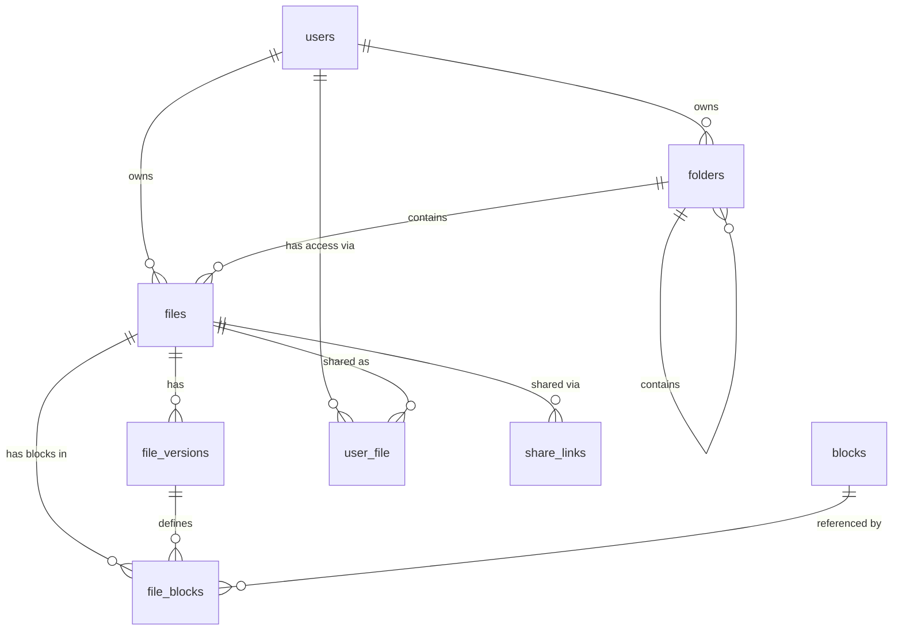

---

## Delta Sync: The Secret Sauce

### The Analogy

Imagine you wrote a 500-page novel. You show it to your editor, who changes three sentences on page 247. Would the editor send you back 500 pages? No — she'd send a sticky note saying "On page 247, line 12, change X to Y." That sticky note is delta sync.

Yeh kyun important hai? Because on a typical day, a 200 MB Photoshop file might get a small brush stroke change. Without delta sync, 200 MB uploads. With delta sync, maybe 4 MB uploads (just the changed chunk).

### How Delta Sync Works

```
State Before Edit:
  design.psd (200 MB = 50 blocks of 4 MB each)
  Block hashes: [h0, h1, h2, ..., h24, h25, ..., h49]
                                   ^
                            User edits here (block 25)

State After Edit:
  design.psd (200 MB, same size)
  Block hashes: [h0, h1, h2, ..., h24, h25_NEW, ..., h49]
                                         ^
                                   Only this hash changed

Delta: Upload only block 25_NEW (4 MB instead of 200 MB)
Savings: 98% bandwidth saved!
```

### Delta Sync Flow

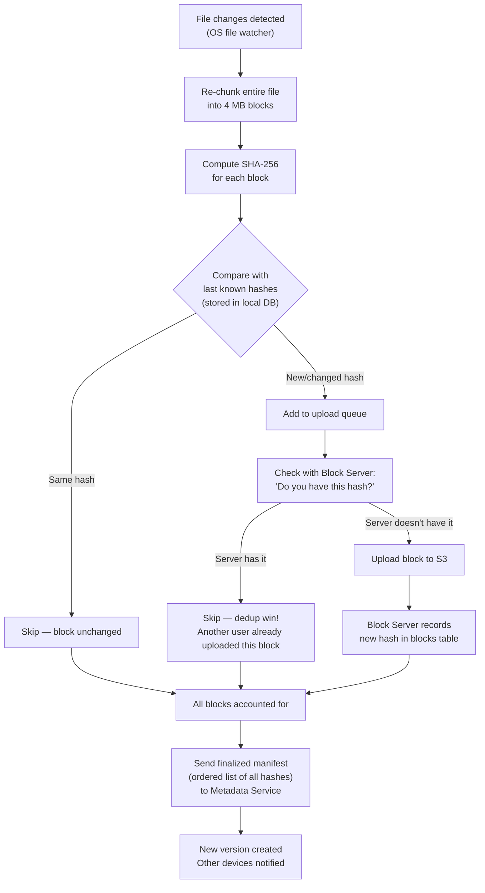

### Local State Tracking (Client SQLite DB)

The client maintains a local SQLite database — basically a mini-metadata DB on your device. This is how it knows which blocks were "last uploaded" and can compute the delta.

```sql
-- Client-side local database (SQLite on device)
CREATE TABLE local_files (
    file_path       TEXT PRIMARY KEY,
    file_id         TEXT,            -- server-side file_id
    last_version_id TEXT,
    last_sync_at    DATETIME,
    block_hashes    TEXT             -- JSON array of hashes from last sync
);

CREATE TABLE upload_queue (
    id              INTEGER PRIMARY KEY AUTOINCREMENT,
    file_path       TEXT NOT NULL,
    action          TEXT NOT NULL,  -- 'upload', 'delete', 'rename', 'move'
    status          TEXT DEFAULT 'pending',
    retry_count     INT DEFAULT 0,
    created_at      DATETIME DEFAULT CURRENT_TIMESTAMP
);
```

---

## The Sync Service: Keeping All Devices in Sync

### The Analogy

Think of the sync service like a WhatsApp group for your devices. When you send a message (upload a file change) on your phone, all other devices in the group (laptop, tablet) immediately see "new message" and update themselves. The sync service is the WhatsApp server coordinating all of this.

### Sync Flow: Device A Edits, Device B Receives

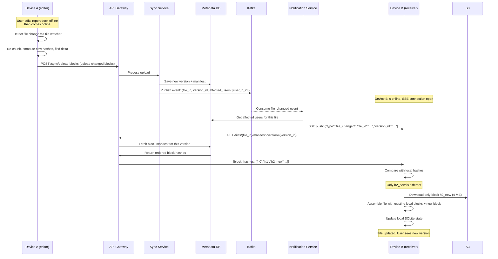

### File Watcher (Platform-Specific APIs)

The client app must detect file changes in real-time. Every OS provides a native API for this:

| Platform | Native API | What It Does |
|---|---|---|
| Linux | `inotify` | Kernel-level file system events |
| macOS | `FSEvents` | Apple's high-level file system events API |
| Windows | `ReadDirectoryChangesW` | Win32 API for directory change notifications |
| Cross-platform | `watchdog` (Python), `chokidar` (Node.js) | Wraps native APIs |

```python
from watchdog.observers import Observer
from watchdog.events import FileSystemEventHandler
import sqlite3
import time

DROPBOX_FOLDER = "/Users/alice/Dropbox"

class DropboxWatcher(FileSystemEventHandler):
    def __init__(self, db_path: str):
        self.db = sqlite3.connect(db_path)

    def on_modified(self, event):
        if not event.is_directory:
            self._enqueue(event.src_path, "upload")

    def on_created(self, event):
        if not event.is_directory:
            self._enqueue(event.src_path, "upload")

    def on_deleted(self, event):
        self._enqueue(event.src_path, "delete")

    def on_moved(self, event):
        self._enqueue_move(event.src_path, event.dest_path)

    def _enqueue(self, path: str, action: str):
        self.db.execute(
            "INSERT OR REPLACE INTO upload_queue (file_path, action) VALUES (?, ?)",
            [path, action]
        )
        self.db.commit()

    def _enqueue_move(self, src: str, dest: str):
        self.db.execute(
            "INSERT INTO upload_queue (file_path, action) VALUES (?, 'move')",
            [f"{src}→{dest}"]
        )
        self.db.commit()

def start_watcher():
    handler = DropboxWatcher("~/.dropbox/local.db")
    observer = Observer()
    observer.schedule(handler, path=DROPBOX_FOLDER, recursive=True)
    observer.start()
    try:
        while True:
            time.sleep(1)
    except KeyboardInterrupt:
        observer.stop()
    observer.join()
```

---

## Conflict Resolution: The Hardest Problem

### The Analogy

Two cooks (Alice and Bob) are writing in the same recipe book. Alice is in Mumbai with no internet, and she changes the amount of sugar from "1 cup" to "half cup". Bob is in Delhi, also offline, and he changes "1 cup" to "2 cups". When they both come online — what should the recipe say?

This is the core conflict problem. Yeh bahut tricky hai. There is no universally correct answer, so different systems make different trade-offs.

### Strategy 1: Last-Writer-Wins (LWW)

The version with the latest timestamp wins. Simple. Brutal. Data-lossy.

```
Alice uploads at 10:00:01 → version 2
Bob uploads at  10:00:03 → version 3 (overwrites Alice's changes silently)
Alice's changes: LOST. She never knows.
```

**Used by:** Many simple sync tools, early Dropbox for some edge cases.

**Trade-off:** Simple to implement, but users can lose work. Unacceptable for documents.

### Strategy 2: Conflict Copy (Dropbox Strategy)

Both versions are preserved. The system renames one as a "conflict copy" and lets the user decide.

```
Alice's version:  report.docx                  (version 3 — uploaded first)
Bob's version:    report (Conflict from Bob's MacBook 2025-06-26).docx
```

Bob sees both files in his Dropbox. He opens both, manually merges them, and deletes the conflict copy.

**Trade-off:** Never loses data. UX is a bit annoying (user has to resolve manually). This is the right default for binary files (PDFs, images, videos).

```python
def handle_upload_conflict(
    file_id: str,
    incoming_version: dict,
    current_version: dict,
    device_name: str,
    db
) -> dict:
    """
    Called when a device tries to upload based on a stale base version.
    incoming_version: the new version from the uploading device
    current_version: what's currently on the server
    """
    from datetime import date

    # If the base version matches — clean, no conflict
    if incoming_version["base_version_id"] == current_version["version_id"]:
        return save_as_new_version(file_id, incoming_version, db)

    # Conflict detected: create a conflict copy
    original_name = current_version["name"]  # e.g., "report.docx"
    name_parts = original_name.rsplit(".", 1)  # ["report", "docx"]
    conflict_name = (
        f"{name_parts[0]} (Conflict from {device_name} {date.today()})"
        f".{name_parts[1] if len(name_parts) > 1 else ''}"
    )

    # Save the conflicting version under a new file name
    conflict_file_id = create_new_file(
        name=conflict_name,
        owner_id=incoming_version["user_id"],
        parent_folder_id=current_version["parent_folder_id"],
        block_hashes=incoming_version["block_hashes"],
        db=db
    )

    return {
        "status": "conflict",
        "original_file_id": file_id,
        "conflict_file_id": conflict_file_id,
        "message": f"Your changes were saved as '{conflict_name}'"
    }
```

### Strategy 3: Operational Transformation (OT) — Google Docs Style

This is what Google Docs uses for real-time text collaboration. Every edit is represented as an **operation** (insert, delete, replace at position N). When two operations conflict, the system transforms one operation to account for the other.

```
Alice's operation: Insert "Hello " at position 0
Bob's operation:   Insert "World " at position 0

After Alice's operation is applied, Bob's position 0 is now shifted.
OT transforms Bob's operation: Insert "World " at position 6 (after "Hello ")
Result: "Hello World ..."
```

**Trade-off:** Extremely complex to implement correctly. Requires all edits to go through a central server for ordering. Only practical for structured documents (text, spreadsheets). Not useful for binary files (videos, PDFs, images).

**Used by:** Google Docs, Notion, Figma (for collaborative design).

### Strategy Comparison

| Strategy | Data Safety | UX | Complexity | Best For |
|---|---|---|---|---|
| Last-Writer-Wins | Bad (loses data) | Clean (no noise) | Very Low | Logs, analytics data |
| Conflict Copies (Dropbox) | Excellent | Slightly noisy | Medium | All file types (safe default) |
| Operational Transform (OT) | Excellent | Seamless | Very High | Text documents only |
| CRDTs | Excellent | Seamless | High | Offline-first text/structured data |

**Interview tip:** Unless asked for Google Docs real-time editing, go with "conflict copy" strategy. It's safe, user-understandable, and implementable in an interview timeframe.

### Conflict Detection: Vector Clocks

How does the server even know a conflict occurred? It uses version tracking.

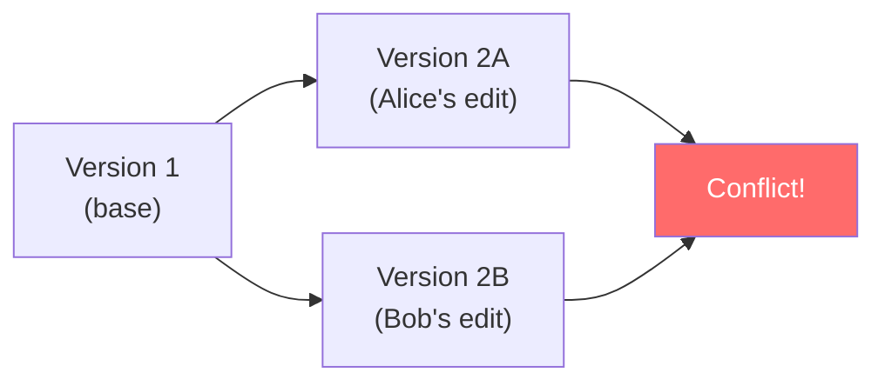

When Bob uploads "Version 2B based on Version 1", but the server already has "Version 2A based on Version 1", both share the same parent → conflict detected.

---

## Large File Support: Multipart Upload

### The Analogy

Think of sending a 50 GB hard drive's worth of data across the internet. You can't stuff it into one envelope. Instead, you use a courier service that lets you send 10,000 smaller packages. If package 5,423 gets lost, you only resend package 5,423 — not all 10,000. And you can send multiple packages simultaneously through different courier vans.

AWS S3 has built-in support for this: **S3 Multipart Upload**.

### Why Multipart Upload is Necessary

- HTTP requests have practical size limits (~5 GB max for S3 PutObject)
- Network drops on a 50 GB upload without resumability = start from zero
- Single-threaded upload doesn't use available bandwidth fully
- Need progress reporting to the user ("47% uploaded")

### S3 Multipart Upload Protocol

```
Step 1: Initiate multipart upload
   → S3 returns: UploadId = "abc123xyz"

Step 2: Upload parts (each part = one block = 4 MB minimum for S3)
   For each block (in parallel):
   → PUT /bucket/key?partNumber=N&uploadId=abc123xyz
   → S3 returns: ETag for this part (= hash of part content)

Step 3: Complete multipart upload
   → Send list of (partNumber, ETag) pairs
   → S3 assembles and creates the final object

If you stop at Step 2 (network failure):
→ Resume by re-uploading only the parts that didn't complete
→ Already-uploaded parts remain (S3 keeps incomplete multipart uploads for 7 days by default)
```

```python
import boto3
from concurrent.futures import ThreadPoolExecutor, as_completed
from typing import List, Tuple

s3 = boto3.client("s3")
BUCKET = "my-dropbox-blocks"

def multipart_upload_file(file_path: str, s3_key: str, progress_callback=None) -> str:
    """
    Upload a large file to S3 using multipart upload.
    Returns the S3 ETag of the final object.
    """
    PART_SIZE = 4 * 1024 * 1024  # 4 MB per part (matches our block size)
    MAX_WORKERS = 10              # 10 parallel upload threads

    # Step 1: Initiate
    response = s3.create_multipart_upload(
        Bucket=BUCKET,
        Key=s3_key,
        ServerSideEncryption="AES256"
    )
    upload_id = response["UploadId"]

    parts: List[Tuple[int, str]] = []  # (part_number, etag) pairs

    try:
        # Step 2: Upload parts in parallel
        def upload_part(part_number: int, data: bytes) -> Tuple[int, str]:
            resp = s3.upload_part(
                Bucket=BUCKET,
                Key=s3_key,
                UploadId=upload_id,
                PartNumber=part_number,
                Body=data
            )
            return (part_number, resp["ETag"])

        with open(file_path, "rb") as f:
            part_number = 1
            upload_tasks = []
            executor = ThreadPoolExecutor(max_workers=MAX_WORKERS)

            while True:
                data = f.read(PART_SIZE)
                if not data:
                    break
                future = executor.submit(upload_part, part_number, data)
                upload_tasks.append(future)
                part_number += 1

            total_parts = len(upload_tasks)
            completed = 0
            for future in as_completed(upload_tasks):
                part_num, etag = future.result()
                parts.append((part_num, etag))
                completed += 1
                if progress_callback:
                    progress_callback(completed / total_parts)

        executor.shutdown(wait=True)

        # Sort by part number (as_completed doesn't guarantee order)
        parts.sort(key=lambda x: x[0])

        # Step 3: Complete
        s3.complete_multipart_upload(
            Bucket=BUCKET,
            Key=s3_key,
            UploadId=upload_id,
            MultipartUpload={
                "Parts": [{"PartNumber": pn, "ETag": etag} for pn, etag in parts]
            }
        )
        return s3_key

    except Exception as e:
        # Abort the multipart upload to avoid S3 storage charges for incomplete uploads
        s3.abort_multipart_upload(Bucket=BUCKET, Key=s3_key, UploadId=upload_id)
        raise e
```

### Resumable Upload State Machine

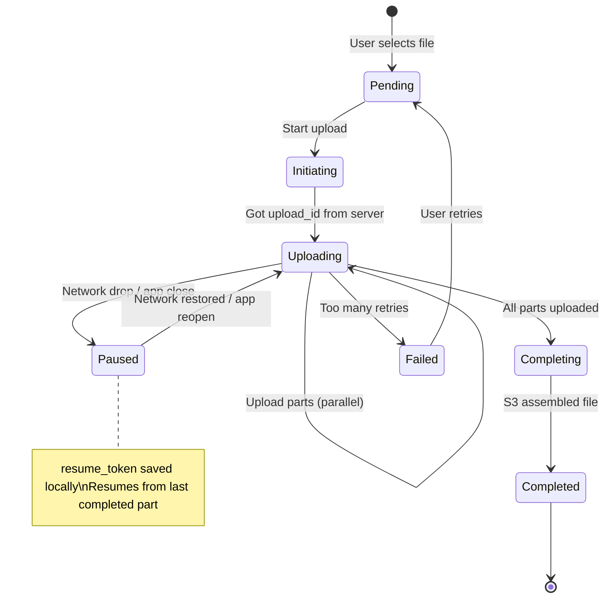

---

## Version History: Time Travel for Your Files

### The Analogy

Imagine every time you took a step, the universe made a perfect copy of its current state. If you made a mistake, you could just say "take me back to state N-3" and you'd be there. Dropbox's version history is exactly this for your files — every save creates a snapshot. The magic part: it's almost free in storage because **unchanged blocks are shared across versions**.

### How Versioning Costs Almost Nothing

```
File: essay.docx
Version 1: blocks = [A, B, C, D, E]          (5 blocks = 20 MB)
Version 2: blocks = [A, B, C', D, E]         (only C changed → 4 MB new storage)
Version 3: blocks = [A, B, C', D', E]        (only D changed → 4 MB new storage)
Version 4: blocks = [A', B, C', D', E]       (only A changed → 4 MB new storage)

Total storage for 4 versions: 20 MB + 4 + 4 + 4 = 32 MB
Without versioning you'd store: 20 MB × 4 = 80 MB
Savings: 60%!
```

### Version Rollback

Rollback = create a new version with an old version's block manifest. Crucially: **we never delete old blocks** until no version references them.

```python
def rollback_to_version(file_id: str, target_version_id: str, user_id: str, db) -> dict:
    """
    Roll back a file to a specific older version.
    This creates a NEW version (we never mutate history).
    """
    # Verify version belongs to this file
    target = db.query_one("""
        SELECT version_id, version_num, block_hashes, size_bytes
        FROM file_versions
        WHERE version_id = %s AND file_id = %s
    """, [target_version_id, file_id])

    if not target:
        raise ValueError("Version not found or doesn't belong to this file")

    # Get current max version number
    max_version = db.query_one(
        "SELECT MAX(version_num) as max_v FROM file_versions WHERE file_id = %s",
        [file_id]
    )["max_v"]

    # Create a NEW version that's identical to the old one
    # (Never delete history — rollback is just a new version pointing to old blocks)
    new_version_id = db.insert("""
        INSERT INTO file_versions (file_id, version_num, block_hashes, size_bytes, created_by)
        VALUES (%s, %s, %s, %s, %s)
        RETURNING version_id
    """, [file_id, max_version + 1, target["block_hashes"], target["size_bytes"], user_id])

    # Update file's current version pointer
    db.update("""
        UPDATE files
        SET current_version_id = %s, updated_at = now()
        WHERE file_id = %s
    """, [new_version_id, file_id])

    return {
        "new_version_id": new_version_id,
        "new_version_num": max_version + 1,
        "rolled_back_to_version": target["version_num"]
    }
```

### Block Garbage Collection

Blocks are never deleted eagerly. A background job (GC) runs periodically:

```python
import psycopg2
from datetime import datetime, timedelta

def garbage_collect_blocks(db, retention_days: int = 30):
    """
    Delete blocks that are no longer referenced by any version
    within the retention window.
    """
    cutoff_date = datetime.now() - timedelta(days=retention_days)

    # Find block hashes no longer referenced by any active version
    orphaned_blocks = db.query("""
        SELECT b.block_hash, b.s3_key
        FROM blocks b
        WHERE NOT EXISTS (
            SELECT 1 FROM file_blocks fb
            JOIN file_versions fv ON fb.version_id = fv.version_id
            WHERE fb.block_hash = b.block_hash
            AND fv.created_at > %s
        )
        AND b.created_at < %s  -- Only GC blocks older than retention period
    """, [cutoff_date, cutoff_date])

    deleted_count = 0
    for block in orphaned_blocks:
        # Delete from S3
        s3.delete_object(Bucket=BUCKET, Key=block["s3_key"])
        # Delete from DB
        db.execute("DELETE FROM blocks WHERE block_hash = %s", [block["block_hash"]])
        deleted_count += 1

    return deleted_count

# Version retention policy by plan tier
RETENTION_POLICY = {
    "free":     30,    # 30 days
    "plus":     180,   # 6 months
    "business": 365,   # 1 year
    "enterprise": 3650 # 10 years (Extended Version History)
}
```

---

## Sharing and Permissions

### The Analogy

Think of file sharing like a key system in an apartment building. You can give someone a key to your apartment (direct file share). You can give them a key to the whole floor (folder share — they inherit access to all apartments on that floor). You can also put a lockbox outside your door with a combination code — anyone who knows the code can get in (public link sharing).

### Permission Levels

| Role | Read | Comment | Edit | Delete | Share |
|---|---|---|---|---|---|
| viewer | YES | NO | NO | NO | NO |
| commenter | YES | YES | NO | NO | NO |
| editor | YES | YES | YES | NO | NO |
| owner | YES | YES | YES | YES | YES |

### Two Types of Sharing

**Direct Share (User-to-User):**
- Alice shares `report.docx` with Bob as "editor"
- Row inserted into `user_file`: `{user_id: bob, resource_id: report.docx, permission: editor}`
- Bob sees it in his "Shared with me" view
- Bob's changes propagate back to Alice's copy

**Link Sharing (Public URL):**
- Alice generates a public link for `presentation.pdf`
- Token stored in `share_links` table
- Anyone with the link can access (viewer by default)
- Can be password-protected, time-limited, or revoked

```python
import secrets
from datetime import datetime, timedelta

def create_share_link(
    resource_id: str,
    resource_type: str,
    permission: str,
    expires_in_days: int = None,
    password: str = None,
    db = None
) -> str:
    """Generate a shareable link token."""
    import hashlib

    # Generate a cryptographically secure random token
    token = secrets.token_urlsafe(32)  # e.g., "xK3mP9qL2nR8vT5yW0aZ1bC4dE6fG7hI"

    # Hash the password if provided (never store plaintext)
    password_hash = None
    if password:
        password_hash = hashlib.sha256(password.encode()).hexdigest()

    expires_at = None
    if expires_in_days:
        expires_at = datetime.now() + timedelta(days=expires_in_days)

    db.execute("""
        INSERT INTO share_links (link_token, resource_id, resource_type, permission,
                                 password_hash, expires_at, created_by)
        VALUES (%s, %s, %s, %s, %s, %s, current_user_id())
    """, [token, resource_id, resource_type, permission, password_hash, expires_at])

    return f"https://dropbox.com/sh/{token}"

def resolve_share_link(token: str, provided_password: str = None, db = None) -> dict:
    """Validate a share link and return the resource details."""
    import hashlib
    from datetime import datetime

    link = db.query_one(
        "SELECT * FROM share_links WHERE link_token = %s",
        [token]
    )

    if not link:
        raise PermissionError("Invalid link")

    if link["expires_at"] and link["expires_at"] < datetime.now():
        raise PermissionError("Link has expired")

    if link["password_hash"]:
        if not provided_password:
            raise PermissionError("Password required")
        if hashlib.sha256(provided_password.encode()).hexdigest() != link["password_hash"]:
            raise PermissionError("Incorrect password")

    return {
        "resource_id": link["resource_id"],
        "resource_type": link["resource_type"],
        "permission": link["permission"]
    }
```

### Permission Inheritance (Folder Permissions)

Folders can be shared, and all children inherit the permission — unless explicitly overridden at the child level.

```python
def check_user_permission(user_id: str, resource_id: str, action: str, db) -> bool:
    """
    Check if user_id has permission to perform action on resource_id.
    Walks up the folder tree if no direct permission found.
    action: 'read', 'write', 'delete', 'share'
    """
    ROLE_CAPABILITIES = {
        "viewer":    {"read"},
        "commenter": {"read", "comment"},
        "editor":    {"read", "comment", "write"},
        "owner":     {"read", "comment", "write", "delete", "share"},
    }

    # Check direct permission (most specific wins)
    perm_row = db.query_one("""
        SELECT permission FROM user_file
        WHERE user_id = %s AND resource_id = %s
        AND (expires_at IS NULL OR expires_at > now())
    """, [user_id, resource_id])

    if perm_row:
        return action in ROLE_CAPABILITIES.get(perm_row["permission"], set())

    # Walk up folder tree (recursive, max depth ~20)
    parent = db.query_one("""
        SELECT parent_folder_id FROM files WHERE file_id = %s
        UNION ALL
        SELECT parent_folder_id FROM folders WHERE folder_id = %s
    """, [resource_id, resource_id])

    if parent and parent["parent_folder_id"]:
        return check_user_permission(user_id, parent["parent_folder_id"], action, db)

    return False  # No permission found at any level
```

---

## Notification Service: Telling Devices About Changes

### The Analogy

The notification service is like a WhatsApp group where your devices are the members. When your laptop uploads a new file version, the notification service sends a message to all your other devices: "Hey! `project.docx` just changed — go download the new version." The devices don't constantly ask the server "anything new?" — the server proactively tells them.

### SSE vs WebSocket vs Long Polling

| Feature | Long Polling | SSE (Server-Sent Events) | WebSocket |
|---|---|---|---|
| Direction | Client polls server | Server pushes to client | Bidirectional |
| Protocol | HTTP | HTTP/1.1 or HTTP/2 | WS (HTTP upgrade) |
| Browser support | Universal | Universal (IE not included) | Universal |
| Auto reconnect | Manual | Built-in | Manual |
| Firewall friendly | YES | YES | Sometimes blocked (port 80/443 OK) |
| Load balancer sticky | Not needed | Needed (or pub/sub) | Needed (or pub/sub) |
| Overhead | High (repeat requests) | Low | Very Low |
| Best for | Simple notifications | File sync notifications | Chat, live cursors |

**Dropbox-style sync = SSE.** The server just needs to push "file X changed" events. No client-to-server messages needed for the notification channel.

### SSE Implementation

```python
from flask import Flask, Response, stream_with_context, request
import redis
import json
import time

app = Flask(__name__)
redis_client = redis.Redis(host="redis-cluster", port=6379, decode_responses=True)

@app.route("/api/v1/events")
def sse_stream():
    """
    Long-lived SSE connection for a user.
    Client connects once and keeps receiving events.
    """
    user_id = get_authenticated_user_id(request)  # from JWT token

    def generate():
        pubsub = redis_client.pubsub()
        channel = f"user:{user_id}:events"
        pubsub.subscribe(channel)

        # Send a heartbeat every 30 seconds to keep connection alive
        # (proxies/load balancers close idle connections)
        last_heartbeat = time.time()

        try:
            for message in pubsub.listen():
                if message["type"] == "message":
                    event_data = json.loads(message["data"])
                    # SSE format: "data: <json>\n\n"
                    yield f"data: {json.dumps(event_data)}\n\n"

                # Heartbeat
                if time.time() - last_heartbeat > 30:
                    yield f"data: {{\"type\":\"heartbeat\"}}\n\n"
                    last_heartbeat = time.time()

        except GeneratorExit:
            pubsub.unsubscribe(channel)

    return Response(
        stream_with_context(generate()),
        mimetype="text/event-stream",
        headers={
            "Cache-Control": "no-cache",
            "X-Accel-Buffering": "no",  # Disable Nginx response buffering
            "Connection": "keep-alive"
        }
    )

def notify_user(user_id: str, event: dict):
    """
    Publish an event to a user's SSE channel.
    All devices connected for this user will receive it.
    """
    redis_client.publish(
        f"user:{user_id}:events",
        json.dumps(event)
    )

def notify_file_changed(file_id: str, version_id: str, owner_id: str, db):
    """
    After a file is updated, notify all users with access.
    """
    # Get all users who have access to this file
    access_list = db.query("""
        SELECT DISTINCT user_id FROM user_file
        WHERE resource_id = %s
        UNION
        SELECT owner_id FROM files WHERE file_id = %s
    """, [file_id, file_id])

    event = {
        "type": "file_changed",
        "file_id": file_id,
        "version_id": version_id,
        "changed_by": owner_id,
        "timestamp": time.time()
    }

    for row in access_list:
        notify_user(row["user_id"], event)
```

### Kafka for Fan-Out at Scale

At 200M DAU, a single file change might need to notify thousands of users (shared corporate folder). Redis pub/sub alone can't handle this at scale. Use Kafka as the event bus:

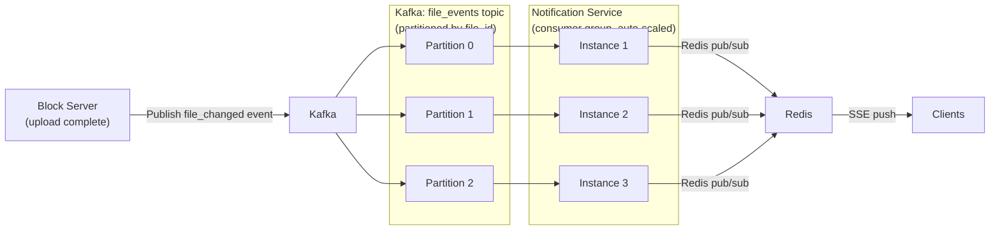

---

## Offline Support: Working Without Internet

### The Analogy

Offline support is like carrying a photocopy of your important documents when travelling. You can read, write, and annotate the photocopies on the train (no internet). When you reach the office, you compare photocopies with the originals and update accordingly.

### Offline State Machine

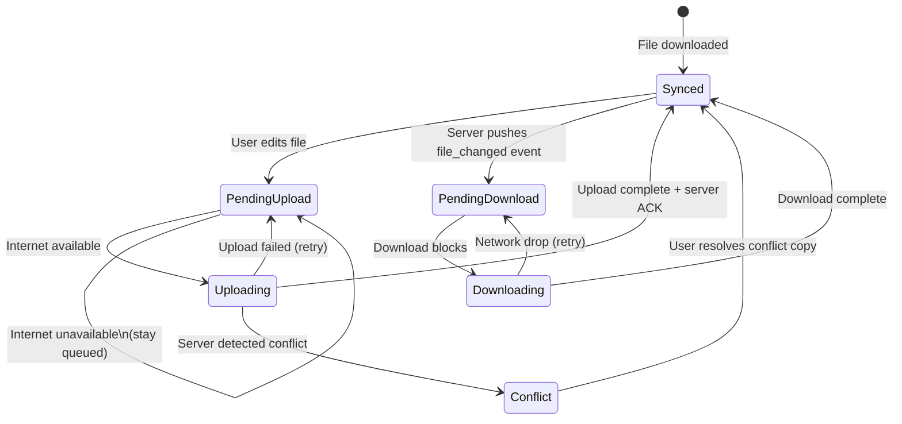

### Sync Worker (Client Background Thread)

```python
import sqlite3
import time
import threading
import urllib.request

DB_PATH = "~/.dropbox/local.db"
RETRY_DELAYS = [5, 15, 60, 300, 900]  # exponential-ish backoff in seconds

def is_online() -> bool:
    """Quick check: can we reach Dropbox servers?"""
    try:
        urllib.request.urlopen("https://api.dropbox.com/ping", timeout=3)
        return True
    except Exception:
        return False

def sync_worker():
    """
    Background daemon thread: drains the upload_queue when online.
    Runs continuously. Exponential backoff on failures.
    """
    conn = sqlite3.connect(DB_PATH)
    conn.row_factory = sqlite3.Row

    while True:
        if not is_online():
            time.sleep(5)
            continue

        tasks = conn.execute("""
            SELECT * FROM upload_queue
            WHERE status = 'pending'
              AND retry_count < 6
              AND (last_tried IS NULL OR
                   datetime(last_tried, '+' || (retry_count * 30) || ' seconds') < datetime('now'))
            ORDER BY created_at ASC
            LIMIT 5
        """).fetchall()

        if not tasks:
            time.sleep(2)
            continue

        for task in tasks:
            task_id = task["id"]
            conn.execute(
                "UPDATE upload_queue SET status = 'in_progress' WHERE id = ?", [task_id]
            )
            conn.commit()

            try:
                execute_sync_task(dict(task))
                conn.execute(
                    "UPDATE upload_queue SET status = 'done' WHERE id = ?", [task_id]
                )
            except ConflictError as e:
                # Create a conflict copy — never fail silently
                handle_conflict(dict(task), e)
                conn.execute(
                    "UPDATE upload_queue SET status = 'done' WHERE id = ?", [task_id]
                )
            except Exception as e:
                conn.execute("""
                    UPDATE upload_queue
                    SET status = 'pending',
                        retry_count = retry_count + 1,
                        last_tried = datetime('now')
                    WHERE id = ?
                """, [task_id])

            conn.commit()

        time.sleep(1)

# Run as daemon
thread = threading.Thread(target=sync_worker, daemon=True)
thread.start()
```

---

## Full System Architecture Diagram

Now let's put it all together. This is the complete picture.

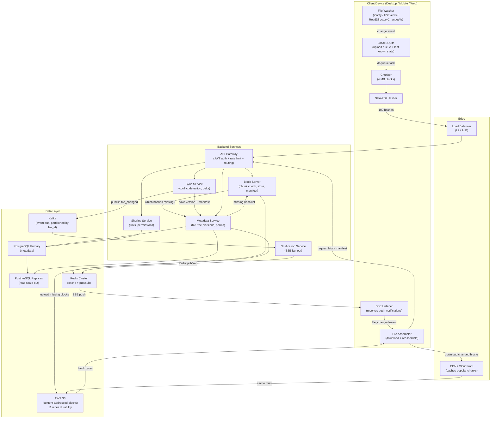

---

## Download Flow: Getting a File

Download is basically the upload in reverse, with CDN in the middle.

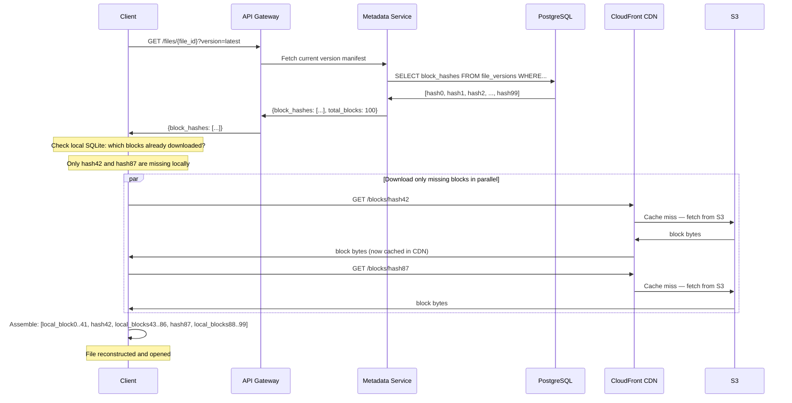

---

## Security Model

### The Analogy

Security is like a multi-lock bank vault. The front door (TLS) encrypts everything in transit. Inside, every room (S3 bucket) has its own lock (AES-256). The vault also keeps a perfect log of everyone who entered and what they touched (audit log). And your vault keys can only open specific rooms for a limited time (pre-signed URLs with expiry).

| Security Layer | Mechanism | Detail |
|---|---|---|
| Transport | TLS 1.3 | All API calls, upload/download |
| Auth | JWT tokens + OAuth 2.0 | Short-lived (15 min) + refresh tokens |
| Authorization | RBAC (viewer/editor/owner) | Checked server-side on every request |
| Storage at rest | AES-256 SSE | S3 server-side encryption |
| Client-side encryption | Optional (zero-knowledge) | User holds the key — like Tresorit |
| Download URLs | Pre-signed S3 URLs | Expire in 15-60 minutes |
| Block access | Indirect via API only | Clients never get raw S3 credentials |
| Audit log | Append-only event log | Every access, share, delete recorded |
| Password sharing | Bcrypt-hashed password | Share links with password protection |
| Virus scanning | ClamAV or cloud scanner | Scan on upload before making available |

### Pre-Signed URLs (Never Expose S3 Credentials)

```python
import boto3
from datetime import timedelta

s3 = boto3.client("s3")

def generate_download_url(block_hash: str, expires_in_seconds: int = 900) -> str:
    """
    Generate a pre-signed URL for direct S3 download.
    Client downloads directly from S3 (no API server in the path).
    URL expires in 15 minutes — even if stolen, it's useless after expiry.
    """
    return s3.generate_presigned_url(
        "get_object",
        Params={
            "Bucket": "my-dropbox-blocks",
            "Key": block_hash
        },
        ExpiresIn=expires_in_seconds
    )

def generate_upload_url(block_hash: str, expires_in_seconds: int = 300) -> str:
    """
    Generate a pre-signed URL for direct S3 upload.
    Client uploads directly to S3 — no API server bottleneck.
    """
    return s3.generate_presigned_url(
        "put_object",
        Params={
            "Bucket": "my-dropbox-blocks",
            "Key": block_hash,
            "ServerSideEncryption": "AES256"
        },
        ExpiresIn=expires_in_seconds
    )
```

---

## Scalability Deep Dive

### Where Are the Bottlenecks?

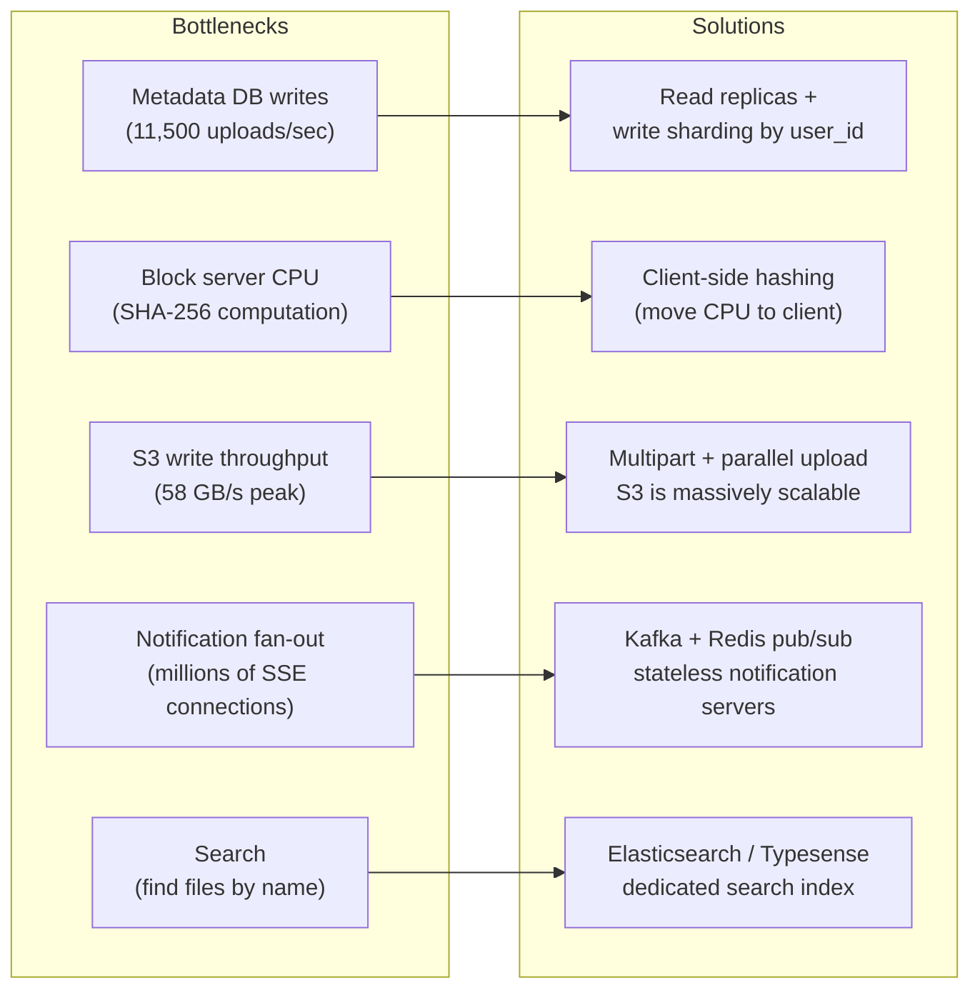

### Database Sharding Strategy

For the metadata DB at 500M users:

```
Shard key: user_id (consistent hashing)
Number of shards: 256 (start with 64, expand)

Why user_id?
- A user's file operations are local to one shard
- No cross-shard queries for most operations
- Easy to route: shard = hash(user_id) % num_shards

Cross-shard scenarios (requires careful handling):
- Shared files (Bob's file in Alice's view)
- Folder with shared access across teams
Solution: Duplicate shared file metadata to the sharer's shard
```

### Caching Strategy (Redis)

```
Cache layer: Redis Cluster

What to cache:
1. File metadata (name, size, owner) — TTL: 5 minutes
2. Block existence check (hash → exists bool) — TTL: 24 hours
3. User permissions (user_id, resource_id → role) — TTL: 10 minutes
4. Active share links (token → resource_id) — TTL: 1 hour
5. User quota (user_id → bytes_used) — Increment in Redis, sync to PG every 60s

Cache invalidation:
- File updated: delete cache key file:{file_id}
- Permission changed: delete cache key perm:{user_id}:{resource_id}
- Use write-through for quota (update Redis AND PG atomically)
```

### CDN Strategy

```
Popular blocks (photos, documents) cached in CloudFront edge nodes.
- Cache key: block_hash (globally unique, content-addressed)
- TTL: Indefinite (blocks are immutable — same hash = same bytes forever)
- Cache hit ratio: ~60-70% (most reads are of recent, popular content)
- Origin shield: Single CloudFront origin shield hits S3 once per block per region
```

---

## Chunk Size Trade-offs

| Chunk Size | Parallelism | Dedup Granularity | Retry Cost | API Overhead | Best For |
|---|---|---|---|---|---|
| 1 MB | Very high | Very fine | Low | High (many requests) | Text/code files |
| 4 MB | High | Fine | Low-Medium | Medium | General purpose (Dropbox default) |
| 8 MB | Medium | Medium | Medium | Low | Mixed workloads |
| 20 MB | Low | Coarse | High | Very Low | Large video uploads |
| S3 minimum | — | — | — | — | 5 MB minimum for multipart |

**Dropbox uses 4 MB** as the default chunk size. It's the sweet spot.

---

## API Design (Key Endpoints)

### Upload API

```
POST /api/v2/blocks/check
Body: { "hashes": ["sha256_1", "sha256_2", ...] }
Response: { "missing": ["sha256_2", ...] }

PUT /api/v2/blocks/{hash}
Body: [raw binary block bytes]
Response: { "stored": true }

POST /api/v2/files
Body: { "name": "report.docx", "parent_folder_id": "...", "block_hashes": [...] }
Response: { "file_id": "...", "version_id": "...", "version_num": 1 }

PATCH /api/v2/files/{file_id}
Body: { "block_hashes": [...], "base_version_id": "..." }
Response: { "version_id": "...", "version_num": 2 } OR { "conflict": true, ... }
```

### Download API

```
GET /api/v2/files/{file_id}
Response: { "file_id": "...", "name": "...", "current_version": { "block_hashes": [...] } }

GET /api/v2/files/{file_id}/versions
Response: [{ "version_id": "...", "version_num": 2, "created_at": "..." }, ...]

POST /api/v2/files/{file_id}/rollback
Body: { "target_version_id": "..." }
Response: { "new_version_id": "...", "new_version_num": 3 }
```

### Sharing API

```
POST /api/v2/files/{file_id}/share
Body: { "user_email": "bob@gmail.com", "permission": "editor" }
Response: { "share_id": "..." }

POST /api/v2/files/{file_id}/links
Body: { "permission": "viewer", "expires_in_days": 7, "password": "secret" }
Response: { "url": "https://dropbox.com/sh/xK3mP9qL...", "expires_at": "..." }

GET /api/v2/shared-with-me
Response: [{ "file_id": "...", "name": "...", "shared_by": "alice@gmail.com", "permission": "editor" }, ...]
```

---

## Comparison with Similar Systems

| Feature | Dropbox | Google Drive | iCloud Drive | OneDrive |
|---|---|---|---|---|
| Sync approach | Block-level delta | File-level (mostly) | File-level | Block-level |
| Max file size | 50 GB (Business) | 5 TB (Workspace) | 50 GB | 250 GB |
| Conflict resolution | Conflict copies | Last-write-wins (mostly) | Conflict copies | Conflict copies |
| Offline support | YES (selective sync) | YES | YES | YES |
| Version history | 30 days (free), 180 days (Plus) | 30 days (personal) | 30 days | 30 days |
| Collaboration | Limited (no real-time) | Full (Docs/Sheets) | Limited | Full (Office) |
| Deduplication | YES (cross-user) | YES (cross-user) | YES | YES |

---

## Common Interview Questions

### Q1: Why not store files directly instead of splitting into blocks?

Storing whole files works for small files (< 1 MB), but fails for large files:
- No resumability: network drop at 49 GB = restart from zero
- No delta sync: any change = re-upload everything
- No deduplication: even 1-byte difference = separate storage
- No parallelism: one connection, full serialization

Blocks solve all four problems simultaneously.

### Q2: How do you handle a user uploading the same file twice?

Content-addressed storage handles this automatically. Both uploads go through block check: "Do you have these hashes?" The server already has all the blocks (same file = same block hashes). No bytes are uploaded. The file record just points to the same blocks. Cost: one API call.

### Q3: Two users upload the same popular movie. Do you store it twice?

No. Because the S3 key is the SHA-256 hash of the block content, identical blocks from any user map to the same S3 object. The `file_blocks` table has two rows (one per user's file) pointing to the same `blocks` row, which points to one S3 object. This is called cross-user deduplication.

Note: some systems (like Dropbox) don't do cross-user dedup for encrypted files (since they can't see content). Google Drive reportedly does cross-user dedup internally.

### Q4: What happens if a block upload fails midway?

The client tracks which blocks were successfully uploaded (or checks with the server). On retry:
1. Client re-sends the hash list
2. Server returns which hashes it already has (including the ones uploaded before failure)
3. Client only re-uploads the truly missing blocks
This is inherently idempotent — uploading a block that already exists is a harmless no-op.

### Q5: How does the system handle very frequent edits to the same file (e.g., autosave every 5 seconds)?

Debouncing. The client file watcher debounces events:

```python
import threading

pending_uploads = {}  # file_path → timer

def on_file_change(file_path: str):
    # Cancel existing debounce timer
    if file_path in pending_uploads:
        pending_uploads[file_path].cancel()

    # Schedule upload 2 seconds after last change
    timer = threading.Timer(2.0, enqueue_upload, args=[file_path])
    timer.start()
    pending_uploads[file_path] = timer
```

This way, rapid autosaves only trigger one actual upload after editing pauses.

### Q6: How do you scale the notification service to 200M DAU?

- Each user's SSE connection is persistent — 200M connections at once
- Distribute SSE servers horizontally (each server handles ~100K connections)
- Needs 2,000 SSE server instances
- Each server subscribes to its users' Redis channels
- Kafka handles the event fan-out to SSE servers
- When user connects, SSE server subscribes to `user:{id}:events` Redis channel
- When user disconnects, unsubscribe

### Q7: What's the difference between sync and backup?

- **Sync**: bidirectional. Changes on any device propagate to all other devices. Delete on one device = delete everywhere.
- **Backup**: one-direction. Files go to cloud for safety. Deleting from local doesn't delete the backup.

Dropbox is sync. Google One Backup is backup. iCloud Photos has both modes.

### Q8: How do you handle very large folders with millions of files?

Pagination. The folder listing API never returns more than 200 items per page:

```
GET /api/v2/folders/{folder_id}/children?cursor=abc123&limit=200
Response: { "items": [...], "next_cursor": "def456", "has_more": true }
```

The cursor is an opaque token encoding the last seen `(updated_at, file_id)` pair, allowing efficient B-tree range scans.

### Q9: What if two people share a large folder and one person adds 1000 files simultaneously?

Kafka handles the event fan-out. Each file upload publishes one event. Kafka partitions events by file_id, so order is maintained per file. Notification Service consumers process events in parallel across partitions. The receiving devices get 1000 notifications and handle them in the sync queue — sequentially or in bounded parallel batches.

### Q10: How does the system handle storage quotas?

```
User uploads 4 MB block → Block Server increments user's quota in Redis:
INCRBY quota:{user_id} 4000000

Periodic job syncs Redis quota → PostgreSQL users.storage_used_bytes

Before upload initiation:
1. Fetch user's quota from Redis/PG
2. Estimate upload size
3. If quota_used + new_size > quota_limit → reject with 402 Payment Required

Note: deduplication complicates this. If user uploads a block already in S3,
do we count it against their quota? 
- Yes for user-facing quota (fairness — you're referencing that storage)
- But actual S3 cost is zero (shared block)
```

---

## Key Takeaways

1. **Block-level storage is the foundation.** Split files into 4 MB blocks, hash each with SHA-256, store blocks in S3 with the hash as the key. This single design decision enables deduplication, resumability, parallelism, and delta sync simultaneously.

2. **Content-addressed storage = automatic deduplication.** Same block content anywhere, anytime = same SHA-256 = same S3 object. No duplicate bytes stored — ever. Two different users uploading the same file pay zero extra storage cost.

3. **Delta sync = re-chunk + diff hashes.** When a file changes, re-chunk it, compute new hashes, compare with last-uploaded hashes, upload only what changed. A 1-byte edit in a 50 GB file = only one 4 MB block upload.

4. **The metadata DB is NOT the storage.** PostgreSQL stores file names, folder trees, permissions, and block manifests (ordered lists of hashes). S3 stores actual bytes. Separating these lets each scale independently. Never store blobs in Postgres.

5. **Conflict resolution should be conservative.** Last-writer-wins loses data. Conflict copies (Dropbox strategy) never lose data but require user intervention. OT/CRDTs are only for real-time text collaboration — way too complex for general file sync. Default to conflict copies.

6. **Version history is almost free with block sharing.** Since blocks are shared across versions, two versions of a file that differ in one block store only one extra block. Rolling back is just pointing the file's current_version_id at an older version — no bytes moved.

7. **Pre-signed URLs offload your API servers.** Clients upload and download blocks directly to/from S3 using short-lived pre-signed URLs. Your API servers never touch raw bytes — they only handle metadata, permissions, and coordination. This removes a massive bottleneck.

8. **SSE is the right notification transport.** Notifications are server-to-client only. SSE runs over plain HTTP (firewall friendly), auto-reconnects, and is easy to implement. WebSocket is overkill unless you need client-to-server real-time messages (live cursors, chat).

9. **Offline support = local SQLite sync queue + state machine.** Every file system event is queued locally. A background thread drains the queue when online, with exponential backoff on failures. Conflicts discovered on reconnect → conflict copy created → user resolves.

10. **Deduplication works across users, not just within.** Multiple users storing the same popular file (PDF textbook, common movie trailer) all reference the same S3 object. This is why Dropbox can offer generous storage — actual stored bytes are much less than the sum of user quotas.

---

> **Final Interview Tip:** When asked "Design Dropbox", the order of explanation matters. Start with the core problem (efficient sync for large files), then introduce chunking as the solution, then show how chunking enables deduplication (SHA-256 as key), delta sync (compare hashes), and resumable uploads. Then cover metadata DB schema, sync service, conflict resolution, and notifications. This logical flow shows that you understand WHY each piece exists — not just that it exists. That is what separates a great answer from a mediocre one.
