# Case Study: Design a Notification System

> **Interview Level:** Senior / Staff Engineer
> **Difficulty:** Hard
> **Tags:** `messaging` `kafka` `push` `email` `sms` `rate-limiting` `delivery-guarantee` `device-tokens` `scheduling`

---

## The Big Picture — Kyun Chahiye Yeh System?

Imagine you are the postmaster of an entire country. Every single second, millions of letters need to go out — some urgent (OTP for a bank transaction), some routine (your Swiggy order is on the way), some promotional (Myntra's sale notification). Each letter needs to reach the right person, on the right device, at the right time — and NOT reach them if they have asked to be left alone.

That is what a notification system does. And at companies like Instagram, WhatsApp, Netflix, or Uber — this "postmaster" is handling **10 billion letters every single day**.

The reason this is hard:
- Different people use different channels — some prefer SMS, some prefer push, some have turned off everything
- 10 billion per day = 115,000 per second — yeh koi chhoti deal nahi hai
- If a user's OTP notification is delayed by 30 seconds, they'll complain; if a marketing email is delayed by 2 hours, nobody cares
- The same user might get the same notification twice if we are not careful (duplicate payment alert = panic)
- Device tokens expire, email addresses bounce, SMS numbers become inactive

So basically, a notification system is a **priority-aware, user-preference-respecting, multi-channel, high-throughput, reliable delivery pipeline**. Let's build it.

---

## Requirements

### Functional Requirements (The "What")

1. **Multi-channel delivery:** Push (iOS via APNs, Android via FCM), Email (SendGrid/SES), SMS (Twilio/AWS SNS), In-app (bell icon)
2. **User preferences:** Opt-out per channel, opt-out per notification type, quiet hours (no push between 10 PM and 8 AM in user's timezone)
3. **Priority levels:** Critical (OTP, security alert), Normal (transactional), Bulk (marketing)
4. **Scheduled notifications:** Send at a specific future time (e.g., "Remind me tomorrow at 9 AM")
5. **Templates:** Reusable message formats with variable substitution and localization
6. **Delivery tracking:** Know if a notification was sent, delivered, opened, or failed
7. **Device token management:** Handle expired/changed tokens (user reinstalls app)

### Non-Functional Requirements (The "How Well")

- **Scale:** 10 billion notifications per day
- **Latency:** Critical alerts < 1 second, normal < 5 seconds, bulk < 30 minutes
- **Availability:** 99.99% uptime
- **At-least-once delivery** — better to deliver once or twice than not at all
- **Idempotency** — despite at-least-once, users should NOT receive duplicates
- **Cost optimization** — SMS is expensive ($0.005–$0.05 per message), minimize unnecessary sends

### Out of Scope

- Real-time bidirectional chat (that's a WebSocket/messaging system problem)
- Rich media attachments (images, videos in notifications)
- A/B testing of notification content

---

## Capacity Estimation — Think Like an Engineer

Think of India's postal system. 1.4 billion people. How many sorting centres, trucks, and postmen do you need?

```
Total notifications/day  = 10,000,000,000
Per second (average)     = 10B / 86,400     ≈ 115,740 /sec
Peak (assume 3x average) =                  ≈ 350,000 /sec

Channel distribution (estimated):
  Push (mobile)   = 60%  → 6B/day   → 69,000/sec avg
  In-App          = 25%  → 2.5B/day → 29,000/sec avg
  Email           = 10%  → 1B/day   → 11,600/sec avg
  SMS             = 5%   → 500M/day → 5,800/sec avg

Storage for in-app notifications (30-day retention):
  Each notification record ≈ 500 bytes
  2.5B/day × 500B × 30    ≈ 37.5 TB/month → Cassandra cluster

Device token storage:
  Assume 2B users × 2 devices avg × 100 bytes/token ≈ 400 GB → PostgreSQL

Delivery status records:
  10B records/day × 200 bytes × 7 days ≈ 14 TB → sharded PostgreSQL or Cassandra
```

The SMS cost alone if you sent 500M/day at $0.01/message = **$5 million/day**. This is why rate limiting and preference checking are not optional — they protect your bank account too.

---

## Notification Types — Deep Dive

### Analogy: Different emergency levels at a hospital

Think of a hospital. A cardiac arrest gets the crash cart immediately. A scheduled check-up can wait. A newsletter from the hospital... goes to the patient's home address next week. Different urgency, different channel, different treatment.

| Channel        | Real-World Use Case                               | Provider         | Cost        | Latency  | Reliability |
|----------------|--------------------------------------------------|------------------|-------------|----------|-------------|
| Push (iOS)     | Swiggy "Order placed", WhatsApp message badge    | Apple APNs       | Free        | < 1s     | High        |
| Push (Android) | Zomato "Driver nearby", YouTube new video        | Google FCM       | Free        | < 1s     | High        |
| Email          | Netflix monthly bill, LinkedIn weekly digest     | SendGrid / SES   | ~$0.0001    | 1–60s    | Medium      |
| SMS            | HDFC Bank OTP, Uber ride receipt                 | Twilio / AWS SNS | $0.005–0.05 | 1–10s    | Very High   |
| In-App         | Instagram like notification (bell icon)          | Internal         | Free        | < 500ms  | High        |

### Push Notification: How APNs and FCM Work

Analogy: Think of APNs/FCM as the mailroom of Apple/Google headquarters. You (our server) hand the letter (notification) to their mailroom, and they deliver it to the specific phone (device token). You can't directly reach the phone — you MUST go through their mailroom.

**Flow:**

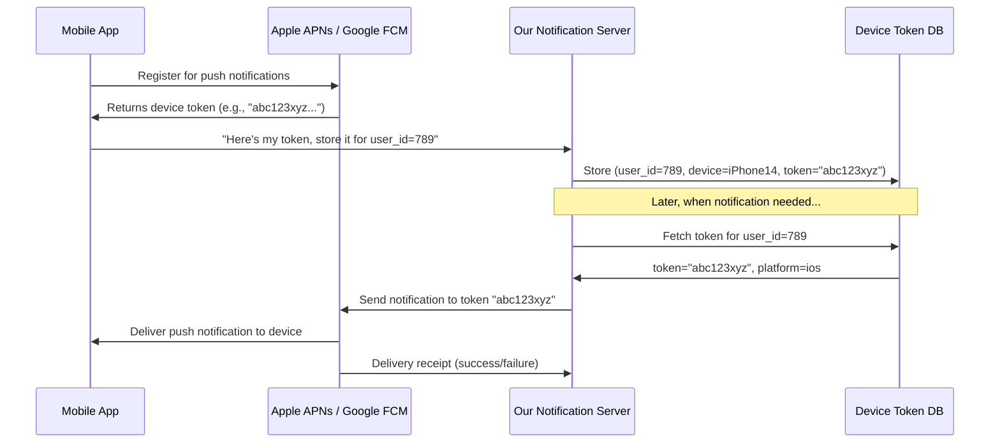

**Why device tokens matter and why they break:**
- A device token is like a home address. When you move houses (reinstall the app), your old address is invalid.
- APNs/FCM will return an error like `InvalidRegistration` or `Unregistered` when you try to send to an old token.
- Your system MUST detect this error and remove the stale token from the database, otherwise you're wasting compute and API quota.

### Email: The Slowpoke but Evergreen Channel

Email is like sending a letter — it will arrive, but maybe after spam filtering, inbox rules, and server delays. The challenges:
- **Spam filters** (Gmail, Outlook) look at your domain reputation, content, and SPF/DKIM records
- **Bounces** — email address no longer exists (hard bounce) or inbox is full (soft bounce)
- **Unsubscribe** — legally required in most countries (CAN-SPAM, GDPR). Users who mark you as spam hurt your domain reputation.
- **Open tracking** — embed a 1×1 pixel image; when loaded, you know the email was opened

### SMS: Expensive but the Most Reliable

SMS is like a registered post — someone signs for it. It arrives even on feature phones with no internet. That's why banks use it for OTPs and airlines use it for boarding passes.

- Cost: INR 0.12–0.50 per SMS in India; $0.005–$0.05 internationally
- Reliability: ~98% delivery rate (email is ~85%)
- Gateway limits: Twilio allows 100 SMS/sec per account number by default (request increase for scale)
- Regulatory: DND (Do Not Disturb) registry in India — you CANNOT send promotional SMS to DND numbers. Transactional SMS (OTP) is allowed.

---

## High-Level Architecture

### Analogy: An airport

Think of our notification system as an international airport:
- **Airlines (Producers)** — different services (payment service, product service, marketing service) bring passengers (notification requests)
- **Check-in counter (API Gateway)** — validates your ticket, checks your credentials
- **Security & Immigration (Preferences Service)** — checks if you're allowed to travel (is user opted-in?)
- **Departure gates by priority (Kafka topics)** — Gate A (critical, boards first), Gate B (normal), Gate C (bulk, boards last)
- **Different aircraft (Worker pools)** — separate planes for different destinations (push, email, SMS)
- **Destination airports (Third-party providers)** — APNs, FCM, SendGrid, Twilio
- **Flight tracking (Delivery status)** — you know exactly where your "passenger" is

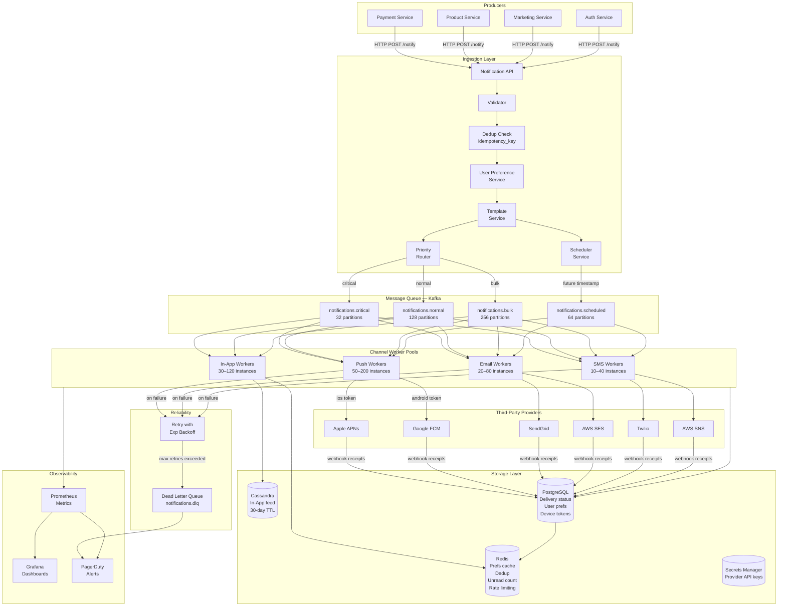

---

## Core Components — Deep Dive

### 1. Notification API (Ingestion Layer)

Yeh system ka main darwaza hai. Every notification starts here.

The API accepts requests from internal services via REST or gRPC. It does NOT send the notification — it validates, enriches, and enqueues it.

**Request Schema:**

```json
{
  "event_id": "evt_abc123",
  "user_id": "usr_789",
  "channels": ["push", "email"],
  "priority": "normal",
  "template_id": "order_placed",
  "template_params": {
    "order_id": "ORD-4521",
    "restaurant": "Burger King",
    "eta_minutes": 35
  },
  "scheduled_at": null,
  "idempotency_key": "order_placed_ORD-4521_v1"
}
```

**What happens on receipt:**

```
1. Authenticate producer (JWT / mTLS)
2. Validate schema (required fields, valid user_id, known template_id)
3. Idempotency check (has this idempotency_key been seen in last 24h?)
4. Fetch user preferences (from Redis cache, fallback to PostgreSQL)
5. Filter channels (remove opted-out channels, apply quiet hours)
6. Render template (fill in {{order_id}}, {{restaurant}}, etc.)
7. Assign priority (from request, or infer from template type)
8. If scheduled_at is set → route to Scheduler Service
9. Else → publish to Kafka topic by priority
10. Return 202 Accepted with notification_id
```

**Why 202 Accepted instead of 200 OK?**

Because the notification hasn't been sent yet — it's been enqueued. Returning 200 would imply it's done. 202 means "got it, we'll handle it." This is the correct HTTP semantics for async work.

---

### 2. User Preference Service — The "Do Not Disturb" System

Analogy: Think of a hotel. Even if a housekeeping request is in the queue, they MUST check the "Do Not Disturb" sign on the door before knocking. The notification system must do the same.

**What preferences does the system track?**

```sql
CREATE TABLE user_notification_preferences (
    user_id            UUID PRIMARY KEY,
    -- Channel-level opt-outs
    push_enabled       BOOLEAN DEFAULT TRUE,
    email_enabled      BOOLEAN DEFAULT TRUE,
    sms_enabled        BOOLEAN DEFAULT TRUE,
    in_app_enabled     BOOLEAN DEFAULT TRUE,
    -- Type-level opt-outs (JSONB for flexibility)
    opted_out_types    JSONB DEFAULT '[]',
    -- Quiet hours
    quiet_hours_start  TIME DEFAULT '22:00:00',
    quiet_hours_end    TIME DEFAULT '08:00:00',
    timezone           VARCHAR(50) DEFAULT 'UTC',
    -- Preferred channel when multiple available
    preferred_channel  VARCHAR(20) DEFAULT 'push',
    updated_at         TIMESTAMP DEFAULT NOW()
);
```

**Preference check logic:**

```python
def should_send(user_id: str, channel: str, notification_type: str,
                priority: str, current_utc: datetime) -> tuple[bool, str]:

    prefs = redis.get(f"prefs:{user_id}")
    if not prefs:
        prefs = db.fetch_prefs(user_id)
        redis.setex(f"prefs:{user_id}", 300, serialize(prefs))  # 5-min TTL

    # 1. Channel opt-out
    if not getattr(prefs, f"{channel}_enabled"):
        return False, "channel_opted_out"

    # 2. Type-level opt-out (e.g., user unsubscribed from marketing emails)
    if notification_type in prefs.opted_out_types:
        return False, "type_opted_out"

    # 3. Quiet hours (Critical notifications bypass this)
    if priority != "CRITICAL":
        user_local = utc_to_local(current_utc, prefs.timezone)
        if is_quiet_hours(user_local.time(), prefs.quiet_hours_start, prefs.quiet_hours_end):
            return False, "quiet_hours"

    return True, "ok"
```

**Why check preferences BEFORE enqueuing to Kafka?**

Because if you check AFTER enqueuing, you've already wasted:
- Kafka storage (a message sitting in a topic)
- Worker CPU (to consume and then reject the message)
- Potentially third-party API quota if check is at the wrong layer

Check early, fail early. This is the "fail fast" principle.

**Cache invalidation:** When a user updates their preferences (e.g., opts out of push), the API immediately deletes the Redis key:

```python
redis.delete(f"prefs:{user_id}")
```

The next preference check will re-fetch from PostgreSQL (the source of truth).

---

### 3. Template Service — "Dear {{name}}, your order is ready"

Analogy: A restaurant has a printed menu (template). Each table gets the same menu but orders (fills in) different items. The kitchen doesn't print a custom menu for each customer — that would be insane. Same concept here.

Without a template service, every service that sends notifications would hardcode their own message strings. Then if the wording changes, you'd need to update 50 different services. With templates, the notification text lives in ONE place.

**Template Structure:**

```json
{
  "template_id": "order_placed",
  "version": 3,
  "channels": {
    "push": {
      "title": "Order Placed!",
      "body": "Your {{restaurant}} order will arrive in {{eta_minutes}} mins."
    },
    "email": {
      "subject": "Your Zomato Order #{{order_id}} is confirmed",
      "html_body": "<h2>Yay! {{restaurant}} is preparing your food.</h2><p>ETA: {{eta_minutes}} minutes.</p><p>Order ID: {{order_id}}</p>"
    },
    "sms": {
      "body": "Zomato: Order #{{order_id}} from {{restaurant}} confirmed. ETA {{eta_minutes}} mins."
    }
  },
  "locales": {
    "hi": {
      "push": {
        "title": "ऑर्डर हो गया!",
        "body": "आपका {{restaurant}} ऑर्डर {{eta_minutes}} मिनट में आएगा।"
      }
    }
  },
  "required_vars": ["restaurant", "order_id", "eta_minutes"]
}
```

**Template rendering (Python pseudocode using Jinja2):**

```python
from jinja2 import Template

def render_template(template_id: str, channel: str,
                    params: dict, locale: str = "en") -> dict:
    cache_key = f"tmpl:{template_id}:{channel}:{locale}"
    tmpl = redis.get(cache_key)

    if not tmpl:
        tmpl = db.fetch_template(template_id, channel, locale)
        redis.setex(cache_key, 3600, serialize(tmpl))  # 1-hour cache

    # Validate all required variables are present
    missing = set(tmpl["required_vars"]) - set(params.keys())
    if missing:
        raise TemplateMissingVarsError(f"Missing: {missing}")

    rendered = {}
    for field, content in tmpl["channels"][channel].items():
        rendered[field] = Template(content).render(**params)

    return rendered
```

**Interview tip:** The interviewer may ask "what if a template has a bug?" Answer: versioning + A/B testing + gradual rollout. Never deploy a template change to 100% of traffic at once.

---

### 4. Priority Queue — Triage System

Analogy: Emergency rooms have triage. Cardiac arrest → immediate. Broken arm → wait. Paperwork → scheduled appointment. Same idea here.

We use Kafka with **separate topics** per priority:

```
notifications.critical  → 32 partitions   (low latency, small volume: OTPs, security alerts)
notifications.normal    → 128 partitions  (medium volume: transactional notifications)
notifications.bulk      → 256 partitions  (high volume, delay-tolerant: marketing, digests)
notifications.scheduled → 64 partitions   (future-dated notifications)
```

**Why separate topics instead of priority flags in one topic?**

Because Kafka does not natively support priority within a topic. If critical and bulk messages share a topic, a spike of bulk messages can cause critical messages to wait behind them in the queue. Separate topics = separate consumer groups = truly isolated processing.

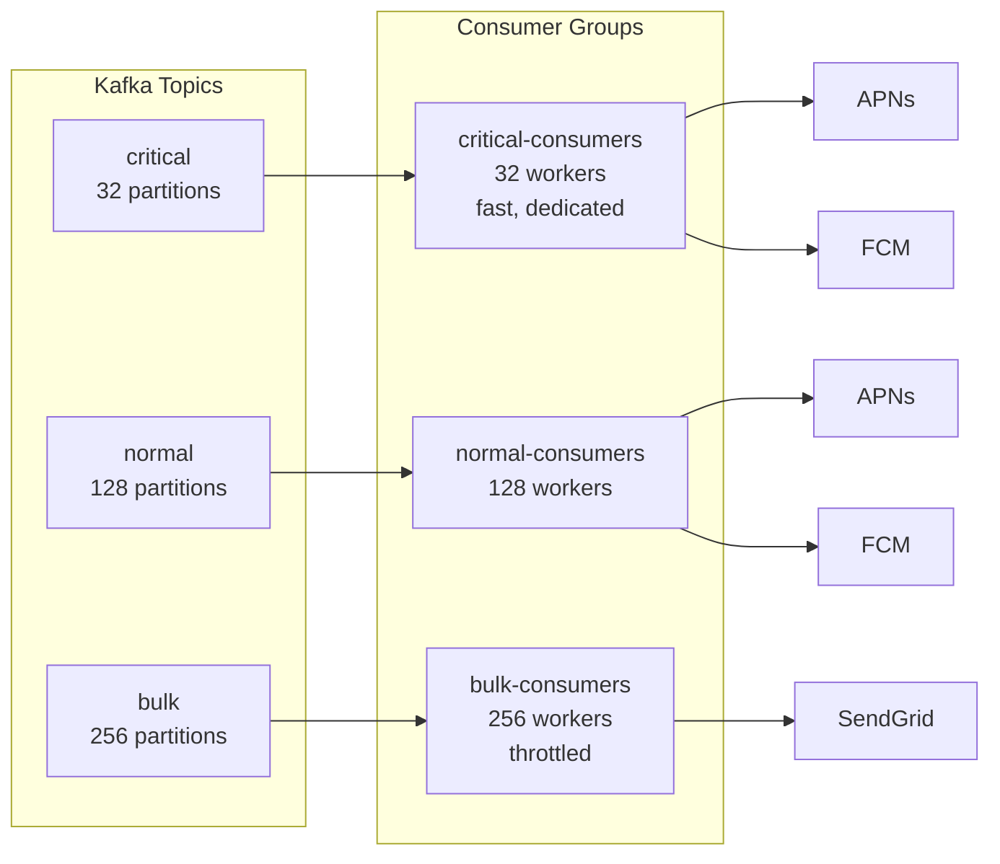

**Kafka message envelope:**

```json
{
  "notification_id": "notif_uuid_001",
  "user_id": "usr_789",
  "channel": "push",
  "platform": "ios",
  "device_token": "a1b2c3d4...encrypted",
  "title": "Order Placed!",
  "body": "Your Burger King order will arrive in 35 mins.",
  "data": {
    "deep_link": "zomato://orders/ORD-4521",
    "order_id": "ORD-4521"
  },
  "created_at": "2026-06-27T10:00:00Z",
  "priority": "normal",
  "attempt": 1,
  "idempotency_key": "order_placed_ORD-4521_v1"
}
```

---

### 5. Scheduled Notifications

Analogy: Setting an alarm clock. You set it now for 7 AM tomorrow. The phone doesn't ring all night — it waits. Same here.

Use cases:
- "Remind me about this event tomorrow at 9 AM" (Google Calendar notifications)
- "Send flash sale notification at midnight Saturday" (Myntra)
- "Send weekly digest every Monday 10 AM" (LinkedIn)

**Architecture for Scheduling:**

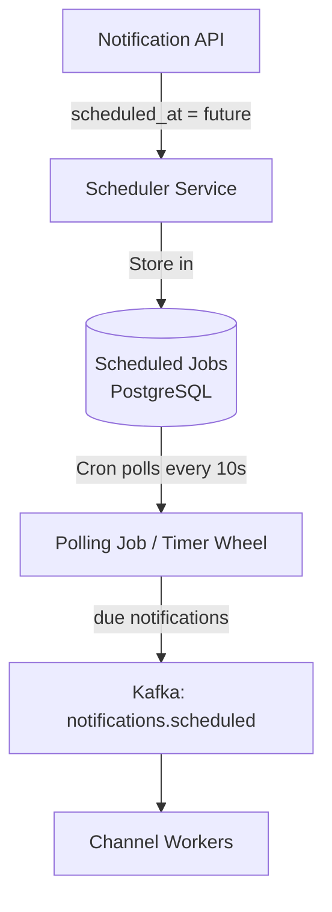

**Two approaches for scheduling:**

**Option A: Database polling (simple, works up to ~10M scheduled jobs)**
```python
# Runs every 10 seconds
def poll_due_notifications():
    now = datetime.utcnow()
    window_end = now + timedelta(seconds=10)
    due = db.query("""
        SELECT * FROM scheduled_notifications
        WHERE scheduled_at BETWEEN :now AND :window_end
          AND status = 'pending'
        FOR UPDATE SKIP LOCKED
        LIMIT 1000
    """, now=now, window_end=window_end)

    for job in due:
        publish_to_kafka(job, topic="notifications.scheduled")
        db.update(job.id, status="queued")
```

The `FOR UPDATE SKIP LOCKED` is important — prevents two polling instances from picking the same job (no duplicates even with multiple scheduler instances).

**Option B: Time-wheel / delay queue (Redis ZSET, scales better)**
```python
# Store: key=notification_id, score=unix_timestamp_of_send_time
redis.zadd("scheduled_notifs", {notification_id: scheduled_timestamp})

# Poller runs every second
def poll():
    now = time.time()
    due = redis.zrangebyscore("scheduled_notifs", 0, now, start=0, num=100)
    for notif_id in due:
        redis.zrem("scheduled_notifs", notif_id)
        publish_to_kafka(fetch_notification(notif_id))
```

**Interview tip:** If asked about scheduling, mention both approaches. Database polling is simpler to reason about. Redis ZSET is more scalable. For very large scale, dedicated systems like Quartz Scheduler (Java) or Temporal.io are used.

---

### 6. Device Token Management

Analogy: Imagine you're a pizza delivery guy. You have a list of customer addresses. If a customer moves houses and you try to deliver to the old address, the new tenant will say "wrong person." You need to update your address book.

Device tokens work the same way. When a user:
- **Reinstalls the app** → new token, old one is invalidated
- **Upgrades iOS/Android** → may get a new token
- **Signs out and signs in on a different device** → new device, new token

**Token storage schema:**

```sql
CREATE TABLE device_tokens (
    id            UUID PRIMARY KEY DEFAULT gen_random_uuid(),
    user_id       UUID NOT NULL,
    device_id     VARCHAR(255) NOT NULL,  -- hardware identifier
    platform      VARCHAR(10) NOT NULL,   -- 'ios' or 'android'
    token         TEXT NOT NULL,          -- encrypted APNs/FCM token
    is_active     BOOLEAN DEFAULT TRUE,
    last_seen_at  TIMESTAMP DEFAULT NOW(),
    created_at    TIMESTAMP DEFAULT NOW(),
    UNIQUE (user_id, device_id)
);

CREATE INDEX idx_tokens_user_id ON device_tokens(user_id, is_active);
```

**Token lifecycle:**

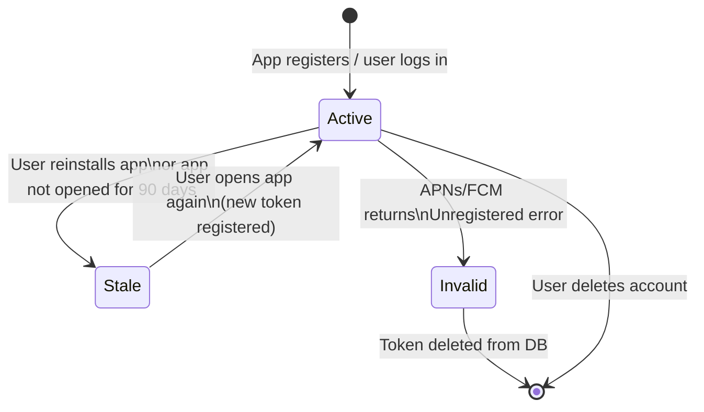

**How to detect invalid tokens:**

```python
class PushWorker:
    def send_push(self, device_token: str, payload: dict, platform: str):
        try:
            if platform == "ios":
                response = apns_client.send(device_token, payload)
            else:
                response = fcm_client.send(device_token, payload)

            record_delivery(status="delivered")

        except ApnsError as e:
            if e.reason in ("BadDeviceToken", "Unregistered", "DeviceTokenNotForTopic"):
                # Permanently invalid — remove from DB
                db.execute("UPDATE device_tokens SET is_active=FALSE WHERE token=?",
                           device_token)
                record_delivery(status="failed", reason="invalid_token")
                # DO NOT retry
            elif e.reason in ("TooManyRequests", "ServiceUnavailable"):
                # Transient — retry
                raise RetryableError(e)

        except FcmError as e:
            if e.code == "registration-token-not-registered":
                db.execute("UPDATE device_tokens SET is_active=FALSE WHERE token=?",
                           device_token)
                record_delivery(status="failed", reason="invalid_token")
            elif e.code in ("internal", "unavailable"):
                raise RetryableError(e)
```

**APNs Token vs Certificate-based push (common interview topic):**

| Feature           | Token-based (JWT)      | Certificate-based (legacy) |
|-------------------|------------------------|---------------------------|
| Expiry            | Tokens valid 1 hour, cert valid 1 year | Cert valid 1 year      |
| Supports multiple apps | Yes (one key, many apps) | No (one cert per app) |
| Recommended       | Yes (Apple prefers this) | No (deprecated)          |

---

### 7. Worker Pools — One Per Channel

Analogy: Think of a hospital lab. Blood tests, X-rays, and MRIs are done in separate departments with separate equipment. You don't use the X-ray machine for blood tests. Same principle — push workers and email workers should not share resources.

**Why separate worker pools?**

- **Independent scaling:** Push handles 69,000/sec; SMS handles 5,800/sec — they need different numbers of workers
- **Fault isolation:** If the email provider (SendGrid) goes down, it shouldn't affect push notifications at all
- **Different rate limits:** APNs has different limits than Twilio — separate pools handle this cleanly
- **Independent retry:** Email retries on a different schedule than SMS

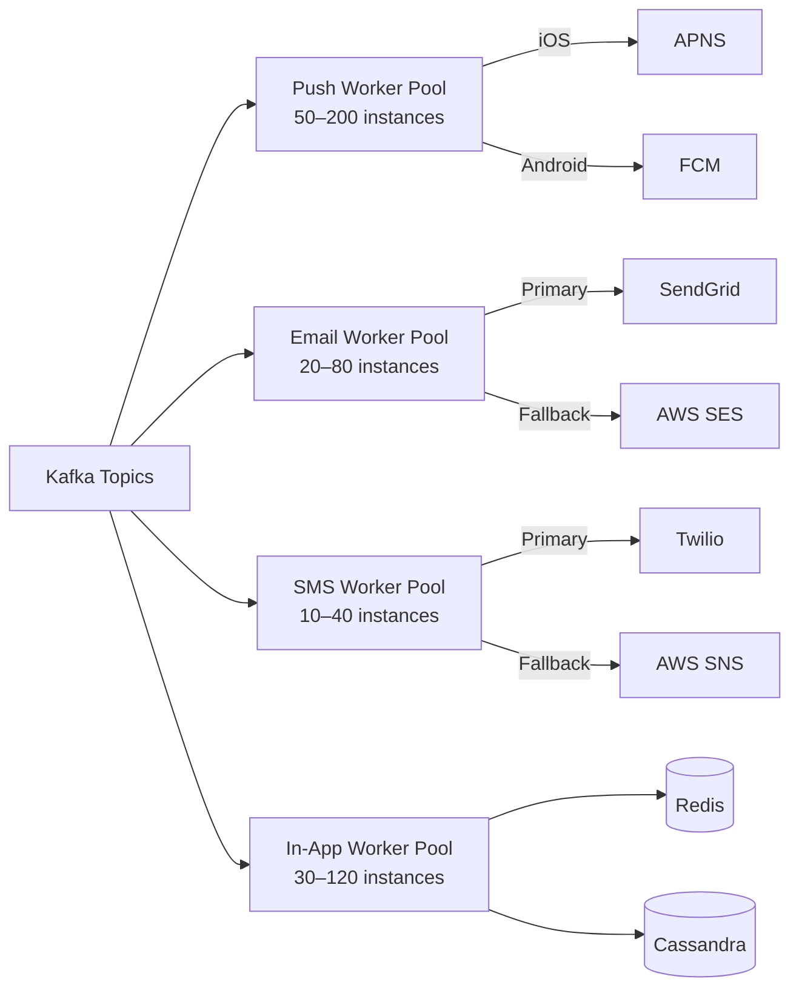

**Worker scaling math:**

```
Push workers needed (peak):
  - Peak throughput: 69,000 push/sec × 3 = 207,000/sec
  - APNs throughput per connection: ~1,000 req/sec
  - Workers needed: 207,000 / 1,000 = ~210 workers (use 200 + autoscale buffer)

Email workers needed (peak):
  - Peak throughput: 11,600 email/sec × 3 = 34,800/sec
  - SendGrid throughput: ~1,000 email/sec per API key
  - Workers needed: 35 (plus multiple API keys)

SMS workers needed (peak):
  - Peak throughput: 5,800 SMS/sec × 3 = 17,400/sec
  - Twilio throughput: 100 SMS/sec per phone number (use number pools)
  - Workers needed: 175 phone numbers, 40 workers
```

---

### 8. Retry with Exponential Backoff + Dead Letter Queue

Analogy: When you forget someone's name, you ask again after a moment. You wait a bit longer if you still can't remember. After 5 tries, you give up and ask a colleague (DLQ handler / on-call engineer).

At 10B/day, even a 0.01% transient error rate means **1 million failed notifications per day**. Retries recover most of them.

**Retry schedule:**

```
Attempt 1: immediate
Attempt 2: wait  5 seconds
Attempt 3: wait 30 seconds
Attempt 4: wait  5 minutes
Attempt 5: wait 30 minutes
→ Send to Dead Letter Queue (notifications.dlq)
```

**Jitter is critical** — if all workers retry at the exact same time, they create a thundering herd that overloads the provider again. Add ±20% random jitter:

```python
import random, math

def backoff_with_jitter(attempt: int, base_secs: float = 5.0) -> float:
    exponential = base_secs * (5 ** (attempt - 1))
    capped = min(exponential, 1800)  # max 30 minutes
    jitter = capped * random.uniform(0.8, 1.2)
    return jitter

# attempt=1 → ~5s, attempt=2 → ~25s, attempt=3 → ~125s, attempt=4 → ~625s, attempt=5 → ~1800s
```

**Which errors are retryable?**

| Error Type                          | Retryable? | Why                                    |
|-------------------------------------|------------|----------------------------------------|
| Provider timeout (no response)      | Yes        | Network hiccup, try again              |
| Provider 5xx (server error)         | Yes        | Provider overloaded, temporary         |
| Provider 429 (rate limit)           | Yes        | Slow down and retry                    |
| Invalid device token                | No         | Token is permanently bad               |
| User opted out (caught too late)    | No         | Preference is permanent                |
| Invalid API key / credential error  | No         | Config issue, engineer must fix        |
| Invalid phone number (SMS)          | No         | The number doesn't exist               |
| Email hard bounce                   | No         | Address doesn't exist                  |

**Dead Letter Queue (DLQ):**

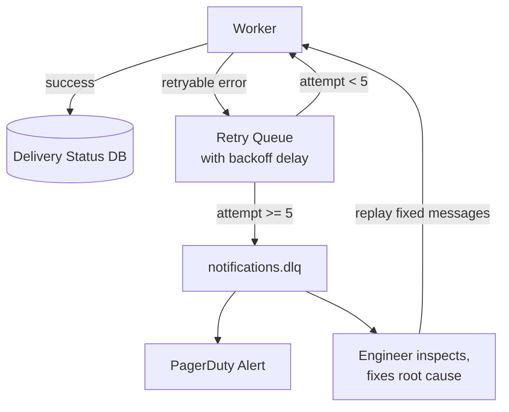

An on-call alert fires if the DLQ message count exceeds 100. This prevents silent data loss — you always know when notifications are failing.

---

### 9. Rate Limiting — Don't Spam Your Users

Analogy: Imagine a friend who texts you 50 times in an hour. You'd block them. Users block (unsubscribe from) apps that spam them. Rate limiting protects your users AND your business.

There are two dimensions of rate limiting:

**a) Per-User Rate Limiting (protect users from spam)**

```python
# Redis sliding window counter
LIMITS = {
    "push":  {"hourly": 10, "daily": 30},
    "sms":   {"hourly": 2,  "daily": 5},
    "email": {"hourly": 3,  "daily": 10},
}

def is_rate_limited(user_id: str, channel: str) -> bool:
    window = current_hour_window()  # e.g., "2026-06-27-10"
    key = f"rate:{user_id}:{channel}:{window}"

    count = redis.incr(key)
    if count == 1:
        redis.expire(key, 3600)  # Set TTL on first write

    limit = LIMITS[channel]["hourly"]
    return count > limit
```

Quiet hours are also a form of rate limiting — no push notifications between 10 PM and 8 AM in the user's local timezone:

```python
def is_quiet_hours(user_local_time: time, quiet_start: time, quiet_end: time) -> bool:
    # Handles crossing midnight: quiet_start=22:00, quiet_end=08:00
    if quiet_start > quiet_end:
        return user_local_time >= quiet_start or user_local_time < quiet_end
    else:
        return quiet_start <= user_local_time < quiet_end
```

**b) Per-Provider Rate Limiting (don't exceed API quotas)**

| Provider    | Default Limit          | Our Strategy                          |
|-------------|------------------------|---------------------------------------|
| APNs        | ~300 req/sec/connection| Connection pool of 100 connections    |
| FCM         | 500,000 msg/sec        | Token bucket per project              |
| SendGrid    | 1,000 emails/sec       | Multiple API keys + leaky bucket      |
| Twilio SMS  | 100 SMS/sec/number     | Pool of phone numbers                 |

```python
# Token bucket rate limiter (per provider)
class ProviderRateLimiter:
    def __init__(self, provider: str, rate_per_sec: int):
        self.key = f"limiter:{provider}"
        self.rate = rate_per_sec

    def allow(self) -> bool:
        pipe = redis.pipeline()
        now = time.time()
        window = str(int(now))

        pipe.incr(f"{self.key}:{window}")
        pipe.expire(f"{self.key}:{window}", 2)
        count, _ = pipe.execute()

        return count <= self.rate
```

---

### 10. Deduplication — Ek Hi Notification, Ek Baar

Analogy: If you press the elevator button twice, the elevator still comes once. A good system ignores the duplicate press. Same here.

**Why duplicates happen:**
- Producer retries the API call (network timeout, but server processed it)
- Kafka message delivered twice (edge case in at-least-once delivery)
- Worker crashes after sending but before committing the Kafka offset

**Two-layer deduplication:**

**Layer 1: API idempotency (prevents duplicate enqueuing)**

```python
def handle_notification_request(request):
    idem_key = request.idempotency_key
    existing = redis.get(f"idem:{idem_key}")

    if existing:
        return {"status": "duplicate", "notification_id": existing}, 200

    notification_id = generate_uuid()
    redis.setex(f"idem:{idem_key}", 86400, notification_id)  # 24h TTL

    enqueue_to_kafka(notification_id, request)
    return {"status": "accepted", "notification_id": notification_id}, 202
```

**Layer 2: Worker deduplication (prevents duplicate sending)**

```python
def process_message(message):
    dedup_key = f"sent:{message.notification_id}:{message.channel}"

    # setnx = set if not exists (atomic)
    was_new = redis.setnx(dedup_key, 1)

    if not was_new:
        logger.info(f"Duplicate detected, skipping: {message.notification_id}")
        return  # Skip — already sent

    redis.expire(dedup_key, 86400)  # 24h TTL

    # Actually send the notification
    send_to_provider(message)
```

---

### 11. Delivery Status Tracking

Analogy: Like a FedEx tracking page — you know exactly where your package is: Picked up → In transit → Out for delivery → Delivered.

**Notification lifecycle (state machine):**

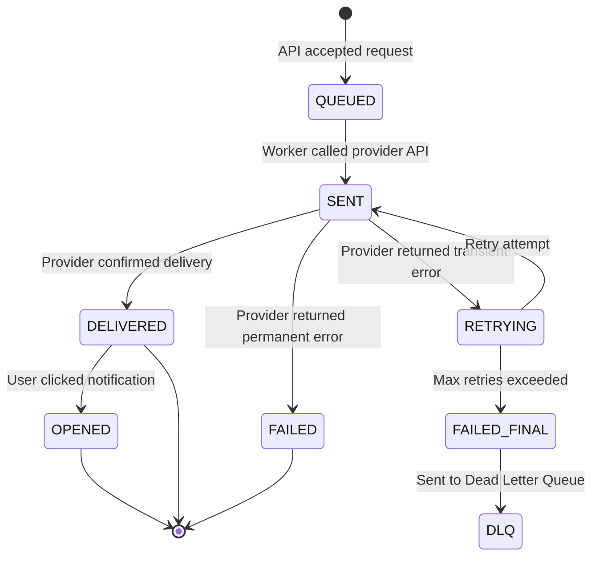

**Storage schema:**

```sql
CREATE TABLE notification_delivery (
    notification_id     UUID PRIMARY KEY,
    user_id             UUID NOT NULL,
    channel             VARCHAR(20) NOT NULL,  -- push/email/sms/in_app
    status              VARCHAR(20) NOT NULL,  -- queued/sent/delivered/failed/retrying
    provider            VARCHAR(50),           -- apns/fcm/sendgrid/twilio
    provider_message_id VARCHAR(255),          -- provider's receipt/message ID
    attempt_count       INT DEFAULT 0,
    last_attempted_at   TIMESTAMP,
    delivered_at        TIMESTAMP,
    opened_at           TIMESTAMP,             -- for email open tracking
    failure_reason      TEXT,
    created_at          TIMESTAMP DEFAULT NOW()
);

CREATE INDEX idx_delivery_user_id ON notification_delivery(user_id, created_at DESC);
CREATE INDEX idx_delivery_status  ON notification_delivery(status) WHERE status = 'retrying';
```

**How delivery confirmation works by channel:**

| Channel  | How we know it's delivered                                  |
|----------|-------------------------------------------------------------|
| Push     | APNs/FCM return status in HTTP/2 response (synchronous)     |
| Email    | SendGrid/SES sends webhook event: `delivered`, `bounced`    |
| SMS      | Twilio sends delivery status webhook callback               |
| In-App   | We write directly to Cassandra — delivery is guaranteed     |

---

### 12. In-App Notification Storage

Analogy: The bell icon on LinkedIn is like a physical inbox on your desk. When someone sends you a letter, it goes into the inbox (Cassandra). The little red badge showing "3 unread" is a Post-it note on the outside of the inbox (Redis).

**Two separate stores, two separate jobs:**

**Redis — for the red badge (hot, tiny, fast)**

```python
# Worker: new in-app notification arrives
redis.incr(f"unread:{user_id}")

# API: user opens the notification panel
def get_unread_count(user_id: str) -> int:
    return int(redis.get(f"unread:{user_id}") or 0)

# API: user marks all as read
def mark_all_read(user_id: str):
    redis.set(f"unread:{user_id}", 0)
    cassandra.execute("UPDATE in_app_notifications SET is_read=true WHERE user_id=?", user_id)
```

**Cassandra — for the notification list (write-heavy, time-series)**

Why Cassandra and not PostgreSQL?
- We write 2.5B in-app notifications per day — that's 29,000 writes/sec
- We read by user_id ordered by time (Cassandra's sweet spot)
- 30-day TTL is native in Cassandra (no cron jobs needed)
- PostgreSQL would struggle at this write volume

```sql
-- Cassandra CQL (not SQL!)
CREATE TABLE in_app_notifications (
    user_id    UUID,
    created_at TIMESTAMP,
    notif_id   UUID,
    title      TEXT,
    body       TEXT,
    deep_link  TEXT,
    is_read    BOOLEAN,
    PRIMARY KEY (user_id, created_at, notif_id)
) WITH CLUSTERING ORDER BY (created_at DESC)
  AND default_time_to_live = 2592000;  -- 30 days in seconds
```

**Pagination API:**

```
GET /v1/notifications/in-app?page_size=20&cursor=2026-06-25T14:32:00Z

Response:
{
  "unread_count": 3,
  "notifications": [
    {
      "notif_id": "notif_001",
      "title": "Rahul liked your post",
      "body": null,
      "deep_link": "instagram://post/abc123",
      "created_at": "2026-06-27T09:15:00Z",
      "is_read": false
    },
    ...
  ],
  "next_cursor": "2026-06-25T14:32:00Z",
  "has_more": true
}
```

---

## Full Architecture — Zoomed Out

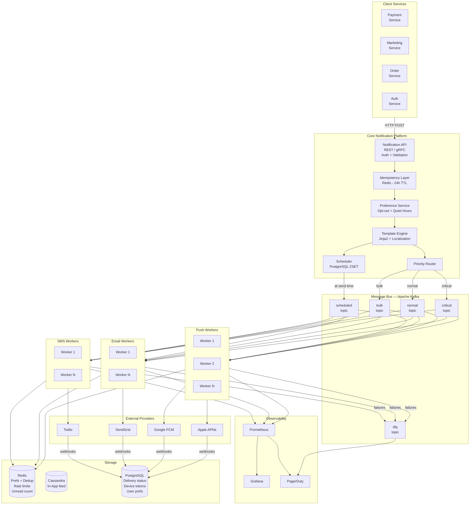

---

## Failure Scenarios and Mitigation

### Analogy: Emergency planning

Every city has a disaster management plan. What if the bridge floods? What if the power goes out? Good engineers think the same way about systems.

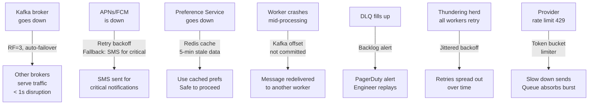

| Failure Scenario                     | Detection                           | Mitigation                                              |
|--------------------------------------|-------------------------------------|---------------------------------------------------------|
| Kafka broker down                    | Consumer lag alert                  | RF=3 replication, auto leader election                  |
| APNs/FCM slow or down                | 5xx spike, p99 latency alert        | Retry with backoff, fallback to SMS for CRITICAL        |
| SendGrid down                        | Email error rate > 5%               | Switch to AWS SES (fallback provider)                   |
| Preference service down              | Health check fails                  | Redis cache (stale < 5 min, acceptable)                 |
| Worker crashes mid-processing        | Kafka offset not committed          | Message redelivered to another worker (idempotency saves us) |
| DLQ backlog grows                    | DLQ consumer lag > 100             | PagerDuty alert, engineer replays after root cause fix  |
| All workers retry simultaneously     | Provider error rate spikes again    | Jittered exponential backoff                            |
| Invalid device tokens flood          | High `invalid_token` failure rate   | Purge stale tokens, add batch token validation          |

---

## Scale Numbers — Let's Do the Math

```
10 billion notifications/day
= 10,000,000,000 / 86,400 seconds
= 115,740 notifications/second (average)
= 350,000 notifications/second (3x peak)

By channel (peak):
  Push:   350,000 × 60% = 210,000/sec
  In-App: 350,000 × 25% = 87,500/sec
  Email:  350,000 × 10% = 35,000/sec
  SMS:    350,000 × 5%  = 17,500/sec

Kafka throughput:
  Each message ≈ 1 KB
  Total: 350,000 messages/sec × 1 KB = 350 MB/sec = 2.8 Gbps
  → Need a Kafka cluster with 32 brokers, each handling ~10 MB/sec

Worker count estimation:
  Push (210,000/sec, 1000 req/sec per worker): 210 workers
  Email (35,000/sec, 1000 emails/sec/worker):  35 workers + multiple API keys
  SMS (17,500/sec, 100 SMS/sec/number):         175 phone numbers, 40 workers
  In-App (87,500/sec, 5000 writes/sec/worker): 18 workers

Storage for delivery status:
  10B records/day × 200 bytes = 2 TB/day
  Keep 7 days = 14 TB → Sharded PostgreSQL or Cassandra
```

---

## Technology Choices — Trade-Off Tables

### Message Queue: Kafka vs. RabbitMQ vs. AWS SQS

| Feature              | Kafka                     | RabbitMQ               | AWS SQS                  |
|----------------------|---------------------------|------------------------|--------------------------|
| Throughput           | Millions/sec              | Hundreds of thousands  | Managed, auto-scales     |
| Message replay       | Yes (offset-based)        | No (consumed = gone)   | No                       |
| Ordering             | Per-partition             | Per-queue              | FIFO queues only         |
| Message retention    | Days to weeks             | Until consumed         | Max 14 days              |
| Fan-out consumers    | Yes (consumer groups)     | Yes (exchanges)        | SNS + SQS for fan-out    |
| Operational burden   | High (self-managed)       | Medium                 | Low (fully managed)      |
| Priority queuing     | Via separate topics       | Native priority queue  | No native priority       |
| Best for             | High-throughput, replay   | Complex routing        | Simple, serverless       |

**Decision: Kafka** — at 350,000 msg/sec with replay needs and multiple consumer groups (workers + analytics), Kafka is the right choice.

### In-App Storage: Cassandra vs. DynamoDB vs. PostgreSQL

| Feature              | Cassandra               | DynamoDB                    | PostgreSQL                |
|----------------------|-------------------------|-----------------------------|---------------------------|
| Write throughput     | Excellent (100k+ writes/sec) | Excellent (managed)    | Limited (10k writes/sec)  |
| Time-series queries  | Excellent (clustering)  | Good (sort key)             | Good (index needed)       |
| Horizontal scaling   | Easy (add nodes)        | Managed (auto)              | Hard (sharding manual)    |
| Native TTL           | Yes                     | Yes                         | No (manual cron needed)   |
| Cost at 2.5B/day     | Low (self-managed)      | High (RCU/WCU costs)        | Very high                 |
| Operational burden   | High                    | Low                         | Medium                    |

**Decision: Cassandra** — best fit for our write-heavy, time-series, high-volume use case at the lowest cost.

### Push Provider: APNs + FCM vs. Third-party Aggregator (OneSignal, Firebase)

| Feature              | APNs + FCM (Direct)              | OneSignal / Braze               |
|----------------------|----------------------------------|---------------------------------|
| Control              | Full                             | Limited                         |
| Cost                 | Free (just infrastructure)       | $0.0001–$0.001 per notification |
| Analytics            | Build yourself                   | Built-in                        |
| A/B testing          | Build yourself                   | Built-in                        |
| Setup complexity     | High                             | Low                             |
| Good for             | > 1B notifications/day           | < 100M notifications/day        |

**Decision: Direct at 10B/day scale.** At that volume, third-party aggregators are astronomically expensive and you need control over the pipeline.

---

## Monitoring and Observability

Analogy: Cockpit instruments in a plane. You can't fly without knowing altitude, speed, and fuel. Similarly, you can't operate a notification system without real-time metrics.

**Key dashboards to build:**

```
Throughput Dashboard:
  - notifications_accepted_per_sec (by channel, by priority)
  - notifications_sent_per_sec
  - notifications_delivered_per_sec
  - notifications_failed_per_sec
  - notifications_opted_out_per_sec (spike = you're annoying users)

Latency Dashboard:
  - p50/p95/p99 end-to-end delivery time (by channel)
  - time_in_kafka_queue (by topic — are critical messages waiting too long?)

Queue Health:
  - kafka_consumer_lag (by topic + consumer group) ← MOST IMPORTANT METRIC
  - dlq_message_count (should be near zero)
  - scheduled_notifications_upcoming (for capacity planning)

Provider Health:
  - provider_error_rate (by provider: apns/fcm/sendgrid/twilio)
  - provider_latency_p99 (is a third party slowing down?)
  - provider_rate_limit_hits_per_sec (are we hitting their limits?)

User Experience:
  - opt_out_rate_per_day (spike = we're spamming users)
  - undelivered_critical_count (MUST be near zero at all times)
  - invalid_token_rate (spike = many users reinstalled apps)
```

**PagerDuty alerts (wake up the on-call engineer):**

```
CRITICAL alerts (wake up at 3 AM):
  - notifications.critical consumer lag > 500 messages
  - DLQ message count > 50
  - Undelivered critical notification count > 10 in 5 minutes

WARNING alerts (Slack ping, fix during business hours):
  - notifications.normal consumer lag > 10,000
  - Provider error rate > 5% for any channel
  - End-to-end p99 latency > 10 seconds for normal priority
  - Opt-out rate spike > 2x normal baseline
  - Invalid token rate > 1% (many users reinstalled apps)
```

---

## Security Considerations

**Device tokens are sensitive personal data:**
- Store encrypted in PostgreSQL (AES-256)
- Mask in logs: show only last 8 characters (`...abc12345`)
- Never include in error messages sent back to producers

**API authentication:**
- All producers must authenticate with signed JWTs or mTLS certificates
- Each service gets its own client credential — you can revoke specific services

**No PII in Kafka messages:**
- Kafka messages contain `user_id` only, never name/email/phone number
- Workers fetch personal data from a secure user service at send time
- This prevents PII leakage if Kafka topic is accidentally accessed

**Provider credentials:**
- SendGrid API key, Twilio Auth Token, APNs key — all stored in HashiCorp Vault or AWS Secrets Manager
- Workers fetch credentials at startup, not at message processing time (fast + secure)
- Credentials rotate every 90 days automatically

**Regulatory compliance:**
- Email: Must include unsubscribe link (CAN-SPAM in USA, GDPR in EU)
- SMS in India: DND registry compliance — promotional SMS cannot go to DND numbers
- Marketing notifications require explicit consent (opt-in, not opt-out)
- GDPR right to erasure: deleting a user should immediately purge all their notification preferences and scheduled notifications

---

## Putting It All Together — The Full Flow

Let's trace a single notification from birth to delivery. Scenario: You just placed a Zomato order. The system sends you a push notification.

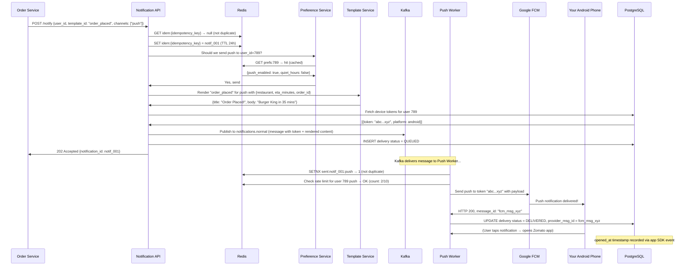

---

## Common Interview Questions

### Q1. "Walk me through the high-level design."

**Answer framework:**
1. State requirements (functional + NFR) — spend 3–4 minutes here
2. Estimate scale — 10B/day = 115k/sec, derive storage and compute needs
3. Draw the pipeline: Producers → API → Preferences → Template → Kafka → Workers → Providers → Status DB
4. Deep dive any component the interviewer asks about

### Q2. "How do you ensure a notification is not sent twice?"

**Answer:**
Two-layer deduplication:
1. API layer: `idempotency_key` checked against Redis (24h TTL). Duplicate requests return cached response.
2. Worker layer: Before calling the provider, worker checks `redis.setnx("sent:{notif_id}:{channel}", 1)`. If already set, skip.

This handles: producer retrying the API, Kafka redelivering a message, worker crashing after send but before offset commit.

### Q3. "How do you handle 10 billion notifications a day?"

**Answer:**
- Horizontal scaling of workers per channel
- Kafka with many partitions for parallelism (128 for normal, 256 for bulk)
- Separate worker pools so channels don't interfere with each other
- Pre-check preferences BEFORE enqueuing (reduces actual Kafka volume)
- Bulk channel throttled separately from critical
- Connection pooling to providers (APNs supports up to 100 concurrent connections)

### Q4. "How do you handle device token expiry?"

**Answer:**
- Store tokens in a `device_tokens` table with `is_active` flag
- When APNs returns `BadDeviceToken` or `Unregistered`, immediately set `is_active = FALSE` — do NOT retry
- On app open, the mobile app re-registers with the current token (upsert in DB)
- Periodically prune tokens not seen in 90 days (soft cleanup)

### Q5. "What happens if APNs goes down?"

**Answer:**
- Workers detect 5xx errors and retry with exponential backoff
- For CRITICAL priority notifications, failover to SMS after N retries (secondary channel)
- Kafka buffers the messages during downtime — no messages are lost
- PagerDuty alert fires when APNs error rate exceeds threshold
- When APNs recovers, the buffered Kafka messages get processed

### Q6. "How do you implement scheduled notifications?"

**Answer:**
- API accepts `scheduled_at` timestamp → routes to Scheduler Service
- Option A: PostgreSQL with polling every 10 seconds (`FOR UPDATE SKIP LOCKED` prevents duplicates across multiple scheduler instances)
- Option B: Redis ZSET (scored by unix timestamp), poller checks ZRANGEBYSCORE every second
- When due, scheduler publishes to `notifications.scheduled` Kafka topic
- Workers consume from that topic normally

### Q7. "How do you handle quiet hours?"

**Answer:**
- User has `quiet_hours_start`, `quiet_hours_end`, `timezone` in preferences
- Preference check converts current UTC to user's local time
- CRITICAL priority bypasses quiet hours entirely (OTPs, security alerts always go through)
- NORMAL and BULK: if in quiet hours, drop the notification (or optionally delay to after quiet hours end)
- The quiet hours check crosses midnight (e.g., 22:00 to 08:00) — need to handle this in the comparison logic

### Q8. "How do you rate-limit notifications per user?"

**Answer:**
Redis sliding window counter per user per channel per time window:
- Key: `rate:{user_id}:{channel}:{hour_window}`
- On each notification: `INCR` the key, set `EXPIRE` to 3600 on first write
- If count exceeds limit (e.g., 10 push/hour), drop or delay the notification
- CRITICAL priority notifications bypass user-level rate limits

### Q9. "Why Kafka over RabbitMQ or SQS?"

**Answer:**
Three reasons:
1. **Replay:** If our workers had a bug and misprocessed messages, Kafka lets us replay from an offset. RabbitMQ and SQS don't.
2. **Throughput:** 350,000 messages/sec is well within Kafka's range. RabbitMQ would struggle.
3. **Fan-out:** The same Kafka topic can be consumed by push workers, analytics workers, and audit log workers simultaneously without duplicating messages.

### Q10. "How would you add an in-app notification feature?"

**Answer:**
- Add `in_app` as a channel option
- In-App workers write to Cassandra (feed) and increment Redis counter (badge)
- Client API exposes `GET /notifications/in-app` with cursor-based pagination
- Badge count API: `GET /notifications/unread-count` reads Redis directly (< 1ms)
- WebSocket push to notify the open app in real-time (optional, nice-to-have)
- Mark-as-read API triggers Redis reset + Cassandra bulk update

### Q11. "How do you track email open rates?"

**Answer:**
- Embed a 1×1 transparent pixel image in every HTML email, URL contains the notification ID:
  ``
- When the email client loads the image, our server receives the request and records `opened_at`
- Limitation: Email clients with image blocking (Gmail "Proxy") mask individual opens
- Also track clicks on links in the email (link wrapping + redirect through our tracking server)

### Q12. "What's the difference between at-least-once and exactly-once delivery?"

**Answer:**
- **At-most-once:** Fire and forget. If worker crashes, message is lost. Bad for notifications.
- **At-least-once:** Retry on failure. Message may be processed twice. We handle this with idempotency checks. This is what we implement.
- **Exactly-once:** Never process more than once, never lose a message. Requires distributed transactions (expensive, slow). Kafka supports exactly-once with Kafka transactions, but at the cost of complexity and performance. For notifications, at-least-once + idempotency is the pragmatic choice.

---

## Key Takeaways

1. **Separate priority queues are non-negotiable at scale.** If your OTP notification is stuck behind a bulk marketing campaign in the same queue, users can't log into their bank. Kafka topics by priority ensure this never happens.

2. **Check preferences BEFORE enqueuing.** Don't waste Kafka space, worker CPU, and API quota sending notifications to users who've opted out. Fail fast = fail cheap.

3. **Device tokens expire — handle errors gracefully.** When APNs/FCM says "bad token," mark it inactive and don't retry. Retrying wastes quota and won't help.

4. **Retry + DLQ = your safety net.** At 10B/day, a 0.01% error rate = 1 million failures. Retries recover most; DLQ catches the rest so nothing is silently lost.

5. **Redis + Cassandra for in-app is a proven pattern.** Redis for the fast badge count (read millions of times per second), Cassandra for the large paginated feed (write-heavy, time-series).

6. **Deduplication at two levels.** Idempotency key at API ingress. Redis SETNX at worker egress. Belt AND suspenders — because distributed systems are sneaky about delivering things twice.

7. **Rate limiting protects users AND the business.** Users who are spammed uninstall apps. Apps that exceed provider limits get blocked. Two levels: per-user limits and per-provider limits.

8. **Scheduled notifications need `FOR UPDATE SKIP LOCKED`.** Without this, multiple scheduler instances will process the same job, causing duplicate sends. This PostgreSQL feature is the simplest solution.

9. **Templates are a force multiplier.** 50 different services can trigger notifications without knowing what the message says. Change the wording in ONE place, all services benefit immediately.

10. **Observability is the product.** Consumer lag is your most important Kafka metric — it tells you if you're falling behind. DLQ depth tells you about silent failures. Opt-out rate tells you if you're annoying your users. Build dashboards before you go to production.

11. **Managed services are valid at small scale.** Don't build this system if OneSignal, Firebase, or Braze can handle your volume. Build when you have tens of millions of users and need full control, cost optimization, or custom features.

12. **Security and compliance are first-class concerns.** No PII in Kafka. Encrypted device tokens. Unsubscribe links in every email. DND registry for SMS in India. GDPR right to erasure. These are not afterthoughts.

---

## Further Reading

- [Apple APNs HTTP/2 API documentation](https://developer.apple.com/documentation/usernotifications/sending-notification-requests-to-apns)
- [Firebase Cloud Messaging Architecture Guide](https://firebase.google.com/docs/cloud-messaging/fcm-architecture)
- [Kafka Consumer Groups — Confluent](https://docs.confluent.io/platform/current/clients/consumer.html)
- [How Uber Built a Real-Time Push Platform](https://www.uber.com/en-US/blog/ubers-real-time-push-platform/)
- [Cassandra Data Modeling for Time-Series](https://cassandra.apache.org/doc/latest/cassandra/data_modeling/data_modeling_rdbms.html)
- [Twilio SMS Best Practices at Scale](https://www.twilio.com/docs/sms/best-practices)
- [Redis Patterns for Rate Limiting](https://redis.io/docs/manual/patterns/distributed-locks/)

---

*Case Study 05 — System Design Interview Prep Series*
