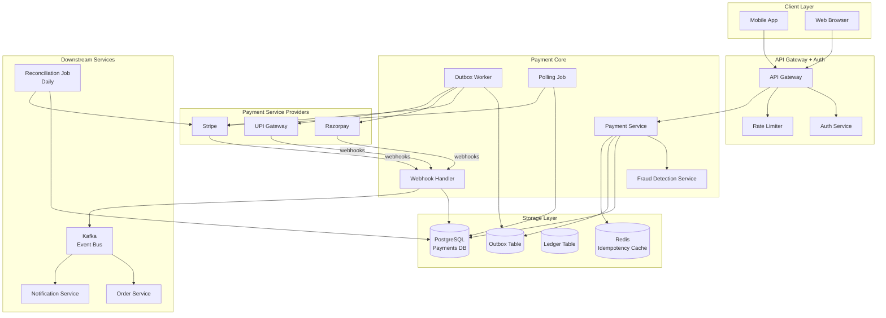
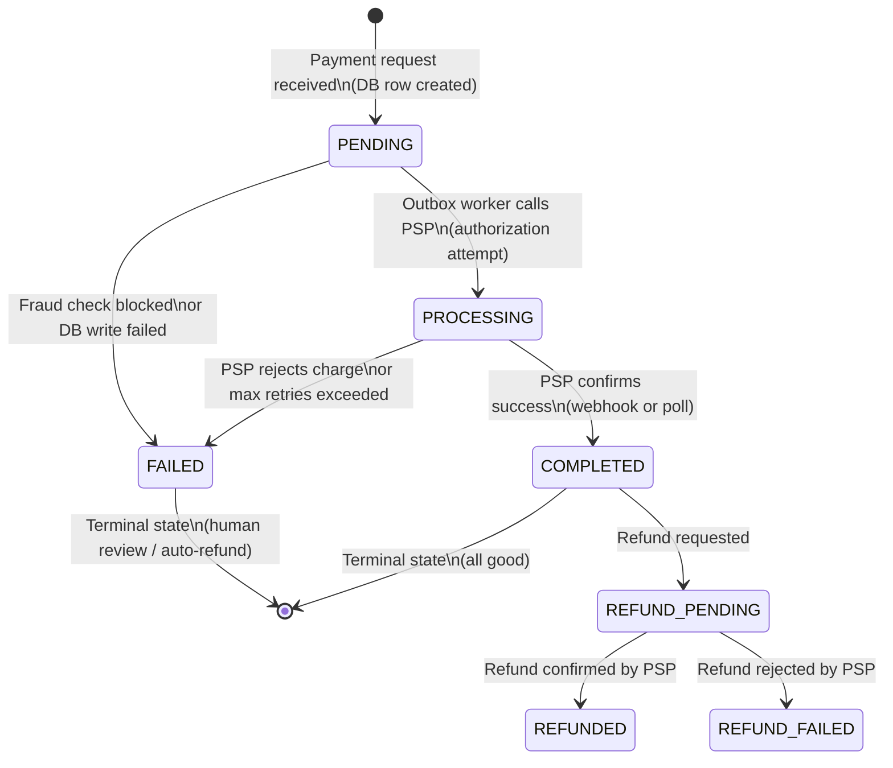
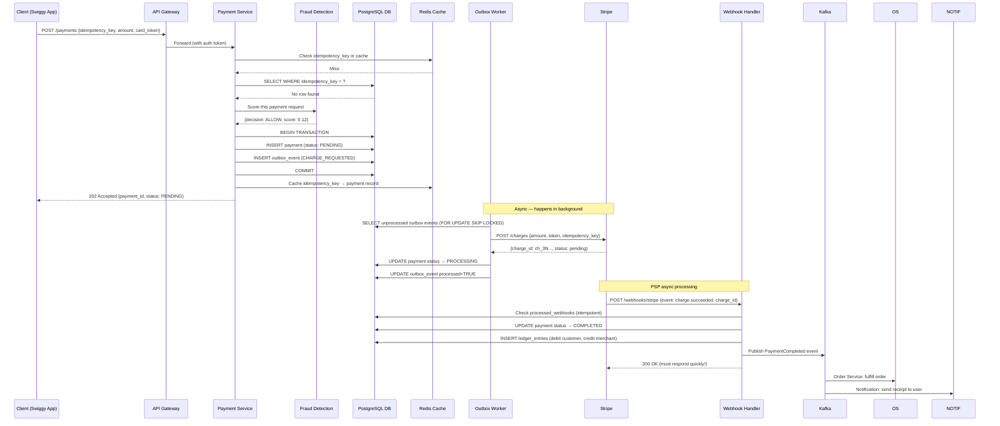
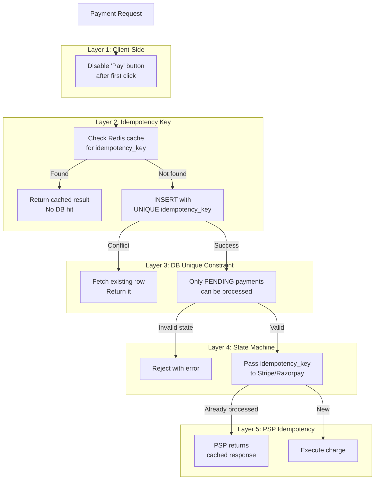
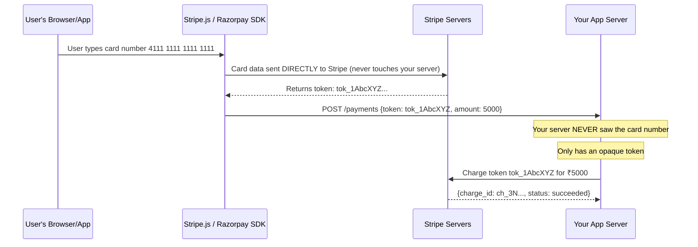
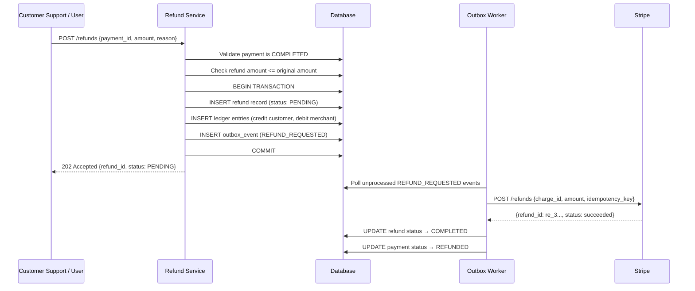
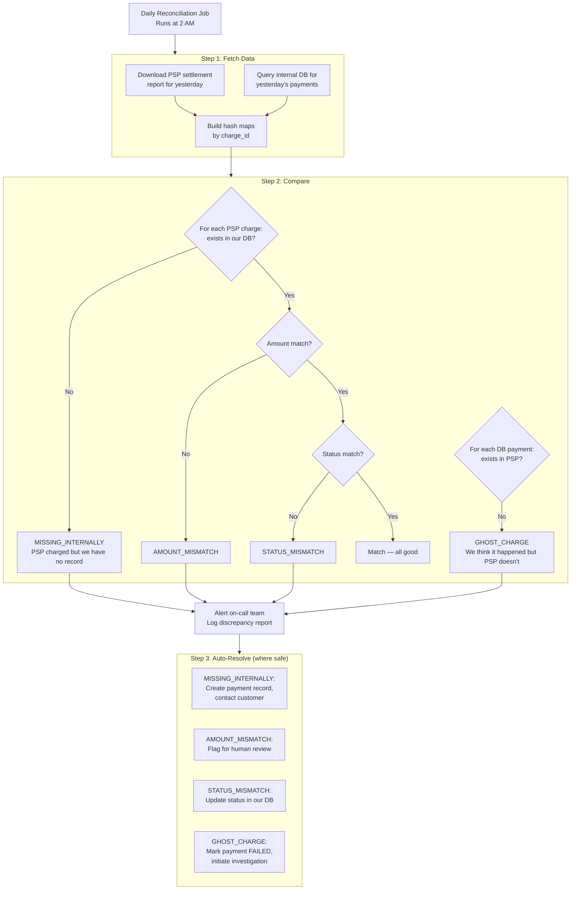
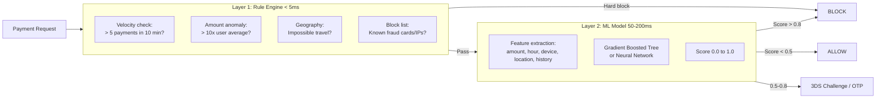

# Case Study: Design a Payment System

> The most critical system to get right. Bugs here don't just break the experience — they cost real money, destroy user trust, and attract regulators. This is your complete, interview-ready guide.

---

## Why Is This Hard? (Understand the Problem First)

Analogy time. Imagine you are at a busy Zomato counter. You order biryani and hand cash to the counter person. Simple, right? Now imagine:

- The counter person takes your ₹200, goes to the kitchen, but trips and falls before telling the kitchen
- The kitchen never gets the order — but your money is gone
- You ask again — now the counter person charges you AGAIN

That is the distributed systems problem in payment. The money (your API call to Stripe/Razorpay) can succeed, but the notification back to your system (the webhook/response) can fail. Now you do not know if the customer was charged. If you retry, you charge them twice. If you do not, you lose revenue.

Yeh kyun important hai? Because **in any distributed system, anything that CAN fail, WILL fail**. Networks timeout. Databases restart. Processes crash. And unlike a social media feed glitch, a payment glitch means:

- Customer sees double charge on their credit card statement
- You get a chargeback penalty from the bank
- Customer never trusts your app again
- In extreme cases, regulatory/legal action

The central challenge: **exactly-once payment processing in a distributed system where anything can fail at any moment.**

---

## Requirements

### Functional Requirements
1. Process payments (credit card, debit card, UPI, wallets)
2. Support refunds (full and partial)
3. Prevent double charges absolutely
4. Handle all failure modes gracefully
5. Maintain a complete audit trail
6. Support reconciliation with payment gateways

### Non-Functional Requirements
1. **Exactly-once semantics** — the most important constraint
2. **PCI-DSS compliance** — legally required for handling card data
3. **High availability** — payment systems cannot go down
4. **Strong consistency** — money math must always be correct
5. **Auditability** — every rupee must be traceable
6. Latency: < 500ms for payment initiation; final status within 30 seconds

### Scale Estimates
- Swiggy/Zomato peak: ~50,000 orders/hour → ~14 payments/second
- Paytm/PhonePe: millions of UPI transactions per day
- Visa peak globally: 24,000 transactions per second
- Design target: 1,000 payments/second with 99.99% uptime

---

## Full Architecture Diagram



---

## Core Concept 1: Idempotency — The First Law of Payments

**Analogy (5-year-old version):** You send a birthday card to your grandma by post. The postman loses it. You send another one. Grandma gets BOTH. She thinks you sent two cards — weird but okay. Now imagine you sent her ₹500 instead of a card. She gets ₹1000. That is a problem. So you write a unique reference number on every envelope. Grandma checks: "Did I already receive envelope #A7X9? Yes — I return the second one."

In payment systems, **networks lie and clients retry**. A user clicks "Pay Now." The request reaches your server, the payment is processed, but the response back to the app times out. The app thinks the payment failed. The user taps "Pay Now" again. Without idempotency, they get charged twice.

### The Rule

> One idempotency key = at most one charge, forever. No exceptions.

### How It Works

Every payment request from the client includes a unique `idempotency_key` (UUID v4). The server uses this as a gate:

```
First request with key "abc-123":
  → Key not seen before → process payment → store result → return result

Second request with same key "abc-123" (retry):
  → Key already seen → return CACHED result → DO NOT process again
```

```python
import uuid

# Client side — generate once, send with every retry
def build_payment_request(amount: int, currency: str, card_token: str) -> dict:
    return {
        "idempotency_key": str(uuid.uuid4()),  # generated ONCE per payment intent
        "amount": amount,          # always in smallest unit: paise for INR, cents for USD
        "currency": currency,
        "card_token": card_token,  # token from PSP SDK — never raw card number
    }
```

```sql
-- The database unique constraint is your safety net
CREATE TABLE payments (
    id              UUID PRIMARY KEY DEFAULT gen_random_uuid(),
    idempotency_key VARCHAR(64) UNIQUE NOT NULL,  -- UNIQUE = database enforces no duplicates
    status          VARCHAR(20) NOT NULL DEFAULT 'PENDING',
    amount          BIGINT NOT NULL CHECK (amount > 0),
    currency        CHAR(3) NOT NULL,
    customer_id     UUID NOT NULL,
    merchant_id     UUID NOT NULL,
    card_token      VARCHAR(256),
    card_last4      CHAR(4),
    card_brand      VARCHAR(20),
    psp_charge_id   VARCHAR(128) UNIQUE,
    fraud_score     DECIMAL(4,3),
    fraud_decision  VARCHAR(10),
    metadata        JSONB,
    created_at      TIMESTAMPTZ NOT NULL DEFAULT NOW(),
    updated_at      TIMESTAMPTZ NOT NULL DEFAULT NOW()
);
```

```python
def handle_payment_request(req: dict, db) -> dict:
    key = req["idempotency_key"]

    # Step 1: Check cache first (Redis, fast path)
    cached = redis.get(f"idem:{key}")
    if cached:
        return json.loads(cached)  # return immediately, no DB hit

    # Step 2: Check DB (slower but authoritative)
    existing = db.query(
        "SELECT * FROM payments WHERE idempotency_key = %s", (key,)
    )
    if existing:
        redis.setex(f"idem:{key}", 86400, json.dumps(existing))  # cache it
        return existing  # NEVER charge again

    # Step 3: Try to insert — unique constraint is our race condition guard
    try:
        payment = db.execute("""
            INSERT INTO payments (idempotency_key, amount, currency, customer_id, status)
            VALUES (%s, %s, %s, %s, 'PENDING')
            RETURNING *
        """, (key, req["amount"], req["currency"], req["customer_id"]))
        return payment

    except UniqueViolationError:
        # Race condition: two requests with same key hit the DB simultaneously
        # Only one INSERT wins. Loser fetches and returns the winner's result.
        return db.query(
            "SELECT * FROM payments WHERE idempotency_key = %s", (key,)
        )
```

**Why the unique constraint matters:** Imagine two identical retry requests arrive at the same millisecond (load balancer sends to two servers). Both check Redis — miss. Both check DB — miss (not inserted yet). Both try to INSERT. The database's `UNIQUE` constraint ensures only ONE succeeds. The other gets an error and falls back to reading the winner's row. No double insertion, no double charge.

### Idempotency at the PSP Level Too

Here is something many people miss: you also need to pass the idempotency key TO Stripe/Razorpay. Because your outbox worker might retry calling Stripe after a network failure. Without this, Stripe would process it twice too.

```python
# When calling Stripe, ALWAYS pass idempotency key
stripe.Charge.create(
    amount=payment["amount"],
    currency=payment["currency"],
    source=payment["card_token"],
    idempotency_key=payment["idempotency_key"],  # Stripe caches this for 24 hours
)
```

---

## Core Concept 2: The Payment State Machine

**Analogy:** Think of your Swiggy order. It goes: Placed → Confirmed → Picked Up → On the Way → Delivered. It never jumps from "Placed" directly to "Delivered." And it never goes BACKWARDS from "Delivered" to "Picked Up." There is a strict, one-way flow.

Payments work the same way. Define strict states and valid transitions. Any code trying to do an invalid transition should throw an error.



```python
# Payment state machine — enforce valid transitions
VALID_TRANSITIONS = {
    "PENDING":        {"PROCESSING", "FAILED"},
    "PROCESSING":     {"COMPLETED", "FAILED"},
    "COMPLETED":      {"REFUND_PENDING"},
    "REFUND_PENDING": {"REFUNDED", "REFUND_FAILED"},
    # Terminal states: FAILED, REFUNDED, REFUND_FAILED — no outgoing transitions
}

def transition_payment_status(payment_id: str, new_status: str, db):
    payment = db.query("SELECT status FROM payments WHERE id = %s FOR UPDATE",
                       (payment_id,))  # lock the row!

    current = payment["status"]
    if new_status not in VALID_TRANSITIONS.get(current, set()):
        raise InvalidStateTransitionError(
            f"Cannot transition payment {payment_id} from {current} to {new_status}"
        )

    db.execute("""
        UPDATE payments SET status = %s, updated_at = NOW()
        WHERE id = %s AND status = %s  -- optimistic lock on status
    """, (new_status, payment_id, current))
```

**Why the state machine matters:** Without it, a race condition could mark a payment COMPLETED before it is PROCESSING, or a failed payment could be retried after already being refunded. Every penny of discrepancy will show up in reconciliation — and your finance team will be furious.

---

## Core Concept 3: The Outbox Pattern — Exactly-Once Guarantee

**Analogy:** You are the store manager at a Big Bazaar. A customer pays for a TV. You need to do two things: (1) record the sale in the register, and (2) tell the warehouse to prepare the TV for delivery. The problem: what if the power cuts out between step 1 and step 2?

Your solution: at the SAME moment you ring up the sale, you also tape a sticky note to the register that says "Warehouse: prep TV for order #42." When the lights come back on, a night-shift employee reads all the sticky notes and makes sure every delivery happens. Once confirmed, the note is removed.

That sticky note IS the outbox table.

### Why Naive Implementation Fails

```python
# WRONG — DO NOT DO THIS — this code has a fatal flaw
def process_payment_naive(req, db, stripe):
    db.insert_payment(req, status="PENDING")     # Step 1: Write to DB
    charge = stripe.charge(req)                  # Step 2: Call Stripe
    db.update_payment(status="COMPLETED")        # Step 3: Update DB

    # WHAT IF: Step 2 succeeds (money is charged!) but the process crashes before Step 3?
    # Result: Stripe has the money, your DB says PENDING, customer retries → DOUBLE CHARGE
```

Basically, you can NEVER make a DB write and an external API call atomic. They are in different systems. You cannot two-phase-commit across them.

### The Outbox Solution

The trick: write BOTH the payment record AND a "to-do" outbox event inside ONE database transaction. Since both are in the SAME database, they are atomic. Then a separate background worker reads the outbox and calls Stripe. If the worker crashes mid-call, the outbox event stays unprocessed and gets retried — safely, because Stripe's idempotency key prevents double-charging.

```sql
CREATE TABLE outbox_events (
    id           UUID PRIMARY KEY DEFAULT gen_random_uuid(),
    payment_id   UUID NOT NULL REFERENCES payments(id),
    event_type   VARCHAR(64) NOT NULL,   -- 'CHARGE_REQUESTED', 'REFUND_REQUESTED'
    payload      JSONB NOT NULL,         -- all data needed to make the PSP call
    processed    BOOLEAN NOT NULL DEFAULT FALSE,
    retry_count  INT NOT NULL DEFAULT 0,
    last_error   TEXT,
    created_at   TIMESTAMPTZ NOT NULL DEFAULT NOW(),
    processed_at TIMESTAMPTZ
);

-- Critical index: outbox worker only scans unprocessed rows
CREATE INDEX idx_outbox_unprocessed
    ON outbox_events(processed, created_at)
    WHERE processed = FALSE;
```

```python
def create_payment_with_outbox(req: dict, db) -> dict:
    """
    Atomic: either BOTH the payment row and outbox event are written, or NEITHER is.
    This is the guarantee that makes exactly-once possible.
    """
    with db.transaction():  # single database transaction
        # Write payment row
        payment = db.execute("""
            INSERT INTO payments (idempotency_key, amount, currency, customer_id, status)
            VALUES (%s, %s, %s, %s, 'PENDING')
            RETURNING *
        """, (req["idempotency_key"], req["amount"],
              req["currency"], req["customer_id"]))

        # Write outbox event in the SAME transaction
        db.execute("""
            INSERT INTO outbox_events (payment_id, event_type, payload)
            VALUES (%s, 'CHARGE_REQUESTED', %s)
        """, (payment["id"], json.dumps({
            "card_token":      req["card_token"],
            "amount":          req["amount"],
            "currency":        req["currency"],
            "idempotency_key": req["idempotency_key"],  # forwarded to PSP
        })))

    # If we get here: BOTH rows exist in the DB.
    # If the DB crashed: NEITHER row exists. Client retries → idempotency key prevents duplicate.
    return payment
```

```python
# Outbox Worker — runs as a separate long-lived process
def outbox_worker(db, psp_clients):
    MAX_RETRIES = 5
    BACKOFF_SECONDS = [1, 2, 4, 8, 16]  # exponential backoff

    while True:
        # FOR UPDATE SKIP LOCKED: multiple worker instances can run in parallel.
        # Each instance locks different rows. No two workers process the same event.
        events = db.query("""
            SELECT * FROM outbox_events
            WHERE processed = FALSE
              AND retry_count < %s
            ORDER BY created_at ASC
            LIMIT 10
            FOR UPDATE SKIP LOCKED
        """, (MAX_RETRIES,))

        for event in events:
            payload = event["payload"]

            try:
                # Call the payment service provider
                psp = psp_clients[payload.get("psp", "stripe")]
                charge = psp.charge(
                    amount=payload["amount"],
                    currency=payload["currency"],
                    card_token=payload["card_token"],
                    idempotency_key=payload["idempotency_key"],  # PSP deduplication
                )

                with db.transaction():
                    # Update payment status
                    db.execute("""
                        UPDATE payments
                        SET status='PROCESSING', psp_charge_id=%s, updated_at=NOW()
                        WHERE id=%s
                    """, (charge["id"], event["payment_id"]))

                    # Mark outbox event done
                    db.execute("""
                        UPDATE outbox_events
                        SET processed=TRUE, processed_at=NOW()
                        WHERE id=%s
                    """, (event["id"],))

            except (PSPError, NetworkError) as e:
                backoff = BACKOFF_SECONDS[min(event["retry_count"], 4)]
                db.execute("""
                    UPDATE outbox_events
                    SET retry_count = retry_count + 1,
                        last_error = %s
                    WHERE id=%s
                """, (str(e), event["id"]))
                time.sleep(backoff)

            except MaxRetriesExceeded:
                # After 5 retries, stop and alert humans
                db.execute("""
                    UPDATE payments SET status='FAILED' WHERE id=%s
                """, (event["payment_id"],))
                alert_on_call(f"Payment {event['payment_id']} failed after max retries")

        time.sleep(1)
```

### Two-Phase Commit Simulation — What Is Actually Happening

You cannot do a real two-phase commit (2PC) across your DB and Stripe. But the outbox pattern simulates it:

```
Phase 1 (Prepare):   Write payment + outbox event atomically to YOUR DB
Phase 2 (Execute):   Worker reads outbox → calls PSP → marks done

If Phase 1 fails:    Nothing happened. Client retries safely.
If Phase 2 crashes:  Outbox event still exists (processed=FALSE). Worker retries.
                     PSP idempotency key prevents double charge.
```

This is sometimes called "transactional outbox" or "local message reliability."

---

## Core Concept 4: The Complete Payment Flow (Step by Step)



### Why 202 Accepted and Not 200 OK?

Samjho aise: when you order from Zomato, the app says "Order Placed!" — not "Food Delivered!" The food isn't delivered yet. Payment is the same. When you return to the client, the PSP hasn't confirmed yet. Returning `200 OK` would be lying. `202 Accepted` is honest: "I got your request, I will process it."

The client polls `GET /payments/{payment_id}` to check status, or receives a push notification when the webhook fires.

---

## Core Concept 5: Double-Charge Prevention — The Complete Arsenal

Double-charging is THE enemy. Here is every layer of defense:



| Defense Layer | What It Prevents | How |
|---|---|---|
| Disabled button (client) | Accidental double-tap | UX, not a security guarantee |
| Idempotency key (Redis) | Network retry from app | Return cached result fast |
| DB UNIQUE constraint | Race condition on concurrent retries | Database rejects duplicate INSERT |
| Payment state machine | Processing an already-processing payment | Only PENDING → PROCESSING is valid |
| PSP-level idempotency | Outbox worker retrying PSP call | Stripe/Razorpay returns cached result |
| Reconciliation (daily) | Anything that slipped through above | Catch and fix discrepancies |

---

## Core Concept 6: PCI-DSS Compliance — Never Touch the Card

**Analogy:** You are a courier person. You deliver sealed envelopes. You do NOT know what is inside. You never open the envelope, never photograph it, never keep a copy. This is how your servers must treat card numbers.

PCI-DSS (Payment Card Industry Data Security Standard) is a legal/contractual requirement. If you store raw card numbers and get breached, you face:
- Fines of $5,000–$100,000 per month
- Loss of ability to process card payments entirely
- Class action lawsuits

### The Golden Rule

> Your servers should NEVER see, transmit, or store raw card numbers.

### Tokenization Flow



### What You Can and Cannot Store

| Data | Store? | Notes |
|---|---|---|
| Raw card number (PAN) | NEVER | Even hashed — PCI prohibits it |
| CVV / CVC code | NEVER | Even for milliseconds in memory |
| Card expiry | Only via PSP vault | Never raw in your DB |
| Card token (Stripe token) | YES, safe | Opaque reference, useless without Stripe API |
| Last 4 digits | YES | For display: "charged to card ending 4242" |
| Card brand | YES | Visa, Mastercard, RuPay |
| Cardholder name | YES, with encryption | AES-256 at rest, separate KMS |

```python
# What YOUR database stores — never the actual card number
payment_record = {
    "id": "pay_abc123",
    "customer_id": "user_456",
    "amount": 50000,           # ₹500.00 in paise
    "currency": "INR",
    "card_last4": "4242",      # display only
    "card_brand": "visa",      # display only
    "card_token": "tok_1AbcXYZ",  # PSP token — safe to store
    "psp_charge_id": "ch_3N...",
    "status": "COMPLETED",
}
# NEVER store: card_number, cvv, expiry
```

### Encryption at Rest (Beyond Tokenization)

```
All payment tables:
  - AES-256 Transparent Data Encryption (TDE) at DB level
  - Field-level encryption for cardholder_name
  - Encryption keys stored in separate KMS (AWS KMS, GCP Cloud KMS)
  - Keys rotated every 90 days
  - Audit log of every key access

Network:
  - TLS 1.2+ for all connections
  - No card data in URLs, query params, or logs
  - Log scrubbing middleware to redact card tokens from application logs
```

---

## Core Concept 7: Refunds

**Analogy:** You ordered shoes from Myntra, they don't fit, you return them. Myntra needs to reverse the money back to your card. The accounting ledger has to show this as a credit back to you and a debit from Myntra's balance.

Refunds follow the same pattern as payments: idempotency key, outbox pattern, state machine.



```python
def process_refund(payment_id: str, amount: int, reason: str, db, requestor_id: str):
    payment = db.query(
        "SELECT * FROM payments WHERE id = %s FOR UPDATE", (payment_id,)
    )

    # Validations
    if not payment:
        raise NotFoundError(f"Payment {payment_id} not found")
    if payment["status"] != "COMPLETED":
        raise InvalidOperationError(f"Can only refund COMPLETED payments, got {payment['status']}")
    if amount > payment["amount"]:
        raise InvalidOperationError("Refund amount cannot exceed original payment amount")

    # Idempotency key for the refund — prevents double-refund if this endpoint is retried
    idempotency_key = f"refund-{payment_id}-{amount}-{requestor_id}"

    with db.transaction():
        # Check if this refund was already requested
        existing = db.query(
            "SELECT * FROM refunds WHERE idempotency_key = %s", (idempotency_key,)
        )
        if existing:
            return existing

        # Create refund record
        refund = db.execute("""
            INSERT INTO refunds
              (payment_id, amount, currency, status, idempotency_key, reason)
            VALUES (%s, %s, %s, 'PENDING', %s, %s)
            RETURNING *
        """, (payment_id, amount, payment["currency"], idempotency_key, reason))

        # Double-entry: reverse the money
        # Credit back to customer
        db.execute("""
            INSERT INTO ledger_entries
              (payment_id, account_id, amount, currency, entry_type)
            VALUES (%s, %s, %s, %s, 'CREDIT')
        """, (payment_id, f"customer:{payment['customer_id']}",
              amount, payment["currency"]))

        # Debit from merchant
        db.execute("""
            INSERT INTO ledger_entries
              (payment_id, account_id, amount, currency, entry_type)
            VALUES (%s, %s, %s, %s, 'DEBIT')
        """, (payment_id, f"merchant:{payment['merchant_id']}",
              amount, payment["currency"]))

        # Queue PSP refund via outbox
        db.execute("""
            INSERT INTO outbox_events (payment_id, event_type, payload)
            VALUES (%s, 'REFUND_REQUESTED', %s)
        """, (payment_id, json.dumps({
            "psp_charge_id":  payment["psp_charge_id"],
            "amount":         amount,
            "idempotency_key": idempotency_key,
        })))

    return refund
```

---

## Core Concept 8: Handling PSP Webhook Failures

**Analogy:** Stripe calls your `/webhooks/stripe` endpoint to say "payment succeeded." Your server was restarting (rolling deploy). Stripe's request got a 503 error. Stripe will retry — but will YOUR system handle the duplicate webhook correctly?

### Two Problems to Solve

1. **Your server might be down when webhook arrives** → Stripe retries, you need webhook idempotency
2. **Webhook might never arrive** → You need a defensive polling job

### Webhook Handler with Idempotency

```python
def handle_stripe_webhook(raw_body: bytes, signature: str, db, kafka):
    # 1. Verify webhook signature (prevent fake webhooks)
    try:
        event = stripe.Webhook.construct_event(
            raw_body, signature, settings.STRIPE_WEBHOOK_SECRET
        )
    except stripe.error.SignatureVerificationError:
        raise Unauthorized("Invalid webhook signature")

    event_id = event["id"]  # Stripe guarantees this is unique per event

    # 2. Check if already processed (idempotency)
    already_done = db.query(
        "SELECT 1 FROM processed_webhooks WHERE event_id = %s", (event_id,)
    )
    if already_done:
        return {"status": "already_processed"}  # return 200 quickly so Stripe stops retrying

    # 3. Process the event
    with db.transaction():
        event_type = event["type"]
        charge = event["data"]["object"]
        charge_id = charge["id"]

        if event_type == "charge.succeeded":
            db.execute("""
                UPDATE payments
                SET status = 'COMPLETED', updated_at = NOW()
                WHERE psp_charge_id = %s AND status = 'PROCESSING'
            """, (charge_id,))

        elif event_type == "charge.failed":
            db.execute("""
                UPDATE payments
                SET status = 'FAILED', updated_at = NOW()
                WHERE psp_charge_id = %s AND status = 'PROCESSING'
            """, (charge_id,))

        elif event_type == "charge.refunded":
            db.execute("""
                UPDATE refunds
                SET status = 'COMPLETED', psp_refund_id = %s
                WHERE payment_id = (SELECT id FROM payments WHERE psp_charge_id = %s)
            """, (charge["refunds"]["data"][0]["id"], charge_id))

        # Record processed event to prevent duplicate processing
        db.execute("""
            INSERT INTO processed_webhooks (event_id, event_type, processed_at)
            VALUES (%s, %s, NOW())
        """, (event_id, event_type))

    # 4. Publish to Kafka for downstream services
    kafka.publish("payment-events", {
        "type": event_type,
        "charge_id": charge_id,
        "timestamp": event["created"],
    })

    return {"status": "processed"}
```

### Defensive Polling Job (Belt and Suspenders)

Never rely solely on webhooks. Run a poller for payments stuck in PROCESSING:

```python
def poll_stuck_payments(db, stripe_client):
    """
    Run every 5 minutes. Find payments stuck in PROCESSING for > 10 minutes.
    These are cases where the webhook was lost / never delivered.
    """
    stuck_payments = db.query("""
        SELECT id, psp_charge_id, status
        FROM payments
        WHERE status = 'PROCESSING'
          AND updated_at < NOW() - INTERVAL '10 minutes'
        LIMIT 100
        FOR UPDATE SKIP LOCKED
    """)

    for payment in stuck_payments:
        try:
            # Ask Stripe directly: what happened to this charge?
            charge = stripe_client.Charge.retrieve(payment["psp_charge_id"])

            if charge["status"] == "succeeded":
                db.execute("""
                    UPDATE payments SET status='COMPLETED', updated_at=NOW()
                    WHERE id=%s AND status='PROCESSING'
                """, (payment["id"],))
                log.info(f"Recovered stuck payment {payment['id']} → COMPLETED")

            elif charge["status"] in ("failed", "failed"):
                db.execute("""
                    UPDATE payments SET status='FAILED', updated_at=NOW()
                    WHERE id=%s AND status='PROCESSING'
                """, (payment["id"],))
                log.info(f"Recovered stuck payment {payment['id']} → FAILED")

        except stripe.error.StripeError as e:
            log.error(f"Failed to poll payment {payment['id']}: {e}")
```

---

## Core Concept 9: Reconciliation — The Safety Net

**Analogy:** At the end of every day, a shop owner counts the cash in the drawer and compares it to the day's receipts. If cash is ₹200 more than receipts, someone may have paid twice and not got a refund. If cash is ₹500 less than receipts, maybe someone stole it. Either way — discrepancy = investigation.

In payment systems, reconciliation is the safety net that catches EVERYTHING the online systems missed. Even if your outbox, webhooks, and polling all work perfectly, you run reconciliation every night because:

1. It catches bugs in production that your tests missed
2. It catches fraud — payments that Stripe shows but your system doesn't
3. It creates a compliance audit trail that regulators and auditors love
4. It surfaces integration errors when you update Stripe's SDK version

### Reconciliation Flow



```python
def daily_reconciliation(date: str, db, stripe_client, alerting):
    """
    Compare our internal records with Stripe's settlement report for `date`.
    Returns a summary of discrepancies found.
    """
    log.info(f"Starting reconciliation for {date}")

    # Step 1: Get Stripe's ground truth
    psp_report = stripe_client.BalanceTransaction.list(
        created={"gte": start_of_day(date), "lt": end_of_day(date)},
        type="charge",
        limit=1000,
    )
    psp_charges = {
        txn["source"]: {  # source is the charge_id
            "amount": txn["amount"],
            "currency": txn["currency"],
            "status": "succeeded",
        }
        for txn in psp_report.auto_paging_iter()
    }

    # Step 2: Get our internal records
    our_payments = db.query("""
        SELECT psp_charge_id, amount, currency, status
        FROM payments
        WHERE DATE(updated_at AT TIME ZONE 'UTC') = %s
          AND status IN ('COMPLETED', 'PROCESSING', 'FAILED', 'REFUNDED')
          AND psp_charge_id IS NOT NULL
    """, (date,))
    our_charges = {p["psp_charge_id"]: p for p in our_payments}

    discrepancies = []

    # Step 3: Find what PSP has but we don't
    for charge_id, psp_data in psp_charges.items():
        if charge_id not in our_charges:
            discrepancies.append({
                "type": "MISSING_INTERNALLY",
                "charge_id": charge_id,
                "psp_amount": psp_data["amount"],
                "action": "INVESTIGATE_IMMEDIATELY",
            })
            continue

        our = our_charges[charge_id]
        # Check amount mismatch
        if psp_data["amount"] != our["amount"]:
            discrepancies.append({
                "type": "AMOUNT_MISMATCH",
                "charge_id": charge_id,
                "psp_amount": psp_data["amount"],
                "our_amount": our["amount"],
                "action": "HUMAN_REVIEW",
            })
        # Check status mismatch (PSP says succeeded, we say PROCESSING)
        if our["status"] == "PROCESSING" and psp_data["status"] == "succeeded":
            db.execute("""
                UPDATE payments SET status='COMPLETED' WHERE psp_charge_id=%s
            """, (charge_id,))
            log.info(f"Auto-resolved STATUS_MISMATCH for {charge_id}")

    # Step 4: Find what we have but PSP doesn't (ghost charges)
    for charge_id, our_data in our_charges.items():
        if charge_id not in psp_charges and our_data["status"] == "COMPLETED":
            discrepancies.append({
                "type": "GHOST_CHARGE",
                "charge_id": charge_id,
                "our_amount": our_data["amount"],
                "action": "CRITICAL_INVESTIGATE",
            })

    # Step 5: Alert and report
    if discrepancies:
        alerting.critical(
            f"Reconciliation {date}: {len(discrepancies)} discrepancies found",
            details=discrepancies
        )

    db.execute("""
        INSERT INTO reconciliation_reports (date, total_psp, total_internal, discrepancies)
        VALUES (%s, %s, %s, %s)
    """, (date, len(psp_charges), len(our_charges), json.dumps(discrepancies)))

    return {
        "date": date,
        "psp_total": len(psp_charges),
        "our_total": len(our_charges),
        "discrepancies": len(discrepancies),
    }
```

---

## Core Concept 10: Fraud Detection

**Analogy:** Your bank notices your card was swiped in Mumbai at 9 AM and then in London at 9:15 AM. That is physically impossible — you cannot be in two places at once. The bank blocks the London transaction automatically. This is rule-based fraud detection: simple, fast, and catches obvious fraud.

The harder fraud requires machine learning: detecting subtle patterns like "this card usually buys groceries, why is it buying luxury watches at 3 AM?"

### Two-Layer Architecture



```python
class FraudDetectionService:

    VELOCITY_WINDOW_MINUTES = 10
    VELOCITY_MAX_TRANSACTIONS = 5
    AMOUNT_ANOMALY_MULTIPLIER = 10

    def evaluate(self, payment: dict, user_history: list) -> dict:
        # Layer 1: Fast rules (runs in < 5ms)
        rule_result = self._run_rules(payment, user_history)
        if rule_result["action"] == "BLOCK":
            return {
                "decision": "BLOCK",
                "reason": rule_result["reason"],
                "score": 1.0,
                "latency_ms": rule_result["latency_ms"],
            }

        # Layer 2: ML model (runs in 50-200ms)
        score = self._run_ml_model(payment, user_history)

        if score < 0.5:
            decision = "ALLOW"
        elif score < 0.8:
            decision = "REVIEW"   # trigger 3DS / OTP
        else:
            decision = "BLOCK"

        return {"decision": decision, "score": score}

    def _run_rules(self, payment: dict, history: list) -> dict:
        start = time.time()

        # Velocity check
        recent = [p for p in history
                  if p["created_at"] > datetime.now() - timedelta(minutes=10)]
        if len(recent) >= self.VELOCITY_MAX_TRANSACTIONS:
            return {"action": "BLOCK", "reason": "VELOCITY_EXCEEDED",
                    "latency_ms": (time.time() - start) * 1000}

        # Amount anomaly
        if history:
            avg_amount = sum(p["amount"] for p in history) / len(history)
            if payment["amount"] > avg_amount * self.AMOUNT_ANOMALY_MULTIPLIER:
                return {"action": "BLOCK", "reason": "AMOUNT_ANOMALY",
                        "latency_ms": (time.time() - start) * 1000}

        # Block list check
        if self.block_list.contains(payment.get("ip_address")):
            return {"action": "BLOCK", "reason": "BLOCKED_IP",
                    "latency_ms": (time.time() - start) * 1000}

        return {"action": "ALLOW", "latency_ms": (time.time() - start) * 1000}

    def _run_ml_model(self, payment: dict, history: list) -> float:
        features = [
            payment["amount"],
            payment["amount"] / (sum(p["amount"] for p in history[-10:]) / 10 + 1),
            datetime.fromtimestamp(payment["timestamp"]).hour,  # hour of day
            len(history),                                        # account age proxy
            payment.get("device_risk_score", 0.5),
            payment.get("ip_risk_score", 0.5),
            1 if payment.get("is_new_device") else 0,
        ]
        return float(self.model.predict_proba([features])[0][1])  # fraud probability
```

### Fraud Decision Strategies

| Strategy | Latency | Accuracy | Action |
|---|---|---|---|
| Immediate block | < 1ms | Low-medium | Hard rules triggered |
| Allow with monitoring | < 5ms | Medium | Low-risk, log for ML training |
| 3DS Challenge | User-dependent | High | Send OTP or fingerprint |
| Manual review | Minutes-hours | Very high | Human analyst |
| Post-hoc (dispute analysis) | Hours | N/A | Chargebacks, refunds |

---

## Complete Database Schema

```sql
-- ============================================
-- CORE PAYMENT TABLES
-- ============================================

CREATE TABLE payments (
    id              UUID PRIMARY KEY DEFAULT gen_random_uuid(),
    idempotency_key VARCHAR(64) UNIQUE NOT NULL,
    customer_id     UUID NOT NULL,
    merchant_id     UUID NOT NULL,
    amount          BIGINT NOT NULL CHECK (amount > 0),
    currency        CHAR(3) NOT NULL,
    status          VARCHAR(20) NOT NULL DEFAULT 'PENDING',
    -- Status: PENDING | PROCESSING | COMPLETED | FAILED | REFUND_PENDING | REFUNDED | REFUND_FAILED
    card_token      VARCHAR(256),        -- PSP token, safe to store
    card_last4      CHAR(4),             -- display only
    card_brand      VARCHAR(20),         -- Visa, Mastercard, RuPay, etc.
    psp_name        VARCHAR(20),         -- 'stripe', 'razorpay', 'paytm'
    psp_charge_id   VARCHAR(128) UNIQUE, -- Stripe charge_id or Razorpay payment_id
    fraud_score     DECIMAL(4,3),
    fraud_decision  VARCHAR(10),         -- ALLOW, REVIEW, BLOCK
    metadata        JSONB,               -- order_id, product details, etc.
    created_at      TIMESTAMPTZ NOT NULL DEFAULT NOW(),
    updated_at      TIMESTAMPTZ NOT NULL DEFAULT NOW()
);

CREATE TABLE outbox_events (
    id           UUID PRIMARY KEY DEFAULT gen_random_uuid(),
    payment_id   UUID NOT NULL REFERENCES payments(id),
    event_type   VARCHAR(64) NOT NULL,  -- CHARGE_REQUESTED, REFUND_REQUESTED
    payload      JSONB NOT NULL,
    processed    BOOLEAN NOT NULL DEFAULT FALSE,
    retry_count  INT NOT NULL DEFAULT 0,
    max_retries  INT NOT NULL DEFAULT 5,
    last_error   TEXT,
    created_at   TIMESTAMPTZ NOT NULL DEFAULT NOW(),
    processed_at TIMESTAMPTZ
);

-- Double-entry ledger: every payment = at least 2 rows summing to zero
CREATE TABLE ledger_entries (
    id          UUID PRIMARY KEY DEFAULT gen_random_uuid(),
    payment_id  UUID NOT NULL REFERENCES payments(id),
    account_id  VARCHAR(128) NOT NULL,  -- 'customer:uuid' or 'merchant:uuid'
    amount      BIGINT NOT NULL,        -- positive = credit (+money), negative = debit (-money)
    currency    CHAR(3) NOT NULL,
    entry_type  VARCHAR(10) NOT NULL,   -- DEBIT or CREDIT
    description TEXT,
    created_at  TIMESTAMPTZ NOT NULL DEFAULT NOW()
);
-- Invariant: SUM(amount) for any payment_id must equal 0

CREATE TABLE refunds (
    id              UUID PRIMARY KEY DEFAULT gen_random_uuid(),
    payment_id      UUID NOT NULL REFERENCES payments(id),
    amount          BIGINT NOT NULL CHECK (amount > 0),
    currency        CHAR(3) NOT NULL,
    status          VARCHAR(20) NOT NULL DEFAULT 'PENDING',
    idempotency_key VARCHAR(128) UNIQUE NOT NULL,
    reason          VARCHAR(256),
    psp_refund_id   VARCHAR(128),
    requested_by    UUID,               -- customer service agent or system
    created_at      TIMESTAMPTZ NOT NULL DEFAULT NOW(),
    updated_at      TIMESTAMPTZ NOT NULL DEFAULT NOW()
);

CREATE TABLE processed_webhooks (
    event_id     VARCHAR(128) PRIMARY KEY,  -- Stripe/Razorpay event ID
    event_type   VARCHAR(64),
    processed_at TIMESTAMPTZ NOT NULL DEFAULT NOW()
);

CREATE TABLE reconciliation_reports (
    id              UUID PRIMARY KEY DEFAULT gen_random_uuid(),
    date            DATE NOT NULL UNIQUE,
    total_psp       INT NOT NULL,
    total_internal  INT NOT NULL,
    discrepancy_count INT NOT NULL DEFAULT 0,
    discrepancies   JSONB,
    created_at      TIMESTAMPTZ NOT NULL DEFAULT NOW()
);

-- ============================================
-- INDEXES (performance critical)
-- ============================================

-- Idempotency lookups: O(log n)
CREATE UNIQUE INDEX idx_payments_idempotency ON payments(idempotency_key);

-- Customer payment history
CREATE INDEX idx_payments_customer ON payments(customer_id, created_at DESC);

-- Merchant settlement queries
CREATE INDEX idx_payments_merchant ON payments(merchant_id, status, created_at DESC);

-- Outbox worker: only scan unprocessed rows
CREATE INDEX idx_outbox_unprocessed
    ON outbox_events(created_at)
    WHERE processed = FALSE;

-- Stuck payment polling: find PROCESSING payments older than threshold
CREATE INDEX idx_payments_processing_age
    ON payments(updated_at)
    WHERE status = 'PROCESSING';

-- Ledger queries by payment
CREATE INDEX idx_ledger_payment ON ledger_entries(payment_id);

-- Ledger queries by account (balance calculation)
CREATE INDEX idx_ledger_account ON ledger_entries(account_id, created_at DESC);

-- PSP charge lookup (webhook handler)
CREATE UNIQUE INDEX idx_payments_psp_charge ON payments(psp_charge_id)
    WHERE psp_charge_id IS NOT NULL;
```

---

## Trade-Off Comparisons

### Database Choice for Payments

| Requirement | PostgreSQL | MySQL | MongoDB | Cassandra | DynamoDB |
|---|---|---|---|---|---|
| ACID transactions | Excellent | Good | Limited (v4+) | No | Limited |
| Multi-row atomicity | Excellent | Good | Poor | No | No |
| Audit trail (append-only) | Good | Good | Good | Excellent | Good |
| Horizontal write scale | Moderate | Moderate | Good | Excellent | Excellent |
| Foreign keys / integrity | Excellent | Good | None | None | None |
| SQL for ledger queries | Excellent | Good | No | No | No |
| Our recommendation | YES | Acceptable | No | No | No |

**Verdict:** PostgreSQL. Payments need ACID. You cannot partial-commit a double-entry. Use read replicas for query scale, Citus for write scale, but keep PostgreSQL as your source of truth.

### Synchronous vs Asynchronous PSP Calls

| Aspect | Synchronous (inline PSP call) | Asynchronous (Outbox + Worker) |
|---|---|---|
| Implementation complexity | Low | Higher |
| Double-charge risk | High (on retry) | Very low (idempotency + outbox) |
| Handles PSP downtime | No | Yes — retries when PSP recovers |
| Exactly-once guarantee | Nearly impossible | Achievable |
| User response time | Immediate (if PSP is fast) | Delayed (polling/webhook) |
| Fault isolation | None — PSP failure = your failure | Good — outbox buffers failures |
| Production use | Never | Always |

### Retry Strategies for PSP Calls

| Strategy | When to Use | Risk |
|---|---|---|
| Immediate retry | Transient network errors | May overwhelm PSP |
| Fixed interval (5s) | Simple cases | Thundering herd |
| Exponential backoff | Standard retry logic | Long delays for first failure |
| Exponential + jitter | Multiple workers retrying | Best in class, avoids stampede |
| Dead letter queue | After max retries | Human review queue |

```python
# Exponential backoff with jitter (best practice)
import random

def backoff_delay(retry_count: int, base_seconds: float = 1.0, max_seconds: float = 60.0) -> float:
    delay = min(base_seconds * (2 ** retry_count), max_seconds)
    jitter = random.uniform(0, delay * 0.1)  # 10% jitter
    return delay + jitter

# retry_count=0: 1.0 + jitter
# retry_count=1: 2.0 + jitter
# retry_count=2: 4.0 + jitter
# retry_count=3: 8.0 + jitter
# retry_count=4: 16.0 + jitter (capped at max_seconds)
```

---

## Scalability: Numbers to Know for Interviews

| Metric | Value | Notes |
|---|---|---|
| Visa peak throughput | ~24,000 TPS | Global, all card types |
| Stripe (est.) | ~1,000 TPS | Card payments only |
| PhonePe/NPCI UPI peak | ~10,000 TPS | India's UPI network |
| Payment DB writes per payment | 4-6 rows | payments + outbox + ledger x2 + webhook |
| Idempotency key TTL | 24 hours | Stripe caches this long |
| Webhook retry window | 72 hours (Stripe) | After which you must use polling |
| Reconciliation frequency | Nightly (some do hourly) | Depends on volume and SLA |
| Card tokenization latency | < 100ms | PSP SDK call to get token |
| Fraud ML inference latency | 50-200ms | Target: under 200ms for real-time |
| Payment end-to-end latency | < 500ms (p99) | For payment initiation |
| Outbox worker lag | 1-5 seconds | Poll interval + processing time |

### Scaling Strategies

```
Read scaling:
  - PostgreSQL read replicas for payment history queries
  - Redis cache for idempotency key lookups (TTL: 24 hours)
  - CDN for static assets (payment forms)

Write scaling:
  - Shard payments table by customer_id or merchant_id
  - Multiple outbox workers (FOR UPDATE SKIP LOCKED prevents conflicts)
  - Separate DB clusters for payments vs. ledger vs. audit

High availability:
  - Multi-AZ PostgreSQL with automatic failover
  - Active-active in multiple regions (with careful consistency tradeoffs)
  - Circuit breaker on PSP calls (stop calling if PSP is down → let outbox retry later)
```

---

## When to Use This Architecture vs. Simpler Alternatives

### Use This Architecture When

- Building a marketplace (Meesho, Flipkart seller) — money flows between multiple parties
- Building SaaS billing (Notion, Linear) — recurring payments, invoices, subscriptions
- You must be PCI-DSS compliant
- Financial auditing and regulatory reporting are required
- You need to support refunds, chargebacks, and disputes
- Volume > 1,000 payments/day

### Simpler Alternatives When

| Situation | Better Approach |
|---|---|
| < 100 payments/day | Use Stripe Checkout hosted pages. No server-side payment code needed. |
| In-game virtual currency | Simple ledger, no PCI-DSS needed. Skip tokenization entirely. |
| One-sided marketplace | Stripe Connect handles splits. Use their dashboard, not custom code. |
| B2B invoicing only | Stripe Billing / Razorpay Invoices. No real-time processing needed. |

---

## System Design Interview: How to Present This

When an interviewer says "Design a payment system," here is how to structure your 45-minute answer:

**Minutes 1-5: Clarify requirements**
- What type of payments? (Card, UPI, wallet, bank transfer?)
- One-sided (user pays merchant) or two-sided (marketplace)?
- Refunds needed? Subscriptions? Payouts?
- Scale: daily transactions, peak TPS?

**Minutes 5-10: Identify the core challenge**
- "The central challenge is exactly-once processing. I can't make a DB write and a PSP call atomic, so I need a pattern that handles failures correctly."

**Minutes 10-20: Design the core flow**
- Draw the architecture diagram (Client → API Gateway → Payment Service → DB → Outbox Worker → PSP)
- Explain idempotency key on every request
- Explain the outbox pattern for the DB-PSP atomicity problem

**Minutes 20-30: Deep dive on double-charge prevention**
- Show the state machine
- Walk through the outbox worker code conceptually
- Explain the five layers of defense

**Minutes 30-40: Non-happy-path handling**
- Webhook failures → idempotent webhook handler + defensive polling
- PSP downtime → outbox buffers, retries with exponential backoff
- Fraud → two-layer (rules + ML)

**Minutes 40-45: PCI-DSS, reconciliation, scalability**
- Tokenization: never touch raw card numbers
- Daily reconciliation job catches everything
- PostgreSQL + read replicas for scale

---

## Common Interview Questions

**Q1: How do you prevent double-charging a customer?**

Answer in layers: (1) Client-side: disable the Pay button after click. (2) Idempotency key: checked in Redis, then DB. (3) DB UNIQUE constraint: blocks duplicate INSERTs even in a race. (4) Payment state machine: only PENDING payments can be processed. (5) PSP-level idempotency: pass the same key to Stripe so even if outbox retries, Stripe deduplicates.

**Q2: What is the Outbox Pattern and why do you need it?**

You cannot make a DB write and an external API call (like calling Stripe) atomic — they are in different systems. The outbox pattern: write the payment record AND an outbox event in ONE DB transaction (atomic). A background worker reads the outbox and calls the PSP. If the worker crashes, the outbox event is retried. Since you pass the idempotency key to Stripe, retries are safe. This simulates exactly-once processing.

**Q3: What happens if the payment gateway (Stripe) is down?**

The outbox worker will fail to call Stripe. It increments `retry_count` and backs off exponentially. The outbox event stays `processed=FALSE`. When Stripe comes back up, the worker picks it up and processes it. The customer may experience a delay, but no payment is lost and no double-charge occurs. If Stripe is down for longer than max retries (say 5 retries over ~30 minutes), the payment is marked FAILED and a human is alerted.

**Q4: How do you handle webhook delivery failures?**

Two approaches: (1) Idempotent webhook handler — every incoming webhook is checked against `processed_webhooks` table by PSP event ID. Duplicate webhooks return 200 immediately without re-processing. (2) Defensive polling job — runs every 5 minutes, finds payments stuck in PROCESSING for > 10 minutes, queries Stripe directly for status, updates DB. Belt AND suspenders.

**Q5: What does PCI-DSS compliance mean in practice?**

Never store, transmit, or log raw card numbers. Use PSP tokenization: Stripe.js collects card data directly in the browser, sends it to Stripe servers, returns a token. Your server only ever sees the token. Additionally: TLS everywhere, AES-256 encryption at rest, separate KMS for keys, log scrubbing to remove tokens from application logs, network segmentation, quarterly penetration tests.

**Q6: Why PostgreSQL over MongoDB for a payment system?**

ACID transactions. Double-entry bookkeeping requires updating multiple rows atomically. If the debit succeeds but the credit fails, your books are wrong. PostgreSQL's transaction guarantees both-or-neither. MongoDB's multi-document transactions are a recent addition, more complex, and not as battle-tested for financial workloads. Strong consistency > horizontal scale for payments. Use read replicas and Citus for scale.

**Q7: How does the reconciliation job work and why run it nightly?**

Every night: download PSP's settlement report (what they actually processed and settled). Compare line-by-line against your internal DB. Find: (1) charges PSP has but you don't → MISSING_INTERNALLY (bug or fraud). (2) Charges you have but PSP doesn't → GHOST_CHARGE (very bad). (3) Amount mismatches → investigate. Run nightly because it is a catch-all safety net — even if your online systems are perfect, reconciliation catches the edge cases. It is also required by financial regulators.

**Q8: How do you design the ledger? What is double-entry bookkeeping?**

Every financial transaction creates at least two ledger entries that sum to zero. A ₹500 payment: DEBIT ₹500 from customer account (money leaves) + CREDIT ₹500 to merchant account (money arrives). Sum = -500 + 500 = 0. This invariant (sum of all ledger entries = 0) lets you detect bugs immediately. Run a background job that asserts this. If it's non-zero, something went wrong.

**Q9: How do you handle partial refunds?**

A refund has its own idempotency key (`refund-{payment_id}-{amount}-{requestor}`), its own outbox event, and its own ledger entries reversing the original. Validate that sum of all refunds <= original payment amount. Update payment status to REFUND_PENDING, then REFUNDED when PSP confirms. If the customer was charged ₹1000 and wants ₹300 back, you can do a partial refund: credit ₹300 to customer, debit ₹300 from merchant in the ledger.

**Q10: What is the payment state machine and why does it matter?**

Define explicit states (PENDING, PROCESSING, COMPLETED, FAILED, REFUND_PENDING, REFUNDED) and which transitions are valid. Enforce at DB level with optimistic locking: `UPDATE ... WHERE status = 'PROCESSING'` — if status changed between your read and write, the update affects 0 rows and you know there was a race. This prevents: processing an already-completed payment, refunding a non-completed payment, or skipping states in a way that corrupts the audit trail.

---

## Key Takeaways

1. **Idempotency is non-negotiable.** Every payment request needs an idempotency key. Check Redis, then DB, then rely on UNIQUE constraint as the final guard. Networks lie — clients will retry. You must handle that safely.

2. **The Outbox Pattern solves the atomicity gap.** You cannot atomically write to your DB AND call Stripe. The solution: write both the payment row and an outbox event in one DB transaction. A background worker calls the PSP. This is how you achieve exactly-once semantics.

3. **Payment state machines prevent corruption.** Define states, define valid transitions, enforce with DB locks and optimistic concurrency. Never skip states, never go backwards.

4. **Five layers of double-charge prevention.** Client button disable → idempotency cache → DB unique constraint → state machine → PSP-level idempotency. Each layer is a safety net for when the previous layer fails.

5. **Never touch raw card numbers.** Use PSP tokenization. Card goes directly to Stripe/Razorpay from the user's browser. Your server never sees the card number. This is both PCI-DSS compliance and good engineering.

6. **Webhooks fail — design for it.** Idempotent webhook handler using PSP event IDs. PLUS a defensive polling job for payments stuck in PROCESSING. Belt AND suspenders.

7. **Reconciliation is the ultimate safety net.** Nightly comparison of your DB against the PSP settlement report. Catches bugs, integration errors, and fraud that all your online systems missed. Non-negotiable.

8. **PostgreSQL is the right choice.** ACID transactions, double-entry bookkeeping, foreign keys, and SQL for financial queries. Horizontal write scale is not the primary concern — correctness is. Scale with read replicas and partitioning.

9. **Return 202 Accepted, not 200 OK.** Payment processing is async. The PSP hasn't confirmed yet when you return to the client. Be honest. Use polling or push notifications for final status.

10. **Fraud detection is two-layer.** Fast rules (< 5ms) for obvious fraud. ML model (50-200ms) for subtle patterns. Anything in the middle gets 3DS/OTP challenge. Flag for human review when ML score is near the boundary.

---

*Part of the System Design Case Study series | Last updated: 2026-06-27*
