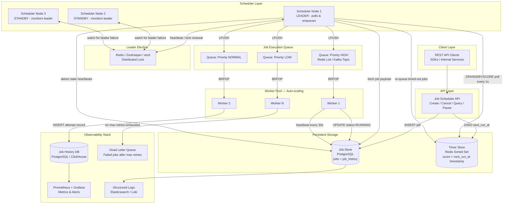
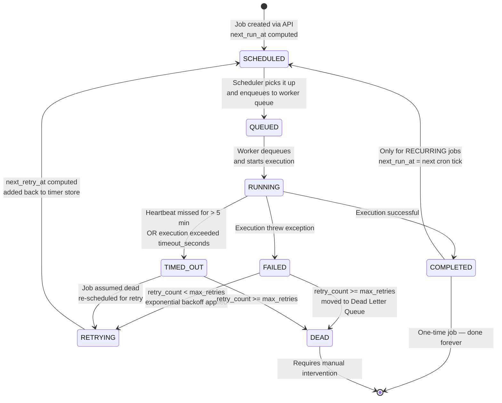
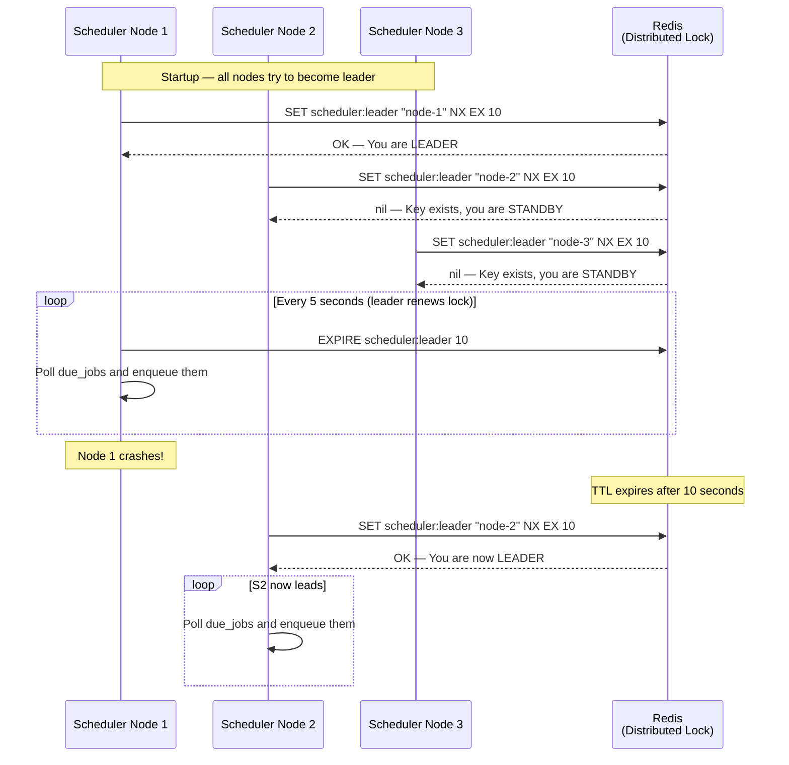
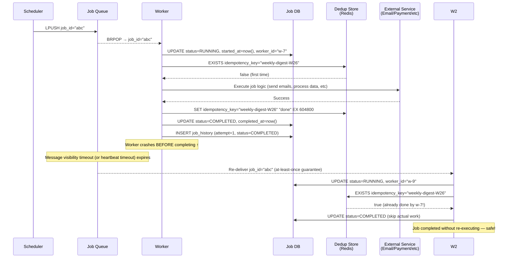
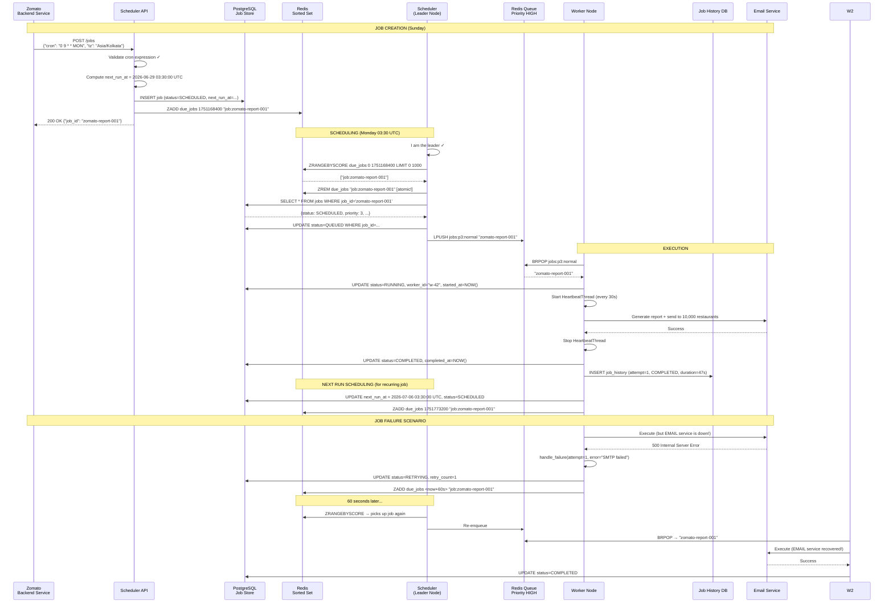
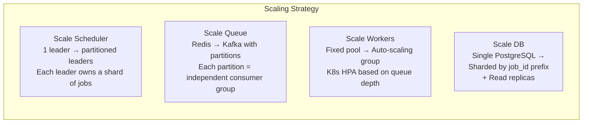

# Case Study: Design a Job Scheduler (Like Cron at Scale)

> **Difficulty:** Hard | **Category:** Distributed Systems | **Asked at:** Uber, Airbnb, LinkedIn, Netflix, Stripe, Google, Meta

---

## The Big Picture — Why Does This Even Exist?

Imagine you run a post office. Every morning at 9 AM, a van leaves to deliver mail. Every Friday at 5 PM, accounts are tallied. These tasks happen on a schedule — nobody manually triggers them. That is what a **job scheduler** does for software systems.

Now imagine instead of one post office, you have 500 branches across the country. And instead of one van, you have thousands of delivery tasks — send weekly reports, charge subscriptions, clean up old data, send push notifications, generate invoices. The challenge is not "can we do this?" but "how do we coordinate ALL of this without chaos?"

That is the problem of a **distributed job scheduler at scale**.

**Yeh kyun important hai (why this matters in real life):**

- **Netflix** schedules millions of encoding jobs every day. When you upload a video, it gets sliced, transcoded at 10 different quality levels, distributed to CDN — all as scheduled background jobs.
- **Swiggy** runs daily reconciliation jobs that calculate how much each restaurant partner earned. Miss one, and payments go wrong.
- **Zomato** sends "your order is ready" push notifications on a schedule after estimated cooking time. That timing logic is a job.
- **YouTube** runs thumbnail generation, chapter detection, and copyright scanning as background jobs after every upload.
- **Uber** generates weekly earnings summaries for drivers, sends surge pricing alerts, processes insurance claims — all scheduled.

The naive solution? Put a cron job on one server. But that server can crash. And one server cannot handle millions of jobs. So we need something smarter.

---

## Requirements

### Functional Requirements (What It Must Do)

1. **Schedule one-time jobs** — "Run this task at 3 PM on December 25th"
2. **Schedule recurring jobs** — "Run this task every Monday at 9 AM" using a cron expression like `0 9 * * MON`
3. **At-least-once execution** — every job must run at least once, no matter what
4. **No duplicate execution** — the same job instance should not run twice simultaneously
5. **Failure handling with retry** — if a job fails, retry it with a delay
6. **Monitor job status** — know whether a job is scheduled, running, done, or failed
7. **Support millions of jobs** — the system must scale to millions of scheduled tasks
8. **Long-running job tracking** — know when a job is taking too long or if its worker died

### Non-Functional Requirements (How Well It Must Do It)

- **High availability** — no single point of failure; if one scheduler node dies, another takes over
- **Durability** — jobs are never silently lost, even during crashes
- **Low latency trigger** — jobs should fire within a few seconds of their scheduled time
- **Scalability** — handle hundreds of thousands of job executions per second
- **Observability** — full history of every job attempt, with errors and timings

### Out of Scope

- Complex workflow DAGs with dependencies (that is Apache Airflow territory)
- Real-time event streaming (that is Kafka territory)
- Sub-millisecond precision scheduling

---

## Capacity Estimation

Let us size the system before designing it. This is an important step in any system design interview — it shows you understand the scale you are building for.

| Metric | Estimate | Reasoning |
|---|---|---|
| Total scheduled jobs | 100 million | Large enterprise scale |
| New jobs created per second | 10,000 | Burst of user-triggered + system jobs |
| Jobs triggered per second | 50,000 | Peak execution rate |
| Average job payload size | 1 KB | Small metadata, not actual data |
| Job history retention | 30 days | Audit and debugging |
| Storage for job definitions | ~100 GB | 100M jobs × 1 KB |
| Storage for history (30 days) | ~500 GB | Each job may have multiple attempts |
| Redis sorted set size | ~800 MB | 100M items × ~8 bytes score + job ID |

**Key insight:** At 50,000 executions per second, a single server cannot poll a DB frequently enough. This tells us immediately that we need the scheduler layer to be distributed and the polling mechanism to be smart.

---

## Understanding Cron Expressions First

Before we dive into the architecture, let us understand the language of scheduling: the cron expression.

**Analogy:** Think of a cron expression like a recipe for "when to ring the alarm." It is a five-field string where each field represents a unit of time.

```
┌──────── minute (0–59)
│ ┌────── hour (0–23)
│ │ ┌──── day of month (1–31)
│ │ │ ┌── month (1–12)
│ │ │ │ ┌ day of week (0–7, where 0 and 7 = Sunday)
│ │ │ │ │
* * * * *

Examples:
0 9 * * MON     → Every Monday at 9:00 AM
0 */6 * * *     → Every 6 hours
30 23 31 12 *   → Dec 31 at 11:30 PM
0 0 1 * *       → First day of every month at midnight
*/5 * * * *     → Every 5 minutes
```

The `*` means "any value." Once you understand cron expressions, the next question is: **given a cron expression and the current time, when does the job run next?** This is computed by libraries — never write your own cron parser.

```python
# Python: using croniter library
from croniter import croniter
from datetime import datetime, timezone

def get_next_run(cron_expr: str, from_time: datetime = None) -> datetime:
    base = from_time or datetime.now(timezone.utc)
    cron = croniter(cron_expr, base)
    return cron.get_next(datetime)

# Usage
next_run = get_next_run("0 9 * * MON")
# Returns: next Monday at 09:00 UTC
```

---

## The Core Problem: Which Server Picks Up Which Job?

This is the heart of the design challenge. Let me explain the naive approach first, then show why it breaks.

### The Naive Approach: Each Server Has Its Own Cron

**Analogy:** Imagine a shared shopping list on the fridge. If everyone in the house reads it and buys independently without marking items as "being bought," you end up with 3 bottles of milk and no bread.

If you run the same cron daemon on 5 servers, and each server independently decides "oh, it is Monday 9 AM, time to send the weekly report" — that report gets sent 5 times. Users get 5 identical emails. This is the **duplicate execution problem**.

```
Server A — 09:00:00 — "Time to send weekly report!" → Sends email
Server B — 09:00:00 — "Time to send weekly report!" → Sends email  ← DUPLICATE!
Server C — 09:00:00 — "Time to send weekly report!" → Sends email  ← DUPLICATE!
```

### The Right Approach: Centralized Scheduler + Queue + Workers

The solution is to separate three distinct responsibilities:

1. **Deciding WHEN to run** (Scheduler) — one dedicated component checks which jobs are due
2. **Coordinating WHO runs it** (Queue) — a job queue ensures only one worker picks up each job
3. **Actually RUNNING it** (Workers) — a pool of workers execute jobs and report results

```
[Scheduler] → "Job X is due" → [Queue] → [Worker A picks it up, Worker B cannot]
```

This is the foundation of every production job scheduling system.

---

## Full Architecture Diagram



---

## Job Lifecycle: Status State Machine

**Analogy:** Think of a job like an online food order from Swiggy. It starts as "placed," goes to "restaurant accepted," then "being prepared," then "out for delivery," then "delivered" — or "cancelled" if something goes wrong. Each status tells you exactly where in the pipeline your order (job) is.



**The transitions in plain English:**

1. You create a job via API → status: `SCHEDULED`, `next_run_at` is set
2. Scheduler sees `next_run_at <= now()` → status: `QUEUED`, pushed to execution queue
3. A worker picks it from queue → status: `RUNNING`, `started_at` is recorded
4. Job completes → status: `COMPLETED`, history written
5. Job fails → if retries remain → status: `RETRYING` → back to `SCHEDULED` with backoff
6. Job fails → no retries left → status: `DEAD`, moved to DLQ
7. For recurring jobs after completion → `next_run_at` computed → back to `SCHEDULED`

---

## Key Design Decision 1: The Job Store Schema

**Analogy:** The job store is like a reservation book at a restaurant. It has every booking: who reserved, how many people, when, and any special notes. The host (scheduler) checks this book to know who needs a table and when.

```sql
-- Main jobs table
CREATE TABLE jobs (
    job_id           UUID PRIMARY KEY DEFAULT gen_random_uuid(),
    name             VARCHAR(255) NOT NULL,
    description      TEXT,
    
    -- Schedule definition
    job_type         VARCHAR(20) NOT NULL CHECK (job_type IN ('ONE_TIME', 'RECURRING')),
    cron_expression  VARCHAR(100),                    -- null for ONE_TIME jobs
    next_run_at      TIMESTAMPTZ NOT NULL,            -- computed next execution time (always UTC)
    timezone         VARCHAR(100) DEFAULT 'UTC',      -- user's configured timezone
    
    -- Current state
    status           VARCHAR(20) NOT NULL DEFAULT 'SCHEDULED'
                     CHECK (status IN ('SCHEDULED','QUEUED','RUNNING','COMPLETED',
                                       'FAILED','RETRYING','TIMED_OUT','DEAD','PAUSED')),
    
    -- Execution details
    payload          JSONB NOT NULL,                  -- arguments for the job
    handler_name     VARCHAR(255) NOT NULL,           -- which handler/function to call
    timeout_seconds  INT NOT NULL DEFAULT 300,        -- give up if running > this long
    priority         SMALLINT NOT NULL DEFAULT 5,     -- 1=highest, 10=lowest
    
    -- Retry configuration
    retry_policy     JSONB NOT NULL DEFAULT '{
        "max_retries": 3,
        "backoff_strategy": "EXPONENTIAL",
        "initial_delay_seconds": 60,
        "max_delay_seconds": 3600
    }',
    retry_count      INT NOT NULL DEFAULT 0,          -- how many retries so far
    
    -- Execution tracking
    last_heartbeat   TIMESTAMPTZ,                     -- updated by worker every 30s
    started_at       TIMESTAMPTZ,
    completed_at     TIMESTAMPTZ,
    
    -- Deduplication
    idempotency_key  VARCHAR(255) UNIQUE,             -- prevents duplicate job creation
    
    -- Metadata
    owner_id         VARCHAR(100),                    -- which service/team owns this job
    tags             TEXT[],
    created_at       TIMESTAMPTZ NOT NULL DEFAULT now(),
    updated_at       TIMESTAMPTZ NOT NULL DEFAULT now()
);

-- Critical index: scheduler queries this constantly
CREATE INDEX idx_jobs_due ON jobs (next_run_at ASC) 
    WHERE status = 'SCHEDULED';

-- For heartbeat monitoring
CREATE INDEX idx_jobs_running ON jobs (last_heartbeat) 
    WHERE status = 'RUNNING';

-- For status queries (admin dashboard)
CREATE INDEX idx_jobs_status ON jobs (status, owner_id);
```

```sql
-- Job execution history (immutable audit log)
CREATE TABLE job_history (
    history_id      UUID PRIMARY KEY DEFAULT gen_random_uuid(),
    job_id          UUID NOT NULL REFERENCES jobs(job_id),
    attempt_number  INT NOT NULL DEFAULT 1,
    status          VARCHAR(20) NOT NULL,
    worker_id       VARCHAR(100),                    -- which worker ran this
    started_at      TIMESTAMPTZ NOT NULL,
    finished_at     TIMESTAMPTZ,
    duration_ms     INT,
    output          JSONB,
    error_message   TEXT,
    error_stack     TEXT,
    created_at      TIMESTAMPTZ NOT NULL DEFAULT now()
);

CREATE INDEX idx_history_job_id ON job_history (job_id, started_at DESC);
CREATE INDEX idx_history_status  ON job_history (status, started_at DESC);
```

**Job definition in JSON (what the API accepts):**

```json
{
  "name": "Send Weekly Digest Email",
  "job_type": "RECURRING",
  "cron_expression": "0 9 * * MON",
  "timezone": "Asia/Kolkata",
  "handler_name": "email.send_weekly_digest",
  "payload": {
    "template_id": "weekly-digest-v3",
    "segment": "active_users"
  },
  "retry_policy": {
    "max_retries": 3,
    "backoff_strategy": "EXPONENTIAL",
    "initial_delay_seconds": 60,
    "max_delay_seconds": 3600
  },
  "timeout_seconds": 600,
  "priority": 3,
  "idempotency_key": "weekly-digest-2026-W26"
}
```

---

## Key Design Decision 2: The Timer Store — Redis Sorted Set

**Analogy:** Imagine a countdown board at a bus station. Every destination has a departure time. The board is sorted by departure time. Every minute, the station master checks the board and announces departures. The board is the **Redis Sorted Set**. The station master is the **Scheduler**.

Redis Sorted Sets (ZSETs) are perfect for a job timer because:
- **Score** = Unix timestamp of `next_run_at` (a float)
- **Member** = `job_id` (string)
- `ZRANGEBYSCORE` fetches all jobs due in a time window in O(log N + M) time
- `ZREM` atomically removes a job so only one scheduler claims it

```
ZADD due_jobs 1751000400 "job:abc-123"   ← "run at Unix time 1751000400"
ZADD due_jobs 1751003600 "job:def-456"
ZADD due_jobs 1751007200 "job:ghi-789"

ZRANGEBYSCORE due_jobs 0 <now>           ← "which jobs are due?"
ZREM due_jobs "job:abc-123"              ← "I am claiming this one — atomically!"
```

**Why not just poll the database?** You can, but:
- DB polling with `WHERE next_run_at <= NOW()` creates massive read pressure at scale
- Redis handles 100,000+ operations per second; a PostgreSQL `SELECT` with locks is far slower
- Redis ZSET gives you nanosecond-precision timing; DB polling is as slow as your poll interval

**The Lua script for atomic fetch-and-remove** (prevents race conditions):

```lua
-- Atomic: get all due jobs AND remove them from the sorted set in one operation
-- This ensures no two schedulers can both pick up the same job

local now = ARGV[1]
local limit = ARGV[2]

-- Get jobs due now
local due = redis.call('ZRANGEBYSCORE', KEYS[1], '-inf', now, 'LIMIT', 0, limit)

if #due == 0 then
    return {}
end

-- Remove them atomically so no other scheduler can pick them up
redis.call('ZREM', KEYS[1], unpack(due))

return due
```

```python
# Python usage
POLL_SCRIPT = """...(lua above)..."""

def poll_and_claim_due_jobs(batch_size: int = 1000) -> list[str]:
    now = str(time.time())
    job_ids = redis.eval(POLL_SCRIPT, 1, "due_jobs", now, batch_size)
    return [jid.decode() for jid in job_ids]
```

---

## Key Design Decision 3: Leader Election — Only ONE Scheduler Runs

This is the most critical correctness guarantee in the entire system. Without it, you get chaos.

**Analogy:** Think of traffic lights at a busy intersection. If two systems are independently controlling the lights — one thinks it is green for north-south, another thinks green for east-west — cars crash. You need EXACTLY ONE traffic controller at all times.

If you run 3 scheduler nodes and all 3 poll for due jobs simultaneously, you get triple execution of every job. Leader election ensures only one scheduler is active ("the leader"). The other nodes are hot standbys, ready to take over instantly if the leader crashes.



**Implementation in Python:**

```python
import redis
import uuid
import time
import threading

class SchedulerLeader:
    def __init__(self, redis_client, lock_key="scheduler:leader", ttl=10):
        self.redis = redis_client
        self.lock_key = lock_key
        self.ttl = ttl
        self.node_id = str(uuid.uuid4())
        self.is_leader = False
        
    def try_acquire_leadership(self) -> bool:
        """
        SET NX EX is atomic — if the key does not exist, create it and return OK.
        If it already exists (another node is leader), return nil.
        """
        result = self.redis.set(
            self.lock_key, 
            self.node_id, 
            nx=True,    # Only set if NOT exists
            ex=self.ttl # Auto-expire after ttl seconds (safety net if we crash)
        )
        return result is True
    
    def renew_leadership(self) -> bool:
        """
        Only renew if WE are still the leader (our node_id matches).
        Using Lua for atomicity — check and renew in one operation.
        """
        lua_script = """
        if redis.call('GET', KEYS[1]) == ARGV[1] then
            return redis.call('EXPIRE', KEYS[1], ARGV[2])
        else
            return 0
        end
        """
        result = self.redis.eval(lua_script, 1, self.lock_key, self.node_id, self.ttl)
        return result == 1
    
    def run_leader_loop(self):
        while True:
            if self.is_leader:
                if self.renew_leadership():
                    poll_and_enqueue_due_jobs()  # Only the leader does real work
                else:
                    self.is_leader = False  # Lost leadership — become standby
                    print(f"[{self.node_id}] Lost leadership!")
            else:
                if self.try_acquire_leadership():
                    self.is_leader = True
                    print(f"[{self.node_id}] Acquired leadership!")
            
            time.sleep(1)  # Check every second
```

**Interview tip:** The interviewer might ask "what if Redis itself crashes?" Good answer: use **Redis Sentinel** or **Redis Cluster** for HA. For even stronger guarantees, use **Redlock** (locks on multiple Redis nodes) or replace Redis with **etcd** or **ZooKeeper**, which provide consensus-based distributed locking with stronger consistency guarantees.

| Tool | Consistency | Complexity | When to Use |
|---|---|---|---|
| Redis `SET NX EX` | Eventual (single node) | Low | Most use cases |
| Redis Redlock | Stronger | Medium | Multi-region, critical jobs |
| etcd | Strong (Raft) | High | When you cannot afford any duplicate |
| ZooKeeper | Strong (ZAB) | High | Legacy Java systems (Kafka uses this) |

---

## Key Design Decision 4: Polling Strategy and Time Buckets

**Analogy:** How does a librarian find overdue books? She could check every book every second (bad — too many books). Or she could sort books by due date and only check the ones due today (smart). That sorted approach is what we do with Redis ZSET.

**Basic polling (works up to ~10K jobs/sec):**

```python
def scheduler_main_loop():
    while True:
        if not is_leader():
            time.sleep(1)
            continue
        
        # Fetch all jobs due in the next second (with a small buffer)
        now = time.time() + 0.1  # 100ms buffer for clock skew
        due_job_ids = poll_and_claim_due_jobs(now, batch_size=1000)
        
        for job_id in due_job_ids:
            job = db.get_job(job_id)
            if job is None:
                continue  # Job was deleted
            
            # Update status in DB
            db.update_job(job_id, status='QUEUED')
            
            # Push to priority queue
            queue_name = f"jobs:p{job['priority']}"
            redis.lpush(queue_name, job_id)
        
        time.sleep(1)  # Poll every second
```

**At massive scale — time bucket partitioning:**

When you have 100 million jobs, even polling Redis efficiently can be a bottleneck. The solution is to partition the timer store by time buckets.

**Analogy:** Instead of one massive diary with all appointments, you have 60 smaller folders — one for each minute of the hour. You only open the folder for "this minute," not all 60 folders.

```python
# Instead of one "due_jobs" sorted set, use time-bucketed sets
def get_bucket_key(timestamp: float) -> str:
    """Each minute gets its own Redis key."""
    minute = int(timestamp // 60) * 60  # Round down to minute boundary
    return f"due_jobs:{minute}"

def add_job_to_timer(job_id: str, next_run_at: float):
    bucket_key = get_bucket_key(next_run_at)
    redis.zadd(bucket_key, {job_id: next_run_at})
    redis.expire(bucket_key, 3600)  # Clean up after 1 hour

def poll_current_minute():
    """Only look at THIS minute's bucket — much faster."""
    current_minute = int(time.time() // 60) * 60
    bucket_key = f"due_jobs:{current_minute}"
    now = time.time()
    
    return redis.zrangebyscore(bucket_key, 0, now)
```

**Comparison of polling approaches:**

| Approach | Pros | Cons | Best For |
|---|---|---|---|
| DB polling (SELECT WHERE next_run_at <= NOW) | Simple, no extra infra | Heavy DB load, slow at scale | < 1K jobs/sec |
| Redis ZSET (single key) | Fast, low latency | Single key is a hotspot at extreme scale | Up to ~50K jobs/sec |
| Redis ZSET (time-bucketed) | Distributes load, very fast | Slightly more complex | > 50K jobs/sec |
| Kafka + delay topic | Massive throughput, durable | Complex, less precise timing | When Kafka already in stack |

---

## Key Design Decision 5: At-Least-Once Execution and Deduplication

This is the fundamental execution guarantee we provide.

**Analogy:** Think of registered postal mail with a signature requirement. India Post guarantees your package will be delivered — they will try again if nobody answers. But they do not guarantee it will be delivered exactly once. On rare occasions, a mix-up means the package is attempted twice. Your job (pun intended) is to design the handler so receiving the package twice causes no problems — maybe the second delivery just gets turned away.

**Why at-least-once and not exactly-once?**

Exactly-once delivery in a distributed system requires **two-phase commit** or **Saga patterns** — complex, slow, and painful to implement correctly. At-least-once is simpler and performs better. The trade-off: you must make your job handlers **idempotent** (safe to run multiple times).

**The full execution flow with deduplication:**



**Key insight:** The dedup check uses the `idempotency_key`. If the key exists in Redis, we know the job already ran successfully. We mark it complete without doing the work again.

**Rules for good idempotency keys:**
1. Must be **stable** — same job, same key, every time
2. Must be **deterministic** — computed from job definition, not random
3. Must have an appropriate **TTL** — longer than your max retry window

```python
# Good idempotency keys
"weekly-digest-2026-W26"                    # For weekly cron jobs
"invoice-send-inv-456-2026-06-27"           # For one-time sends
"stripe-charge-user-789-amount-999-month-6" # For payment jobs

# Bad idempotency keys  
str(uuid.uuid4())       # Random — different each run, defeats the purpose!
str(time.time())        # Time-based — can collide or differ across retries
```

---

## Key Design Decision 6: Worker Pool and Job Execution

**Analogy:** Workers are like chefs in a restaurant kitchen. The queue (Redis/Kafka) is the order ticket rail. Each chef takes one ticket, cooks the dish, marks it done, and only then takes the next ticket. If a chef goes home mid-cooking (server crash), the ticket goes back to the rail.

```python
import threading
import time
from datetime import datetime, timezone

class JobWorker(threading.Thread):
    def __init__(self, worker_id: str, redis_client, db):
        super().__init__(daemon=True)
        self.worker_id = worker_id
        self.redis = redis_client
        self.db = db
        
    def run(self):
        print(f"[{self.worker_id}] Worker started")
        PRIORITY_QUEUES = [
            "jobs:p1:critical",
            "jobs:p2:high", 
            "jobs:p3:normal",
            "jobs:p4:low"
        ]
        
        while True:
            # BRPOP: blocking pop — waits up to 5s for a job
            # Checks high priority queues first (left to right)
            result = self.redis.brpop(PRIORITY_QUEUES, timeout=5)
            
            if result is None:
                continue  # No job available, try again
            
            _, job_id = result
            job_id = job_id.decode()
            self.execute_job(job_id)
    
    def execute_job(self, job_id: str):
        # Fetch full job definition from DB
        job = self.db.get_job(job_id)
        if job is None:
            return  # Job was deleted/cancelled
        
        # Check if already completed (idempotency guard)
        if job['status'] == 'COMPLETED':
            print(f"[{self.worker_id}] Job {job_id} already completed, skipping")
            return
        
        # Mark as RUNNING
        self.db.update_job(job_id, {
            'status': 'RUNNING',
            'started_at': datetime.now(timezone.utc),
            'worker_id': self.worker_id
        })
        self.db.insert_history(job_id, attempt=job['retry_count'] + 1, 
                               status='RUNNING', worker_id=self.worker_id)
        
        # Start heartbeat thread
        heartbeat = HeartbeatThread(job_id, self.db, interval=30)
        heartbeat.start()
        
        try:
            # Look up the handler function by name
            handler = get_handler(job['handler_name'])
            
            # Execute with timeout
            result = execute_with_timeout(
                handler, 
                job['payload'], 
                timeout=job['timeout_seconds']
            )
            
            heartbeat.stop()
            
            # Record success
            self.db.update_job(job_id, {
                'status': 'COMPLETED',
                'completed_at': datetime.now(timezone.utc)
            })
            self.db.update_history(job_id, status='COMPLETED', output=result)
            
            # For recurring jobs: schedule next run
            if job['job_type'] == 'RECURRING':
                self.schedule_next_run(job)
        
        except TimeoutError:
            heartbeat.stop()
            self.handle_failure(job, "Job exceeded timeout", is_timeout=True)
        
        except Exception as e:
            heartbeat.stop()
            self.handle_failure(job, str(e))
    
    def handle_failure(self, job: dict, error: str, is_timeout: bool = False):
        job_id = job['job_id']
        retry_count = job['retry_count']
        max_retries = job['retry_policy']['max_retries']
        
        if retry_count < max_retries:
            # Calculate retry delay with exponential backoff
            delay_seconds = exponential_backoff(
                attempt=retry_count,
                initial=job['retry_policy']['initial_delay_seconds'],
                maximum=job['retry_policy']['max_delay_seconds']
            )
            next_retry_at = time.time() + delay_seconds
            
            self.db.update_job(job_id, {
                'status': 'RETRYING',
                'retry_count': retry_count + 1,
                'next_run_at': next_retry_at,
                'last_error': error
            })
            
            # Re-add to timer store for retry
            self.redis.zadd("due_jobs", {job_id: next_retry_at})
            
            print(f"[{self.worker_id}] Job {job_id} failed, retry {retry_count+1}"
                  f"/{max_retries} in {delay_seconds}s")
        else:
            # All retries exhausted → Dead Letter Queue
            self.db.update_job(job_id, {'status': 'DEAD'})
            self.redis.lpush("dead_letter_queue", job_id)
            print(f"[{self.worker_id}] Job {job_id} moved to DLQ after {max_retries} retries")
    
    def schedule_next_run(self, job: dict):
        """For recurring jobs, compute and schedule the next execution."""
        next_run = get_next_run(job['cron_expression'])
        self.db.update_job(job['job_id'], {
            'status': 'SCHEDULED',
            'next_run_at': next_run
        })
        self.redis.zadd("due_jobs", {job['job_id']: next_run.timestamp()})
```

---

## Key Design Decision 7: Retry Logic with Exponential Backoff

**Analogy:** Imagine you knock on a door and nobody answers. You do not stand there and knock every second (that would be annoying). Instead, you wait a bit, try again. If still no answer, you wait longer. This is exponential backoff — each retry waits twice as long as the previous one.

**Why exponential backoff?** When a job fails, it is often because a downstream service is overloaded. If you retry immediately, you just make the overload worse. Waiting longer gives the downstream service time to recover.

```python
def exponential_backoff(
    attempt: int,
    initial: int = 60,      # First retry: 60 seconds
    maximum: int = 3600,    # Never wait more than 1 hour
    jitter: bool = True     # Add randomness to prevent "thundering herd"
) -> int:
    """
    attempt=0 → 60s
    attempt=1 → 120s
    attempt=2 → 240s
    attempt=3 → 480s (but capped at 3600s)
    """
    delay = min(initial * (2 ** attempt), maximum)
    
    if jitter:
        # Add up to 10% random jitter to prevent all retries hitting at once
        import random
        jitter_amount = delay * 0.1
        delay += random.uniform(-jitter_amount, jitter_amount)
    
    return int(delay)
```

**Retry schedule for a job with `initial_delay=60, max_retries=4`:**

| Attempt | Wait Before Retry | Cumulative Wait |
|---|---|---|
| 1 (after first failure) | 60 seconds | 1 minute |
| 2 | 120 seconds | 3 minutes |
| 3 | 240 seconds | 7 minutes |
| 4 | 480 seconds | 15 minutes |
| → DLQ | — | Job declared dead |

**Jitter prevents the thundering herd problem:** Imagine 10,000 jobs all fail at the same time (say, a database goes down for 5 minutes). Without jitter, all 10,000 retry at exactly the same second 60 seconds later — creating another massive spike. With jitter, retries are spread over a window, smoothing out the load.

---

## Key Design Decision 8: Heartbeat — Detecting Crashed Workers

This is how we handle the "server crash mid-execution" problem.

**Analogy:** A mountaineer calls base camp every 30 minutes on a walkie-talkie. If base camp does not hear for 2 hours, they assume the climber is in trouble and send a rescue team. The rescue team (scheduler) re-queues the job (rescues the climber).

**The problem:** A worker picks up a job, marks it `RUNNING`, and then its server is killed by a cloud provider (spot instance termination, OOM killer, network partition). The job is stuck at `RUNNING` forever — no heartbeat, no update. Without intervention, the job never completes.

**The solution — two-part mechanism:**

**Part 1: Worker sends periodic heartbeats**

```python
class HeartbeatThread(threading.Thread):
    """Runs alongside the job. Updates last_heartbeat in DB every N seconds."""
    
    def __init__(self, job_id: str, db, interval: int = 30):
        super().__init__(daemon=True)
        self.job_id = job_id
        self.db = db
        self.interval = interval
        self._stop_event = threading.Event()
    
    def run(self):
        while not self._stop_event.is_set():
            try:
                self.db.execute(
                    "UPDATE jobs SET last_heartbeat = NOW(), updated_at = NOW() "
                    "WHERE job_id = %s AND status = 'RUNNING'",
                    [self.job_id]
                )
            except Exception as e:
                print(f"Heartbeat failed for {self.job_id}: {e}")
            
            # Wait for interval OR until stop() is called
            self._stop_event.wait(self.interval)
    
    def stop(self):
        self._stop_event.set()
```

**Part 2: Scheduler detects stale heartbeats (runs separately)**

```python
def detect_and_recover_dead_jobs():
    """
    Run this periodically (every minute).
    Find RUNNING jobs where the worker has gone silent.
    """
    HEARTBEAT_INTERVAL = 30       # Worker sends every 30s
    HEARTBEAT_TIMEOUT  = 5 * 60  # 5 minutes — 10 missed heartbeats = dead
    
    stale_cutoff = datetime.now(timezone.utc) - timedelta(seconds=HEARTBEAT_TIMEOUT)
    
    stale_jobs = db.query("""
        SELECT job_id, retry_count, retry_policy, started_at, timeout_seconds
        FROM jobs
        WHERE status = 'RUNNING'
          AND (last_heartbeat < %(cutoff)s OR last_heartbeat IS NULL)
    """, {"cutoff": stale_cutoff})
    
    for job in stale_jobs:
        running_duration = datetime.now(timezone.utc) - job['started_at']
        
        # Determine if this is a timeout or just a crashed worker
        if running_duration.seconds > job['timeout_seconds']:
            error = f"Job exceeded timeout of {job['timeout_seconds']}s"
            status = 'TIMED_OUT'
        else:
            error = "Worker heartbeat lost — assumed crashed"
            status = 'TIMED_OUT'
        
        print(f"[Scheduler] Detected dead job {job['job_id']}: {error}")
        
        # Re-queue for retry (or move to DLQ if max retries reached)
        handle_job_failure(job, error)
```

**The heartbeat timing triangle:**

```
Heartbeat interval: 30 seconds
Detection threshold: 5 minutes (10 missed heartbeats)
Max execution time: configured per job (timeout_seconds)

If last_heartbeat was > 5 minutes ago → job is presumed dead → re-queue
If job has been RUNNING > timeout_seconds → kill and retry
```

---

## Key Design Decision 9: Preventing Duplicate Execution at the Worker Level

Leader election prevents duplicate **scheduling**. But what about duplicate **execution**? Two workers could theoretically both pick up the same job from a queue.

**Scenario:** Job is in queue. Worker A picks it up. Queue has a "visibility timeout" (e.g., 30s in SQS). If Worker A does not ack within 30s, the queue re-delivers the job. Worker B picks it up. Now BOTH A and B are running the same job simultaneously.

**Solution: Optimistic locking using DB status check**

```python
def try_claim_job(job_id: str, worker_id: str) -> bool:
    """
    Only one worker can transition a job from QUEUED to RUNNING.
    Uses SQL's row-level optimistic locking.
    """
    rows_updated = db.execute("""
        UPDATE jobs 
        SET status = 'RUNNING', 
            worker_id = %(worker_id)s,
            started_at = NOW()
        WHERE job_id = %(job_id)s 
          AND status = 'QUEUED'    -- Only if still QUEUED (not already claimed!)
    """, {"job_id": job_id, "worker_id": worker_id})
    
    return rows_updated == 1  # True if we won the race, False if another worker claimed it

# In worker execute_job():
if not try_claim_job(job_id, self.worker_id):
    print(f"[{self.worker_id}] Job {job_id} already claimed by another worker")
    return  # Another worker got it first — safe to skip
```

The `WHERE status = 'QUEUED'` condition ensures that even if two workers race to claim a job, only one wins. The SQL UPDATE is atomic at the row level, so PostgreSQL serializes concurrent updates to the same row.

---

## Key Design Decision 10: Time Zone Handling

**Analogy:** Your boss says "send the report at 9 AM." But you are in Mumbai and your colleague is in London. 9 AM whose time? This is the timezone problem. Always store times in UTC, display in local time.

**The golden rule: Store UTC, display local.**

```python
from datetime import datetime, timezone
from zoneinfo import ZoneInfo  # Python 3.9+

def compute_next_run_utc(cron_expression: str, user_timezone: str) -> datetime:
    """
    Given a cron expression in the user's timezone,
    compute the next run time as UTC.
    
    Example: "0 9 * * MON" in "Asia/Kolkata" (IST = UTC+5:30)
    → Next Monday at 09:00 IST = Next Monday at 03:30 UTC
    """
    tz = ZoneInfo(user_timezone)
    now_local = datetime.now(tz)
    
    # Parse cron in local time
    cron = croniter(cron_expression, now_local)
    next_local = cron.get_next(datetime)
    
    # Convert to UTC for storage
    next_utc = next_local.astimezone(timezone.utc)
    return next_utc

# Example
next_run = compute_next_run_utc("0 9 * * MON", "Asia/Kolkata")
# Stored in DB as: 2026-06-29 03:30:00+00 (UTC)
# Displayed to user as: Monday, June 29 at 09:00 IST
```

**DST (Daylight Saving Time) gotcha:** Countries like the US shift clocks twice a year. A job scheduled for "9 AM EST" might fire at a different UTC time in summer (EDT) vs winter (EST). Using `ZoneInfo` (not UTC offsets) handles this automatically because it knows about DST rules.

```python
# WRONG — hardcoded offset, breaks during DST
tz = timezone(timedelta(hours=-5))  # This is always UTC-5, never adjusts for DST

# RIGHT — named timezone, handles DST automatically
tz = ZoneInfo("America/New_York")   # UTC-5 in winter, UTC-4 in summer
```

---

## Key Design Decision 11: Job History and Monitoring

**Analogy:** Every airplane has a black box that records everything — speed, altitude, control inputs. If something goes wrong, investigators can reconstruct exactly what happened. Job history is your system's black box.

Every job attempt writes an immutable record to `job_history`. This enables:
- Debugging failures from days ago
- Audit trails for compliance (payment jobs especially)
- SLA reporting ("what percentage of jobs ran within 5s of schedule?")
- Identifying patterns in failures ("this job always fails on Monday mornings")

**Key metrics to monitor with Prometheus + Grafana:**

| Metric | Alert Threshold | Why It Matters |
|---|---|---|
| `scheduler_queue_depth` (per priority) | > 10,000 | Workers falling behind |
| `job_trigger_latency_p99` | > 30 seconds | Scheduler or queue is slow |
| `job_failure_rate` | > 5% over 5 min | Something is systematically broken |
| `job_timeout_rate` | > 2% | Jobs taking too long; check dependencies |
| `dead_letter_queue_depth` | > 100 | Jobs silently dying; human review needed |
| `leader_election_flaps` | > 3 per hour | Network instability between scheduler nodes |
| `worker_pool_utilization` | > 90% | Need to scale out workers |
| `heartbeat_timeout_events` | > 50/hour | Workers are crashing or being terminated |
| `redis_sorted_set_size` | > 200M | Timer store getting large; check for leaks |

**Dashboard design — what the on-call engineer sees:**

```
┌─────────────────────────────────────────────────────────────┐
│  JOB SCHEDULER — OPERATIONS DASHBOARD                        │
├──────────────┬──────────────┬──────────────┬───────────────┤
│ QUEUE DEPTH  │ JOBS/SEC     │ FAILURE RATE │ DLQ DEPTH     │
│    1,247     │   48,392     │    0.3%      │      12       │
│   ▼ Normal   │   ▼ Normal   │  ▼ Normal    │   ▼ Normal    │
├──────────────┴──────────────┴──────────────┴───────────────┤
│ SCHEDULER LEADER: node-7 (healthy, last renewed 3s ago)     │
│ WORKER COUNT: 42 active / 50 total                           │
├─────────────────────────────────────────────────────────────┤
│ RECENT FAILURES (last 5 minutes)                            │
│ • report-gen-456: TimeoutError after 601s                   │
│ • email-send-789: SMTP connection refused (retry 1/3 in 60s)│
└─────────────────────────────────────────────────────────────┘
```

---

## End-to-End Flow: The Complete Story

Let us trace through a real-world scenario: Zomato schedules a "Weekly Restaurant Performance Report" for every Monday at 9 AM IST.



---

## Handling the Hard Cases

### What if the Scheduler Itself Crashes Mid-Cycle?

**Scenario:** Scheduler polls Redis, gets 500 jobs, starts pushing them to queues — and crashes after pushing 200.

**The 300 missing jobs are still in Redis ZSET (we already removed them with ZREM)... wait, no!**

Actually, this is tricky. We used a Lua script that atomically removes them from the ZSET. If we remove them but crash before pushing to queue — they are lost!

**Solution: Use a two-phase approach with a "claimed" ZSET:**

```python
# Phase 1: Move from due_jobs to claimed_jobs (not fully removed)
redis.eval("""
local jobs = redis.call('ZRANGEBYSCORE', KEYS[1], '-inf', ARGV[1], 'LIMIT', 0, ARGV[2])
if #jobs == 0 then return {} end
-- Move to claimed set with same scores
for i, job in ipairs(jobs) do
    redis.call('ZREM', KEYS[1], job)
    redis.call('ZADD', KEYS[2], ARGV[1]+3600, job)  -- claimed, expire in 1hr
end
return jobs
""", 2, "due_jobs", "claimed_jobs", now, batch_size)

# Phase 2: Push to queue, then remove from claimed
for job_id in claimed_jobs:
    redis.lpush(queue, job_id)
    redis.zrem("claimed_jobs", job_id)  # Only remove after queue push succeeds
```

If the scheduler crashes between Phase 1 and Phase 2, the `claimed_jobs` ZSET acts as a recovery mechanism. A watchdog or the new leader can find jobs stuck in `claimed_jobs` and re-enqueue them.

### What if Redis Goes Down?

Redis is a critical component — the timer store lives there. Mitigation strategies:

1. **Redis Replication** — Primary + replica. If primary dies, replica promoted (Redis Sentinel)
2. **Redis Cluster** — Data sharded across multiple nodes; survives node failures
3. **Persistent AOF mode** — `appendonly yes` in Redis config — every write is fsynced to disk
4. **Fallback to DB polling** — If Redis is down, fall back to polling PostgreSQL directly (slower but functional)

### What if the DB is Slow?

The scheduler polls the DB for job definitions and the heartbeat detector runs queries. Solutions:

1. **Index on `(next_run_at, status)`** — already in our schema
2. **Read replica** — scheduler reads from replica, writes go to primary
3. **Caching** — cache job definitions in Redis (invalidate on update)
4. **Batch updates** — collect heartbeat updates and flush in batches, not one-by-one

---

## Real-World Tools Comparison

These are the actual systems used in production today. Understanding the trade-offs shows deep knowledge.

| Tool | Language | Trigger Mechanism | Best For | Used By |
|---|---|---|---|---|
| **Quartz Scheduler** | Java | In-memory timer + JDBC job store | Java enterprise apps, Spring | Banks, insurance companies |
| **Celery Beat** | Python | DB polling + Redis/RabbitMQ queue | Python microservices, Django apps | Instagram, Mozilla, Robinhood |
| **Temporal.io** | Go/Java/Python | Event-sourced durable workflows | Complex multi-step workflows, saga patterns | Stripe, Snap, Netflix |
| **AWS EventBridge Scheduler** | Managed/Any | AWS-native, cron + rate expressions | AWS-heavy shops, serverless | Any AWS shop |
| **Google Cloud Scheduler** | Managed/Any | HTTP targets + Pub/Sub | GCP-native workloads | GCP shops |
| **Sidekiq** | Ruby | Redis sorted set | Ruby on Rails background jobs | Shopify, GitHub |
| **BullMQ** | Node.js | Redis sorted set | Node.js services | Atlassian, Trello |
| **Apache Airflow** | Python | DAG-based, DB polling | Data pipeline workflows | Airbnb, LinkedIn, Twitter |

**Deep-dive: Temporal.io** (worth knowing for senior roles)

Temporal is not just a job scheduler — it is a **durable workflow engine**. The key concept: your code (the workflow) is automatically persisted. If the worker crashes mid-execution, when a new worker picks it up, it **replays the history** and resumes from exactly where it left off.

```python
# Temporal workflow — survives crashes automatically
@workflow.defn
class WeeklyReportWorkflow:
    @workflow.run
    async def run(self, params: ReportParams) -> str:
        # Each activity is durable — if worker crashes here, 
        # Temporal replays up to this point automatically
        data = await workflow.execute_activity(
            fetch_restaurant_data, params, start_to_close_timeout=timedelta(minutes=10)
        )
        report = await workflow.execute_activity(
            generate_report, data, start_to_close_timeout=timedelta(minutes=5)
        )
        await workflow.execute_activity(
            send_emails, report, start_to_close_timeout=timedelta(minutes=30)
        )
        return "done"
```

---

## Scalability Deep-Dive: From 1K to 1M Jobs/Second

How do we scale each component?



**Partitioned scheduling (for > 1M jobs/sec):**

Instead of one leader polling all jobs, partition jobs by a hash of their `job_id`. Each partition has its own leader.

```python
NUM_PARTITIONS = 10

def get_partition(job_id: str) -> int:
    """Consistent hash to assign each job to a partition."""
    return hash(job_id) % NUM_PARTITIONS

# Each scheduler node claims ONE partition
# ZADD due_jobs:partition:3 <timestamp> <job_id>
# Scheduler for partition 3 polls due_jobs:partition:3

def get_partition_leader_key(partition: int) -> str:
    return f"scheduler:leader:partition:{partition}"
```

This allows you to run 10 parallel schedulers, each handling 1/10th of the load, with independent leader election per partition.

---

## Priority Queues and Starvation Prevention

**Analogy:** An emergency room sees patients in order of severity. A person with chest pain (critical) gets seen before someone with a cold (low priority). But what if the cold patient has been waiting for 12 hours? At some point, even the cold patient should be seen. This is **aging**.

```python
# Priority levels
PRIORITY_QUEUES = {
    1: "jobs:p1:critical",   # SLA: run within 1s
    2: "jobs:p2:high",       # SLA: run within 5s
    3: "jobs:p3:normal",     # SLA: run within 30s
    4: "jobs:p4:low",        # SLA: run within 5 minutes
}

# Worker pulls from highest available priority first
def worker_fetch_job() -> str | None:
    ordered_queues = [PRIORITY_QUEUES[p] for p in sorted(PRIORITY_QUEUES.keys())]
    result = redis.brpop(ordered_queues, timeout=5)
    if result:
        _, job_id = result
        return job_id.decode()
    return None

# Aging job — runs every minute, boosts priority of waiting jobs
def apply_aging_boost():
    waiting_too_long = db.query("""
        SELECT job_id, priority
        FROM jobs
        WHERE status = 'QUEUED'
          AND priority > 1                              -- Not already critical
          AND queued_at < NOW() - INTERVAL '30 minutes' -- Waiting > 30 min
    """)
    
    for job in waiting_too_long:
        new_priority = max(1, job['priority'] - 1)  # Boost (lower number = higher priority)
        db.update_job(job['job_id'], {'priority': new_priority})
        
        # Move to higher priority queue in Redis
        old_queue = PRIORITY_QUEUES[job['priority']]
        new_queue = PRIORITY_QUEUES[new_priority]
        redis.lmove(old_queue, new_queue, 'RIGHT', 'LEFT')
```

---

## Dead Letter Queue (DLQ) — The Safety Net

**Analogy:** A post office has a "undeliverable mail" bin. Letters that cannot be delivered (wrong address, damaged, no one home after 3 attempts) go there. A supervisor reviews them periodically and decides what to do.

The DLQ is for jobs that have exhausted all retries. They must not be silently discarded — they need human review.

**DLQ management:**

```python
def process_dlq():
    """Admin endpoint to review and retry DLQ jobs."""
    dlq_job_ids = redis.lrange("dead_letter_queue", 0, 99)  # Get first 100
    
    jobs = db.query("""
        SELECT job_id, name, error_message, retry_count, created_at
        FROM jobs
        WHERE job_id = ANY(%s) AND status = 'DEAD'
        ORDER BY created_at DESC
    """, [dlq_job_ids])
    
    return jobs  # Show to admin for review

def retry_dlq_job(job_id: str):
    """Admin manually retries a dead job."""
    db.update_job(job_id, {
        'status': 'SCHEDULED',
        'retry_count': 0,              # Reset retry count
        'next_run_at': datetime.now(timezone.utc) + timedelta(seconds=10)
    })
    redis.zadd("due_jobs", {job_id: (datetime.now().timestamp() + 10)})
    redis.lrem("dead_letter_queue", 0, job_id)  # Remove from DLQ
```

**Alert rule:** If DLQ depth exceeds 100, page on-call immediately. Jobs in the DLQ are guaranteed failures — they represent real business errors (emails not sent, invoices not generated, reports missing).

---

## Security and Access Control

Often overlooked in system design interviews but important in real systems:

```python
# Each job is owned by a service/team
# Workers only execute handlers registered for that service

ALLOWED_HANDLERS = {
    "zomato-reports": [
        "report.generate_restaurant_weekly",
        "report.generate_city_monthly"
    ],
    "payment-service": [
        "payment.charge_subscription",
        "payment.process_refund"
    ]
}

def execute_job(job: dict):
    owner = job['owner_id']
    handler = job['handler_name']
    
    # Authorization check — prevent job injection attacks
    if handler not in ALLOWED_HANDLERS.get(owner, []):
        raise SecurityError(f"Handler {handler} not authorized for owner {owner}")
    
    # Payload is validated against a schema per handler
    schema = get_handler_schema(handler)
    validate(job['payload'], schema)
    
    # Execute in sandboxed environment
    run_handler(handler, job['payload'])
```

---

## Common Interview Questions

**Q1: How do you prevent duplicate execution of the same job?**

Three-layer defense:
1. **Atomic ZREM in scheduler** — only one scheduler can claim a job from the timer store (Lua script)
2. **Optimistic locking in DB** — `UPDATE ... WHERE status='QUEUED'` ensures only one worker transitions to RUNNING
3. **Idempotency key** — even if a job runs twice, checking the key prevents duplicate side effects

**Q2: What happens if the leader scheduler crashes?**

The Redis lock has a TTL (e.g., 10 seconds). When the leader stops renewing it, the key expires. Standby schedulers are polling in a loop; the first one to successfully `SET NX EX` becomes the new leader. Downtime = at most the TTL value (10 seconds). During those 10 seconds, no new jobs are triggered — but no jobs are lost either (they remain in the timer store).

**Q3: How do you handle a job that is stuck in RUNNING state forever?**

The heartbeat mechanism: workers update `last_heartbeat` every 30 seconds. A background goroutine in the scheduler checks for jobs where `last_heartbeat` is older than 5 minutes. Those jobs are re-queued for retry. The crashed worker's job effectively times out and is recovered.

**Q4: How would you scale this to handle 1 million jobs per second?**

- Partition the job namespace into N shards (e.g., by `hash(job_id) % N`)
- Run one leader scheduler per shard (N leaders in parallel)
- Scale the worker pool horizontally (auto-scaling group, K8s HPA)
- Use Kafka instead of Redis lists for the execution queue (massive throughput, consumer groups per shard)
- Shard the PostgreSQL DB (or switch to Cassandra for the job store)

**Q5: What is the difference between at-least-once and exactly-once execution?**

At-least-once: simpler, uses queue acknowledgment. A job can theoretically run twice if a worker crashes after execution but before acking the queue. Mitigated by idempotent job design.

Exactly-once: requires distributed transaction or two-phase commit between "mark job done" and "remove from queue." Very complex and slow. Not worth it in most systems — design idempotent jobs instead.

**Q6: How do you handle time zones in cron expressions?**

Store all times in UTC. Accept the user's timezone when creating a job. Use a proper timezone library (not UTC offsets) that understands DST rules. When computing `next_run_at`, interpret the cron expression in the user's local time, then convert to UTC for storage.

**Q7: What is a Dead Letter Queue and why do you need it?**

A DLQ is a special queue for jobs that have exhausted all retries. Without it, failed jobs are silently lost — you never know that a critical job (like "charge user $99") failed permanently. The DLQ preserves these jobs for human review and manual retry.

**Q8: How do you test a job scheduler in a staging environment?**

- Time manipulation: inject a fake clock so you can test "what happens at 9 AM" without waiting
- Fast-forward: compress time so a weekly job runs every minute in testing
- Chaos injection: randomly kill worker processes to verify heartbeat recovery works
- Job tracing: log every state transition with timestamps, validate against expected state machine

**Q9: How would you design the API for this system?**

```
POST   /v1/jobs                 — Create a new job
GET    /v1/jobs/{job_id}        — Get job details and current status
PUT    /v1/jobs/{job_id}        — Update job (reschedule, change payload)
DELETE /v1/jobs/{job_id}        — Cancel and delete a job
POST   /v1/jobs/{job_id}/pause  — Pause a recurring job
POST   /v1/jobs/{job_id}/resume — Resume a paused recurring job
GET    /v1/jobs/{job_id}/history — Get execution history (paginated)
POST   /v1/jobs/{job_id}/retry  — Manually retry a failed/dead job
GET    /v1/jobs                 — List jobs (filter by status, owner, tags)
GET    /v1/dlq                  — List dead letter queue contents
```

**Q10: Quartz vs Celery vs Temporal — when do you use each?**

- **Quartz**: Java shop, simple cron needs, already have Spring Boot
- **Celery Beat**: Python shop, Django app, moderate scale, already using Redis
- **Temporal**: Complex multi-step workflows, need saga pattern, failure recovery beyond simple retry, financial transactions

---

## Key Takeaways

1. **The core insight:** Separate WHEN (scheduler), WHO (queue), and HOW (worker). This separation is what makes distributed job scheduling work.

2. **Leader election is not optional** — without it, every scheduler triggers every job, causing duplicate execution. Redis `SET NX EX` or etcd are your tools.

3. **The Redis Sorted Set is the perfect timer primitive** — score = timestamp, ZRANGEBYSCORE + ZREM in a Lua script = atomic, race-free job claiming.

4. **At-least-once + idempotent jobs** is the pragmatic choice. Do not fight for exactly-once at the infrastructure level — design your jobs to be safely re-runnable.

5. **Heartbeats are your "worker is alive" signal** — 30-second intervals, 5-minute timeout threshold. Without this, crashed workers leave jobs stuck in RUNNING forever.

6. **Exponential backoff with jitter** prevents the thundering herd problem — stagger your retries so a downstream service outage does not generate a retry storm.

7. **The DLQ is not the end of the road** — it is the beginning of incident response. Alert on DLQ depth. Every job there represents a real business failure.

8. **Always store times in UTC** — convert to local timezone only at display time. Use named timezones (not offsets) to handle DST correctly.

9. **Cron parsing is a solved problem** — `croniter` (Python), `cron-parser` (JS), `robfig/cron` (Go), Quartz (Java). Never write your own.

10. **Observability is first-class** — job history with worker IDs, durations, and errors is not a nice-to-have. It is how you debug why a payment job failed silently at 2 AM last Tuesday.

11. **For production systems at scale**, Temporal.io solves the hardest problems (durable execution, saga orchestration) but adds significant operational complexity. Start with Celery/Sidekiq/BullMQ and graduate to Temporal when you hit their limits.

12. **Think in partitions for scale** — when one scheduler leader is a bottleneck, shard jobs into N partitions and run one leader per partition. The same pattern works for queue consumers and DB sharding.

---

## Summary Architecture — One-Liner Per Component

| Component | What It Does | Technology |
|---|---|---|
| **API Layer** | Accepts job creation, query, cancel requests | REST API (Node/Python/Go) |
| **Job Store** | Persists job definitions and current status | PostgreSQL with indexed queries |
| **Timer Store** | Tracks `next_run_at` for fast due-job lookup | Redis Sorted Set (score = timestamp) |
| **Scheduler Leader** | Polls timer, enqueues due jobs | Single leader via Redis lock |
| **Leader Election** | Ensures exactly one active scheduler | Redis `SET NX EX` or etcd |
| **Execution Queue** | Decouples scheduling from execution | Redis Lists or Kafka |
| **Worker Pool** | Executes jobs, reports results | Auto-scaling container pool |
| **Heartbeat Thread** | Proves worker is alive during long jobs | DB update every 30 seconds |
| **DLQ** | Catches jobs that exhausted all retries | Redis List + human review |
| **Job History** | Immutable audit log of every attempt | PostgreSQL or ClickHouse |
| **Monitoring** | Alerts on queue depth, failure rate, DLQ | Prometheus + Grafana |

---

*Next Case Study: Design a Distributed Rate Limiter →*
