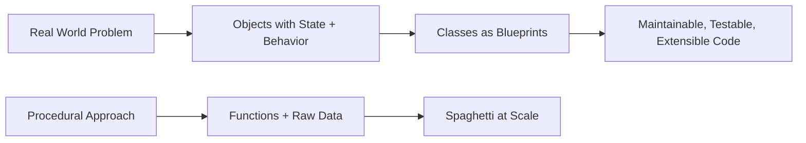
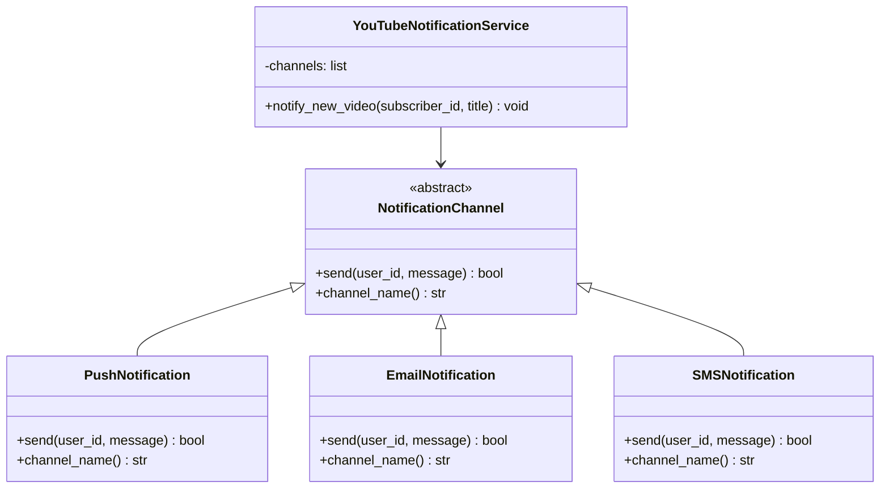
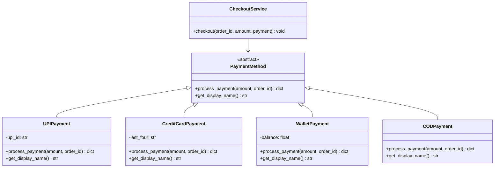
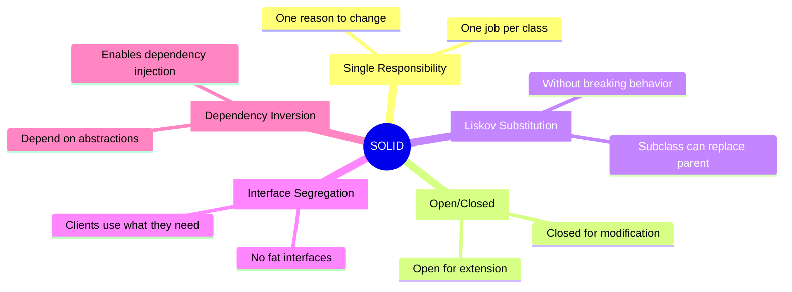
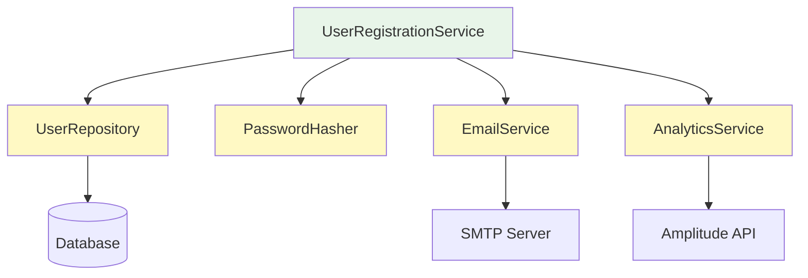
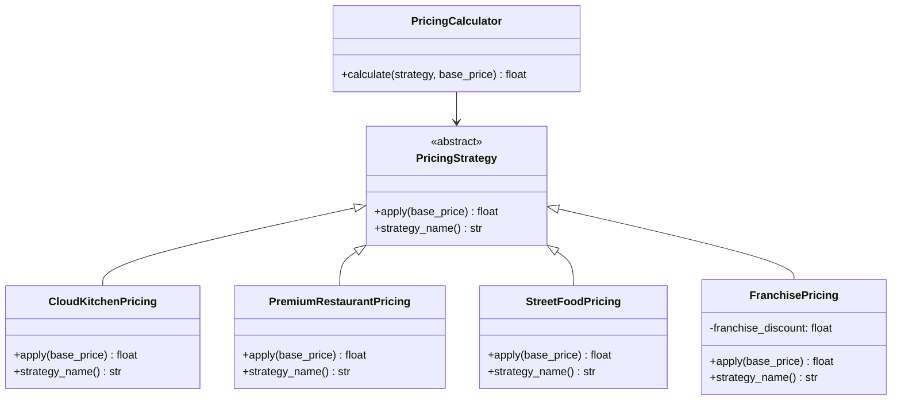
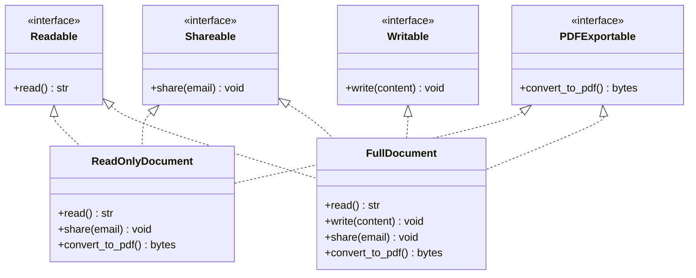
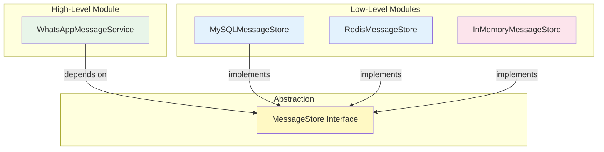
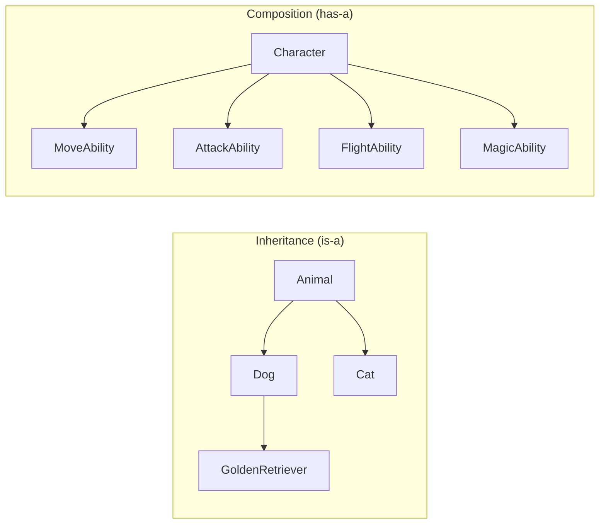
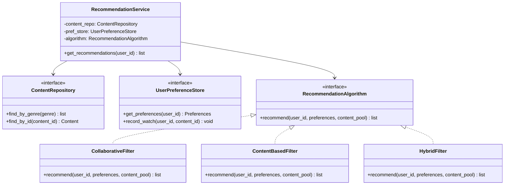

# OOP Principles & SOLID — The Foundation of Low Level Design

> Before you design a distributed system, you need to design a class. Before you design a class, you need to understand WHY OOP exists at all. This chapter gives you that foundation — clearly, with real examples, and without fluff. Minimum 500 lines of notes, maximum value.

---

## Why OOP At All? (The "Why First" Answer)

Imagine writing WhatsApp from scratch using just functions and raw data structures. You'd have a `send_message(sender_id, receiver_id, text, timestamp, media_url, read_receipt, delivery_status...)` function that becomes a 200-parameter nightmare. You'd have `user_data` dictionaries flying everywhere. One bug in one place corrupts everything.

OOP exists because **real-world problems have real-world structure**. A chat app has Users, Messages, Conversations, Notifications. These are not just data — they have *identity*, *state*, and *behavior*. OOP lets you model that directly in code.

The trade-off: OOP adds structure overhead. For a 50-line script, it's overkill. For a 500,000-line codebase, it's survival.



---

## The Four Pillars — Quick Map

```
OOP
├── Encapsulation  → Hide internals, expose only what's needed
├── Abstraction    → Hide complexity behind simple interfaces
├── Inheritance    → Child inherits from parent (use carefully)
└── Polymorphism   → Same interface, many behaviors
```

---

## Pillar 1: Encapsulation — "The TV Remote Rule"

**Analogy for a 5-year-old:** You press the red button on the TV remote and the TV turns off. You don't know (and don't care) about the infrared LED blinking at 38 kHz, the carrier signal modulation, or how the TV's microcontroller decodes it. The remote HIDES all of that and gives you just one thing: a button. That's encapsulation.

**Why it exists:** Without encapsulation, any part of your code can reach in and corrupt an object's state. Yeh kyun important hai — imagine if anyone could directly set a user's `password` field to an empty string without going through validation. Disaster.

**How it works:** Make fields private. Expose only what external code legitimately needs. Force all mutations to go through methods that enforce rules (invariants).

### Bad Code — No Encapsulation (Zomato Order example)

```python
# Python — no encapsulation
class Order:
    def __init__(self):
        self.status = "PENDING"
        self.total = 0
        self.items = []

order = Order()
# Nothing stops this:
order.status = "DELIVERED"       # skipped CONFIRMED and OUT_FOR_DELIVERY!
order.total = -500               # negative total — what?
order.items = None               # now every downstream function crashes
```

### Good Code — Encapsulated (same Zomato Order)

```python
class Order:
    VALID_TRANSITIONS = {
        "PENDING":          ["CONFIRMED", "CANCELLED"],
        "CONFIRMED":        ["OUT_FOR_DELIVERY", "CANCELLED"],
        "OUT_FOR_DELIVERY": ["DELIVERED"],
        "DELIVERED":        [],
        "CANCELLED":        [],
    }

    def __init__(self, restaurant_id: str):
        self.__status = "PENDING"           # private
        self.__total = 0.0                  # private
        self.__items = []                   # private
        self.__restaurant_id = restaurant_id

    def add_item(self, item_name: str, price: float) -> None:
        if price <= 0:
            raise ValueError(f"Price must be positive, got {price}")
        if self.__status != "PENDING":
            raise RuntimeError("Cannot add items to a confirmed order")
        self.__items.append({"name": item_name, "price": price})
        self.__total += price

    def transition_to(self, new_status: str) -> None:
        allowed = self.VALID_TRANSITIONS.get(self.__status, [])
        if new_status not in allowed:
            raise RuntimeError(
                f"Cannot move from {self.__status} to {new_status}. "
                f"Allowed: {allowed}"
            )
        self.__status = new_status

    @property
    def status(self) -> str:
        return self.__status   # read-only access

    @property
    def total(self) -> float:
        return self.__total    # read-only access

    @property
    def items(self) -> list:
        return list(self.__items)  # returns a copy — caller can't mutate internals

# Now the invariants are enforced:
order = Order("restaurant_123")
order.add_item("Butter Chicken", 320.0)
order.add_item("Garlic Naan", 60.0)
print(order.total)    # 380.0
order.transition_to("CONFIRMED")
# order.transition_to("DELIVERED")  # RuntimeError: Cannot move from CONFIRMED to DELIVERED
```

### TypeScript Version — Netflix Subscription

```typescript
class Subscription {
  private plan: "FREE" | "BASIC" | "STANDARD" | "PREMIUM";
  private renewalDate: Date;
  private isActive: boolean;

  constructor(plan: "FREE" | "BASIC" | "STANDARD" | "PREMIUM") {
    this.plan = plan;
    this.renewalDate = new Date(Date.now() + 30 * 24 * 60 * 60 * 1000);
    this.isActive = true;
  }

  upgrade(newPlan: "BASIC" | "STANDARD" | "PREMIUM"): void {
    const planRank = { FREE: 0, BASIC: 1, STANDARD: 2, PREMIUM: 3 };
    if (planRank[newPlan] <= planRank[this.plan]) {
      throw new Error("Can only upgrade to a higher plan. Use downgrade() for lower plans.");
    }
    this.plan = newPlan;
    // prorate billing logic would go here
  }

  cancel(): void {
    if (!this.isActive) throw new Error("Subscription already cancelled");
    this.isActive = false;
  }

  getPlan(): string { return this.plan; }
  getStatus(): string { return this.isActive ? "ACTIVE" : "CANCELLED"; }
}
```

**Interview tip:** Interviewers love asking "what is the difference between encapsulation and abstraction?" — Encapsulation is about *data hiding* (private fields, controlled access). Abstraction is about *complexity hiding* (interface hides implementation). Both reduce coupling, but at different levels.

---

## Pillar 2: Abstraction — "The Car Dashboard Rule"

**Analogy:** You drive a car. The interface is: steering wheel, accelerator, brake, gear stick. You don't interact with valve timing, air-fuel mixture, crankshaft torque curves. Those are hidden. When manufacturers improve the engine (V6 to electric motor), your driving interface stays the same. Abstraction lets the implementation change without changing the user.

**Why it exists:** If every caller needs to know *how* you do something, changing that "how" breaks every caller. Abstraction decouples the "what" from the "how."

### Real Example — YouTube Notification System

```python
from abc import ABC, abstractmethod

# The "what" — abstract contract
class NotificationChannel(ABC):
    @abstractmethod
    def send(self, user_id: str, message: str) -> bool:
        """Returns True if delivery confirmed, False otherwise"""
        pass

    @abstractmethod
    def channel_name(self) -> str:
        pass

# The "how" — concrete implementations (hidden from callers)
class PushNotification(NotificationChannel):
    def send(self, user_id: str, message: str) -> bool:
        # FCM/APNs logic, device token lookup, retry with exponential backoff...
        print(f"[PUSH] Sending to user {user_id}: {message}")
        return True

    def channel_name(self) -> str:
        return "push"

class EmailNotification(NotificationChannel):
    def send(self, user_id: str, message: str) -> bool:
        # SMTP connection, template rendering, bounce handling, unsubscribe check...
        print(f"[EMAIL] Sending to user {user_id}: {message}")
        return True

    def channel_name(self) -> str:
        return "email"

class SMSNotification(NotificationChannel):
    def send(self, user_id: str, message: str) -> bool:
        # Twilio API, carrier routing, rate limiting...
        print(f"[SMS] Sending to user {user_id}: {message}")
        return True

    def channel_name(self) -> str:
        return "sms"

# The caller — works with the ABSTRACTION, not any specific implementation
class YouTubeNotificationService:
    def __init__(self, channels: list[NotificationChannel]):
        self.channels = channels

    def notify_new_video(self, subscriber_id: str, video_title: str) -> None:
        message = f"New video uploaded: {video_title}"
        for channel in self.channels:
            success = channel.send(subscriber_id, message)
            if not success:
                print(f"[WARN] {channel.channel_name()} delivery failed for {subscriber_id}")

# Usage
service = YouTubeNotificationService([
    PushNotification(),
    EmailNotification(),
])
service.notify_new_video("user_456", "10 Things I Wish I Knew Before Coding")
# Add WhatsApp notifications tomorrow? Create WhatsAppNotification class.
# Zero changes to YouTubeNotificationService.
```



---

## Pillar 3: Inheritance — "The Golden Retriever Rule"

**Analogy:** A Golden Retriever IS-A Dog. A Dog IS-AN Animal. The retriever automatically has all dog traits (4 legs, barks) and all animal traits (breathes, has cells). It adds its own specialization on top. But here's the thing — inheritance is like genetic inheritance, and bad genes propagate. A broken base class breaks ALL subclasses.

**Why it exists:** Code reuse. A `Vehicle` class has `start()`, `stop()`, `refuel()`. A `Car` and a `Truck` both benefit without duplicating code.

**The warning (basically the most important part):** Prefer Composition over Inheritance. Inheritance creates tight coupling between parent and child. Changes to the parent break all children. This is called the **Fragile Base Class Problem**.

### Inheritance — When It's Right

```java
// Java example — Uber ride types
abstract class Ride {
    protected String rideId;
    protected String driverId;
    protected double baseRate;

    public Ride(String rideId, String driverId, double baseRate) {
        this.rideId = rideId;
        this.driverId = driverId;
        this.baseRate = baseRate;
    }

    // Shared behavior
    public void start() {
        System.out.println("Ride " + rideId + " started");
    }

    public void end() {
        System.out.println("Ride " + rideId + " ended");
    }

    // Abstract — each subclass defines its own pricing
    public abstract double calculateFare(double distanceKm, int durationMin);
}

class UberGo extends Ride {
    public UberGo(String rideId, String driverId) {
        super(rideId, driverId, 10.0); // base rate ₹10/km
    }

    @Override
    public double calculateFare(double distanceKm, int durationMin) {
        return baseRate * distanceKm + 1.5 * durationMin;
    }
}

class UberPremier extends Ride {
    public UberPremier(String rideId, String driverId) {
        super(rideId, driverId, 18.0); // base rate ₹18/km
    }

    @Override
    public double calculateFare(double distanceKm, int durationMin) {
        return baseRate * distanceKm + 3.0 * durationMin + 50; // luxury surcharge
    }
}

class UberAuto extends Ride {
    public UberAuto(String rideId, String driverId) {
        super(rideId, driverId, 7.0); // base rate ₹7/km
    }

    @Override
    public double calculateFare(double distanceKm, int durationMin) {
        return baseRate * distanceKm + 1.0 * durationMin;
    }
}
```

**When NOT to use inheritance:** When you're tempted to inherit just to reuse a few methods. That's what composition is for.

---

## Pillar 4: Polymorphism — "The Light Switch Rule"

**Analogy:** You flip a light switch. Whether it's connected to a 40W incandescent bulb, a 10W LED, or a Philips Hue smart bulb — you do the same thing (flip), and each device responds differently. Same action, different behavior. That's polymorphism.

**Why it exists:** Without polymorphism, you write endless `if isinstance(obj, Dog): ...elif isinstance(obj, Cat): ...` chains. With polymorphism, you call `animal.speak()` and trust that each object knows what it means to speak.

### Real Example — Swiggy Payment Processing

```python
from abc import ABC, abstractmethod

class PaymentMethod(ABC):
    @abstractmethod
    def process_payment(self, amount: float, order_id: str) -> dict:
        pass

    @abstractmethod
    def get_display_name(self) -> str:
        pass

class UPIPayment(PaymentMethod):
    def __init__(self, upi_id: str):
        self.upi_id = upi_id

    def process_payment(self, amount: float, order_id: str) -> dict:
        # Call UPI gateway, wait for VPA confirmation...
        print(f"Processing ₹{amount} via UPI ({self.upi_id}) for order {order_id}")
        return {"status": "SUCCESS", "txn_id": "UPI123456"}

    def get_display_name(self) -> str:
        return f"UPI: {self.upi_id}"

class CreditCardPayment(PaymentMethod):
    def __init__(self, last_four: str):
        self.last_four = last_four

    def process_payment(self, amount: float, order_id: str) -> dict:
        # PCI-DSS tokenization, 3DS verification, bank auth...
        print(f"Processing ₹{amount} via Credit Card (*{self.last_four}) for order {order_id}")
        return {"status": "SUCCESS", "txn_id": "CC789012"}

    def get_display_name(self) -> str:
        return f"Credit Card ending {self.last_four}"

class WalletPayment(PaymentMethod):
    def __init__(self, wallet_balance: float):
        self.balance = wallet_balance

    def process_payment(self, amount: float, order_id: str) -> dict:
        if self.balance < amount:
            return {"status": "FAILED", "reason": "Insufficient wallet balance"}
        self.balance -= amount
        print(f"Processing ₹{amount} via Wallet for order {order_id}")
        return {"status": "SUCCESS", "txn_id": "WAL345678"}

    def get_display_name(self) -> str:
        return f"Swiggy Money (₹{self.balance:.2f} balance)"

class CODPayment(PaymentMethod):
    def process_payment(self, amount: float, order_id: str) -> dict:
        print(f"COD order {order_id} — ₹{amount} to be collected on delivery")
        return {"status": "PENDING", "txn_id": "COD000000"}

    def get_display_name(self) -> str:
        return "Cash on Delivery"


# POLYMORPHISM IN ACTION — checkout doesn't know which payment type it's using
class CheckoutService:
    def checkout(self, order_id: str, amount: float, payment: PaymentMethod) -> None:
        print(f"\nCheckout for order {order_id}")
        print(f"Payment method: {payment.get_display_name()}")
        result = payment.process_payment(amount, order_id)  # polymorphic call
        if result["status"] == "SUCCESS":
            print(f"Payment successful! Transaction ID: {result['txn_id']}")
        else:
            print(f"Payment failed: {result.get('reason', 'Unknown error')}")


checkout = CheckoutService()
checkout.checkout("ORD001", 450.0, UPIPayment("rahul@okaxis"))
checkout.checkout("ORD002", 230.0, WalletPayment(500.0))
checkout.checkout("ORD003", 780.0, CODPayment())
```



**Duck Typing (Python/dynamic languages):** In Python, polymorphism doesn't even require a base class. If an object has a `process_payment()` method, it works. "If it walks like a duck and quacks like a duck, it's a duck." This is duck typing.

---

## The SOLID Principles — Overview

SOLID is a set of 5 design principles formalized by Robert C. Martin ("Uncle Bob") that make object-oriented code maintainable, testable, and extensible. Samjho aise — SOLID is the grammar of good OOP. You can write code without knowing grammar, but everyone will cringe at it.



---

## S — Single Responsibility Principle (SRP)

> "A class should have one, and only one, reason to change."

**Analogy:** A chef's job is to cook. A waiter serves. An accountant handles billing. You would NEVER hire one person for all three roles because: if the menu changes, the chef is affected. If the payment system changes, the accountant is affected. If service style changes, the waiter is affected. These are independent reasons to change, so they need separate people (classes).

**The test:** Can you describe your class in one sentence WITHOUT using the word "and"? If you need "and", split the class.

### Anti-Pattern — God UserService (Instagram example)

```python
# BAD: UserService does EVERYTHING
class UserService:
    def __init__(self):
        self.db_connection = self._create_db_connection()

    # Responsibility 1: User creation business logic
    def create_user(self, username: str, email: str, password: str):
        user = {"username": username, "email": email, "password": password}
        # ... validation
        return user

    # Responsibility 2: Password hashing (security concern)
    def hash_password(self, password: str) -> str:
        import hashlib
        return hashlib.sha256(password.encode()).hexdigest()

    # Responsibility 3: Database persistence
    def save_to_db(self, user: dict) -> None:
        self.db_connection.execute("INSERT INTO users ...", user)

    # Responsibility 4: Email sending
    def send_welcome_email(self, email: str) -> None:
        # SMTP logic...
        print(f"Sending welcome email to {email}")

    # Responsibility 5: Analytics tracking
    def track_signup_event(self, user_id: str) -> None:
        # Mixpanel/Amplitude API call...
        print(f"Tracking signup for {user_id}")

    # Responsibility 6: Image upload for profile picture
    def upload_profile_picture(self, user_id: str, image_bytes: bytes) -> str:
        # S3 upload logic...
        return f"https://cdn.instagram.com/{user_id}/profile.jpg"

    def _create_db_connection(self):
        return object()  # pretend this is a real connection

# PROBLEMS:
# - Email provider changes → modify UserService
# - Database schema changes → modify UserService
# - Analytics vendor changes → modify UserService
# - Password hashing algorithm changes → modify UserService
# - S3 bucket changes → modify UserService
# 6 reasons to change = 6 SRP violations
```

### Refactored — Each Class Has One Job

```python
# GOOD: Separate classes, each with one responsibility

class PasswordHasher:
    """Single responsibility: hash and verify passwords"""
    def hash(self, password: str) -> str:
        import hashlib
        return hashlib.sha256(password.encode()).hexdigest()

    def verify(self, password: str, hashed: str) -> bool:
        return self.hash(password) == hashed


class UserRepository:
    """Single responsibility: persist and retrieve users from DB"""
    def __init__(self, db_connection):
        self.db = db_connection

    def save(self, user: dict) -> str:
        # db insert logic
        return "generated_user_id"

    def find_by_email(self, email: str) -> dict | None:
        # db query
        return None


class EmailService:
    """Single responsibility: send emails"""
    def send_welcome(self, email: str, username: str) -> None:
        print(f"Sending welcome email to {email}")
        # SMTP / SendGrid logic


class AnalyticsService:
    """Single responsibility: track events"""
    def track(self, event_name: str, properties: dict) -> None:
        print(f"Tracking: {event_name} {properties}")
        # Amplitude / Mixpanel API call


class MediaStorageService:
    """Single responsibility: upload and serve media files"""
    def upload_image(self, user_id: str, image_bytes: bytes) -> str:
        return f"https://cdn.instagram.com/{user_id}/profile.jpg"


# Orchestrator — coordinates the flow (still has one job: orchestrate registration)
class UserRegistrationService:
    def __init__(
        self,
        repo: UserRepository,
        hasher: PasswordHasher,
        email_svc: EmailService,
        analytics: AnalyticsService,
    ):
        self.repo = repo
        self.hasher = hasher
        self.email_svc = email_svc
        self.analytics = analytics

    def register(self, username: str, email: str, password: str) -> str:
        hashed_pwd = self.hasher.hash(password)
        user = {"username": username, "email": email, "password": hashed_pwd}
        user_id = self.repo.save(user)
        self.email_svc.send_welcome(email, username)
        self.analytics.track("user_signed_up", {"user_id": user_id})
        return user_id
```

**Real-world consequence:** At Instagram scale, the email team, the DB team, and the analytics team work independently. SRP in code mirrors that team autonomy. Each team owns their class.



---

## O — Open/Closed Principle (OCP)

> "Software entities should be open for extension, but closed for modification."

**Analogy:** A power strip. You need a new device? Plug it in. You don't rewire the internal circuitry. The strip is closed for modification, open for extension. Now think of a plugin system — VS Code, IntelliJ. You install a plugin; the IDE doesn't need to be recompiled. That's OCP at the system level.

**Why it matters:** Every time you modify existing, tested code, you risk introducing bugs. OCP says: add new behavior by adding new code, not editing old code. Old code stays untouched, old tests keep passing.

### Anti-Pattern — If-Else Hell (Zomato Pricing)

```python
# BAD: Every new restaurant type means modifying this function
class PricingCalculator:
    def calculate(self, restaurant_type: str, base_price: float) -> float:
        if restaurant_type == "cloud_kitchen":
            return base_price * 0.9  # 10% discount — lower overhead
        elif restaurant_type == "premium_restaurant":
            return base_price * 1.2  # 20% premium surcharge
        elif restaurant_type == "street_food":
            return base_price * 0.85  # 15% off — value segment
        # New type "franchise"? → MUST modify this class → RISK existing logic
        # New type "dark_store"? → MUST modify again → MORE RISK
        return base_price
```

### Refactored — Strategy Pattern (OCP compliant)

```python
from abc import ABC, abstractmethod

# The extension point — the contract
class PricingStrategy(ABC):
    @abstractmethod
    def apply(self, base_price: float) -> float:
        pass

    @abstractmethod
    def strategy_name(self) -> str:
        pass

# Existing strategies — never touched after creation
class CloudKitchenPricing(PricingStrategy):
    def apply(self, base_price: float) -> float:
        return base_price * 0.9

    def strategy_name(self) -> str:
        return "Cloud Kitchen (10% off)"

class PremiumRestaurantPricing(PricingStrategy):
    def apply(self, base_price: float) -> float:
        return base_price * 1.2

    def strategy_name(self) -> str:
        return "Premium Restaurant (+20%)"

class StreetFoodPricing(PricingStrategy):
    def apply(self, base_price: float) -> float:
        return base_price * 0.85

    def strategy_name(self) -> str:
        return "Street Food (15% off)"

# NEW requirement: Franchise pricing — add new class, ZERO changes to above
class FranchisePricing(PricingStrategy):
    def __init__(self, franchise_discount: float):
        self.franchise_discount = franchise_discount

    def apply(self, base_price: float) -> float:
        return base_price * (1 - self.franchise_discount)

    def strategy_name(self) -> str:
        return f"Franchise ({self.franchise_discount*100:.0f}% off)"

# Calculator is closed for modification — it works for any current or future strategy
class PricingCalculator:
    def calculate(self, strategy: PricingStrategy, base_price: float) -> float:
        final_price = strategy.apply(base_price)
        print(f"Strategy: {strategy.strategy_name()}")
        print(f"Base: ₹{base_price:.2f} → Final: ₹{final_price:.2f}")
        return final_price


calc = PricingCalculator()
calc.calculate(CloudKitchenPricing(), 500)
calc.calculate(FranchisePricing(0.15), 500)  # New strategy, old calculator unchanged
```



**Other OCP patterns:** Decorator pattern (wrap existing behavior, don't modify it), Plugin systems, Event-driven hooks.

**Trade-off:** Don't over-apply OCP. Not every `if-else` needs a strategy pattern. Apply it when you KNOW the variation is likely to grow (payment methods, notification channels, pricing tiers — these always grow).

---

## L — Liskov Substitution Principle (LSP)

> "Objects of a subclass should be substitutable for objects of the parent class without the program breaking or producing incorrect results."

**Analogy:** Your office policy says "any employee can use the conference room booking system." Now you hire interns. Are interns employees? On paper, yes. But if interns crash the booking system when they try to book a room, that's an LSP violation. The "intern" subtype cannot safely substitute for "employee" in this context.

**The formal rule (Barbara Liskov, 1987):**
- Subclass cannot strengthen preconditions (cannot require more than the parent)
- Subclass cannot weaken postconditions (cannot guarantee less than the parent)
- Subclass cannot throw new exceptions not declared by the parent
- Subclass must preserve invariants of the parent

### Classic Violation — Square extends Rectangle

```python
class Rectangle:
    def __init__(self, width: float, height: float):
        self._width = width
        self._height = height

    def set_width(self, width: float) -> None:
        self._width = width

    def set_height(self, height: float) -> None:
        self._height = height

    def area(self) -> float:
        return self._width * self._height

class Square(Rectangle):
    def __init__(self, side: float):
        super().__init__(side, side)

    # Square MUST keep width == height — so overriding both setters
    def set_width(self, width: float) -> None:
        self._width = width
        self._height = width  # side effect!

    def set_height(self, height: float) -> None:
        self._width = height  # side effect!
        self._height = height


# A function that works correctly with Rectangle
def resize_and_compute(shape: Rectangle) -> None:
    shape.set_width(4)
    shape.set_height(5)
    area = shape.area()
    print(f"Expected area: 20, Got: {area}")
    assert area == 20, f"LSP VIOLATED! Got {area} instead of 20"


rect = Rectangle(1, 1)
resize_and_compute(rect)  # Prints: Expected area: 20, Got: 20  ✓

square = Square(1)
resize_and_compute(square)  # AssertionError: LSP VIOLATED! Got 25 instead of 20  ✗
# Because set_height(5) set both width AND height to 5 → 5*5=25, not 4*5=20
```

Mathematically, a square IS a rectangle. But in this OO model, Square CANNOT substitute Rectangle because it silently changes the behavior of `set_width` and `set_height`.

### Fix — Don't Force the Hierarchy

```python
# Option 1: Separate, independent classes sharing a Shape interface
class Shape(ABC):
    @abstractmethod
    def area(self) -> float:
        pass

class Rectangle(Shape):
    def __init__(self, width: float, height: float):
        self.width = width
        self.height = height

    def area(self) -> float:
        return self.width * self.height

class Square(Shape):
    def __init__(self, side: float):
        self.side = side

    def area(self) -> float:
        return self.side ** 2

# Option 2: Immutable objects — no setters, no side effects
class ImmutableRectangle:
    def __init__(self, width: float, height: float):
        self._width = width
        self._height = height

    def with_width(self, width: float) -> 'ImmutableRectangle':
        return ImmutableRectangle(width, self._height)  # new object

    def with_height(self, height: float) -> 'ImmutableRectangle':
        return ImmutableRectangle(self._width, height)  # new object

    def area(self) -> float:
        return self._width * self._height
```

### Real-World LSP Violation — Bird and Penguin

```python
class Bird:
    def fly(self) -> str:
        return "I am flying!"

    def eat(self) -> str:
        return "I am eating!"

class Eagle(Bird):
    def fly(self) -> str:
        return "Soaring at 3000m!"

# Seems fine... until:
class Penguin(Bird):
    def fly(self) -> str:
        raise NotImplementedError("Penguins cannot fly!")  # LSP VIOLATION

# Any code that does:
def make_bird_fly(bird: Bird) -> None:
    print(bird.fly())  # Crashes with Penguin!

# FIX: Redesign the hierarchy
class Bird:
    def eat(self) -> str:
        return "Eating..."

class FlyingBird(Bird):
    def fly(self) -> str:
        return "Flying..."

class SwimmingBird(Bird):
    def swim(self) -> str:
        return "Swimming..."

class Eagle(FlyingBird):
    def fly(self) -> str:
        return "Soaring at 3000m!"

class Penguin(SwimmingBird):
    def swim(self) -> str:
        return "Diving to 500m!"
```

**LSP in interviews:** Ask yourself — "if I replace the parent type with this child type in ALL places, does the program still work correctly?" If no, you have an LSP violation.

---

## I — Interface Segregation Principle (ISP)

> "Clients should not be forced to depend on interfaces they do not use."

**Analogy:** A job posting says "Requirements: Excel, Python, Surgery, Plumbing, Catering." Nobody qualifies. The problem is a fat job requirement. Split it: hire a surgeon for surgery, a plumber for plumbing. Each role gets a focused interface.

**Why it matters:** Fat interfaces force implementing classes to either throw exceptions for methods they don't support (LSP violation) or leave them empty (silent bugs). Both are bad.

### Anti-Pattern — Fat Interface (Google Docs example)

```python
# BAD: One huge interface for document operations
class DocumentOperations(ABC):
    @abstractmethod
    def read(self) -> str: pass

    @abstractmethod
    def write(self, content: str) -> None: pass

    @abstractmethod
    def delete(self) -> None: pass

    @abstractmethod
    def share(self, email: str) -> None: pass

    @abstractmethod
    def convert_to_pdf(self) -> bytes: pass

    @abstractmethod
    def track_changes(self) -> list: pass

    @abstractmethod
    def add_comment(self, comment: str) -> None: pass

    @abstractmethod
    def translate(self, target_language: str) -> str: pass


class ReadOnlyDocument(DocumentOperations):
    def read(self) -> str:
        return "document content"

    def write(self, content: str) -> None:
        raise PermissionError("This document is read-only!")  # Forced to implement

    def delete(self) -> None:
        raise PermissionError("This document is read-only!")  # Forced to implement

    def share(self, email: str) -> None:
        print(f"Shared with {email}")

    def convert_to_pdf(self) -> bytes:
        return b"pdf content"

    def track_changes(self) -> list:
        raise NotImplementedError("Read-only docs don't track changes")  # ISP VIOLATION

    def add_comment(self, comment: str) -> None:
        raise NotImplementedError("Comments disabled on this doc")  # ISP VIOLATION

    def translate(self, target_language: str) -> str:
        return "translated content"
```

### Refactored — Focused Interfaces

```python
# GOOD: Small, cohesive interfaces — clients only implement what they need
class Readable(ABC):
    @abstractmethod
    def read(self) -> str: pass

class Writable(ABC):
    @abstractmethod
    def write(self, content: str) -> None: pass

class Deletable(ABC):
    @abstractmethod
    def delete(self) -> None: pass

class Shareable(ABC):
    @abstractmethod
    def share(self, email: str) -> None: pass

class PDFExportable(ABC):
    @abstractmethod
    def convert_to_pdf(self) -> bytes: pass

class ChangeTrackable(ABC):
    @abstractmethod
    def track_changes(self) -> list: pass

class Commentable(ABC):
    @abstractmethod
    def add_comment(self, comment: str) -> None: pass

class Translatable(ABC):
    @abstractmethod
    def translate(self, target_language: str) -> str: pass


# ReadOnlyDocument only implements what it CAN do — no forced NotImplementedErrors
class ReadOnlyDocument(Readable, Shareable, PDFExportable, Translatable):
    def read(self) -> str:
        return "document content"

    def share(self, email: str) -> None:
        print(f"Shared with {email}")

    def convert_to_pdf(self) -> bytes:
        return b"pdf content"

    def translate(self, target_language: str) -> str:
        return "translated content"


# FullDocument can do everything
class FullDocument(Readable, Writable, Deletable, Shareable,
                   PDFExportable, ChangeTrackable, Commentable, Translatable):
    def read(self) -> str: return "content"
    def write(self, content: str) -> None: print(f"Writing: {content}")
    def delete(self) -> None: print("Deleted")
    def share(self, email: str) -> None: print(f"Shared with {email}")
    def convert_to_pdf(self) -> bytes: return b"pdf"
    def track_changes(self) -> list: return []
    def add_comment(self, comment: str) -> None: print(f"Comment: {comment}")
    def translate(self, target_language: str) -> str: return "translated"


# Functions depend only on the interface they need
def export_documents(docs: list[PDFExportable]) -> list[bytes]:
    return [doc.convert_to_pdf() for doc in docs]

# Both ReadOnlyDocument and FullDocument can be passed — both implement PDFExportable
pdfs = export_documents([ReadOnlyDocument(), FullDocument()])
```



**Practical ISP rule:** If you see `raise NotImplementedError` or `pass` in a method body because the class "doesn't support that," you have an ISP violation. Split the interface.

---

## D — Dependency Inversion Principle (DIP)

> "High-level modules should not depend on low-level modules. Both should depend on abstractions. Abstractions should not depend on details. Details should depend on abstractions."

**Analogy (the best one):** Your phone charger doesn't depend on a specific power plant. It depends on electricity delivered through a standard socket (the abstraction). The power plant (coal, solar, nuclear) can change completely. Your charger keeps working. Both the charger and the power plant depend on the "socket standard" — the abstraction.

**Why it matters:** If `OrderService` directly instantiates `MySQLDatabase`, you can NEVER test `OrderService` without a real MySQL database. You can't swap MySQL for PostgreSQL without touching `OrderService`. The high-level module (OrderService) is enslaved to the low-level module (MySQL).

### Anti-Pattern — Tight Coupling (WhatsApp Message Storage)

```python
# BAD: High-level module directly depends on low-level concrete class
class MySQLMessageStore:
    def __init__(self):
        self.connection = self._connect()

    def _connect(self):
        print("Connecting to MySQL...")
        return object()  # pretend DB connection

    def save_message(self, message: dict) -> str:
        print(f"Saving to MySQL: {message}")
        return "mysql_id_123"

    def get_messages(self, chat_id: str) -> list:
        print(f"Fetching from MySQL for chat {chat_id}")
        return []


class WhatsAppMessageService:
    def __init__(self):
        # PROBLEM 1: Hardwired to MySQL — cannot swap storage
        # PROBLEM 2: Self-instantiating — cannot test without MySQL
        self.store = MySQLMessageStore()  # Direct dependency on concrete class

    def send_message(self, sender: str, receiver: str, text: str) -> None:
        message = {"from": sender, "to": receiver, "text": text}
        msg_id = self.store.save_message(message)
        print(f"Message sent, ID: {msg_id}")

    def get_chat_history(self, chat_id: str) -> list:
        return self.store.get_messages(chat_id)
```

### Refactored — DIP Compliant (with Dependency Injection)

```python
from abc import ABC, abstractmethod
from typing import Optional

# The ABSTRACTION — both high-level and low-level depend on this
class MessageStore(ABC):
    @abstractmethod
    def save_message(self, message: dict) -> str:
        """Returns the stored message ID"""
        pass

    @abstractmethod
    def get_messages(self, chat_id: str) -> list:
        pass


# LOW-LEVEL MODULE 1: Production MySQL
class MySQLMessageStore(MessageStore):
    def save_message(self, message: dict) -> str:
        print(f"[MySQL] Saving: {message}")
        return "mysql_id_123"

    def get_messages(self, chat_id: str) -> list:
        print(f"[MySQL] Fetching chat {chat_id}")
        return [{"text": "Hello from MySQL"}]


# LOW-LEVEL MODULE 2: Production Redis (for fast recent messages)
class RedisMessageStore(MessageStore):
    def save_message(self, message: dict) -> str:
        print(f"[Redis] Caching: {message}")
        return "redis_id_456"

    def get_messages(self, chat_id: str) -> list:
        print(f"[Redis] Fetching recent messages for {chat_id}")
        return [{"text": "Hello from Redis"}]


# LOW-LEVEL MODULE 3: In-memory (for unit tests — no real DB!)
class InMemoryMessageStore(MessageStore):
    def __init__(self):
        self._store: dict[str, list] = {}

    def save_message(self, message: dict) -> str:
        chat_id = f"{message['from']}_{message['to']}"
        self._store.setdefault(chat_id, []).append(message)
        return f"inmem_{len(self._store)}"

    def get_messages(self, chat_id: str) -> list:
        return self._store.get(chat_id, [])


# HIGH-LEVEL MODULE — depends ONLY on the abstraction
class WhatsAppMessageService:
    def __init__(self, store: MessageStore):  # INJECTED from outside
        self.store = store  # depends on interface, not concrete class

    def send_message(self, sender: str, receiver: str, text: str) -> None:
        message = {"from": sender, "to": receiver, "text": text, "timestamp": "now"}
        msg_id = self.store.save_message(message)
        print(f"Message sent, ID: {msg_id}")

    def get_chat_history(self, chat_id: str) -> list:
        return self.store.get_messages(chat_id)


# PRODUCTION: Use MySQL
prod_service = WhatsAppMessageService(store=MySQLMessageStore())
prod_service.send_message("alice", "bob", "Hey!")

# TESTING: Use in-memory — no DB setup needed, tests run in milliseconds
test_service = WhatsAppMessageService(store=InMemoryMessageStore())
test_service.send_message("alice", "bob", "Test message")
assert len(test_service.get_chat_history("alice_bob")) == 1

# MIGRATING to Redis? Zero changes to WhatsAppMessageService
redis_service = WhatsAppMessageService(store=RedisMessageStore())
```



**Dependency Injection (DI):** DIP tells you WHAT to do (depend on abstractions). DI is the mechanism HOW to do it — inject dependencies from outside (via constructor, method, or DI framework). Most backend frameworks (Spring, NestJS, Django with DI) have DI containers that automate this.

---

## Composition over Inheritance

This is not a SOLID principle but it's equally important — basically it should be the 6th principle.

**Analogy:** Inheritance is like saying "I'll genetically modify my car so it has legs AND wheels." Composition is like saying "I'll attach leg accessories to my car when I need them, and swap them for wheels when I don't." Composition gives you mix-and-match flexibility. Inheritance locks you in.

**The Fragile Base Class Problem:** When you change the base class, every single subclass could break. Samjho aise — if `Animal` changes `breathe()`, every Dog, Cat, Bird, Fish breaks simultaneously.

### Anti-Pattern — Deep Inheritance Hierarchy

```python
# BAD: Deep inheritance for "has features" relationships
class Character:
    def move(self): pass

class Warrior(Character):
    def attack(self): pass

class MagicWarrior(Warrior):
    def cast_spell(self): pass

class FlyingMagicWarrior(MagicWarrior):
    def fly(self): pass

class InvisibleFlyingMagicWarrior(FlyingMagicWarrior):
    def go_invisible(self): pass

# By level 5, this is unmanageable.
# What if you want a flying warrior WITHOUT magic?
# Or an invisible character WITHOUT flight?
# Inheritance can't express these combinations.
```

### Refactored — Composition (mix and match abilities)

```python
# GOOD: Compose behavior from smaller pieces

class MoveAbility:
    def move(self, direction: str) -> None:
        print(f"Moving {direction}")

class AttackAbility:
    def __init__(self, damage: int):
        self.damage = damage

    def attack(self, target: str) -> None:
        print(f"Attacking {target} for {self.damage} damage")

class MagicAbility:
    def __init__(self, mana: int):
        self.mana = mana

    def cast_spell(self, spell: str) -> None:
        if self.mana > 0:
            print(f"Casting {spell}")
            self.mana -= 10

class FlightAbility:
    def fly(self, altitude: int) -> None:
        print(f"Flying at {altitude}m altitude")

class StealthAbility:
    def go_invisible(self) -> None:
        print("Turning invisible")


# Characters are composed of abilities — any combination is possible
class Character:
    def __init__(self, name: str, abilities: list):
        self.name = name
        self.abilities = {type(a).__name__: a for a in abilities}

    def use(self, ability_class):
        ability = self.abilities.get(ability_class.__name__)
        if ability is None:
            raise AttributeError(f"{self.name} doesn't have {ability_class.__name__}")
        return ability


# Create any combination without a new class:
warrior = Character("Arjun", [
    MoveAbility(),
    AttackAbility(damage=50),
])

flying_mage = Character("Gandalf", [
    MoveAbility(),
    MagicAbility(mana=100),
    FlightAbility(),
])

stealth_archer = Character("Legolas", [
    MoveAbility(),
    AttackAbility(damage=30),
    StealthAbility(),
])

flying_mage.use(FlightAbility).fly(500)
stealth_archer.use(StealthAbility).go_invisible()
```

**Rule of thumb:**
- Use inheritance for IS-A relationships where the subclass truly is a specialized version (Dog is-a Animal, UberGo is-a Ride)
- Use composition for HAS-A relationships (a Character HAS-A FlightAbility, an Order HAS-A PricingStrategy)



---

## Design by Contract

**Analogy:** When you book a Zomato order, there's an implicit contract. Zomato promises: "We'll deliver within the estimated time." You promise: "The delivery address is valid and you're available to receive." If either side breaks their promise, there's a problem. Design by contract makes these promises explicit in code.

Three components:
1. **Preconditions** — what must be true BEFORE a method is called (caller's responsibility)
2. **Postconditions** — what the method GUARANTEES will be true after it runs (callee's responsibility)
3. **Invariants** — conditions that must ALWAYS be true for an object to be in a valid state

```python
class BankAccount:
    """
    Invariant: self.__balance >= 0 at all times
    Invariant: self.__owner is not None and len(self.__owner) > 0
    """

    def __init__(self, owner: str, initial_deposit: float):
        # Precondition check
        assert len(owner) > 0, "Owner name cannot be empty"
        assert initial_deposit >= 0, "Initial deposit cannot be negative"

        self.__owner = owner
        self.__balance = initial_deposit
        self.__check_invariant()

    def deposit(self, amount: float) -> None:
        # Precondition
        assert amount > 0, f"Deposit amount must be positive, got {amount}"

        old_balance = self.__balance
        self.__balance += amount

        # Postcondition
        assert self.__balance == old_balance + amount, "Deposit calculation error"
        self.__check_invariant()

    def withdraw(self, amount: float) -> None:
        # Preconditions
        assert amount > 0, f"Withdrawal amount must be positive, got {amount}"
        assert amount <= self.__balance, (
            f"Insufficient funds: balance={self.__balance}, requested={amount}"
        )

        old_balance = self.__balance
        self.__balance -= amount

        # Postcondition
        assert self.__balance == old_balance - amount, "Withdrawal calculation error"
        self.__check_invariant()

    def __check_invariant(self) -> None:
        """Class invariant — should always hold"""
        assert self.__balance >= 0, f"INVARIANT VIOLATED: balance cannot be negative ({self.__balance})"

    @property
    def balance(self) -> float:
        return self.__balance
```

In production code, replace `assert` with proper exception raising (assertions can be disabled). The value is in making contracts explicit and documentable.

---

## Common OOP Mistakes (Anti-Patterns)

### Mistake 1: The God Object

A God object knows everything and does everything. Like a single `App` class that handles authentication, payment processing, notifications, database queries, and UI rendering.

```python
# BAD: God class
class ZomatoApp:
    def login(self): pass
    def logout(self): pass
    def search_restaurants(self): pass
    def apply_filter(self): pass
    def add_to_cart(self): pass
    def process_payment(self): pass
    def track_delivery(self): pass
    def rate_order(self): pass
    def send_notification(self): pass
    def update_profile(self): pass
    # 50 more methods...
```

**Fix:** Apply SRP. Split into `AuthService`, `SearchService`, `CartService`, `PaymentService`, `DeliveryService`, `NotificationService`.

### Mistake 2: Anemic Domain Model

An anemic domain model has classes with only fields (data bags) and no behavior. All logic sits in separate "service" classes. The objects don't know what they are.

```python
# BAD: Anemic model — Message is just a data bag
class Message:
    def __init__(self):
        self.id = None
        self.text = None
        self.sender_id = None
        self.timestamp = None
        self.is_read = False
        self.is_deleted = False

# All behavior in a service class — Message doesn't know how to do anything
class MessageService:
    def mark_as_read(self, message: Message, user_id: str):
        if message.sender_id != user_id:
            message.is_read = True

    def soft_delete(self, message: Message):
        message.is_deleted = True

    def is_expired(self, message: Message) -> bool:
        import time
        return time.time() - message.timestamp > 86400  # 24 hours
```

```python
# GOOD: Rich domain model — Message knows its own behavior
class Message:
    def __init__(self, text: str, sender_id: str):
        self.__id = self.__generate_id()
        self.__text = text
        self.__sender_id = sender_id
        self.__timestamp = __import__('time').time()
        self.__is_read = False
        self.__is_deleted = False

    def mark_as_read(self, reader_id: str) -> None:
        if reader_id == self.__sender_id:
            raise ValueError("Sender cannot mark their own message as read")
        if self.__is_deleted:
            raise RuntimeError("Cannot interact with a deleted message")
        self.__is_read = True

    def soft_delete(self) -> None:
        self.__is_deleted = True

    def is_expired(self) -> bool:
        return __import__('time').time() - self.__timestamp > 86400

    def is_readable_by(self, user_id: str) -> bool:
        return not self.__is_deleted and (
            user_id == self.__sender_id or self.__is_read
        )

    @staticmethod
    def __generate_id() -> str:
        import uuid
        return str(uuid.uuid4())
```

### Mistake 3: Excessive Inheritance Hierarchies

```
Vehicle
  └── MotorVehicle
        ├── Car
        │     ├── ElectricCar
        │     │     └── SelfDrivingElectricCar
        │     └── HybridCar
        │           └── LuxuryHybridCar
        └── Truck
              └── ElectricTruck
                    └── AutonomousElectricTruck
```

By level 5, every change to `Vehicle` or `MotorVehicle` is a landmine that can detonate 15 subclasses. Use composition. `ElectricPropulsionSystem`, `AutonomousDrivingSystem` as composed components.

### Mistake 4: Returning Null Instead of Special Objects

```python
# BAD: Returning None forces callers to null-check everywhere
def find_user(user_id: str):
    if user_id not in database:
        return None  # Callers forget to null-check. NullPointerException in production.

# GOOD: Null Object pattern or Optional/Maybe pattern
class NullUser:
    username = "Guest"
    email = ""
    is_authenticated = False

    def get_permissions(self): return []

def find_user(user_id: str):
    if user_id not in database:
        return NullUser()  # Always returns a valid object — callers need no null-check
    return database[user_id]
```

---

## SOLID Principles — Quick Reference Table

| Principle | Question to Ask | Bad Sign | Fix Pattern |
|-----------|----------------|----------|-------------|
| **SRP** | Does this class have ONE reason to change? | Class description uses "and" | Split into focused classes |
| **OCP** | Can I add behavior WITHOUT editing existing code? | Growing if-else / switch chains | Strategy, Decorator patterns |
| **LSP** | Can every subclass fully replace its parent? | `raise NotImplementedError`, unexpected side effects | Flatten hierarchy, redesign |
| **ISP** | Does this class implement methods it doesn't need? | Empty methods or `pass`/throws in implementations | Split large interface into focused ones |
| **DIP** | Does the high-level module depend on an interface? | `new ConcreteClass()` inside a service | Constructor injection, interfaces |

---

## Composition vs Inheritance — When to Use What

| Scenario | Use | Why |
|----------|-----|-----|
| Dog IS-A Animal | Inheritance | True type hierarchy |
| Order HAS-A PricingStrategy | Composition | Behavior plug-in |
| UberGo IS-A Ride | Inheritance | Specialized ride type |
| Character HAS-A FlightAbility | Composition | Mix-and-match behavior |
| You'd need `InvisibleFlyingMagicWarrior` class | Composition | Class explosion = wrong tool |
| NotificationService HAS-A EmailSender | Composition | Dependency injection |

---

## DRY, YAGNI, KISS — The Supporting Rules

### DRY — Don't Repeat Yourself

Every piece of business knowledge should live in ONE place. If you're copying and pasting logic, you're creating a future bug waiting to happen. If the tax rate is `0.18` in 6 different files and it changes to `0.20`, how many do you update? How many do you miss?

```python
# BAD
def calculate_cart_total(items): return sum(i['price'] for i in items) * 1.18
def calculate_order_total(items): return sum(i['price'] for i in items) * 1.18  # duplicate!
def calculate_invoice_total(items): return sum(i['price'] for i in items) * 1.18  # duplicate!

# GOOD
GST_RATE = 0.18  # Single source of truth

def _subtotal(items: list) -> float:
    return sum(item['price'] for item in items)

def apply_gst(amount: float) -> float:
    return amount * (1 + GST_RATE)

calculate_cart_total = lambda items: apply_gst(_subtotal(items))
calculate_order_total = lambda items: apply_gst(_subtotal(items))
calculate_invoice_total = lambda items: apply_gst(_subtotal(items))
```

**Caution:** Don't DRY code that *looks* the same but *means* something different. Two `validate()` functions for User registration and Product creation may look similar today but diverge later. Premature DRYing creates accidental coupling.

### YAGNI — You Ain't Gonna Need It

Don't build for imagined futures. Build for real requirements you have today. "We might need multi-currency support later" is not a requirement to build now if you're a single-country startup.

```python
# BAD: Over-engineered greeting
class GreetingEngine:
    strategy: 'GreetingStrategy'
    cache: dict
    template_engine: object
    i18n_provider: object
    analytics: object

    def greet(self, user: str, language: str = "en",
              formal: bool = False, time_of_day: str = "auto") -> str:
        # 80 lines for "Hello!"
        pass

# GOOD: Solve the actual problem
def greet(name: str) -> str:
    return f"Hello, {name}!"
```

### KISS — Keep It Simple

Simple code is not dumb code. It's code that achieves its purpose with the least unnecessary complexity. Complexity has a cost — it takes longer to understand, debug, and change.

---

## Putting It All Together — Netflix Recommendation Engine LLD

Let's see how all principles work together in a mini design:



- **SRP**: `RecommendationService` orchestrates, `ContentRepository` fetches content, `UserPreferenceStore` manages preferences, each algorithm class recommends.
- **OCP**: New algorithm? Add new class implementing `RecommendationAlgorithm`. Zero changes to `RecommendationService`.
- **LSP**: Any algorithm implementation can substitute any other — they all fulfill the same contract.
- **ISP**: `ContentRepository` is separate from `UserPreferenceStore` — services only depend on what they need.
- **DIP**: `RecommendationService` depends on interfaces, not concrete classes. Switch from `CollaborativeFilter` to `HybridFilter` with zero changes to service code.

---

## Common Interview Questions

**Q1: What is the difference between Abstraction and Encapsulation?**
> Encapsulation = **data hiding** (private fields, controlled access via methods, protecting internal state). Abstraction = **complexity hiding** (showing only what the user needs to know, hiding HOW it works). Example: A bank account class encapsulates the balance (private field). The `PaymentProcessor` interface abstracts payment processing (hides whether it's Stripe or PayPal).

**Q2: When would you violate the Liskov Substitution Principle? How do you fix it?**
> Classic example: `Square extends Rectangle` — when you override `setWidth`, it also changes height (side effect). Fix: Either separate the classes sharing a `Shape` interface, or use immutable objects so there are no setter side-effects.

**Q3: What is the Dependency Inversion Principle and how does it enable testability?**
> DIP says high-level modules should depend on interfaces, not concrete classes. By injecting dependencies (e.g., `MessageStore` interface) from outside, you can inject a fast `InMemoryMessageStore` in tests instead of hitting a real database. Tests become millisecond-fast and run without infrastructure setup.

**Q4: Composition vs Inheritance — when do you pick each?**
> IS-A relationship with a stable, true hierarchy → Inheritance. HAS-A relationship, or you need mix-and-match behaviors → Composition. Red flag: if you'd need more than 3 levels of inheritance, switch to composition. Fragile base class problem: a change to the parent ripples through all children.

**Q5: How does the Open/Closed Principle relate to the Strategy Pattern?**
> OCP says "closed for modification, open for extension." Strategy Pattern is the implementation mechanism — define a family of algorithms behind an interface, each in its own class. Adding a new behavior means adding a new strategy class, not editing the existing calculator/processor. The calculator is "closed"; the strategy space is "open."

**Q6: What is an anemic domain model? Why is it a problem?**
> An anemic domain model has classes with only fields and no behavior — they're just data containers. All logic sits in service classes. The problem: business rules are scattered, objects can be put into invalid states (no invariant enforcement), and the code feels procedural despite using classes. Fix: move behavior into the domain objects (rich domain model).

**Q7: What does "program to an interface, not an implementation" mean?**
> Declare your variables, parameters, and return types as the interface/abstract class, not the concrete class. `List<String>` not `ArrayList<String>`. `MessageStore` not `MySQLMessageStore`. This lets you swap implementations without changing callers.

**Q8: Can you explain the Single Responsibility Principle with a real microservices example?**
> At Uber, the `RideService` handles ride lifecycle (booking, assignment, tracking, completion). It does NOT handle payments (that's `PaymentService`), driver ratings (that's `RatingService`), or notifications (that's `NotificationService`). Each service has one reason to change: ride business rules, payment rules, rating rules, notification rules. SRP at the class level maps directly to SRP at the service level.

**Q9: What are the signs of an Interface Segregation violation?**
> (1) A class implements an interface but throws `NotImplementedError` or `UnsupportedOperationException` for some methods. (2) Classes are forced to implement methods that are always empty (`pass`). (3) Test mocks need to stub many irrelevant methods just to test one thing. Fix: split the fat interface into focused role interfaces.

**Q10: How do Design by Contract and LSP relate?**
> Design by Contract makes preconditions, postconditions, and invariants explicit. LSP says subclasses must respect the parent's contract — they cannot strengthen preconditions (require more) or weaken postconditions (guarantee less). If a subclass does less than promised by the parent's contract, it violates both DbC and LSP.

---

## Key Takeaways

1. **OOP is a modeling tool, not just syntax.** Objects should reflect real domain concepts with their own identity, state, and behavior — not just be data bags with methods bolted on.

2. **Encapsulation protects invariants.** Make fields private by default. Every mutation goes through a method that enforces business rules. This is how you prevent an Order from jumping from PENDING to DELIVERED.

3. **Abstraction decouples what from how.** Callers deal with the interface; implementations can change freely. This is the foundation of pluggable architectures.

4. **Inheritance is a commitment, not a convenience.** Use it only for true IS-A relationships. Prefer composition for code reuse. Deep hierarchies are fragile.

5. **Polymorphism eliminates conditionals.** Instead of `if type == "upi": ... elif type == "card": ...`, you call `payment.process()` and let each object handle its own behavior.

6. **SRP: if you use the word "and" to describe your class, split it.** One reason to change = one responsibility.

7. **OCP: add new behavior with new code, not by editing old code.** Strategy Pattern, Decorator Pattern, and event hooks are your tools.

8. **LSP: substitutability is the test.** If swapping a subclass for the parent breaks the program's correctness, the hierarchy is wrong. The Square/Rectangle problem is the canonical example.

9. **ISP: fat interfaces create forced dependencies.** Small, focused interfaces let implementors pick only what they need. No `raise NotImplementedError` in production code.

10. **DIP + Dependency Injection = testable, swappable code.** High-level modules inject low-level dependencies via interfaces. This is what makes unit tests possible without real databases.

11. **Composition over Inheritance.** When in doubt, compose. Behaviors as plug-in components beat deep class hierarchies every time.

12. **God objects, anemic models, and deep hierarchies are the three biggest OOP mistakes.** Each has a clear fix: SRP for God objects, rich domain models for anemic models, composition for deep hierarchies.

> The ultimate goal of all these principles is the same: **write code that is easy to change.** Systems that are easy to change survive. Systems that resist change become legacy burdens. Every principle here — OOP pillars, SOLID, composition — is a tool in service of that one goal.

---

*Next: Design Patterns — Creational, Structural, Behavioral*
