# UML Diagrams for System Design — The Definitive LLD Guide

> "A picture is worth a thousand words. In a system design interview, the right diagram is worth the job."

---

## Why UML? (The "Kyun Zaroori Hai" Section)

Samjho aise — imagine you are a contractor hired to renovate a house. Would you just show up with a hammer and start knocking walls? No. You would first look at the blueprint — the floor plan that shows where the walls are, where the wiring runs, which walls are load-bearing.

UML (Unified Modeling Language) is that blueprint for software. Before writing a single line of code, a good engineer draws the design. In an LLD interview, the moment you pick up a marker and sketch a class diagram, you send a clear signal: "I think in systems, not just in code."

### The Five Diagrams That Matter

| Diagram | One-Line Job Description | Mermaid Syntax |
|---|---|---|
| Class Diagram | What are the pieces and how are they glued together? | `classDiagram` |
| Sequence Diagram | Who talks to whom, and in what exact order? | `sequenceDiagram` |
| State Machine Diagram | What are the lifecycle stages of a thing? | `stateDiagram-v2` |
| Activity Diagram | What is the step-by-step flow with decisions? | `flowchart` |
| Use Case Diagram | Who uses the system and for what purpose? | (described textually) |

---

## Part 1 — Class Diagrams: The Backbone of LLD

### The Analogy

A class diagram is like a family tree crossed with an org chart. It shows every "person" (class), what they own (attributes), what they can do (methods), and how everyone is related (relationships). When someone asks "design a parking lot system" — the class diagram is your answer.

### Anatomy of One Class

```
+---------------------------+
|       ClassName           |   <-- Compartment 1: Name
+---------------------------+
| - privateAttr : Type      |   <-- Compartment 2: Attributes
| + publicAttr  : Type      |      (visibility symbol + name + type)
| # protectedAttr : Type    |
| ~ packageAttr : Type      |
+---------------------------+
| + publicMethod() : Return |   <-- Compartment 3: Methods
| - privateHelper() : void  |
| # protectedCalc() : int   |
+---------------------------+
```

**Visibility Symbols:**

| Symbol | Meaning | Who can access? |
|---|---|---|
| `+` | public | Everyone |
| `-` | private | Only this class |
| `#` | protected | This class + subclasses |
| `~` | package | Classes in same package |

### The Simplest Mermaid Class

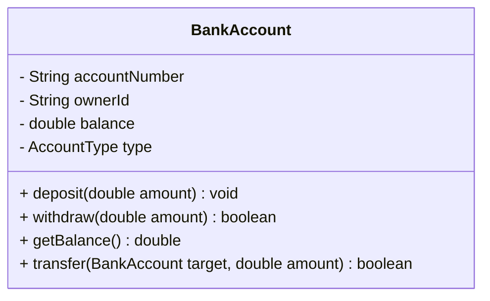
```mermaid
classDiagram
    class BankAccount {
        - String accountNumber
        - String ownerId
        - double balance
        - AccountType type
        + deposit(double amount) void
        + withdraw(double amount) boolean
        + getBalance() double
        + transfer(BankAccount target, double amount) boolean
    }
```

---

## Part 2 — The Six Relationships (Sabse Confusing Part)

Yeh part sabse important hai. Most beginners draw every relationship as a plain arrow and call it done. Interviewers notice. Each relationship has a precise meaning and a distinct arrow.

Think of it as a spectrum from loosest to tightest coupling:

```
Loosest ←————————————————————————→ Tightest
  Dependency  Association  Aggregation  Composition  Inheritance  Realization
```

### Real-World Analogy for All Six

| Relationship | Real-World Example | Software Example |
|---|---|---|
| **Dependency** | You borrow your friend's umbrella once | Method receives an object as parameter |
| **Association** | You and your colleague work in the same office | Customer places Orders |
| **Aggregation** | A playlist has songs (songs exist on other playlists too) | Team has Players |
| **Composition** | A house has rooms (rooms die when house is demolished) | Order has OrderItems |
| **Inheritance** | A Dog IS-A Animal | SavingsAccount extends BankAccount |
| **Realization** | A contractor IMPLEMENTS the building code rules | MobileAlert implements Notifiable |

---

### Relationship 1: Dependency (The Weakest Link)

**What is it?** Class A uses Class B only temporarily — typically as a method parameter, local variable, or return type. B is not stored inside A.

**Real example:** A `PdfGenerator` receives a `Document` object as input, generates the PDF, and forgets about Document. No long-term relationship.

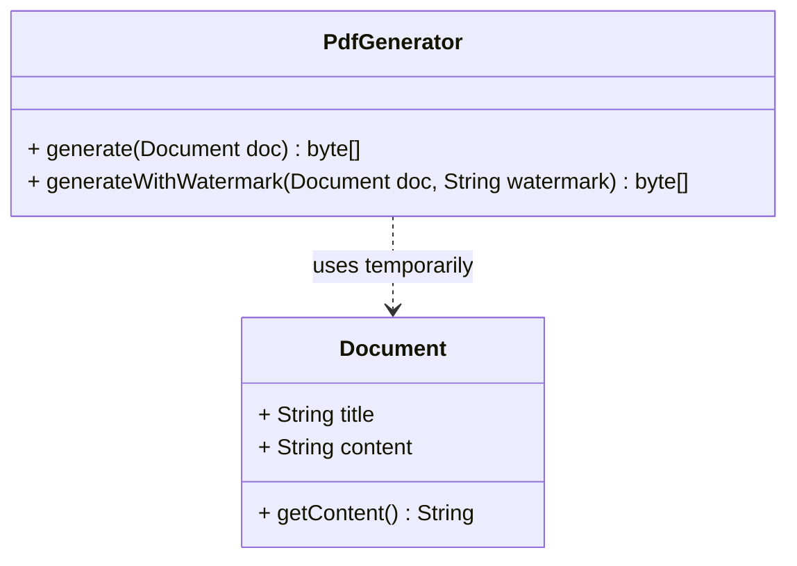
```mermaid
classDiagram
    class PdfGenerator {
        + generate(Document doc) byte[]
        + generateWithWatermark(Document doc, String watermark) byte[]
    }

    class Document {
        + String title
        + String content
        + getContent() String
    }

    PdfGenerator ..> Document : uses temporarily
```

**Mermaid arrow:** `..>` (dashed with arrowhead)

**Interview tip:** If you hear "A uses B only inside a method," draw dependency.

---

### Relationship 2: Association (Regular Colleagues)

**What is it?** A has a reference to B as a field. They interact regularly, but neither owns the other. Both can exist independently.

**Real example:** On Instagram, a `User` posts `Photos`. The User references Photos, but if a user account is deleted, the question of what happens to Photos is a separate business decision — structurally, they're associated, not composed.

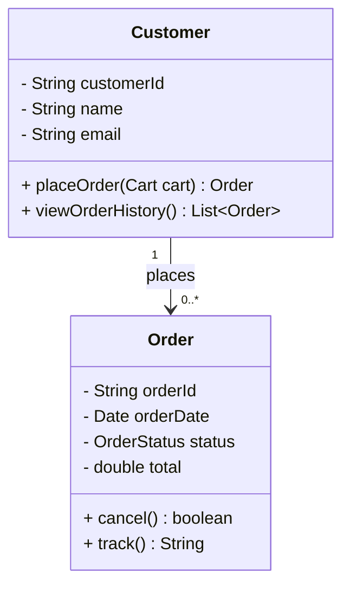
```mermaid
classDiagram
    class Customer {
        - String customerId
        - String name
        - String email
        + placeOrder(Cart cart) Order
        + viewOrderHistory() List~Order~
    }

    class Order {
        - String orderId
        - Date orderDate
        - OrderStatus status
        - double total
        + cancel() boolean
        + track() String
    }

    Customer "1" --> "0..*" Order : places
```

**Mermaid arrow:** `-->` (solid with arrowhead)

**Multiplicity is on the line:** `"1"` to `"0..*"` — one Customer places zero or more Orders.

---

### Relationship 3: Aggregation (Has-A, But Independent)

**What is it?** A "has" B, but B can exist on its own. The classic test: "If A is destroyed, does B still make sense?"

**Real example:** A Spotify `Playlist` has `Songs`. Delete the playlist — the songs still exist everywhere. The songs are not owned by the playlist.

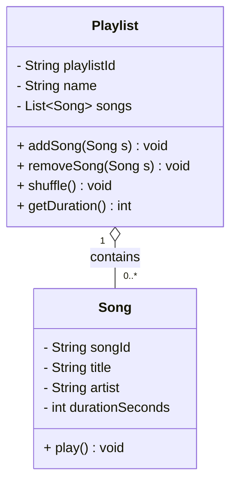
```mermaid
classDiagram
    class Playlist {
        - String playlistId
        - String name
        - List~Song~ songs
        + addSong(Song s) void
        + removeSong(Song s) void
        + shuffle() void
        + getDuration() int
    }

    class Song {
        - String songId
        - String title
        - String artist
        - int durationSeconds
        + play() void
    }

    Playlist "1" o-- "0..*" Song : contains
```

**Mermaid arrow:** `o--` (hollow diamond on owner side, line to child)

**Memory trick:** Open diamond = "Open relationship" — the child can go elsewhere.

---

### Relationship 4: Composition (Owns-A, Life-and-Death Bond)

**What is it?** A owns B completely. If A is destroyed, B is destroyed with it. B cannot meaningfully exist without A.

**Real example:** On Zomato, an `Order` has `OrderItems`. If the Order is cancelled and deleted, the OrderItems have no meaning on their own — they disappear with the order.

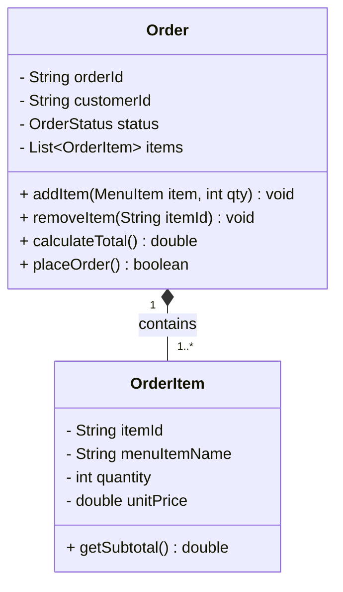
```mermaid
classDiagram
    class Order {
        - String orderId
        - String customerId
        - OrderStatus status
        - List~OrderItem~ items
        + addItem(MenuItem item, int qty) void
        + removeItem(String itemId) void
        + calculateTotal() double
        + placeOrder() boolean
    }

    class OrderItem {
        - String itemId
        - String menuItemName
        - int quantity
        - double unitPrice
        + getSubtotal() double
    }

    Order "1" *-- "1..*" OrderItem : contains
```

**Mermaid arrow:** `*--` (filled diamond on owner side)

**Memory trick:** Filled diamond = "Filled/full ownership." The child cannot escape.

**The Interview Question They Always Ask:**
"What's the difference between aggregation and composition?"
> The answer: lifecycle dependency. In composition, child's lifecycle depends on parent. In aggregation, it doesn't. Ask: "Does destroying A destroy B?" — Yes → Composition. No → Aggregation.

---

### Relationship 5: Inheritance (IS-A Relationship)

**What is it?** B is a specialization of A. B inherits all of A's attributes and methods and may add more.

**Real example:** Netflix has `FreeUser` and `PremiumUser`. Both ARE-A `User`, but PremiumUser gets extra methods like `watchInHD()` and `downloadOffline()`.

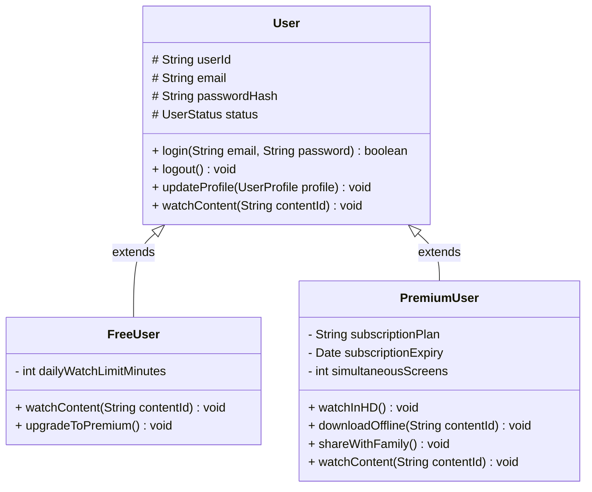
```mermaid
classDiagram
    class User {
        # String userId
        # String email
        # String passwordHash
        # UserStatus status
        + login(String email, String password) boolean
        + logout() void
        + updateProfile(UserProfile profile) void
        + watchContent(String contentId) void
    }

    class FreeUser {
        - int dailyWatchLimitMinutes
        + watchContent(String contentId) void
        + upgradeToPremium() void
    }

    class PremiumUser {
        - String subscriptionPlan
        - Date subscriptionExpiry
        - int simultaneousScreens
        + watchInHD() void
        + downloadOffline(String contentId) void
        + shareWithFamily() void
        + watchContent(String contentId) void
    }

    User <|-- FreeUser : extends
    User <|-- PremiumUser : extends
```

**Mermaid arrow:** `<|--` (hollow triangle, arrow points from child to parent)

**Note:** Arrow points UP (child → parent). "I extend my parent."

---

### Relationship 6: Realization / Interface Implementation

**What is it?** Class A promises to fulfill the contract defined by interface B. A implements every method B declares.

**Real example:** WhatsApp, Email, and SMS are all different ways to send notifications. They all `implement` a `Notifiable` interface. Code that needs to send notifications only cares about the interface, not the implementation.

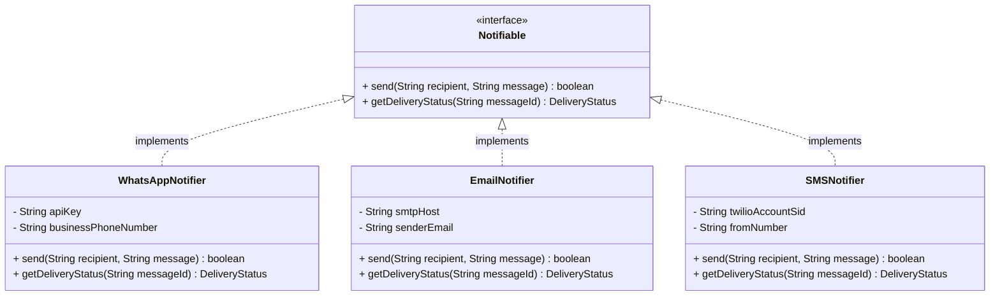
```mermaid
classDiagram
    class Notifiable {
        <<interface>>
        + send(String recipient, String message) boolean
        + getDeliveryStatus(String messageId) DeliveryStatus
    }

    class WhatsAppNotifier {
        - String apiKey
        - String businessPhoneNumber
        + send(String recipient, String message) boolean
        + getDeliveryStatus(String messageId) DeliveryStatus
    }

    class EmailNotifier {
        - String smtpHost
        - String senderEmail
        + send(String recipient, String message) boolean
        + getDeliveryStatus(String messageId) DeliveryStatus
    }

    class SMSNotifier {
        - String twilioAccountSid
        - String fromNumber
        + send(String recipient, String message) boolean
        + getDeliveryStatus(String messageId) DeliveryStatus
    }

    Notifiable <|.. WhatsAppNotifier : implements
    Notifiable <|.. EmailNotifier : implements
    Notifiable <|.. SMSNotifier : implements
```

**Mermaid arrow:** `<|..` (dashed line with hollow triangle — "I promise to do what the interface says")

**`<<interface>>` stereotype tag** tells Mermaid to draw it as an interface box (usually with dashed border).

---

## Part 3 — Multiplicity: How Many Objects?

Multiplicity answers: "For one instance of A, how many instances of B can relate to it?"

| Notation | Meaning | Example |
|---|---|---|
| `1` | Exactly one | An Order belongs to exactly 1 Customer |
| `0..1` | Zero or one (optional) | A User has 0 or 1 Profile Photo |
| `*` or `0..*` | Zero or more | A Library has 0 or more Books |
| `1..*` | One or more (at least one) | An Order has 1 or more OrderItems |
| `2..5` | Between 2 and 5 | A team has 2 to 5 players |

**How to read it on a diagram line:**

```
Customer "1" --> "0..*" Order
```

Read: "One Customer places zero or more Orders."

```
Author "1..*" --> "1..*" Book
```

Read: "One or more Authors write one or more Books." (Many-to-many)

---

## Part 4 — Full Class Diagram Examples

### Example 1: Library Management System

**Entities identified from requirements:** Library, Catalog, Book, BookCopy, Member, Librarian, Loan, Reservation, Fine, Notification

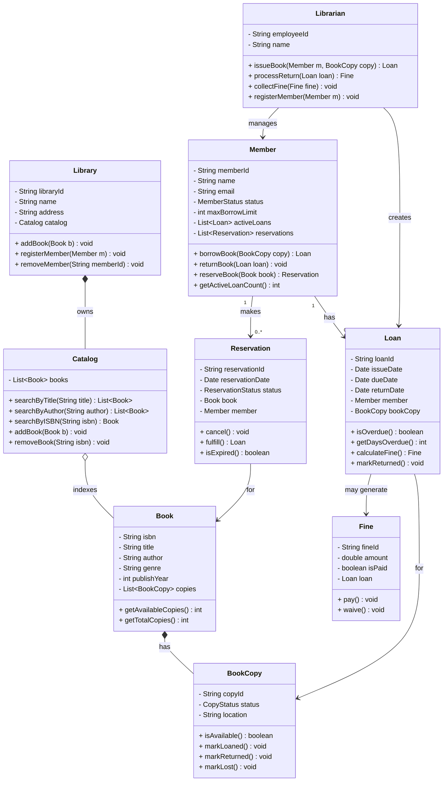
```mermaid
classDiagram
    class Library {
        - String libraryId
        - String name
        - String address
        - Catalog catalog
        + addBook(Book b) void
        + registerMember(Member m) void
        + removeMember(String memberId) void
    }

    class Catalog {
        - List~Book~ books
        + searchByTitle(String title) List~Book~
        + searchByAuthor(String author) List~Book~
        + searchByISBN(String isbn) Book
        + addBook(Book b) void
        + removeBook(String isbn) void
    }

    class Book {
        - String isbn
        - String title
        - String author
        - String genre
        - int publishYear
        - List~BookCopy~ copies
        + getAvailableCopies() int
        + getTotalCopies() int
    }

    class BookCopy {
        - String copyId
        - CopyStatus status
        - String location
        + isAvailable() boolean
        + markLoaned() void
        + markReturned() void
        + markLost() void
    }

    class Member {
        - String memberId
        - String name
        - String email
        - MemberStatus status
        - int maxBorrowLimit
        - List~Loan~ activeLoans
        - List~Reservation~ reservations
        + borrowBook(BookCopy copy) Loan
        + returnBook(Loan loan) void
        + reserveBook(Book book) Reservation
        + getActiveLoanCount() int
    }

    class Librarian {
        - String employeeId
        - String name
        + issueBook(Member m, BookCopy copy) Loan
        + processReturn(Loan loan) Fine
        + collectFine(Fine fine) void
        + registerMember(Member m) void
    }

    class Loan {
        - String loanId
        - Date issueDate
        - Date dueDate
        - Date returnDate
        - Member member
        - BookCopy bookCopy
        + isOverdue() boolean
        + getDaysOverdue() int
        + calculateFine() Fine
        + markReturned() void
    }

    class Reservation {
        - String reservationId
        - Date reservationDate
        - ReservationStatus status
        - Book book
        - Member member
        + cancel() void
        + fulfill() Loan
        + isExpired() boolean
    }

    class Fine {
        - String fineId
        - double amount
        - boolean isPaid
        - Loan loan
        + pay() void
        + waive() void
    }

    Library *-- Catalog : owns
    Catalog o-- Book : indexes
    Book *-- BookCopy : has
    Member "1" --> "0..*" Loan : has
    Member "1" --> "0..*" Reservation : makes
    Librarian --> Member : manages
    Librarian --> Loan : creates
    Loan --> BookCopy : for
    Loan --> Fine : may generate
    Reservation --> Book : for
```

**Design decisions called out:**
- `Library *-- Catalog` is Composition: destroy the Library, the Catalog is gone.
- `Catalog o-- Book` is Aggregation: a Book could theoretically be in multiple catalogs.
- `Book *-- BookCopy` is Composition: a BookCopy with no parent Book is meaningless.
- `Member --> Loan` is Association: both can exist independently; a member might have no loans.

---

### Example 2: Bank Account System

**Requirement:** Model a banking system with different account types, transactions, and cards.

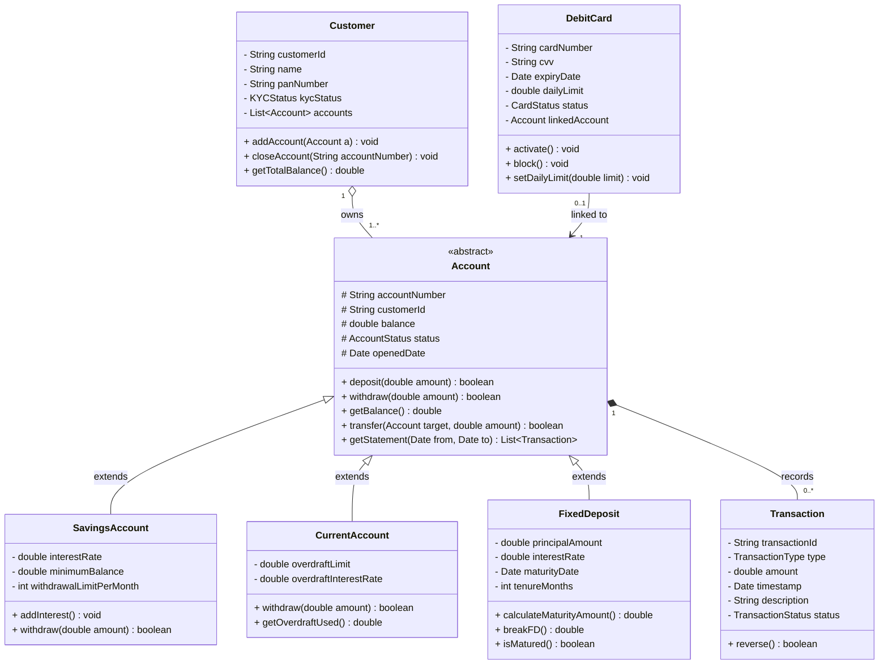
```mermaid
classDiagram
    class Account {
        <<abstract>>
        # String accountNumber
        # String customerId
        # double balance
        # AccountStatus status
        # Date openedDate
        + deposit(double amount) boolean
        + withdraw(double amount) boolean
        + getBalance() double
        + transfer(Account target, double amount) boolean
        + getStatement(Date from, Date to) List~Transaction~
    }

    class SavingsAccount {
        - double interestRate
        - double minimumBalance
        - int withdrawalLimitPerMonth
        + addInterest() void
        + withdraw(double amount) boolean
    }

    class CurrentAccount {
        - double overdraftLimit
        - double overdraftInterestRate
        + withdraw(double amount) boolean
        + getOverdraftUsed() double
    }

    class FixedDeposit {
        - double principalAmount
        - double interestRate
        - Date maturityDate
        - int tenureMonths
        + calculateMaturityAmount() double
        + breakFD() double
        + isMatured() boolean
    }

    class Transaction {
        - String transactionId
        - TransactionType type
        - double amount
        - Date timestamp
        - String description
        - TransactionStatus status
        + reverse() boolean
    }

    class Customer {
        - String customerId
        - String name
        - String panNumber
        - KYCStatus kycStatus
        - List~Account~ accounts
        + addAccount(Account a) void
        + closeAccount(String accountNumber) void
        + getTotalBalance() double
    }

    class DebitCard {
        - String cardNumber
        - String cvv
        - Date expiryDate
        - double dailyLimit
        - CardStatus status
        - Account linkedAccount
        + activate() void
        + block() void
        + setDailyLimit(double limit) void
    }

    Account <|-- SavingsAccount : extends
    Account <|-- CurrentAccount : extends
    Account <|-- FixedDeposit : extends
    Customer "1" o-- "1..*" Account : owns
    Account "1" *-- "0..*" Transaction : records
    DebitCard "0..1" --> "1" Account : linked to
```

---

### Example 3: Vehicle Rental System (Ola / Uber Style)

**Requirement:** Design a vehicle rental platform where users can book vehicles.

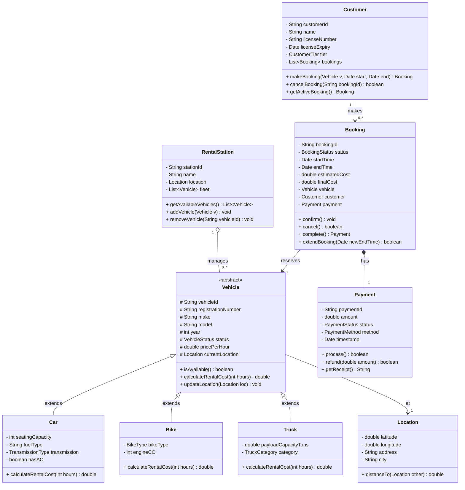
```mermaid
classDiagram
    class Vehicle {
        <<abstract>>
        # String vehicleId
        # String registrationNumber
        # String make
        # String model
        # int year
        # VehicleStatus status
        # double pricePerHour
        # Location currentLocation
        + isAvailable() boolean
        + calculateRentalCost(int hours) double
        + updateLocation(Location loc) void
    }

    class Car {
        - int seatingCapacity
        - String fuelType
        - TransmissionType transmission
        - boolean hasAC
        + calculateRentalCost(int hours) double
    }

    class Bike {
        - BikeType bikeType
        - int engineCC
        + calculateRentalCost(int hours) double
    }

    class Truck {
        - double payloadCapacityTons
        - TruckCategory category
        + calculateRentalCost(int hours) double
    }

    class Customer {
        - String customerId
        - String name
        - String licenseNumber
        - Date licenseExpiry
        - CustomerTier tier
        - List~Booking~ bookings
        + makeBooking(Vehicle v, Date start, Date end) Booking
        + cancelBooking(String bookingId) boolean
        + getActiveBooking() Booking
    }

    class Booking {
        - String bookingId
        - BookingStatus status
        - Date startTime
        - Date endTime
        - double estimatedCost
        - double finalCost
        - Vehicle vehicle
        - Customer customer
        - Payment payment
        + confirm() void
        + cancel() boolean
        + complete() Payment
        + extendBooking(Date newEndTime) boolean
    }

    class Payment {
        - String paymentId
        - double amount
        - PaymentStatus status
        - PaymentMethod method
        - Date timestamp
        + process() boolean
        + refund(double amount) boolean
        + getReceipt() String
    }

    class Location {
        - double latitude
        - double longitude
        - String address
        - String city
        + distanceTo(Location other) double
    }

    class RentalStation {
        - String stationId
        - String name
        - Location location
        - List~Vehicle~ fleet
        + getAvailableVehicles() List~Vehicle~
        + addVehicle(Vehicle v) void
        + removeVehicle(String vehicleId) void
    }

    Vehicle <|-- Car : extends
    Vehicle <|-- Bike : extends
    Vehicle <|-- Truck : extends
    Customer "1" --> "0..*" Booking : makes
    Booking --> "1" Vehicle : reserves
    Booking *-- "1" Payment : has
    RentalStation "1" o-- "0..*" Vehicle : manages
    Vehicle --> "1" Location : at
```

---

## Part 5 — Sequence Diagrams: The Screenplay of Your System

### The Analogy

A sequence diagram is like a WhatsApp group chat, but ordered and formal. Every participant is a vertical "lifeline." Messages are horizontal arrows between lifelines. Time flows downward. You can see exactly who said what to whom and in what order.

### Notation Reference

| Element | What It Represents | Mermaid Syntax |
|---|---|---|
| Box at top | Participant (object/service) | `participant ServiceName` |
| Actor at top | External human or system | `actor UserName` |
| Solid arrow | Synchronous call (caller waits for response) | `A->>B: message` |
| Dashed arrow | Return/response message | `B-->>A: response` |
| Activation box | Object is busy processing | `activate B` / `deactivate B` |
| `alt` block | If/else branching | `alt condition` / `else` / `end` |
| `opt` block | Optional flow | `opt condition` |
| `loop` block | Repeating interaction | `loop condition` |
| `par` block | Parallel execution | `par` / `and` / `end` |
| Self-arrow | Object calls itself | `A->>A: internal call` |

---

### Sequence Diagram 1: User Authentication (Login Flow)

This is the sequence that happens when you log in to Instagram or any app. Every arrow represents one network/function call.

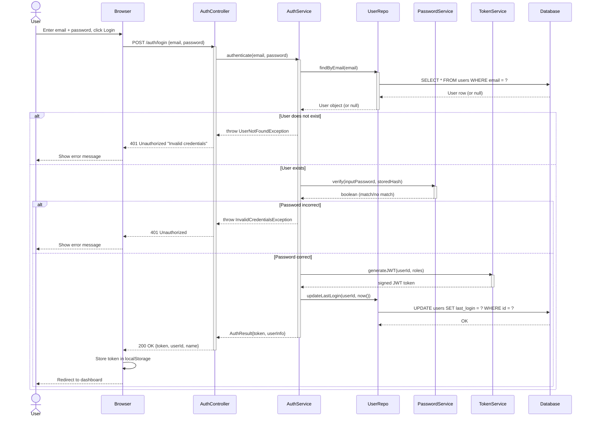
```mermaid
sequenceDiagram
    actor User
    participant Browser
    participant AuthController
    participant AuthService
    participant UserRepo
    participant PasswordService
    participant TokenService
    participant Database

    User->>Browser: Enter email + password, click Login

    Browser->>AuthController: POST /auth/login {email, password}
    activate AuthController

    AuthController->>AuthService: authenticate(email, password)
    activate AuthService

    AuthService->>UserRepo: findByEmail(email)
    activate UserRepo
    UserRepo->>Database: SELECT * FROM users WHERE email = ?
    Database-->>UserRepo: User row (or null)
    UserRepo-->>AuthService: User object (or null)
    deactivate UserRepo

    alt User does not exist
        AuthService-->>AuthController: throw UserNotFoundException
        AuthController-->>Browser: 401 Unauthorized "Invalid credentials"
        Browser-->>User: Show error message
    else User exists
        AuthService->>PasswordService: verify(inputPassword, storedHash)
        activate PasswordService
        PasswordService-->>AuthService: boolean (match/no match)
        deactivate PasswordService

        alt Password incorrect
            AuthService-->>AuthController: throw InvalidCredentialsException
            AuthController-->>Browser: 401 Unauthorized
            Browser-->>User: Show error message
        else Password correct
            AuthService->>TokenService: generateJWT(userId, roles)
            activate TokenService
            TokenService-->>AuthService: signed JWT token
            deactivate TokenService

            AuthService->>UserRepo: updateLastLogin(userId, now())
            UserRepo->>Database: UPDATE users SET last_login = ? WHERE id = ?
            Database-->>UserRepo: OK

            AuthService-->>AuthController: AuthResult{token, userInfo}
            deactivate AuthService

            AuthController-->>Browser: 200 OK {token, userId, name}
            deactivate AuthController

            Browser->>Browser: Store token in localStorage
            Browser-->>User: Redirect to dashboard
        end
    end
```

**Reading tips:**
- `alt` shows defensive thinking — "what can go wrong?"
- `activate`/`deactivate` shows what's on the call stack
- Dashed arrows `-->>` are responses; solid arrows `->>` are calls

---

### Sequence Diagram 2: Payment Processing (Swiggy/Zomato Checkout)

This is what happens when you tap "Place Order" and pay on a food delivery app.

```mermaid
sequenceDiagram
    actor Customer
    participant OrderService
    participant PaymentService
    participant PaymentGateway
    participant BankAPI
    participant NotificationService
    participant RestaurantService

    Customer->>OrderService: POST /orders {cartId, addressId, paymentMethodId}
    activate OrderService

    OrderService->>OrderService: validateCart(cartId)
    OrderService->>OrderService: calculateTotal()

    OrderService->>PaymentService: initiatePayment(orderId, amount, methodId)
    activate PaymentService

    PaymentService->>PaymentGateway: createTransaction(amount, methodId, orderId)
    activate PaymentGateway

    PaymentGateway->>BankAPI: processCharge(cardToken, amount)
    activate BankAPI

    alt Bank declines transaction
        BankAPI-->>PaymentGateway: DECLINED {reason}
        PaymentGateway-->>PaymentService: PaymentResult{status: FAILED, reason}
        PaymentService-->>OrderService: throw PaymentFailedException
        OrderService-->>Customer: 402 Payment Required "Card declined"
        deactivate BankAPI
        deactivate PaymentGateway
        deactivate PaymentService
        deactivate OrderService
    else Bank approves
        BankAPI-->>PaymentGateway: APPROVED {transactionId}
        deactivate BankAPI

        PaymentGateway-->>PaymentService: PaymentResult{status: SUCCESS, txnId}
        deactivate PaymentGateway

        PaymentService->>PaymentService: recordTransaction(txnId, orderId)
        PaymentService-->>OrderService: PaymentConfirmation{txnId}
        deactivate PaymentService

        OrderService->>OrderService: confirmOrder(orderId)

        par Notify customer
            OrderService->>NotificationService: sendOrderConfirmation(customerId, orderId)
            NotificationService-->>Customer: Push notification + SMS
        and Notify restaurant
            OrderService->>RestaurantService: notifyNewOrder(restaurantId, orderId)
            RestaurantService-->>OrderService: acknowledged
        end

        OrderService-->>Customer: 201 Created {orderId, estimatedTime}
        deactivate OrderService
    end
```

**Notice the `par` block:** Customer gets notified AND restaurant gets notified at the same time — parallel execution!

---

### Sequence Diagram 3: Place Order on E-commerce (Flipkart Style)

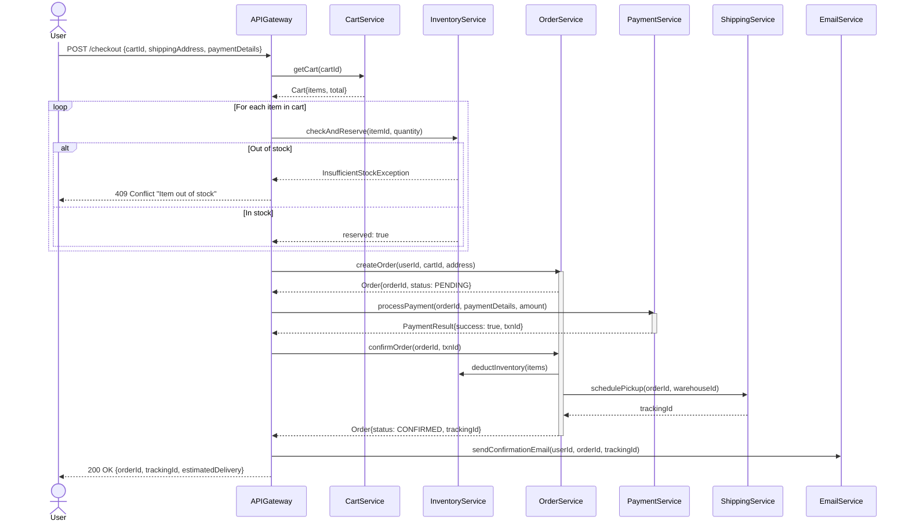
```mermaid
sequenceDiagram
    actor User
    participant APIGateway
    participant CartService
    participant InventoryService
    participant OrderService
    participant PaymentService
    participant ShippingService
    participant EmailService

    User->>APIGateway: POST /checkout {cartId, shippingAddress, paymentDetails}
    APIGateway->>CartService: getCart(cartId)
    CartService-->>APIGateway: Cart{items, total}

    loop For each item in cart
        APIGateway->>InventoryService: checkAndReserve(itemId, quantity)
        alt Out of stock
            InventoryService-->>APIGateway: InsufficientStockException
            APIGateway-->>User: 409 Conflict "Item out of stock"
        else In stock
            InventoryService-->>APIGateway: reserved: true
        end
    end

    APIGateway->>OrderService: createOrder(userId, cartId, address)
    activate OrderService
    OrderService-->>APIGateway: Order{orderId, status: PENDING}

    APIGateway->>PaymentService: processPayment(orderId, paymentDetails, amount)
    activate PaymentService
    PaymentService-->>APIGateway: PaymentResult{success: true, txnId}
    deactivate PaymentService

    APIGateway->>OrderService: confirmOrder(orderId, txnId)
    OrderService->>InventoryService: deductInventory(items)
    OrderService->>ShippingService: schedulePickup(orderId, warehouseId)
    ShippingService-->>OrderService: trackingId

    OrderService-->>APIGateway: Order{status: CONFIRMED, trackingId}
    deactivate OrderService

    APIGateway->>EmailService: sendConfirmationEmail(userId, orderId, trackingId)
    APIGateway-->>User: 200 OK {orderId, trackingId, estimatedDelivery}
```

---

## Part 6 — State Machine Diagrams: The Lifecycle Story

### The Analogy

A state machine is like the story of a parcel from Flipkart. The parcel doesn't just "exist" — it goes through stages: PLACED → CONFIRMED → SHIPPED → OUT_FOR_DELIVERY → DELIVERED. At each stage, certain events trigger the transition. Some transitions are allowed, others are not (you can't go from DELIVERED back to SHIPPED under normal circumstances).

Basically, state diagrams answer: "What are the stages of an entity's life, and what causes it to move between stages?"

### State Diagram Syntax

| Element | Mermaid Syntax | Meaning |
|---|---|---|
| State | `state "Name" as alias` or just a label | A stable condition the entity can be in |
| Initial state | `[*] --> StateName` | Where life begins |
| Final state | `StateName --> [*]` | Where life ends |
| Transition | `A --> B : event` | Event that causes the move |
| Nested states | `state A { B --> C }` | Compound state with sub-states |

---

### State Machine 1: Elevator States

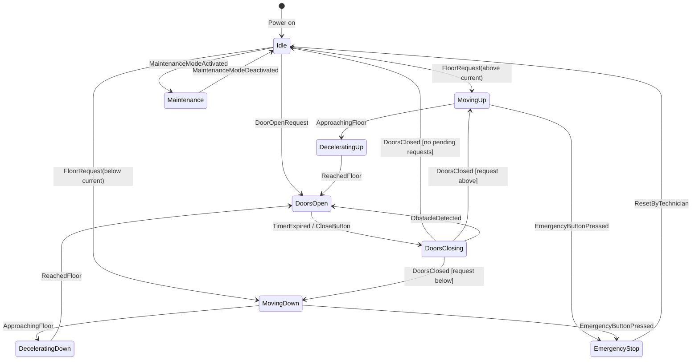
```mermaid
stateDiagram-v2
    [*] --> Idle : Power on

    Idle --> MovingUp : FloorRequest(above current)
    Idle --> MovingDown : FloorRequest(below current)
    Idle --> DoorsOpen : DoorOpenRequest

    MovingUp --> DeceleratingUp : ApproachingFloor
    MovingDown --> DeceleratingDown : ApproachingFloor

    DeceleratingUp --> DoorsOpen : ReachedFloor
    DeceleratingDown --> DoorsOpen : ReachedFloor

    DoorsOpen --> DoorsClosing : TimerExpired / CloseButton
    DoorsClosing --> Idle : DoorsClosed [no pending requests]
    DoorsClosing --> MovingUp : DoorsClosed [request above]
    DoorsClosing --> MovingDown : DoorsClosed [request below]

    DoorsClosing --> DoorsOpen : ObstacleDetected

    MovingUp --> EmergencyStop : EmergencyButtonPressed
    MovingDown --> EmergencyStop : EmergencyButtonPressed
    EmergencyStop --> Idle : ResetByTechnician

    Idle --> Maintenance : MaintenanceModeActivated
    Maintenance --> Idle : MaintenanceModeDeactivated
```

**Each state represents a stable condition. Each transition shows what event causes the change.**

---

### State Machine 2: Order States (Zomato/Swiggy Order Lifecycle)

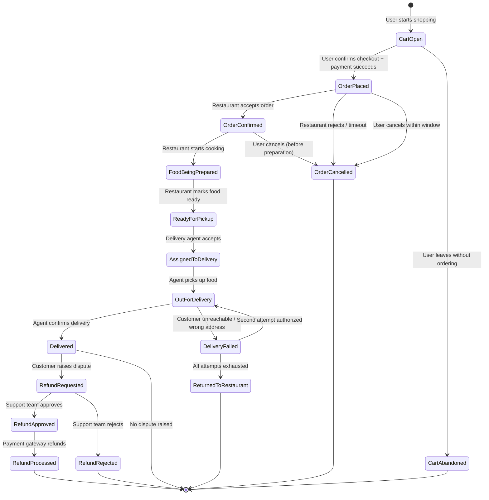
```mermaid
stateDiagram-v2
    [*] --> CartOpen : User starts shopping

    CartOpen --> OrderPlaced : User confirms checkout + payment succeeds
    CartOpen --> CartAbandoned : User leaves without ordering
    CartAbandoned --> [*]

    OrderPlaced --> OrderConfirmed : Restaurant accepts order
    OrderPlaced --> OrderCancelled : Restaurant rejects / timeout
    OrderPlaced --> OrderCancelled : User cancels within window

    OrderConfirmed --> FoodBeingPrepared : Restaurant starts cooking
    OrderConfirmed --> OrderCancelled : User cancels (before preparation)

    FoodBeingPrepared --> ReadyForPickup : Restaurant marks food ready

    ReadyForPickup --> AssignedToDelivery : Delivery agent accepts

    AssignedToDelivery --> OutForDelivery : Agent picks up food

    OutForDelivery --> Delivered : Agent confirms delivery
    OutForDelivery --> DeliveryFailed : Customer unreachable / wrong address

    DeliveryFailed --> OutForDelivery : Second attempt authorized
    DeliveryFailed --> ReturnedToRestaurant : All attempts exhausted

    Delivered --> RefundRequested : Customer raises dispute
    RefundRequested --> RefundApproved : Support team approves
    RefundRequested --> RefundRejected : Support team rejects
    RefundApproved --> RefundProcessed : Payment gateway refunds

    RefundProcessed --> [*]
    RefundRejected --> [*]
    OrderCancelled --> [*]
    ReturnedToRestaurant --> [*]
    Delivered --> [*] : No dispute raised
```

---

### State Machine 3: Traffic Light

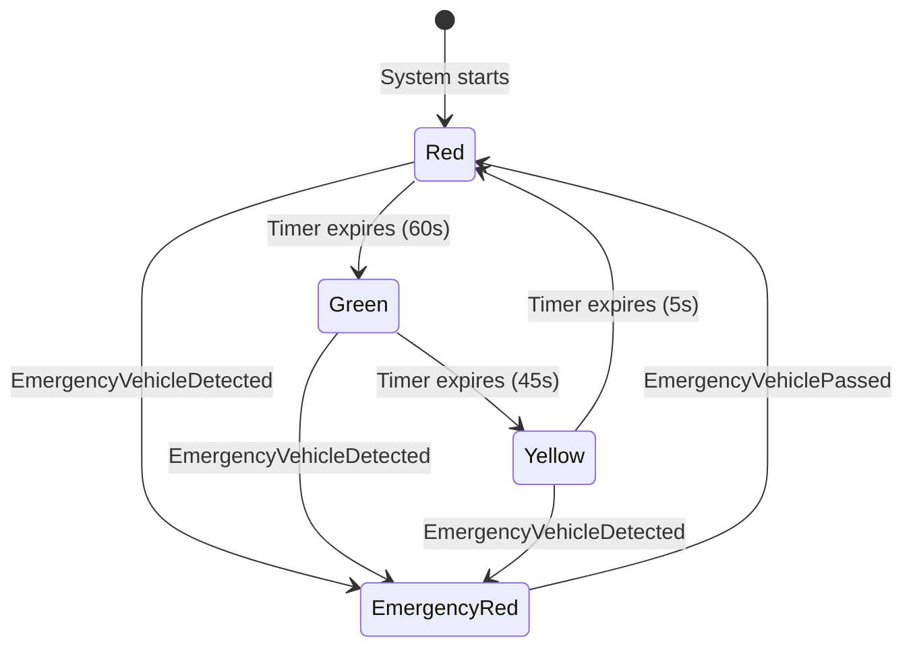
```mermaid
stateDiagram-v2
    [*] --> Red : System starts

    Red --> Green : Timer expires (60s)
    Green --> Yellow : Timer expires (45s)
    Yellow --> Red : Timer expires (5s)

    Red --> EmergencyRed : EmergencyVehicleDetected
    Green --> EmergencyRed : EmergencyVehicleDetected
    Yellow --> EmergencyRed : EmergencyVehicleDetected

    EmergencyRed --> Red : EmergencyVehiclePassed
```

**Interview insight:** State diagrams are brilliant for explaining the lifecycle of orders, payments, sessions, subscriptions, or any entity that has well-defined stages. When an interviewer asks "what happens when..." — a state diagram is often the clearest answer.

---

## Part 7 — Activity Diagrams: The Recipe with Decision Points

### The Analogy

An activity diagram is like a recipe, but with branching paths. "If the dough is too sticky, add flour. If the oven is not hot enough, wait 5 more minutes. Meanwhile, prepare the toppings in parallel." It models FLOW — with conditions, loops, and parallel tasks.

**Activity diagrams vs Sequence diagrams:**
- Activity diagram: WHAT happens and in WHAT ORDER (process-centric)
- Sequence diagram: WHO does it and HOW THEY COMMUNICATE (message-centric)

### Core Elements

| Element | Appearance | Mermaid Representation |
|---|---|---|
| Start | Filled circle | `([Start])` or `A[Start]` |
| End | Filled circle in ring | `([End])` |
| Activity | Rounded rectangle | `[Do something]` |
| Decision | Diamond | `{Is condition true?}` |
| Fork (parallel start) | Thick horizontal bar | Multiple arrows from one node |
| Join (parallel end) | Thick horizontal bar | Multiple arrows into one node |
| Swim lane | Partition by actor | Column layout in flowchart |

---

### Activity Diagram 1: Book Borrowing Process

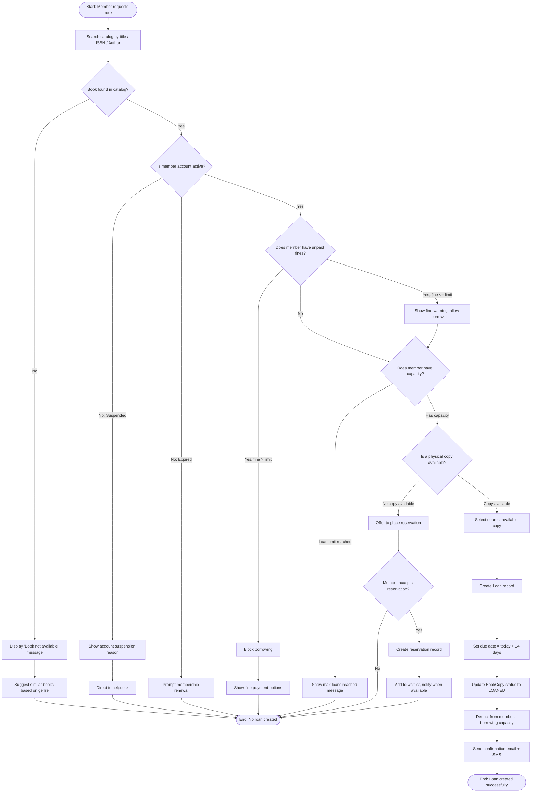
```mermaid
flowchart TD
    A([Start: Member requests book]) --> B[Search catalog by title / ISBN / Author]
    B --> C{Book found in catalog?}

    C -- No --> D[Display 'Book not available' message]
    D --> E[Suggest similar books based on genre]
    E --> F([End: No loan created])

    C -- Yes --> G{Is member account active?}

    G -- No: Suspended --> H[Show account suspension reason]
    H --> I[Direct to helpdesk]
    I --> F

    G -- No: Expired --> J[Prompt membership renewal]
    J --> F

    G -- Yes --> K{Does member have unpaid fines?}

    K -- Yes, fine > limit --> L[Block borrowing]
    L --> M[Show fine payment options]
    M --> F

    K -- Yes, fine <= limit --> N[Show fine warning, allow borrow]
    K -- No --> O{Does member have capacity?}
    N --> O

    O -- Loan limit reached --> P[Show max loans reached message]
    P --> F

    O -- Has capacity --> Q{Is a physical copy available?}

    Q -- No copy available --> R[Offer to place reservation]
    R --> S{Member accepts reservation?}
    S -- No --> F
    S -- Yes --> T[Create reservation record]
    T --> U[Add to waitlist, notify when available]
    U --> F

    Q -- Copy available --> V[Select nearest available copy]
    V --> W[Create Loan record]
    W --> X[Set due date = today + 14 days]
    X --> Y[Update BookCopy status to LOANED]
    Y --> Z[Deduct from member's borrowing capacity]
    Z --> AA[Send confirmation email + SMS]
    AA --> AB([End: Loan created successfully])
```

---

### Activity Diagram 2: User Registration Flow with Parallel Tasks

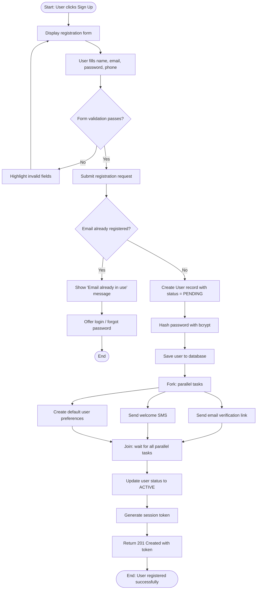
```mermaid
flowchart TD
    A([Start: User clicks Sign Up]) --> B[Display registration form]
    B --> C[User fills name, email, password, phone]
    C --> D{Form validation passes?}

    D -- No --> E[Highlight invalid fields]
    E --> B

    D -- Yes --> F[Submit registration request]
    F --> G{Email already registered?}

    G -- Yes --> H[Show 'Email already in use' message]
    H --> I[Offer login / forgot password]
    I --> J([End])

    G -- No --> K[Create User record with status = PENDING]
    K --> L[Hash password with bcrypt]
    L --> M[Save user to database]

    M --> N[Fork: parallel tasks]

    N --> O[Send email verification link]
    N --> P[Send welcome SMS]
    N --> Q[Create default user preferences]

    O --> R[Join: wait for all parallel tasks]
    P --> R
    Q --> R

    R --> S[Update user status to ACTIVE]
    S --> T[Generate session token]
    T --> U[Return 201 Created with token]
    U --> V([End: User registered successfully])
```

**The fork and join show parallel operations** — sending email, sending SMS, creating preferences all happen simultaneously. This is a key design detail: don't do them sequentially if they're independent!

---

### Activity Diagram 3: Uber Ride Request Flow (with Swim Lanes)

Swim lanes show WHICH ACTOR does each activity. Great for multi-party processes.

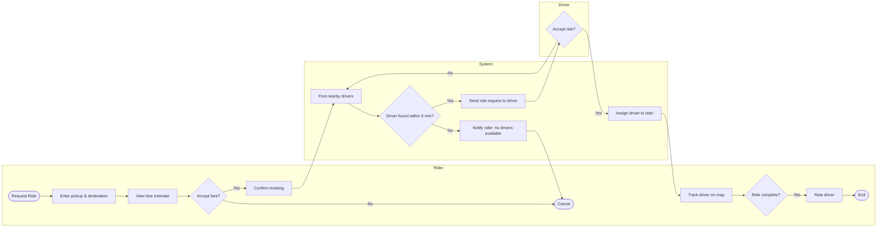
```mermaid
flowchart LR
    subgraph Rider
        A([Request Ride]) --> B[Enter pickup & destination]
        B --> C[View fare estimate]
        C --> D{Accept fare?}
        D -- No --> E([Cancel])
        D -- Yes --> F[Confirm booking]
        M[Track driver on map] --> N{Ride complete?}
        N -- Yes --> O[Rate driver]
        O --> P([End])
    end

    subgraph System
        F --> G[Find nearby drivers]
        G --> H{Driver found within 5 min?}
        H -- No --> I[Notify rider: no drivers available]
        I --> E
        H -- Yes --> J[Send ride request to driver]
        L[Assign driver to rider] --> M
    end

    subgraph Driver
        J --> K{Accept ride?}
        K -- No --> G
        K -- Yes --> L
    end
```

---

## Part 8 — Use Case Diagrams: Scope at a Glance

### The Analogy

A use case diagram is like the menu board at McDonald's. It shows what you can order (use cases), who can order it (actors), and special combos or dependencies (include/extend). It does NOT show how the burger is made — that is the sequence diagram's job.

Use case diagrams are great for ONE thing: communicating scope. Use them at the very start of an LLD interview to align with the interviewer on "what are we building?"

### Key Notations

| Element | Symbol | Meaning |
|---|---|---|
| Actor | Stick figure | External entity that interacts with system |
| Use Case | Oval / ellipse | A system capability |
| System boundary | Rectangle | What is inside vs outside scope |
| `<<include>>` | Dashed arrow | Use case ALWAYS calls another (mandatory sub-step) |
| `<<extend>>` | Dashed arrow | Use case OPTIONALLY adds to another (conditional) |
| Generalization | Solid arrow | One actor/use case specializes another |

### Include vs Extend — The Tricky Part

**`<<include>>`:** "Every time I do A, I must also do B."
- Example: "Place Order" always includes "Authenticate User" — you can't order without being logged in.

**`<<extend>>`:** "Sometimes when I do A, I also do B, but only if a condition is met."
- Example: "Return Book" extends "Calculate Fine" — fine calculation only happens IF the book is overdue.

### Use Case Example: E-Commerce Platform (Flipkart/Amazon)

```
[Customer]
  → Browse Products
  → Search Products
  → View Product Details
  → Add to Cart
  → Place Order
      <<includes>> Authenticate User
      <<includes>> Check Inventory
      <<includes>> Process Payment
      <<extends>> Apply Coupon      (only if customer has a coupon)
  → Track Order
  → Return Product
      <<extends>> Process Refund    (only if return is approved)
  → Write Review
  → View Order History

[Admin]
  → Manage Products
  → Manage Inventory
  → View Reports
  → Manage Customers
  → Handle Refunds

[System]
  → Send Order Confirmation Email   <<extends>> Place Order
  → Send Shipping Notification      <<extends>> Ship Order
  → Send Low Stock Alert            <<extends>> Check Inventory
```

**When to draw use case diagrams in an interview:**
1. At the very START to agree on scope with the interviewer
2. When asked "who are the actors in this system?"
3. When showing a non-technical stakeholder what the system does

---

## Part 9 — Which Diagram to Use When?

This is the meta-skill. Knowing WHAT to draw when someone says "design X" is as important as knowing how to draw it.

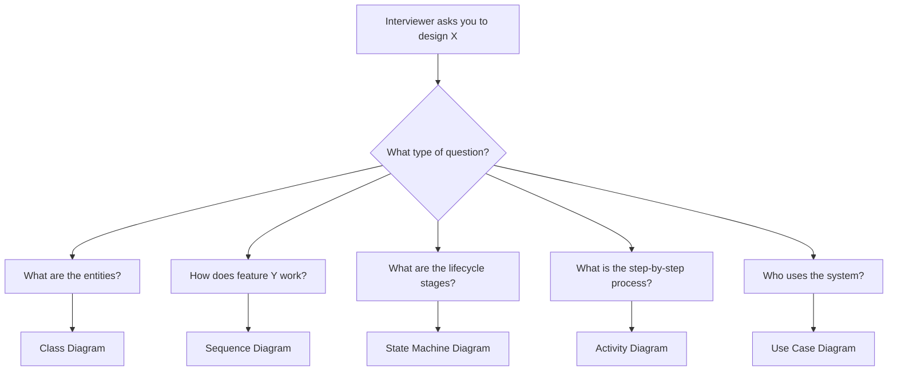
```mermaid
flowchart TD
    A[Interviewer asks you to design X] --> B{What type of question?}

    B --> C[What are the entities?]
    C --> D[Class Diagram]

    B --> E[How does feature Y work?]
    E --> F[Sequence Diagram]

    B --> G[What are the lifecycle stages?]
    G --> H[State Machine Diagram]

    B --> I[What is the step-by-step process?]
    I --> J[Activity Diagram]

    B --> K[Who uses the system?]
    K --> L[Use Case Diagram]
```

### The Decision Table

| Question | Best Diagram | Why |
|---|---|---|
| "What are the classes?" | Class Diagram | Shows structure and relationships |
| "How does login work?" | Sequence Diagram | Shows message flow over time |
| "Walk me through checkout" | Sequence Diagram | Shows who calls whom |
| "What states can an order be in?" | State Machine | Shows lifecycle stages |
| "What happens when user registers?" | Activity Diagram | Shows step-by-step process with branching |
| "Who uses this system?" | Use Case Diagram | Shows actors and capabilities |
| "Design the Observer pattern" | Class Diagram | Shows class relationships |
| "Design the API for payment" | Sequence Diagram | Shows API call order |
| "Explain idempotency in payments" | Activity Diagram | Shows retry logic with conditions |

### Combining Diagrams (The Power Move)

In a 45-minute LLD interview, a great answer uses:

1. **Use Case Diagram (2 min):** "Here are the actors and main features."
2. **Class Diagram (10 min):** "Here are my entities, relationships, and key methods."
3. **Sequence Diagram (8 min):** "Now let me prove this design works by tracing through the checkout flow."
4. **State Diagram (5 min, if applicable):** "The Order entity goes through these lifecycle states."

---

## Part 10 — Design Pattern Class Diagrams

### Observer Pattern — Stock Market Alert System

Think of Zerodha's real-time stock alerts. The `StockMarket` (Subject) pushes price changes to all registered watchers — mobile alerts, email, dashboard — without knowing their details.

```mermaid
classDiagram
    class Observer {
        <<interface>>
        + update(StockEvent event) void
    }

    class Subject {
        <<interface>>
        + registerObserver(Observer o) void
        + removeObserver(Observer o) void
        + notifyObservers() void
    }

    class StockMarket {
        - List~Observer~ observers
        - String stockSymbol
        - double currentPrice
        - double previousPrice
        + registerObserver(Observer o) void
        + removeObserver(Observer o) void
        + notifyObservers() void
        + updatePrice(double newPrice) void
    }

    class MobileAlertObserver {
        - String deviceToken
        - double alertThreshold
        + update(StockEvent event) void
        - sendPushNotification(String message) void
    }

    class EmailObserver {
        - String emailAddress
        - String recipientName
        + update(StockEvent event) void
        - sendEmail(String subject, String body) void
    }

    class DashboardObserver {
        - String dashboardId
        - ChartComponent chart
        + update(StockEvent event) void
        - refreshChart(double newPrice) void
        - updateStats() void
    }

    Subject <|.. StockMarket : implements
    Observer <|.. MobileAlertObserver : implements
    Observer <|.. EmailObserver : implements
    Observer <|.. DashboardObserver : implements
    StockMarket "1" o-- "0..*" Observer : maintains
```

### Strategy Pattern — Payment Gateway

Think of PhonePe supporting UPI, Credit Card, Wallet, Net Banking. The payment strategy is swappable at runtime without changing the checkout code.

```mermaid
classDiagram
    class PaymentStrategy {
        <<interface>>
        + pay(double amount, PaymentDetails details) PaymentResult
        + refund(String transactionId, double amount) RefundResult
        + validate(PaymentDetails details) boolean
    }

    class UPIStrategy {
        - String upiGatewayUrl
        - String merchantVPA
        + pay(double amount, PaymentDetails details) PaymentResult
        + refund(String transactionId, double amount) RefundResult
        + validate(PaymentDetails details) boolean
    }

    class CreditCardStrategy {
        - String cardGatewayUrl
        - String merchantId
        + pay(double amount, PaymentDetails details) PaymentResult
        + refund(String transactionId, double amount) RefundResult
        + validate(PaymentDetails details) boolean
        - tokenizeCard(String cardNumber) String
    }

    class WalletStrategy {
        - String walletServiceUrl
        + pay(double amount, PaymentDetails details) PaymentResult
        + refund(String transactionId, double amount) RefundResult
        + validate(PaymentDetails details) boolean
        + checkBalance(String walletId) double
    }

    class CheckoutService {
        - PaymentStrategy paymentStrategy
        - OrderService orderService
        + setPaymentStrategy(PaymentStrategy strategy) void
        + processCheckout(Cart cart, PaymentDetails details) Order
        - calculateTotal(Cart cart) double
    }

    PaymentStrategy <|.. UPIStrategy : implements
    PaymentStrategy <|.. CreditCardStrategy : implements
    PaymentStrategy <|.. WalletStrategy : implements
    CheckoutService --> PaymentStrategy : uses
```

---

## Part 11 — Mermaid Quick Reference Cheat Sheet

### Class Diagram Arrows

| Relationship | Mermaid Syntax | Example |
|---|---|---|
| Association | `A --> B` | `Customer --> Order` |
| Aggregation | `A o-- B` | `Team o-- Player` |
| Composition | `A *-- B` | `Order *-- OrderItem` |
| Inheritance | `A <\|-- B` | `Account <\|-- SavingsAccount` |
| Realization | `A <\|.. B` | `Notifiable <\|.. EmailNotifier` |
| Dependency | `A ..> B` | `ReportService ..> PdfLib` |

### Sequence Diagram Arrows

| Arrow | Mermaid Syntax | Meaning |
|---|---|---|
| Sync call | `A->>B: message` | A calls B, waits for response |
| Response | `B-->>A: result` | B returns to A |
| Async | `A-)B: message` | A fires and does not wait |
| Destroy | `A-xB: message` | Message destroys B |

### State Diagram Transitions

```mermaid
stateDiagram-v2
    [*] --> StateA : initial event
    StateA --> StateB : event [guard condition] / action
    StateB --> [*] : terminal event
    StateA --> StateA : self-transition event
```

### Stereotype Tags

| Tag | Meaning |
|---|---|
| `<<interface>>` | Interface declaration |
| `<<abstract>>` | Abstract class |
| `<<enum>>` | Enumeration |
| `<<service>>` | Service class |
| `<<repository>>` | Data access class |

---

## Part 12 — LLD Interview Strategy: The 8-Step Formula

This is the playbook that works in every LLD interview, whether it's a Library System, Parking Lot, Chess, or Snake-and-Ladder.

### Step 1: Clarify (2-3 minutes)

Never jump to drawing. Ask:
- "Is this a standalone system or part of a larger platform?"
- "What scale? Hundreds of users or millions?"
- "Any specific non-functional requirements — high availability, eventual consistency?"
- "Do we need mobile apps or just backend API design?"

*Yeh interview ka foundation hai. Without this, you might design the wrong thing.*

### Step 2: Identify Actors (1 minute)

Who uses this system?
- For Library: Member, Librarian, Admin, System (automated jobs)
- For Uber: Rider, Driver, Admin, System (matching algorithm)
- For YouTube: Creator, Viewer, Advertiser, Moderator

### Step 3: List Use Cases (1 minute)

What can each actor do? Map it quickly. This shows your breadth of thinking.

### Step 4: Extract Entities from Requirements (2-3 minutes)

**Noun technique:** Highlight all nouns in the requirements. They become your classes.

"A **Member** can **borrow** a **Book** and must return it before the **due date**. A **Librarian** can **register** new **Members** and collect **fines**."

Nouns → Member, Book, Loan (borrow), DueDate (absorbed into Loan), Librarian, Fine.

### Step 5: Define Relationships (3-4 minutes)

For every pair of classes, ask the three diagnostic questions:

1. "Does A own B, or does B exist independently?" → Composition vs Aggregation
2. "Is A a type of B?" → Inheritance
3. "Does A just use B temporarily?" → Dependency
4. "Does A implement a contract?" → Realization

Then add multiplicity: "Can one Member have many Loans?" Yes → `1` to `0..*`

### Step 6: Add Attributes and Methods

Keep attributes to what the system actually needs. For methods, focus on **public API** — what other classes will call. Don't list every private helper.

### Step 7: Draw the Class Diagram

Start with core 4-6 classes. Draw relationships with correct arrows. Add multiplicity. Then extend to supporting classes.

**In an interview, narrate as you draw:** "I'm drawing Composition here because a BookCopy cannot exist without its parent Book..."

### Step 8: Walk Through a Sequence Diagram

Pick the most complex flow and trace it. This PROVES your class design actually works. Common choices:
- "What happens when a user places an order?"
- "Walk me through the payment flow"
- "How does the booking confirmation work?"

---

## Common Interview Questions

**Q1: "What's the difference between aggregation and composition?"**

The test: "If I delete the parent, does the child still make meaningfully exist?"
- Yes → Aggregation (open diamond). Example: Delete a Team, the Players still exist.
- No → Composition (filled diamond). Example: Delete an Order, the OrderItems are meaningless.

**Q2: "When do you use inheritance vs composition?"**

Prefer composition over inheritance unless there is a genuine IS-A relationship. If you can say "A IS-A B" without stretching the truth, use inheritance. Otherwise, use composition.
- Dog IS-A Animal → Inheritance.
- Car HAS-A Engine → Composition.
- Avoid deep inheritance hierarchies (more than 3 levels gets fragile).

**Q3: "What is the difference between a sequence diagram and an activity diagram?"**

| | Sequence Diagram | Activity Diagram |
|---|---|---|
| Focus | WHO communicates with WHOM | WHAT steps happen in WHAT order |
| Shows | Message exchange between objects | Process flow with conditions |
| Time | Explicit (top to bottom) | Implicit (flow direction) |
| Best for | API design, login/checkout flows | Business processes, algorithms |

**Q4: "How do you decide what goes in a class vs what stays as a method parameter?"**

If data needs to persist and be shared across multiple method calls → it's an attribute.
If data is only needed for one operation → it's a parameter.

**Q5: "What are the four pillars of OOP and how do they show up in class diagrams?"**

- **Encapsulation:** Private (-) attributes, public (+) methods
- **Abstraction:** Abstract classes and interfaces (`<<interface>>` stereotype)
- **Inheritance:** `<|--` arrow
- **Polymorphism:** Multiple classes implementing same interface / extending same base class

**Q6: "When should I use a state machine diagram in an interview?"**

Whenever an entity has clear lifecycle stages with defined transitions. Perfect for: Order status, Payment status, User account status, Document approval workflow, Elevator state, Traffic light.

**Q7: "How many classes should a class diagram have?"**

5-8 is ideal for readability. If you have more, break into sub-diagrams or show the core system first, then zoom in on a subsystem. More than 12 classes in one diagram becomes unreadable.

**Q8: "Should I draw diagrams on a whiteboard or describe verbally?"**

Always draw. Even rough boxes-and-arrows are better than verbal description alone. Interviewers evaluate both your design thinking AND your ability to communicate it visually. Practice drawing common systems from memory.

**Q9: "What is a use case diagram used for vs a class diagram?"**

Use case: What the system does (external perspective, actors and features).
Class: How the system is structured internally (developer perspective, entities and relationships).
Use case comes FIRST, class comes AFTER.

**Q10: "How do you handle many-to-many relationships in a class diagram?"**

Represent them with a junction/association class. Example: Student and Course have a many-to-many relationship. The association class is `Enrollment` which captures the relationship data (enrollment date, grade, status).

```mermaid
classDiagram
    class Student {
        - String studentId
        - String name
    }
    class Course {
        - String courseId
        - String title
    }
    class Enrollment {
        - Date enrollmentDate
        - Grade grade
        - EnrollmentStatus status
        + calculateGrade() Grade
    }

    Student "1" --> "0..*" Enrollment : enrolled in
    Course "1" --> "0..*" Enrollment : has
```

---

## Key Takeaways

1. **Class diagrams are the LLD interview's primary artifact.** Master all six relationship types and multiplicity notation — they appear in every interview.

2. **Composition vs Aggregation: the lifecycle test.** "If I destroy the parent, does the child still make sense?" Yes = Aggregation. No = Composition.

3. **Sequence diagrams prove your design works.** Always trace through at least one complex flow after drawing the class diagram. This closes the loop.

4. **State machine diagrams handle entity lifecycle.** Whenever something has defined stages (Order, Payment, Subscription, Session), reach for the state diagram.

5. **Activity diagrams explain process flow.** Use when you need to show steps with decisions, loops, and parallel tasks — without caring about WHO does each step.

6. **Use case diagrams set scope.** Draw one at the very start to align with the interviewer. It takes 2 minutes and saves you from designing the wrong system.

7. **Prefer composition over inheritance.** Unless there is a genuine IS-A relationship, use HAS-A (composition). Deep inheritance hierarchies are fragile.

8. **Multiplicity is a design decision, not decoration.** `1..*` vs `0..*` matters. "A loan must have at least one item" is different from "a loan may have no items." Think it through.

9. **Name your design patterns explicitly.** "I am using the Observer pattern here because we need to notify multiple systems when an order is placed..." — this earns you extra points.

10. **Keep diagrams readable.** Maximum 5-8 classes per diagram. Time flows top to bottom in sequence diagrams. Label every arrow. Use multiplicity on both ends.

11. **Narrate as you draw.** Say your design decisions out loud. "I'm choosing Composition here because..." shows your reasoning, not just your result.

12. **Practice drawing from memory.** Do Library System, Parking Lot, and Chess from scratch until you can draw them in under 8 minutes. Speed and confidence matter in interviews.

---

*Next: SOLID Principles in Practice*

*Previous: Design Patterns*
