# Creational Design Patterns — The Complete Guide

> **Goal:** After reading this, you will never be confused about how or when to use any of the five creational patterns. You will be able to implement them in Python, Java, and TypeScript, explain trade-offs confidently in interviews, and recognize them in real production code at companies like Zomato, Netflix, and Google.

---

## What Are Creational Patterns — And Why Should You Care?

Samjho aise — imagine you are running a chai shop. Every customer wants chai, but some want ginger, some want cardamom, some want no sugar. If you personally walk up to every customer, ask all 15 questions, then run to the kitchen and boil it yourself — that is your code calling `new` everywhere with giant constructors. Chaos.

**Creational patterns are the protocols and roles in your kitchen that handle "how a thing is made"** — so the rest of the shop can focus on serving it.

Without creational patterns, production codebases end up with:
- `new ConcreteClassX(...)` scattered in 40 different files (tight coupling)
- Giant constructors with 12 positional parameters (`new Request(url, method, headers, body, timeout, retries, auth, cache, ...)`)
- Duplicate setup logic copy-pasted everywhere
- Code that breaks the moment a team decision changes one implementation

The Gang of Four (GoF) identified **5 classic creational patterns**. Each one solves a specific flavor of "how to create objects cleanly":

| Pattern | Core Idea | One-Line Problem It Solves |
|---|---|---|
| **Singleton** | One instance, shared everywhere | "I need exactly one DB connection pool, not 47" |
| **Factory Method** | Let subclasses decide what to create | "I don't know at compile time which class I'll need" |
| **Abstract Factory** | Create families of compatible objects | "I need a whole set of related things that must match" |
| **Builder** | Assemble a complex object step-by-step | "My constructor has 15 parameters, this is unreadable" |
| **Prototype** | Clone an existing object | "Creating this from scratch is expensive — just copy the template" |

Let us go deep on each one. We will always start with WHY it exists before we touch any code.

---

## 1. Singleton Pattern

### The WHY — What Problem Does This Solve?

Think about a database connection pool at Zomato. When a user searches for restaurants, your backend code calls the database. Now imagine every single function that needs the DB creates a brand-new connection pool with `new DBPool()`. You could end up with hundreds of connection pools open simultaneously, each consuming memory, hitting connection limits, and creating inconsistent state.

**You need exactly ONE pool for the entire application lifetime.** That is the Singleton problem.

Yeh kyun important hai: the Singleton pattern ensures a class has **only one instance**, and provides a **global access point** to it. The class itself is responsible for keeping track of its own single instance.

### The Simple Analogy

A country has **one Prime Minister** at a time. No matter how many people call "who is in charge?" — they all get the same answer, the same person. There is no second Prime Minister running in parallel. And everyone reaches that PM through the same official channel (Parliament), not through a random hotline.

### How It Works — The Mechanism

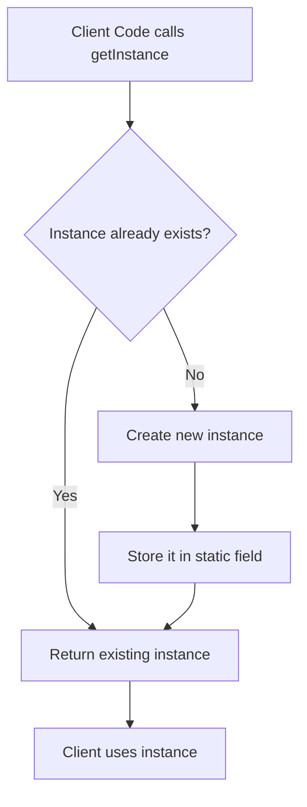

The trick: make the **constructor private** (so nobody can call `new` from outside), and expose a **static method** that either returns the existing instance or creates it for the very first time.

### Implementation — Three Languages

#### Python (Module-Level Singleton — The Idiomatic Way)

```python
# In Python, the module itself IS the singleton.
# When you import a module, Python caches it — subsequent imports
# return the exact same object. This is the most Pythonic singleton.

# logger.py
import datetime
from typing import List

class _Logger:
    """
    Private class — only one instance is ever created (at module import time).
    """
    def __init__(self):
        self._history: List[str] = []
        print("Logger initialized — this line appears ONLY ONCE")

    def log(self, level: str, message: str) -> None:
        entry = f"[{datetime.datetime.now().isoformat()}] [{level}] {message}"
        self._history.append(entry)
        print(entry)

    def get_history(self) -> List[str]:
        return list(self._history)


# Module-level instance — created once when the module is first imported
logger = _Logger()


# --- Usage in any other file ---
# from logger import logger
# logger.log("INFO", "Server started")
# logger.log("WARN", "Memory at 85%")
```

```python
# Alternative: Classic Singleton using __new__
class DatabasePool:
    _instance = None

    def __new__(cls):
        if cls._instance is None:
            cls._instance = super().__new__(cls)
            cls._instance._initialized = False
        return cls._instance

    def __init__(self):
        # Guard against re-initialization on subsequent calls
        if self._initialized:
            return
        self._initialized = True
        self._connections = []
        self._max_connections = 10
        print(f"DB Pool created with max {self._max_connections} connections")

    def get_connection(self):
        # ... connection logic
        return f"Connection from pool (total: {len(self._connections)})"


# Proof that it is the same instance
pool_a = DatabasePool()
pool_b = DatabasePool()
print(pool_a is pool_b)  # True
```

#### Java (Thread-Safe — Double-Checked Locking + Enum)

```java
// Approach 1: Double-Checked Locking (thread-safe, lazy initialization)
public class Logger {

    // volatile ensures visibility across threads
    private static volatile Logger instance = null;
    private final List<String> logHistory = new ArrayList<>();

    // Private constructor — nobody can call new Logger() from outside
    private Logger() {
        System.out.println("Logger initialized — appears only ONCE");
    }

    public static Logger getInstance() {
        if (instance == null) {                    // First check (no lock)
            synchronized (Logger.class) {
                if (instance == null) {            // Second check (with lock)
                    instance = new Logger();
                }
            }
        }
        return instance;
    }

    public void log(String level, String message) {
        String entry = String.format("[%s] [%s] %s",
            LocalDateTime.now(), level, message);
        logHistory.add(entry);
        System.out.println(entry);
    }

    public List<String> getHistory() {
        return Collections.unmodifiableList(logHistory);
    }
}

// Approach 2: Enum Singleton (BEST practice in Java — serialization-safe + thread-safe)
public enum ConfigManager {
    INSTANCE;

    private final Map<String, String> config = new HashMap<>();

    public void set(String key, String value) {
        config.put(key, value);
    }

    public String get(String key) {
        return config.getOrDefault(key, "");
    }
}

// Usage:
// ConfigManager.INSTANCE.set("db.host", "localhost");
// ConfigManager.INSTANCE.get("db.host"); // "localhost"
```

#### TypeScript (Single-Threaded — Simpler)

```typescript
class AppConfig {
    private static instance: AppConfig | null = null;

    private readonly settings: Map<string, unknown> = new Map([
        ['env', process.env.NODE_ENV ?? 'development'],
        ['port', 4000],
        ['db.pool.size', 10],
    ]);

    private constructor() {
        console.log('AppConfig loaded — this should print ONCE');
    }

    public static getInstance(): AppConfig {
        if (AppConfig.instance === null) {
            AppConfig.instance = new AppConfig();
        }
        return AppConfig.instance;
    }

    public get<T>(key: string): T {
        return this.settings.get(key) as T;
    }

    public set(key: string, value: unknown): void {
        this.settings.set(key, value);
    }
}

// Both variables point to the exact same object
const config1 = AppConfig.getInstance();
const config2 = AppConfig.getInstance();

config1.set('port', 8080);
console.log(config2.get<number>('port')); // 8080 — same instance!
console.log(config1 === config2);          // true
```

### Real-World System Design Use Cases

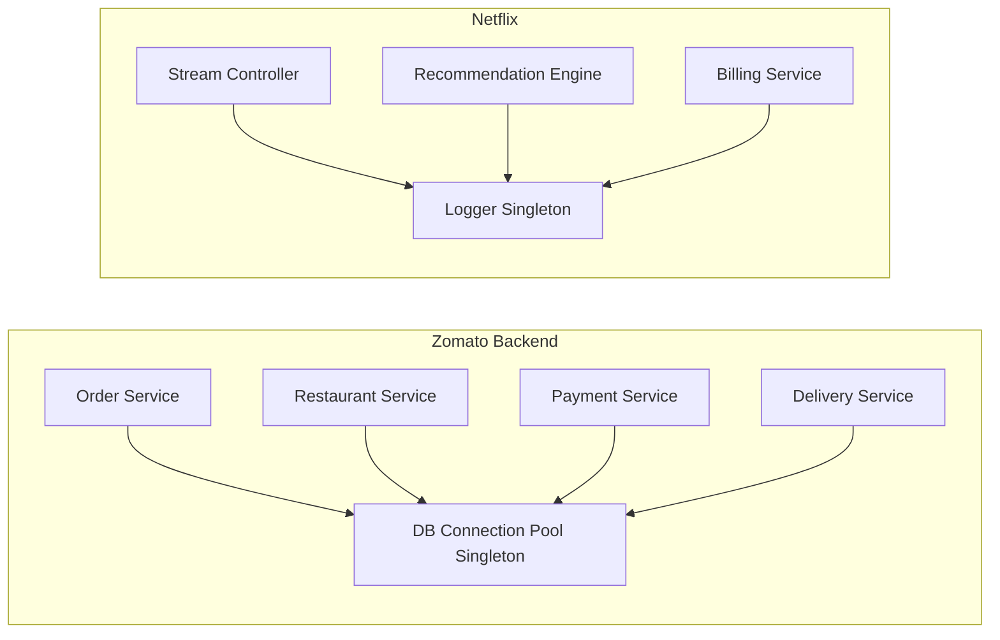

- **DB connection pool** — Mongoose/pg.Pool in Node.js, HikariCP in Spring Boot
- **Application logger** — one logger, one centralized log stream
- **Feature flag registry** — one registry that all services read from
- **Redis client wrapper** — one connected client across the application
- **Thread pool** — one managed pool of worker threads

### Trade-offs

| Use Singleton | Avoid Singleton |
|---|---|
| Shared stateful resource with expensive setup | General-purpose utility classes |
| Connection pools, loggers, config stores | Business domain objects |
| Hardware interface wrappers (printer queue) | Anything you want to mock in unit tests |
| Thread-safe registry objects | When you might legitimately need 2+ instances |
| Feature flags, rate-limiter state | Service classes that hold no shared state |

> **Interview Insight:** Singleton is the most **overused and misused** creational pattern. Developers reach for it when they want global access — but global access and enforced uniqueness are two different things. A better alternative for global access is **Dependency Injection** — pass the shared object as a constructor argument rather than accessing it through a static method. This makes your code testable (you can inject a mock), explicit (dependencies are visible), and decoupled.

---

## 2. Factory Method Pattern

### The WHY — What Problem Does This Solve?

Imagine Swiggy's payment backend. They support Razorpay, Stripe, PayPal, UPI. The code that processes a payment order should not know which specific payment processor to call — that decision depends on what the user chose at checkout, or what country they are in. If you hardcode `if provider == "razorpay": use RazorpayClient()` in your order logic, every new payment provider means changing the order service.

Yeh galat hai. Your order service should not know about Razorpay internals. It should just say "give me a payment processor for this user" and let someone else make the decision.

**Factory Method** says: define an interface for creating objects, but let **subclasses or configuration** decide which concrete class to instantiate.

### The Simple Analogy

You walk into a restaurant (a pizza franchise like Domino's). You say "I want a pizza." You do not walk into the kitchen and decide whether to use thin crust or deep dish, local cheese or imported mozzarella. Each franchise outlet (subclass) has its own way of making pizza, but they all produce something that implements the "Pizza" contract. You, the customer (client code), only interact with the "Pizza" interface.

### How It Works

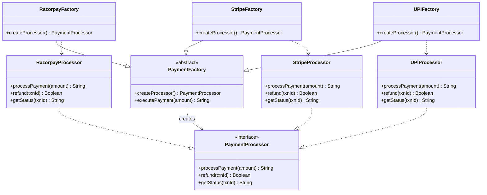

### Implementation — Three Languages

#### Python

```python
from abc import ABC, abstractmethod
from datetime import datetime


# --- Product Interface ---
class PaymentProcessor(ABC):
    @abstractmethod
    def process_payment(self, amount: float) -> str:
        pass

    @abstractmethod
    def refund(self, transaction_id: str) -> bool:
        pass


# --- Concrete Products ---
class RazorpayProcessor(PaymentProcessor):
    def process_payment(self, amount: float) -> str:
        print(f"Razorpay: charging ₹{amount}")
        return f"rzp_txn_{int(datetime.now().timestamp())}"

    def refund(self, transaction_id: str) -> bool:
        print(f"Razorpay: initiating refund for {transaction_id}")
        return True


class StripeProcessor(PaymentProcessor):
    def process_payment(self, amount: float) -> str:
        print(f"Stripe: charging ${amount}")
        return f"stripe_txn_{int(datetime.now().timestamp())}"

    def refund(self, transaction_id: str) -> bool:
        print(f"Stripe: refunding {transaction_id}")
        return True


class UPIProcessor(PaymentProcessor):
    def process_payment(self, amount: float) -> str:
        print(f"UPI: charging ₹{amount} via UPI")
        return f"upi_txn_{int(datetime.now().timestamp())}"

    def refund(self, transaction_id: str) -> bool:
        print(f"UPI: refund initiated for {transaction_id}")
        return True


# --- Creator (Factory Method lives here) ---
class PaymentFactory(ABC):
    @abstractmethod
    def create_processor(self) -> PaymentProcessor:
        """The Factory Method — subclasses override this."""
        pass

    def execute_payment(self, amount: float) -> str:
        """Template method — uses the factory method internally."""
        processor = self.create_processor()
        return processor.process_payment(amount)


# --- Concrete Creators ---
class RazorpayFactory(PaymentFactory):
    def create_processor(self) -> PaymentProcessor:
        return RazorpayProcessor()


class StripeFactory(PaymentFactory):
    def create_processor(self) -> PaymentProcessor:
        return StripeProcessor()


class UPIFactory(PaymentFactory):
    def create_processor(self) -> PaymentProcessor:
        return UPIProcessor()


# --- Client code — decoupled from concrete classes ---
def get_payment_factory(provider: str) -> PaymentFactory:
    factories = {
        "razorpay": RazorpayFactory,
        "stripe": StripeFactory,
        "upi": UPIFactory,
    }
    if provider not in factories:
        raise ValueError(f"Unknown payment provider: {provider}")
    return factories[provider]()


# Simulate user checking out on Swiggy
user_selected_provider = "razorpay"   # comes from user's saved preference
factory = get_payment_factory(user_selected_provider)
txn_id = factory.execute_payment(450.00)
print(f"Transaction complete: {txn_id}")
```

#### Java

```java
// --- Product Interface ---
public interface NotificationService {
    String sendNotification(String userId, String message);
    void scheduleNotification(String userId, String message, long delayMs);
}

// --- Concrete Products ---
public class PushNotificationService implements NotificationService {
    @Override
    public String sendNotification(String userId, String message) {
        System.out.println("FCM Push → User " + userId + ": " + message);
        return "push_" + System.currentTimeMillis();
    }

    @Override
    public void scheduleNotification(String userId, String message, long delayMs) {
        System.out.println("Scheduling push after " + delayMs + "ms");
    }
}

public class SMSNotificationService implements NotificationService {
    @Override
    public String sendNotification(String userId, String message) {
        System.out.println("SMS → User " + userId + ": " + message);
        return "sms_" + System.currentTimeMillis();
    }

    @Override
    public void scheduleNotification(String userId, String message, long delayMs) {
        System.out.println("Scheduling SMS after " + delayMs + "ms");
    }
}

public class EmailNotificationService implements NotificationService {
    @Override
    public String sendNotification(String userId, String message) {
        System.out.println("Email → User " + userId + ": " + message);
        return "email_" + System.currentTimeMillis();
    }

    @Override
    public void scheduleNotification(String userId, String message, long delayMs) {
        System.out.println("Scheduling email after " + delayMs + "ms");
    }
}

// --- Abstract Creator ---
public abstract class NotificationFactory {
    // The Factory Method
    public abstract NotificationService createService();

    // Template method using the factory method
    public String notify(String userId, String message) {
        NotificationService service = createService();
        return service.sendNotification(userId, message);
    }
}

// --- Concrete Creators ---
public class PushNotificationFactory extends NotificationFactory {
    @Override
    public NotificationService createService() {
        return new PushNotificationService();
    }
}

public class SMSNotificationFactory extends NotificationFactory {
    @Override
    public NotificationService createService() {
        return new SMSNotificationService();
    }
}

// --- Client ---
public class NotificationRouter {
    public static NotificationFactory getFactory(String channel) {
        return switch (channel) {
            case "push" -> new PushNotificationFactory();
            case "sms"  -> new SMSNotificationFactory();
            case "email"-> new EmailNotificationFactory();
            default -> throw new IllegalArgumentException("Unknown channel: " + channel);
        };
    }

    public static void main(String[] args) {
        String userPreference = "push"; // from user settings in DB
        NotificationFactory factory = getFactory(userPreference);
        factory.notify("user_123", "Your Swiggy order is out for delivery!");
    }
}
```

#### TypeScript

```typescript
// Shape factory — classic textbook example, extended with system design flavor
interface Shape {
    area(): number;
    perimeter(): number;
    describe(): string;
}

class Circle implements Shape {
    constructor(private radius: number) {}
    area(): number { return Math.PI * this.radius ** 2; }
    perimeter(): number { return 2 * Math.PI * this.radius; }
    describe(): string { return `Circle(r=${this.radius})`; }
}

class Rectangle implements Shape {
    constructor(private width: number, private height: number) {}
    area(): number { return this.width * this.height; }
    perimeter(): number { return 2 * (this.width + this.height); }
    describe(): string { return `Rect(${this.width}x${this.height})`; }
}

class Triangle implements Shape {
    constructor(private base: number, private height: number, private side1: number, private side2: number) {}
    area(): number { return 0.5 * this.base * this.height; }
    perimeter(): number { return this.base + this.side1 + this.side2; }
    describe(): string { return `Triangle(base=${this.base}, h=${this.height})`; }
}

// Simple Factory (not GoF pattern, but common in interviews — know the distinction)
class ShapeFactory {
    static create(type: string, ...args: number[]): Shape {
        switch (type) {
            case 'circle':    return new Circle(args[0]);
            case 'rectangle': return new Rectangle(args[0], args[1]);
            case 'triangle':  return new Triangle(args[0], args[1], args[2], args[3]);
            default: throw new Error(`Unknown shape: ${type}`);
        }
    }
}

const shapes: Shape[] = [
    ShapeFactory.create('circle', 5),
    ShapeFactory.create('rectangle', 4, 6),
];

shapes.forEach(s => {
    console.log(`${s.describe()} → area=${s.area().toFixed(2)}, perimeter=${s.perimeter().toFixed(2)}`);
});
```

### Real-World System Design Flow

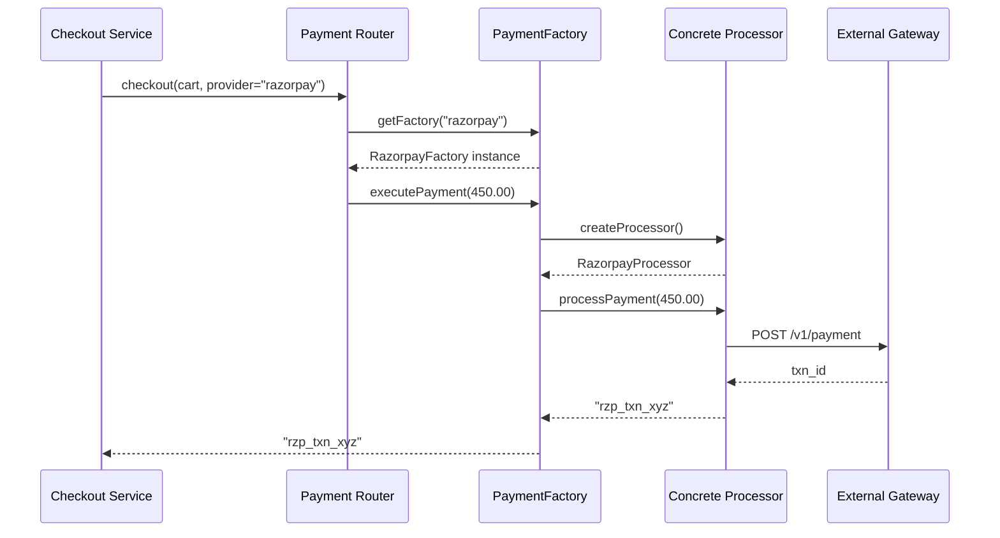

### Trade-offs

| Use Factory Method | Avoid Factory Method |
|---|---|
| Object type is determined at runtime | You always create exactly one type |
| Adding new types without changing existing code (OCP) | Simple objects with no variation |
| Framework extensibility (plugins, database drivers) | Over-engineering a trivial `new Foo()` call |
| You want to isolate object creation from usage | When subclassing adds unnecessary complexity |

---

## 3. Abstract Factory Pattern

### The WHY — What Problem Does This Solve?

Factory Method handles one product. But in real systems, objects come in **families that must be compatible with each other**.

Think about building a UI component library (like Material UI or Ant Design) that must work on Android, iOS, and Web. A button on Android looks and behaves differently than a button on iOS. And critically — you cannot mix an Android-style Dialog with an iOS-style Button in the same screen. They have to come from the same "family."

Basically, Abstract Factory solves: "I need to create a set of related objects, and I need them to always be internally consistent."

### The Simple Analogy

Think of furniture collections at a high-end store. If you pick the **Victorian collection**, you get a Victorian sofa, Victorian table, and Victorian lamp — they all match. If you pick the **Modern Minimalist collection**, you get a modern sofa, modern table, and modern lamp. You would never order a Victorian sofa and a Minimalist lamp together — they look terrible together. The collection catalog is your Abstract Factory.

At Zomato or WhatsApp, think of **notification theme families**: WhatsApp's green push notification, SMS, and in-app banner all need to match WhatsApp's brand. You create them all from the same "WhatsApp notification factory," never accidentally mixing a WhatsApp UI element with a Telegram-style element.

### How It Works

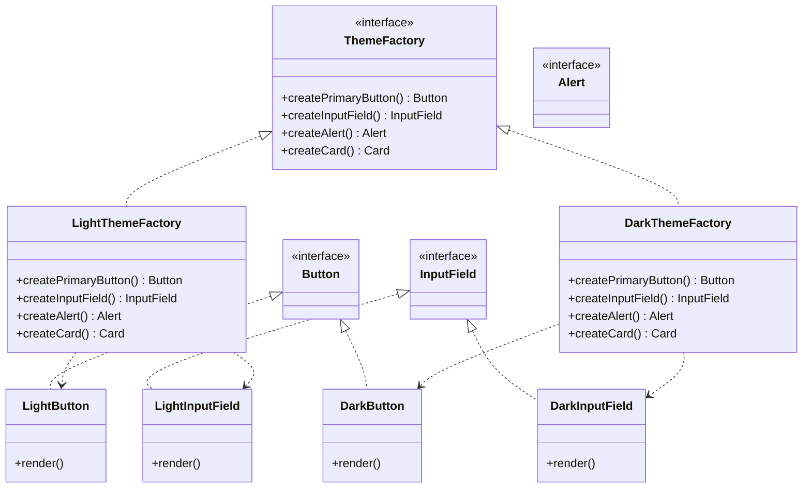

### Implementation — Three Languages

#### Python

```python
from abc import ABC, abstractmethod


# --- Abstract Products ---
class Button(ABC):
    @abstractmethod
    def render(self) -> str:
        pass

    @abstractmethod
    def on_click(self) -> None:
        pass


class InputField(ABC):
    @abstractmethod
    def render(self) -> str:
        pass

    @abstractmethod
    def get_value(self) -> str:
        pass


class Alert(ABC):
    @abstractmethod
    def show(self, message: str) -> str:
        pass


# --- Light Theme Products ---
class LightButton(Button):
    def render(self) -> str:
        return "[  Light Button  ]  #FFFFFF bg, #333 text"

    def on_click(self) -> None:
        print("Light button clicked — subtle animation")


class LightInputField(InputField):
    def render(self) -> str:
        return "[ Light Input ______ ]  border: 1px solid #ccc"

    def get_value(self) -> str:
        return "light-input-value"


class LightAlert(Alert):
    def show(self, message: str) -> str:
        return f"INFO TOAST: {message}  [bg: #e8f5e9]"


# --- Dark Theme Products ---
class DarkButton(Button):
    def render(self) -> str:
        return "[  Dark Button  ]  #1a1a2e bg, #eee text"

    def on_click(self) -> None:
        print("Dark button clicked — neon glow effect")


class DarkInputField(InputField):
    def render(self) -> str:
        return "[ Dark Input ______ ]  border: 1px solid #444"

    def get_value(self) -> str:
        return "dark-input-value"


class DarkAlert(Alert):
    def show(self, message: str) -> str:
        return f"TOAST: {message}  [bg: #263238, text: #eee]"


# --- Abstract Factory ---
class UIThemeFactory(ABC):
    @abstractmethod
    def create_button(self) -> Button:
        pass

    @abstractmethod
    def create_input_field(self) -> InputField:
        pass

    @abstractmethod
    def create_alert(self) -> Alert:
        pass


# --- Concrete Factories ---
class LightThemeFactory(UIThemeFactory):
    def create_button(self) -> Button:
        return LightButton()

    def create_input_field(self) -> InputField:
        return LightInputField()

    def create_alert(self) -> Alert:
        return LightAlert()


class DarkThemeFactory(UIThemeFactory):
    def create_button(self) -> Button:
        return DarkButton()

    def create_input_field(self) -> InputField:
        return DarkInputField()

    def create_alert(self) -> Alert:
        return DarkAlert()


# --- Application code — knows nothing about concrete classes ---
class LoginScreen:
    def __init__(self, factory: UIThemeFactory):
        self.button = factory.create_button()
        self.input_field = factory.create_input_field()
        self.alert = factory.create_alert()

    def render(self):
        print(self.input_field.render())
        print(self.button.render())
        self.button.on_click()
        print(self.alert.show("Welcome back!"))


# --- Client picks theme based on user preference ---
def get_factory(theme: str) -> UIThemeFactory:
    if theme == "dark":
        return DarkThemeFactory()
    return LightThemeFactory()


user_theme = "dark"  # from user settings DB
screen = LoginScreen(get_factory(user_theme))
screen.render()
```

#### Java

```java
// Abstract Factory for database drivers — a very real production use case
// MySQL vs PostgreSQL — same interface, different underlying implementations

public interface Connection {
    void connect(String host, int port, String db);
    void close();
}

public interface QueryExecutor {
    List<Map<String, Object>> execute(String sql);
    int executeUpdate(String sql);
}

public interface TransactionManager {
    void begin();
    void commit();
    void rollback();
}

// MySQL family
public class MySQLConnection implements Connection {
    public void connect(String host, int port, String db) {
        System.out.println("MySQL connecting to " + host + ":" + port + "/" + db);
    }
    public void close() { System.out.println("MySQL connection closed"); }
}

public class MySQLQueryExecutor implements QueryExecutor {
    public List<Map<String, Object>> execute(String sql) {
        System.out.println("MySQL executing: " + sql);
        return new ArrayList<>();
    }
    public int executeUpdate(String sql) {
        System.out.println("MySQL update: " + sql);
        return 1;
    }
}

// PostgreSQL family
public class PostgreSQLConnection implements Connection {
    public void connect(String host, int port, String db) {
        System.out.println("PostgreSQL connecting to " + host + ":" + port + "/" + db);
    }
    public void close() { System.out.println("PostgreSQL connection closed"); }
}

// Abstract Factory
public interface DatabaseFactory {
    Connection createConnection();
    QueryExecutor createQueryExecutor();
    TransactionManager createTransactionManager();
}

// Concrete Factories
public class MySQLFactory implements DatabaseFactory {
    public Connection createConnection() { return new MySQLConnection(); }
    public QueryExecutor createQueryExecutor() { return new MySQLQueryExecutor(); }
    public TransactionManager createTransactionManager() { return new MySQLTransactionManager(); }
}

public class PostgreSQLFactory implements DatabaseFactory {
    public Connection createConnection() { return new PostgreSQLConnection(); }
    public QueryExecutor createQueryExecutor() { return new PostgreSQLQueryExecutor(); }
    public TransactionManager createTransactionManager() { return new PostgreSQLTransactionManager(); }
}

// Repository — works with any database, no concrete references
public class UserRepository {
    private final Connection connection;
    private final QueryExecutor executor;
    private final TransactionManager tx;

    public UserRepository(DatabaseFactory factory) {
        this.connection = factory.createConnection();
        this.executor = factory.createQueryExecutor();
        this.tx = factory.createTransactionManager();
        this.connection.connect("localhost", 5432, "app_db");
    }

    public List<Map<String, Object>> findAllUsers() {
        return executor.execute("SELECT * FROM users");
    }
}

// Swap entire DB with one line change — that is the power
DatabaseFactory factory = new PostgreSQLFactory(); // change to MySQLFactory anytime
UserRepository repo = new UserRepository(factory);
```

#### TypeScript

```typescript
// Cross-platform notification factory — think WhatsApp or Instagram notifications

interface PushNotification {
    send(userId: string, title: string, body: string): Promise<string>;
}

interface InAppBanner {
    show(message: string, duration: number): void;
    dismiss(): void;
}

interface SoundEffect {
    play(soundId: string): void;
}

// iOS family
class IOSPushNotification implements PushNotification {
    async send(userId: string, title: string, body: string): Promise<string> {
        console.log(`APNS → ${userId}: "${title}" — ${body}`);
        return `apns_${Date.now()}`;
    }
}

class IOSInAppBanner implements InAppBanner {
    show(message: string, duration: number): void {
        console.log(`iOS Banner: "${message}" for ${duration}ms (slides from top, rounded corners)`);
    }
    dismiss(): void { console.log('iOS banner dismissed with slide-up animation'); }
}

class IOSSoundEffect implements SoundEffect {
    play(soundId: string): void { console.log(`iOS sound: ${soundId}.caf via AudioServices`); }
}

// Android family
class AndroidPushNotification implements PushNotification {
    async send(userId: string, title: string, body: string): Promise<string> {
        console.log(`FCM → ${userId}: "${title}" — ${body}`);
        return `fcm_${Date.now()}`;
    }
}

class AndroidInAppBanner implements InAppBanner {
    show(message: string, duration: number): void {
        console.log(`Android Snackbar: "${message}" for ${duration}ms`);
    }
    dismiss(): void { console.log('Android snackbar dismissed'); }
}

class AndroidSoundEffect implements SoundEffect {
    play(soundId: string): void { console.log(`Android: ${soundId}.ogg via MediaPlayer`); }
}

// Abstract Factory
interface MobileUIFactory {
    createPushNotification(): PushNotification;
    createInAppBanner(): InAppBanner;
    createSoundEffect(): SoundEffect;
}

class IOSFactory implements MobileUIFactory {
    createPushNotification(): PushNotification { return new IOSPushNotification(); }
    createInAppBanner(): InAppBanner { return new IOSInAppBanner(); }
    createSoundEffect(): SoundEffect { return new IOSSoundEffect(); }
}

class AndroidFactory implements MobileUIFactory {
    createPushNotification(): PushNotification { return new AndroidPushNotification(); }
    createInAppBanner(): InAppBanner { return new AndroidInAppBanner(); }
    createSoundEffect(): SoundEffect { return new AndroidSoundEffect(); }
}

// App code — never imports Android or iOS classes directly
class OrderDeliveredNotifier {
    private push: PushNotification;
    private banner: InAppBanner;
    private sound: SoundEffect;

    constructor(factory: MobileUIFactory) {
        this.push = factory.createPushNotification();
        this.banner = factory.createInAppBanner();
        this.sound = factory.createSoundEffect();
    }

    async notifyDelivered(userId: string): Promise<void> {
        await this.push.send(userId, 'Order Delivered!', 'Your Swiggy order has arrived.');
        this.banner.show('Order delivered successfully', 3000);
        this.sound.play('success_chime');
    }
}

const platform = 'ios'; // detected at runtime
const factory: MobileUIFactory = platform === 'ios' ? new IOSFactory() : new AndroidFactory();
const notifier = new OrderDeliveredNotifier(factory);
notifier.notifyDelivered('user_u789');
```

### Factory Method vs Abstract Factory — The Critical Distinction

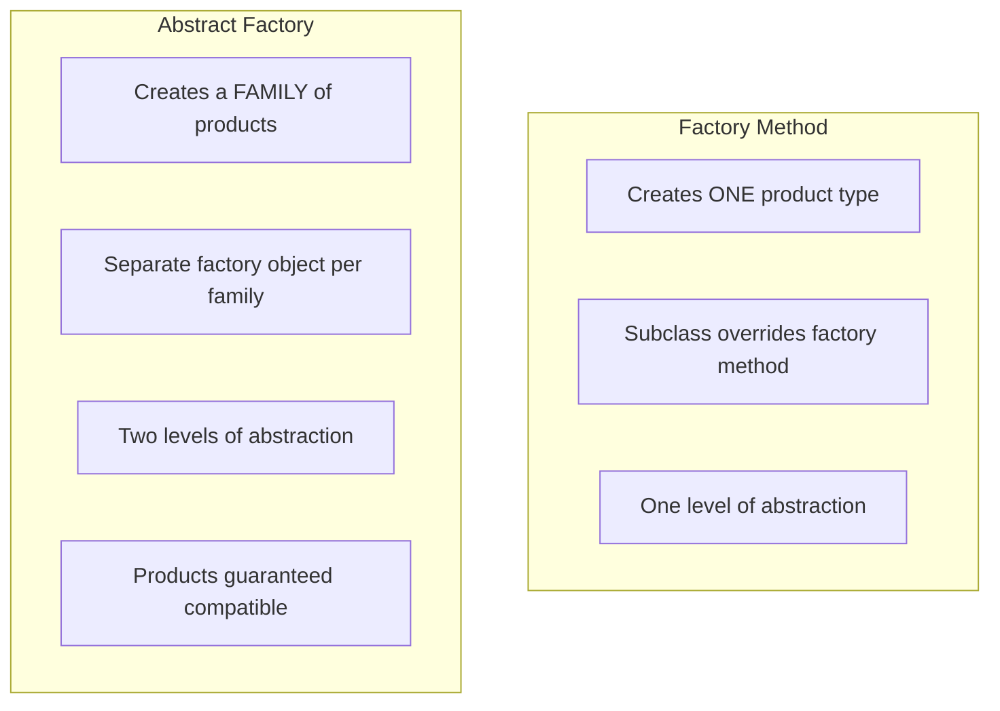

| Dimension | Factory Method | Abstract Factory |
|---|---|---|
| Products created | One product type | Multiple product types in a family |
| How | Subclass overrides a method | Separate factory class per family |
| When to use | Runtime type is unknown | Need compatible product families |
| Complexity | Lower | Higher |
| Adding new product types | Straightforward | Requires updating ALL factory classes |

### Trade-offs

| Use Abstract Factory | Avoid Abstract Factory |
|---|---|
| Products come in families that must stay compatible | Only one variant of each product exists |
| Swap entire platform/theme at once | Simple case where Factory Method is sufficient |
| Cross-platform UI toolkits | When adding a new product type is frequent (requires touching all factories) |
| Database driver families (connection + executor + transaction) | Over-engineering when you have 2 products and 1 variant |

---

## 4. Builder Pattern

### The WHY — What Problem Does This Solve?

Here is a real problem. You are building a YouTube-style video alert/notification system. An `Alert` object can have:
- A title (required)
- A message body (required)
- Severity level: INFO, WARN, ERROR, CRITICAL
- An optional icon URL
- An optional action button label and URL
- An optional expiry time
- An optional sound
- Whether it is dismissible
- Target user segment

One constructor to cover all combinations:
```
new Alert("Title", "Body", "ERROR", null, "Retry", "/retry", 30000, "ping.mp3", true, "premium_users")
```

Yaar, what does that `null` mean? What is `30000`? What is `true`? This is unreadable and unmaintainable.

**Builder pattern** separates the *construction* of a complex object from its *representation*. You build it step by step, naming each piece explicitly.

### The Simple Analogy

Building a custom burger at a restaurant — think Burger King's "have it your way." You start with the base (bun + patty). Then you say:
- "Add cheese" (optional)
- "Add jalapeños" (optional)
- "No onions" (skipped)
- "Extra sauce" (optional)
- "Toasted bun" (optional)

When you are done customizing, you say "build it." The kitchen assembles exactly what you specified. You did not need to enumerate all 40 possible ingredients in a specific order upfront.

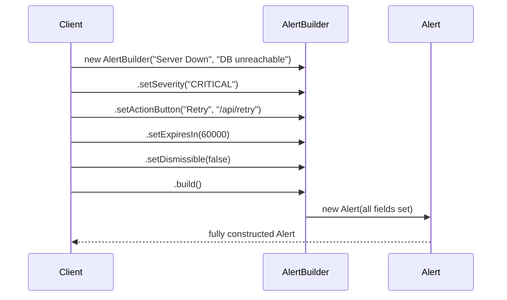

### Implementation — Three Languages

#### Python

```python
from dataclasses import dataclass, field
from typing import Optional


@dataclass(frozen=True)  # immutable once built
class HTTPRequest:
    url: str
    method: str
    headers: dict
    body: Optional[dict]
    timeout_ms: int
    retry_count: int
    auth_token: Optional[str]
    follow_redirects: bool


class HTTPRequestBuilder:
    def __init__(self, url: str):
        if not url:
            raise ValueError("URL is required")
        self._url = url
        self._method = "GET"
        self._headers: dict = {}
        self._body: Optional[dict] = None
        self._timeout_ms = 5000
        self._retry_count = 0
        self._auth_token: Optional[str] = None
        self._follow_redirects = True

    def method(self, method: str) -> "HTTPRequestBuilder":
        self._method = method.upper()
        return self

    def header(self, key: str, value: str) -> "HTTPRequestBuilder":
        self._headers[key] = value
        return self

    def json_body(self, body: dict) -> "HTTPRequestBuilder":
        self._body = body
        self._headers["Content-Type"] = "application/json"
        return self

    def timeout(self, ms: int) -> "HTTPRequestBuilder":
        if ms <= 0:
            raise ValueError("Timeout must be positive")
        self._timeout_ms = ms
        return self

    def retries(self, count: int) -> "HTTPRequestBuilder":
        self._retry_count = count
        return self

    def bearer_auth(self, token: str) -> "HTTPRequestBuilder":
        self._auth_token = token
        self._headers["Authorization"] = f"Bearer {token}"
        return self

    def no_redirects(self) -> "HTTPRequestBuilder":
        self._follow_redirects = False
        return self

    def build(self) -> HTTPRequest:
        return HTTPRequest(
            url=self._url,
            method=self._method,
            headers=dict(self._headers),
            body=self._body,
            timeout_ms=self._timeout_ms,
            retry_count=self._retry_count,
            auth_token=self._auth_token,
            follow_redirects=self._follow_redirects,
        )


# --- Usage — self-documenting, readable ---
request = (
    HTTPRequestBuilder("https://api.zomato.com/v3/restaurants")
    .method("POST")
    .bearer_auth("eyJhbGci...")
    .header("X-Request-ID", "req_abc123")
    .json_body({"city_id": 1, "cuisine": "North Indian"})
    .timeout(10_000)
    .retries(3)
    .build()
)

print(request)
```

```python
# --- SQL Query Builder (very common real-world pattern) ---
class QueryBuilder:
    def __init__(self):
        self._table = ""
        self._columns = ["*"]
        self._conditions = []
        self._joins = []
        self._order_by = ""
        self._limit: Optional[int] = None
        self._offset: Optional[int] = None

    def select(self, *columns: str) -> "QueryBuilder":
        self._columns = list(columns)
        return self

    def from_table(self, table: str) -> "QueryBuilder":
        self._table = table
        return self

    def join(self, table: str, on: str, join_type: str = "INNER") -> "QueryBuilder":
        self._joins.append(f"{join_type} JOIN {table} ON {on}")
        return self

    def where(self, condition: str) -> "QueryBuilder":
        self._conditions.append(condition)
        return self

    def order_by(self, column: str, direction: str = "ASC") -> "QueryBuilder":
        self._order_by = f"ORDER BY {column} {direction}"
        return self

    def limit(self, n: int) -> "QueryBuilder":
        self._limit = n
        return self

    def offset(self, n: int) -> "QueryBuilder":
        self._offset = n
        return self

    def build(self) -> str:
        if not self._table:
            raise ValueError("Table name is required — call .from_table()")

        parts = [f"SELECT {', '.join(self._columns)}", f"FROM {self._table}"]
        parts.extend(self._joins)

        if self._conditions:
            parts.append(f"WHERE {' AND '.join(self._conditions)}")
        if self._order_by:
            parts.append(self._order_by)
        if self._limit is not None:
            parts.append(f"LIMIT {self._limit}")
        if self._offset is not None:
            parts.append(f"OFFSET {self._offset}")

        return " ".join(parts)


# Find top restaurants on Zomato's homepage
query = (
    QueryBuilder()
    .select("r.id", "r.name", "r.rating", "c.name AS cuisine")
    .from_table("restaurants r")
    .join("cuisines c", "c.id = r.cuisine_id")
    .where("r.city_id = 1")
    .where("r.is_active = TRUE")
    .where("r.rating >= 4.0")
    .order_by("r.order_count_7d", "DESC")
    .limit(20)
    .offset(0)
    .build()
)
print(query)
# SELECT r.id, r.name, r.rating, c.name AS cuisine
# FROM restaurants r
# INNER JOIN cuisines c ON c.id = r.cuisine_id
# WHERE r.city_id = 1 AND r.is_active = TRUE AND r.rating >= 4.0
# ORDER BY r.order_count_7d DESC LIMIT 20 OFFSET 0
```

#### Java

```java
// Immutable Alert object built via Builder
public final class Alert {
    private final String title;
    private final String body;
    private final Severity severity;
    private final String iconUrl;
    private final String actionLabel;
    private final String actionUrl;
    private final long expiresInMs;
    private final boolean dismissible;
    private final String targetSegment;

    public enum Severity { INFO, WARN, ERROR, CRITICAL }

    // Private constructor — only Builder can create
    private Alert(Builder builder) {
        this.title = builder.title;
        this.body = builder.body;
        this.severity = builder.severity;
        this.iconUrl = builder.iconUrl;
        this.actionLabel = builder.actionLabel;
        this.actionUrl = builder.actionUrl;
        this.expiresInMs = builder.expiresInMs;
        this.dismissible = builder.dismissible;
        this.targetSegment = builder.targetSegment;
    }

    public static class Builder {
        // Required fields
        private final String title;
        private final String body;

        // Optional fields with sensible defaults
        private Severity severity = Severity.INFO;
        private String iconUrl = null;
        private String actionLabel = null;
        private String actionUrl = null;
        private long expiresInMs = 0;       // 0 = never expires
        private boolean dismissible = true;
        private String targetSegment = "all";

        public Builder(String title, String body) {
            if (title == null || title.isBlank()) throw new IllegalArgumentException("Title required");
            if (body == null || body.isBlank()) throw new IllegalArgumentException("Body required");
            this.title = title;
            this.body = body;
        }

        public Builder severity(Severity severity) {
            this.severity = severity;
            return this;
        }

        public Builder iconUrl(String iconUrl) {
            this.iconUrl = iconUrl;
            return this;
        }

        public Builder actionButton(String label, String url) {
            this.actionLabel = label;
            this.actionUrl = url;
            return this;
        }

        public Builder expiresIn(long ms) {
            this.expiresInMs = ms;
            return this;
        }

        public Builder notDismissible() {
            this.dismissible = false;
            return this;
        }

        public Builder targetSegment(String segment) {
            this.targetSegment = segment;
            return this;
        }

        public Alert build() {
            // Validation before building
            if (actionLabel != null && actionUrl == null) {
                throw new IllegalStateException("Action URL required when action label is set");
            }
            return new Alert(this);
        }
    }

    @Override
    public String toString() {
        return String.format("Alert{title='%s', severity=%s, dismissible=%s, target=%s}",
            title, severity, dismissible, targetSegment);
    }
}

// --- Usage at Netflix: system alert builder ---
Alert criticalAlert = new Alert.Builder("Service Degradation", "Recommendation engine response time > 5s")
    .severity(Alert.Severity.CRITICAL)
    .actionButton("View Dashboard", "https://internal.netflix.com/dashboard")
    .expiresIn(300_000L)   // 5 minutes
    .notDismissible()
    .targetSegment("on-call-engineers")
    .build();

Alert infoAlert = new Alert.Builder("Deployment Successful", "v2.3.1 deployed to prod")
    .severity(Alert.Severity.INFO)
    .expiresIn(60_000L)
    .build();

System.out.println(criticalAlert);
System.out.println(infoAlert);
```

#### TypeScript

```typescript
// Pizza Builder — classic and beloved example
interface Pizza {
    readonly size: 'S' | 'M' | 'L' | 'XL';
    readonly crust: 'thin' | 'thick' | 'stuffed';
    readonly sauce: string;
    readonly cheese: string;
    readonly toppings: string[];
    readonly isVeg: boolean;
    readonly extraCheese: boolean;
    describe(): string;
}

class PizzaImpl implements Pizza {
    constructor(
        public readonly size: 'S' | 'M' | 'L' | 'XL',
        public readonly crust: 'thin' | 'thick' | 'stuffed',
        public readonly sauce: string,
        public readonly cheese: string,
        public readonly toppings: string[],
        public readonly isVeg: boolean,
        public readonly extraCheese: boolean,
    ) {}

    describe(): string {
        return `[${this.size}] ${this.crust} crust, ${this.sauce} sauce, ${this.cheese}` +
               `${this.extraCheese ? ' + extra cheese' : ''}, toppings: [${this.toppings.join(', ')}]` +
               ` (${this.isVeg ? 'Veg' : 'Non-Veg'})`;
    }
}

class PizzaBuilder {
    private _size: 'S' | 'M' | 'L' | 'XL' = 'M';
    private _crust: 'thin' | 'thick' | 'stuffed' = 'thin';
    private _sauce: string = 'tomato';
    private _cheese: string = 'mozzarella';
    private _toppings: string[] = [];
    private _isVeg: boolean = true;
    private _extraCheese: boolean = false;

    setSize(size: 'S' | 'M' | 'L' | 'XL'): this {
        this._size = size;
        return this;
    }

    setCrust(crust: 'thin' | 'thick' | 'stuffed'): this {
        this._crust = crust;
        return this;
    }

    setSauce(sauce: string): this {
        this._sauce = sauce;
        return this;
    }

    addTopping(topping: string): this {
        this._toppings.push(topping);
        return this;
    }

    withExtraCheese(): this {
        this._extraCheese = true;
        return this;
    }

    nonVeg(): this {
        this._isVeg = false;
        return this;
    }

    build(): Pizza {
        if (this._toppings.length === 0) {
            this._toppings.push('plain');
        }
        return new PizzaImpl(
            this._size, this._crust, this._sauce, this._cheese,
            [...this._toppings], this._isVeg, this._extraCheese,
        );
    }
}

// Fluent API — readable and self-documenting
const myPizza = new PizzaBuilder()
    .setSize('L')
    .setCrust('stuffed')
    .setSauce('pesto')
    .addTopping('mushrooms')
    .addTopping('bell pepper')
    .addTopping('olives')
    .withExtraCheese()
    .build();

console.log(myPizza.describe());
// [L] stuffed crust, pesto sauce, mozzarella + extra cheese, toppings: [mushrooms, bell pepper, olives] (Veg)
```

### Trade-offs

| Use Builder | Avoid Builder |
|---|---|
| Objects with 4+ optional fields | Simple objects with 2-3 fields |
| Immutable objects that are complex to construct | When a plain object literal `{}` works fine |
| You want a readable, self-documenting API | Over-engineering configs that can just be JSON |
| Construction requires validation across multiple fields | When the constructor is small and readable |
| Fluent API for SQL queries, HTTP requests, alerts | When you have full control and requirements are stable |

> **Practical Insight:** In the real world, Builder shows up everywhere — `StringBuilder` in Java, `axios` request config, Eloquent query builder in Laravel, SQLAlchemy query chains in Python. Once you recognize the pattern, you see it constantly.

---

## 5. Prototype Pattern

### The WHY — What Problem Does This Solve?

Imagine Netflix's recommendation engine. To generate a personalized recommendation object for a user, the system must:
1. Fetch user's watch history (DB query)
2. Fetch user's genre preferences (ML model call)
3. Compute similarity scores (CPU-intensive)
4. Fetch candidate video metadata (multiple API calls)

This takes 200ms. Now imagine 10 million users request their homepage simultaneously. Recreating this object from scratch for every request is not feasible.

Better approach: compute the recommendation object for a **user segment** (e.g., "young adults who watch action movies"), store it as a template, and **clone** it for each user in that segment, tweaking only their personal overrides. The expensive computation happens once; cloning is fast.

**Prototype pattern** says: give each object the ability to clone itself, so you can create new instances by copying an existing one.

### The Simple Analogy

In a factory that makes rubber stamps, the stamp-maker creates one master mold — the prototype. To produce 1000 stamps, they do not carve 1000 molds by hand. They press rubber onto the master mold 1000 times. Each stamp is an independent copy of the original. Change one stamp — it does not affect the master or any other stamp.

Or think of it this way — Instagram story templates. Instead of designing each story from scratch, you start with a template (prototype), clone it, and change the text, photo, and colors for your specific post. The template is untouched.

### Deep Copy vs Shallow Copy — Yeh Samajhna Zaroori Hai

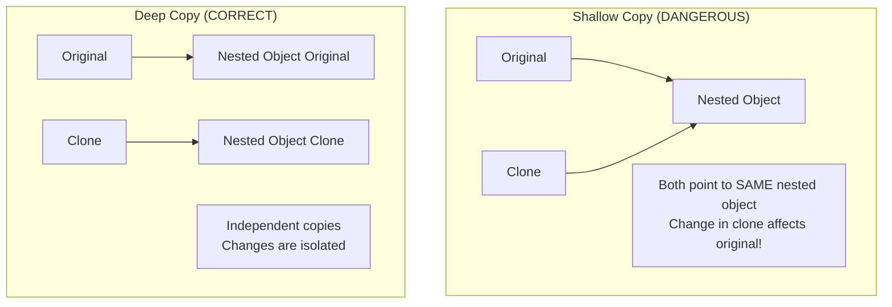

**Shallow copy** — copies only the top-level fields. Nested objects are still shared references. Modifying the clone's nested data affects the original. This is a bug waiting to happen.

**Deep copy** — recursively copies everything. Clone is completely independent.

### Implementation — Three Languages

#### Python

```python
import copy
from dataclasses import dataclass, field
from typing import List, Dict, Optional


@dataclass
class UserPreferences:
    genres: List[str]
    languages: List[str]
    skip_seen: bool = True

    def clone(self) -> "UserPreferences":
        return UserPreferences(
            genres=list(self.genres),           # new list
            languages=list(self.languages),     # new list
            skip_seen=self.skip_seen,
        )


@dataclass
class RecommendationTemplate:
    segment: str
    candidate_ids: List[int]
    weights: Dict[str, float]
    preferences: UserPreferences
    max_results: int = 20

    def clone(self) -> "RecommendationTemplate":
        """Deep clone — all nested objects are independent copies."""
        return RecommendationTemplate(
            segment=self.segment,
            candidate_ids=list(self.candidate_ids),       # new list
            weights=dict(self.weights),                   # new dict
            preferences=self.preferences.clone(),         # deep copy
            max_results=self.max_results,
        )

    def customize(self, **overrides) -> "RecommendationTemplate":
        """Clone and apply overrides in one step."""
        cloned = self.clone()
        for key, value in overrides.items():
            setattr(cloned, key, value)
        return cloned


# --- Prototype Registry ---
class TemplateRegistry:
    def __init__(self):
        self._templates: Dict[str, RecommendationTemplate] = {}

    def register(self, key: str, template: RecommendationTemplate) -> None:
        # Store a clone — never keep the original mutable reference
        self._templates[key] = template.clone()
        print(f"Registered template: {key}")

    def spawn(self, key: str, **overrides) -> RecommendationTemplate:
        if key not in self._templates:
            raise KeyError(f"No template registered for: {key}")
        template = self._templates[key].clone()
        for k, v in overrides.items():
            setattr(template, k, v)
        return template


# --- Set up master templates (expensive — done ONCE) ---
registry = TemplateRegistry()

action_template = RecommendationTemplate(
    segment="action_fans_18_35",
    candidate_ids=[101, 205, 309, 412, 518],
    weights={"genre_match": 0.6, "trending": 0.3, "recency": 0.1},
    preferences=UserPreferences(genres=["Action", "Thriller"], languages=["English", "Hindi"]),
    max_results=20,
)
registry.register("action_segment", action_template)

comedy_template = RecommendationTemplate(
    segment="comedy_fans_all_ages",
    candidate_ids=[201, 302, 403],
    weights={"genre_match": 0.7, "rating": 0.3},
    preferences=UserPreferences(genres=["Comedy", "Romance"], languages=["Hindi"]),
    max_results=15,
)
registry.register("comedy_segment", comedy_template)

# --- Spawn per-user instances cheaply ---
user_recs = registry.spawn("action_segment", max_results=10)
premium_recs = registry.spawn("action_segment",
    candidate_ids=[101, 205, 309, 412, 518, 625, 730],  # more for premium
    max_results=30,
)

# Verify independence — changing one does not affect the other
user_recs.candidate_ids.append(999)
print("user_recs IDs:", user_recs.candidate_ids)
print("premium_recs IDs:", premium_recs.candidate_ids)  # unchanged
```

```python
# Python stdlib: copy.copy() = shallow, copy.deepcopy() = deep
import copy

class Config:
    def __init__(self):
        self.settings = {"retries": 3, "hosts": ["host1", "host2"]}

base_config = Config()

shallow = copy.copy(base_config)
deep = copy.deepcopy(base_config)

# Shallow copy danger
shallow.settings["hosts"].append("host3")
print(base_config.settings["hosts"])  # ["host1", "host2", "host3"] — AFFECTED!

deep.settings["hosts"].append("host4")
print(base_config.settings["hosts"])  # unchanged — deep copy is safe
```

#### Java

```java
// Prototype pattern for game character spawning
// Real use case: game engines, simulation systems

public interface Prototype<T> {
    T clone();
}

public class Equipment implements Prototype<Equipment> {
    private String weapon;
    private String armor;
    private List<String> accessories;

    public Equipment(String weapon, String armor, List<String> accessories) {
        this.weapon = weapon;
        this.armor = armor;
        this.accessories = new ArrayList<>(accessories);
    }

    @Override
    public Equipment clone() {
        return new Equipment(this.weapon, this.armor, new ArrayList<>(this.accessories));
    }

    public void addAccessory(String item) { this.accessories.add(item); }

    @Override
    public String toString() {
        return String.format("Equipment{weapon='%s', armor='%s', accessories=%s}",
            weapon, armor, accessories);
    }
}

public class GameCharacter implements Prototype<GameCharacter> {
    private String name;
    private int health;
    private int speed;
    private List<String> skills;
    private Equipment equipment;

    public GameCharacter(String name, int health, int speed,
                         List<String> skills, Equipment equipment) {
        this.name = name;
        this.health = health;
        this.speed = speed;
        this.skills = new ArrayList<>(skills);
        this.equipment = equipment;
    }

    @Override
    public GameCharacter clone() {
        return new GameCharacter(
            this.name,
            this.health,
            this.speed,
            new ArrayList<>(this.skills),   // deep copy skills
            this.equipment.clone()           // deep copy equipment
        );
    }

    // Clone + customize in one call
    public GameCharacter spawnVariant(String newName, int healthMultiplier) {
        GameCharacter variant = this.clone();
        variant.name = newName;
        variant.health = (int) (this.health * healthMultiplier);
        return variant;
    }

    @Override
    public String toString() {
        return String.format("Character{name='%s', hp=%d, speed=%d, skills=%s, equip=%s}",
            name, health, speed, skills, equipment);
    }
}

// Prototype Registry (Object Pool variant)
public class CharacterRegistry {
    private final Map<String, GameCharacter> prototypes = new HashMap<>();

    public void register(String key, GameCharacter prototype) {
        prototypes.put(key, prototype.clone()); // store a clone of the original
    }

    public GameCharacter spawn(String key) {
        GameCharacter proto = prototypes.get(key);
        if (proto == null) throw new IllegalArgumentException("Unknown character: " + key);
        return proto.clone();
    }
}

// Usage
CharacterRegistry registry = new CharacterRegistry();

GameCharacter goblinProto = new GameCharacter(
    "Goblin", 80, 6,
    Arrays.asList("bite", "scratch"),
    new Equipment("Rusty Dagger", "Tattered Cloth", Arrays.asList("stolen_coin"))
);
registry.register("goblin", goblinProto);

// Spawn 100 goblins efficiently — no re-setup cost
List<GameCharacter> goblins = new ArrayList<>();
for (int i = 0; i < 100; i++) {
    GameCharacter g = registry.spawn("goblin");
    // Each is fully independent
    goblins.add(g);
}

// Boss variant — 3x health
GameCharacter bossGoblin = goblinProto.spawnVariant("Goblin King", 3);
System.out.println("Boss: " + bossGoblin);
System.out.println("Total goblins spawned: " + goblins.size());
```

#### TypeScript

```typescript
interface Cloneable<T> {
    clone(): T;
}

class ReportTemplate implements Cloneable<ReportTemplate> {
    constructor(
        public title: string,
        public sections: string[],
        public metadata: {
            author: string;
            version: string;
            tags: string[];
        },
        public config: {
            format: 'pdf' | 'html' | 'json';
            includeCharts: boolean;
            pageSize: 'A4' | 'Letter';
        },
    ) {}

    clone(): ReportTemplate {
        return new ReportTemplate(
            this.title,
            [...this.sections],          // new array
            {
                ...this.metadata,
                tags: [...this.metadata.tags],   // new array inside object
            },
            { ...this.config },          // new object (primitives only — safe)
        );
    }

    withTitle(title: string): ReportTemplate {
        const cloned = this.clone();
        cloned.title = title;
        return cloned;
    }

    withSection(section: string): ReportTemplate {
        const cloned = this.clone();
        cloned.sections.push(section);
        return cloned;
    }
}

// Base templates (expensive to set up)
const quarterlyTemplate = new ReportTemplate(
    'Quarterly Business Review',
    ['Executive Summary', 'Revenue Analysis', 'Customer Metrics', 'Outlook'],
    { author: 'Analytics Team', version: '2.0', tags: ['quarterly', 'business'] },
    { format: 'pdf', includeCharts: true, pageSize: 'A4' },
);

// Spawn variants cheaply
const q1Report = quarterlyTemplate.withTitle('Q1 2026 Business Review');
const q2Report = quarterlyTemplate.withTitle('Q2 2026 Business Review');
const execReport = quarterlyTemplate
    .withTitle('Q1 2026 Executive Report')
    .withSection('Board Highlights');

// Verify independence
q1Report.sections.push('Special COVID analysis');
console.log('q1 sections:', q1Report.sections.length);  // 5
console.log('q2 sections:', q2Report.sections.length);  // 4 — unchanged
console.log('base sections:', quarterlyTemplate.sections.length);  // 4 — unchanged
```

### Real-World System Design Use Cases

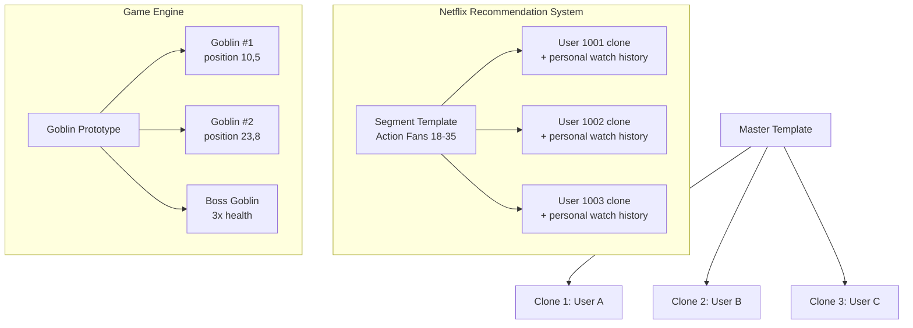

| Domain | Prototype Use Case |
|---|---|
| Game engines | Spawn hundreds of enemies from master templates |
| Netflix/YouTube | Recommendation object templates per user segment |
| CI/CD systems | Clone base pipeline config, override per environment |
| Document editors | Duplicate a document/slide as starting point |
| Browser DOM | `element.cloneNode(true)` for deep DOM tree cloning |
| Spring Framework | `prototype` bean scope — new clone per request |

### Trade-offs

| Use Prototype | Avoid Prototype |
|---|---|
| Construction is expensive (network, CPU, DB calls) | Simple objects where `new` is instantaneous |
| Many variations of a base template needed | Circular references (deep clone becomes complex) |
| Decouple spawning from class hierarchies | Objects tightly coupled to external resources |
| Object state is complex to recreate from scratch | When immutable value objects are a better fit |

---

## Full Pattern Comparison

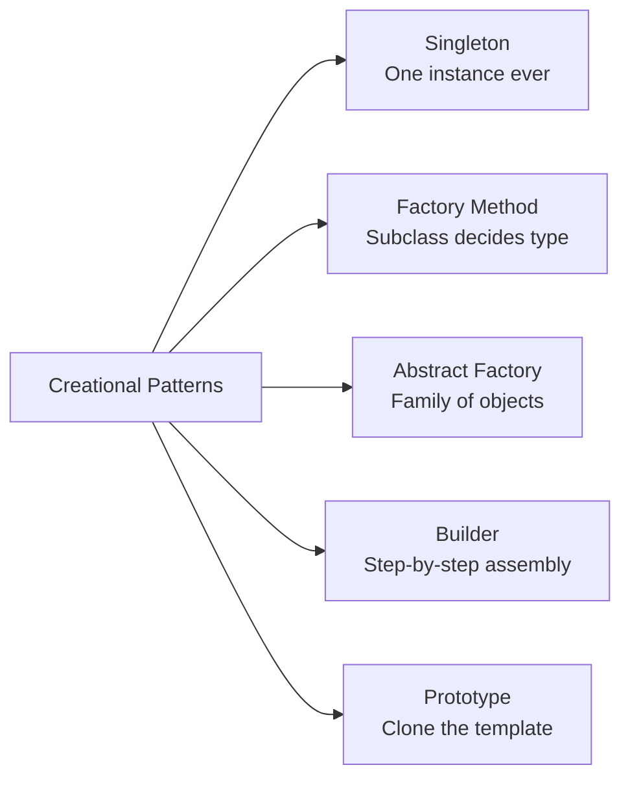

| Dimension | Singleton | Factory Method | Abstract Factory | Builder | Prototype |
|---|---|---|---|---|---|
| **Problem solved** | One shared instance | Which class to create at runtime | Compatible families | Complex step-by-step construction | Clone instead of rebuild |
| **Key mechanism** | Static field + private constructor | Subclass overrides factory method | Separate factory class per family | Fluent method chaining → build() | clone() method per object |
| **Flexibility** | Very Low | Medium | High | High | Medium |
| **Complexity to implement** | Low | Medium | High | Medium | Medium |
| **Testing difficulty** | Hard (global state) | Easy | Easy | Easy | Easy |
| **Common real use case** | DB pool, config, logger | Payment processor, notification channel | Cross-platform UI, DB drivers | SQL queries, HTTP requests, alerts | Game entities, recommendation templates |
| **Abuse risk** | Very High | Low | Low | Low | Low |
| **Open/Closed Principle** | Violates (hard to extend) | Supports | Supports | Supports | Neutral |

---

## Pattern Selection Guide

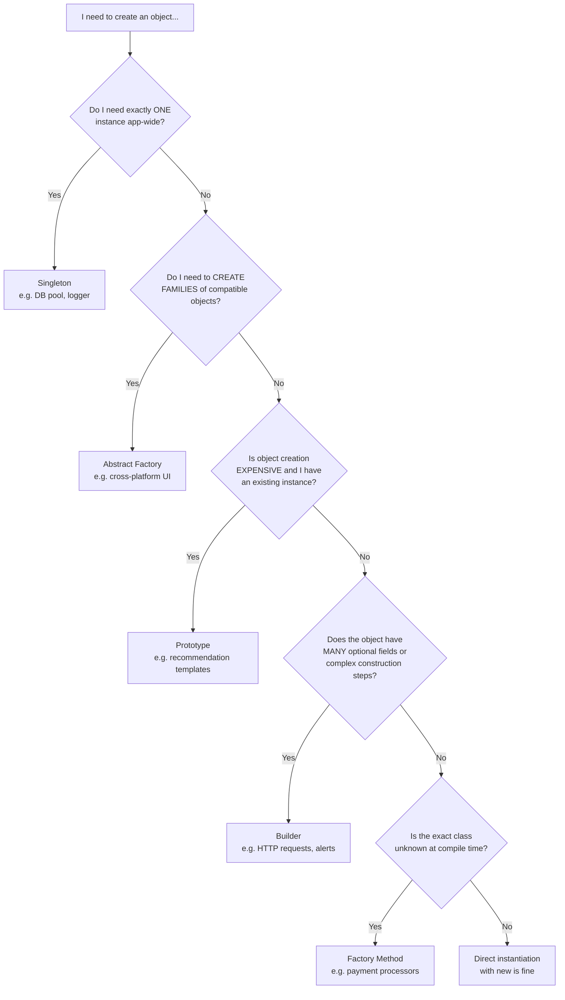

---

## Common Interview Questions

### Q1: What is the Singleton pattern and what are its drawbacks?

**What to say:** Singleton ensures a class has only one instance and provides a global access point to it. The constructor is private; a static method returns the cached instance on subsequent calls.

**Drawbacks to mention:**
1. Global state — creates hidden dependencies between components
2. Hard to unit test — you cannot inject a mock; the singleton is accessed directly
3. Violates Single Responsibility Principle — the class manages both its logic AND its own lifecycle
4. Thread safety issues in multi-threaded languages (need double-checked locking or enum in Java)
5. Can mask design problems — developers reach for it to avoid proper dependency management

**Better alternative:** Dependency Injection — pass the shared object as a constructor parameter. Same single instance, but explicit and testable.

---

### Q2: What is the difference between Factory Method and Abstract Factory?

**Answer:**

| | Factory Method | Abstract Factory |
|---|---|---|
| Creates | ONE product | A FAMILY of related products |
| How | Subclass overrides a method | Separate factory object |
| Guarantees | One type at a time | All products in a family are compatible |
| Use when | Runtime type is unknown | Need consistent product families |

Factory Method: "Let subclasses decide which class to instantiate."
Abstract Factory: "Let a factory object decide which entire family of classes to instantiate."

Abstract Factory is essentially a factory of factory methods.

---

### Q3: When would you choose Builder over a constructor with many parameters?

**Answer:** When you have more than 3-4 parameters (especially optional ones), when parameter order is confusing, or when you want a readable self-documenting API.

Constructor: `new Alert("Title", "Body", "CRITICAL", null, "Retry", "/retry", 30000, false, "premium")`
What does `null` mean? What is `false`? Impossible to read.

Builder: `new AlertBuilder("Title", "Body").severity(CRITICAL).actionButton("Retry", "/retry").notDismissible().build()`

Additional benefits of Builder:
- Immutable output objects
- Validation at build time (cross-field validation)
- Only specify the fields you care about
- Thread-safe construction of immutable objects

---

### Q4: What is the difference between Prototype (deep clone) and shallow copy?

**Answer:** Shallow copy creates a new object but copies references to nested objects — the clone and original share the same nested objects. Modifying the nested data in the clone affects the original.

Deep copy (Prototype pattern's `clone()`) recursively copies all nested objects, creating a completely independent copy. Changes to the clone never affect the original.

```python
import copy
obj = {"hosts": ["a", "b"]}

shallow = obj.copy()
shallow["hosts"].append("c")  # affects original!

deep = copy.deepcopy(obj)
deep["hosts"].append("d")     # original unchanged
```

The Prototype pattern's strength is that the `clone()` method is encapsulated inside the object — the caller does not need to know how deep the copy needs to go.

---

### Q5: How do you make Singleton thread-safe in Java?

**Three approaches:**

1. **Eager initialization** — create at class load time (always thread-safe, but defeats lazy loading):
   ```java
   private static final Logger INSTANCE = new Logger();
   ```

2. **Double-Checked Locking** — lazy + thread-safe (use `volatile`):
   ```java
   private static volatile Logger instance;
   public static Logger getInstance() {
       if (instance == null) {
           synchronized (Logger.class) {
               if (instance == null) instance = new Logger();
           }
       }
       return instance;
   }
   ```

3. **Enum Singleton** — best practice in Java, handles serialization too:
   ```java
   public enum Logger {
       INSTANCE;
       public void log(String msg) { ... }
   }
   ```

---

### Q6: Can you give a real system design example for each pattern?

| Pattern | Real Example |
|---|---|
| Singleton | Zomato's DB connection pool — one HikariCP pool per service instance |
| Factory Method | Swiggy's payment router — creates RazorpayProcessor, UPIProcessor, or StripeProcessor based on user's choice |
| Abstract Factory | WhatsApp's notification system — iOS factory creates APNS push + iOS banner + iOS sound; Android factory creates FCM push + Snackbar + Android sound |
| Builder | Netflix internal alerting — `AlertBuilder.critical("Title", "Body").actionButton(...).notDismissible().build()` |
| Prototype | Netflix's recommendation engine — compute one segment template, clone per user with personal overrides |

---

### Q7: What is the Prototype Registry pattern?

**Answer:** A Prototype Registry (also called Object Pool or Template Store) maintains a map of pre-configured prototype instances keyed by name. Clients request a clone by key, get an independent copy, and customize it.

This combines Prototype with a registry/store pattern. It is used in:
- Spring Framework: `prototype` bean scope creates a new clone for each injection
- Game engines: character template registries
- CI/CD: pipeline template stores

---

### Q8: How does Builder ensure thread safety for immutable objects?

**Answer:** By making all fields in the final object `private final` (Java) or `readonly` (TypeScript/C#), the built object is immutable — safe to share across threads without synchronization. The Builder itself is not shared — each thread uses its own Builder instance and calls `build()` to produce its own immutable result.

---

## Key Takeaways

1. **Singleton** — One instance, globally shared. Private constructor + static `getInstance()`. In Java, use `volatile` + double-checked locking or `enum`. In Python, use module-level instances. **Most abused pattern** — prefer Dependency Injection for testability.

2. **Factory Method** — Defines the interface for creating an object, lets subclasses decide the concrete type. Decouples the "what to create" from "how to use it." Follow the Open/Closed Principle — add new types without changing existing code.

3. **Abstract Factory** — Creates families of related, compatible objects. The family is determined by which factory you choose; switching factories swaps the entire family. More complex than Factory Method but ensures compatibility.

4. **Builder** — Assembles complex objects step by step with a fluent, readable API. Ideal for objects with many optional fields or complex construction logic. The `build()` call is a natural place for cross-field validation. Naturally produces immutable objects.

5. **Prototype** — Clone an existing object instead of building from scratch. Essential when construction is expensive or you need many slight variations of a template. Always implement **deep copy** in `clone()` to ensure independence.

6. **Deep vs Shallow Copy** — This distinction is critical. Shallow copy shares nested references (dangerous). Deep copy creates fully independent objects (correct for Prototype).

7. **All 5 share one goal** — decouple the client code from the specifics of object creation. The client should not need to know which concrete class is being created, how many constructor arguments it takes, or whether there is one or many instances.

8. **Pattern selection heuristic:**
   - Need one instance? → Singleton
   - Need a whole compatible family? → Abstract Factory
   - Need to clone an expensive object? → Prototype
   - Many optional fields or complex construction? → Builder
   - Type unknown at compile time? → Factory Method

9. **Testing tip:** Singleton is hard to test; the others are easy. If you find yourself unable to inject a mock, consider replacing your Singleton with Dependency Injection — the behavior is identical but your code becomes testable.

10. **Hinglish summary:** Creational patterns are simply different recipes for making objects. Singleton says "ek hi banao." Factory Method says "subclass decide karega kya banana hai." Abstract Factory says "poori family ek saath, matching pieces ke saath." Builder says "ek ek step mein banao, fluent chain ke saath." Prototype says "pehle se bana hua hai to clone karo, naya mat banao." Bas yahi hai.
