# Structural Design Patterns — The Definitive Notes

> **Core question these patterns answer:** *"How do we compose objects and classes into larger, more capable structures — without making the codebase a nightmare to change?"*

Samjho aise — you are building with LEGO bricks. Each brick (class/object) has its own shape. Structural patterns are the **techniques that let you:**
- Connect bricks that were never designed to fit together (Adapter)
- Wrap bricks with new behavior without changing the original brick (Decorator / Proxy)
- Hide a messy pile of bricks behind a clean face (Facade)
- Build tree-like structures and treat individual bricks and groups the same way (Composite)
- Share identical bricks instead of making millions of copies (Flyweight)
- Separate the "what the brick does" from "how it does it" (Bridge)

These are not abstract academic ideas. Every senior engineer uses them — often without naming them — every single day.

---

## Table of Contents

1. [Adapter — The Universal Translator](#1-adapter--the-universal-translator)
2. [Decorator — The Gift Wrapper](#2-decorator--the-gift-wrapper)
3. [Proxy — The Gatekeeper](#3-proxy--the-gatekeeper)
4. [Facade — The Hotel Concierge](#4-facade--the-hotel-concierge)
5. [Composite — The Army General](#5-composite--the-army-general)
6. [Flyweight — The Memory Miser](#6-flyweight--the-memory-miser)
7. [Bridge — The TV Remote](#7-bridge--the-tv-remote)
8. [Pattern Comparison](#8-pattern-comparison--the-confused-trio-and-beyond)
9. [System Design Interview Application](#9-system-design-interview-application)
10. [Common Interview Questions](#10-common-interview-questions)
11. [Key Takeaways](#11-key-takeaways)

---

## 1. Adapter — The Universal Translator

### Why does this pattern exist?

Yeh kyun important hai — think about real life. India uses 230V / Type D power sockets. You travel to the US where everything is 120V / Type A. Your laptop charger (the client) expects one thing; the wall socket (the legacy system) gives another. You cannot rewrite the wall. You cannot buy a new laptop just for travel. You buy an **adapter**.

The exact same problem happens in software, constantly:
- Your company buys a third-party SMS library. It has its own interface. Your code expects `NotificationService.send(userId, message)`. The library gives you `SmsGateway.transmitMessage(phoneNumber, body, apiKey)`. You cannot change the library. You cannot rewrite your entire codebase. You write an **Adapter**.
- Zomato's backend switches payment providers from Razorpay to PayU. Both have totally different API shapes. Rather than changing every place payments are called, you adapt PayU's interface to look like the interface your system already expects.

### The Simplest Possible Analogy

> Imagine you are at an international buffet. The chef (Adaptee) speaks only French and gives dishes in grams. You (Client) speak only English and want servings in cups. The waiter (Adapter) translates your English order into French, converts cups to grams, and brings back the dish. Neither you nor the chef changed.

### How it Works — Step by Step

1. You define the **Target interface** — the interface your code (Client) already knows how to talk to.
2. You have an **Adaptee** — an existing class with an incompatible interface (a third-party lib, legacy code, external API).
3. You write an **Adapter class** that:
   - Implements the Target interface (so your code is happy)
   - Holds a reference to the Adaptee internally
   - In each method, translates the call and delegates to the Adaptee
4. Your Client code never knows the difference.

### Class Diagram

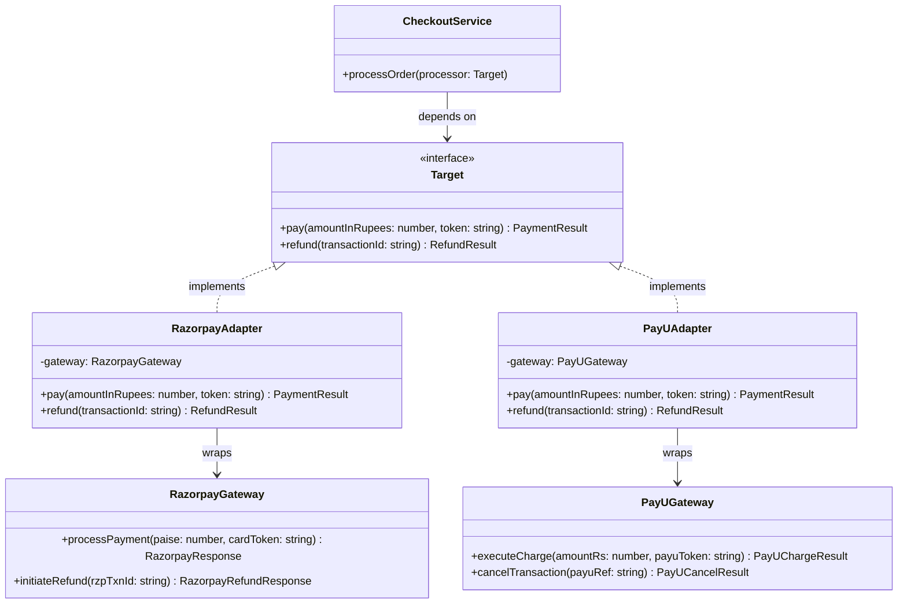

### Full Code Example — Payment Gateway Adapter (Zomato-style)

```typescript
// ============================================================
// Scenario: Zomato switches from Razorpay to PayU for payments.
// The rest of the system shouldn't care which is underneath.
// ============================================================

// --- TARGET INTERFACE: what our system already expects ---
interface PaymentProcessor {
  charge(amountRupees: number, userToken: string): { success: boolean; txnId: string };
  refund(txnId: string): { success: boolean; message: string };
}

// --- ADAPTEE 1: Legacy Razorpay SDK (we cannot modify this) ---
class RazorpaySDK {
  // Note: Razorpay works in PAISE, not rupees
  makePayment(amountPaise: number, cardToken: string): { status: "OK" | "FAIL"; razorpayId: string } {
    console.log(`[Razorpay] Charging ${amountPaise} paise with token ${cardToken}`);
    return { status: "OK", razorpayId: `rzp_${Date.now()}` };
  }

  reversePayment(razorpayRef: string): { reversed: boolean; message: string } {
    console.log(`[Razorpay] Reversing transaction ${razorpayRef}`);
    return { reversed: true, message: "Refund initiated in 5-7 business days" };
  }
}

// --- ADAPTEE 2: New PayU SDK (also incompatible) ---
class PayUSDK {
  executeCharge(rupees: number, payuToken: string, merchantId: string): { code: number; txnRef: string } {
    console.log(`[PayU] Charging Rs.${rupees} with token ${payuToken} for merchant ${merchantId}`);
    return { code: 200, txnRef: `payu_${Date.now()}` };
  }

  cancelCharge(payuRef: string): { cancelled: boolean; eta: string } {
    console.log(`[PayU] Cancelling ${payuRef}`);
    return { cancelled: true, eta: "3-5 business days" };
  }
}

// --- ADAPTER 1: Makes Razorpay look like PaymentProcessor ---
class RazorpayAdapter implements PaymentProcessor {
  private sdk = new RazorpaySDK();

  charge(amountRupees: number, userToken: string) {
    // Interface translation: rupees -> paise
    const result = this.sdk.makePayment(amountRupees * 100, userToken);
    return {
      success: result.status === "OK",
      txnId: result.razorpayId,
    };
  }

  refund(txnId: string) {
    const result = this.sdk.reversePayment(txnId);
    return { success: result.reversed, message: result.message };
  }
}

// --- ADAPTER 2: Makes PayU look like PaymentProcessor ---
class PayUAdapter implements PaymentProcessor {
  private sdk = new PayUSDK();
  private merchantId = "ZOMATO_MERCHANT_001";

  charge(amountRupees: number, userToken: string) {
    // Interface translation: add merchantId, map response fields
    const result = this.sdk.executeCharge(amountRupees, userToken, this.merchantId);
    return {
      success: result.code === 200,
      txnId: result.txnRef,
    };
  }

  refund(txnId: string) {
    const result = this.sdk.cancelCharge(txnId);
    return { success: result.cancelled, message: `ETA: ${result.eta}` };
  }
}

// --- CLIENT CODE: Checkout service knows nothing about Razorpay or PayU ---
class CheckoutService {
  constructor(private paymentProcessor: PaymentProcessor) {}

  placeOrder(orderId: string, amountRupees: number, userToken: string): void {
    console.log(`\nProcessing order ${orderId} for Rs.${amountRupees}`);
    const result = this.paymentProcessor.charge(amountRupees, userToken);
    if (result.success) {
      console.log(`Order confirmed! Transaction: ${result.txnId}`);
    } else {
      console.log("Payment failed. Please try again.");
    }
  }
}

// --- Switching payment provider is a ONE-LINE change ---
// const checkout = new CheckoutService(new RazorpayAdapter()); // Old
const checkout = new CheckoutService(new PayUAdapter());       // New — nothing else changes!
checkout.placeOrder("ORD_123", 349, "tok_user_abc");
```

### Object Adapter vs Class Adapter

There are two variations. Basically, the one you saw above is the **Object Adapter** (most common). There is also a **Class Adapter** that uses multiple inheritance (available in C++, less relevant in Java/TypeScript).

| Feature | Object Adapter | Class Adapter |
|---|---|---|
| How it adapts | Holds an instance of Adaptee | Inherits from Adaptee |
| Adaptee flexibility | Can adapt subclasses too | Adapts only one specific class |
| Language support | All OOP languages | Requires multiple inheritance (C++) |
| Recommended? | Yes, prefer this | Usually not in Java/TypeScript/Python |

### Real World Examples

- **Java:** `InputStreamReader` adapts a byte-based `InputStream` to a character-based `Reader`
- **Retrofit (Android):** Adapts HTTP calls into Java/Kotlin interfaces — you define `@GET("/users")` and Retrofit adapts raw HTTP to a typed method call
- **AWS SDK wrappers:** Companies often wrap the AWS SDK in their own interface so they can swap cloud providers
- **Swiggy analytics:** Multiple third-party analytics SDKs (Mixpanel, Amplitude, Firebase) are each wrapped behind a single `AnalyticsService` interface

### When to Use / When NOT to Use

| Use Adapter When... | Do NOT Use When... |
|---|---|
| Integrating third-party libraries you cannot modify | You control both sides — just refactor the interface |
| Making legacy system work with new code | The adaptation is so complex it becomes harder to understand than using the original |
| Switching vendors without changing your entire codebase | You end up with adapter-of-adapter chains — that is a design smell |
| Unit testing: wrapping external dependencies | The "incompatibility" is just a naming preference |

### Interview Tip

When asked "how would you integrate a new payment provider?" or "how do you handle third-party library changes?" — the answer is Adapter. Show you understand that the goal is to protect your core business logic from the details of external integrations.

---

## 2. Decorator — The Gift Wrapper

### Why does this pattern exist?

Yeh pattern tab aata hai when you want to add features to objects — but you do not want to create a million subclasses.

Imagine you are Swiggy. You have a `Restaurant` object that renders menu information. Now you want to add features:
- Show "Trending Now" badge for some restaurants
- Show "FSSAI Verified" badge for others
- Show "Sponsored" label for paid promotions
- Show "New" badge for recently added restaurants

If you use inheritance: `TrendingRestaurant`, `VerifiedRestaurant`, `SponsoredRestaurant`, `NewRestaurant`, `TrendingAndVerifiedRestaurant`, `TrendingAndSponsoredRestaurant`... you see the problem. This is called **class explosion**.

Decorator says: *don't subclass — wrap the object at runtime and stack behaviors like layers of clothing.*

### The Simplest Possible Analogy

> You order a plain dosa at a restaurant (BasicDosa = base object). The waiter brings it with sambar (adds behavior). You ask for extra chutney (adds more behavior). Someone at the table adds ghee from the bottle (adds even more behavior). The base dosa never changed. Each addition wrapped the previous state.

This is the exact same mental model as Starbucks coffee. Plain espresso, add milk (Latte), add vanilla (Vanilla Latte), add extra shot (Double Vanilla Latte). Each step wraps the previous.

### How it Works — Step by Step

1. Define a **Component interface** — the common contract both the real object and all wrappers implement.
2. Create the **Concrete Component** — the base object being decorated (BasicCoffee, PlainRestaurantCard).
3. Create an **Abstract Decorator** — implements the Component interface AND holds a reference to a Component. This is the magic — it wraps any Component.
4. Create **Concrete Decorators** — extend Abstract Decorator, call `super.method()` (delegating to wrapped object), then add their own behavior.
5. At runtime, wrap objects as needed — the order matters!

### Class Diagram — Netflix Thumbnail Example

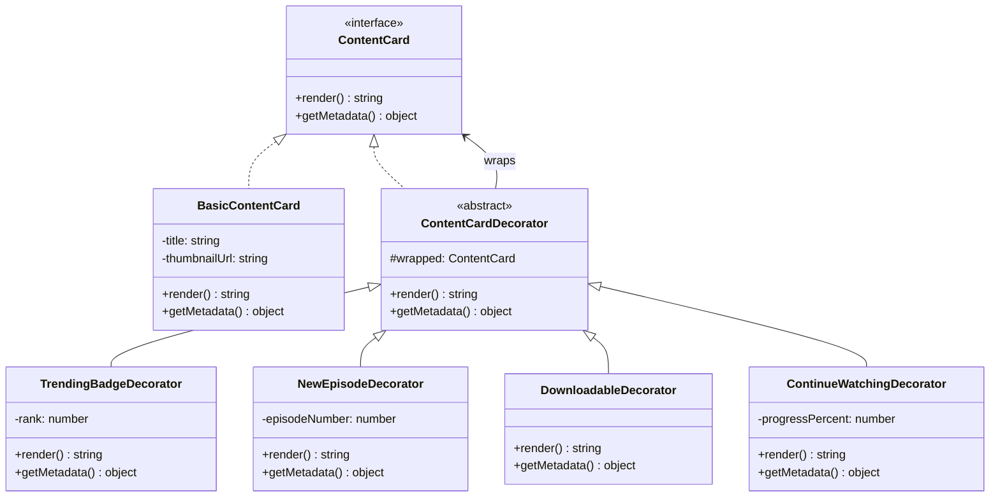

### Full Code Example — Netflix Content Cards

```typescript
// ============================================================
// Scenario: Netflix content cards need dynamic badges/features.
// Different users see different combinations of:
// - Trending badge (#1 in India today)
// - "Continue Watching" progress bar
// - "New Episode" indicator
// - Download available icon
// Each combination assembled dynamically based on user data.
// ============================================================

// --- COMPONENT INTERFACE ---
interface ContentCard {
  getTitle(): string;
  getBadges(): string[];
  getProgressPercent(): number | null;
}

// --- CONCRETE COMPONENT: bare minimum card ---
class BasicContentCard implements ContentCard {
  constructor(private title: string) {}

  getTitle(): string { return this.title; }
  getBadges(): string[] { return []; }
  getProgressPercent(): number | null { return null; }
}

// --- ABSTRACT DECORATOR: wraps any ContentCard ---
abstract class ContentCardDecorator implements ContentCard {
  constructor(protected wrapped: ContentCard) {}

  getTitle(): string { return this.wrapped.getTitle(); }
  getBadges(): string[] { return this.wrapped.getBadges(); }
  getProgressPercent(): number | null { return this.wrapped.getProgressPercent(); }
}

// --- CONCRETE DECORATORS: each adds exactly ONE behavior ---

class TrendingDecorator extends ContentCardDecorator {
  constructor(wrapped: ContentCard, private rank: number) {
    super(wrapped);
  }

  getBadges(): string[] {
    return [...this.wrapped.getBadges(), `#${this.rank} in India Today`];
  }
}

class NewEpisodeDecorator extends ContentCardDecorator {
  constructor(wrapped: ContentCard, private episode: number) {
    super(wrapped);
  }

  getBadges(): string[] {
    return [...this.wrapped.getBadges(), `New Episode: S1E${this.episode}`];
  }
}

class DownloadableDecorator extends ContentCardDecorator {
  getBadges(): string[] {
    return [...this.wrapped.getBadges(), "Available for Download"];
  }
}

class ContinueWatchingDecorator extends ContentCardDecorator {
  constructor(wrapped: ContentCard, private progress: number) {
    super(wrapped);
  }

  getProgressPercent(): number { return this.progress; }
}

// --- USAGE: assemble dynamically based on user state ---
function buildContentCard(
  title: string,
  userProgress: number | null,
  trendingRank: number | null,
  newEpisode: number | null,
  isDownloadable: boolean
): ContentCard {
  let card: ContentCard = new BasicContentCard(title);

  // Each if-block wraps the card with another layer
  if (isDownloadable)          card = new DownloadableDecorator(card);
  if (newEpisode !== null)     card = new NewEpisodeDecorator(card, newEpisode);
  if (trendingRank !== null)   card = new TrendingDecorator(card, trendingRank);
  if (userProgress !== null)   card = new ContinueWatchingDecorator(card, userProgress);

  return card;
}

// User 1: just started watching, show trending
const card1 = buildContentCard("Sacred Games", 5, 1, null, true);
console.log(card1.getTitle());        // Sacred Games
console.log(card1.getBadges());       // ["Available for Download", "#1 in India Today"]
console.log(card1.getProgressPercent()); // 5

// User 2: new episode available, can download
const card2 = buildContentCard("Mirzapur", null, null, 5, true);
console.log(card2.getBadges()); // ["Available for Download", "New Episode: S1E5"]

// User 3: plain card
const card3 = buildContentCard("Scam 1992", null, null, null, false);
console.log(card3.getBadges()); // []
```

### Decorator in Real Systems

**Java IO Streams — the classic textbook example:**

```java
// Each class wraps the previous — classic Decorator chain
InputStream raw      = new FileInputStream("data.txt");      // Base component
InputStream buffered = new BufferedInputStream(raw);          // Adds buffering
DataInputStream data = new DataInputStream(buffered);         // Adds typed reads

// You can read an int from a buffered file stream with one call:
int value = data.readInt();
```

**Express.js Middleware:**

```typescript
// Every middleware IS a Decorator. It wraps the request handling pipeline.
import express from "express";
const app = express();

// Each .use() call wraps the request in another layer of behavior
app.use(express.json());          // Decorator: parse JSON body
app.use(corsMiddleware());        // Decorator: add CORS headers
app.use(rateLimiter());           // Decorator: check request rate
app.use(authMiddleware());        // Decorator: verify JWT token
app.use(requestLogger());         // Decorator: log all requests

// The actual route handler is the "BasicContentCard" — all decorators wrapped around it
app.get("/api/orders", (req, res) => {
  res.json({ orders: [] });
});
```

**Python Decorators — literally this pattern:**

```python
# Python's @decorator syntax IS the Decorator pattern
import functools
import time

def log_call(func):
    @functools.wraps(func)
    def wrapper(*args, **kwargs):
        print(f"Calling {func.__name__}")
        result = func(*args, **kwargs)
        print(f"Done {func.__name__}")
        return result
    return wrapper

def measure_time(func):
    @functools.wraps(func)
    def wrapper(*args, **kwargs):
        start = time.time()
        result = func(*args, **kwargs)
        print(f"{func.__name__} took {time.time() - start:.2f}s")
        return result
    return wrapper

# Stacking decorators = stacking wrappers
@log_call
@measure_time
def fetch_user_feed(user_id: str):
    # expensive operation
    pass
```

### Decorator vs Inheritance — the Key Difference

| | Inheritance | Decorator |
|---|---|---|
| When? | Compile time — fixed | Runtime — dynamic |
| Combinable? | You must create every combination as a class | Stack decorators freely at runtime |
| Adding a new feature? | Must add a new subclass for every existing combination | Just write one new Decorator class |
| Example | `MilkSugarCoffee extends Coffee` | `new SugarDecorator(new MilkDecorator(coffee))` |

### When to Use / When NOT to Use

| Use Decorator When... | Do NOT Use When... |
|---|---|
| You need to add behaviors at runtime, not compile time | The wrapping order matters and is confusing to reason about |
| Subclassing would cause class explosion (M x N subclasses) | A simple strategy pattern or flag on the class is cleaner |
| You want to mix and match behaviors freely | Too many thin decorators makes debugging a stack trace nightmare |
| Cross-cutting concerns: logging, auth, caching, metrics | The base object's interface is different from the decorator's interface (use Adapter then) |

---

## 3. Proxy — The Gatekeeper

### Why does this pattern exist?

Sometimes you need to control access to an object. You might want to:
- **Delay its creation** — creating a full database connection pool at app startup is expensive. Why not create it only when the first query actually comes in? (Virtual Proxy / Lazy Loading)
- **Check permissions** — before letting someone run a DELETE query, verify they are an admin. (Protection Proxy)
- **Cache results** — if someone calls `getProductDetails(123)` ten times in a second, only hit the database once and cache the rest. (Caching Proxy)
- **Add logging** — log every method call without modifying the real object. (Logging Proxy)
- **Talk to a remote object** — when your code calls `userService.getUser(id)`, the `userService` might actually be a stub that makes a network call to a different machine. (Remote Proxy — this is what gRPC stubs are)

The critical insight: **the Proxy implements the exact same interface as the real object**. The client has no idea it is talking to a proxy. It thinks it is talking directly to the real thing.

### The Simplest Possible Analogy

> Your company's HR department. You want to access the CEO directly. You cannot. His PA (Personal Assistant = Proxy) sits between you. The PA:
> - Checks if your meeting request is approved (Protection Proxy)
> - Schedules it only when the CEO is available (Virtual/Lazy)
> - Takes notes of every interaction (Logging Proxy)
> - Handles repeat requests ("the CEO already answered this, here is the same answer") (Caching Proxy)
>
> You interact with the PA using the same interface as the CEO — "I need to discuss X." The PA just controls what actually reaches the CEO.

### How it Works — Step by Step

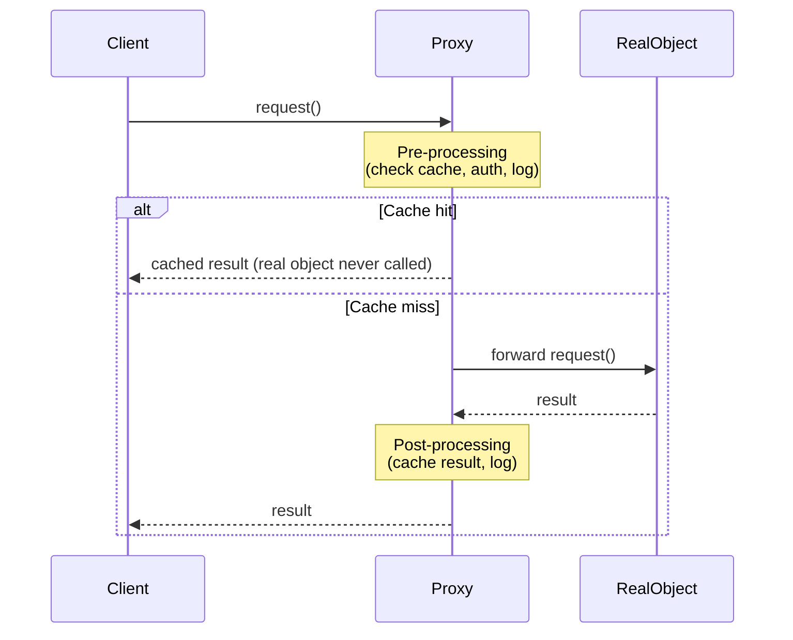

### Class Diagram — Four Proxy Types

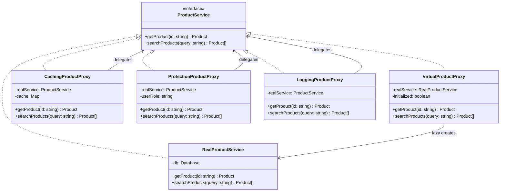

### Full Code Example — Amazon/Flipkart Product Service with All Four Proxies

```typescript
// ============================================================
// Scenario: Flipkart product service with multiple proxy layers.
// - VirtualProxy: don't connect to DB until first query
// - CachingProxy: cache frequent product lookups (Redis-like)
// - ProtectionProxy: only admins can see pricing margin data
// - LoggingProxy: log all calls for observability
// ============================================================

interface Product {
  id: string;
  name: string;
  price: number;
  stock: number;
}

// --- THE REAL SERVICE (expensive — opens DB connections, etc.) ---
interface ProductService {
  getProduct(id: string): Product | null;
  searchProducts(query: string): Product[];
}

class RealProductService implements ProductService {
  private products: Map<string, Product> = new Map([
    ["P001", { id: "P001", name: "iPhone 15", price: 79999, stock: 50 }],
    ["P002", { id: "P002", name: "Samsung Galaxy S24", price: 69999, stock: 80 }],
    ["P003", { id: "P003", name: "OnePlus 12", price: 64999, stock: 120 }],
  ]);

  constructor() {
    console.log("[DB] Initializing product database connection pool... (expensive!)");
  }

  getProduct(id: string): Product | null {
    console.log(`[DB] SELECT * FROM products WHERE id = '${id}'`);
    return this.products.get(id) ?? null;
  }

  searchProducts(query: string): Product[] {
    console.log(`[DB] SELECT * FROM products WHERE name LIKE '%${query}%'`);
    return Array.from(this.products.values()).filter(p =>
      p.name.toLowerCase().includes(query.toLowerCase())
    );
  }
}

// --- VIRTUAL PROXY: lazy initialization ---
class VirtualProductProxy implements ProductService {
  private realService: RealProductService | null = null;

  private getReal(): RealProductService {
    if (!this.realService) {
      console.log("[VirtualProxy] First call — initializing real service now...");
      this.realService = new RealProductService();
    }
    return this.realService;
  }

  getProduct(id: string): Product | null {
    return this.getReal().getProduct(id);
  }

  searchProducts(query: string): Product[] {
    return this.getReal().searchProducts(query);
  }
}

// --- CACHING PROXY: in-memory cache (like Redis layer) ---
class CachingProductProxy implements ProductService {
  private productCache = new Map<string, { product: Product | null; expiresAt: number }>();
  private searchCache = new Map<string, { results: Product[]; expiresAt: number }>();
  private readonly TTL_MS = 60_000; // 60 seconds cache

  constructor(private realService: ProductService) {}

  getProduct(id: string): Product | null {
    const cached = this.productCache.get(id);
    if (cached && cached.expiresAt > Date.now()) {
      console.log(`[Cache] HIT for product ${id}`);
      return cached.product;
    }

    console.log(`[Cache] MISS for product ${id} — fetching from real service`);
    const product = this.realService.getProduct(id);
    this.productCache.set(id, { product, expiresAt: Date.now() + this.TTL_MS });
    return product;
  }

  searchProducts(query: string): Product[] {
    const cached = this.searchCache.get(query);
    if (cached && cached.expiresAt > Date.now()) {
      console.log(`[Cache] HIT for search '${query}'`);
      return cached.results;
    }

    console.log(`[Cache] MISS for search '${query}'`);
    const results = this.realService.searchProducts(query);
    this.searchCache.set(query, { results, expiresAt: Date.now() + this.TTL_MS });
    return results;
  }
}

// --- PROTECTION PROXY: role-based access ---
class ProtectionProductProxy implements ProductService {
  constructor(
    private realService: ProductService,
    private userRole: "admin" | "seller" | "buyer"
  ) {}

  getProduct(id: string): Product | null {
    const product = this.realService.getProduct(id);
    if (!product) return null;

    // Buyers cannot see stock count (business rule)
    if (this.userRole === "buyer") {
      return { ...product, stock: -1 }; // mask stock info
    }
    return product;
  }

  searchProducts(query: string): Product[] {
    return this.realService.searchProducts(query);
  }
}

// --- LOGGING PROXY: observability ---
class LoggingProductProxy implements ProductService {
  constructor(private realService: ProductService) {}

  getProduct(id: string): Product | null {
    const start = performance.now();
    const result = this.realService.getProduct(id);
    const duration = (performance.now() - start).toFixed(2);

    console.log(`[Log] getProduct("${id}") | found=${result !== null} | ${duration}ms`);
    return result;
  }

  searchProducts(query: string): Product[] {
    const start = performance.now();
    const results = this.realService.searchProducts(query);
    const duration = (performance.now() - start).toFixed(2);

    console.log(`[Log] searchProducts("${query}") | count=${results.length} | ${duration}ms`);
    return results;
  }
}

// --- ASSEMBLY: stack proxies like layers ---
// Innermost = real thing, outermost = what client calls
const buyerService: ProductService = new LoggingProductProxy(
  new CachingProductProxy(
    new ProtectionProductProxy(
      new VirtualProductProxy(),  // lazy init the real service
      "buyer"
    )
  )
);

// --- USAGE ---
console.log("=== App Started — no DB connection yet ===\n");

console.log("\n--- First call (triggers lazy init + cache miss) ---");
const product = buyerService.getProduct("P001");
console.log("Stock visible to buyer:", product?.stock); // -1 (masked)

console.log("\n--- Second call (cache hit!) ---");
buyerService.getProduct("P001");  // No DB call, served from cache
```

### Real-World Proxy Examples

**Spring AOP — the king of Proxy pattern:**
When you add `@Transactional` or `@Cacheable` to a Spring bean, Spring wraps your class in a proxy at runtime. Your code calls the proxy, the proxy adds transactional behavior, then delegates to your real method. You never wrote the proxy — Spring generates it.

**Hibernate Lazy Loading:**
```java
// You have a User entity with a List<Orders>
User user = userRepo.findById(1L);
// At this point, user.orders is a PROXY — not yet fetched from DB

System.out.println(user.getName()); // Works fine, orders not loaded

List<Order> orders = user.getOrders(); // NOW Hibernate executes SELECT on orders table
// getOrders() is intercepted by the Hibernate proxy which triggers the actual DB call
```

**API Gateway as a Proxy:**
Your mobile app calls `api.swiggy.com/orders`. That hits an API gateway (Proxy) which:
- Validates your auth token (Protection Proxy)
- Rate limits your requests (Protection Proxy)
- Logs the request (Logging Proxy)
- Checks a cache (Caching Proxy)
- Then routes to the actual Order Service (Virtual Proxy essentially)

### When to Use / When NOT to Use

| Use Proxy When... | Do NOT Use When... |
|---|---|
| Lazy loading expensive resources | The real object is cheap — proxy overhead is not worth it |
| Adding access control without modifying the real object | The intercepting logic belongs inside the real class itself |
| Caching transparent to the caller | You end up with deeply nested proxies that are impossible to debug |
| Adding logging/metrics without changing business logic | The client NEEDS to know it is accessing a proxy (breaks transparency) |
| Remote access to objects (gRPC stubs, RMI) | |

---

## 4. Facade — The Hotel Concierge

### Why does this pattern exist?

Imagine you are visiting Mumbai for the first time. You want to:
1. Book a Bollywood movie show
2. Get a table at a famous restaurant
3. Hire a car for the day
4. Book a guided heritage walk

You could figure all of this out yourself — research apps, make calls, coordinate timings. Or you could call your hotel's **concierge** and say "I want a perfect evening in Mumbai" — and they coordinate everything.

The concierge is a **Facade**. One simple interface over multiple complex subsystems.

In software: your e-commerce checkout page says "Place Order." Behind that button — inventory check, payment processing, fraud detection, order creation, email notification, WhatsApp notification, loyalty points update, warehouse notification. The client (UI) sees one method: `orderService.placeOrder(cart)`. That method is the Facade.

### The Simplest Possible Analogy

> "A universal TV remote's 'Movie Mode' button. Press it and: TV turns on, HDMI-3 is selected, surround sound turns on, lights dim, Netflix opens. You did not interact with 6 different systems — one button coordinated everything."

### Flow Diagram — Swiggy Order Placement

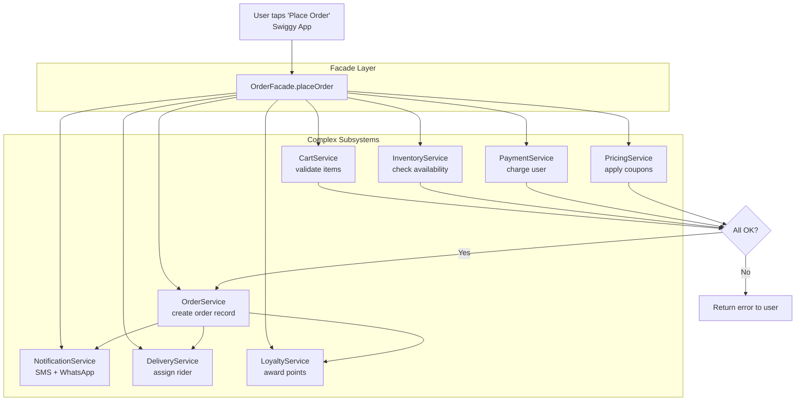

### Class Diagram

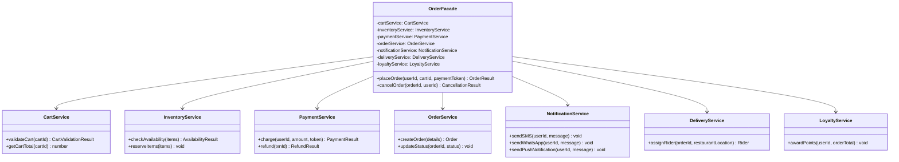

### Full Code Example — Swiggy Order Placement Facade

```typescript
// ============================================================
// Scenario: Swiggy's order placement — 7 subsystems coordinated
// by one Facade. The UI calls one method and everything happens.
// ============================================================

// --- SUBSYSTEM CLASSES (simplified) ---
class CartService {
  validateCart(cartId: string): { valid: boolean; items: string[]; total: number } {
    console.log(`[Cart] Validating cart ${cartId}`);
    return { valid: true, items: ["Chicken Biryani", "Raita"], total: 349 };
  }
}

class InventoryService {
  checkAndReserve(items: string[]): { available: boolean } {
    console.log(`[Inventory] Checking stock for: ${items.join(", ")}`);
    return { available: true };
  }

  releaseReservation(items: string[]): void {
    console.log(`[Inventory] Releasing reservation for: ${items.join(", ")}`);
  }
}

class PaymentService {
  charge(userId: string, amount: number, token: string): { success: boolean; txnId: string } {
    console.log(`[Payment] Charging Rs.${amount} for user ${userId}`);
    return { success: true, txnId: `TXN_${Date.now()}` };
  }

  refund(txnId: string): void {
    console.log(`[Payment] Refunding transaction ${txnId}`);
  }
}

class OrderService {
  createOrder(userId: string, cartId: string, txnId: string): { orderId: string } {
    console.log(`[Order] Creating order for user ${userId}, cart ${cartId}, txn ${txnId}`);
    return { orderId: `ORD_${Date.now()}` };
  }
}

class NotificationService {
  notifyOrderConfirmed(userId: string, orderId: string): void {
    console.log(`[Notification] Sending SMS + WhatsApp to user ${userId}: Order ${orderId} confirmed!`);
  }
}

class DeliveryService {
  assignRider(orderId: string): { riderName: string; eta: string } {
    console.log(`[Delivery] Assigning rider for order ${orderId}`);
    return { riderName: "Ravi Kumar", eta: "35 minutes" };
  }
}

class LoyaltyService {
  awardPoints(userId: string, orderTotal: number): void {
    const points = Math.floor(orderTotal * 0.01);
    console.log(`[Loyalty] Awarding ${points} Swiggy Money to user ${userId}`);
  }
}

// --- THE FACADE: one method, seven subsystems ---
interface OrderResult {
  success: boolean;
  orderId?: string;
  riderName?: string;
  eta?: string;
  error?: string;
}

class OrderFacade {
  private cart = new CartService();
  private inventory = new InventoryService();
  private payment = new PaymentService();
  private order = new OrderService();
  private notification = new NotificationService();
  private delivery = new DeliveryService();
  private loyalty = new LoyaltyService();

  placeOrder(userId: string, cartId: string, paymentToken: string): OrderResult {
    console.log("\n=== Swiggy Order Placement Started ===");

    // Step 1: Validate cart
    const cart = this.cart.validateCart(cartId);
    if (!cart.valid) return { success: false, error: "Invalid cart" };

    // Step 2: Check inventory
    const stock = this.inventory.checkAndReserve(cart.items);
    if (!stock.available) return { success: false, error: "Items out of stock" };

    // Step 3: Process payment
    const payment = this.payment.charge(userId, cart.total, paymentToken);
    if (!payment.success) {
      this.inventory.releaseReservation(cart.items); // rollback
      return { success: false, error: "Payment failed" };
    }

    // Step 4: Create order record
    const { orderId } = this.order.createOrder(userId, cartId, payment.txnId);

    // Step 5: Notify user
    this.notification.notifyOrderConfirmed(userId, orderId);

    // Step 6: Assign delivery rider
    const { riderName, eta } = this.delivery.assignRider(orderId);

    // Step 7: Award loyalty points
    this.loyalty.awardPoints(userId, cart.total);

    console.log("=== Order Placement Complete ===\n");
    return { success: true, orderId, riderName, eta };
  }
}

// --- CLIENT CODE: clean as a whistle ---
const swiggy = new OrderFacade();
const result = swiggy.placeOrder("USR_ABC", "CART_XYZ", "tok_payu_abc123");

if (result.success) {
  console.log(`Order ${result.orderId} placed!`);
  console.log(`Your rider: ${result.riderName}, ETA: ${result.eta}`);
}
```

### Facade in System Design — API Gateway

The API Gateway pattern is a large-scale Facade. Rather than mobile clients talking to 10 different microservices, they talk to one API Gateway which:
- Authenticates the request
- Routes to the right microservice(s)
- Aggregates responses from multiple services
- Handles rate limiting
- Returns a single, clean response

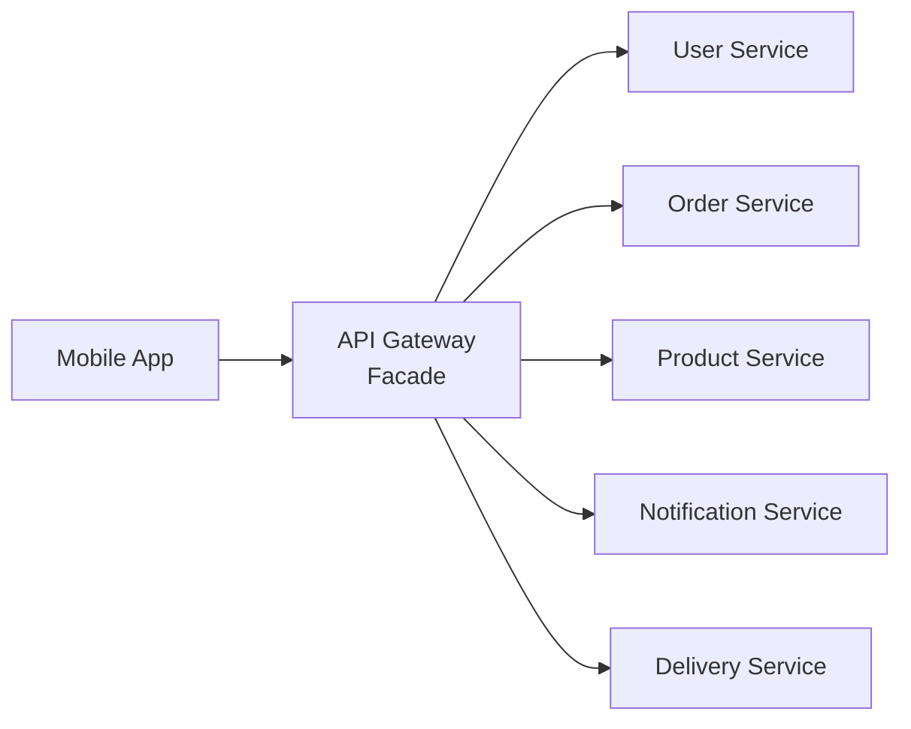

### When to Use / When NOT to Use

| Use Facade When... | Do NOT Use When... |
|---|---|
| Many classes must be coordinated in a specific sequence | The client genuinely needs fine-grained control over each subsystem |
| You want to layer your architecture (UI -> Service Facade -> Repositories) | The facade becomes a "God class" doing too much (500+ line methods) |
| Providing a simpler API for an external library | Advanced users need subsystem access — expose BOTH: facade + raw subsystems |
| API Gateway over multiple microservices | |

**Important distinction from Mediator:** Facade provides a simplified interface TO the subsystem. Mediator reduces COUPLING WITHIN the subsystem. Facade is one-directional; Mediator is bidirectional communication coordination.

---

## 5. Composite — The Army General

### Why does this pattern exist?

Think of a folder on your computer. You can ask it "how big are you?" (getSize). It answers by asking all its children. Each child folder asks its children. Each file returns its own size. You — the person asking — do not care whether you're asking a file or a folder. You just call `getSize()` on both.

Without Composite: you would write `if (item instanceof File) { return item.size; } else if (item instanceof Folder) { return sumChildren(item); }` — EVERYWHERE. Every operation needs this ugly instanceof dance.

With Composite: both File and Folder implement the same `FileSystemItem` interface. You call `getSize()` on both. The implementation of that recursion is hidden inside Folder. Your code is clean.

### The Simplest Possible Analogy

> An Indian Army hierarchy. A Soldier follows orders. A Squad (8 soldiers) follows orders. A Platoon (4 squads) follows orders. A Company (4 platoons) follows orders. When the General says "March to position X," the command travels down the hierarchy and every single soldier eventually executes it. The General does not care if he is commanding a soldier or an entire company — the interface is the same.

### Class Diagram — YouTube Channel Structure

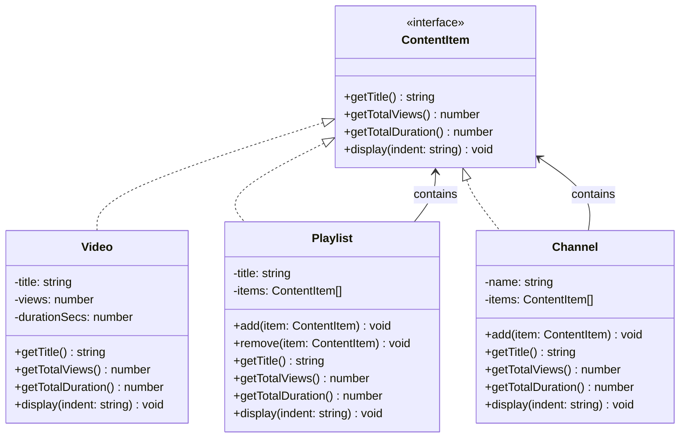

### Full Code Example — YouTube Channel Analytics

```typescript
// ============================================================
// Scenario: YouTube analytics dashboard. A Channel contains
// Playlists and Videos. A Playlist contains Videos.
// We need total views and duration at any level — same interface.
// ============================================================

// --- COMPONENT INTERFACE ---
interface ContentItem {
  getTitle(): string;
  getTotalViews(): number;
  getTotalDurationSecs(): number;
  display(indent?: string): void;
}

// --- LEAF NODE: individual video ---
class Video implements ContentItem {
  constructor(
    private title: string,
    private views: number,
    private durationSecs: number
  ) {}

  getTitle(): string { return this.title; }
  getTotalViews(): number { return this.views; }
  getTotalDurationSecs(): number { return this.durationSecs; }

  display(indent = ""): void {
    const mins = Math.floor(this.durationSecs / 60);
    console.log(`${indent}Video: "${this.title}" | ${this.views.toLocaleString()} views | ${mins}m`);
  }
}

// --- COMPOSITE NODE: playlist ---
class Playlist implements ContentItem {
  private items: ContentItem[] = [];

  constructor(private title: string) {}

  add(item: ContentItem): void { this.items.push(item); }
  remove(item: ContentItem): void {
    this.items = this.items.filter(i => i !== item);
  }

  getTitle(): string { return this.title; }

  // Recursion: delegate to children, they handle their own children
  getTotalViews(): number {
    return this.items.reduce((sum, item) => sum + item.getTotalViews(), 0);
  }

  getTotalDurationSecs(): number {
    return this.items.reduce((sum, item) => sum + item.getTotalDurationSecs(), 0);
  }

  display(indent = ""): void {
    console.log(`${indent}Playlist: "${this.title}" [${this.items.length} items]`);
    this.items.forEach(item => item.display(indent + "  "));
  }
}

// --- COMPOSITE NODE: channel (can contain playlists AND videos) ---
class Channel implements ContentItem {
  private items: ContentItem[] = [];

  constructor(private name: string) {}

  add(item: ContentItem): void { this.items.push(item); }

  getTitle(): string { return this.name; }

  getTotalViews(): number {
    return this.items.reduce((sum, item) => sum + item.getTotalViews(), 0);
  }

  getTotalDurationSecs(): number {
    return this.items.reduce((sum, item) => sum + item.getTotalDurationSecs(), 0);
  }

  display(indent = ""): void {
    console.log(`${indent}Channel: "${this.name}"`);
    this.items.forEach(item => item.display(indent + "  "));
  }
}

// --- USAGE ---
// Build Dhruv Rathee's channel structure
const channel = new Channel("Dhruv Rathee");

const politicsPlaylist = new Playlist("Indian Politics");
politicsPlaylist.add(new Video("India's Political Landscape 2024", 5_200_000, 2340));
politicsPlaylist.add(new Video("Budget 2024 Explained", 3_800_000, 1860));

const sciencePlaylist = new Playlist("Science & Environment");
sciencePlaylist.add(new Video("Climate Change in India", 4_100_000, 2700));
sciencePlaylist.add(new Video("ISRO's Chandrayaan 3", 8_900_000, 1980));

// Nested playlist
const shortVideosSeries = new Playlist("Quick Facts");
shortVideosSeries.add(new Video("5 Things About Indian History", 1_200_000, 360));
sciencePlaylist.add(shortVideosSeries); // playlist inside a playlist

channel.add(politicsPlaylist);
channel.add(sciencePlaylist);
channel.add(new Video("My 2024 Year Recap", 2_500_000, 1200)); // direct video in channel

// --- The power: same interface, any level ---
channel.display();

console.log("\n=== Analytics ===");
console.log(`Total channel views: ${channel.getTotalViews().toLocaleString()}`);
console.log(`Politics playlist views: ${politicsPlaylist.getTotalViews().toLocaleString()}`);
console.log(`Science playlist views: ${sciencePlaylist.getTotalViews().toLocaleString()}`);

const totalHours = (channel.getTotalDurationSecs() / 3600).toFixed(1);
console.log(`Total content hours: ${totalHours}h`);

// You can call getTotalViews() on a Video or a Channel — SAME INTERFACE
const singleVideo = new Video("Test", 100, 60);
console.log(`\nViews from single video: ${singleVideo.getTotalViews()}`);    // 100
console.log(`Views from channel: ${channel.getTotalViews().toLocaleString()}`); // millions
// No instanceof checks. No if-else. Just polymorphism.
```

### Real-World Examples

- **File system:** `File` and `Directory` both implement a `FileSystemNode` interface. `cp -r` recursively copies by calling the same interface on everything.
- **React component tree:** A `Button` is a leaf. A `Form` is a composite containing `Input`s, `Button`s, and maybe nested `FieldGroup`s. React renders the whole tree by recursively calling `render()` on each.
- **Org chart:** An Employee can be an individual contributor (leaf) or a Manager (composite containing other employees). "Calculate total salary budget for this team" recurses through the structure.
- **HTML DOM:** A `<p>` tag is a leaf. A `<div>` is a composite. The browser renders both via the same interface.

### When to Use / When NOT to Use

| Use Composite When... | Do NOT Use When... |
|---|---|
| You have tree-like, recursive structures | The structure is flat — no nesting needed |
| Clients should treat leaves and composites identically | Operations differ significantly between leaves and composites (breaks uniform interface) |
| Building UI hierarchies, file systems, org charts, menus | Performance is critical and recursive traversal is too slow for the use case |

---

## 6. Flyweight — The Memory Miser

### Why does this pattern exist?

Yeh pattern tab use karte hain when you have a HUGE number of objects and they're eating your memory. Basically the pattern says: *"stop storing the same thing a million times — share it."*

Classic scenario: a text editor displaying a 500-page document. Every single character 'a' on every page has the same font (Times New Roman), same size (12pt), same color (black). If each character object stores all that data, you have 500,000+ identical copies of font/size/color data. Wasteful.

Flyweight says: separate what's shared (intrinsic state — font, size, color) from what's unique (extrinsic state — position on screen, which paragraph). Store intrinsic state once in a shared object. Pass extrinsic state in as parameters when needed.

### The Simplest Possible Analogy

> A multiplayer mobile game (like PUBG or Free Fire) has a forest map with 50,000 trees. Each tree has:
> - **Same data:** texture, 3D mesh, leaf color (shared among all trees of the same species)
> - **Unique data:** x/y position on the map, height, rotation angle
>
> Instead of 50,000 full tree objects, you have:
> - 3 shared `TreeType` objects (Pine, Birch, Oak) — stored once in memory
> - 50,000 lightweight `TreePosition` objects — just coordinates + reference to a `TreeType`
>
> Memory: 3 rich objects + 50,000 tiny coordinate objects vs. 50,000 rich objects. This is a 10-100x memory reduction.

### Intrinsic vs Extrinsic State — The Core Concept

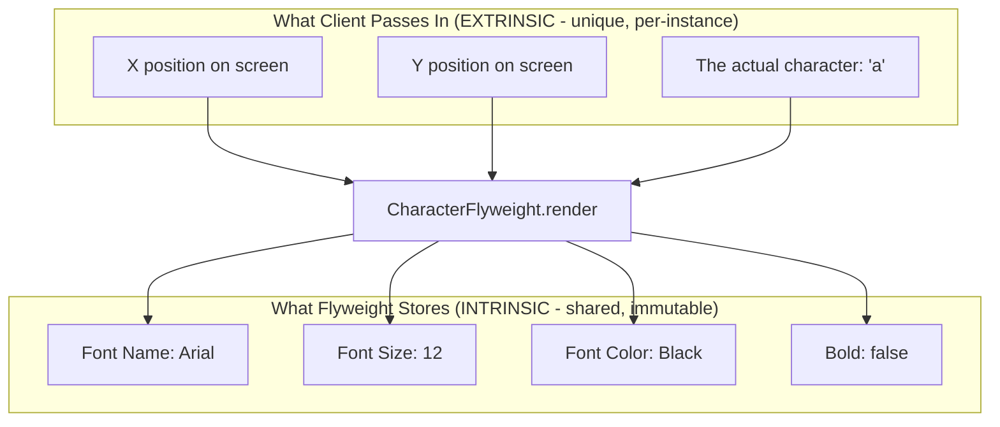

### Full Code Example — Game Particle System (PUBG-style)

```typescript
// ============================================================
// Scenario: A battle royale game renders thousands of particles:
// bullet hits, explosions, smoke clouds. Each particle type
// (bullet spark, fire, smoke) has a complex texture/color/mesh.
// But the position + velocity is unique per particle.
// Flyweight separates these to save memory massively.
// ============================================================

// --- FLYWEIGHT: shared, immutable state ---
class ParticleType {
  constructor(
    public readonly name: string,
    public readonly color: string,
    public readonly texture: string,  // imagine this is a large binary blob
    public readonly spriteWidth: number,
    public readonly spriteHeight: number
  ) {
    console.log(`[FlyweightFactory] Created new particle type: "${name}" (expensive texture loaded)`);
  }

  render(x: number, y: number, opacity: number): void {
    // In a real game engine, this would pass the shared texture to the GPU
    // and only upload unique uniforms (position, opacity)
    // console.log(`Rendering ${this.name} at (${x}, ${y}) opacity=${opacity}`);
  }
}

// --- FLYWEIGHT FACTORY: ensures shared instances ---
class ParticleTypeRegistry {
  private static pool = new Map<string, ParticleType>();

  static getType(name: string, color: string, texture: string, w: number, h: number): ParticleType {
    const key = `${name}:${color}`;
    if (!this.pool.has(key)) {
      this.pool.set(key, new ParticleType(name, color, texture, w, h));
    }
    return this.pool.get(key)!;
  }

  static getPoolSize(): number { return this.pool.size; }
  static getTypeNames(): string[] { return Array.from(this.pool.keys()); }
}

// --- CONTEXT (extrinsic state + reference to flyweight) ---
class Particle {
  constructor(
    private x: number,
    private y: number,
    private velX: number,
    private velY: number,
    private opacity: number,
    private type: ParticleType  // reference to shared flyweight
  ) {}

  update(deltaTime: number): void {
    this.x += this.velX * deltaTime;
    this.y += this.velY * deltaTime;
    this.opacity -= 0.01 * deltaTime;
  }

  render(): void {
    this.type.render(this.x, this.y, this.opacity);
  }

  isAlive(): boolean { return this.opacity > 0; }
}

// --- PARTICLE SYSTEM: manages many particles, few flyweights ---
class GameParticleSystem {
  private particles: Particle[] = [];

  spawnBulletSpark(x: number, y: number): void {
    // ALL bullet sparks share ONE ParticleType object
    const type = ParticleTypeRegistry.getType(
      "BulletSpark", "#FFD700", "spark_texture.png", 4, 4
    );
    // But each spark has its OWN position + velocity
    for (let i = 0; i < 20; i++) {
      this.particles.push(new Particle(
        x, y,
        (Math.random() - 0.5) * 200,
        (Math.random() - 0.5) * 200,
        1.0,
        type  // shared!
      ));
    }
  }

  spawnExplosion(x: number, y: number): void {
    const fireType = ParticleTypeRegistry.getType(
      "Fire", "#FF4500", "fire_texture.png", 16, 16
    );
    const smokeType = ParticleTypeRegistry.getType(
      "Smoke", "#808080", "smoke_texture.png", 24, 24
    );

    for (let i = 0; i < 50; i++) {
      this.particles.push(new Particle(
        x, y,
        (Math.random() - 0.5) * 150,
        -Math.random() * 100,
        1.0,
        i < 30 ? fireType : smokeType  // shared between all fire & smoke particles
      ));
    }
  }

  update(deltaTime: number): void {
    this.particles = this.particles.filter(p => {
      p.update(deltaTime);
      p.render();
      return p.isAlive();
    });
  }

  getStats(): void {
    console.log(`\n=== Memory Stats ===`);
    console.log(`Total live particles: ${this.particles.length}`);
    console.log(`Unique particle types in memory: ${ParticleTypeRegistry.getPoolSize()}`);
    console.log(`Types: ${ParticleTypeRegistry.getTypeNames().join(", ")}`);
    console.log(`Without Flyweight: ${this.particles.length} full texture objects in memory`);
    console.log(`With Flyweight:    ${ParticleTypeRegistry.getPoolSize()} texture objects shared among all`);
  }
}

// --- SIMULATION ---
const system = new GameParticleSystem();

// 10 bullet hits = 200 particles — but still only ONE BulletSpark type object
for (let i = 0; i < 10; i++) {
  system.spawnBulletSpark(Math.random() * 1000, Math.random() * 1000);
}

// 3 explosions = 150 more particles — still only 2 explosion-related type objects
for (let i = 0; i < 3; i++) {
  system.spawnExplosion(Math.random() * 1000, Math.random() * 1000);
}

system.update(16); // one frame
system.getStats();
// Total live particles: 350
// Unique particle types in memory: 3
// Without Flyweight: 350 texture objects
// With Flyweight:    3 texture objects shared among all
```

### Real-World Examples

- **Java String Pool:** `String s1 = "hello"; String s2 = "hello";` — in Java, `s1 == s2` can be `true` because string literals are interned (shared). The JVM maintains a pool of string flyweights.
- **Integer Cache in Java:** `Integer.valueOf(100) == Integer.valueOf(100)` is `true` because Java caches Integer values from -128 to 127.
- **Icon/glyph caching in browsers:** When a browser renders text, each glyph is rasterized once per font+size+style combination and cached. All instances of 'a' in Arial 12px share the same rasterized bitmap.
- **Connection Pools:** Database connection pools are Flyweights — each connection is a heavy resource shared among many requests.

### When to Use / When NOT to Use

| Use Flyweight When... | Do NOT Use When... |
|---|---|
| You create a HUGE number of similar objects (thousands+) | Object count is small — factory overhead is not worth it |
| Memory is a measurable bottleneck | The code complexity to separate intrinsic/extrinsic state is not worth the memory savings |
| Objects can safely share state (intrinsic state is immutable) | Shared state is mutable — Flyweights must be immutable or you get race conditions |

**Warning:** Flyweight adds code complexity. Only use it after profiling shows memory is actually the problem. Premature optimization is the root of all evil.

---

## 7. Bridge — The TV Remote

### Why does this pattern exist?

Imagine you are building a notification system for a startup. You have:
- **Notification types:** Email, SMS, Push Notification
- **Priority levels:** Normal, Urgent, Critical

Without Bridge, using inheritance:
- `NormalEmailNotification`
- `UrgentEmailNotification`
- `CriticalEmailNotification`
- `NormalSMSNotification`
- `UrgentSMSNotification`
- `CriticalSMSNotification`
- `NormalPushNotification`
- ...

That is 9 classes for 3 types x 3 priorities. Add a 4th notification channel (WhatsApp) — 12 classes. Add a 4th priority — 16 classes. This is **M x N class explosion**.

Bridge says: **separate the "what" (Notification priority — the abstraction) from the "how" (the channel — the implementation) and let each vary independently.**

### The Simplest Possible Analogy

> A TV remote (Abstraction) has buttons like Power, Volume Up, Channel Change. A Samsung TV (Implementation 1) responds to these. A Sony TV (Implementation 2) also responds to these — differently internally, but the same buttons. You can buy a universal remote (one abstraction) that works with any TV brand (any implementation). The remote and the TV are **developed independently** and **bridged by a standard protocol**.

### How Bridge Differs from Adapter

This is a common interview question — samjho carefully:

| | Adapter | Bridge |
|---|---|---|
| **Intent** | Fix incompatibility between existing things | Design both sides to vary independently FROM THE START |
| **When** | After the fact — things already exist and don't fit | Upfront design decision |
| **Goal** | Make incompatible interfaces work | Prevent class explosion when 2 dimensions vary |
| **Analogy** | Buying a power adapter for your trip | Designing a universal remote from scratch |

### Class Diagram — Notification System

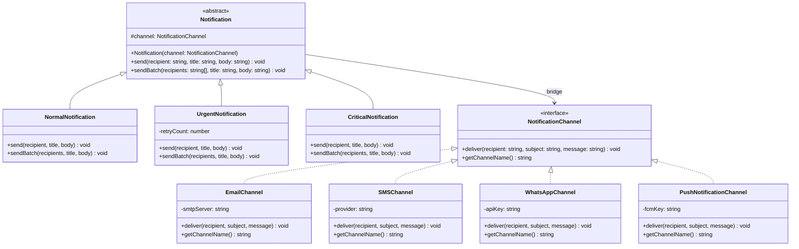

### Full Code Example — Notification System with Bridge

```typescript
// ============================================================
// Scenario: Startup's alert system. Notification TYPES
// (Normal, Urgent, Critical) are the Abstraction hierarchy.
// Notification CHANNELS (Email, SMS, WhatsApp) are the
// Implementation hierarchy. Bridge lets both grow independently.
// Adding WhatsApp = add one channel class. That's it.
// ============================================================

// --- IMPLEMENTATION: notification channel interface ---
interface NotificationChannel {
  deliver(recipient: string, subject: string, message: string): Promise<void>;
  getChannelName(): string;
}

// --- CONCRETE IMPLEMENTATIONS ---
class EmailChannel implements NotificationChannel {
  constructor(private smtpServer: string) {}

  async deliver(to: string, subject: string, body: string): Promise<void> {
    console.log(`[Email via ${this.smtpServer}] To: ${to} | Subject: ${subject}`);
    console.log(`  Body: ${body}`);
  }

  getChannelName(): string { return "Email"; }
}

class SMSChannel implements NotificationChannel {
  constructor(private provider: "Twilio" | "MSG91" = "MSG91") {}

  async deliver(phone: string, _subject: string, body: string): Promise<void> {
    console.log(`[SMS via ${this.provider}] To: ${phone} | Message: ${body}`);
  }

  getChannelName(): string { return "SMS"; }
}

class WhatsAppChannel implements NotificationChannel {
  async deliver(number: string, subject: string, body: string): Promise<void> {
    console.log(`[WhatsApp Business API] To: ${number} | ${subject}: ${body}`);
  }

  getChannelName(): string { return "WhatsApp"; }
}

// --- ABSTRACTION: notification types ---
abstract class Notification {
  // The BRIDGE: abstraction holds a reference to the implementation
  constructor(protected channel: NotificationChannel) {}

  abstract send(recipient: string, title: string, body: string): Promise<void>;

  async sendBatch(recipients: string[], title: string, body: string): Promise<void> {
    await Promise.all(recipients.map(r => this.send(r, title, body)));
  }
}

// --- REFINED ABSTRACTIONS ---
class NormalNotification extends Notification {
  async send(recipient: string, title: string, body: string): Promise<void> {
    console.log(`\n[Normal] Sending via ${this.channel.getChannelName()}`);
    await this.channel.deliver(recipient, title, body);
  }
}

class UrgentNotification extends Notification {
  private maxRetries = 3;

  async send(recipient: string, title: string, body: string): Promise<void> {
    console.log(`\n[URGENT] Sending via ${this.channel.getChannelName()} with ${this.maxRetries} retries`);
    const urgentTitle = `[URGENT] ${title}`;
    for (let attempt = 1; attempt <= this.maxRetries; attempt++) {
      try {
        await this.channel.deliver(recipient, urgentTitle, body);
        break;
      } catch (err) {
        if (attempt === this.maxRetries) throw err;
        console.log(`  Retry ${attempt}/${this.maxRetries}...`);
      }
    }
  }
}

class CriticalNotification extends Notification {
  async send(recipient: string, title: string, body: string): Promise<void> {
    console.log(`\n[CRITICAL] Blasting via ${this.channel.getChannelName()} at highest priority`);
    const criticalTitle = `[CRITICAL ALERT] ${title}`;
    const criticalBody = `THIS REQUIRES IMMEDIATE ATTENTION\n\n${body}\n\n-- Sent at ${new Date().toISOString()}`;
    await this.channel.deliver(recipient, criticalTitle, criticalBody);
  }
}

// --- USAGE: mix and match freely ---
async function main() {
  // Notification types and channels are independent
  const emailChannel = new EmailChannel("smtp.company.com");
  const smsChannel = new SMSChannel("MSG91");
  const whatsappChannel = new WhatsAppChannel();

  // Normal email (e.g., newsletter, routine update)
  const normalEmail = new NormalNotification(emailChannel);
  await normalEmail.send("user@example.com", "Weekly Report", "Here's your summary...");

  // Urgent SMS (e.g., OTP, payment alert)
  const urgentSMS = new UrgentNotification(smsChannel);
  await urgentSMS.send("+919876543210", "Login OTP", "Your OTP is 847291. Valid for 5 minutes.");

  // Critical WhatsApp (e.g., server down, security breach)
  const criticalWhatsApp = new CriticalNotification(whatsappChannel);
  await criticalWhatsApp.send("+918765432109", "Server Down", "prod-api-01 is not responding");

  // Adding a NEW channel (PushNotification) = zero changes to Notification classes
  // Adding a NEW type (ScheduledNotification) = zero changes to Channel classes
  // That is the Bridge promise.
}

main();
```

### When to Use / When NOT to Use

| Use Bridge When... | Do NOT Use When... |
|---|---|
| Two independent dimensions of variation exist (M x N problem) | There is only one variation dimension — just use subclassing |
| You want to switch implementations at runtime | The overhead of indirection adds no real value |
| Building cross-platform code (Android/iOS, web/desktop) | Simple cases where 2-3 subclasses are perfectly fine |
| Two hierarchies need to evolve independently | The two "dimensions" are actually tightly coupled |

---

## 8. Pattern Comparison — The Confused Trio and Beyond

### The Adapter vs Decorator vs Proxy Confusion

This is the single most common structural pattern confusion in interviews. Here is the definitive breakdown:

| Question | Adapter | Decorator | Proxy |
|---|---|---|---|
| **Does it change the interface?** | YES — translates old to new | NO — same interface | NO — same interface |
| **Does it add new behavior?** | Minimal (just translation) | YES — this is the whole point | Sometimes (logging, caching) |
| **Does it control access?** | NO | NO | YES — this is the whole point |
| **Does the client know it exists?** | Sometimes (client uses new interface) | No — transparent | No — transparent |
| **Created when?** | Existing incompatibility to fix | Adding features at runtime | Controlling/intercepting access |
| **Real example** | Razorpay → your PaymentProcessor | Express middleware | Spring @Transactional proxy |
| **Analogy** | Power adapter plug | Gift wrapper | PA / Bouncer |

### Full Pattern Comparison

| Pattern | Intent | Key Mechanism | Memory impact | Runtime flexibility | Typical System Design Use |
|---|---|---|---|---|---|
| **Adapter** | Connect incompatible interfaces | Wraps one interface to look like another | Minimal | Low | Third-party/legacy integration |
| **Decorator** | Add behavior without subclassing | Wraps and delegates, augments result | Low | High | Middleware, HOCs, feature flags |
| **Proxy** | Control access to an object | Same interface, intercepts calls | Low-medium (cache) | Medium | Auth, caching, lazy loading, RPC stubs |
| **Facade** | Simplify a complex subsystem | Single entry-point coordinates multiple objects | None | Low | API Gateway, service layer, checkout flow |
| **Composite** | Treat individual and group uniformly | Recursive tree structure | Low | Medium | File systems, UI trees, org charts |
| **Flyweight** | Save memory with many similar objects | Factory + intrinsic/extrinsic separation | HIGH reduction | Low | Rendering engines, game objects, glyph cache |
| **Bridge** | Vary abstraction and implementation independently | Composition replaces multi-level inheritance | Low | High | Cross-platform, notification systems, drivers |

### The Mental Model Decision Tree

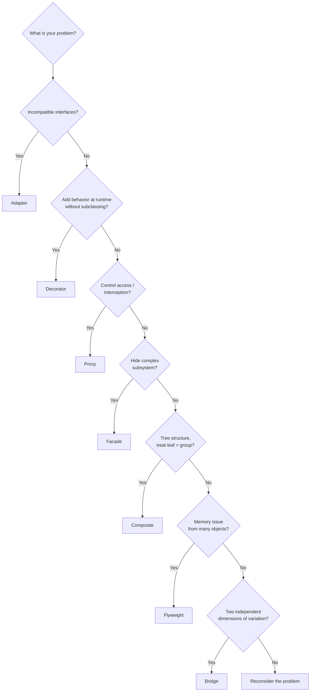

---

## 9. System Design Interview Application

### Where Each Pattern Appears in Real System Design

**Adapter — in large-scale migrations:**
When Netflix migrated from a monolith to microservices, they could not rewrite every client at once. Adapters wrapped old interfaces to forward calls to new microservices. The clients never changed.

**Decorator — in observability:**
Every serious system has: logging, metrics, distributed tracing, circuit breaking. Rather than adding these to every service method directly, they are applied as decorators/middleware. Spring Boot's AOP uses this for `@Timed`, `@Cacheable`, `@Retryable`.

**Proxy — in distributed systems:**
gRPC stubs ARE the Remote Proxy pattern. When your Go service calls `userServiceStub.GetUser(ctx, req)`, that stub is a proxy that serializes the call to protobuf, sends it over the network, and deserializes the response. Your code thinks it is a local call.

**Facade — in microservices:**
The BFF (Backend for Frontend) pattern is a Facade. A mobile-specific BFF aggregates calls to User Service, Order Service, and Recommendation Service into one response optimized for mobile bandwidth.

**Composite — in infrastructure-as-code:**
AWS CloudFormation templates are composite structures. A Stack contains Resources. A Resource can be a nested Stack. The same `deploy` operation works at any level.

**Flyweight — at web scale:**
CDN edge caches (Cloudflare, Akamai) are essentially Flyweight systems. The shared content (images, JS bundles) is the intrinsic state — cached once at the edge. The request metadata (user ID, session) is the extrinsic state — passed in per request.

**Bridge — in cross-platform apps:**
React Native's architecture is a Bridge (literally called that in their code). The JavaScript Abstraction layer calls the Native Implementation layer through a bridge. The same JS component renders to iOS native widgets or Android native widgets — two implementations, one abstraction.

### Pattern Usage in Zomato/Swiggy/Uber System Design

```
Payment Gateway           → Adapter (wrap Razorpay, PayU, Stripe behind PaymentProcessor)
Request Authentication    → Proxy (Protection Proxy in API Gateway)
Response Caching          → Proxy (Caching Proxy for product/menu data)
Order Placement Flow      → Facade (coordinates cart, inventory, payment, delivery)
Notification System       → Decorator (add SMS, email, push as decorating layers)
                            OR Bridge (notification type x notification channel)
Location Data (maps)      → Flyweight (share map tile data among millions of users)
Food Menu Hierarchy       → Composite (Restaurant > Category > Item)
Pricing Rules             → Decorator (base price + coupon + surge + delivery fee)
```

---

## 10. Common Interview Questions

### Conceptual Questions

**Q1: What is the difference between Adapter and Facade?**
Adapter changes the interface of ONE existing object to match what the client expects. Facade does not change any interface — it provides a new, simplified interface OVER a collection of objects. Adapter is about compatibility; Facade is about simplicity.

**Q2: How is Decorator different from inheritance?**
Inheritance adds behavior at compile time, statically, for all instances of that subclass. Decorator adds behavior at runtime, dynamically, per-object. Decorator can combine behaviors freely (milk + sugar + whip in any order); inheritance would require explicit `MilkSugarWhipCoffee` class.

**Q3: Proxy and Decorator look very similar. What's the difference?**
Both wrap an object and implement the same interface. The difference is intent:
- **Decorator** is about ADDING features/behavior to the wrapped object
- **Proxy** is about CONTROLLING ACCESS to the wrapped object

A Decorator adds logging as a feature. A Proxy adds logging as access control/observability without changing what the real object does.

**Q4: When would you use Composite over a simple List?**
When the structure is genuinely recursive (a container can hold both leaf items AND other containers), AND when you want to treat leaf and container uniformly with the same operations. A List assumes all elements are at the same level. Composite handles arbitrary depth.

**Q5: What is the difference between Flyweight and Singleton?**
Singleton guarantees ONE instance of a class system-wide. Flyweight may have MULTIPLE shared instances — one per unique combination of intrinsic state. The Flyweight factory manages a pool of shared instances, not a single global one.

### Design Questions

**Q6: Design a logging system where log entries can be: plain text, JSON, encrypted, and compressed — and these behaviors can be combined.**
Use Decorator. `LogEntry` is the component interface. `PlainTextLogger` is the base. `JsonDecorator`, `EncryptionDecorator`, `CompressionDecorator` wrap each other. Client can compose: `new CompressionDecorator(new EncryptionDecorator(new JsonDecorator(new PlainTextLogger())))`.

**Q7: You're building a file storage system (like Google Drive). Files and folders both need getSize(). How do you model it?**
Composite pattern. `StorageItem` interface with `getSize()`. `File` is a leaf. `Folder` is a composite that sums children's `getSize()`. This allows arbitrary depth and uniform interface.

**Q8: Your app uses Twilio for SMS. The team wants the option to switch to AWS SNS without changing business logic. How?**
Adapter pattern. Define an `SMSProvider` interface with `sendSMS(to, message)`. Write `TwilioAdapter implements SMSProvider` and `AWSSNSAdapter implements SMSProvider`. Inject via dependency injection. Switching = changing which adapter is injected.

**Q9: How would you implement a caching layer for a database without modifying the database class?**
Proxy pattern (Caching Proxy). Create a `DatabaseServiceProxy` that implements the same interface as `DatabaseService`. It checks an in-memory Map first; on miss, delegates to the real `DatabaseService` and caches the result.

**Q10: You have a graphics library that renders shapes on Canvas. A new requirement needs SVG rendering too. How do you avoid doubling your shape classes?**
Bridge pattern. Define `Renderer` interface with `drawCircle()`, `drawRect()`. `CanvasRenderer` and `SVGRenderer` implement it. `Shape` abstract class takes a `Renderer` in its constructor. `Circle` and `Rect` extend `Shape`. Adding WebGL = add one new `Renderer` implementation. Adding Triangle = add one new `Shape`. Zero cross-changes.

### Coding Questions

**Q11: Implement a rate limiter that wraps any service method. Which pattern?**
Proxy. The rate limiter proxy implements the same interface as the real service, intercepts calls, checks rate limits, and either delegates or throws an error.

**Q12: Implement a coffee ordering system where any combination of milk, sugar, and syrups can be ordered. Which pattern?**
Decorator. This is the textbook Decorator example.

---

## 11. Key Takeaways

### One-Line Summaries

| Pattern | One Line | Real-World Memory Hook |
|---|---|---|
| **Adapter** | Translator between incompatible interfaces | USB-C to HDMI dongle |
| **Decorator** | Gift wrapper that adds behavior, not replaces | Middleware in Express/Django |
| **Proxy** | Gatekeeper with the same face as the real thing | API Gateway, HR's PA, Axios interceptors |
| **Facade** | One button that coordinates many systems | Swiggy's "Place Order" button |
| **Composite** | Treat one thing and many things the same | File system, YouTube playlists |
| **Flyweight** | Share expensive state among millions of instances | String pool, game tree forests |
| **Bridge** | Two hierarchies that evolve independently | Notification type x Notification channel |

### The Big Picture — Why These Patterns Exist

All 7 structural patterns solve one root problem: **classes are rigid**. Inheritance creates rigid hierarchies. Direct dependencies create coupling. Structural patterns use composition to give you flexibility:

- **Adapter:** composition to bridge incompatibility
- **Decorator:** composition to stack behaviors
- **Proxy:** composition to intercept access
- **Facade:** composition to hide complexity
- **Composite:** composition to build trees
- **Flyweight:** composition to share state
- **Bridge:** composition to decouple two hierarchies

The underlying principle all seven share? **Favor composition over inheritance.** This is not a slogan — it is the practical reason these patterns exist.

### The Mental Cheat Sheet

```
Need to connect incompatible things?             → Adapter
Need to add behavior at runtime without subclass? → Decorator
Need to control / intercept access?              → Proxy
Need to simplify a complex subsystem?            → Facade
Need to treat one thing and groups the same?     → Composite
Need to save memory with millions of objects?    → Flyweight
Need two dimensions to vary independently?       → Bridge
```

### Patterns That Are Commonly Combined

- **Facade + Proxy:** An API Gateway is a Facade (simplifies access to microservices) AND a Proxy (controls access with auth, rate limiting).
- **Decorator + Proxy:** Spring's `@Cacheable` is a Proxy (controls access) that can be stacked with `@Timed` (adds timing behavior like a Decorator). The line blurs in practice.
- **Composite + Decorator:** React HOCs (Decorators) wrapping React component trees (Composite).
- **Flyweight + Factory:** Flyweight always needs a Factory to manage the pool of shared instances — they are always used together.

---

*Previous: Creational Patterns (Factory, Singleton, Builder, Prototype)*
*Next: Behavioral Patterns — Strategy, Observer, Command, Iterator, Chain of Responsibility, State*
