# Behavioral Design Patterns

> How objects **talk to each other**, **change behavior**, and **assign responsibilities** — the secret to systems that don't turn into spaghetti.

---

## The Big Picture — Yeh Kyun Important Hai?

Socho ek badi company ka office. HR department, Finance team, Engineering, Sales — sab alag alag kaam karte hain. But communication toh honi chahiye na? Agar har department har doosre department ko directly call kare, toh chaos hoga. Isliye rules hote hain: who talks to whom, how, and when.

**Behavioral Design Patterns are exactly those rules — for code.**

Unlike Creational patterns (how objects are BORN) or Structural patterns (how objects are ARRANGED), Behavioral patterns answer: **"Who does what, when, and how do objects coordinate at runtime?"**

Real talk: in a real system like Swiggy, you have:
- An order that changes state (placed → confirmed → picked → delivered)
- A notification that goes to both customer and delivery partner
- A payment that can be processed via UPI, card, or wallet
- A chain of checks before any API request is processed

Every one of those scenarios is solved by a behavioral pattern. Let's learn them all — properly.

---

## Patterns Covered

| # | Pattern | Core Idea | Real-World Feel |
|---|---------|-----------|-----------------|
| 1 | Observer | Notify many when one changes | YouTube subscription bell |
| 2 | Strategy | Swap algorithms at runtime | GPS route options |
| 3 | Command | Turn actions into objects | Restaurant order slip |
| 4 | State | Behavior changes with state | Vending machine |
| 5 | Template Method | Fixed skeleton, variable steps | Recipe template |
| 6 | Iterator | Traverse without knowing internals | TV remote Next button |
| 7 | Chain of Responsibility | Pass request along handlers | Company approval chain |
| 8 | Mediator | Centralize communication | Air traffic control |
| 9 | Memento | Save and restore state | Game save point |

---

## 1. Observer Pattern (Publisher-Subscriber)

### Why Does It Exist? (The Problem First)

Imagine you're building a stock trading app. When RELIANCE stock price changes, you need to:
- Update the price label on screen
- Ring an alert bell if price crosses a threshold
- Update the candlestick chart
- Send a push notification to users who set price alerts
- Log it to an audit trail

Naive approach? The `StockTicker` class directly calls `priceLabel.update()`, `alertBell.ring()`, `chart.refresh()`, `notificationService.push()`, `logger.log()`. Now the stock ticker knows about FIVE different systems. Add a sixth? Edit the ticker. Remove one? Edit the ticker. This violates the Open/Closed Principle big time.

The Observer pattern says: **"Don't call them. Let them register interest. You just shout — they listen."**

### The Analogy

**Samjho YouTube ki tarah.** When MrBeast uploads a video, he doesn't personally message each of his 250 million subscribers. He just uploads. YouTube notifies everyone who clicked the subscribe + bell button. Subscribers opted in. If they unsubscribe, they stop getting notifications. MrBeast doesn't even know who exactly is watching.

That's Observer: the Subject (YouTube channel) maintains a list of Observers (subscribers) and notifies all of them when something happens. The Subject never needs to know who the observers are or what they do with the notification.

### How It Works — Step by Step

```
1. Observer registers with Subject (Subject.subscribe(observer))
2. Something changes in the Subject (stock price updates, video uploads)
3. Subject calls notify() on itself
4. Subject loops through all observers and calls observer.update(data) on each
5. Each observer does its own thing with the data
6. Observer can unregister anytime (Subject.unsubscribe(observer))
```

### Architecture Diagram

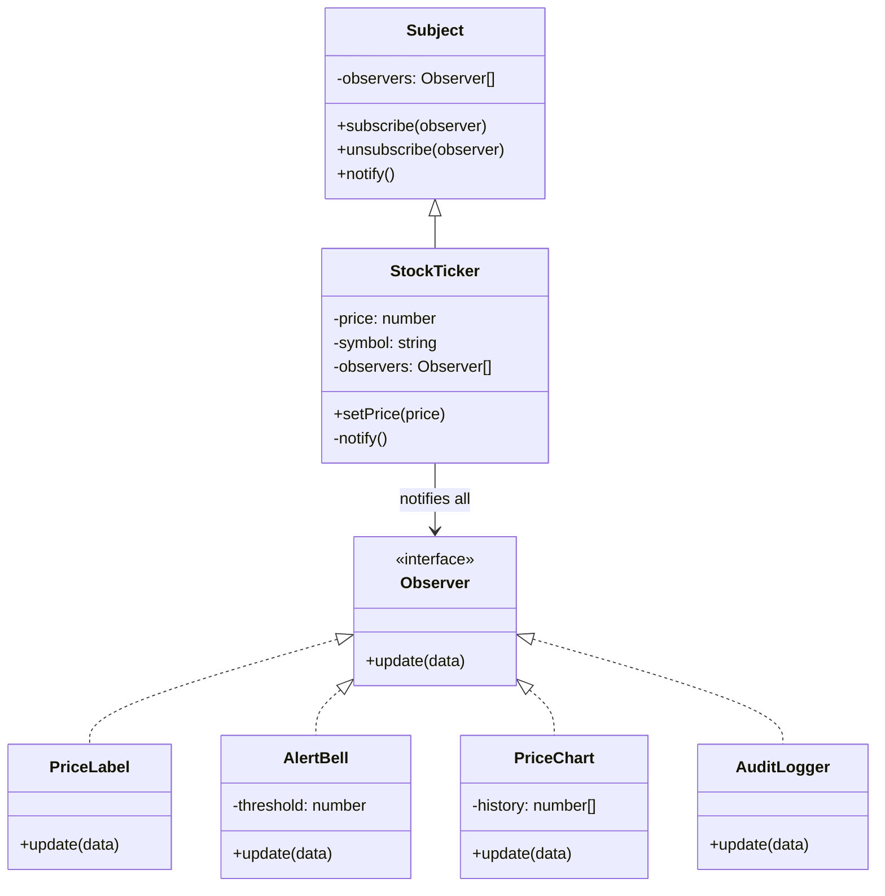
```mermaid
classDiagram
    class Subject {
        -observers: Observer[]
        +subscribe(observer)
        +unsubscribe(observer)
        +notify()
    }
    class Observer {
        <<interface>>
        +update(data)
    }
    class StockTicker {
        -price: number
        -symbol: string
        -observers: Observer[]
        +setPrice(price)
        -notify()
    }
    class PriceLabel {
        +update(data)
    }
    class AlertBell {
        -threshold: number
        +update(data)
    }
    class PriceChart {
        -history: number[]
        +update(data)
    }
    class AuditLogger {
        +update(data)
    }

    Subject <|-- StockTicker
    Observer <|.. PriceLabel
    Observer <|.. AlertBell
    Observer <|.. PriceChart
    Observer <|.. AuditLogger
    StockTicker --> Observer : notifies all
```

### Notification Flow

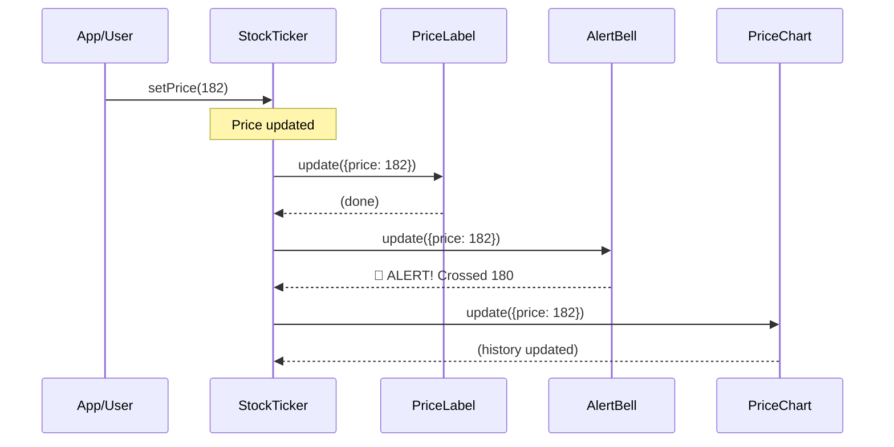
```mermaid
sequenceDiagram
    participant App as App/User
    participant Ticker as StockTicker
    participant Label as PriceLabel
    participant Bell as AlertBell
    participant Chart as PriceChart

    App->>Ticker: setPrice(182)
    Note over Ticker: Price updated
    Ticker->>Label: update({price: 182})
    Label-->>Ticker: (done)
    Ticker->>Bell: update({price: 182})
    Bell-->>Ticker: 🔔 ALERT! Crossed 180
    Ticker->>Chart: update({price: 182})
    Chart-->>Ticker: (history updated)
```

### TypeScript Implementation

```typescript
// Observer interface — everyone who subscribes must implement this
interface Observer {
  update(data: unknown): void;
}

// Subject (Publisher) — manages subscriptions and broadcasts
class StockTicker {
  private observers: Observer[] = [];
  private price: number = 0;
  private symbol: string;

  constructor(symbol: string) {
    this.symbol = symbol;
  }

  subscribe(observer: Observer): void {
    this.observers.push(observer);
    console.log(`New subscriber added. Total: ${this.observers.length}`);
  }

  unsubscribe(observer: Observer): void {
    this.observers = this.observers.filter(obs => obs !== observer);
    console.log(`Subscriber removed. Total: ${this.observers.length}`);
  }

  // When price changes, notify everyone — Subject doesn't care WHO listens
  setPrice(newPrice: number): void {
    this.price = newPrice;
    console.log(`\n[${this.symbol}] Price updated to ₹${newPrice}`);
    this.notify({ symbol: this.symbol, price: newPrice, timestamp: new Date() });
  }

  private notify(data: unknown): void {
    this.observers.forEach(observer => observer.update(data));
  }
}

// Concrete Observers — each does something different with the same event
class PriceLabel implements Observer {
  update(data: { symbol: string; price: number }): void {
    console.log(`  [UI Label] Displaying price: ₹${data.price}`);
  }
}

class AlertBell implements Observer {
  private threshold: number;

  constructor(threshold: number) {
    this.threshold = threshold;
  }

  update(data: { symbol: string; price: number }): void {
    if (data.price > this.threshold) {
      console.log(`  [ALERT] 🔔 ${data.symbol} crossed ₹${this.threshold}! Now at ₹${data.price}`);
    }
  }
}

class PriceChart implements Observer {
  private history: number[] = [];

  update(data: { symbol: string; price: number }): void {
    this.history.push(data.price);
    console.log(`  [Chart] Price history: [${this.history.join(', ')}]`);
  }
}

class PushNotificationService implements Observer {
  update(data: { symbol: string; price: number }): void {
    console.log(`  [Push] Sending notification: ${data.symbol} is now ₹${data.price}`);
  }
}

// Usage — compose your system without the ticker knowing about components
const reliance = new StockTicker('RELIANCE');
const label = new PriceLabel();
const alert = new AlertBell(2800); // Alert at 2800
const chart = new PriceChart();
const push = new PushNotificationService();

reliance.subscribe(label);
reliance.subscribe(alert);
reliance.subscribe(chart);
reliance.subscribe(push);

reliance.setPrice(2750); // Below threshold — no alert
reliance.setPrice(2810); // Alert fires!

// User turns off push notifications
reliance.unsubscribe(push);
reliance.setPrice(2820); // Push won't fire
```

### Real-World System Design Usage

**Instagram Notifications:**
```
When User A likes User B's post:
  Subject: LikeEvent fires
  Observers:
    - NotificationService → sends push to User B
    - ActivityFeedService → updates User B's activity feed
    - AnalyticsService → logs engagement event
    - BadgeService → updates like count badge
```

**WhatsApp Message Delivery:**
```
When a message is sent:
  Subject: MessageSentEvent
  Observers:
    - DeliveryTracker → updates sender to "delivered" tick
    - PushNotificationService → wakes up recipient's phone
    - ChatHistoryService → stores in database
    - PresenceService → updates "last seen"
```

**Redux State Management (JavaScript):**
```javascript
// Redux IS the Observer pattern
const store = createStore(reducer);

// Components subscribe
store.subscribe(() => {
  const state = store.getState();
  renderUI(state); // Re-render when state changes
});

// Dispatch = Subject.notify()
store.dispatch({ type: 'INCREMENT' });
```

**Node.js EventEmitter (built-in Observer):**
```javascript
const EventEmitter = require('events');
const orderEmitter = new EventEmitter();

// Observers register
orderEmitter.on('order:placed', (order) => notifyRestaurant(order));
orderEmitter.on('order:placed', (order) => notifyCustomer(order));
orderEmitter.on('order:placed', (order) => logToAnalytics(order));

// Subject fires
orderEmitter.emit('order:placed', { id: 'ORD123', item: 'Biryani' });
// All three handlers fire automatically
```

### Trade-offs

| Advantage | Disadvantage |
|-----------|--------------|
| Loose coupling — Subject doesn't know observers | Memory leaks if observers aren't unsubscribed |
| Open/Closed — add observers without changing subject | Order of notification is unpredictable |
| Works great for event-driven architectures | Cascading updates can be hard to debug |
| Supports broadcast (one-to-many) naturally | Too many observers = performance hit |

### Interview Tip

> "When an interviewer asks how you'd design a notification system for Zomato — order placed, delivery partner assigned, order picked up — that's Observer. One order event, multiple notification handlers (customer SMS, restaurant dashboard, analytics). The beauty is each handler is independent."

---

## 2. Strategy Pattern

### Why Does It Exist?

You're building the payment flow for an e-commerce app. Today you support:
- Credit/Debit card
- UPI (Google Pay, PhonePe, Paytm)
- Net Banking
- Cash on Delivery
- EMI

Naive code:
```typescript
function processPayment(method: string, amount: number) {
  if (method === 'card') {
    // 50 lines of card logic
  } else if (method === 'upi') {
    // 40 lines of UPI logic
  } else if (method === 'netbanking') {
    // 60 lines of net banking logic
  } else if (method === 'cod') {
    // 10 lines
  } else if (method === 'emi') {
    // 70 lines
  }
  // Add Crypto? Edit this function. Again.
}
```

This function grows forever, is impossible to test in isolation, and violates every SOLID principle. Strategy says: **encapsulate each algorithm in its own class, and make them interchangeable**.

### The Analogy

**Samjho Google Maps ki tarah.** You enter your destination. Then Maps asks: "How do you want to go?"
- Fastest route (by time)
- Shortest route (by distance)
- Avoid highways
- Public transport
- Walking

The destination doesn't change. The map doesn't change. **Only the routing strategy changes.** And you can switch strategies at any time — even mid-journey!

### Architecture Diagram

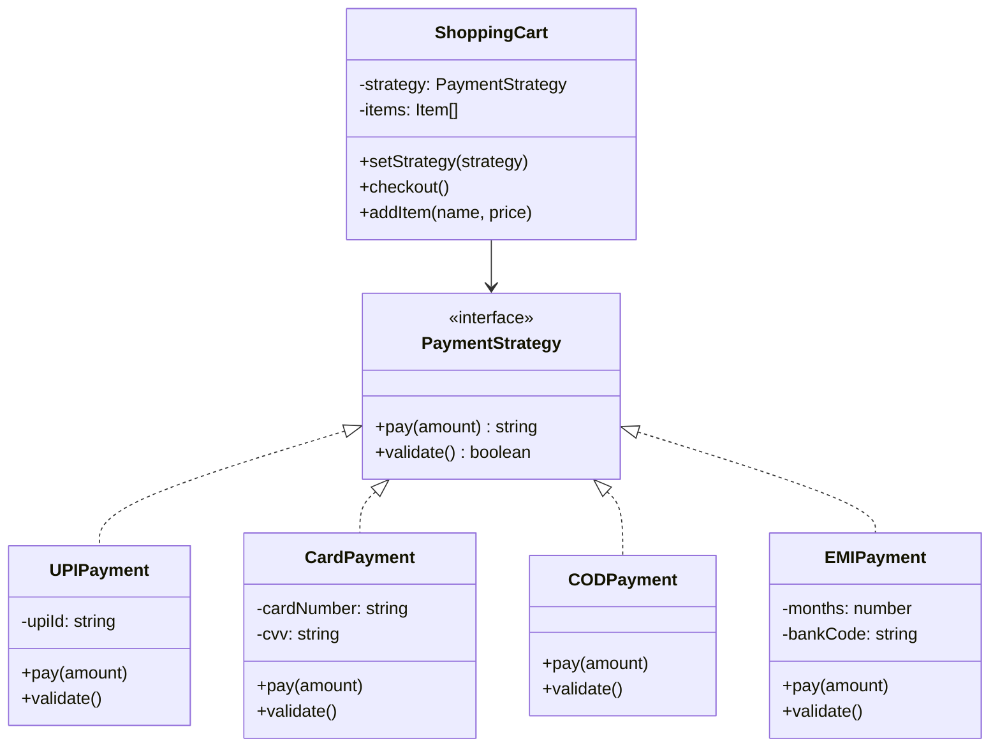
```mermaid
classDiagram
    class ShoppingCart {
        -strategy: PaymentStrategy
        -items: Item[]
        +setStrategy(strategy)
        +checkout()
        +addItem(name, price)
    }
    class PaymentStrategy {
        <<interface>>
        +pay(amount) string
        +validate() boolean
    }
    class UPIPayment {
        -upiId: string
        +pay(amount)
        +validate()
    }
    class CardPayment {
        -cardNumber: string
        -cvv: string
        +pay(amount)
        +validate()
    }
    class CODPayment {
        +pay(amount)
        +validate()
    }
    class EMIPayment {
        -months: number
        -bankCode: string
        +pay(amount)
        +validate()
    }

    ShoppingCart --> PaymentStrategy
    PaymentStrategy <|.. UPIPayment
    PaymentStrategy <|.. CardPayment
    PaymentStrategy <|.. CODPayment
    PaymentStrategy <|.. EMIPayment
```

### TypeScript Implementation

```typescript
// Strategy interface — contract every payment method must fulfill
interface PaymentStrategy {
  validate(): boolean;
  pay(amount: number): PaymentResult;
}

interface PaymentResult {
  success: boolean;
  transactionId: string;
  message: string;
}

// Concrete Strategy 1: UPI
class UPIPayment implements PaymentStrategy {
  constructor(private upiId: string) {}

  validate(): boolean {
    const isValid = this.upiId.includes('@');
    if (!isValid) console.log('  [UPI] Invalid UPI ID format');
    return isValid;
  }

  pay(amount: number): PaymentResult {
    console.log(`  [UPI] Initiating payment of ₹${amount} via ${this.upiId}`);
    // Simulate UPI flow: generate intent → open app → confirm
    return {
      success: true,
      transactionId: `UPI_${Date.now()}`,
      message: `₹${amount} paid via UPI to ${this.upiId}`
    };
  }
}

// Concrete Strategy 2: Credit/Debit Card
class CardPayment implements PaymentStrategy {
  constructor(
    private cardNumber: string,
    private cvv: string,
    private expiry: string
  ) {}

  validate(): boolean {
    const last4 = this.cardNumber.slice(-4);
    const isValid = this.cardNumber.length >= 16;
    if (!isValid) console.log('  [Card] Invalid card number');
    return isValid;
  }

  pay(amount: number): PaymentResult {
    const last4 = this.cardNumber.slice(-4);
    console.log(`  [Card] Charging ₹${amount} to card ending in ${last4}`);
    // In real life: call payment gateway (Razorpay, PayU, etc.)
    return {
      success: true,
      transactionId: `CARD_${Date.now()}`,
      message: `₹${amount} charged to card ****${last4}`
    };
  }
}

// Concrete Strategy 3: Cash on Delivery
class CODPayment implements PaymentStrategy {
  validate(): boolean {
    return true; // COD always valid (assume delivery partner can handle)
  }

  pay(amount: number): PaymentResult {
    console.log(`  [COD] Order placed. ₹${amount} to be collected on delivery.`);
    return {
      success: true,
      transactionId: `COD_${Date.now()}`,
      message: `Cash on Delivery selected. Pay ₹${amount} to delivery partner.`
    };
  }
}

// Concrete Strategy 4: EMI
class EMIPayment implements PaymentStrategy {
  constructor(
    private bankCode: string,
    private months: number
  ) {}

  validate(): boolean {
    return this.months > 0 && this.months <= 24;
  }

  pay(amount: number): PaymentResult {
    const emi = (amount / this.months).toFixed(2);
    console.log(`  [EMI] Setting up ${this.months}-month EMI of ₹${emi}/month via ${this.bankCode}`);
    return {
      success: true,
      transactionId: `EMI_${Date.now()}`,
      message: `${this.months} EMIs of ₹${emi} via ${this.bankCode}`
    };
  }
}

// Context — the cart doesn't know HOW payment works, just that it works
class ShoppingCart {
  private strategy: PaymentStrategy;
  private items: { name: string; price: number }[] = [];

  constructor(strategy: PaymentStrategy) {
    this.strategy = strategy;
  }

  // Swap strategy at runtime — user changes payment method at checkout
  setPaymentStrategy(strategy: PaymentStrategy): void {
    console.log('Payment method changed.');
    this.strategy = strategy;
  }

  addItem(name: string, price: number): void {
    this.items.push({ name, price });
    console.log(`Added: ${name} (₹${price})`);
  }

  checkout(): void {
    const total = this.items.reduce((sum, item) => sum + item.price, 0);
    console.log(`\nCheckout Total: ₹${total}`);

    if (!this.strategy.validate()) {
      console.log('Payment validation failed. Please check your payment details.');
      return;
    }

    const result = this.strategy.pay(total);
    if (result.success) {
      console.log(`Payment successful! TxnID: ${result.transactionId}`);
      console.log(`Summary: ${result.message}`);
    }
  }
}

// Usage — demonstrates runtime strategy swapping
const cart = new ShoppingCart(new UPIPayment('user@paytm'));
cart.addItem('Nike Shoes', 4999);
cart.addItem('Wireless Earbuds', 1999);
cart.checkout();

console.log('\n--- User switches to Card at last second ---');
cart.setPaymentStrategy(new CardPayment('4111111111111111', '123', '12/26'));
cart.checkout();

console.log('\n--- User opts for 6-month EMI ---');
cart.setPaymentStrategy(new EMIPayment('HDFC', 6));
cart.checkout();
```

### Strategy vs If-Else: The Real Difference

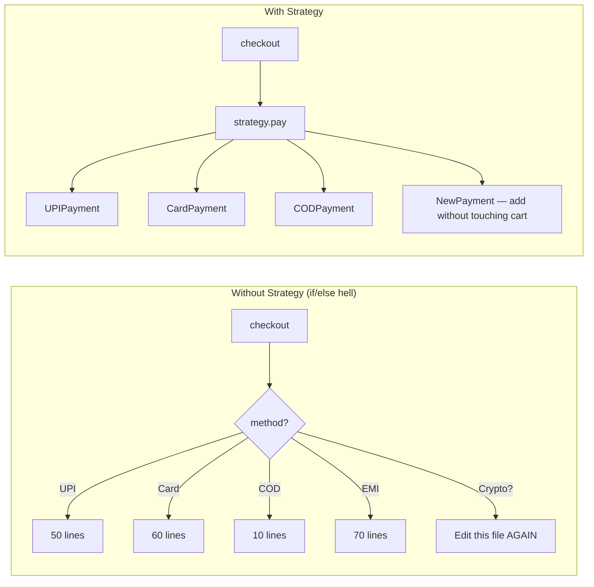
```mermaid
flowchart LR
    subgraph Bad["Without Strategy (if/else hell)"]
        direction TB
        A[checkout] --> B{method?}
        B -->|UPI| C[50 lines]
        B -->|Card| D[60 lines]
        B -->|COD| E[10 lines]
        B -->|EMI| F[70 lines]
        B -->|Crypto?| G[Edit this file AGAIN]
    end

    subgraph Good["With Strategy"]
        direction TB
        H[checkout] --> I[strategy.pay]
        I --> J[UPIPayment]
        I --> K[CardPayment]
        I --> L[CODPayment]
        I --> M[NewPayment — add without touching cart]
    end
```

### Other Real-World Strategy Uses

| Use Case | Strategies |
|----------|-----------|
| Sorting data | QuickSort, MergeSort, BubbleSort, HeapSort |
| Image compression | JPEG strategy, PNG strategy, WebP strategy |
| Log formatting | JSON formatter, Plain text formatter, XML formatter |
| Route calculation | Fastest, Shortest, Avoid tolls, Eco mode |
| Discount calculation | Flat discount, Percentage discount, BOGO, Coupon code |
| Authentication | JWT strategy, OAuth strategy, API Key strategy |

### Trade-offs

| Advantage | Disadvantage |
|-----------|--------------|
| Eliminates if/else chains | More classes — can feel over-engineered for 2 strategies |
| Open for extension, closed for modification | Client must know which strategy to pick |
| Each strategy is independently testable | Strategies can't easily share state |
| Swap algorithms at runtime | Communication overhead if strategies need context |

### Interview Tip

> "Strategy pattern shines in payment systems. When a Zomato interviewer asks how you'd handle 10 payment providers — UPI, card, wallet, COD, BNPL — the answer is Strategy. Each payment provider implements a common interface, and the cart just calls `strategy.pay()`. Adding a new provider? Write a new class, inject it. Zero changes to existing code."

---

## 3. Command Pattern

### Why Does It Exist?

You're building Google Docs. Users type, delete, paste, bold text. They expect Ctrl+Z to undo any action. They expect Ctrl+Y to redo. You also want to log every action for audit, and maybe auto-save and replay them.

The problem: if you directly call `editor.insertText()`, `editor.delete()` etc., you have no record of what happened. You can't undo. You can't replay. You can't queue.

**The Command pattern turns each action into an object.** Once it's an object, you can store it, undo it, re-execute it, send it over a network, or log it.

### The Analogy

**Socho restaurant ka order slip.** The waiter doesn't go to the kitchen and cook the food himself. He writes your order on a slip — the **command object**. The slip captures: what to make (action), for which table (receiver). The slip goes to the kitchen queue (invoker). The chef (receiver) executes it.

Now the magic: the slip can be cancelled (undo). The same slip can be given to a different chef (different receiver). You can replay all slips from yesterday to audit what was made. The waiter doesn't need to know how to cook — he just passes slips.

### Architecture Diagram

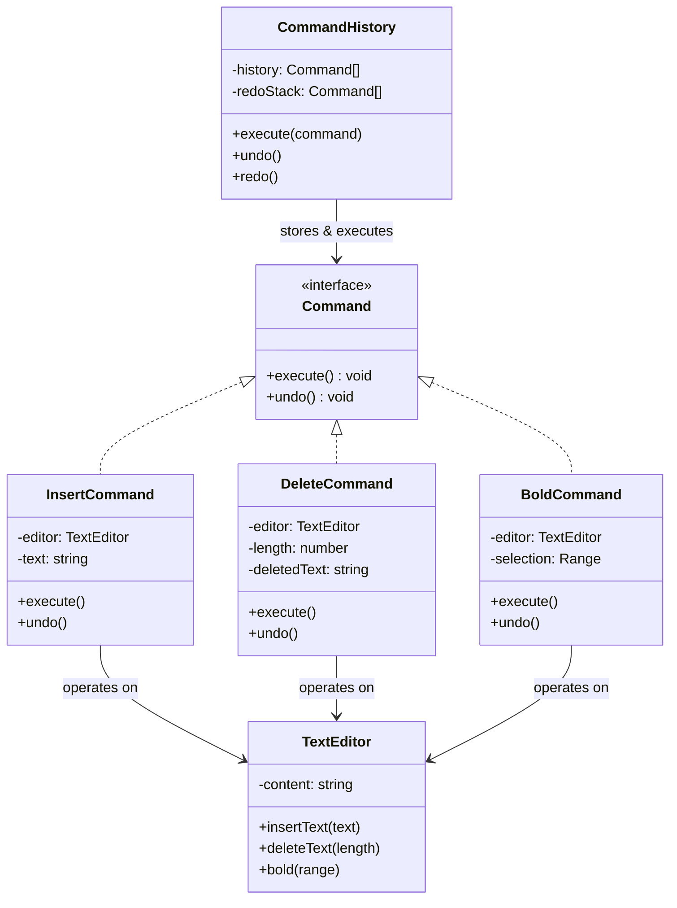
```mermaid
classDiagram
    class Command {
        <<interface>>
        +execute() void
        +undo() void
    }
    class CommandHistory {
        -history: Command[]
        -redoStack: Command[]
        +execute(command)
        +undo()
        +redo()
    }
    class InsertCommand {
        -editor: TextEditor
        -text: string
        +execute()
        +undo()
    }
    class DeleteCommand {
        -editor: TextEditor
        -length: number
        -deletedText: string
        +execute()
        +undo()
    }
    class BoldCommand {
        -editor: TextEditor
        -selection: Range
        +execute()
        +undo()
    }
    class TextEditor {
        -content: string
        +insertText(text)
        +deleteText(length)
        +bold(range)
    }

    Command <|.. InsertCommand
    Command <|.. DeleteCommand
    Command <|.. BoldCommand
    CommandHistory --> Command : stores & executes
    InsertCommand --> TextEditor : operates on
    DeleteCommand --> TextEditor : operates on
    BoldCommand --> TextEditor : operates on
```

### Sequence: Undo/Redo Flow

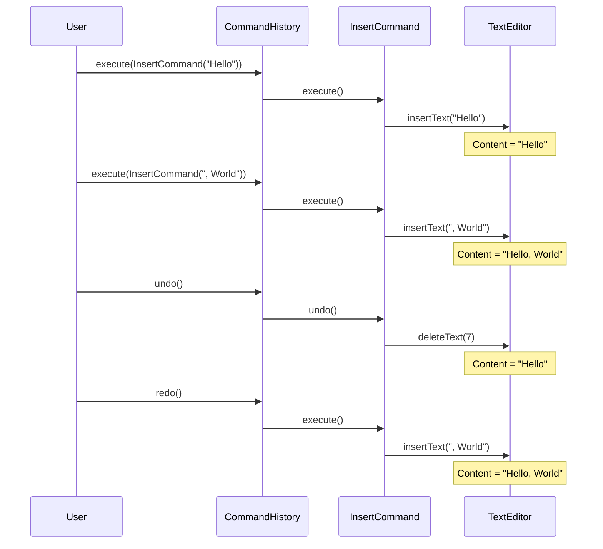
```mermaid
sequenceDiagram
    participant User
    participant History as CommandHistory
    participant Cmd as InsertCommand
    participant Editor as TextEditor

    User->>History: execute(InsertCommand("Hello"))
    History->>Cmd: execute()
    Cmd->>Editor: insertText("Hello")
    Note over Editor: Content = "Hello"

    User->>History: execute(InsertCommand(", World"))
    History->>Cmd: execute()
    Cmd->>Editor: insertText(", World")
    Note over Editor: Content = "Hello, World"

    User->>History: undo()
    History->>Cmd: undo()
    Cmd->>Editor: deleteText(7)
    Note over Editor: Content = "Hello"

    User->>History: redo()
    History->>Cmd: execute()
    Cmd->>Editor: insertText(", World")
    Note over Editor: Content = "Hello, World"
```

### TypeScript Implementation

```typescript
// Command interface — every action is an object with execute + undo
interface Command {
  execute(): void;
  undo(): void;
  description(): string; // For logging/debugging
}

// Receiver — the actual object that performs work
class TextEditor {
  private content: string = '';
  private formatting: Set<string> = new Set();

  insertText(text: string, position?: number): void {
    if (position !== undefined) {
      this.content = this.content.slice(0, position) + text + this.content.slice(position);
    } else {
      this.content += text;
    }
  }

  deleteText(length: number): void {
    this.content = this.content.slice(0, -length);
  }

  deleteAt(start: number, length: number): string {
    const deleted = this.content.slice(start, start + length);
    this.content = this.content.slice(0, start) + this.content.slice(start + length);
    return deleted;
  }

  getContent(): string {
    return this.content;
  }

  display(): void {
    console.log(`  Editor: "${this.content}"`);
  }
}

// Concrete Command 1: Insert text
class InsertTextCommand implements Command {
  constructor(
    private editor: TextEditor,
    private text: string,
    private position?: number
  ) {}

  execute(): void {
    this.editor.insertText(this.text, this.position);
  }

  undo(): void {
    this.editor.deleteText(this.text.length);
  }

  description(): string {
    return `Insert "${this.text}"`;
  }
}

// Concrete Command 2: Delete text (stores deleted text for undo)
class DeleteTextCommand implements Command {
  private deletedText: string = '';
  private deletedAt: number = 0;

  constructor(
    private editor: TextEditor,
    private length: number,
    private position?: number
  ) {}

  execute(): void {
    const content = this.editor.getContent();
    if (this.position !== undefined) {
      this.deletedAt = this.position;
      this.deletedText = this.editor.deleteAt(this.position, this.length);
    } else {
      this.deletedAt = content.length - this.length;
      this.deletedText = content.slice(-this.length);
      this.editor.deleteText(this.length);
    }
  }

  undo(): void {
    // Restore the deleted text at its original position
    this.editor.insertText(this.deletedText, this.deletedAt);
  }

  description(): string {
    return `Delete ${this.length} chars (was: "${this.deletedText}")`;
  }
}

// Invoker — manages the command history, provides undo/redo
class CommandHistory {
  private history: Command[] = [];
  private redoStack: Command[] = [];
  private maxHistory: number;

  constructor(maxHistory: number = 100) {
    this.maxHistory = maxHistory;
  }

  execute(command: Command): void {
    command.execute();
    this.history.push(command);
    this.redoStack = []; // New action clears redo stack

    // Keep history bounded
    if (this.history.length > this.maxHistory) {
      this.history.shift();
    }

    console.log(`  [CMD] Executed: ${command.description()}`);
  }

  undo(): boolean {
    const command = this.history.pop();
    if (!command) {
      console.log('  [CMD] Nothing to undo');
      return false;
    }
    command.undo();
    this.redoStack.push(command);
    console.log(`  [CMD] Undone: ${command.description()}`);
    return true;
  }

  redo(): boolean {
    const command = this.redoStack.pop();
    if (!command) {
      console.log('  [CMD] Nothing to redo');
      return false;
    }
    command.execute();
    this.history.push(command);
    console.log(`  [CMD] Redone: ${command.description()}`);
    return true;
  }

  getHistoryLog(): string[] {
    return this.history.map(cmd => cmd.description());
  }
}

// Usage
const editor = new TextEditor();
const history = new CommandHistory();

console.log('--- Typing ---');
history.execute(new InsertTextCommand(editor, 'Hello'));
editor.display();

history.execute(new InsertTextCommand(editor, ', World'));
editor.display();

history.execute(new InsertTextCommand(editor, '!'));
editor.display();

console.log('\n--- Undo twice ---');
history.undo();
editor.display();

history.undo();
editor.display();

console.log('\n--- Redo once ---');
history.redo();
editor.display();

console.log('\n--- History log ---');
console.log(history.getHistoryLog());
```

### Command Pattern in System Design: Event Sourcing

Basically — event sourcing IS the command pattern at scale. Instead of storing current state, you store every command (event) that produced that state.

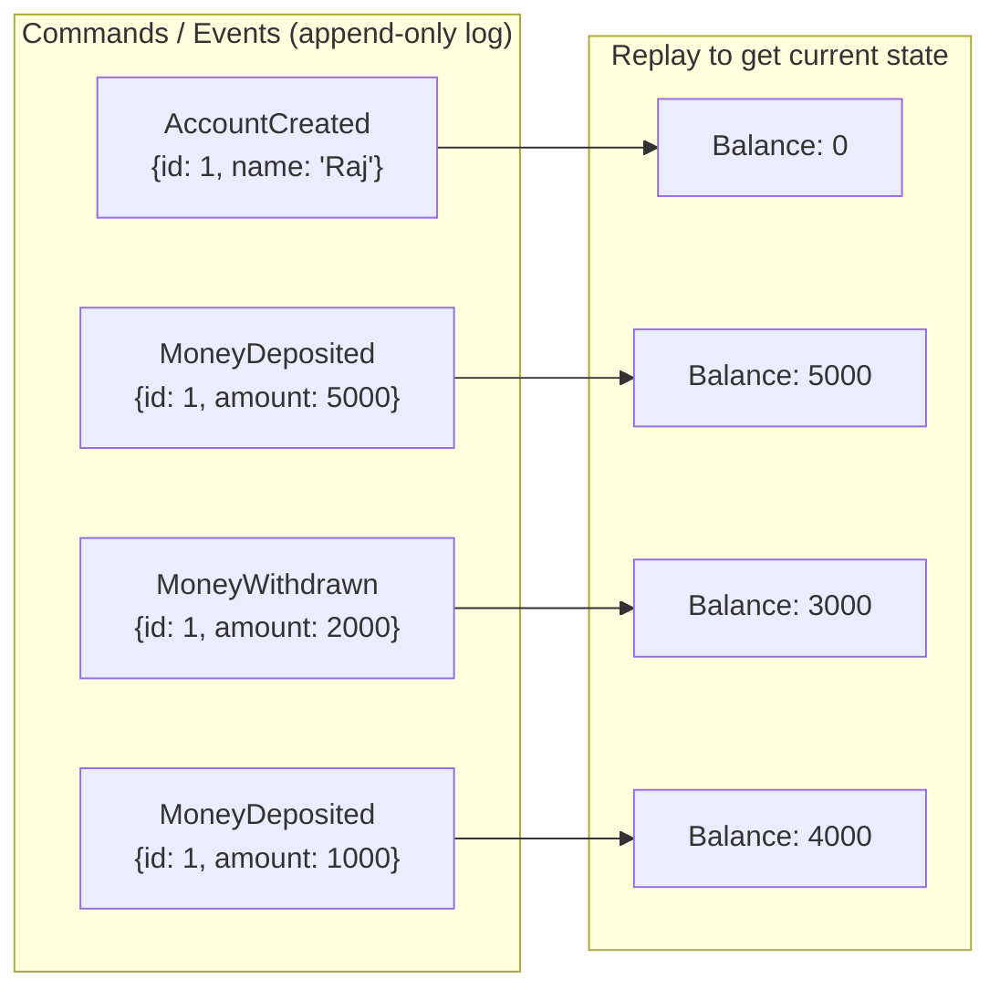
```mermaid
flowchart LR
    subgraph Commands["Commands / Events (append-only log)"]
        C1["AccountCreated\n{id: 1, name: 'Raj'}"]
        C2["MoneyDeposited\n{id: 1, amount: 5000}"]
        C3["MoneyWithdrawn\n{id: 1, amount: 2000}"]
        C4["MoneyDeposited\n{id: 1, amount: 1000}"]
    end

    subgraph Replay["Replay to get current state"]
        S1["Balance: 0"]
        S2["Balance: 5000"]
        S3["Balance: 3000"]
        S4["Balance: 4000"]
    end

    C1 --> S1
    C2 --> S2
    C3 --> S3
    C4 --> S4
```

Real examples:
- **Git** — every commit is a command. `git log` is the command history. `git revert` is undo.
- **Bank transactions** — never update balance directly, append a transaction entry.
- **Kafka** — messages are commands/events in a distributed queue.
- **Database WAL (Write-Ahead Log)** — all writes are logged as commands before applying.

### Trade-offs

| Advantage | Disadvantage |
|-----------|--------------|
| Undo/redo becomes trivially easy | Creates many small classes |
| Commands are serializable — queue, log, send over network | Complex undo for commands with side effects (emails sent!) |
| Decouples sender from receiver | Debugging requires tracing through command objects |
| Supports macro recording (replay a sequence) | State can get inconsistent if commands fail midway |

### Interview Tip

> "Command pattern is the right answer when someone asks about undo/redo, audit logs, or event sourcing. In a banking system design, every transaction is a command object — deposited, withdrawn, transferred. The ledger is the command history. You can replay all commands on an empty account to arrive at current balance. That's event sourcing."

---

## 4. State Pattern

### Why Does It Exist?

Think of a Zomato order. It has states:
- `PLACED` → `CONFIRMED` → `RESTAURANT_PREPARING` → `PICKED_UP` → `DELIVERED`
- Or: `PLACED` → `CANCELLED`
- Or: `PLACED` → `CONFIRMED` → `RESTAURANT_PREPARING` → `CANCELLED` (with refund logic)

What can you do in each state?
- In `PLACED`: can cancel (full refund), can't track delivery
- In `RESTAURANT_PREPARING`: can cancel (partial refund), can track ETA
- In `PICKED_UP`: can't cancel, can see delivery partner live location
- In `DELIVERED`: can rate, can reorder, can complain

Naive approach: every method has a giant `if/else` checking current state:
```typescript
class Order {
  cancel() {
    if (this.state === 'PLACED') { fullRefund(); }
    else if (this.state === 'CONFIRMED') { partialRefund(); }
    else if (this.state === 'PICKED_UP') { console.log("Can't cancel!"); }
    else if (this.state === 'DELIVERED') { console.log("Already delivered!"); }
  }

  trackDelivery() {
    if (this.state === 'PLACED') { console.log("Not dispatched yet"); }
    else if (this.state === 'RESTAURANT_PREPARING') { console.log("Being prepared"); }
    else if (this.state === 'PICKED_UP') { showLiveMap(); }
    // ...and so on for every method
  }
}
```

Every new state means editing every method. This is a maintenance nightmare. The **State pattern** puts state-specific behavior inside separate state classes.

### The Analogy

**Ek traffic light socho.** Red pe gaari rukti hai. Green pe chalti hai. Yellow pe slow hoti hai. Teen states, alag alag behavior. Intersection nahi badla — sirf state badi.

Same intersection, completely different behavior based on state. That's the State pattern.

### Zomato Order State Machine

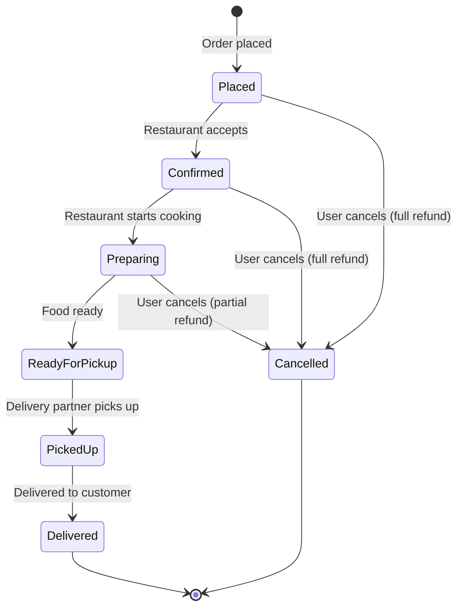
```mermaid
stateDiagram-v2
    [*] --> Placed : Order placed
    Placed --> Confirmed : Restaurant accepts
    Placed --> Cancelled : User cancels (full refund)
    Confirmed --> Preparing : Restaurant starts cooking
    Confirmed --> Cancelled : User cancels (full refund)
    Preparing --> ReadyForPickup : Food ready
    Preparing --> Cancelled : User cancels (partial refund)
    ReadyForPickup --> PickedUp : Delivery partner picks up
    PickedUp --> Delivered : Delivered to customer
    Delivered --> [*]
    Cancelled --> [*]
```

### TypeScript Implementation

```typescript
// State interface — what can you do in any state?
interface OrderState {
  name(): string;
  cancel(order: Order): void;
  confirmByRestaurant(order: Order): void;
  startPreparing(order: Order): void;
  markReadyForPickup(order: Order): void;
  pickup(order: Order): void;
  deliver(order: Order): void;
  track(): string;
}

class Order {
  private state: OrderState;
  private orderId: string;
  private item: string;
  private amount: number;

  // All possible state objects — created once, reused
  public placedState: OrderState;
  public confirmedState: OrderState;
  public preparingState: OrderState;
  public pickedUpState: OrderState;
  public deliveredState: OrderState;
  public cancelledState: OrderState;

  constructor(orderId: string, item: string, amount: number) {
    this.orderId = orderId;
    this.item = item;
    this.amount = amount;

    // Initialize all states
    this.placedState = new PlacedState(this);
    this.confirmedState = new ConfirmedState(this);
    this.preparingState = new PreparingState(this);
    this.pickedUpState = new PickedUpState(this);
    this.deliveredState = new DeliveredState(this);
    this.cancelledState = new CancelledState(this);

    this.state = this.placedState; // Start in Placed state
    console.log(`Order ${this.orderId} created for ${this.item} (₹${this.amount})`);
  }

  setState(state: OrderState): void {
    console.log(`  [State] ${this.state.name()} → ${state.name()}`);
    this.state = state;
  }

  getState(): OrderState { return this.state; }
  getOrderId(): string { return this.orderId; }
  getAmount(): number { return this.amount; }

  // Public API — delegates to current state
  cancel(): void { this.state.cancel(this); }
  confirmByRestaurant(): void { this.state.confirmByRestaurant(this); }
  startPreparing(): void { this.state.startPreparing(this); }
  markReadyForPickup(): void { this.state.markReadyForPickup(this); }
  pickup(): void { this.state.pickup(this); }
  deliver(): void { this.state.deliver(this); }
  track(): string { return this.state.track(); }
  status(): void { console.log(`  Order ${this.orderId}: [${this.state.name()}]`); }
}

// Abstract base — provides default "invalid operation" behavior
abstract class BaseOrderState implements OrderState {
  constructor(protected order: Order) {}

  abstract name(): string;

  // Default: invalid operation for states that don't allow these
  cancel(order: Order): void {
    console.log(`  Cannot cancel in state: ${this.name()}`);
  }
  confirmByRestaurant(order: Order): void {
    console.log(`  Cannot confirm in state: ${this.name()}`);
  }
  startPreparing(order: Order): void {
    console.log(`  Cannot start preparing in state: ${this.name()}`);
  }
  markReadyForPickup(order: Order): void {
    console.log(`  Cannot mark ready in state: ${this.name()}`);
  }
  pickup(order: Order): void {
    console.log(`  Cannot pickup in state: ${this.name()}`);
  }
  deliver(order: Order): void {
    console.log(`  Cannot deliver in state: ${this.name()}`);
  }
  track(): string {
    return `Order status: ${this.name()}`;
  }
}

class PlacedState extends BaseOrderState {
  name() { return 'PLACED'; }

  cancel(order: Order): void {
    console.log(`  Full refund of ₹${order.getAmount()} initiated.`);
    order.setState(order.cancelledState);
  }

  confirmByRestaurant(order: Order): void {
    console.log(`  Restaurant confirmed the order!`);
    order.setState(order.confirmedState);
  }

  track(): string { return 'Waiting for restaurant to confirm your order...'; }
}

class ConfirmedState extends BaseOrderState {
  name() { return 'CONFIRMED'; }

  cancel(order: Order): void {
    console.log(`  Full refund of ₹${order.getAmount()} — restaurant hasn't started yet.`);
    order.setState(order.cancelledState);
  }

  startPreparing(order: Order): void {
    console.log(`  Restaurant has started preparing your food!`);
    order.setState(order.preparingState);
  }

  track(): string { return 'Restaurant confirmed! Preparing to start cooking.'; }
}

class PreparingState extends BaseOrderState {
  name() { return 'PREPARING'; }

  cancel(order: Order): void {
    const refund = order.getAmount() * 0.5;
    console.log(`  Partial refund of ₹${refund} — restaurant already started cooking.`);
    order.setState(order.cancelledState);
  }

  markReadyForPickup(order: Order): void {
    console.log(`  Food is ready! Looking for delivery partner...`);
    order.setState(order.pickedUpState);
  }

  track(): string { return 'Chef is cooking your order. Approx 20 mins.'; }
}

class PickedUpState extends BaseOrderState {
  name() { return 'PICKED_UP'; }

  deliver(order: Order): void {
    console.log(`  Order delivered successfully!`);
    order.setState(order.deliveredState);
  }

  track(): string { return 'Delivery partner is on the way! Live tracking available.'; }
}

class DeliveredState extends BaseOrderState {
  name() { return 'DELIVERED'; }
  track(): string { return 'Delivered! Please rate your experience.'; }
}

class CancelledState extends BaseOrderState {
  name() { return 'CANCELLED'; }
  track(): string { return 'Order cancelled. Refund will be processed in 5-7 days.'; }
}

// Usage — walk through the order lifecycle
const order = new Order('ORD-2024-001', 'Hyderabadi Biryani', 499);
order.status();

console.log('\n--- Restaurant confirms ---');
order.confirmByRestaurant();
order.status();

console.log('\n--- Try to deliver directly (invalid in this state) ---');
order.deliver();

console.log('\n--- Restaurant starts cooking ---');
order.startPreparing();
console.log(order.track());

console.log('\n--- User tries to cancel while being cooked ---');
order.cancel(); // Partial refund

console.log('\n--- Normal flow: new order ---');
const order2 = new Order('ORD-2024-002', 'Masala Dosa', 149);
order2.confirmByRestaurant();
order2.startPreparing();
order2.markReadyForPickup();
order2.deliver();
console.log(order2.track());
```

### Real-World State Machines

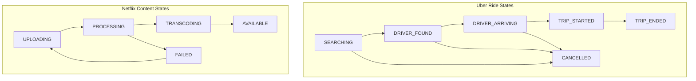
```mermaid
flowchart TD
    subgraph Uber["Uber Ride States"]
        U1[SEARCHING] --> U2[DRIVER_FOUND]
        U2 --> U3[DRIVER_ARRIVING]
        U3 --> U4[TRIP_STARTED]
        U4 --> U5[TRIP_ENDED]
        U1 --> U6[CANCELLED]
        U2 --> U6
        U3 --> U6
    end

    subgraph Netflix["Netflix Content States"]
        N1[UPLOADING] --> N2[PROCESSING]
        N2 --> N3[TRANSCODING]
        N3 --> N4[AVAILABLE]
        N2 --> N5[FAILED]
        N5 --> N1
    end
```

### Trade-offs

| Advantage | Disadvantage |
|-----------|--------------|
| Eliminates complex if/else state checking | More classes — one per state |
| Each state class is small and focused | State transitions can be hard to visualize |
| Adding a new state = new class, not editing all methods | States need reference to Context — coupling |
| States make the system self-documenting | Overkill for 2-3 states — just use a flag |

### Interview Tip

> "When asked to design an order management system (Zomato, Swiggy, Uber Eats), always call out the State pattern. Show the state machine diagram. Interviewers love candidates who think in state machines — it shows you understand the business domain, not just the code."

---

## 5. Template Method Pattern

### Why Does It Exist?

You're building data report generation: daily sales report, weekly inventory report, monthly analytics report. Each one follows the same steps:
1. Connect to database
2. Run query
3. Validate data
4. Format results
5. Generate report file
6. Send via email

Steps 1, 3, 5, 6 are identical. Steps 2 and 4 differ per report type. Without Template Method, you either duplicate the skeleton in each class (DRY violation), or you mash everything into one monster function.

Template Method says: **put the skeleton in the base class, let subclasses fill in the specific steps.**

### The Analogy

**Socho chai banana.** The template is: boil water → add tea leaves → wait → strain → serve. Everyone follows this template. But "what do you add?" varies — milk or no milk, sugar or no sugar, ginger or not. The skeleton is fixed; the ingredients are the "abstract methods" you override.

### Architecture Diagram

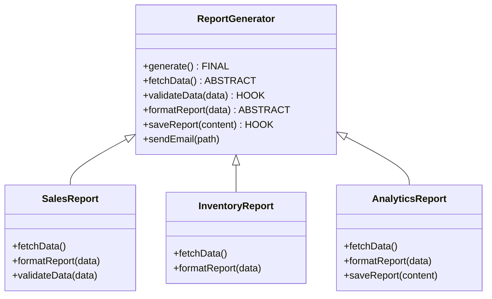
```mermaid
classDiagram
    class ReportGenerator {
        +generate() FINAL
        +fetchData() ABSTRACT
        +validateData(data) HOOK
        +formatReport(data) ABSTRACT
        +saveReport(content) HOOK
        +sendEmail(path)
    }
    class SalesReport {
        +fetchData()
        +formatReport(data)
        +validateData(data)
    }
    class InventoryReport {
        +fetchData()
        +formatReport(data)
    }
    class AnalyticsReport {
        +fetchData()
        +formatReport(data)
        +saveReport(content)
    }

    ReportGenerator <|-- SalesReport
    ReportGenerator <|-- InventoryReport
    ReportGenerator <|-- AnalyticsReport
```

### TypeScript Implementation

```typescript
// Abstract base class — defines the template
abstract class ReportGenerator {
  // THE TEMPLATE METHOD — fixed skeleton, marked final conceptually
  generate(): void {
    console.log(`\n=== Starting ${this.reportName()} ===`);

    const rawData = this.fetchData();             // Step 1: must override
    const isValid = this.validateData(rawData);   // Step 2: hook (optional override)

    if (!isValid) {
      console.log('Data validation failed. Aborting report.');
      return;
    }

    const formatted = this.formatReport(rawData); // Step 3: must override
    const filePath = this.saveReport(formatted);  // Step 4: hook (optional override)
    this.sendEmail(filePath);                     // Step 5: fixed, same for all

    console.log(`=== ${this.reportName()} complete ===\n`);
  }

  // Subclasses MUST implement these (abstract)
  abstract reportName(): string;
  abstract fetchData(): Record<string, unknown>[];
  abstract formatReport(data: Record<string, unknown>[]): string;

  // HOOKS — subclasses MAY override, but don't have to
  validateData(data: Record<string, unknown>[]): boolean {
    console.log(`  Validating ${data.length} records...`);
    return data.length > 0;
  }

  saveReport(content: string): string {
    const filename = `report_${Date.now()}.txt`;
    console.log(`  Saving report to ${filename}`);
    return `/reports/${filename}`;
  }

  // Concrete method — same for all, not overridable
  private sendEmail(filePath: string): void {
    console.log(`  Sending report email with attachment: ${filePath}`);
  }
}

// Concrete implementation 1: Daily Sales Report
class SalesReport extends ReportGenerator {
  reportName(): string { return 'Daily Sales Report'; }

  fetchData(): Record<string, unknown>[] {
    console.log('  Fetching sales data from OrdersDB...');
    return [
      { date: '2024-01-15', product: 'Biryani', quantity: 142, revenue: 70858 },
      { date: '2024-01-15', product: 'Pizza', quantity: 89, revenue: 44500 },
      { date: '2024-01-15', product: 'Burger', quantity: 203, revenue: 50750 },
    ];
  }

  formatReport(data: Record<string, unknown>[]): string {
    const totalRevenue = data.reduce((sum, row) => sum + (row.revenue as number), 0);
    let report = 'DAILY SALES REPORT\n';
    report += '==================\n';
    data.forEach(row => {
      report += `${row.product}: ${row.quantity} units | ₹${row.revenue}\n`;
    });
    report += `\nTOTAL REVENUE: ₹${totalRevenue}`;
    return report;
  }

  // Override validation — sales report needs at least 10 records to be valid
  validateData(data: Record<string, unknown>[]): boolean {
    console.log('  [Sales] Custom validation: checking for minimum entries...');
    return data.length >= 1; // Relaxed for demo
  }
}

// Concrete implementation 2: Inventory Report
class InventoryReport extends ReportGenerator {
  reportName(): string { return 'Weekly Inventory Report'; }

  fetchData(): Record<string, unknown>[] {
    console.log('  Fetching inventory data from WarehouseDB...');
    return [
      { item: 'Tomatoes', quantity: 450, unit: 'kg', reorderLevel: 100 },
      { item: 'Onions', quantity: 80, unit: 'kg', reorderLevel: 200 },    // Below reorder!
      { item: 'Chicken', quantity: 320, unit: 'kg', reorderLevel: 150 },
    ];
  }

  formatReport(data: Record<string, unknown>[]): string {
    let report = 'INVENTORY STATUS REPORT\n';
    report += '=======================\n';
    data.forEach(row => {
      const status = (row.quantity as number) < (row.reorderLevel as number) ? ' ⚠ LOW STOCK' : '';
      report += `${row.item}: ${row.quantity} ${row.unit}${status}\n`;
    });
    return report;
  }

  // Override save — inventory reports go to a different location
  saveReport(content: string): string {
    const filename = `inventory_${new Date().toISOString().split('T')[0]}.csv`;
    console.log(`  [Inventory] Saving to S3: s3://reports/inventory/${filename}`);
    return `s3://reports/inventory/${filename}`;
  }
}

// Usage — same generate() call, completely different behavior
console.log('Running automated reports...');
new SalesReport().generate();
new InventoryReport().generate();
```

### Hooks vs Abstract Methods

| Concept | Description | Override? |
|---------|-------------|-----------|
| Template method | The fixed algorithm skeleton | Never |
| Abstract method | Step that MUST be implemented | Yes, required |
| Hook | Optional step with default behavior | Yes, optional |
| Concrete method | Utility, same for all | No |

### Trade-offs

| Advantage | Disadvantage |
|-----------|--------------|
| DRY — skeleton defined once | Inheritance = tight coupling |
| Enforces a process order | Hard to understand without reading base class |
| Easy to add new "flavors" | Base class changes break all subclasses |
| Subclasses only write what differs | Template method can become god method if too many steps |

### Interview Tip

> "Template Method is often confused with Strategy. Key difference: Template Method uses **inheritance** to fill in steps, Strategy uses **composition** to swap the whole algorithm. In interviews: if the STEPS are shared but SOME steps differ → Template Method. If the ENTIRE algorithm differs → Strategy."

---

## 6. Iterator Pattern

### Why Does It Exist?

You have a custom `PlaylistManager` for a music app. Internally it might use a linked list, an array, or a tree. How do users iterate through songs? You don't want to expose the internal data structure — that's a leak of implementation details.

The Iterator pattern provides a standard way to walk through any collection, regardless of how it's stored internally.

### The Analogy

**Socho TV remote ka "Next Channel" button.** You don't know if channels are stored in an array, a map, or a circular list internally. You just press Next. The iterator hides complexity.

Python's `for x in collection`, Java's `for (item : list)`, JavaScript's `for...of` — all use iterators under the hood.

### How Standard Iterators Work

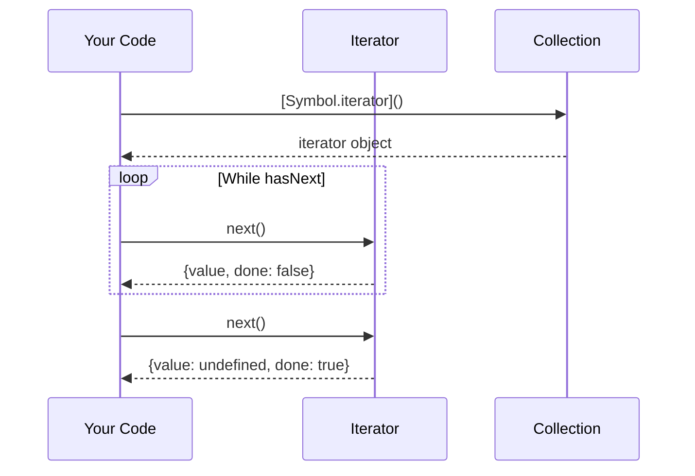
```mermaid
sequenceDiagram
    participant App as Your Code
    participant It as Iterator
    participant Col as Collection

    App->>Col: [Symbol.iterator]()
    Col-->>App: iterator object
    loop While hasNext
        App->>It: next()
        It-->>App: {value, done: false}
    end
    App->>It: next()
    It-->>App: {value: undefined, done: true}
```

### TypeScript Implementation

```typescript
// Iterator interface
interface Iterator<T> {
  hasNext(): boolean;
  next(): T;
  reset(): void;
}

// Custom collection: Playlist
class Playlist {
  private songs: { title: string; artist: string; duration: number }[] = [];
  private name: string;

  constructor(name: string) {
    this.name = name;
  }

  addSong(title: string, artist: string, duration: number): void {
    this.songs.push({ title, artist, duration });
  }

  // Return different iterators for different traversal strategies
  getIterator(): PlaylistIterator {
    return new PlaylistIterator(this.songs);
  }

  getShuffledIterator(): ShuffledPlaylistIterator {
    return new ShuffledPlaylistIterator([...this.songs]);
  }

  getName(): string { return this.name; }
}

// Forward iterator
class PlaylistIterator implements Iterator<{ title: string; artist: string; duration: number }> {
  private index: number = 0;

  constructor(private songs: { title: string; artist: string; duration: number }[]) {}

  hasNext(): boolean {
    return this.index < this.songs.length;
  }

  next(): { title: string; artist: string; duration: number } {
    if (!this.hasNext()) throw new Error('No more songs');
    return this.songs[this.index++];
  }

  reset(): void {
    this.index = 0;
  }

  // Make it work with JavaScript's for...of
  [Symbol.iterator]() {
    return {
      next: () => {
        if (this.hasNext()) {
          return { value: this.songs[this.index++], done: false };
        }
        return { value: undefined as any, done: true };
      }
    };
  }
}

// Shuffled iterator — different traversal, same interface
class ShuffledPlaylistIterator implements Iterator<{ title: string; artist: string; duration: number }> {
  private shuffled: { title: string; artist: string; duration: number }[];
  private index: number = 0;

  constructor(songs: { title: string; artist: string; duration: number }[]) {
    // Fisher-Yates shuffle
    this.shuffled = [...songs];
    for (let i = this.shuffled.length - 1; i > 0; i--) {
      const j = Math.floor(Math.random() * (i + 1));
      [this.shuffled[i], this.shuffled[j]] = [this.shuffled[j], this.shuffled[i]];
    }
  }

  hasNext(): boolean { return this.index < this.shuffled.length; }
  next() { return this.shuffled[this.index++]; }
  reset(): void { this.index = 0; }
}

// Generator-based iterator (modern approach — lazy evaluation)
function* paginatedResults<T>(items: T[], pageSize: number): Generator<T[]> {
  for (let i = 0; i < items.length; i += pageSize) {
    yield items.slice(i, i + pageSize);
  }
}

// Infinite generator — lazy, memory efficient
function* fibonacci(): Generator<number> {
  let [a, b] = [0, 1];
  while (true) {
    yield a;
    [a, b] = [b, a + b];
  }
}

// Usage
const myPlaylist = new Playlist('Workout Mix');
myPlaylist.addSong('Blinding Lights', 'The Weeknd', 200);
myPlaylist.addSong('Levitating', 'Dua Lipa', 203);
myPlaylist.addSong('Dynamite', 'BTS', 199);
myPlaylist.addSong('Save Your Tears', 'The Weeknd', 215);

console.log('--- Sequential play ---');
const iterator = myPlaylist.getIterator();
while (iterator.hasNext()) {
  const song = iterator.next();
  console.log(`  Now playing: ${song.title} by ${song.artist}`);
}

console.log('\n--- Paginated API results (page size 2) ---');
const allSongs = [1, 2, 3, 4, 5, 6, 7];
for (const page of paginatedResults(allSongs, 2)) {
  console.log(`  Page: [${page}]`);
}

console.log('\n--- First 8 Fibonacci numbers ---');
const fib = fibonacci();
const first8 = Array.from({ length: 8 }, () => fib.next().value);
console.log(`  [${first8}]`);
```

### Real-World Iterator Usage

| Language/Framework | Iterator Implementation |
|-------------------|------------------------|
| Python | `__iter__` + `__next__` protocol |
| Java | `Iterable<T>` + `Iterator<T>` |
| JavaScript/TypeScript | `Symbol.iterator` + Generator functions |
| C# | `IEnumerable<T>` + `yield return` |
| Database | Cursor (iterate rows without loading all into memory) |
| Kafka | Consumer iterates over messages in a topic |

---

## 7. Chain of Responsibility

### Why Does It Exist?

Every API request to your Swiggy backend needs to go through:
1. Authentication (is the user logged in?)
2. Authorization (does the user have permission?)
3. Rate limiting (is this user flooding us with requests?)
4. Input validation (is the request body well-formed?)
5. Logging (record what happened)
6. Actual business logic (process the order)

You could write all of this in one giant function. But then it's untestable, unreplaceable, and impossible to reorder. Chain of Responsibility says: **each check is a handler, linked in a chain. Each handler either processes the request or passes it to the next.**

### The Analogy

**Company expense approval karo samjho.** You submit ₹800 expense — your manager approves it (up to ₹1000 limit). You submit ₹8000 — manager can't approve, sends to Director (up to ₹10,000). ₹80,000 — Director can't approve, sends to VP. ₹8 lakh — VP sends to CFO.

The request travels up the chain until someone can handle it — or it falls off the end (rejected).

### Architecture Diagram

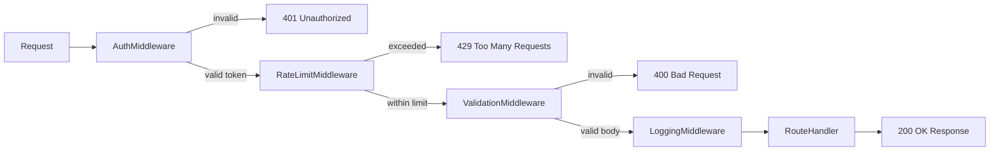
```mermaid
flowchart LR
    Request --> Auth[AuthMiddleware]
    Auth -->|valid token| RateLimit[RateLimitMiddleware]
    Auth -->|invalid| 401[401 Unauthorized]
    RateLimit -->|within limit| Validation[ValidationMiddleware]
    RateLimit -->|exceeded| 429[429 Too Many Requests]
    Validation -->|valid body| Logger[LoggingMiddleware]
    Validation -->|invalid| 400[400 Bad Request]
    Logger --> Handler[RouteHandler]
    Handler --> 200[200 OK Response]
```

### TypeScript Implementation

```typescript
interface HttpRequest {
  token?: string;
  ip: string;
  path: string;
  method: string;
  body?: Record<string, unknown>;
  userId?: string;
}

interface HttpResponse {
  status: number;
  body: unknown;
}

// Base middleware — handles the chain linking
abstract class Middleware {
  private next: Middleware | null = null;

  // Fluent API: auth.setNext(rateLimit).setNext(logger).setNext(handler)
  setNext(middleware: Middleware): Middleware {
    this.next = middleware;
    return middleware;
  }

  protected passToNext(request: HttpRequest): HttpResponse {
    if (this.next) {
      return this.next.handle(request);
    }
    // End of chain — no handler found
    return { status: 404, body: { error: 'No handler found' } };
  }

  abstract handle(request: HttpRequest): HttpResponse;
}

// Handler 1: JWT Authentication
class AuthMiddleware extends Middleware {
  private validTokens = new Map([
    ['token_user123', 'user123'],
    ['token_admin', 'admin'],
  ]);

  handle(request: HttpRequest): HttpResponse {
    if (!request.token) {
      console.log('[Auth] BLOCKED: No token provided');
      return { status: 401, body: { error: 'Authorization token required' } };
    }

    const userId = this.validTokens.get(request.token);
    if (!userId) {
      console.log('[Auth] BLOCKED: Invalid token');
      return { status: 401, body: { error: 'Invalid or expired token' } };
    }

    request.userId = userId; // Enrich request with user info
    console.log(`[Auth] PASSED: User ${userId}`);
    return this.passToNext(request);
  }
}

// Handler 2: Rate Limiting (per IP, per minute)
class RateLimitMiddleware extends Middleware {
  private counters: Map<string, { count: number; resetAt: number }> = new Map();
  private readonly LIMIT = 10; // 10 requests per minute
  private readonly WINDOW_MS = 60_000;

  handle(request: HttpRequest): HttpResponse {
    const now = Date.now();
    const record = this.counters.get(request.ip);

    if (!record || now > record.resetAt) {
      this.counters.set(request.ip, { count: 1, resetAt: now + this.WINDOW_MS });
      console.log(`[RateLimit] PASSED: ${request.ip} (1/${this.LIMIT})`);
      return this.passToNext(request);
    }

    record.count++;
    if (record.count > this.LIMIT) {
      console.log(`[RateLimit] BLOCKED: ${request.ip} exceeded limit (${record.count}/${this.LIMIT})`);
      return {
        status: 429,
        body: { error: 'Too many requests. Please wait.' }
      };
    }

    console.log(`[RateLimit] PASSED: ${request.ip} (${record.count}/${this.LIMIT})`);
    return this.passToNext(request);
  }
}

// Handler 3: Input Validation
class ValidationMiddleware extends Middleware {
  private requiredFields: Map<string, string[]> = new Map([
    ['/api/orders', ['restaurantId', 'items', 'deliveryAddress']],
    ['/api/profile', ['name']],
  ]);

  handle(request: HttpRequest): HttpResponse {
    const required = this.requiredFields.get(request.path);
    if (required && request.method === 'POST') {
      const missing = required.filter(field => !request.body?.[field]);
      if (missing.length > 0) {
        console.log(`[Validation] BLOCKED: Missing fields: ${missing.join(', ')}`);
        return {
          status: 400,
          body: { error: `Missing required fields: ${missing.join(', ')}` }
        };
      }
    }
    console.log('[Validation] PASSED');
    return this.passToNext(request);
  }
}

// Handler 4: Request Logging (doesn't block, always passes through)
class LoggingMiddleware extends Middleware {
  handle(request: HttpRequest): HttpResponse {
    const start = Date.now();
    console.log(`[Log] ${request.method} ${request.path} from ${request.ip} (user: ${request.userId})`);

    const response = this.passToNext(request);

    console.log(`[Log] Response: ${response.status} (${Date.now() - start}ms)`);
    return response;
  }
}

// Handler 5: Actual business logic
class OrderHandler extends Middleware {
  handle(request: HttpRequest): HttpResponse {
    console.log(`[Handler] Creating order for user ${request.userId}`);
    return {
      status: 201,
      body: {
        orderId: `ORD_${Date.now()}`,
        status: 'PLACED',
        message: 'Order placed successfully!'
      }
    };
  }
}

// Build the chain
const auth = new AuthMiddleware();
const rateLimit = new RateLimitMiddleware();
const validation = new ValidationMiddleware();
const logger = new LoggingMiddleware();
const handler = new OrderHandler();

// Fluent chain setup
auth.setNext(rateLimit).setNext(validation).setNext(logger).setNext(handler);

// Test 1: Valid request
console.log('\n=== Valid Order Request ===');
const response1 = auth.handle({
  token: 'token_user123',
  ip: '192.168.1.1',
  method: 'POST',
  path: '/api/orders',
  body: {
    restaurantId: 'rest_456',
    items: ['Biryani', 'Raita'],
    deliveryAddress: '42 MG Road, Bengaluru'
  }
});
console.log('Final Response:', response1);

// Test 2: Missing auth token
console.log('\n=== Request Without Token ===');
const response2 = auth.handle({ ip: '10.0.0.1', method: 'POST', path: '/api/orders' });
console.log('Final Response:', response2);

// Test 3: Valid auth but missing fields
console.log('\n=== Request With Missing Body Fields ===');
const response3 = auth.handle({
  token: 'token_user123',
  ip: '192.168.1.2',
  method: 'POST',
  path: '/api/orders',
  body: { restaurantId: 'rest_456' } // Missing items and deliveryAddress
});
console.log('Final Response:', response3);
```

### Express.js Middleware (Real-World CoR)

```javascript
// Express IS the Chain of Responsibility pattern
const app = express();

// Each middleware is a handler in the chain
app.use(cors());                    // Handler 1
app.use(express.json());            // Handler 2
app.use(helmet());                  // Handler 3
app.use(rateLimiter);               // Handler 4
app.use(jwtAuth);                   // Handler 5

// Route handler is the final handler
app.post('/api/orders', (req, res) => {
  // Only reaches here if all middleware passed
  createOrder(req.body);
});

// next() = passToNext()
function jwtAuth(req, res, next) {
  if (!req.headers.authorization) {
    return res.status(401).json({ error: 'No token' });
  }
  // ...verify token...
  next(); // Pass to next handler
}
```

### Trade-offs

| Advantage | Disadvantage |
|-----------|--------------|
| Add/remove/reorder handlers without touching others | Request might reach end of chain unhandled |
| Single Responsibility — each handler does one thing | Long chains slow down request processing |
| Configurable at runtime | Hard to guarantee exactly which handler processes request |
| Testable in isolation | Debugging requires tracing through multiple handlers |

### Interview Tip

> "Chain of Responsibility is the answer to 'How would you design an API gateway?' Each concern — auth, rate limiting, logging, validation — is a handler. They're composable, independently testable, and reorderable. This is exactly how Kong, AWS API Gateway, and Nginx work internally."

---

## 8. Mediator Pattern

### Why Does It Exist?

In a complex UI form (like a Razorpay checkout page): changing the country field should update the phone prefix, currency, available payment methods, and address format. If every component talks directly to every other component, you get O(N²) connections. With 10 components, that's 90 connections to manage.

Mediator centralizes all communication through a single object.

### The Analogy

**Air Traffic Control socho.** Planes don't talk to each other directly. Imagine the chaos if Indigo flight talked directly to Air India flight about runway clearance! They all communicate through the control tower. The tower knows the full picture and coordinates everyone safely.

### Architecture Diagram

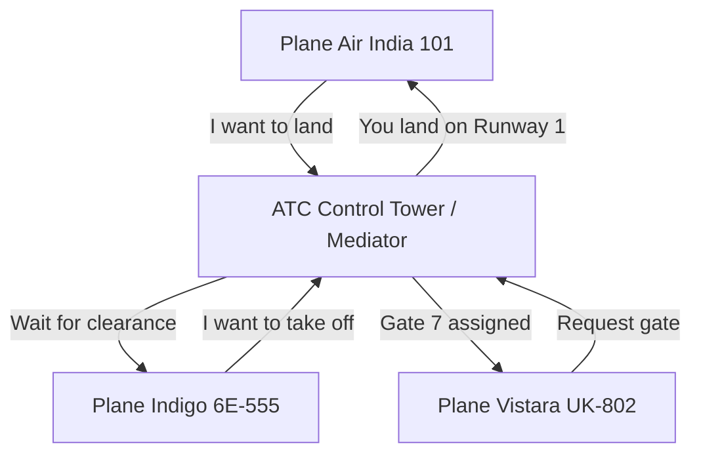
```mermaid
flowchart TD
    A[Plane Air India 101] -->|I want to land| Tower[ATC Control Tower / Mediator]
    B[Plane Indigo 6E-555] -->|I want to take off| Tower
    C[Plane Vistara UK-802] -->|Request gate| Tower
    Tower -->|You land on Runway 1| A
    Tower -->|Wait for clearance| B
    Tower -->|Gate 7 assigned| C
```

### TypeScript Implementation

```typescript
interface ChatMediator {
  registerUser(user: User): void;
  sendMessage(message: string, from: User, to?: User): void;
  broadcastTyping(user: User): void;
}

class WhatsAppGroup implements ChatMediator {
  private users: Map<string, User> = new Map();
  private messageLog: { from: string; message: string; time: Date }[] = [];

  registerUser(user: User): void {
    this.users.set(user.name, user);
    console.log(`[Group] ${user.name} joined the group`);
    this.sendMessage(`${user.name} joined`, user);
  }

  sendMessage(message: string, from: User, to?: User): void {
    const entry = { from: from.name, message, time: new Date() };
    this.messageLog.push(entry);

    if (to) {
      // Direct message to specific user
      to.receive(message, from.name);
    } else {
      // Broadcast to all except sender
      this.users.forEach(user => {
        if (user !== from) {
          user.receive(message, from.name);
        }
      });
    }
  }

  broadcastTyping(user: User): void {
    this.users.forEach(u => {
      if (u !== user) {
        u.showTypingIndicator(user.name);
      }
    });
  }

  getHistory(): typeof this.messageLog {
    return this.messageLog;
  }
}

class User {
  constructor(
    public name: string,
    private mediator: ChatMediator
  ) {}

  send(message: string, to?: User): void {
    console.log(`[${this.name}] → "${message}"`);
    this.mediator.sendMessage(message, this, to);
  }

  startTyping(): void {
    this.mediator.broadcastTyping(this);
  }

  receive(message: string, fromName: string): void {
    console.log(`  [${this.name} receives from ${fromName}]: "${message}"`);
  }

  showTypingIndicator(fromName: string): void {
    console.log(`  [${this.name} sees]: ${fromName} is typing...`);
  }
}

// Usage
const friendsGroup = new WhatsAppGroup();

const rahul = new User('Rahul', friendsGroup);
const priya = new User('Priya', friendsGroup);
const arjun = new User('Arjun', friendsGroup);

friendsGroup.registerUser(rahul);
friendsGroup.registerUser(priya);
friendsGroup.registerUser(arjun);

console.log('\n--- Group messages ---');
rahul.send('Kya plan hai kal ke liye?');
priya.send('Movie dekhte hain!');

console.log('\n--- Direct message ---');
rahul.send('Priya, tu kal free hai?', priya);
```

### Trade-offs

| Advantage | Disadvantage |
|-----------|--------------|
| Reduces N² connections to N connections | Mediator can become a "god object" |
| Easy to add new colleagues (users, components) | Single point of failure |
| Communication logic centralized and auditable | Can be overkill for simple interactions |

---

## 9. Memento Pattern

### Why Does It Exist?

You need undo/redo but the Command pattern won't work because you can't easily reverse the operations (maybe the state is complex, or there are many interacting fields). Memento lets you take a snapshot of an object's state and restore it later — without exposing the object's private internals.

### The Analogy

**Video game save point socho.** Boss fight mein jaane se pehle, you save your game — health: 100%, level: 5, inventory: [sword, shield]. Boss kills you. You load the save. You're back to exactly that state. The save file is the Memento — it holds your state, but you don't need to understand the game engine to use it.

### Architecture Diagram

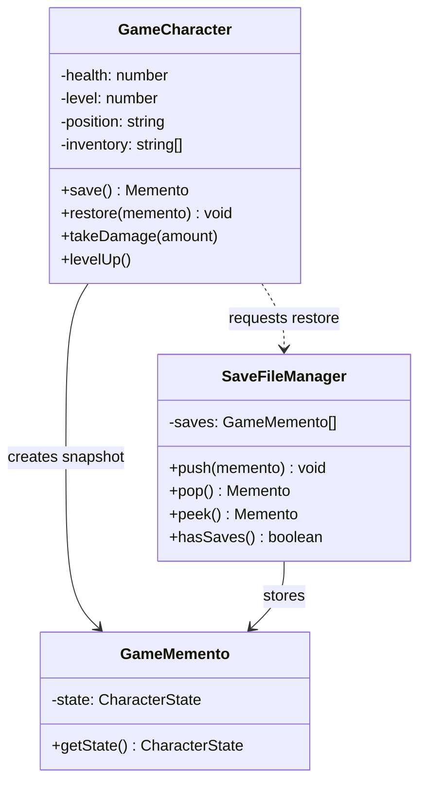
```mermaid
classDiagram
    class GameCharacter {
        -health: number
        -level: number
        -position: string
        -inventory: string[]
        +save() Memento
        +restore(memento) void
        +takeDamage(amount)
        +levelUp()
    }
    class GameMemento {
        -state: CharacterState
        +getState() CharacterState
    }
    class SaveFileManager {
        -saves: GameMemento[]
        +push(memento) void
        +pop() Memento
        +peek() Memento
        +hasSaves() boolean
    }

    GameCharacter --> GameMemento : creates snapshot
    SaveFileManager --> GameMemento : stores
    GameCharacter ..> SaveFileManager : requests restore
```

### TypeScript Implementation

```typescript
interface CharacterState {
  health: number;
  level: number;
  position: string;
  inventory: string[];
  experience: number;
}

// Memento — opaque snapshot (only GameCharacter can read its state meaningfully)
class GameMemento {
  private readonly timestamp: Date;

  constructor(private state: CharacterState) {
    this.timestamp = new Date();
  }

  // Deep copy to prevent mutation of saved state
  getState(): CharacterState {
    return {
      ...this.state,
      inventory: [...this.state.inventory]
    };
  }

  getSaveTime(): string {
    return this.timestamp.toLocaleTimeString();
  }
}

// Originator — creates and restores from mementos
class GameCharacter {
  private health: number = 100;
  private level: number = 1;
  private position: string = 'Starting Village';
  private inventory: string[] = ['Basic Sword', 'Health Potion'];
  private experience: number = 0;

  save(): GameMemento {
    const snapshot = new GameMemento({
      health: this.health,
      level: this.level,
      position: this.position,
      inventory: [...this.inventory],
      experience: this.experience
    });
    console.log(`  [SAVED] HP:${this.health} | LVL:${this.level} | at "${this.position}" | XP:${this.experience}`);
    return snapshot;
  }

  restore(memento: GameMemento): void {
    const state = memento.getState();
    this.health = state.health;
    this.level = state.level;
    this.position = state.position;
    this.inventory = [...state.inventory];
    this.experience = state.experience;
    console.log(`  [LOADED] Save from ${memento.getSaveTime()}`);
    this.status();
  }

  takeDamage(amount: number): void {
    this.health = Math.max(0, this.health - amount);
    console.log(`  Took ${amount} damage. HP: ${this.health}`);
  }

  healUp(amount: number): void {
    this.health = Math.min(100, this.health + amount);
    console.log(`  Healed ${amount}. HP: ${this.health}`);
  }

  enterDungeon(name: string): void {
    this.position = name;
    console.log(`  Entered ${name}`);
  }

  defeatBoss(bossName: string): void {
    this.experience += 500;
    this.level++;
    this.inventory.push(`${bossName}'s Crown`);
    console.log(`  Defeated ${bossName}! LVL UP → ${this.level}`);
  }

  status(): void {
    console.log(`  [STATUS] HP:${this.health} | LVL:${this.level} | XP:${this.experience} | at "${this.position}" | Items:[${this.inventory.join(', ')}]`);
  }
}

// Caretaker — manages save files (doesn't understand memento internals)
class SaveFileManager {
  private saves: { name: string; memento: GameMemento }[] = [];

  save(name: string, memento: GameMemento): void {
    this.saves.push({ name, memento });
    console.log(`  Save file "${name}" created.`);
  }

  load(name: string): GameMemento | null {
    const save = this.saves.find(s => s.name === name);
    if (!save) {
      console.log(`  Save file "${name}" not found.`);
      return null;
    }
    return save.memento;
  }

  listSaves(): void {
    console.log('  Available saves:');
    this.saves.forEach(s => console.log(`    - "${s.name}" (saved at ${s.memento.getSaveTime()})`));
  }
}

// Usage — a typical gaming session
const hero = new GameCharacter();
const saveManager = new SaveFileManager();

console.log('=== Starting the game ===');
hero.status();

console.log('\n=== Save before entering dungeon ===');
saveManager.save('Before Dragon Dungeon', hero.save());

console.log('\n=== Enter dungeon — things go badly ===');
hero.enterDungeon('Dragon Cave');
hero.takeDamage(60);
hero.takeDamage(30);
hero.status(); // HP: 10 — almost dead!

console.log('\n=== Load save! ===');
const save = saveManager.load('Before Dragon Dungeon');
if (save) hero.restore(save);

console.log('\n=== Try again — this time win ===');
hero.enterDungeon('Dragon Cave');
hero.takeDamage(20);
hero.defeatBoss('Dragon King');
hero.status();

saveManager.listSaves();
```

### Trade-offs

| Advantage | Disadvantage |
|-----------|--------------|
| Doesn't break encapsulation — internals stay private | Memory-intensive if state is large or snapshots are frequent |
| Clean separation between originator and caretaker | Caretaker doesn't know how expensive saving is |
| Multiple snapshots allow checkpoint-based undo | Deep copies can be slow for complex objects |
| Simple to implement for straightforward state | Not suitable for distributed state across multiple objects |

---

## Pattern Comparison: The Big Picture

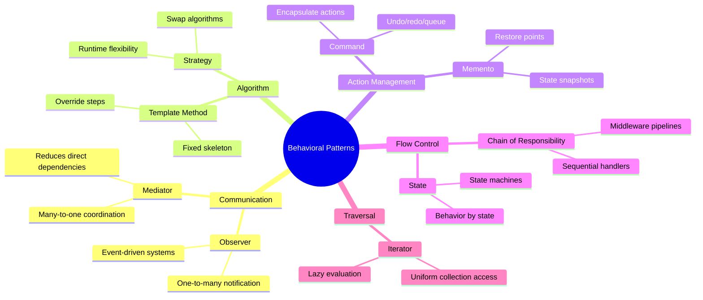
```mermaid
mindmap
  root((Behavioral Patterns))
    Communication
      Observer
        One-to-many notification
        Event-driven systems
      Mediator
        Many-to-one coordination
        Reduces direct dependencies
    Algorithm
      Strategy
        Swap algorithms
        Runtime flexibility
      Template Method
        Fixed skeleton
        Override steps
    Action Management
      Command
        Encapsulate actions
        Undo/redo/queue
      Memento
        State snapshots
        Restore points
    Flow Control
      Chain of Responsibility
        Sequential handlers
        Middleware pipelines
      State
        Behavior by state
        State machines
    Traversal
      Iterator
        Uniform collection access
        Lazy evaluation
```

### Side-by-Side Summary

| Pattern | Core Purpose | Key Mechanism | Real-World System |
|---------|-------------|----------------|-------------------|
| Observer | Notify many on one event | Subscribe/unsubscribe list | WhatsApp push notifications |
| Strategy | Swap algorithms at runtime | Interface injection | Razorpay payment methods |
| Command | Encapsulate actions as objects | Execute/undo interface | Google Docs undo history |
| State | Change behavior by internal state | State class delegation | Zomato order lifecycle |
| Template Method | Fixed flow, variable steps | Abstract method hooks | Report generation pipeline |
| Iterator | Uniform traversal interface | next()/hasNext() | Spotify playlist player |
| Chain of Responsibility | Pipeline of handlers | Linked handler chain | Express.js middleware |
| Mediator | Centralize communication | Hub object | WhatsApp group chat |
| Memento | Save and restore snapshots | Opaque state capture | Game save/load system |

### Which Pattern to Choose?

| Situation | Pattern to Use |
|-----------|---------------|
| "One event, many listeners" | Observer |
| "Multiple ways to do the same thing" | Strategy |
| "Need undo/redo or action logging" | Command |
| "Object acts differently based on current state" | State |
| "Steps are the same, details differ across types" | Template Method |
| "Loop through collection without knowing internals" | Iterator |
| "Request goes through multiple independent checks" | Chain of Responsibility |
| "Too many objects talking to each other" | Mediator |
| "Save and restore object state without breaking encapsulation" | Memento |

---

## Patterns in System Design Interviews

### Observer in Event-Driven Architecture

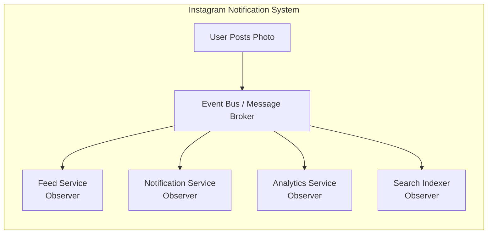
```mermaid
flowchart LR
    subgraph Instagram["Instagram Notification System"]
        Post[User Posts Photo]
        Post --> EventBus[Event Bus / Message Broker]
        EventBus --> FeedService[Feed Service\nObserver]
        EventBus --> NotifService[Notification Service\nObserver]
        EventBus --> AnalyticsService[Analytics Service\nObserver]
        EventBus --> SearchIndexer[Search Indexer\nObserver]
    end
```

Key insight: The post creation service doesn't know about notifications, feeds, or analytics. It just publishes an event. Each consumer (observer) independently decides what to do. This is exactly Pub/Sub with Kafka or AWS SNS.

### Strategy in Payment Processing

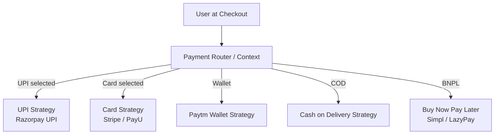
```mermaid
flowchart TD
    Checkout[User at Checkout] --> PaymentRouter[Payment Router / Context]
    PaymentRouter --> |UPI selected| UPI[UPI Strategy\nRazorpay UPI]
    PaymentRouter --> |Card selected| Card[Card Strategy\nStripe / PayU]
    PaymentRouter --> |Wallet| Wallet[Paytm Wallet Strategy]
    PaymentRouter --> |COD| COD[Cash on Delivery Strategy]
    PaymentRouter --> |BNPL| BNPL[Buy Now Pay Later\nSimpl / LazyPay]
```

### State in Order Management

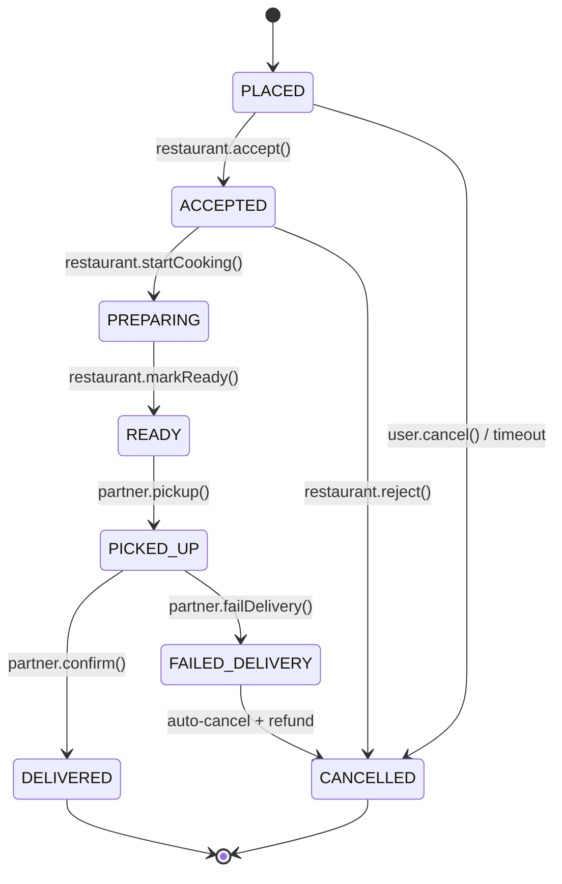
```mermaid
stateDiagram-v2
    [*] --> PLACED
    PLACED --> ACCEPTED : restaurant.accept()
    PLACED --> CANCELLED : user.cancel() / timeout
    ACCEPTED --> PREPARING : restaurant.startCooking()
    ACCEPTED --> CANCELLED : restaurant.reject()
    PREPARING --> READY : restaurant.markReady()
    READY --> PICKED_UP : partner.pickup()
    PICKED_UP --> DELIVERED : partner.confirm()
    PICKED_UP --> FAILED_DELIVERY : partner.failDelivery()
    DELIVERED --> [*]
    CANCELLED --> [*]
    FAILED_DELIVERY --> CANCELLED : auto-cancel + refund
```

### Command in Event Sourcing (Banking)

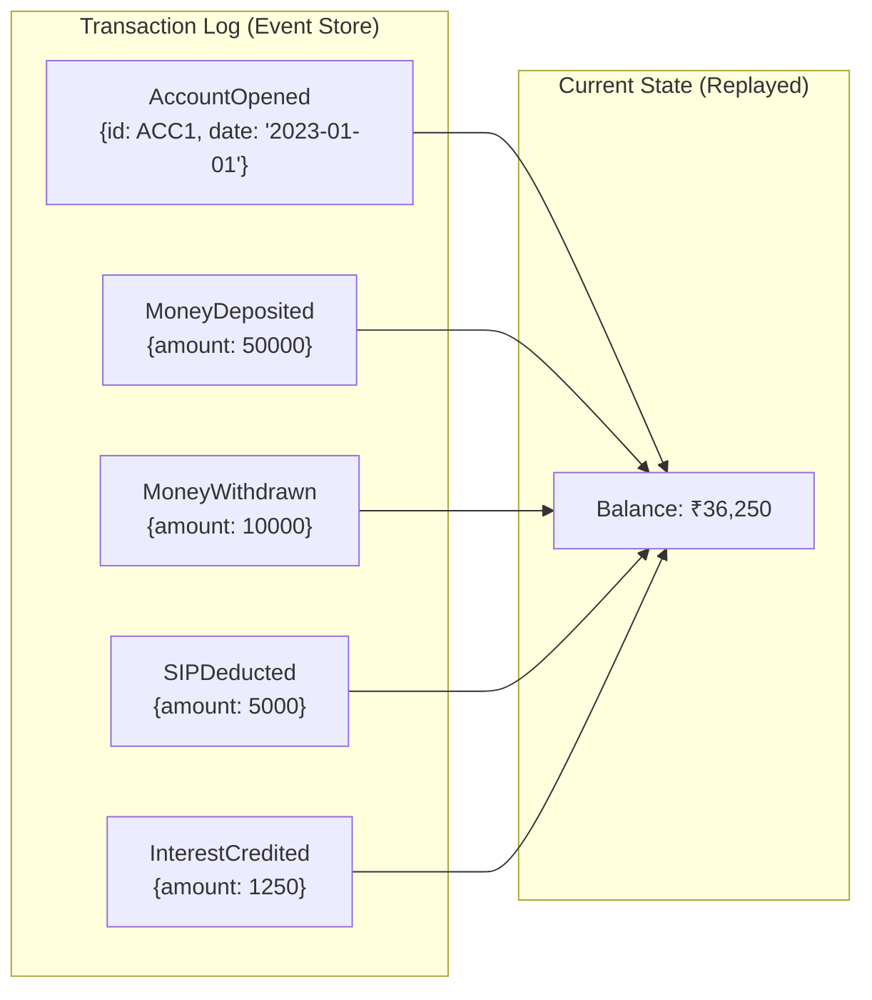
```mermaid
flowchart LR
    subgraph Events["Transaction Log (Event Store)"]
        E1["AccountOpened\n{id: ACC1, date: '2023-01-01'}"]
        E2["MoneyDeposited\n{amount: 50000}"]
        E3["MoneyWithdrawn\n{amount: 10000}"]
        E4["SIPDeducted\n{amount: 5000}"]
        E5["InterestCredited\n{amount: 1250}"]
    end

    subgraph Current["Current State (Replayed)"]
        Balance["Balance: ₹36,250"]
    end

    E1 --> Balance
    E2 --> Balance
    E3 --> Balance
    E4 --> Balance
    E5 --> Balance
```

---

## Common Interview Questions

### Pattern-Specific Questions

**Observer Pattern**
1. How is Observer different from Pub/Sub? (Observer = direct reference, Pub/Sub = via broker/topic)
2. How do you prevent memory leaks in Observer? (Weak references, explicit unsubscribe, WeakRef in modern JS)
3. Design a notification system for Instagram where a user posts a photo and all followers are notified.

**Strategy Pattern**
4. When would you use Strategy vs Template Method? (Strategy = swap whole algorithm via composition; Template Method = override specific steps via inheritance)
5. Design the payment system for a super-app like PhonePe that supports 15 payment methods.
6. How does Strategy help with the Open/Closed Principle?

**Command Pattern**
7. How does Command enable undo/redo? (Each command stores enough state to reverse itself)
8. What is event sourcing and how does Command pattern relate to it?
9. Design a macro system for a spreadsheet app where users can record and replay a sequence of actions.

**State Pattern**
10. State vs Strategy — what's the difference? (State: object changes ITS OWN behavior based on internal state; Strategy: context switches EXTERNAL algorithm)
11. Draw the state machine for a ride-hailing app like Uber (idle → ride requested → driver assigned → trip started → completed).
12. Design an order management system for Swiggy with all state transitions and their business rules.

**Chain of Responsibility**
13. How is CoR different from Observer? (CoR: one handler processes, then stops or passes; Observer: all observers get notified)
14. Design an API gateway with authentication, rate limiting, and logging using Chain of Responsibility.
15. How would you add a new middleware to an Express.js application without modifying existing middleware?

**General / Mixed**
16. Which pattern would you use to implement a plugin system? (Observer + Strategy)
17. How would you combine Observer and Strategy in a real system? (Observer to react to events; Strategy to decide HOW to react)
18. Design YouTube's notification system. Which patterns are involved?
19. What patterns are used in React? (Observer in useEffect/subscriptions, Strategy in render functions, Command in action creators)
20. How does Kafka implement behavioral patterns? (Observer: consumers subscribe to topics; Command: messages are event commands)

---

## Key Takeaways

1. **Behavioral patterns solve "who does what and how do they communicate"** — they give you clean, named solutions to the most common runtime interaction problems. Rather than inventing ad-hoc solutions, you use proven blueprints.

2. **Observer decouples publishers from subscribers** — the YouTube channel never calls each subscriber directly. This is the foundation of every event-driven system, from Redux to Kafka. Learn this pattern and you understand a huge chunk of modern architecture.

3. **Strategy replaces if/else chains with polymorphism** — instead of checking which algorithm to run, inject the right one. Adding a new payment method, sorting algorithm, or route strategy means adding a new class — zero changes to existing code. This is Open/Closed Principle in action.

4. **Command turns actions into objects** — once an action is an object, magic happens: undo it, queue it, log it, serialize it, replay it. Event sourcing is the Command pattern at architectural scale. Git's commit history is the Command pattern in disguise.

5. **State eliminates state-checking spaghetti** — every method on an order object shouldn't start with "if placed, else if confirmed, else if preparing...". Delegate behavior to the current state object. Each state is a small, focused class that knows exactly what it can and cannot do.

6. **Template Method and Strategy look similar but differ fundamentally** — Template Method uses inheritance (base class provides skeleton), Strategy uses composition (inject the algorithm). Composition is more flexible; use Strategy when you can. Use Template Method when the skeleton truly must be fixed and subclasses are the right abstraction.

7. **Chain of Responsibility builds composable, reorderable pipelines** — Express middleware, Django middleware, Java servlet filters, API gateways — all are Chain of Responsibility. The superpower is that handlers are independent. Test them alone, combine them any way you want, add or remove without touching others.

8. **These patterns appear together in real systems** — a text editor uses Command (undo), Memento (autosave), and Observer (update UI when content changes). Zomato's order flow uses State (order lifecycle), Observer (notify customer and partner), and Command (event log for accounting). Knowing which pattern fits which slot is the real skill.

9. **In interviews, name the pattern and draw the state machine/class diagram** — interviewers want to see that you think in well-understood abstractions, not just ad-hoc if/else. Saying "I'd use the State pattern here, and here's the state machine" signals experience with scalable design.

10. **yeh patterns sirf theory nahi hain** — har modern framework inhe use karta hai. React hooks = Observer. Express middleware = Chain of Responsibility. Redux = Command + Observer. Next time you use `addEventListener`, `store.dispatch`, or `app.use()` — ab tumhe pata hai yeh kyun itna clean aur composable feel hota hai.

---

*Previous: Structural Design Patterns — Adapter, Decorator, Facade, Proxy, Composite*
*Next: Concurrency Patterns — Mutex, Semaphore, Producer-Consumer, Thread Pool*
