# LLD Case Study: Design an LRU Cache

> **Difficulty:** Medium-Hard | **Most Asked LLD Question** | **Asked at:** Google, Meta, Amazon, Microsoft, Uber, Netflix, Flipkart, Atlassian
> **Core Concept:** HashMap + Doubly Linked List | **Time Complexity:** O(1) get & put

---

## Table of Contents

1. [The Problem — Why Does This Exist?](#1-the-problem)
2. [Understanding LRU with Real Analogies](#2-understanding-lru)
3. [Requirements](#3-requirements)
4. [Naive Approaches and Why They Fail](#4-naive-approaches)
5. [The Insight: Why O(1) is Hard](#5-the-insight)
6. [The Optimal Solution: HashMap + DLL](#6-optimal-solution)
7. [Class Design (LLD)](#7-class-design)
8. [Full Java Implementation](#8-java-implementation)
9. [Full Python Implementation](#9-python-implementation)
10. [Full TypeScript Implementation](#10-typescript-implementation)
11. [Thread Safety](#11-thread-safety)
12. [LFU Cache — The Upgrade](#12-lfu-cache)
13. [LRU in Real Systems](#13-real-systems)
14. [Eviction Policy Comparisons](#14-eviction-policies)
15. [System Design Extensions](#15-system-design-extensions)
16. [Common Interview Questions](#16-interview-questions)
17. [Key Takeaways](#17-key-takeaways)

---

## 1. The Problem

Samjho aise — yeh kyun important hai.

Your server has 64GB of RAM. Your database has 5TB of data. You cannot fit everything in memory. But your users keep requesting the same 100 videos on YouTube again and again (Despacito has 8 billion views — clearly people rewatch things).

So you build a **cache**: a small, fast memory store that holds recently or frequently accessed data. Database reads take ~10ms. Cache reads take ~0.1ms. That is a **100x speedup**.

But the cache has limited space. When it fills up, you must decide: which item to throw out to make room for the new one?

This is the **cache eviction problem**. And LRU (Least Recently Used) is the most elegant, battle-tested answer to it.

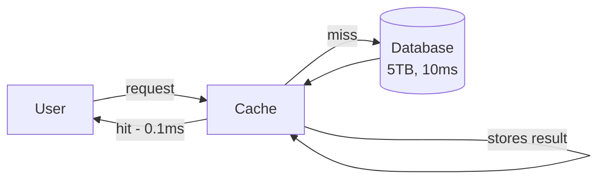

**LRU's bet:** "If you haven't used something recently, you probably won't use it soon. Throw it out."

This bet is correct most of the time because of **temporal locality** — a fundamental property of how humans and programs behave. The song you played 3 minutes ago is more likely to be replayed than the one you played 3 years ago.

---

## 2. Understanding LRU

### Analogy 1: Your Desk (for a 5-year-old)

Imagine your study desk has space for only 5 books. You have 50 books on your shelf. You keep the books you are currently working on on your desk. Your desk fills up. A new book arrives that you need.

Which book do you move back to the shelf?

The one you haven't touched in the longest time. That's LRU — you evict the **Least Recently Used** book.

### Analogy 2: Phone App Switcher

Your phone has 4GB RAM. You have 80 apps installed. Your OS keeps recently opened apps alive in memory so they open fast. When RAM fills up, it kills the app you opened least recently. WhatsApp stays alive because you open it every 5 minutes. That calculator app you opened 3 weeks ago? Gone.

### Analogy 3: Netflix Watch History

Netflix's content recommendation engine thinks about what you've watched recently. If you binge-watched "Squid Game" last week, that's fresh in your behavioral profile. A movie you watched 5 years ago carries less weight. LRU-style recency signals drive personalization.

### Analogy 4: Restaurant Zomato

Zomato caches restaurant data (menu, ratings, photos) in their servers. A restaurant that gets 1000 orders/day stays cached. One that got its last order 6 months ago gets evicted from cache — its data is fetched fresh from DB only when needed.

### The Two Iron Rules of LRU

1. **On access (`get`):** Mark the item as "most recently used" — move it to the front of the recency queue.
2. **On insert (`put`):** Add the new item. If over capacity, remove the item that was accessed least recently.

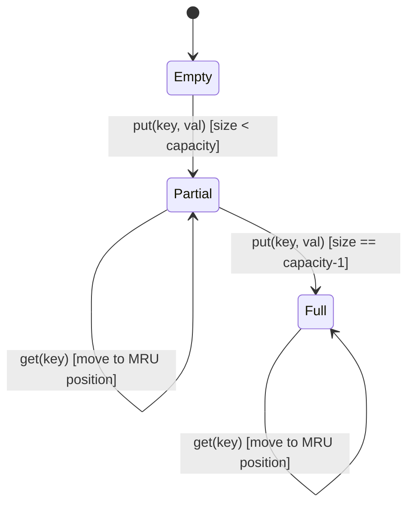

---

## 3. Requirements

### Functional Requirements

| Method | Behavior |
|--------|----------|
| `LRUCache(capacity)` | Initialize with fixed capacity (>= 1) |
| `get(key)` | Return value if key exists, else return -1. Mark as recently used. |
| `put(key, value)` | Insert or update key. If key exists, update and mark as recently used. If new and over capacity, evict LRU first. |

### Non-Functional Requirements

| Requirement | Target |
|-------------|--------|
| `get` time complexity | **O(1)** |
| `put` time complexity | **O(1)** |
| Space complexity | O(capacity) |
| Thread safety | Optional but important for production |

### Edge Cases to Handle

- `get` on a key that was evicted → return -1
- `put` on a key that already exists → update value, refresh recency (do NOT evict anything)
- `put` when capacity = 1 → every new key evicts the previous one (unless same key)
- Capacity of 1 → single-slot cache

---

## 4. Naive Approaches and Why They Fail

### Approach 1: Array / ArrayList

Keep an ordered array. Index 0 = most recently used. Last index = LRU.

```
[MRU] A → B → C → D → [LRU]
```

**get(key):**
- Scan array to find key → O(n)
- Move it to index 0, shift all others right → O(n)

**put(key, value):**
- Scan for duplicate → O(n)
- Insert at index 0, shift all right → O(n)
- If over capacity, remove last element → O(1)

| Operation | Array |
|-----------|-------|
| get | O(n) |
| put | O(n) |

**Why this kills you at scale:** Instagram has 2 billion users. Their API gateway caches user profile data. If `get` is O(n) on a 10-million-entry cache, you're doing 10 million comparisons per request. A cache that is slower than the database defeats its own purpose.

### Approach 2: HashMap Only

A HashMap gives O(1) lookup. Great! But...

To evict the LRU item, you need to know WHICH item is least recently used. The HashMap has no concept of order. You'd have to scan all keys and find the one with the oldest timestamp → O(n) per eviction.

You could store `(value, timestamp)` pairs, but finding the minimum timestamp is O(n).

### Approach 3: Queue (FIFO)

A queue naturally evicts the oldest-inserted item. But LRU is not FIFO — accessing an item refreshes its recency. A queue cannot efficiently move an element from the middle to the front.

```
Queue approach: If you access item B, you need to remove B from middle (O(n)) and add to front.
```

**None of these give O(1) for both get and put. We need something smarter.**

---

## 5. The Insight: Why O(1) is Hard

Let's break down what we actually need:

1. **O(1) lookup by key** — "Is key X in the cache? Give me its value."
2. **O(1) mark as recently used** — "Move item X to the front of the recency order."
3. **O(1) evict the LRU item** — "Remove the item at the back of the recency order."

**Observation 1:** Only a HashMap gives O(1) lookup by key.

**Observation 2:** Only a Linked List gives O(1) insert/delete at arbitrary positions — BUT only if you already have a pointer to that position.

**The genius insight:** What if the HashMap gives us not just the value, but a **direct pointer to the node in the linked list**?

- HashMap: `key → node reference` (O(1) lookup)
- Linked List: maintains recency order, and since we have the node pointer, removal is O(1)
- Doubly Linked List (not singly): because to remove a node, you need its previous node. DLL gives `node.prev` in O(1).

**This is the HashMap + Doubly Linked List (DLL) pattern.**

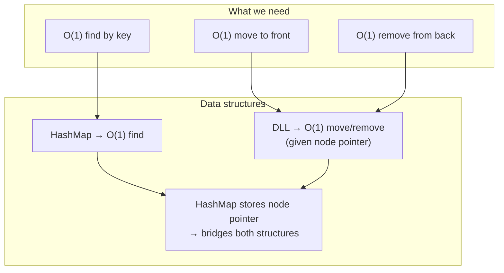

---

## 6. The Optimal Solution: HashMap + DLL

### Structure Visualization

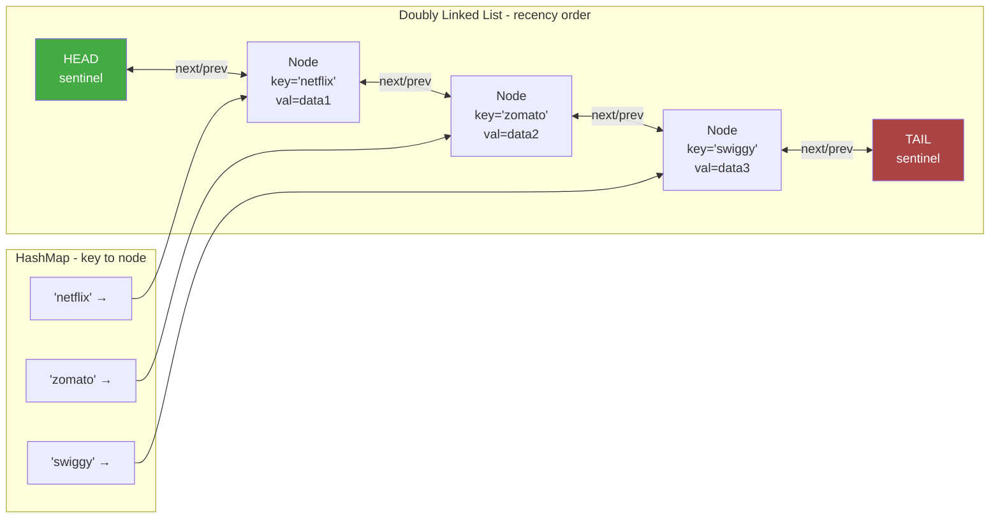

**Key design decisions:**

1. **HEAD sentinel** = dummy node on the MRU (most recently used) side. `HEAD.next` = the most recently used real node.
2. **TAIL sentinel** = dummy node on the LRU side. `TAIL.prev` = the least recently used real node (the one to evict).
3. **Sentinels are dummy nodes** — they never hold real data. Their purpose is to eliminate null-pointer edge cases. The list is never truly "empty" — HEAD and TAIL always exist and point to each other when the cache is empty.

### Step-by-Step Walkthrough

Let's build a cache with capacity = 3 and trace every operation:

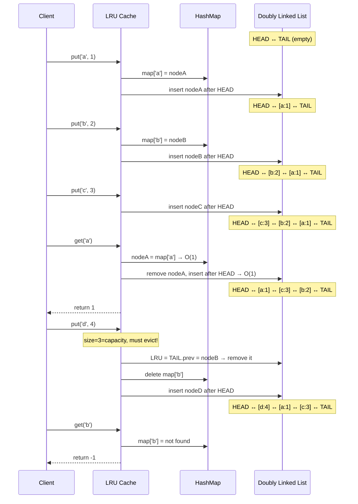

### The Three Core Private Methods

Everything in LRU cache boils down to these three operations on the DLL:

```
addToHead(node):   Insert node right after HEAD sentinel
removeNode(node):  Detach node from wherever it is (using node.prev and node.next)
removeTail():      Remove the node just before TAIL sentinel (the LRU), return it
```

**Why these three are O(1):**

`removeNode(node)`: We have `node.prev` and `node.next` directly. We just re-wire the pointers:
```
node.prev.next = node.next
node.next.prev = node.prev
```
No scanning. Pure pointer manipulation.

`addToHead(node)`: We have `HEAD` (always accessible), `HEAD.next` is the current first node. Four pointer updates.

`removeTail()`: We have `TAIL.prev` directly (the LRU node). Call `removeNode` on it.

---

## 7. Class Design (LLD)

```mermaid
classDiagram
    class Node {
        +int key
        +int value
        +Node prev
        +Node next
        +Node(key, value)
    }

    class LRUCache {
        -int capacity
        -Map~int,Node~ cache
        -Node head
        -Node tail
        +LRUCache(capacity)
        +get(key) int
        +put(key, value) void
        -addToHead(node) void
        -removeNode(node) void
        -removeTail() Node
        -moveToHead(node) void
    }

    LRUCache --> Node : uses
    LRUCache --> "HashMap" : contains
```

**Design decisions in the LLD:**

| Decision | Choice | Why |
|----------|--------|-----|
| Node stores key | Yes | When we evict the tail, we need the key to delete from HashMap |
| Sentinel nodes | Yes | Eliminates null checks for empty list edge cases |
| Generic vs int | int for interviews | Simpler; use generics for production code |
| Thread safety | Separate concern | Add synchronization wrapper as needed |

**The "why does Node store the key" insight is a common interview trap.** When you remove the tail node (LRU eviction), you have the node object. But to delete from the HashMap, you need the key. If the node doesn't store the key, you can't do this eviction in O(1).

---

## 8. Java Implementation

### Node Class

```java
class Node {
    int key;
    int val;
    Node prev;
    Node next;

    Node(int key, int val) {
        this.key = key;
        this.val = val;
    }
}
```

### LRU Cache Class

```java
import java.util.HashMap;

class LRUCache {

    private final int capacity;
    private final HashMap<Integer, Node> cache;

    // Sentinel nodes — never hold real data
    // HEAD.next = Most Recently Used
    // TAIL.prev = Least Recently Used (evict from here)
    private final Node head;
    private final Node tail;

    public LRUCache(int capacity) {
        this.capacity = capacity;
        this.cache = new HashMap<>();

        // Initialize sentinels
        head = new Node(0, 0);
        tail = new Node(0, 0);
        head.next = tail;
        tail.prev = head;
    }

    // ──────────── Private DLL Helpers ────────────

    // Remove a node from its current position in the DLL
    private void removeNode(Node node) {
        node.prev.next = node.next;
        node.next.prev = node.prev;
        // Clean up dangling pointers (good practice)
        node.prev = null;
        node.next = null;
    }

    // Insert a node right after HEAD (= mark as Most Recently Used)
    private void addToHead(Node node) {
        node.next = head.next;
        node.prev = head;
        head.next.prev = node;
        head.next = node;
    }

    // Combined: remove from current position, insert at head
    private void moveToHead(Node node) {
        removeNode(node);
        addToHead(node);
    }

    // Remove the node just before TAIL (= evict the LRU item)
    // Returns the removed node so we can get its key for HashMap deletion
    private Node removeTail() {
        Node lruNode = tail.prev;
        removeNode(lruNode);
        return lruNode;
    }

    // ──────────── Public API ────────────

    public int get(int key) {
        Node node = cache.get(key);

        if (node == null) {
            return -1; // Cache miss
        }

        // Cache hit — mark as most recently used
        moveToHead(node);
        return node.val;
    }

    public void put(int key, int value) {
        Node existingNode = cache.get(key);

        if (existingNode != null) {
            // Key exists — update value and refresh recency
            existingNode.val = value;
            moveToHead(existingNode);
            return;
        }

        // New key — create and insert
        Node newNode = new Node(key, value);
        cache.put(key, newNode);
        addToHead(newNode);

        // Evict LRU if over capacity
        if (cache.size() > capacity) {
            Node evicted = removeTail();
            cache.remove(evicted.key); // This is why Node stores key!
        }
    }

    // ──────────── Debug Utility ────────────

    // Print cache state from MRU to LRU
    public void printState() {
        StringBuilder sb = new StringBuilder("MRU → ");
        Node current = head.next;
        while (current != tail) {
            sb.append("[").append(current.key).append(":").append(current.val).append("] → ");
            current = current.next;
        }
        sb.append("LRU");
        System.out.println(sb.toString());
        System.out.println("HashMap size: " + cache.size());
    }
}
```

### Java Test Cases

```java
public class LRUCacheTest {

    public static void main(String[] args) {
        test1_LeetCodeExample();
        test2_UpdateRefreshesRecency();
        test3_CapacityOne();
        test4_DuplicatePut();
        test5_GetThenEvict();
        System.out.println("All tests passed!");
    }

    // Test 1: Classic LeetCode #146 example
    static void test1_LeetCodeExample() {
        LRUCache cache = new LRUCache(2);
        cache.put(1, 1);
        cache.put(2, 2);
        assert cache.get(1) == 1 : "get(1) should return 1";
        cache.put(3, 3);           // evicts key 2 (LRU after get(1) moved 1 to front)
        assert cache.get(2) == -1 : "get(2) should return -1 (evicted)";
        cache.put(4, 4);           // evicts key 1
        assert cache.get(1) == -1 : "get(1) should return -1 (evicted)";
        assert cache.get(3) == 3  : "get(3) should return 3";
        assert cache.get(4) == 4  : "get(4) should return 4";
        System.out.println("Test 1 PASSED");
    }

    // Test 2: Updating a key refreshes its recency (should NOT be evicted)
    static void test2_UpdateRefreshesRecency() {
        LRUCache cache = new LRUCache(2);
        cache.put(1, 10);
        cache.put(2, 20);
        cache.put(1, 100); // Update key 1 — moves it to MRU, so key 2 becomes LRU
        cache.put(3, 30);  // Evicts key 2 (LRU), NOT key 1
        assert cache.get(1) == 100 : "key 1 should still be present with updated value";
        assert cache.get(2) == -1  : "key 2 should be evicted";
        assert cache.get(3) == 30  : "key 3 should be present";
        System.out.println("Test 2 PASSED");
    }

    // Test 3: Capacity of 1 — every new key evicts previous
    static void test3_CapacityOne() {
        LRUCache cache = new LRUCache(1);
        cache.put(1, 1);
        cache.put(2, 2);
        assert cache.get(1) == -1 : "key 1 should be evicted (capacity=1)";
        assert cache.get(2) == 2  : "key 2 should be present";
        System.out.println("Test 3 PASSED");
    }

    // Test 4: Putting same key twice — no eviction, just update
    static void test4_DuplicatePut() {
        LRUCache cache = new LRUCache(2);
        cache.put(1, 1);
        cache.put(1, 100); // Same key — update, no eviction
        cache.put(2, 2);
        assert cache.get(1) == 100 : "key 1 should have updated value 100";
        assert cache.get(2) == 2   : "key 2 should be present";
        System.out.println("Test 4 PASSED");
    }

    // Test 5: Accessing an item saves it from eviction
    static void test5_GetThenEvict() {
        LRUCache cache = new LRUCache(3);
        cache.put(1, 1);
        cache.put(2, 2);
        cache.put(3, 3);
        // Order: MRU [3, 2, 1] LRU
        cache.get(1);
        // Order: MRU [1, 3, 2] LRU — key 2 is now LRU
        cache.put(4, 4); // Evicts key 2
        assert cache.get(2) == -1 : "key 2 should be evicted";
        assert cache.get(1) == 1  : "key 1 survived (was accessed)";
        assert cache.get(3) == 3  : "key 3 survived";
        assert cache.get(4) == 4  : "key 4 was added";
        System.out.println("Test 5 PASSED");
    }
}
```

---

## 9. Python Implementation

Python's `OrderedDict` can implement LRU in ~10 lines (we'll show that too), but first the canonical from-scratch implementation — because that's what interviews test.

### Full From-Scratch Python

```python
class Node:
    """A doubly linked list node."""
    def __init__(self, key: int, val: int):
        self.key = key
        self.val = val
        self.prev: 'Node | None' = None
        self.next: 'Node | None' = None


class LRUCache:
    """
    LRU Cache using HashMap + Doubly Linked List.
    
    DLL Layout:
        HEAD.next = Most Recently Used (MRU)
        TAIL.prev = Least Recently Used (LRU) — evict from here
    
    Time:  get O(1), put O(1)
    Space: O(capacity)
    """

    def __init__(self, capacity: int):
        if capacity < 1:
            raise ValueError("Capacity must be >= 1")

        self.capacity = capacity
        self.cache: dict[int, Node] = {}

        # Sentinel nodes — simplify edge cases (never truly empty)
        self.head = Node(0, 0)  # dummy MRU sentinel
        self.tail = Node(0, 0)  # dummy LRU sentinel
        self.head.next = self.tail
        self.tail.prev = self.head

    # ──────────── Private DLL Helpers ────────────

    def _remove_node(self, node: Node) -> None:
        """Detach node from its current position in the DLL."""
        node.prev.next = node.next  # type: ignore[union-attr]
        node.next.prev = node.prev  # type: ignore[union-attr]
        node.prev = None
        node.next = None

    def _add_to_head(self, node: Node) -> None:
        """Insert node right after HEAD sentinel (= mark as MRU)."""
        node.next = self.head.next
        node.prev = self.head
        self.head.next.prev = node   # type: ignore[union-attr]
        self.head.next = node

    def _move_to_head(self, node: Node) -> None:
        """Remove from current position, re-insert at head."""
        self._remove_node(node)
        self._add_to_head(node)

    def _remove_tail(self) -> Node:
        """Remove and return the LRU node (just before TAIL)."""
        lru_node = self.tail.prev  # type: ignore[assignment]
        self._remove_node(lru_node)
        return lru_node

    # ──────────── Public API ────────────

    def get(self, key: int) -> int:
        """Return value if key exists (and mark as MRU), else -1."""
        node = self.cache.get(key)

        if node is None:
            return -1  # Cache miss

        # Cache hit — refresh recency
        self._move_to_head(node)
        return node.val

    def put(self, key: int, value: int) -> None:
        """Insert/update key. Evict LRU if over capacity."""
        existing = self.cache.get(key)

        if existing is not None:
            # Key exists — update and refresh
            existing.val = value
            self._move_to_head(existing)
            return

        # New key
        new_node = Node(key, value)
        self.cache[key] = new_node
        self._add_to_head(new_node)

        # Evict if over capacity
        if len(self.cache) > self.capacity:
            evicted = self._remove_tail()
            del self.cache[evicted.key]  # This is why Node stores key!

    # ──────────── Debug Utility ────────────

    def get_order(self) -> list[int]:
        """Returns keys from MRU to LRU order."""
        order = []
        current = self.head.next
        while current is not self.tail:
            order.append(current.key)  # type: ignore[union-attr]
            current = current.next     # type: ignore[union-attr]
        return order

    def __repr__(self) -> str:
        return f"LRUCache(capacity={self.capacity}, order={self.get_order()})"
```

### Python OrderedDict Shortcut (Bonus)

```python
from collections import OrderedDict

class LRUCacheShortcut:
    """
    LRU Cache using Python's built-in OrderedDict.
    OrderedDict maintains insertion order AND supports move_to_end().
    This is NOT the answer interviewers want — implement from scratch!
    But useful for production code where you want simplicity.
    """

    def __init__(self, capacity: int):
        self.capacity = capacity
        self.cache: OrderedDict[int, int] = OrderedDict()

    def get(self, key: int) -> int:
        if key not in self.cache:
            return -1
        # Move to end = mark as most recently used
        self.cache.move_to_end(key)
        return self.cache[key]

    def put(self, key: int, value: int) -> None:
        if key in self.cache:
            self.cache.move_to_end(key)
        self.cache[key] = value
        if len(self.cache) > self.capacity:
            # popitem(last=False) removes from the front = LRU
            self.cache.popitem(last=False)
```

### Python Test Cases

```python
def run_tests():
    # ── Test 1: LeetCode #146 ──────────────────────────────────
    cache = LRUCache(2)
    cache.put(1, 1)
    cache.put(2, 2)
    assert cache.get(1) == 1,   "get(1) should be 1"
    cache.put(3, 3)              # evicts key 2
    assert cache.get(2) == -1,  "key 2 should be evicted"
    cache.put(4, 4)              # evicts key 1
    assert cache.get(1) == -1,  "key 1 should be evicted"
    assert cache.get(3) == 3,   "key 3 should exist"
    assert cache.get(4) == 4,   "key 4 should exist"
    print("Test 1 PASSED — Basic LeetCode example")

    # ── Test 2: Update refreshes recency ──────────────────────
    cache = LRUCache(2)
    cache.put(1, 10)
    cache.put(2, 20)
    cache.put(1, 100)  # update, moves 1 to MRU, key 2 becomes LRU
    cache.put(3, 30)   # evicts key 2 (LRU), NOT key 1
    assert cache.get(1) == 100, "key 1 should have value 100"
    assert cache.get(2) == -1,  "key 2 should be evicted"
    assert cache.get(3) == 30,  "key 3 should exist"
    print("Test 2 PASSED — Update refreshes recency")

    # ── Test 3: Order verification ──────────────────────────────
    cache = LRUCache(3)
    cache.put('a', 1)
    cache.put('b', 2)
    cache.put('c', 3)
    assert cache.get_order() == ['c', 'b', 'a'], "Order should be c,b,a"
    cache.get('a')               # 'a' moves to MRU
    assert cache.get_order() == ['a', 'c', 'b'], "Order should be a,c,b after get(a)"
    cache.put('d', 4)            # evicts 'b' (LRU)
    assert cache.get_order() == ['d', 'a', 'c'], "Order should be d,a,c"
    assert cache.get('b') == -1, "key 'b' should be evicted"
    print("Test 3 PASSED — Order verification")

    # ── Test 4: Capacity 1 ──────────────────────────────────────
    cache = LRUCache(1)
    cache.put(1, 1)
    cache.put(2, 2)  # evicts key 1
    assert cache.get(1) == -1, "key 1 evicted"
    assert cache.get(2) == 2,  "key 2 present"
    print("Test 4 PASSED — Capacity 1 edge case")

    # ── Test 5: Get on same key doesn't cause self-eviction ────
    cache = LRUCache(2)
    cache.put(1, 1)
    cache.put(2, 2)
    cache.get(2)
    cache.get(2)
    cache.get(2)     # key 2 is MRU, key 1 is LRU
    cache.put(3, 3)  # evicts key 1, NOT key 2
    assert cache.get(2) == 2,  "key 2 should not be evicted"
    assert cache.get(1) == -1, "key 1 should be evicted"
    print("Test 5 PASSED — Repeated get doesn't cause self-eviction")

    print("\nAll 5 tests PASSED!")

run_tests()
```

**Expected output:**
```
Test 1 PASSED — Basic LeetCode example
Test 2 PASSED — Update refreshes recency
Test 3 PASSED — Order verification
Test 4 PASSED — Capacity 1 edge case
Test 5 PASSED — Repeated get doesn't cause self-eviction

All 5 tests PASSED!
```

---

## 10. TypeScript Implementation

```typescript
// Generic DLL Node — works with any key/value type
class DLLNode<K, V> {
  key: K;
  value: V;
  prev: DLLNode<K, V> | null = null;
  next: DLLNode<K, V> | null = null;

  constructor(key: K, value: V) {
    this.key = key;
    this.value = value;
  }
}

class LRUCache<K, V> {
  private capacity: number;
  private cache: Map<K, DLLNode<K, V>>;
  private head: DLLNode<K, V>; // MRU sentinel
  private tail: DLLNode<K, V>; // LRU sentinel

  constructor(capacity: number) {
    if (capacity < 1) throw new Error("Capacity must be >= 1");

    this.capacity = capacity;
    this.cache = new Map();

    this.head = new DLLNode<K, V>(null as any, null as any);
    this.tail = new DLLNode<K, V>(null as any, null as any);
    this.head.next = this.tail;
    this.tail.prev = this.head;
  }

  private removeNode(node: DLLNode<K, V>): void {
    node.prev!.next = node.next;
    node.next!.prev = node.prev;
    node.prev = null;
    node.next = null;
  }

  private addToHead(node: DLLNode<K, V>): void {
    const first = this.head.next!;
    this.head.next = node;
    node.prev = this.head;
    node.next = first;
    first.prev = node;
  }

  private moveToHead(node: DLLNode<K, V>): void {
    this.removeNode(node);
    this.addToHead(node);
  }

  private removeTail(): DLLNode<K, V> {
    const lru = this.tail.prev!;
    this.removeNode(lru);
    return lru;
  }

  get(key: K): V | -1 {
    const node = this.cache.get(key);
    if (!node) return -1;
    this.moveToHead(node);
    return node.value;
  }

  put(key: K, value: V): void {
    const existing = this.cache.get(key);
    if (existing) {
      existing.value = value;
      this.moveToHead(existing);
      return;
    }

    const newNode = new DLLNode(key, value);
    this.cache.set(key, newNode);
    this.addToHead(newNode);

    if (this.cache.size > this.capacity) {
      const evicted = this.removeTail();
      this.cache.delete(evicted.key);
    }
  }

  getOrder(): K[] {
    const order: K[] = [];
    let cur = this.head.next;
    while (cur !== this.tail) {
      order.push(cur!.key);
      cur = cur!.next;
    }
    return order;
  }
}
```

---

## 11. Thread Safety

### Why Thread Safety Matters

Zomato's backend handles thousands of concurrent requests. If two threads simultaneously call `put` on the same LRU cache, they might both check the size, both decide to evict, and corrupt the DLL's pointer structure. This leads to data loss or infinite loops.

### The Problem: Race Condition in DLL

```
Thread 1: removeNode(nodeA) — sets nodeA.prev.next = nodeA.next
Thread 2: addToHead(nodeA)  — reads nodeA.next (which is being modified!)
Result: Corrupted DLL — infinite loop or NullPointerException
```

### Solution 1: Synchronized (Simplest, Java)

```java
import java.util.concurrent.locks.ReentrantReadWriteLock;

class ThreadSafeLRUCache {
    private final LRUCache cache;
    private final ReentrantReadWriteLock lock = new ReentrantReadWriteLock();

    public ThreadSafeLRUCache(int capacity) {
        this.cache = new LRUCache(capacity);
    }

    public int get(int key) {
        // get modifies DLL (moves to head) so needs write lock
        lock.writeLock().lock();
        try {
            return cache.get(key);
        } finally {
            lock.writeLock().unlock();
        }
    }

    public void put(int key, int value) {
        lock.writeLock().lock();
        try {
            cache.put(key, value);
        } finally {
            lock.writeLock().unlock();
        }
    }
}
```

**Note:** Even `get` needs a write lock because it modifies the DLL (moves node to head). This is a common interview misconception — read operations on LRU cache are not truly read-only.

### Solution 2: Striped Locking (High-Throughput)

For very high concurrency (like Swiggy's delivery status cache), a single lock becomes a bottleneck. Use **striped locking**: divide keyspace into N buckets, each with its own LRU and lock.

```java
class StripedLRUCache {
    private final int numStripes;
    private final LRUCache[] caches;
    private final ReentrantLock[] locks;

    public StripedLRUCache(int totalCapacity, int numStripes) {
        this.numStripes = numStripes;
        this.caches = new LRUCache[numStripes];
        this.locks  = new ReentrantLock[numStripes];

        int capacityPerStripe = totalCapacity / numStripes;
        for (int i = 0; i < numStripes; i++) {
            caches[i] = new LRUCache(capacityPerStripe);
            locks[i]  = new ReentrantLock();
        }
    }

    private int stripe(int key) {
        return Math.abs(key % numStripes);
    }

    public int get(int key) {
        int s = stripe(key);
        locks[s].lock();
        try {
            return caches[s].get(key);
        } finally {
            locks[s].unlock();
        }
    }

    public void put(int key, int value) {
        int s = stripe(key);
        locks[s].lock();
        try {
            caches[s].put(key, value);
        } finally {
            locks[s].unlock();
        }
    }
}
```

With 16 stripes, contention drops by ~16x vs a single lock.

### Solution 3: Java's Built-In (Production)

```java
// Guava's CacheBuilder — battle-tested, handles all edge cases
import com.google.common.cache.CacheBuilder;
import com.google.common.cache.CacheLoader;
import com.google.common.cache.LoadingCache;

LoadingCache<String, String> cache = CacheBuilder.newBuilder()
    .maximumSize(1000)                        // LRU eviction at 1000 entries
    .expireAfterAccess(10, TimeUnit.MINUTES)  // TTL: evict if not accessed in 10 min
    .concurrencyLevel(16)                     // striped locking internally
    .recordStats()                            // track hit rate
    .build(CacheLoader.from(key -> loadFromDatabase(key)));
```

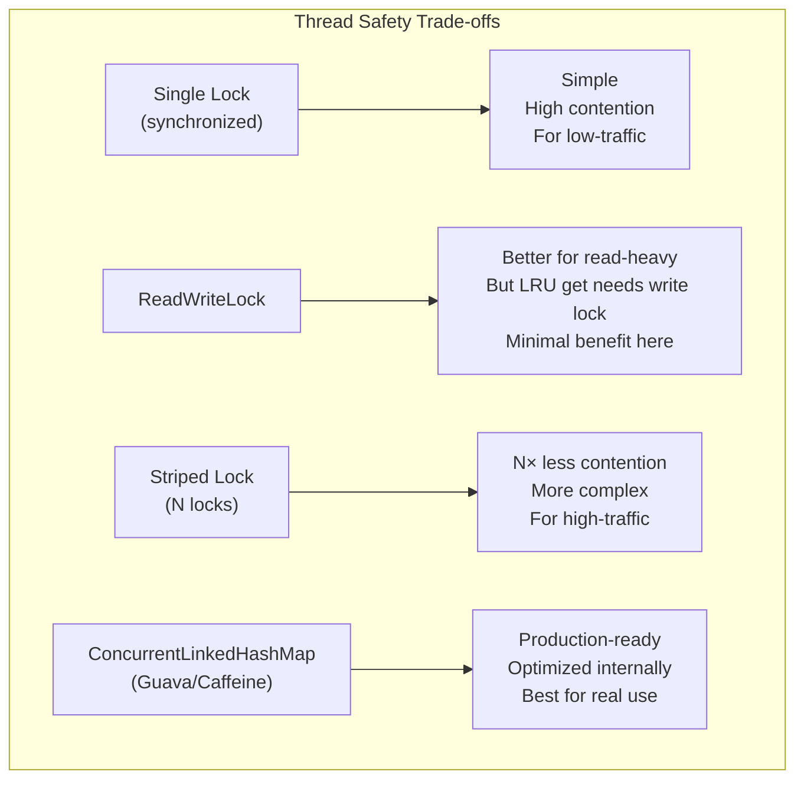

---

## 12. LFU Cache — The Upgrade

### What is LFU?

**Analogy:** Think of a Spotify playlist ranked by play count. The song you've played 500 times is clearly your favorite. The one you played once? Maybe you hated it. LFU evicts the least-played (least-accessed) item, not the least-recently-accessed.

**LRU vs LFU — when they differ:**

| Time | Action | LRU Cache (cap=2) | LFU Cache (cap=2) |
|------|--------|-------------------|-------------------|
| t=1 | put(A, 1) | {A:freq=1} | {A:freq=1} |
| t=2 | put(B, 1) | {A, B} | {A:freq=1, B:freq=1} |
| t=3 | get(A) × 5 | A moves to MRU | A: freq=6 |
| t=4 | put(C, 1) | **Evicts B** (LRU) | **Evicts B** (freq=1, same as A's initial but A's freq is now 6) |

But in this case:
| Time | Action | LRU Cache (cap=2) | LFU Cache (cap=2) |
|------|--------|-------------------|-------------------|
| t=1 | put(A, 1) | {A} | {A:freq=1} |
| t=2 | put(B, 1) | {A, B} | {A:freq=1, B:freq=1} |
| t=3 | get(B) × 3 | B is MRU, A is LRU | B:freq=4, A:freq=1 |
| t=4 | get(A) once | A is MRU, B is LRU | A:freq=2, B:freq=4 |
| t=5 | put(C, 1) | **Evicts B** (LRU) | **Evicts A** (freq=2 < B:freq=4) |

LFU and LRU give opposite answers here. LFU is smarter when frequency patterns matter.

### LFU Data Structures

LFU needs O(1) get and put, which is harder than LRU. The trick uses:

1. `key_to_val` — HashMap: `key → value`
2. `key_to_freq` — HashMap: `key → frequency count`
3. `freq_to_keys` — HashMap: `frequency → DLL of nodes at that frequency` (DLL maintains LRU order within same frequency for tiebreaking)
4. `min_freq` — integer tracking the current minimum frequency (for O(1) eviction)

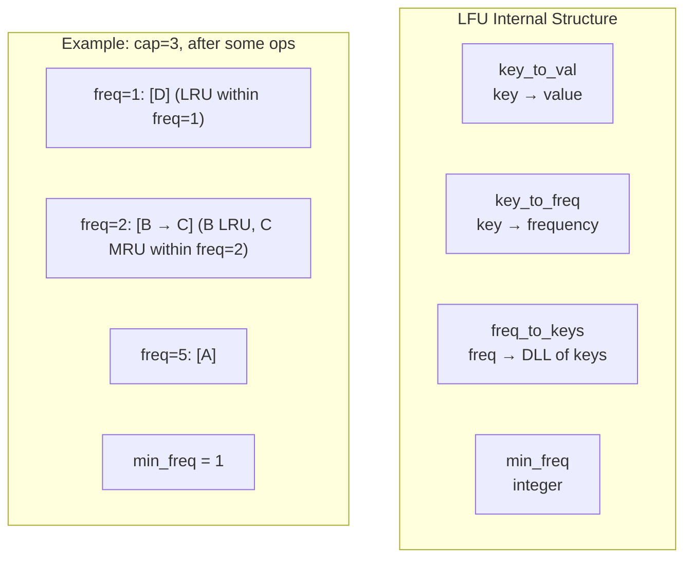

### Full LFU Java Implementation

```java
import java.util.*;

class LFUCache {

    private final int capacity;
    private int minFreq;
    private final Map<Integer, Integer> keyToVal;
    private final Map<Integer, Integer> keyToFreq;
    // freq → DLL of keys (LinkedHashSet preserves insertion order for LRU tiebreak)
    private final Map<Integer, LinkedHashSet<Integer>> freqToKeys;

    public LFUCache(int capacity) {
        this.capacity = capacity;
        this.minFreq = 0;
        this.keyToVal = new HashMap<>();
        this.keyToFreq = new HashMap<>();
        this.freqToKeys = new HashMap<>();
    }

    public int get(int key) {
        if (!keyToVal.containsKey(key)) return -1;
        increaseFreq(key);
        return keyToVal.get(key);
    }

    public void put(int key, int value) {
        if (capacity <= 0) return;

        if (keyToVal.containsKey(key)) {
            keyToVal.put(key, value);
            increaseFreq(key);
            return;
        }

        if (keyToVal.size() >= capacity) {
            removeMinFreqKey();
        }

        keyToVal.put(key, value);
        keyToFreq.put(key, 1);
        freqToKeys.computeIfAbsent(1, k -> new LinkedHashSet<>()).add(key);
        minFreq = 1;
    }

    private void increaseFreq(int key) {
        int freq = keyToFreq.get(key);
        keyToFreq.put(key, freq + 1);

        // Remove from old freq bucket
        LinkedHashSet<Integer> oldBucket = freqToKeys.get(freq);
        oldBucket.remove(key);
        if (oldBucket.isEmpty()) {
            freqToKeys.remove(freq);
            if (minFreq == freq) minFreq = freq + 1;
        }

        // Add to new freq bucket
        freqToKeys.computeIfAbsent(freq + 1, k -> new LinkedHashSet<>()).add(key);
    }

    private void removeMinFreqKey() {
        LinkedHashSet<Integer> minBucket = freqToKeys.get(minFreq);
        // Iterator order = insertion order = LRU within same frequency
        int evictKey = minBucket.iterator().next();
        minBucket.remove(evictKey);
        if (minBucket.isEmpty()) freqToKeys.remove(minFreq);
        keyToVal.remove(evictKey);
        keyToFreq.remove(evictKey);
    }
}
```

### Full LFU Python Implementation

```python
from collections import defaultdict

class LFUNode:
    """Node for LFU's internal DLL."""
    def __init__(self, key: int, val: int):
        self.key = key
        self.val = val
        self.freq = 1
        self.prev: 'LFUNode | None' = None
        self.next: 'LFUNode | None' = None


class FreqList:
    """DLL of nodes at a specific frequency, with sentinel head/tail."""
    def __init__(self):
        self.head = LFUNode(0, 0)
        self.tail = LFUNode(0, 0)
        self.head.next = self.tail
        self.tail.prev = self.head
        self.size = 0

    def add_to_head(self, node: LFUNode):
        node.next = self.head.next
        node.prev = self.head
        self.head.next.prev = node
        self.head.next = node
        self.size += 1

    def remove_node(self, node: LFUNode):
        node.prev.next = node.next
        node.next.prev = node.prev
        node.prev = None
        node.next = None
        self.size -= 1

    def remove_tail(self) -> LFUNode:
        """Remove and return LRU node within this frequency."""
        lru = self.tail.prev
        self.remove_node(lru)
        return lru

    def is_empty(self) -> bool:
        return self.size == 0


class LFUCache:
    """
    O(1) LFU Cache using HashMap + per-frequency DLL.
    """

    def __init__(self, capacity: int):
        self.capacity = capacity
        self.min_freq = 0
        self.key_to_node: dict[int, LFUNode] = {}
        self.freq_to_list: dict[int, FreqList] = defaultdict(FreqList)

    def _update_freq(self, node: LFUNode):
        """Bump node's frequency, move it to new freq bucket."""
        old_freq = node.freq
        self.freq_to_list[old_freq].remove_node(node)
        if self.freq_to_list[old_freq].is_empty():
            del self.freq_to_list[old_freq]
            if self.min_freq == old_freq:
                self.min_freq += 1

        node.freq += 1
        self.freq_to_list[node.freq].add_to_head(node)

    def get(self, key: int) -> int:
        if key not in self.key_to_node:
            return -1
        node = self.key_to_node[key]
        self._update_freq(node)
        return node.val

    def put(self, key: int, value: int) -> None:
        if self.capacity <= 0:
            return

        if key in self.key_to_node:
            node = self.key_to_node[key]
            node.val = value
            self._update_freq(node)
            return

        # Evict if full
        if len(self.key_to_node) >= self.capacity:
            lru_list = self.freq_to_list[self.min_freq]
            evicted = lru_list.remove_tail()
            if lru_list.is_empty():
                del self.freq_to_list[self.min_freq]
            del self.key_to_node[evicted.key]

        # Insert new node
        node = LFUNode(key, value)
        self.key_to_node[key] = node
        self.freq_to_list[1].add_to_head(node)
        self.min_freq = 1
```

### LRU vs LFU Summary

| Aspect | LRU | LFU |
|--------|-----|-----|
| Eviction policy | Least recently accessed | Least frequently accessed |
| Data structure | HashMap + 1 DLL | HashMap + multiple DLLs + minFreq |
| Implementation complexity | Medium | Hard |
| Best for | Temporal locality (recent = relevant) | Frequency-skewed access (Spotify, Netflix) |
| Weakness | Cache pollution from one-time scans | New items start at freq=1, evicted immediately |
| Real system use | Redis allkeys-lru, browser cache | Redis allkeys-lfu, content streaming |
| O(1) get/put | Yes | Yes (with careful design) |

---

## 13. LRU in Real Systems

### 13.1 Redis — Approximated LRU

Maintaining a true DLL over millions of Redis keys is expensive (16+ bytes per key for pointers = 160MB overhead for 10M keys, plus DLL contention on every read).

**Redis's brilliant hack — Random Sampling:**

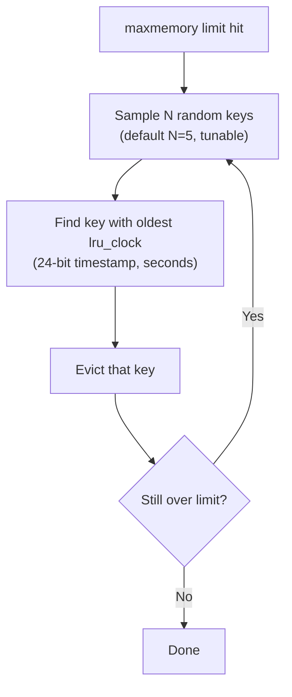

Each Redis key has a 24-bit `lru_clock` (seconds since last access). Sampling 5 random keys and evicting the oldest is statistically close to true LRU.

```
maxmemory-samples 5   # default — good approximation
maxmemory-samples 10  # near-perfect LRU, ~2× more CPU
```

**Redis eviction policies:**

| Policy | Description | When to use |
|--------|-------------|-------------|
| `noeviction` | Error when full | When data loss is unacceptable |
| `allkeys-lru` | LRU across all keys | General purpose cache |
| `volatile-lru` | LRU only among keys with TTL | Mixed persistent + cache data |
| `allkeys-lfu` | LFU across all keys (Redis 4.0+) | Frequency-skewed workloads |
| `volatile-lfu` | LFU among keys with TTL | Smart mixed workload |
| `allkeys-random` | Random eviction | When all keys are equally likely |
| `volatile-ttl` | Evict key closest to expiry | TTL-heavy workloads |
| `volatile-random` | Random among TTL keys | Simple mixed workload |

**Instagram uses Redis with `allkeys-lru`** for its API response cache — caching user profiles, feed data, and story metadata. When cache is full, the least-recently-requested data goes first.

### 13.2 CPU Cache — Hardware LRU

Your CPU's L1 cache (~32KB), L2 (~256KB), and L3 (~8MB) use LRU (or pseudo-LRU) implemented in silicon.

```
Memory hierarchy:
Register: 0.5 ns    (a handful of values)
L1 cache: 1 ns      (32KB)
L2 cache: 5 ns      (256KB)
L3 cache: 20 ns     (8MB)
RAM:      100 ns    (16-64GB)
SSD:      100 μs    (1TB)
HDD:      10 ms     (4TB)
```

A cache miss from L1 to RAM is a 100× slowdown. LRU in hardware ensures your most-used variables/code are always hot in L1.

### 13.3 Database Buffer Pool — Enhanced LRU

MySQL InnoDB and PostgreSQL's shared buffer cache use LRU variants that protect against **scan pollution** (reading a 100GB table sequentially would evict all hot data from cache).

**InnoDB's two-zone LRU:**

```
Buffer Pool:
[████████████████████] [████████████]
  Hot zone (5/8)          Cold zone (3/8)

New pages enter COLD zone (not hot!)
Pages survive to HOT zone only if accessed AGAIN within 1 second
Sequential scans stay in cold zone → don't pollute hot zone
```

This is called **LRU-K** (or the "midpoint insertion strategy"). InnoDB uses k=2.

### 13.4 CDN Edge Caches — Geographically Distributed LRU

When you watch a Netflix video in Mumbai, you're actually streaming from a CDN edge server in Mumbai, not from Netflix's US data centers. That edge server has ~500GB of SSD cache.

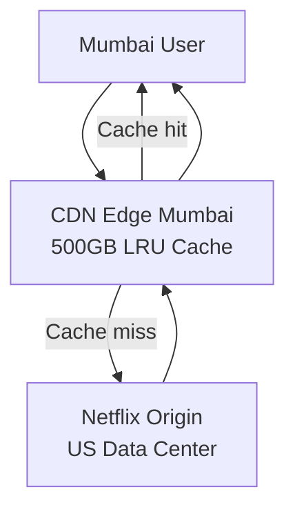

Popular content in Mumbai (Bollywood films) stays cached. Obscure content from 5 years ago gets evicted. Each geographic region has different LRU state.

**YouTube** uses a similar architecture. The ~20% of videos that get ~80% of views are always cached. The long tail of rarely-viewed videos are fetched from origin.

### 13.5 Browser Cache

Every browser maintains an HTTP cache (Chrome's is in `%AppData%\Chrome\Default\Cache`):

```
chrome://cache  ← see your cache in Chrome
```

When you visit `zomato.com`, static assets (logo, JS bundles, CSS) are cached with `Cache-Control: max-age=31536000`. Next visit, those files load from local disk (~1ms) instead of network (~100ms). When cache size limit is hit, LRU eviction kicks in.

### 13.6 Operating System Page Cache

Linux uses LRU to manage which disk pages are in RAM. When you run `cat /proc/meminfo`, you see `Cached` and `Buffers` — that's your OS page cache. Files you read recently stay in memory. Files you haven't touched in hours get evicted when RAM is needed by new processes.

---

## 14. Eviction Policy Comparisons

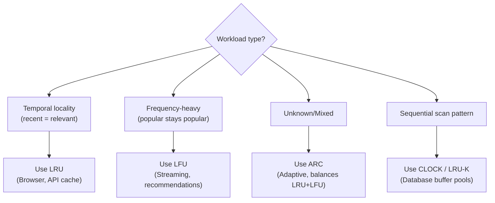

| Policy | Hit Rate | Impl Complexity | Weakness | Real Use |
|--------|----------|-----------------|----------|----------|
| LRU | High | Medium | Scan pollution | Redis, browsers, CDN |
| LFU | Highest | Hard | New items evicted immediately | Streaming, recommendations |
| FIFO | Low | Easy | Ignores access patterns | Simple systems |
| Random | Medium | Trivial | Unpredictable | Redis approximated LRU |
| LRU-K | Very High | Hard | Complex tuning | PostgreSQL, InnoDB |
| ARC (Adaptive) | Very High | Hard | Higher memory overhead | ZFS, IBM storage |
| CLOCK | High | Medium | Approximation only | OS page replacement |
| SLRU (Segmented) | High | Medium | Tuning required | General caching |

**ARC (Adaptive Replacement Cache):** Maintains two LRU lists — one for recently accessed items, one for frequently accessed items. Automatically balances between them based on workload. Used in ZFS filesystem and IBM storage arrays.

**CLOCK algorithm:** Approximation of LRU used in OS page replacement. Each page has a "use bit." On eviction, scan clock-hand style; if use bit=1, clear it and advance; if use bit=0, evict. Avoids the overhead of maintaining a DLL.

---

## 15. System Design Extensions

### 15.1 LRU + TTL (Expiry)

Real caches combine LRU eviction with TTL (time-to-live). A node is evicted either because it is the LRU OR because its TTL has expired — whichever comes first.

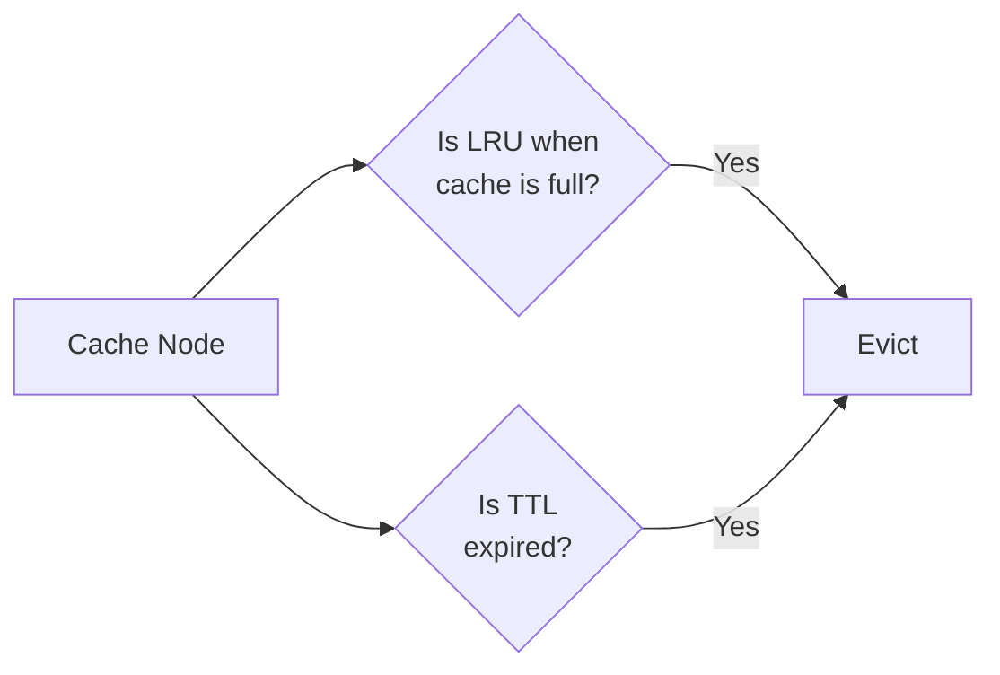

```python
import time

class LRUCacheWithTTL:
    def __init__(self, capacity: int, default_ttl_secs: float = 300.0):
        self.capacity = capacity
        self.default_ttl = default_ttl_secs
        self.cache: dict[int, tuple] = {}  # key → (node, expiry_time)
        # Same DLL structure as before
        self.head = Node(0, 0)
        self.tail = Node(0, 0)
        self.head.next = self.tail
        self.tail.prev = self.head

    def get(self, key: int) -> int:
        if key not in self.cache:
            return -1

        node, expiry = self.cache[key]

        # TTL check
        if time.time() > expiry:
            # Expired — evict lazily
            self._remove_node(node)
            del self.cache[key]
            return -1

        self._move_to_head(node)
        return node.val

    def put(self, key: int, value: int, ttl_secs: float = None) -> None:
        ttl = ttl_secs if ttl_secs is not None else self.default_ttl
        expiry = time.time() + ttl
        # ... rest of LRU put logic, store expiry in cache dict ...
```

### 15.2 Distributed LRU

For a system like WhatsApp (2 billion users), a single LRU cache node is insufficient. Use **consistent hashing** to distribute keys across nodes.

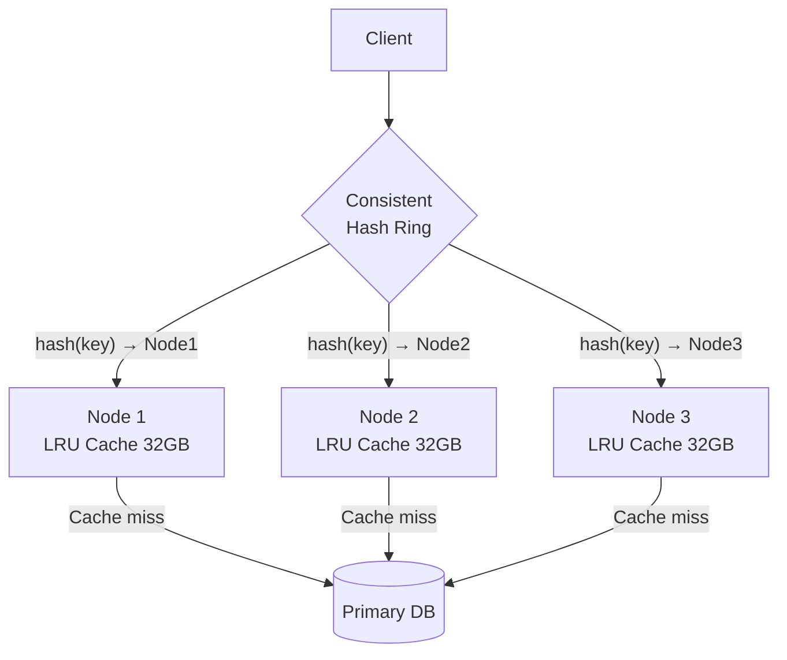

Each node has its own LRU — eviction is per-node, not globally coordinated. This is exactly how **Redis Cluster** works.

### 15.3 Write Policies: Write-Through vs Write-Back

| Policy | How it works | Pros | Cons | Use case |
|--------|-------------|------|------|----------|
| **Write-through** | Write to cache AND database simultaneously | No data loss on crash | Higher write latency | Financial data, critical records |
| **Write-back** | Write to cache first, sync to DB later (async) | Low write latency | Data loss if cache crashes before sync | High-write, loss-tolerant (logs, analytics) |
| **Write-around** | Write directly to DB, skip cache | Prevents cache pollution | Cache miss on first read | Write-once data (audit logs) |

### 15.4 Cache Stampede / Thundering Herd

**The problem:** 1000 users request the same hot key at the same time. The cache expires. All 1000 requests go to the database simultaneously. Database falls over.

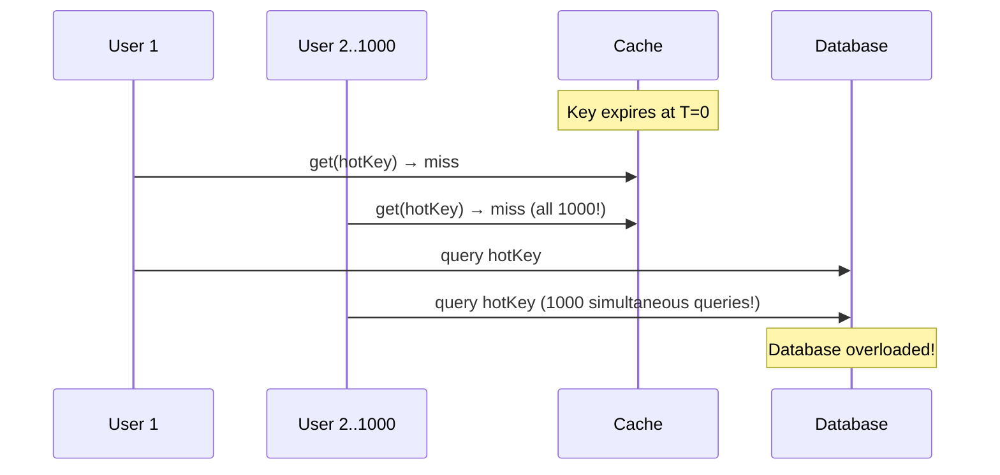

**Solutions:**

1. **Probabilistic early refresh** — proactively refresh before expiry with probability proportional to remaining TTL
2. **Promise/Future pattern** — first miss-thread claims the key with a "loading" sentinel, others wait on it
3. **Background refresh** — serve stale data while refreshing in background (stale-while-revalidate)
4. **Lock + populate** — first miss acquires a distributed lock, populates cache, releases lock; others wait

---

## 16. Common Interview Questions

### Q1: Explain LRU to me. Why do we need it?

**Answer:** LRU (Least Recently Used) is a cache eviction policy. Caches have limited size. When full, LRU evicts the item that was accessed least recently — based on temporal locality: recently used items are more likely to be used again soon. Used in Redis, browser caches, CPU caches, database buffer pools.

---

### Q2: Walk me through your class design for LRU Cache.

**Answer (structure your answer):**
1. **Node class:** `key`, `val`, `prev`, `next` — key is stored in node so we can delete from HashMap during tail eviction.
2. **LRUCache class:** `capacity`, `HashMap<int, Node>`, dummy `head` sentinel (MRU side), dummy `tail` sentinel (LRU side).
3. **Private methods:** `removeNode(node)`, `addToHead(node)`, `moveToHead(node)`, `removeTail()` → Node.
4. **Public methods:** `get(key)` → look up in map, move to head, return value; `put(key, val)` → update existing or insert new, evict tail if over capacity.

---

### Q3: Why can't we use just a HashMap? Or just a Linked List?

**Answer:**
- **HashMap only:** O(1) lookup, but no ordering. To find the LRU item, you'd scan all keys (O(n)).
- **Linked List only:** Maintains order, but finding a specific key requires O(n) traversal.
- **HashMap + DLL:** HashMap gives O(1) key → node pointer. DLL gives O(1) insert/remove given the node. Together: O(1) everything.

---

### Q4: Why doubly linked list and not singly linked?

**Answer:** To remove a node in O(1), you need its predecessor node to update `predecessor.next`. In a singly linked list, finding the predecessor requires O(n) traversal. With doubly linked list, `node.prev` gives the predecessor instantly → O(1) removal.

---

### Q5: What are the sentinel/dummy nodes for?

**Answer:** They eliminate null-pointer edge cases. Without sentinels:
- Inserting the first node: special case (head is null)
- Removing the last node: special case (head becomes null)

With sentinel `head` and `tail`, the list is never truly empty. All insert/remove operations use the same code path regardless of list size. Cleaner code, fewer bugs.

---

### Q6: Your `get` also does a write (moves node to head). Does this cause problems with thread safety?

**Answer:** Yes — this is a common misconception. Even though `get` is semantically a "read" operation, it physically modifies the DLL (moves the node to head). So `get` needs a write lock, not a read lock. Using a `ReadWriteLock` and putting `get` under a read lock is a bug — it causes DLL corruption. Both `get` and `put` need write locks.

---

### Q7: How would you handle a cache stampede?

**Answer:** Use a promise/future pattern. When there's a cache miss, instead of going to DB directly, the first thread atomically sets a "loading" placeholder in the cache. Subsequent threads on the same key see the placeholder and wait. When the first thread finishes loading, it fulfills the promise and all waiting threads get the value. Only ONE database query is made instead of N.

---

### Q8: How does Redis implement LRU? Is it exact?

**Answer:** Redis uses **approximated LRU** via random sampling. When memory limit is hit, Redis samples N random keys (default N=5), finds the one with the oldest `lru_clock` timestamp (stored per key), and evicts it. At N=5 it is 95%+ accurate; at N=10 it is near-perfect. This avoids the overhead of maintaining a global DLL over millions of keys (pointer overhead, DLL contention on every read).

---

### Q9: When would you choose LFU over LRU?

**Answer:** When access patterns are frequency-skewed and temporal locality is less important:
- **Streaming platforms (Netflix, Spotify):** Song/movie popularity follows power law distribution. Top 1% of content gets 80% of requests. LFU keeps these permanently cached; LRU might evict them after a slow period.
- **CDN hot content:** Videos that trended last month are still popular. LRU might evict them; LFU wouldn't.
- **Weakness of LFU:** New items start at frequency=1 and get evicted immediately even if popular. Mitigation: "aging" where frequencies decay over time.

---

### Q10: Can you implement LRU in 3 lines of Python?

**Answer:** Yes, using `OrderedDict`:
```python
from collections import OrderedDict

class LRUCache(OrderedDict):
    def __init__(self, cap): super().__init__(); self.cap = cap
    def get(self, k): return (self.move_to_end(k), super().get(k))[1] if k in self else -1
    def put(self, k, v): self[k] = v; self.move_to_end(k); (self.popitem(last=False) if len(self) > self.cap else None)
```

But interviewers want you to implement from scratch using Node + HashMap + DLL.

---

### Q11: What is the time and space complexity?

| Operation | Time | Space |
|-----------|------|-------|
| get | O(1) | - |
| put | O(1) | - |
| Overall space | - | O(capacity) |

---

### Q12: Design a distributed LRU cache for Instagram at scale.

**Answer (hit these points):**

1. **Horizontal sharding via consistent hashing:** Hash the key to determine which cache node handles it. Each node runs its own LRU independently.
2. **Redis cluster with `allkeys-lru`:** Redis handles replication, failover, and approximate LRU built-in.
3. **Two-tier caching:** Local in-process cache (e.g., Caffeine, 100MB) + distributed Redis cache (100GB). Local cache absorbs hot keys with microsecond latency. Redis handles the broader hot set.
4. **Cache-aside pattern:** Application checks cache first → on miss, loads from DB → stores in cache. Application owns cache population.
5. **Monitoring:** Track hit rate (target >90%), eviction rate, p99 latency. Alert on hit rate drops (may signal cache too small or stampede).

---

## 17. Key Takeaways

1. **LRU evicts the item not accessed for the longest time.** Temporal locality makes this a strong bet: what you used recently, you'll likely use again soon.

2. **O(1) is non-trivial and requires a specific insight.** HashMap gives O(1) key lookup. DLL gives O(1) insert/remove given a node pointer. The HashMap stores node pointers, bridging both worlds.

3. **Always use doubly linked list, not singly linked.** Singly linked makes node removal O(n). Doubly linked gives `node.prev` for O(1) removal anywhere.

4. **Sentinel (dummy) nodes eliminate edge cases.** Add dummy HEAD and TAIL always. Code is simpler, bugs are fewer.

5. **Node must store its key.** When evicting the tail node (LRU item), you need the key to delete from the HashMap. Forgetting this is a classic bug.

6. **get() modifies the DLL — it is not read-only.** In concurrent environments, `get` needs a write lock, not a read lock.

7. **Redis uses approximated LRU for pragmatic reasons.** A global DLL over millions of keys is expensive. Random sampling (N=5-10) achieves near-identical results at a fraction of the cost.

8. **LFU beats LRU when frequency patterns dominate.** Use LFU for content streaming, recommendations, hotspot-heavy workloads. LFU's weakness: new items start at freq=1 and are easily evicted.

9. **Real caches layer LRU + TTL + write policy.** Eviction happens by recency OR expiry. Choose write-through (consistency) or write-back (performance) based on your requirements.

10. **In interviews, know the code cold.** LRU appears in ~60% of LLD interviews at top companies. Practice writing the full Node class + LRUCache class from memory in <15 minutes. Know every edge case: update refreshes recency, eviction during update if same key shouldn't happen, capacity=1 behavior.

---

## Complexity Summary

| Approach | get | put | Space | Notes |
|----------|-----|-----|-------|-------|
| Array/List | O(n) | O(n) | O(cap) | Unusable at scale |
| HashMap only | O(1) | O(n) evict | O(cap) | Can't find LRU in O(1) |
| HashMap + DLL | **O(1)** | **O(1)** | O(cap) | The answer |
| LFU (HashMap + DLL per freq) | **O(1)** | **O(1)** | O(cap) | Harder, better for freq-heavy |

---

*Part of the LLD Interview Series | Next: Design a Rate Limiter*
