# LLD Case Study: Design a Rate Limiter

> Difficulty: Medium-Hard | Time: 45-60 min | Tags: LLD, Algorithms, Distributed Systems, Redis

---

## What Is a Rate Limiter and Why Does It Matter?

### The Analogy (5-year-old version)

Imagine a water tap. You open it, water flows. But if 100 people try to open the same tap simultaneously, the pressure drops to zero and nobody gets water. A rate limiter is the plumber who puts a valve on that tap — "maximum 10 litres per minute, no matter how many hands pull the handle."

### yeh kyun important hai?

Without a rate limiter, your API is basically an open buffet where one hungry person can eat everything and leave nothing for others. Specifically:

- A single bad actor floods your server (DoS/DDoS attack)
- A buggy mobile app with a retry loop hammers your backend
- A free-tier user consumes resources meant for paying customers
- Your downstream services (DB, payment gateway, SMS provider) get overwhelmed and start failing

**Real-world pain if you skip this:**
- In 2022, a bot army hit Twitter's public API and scraped 400 million phone numbers — no rate limit on the lookup endpoint
- Instagram's "forgot password" endpoint was hammered in brute-force attacks before they added per-IP rate limiting
- Swiggy's restaurant search API got hit with thousands of fake requests per second during competitor scraping
- WhatsApp limits OTP sends to 3 per phone number per 10 minutes — prevents SIM-card fraud

**Real-world examples of rate limits in production:**
- Twitter/X: 300 tweets per 3 hours per user
- GitHub API: 5,000 requests per hour per authenticated token; 60 for unauthenticated
- Stripe: 100 read requests per second, 100 write requests per second per secret key
- YouTube Data API: 10,000 quota units per day per project
- WhatsApp Business API: 80 messages per second per phone number

---

## The Big Picture: Where Does the Rate Limiter Live?

```mermaid
graph LR
    Client["Client App\n(Mobile/Web)"]
    CDN["CDN / Edge\n(Cloudflare)"]
    Gateway["API Gateway\n(Kong / AWS APIGW)"]
    Middleware["App Middleware\n(Rate Limit Filter)"]
    Service["Microservice"]
    Downstream["Downstream\n(DB / SMS / Payment)"]

    Client -->|"client-side throttle\n(polite clients only)"| CDN
    CDN -->|"IP-based limiting\nstops DDoS early"| Gateway
    Gateway -->|"per-API-key limiting"| Middleware
    Middleware -->|"per-user / per-endpoint"| Service
    Service -->|"leaky bucket\nprotects weak services"| Downstream
```

| Layer | Granularity | Pros | Cons |
|---|---|---|---|
| Client-side | Per app | Reduces network calls | Easily bypassed by attackers |
| CDN / Edge | Per IP | Stops attacks before they reach you | No user context, shared IPs are a problem |
| API Gateway | Per API key | Central control, one place to update | Single point of failure |
| App Middleware | Per user/endpoint | Full context (user ID, plan, role) | Adds latency to every request |
| Per Microservice | Per downstream | Protects weak internal services | Distributed complexity |

**Best practice:** Layer your defenses. IP limiting at the edge + user-level limiting in middleware. Samjho aise — bouncer at the door (IP) + VIP list at the bar (user).

---

## Rate Limiting Dimensions: What Are You Limiting?

Before picking an algorithm, decide WHAT you are measuring:

- **Per IP**: Good for anonymous traffic. Problem: offices and mobile networks share one IP (NAT).
- **Per User ID**: Best for authenticated APIs. Zomato limits searches per logged-in user.
- **Per API Key**: Good for B2B. GitHub gives 5,000 requests per token per hour.
- **Per Endpoint**: `POST /login` needs a limit of 5/minute. `GET /feed` can allow 100/minute.
- **Global**: Protect a downstream service regardless of who calls it. Netflix limits CDN origin pulls.
- **Per Tier**: Free users: 100/hour, Pro users: 10,000/hour, Enterprise: unlimited. Basically SaaS billing.

---

## The LLD Class Hierarchy: Design First

This is the core of the interview. Before writing any algorithm, the interviewer wants to see your OOP instincts.

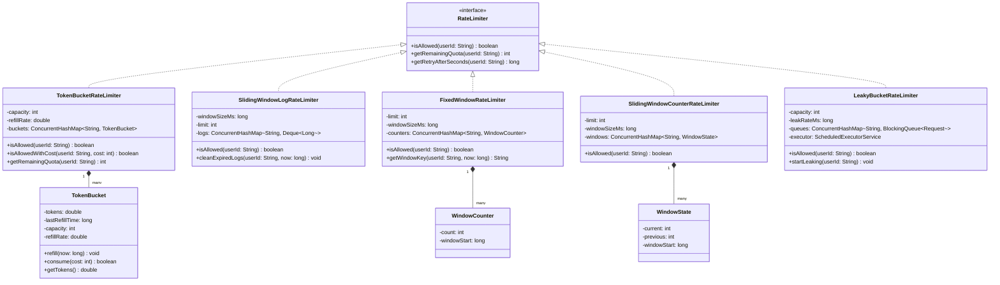

The `RateLimiter` interface is your contract. Every algorithm implements it. This makes the middleware code algorithm-agnostic — you swap the implementation without touching the HTTP layer.

---

## Algorithm 1: Fixed Window Counter

### The Analogy

A parking lot has a sign: "Max 100 cars per hour." A security guard resets the counter at the top of every hour — 12:00, 1:00, 2:00, etc. At 12:59 PM, exactly 100 cars have entered. At 1:00 PM, the counter resets. So between 12:59 and 1:01 PM, 200 cars could theoretically enter — double the limit. This is the **boundary burst problem**.

### How It Works

Divide time into fixed windows (e.g., every 60 seconds). Key = `userId:windowStart`. Increment counter on each request. Reject if counter exceeds limit. Counter auto-expires at window end.

```mermaid
gantt
    title Fixed Window — 5 req/window of 10s
    dateFormat  X
    axisFormat %s

    section Window 1 (0-10s)
    req1 :done, 0, 1
    req2 :done, 2, 1
    req3 :done, 4, 1
    req4 :done, 6, 1
    req5 :done, 8, 1

    section Window 2 (10-20s)
    req6 :active, 10, 1
    req7 :active, 11, 1
    req8 :active, 12, 1
    req9 :active, 13, 1
    req10 :active, 14, 1

    section BURST ZONE
    DANGER :crit, 8, 6
```

The DANGER zone shows that 10 requests can happen in 2 seconds (5 at the end of window 1 + 5 at the start of window 2), even though the limit is 5 per 10 seconds.

### Java Implementation (Thread-Safe)

```java
import java.util.concurrent.ConcurrentHashMap;
import java.util.concurrent.atomic.AtomicInteger;

public class FixedWindowRateLimiter implements RateLimiter {

    private final int limit;
    private final long windowSizeMs;

    // key -> WindowCounter
    private final ConcurrentHashMap<String, WindowCounter> counters = new ConcurrentHashMap<>();

    public FixedWindowRateLimiter(int limit, long windowSizeMs) {
        this.limit = limit;
        this.windowSizeMs = windowSizeMs;
    }

    private static class WindowCounter {
        final AtomicInteger count = new AtomicInteger(0);
        final long windowStart;

        WindowCounter(long windowStart) {
            this.windowStart = windowStart;
        }
    }

    private String getWindowKey(String userId, long windowStart) {
        return userId + ":" + windowStart;
    }

    @Override
    public boolean isAllowed(String userId) {
        long now = System.currentTimeMillis();
        long windowStart = (now / windowSizeMs) * windowSizeMs;
        String windowKey = getWindowKey(userId, windowStart);

        // computeIfAbsent is atomic — safe for concurrent use
        WindowCounter counter = counters.computeIfAbsent(windowKey,
            k -> new WindowCounter(windowStart));

        int currentCount = counter.count.incrementAndGet();
        return currentCount <= limit;
    }

    @Override
    public int getRemainingQuota(String userId) {
        long now = System.currentTimeMillis();
        long windowStart = (now / windowSizeMs) * windowSizeMs;
        String windowKey = getWindowKey(userId, windowStart);

        WindowCounter counter = counters.get(windowKey);
        if (counter == null) return limit;
        return Math.max(0, limit - counter.count.get());
    }

    @Override
    public long getRetryAfterSeconds(String userId) {
        long now = System.currentTimeMillis();
        long windowStart = (now / windowSizeMs) * windowSizeMs;
        long windowEnd = windowStart + windowSizeMs;
        return (windowEnd - now) / 1000;
    }
}
```

### Python Implementation (Thread-Safe)

```python
import threading
import time
from collections import defaultdict

class FixedWindowRateLimiter:
    def __init__(self, limit: int, window_size_seconds: float):
        self.limit = limit
        self.window_size_ms = int(window_size_seconds * 1000)
        self._counters: dict[str, dict] = {}
        self._lock = threading.Lock()

    def _get_window_start(self, now_ms: int) -> int:
        return (now_ms // self.window_size_ms) * self.window_size_ms

    def is_allowed(self, user_id: str) -> bool:
        now_ms = int(time.time() * 1000)
        window_start = self._get_window_start(now_ms)
        key = f"{user_id}:{window_start}"

        with self._lock:
            if key not in self._counters:
                self._counters[key] = {"count": 0, "window_start": window_start}

            entry = self._counters[key]
            if entry["count"] >= self.limit:
                return False

            entry["count"] += 1
            return True

    def get_remaining_quota(self, user_id: str) -> int:
        now_ms = int(time.time() * 1000)
        window_start = self._get_window_start(now_ms)
        key = f"{user_id}:{window_start}"

        with self._lock:
            entry = self._counters.get(key)
            if not entry:
                return self.limit
            return max(0, self.limit - entry["count"])

    def get_retry_after_seconds(self, user_id: str) -> float:
        now_ms = int(time.time() * 1000)
        window_start = self._get_window_start(now_ms)
        window_end = window_start + self.window_size_ms
        return (window_end - now_ms) / 1000.0


# Usage
limiter = FixedWindowRateLimiter(limit=5, window_size_seconds=60)
for i in range(7):
    result = limiter.is_allowed("user:42")
    print(f"Request {i+1}: {'ALLOWED' if result else 'BLOCKED'}")
# Requests 1-5: ALLOWED, 6-7: BLOCKED
```

### Redis Implementation (Distributed)

```
# Key: rl:fixed:{userId}:{windowStart}
# Operations:
INCR rl:fixed:user42:1735200000   # Returns new count (e.g., 3)
EXPIRE rl:fixed:user42:1735200000 60  # Auto-cleanup after window

# If count > limit → reject with 429
# Both operations in a MULTI/EXEC pipeline for atomicity
```

### Pros and Cons

| Pros | Cons |
|---|---|
| Very simple to implement and debug | Boundary burst: 2x traffic at window edges |
| Low memory: one counter per key | Not perfectly accurate |
| Fast: O(1) per request | Fixed windows feel arbitrary to users |
| Easy to distribute via Redis | No burst tolerance — evenly spaced requests only |

**When to use:** Internal dashboards, admin APIs, anywhere simplicity beats precision.
**When NOT to use:** Public-facing APIs where boundary bursts are a security issue.

---

## Algorithm 2: Sliding Window Log

### The Analogy

Instead of a counter at the parking lot, imagine a security guard who keeps a physical log book. Every car's entry time is written down. When a new car arrives, the guard flips back through the logbook: "How many cars entered in the last 60 minutes?" If it's over 100, the car waits. Perfectly accurate — but the guard needs a LOT of paper if 10,000 cars come every hour.

### How It Works

Store a timestamp log for each request. On a new request:
1. Remove all timestamps older than `now - windowSize`
2. Count remaining timestamps
3. If count >= limit, reject
4. Otherwise, allow and add `now` to the log

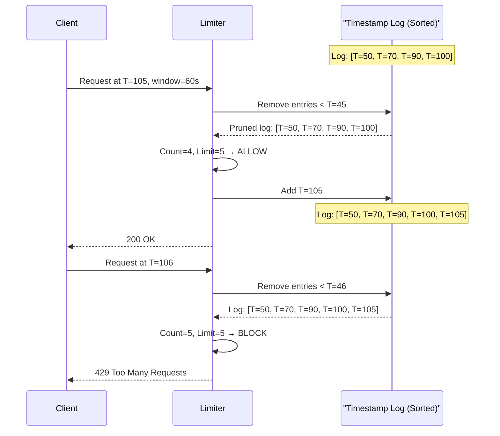

### Java Implementation

```java
import java.util.ArrayDeque;
import java.util.Deque;
import java.util.concurrent.ConcurrentHashMap;
import java.util.concurrent.locks.ReentrantLock;

public class SlidingWindowLogRateLimiter implements RateLimiter {

    private final long windowSizeMs;
    private final int limit;

    // Each user has their own deque of timestamps
    private final ConcurrentHashMap<String, Deque<Long>> logs = new ConcurrentHashMap<>();
    // Per-user locks to avoid contention between different users
    private final ConcurrentHashMap<String, ReentrantLock> locks = new ConcurrentHashMap<>();

    public SlidingWindowLogRateLimiter(int limit, long windowSizeMs) {
        this.limit = limit;
        this.windowSizeMs = windowSizeMs;
    }

    private ReentrantLock getLock(String userId) {
        return locks.computeIfAbsent(userId, k -> new ReentrantLock());
    }

    private void cleanExpiredLogs(Deque<Long> log, long windowStart) {
        // Remove from front — log is sorted ascending
        while (!log.isEmpty() && log.peekFirst() <= windowStart) {
            log.pollFirst();
        }
    }

    @Override
    public boolean isAllowed(String userId) {
        long now = System.currentTimeMillis();
        long windowStart = now - windowSizeMs;

        Deque<Long> log = logs.computeIfAbsent(userId, k -> new ArrayDeque<>());
        ReentrantLock lock = getLock(userId);

        lock.lock();
        try {
            cleanExpiredLogs(log, windowStart);

            if (log.size() >= limit) {
                return false; // Rate limited
            }

            log.addLast(now); // Add to sorted deque
            return true;
        } finally {
            lock.unlock();
        }
    }

    @Override
    public int getRemainingQuota(String userId) {
        long now = System.currentTimeMillis();
        long windowStart = now - windowSizeMs;

        Deque<Long> log = logs.get(userId);
        if (log == null) return limit;

        ReentrantLock lock = getLock(userId);
        lock.lock();
        try {
            cleanExpiredLogs(log, windowStart);
            return Math.max(0, limit - log.size());
        } finally {
            lock.unlock();
        }
    }

    @Override
    public long getRetryAfterSeconds(String userId) {
        Deque<Long> log = logs.get(userId);
        if (log == null || log.isEmpty()) return 0;

        ReentrantLock lock = getLock(userId);
        lock.lock();
        try {
            if (log.size() < limit) return 0;
            long oldestInWindow = log.peekFirst();
            return (oldestInWindow + windowSizeMs - System.currentTimeMillis()) / 1000;
        } finally {
            lock.unlock();
        }
    }
}
```

### Python Implementation

```python
import threading
import time
from collections import deque

class SlidingWindowLogRateLimiter:
    def __init__(self, limit: int, window_size_seconds: float):
        self.limit = limit
        self.window_size_ms = int(window_size_seconds * 1000)
        self._logs: dict[str, deque] = {}
        self._locks: dict[str, threading.Lock] = {}
        self._meta_lock = threading.Lock()  # protects dict creation

    def _get_user_lock(self, user_id: str) -> threading.Lock:
        with self._meta_lock:
            if user_id not in self._locks:
                self._locks[user_id] = threading.Lock()
                self._logs[user_id] = deque()
            return self._locks[user_id]

    def is_allowed(self, user_id: str) -> bool:
        now_ms = int(time.time() * 1000)
        window_start = now_ms - self.window_size_ms
        lock = self._get_user_lock(user_id)

        with lock:
            log = self._logs[user_id]

            # Remove expired timestamps from the left (oldest)
            while log and log[0] <= window_start:
                log.popleft()

            if len(log) >= self.limit:
                return False

            log.append(now_ms)
            return True

    def get_remaining_quota(self, user_id: str) -> int:
        now_ms = int(time.time() * 1000)
        window_start = now_ms - self.window_size_ms
        lock = self._get_user_lock(user_id)

        with lock:
            log = self._logs[user_id]
            while log and log[0] <= window_start:
                log.popleft()
            return max(0, self.limit - len(log))

    def get_retry_after_seconds(self, user_id: str) -> float:
        now_ms = int(time.time() * 1000)
        lock = self._get_user_lock(user_id)

        with lock:
            log = self._logs[user_id]
            if not log or len(log) < self.limit:
                return 0.0
            oldest = log[0]
            return (oldest + self.window_size_ms - now_ms) / 1000.0


# Usage
limiter = SlidingWindowLogRateLimiter(limit=5, window_size_seconds=60)
for i in range(6):
    print(f"Request {i+1}: {'ALLOWED' if limiter.is_allowed('user:42') else 'BLOCKED'}")
```

### Redis Implementation (Distributed) — Sorted Set

Redis sorted sets are perfect for this. Score = timestamp. Members = unique request IDs.

```
# Add a request at timestamp T=105000 (ms)
ZADD rl:swl:user42 105000 "req_uuid_abc123"

# Remove entries older than T=45000 (now - window)
ZREMRANGEBYSCORE rl:swl:user42 -inf 45000

# Count remaining (this is the sliding window count)
ZCARD rl:swl:user42

# Set TTL so the key auto-expires
EXPIRE rl:swl:user42 60
```

As a Lua script (atomic):

```lua
-- sliding_window_log.lua
local key = KEYS[1]
local now = tonumber(ARGV[1])        -- current time in ms
local window_ms = tonumber(ARGV[2])  -- window size in ms
local limit = tonumber(ARGV[3])      -- max requests
local request_id = ARGV[4]           -- unique ID for this request

-- Remove expired entries
redis.call("ZREMRANGEBYSCORE", key, "-inf", now - window_ms)

-- Count current entries
local count = redis.call("ZCARD", key)

if count >= limit then
    return 0  -- Rate limited
end

-- Add this request
redis.call("ZADD", key, now, request_id)
redis.call("EXPIRE", key, math.ceil(window_ms / 1000) + 1)
return 1  -- Allowed
```

### Pros and Cons

| Pros | Cons |
|---|---|
| Perfectly accurate — no boundary bursts | Memory: O(limit) per user (stores every timestamp) |
| Intuitive semantics | Slow for high-traffic keys (scan all timestamps) |
| Easy to explain in interviews | Redis key grows with traffic |
| Distributed via Redis sorted sets | Hard to implement correctly with locks |

**When to use:** Low-traffic, high-accuracy scenarios — login brute-force protection, OTP sends, password reset requests.
**When NOT to use:** High-traffic APIs with millions of users. At 1000 requests/user/hour with 1M users, you're storing 1 billion timestamp records in Redis.

---

## Algorithm 3: Sliding Window Counter (Hybrid)

### The Analogy

The security guard is tired of writing every timestamp. Instead, they check two things: (1) how many cars entered in the previous full hour, and (2) how many entered so far in this current hour. They blend these numbers based on how far we are into the current hour. At the 30-minute mark, they count 50% of last hour's entries plus all of this hour's entries. Smart approximation. Basically — accuracy of sliding window, memory of fixed window.

### How It Works

Keep two counters per user: `previousWindowCount` and `currentWindowCount`. When evaluating:

```
weightedCount = previousWindowCount × overlapRatio + currentWindowCount
overlapRatio  = 1 - (timeElapsedInCurrentWindow / windowSize)
```

If `weightedCount < limit` → allow, increment `currentWindowCount`.

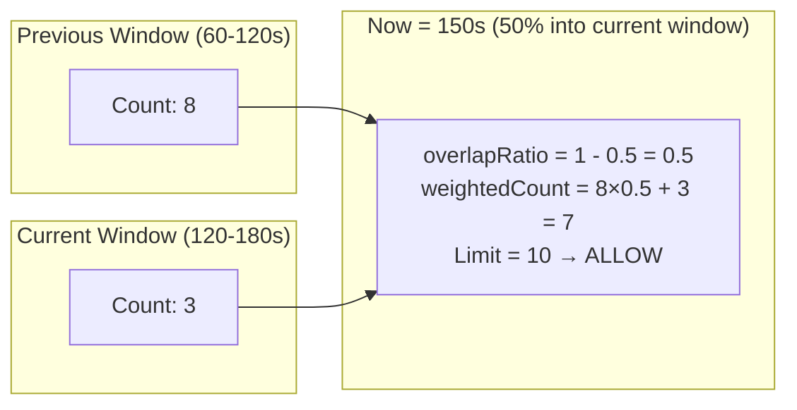

### Java Implementation

```java
import java.util.concurrent.ConcurrentHashMap;
import java.util.concurrent.locks.ReentrantLock;

public class SlidingWindowCounterRateLimiter implements RateLimiter {

    private final int limit;
    private final long windowSizeMs;

    private static class WindowState {
        volatile int current = 0;
        volatile int previous = 0;
        volatile long windowStart;

        WindowState(long windowStart) {
            this.windowStart = windowStart;
        }
    }

    private final ConcurrentHashMap<String, WindowState> windows = new ConcurrentHashMap<>();
    private final ConcurrentHashMap<String, ReentrantLock> locks = new ConcurrentHashMap<>();

    public SlidingWindowCounterRateLimiter(int limit, long windowSizeMs) {
        this.limit = limit;
        this.windowSizeMs = windowSizeMs;
    }

    private ReentrantLock getLock(String userId) {
        return locks.computeIfAbsent(userId, k -> new ReentrantLock());
    }

    @Override
    public boolean isAllowed(String userId) {
        long now = System.currentTimeMillis();
        long currentWindowStart = (now / windowSizeMs) * windowSizeMs;
        double elapsed = now - currentWindowStart;
        double overlapRatio = 1.0 - (elapsed / windowSizeMs);

        WindowState state = windows.computeIfAbsent(userId,
            k -> new WindowState(currentWindowStart));

        ReentrantLock lock = getLock(userId);
        lock.lock();
        try {
            // Roll into new window if needed
            if (state.windowStart != currentWindowStart) {
                // Was it consecutive? If yes, carry forward current as previous
                if (state.windowStart == currentWindowStart - windowSizeMs) {
                    state.previous = state.current;
                } else {
                    state.previous = 0; // Gap — old window is irrelevant
                }
                state.current = 0;
                state.windowStart = currentWindowStart;
            }

            double estimatedCount = state.previous * overlapRatio + state.current;

            if (estimatedCount >= limit) {
                return false;
            }

            state.current++;
            return true;
        } finally {
            lock.unlock();
        }
    }

    @Override
    public int getRemainingQuota(String userId) {
        long now = System.currentTimeMillis();
        long currentWindowStart = (now / windowSizeMs) * windowSizeMs;
        double elapsed = now - currentWindowStart;
        double overlapRatio = 1.0 - (elapsed / windowSizeMs);

        WindowState state = windows.get(userId);
        if (state == null || state.windowStart != currentWindowStart) return limit;

        double estimated = state.previous * overlapRatio + state.current;
        return (int) Math.max(0, limit - Math.ceil(estimated));
    }

    @Override
    public long getRetryAfterSeconds(String userId) {
        long now = System.currentTimeMillis();
        long currentWindowStart = (now / windowSizeMs) * windowSizeMs;
        long windowEnd = currentWindowStart + windowSizeMs;
        return (windowEnd - now) / 1000;
    }
}
```

### Python Implementation

```python
import threading
import time
import math

class SlidingWindowCounterRateLimiter:
    def __init__(self, limit: int, window_size_seconds: float):
        self.limit = limit
        self.window_size_ms = int(window_size_seconds * 1000)
        self._windows: dict[str, dict] = {}
        self._locks: dict[str, threading.Lock] = {}
        self._meta_lock = threading.Lock()

    def _get_user_lock(self, user_id: str) -> threading.Lock:
        with self._meta_lock:
            if user_id not in self._locks:
                self._locks[user_id] = threading.Lock()
            return self._locks[user_id]

    def is_allowed(self, user_id: str) -> bool:
        now_ms = int(time.time() * 1000)
        current_window_start = (now_ms // self.window_size_ms) * self.window_size_ms
        elapsed = now_ms - current_window_start
        overlap_ratio = 1.0 - (elapsed / self.window_size_ms)

        lock = self._get_user_lock(user_id)
        with lock:
            if user_id not in self._windows:
                self._windows[user_id] = {
                    "current": 0,
                    "previous": 0,
                    "window_start": current_window_start
                }

            state = self._windows[user_id]

            # Roll window if needed
            if state["window_start"] != current_window_start:
                if state["window_start"] == current_window_start - self.window_size_ms:
                    state["previous"] = state["current"]
                else:
                    state["previous"] = 0
                state["current"] = 0
                state["window_start"] = current_window_start

            estimated = state["previous"] * overlap_ratio + state["current"]
            if estimated >= self.limit:
                return False

            state["current"] += 1
            return True
```

### Pros and Cons

| Pros | Cons |
|---|---|
| O(1) memory: 2 counters per user | Slight approximation (~0.003% error in practice) |
| O(1) per request | More logic than fixed window |
| Distributes well via Redis | |
| Used by Cloudflare at massive scale | |

**When to use:** Production APIs needing accuracy without the memory cost of log-based limiting. This is Cloudflare's chosen algorithm.

---

## Algorithm 4: Token Bucket

### The Analogy

You have a bucket that holds 10 tokens (like 10 coins). Every second, 2 new coins are added to the bucket (but never more than 10 total). Each request you make costs 1 coin. No coins left? You wait. Haven't made requests in 5 seconds? Your bucket has 10 coins saved up — you can burst. This is exactly how AWS, Stripe, and GitHub's rate limiters work.

Think of it like a YouTube creator's upload quota. You get a burst allowance to upload multiple videos today, but if you've used it all, you wait until tomorrow for the quota to refill.

### How It Works

- `capacity`: max tokens the bucket can hold
- `refillRate`: tokens added per second (continuous, lazy refill)
- `tokens`: current token count (starts at capacity)
- On request: if `tokens >= cost`, allow and decrement. Else reject.
- Refill happens lazily: when a request arrives, calculate tokens earned since last check.

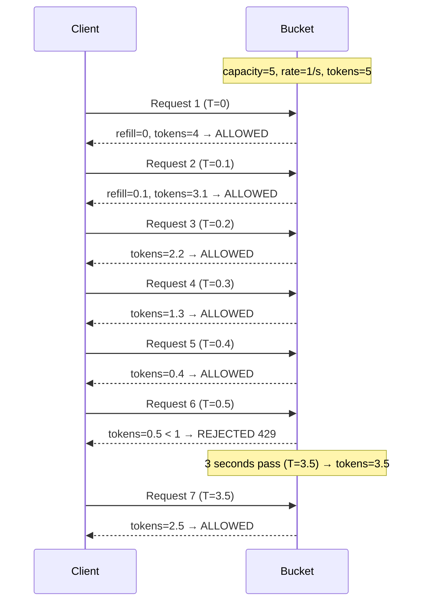

### Java Implementation (Full LLD)

```java
import java.util.concurrent.ConcurrentHashMap;
import java.util.concurrent.locks.ReentrantLock;

// Inner class: the actual bucket state for one user
class TokenBucket {
    private double tokens;
    private long lastRefillTime;
    private final int capacity;
    private final double refillRate; // tokens per millisecond

    public TokenBucket(int capacity, double refillRatePerSecond) {
        this.capacity = capacity;
        this.refillRate = refillRatePerSecond / 1000.0; // convert to per-ms
        this.tokens = capacity; // start full
        this.lastRefillTime = System.currentTimeMillis();
    }

    public void refill(long now) {
        long elapsed = now - lastRefillTime;
        double tokensToAdd = elapsed * refillRate;
        this.tokens = Math.min(capacity, this.tokens + tokensToAdd);
        this.lastRefillTime = now;
    }

    public boolean consume(int cost) {
        if (tokens < cost) return false;
        tokens -= cost;
        return true;
    }

    public double getTokens() {
        return tokens;
    }
}

// The rate limiter that manages buckets per user
public class TokenBucketRateLimiter implements RateLimiter {

    private final int capacity;
    private final double refillRatePerSecond;

    // Per-user buckets — ConcurrentHashMap for concurrent access
    private final ConcurrentHashMap<String, TokenBucket> buckets = new ConcurrentHashMap<>();
    // Per-user locks — so operations on different users don't block each other
    private final ConcurrentHashMap<String, ReentrantLock> locks = new ConcurrentHashMap<>();

    public TokenBucketRateLimiter(int capacity, double refillRatePerSecond) {
        this.capacity = capacity;
        this.refillRatePerSecond = refillRatePerSecond;
    }

    private ReentrantLock getLock(String userId) {
        return locks.computeIfAbsent(userId, k -> new ReentrantLock());
    }

    @Override
    public boolean isAllowed(String userId) {
        return isAllowedWithCost(userId, 1);
    }

    // Weighted requests: bulk export costs 10 tokens, normal request costs 1
    public boolean isAllowedWithCost(String userId, int cost) {
        long now = System.currentTimeMillis();

        // computeIfAbsent is atomic — creates bucket only once
        TokenBucket bucket = buckets.computeIfAbsent(userId,
            k -> new TokenBucket(capacity, refillRatePerSecond));

        ReentrantLock lock = getLock(userId);
        lock.lock();
        try {
            bucket.refill(now);        // lazily add tokens
            return bucket.consume(cost); // try to consume
        } finally {
            lock.unlock();
        }
    }

    @Override
    public int getRemainingQuota(String userId) {
        long now = System.currentTimeMillis();
        TokenBucket bucket = buckets.get(userId);
        if (bucket == null) return capacity;

        ReentrantLock lock = getLock(userId);
        lock.lock();
        try {
            bucket.refill(now);
            return (int) Math.floor(bucket.getTokens());
        } finally {
            lock.unlock();
        }
    }

    @Override
    public long getRetryAfterSeconds(String userId) {
        TokenBucket bucket = buckets.get(userId);
        if (bucket == null || bucket.getTokens() >= 1) return 0;
        // Time to earn 1 token at the refill rate
        double tokensNeeded = 1.0 - bucket.getTokens();
        return (long) Math.ceil(tokensNeeded / refillRatePerSecond);
    }
}

// Usage
TokenBucketRateLimiter limiter = new TokenBucketRateLimiter(100, 10); // 100 capacity, 10/s refill
System.out.println(limiter.isAllowed("user:42"));          // true
System.out.println(limiter.isAllowedWithCost("user:42", 10)); // true (bulk operation)
System.out.println(limiter.getRemainingQuota("user:42"));  // ~89
```

### Python Implementation

```python
import threading
import time
import math

class TokenBucket:
    """Represents one user's token bucket."""
    
    def __init__(self, capacity: int, refill_rate_per_second: float):
        self.capacity = capacity
        self.refill_rate_per_ms = refill_rate_per_second / 1000.0
        self.tokens = float(capacity)  # start full
        self.last_refill_time = int(time.time() * 1000)

    def refill(self, now_ms: int) -> None:
        elapsed = now_ms - self.last_refill_time
        tokens_to_add = elapsed * self.refill_rate_per_ms
        self.tokens = min(self.capacity, self.tokens + tokens_to_add)
        self.last_refill_time = now_ms

    def consume(self, cost: int = 1) -> bool:
        if self.tokens < cost:
            return False
        self.tokens -= cost
        return True

    def get_tokens(self) -> float:
        return self.tokens


class TokenBucketRateLimiter:
    """
    Rate limiter using the token bucket algorithm.
    Thread-safe using per-user locks.
    """
    
    def __init__(self, capacity: int, refill_rate_per_second: float):
        self.capacity = capacity
        self.refill_rate = refill_rate_per_second
        self._buckets: dict[str, TokenBucket] = {}
        self._locks: dict[str, threading.Lock] = {}
        self._meta_lock = threading.Lock()  # protects dict creation

    def _get_bucket_and_lock(self, user_id: str):
        with self._meta_lock:
            if user_id not in self._buckets:
                self._buckets[user_id] = TokenBucket(self.capacity, self.refill_rate)
                self._locks[user_id] = threading.Lock()
            return self._buckets[user_id], self._locks[user_id]

    def is_allowed(self, user_id: str) -> bool:
        return self.is_allowed_with_cost(user_id, cost=1)

    def is_allowed_with_cost(self, user_id: str, cost: int = 1) -> bool:
        now_ms = int(time.time() * 1000)
        bucket, lock = self._get_bucket_and_lock(user_id)

        with lock:
            bucket.refill(now_ms)
            return bucket.consume(cost)

    def get_remaining_quota(self, user_id: str) -> int:
        now_ms = int(time.time() * 1000)
        bucket, lock = self._get_bucket_and_lock(user_id)

        with lock:
            bucket.refill(now_ms)
            return int(math.floor(bucket.get_tokens()))

    def get_retry_after_seconds(self, user_id: str) -> float:
        bucket, lock = self._get_bucket_and_lock(user_id)
        with lock:
            if bucket.get_tokens() >= 1:
                return 0.0
            tokens_needed = 1.0 - bucket.get_tokens()
            return tokens_needed / self.refill_rate


# Usage
limiter = TokenBucketRateLimiter(capacity=100, refill_rate_per_second=10)

# Normal request
print(limiter.is_allowed("stripe:key_123"))             # True
print(limiter.get_remaining_quota("stripe:key_123"))    # 99

# Weighted — bulk export costs 10 tokens
print(limiter.is_allowed_with_cost("stripe:key_123", cost=10))  # True
print(limiter.get_remaining_quota("stripe:key_123"))    # 89
```

### Pros and Cons

| Pros | Cons |
|---|---|
| Allows controlled bursting (the "save up" effect) | State must be persisted (harder to distribute without Redis) |
| Simple math, easy to reason about | Race conditions if not locked properly |
| Used by AWS, Stripe, GCP, GitHub | Memory leak if bucket keys are never expired |
| Supports weighted requests (cost per request) | Refill calculation needs floating point |

**When to use:** Any API that needs to allow burst traffic but protect sustained load. This is the default choice for most public APIs. Basically — yeh sabse common algorithm hai, this is what 80% of the industry uses.

---

## Algorithm 5: Leaky Bucket

### The Analogy

Imagine a bucket with a small hole at the bottom. You pour water in (requests come in). The water drips out at a constant rate (processing at a fixed pace). If you pour faster than the hole drains, water overflows (requests are dropped). The output is always smooth — no matter how bursty the input. Great for protecting things like a payment gateway that can only process 100 transactions per second.

### How It Works

Each user has a queue of requests. A background worker processes them at a fixed rate. If the queue is full when a new request arrives, it's rejected with 429.

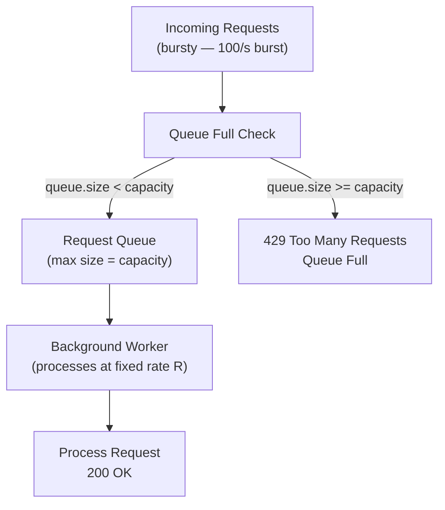

### Java Implementation (with ScheduledExecutorService)

```java
import java.util.concurrent.*;

public class LeakyBucketRateLimiter implements RateLimiter {

    private final int capacity;
    private final long leakIntervalMs; // process one request every N ms

    // Per-user queues
    private final ConcurrentHashMap<String, BlockingQueue<String>> queues =
        new ConcurrentHashMap<>();

    private final ScheduledExecutorService scheduler =
        Executors.newScheduledThreadPool(4);

    public LeakyBucketRateLimiter(int capacity, long leakIntervalMs) {
        this.capacity = capacity;
        this.leakIntervalMs = leakIntervalMs;
    }

    private BlockingQueue<String> getOrCreateQueue(String userId) {
        return queues.computeIfAbsent(userId, k -> {
            BlockingQueue<String> queue = new ArrayBlockingQueue<>(capacity);
            // Schedule a background drainer for this user's queue
            scheduler.scheduleAtFixedRate(
                () -> queue.poll(), // drain one request per interval
                0,
                leakIntervalMs,
                TimeUnit.MILLISECONDS
            );
            return queue;
        });
    }

    @Override
    public boolean isAllowed(String userId) {
        BlockingQueue<String> queue = getOrCreateQueue(userId);

        // offer() is non-blocking — returns false if queue is full
        return queue.offer(userId + ":" + System.currentTimeMillis());
    }

    @Override
    public int getRemainingQuota(String userId) {
        BlockingQueue<String> queue = queues.get(userId);
        if (queue == null) return capacity;
        return capacity - queue.size();
    }

    @Override
    public long getRetryAfterSeconds(String userId) {
        // With leaky bucket, you have to wait for the queue to drain
        BlockingQueue<String> queue = queues.get(userId);
        if (queue == null || queue.size() < capacity) return 0;
        return (queue.size() * leakIntervalMs) / 1000;
    }

    public void shutdown() {
        scheduler.shutdown();
    }
}
```

### Python Implementation

```python
import threading
import time
import queue

class LeakyBucketRateLimiter:
    """
    Leaky bucket: requests queue up; a background thread drains at fixed rate.
    """
    
    def __init__(self, capacity: int, leak_rate_per_second: float):
        self.capacity = capacity
        self.leak_interval = 1.0 / leak_rate_per_second
        self._queues: dict[str, queue.Queue] = {}
        self._meta_lock = threading.Lock()
        self._stop_event = threading.Event()
        # Start the drainer daemon thread
        self._drainer_thread = threading.Thread(target=self._drain_loop, daemon=True)
        self._drainer_thread.start()

    def _get_queue(self, user_id: str) -> queue.Queue:
        with self._meta_lock:
            if user_id not in self._queues:
                self._queues[user_id] = queue.Queue(maxsize=self.capacity)
            return self._queues[user_id]

    def _drain_loop(self):
        """Background thread that drains one request per interval from each queue."""
        while not self._stop_event.is_set():
            with self._meta_lock:
                user_queues = list(self._queues.items())

            for user_id, q in user_queues:
                try:
                    q.get_nowait()  # drain one request (process it)
                except queue.Empty:
                    pass

            time.sleep(self.leak_interval)

    def is_allowed(self, user_id: str) -> bool:
        q = self._get_queue(user_id)
        try:
            # put_nowait raises Full if queue is at capacity
            q.put_nowait(time.time())
            return True
        except queue.Full:
            return False

    def get_remaining_quota(self, user_id: str) -> int:
        q = self._get_queue(user_id)
        return self.capacity - q.qsize()

    def get_retry_after_seconds(self, user_id: str) -> float:
        q = self._get_queue(user_id)
        if q.qsize() < self.capacity:
            return 0.0
        return q.qsize() * self.leak_interval

    def stop(self):
        self._stop_event.set()


# Usage: 10 capacity, process 5 per second (one every 200ms)
limiter = LeakyBucketRateLimiter(capacity=10, leak_rate_per_second=5)
for i in range(12):
    result = limiter.is_allowed("user:42")
    print(f"Request {i+1}: {'QUEUED' if result else 'DROPPED'}")
# First 10: QUEUED, 11-12: DROPPED
```

### Pros and Cons

| Pros | Cons |
|---|---|
| Perfectly smooth output — protects downstream | No burst at all — every user gets same pacing |
| Great for payment processors, email senders | Queued requests have variable latency |
| Prevents thundering herd at downstream | Background thread overhead |
| Simple to reason about output rate | Old requests may time out while queued |

**When to use:** Rate-smoothing for downstream services — Swiggy's SMS OTP sender, Uber's payment gateway calls, any service with strict throughput contracts.
**When NOT to use:** Interactive APIs where users expect burst tolerance. Real-time systems where queue latency is unacceptable.

---

## Algorithm Comparison

```mermaid
quadrantChart
    title Algorithm Trade-offs
    x-axis Low Accuracy --> High Accuracy
    y-axis No Burst --> High Burst
    quadrant-1 Ideal (Burst + Accurate)
    quadrant-2 Burst-friendly but imprecise
    quadrant-3 Avoid
    quadrant-4 Strict but Accurate
    Token Bucket: [0.75, 0.85]
    Sliding Window Counter: [0.72, 0.45]
    Sliding Window Log: [0.95, 0.40]
    Fixed Window Counter: [0.35, 0.55]
    Leaky Bucket: [0.60, 0.10]
```

| Algorithm | Accuracy | Memory | Burst | Complexity | Best For |
|---|---|---|---|---|---|
| Fixed Window Counter | Low | Very Low | Partial (boundary) | Simple | Internal tools, dashboards |
| Sliding Window Log | High | High (O(limit)) | No | Medium | Login, OTP, brute-force prevention |
| Sliding Window Counter | Medium-High | Low (O(1)) | Partial | Medium | Production APIs (Cloudflare's choice) |
| Token Bucket | High | Low (O(1)) | Yes (controlled) | Medium | Most public APIs (AWS, Stripe, GitHub) |
| Leaky Bucket | High | Medium (queue) | No | High | Downstream service protection |

---

## Thread-Safety Deep Dive

yeh bahut important hai in LLD interviews. The interviewer WILL ask: "How do you make this thread-safe?"

### Option 1: `synchronized` blocks (simple but coarse)

```java
// Every method acquires the same lock — simple but bottleneck
public synchronized boolean isAllowed(String userId) {
    // ... entire method is locked
}
```

Problem: If User A and User B call simultaneously, B waits for A. But they're different users — they don't share any state!

### Option 2: `ConcurrentHashMap` with per-user locks (recommended)

```java
// ConcurrentHashMap: safe for concurrent map operations
private final ConcurrentHashMap<String, ReentrantLock> locks = new ConcurrentHashMap<>();

private ReentrantLock getLock(String userId) {
    // computeIfAbsent is atomic — creates lock only once even under concurrency
    return locks.computeIfAbsent(userId, k -> new ReentrantLock());
}

public boolean isAllowed(String userId) {
    ReentrantLock lock = getLock(userId);
    lock.lock();
    try {
        // Only blocks OTHER requests from THE SAME USER
        // Different users run concurrently
        return doCheck(userId);
    } finally {
        lock.unlock(); // ALWAYS in finally block
    }
}
```

This gives you O(users) parallelism instead of O(1) throughput.

### Option 3: `ConcurrentHashMap.compute()` (atomic, no explicit lock)

```java
// For simple counter increments — compute() is atomic
counters.compute(userId, (key, existing) -> {
    if (existing == null) {
        return new WindowCounter(1, System.currentTimeMillis());
    }
    existing.count++;
    return existing;
});
```

### Option 4: `AtomicInteger` + `ConcurrentHashMap` (for counters only)

```java
private final ConcurrentHashMap<String, AtomicInteger> counters = new ConcurrentHashMap<>();

public boolean isAllowed(String userId) {
    AtomicInteger counter = counters.computeIfAbsent(userId, k -> new AtomicInteger(0));
    int newCount = counter.incrementAndGet();
    return newCount <= limit;
}
```

`AtomicInteger.incrementAndGet()` is a single CPU instruction (compare-and-swap). No lock at all.

### Which to use?

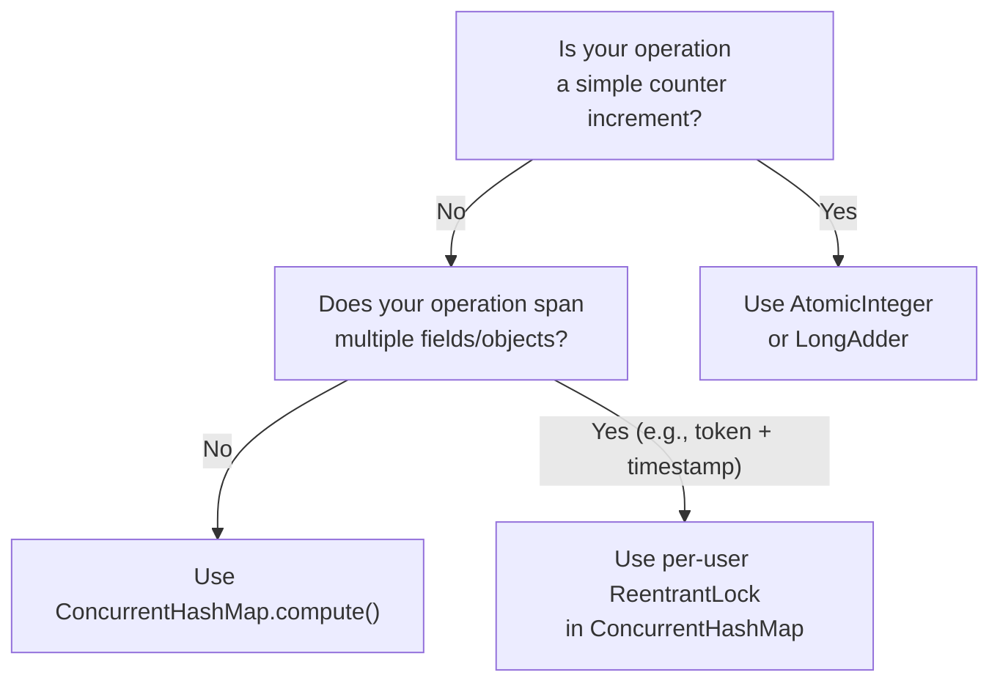

---

## Distributed Rate Limiter

Ek server pe rate limiting easy hai. But when you have 50 servers behind a load balancer, each server sees only 1/50 of traffic. A user can hit each server 5 times per second and bypass a limit of 5/s per server — getting 250/s total.

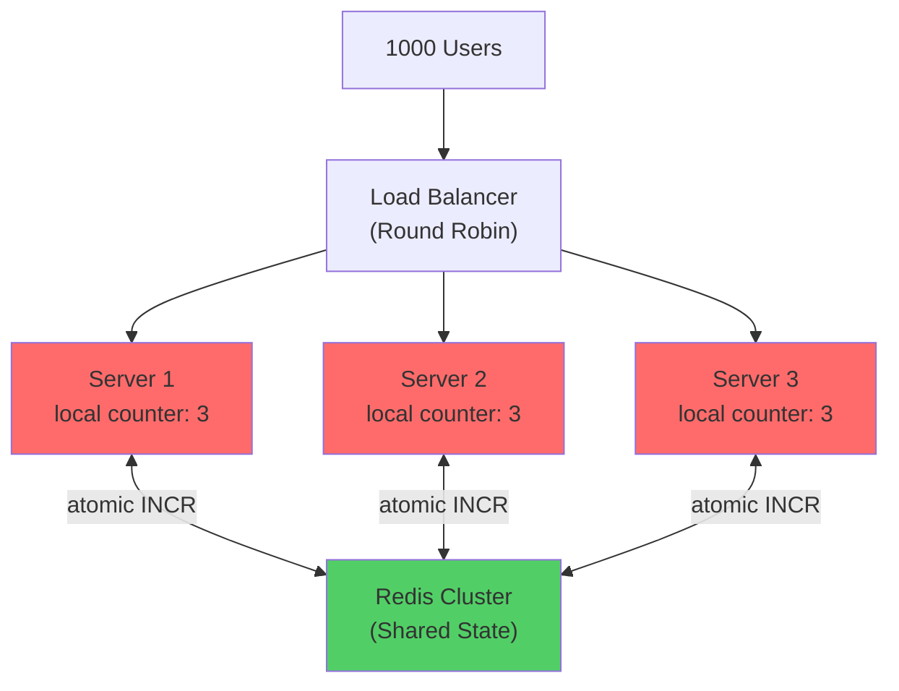

Local counters (red) are wrong — each server thinks user only made 3 requests. Redis (green) is the source of truth.

### Redis Fixed Window (Atomic INCR + EXPIRE)

```
# Key strategy: rl:{algorithm}:{userId}:{windowStart}
# windowStart = floor(now_ms / window_ms) * window_ms

# Pipeline (single round-trip):
INCR  rl:fw:user42:1735200000   # → returns new count (e.g., 6)
EXPIRE rl:fw:user42:1735200000 60  # set TTL = window size in seconds

# Decision: if count > limit → 429, else 200
```

### Redis Sliding Window Log (Sorted Set)

```
# Add request (score = timestamp, member = unique request ID)
ZADD rl:swl:user42 105000 "req:abc-123"

# Remove expired entries
ZREMRANGEBYSCORE rl:swl:user42 -inf 45000   # remove before (now - window)

# Count current
ZCARD rl:swl:user42   # → 4

# Set TTL
EXPIRE rl:swl:user42 60
```

### Redis Token Bucket (Lua Script — Atomic Multi-Step)

The critical problem: check-then-act between two Redis commands can race. Two requests both see `tokens = 1`, both decrement, bucket goes to -1. The solution is a **Lua script** — Redis executes it atomically as a single operation.

```lua
-- token_bucket.lua
-- KEYS[1] = bucket key, e.g., "tb:user:42"
-- ARGV[1] = capacity (int)
-- ARGV[2] = refill_rate (tokens/second, float)
-- ARGV[3] = cost (tokens this request needs, int)
-- ARGV[4] = now (current UNIX time in seconds as float)

local key          = KEYS[1]
local capacity     = tonumber(ARGV[1])
local refill_rate  = tonumber(ARGV[2])
local cost         = tonumber(ARGV[3])
local now          = tonumber(ARGV[4])

-- Fetch current state (returns nil if key doesn't exist)
local data = redis.call("HMGET", key, "tokens", "last_refill")
local tokens      = tonumber(data[1]) or capacity  -- default: full bucket
local last_refill = tonumber(data[2]) or now        -- default: now

-- Calculate tokens earned since last refill
local elapsed    = now - last_refill
local new_tokens = math.min(capacity, tokens + (elapsed * refill_rate))

-- Check if request can be served
if new_tokens < cost then
    -- Not enough tokens — save updated state and reject
    redis.call("HMSET", key, "tokens", new_tokens, "last_refill", now)
    redis.call("EXPIRE", key, math.ceil(capacity / refill_rate) + 1)
    return {0, math.ceil((cost - new_tokens) / refill_rate)}  -- {allowed, retry_after}
end

-- Enough tokens — deduct and allow
new_tokens = new_tokens - cost
redis.call("HMSET", key, "tokens", new_tokens, "last_refill", now)
redis.call("EXPIRE", key, math.ceil(capacity / refill_rate) + 1)
return {1, 0}  -- {allowed, retry_after}
```

### Java Redis Integration

```java
import io.lettuce.core.RedisClient;
import io.lettuce.core.api.sync.RedisCommands;
import io.lettuce.core.ScriptOutputType;

public class RedisTokenBucketRateLimiter implements RateLimiter {

    private final RedisCommands<String, String> redis;
    private final int capacity;
    private final double refillRate;
    private final String luaScript;
    private String scriptSha; // loaded once, referenced by SHA for speed

    public RedisTokenBucketRateLimiter(RedisCommands<String, String> redis,
                                        int capacity,
                                        double refillRate,
                                        String luaScriptPath) throws Exception {
        this.redis = redis;
        this.capacity = capacity;
        this.refillRate = refillRate;
        this.luaScript = new String(java.nio.file.Files.readAllBytes(
            java.nio.file.Path.of(luaScriptPath)));
        // Load script once — get SHA for future calls (faster than sending full script each time)
        this.scriptSha = redis.scriptLoad(luaScript);
    }

    @Override
    public boolean isAllowed(String userId) {
        return isAllowedWithCost(userId, 1);
    }

    public boolean isAllowedWithCost(String userId, int cost) {
        String key = "tb:" + userId;
        double now = System.currentTimeMillis() / 1000.0;

        try {
            // evalsha uses the SHA — no need to send full script every time
            @SuppressWarnings("unchecked")
            java.util.List<Long> result = (java.util.List<Long>) redis.evalsha(
                scriptSha,
                ScriptOutputType.MULTI,
                new String[]{key},
                String.valueOf(capacity),
                String.valueOf(refillRate),
                String.valueOf(cost),
                String.valueOf(now)
            );
            return result.get(0) == 1L;
        } catch (Exception e) {
            // Script evicted from Redis? Reload and retry once
            scriptSha = redis.scriptLoad(luaScript);
            return isAllowedWithCost(userId, cost);
        }
    }

    @Override
    public int getRemainingQuota(String userId) {
        String key = "tb:" + userId;
        String tokens = redis.hget(key, "tokens");
        if (tokens == null) return capacity;
        return (int) Math.floor(Double.parseDouble(tokens));
    }

    @Override
    public long getRetryAfterSeconds(String userId) {
        // Implementation: check tokens field in Redis, calculate time to earn 1 token
        String tokensStr = redis.hget("tb:" + userId, "tokens");
        if (tokensStr == null) return 0;
        double tokens = Double.parseDouble(tokensStr);
        if (tokens >= 1) return 0;
        return (long) Math.ceil((1.0 - tokens) / refillRate);
    }
}
```

### Python Redis Integration

```python
import redis
import time
import uuid

class RedisTokenBucketRateLimiter:
    """
    Distributed token bucket using Redis Lua script for atomicity.
    All servers share the same Redis counters.
    """
    
    LUA_SCRIPT = """
    local key          = KEYS[1]
    local capacity     = tonumber(ARGV[1])
    local refill_rate  = tonumber(ARGV[2])
    local cost         = tonumber(ARGV[3])
    local now          = tonumber(ARGV[4])

    local data = redis.call("HMGET", key, "tokens", "last_refill")
    local tokens      = tonumber(data[1]) or capacity
    local last_refill = tonumber(data[2]) or now

    local elapsed    = now - last_refill
    local new_tokens = math.min(capacity, tokens + (elapsed * refill_rate))

    if new_tokens < cost then
        redis.call("HMSET", key, "tokens", new_tokens, "last_refill", now)
        redis.call("EXPIRE", key, math.ceil(capacity / refill_rate) + 1)
        return {0, math.ceil((cost - new_tokens) / refill_rate)}
    end

    new_tokens = new_tokens - cost
    redis.call("HMSET", key, "tokens", new_tokens, "last_refill", now)
    redis.call("EXPIRE", key, math.ceil(capacity / refill_rate) + 1)
    return {1, 0}
    """

    def __init__(self, redis_client: redis.Redis, capacity: int, refill_rate: float):
        self.redis = redis_client
        self.capacity = capacity
        self.refill_rate = refill_rate
        # Register script once — use SHA for all subsequent calls
        self._script = self.redis.register_script(self.LUA_SCRIPT)

    def is_allowed(self, user_id: str, cost: int = 1) -> bool:
        key = f"tb:{user_id}"
        now = time.time()

        result = self._script(
            keys=[key],
            args=[self.capacity, self.refill_rate, cost, now]
        )
        allowed, retry_after = result
        return allowed == 1

    def get_retry_after(self, user_id: str) -> float:
        key = f"tb:{user_id}"
        now = time.time()

        result = self._script(
            keys=[key],
            args=[self.capacity, self.refill_rate, 1, now]
        )
        allowed, retry_after = result
        return float(retry_after)


# Usage
r = redis.Redis(host='localhost', port=6379, decode_responses=True)
limiter = RedisTokenBucketRateLimiter(r, capacity=100, refill_rate=10)

print(limiter.is_allowed("user:42"))      # True
print(limiter.is_allowed("user:42", 5))   # True (costs 5 tokens)
```

### Redis Sliding Window Counter (Cloudflare's Algorithm)

```python
# Two Redis keys per user per window:
# rl:swc:{userId}:current  → counter for current window
# rl:swc:{userId}:previous → counter for previous window

# Lua script for atomic sliding window counter:
LUA_SLIDING_COUNTER = """
local prefix       = KEYS[1]
local now          = tonumber(ARGV[1])       -- current time ms
local window_ms    = tonumber(ARGV[2])       -- window size ms
local limit        = tonumber(ARGV[3])       -- max requests

local window_start = math.floor(now / window_ms) * window_ms
local elapsed      = now - window_start
local overlap      = 1.0 - (elapsed / window_ms)

local cur_key  = prefix .. ":cur:" .. window_start
local prev_key = prefix .. ":prev:" .. (window_start - window_ms)

local current  = tonumber(redis.call("GET", cur_key))  or 0
local previous = tonumber(redis.call("GET", prev_key)) or 0

local estimated = previous * overlap + current

if estimated >= limit then
    return {0, math.ceil((window_start + window_ms - now) / 1000)}
end

redis.call("INCR", cur_key)
redis.call("EXPIRE", cur_key, math.ceil(window_ms / 1000) * 2)
return {1, 0}
"""
```

---

## Rate Limiter Middleware (Interceptor Pattern)

The middleware is the glue between your HTTP framework and your rate limiter. Every request passes through it.

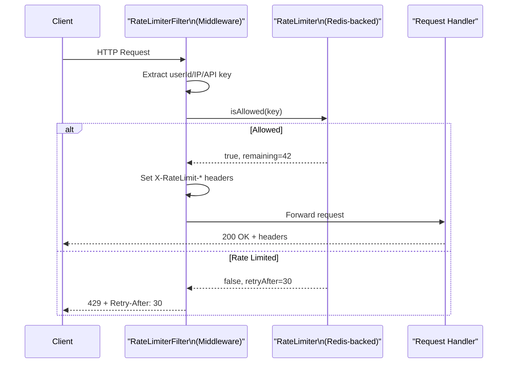

### Java Spring Boot Interceptor

```java
import org.springframework.web.servlet.HandlerInterceptor;
import javax.servlet.http.HttpServletRequest;
import javax.servlet.http.HttpServletResponse;

public class RateLimiterInterceptor implements HandlerInterceptor {

    private final RateLimiter rateLimiter;
    private final int limit;

    public RateLimiterInterceptor(RateLimiter rateLimiter, int limit) {
        this.rateLimiter = rateLimiter;
        this.limit = limit;
    }

    @Override
    public boolean preHandle(HttpServletRequest request,
                              HttpServletResponse response,
                              Object handler) throws Exception {

        // Determine the rate limit key
        String key = extractKey(request);

        boolean allowed = rateLimiter.isAllowed(key);
        int remaining = rateLimiter.getRemainingQuota(key);
        long retryAfter = rateLimiter.getRetryAfterSeconds(key);

        // Always set rate limit headers
        response.setHeader("X-RateLimit-Limit", String.valueOf(limit));
        response.setHeader("X-RateLimit-Remaining", String.valueOf(remaining));
        response.setHeader("X-RateLimit-Reset",
            String.valueOf(System.currentTimeMillis() / 1000 + retryAfter));

        if (!allowed) {
            response.setHeader("Retry-After", String.valueOf(retryAfter));
            response.setStatus(429);
            response.setContentType("application/json");
            response.getWriter().write(
                "{\"error\":\"rate_limit_exceeded\",\"retry_after\":" + retryAfter + "}"
            );
            return false; // Stop request processing
        }

        return true; // Continue to handler
    }

    private String extractKey(HttpServletRequest request) {
        // Priority: authenticated user > API key > IP
        String userId = (String) request.getAttribute("userId");
        if (userId != null) return "user:" + userId;

        String apiKey = request.getHeader("X-API-Key");
        if (apiKey != null) return "apikey:" + apiKey;

        return "ip:" + getRealIp(request);
    }

    private String getRealIp(HttpServletRequest request) {
        // Handle proxies and load balancers
        String forwarded = request.getHeader("X-Forwarded-For");
        if (forwarded != null && !forwarded.isEmpty()) {
            return forwarded.split(",")[0].trim(); // First IP = original client
        }
        return request.getRemoteAddr();
    }
}

// Register the interceptor in Spring config
@Configuration
public class WebConfig implements WebMvcConfigurer {

    @Autowired
    private RateLimiter rateLimiter;

    @Override
    public void addInterceptors(InterceptorRegistry registry) {
        // Global rate limit: 1000/minute per user
        registry.addInterceptor(new RateLimiterInterceptor(rateLimiter, 1000))
                .addPathPatterns("/api/**");

        // Stricter limit on auth endpoints: 5/minute per IP
        registry.addInterceptor(new RateLimiterInterceptor(
                    new FixedWindowRateLimiter(5, 60_000L), 5))
                .addPathPatterns("/auth/login", "/auth/forgot-password");

        // Very strict on export: 3 per hour per user
        registry.addInterceptor(new RateLimiterInterceptor(
                    new TokenBucketRateLimiter(3, 1.0/3600), 3))
                .addPathPatterns("/api/export/**");
    }
}
```

### Python FastAPI Middleware

```python
from fastapi import FastAPI, Request, Response
from fastapi.responses import JSONResponse
import time

app = FastAPI()

# Multiple limiters for different concerns
user_limiter = RedisTokenBucketRateLimiter(redis_client, capacity=1000, refill_rate=16.67)
login_limiter = FixedWindowRateLimiter(limit=5, window_size_seconds=60)
export_limiter = TokenBucketRateLimiter(capacity=3, refill_rate_per_second=1/3600)


def extract_key(request: Request) -> tuple[str, object]:
    """Returns (key, limiter) based on endpoint and authentication."""
    path = request.url.path

    # Stricter limits on auth endpoints
    if path in ["/auth/login", "/auth/forgot-password"]:
        ip = request.headers.get("X-Forwarded-For", request.client.host)
        return f"ip:{ip.split(',')[0].strip()}", login_limiter

    # Export endpoints get per-user strict limits
    if path.startswith("/api/export"):
        user_id = request.state.user_id if hasattr(request.state, "user_id") else None
        if user_id:
            return f"user:{user_id}", export_limiter

    # Default: per-user token bucket
    user_id = getattr(request.state, "user_id", None)
    if user_id:
        return f"user:{user_id}", user_limiter

    # Fallback: per-IP
    ip = request.headers.get("X-Forwarded-For", request.client.host)
    return f"ip:{ip.split(',')[0].strip()}", user_limiter


@app.middleware("http")
async def rate_limit_middleware(request: Request, call_next):
    key, limiter = extract_key(request)
    allowed = limiter.is_allowed(key)
    remaining = limiter.get_remaining_quota(key)
    retry_after = limiter.get_retry_after_seconds(key)

    if not allowed:
        return JSONResponse(
            status_code=429,
            content={
                "error": "rate_limit_exceeded",
                "message": "Too many requests. Please slow down.",
                "retry_after_seconds": retry_after
            },
            headers={
                "Retry-After": str(int(retry_after)),
                "X-RateLimit-Remaining": "0",
            }
        )

    response = await call_next(request)
    response.headers["X-RateLimit-Remaining"] = str(remaining)
    return response
```

### Response Headers (Industry Standard)

Always tell clients their rate limit status so they can implement exponential backoff:

```http
HTTP/1.1 200 OK
X-RateLimit-Limit: 100
X-RateLimit-Remaining: 42
X-RateLimit-Reset: 1735200060
Content-Type: application/json
```

When rate limited:
```http
HTTP/1.1 429 Too Many Requests
X-RateLimit-Limit: 100
X-RateLimit-Remaining: 0
X-RateLimit-Reset: 1735200060
Retry-After: 30
Content-Type: application/json

{
  "error": "rate_limit_exceeded",
  "message": "You have exceeded 100 requests per minute.",
  "retry_after_seconds": 30,
  "documentation_url": "https://api.example.com/docs/rate-limits"
}
```

---

## Combining Per-Endpoint, Per-User, and Per-IP Limits

Real systems use multiple rate limit rules simultaneously. A request passes only if ALL applicable rules allow it.

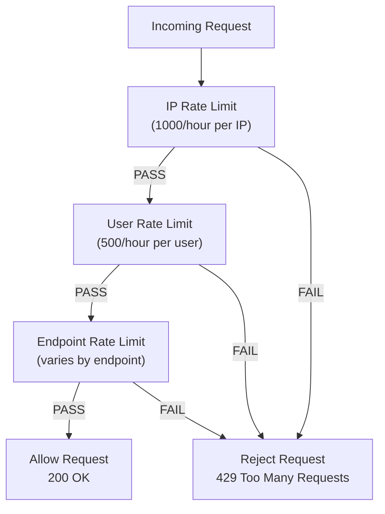

```java
// Composite rate limiter — all rules must pass
public class CompositeRateLimiter implements RateLimiter {

    private final List<RateLimiterRule> rules;

    public CompositeRateLimiter(List<RateLimiterRule> rules) {
        this.rules = rules;
    }

    @Override
    public boolean isAllowed(String userId) {
        // All rules must pass
        return rules.stream().allMatch(rule -> rule.check(userId));
    }
}

// Usage
RateLimiter compositeLimit = new CompositeRateLimiter(List.of(
    new IPRateLimiterRule(ipLimiter, 1000, 3600),          // 1000/hour per IP
    new UserRateLimiterRule(userLimiter, 500, 3600),        // 500/hour per user
    new EndpointRateLimiterRule("/api/search", searchLimiter, 100, 60) // 100/min on search
));
```

---

## Tests

Tests are your proof that the logic is correct. Always write these in an interview if asked.

### Java Tests (JUnit 5)

```java
import org.junit.jupiter.api.*;
import static org.junit.jupiter.api.Assertions.*;
import java.util.concurrent.*;
import java.util.concurrent.atomic.AtomicInteger;

class RateLimiterTest {

    @Test
    @DisplayName("Fixed window: allows up to limit, blocks beyond")
    void testFixedWindowLimit() {
        FixedWindowRateLimiter limiter = new FixedWindowRateLimiter(5, 60_000L);
        String userId = "test-user-1";

        // First 5 should be allowed
        for (int i = 0; i < 5; i++) {
            assertTrue(limiter.isAllowed(userId), "Request " + (i+1) + " should be allowed");
        }

        // 6th should be blocked
        assertFalse(limiter.isAllowed(userId), "6th request should be blocked");
    }

    @Test
    @DisplayName("Fixed window: limit resets after window")
    void testFixedWindowReset() throws InterruptedException {
        // 3 requests per 100ms window
        FixedWindowRateLimiter limiter = new FixedWindowRateLimiter(3, 100L);
        String userId = "test-user-2";

        // Exhaust the limit
        for (int i = 0; i < 3; i++) limiter.isAllowed(userId);
        assertFalse(limiter.isAllowed(userId));

        // Wait for window to pass
        Thread.sleep(110);

        // Should be allowed again
        assertTrue(limiter.isAllowed(userId), "Should be allowed after window reset");
    }

    @Test
    @DisplayName("Token bucket: allows burst up to capacity")
    void testTokenBucketBurst() {
        TokenBucketRateLimiter limiter = new TokenBucketRateLimiter(10, 1.0);
        String userId = "test-user-3";

        // Should allow full burst of 10
        for (int i = 0; i < 10; i++) {
            assertTrue(limiter.isAllowed(userId), "Burst request " + (i+1) + " should be allowed");
        }

        // 11th should be blocked (bucket empty)
        assertFalse(limiter.isAllowed(userId), "Beyond-burst request should be blocked");
    }

    @Test
    @DisplayName("Token bucket: tokens refill over time")
    void testTokenBucketRefill() throws InterruptedException {
        TokenBucketRateLimiter limiter = new TokenBucketRateLimiter(10, 5.0); // 5 tokens/sec
        String userId = "test-user-4";

        // Drain the bucket
        for (int i = 0; i < 10; i++) limiter.isAllowed(userId);
        assertFalse(limiter.isAllowed(userId)); // empty

        // Wait 1 second — should get 5 tokens back
        Thread.sleep(1000);

        int allowed = 0;
        for (int i = 0; i < 6; i++) {
            if (limiter.isAllowed(userId)) allowed++;
        }

        assertTrue(allowed >= 4, "Should have gotten ~5 tokens back after 1 second, got: " + allowed);
    }

    @Test
    @DisplayName("Concurrent requests: rate limit is thread-safe")
    void testConcurrentRequests() throws InterruptedException {
        int limit = 100;
        TokenBucketRateLimiter limiter = new TokenBucketRateLimiter(limit, 10.0);
        String userId = "test-user-concurrent";

        int totalRequests = 200;
        AtomicInteger allowedCount = new AtomicInteger(0);
        AtomicInteger blockedCount = new AtomicInteger(0);

        ExecutorService executor = Executors.newFixedThreadPool(20);
        CountDownLatch latch = new CountDownLatch(totalRequests);

        for (int i = 0; i < totalRequests; i++) {
            executor.submit(() -> {
                try {
                    if (limiter.isAllowed(userId)) {
                        allowedCount.incrementAndGet();
                    } else {
                        blockedCount.incrementAndGet();
                    }
                } finally {
                    latch.countDown();
                }
            });
        }

        latch.await(5, TimeUnit.SECONDS);
        executor.shutdown();

        // Exactly 'limit' requests should be allowed (no more, no less)
        assertEquals(limit, allowedCount.get(),
            "Exactly " + limit + " concurrent requests should be allowed");
        assertEquals(totalRequests - limit, blockedCount.get(),
            "Remaining requests should be blocked");
    }

    @Test
    @DisplayName("Sliding window log: no boundary burst")
    void testSlidingWindowNoBoundaryBurst() throws InterruptedException {
        SlidingWindowLogRateLimiter limiter = new SlidingWindowLogRateLimiter(5, 1000L);
        String userId = "test-user-5";

        // At T=0, make 5 requests
        for (int i = 0; i < 5; i++) {
            assertTrue(limiter.isAllowed(userId));
        }
        assertFalse(limiter.isAllowed(userId)); // 6th blocked

        // At T=500ms, still within window — should still be blocked
        Thread.sleep(500);
        assertFalse(limiter.isAllowed(userId));

        // At T=1100ms, the first 5 timestamps are expired — should be allowed again
        Thread.sleep(600); // now at T=1100ms
        assertTrue(limiter.isAllowed(userId));
    }

    @Test
    @DisplayName("Different users have independent limits")
    void testUserIsolation() {
        TokenBucketRateLimiter limiter = new TokenBucketRateLimiter(5, 1.0);

        // Exhaust user1's quota
        for (int i = 0; i < 5; i++) limiter.isAllowed("user:1");
        assertFalse(limiter.isAllowed("user:1"));

        // user2 should be unaffected
        for (int i = 0; i < 5; i++) {
            assertTrue(limiter.isAllowed("user:2"), "user2 should have their own quota");
        }
    }
}
```

### Python Tests (pytest)

```python
import pytest
import time
import threading
from concurrent.futures import ThreadPoolExecutor, wait

class TestFixedWindowRateLimiter:

    def test_allows_up_to_limit(self):
        limiter = FixedWindowRateLimiter(limit=5, window_size_seconds=60)
        for i in range(5):
            assert limiter.is_allowed("user:1"), f"Request {i+1} should be allowed"
        assert not limiter.is_allowed("user:1"), "6th request should be blocked"

    def test_resets_after_window(self):
        limiter = FixedWindowRateLimiter(limit=3, window_size_seconds=0.1)  # 100ms window
        for _ in range(3):
            limiter.is_allowed("user:2")
        assert not limiter.is_allowed("user:2")

        time.sleep(0.15)  # Wait for window to pass

        assert limiter.is_allowed("user:2"), "Should be allowed after window reset"

    def test_different_users_independent(self):
        limiter = FixedWindowRateLimiter(limit=2, window_size_seconds=60)
        limiter.is_allowed("user:a")
        limiter.is_allowed("user:a")
        assert not limiter.is_allowed("user:a")
        # user:b unaffected
        assert limiter.is_allowed("user:b")
        assert limiter.is_allowed("user:b")


class TestTokenBucketRateLimiter:

    def test_burst_up_to_capacity(self):
        limiter = TokenBucketRateLimiter(capacity=10, refill_rate_per_second=1)
        results = [limiter.is_allowed("user:1") for _ in range(11)]
        assert results[:10] == [True] * 10
        assert results[10] is False

    def test_refills_over_time(self):
        limiter = TokenBucketRateLimiter(capacity=5, refill_rate_per_second=5)
        # Drain
        for _ in range(5):
            limiter.is_allowed("user:2")
        assert not limiter.is_allowed("user:2")

        time.sleep(1.0)  # Wait 1 second — should refill 5 tokens

        allowed = sum(1 for _ in range(5) if limiter.is_allowed("user:2"))
        assert allowed >= 4, f"Expected ~5 tokens after 1s, got {allowed}"

    def test_concurrent_requests_thread_safe(self):
        limit = 100
        limiter = TokenBucketRateLimiter(capacity=limit, refill_rate_per_second=0.001)
        allowed_count = [0]
        lock = threading.Lock()

        def make_request():
            if limiter.is_allowed("user:concurrent"):
                with lock:
                    allowed_count[0] += 1

        with ThreadPoolExecutor(max_workers=50) as executor:
            futures = [executor.submit(make_request) for _ in range(200)]
            wait(futures)

        assert allowed_count[0] == limit, \
            f"Expected exactly {limit} allowed, got {allowed_count[0]}"

    def test_weighted_cost(self):
        limiter = TokenBucketRateLimiter(capacity=10, refill_rate_per_second=1)
        # A bulk operation costs 5 tokens
        assert limiter.is_allowed_with_cost("user:3", cost=5)  # tokens: 5 remaining
        assert limiter.is_allowed_with_cost("user:3", cost=5)  # tokens: 0 remaining
        assert not limiter.is_allowed_with_cost("user:3", cost=5)  # blocked


class TestSlidingWindowLogRateLimiter:

    def test_no_boundary_burst(self):
        limiter = SlidingWindowLogRateLimiter(limit=3, window_size_seconds=0.5)
        # Make 3 requests
        for _ in range(3):
            assert limiter.is_allowed("user:1")
        assert not limiter.is_allowed("user:1")

        time.sleep(0.3)  # Still within window
        assert not limiter.is_allowed("user:1")  # Still blocked

        time.sleep(0.3)  # Now past window
        assert limiter.is_allowed("user:1")  # First request expired, allowed


if __name__ == "__main__":
    pytest.main([__file__, "-v"])
```

---

## Edge Cases to Handle in Interviews

| Edge Case | Problem | Solution |
|---|---|---|
| Redis is down | All requests blocked (fail closed) or all pass (fail open) | Fallback to local in-memory limiter with degraded limits |
| Distributed clock skew | Timestamps differ by seconds across 50 servers | Use Redis `TIME` command — not local system clock |
| Race condition in check-then-act | Two threads both see tokens > 0, both consume | Lua scripts (atomic), or per-user ReentrantLock |
| Key explosion | Millions of Redis keys eating memory | TTL on every key; partition by user tier |
| Retry storms | All 10,000 clients retry at T+30 simultaneously | Return jittered Retry-After: `base + random(0, base/2)` |
| Shared/Proxied IPs | Office NAT: 100 people look like 1 IP | Combine IP + User-Agent; prefer authenticated user ID |
| Burst at server startup | New server joins, all traffic floods it | Pre-warm token bucket to 50% capacity, not 100% |
| Very high QPS key | Single Redis key hit 1M times/second | Use local cache with 100ms TTL to absorb micro-bursts |
| Negative token balance | Cost > bucket size — always rejected | Handle `cost > capacity` as a configuration error |
| New user first request | No key in Redis yet — should it be allowed? | Yes: default to full bucket/fresh window for new keys |

---

## Full System Design: Putting It All Together

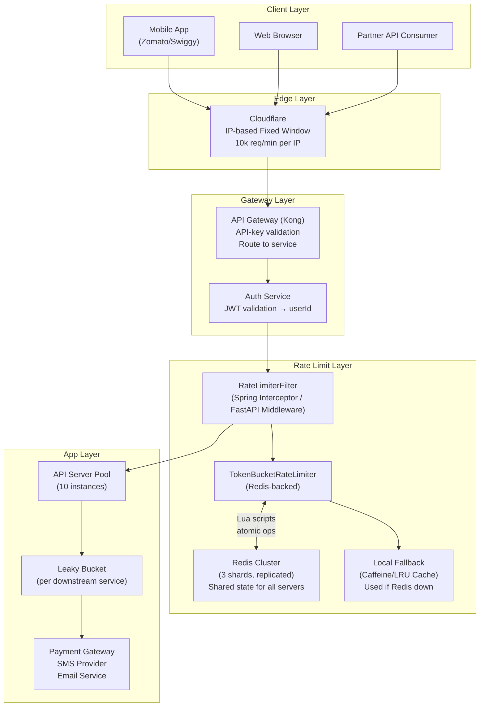

### Failure Modes Decision

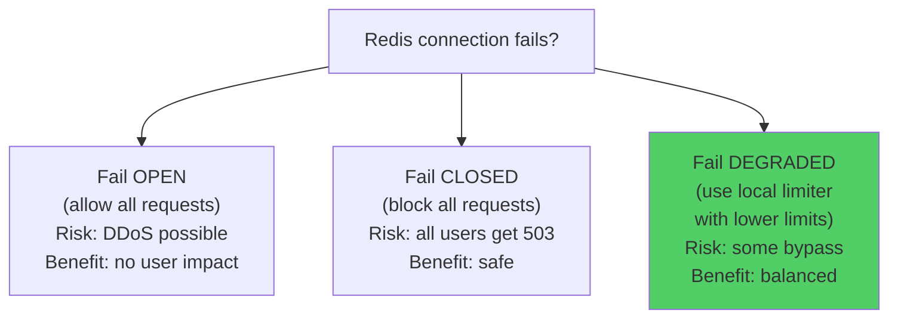

**Recommended:** Fail DEGRADED. Use local in-memory limits with 50-70% of normal capacity. Alerting fires immediately. Redis issue resolved within minutes. No user impact.

---

## Performance Tips

1. **Pipeline Redis operations** — batch `INCR + EXPIRE` into one round-trip using `MULTI/EXEC`
2. **Local L1 cache** — store last known quota locally for 50-100ms before checking Redis; reduces Redis QPS by 10-20x
3. **Lua scripts** — atomicity without `WATCH/MULTI/EXEC` overhead; 40% faster than pipelined commands
4. **Avoid Sliding Window Log at scale** — it doesn't distribute well; each Redis `ZADD/ZCARD` grows linearly
5. **Shard Redis by user ID range** — key `rl:user:1234:*` goes to shard 1, `rl:user:5678:*` to shard 2; avoids hot keys
6. **Use Redis Cluster, not single instance** — single Redis is a SPOF; cluster gives HA + horizontal scale
7. **LRU eviction policy** — set `maxmemory-policy allkeys-lru` in Redis so old rate limit keys are evicted automatically
8. **ConcurrentHashMap vs HashMap** — always use `ConcurrentHashMap` in Java; never synchronize on a regular HashMap
9. **LongAdder over AtomicLong** — for high-contention counters, `LongAdder` is faster due to cell-based striping

---

## Interview Cheat Sheet

**"Which algorithm would you use?"**

Answer with a question back: "What's the use case?"

| Use Case | Algorithm | Why |
|---|---|---|
| Simple internal API | Fixed Window Counter | Easiest to understand and debug |
| Public REST API (Stripe/GitHub) | Token Bucket | Allows burst, standard in the industry |
| Cloudflare-style edge limiting | Sliding Window Counter | Best accuracy-memory trade-off |
| Login / OTP brute-force prevention | Sliding Window Log | Accuracy matters more than memory here |
| SMS / Email / Payment gateway | Leaky Bucket | Smooth output rate protects the downstream |

**Then say this killer answer in the interview:**

> "In production I'd layer them — IP-based Fixed Window at the edge (Cloudflare), Token Bucket per authenticated user in app middleware (Redis-backed with Lua scripts for atomicity), and Leaky Bucket at the downstream service boundary to smooth calls to payment and notification providers. All three layers serve different threat models."

**Follow-up questions and your answers:**

| Question | Your Answer |
|---|---|
| "What if Redis goes down?" | "Fail degraded: fall back to local in-memory limiter with 50% quota. Alert fires. Redis recovers in minutes." |
| "How do you prevent race conditions?" | "Lua scripts execute atomically in Redis. In-memory: per-user ReentrantLock in ConcurrentHashMap." |
| "How do you handle distributed clock skew?" | "Use Redis TIME command on the Redis server itself — not the application server clock." |
| "How do you handle expensive operations?" | "Weighted token bucket: a bulk export costs 10 tokens, a normal request costs 1." |
| "What HTTP status and headers do you return?" | "429 Too Many Requests with X-RateLimit-Limit, X-RateLimit-Remaining, X-RateLimit-Reset, Retry-After." |

---

## Common Interview Questions

1. **Design a rate limiter for an API that supports 1 million users with different subscription tiers.** (Discuss tiered limits, Redis key namespacing, Lua scripts)

2. **How would you implement a rate limiter that allows 100 requests per sliding minute across 20 distributed servers?** (Discuss Redis shared state, atomic operations, clock skew)

3. **What is the difference between token bucket and leaky bucket? When would you choose each?** (Token bucket: burst tolerance. Leaky bucket: smooth output. Token bucket for public APIs, leaky bucket for downstream protection.)

4. **A user is hitting your API from a NAT'd office — 200 employees share one IP. How do you handle this?** (Use user ID when authenticated, IP as fallback; higher limits per IP for known corporate ranges)

5. **How do you prevent the boundary burst problem in Fixed Window Counter?** (Use Sliding Window Counter or Sliding Window Log; or move to Token Bucket)

6. **Your Redis cluster is slow (high latency). What do you do?** (L1 local cache with 100ms TTL; pipeline commands; use Lua scripts to reduce round-trips; consider read replicas)

7. **How do you write a Lua script for atomic token bucket in Redis?** (Explain HMGET → refill calculation → check → HMSET in a single script block)

8. **Design the class hierarchy for a rate limiter.** (RateLimiter interface → multiple implementations → factory pattern or dependency injection for swappability)

---

## Key Takeaways

1. **No single algorithm fits all cases.** Fixed Window is simple but has boundary bursts. Token Bucket is the best general-purpose choice. Sliding Window Log is most accurate but memory-heavy. Sliding Window Counter is the best balance. Leaky Bucket smooths output.

2. **Rate limiting is a distributed systems problem.** A local counter on one server is wrong behind a load balancer. Redis with Lua scripts gives atomic, shared state across all servers.

3. **Layer your rate limits.** IP-level at the edge, API-key level at the gateway, user-level in middleware, endpoint-level for expensive operations. Each layer has a different threat model.

4. **Always return proper HTTP headers.** Clients need `X-RateLimit-Limit`, `X-RateLimit-Remaining`, `X-RateLimit-Reset`, and `Retry-After`. This prevents retry storms and enables smart backoff.

5. **Plan for Redis failure.** Decide: fail open (risky), fail closed (user-impacting), or fail degraded (recommended). Most systems choose degraded — local fallback with lower limits.

6. **Token Bucket is the industry default.** AWS API Gateway, Stripe, GitHub, and most major APIs use token bucket because it allows controlled bursting while protecting sustained load. Start here.

7. **Lua scripts are your atomicity weapon.** Any multi-step Redis operation (check tokens → refill → decrement) is a race condition without Lua. A single Lua script runs as one atomic Redis command.

8. **Thread safety in Java:** Use `ConcurrentHashMap` for the outer map. Use per-user `ReentrantLock` for operations that span multiple fields. Use `AtomicInteger` for simple counters.

9. **The RateLimiter interface is the key design decision.** Defining a clean `isAllowed(userId)` interface lets you swap algorithms, add decorators (logging, metrics), and test in isolation.

10. **Always write tests for:** rate limit enforcement, limit reset after window, concurrent requests (thread-safety), different users don't interfere with each other, weighted cost requests.

---

*LLD Case Study: Rate Limiter | Series: Low Level Design Interview Prep | Difficulty: Medium-Hard*
