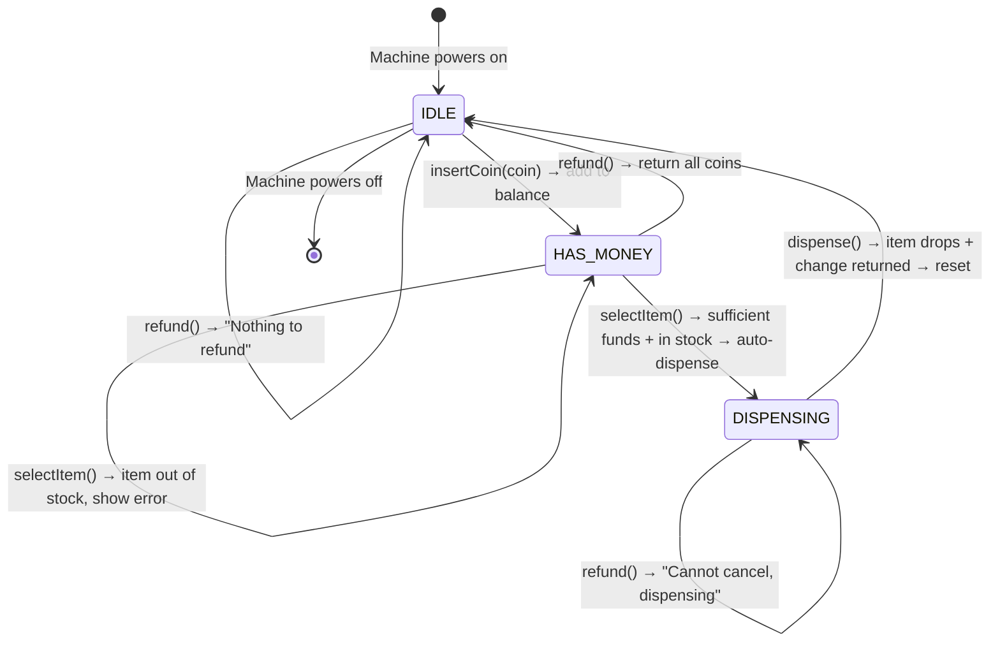
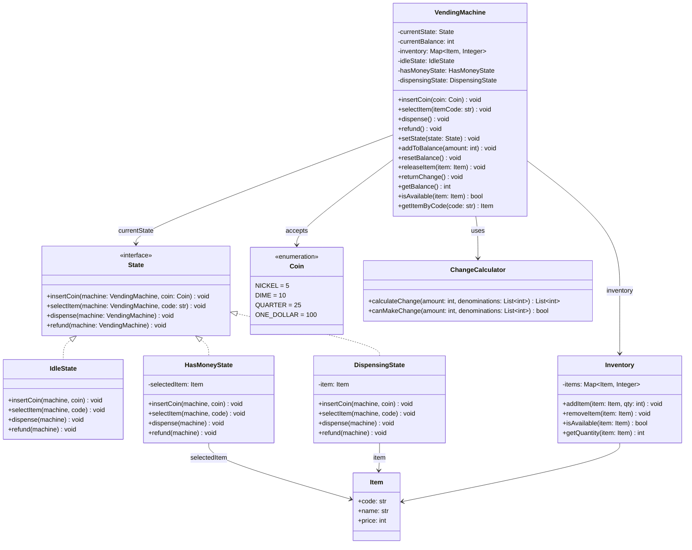
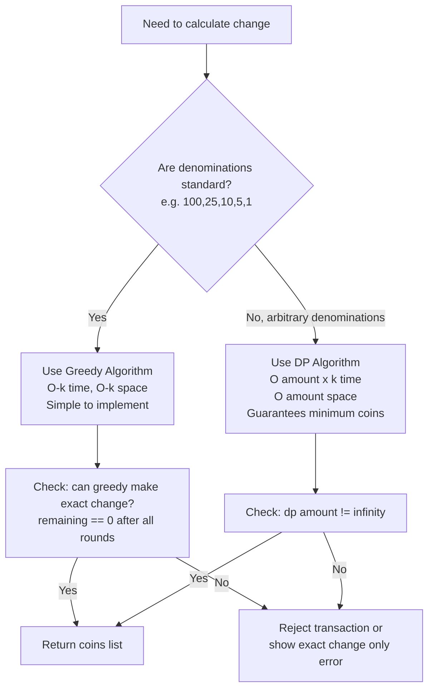
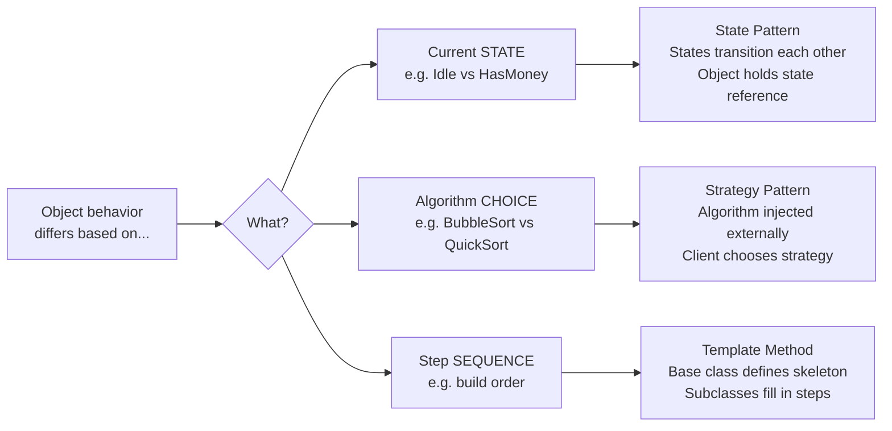

# LLD Case Study: Design a Vending Machine

> **Interview Difficulty:** Medium-Hard
> **Core Pattern:** State Machine (State Design Pattern)
> **Key Concepts:** State transitions, inventory management, coin change algorithm, concurrency, error handling
> **Languages:** Python + Java (full working code for both)

---

## The 5-Year-Old Analogy

Imagine you have a toy robot that behaves differently depending on what it's doing right now.

When the robot is just standing there doing nothing (idle), and you try to say "give me a toy" — it says "first put a coin in my hand!" But when you put a coin in its hand (it's now "holding money"), and you say "give me a toy" — it actually gives you the toy! Same words, but the robot reacts totally differently because of what's happening RIGHT NOW.

That's a state machine. The vending machine is just this robot. Its "state" — whether it's idle, holding money, or currently dispensing — determines exactly how it reacts to every button you press.

Yeh understanding solid ho gayi toh baaqi sab easy hai.

---

## Why This Problem Exists in Interviews

Yeh kyun important hai? Because this problem is deceptively simple on the surface ("it's just a vending machine bro") but exposes whether you can:

1. **Model real-world behavior** — not just write code, but capture how a physical machine actually works
2. **Apply the right OOP pattern** — State pattern, not a giant if-else spider web
3. **Think about edge cases** — what if the machine is out of stock? What if you can't make change?
4. **Handle algorithms** — greedy coin change, which most people get wrong for non-standard denominations
5. **Reason about concurrency** — two people at the same machine at the same time? (Not common physically but worth mentioning)

Companies like Flipkart, Swiggy, Zomato, Ola, and every major tech company use this as a filter for senior engineers. It's a "design litmus test."

---

## Real-World Story First

Samjho aise — you're at the Mumbai airport. You walk up to a vending machine at Gate 3B. You're about to miss your flight, you're stressed, and you just want a bottle of water.

Here's what the machine is "thinking" at every step:

1. **Before you walk up** — machine is in IDLE. Screen says "Insert coins." If someone accidentally presses a button now, nothing happens (no money = no item).

2. **You insert Rs. 20** — machine transitions to HAS_MONEY state. Now the same button press that did nothing before will attempt to dispense an item!

3. **You press the water button (Rs. 15)** — machine checks: do I have water? Yes. Do you have enough money? Rs. 20 >= Rs. 15? Yes. Can I return Rs. 5 change? Yes. OK, go to DISPENSING state.

4. **Water bottle drops** — machine is in DISPENSING state. During this exact moment, even if someone else tries to insert money or press buttons, the machine ignores them.

5. **Rs. 5 in change clinks out** — machine goes back to IDLE. Ready for the next person.

Same machine, same buttons, but radically different behavior depending on what state it's in. That's why you model it as a state machine, not as one giant method with a hundred if-else conditions.

---

## Requirements — Always Start Here

In an interview, this is where you EARN respect. Before touching code, spend 3-5 minutes clarifying requirements. Here's what to ask:

### Functional Requirements

- Users can insert coins of fixed denominations (Nickel 5c, Dime 10c, Quarter 25c, Dollar $1)
- Users can select an item by item code
- Machine dispenses the selected item if sufficient funds are available
- Machine returns change if user overpays
- User can cancel and get all inserted money back
- Admin can restock items
- Handle errors gracefully: out of stock, insufficient funds, cannot make change

### Non-Functional Requirements

- Thread-safe state transitions (production machines handle concurrent signals)
- Extensible — adding a new state (like "MAINTENANCE") should not break existing states
- Testable — each state should be independently testable
- Clean error messages — real UX matters

### Clarifying Questions to Ask

| Question | Why It Matters |
|---|---|
| Do users select item first or insert money first? | Affects IdleState.selectItem() behavior |
| What coin denominations are supported? | Determines change algorithm |
| Is there an "exact change only" mode? | Extra state or flag on the machine |
| Can admin interact while machine is in use? | Concurrency model |
| What happens on power loss mid-dispense? | Out of LLD scope, but shows awareness |
| Can the machine give notes (bills) as change? | Affects Coin enum design |

---

## The State Machine — Draw This FIRST

Yeh diagram is your design. Code is just translating this picture into text.



### Key Insight: Who Triggers Transitions?

Most beginners answer: "The VendingMachine class checks state and decides."
Senior answer: "Each State object handles its own events and calls `machine.setState()` when a transition is needed."

Why does this matter? Because it keeps VendingMachine clean — it just delegates. Each state is a self-contained unit of behavior. Adding a new state (like `MaintenanceState`) means adding one new class, not modifying VendingMachine.

This is the **Open/Closed Principle** in action: open for extension, closed for modification.

---

## Class Design — The Full Blueprint



---

## The State Pattern — Deep Dive

### The Real-World Parallel: Zomato Order States

Think about your Zomato food order. It can be in states:
- **PLACED** — order received
- **CONFIRMED** — restaurant accepted
- **PREPARING** — food being cooked
- **OUT_FOR_DELIVERY** — Sanjay is on his way
- **DELIVERED** — you're eating

In each state, different actions are valid:
- You can cancel from PLACED or CONFIRMED, but NOT from OUT_FOR_DELIVERY
- You can't rate the restaurant until DELIVERED
- The restaurant can only mark "ready" from PREPARING state

Exactly the same logic applies to a vending machine. Each state knows which actions make sense, and which should be rejected with a helpful error message.

### Without State Pattern — The If-Else Nightmare

```python
# This is what BAD code looks like. DO NOT write this.
def select_item(self, item_code):
    if self.state == "IDLE":
        print("Please insert money first")
    elif self.state == "HAS_MONEY":
        if item_code not in self.inventory:
            print("Item not found")
        elif self.inventory[item_code] == 0:
            print("Out of stock")
        elif self.balance < self.get_item(item_code).price:
            print("Insufficient funds")
        else:
            # ... transition logic here
            if self.state == "DISPENSING":
                # wait, what? we're already nested 4 levels deep
                pass
    elif self.state == "DISPENSING":
        print("Please wait")
    # New state? You touch this entire method. And every other method.
    # This violates Open/Closed Principle and is a maintenance disaster.
```

Every time you add a state, you touch every method. 4 states × 4 methods = 16 places to update. 6 states = 24 places. The bug surface grows quadratically.

### With State Pattern — Clean and Extensible

```python
def select_item(self, item_code):
    # VendingMachine doesn't know OR CARE about state logic
    # It just delegates to whoever is current
    self.current_state.select_item(self, item_code)
```

Each state class owns its behavior. VendingMachine is just a router. Adding a new state = adding one new class. This is how professionals write it.

---

## Full Python Implementation

### Step 1: Coin Enum and Item

```python
from enum import Enum
from abc import ABC, abstractmethod
from typing import Dict, Optional, List


class Coin(Enum):
    """
    Coin denominations supported by the machine.
    Value is in cents (1 cent = smallest unit).
    Sorted largest-first for the greedy change algorithm.
    """
    ONE_DOLLAR = 100
    QUARTER    = 25
    DIME       = 10
    NICKEL     = 5

    @classmethod
    def denominations(cls) -> List[int]:
        """Return all coin values, largest first."""
        return sorted([c.value for c in cls], reverse=True)


class Item:
    """
    Represents a product in the vending machine.
    Price is in cents to avoid floating-point errors.
    (Never store money as float — 0.1 + 0.2 != 0.3 in IEEE 754)
    """
    def __init__(self, code: str, name: str, price: int):
        self.code  = code
        self.name  = name
        self.price = price  # in cents

    def __repr__(self) -> str:
        return f"Item({self.code}, {self.name}, {self.price}¢)"

    def __hash__(self):
        return hash(self.code)

    def __eq__(self, other):
        return isinstance(other, Item) and self.code == other.code
```

### Step 2: Inventory

```python
class Inventory:
    """
    Manages item quantities.
    Separate class to keep VendingMachine focused on state logic.
    Single Responsibility Principle — inventory is its own concern.
    """
    def __init__(self):
        self._items: Dict[Item, int] = {}

    def add_item(self, item: Item, quantity: int) -> None:
        if quantity < 0:
            raise ValueError("Quantity cannot be negative")
        current = self._items.get(item, 0)
        self._items[item] = current + quantity
        print(f"[INVENTORY] {item.name}: {current} -> {current + quantity}")

    def remove_item(self, item: Item) -> None:
        """Remove one unit. Raises if out of stock."""
        qty = self._items.get(item, 0)
        if qty == 0:
            raise RuntimeError(f"{item.name} is out of stock")
        self._items[item] = qty - 1

    def is_available(self, item: Item) -> bool:
        return self._items.get(item, 0) > 0

    def get_quantity(self, item: Item) -> int:
        return self._items.get(item, 0)

    def get_item_by_code(self, code: str) -> Optional[Item]:
        for item in self._items:
            if item.code == code:
                return item
        return None

    def display(self) -> None:
        print("\n[INVENTORY]")
        for item, qty in self._items.items():
            status = "IN STOCK" if qty > 0 else "OUT OF STOCK"
            print(f"  [{item.code}] {item.name:15} Rs.{item.price/100:.2f}  qty:{qty}  {status}")
```

### Step 3: Change Calculator

```python
class ChangeCalculator:
    """
    Calculates coins to return as change.

    Two algorithms:
    1. Greedy — works perfectly for standard coin systems (US coins, Indian coins)
    2. Dynamic Programming — works for ANY denomination set (optimal coin count)

    Interview tip: always ask "what denominations does this machine support?"
    If they're standard (25, 10, 5, 1) → greedy.
    If they're arbitrary → DP.
    """

    @staticmethod
    def greedy(amount: int, denominations: List[int]) -> List[int]:
        """
        Greedy algorithm: always pick the largest coin that fits.
        O(k) time where k = number of denomination types.

        Example: change = 41 cents, denominations = [25, 10, 5, 1]
          Step 1: 41 // 25 = 1 coin of 25c  → remaining = 16
          Step 2: 16 // 10 = 1 coin of 10c  → remaining = 6
          Step 3:  6 //  5 = 1 coin of  5c  → remaining = 1
          Step 4:  1 //  1 = 1 coin of  1c  → remaining = 0
          Result: [25, 10, 5, 1] → 4 coins
        """
        sorted_denoms = sorted(denominations, reverse=True)
        result = []
        remaining = amount

        for coin in sorted_denoms:
            count = remaining // coin
            result.extend([coin] * count)
            remaining -= count * coin

        if remaining != 0:
            return []  # Cannot make exact change
        return result

    @staticmethod
    def dp_optimal(amount: int, denominations: List[int]) -> List[int]:
        """
        Dynamic programming: finds MINIMUM number of coins.
        O(amount * k) time, O(amount) space.

        Example where greedy FAILS:
          denominations = [1, 3, 4], amount = 6
          Greedy: 4 + 1 + 1 = 3 coins  (WRONG — not minimum)
          DP:     3 + 3     = 2 coins  (CORRECT — minimum)
        """
        dp = [float('inf')] * (amount + 1)
        coin_used = [-1] * (amount + 1)
        dp[0] = 0

        for i in range(1, amount + 1):
            for coin in denominations:
                if coin <= i and dp[i - coin] + 1 < dp[i]:
                    dp[i] = dp[i - coin] + 1
                    coin_used[i] = coin

        if dp[amount] == float('inf'):
            return []  # Cannot make change

        result = []
        remaining = amount
        while remaining > 0:
            result.append(coin_used[remaining])
            remaining -= coin_used[remaining]
        return result

    @staticmethod
    def can_make_change(amount: int, denominations: List[int]) -> bool:
        """Quick check before committing to a transaction."""
        return len(ChangeCalculator.greedy(amount, denominations)) > 0 or amount == 0
```

### Step 4: State Interface

```python
class State(ABC):
    """
    The State interface.
    Every concrete state MUST implement all 4 actions.

    Design note: even if an action is invalid in a state (like inserting
    money while dispensing), the method must still exist — it just prints
    an error message. This is called a "null operation" or "no-op."
    """

    @abstractmethod
    def insert_coin(self, machine: 'VendingMachine', coin: Coin) -> None:
        pass

    @abstractmethod
    def select_item(self, machine: 'VendingMachine', item_code: str) -> None:
        pass

    @abstractmethod
    def dispense(self, machine: 'VendingMachine') -> None:
        pass

    @abstractmethod
    def refund(self, machine: 'VendingMachine') -> None:
        pass

    def __repr__(self) -> str:
        return self.__class__.__name__
```

### Step 5: IdleState

```python
class IdleState(State):
    """
    Machine is waiting. No money inserted.

    Valid actions:
      - insert_coin: YES → transition to HasMoneyState
      - select_item: MAYBE → pre-selection allowed but stays idle
      - dispense: NO → error
      - refund: NO → nothing to refund
    """

    def insert_coin(self, machine: 'VendingMachine', coin: Coin) -> None:
        machine.add_to_balance(coin.value)
        print(f"[IDLE] Coin accepted: {coin.name} ({coin.value}c). Balance: {machine.get_balance()}c")
        machine.set_state(machine.has_money_state)

    def select_item(self, machine: 'VendingMachine', item_code: str) -> None:
        # Design choice: allow pre-selection in IDLE
        # The machine shows item info but stays IDLE until money is inserted
        item = machine.inventory.get_item_by_code(item_code)
        if not item:
            print(f"[IDLE] Item '{item_code}' not found.")
            return
        if not machine.inventory.is_available(item):
            print(f"[IDLE] Sorry, {item.name} is OUT OF STOCK.")
            return
        print(f"[IDLE] {item.name} selected (price: {item.price}c). Please insert coins.")
        # We stay in IDLE — no money yet
        # Some machines skip this and require money first. That's also valid.

    def dispense(self, machine: 'VendingMachine') -> None:
        print("[IDLE] Please insert coins and select an item first.")

    def refund(self, machine: 'VendingMachine') -> None:
        print("[IDLE] No money inserted. Nothing to refund.")
```

### Step 6: HasMoneyState

```python
class HasMoneyState(State):
    """
    Money has been inserted. Machine is ready to dispense.

    Valid actions:
      - insert_coin: YES → add more money, stay in HasMoney
      - select_item: YES → check stock + balance → go to Dispensing OR show error
      - dispense: depends on selected item
      - refund: YES → return all money, go to Idle

    This is the most complex state — most decisions happen here.
    """

    def __init__(self):
        self._selected_item: Optional[Item] = None

    def insert_coin(self, machine: 'VendingMachine', coin: Coin) -> None:
        machine.add_to_balance(coin.value)
        print(f"[HAS_MONEY] Added {coin.name}. Total balance: {machine.get_balance()}c")

    def select_item(self, machine: 'VendingMachine', item_code: str) -> None:
        item = machine.inventory.get_item_by_code(item_code)

        # Guard 1: Item exists?
        if not item:
            print(f"[HAS_MONEY] Item '{item_code}' not found.")
            return

        # Guard 2: Item in stock?
        if not machine.inventory.is_available(item):
            print(f"[HAS_MONEY] Sorry, {item.name} is OUT OF STOCK.")
            return

        # Guard 3: Sufficient funds?
        balance = machine.get_balance()
        if balance < item.price:
            shortfall = item.price - balance
            print(f"[HAS_MONEY] Insufficient funds. Need {shortfall}c more for {item.name}.")
            return

        # Guard 4: Can we make change?
        change_amount = balance - item.price
        if change_amount > 0:
            if not ChangeCalculator.can_make_change(change_amount, Coin.denominations()):
                print(f"[HAS_MONEY] Cannot make {change_amount}c change. Use exact amount or cancel.")
                return

        # All guards passed — save selected item and dispense
        self._selected_item = item
        print(f"[HAS_MONEY] {item.name} selected. Dispensing...")
        machine.set_state(machine.dispensing_state)
        machine.dispensing_state.set_item(item)
        machine.dispensing_state.dispense(machine)

    def dispense(self, machine: 'VendingMachine') -> None:
        if self._selected_item is None:
            print("[HAS_MONEY] No item selected yet. Please select an item.")
        else:
            # Item was already selected — trigger dispense
            machine.set_state(machine.dispensing_state)
            machine.dispensing_state.dispense(machine)

    def refund(self, machine: 'VendingMachine') -> None:
        balance = machine.get_balance()
        coins = ChangeCalculator.greedy(balance, Coin.denominations())
        print(f"[HAS_MONEY] Refunding {balance}c → coins: {coins}")
        machine.reset_balance()
        self._selected_item = None
        machine.set_state(machine.idle_state)

    def reset(self):
        self._selected_item = None
```

### Step 7: DispensingState

```python
class DispensingState(State):
    """
    The machine is physically dropping the item.
    No user input is accepted during this time.
    Once done, return change and go back to Idle.
    """

    def __init__(self):
        self._item: Optional[Item] = None

    def set_item(self, item: Item) -> None:
        self._item = item

    def insert_coin(self, machine: 'VendingMachine', coin: Coin) -> None:
        print("[DISPENSING] Please wait — dispensing in progress. Coin not accepted.")

    def select_item(self, machine: 'VendingMachine', item_code: str) -> None:
        print("[DISPENSING] Please wait — dispensing in progress.")

    def dispense(self, machine: 'VendingMachine') -> None:
        if self._item is None:
            print("[DISPENSING] Error: no item set. Something went wrong.")
            machine.set_state(machine.idle_state)
            return

        # Step 1: Remove item from inventory
        machine.inventory.remove_item(self._item)
        print(f"[DISPENSING] >>> {self._item.name} is being dispensed... <<<")

        # Step 2: Calculate and return change
        item_price = self._item.price
        balance    = machine.get_balance()
        change     = balance - item_price

        # Deduct item price from balance
        machine.deduct_from_balance(item_price)

        if change > 0:
            coins = ChangeCalculator.greedy(change, Coin.denominations())
            print(f"[DISPENSING] Returning change: {change}c → coins: {coins}")
            machine.reset_balance()
        else:
            print("[DISPENSING] Exact change — no coins to return.")
            machine.reset_balance()

        # Step 3: Reset and go back to IDLE
        self._item = None
        machine.has_money_state.reset()
        machine.set_state(machine.idle_state)
        print("[DISPENSING] Transaction complete. Thank you!")

    def refund(self, machine: 'VendingMachine') -> None:
        print("[DISPENSING] Cannot cancel — item already being dispensed.")
```

### Step 8: VendingMachine (The Context)

```python
class VendingMachine:
    """
    The Context class in the State Pattern.

    Responsibilities:
    1. Hold the current state
    2. Delegate ALL behavior to current state
    3. Provide mutation methods that states can call (add_to_balance, reset_balance, etc.)
    4. Expose query methods that states can use to make decisions

    What VendingMachine does NOT do:
    - Contains zero if-else on state (that's each state's job)
    - Does not decide transitions (each state decides its own transitions)
    """

    def __init__(self):
        self.inventory = Inventory()

        # Create state objects once — they are stateless and reused
        self.idle_state       = IdleState()
        self.has_money_state  = HasMoneyState()
        self.dispensing_state = DispensingState()

        # Machine starts idle
        self._current_state: State = self.idle_state
        self._balance: int = 0  # in cents

    # ── Public API (delegates to current state) ────────────────────────────

    def insert_coin(self, coin: Coin) -> None:
        print(f"\n--- Insert Coin: {coin.name} ---")
        self._current_state.insert_coin(self, coin)

    def select_item(self, item_code: str) -> None:
        print(f"\n--- Select Item: {item_code} ---")
        self._current_state.select_item(self, item_code)

    def dispense(self) -> None:
        print("\n--- Dispense ---")
        self._current_state.dispense(self)

    def refund(self) -> None:
        print("\n--- Refund ---")
        self._current_state.refund(self)

    # ── Admin operations ───────────────────────────────────────────────────

    def restock(self, item: Item, quantity: int) -> None:
        self.inventory.add_item(item, quantity)

    # ── State mutation (called by state objects) ───────────────────────────

    def set_state(self, state: State) -> None:
        print(f"[TRANSITION] {self._current_state} → {state}")
        self._current_state = state

    def add_to_balance(self, amount: int) -> None:
        self._balance += amount

    def deduct_from_balance(self, amount: int) -> None:
        self._balance -= amount

    def reset_balance(self) -> None:
        self._balance = 0

    # ── Query methods (used by state objects) ─────────────────────────────

    def get_balance(self) -> int:
        return self._balance

    def get_current_state(self) -> str:
        return str(self._current_state)

    # ── Status display ─────────────────────────────────────────────────────

    def status(self) -> None:
        print(f"\n{'='*40}")
        print(f"  STATE   : {self._current_state}")
        print(f"  BALANCE : {self._balance}c (${self._balance/100:.2f})")
        self.inventory.display()
        print(f"{'='*40}\n")
```

### Step 9: Full Demo

```python
def run_demo():
    machine = VendingMachine()

    # Stock the machine
    cola    = Item("A1", "Cola",       150)  # $1.50
    chips   = Item("A2", "Chips",      100)  # $1.00
    water   = Item("A3", "Water",       75)  # $0.75
    sandwich = Item("A4", "Sandwich",  200)  # $2.00

    machine.restock(cola,     5)
    machine.restock(chips,    3)
    machine.restock(water,    0)   # deliberately out of stock
    machine.restock(sandwich, 2)

    machine.status()

    # ── Scenario 1: Happy path — exact change ──────────────────────────────
    print("\n" + "="*60)
    print("SCENARIO 1: Buy Cola with exact change ($1.50)")
    print("="*60)
    machine.insert_coin(Coin.ONE_DOLLAR)
    machine.insert_coin(Coin.QUARTER)
    machine.insert_coin(Coin.QUARTER)
    machine.select_item("A1")
    machine.status()

    # ── Scenario 2: Overpayment — get change back ──────────────────────────
    print("\n" + "="*60)
    print("SCENARIO 2: Buy Chips ($1.00) with $2.00 — expect $1.00 change")
    print("="*60)
    machine.insert_coin(Coin.ONE_DOLLAR)
    machine.insert_coin(Coin.ONE_DOLLAR)
    machine.select_item("A2")
    machine.status()

    # ── Scenario 3: Refund ─────────────────────────────────────────────────
    print("\n" + "="*60)
    print("SCENARIO 3: Insert money then cancel")
    print("="*60)
    machine.insert_coin(Coin.QUARTER)
    machine.insert_coin(Coin.DIME)
    machine.refund()
    machine.status()

    # ── Scenario 4: Out of stock ───────────────────────────────────────────
    print("\n" + "="*60)
    print("SCENARIO 4: Try to buy Water (out of stock)")
    print("="*60)
    machine.insert_coin(Coin.ONE_DOLLAR)
    machine.select_item("A3")   # Water is out of stock
    machine.refund()

    # ── Scenario 5: Insufficient funds ────────────────────────────────────
    print("\n" + "="*60)
    print("SCENARIO 5: Try to buy Sandwich ($2.00) with only $0.50")
    print("="*60)
    machine.insert_coin(Coin.QUARTER)
    machine.insert_coin(Coin.QUARTER)
    machine.select_item("A4")  # Need $2.00, only have $0.50
    machine.refund()

    # ── Scenario 6: Invalid item code ─────────────────────────────────────
    print("\n" + "="*60)
    print("SCENARIO 6: Select nonexistent item code")
    print("="*60)
    machine.insert_coin(Coin.ONE_DOLLAR)
    machine.select_item("Z9")  # Does not exist
    machine.refund()

    # ── Scenario 7: Dispense in idle state ────────────────────────────────
    print("\n" + "="*60)
    print("SCENARIO 7: Try to dispense from idle (no money)")
    print("="*60)
    machine.dispense()  # Machine is IDLE, should reject


if __name__ == "__main__":
    run_demo()
```

---

## Full Java Implementation

Java gives us stronger typing and a cleaner enum design. Also, interviewers at companies like Google, Amazon, and Microsoft often prefer Java for LLD interviews.

### Coin.java

```java
public enum Coin {
    NICKEL(5),
    DIME(10),
    QUARTER(25),
    ONE_DOLLAR(100);

    private final int value; // in cents

    Coin(int value) {
        this.value = value;
    }

    public int getValue() {
        return value;
    }

    /**
     * Return all denominations sorted largest first.
     * Used by the greedy change algorithm.
     */
    public static int[] denominationsSorted() {
        return new int[]{100, 25, 10, 5};
    }
}
```

### Item.java

```java
import java.util.Objects;

public class Item {
    private final String code;
    private final String name;
    private final int price; // in cents

    public Item(String code, String name, int price) {
        this.code  = code;
        this.name  = name;
        this.price = price;
    }

    public String getCode()  { return code;  }
    public String getName()  { return name;  }
    public int    getPrice() { return price; }

    @Override
    public boolean equals(Object o) {
        if (this == o) return true;
        if (!(o instanceof Item)) return false;
        return Objects.equals(code, ((Item) o).code);
    }

    @Override
    public int hashCode() { return Objects.hash(code); }

    @Override
    public String toString() {
        return String.format("Item[%s, %s, %dc]", code, name, price);
    }
}
```

### Inventory.java

```java
import java.util.HashMap;
import java.util.Map;
import java.util.Optional;

public class Inventory {
    private final Map<Item, Integer> stock = new HashMap<>();

    public void addItem(Item item, int quantity) {
        if (quantity < 0) throw new IllegalArgumentException("Quantity cannot be negative");
        stock.merge(item, quantity, Integer::sum);
        System.out.printf("[INVENTORY] %s stocked. Quantity: %d%n",
                item.getName(), stock.get(item));
    }

    public void removeItem(Item item) {
        int qty = stock.getOrDefault(item, 0);
        if (qty == 0) throw new IllegalStateException(item.getName() + " is out of stock");
        stock.put(item, qty - 1);
    }

    public boolean isAvailable(Item item) {
        return stock.getOrDefault(item, 0) > 0;
    }

    public int getQuantity(Item item) {
        return stock.getOrDefault(item, 0);
    }

    public Optional<Item> getByCode(String code) {
        return stock.keySet().stream()
                .filter(i -> i.getCode().equals(code))
                .findFirst();
    }

    public void display() {
        System.out.println("[INVENTORY]");
        stock.forEach((item, qty) ->
            System.out.printf("  [%s] %-15s $%.2f  qty:%d  %s%n",
                item.getCode(), item.getName(),
                item.getPrice() / 100.0, qty,
                qty > 0 ? "IN STOCK" : "OUT OF STOCK"));
    }
}
```

### State.java (Interface)

```java
public interface State {
    void insertCoin(VendingMachine machine, Coin coin);
    void selectItem(VendingMachine machine, String itemCode);
    void dispense(VendingMachine machine);
    void refund(VendingMachine machine);
}
```

### IdleState.java

```java
public class IdleState implements State {

    @Override
    public void insertCoin(VendingMachine machine, Coin coin) {
        machine.addToBalance(coin.getValue());
        System.out.printf("[IDLE] Coin accepted: %s (%dc). Balance: %dc%n",
                coin.name(), coin.getValue(), machine.getBalance());
        machine.setState(machine.getHasMoneyState());
    }

    @Override
    public void selectItem(VendingMachine machine, String itemCode) {
        machine.getInventory().getByCode(itemCode).ifPresentOrElse(
            item -> {
                if (!machine.getInventory().isAvailable(item)) {
                    System.out.printf("[IDLE] %s is OUT OF STOCK.%n", item.getName());
                } else {
                    System.out.printf("[IDLE] %s selected (price: %dc). Please insert coins.%n",
                            item.getName(), item.getPrice());
                }
            },
            () -> System.out.printf("[IDLE] Item '%s' not found.%n", itemCode)
        );
    }

    @Override
    public void dispense(VendingMachine machine) {
        System.out.println("[IDLE] Please insert coins and select an item first.");
    }

    @Override
    public void refund(VendingMachine machine) {
        System.out.println("[IDLE] No money inserted. Nothing to refund.");
    }

    @Override
    public String toString() { return "IDLE"; }
}
```

### HasMoneyState.java

```java
import java.util.List;

public class HasMoneyState implements State {
    private Item selectedItem = null;

    @Override
    public void insertCoin(VendingMachine machine, Coin coin) {
        machine.addToBalance(coin.getValue());
        System.out.printf("[HAS_MONEY] Added %s. Total: %dc%n",
                coin.name(), machine.getBalance());
    }

    @Override
    public void selectItem(VendingMachine machine, String itemCode) {
        Inventory inventory = machine.getInventory();

        Item item = inventory.getByCode(itemCode).orElse(null);
        if (item == null) {
            System.out.printf("[HAS_MONEY] Item '%s' not found.%n", itemCode);
            return;
        }

        if (!inventory.isAvailable(item)) {
            System.out.printf("[HAS_MONEY] %s is OUT OF STOCK.%n", item.getName());
            return;
        }

        int balance = machine.getBalance();
        if (balance < item.getPrice()) {
            int shortfall = item.getPrice() - balance;
            System.out.printf("[HAS_MONEY] Need %dc more for %s.%n", shortfall, item.getName());
            return;
        }

        int changeAmount = balance - item.getPrice();
        if (changeAmount > 0 && !ChangeCalculator.canMakeChange(changeAmount)) {
            System.out.printf("[HAS_MONEY] Cannot make %dc change. Use exact amount.%n", changeAmount);
            return;
        }

        // All guards passed
        selectedItem = item;
        System.out.printf("[HAS_MONEY] %s selected. Dispensing...%n", item.getName());
        machine.getDispensingState().setItem(item);
        machine.setState(machine.getDispensingState());
        machine.getDispensingState().dispense(machine);
    }

    @Override
    public void dispense(VendingMachine machine) {
        if (selectedItem == null) {
            System.out.println("[HAS_MONEY] No item selected. Please select an item.");
        } else {
            machine.getDispensingState().setItem(selectedItem);
            machine.setState(machine.getDispensingState());
            machine.getDispensingState().dispense(machine);
        }
    }

    @Override
    public void refund(VendingMachine machine) {
        int balance = machine.getBalance();
        List<Integer> coins = ChangeCalculator.greedy(balance);
        System.out.printf("[HAS_MONEY] Refunding %dc → coins: %s%n", balance, coins);
        machine.resetBalance();
        selectedItem = null;
        machine.setState(machine.getIdleState());
    }

    public void reset() { selectedItem = null; }

    @Override
    public String toString() { return "HAS_MONEY"; }
}
```

### DispensingState.java

```java
import java.util.List;

public class DispensingState implements State {
    private Item item = null;

    public void setItem(Item item) { this.item = item; }

    @Override
    public void insertCoin(VendingMachine machine, Coin coin) {
        System.out.println("[DISPENSING] Please wait — dispensing in progress.");
    }

    @Override
    public void selectItem(VendingMachine machine, String itemCode) {
        System.out.println("[DISPENSING] Please wait — dispensing in progress.");
    }

    @Override
    public void dispense(VendingMachine machine) {
        if (item == null) {
            System.out.println("[DISPENSING] Error: no item set.");
            machine.setState(machine.getIdleState());
            return;
        }

        // Remove from inventory
        machine.getInventory().removeItem(item);
        System.out.printf("[DISPENSING] >>> %s dispensed! <<<%n", item.getName());

        // Calculate and return change
        int itemPrice = item.getPrice();
        int balance   = machine.getBalance();
        int change    = balance - itemPrice;

        machine.deductFromBalance(itemPrice);

        if (change > 0) {
            List<Integer> changeCoins = ChangeCalculator.greedy(change);
            System.out.printf("[DISPENSING] Returning change: %dc → %s%n", change, changeCoins);
        } else {
            System.out.println("[DISPENSING] Exact change — nothing to return.");
        }

        machine.resetBalance();
        item = null;
        machine.getHasMoneyState().reset();
        machine.setState(machine.getIdleState());
        System.out.println("[DISPENSING] Transaction complete. Thank you!");
    }

    @Override
    public void refund(VendingMachine machine) {
        System.out.println("[DISPENSING] Cannot cancel — item already being dispensed.");
    }

    @Override
    public String toString() { return "DISPENSING"; }
}
```

### ChangeCalculator.java

```java
import java.util.ArrayList;
import java.util.List;

public class ChangeCalculator {
    // Standard US coin denominations, largest first
    private static final int[] DENOMINATIONS = {100, 25, 10, 5};

    /**
     * Greedy change calculation.
     * Works correctly for standard coin systems where each denomination
     * is a multiple of the next (e.g., 100, 25, 10, 5, 1).
     *
     * @param amount Amount in cents
     * @return List of coin values. Empty list if change cannot be made.
     */
    public static List<Integer> greedy(int amount) {
        List<Integer> result = new ArrayList<>();
        int remaining = amount;

        for (int denom : DENOMINATIONS) {
            int count = remaining / denom;
            for (int i = 0; i < count; i++) result.add(denom);
            remaining -= count * denom;
        }

        return remaining == 0 ? result : new ArrayList<>();
    }

    public static boolean canMakeChange(int amount) {
        if (amount == 0) return true;
        int remaining = amount;
        for (int denom : DENOMINATIONS) {
            remaining -= (remaining / denom) * denom;
        }
        return remaining == 0;
    }
}
```

### VendingMachine.java

```java
public class VendingMachine {
    private State currentState;
    private int   balance; // in cents
    private final Inventory inventory;

    // State singletons — created once, reused
    private final IdleState       idleState;
    private final HasMoneyState   hasMoneyState;
    private final DispensingState dispensingState;

    public VendingMachine() {
        inventory       = new Inventory();
        idleState       = new IdleState();
        hasMoneyState   = new HasMoneyState();
        dispensingState = new DispensingState();
        currentState    = idleState;
        balance         = 0;
    }

    // ── Public API ─────────────────────────────────────────────────────────

    public void insertCoin(Coin coin) {
        System.out.printf("%n--- Insert Coin: %s ---%n", coin.name());
        currentState.insertCoin(this, coin);
    }

    public void selectItem(String itemCode) {
        System.out.printf("%n--- Select Item: %s ---%n", itemCode);
        currentState.selectItem(this, itemCode);
    }

    public void dispense() {
        System.out.println("\n--- Dispense ---");
        currentState.dispense(this);
    }

    public void refund() {
        System.out.println("\n--- Refund ---");
        currentState.refund(this);
    }

    public void restock(Item item, int quantity) {
        inventory.addItem(item, quantity);
    }

    // ── State mutation methods ─────────────────────────────────────────────

    public void setState(State state) {
        System.out.printf("[TRANSITION] %s → %s%n", currentState, state);
        this.currentState = state;
    }

    public void addToBalance(int amount) {
        this.balance += amount;
    }

    public void deductFromBalance(int amount) {
        this.balance -= amount;
    }

    public void resetBalance() {
        this.balance = 0;
    }

    // ── Query methods ──────────────────────────────────────────────────────

    public int       getBalance()       { return balance;        }
    public Inventory getInventory()     { return inventory;      }
    public State     getCurrentState()  { return currentState;   }

    // State accessors (used by state objects for transitions)
    public IdleState       getIdleState()       { return idleState;       }
    public HasMoneyState   getHasMoneyState()   { return hasMoneyState;   }
    public DispensingState getDispensingState() { return dispensingState; }

    public void status() {
        System.out.println("\n" + "=".repeat(45));
        System.out.printf("  STATE   : %s%n", currentState);
        System.out.printf("  BALANCE : %dc ($%.2f)%n", balance, balance / 100.0);
        inventory.display();
        System.out.println("=".repeat(45) + "\n");
    }
}
```

### Main.java (Demo)

```java
public class Main {
    public static void main(String[] args) {
        VendingMachine machine = new VendingMachine();

        Item cola     = new Item("A1", "Cola",     150);
        Item chips    = new Item("A2", "Chips",    100);
        Item water    = new Item("A3", "Water",     75);
        Item sandwich = new Item("A4", "Sandwich", 200);

        machine.restock(cola,     5);
        machine.restock(chips,    3);
        machine.restock(water,    0);  // out of stock
        machine.restock(sandwich, 2);

        machine.status();

        // Scenario 1: Happy path
        System.out.println("\n=== Scenario 1: Buy Cola ($1.50) with exact change ===");
        machine.insertCoin(Coin.ONE_DOLLAR);
        machine.insertCoin(Coin.QUARTER);
        machine.insertCoin(Coin.QUARTER);
        machine.selectItem("A1");

        // Scenario 2: Overpay
        System.out.println("\n=== Scenario 2: Buy Chips ($1.00), pay $2.00 ===");
        machine.insertCoin(Coin.ONE_DOLLAR);
        machine.insertCoin(Coin.ONE_DOLLAR);
        machine.selectItem("A2");

        // Scenario 3: Refund
        System.out.println("\n=== Scenario 3: Insert money and cancel ===");
        machine.insertCoin(Coin.QUARTER);
        machine.insertCoin(Coin.DIME);
        machine.refund();

        // Scenario 4: Out of stock
        System.out.println("\n=== Scenario 4: Try to buy Water (out of stock) ===");
        machine.insertCoin(Coin.ONE_DOLLAR);
        machine.selectItem("A3");
        machine.refund();

        // Scenario 5: Insufficient funds
        System.out.println("\n=== Scenario 5: Not enough money for Sandwich ($2.00) ===");
        machine.insertCoin(Coin.QUARTER);
        machine.insertCoin(Coin.QUARTER);
        machine.selectItem("A4");
        machine.refund();
    }
}
```

---

## The Coin Change Algorithm — Deep Dive

### Why It's Tricky

Yeh algorithm ke baare mein log bahut casually answer dete hain. Let's nail it properly.

The problem: you need to return `amount` cents as change using a specific set of coin denominations. Two approaches:

### Greedy Algorithm

Works perfectly when denominations are "canonical" — each denomination is a divisor of the next larger one. Standard US coins (100, 25, 10, 5, 1) and Indian coins (500, 200, 100, 50, 20, 10, 5, 1 rupees) are canonical.

```
change = 41 cents
coins  = [25, 10, 5, 1]

Round 1: 41 // 25 = 1 → use 1×25c → remaining = 16
Round 2: 16 // 10 = 1 → use 1×10c → remaining = 6
Round 3:  6 //  5 = 1 → use 1×5c  → remaining = 1
Round 4:  1 //  1 = 1 → use 1×1c  → remaining = 0

Result: [25, 10, 5, 1] — 4 coins. Optimal!
```

Time: O(k) where k = number of coin types. Space: O(c) where c = coins returned.

### When Greedy FAILS

If denominations are non-canonical (like 1, 3, 4), greedy gives wrong answers:

```
change = 6, coins = [4, 3, 1]

Greedy:
  6 // 4 = 1 → use 4 → remaining = 2
  2 //  3 = 0 → skip
  2 //  1 = 2 → use 2×1 → remaining = 0
  Result: [4, 1, 1] → 3 coins  ← SUBOPTIMAL

DP (optimal):
  6 = 3 + 3 → 2 coins  ← CORRECT
```

This is the famous LeetCode 322 "Coin Change" problem. In vending machine context: if you're in India and the machine gives change using arbitrary custom denominations, use DP.

### Greedy vs DP Decision Tree



| Property | Greedy | Dynamic Programming |
|---|---|---|
| Correctness | Only for standard denominations | Always correct |
| Time complexity | O(k) | O(amount × k) |
| Space complexity | O(c) coins returned | O(amount) |
| Code complexity | Simple | Moderate |
| When to use | Standard coins (US, India) | Custom/arbitrary denominations |
| Interview tip | Mention this tradeoff explicitly | Shows algorithmic depth |

---

## Concurrency Considerations

Physically, most vending machines have one user at a time. But in a real software interview, you should mention this:

### The Problem

Imagine you have a digital vending machine (like a kiosk with multiple simultaneous sessions). Two users `A` and `B` see that "Chips" has 1 unit in stock. Both select it at the same time. Both pass the stock check. Both try to decrement inventory. Now inventory goes to -1. We just dispensed an item we don't have. Oops.

### Solution: Synchronized State Transitions

```python
import threading

class VendingMachine:
    def __init__(self):
        # ... existing init ...
        self._lock = threading.Lock()

    def select_item(self, item_code: str) -> None:
        with self._lock:
            # Lock prevents two threads from entering this simultaneously
            print(f"\n--- Select Item: {item_code} ---")
            self._current_state.select_item(self, item_code)

    def insert_coin(self, coin: Coin) -> None:
        with self._lock:
            print(f"\n--- Insert Coin: {coin.name} ---")
            self._current_state.insert_coin(self, coin)
```

In Java, you use `synchronized` methods or `ReentrantLock`:

```java
private final ReentrantLock lock = new ReentrantLock();

public void selectItem(String itemCode) {
    lock.lock();
    try {
        System.out.printf("%n--- Select Item: %s ---%n", itemCode);
        currentState.selectItem(this, itemCode);
    } finally {
        lock.unlock(); // ALWAYS unlock in finally block
    }
}
```

### The Deeper Point

For a single physical machine, concurrency is NOT a concern — only one person uses it at a time. But for:
- A distributed vending machine network (central inventory server)
- A software simulation with multiple test threads
- A web-based vending machine interface

...you'd need proper locking. Mentioning this shows you think about production systems, not just happy-path code.

---

## Error Handling — The Edge Cases That Win Interviews

Good candidates handle the happy path. Great candidates handle every scenario below:

| Scenario | What Happens | Correct Response |
|---|---|---|
| Select nonexistent item code | `inventory.get_item_by_code("Z9")` returns None | Print error, stay in current state |
| Select out-of-stock item | `inventory.is_available(item)` returns False | Print error, stay in current state |
| Insufficient funds at select time | `balance < item.price` | Show shortfall amount, stay in HasMoney |
| Cannot make change | Greedy returns empty list | Block transaction, tell user |
| Negative coin inserted | Caught at Coin enum — only valid enums accepted | No way to insert -5c with an enum |
| Insert coin during dispensing | DispensingState rejects it | Print "please wait" message |
| Cancel during dispensing | DispensingState rejects it | Print "too late" message |
| Double-select same item | HasMoneyState.select_item() called twice | Second call validates fresh, no issue |
| Inventory hits 0 between select and dispense | DispensingState re-checks before decrementing | Catch the race condition in dispense() |
| Select item in IDLE (no money) | IdleState.select_item() — design choice | Pre-selection allowed, shows price info |

### The Sneaky Race Condition

This one trips up 80% of candidates:

```
Thread A selects Chips (qty=1, checks → available)
Thread B selects Chips (qty=1, checks → available)
Thread A transitions to Dispensing, decrements qty → qty=0
Thread B transitions to Dispensing, tries to decrement qty=0 → CRASH
```

Defense: always re-check inventory INSIDE the DispensingState.dispense() method, even after checking in HasMoneyState. This is "defense in depth."

```python
def dispense(self, machine: 'VendingMachine') -> None:
    # Re-check here, not just in HasMoneyState.select_item()
    if not machine.inventory.is_available(self._item):
        print(f"[DISPENSING] Race condition! {self._item.name} became out of stock.")
        machine.reset_balance()  # refund
        machine.set_state(machine.idle_state)
        return
    # ... proceed with dispense
```

---

## Design Decisions — Trade-Off Table

Every design decision has a trade-off. Mention these in your interview.

| Decision | Option A | Option B | Recommendation |
|---|---|---|---|
| **Who triggers state transitions?** | State objects call `machine.setState()` | VendingMachine has central `transition()` | State objects — Open/Closed Principle |
| **State object lifecycle** | Single shared instance per state | New instance per transition | Shared — states are stateless, cheaper |
| **Pre-selection (select before money)** | Allowed in IdleState | Not allowed — must insert money first | Both valid; clarify in requirements |
| **Auto-dispense on select** | Yes — select item triggers dispense automatically | No — separate dispense button | Auto-dispense = better UX |
| **Change algorithm** | Greedy O(k) | DP O(amount × k) | Greedy for standard coins; DP for arbitrary |
| **Error handling** | Print messages (console) | Return Result/Optional types | Result types for real apps; print for interview |
| **Concurrency** | No locking (single user) | Mutex per transaction | Mention mutex; implement only if asked |
| **Balance storage** | Integer cents (no float) | Float dollars | Always cents — float has precision bugs |
| **Coin denominations** | Hardcoded enum | Configurable list | Enum for interview; configurable for production |
| **Admin restocking** | While machine is running | Requires maintenance state | Maintenance state shows advanced thinking |

---

## State Pattern vs Other Patterns

Students often confuse State with Strategy. Let's kill that confusion.



| | State Pattern | Strategy Pattern |
|---|---|---|
| **Who controls switching?** | State objects switch themselves | Client code switches strategies |
| **States aware of each other?** | Yes — IdleState knows about HasMoneyState | No — strategies are independent |
| **Use when** | Behavior changes based on current condition | Behavior changes based on external choice |
| **Example** | Vending machine, ATM, TCP connection | Sorting algorithm, payment method, compression |

---

## Real-World Parallels of State Machine

State machines appear EVERYWHERE. If you can say this in an interview, you sound senior:

| System | States | Events |
|---|---|---|
| **Zomato order** | Placed → Confirmed → Preparing → Out for Delivery → Delivered | Restaurant confirms, rider picks up, delivered |
| **Swiggy payment** | Initiated → Processing → Success / Failed / Refunded | Gateway response |
| **WhatsApp message** | Sending → Sent → Delivered → Read | Network response, recipient opens chat |
| **Netflix video** | Loading → Buffering → Playing → Paused → Ended | User play/pause, buffer events |
| **Uber driver** | Offline → Available → Matched → On Trip → Trip Complete | Driver goes online, ride request, trip actions |
| **TCP connection** | Closed → Listen → SYN_Sent → Established → Fin_Wait → Close_Wait | SYN, ACK, FIN packets |
| **ATM** | Idle → Card Inserted → PIN Entry → Transaction → Dispensing Cash | Card insert, PIN, amount, collect cash |

Every one of these uses the State Pattern (or should). The vending machine is just the simplest, cleanest example to explain and code in 45 minutes.

---

## When to Use / Not Use the State Pattern

### Use It When

- The object has clearly defined states with distinct behavior in each
- The number of states is finite and known upfront
- You have if-else chains based on a "current state" variable scattered through multiple methods
- States need to transition between each other
- Each state has several operations and those operations behave very differently per state

### Do NOT Use It When

- You have only 2-3 states and they will never grow — a simple enum + switch is cleaner and less code
- The behavior differences between states are tiny (one small variation) — over-engineering makes code harder to read
- States don't really transition — they are externally set by the client (use Strategy instead)
- You need to serialize/deserialize state across server restarts — enums are easier to serialize than objects

---

## How to Answer in a 45-Minute Interview

```
TIME         ACTIVITY
────────────────────────────────────────────────────────────────
 0 – 5 min   Clarify requirements out loud. Write them down.
             Ask: money-first or item-first? What denominations?
             Exact-change-only mode? Admin restocking?

 5 – 10 min  Draw the state machine on the whiteboard.
             Boxes = states, Arrows = events + conditions.
             Say: "This IS the design. Code is just translating it."

10 – 15 min  Define entities: Item, Coin, Inventory, ChangeCalculator.
             Draw the class diagram (rough sketch, not mermaid).

15 – 20 min  Write the State interface.
             Write the VendingMachine context class (skeleton).

20 – 30 min  Implement IdleState and HasMoneyState with full guard logic.
             Walk through the happy path out loud as you code.

30 – 38 min  Implement DispensingState.
             Write the ChangeCalculator (greedy algorithm).

38 – 42 min  Write a quick demo / test scenario.
             Run through it mentally: "User inserts $2, selects $1.50 item..."

42 – 45 min  Discuss trade-offs, edge cases, concurrency.
             Mention: greedy vs DP, synchronized transitions, race conditions.
             End strong: "This pattern also appears in ATMs, TCP, and Zomato orders."
────────────────────────────────────────────────────────────────
```

---

## Common Interview Questions

**Q1: Why use State pattern and not a simple switch-case in the VendingMachine?**

Switch-case violates Open/Closed Principle. Adding a new state means modifying every method in VendingMachine (insertCoin, selectItem, dispense, refund). With State pattern, adding a new state = adding one new class. No existing code changes. This is especially important when the codebase is large and tests are already written for existing states.

**Q2: Why are your state objects stateless? Doesn't HasMoneyState need to remember the selected item?**

Great question — this is a design choice. We can store `selectedItem` inside HasMoneyState (as I did in the implementation) OR we can store it in VendingMachine. The key is that the STATE TRANSITIONS are decided by state objects, but the DATA lives in VendingMachine. If state objects are truly stateless, they can be safely shared across threads. If they hold data (like selectedItem), they must be per-session objects. Both designs work — just make your choice explicit.

**Q3: How do you handle the case where item goes out of stock between selection and dispensing?**

Defense in depth: check availability BOTH in HasMoneyState.selectItem() AND in DispensingState.dispense(). This handles the race condition where another thread depletes inventory between the two checks. In the dispense step, if item is now out of stock, refund the money and return to idle.

**Q4: When would greedy change algorithm fail?**

When coin denominations are non-canonical (not each one being a multiple of the next smaller one). Example: denominations [1, 3, 4], amount = 6. Greedy picks [4, 1, 1] (3 coins). Optimal is [3, 3] (2 coins). For standard US or Indian coins, greedy always works. For arbitrary denominations, use dynamic programming.

**Q5: How would you add a "Maintenance" state where admin can restock but users cannot use the machine?**

Add a `MaintenanceState` class implementing `State`. In this state: insertCoin() → "Machine under maintenance", selectItem() → "Machine under maintenance", dispense() → "Machine under maintenance". Add a `enterMaintenance()` and `exitMaintenance()` method to VendingMachine that transitions to/from MaintenanceState. Critically, you do NOT modify any existing state class — you just add one new class. Open/Closed Principle in action.

**Q6: Can you explain the difference between State and Strategy pattern using this example?**

In State pattern: the states know about each other and switch each other (IdleState calls `machine.setState(machine.hasMoneyState)`). The transitions are part of the design. In Strategy: the client picks which strategy to use, and strategies don't switch each other. Here, if we had a "PaymentStrategy" that could be CoinPayment or CardPayment — that's Strategy. The vending machine's behavior-per-state is State pattern. It's a subtle but critical distinction.

**Q7: How would you test each state in isolation?**

Because each state class is independent and receives the VendingMachine as a parameter, you can mock VendingMachine in tests:

```python
# Python unit test sketch
def test_idle_state_rejects_dispense():
    machine = Mock(spec=VendingMachine)
    state = IdleState()
    state.dispense(machine)
    # Verify machine.setState was never called
    machine.setState.assert_not_called()
```

This is why the State pattern is so testable. Each state is a pure unit of behavior.

**Q8: How would you implement an "exact change only" mode?**

Add a boolean flag `exact_change_only` to VendingMachine. In HasMoneyState.select_item(), add this check before proceeding:

```python
if machine.exact_change_only and balance != item.price:
    print("Exact change required. Please adjust your coins.")
    return
```

Or implement a dedicated `ExactChangeMode` state that wraps HasMoneyState behavior — shows advanced thinking about extensibility.

**Q9: What if the user inserts money but never selects an item? Is there a timeout?**

For a production system: yes, you'd add a timeout. After X minutes with no activity in HasMoneyState, auto-refund and return to Idle. This is handled by a background timer thread or a scheduled task, not by the State pattern itself. Worth mentioning: "In production, I'd add a `resetAfterTimeout()` in VendingMachine with a scheduled executor that fires if the machine has been in HasMoneyState for more than 2 minutes."

**Q10: Can this design support multiple items in one transaction?**

Currently no — it's designed for one item per transaction. To support a cart model: store a `List<Item>` in HasMoneyState instead of a single item, allow multiple selectItem() calls, and dispense() loops through the cart. This would require a richer DispensingState and a cart-aware change calculation. Always clarify scope with the interviewer.

---

## Key Takeaways

1. **State Machine is the core insight.** Draw boxes and arrows before writing a single line of code. The diagram IS the design. Code is just translation.

2. **The State Pattern solves if-else explosion.** When you see `if state == X ... elif state == Y ...` in multiple methods, that's the smell that tells you to reach for State pattern.

3. **VendingMachine is just a router.** It holds state and delegates. All decisions happen inside state objects. This keeps the context class clean and short.

4. **State objects should be stateless** (if possible). They receive `machine` as a parameter and use it for data. Stateless states are safe to share across threads and easier to test.

5. **Greedy coin change works for standard denominations.** Always ask which denominations the machine supports. For non-standard sets, use DP. This question separates engineers who code from engineers who think.

6. **Validate at dispense, not just at select.** Inventory can change between selection and dispensing. Always re-check inside DispensingState for defense in depth.

7. **Cancellation is a first-class feature.** Every state handles refund(). IDLE returns nothing. HAS_MONEY returns all coins. DISPENSING rejects it. Clear, consistent behavior in every state.

8. **Open/Closed Principle wins here.** Adding a MaintenanceState, an ExactChangeOnlyState, or a CardPaymentState requires zero changes to existing state classes. You only add new code.

9. **Money should always be integers (cents), never floats.** `0.10 + 0.20 == 0.30` is `False` in IEEE 754 floating-point. Store money in cents as integers to avoid insidious precision bugs.

10. **This pattern is everywhere.** ATM flow, TCP connection lifecycle, Zomato order states, WhatsApp message delivery states, Uber driver states. Recognizing the pattern in any system is a senior-level skill. The vending machine is just the canonical teaching example.

---

> **Final Interview Tip:** The moment you say "Let me draw the state machine first — that diagram IS the design," you signal senior-level systems thinking. Most candidates skip straight to code and get lost in if-else chaos. You start with the model, and that makes all the difference.
