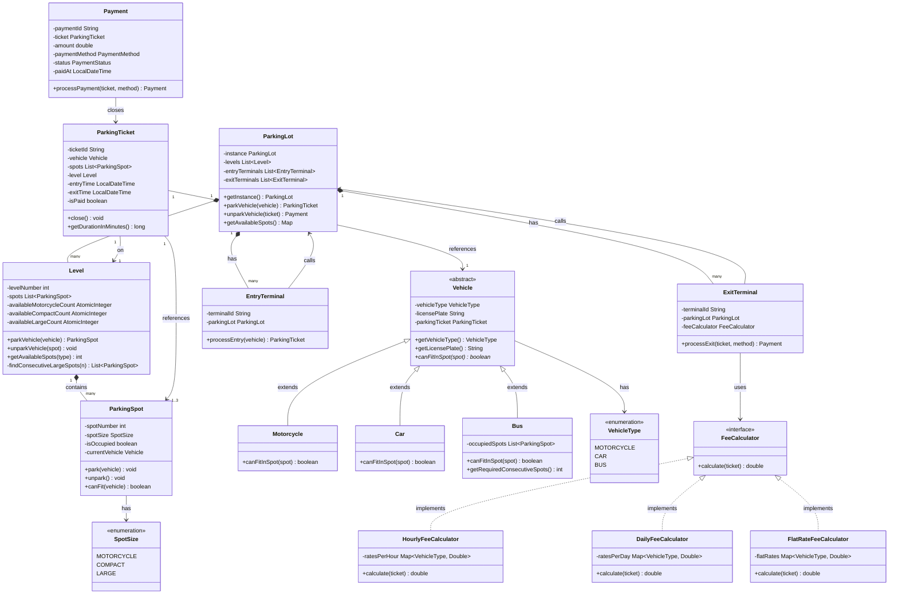
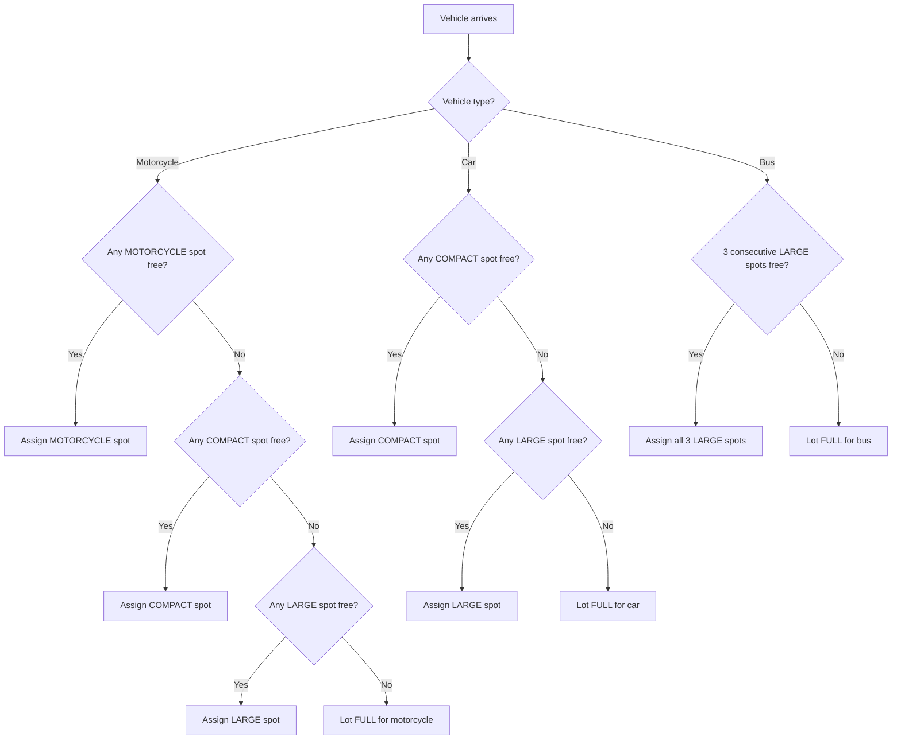
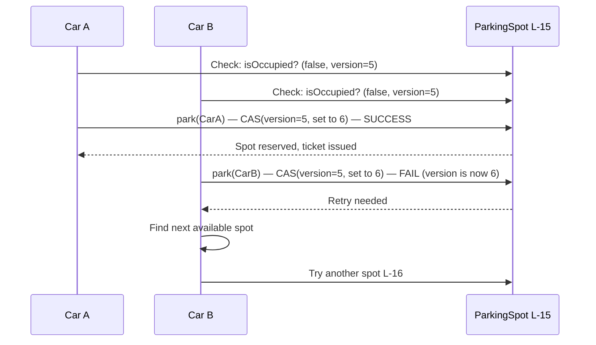
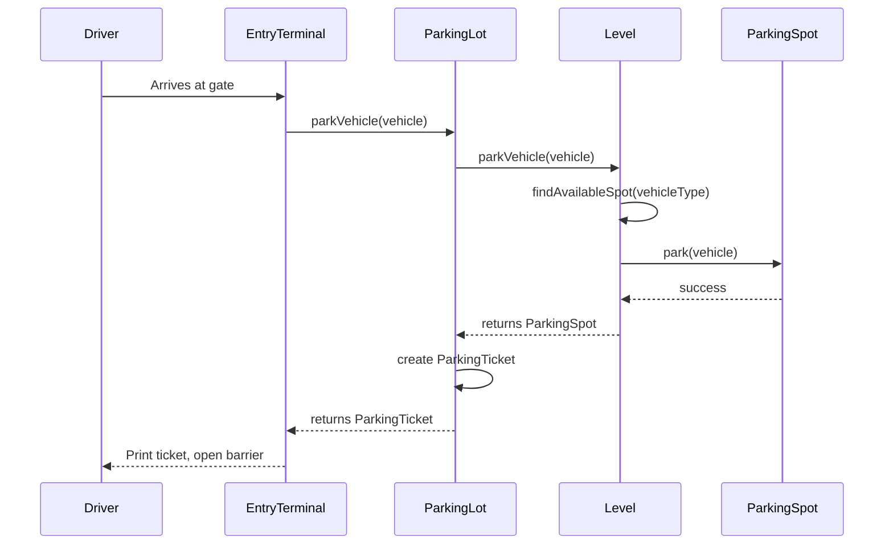
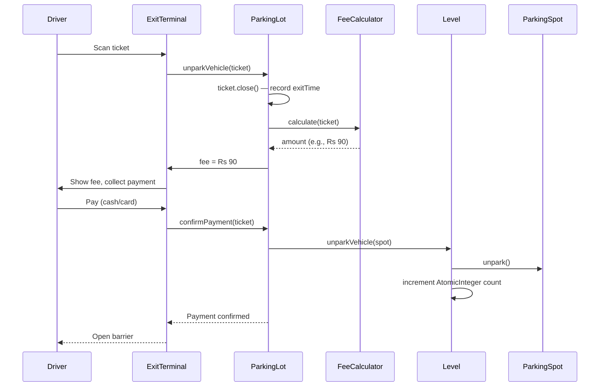
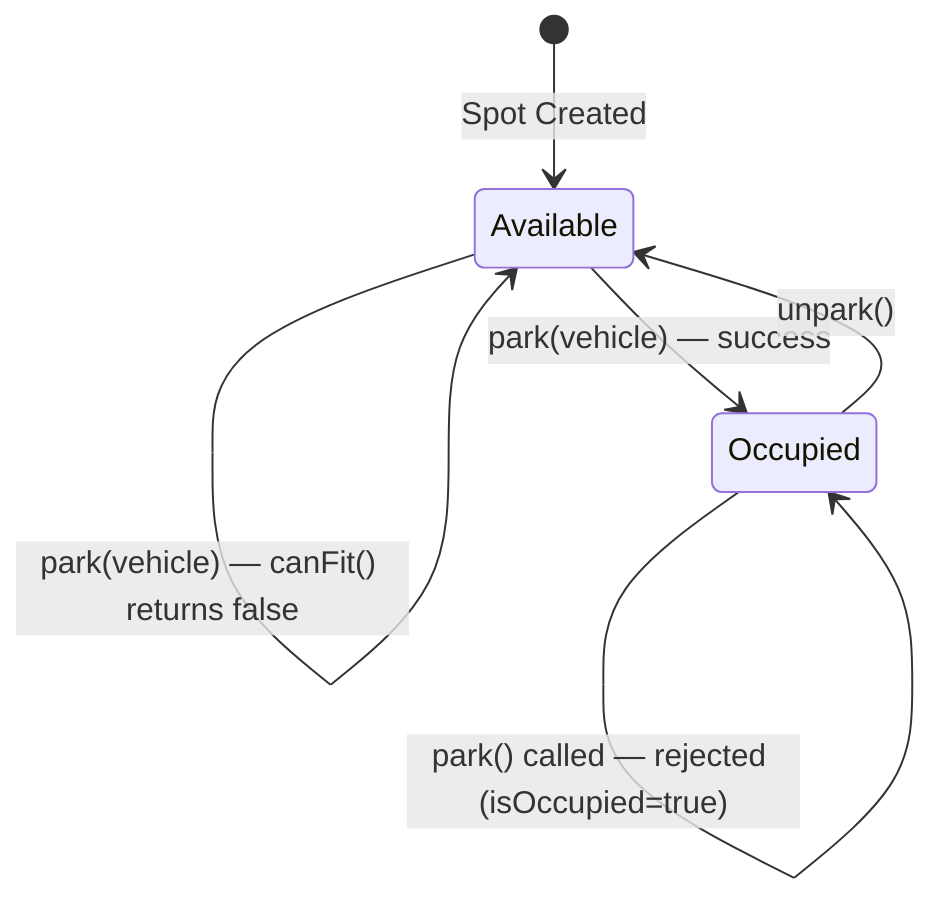
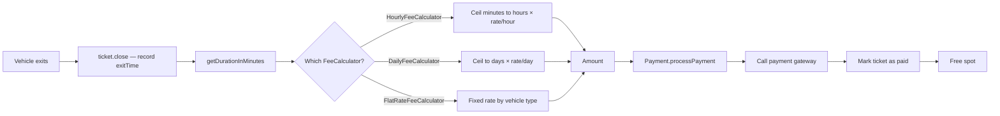
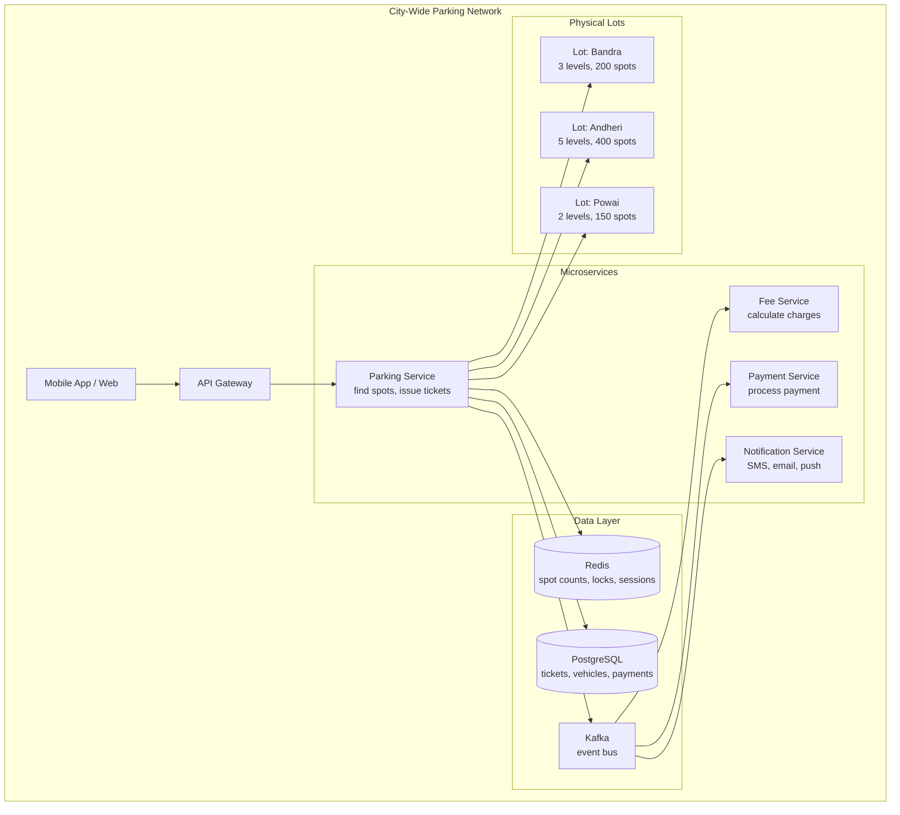

# LLD Case Study: Design a Parking Lot System

> **Difficulty:** Medium-Hard | **Interview Frequency:** Very High (asked in every FAANG/MAANG round) | **Time Budget:** 45-60 min

---

## Why This Problem Is Asked So Often

Yeh kyun important hai? Because a parking lot problem is deceptively simple on the surface but contains every important LLD concept packed together:

- **Inheritance hierarchy** (Vehicle types, Spot types)
- **Design patterns** (Singleton, Strategy, Factory)
- **Concurrency** (two cars arriving at the same spot simultaneously)
- **Extensibility** (what if we add EV spots tomorrow? Monthly passes?)
- **Trade-off thinking** (first fit vs best fit, strict vs flexible sizing)

If you can design a parking lot cleanly in 45 minutes, you have demonstrated you can design most real-world systems. Think of it as the LLD "Hello World" — but the interviewer is watching HOW you say it, not just that you can say it.

---

## The Analogy: Phoenix Mall, Bengaluru

Samjho aise. You drive to Phoenix Mall on a Saturday evening. At the entry gate, a machine prints a ticket showing your entry time. You go to Level 2, find spot B-14, and park your Honda City. When you come back 3 hours later, you go to the payment kiosk, scan your ticket, pay Rs 90 (Rs 30/hour), and the exit barrier opens.

That entire experience — entry ticket, finding a spot, paying on exit, the barrier opening — is what we are building in code.

The hard parts that the mall hides from you:

1. What if two cars arrive at the same time and both "see" the same empty spot?
2. How does the system decide whether your SUV goes to Level 1 or Level 3?
3. How does a bus (which is enormous) fit? It needs 3 spots in a row.
4. How does the mall change pricing on weekends without rewriting software?

These are exactly the problems we solve.

---

## Step 1: Requirements Clarification

Before writing a single class, a good LLD interviewer expects you to ask clarifying questions. Here is what you should ask — and the answers for this problem:

### Functional Requirements

| Question | Answer |
|---|---|
| How many levels? | Multiple levels (say 5), configurable |
| What vehicle types? | Motorcycle, Car, Bus |
| Spot types? | Motorcycle (MOTORCYCLE), Compact (COMPACT), Large (LARGE) |
| Can a motorcycle use a compact spot? | Yes — smaller vehicles can use larger spots |
| Can a bus park in one spot? | No — a bus occupies 3 consecutive LARGE spots |
| How is fee calculated? | Based on duration; strategy is pluggable (hourly, daily, flat) |
| How do vehicles pay? | Payment terminal at exit; cash or card |
| Multiple entry/exit gates? | Yes — multiple EntryTerminals and ExitTerminals |

### Non-Functional Requirements

| Requirement | Detail |
|---|---|
| Concurrency | Multiple vehicles arriving simultaneously must not double-book |
| Availability check | Should be O(1) or near-O(1), not a full scan every time |
| Extensibility | New vehicle types, spot types, fee strategies without rewriting core |
| Scalability | Later: 50 parking lots across a city |

---

## Step 2: Identify the Entities

Every "noun" in the problem is a potential class. Let us map real-world objects to code:

| Real World Object | Class | Core Responsibility |
|---|---|---|
| The entire parking building | `ParkingLot` | Singleton; top-level coordinator |
| One floor of the building | `Level` | Holds spots; finds available spot for a vehicle |
| One parking space | `ParkingSpot` | Knows its size; knows if occupied |
| The vehicle | `Vehicle` (abstract) | Has type and license plate |
| A motorcycle | `Motorcycle` | Needs MOTORCYCLE, COMPACT, or LARGE spot |
| A car | `Car` | Needs COMPACT or LARGE spot |
| A bus | `Bus` | Needs 3 consecutive LARGE spots |
| The entry slip | `ParkingTicket` | Tracks vehicle, spot, entry time |
| Fee calculation logic | `FeeCalculator` (interface) | Strategy pattern — pluggable |
| Hourly pricing | `HourlyFeeCalculator` | Charges per hour |
| Daily pricing | `DailyFeeCalculator` | Charges per day |
| Flat pricing | `FlatRateFeeCalculator` | Fixed price regardless of time |
| Payment record | `Payment` | Records amount, method, status |
| Entry machine | `EntryTerminal` | Issues ticket when vehicle arrives |
| Exit machine | `ExitTerminal` | Calculates fee, processes payment, opens gate |

---

## Step 3: Vehicle Type → Spot Type Mapping

This is the most important design decision. Think of it like baggage lockers at a railway station:

- A small lock (motorcycle spot) fits only a small bag (motorcycle)
- A medium locker (compact spot) fits a small or medium bag (motorcycle or car)
- A large locker (large spot) fits anything — small, medium, or large bags

```
Motorcycle  →  MOTORCYCLE spot  OR  COMPACT spot  OR  LARGE spot
Car         →  COMPACT spot  OR  LARGE spot
Bus         →  3 consecutive LARGE spots (no compromise, needs all three)
```

Why does a bus need 3 consecutive spots and not just 1 large spot? Because a bus is physically 3x the size of a large spot. We model this as a bus "owning" 3 spots during its stay. This is the hardest edge case in this problem — make sure you discuss it explicitly with the interviewer.

---

## Step 4: Complete Class Diagram



---

## Step 5: Design Patterns — Why Each One Is Here

### Pattern 1: Singleton (ParkingLot)

**Analogy:** There is only one "brain" running a mall — one central control room. You cannot have two control rooms with different records of which spots are free. If you did, one room might tell a car "go to B-14" and the other room simultaneously tells a different car "go to B-14" — and they crash into each other.

**Why we use it:** `ParkingLot` holds the master state — all levels, all active tickets. If two instances existed, their states would diverge, causing double-booking.

**The trade-off:** Singletons are hard to test because they carry state across tests. Always provide a `resetInstance()` method for testing. Also, in a distributed system (50 parking lots across Mumbai), you replace the in-memory Singleton with a distributed coordinator (Redis, ZooKeeper) — Singleton is only valid for a single process.

```
Interview tip: The interviewer will ask "is Singleton always the right choice?"
Answer: No. For a SINGLE parking lot, yes. For a CHAIN of parking lots,
each lot is its own instance — use a plain class with a registry/directory.
```

---

### Pattern 2: Strategy (FeeCalculator)

**Analogy:** Ola charges by distance. Rapido charges a flat rate. Uber Moto charges by time. All three are "taxi services" but with different pricing formulas. The passenger app does not care which formula — it just calls `calculateFare()` and gets a number.

**Why we use it:** Fee rules change. Today it is Rs 30/hour. Tomorrow management says "first hour free on weekends, then Rs 50/hour, max Rs 300/day." Without Strategy, you would put an ever-growing `if-else` in `Payment`. With Strategy, you just plug in a new `WeekendFeeCalculator` class.

**The open/closed principle:** The system is open for extension (new calculator) but closed for modification (existing code untouched). This is exactly what SOLID's "O" means.

---

### Pattern 3: Factory (SpotFactory / implicit)

**Analogy:** A Swiggy restaurant gets an order for "Paneer Biryani." The kitchen knows how to make it — the customer does not need to know which chef, which pan, which process.

**Why we use it:** Creating a `ParkingSpot` requires choosing the right subclass or configuration. Centralizing this in a factory means the rest of the code says "give me a COMPACT spot" without caring about construction.

---

## Step 6: Spot Assignment Strategies

This is a key discussion point in interviews. Two main strategies exist:

### Strategy A: First Fit

Iterate all spots. Return the first available spot that fits the vehicle. Simple O(n) scan.

```
Pros:  Simple to implement. Predictable.
Cons:  A motorcycle might end up in a LARGE spot when MOTORCYCLE spots are
       still available further down the list. Wastes premium space.
```

### Strategy B: Best Fit

Find the smallest spot type that still fits the vehicle. A motorcycle prefers a MOTORCYCLE spot. Only if none available, try COMPACT. Only then try LARGE.

```
Pros:  Efficient use of space. Preserves large spots for large vehicles.
Cons:  Slightly more complex. Need to search by type, not just availability.
```



**The best fit strategy — why it matters:** Imagine a parking lot with 10 LARGE spots and 0 COMPACT spots free. A car arrives. First-fit gives it a LARGE spot immediately. But if you had used best-fit, the car would have tried COMPACT first (found none), then taken LARGE — same result here but the logic is consistent. Now imagine two cars and one bus all arrive together. Best-fit ensures the bus gets its 3 LARGE spots; first-fit might give all LARGE spots to cars, leaving the bus with nothing. This is a real business impact.

---

## Step 7: Bus Parking — The Hard Part

Bus needs 3 consecutive LARGE spots. This is the most interesting algorithmic piece in the whole problem.

**Analogy:** Think of train seat booking. A group of 3 friends wants 3 seats in a row. The booking system must find 3 consecutive empty seats in the same row, not just any 3 empty seats scattered across the train.

**Algorithm for finding 3 consecutive LARGE spots:**

```
1. Iterate through all spots in a Level
2. Keep a "consecutive counter" for LARGE spots
3. When we find an available LARGE spot, increment counter
4. When counter reaches 3, we have found our consecutive set
5. If we hit a non-LARGE or occupied spot, reset counter to 0
6. If we exhaust all spots without finding 3 consecutive, bus cannot park on this level
```

**Time complexity:** O(n) where n = number of spots on a level. Called once per level, so worst case O(levels × spots_per_level).

---

## Step 8: Concurrency — The Production-Grade Concern

**Analogy:** Two Zomato delivery agents are both trying to grab the last order on the platform. The system must guarantee only ONE agent gets it — not both, not neither.

Two cars arrive at the same parking lot at the same time. Both check availability. Both see spot L-15 as free. Both are about to park there. This is a classic race condition.

### How to handle it:

**Option 1: Synchronized methods (simplest)**

Put `synchronized` on `park()` in `ParkingSpot`. Only one thread can execute it at a time. Simple but can be a bottleneck.

**Option 2: AtomicInteger for counts (O(1) availability check)**

Each `Level` maintains:
- `AtomicInteger availableMotorcycleCount`
- `AtomicInteger availableCompactCount`
- `AtomicInteger availableLargeCount`

When a vehicle parks: `decrementAndGet()`. When it leaves: `incrementAndGet()`. These are lock-free, thread-safe operations. You can answer "is there a compact spot free?" in O(1) by checking `availableCompactCount.get() > 0` without scanning all spots.

**Option 3: Optimistic locking (best for high throughput)**

1. Vehicle A reads spot L-15 as available (version = 5)
2. Vehicle B also reads spot L-15 as available (version = 5)
3. Vehicle A tries to park: "update spot set version=6, isOccupied=true where version=5" — succeeds
4. Vehicle B tries to park: "update spot set version=7, isOccupied=true where version=5" — FAILS (version is now 6)
5. Vehicle B retries — finds a different spot

This is exactly how databases like PostgreSQL handle concurrent updates.



### Synchronized spot reservation in Java:

```java
// In ParkingSpot.java
public synchronized boolean park(Vehicle vehicle) {
    if (isOccupied) {
        return false; // already taken
    }
    if (!canFit(vehicle)) {
        return false;
    }
    this.currentVehicle = vehicle;
    this.isOccupied = true;
    return true;
}

public synchronized Vehicle unpark() {
    if (!isOccupied) {
        throw new IllegalStateException("Spot " + spotNumber + " is already empty");
    }
    Vehicle v = this.currentVehicle;
    this.currentVehicle = null;
    this.isOccupied = false;
    return v;
}
```

---

## Step 9: Entry and Exit Terminals

**Analogy:** Every airport has multiple check-in counters (entry) and multiple boarding gates (exit). They all serve the same terminal (the ParkingLot) but operate independently. If only one counter existed, the queue would be a nightmare.

### EntryTerminal

When a vehicle arrives:
1. Vehicle drives up to the EntryTerminal
2. Terminal calls `parkingLot.parkVehicle(vehicle)`
3. System finds an available spot, marks it occupied
4. `ParkingTicket` is created with: vehicle, spot(s), level, entryTime
5. Ticket is printed / shown on screen
6. Barrier opens

### ExitTerminal

When a vehicle leaves:
1. Driver scans ticket at ExitTerminal
2. Terminal calls `parkingLot.unparkVehicle(ticket)`
3. `ticket.close()` records exitTime
4. `feeCalculator.calculate(ticket)` computes the fee
5. Driver pays (cash/card via `Payment.processPayment()`)
6. Spot(s) marked as available
7. `AtomicInteger` counts updated
8. Barrier opens





---

## Step 10: Full Class Implementations (Java)

### Enums

```java
public enum VehicleType {
    MOTORCYCLE, CAR, BUS
}

public enum SpotSize {
    MOTORCYCLE, COMPACT, LARGE
}

public enum PaymentMethod {
    CASH, CARD, UPI
}

public enum PaymentStatus {
    PENDING, COMPLETED, FAILED
}
```

---

### Vehicle Hierarchy

```java
// Abstract base — cannot be instantiated directly
public abstract class Vehicle {
    protected final String licensePlate;
    protected final VehicleType vehicleType;
    protected ParkingTicket parkingTicket;

    public Vehicle(String licensePlate, VehicleType vehicleType) {
        this.licensePlate = licensePlate;
        this.vehicleType = vehicleType;
    }

    public VehicleType getVehicleType() { return vehicleType; }
    public String getLicensePlate() { return licensePlate; }
    public ParkingTicket getParkingTicket() { return parkingTicket; }
    public void setParkingTicket(ParkingTicket ticket) { this.parkingTicket = ticket; }

    // Each subclass defines what spot sizes it can fit in
    public abstract boolean canFitInSpot(ParkingSpot spot);
}

// Motorcycle: fits in any spot
public class Motorcycle extends Vehicle {
    public Motorcycle(String licensePlate) {
        super(licensePlate, VehicleType.MOTORCYCLE);
    }

    @Override
    public boolean canFitInSpot(ParkingSpot spot) {
        // Motorcycle fits in MOTORCYCLE, COMPACT, or LARGE
        return true;
    }
}

// Car: fits in COMPACT or LARGE
public class Car extends Vehicle {
    public Car(String licensePlate) {
        super(licensePlate, VehicleType.CAR);
    }

    @Override
    public boolean canFitInSpot(ParkingSpot spot) {
        return spot.getSpotSize() == SpotSize.COMPACT
            || spot.getSpotSize() == SpotSize.LARGE;
    }
}

// Bus: needs 3 consecutive LARGE spots
public class Bus extends Vehicle {
    public static final int REQUIRED_SPOTS = 3;

    public Bus(String licensePlate) {
        super(licensePlate, VehicleType.BUS);
    }

    @Override
    public boolean canFitInSpot(ParkingSpot spot) {
        // Bus only fits in LARGE spots (and needs 3 of them — checked at Level)
        return spot.getSpotSize() == SpotSize.LARGE;
    }

    public int getRequiredConsecutiveSpots() {
        return REQUIRED_SPOTS;
    }
}
```

---

### ParkingSpot

```java
public class ParkingSpot {
    private final int spotNumber;
    private final SpotSize spotSize;
    private volatile boolean isOccupied;
    private Vehicle currentVehicle;

    public ParkingSpot(int spotNumber, SpotSize spotSize) {
        this.spotNumber = spotNumber;
        this.spotSize = spotSize;
        this.isOccupied = false;
        this.currentVehicle = null;
    }

    public int getSpotNumber() { return spotNumber; }
    public SpotSize getSpotSize() { return spotSize; }
    public boolean isOccupied() { return isOccupied; }
    public Vehicle getCurrentVehicle() { return currentVehicle; }

    // Synchronized so two threads cannot both park here simultaneously
    public synchronized boolean park(Vehicle vehicle) {
        if (isOccupied) return false;
        if (!vehicle.canFitInSpot(this)) return false;
        this.currentVehicle = vehicle;
        this.isOccupied = true;
        return true;
    }

    public synchronized Vehicle unpark() {
        if (!isOccupied) {
            throw new IllegalStateException(
                "Spot " + spotNumber + " is already empty"
            );
        }
        Vehicle v = this.currentVehicle;
        this.currentVehicle = null;
        this.isOccupied = false;
        return v;
    }
}
```

---

### ParkingTicket

```java
import java.time.LocalDateTime;
import java.time.temporal.ChronoUnit;
import java.util.List;
import java.util.UUID;

public class ParkingTicket {
    private final String ticketId;
    private final Vehicle vehicle;
    private final List<ParkingSpot> spots; // Bus occupies 3 spots
    private final Level level;
    private final LocalDateTime entryTime;
    private LocalDateTime exitTime;
    private boolean isPaid;

    public ParkingTicket(Vehicle vehicle, List<ParkingSpot> spots, Level level) {
        this.ticketId = "TKT-" + UUID.randomUUID().toString().substring(0, 8).toUpperCase();
        this.vehicle = vehicle;
        this.spots = spots;
        this.level = level;
        this.entryTime = LocalDateTime.now();
        this.isPaid = false;
    }

    public void close() {
        this.exitTime = LocalDateTime.now();
    }

    public long getDurationInMinutes() {
        LocalDateTime end = exitTime != null ? exitTime : LocalDateTime.now();
        return ChronoUnit.MINUTES.between(entryTime, end);
    }

    public long getDurationInHours() {
        // Ceiling division: partial hour counts as full hour
        long minutes = getDurationInMinutes();
        return (minutes + 59) / 60;
    }

    // Getters
    public String getTicketId() { return ticketId; }
    public Vehicle getVehicle() { return vehicle; }
    public List<ParkingSpot> getSpots() { return spots; }
    public Level getLevel() { return level; }
    public LocalDateTime getEntryTime() { return entryTime; }
    public LocalDateTime getExitTime() { return exitTime; }
    public boolean isPaid() { return isPaid; }
    public void markPaid() { this.isPaid = true; }
}
```

---

### Level (formerly ParkingFloor)

This is where the interesting logic lives — finding a spot, handling the bus case, maintaining AtomicInteger counts.

```java
import java.util.ArrayList;
import java.util.List;
import java.util.concurrent.atomic.AtomicInteger;

public class Level {
    private final int levelNumber;
    private final List<ParkingSpot> spots;

    // AtomicInteger for O(1) availability check, thread-safe
    private final AtomicInteger availableMotorcycleCount;
    private final AtomicInteger availableCompactCount;
    private final AtomicInteger availableLargeCount;

    public Level(int levelNumber, int motorcycleSpots, int compactSpots, int largeSpots) {
        this.levelNumber = levelNumber;
        this.spots = new ArrayList<>();

        int spotNum = 1;
        for (int i = 0; i < motorcycleSpots; i++) {
            spots.add(new ParkingSpot(spotNum++, SpotSize.MOTORCYCLE));
        }
        for (int i = 0; i < compactSpots; i++) {
            spots.add(new ParkingSpot(spotNum++, SpotSize.COMPACT));
        }
        for (int i = 0; i < largeSpots; i++) {
            spots.add(new ParkingSpot(spotNum++, SpotSize.LARGE));
        }

        this.availableMotorcycleCount = new AtomicInteger(motorcycleSpots);
        this.availableCompactCount = new AtomicInteger(compactSpots);
        this.availableLargeCount = new AtomicInteger(largeSpots);
    }

    // O(1) check — no scanning needed
    public int getAvailableSpots(VehicleType vehicleType) {
        switch (vehicleType) {
            case MOTORCYCLE: return availableMotorcycleCount.get()
                                    + availableCompactCount.get()
                                    + availableLargeCount.get();
            case CAR:        return availableCompactCount.get() + availableLargeCount.get();
            case BUS:        return availableLargeCount.get() >= 3 ? availableLargeCount.get() : 0;
            default: return 0;
        }
    }

    // Returns the list of spots assigned (1 for motorcycle/car, 3 for bus)
    // Returns null if no spot found
    public synchronized List<ParkingSpot> parkVehicle(Vehicle vehicle) {
        if (vehicle instanceof Bus) {
            return parkBus((Bus) vehicle);
        }
        return parkNonBus(vehicle);
    }

    private List<ParkingSpot> parkNonBus(Vehicle vehicle) {
        // Best-fit strategy: try smallest fitting spot first
        List<SpotSize> preference = getSpotPreference(vehicle.getVehicleType());

        for (SpotSize preferredSize : preference) {
            for (ParkingSpot spot : spots) {
                if (!spot.isOccupied() && spot.getSpotSize() == preferredSize) {
                    if (spot.park(vehicle)) {
                        decrementCount(preferredSize);
                        return List.of(spot);
                    }
                }
            }
        }
        return null; // no spot found
    }

    private List<ParkingSpot> parkBus(Bus bus) {
        List<ParkingSpot> consecutive = findConsecutiveLargeSpots(Bus.REQUIRED_SPOTS);
        if (consecutive == null) return null;

        for (ParkingSpot spot : consecutive) {
            spot.park(bus);
            availableLargeCount.decrementAndGet();
        }
        return consecutive;
    }

    // Find N consecutive LARGE spots — O(n) scan
    private List<ParkingSpot> findConsecutiveLargeSpots(int n) {
        List<ParkingSpot> largeSpots = new ArrayList<>();

        for (ParkingSpot spot : spots) {
            if (spot.getSpotSize() == SpotSize.LARGE && !spot.isOccupied()) {
                largeSpots.add(spot);
                if (largeSpots.size() == n) {
                    // Verify they are truly consecutive by spot number
                    boolean consecutive = true;
                    for (int i = 1; i < largeSpots.size(); i++) {
                        if (largeSpots.get(i).getSpotNumber()
                                != largeSpots.get(i-1).getSpotNumber() + 1) {
                            consecutive = false;
                            break;
                        }
                    }
                    if (consecutive) return largeSpots;
                    // Slide the window
                    largeSpots.remove(0);
                }
            } else {
                largeSpots.clear(); // Reset on non-LARGE or occupied spot
            }
        }
        return null;
    }

    public synchronized void unparkVehicle(List<ParkingSpot> spots) {
        for (ParkingSpot spot : spots) {
            spot.unpark();
            incrementCount(spot.getSpotSize());
        }
    }

    private List<SpotSize> getSpotPreference(VehicleType vehicleType) {
        // Best-fit: smallest first
        switch (vehicleType) {
            case MOTORCYCLE: return List.of(SpotSize.MOTORCYCLE, SpotSize.COMPACT, SpotSize.LARGE);
            case CAR:        return List.of(SpotSize.COMPACT, SpotSize.LARGE);
            default:         return List.of();
        }
    }

    private void decrementCount(SpotSize size) {
        switch (size) {
            case MOTORCYCLE: availableMotorcycleCount.decrementAndGet(); break;
            case COMPACT:    availableCompactCount.decrementAndGet();    break;
            case LARGE:      availableLargeCount.decrementAndGet();      break;
        }
    }

    private void incrementCount(SpotSize size) {
        switch (size) {
            case MOTORCYCLE: availableMotorcycleCount.incrementAndGet(); break;
            case COMPACT:    availableCompactCount.incrementAndGet();    break;
            case LARGE:      availableLargeCount.incrementAndGet();      break;
        }
    }

    public int getLevelNumber() { return levelNumber; }
    public List<ParkingSpot> getSpots() { return spots; }
}
```

---

### FeeCalculator — Strategy Pattern

```java
// The strategy interface — all fee calculators must implement this
public interface FeeCalculator {
    double calculate(ParkingTicket ticket);
}

// Charges by hour (partial hour = full hour)
public class HourlyFeeCalculator implements FeeCalculator {
    private final Map<VehicleType, Double> ratesPerHour = Map.of(
        VehicleType.MOTORCYCLE, 15.0,  // Rs 15/hour
        VehicleType.CAR,        30.0,  // Rs 30/hour
        VehicleType.BUS,        80.0   // Rs 80/hour
    );

    @Override
    public double calculate(ParkingTicket ticket) {
        long hours = Math.max(ticket.getDurationInHours(), 1); // minimum 1 hour
        double rate = ratesPerHour.getOrDefault(
            ticket.getVehicle().getVehicleType(), 30.0
        );
        return hours * rate;
    }
}

// Charges a flat day rate — useful for airports, long-stay lots
public class DailyFeeCalculator implements FeeCalculator {
    private final Map<VehicleType, Double> ratesPerDay = Map.of(
        VehicleType.MOTORCYCLE, 80.0,
        VehicleType.CAR,        200.0,
        VehicleType.BUS,        500.0
    );

    @Override
    public double calculate(ParkingTicket ticket) {
        long minutes = ticket.getDurationInMinutes();
        long days = Math.max((minutes + 1439) / 1440, 1); // ceiling division to days
        double rate = ratesPerDay.getOrDefault(
            ticket.getVehicle().getVehicleType(), 200.0
        );
        return days * rate;
    }
}

// Flat rate regardless of duration — shopping malls often use this
public class FlatRateFeeCalculator implements FeeCalculator {
    private final Map<VehicleType, Double> flatRates = Map.of(
        VehicleType.MOTORCYCLE, 20.0,
        VehicleType.CAR,        50.0,
        VehicleType.BUS,        150.0
    );

    @Override
    public double calculate(ParkingTicket ticket) {
        return flatRates.getOrDefault(ticket.getVehicle().getVehicleType(), 50.0);
    }
}
```

---

### Payment

```java
import java.time.LocalDateTime;
import java.util.UUID;

public class Payment {
    private final String paymentId;
    private final ParkingTicket ticket;
    private final double amount;
    private final PaymentMethod paymentMethod;
    private PaymentStatus status;
    private final LocalDateTime paidAt;

    private Payment(ParkingTicket ticket, double amount, PaymentMethod method) {
        this.paymentId = "PAY-" + UUID.randomUUID().toString().substring(0, 8).toUpperCase();
        this.ticket = ticket;
        this.amount = amount;
        this.paymentMethod = method;
        this.status = PaymentStatus.PENDING;
        this.paidAt = LocalDateTime.now();
    }

    // Factory method — process and return a completed payment
    public static Payment processPayment(
        ParkingTicket ticket,
        double amount,
        PaymentMethod method
    ) {
        Payment payment = new Payment(ticket, amount, method);

        // In production: call payment gateway API here
        // If gateway succeeds:
        payment.status = PaymentStatus.COMPLETED;
        ticket.markPaid();

        System.out.printf(
            "Payment %s: %.2f via %s for ticket %s%n",
            payment.paymentId, amount, method, ticket.getTicketId()
        );

        return payment;
    }

    public String getPaymentId() { return paymentId; }
    public double getAmount() { return amount; }
    public PaymentMethod getPaymentMethod() { return paymentMethod; }
    public PaymentStatus getStatus() { return status; }
}
```

---

### ParkingLot — Singleton

```java
import java.util.List;
import java.util.Map;
import java.util.concurrent.ConcurrentHashMap;

public class ParkingLot {
    // Volatile ensures visibility across threads
    private static volatile ParkingLot instance;

    private final List<Level> levels;
    // ConcurrentHashMap for thread-safe ticket tracking
    private final Map<String, ParkingTicket> activeTickets = new ConcurrentHashMap<>();

    // Private constructor — nobody outside can call new ParkingLot()
    private ParkingLot(List<Level> levels) {
        this.levels = levels;
    }

    // Double-checked locking for thread-safe singleton
    public static ParkingLot getInstance(List<Level> levels) {
        if (instance == null) {
            synchronized (ParkingLot.class) {
                if (instance == null) {
                    instance = new ParkingLot(levels);
                }
            }
        }
        return instance;
    }

    // For testing only — reset singleton between tests
    static void resetInstance() {
        instance = null;
    }

    // Entry: find a spot, park the vehicle, issue a ticket
    public ParkingTicket parkVehicle(Vehicle vehicle) {
        for (Level level : levels) {
            // Quick O(1) check before doing expensive search
            if (level.getAvailableSpots(vehicle.getVehicleType()) == 0) {
                continue;
            }

            List<ParkingSpot> assignedSpots = level.parkVehicle(vehicle);
            if (assignedSpots != null) {
                ParkingTicket ticket = new ParkingTicket(vehicle, assignedSpots, level);
                vehicle.setParkingTicket(ticket);
                activeTickets.put(ticket.getTicketId(), ticket);

                System.out.printf(
                    "[ENTRY] %s %s → Level %d, Spot(s) %s | Ticket: %s%n",
                    vehicle.getVehicleType(),
                    vehicle.getLicensePlate(),
                    level.getLevelNumber(),
                    assignedSpots.stream()
                        .map(s -> String.valueOf(s.getSpotNumber()))
                        .reduce("", (a, b) -> a.isEmpty() ? b : a + "," + b),
                    ticket.getTicketId()
                );

                return ticket;
            }
        }

        System.out.printf(
            "[ENTRY DENIED] No available spot for %s %s%n",
            vehicle.getVehicleType(), vehicle.getLicensePlate()
        );
        return null;
    }

    // Exit: close ticket, calculate fee, process payment, free spot
    public Payment unparkVehicle(String ticketId, FeeCalculator feeCalculator, PaymentMethod method) {
        ParkingTicket ticket = activeTickets.get(ticketId);
        if (ticket == null) {
            throw new IllegalArgumentException("Ticket not found: " + ticketId);
        }
        if (ticket.isPaid()) {
            throw new IllegalStateException("Ticket already paid: " + ticketId);
        }

        ticket.close(); // record exit time
        double fee = feeCalculator.calculate(ticket);

        Payment payment = Payment.processPayment(ticket, fee, method);

        // Free all spots (1 for car/motorcycle, 3 for bus)
        ticket.getLevel().unparkVehicle(ticket.getSpots());
        activeTickets.remove(ticketId);

        System.out.printf(
            "[EXIT] %s %s | Duration: %d min | Fee: Rs %.2f%n",
            ticket.getVehicle().getVehicleType(),
            ticket.getVehicle().getLicensePlate(),
            ticket.getDurationInMinutes(),
            fee
        );

        return payment;
    }

    // Summary of available spots across all levels
    public Map<Integer, Map<VehicleType, Integer>> getAvailableSpots() {
        Map<Integer, Map<VehicleType, Integer>> summary = new java.util.LinkedHashMap<>();
        for (Level level : levels) {
            Map<VehicleType, Integer> counts = Map.of(
                VehicleType.MOTORCYCLE, level.getAvailableSpots(VehicleType.MOTORCYCLE),
                VehicleType.CAR,        level.getAvailableSpots(VehicleType.CAR),
                VehicleType.BUS,        level.getAvailableSpots(VehicleType.BUS)
            );
            summary.put(level.getLevelNumber(), counts);
        }
        return summary;
    }

    public int getActiveTicketCount() {
        return activeTickets.size();
    }
}
```

---

### EntryTerminal and ExitTerminal

```java
// Entry terminal — one per physical entry gate
public class EntryTerminal {
    private final String terminalId;
    private final ParkingLot parkingLot;

    public EntryTerminal(String terminalId, ParkingLot parkingLot) {
        this.terminalId = terminalId;
        this.parkingLot = parkingLot;
    }

    public ParkingTicket processEntry(Vehicle vehicle) {
        System.out.println("[" + terminalId + "] Processing entry for " + vehicle.getLicensePlate());
        ParkingTicket ticket = parkingLot.parkVehicle(vehicle);
        if (ticket != null) {
            System.out.println("[" + terminalId + "] Barrier opening. Ticket: " + ticket.getTicketId());
        } else {
            System.out.println("[" + terminalId + "] Lot full. Please wait.");
        }
        return ticket;
    }
}

// Exit terminal — one per physical exit gate
public class ExitTerminal {
    private final String terminalId;
    private final ParkingLot parkingLot;
    private final FeeCalculator feeCalculator;

    public ExitTerminal(String terminalId, ParkingLot parkingLot, FeeCalculator feeCalculator) {
        this.terminalId = terminalId;
        this.parkingLot = parkingLot;
        this.feeCalculator = feeCalculator;
    }

    public Payment processExit(String ticketId, PaymentMethod paymentMethod) {
        System.out.println("[" + terminalId + "] Processing exit for ticket: " + ticketId);
        Payment payment = parkingLot.unparkVehicle(ticketId, feeCalculator, paymentMethod);
        System.out.println("[" + terminalId + "] Payment complete. Barrier opening.");
        return payment;
    }
}
```

---

### Complete Usage — Putting It All Together

```java
public class ParkingLotDemo {
    public static void main(String[] args) {
        // Build 3 levels
        // Level 1: 10 motorcycle, 20 compact, 10 large spots
        // Level 2:  5 motorcycle, 15 compact, 10 large spots
        // Level 3:  0 motorcycle,  5 compact, 20 large spots (bus-friendly)
        List<Level> levels = List.of(
            new Level(1, 10, 20, 10),
            new Level(2,  5, 15, 10),
            new Level(3,  0,  5, 20)
        );

        ParkingLot lot = ParkingLot.getInstance(levels);
        FeeCalculator hourlyCalc = new HourlyFeeCalculator();

        EntryTerminal gate1 = new EntryTerminal("GATE-1", lot);
        EntryTerminal gate2 = new EntryTerminal("GATE-2", lot);
        ExitTerminal exit1 = new ExitTerminal("EXIT-1", lot, hourlyCalc);

        // Vehicles arrive
        Vehicle moto1 = new Motorcycle("KA-01-AA-1111");
        Vehicle car1  = new Car("KA-01-BB-2222");
        Vehicle car2  = new Car("MH-12-CC-3333");
        Vehicle bus1  = new Bus("TN-09-DD-4444");

        ParkingTicket t1 = gate1.processEntry(moto1);
        ParkingTicket t2 = gate1.processEntry(car1);
        ParkingTicket t3 = gate2.processEntry(car2);
        ParkingTicket t4 = gate2.processEntry(bus1); // occupies 3 consecutive LARGE spots

        System.out.println("\nActive tickets: " + lot.getActiveTicketCount()); // 4

        // Simulate time passing in a real test — here payment is instant (1-hour minimum)
        if (t2 != null) {
            Payment p = exit1.processExit(t2.getTicketId(), PaymentMethod.CARD);
            System.out.println("Paid: Rs " + p.getAmount()); // Rs 30.0
        }

        if (t4 != null) {
            Payment p = exit1.processExit(t4.getTicketId(), PaymentMethod.CASH);
            System.out.println("Bus paid: Rs " + p.getAmount()); // Rs 80.0
        }

        System.out.println("Active tickets remaining: " + lot.getActiveTicketCount()); // 2
    }
}
```

---

## Step 11: State Machine for ParkingSpot

**Analogy:** A hospital bed has three states: Empty → Occupied → Being Cleaned → Empty. Each transition has a trigger and a rule. ParkingSpot is exactly the same.



---

## Step 12: Fee Calculation Flow



---

## Step 13: Scaling to 50 Parking Lots Across the City

Yeh important hai — interviewers almost always ask this as a follow-up. "Great, now how would you handle 50 parking lots across Mumbai?"

### What changes at scale:

| Component | Single Lot (current) | 50 Lots (scaled) |
|---|---|---|
| State storage | In-memory HashMap | Distributed database (PostgreSQL / Redis) |
| Singleton | Works for 1 JVM process | Use a Service Registry / API Gateway |
| Spot locking | `synchronized` methods | Distributed locks (Redis SETNX, ZooKeeper) |
| Availability check | AtomicInteger in memory | Redis counters per lot per level per type |
| Ticket lookup | ConcurrentHashMap | Database with index on ticketId |
| Fee calculation | In-process | Stateless microservice — scales horizontally |
| Payment | Synchronous call | Async via message queue (Kafka) with retry |

### System Architecture for 50 Lots:



### Key distributed design decisions:

1. **Spot reservation with Redis SETNX:**
   When a vehicle claims a spot, do `SET spot:L1-Level2-Spot14 vehicleId NX EX 300` (NX = only if not exists, EX 300 = auto-expire in 5 minutes if payment not completed). This is atomic — only one Redis client wins.

2. **Eventual consistency for availability display:**
   The mobile app showing "35 spots free in Bandra" can tolerate slight delays. Use Redis counters for display but PostgreSQL as the source of truth for actual bookings.

3. **Kafka for payment processing:**
   When a vehicle exits, publish a `VehicleExitedEvent` to Kafka. The Fee Service consumes it, calculates the fee, publishes a `FeeCalculatedEvent`. The Payment Service consumes that, charges the card, publishes a `PaymentCompletedEvent`. The Parking Service consumes that, releases the spot. This decouples the exit flow — even if the payment service is slow, the vehicle can pass through and pay asynchronously (pre-authorized card hold).

---

## Trade-off Analysis

### Spot Assignment: First Fit vs Best Fit

| Criterion | First Fit | Best Fit |
|---|---|---|
| Implementation complexity | Very simple — single loop | Slightly more complex — prefer by size |
| Space efficiency | Can waste large spots on motorcycles | Motorcycles fill motorcycle spots first |
| Throughput | Faster (stops at first match) | Slightly slower (may scan more) |
| Bus availability | A bus might find no 3-consecutive spots even if total LARGE count ≥ 3 | Same problem |
| Our choice | Used in simplest implementation | Preferred in production |

### Concurrency: Synchronized vs Optimistic Locking

| Criterion | Synchronized Methods | Optimistic Locking |
|---|---|---|
| Correctness | Guaranteed | Guaranteed |
| Throughput | Lower (blocking) | Higher (non-blocking, retry on conflict) |
| Complexity | Simple | More complex — need version field and retry logic |
| Best for | Low concurrency lots | High concurrency lots (500+ spots, 20+ simultaneous arrivals) |

### Fee Strategy: Hourly vs Daily vs Flat

| Strategy | Best for | Problem |
|---|---|---|
| Hourly | Short-stay commercial lots | Penalizes long stays |
| Daily | Airports, railway stations | May be unfair for 1-hour stay |
| Flat rate | Shopping malls with time limits | No incentive to leave earlier |
| Tiered | Most flexible — first 2 hrs cheap | Most complex to calculate |

---

## Common Design Pitfalls

1. **Making `ParkingLot` a pure static class instead of Singleton**
   Static classes cannot implement interfaces, cannot be mocked in tests, and cannot be passed as dependencies. Singleton gives you all the global-access benefits while remaining a proper object.

2. **Putting fee logic inside `ParkingTicket`**
   A ticket is a data record — it knows what happened (vehicle, spot, times) but not what it costs. Costs are a business rule that changes. Separation of concerns: ticket = data, FeeCalculator = business rule.

3. **Not handling the bus case**
   Many candidates design the system for cars and motorcycles only. The bus case — needing 3 consecutive spots — is explicitly mentioned to test whether you handle edge cases. Always address it.

4. **Not accounting for concurrency**
   "I'll add `synchronized` later" is a red flag. Mention it upfront: "The `park()` method must be synchronized because multiple threads handle simultaneous arrivals."

5. **Forgetting to update availability counters on unpark**
   When a vehicle leaves, you must: (a) mark spot as available, (b) increment the AtomicInteger counter, (c) remove ticket from activeTickets. Missing any one of these causes stale state.

6. **Using a `boolean` for spot availability with no synchronization**
   `volatile boolean isOccupied` is not enough. You need the read-check-write to be atomic, which requires `synchronized`. Just `volatile` prevents stale caching but not the race condition.

---

## Common Interview Questions and Answers

**Q1: Why Singleton for ParkingLot? What is the alternative?**

Singleton ensures one shared state — critical for consistency. The alternative is a factory/registry where each lot is a named instance: `ParkingLotRegistry.get("Bandra-Lot-1")`. Use this when managing multiple physical lots.

---

**Q2: How does a Bus park? Walk me through the algorithm.**

A bus needs 3 consecutive LARGE spots. We iterate through the spots on a Level. We maintain a sliding window of consecutive available LARGE spots. When we find 3 in a row (consecutive spot numbers), we lock all 3 together and associate them with a single ticket. The ticket's `spots` list has 3 entries instead of 1.

---

**Q3: What happens if two cars simultaneously try to park in the same spot?**

The `park()` method is `synchronized`. Only one thread executes it at a time. The first thread to acquire the lock parks the car; the second thread sees `isOccupied == true` and returns `false`. The second car then searches for the next available spot. This is guaranteed correct by Java's memory model.

---

**Q4: How do you check spot availability without scanning all spots?**

Each `Level` maintains `AtomicInteger` counters per spot type. Checking if a compact spot is available is `availableCompactCount.get() > 0` — O(1). Only when we need the actual spot do we scan. This separates "can we park here?" (O(1)) from "which exact spot?" (O(n)).

---

**Q5: How would you add EV charging spots?**

Add a `boolean hasCharger` field to `ParkingSpot`. Create an `EVCar extends Car` with `requiresCharger = true`. Override `canFitInSpot()` in `EVCar` to also check `spot.hasCharger()`. No other classes change. This is the Open/Closed principle.

---

**Q6: How would you add a reservation system?**

Add a `Reservation` class with `vehicleId`, `spotId`, `reservedFrom`, `reservedUntil`. `ParkingSpot` gets a `reservedBy` field. `Level.findAvailableSpot()` checks `!spot.isOccupied() && !spot.isReserved(now)`. A background job expires reservations that are not claimed within 15 minutes.

---

**Q7: How do you add tiered pricing — first 2 hours at one rate, then a higher rate?**

Create `TieredFeeCalculator implements FeeCalculator`:
```java
public double calculate(ParkingTicket ticket) {
    long hours = ticket.getDurationInHours();
    double base = Math.min(hours, 2) * 30;           // first 2 hours at Rs 30
    double extra = Math.max(hours - 2, 0) * 50;     // beyond 2 hours at Rs 50
    return base + extra;
}
```
Plug it into `ExitTerminal` — zero changes to `ParkingLot`, `Level`, or `ParkingSpot`.

---

**Q8: Scale this to 50 parking lots across Mumbai. What changes?**

Replace in-memory state with Redis + PostgreSQL. Replace `synchronized` with distributed locks (Redis SETNX). Replace `ParkingLot` singleton with a service layer. Use Kafka for async payment processing. The class design stays the same — only the infrastructure changes. This is the power of a clean domain model.

---

**Q9: What is the time complexity of finding a spot?**

- Checking if a spot type is available on a given level: **O(1)** (AtomicInteger)
- Finding the actual spot: **O(spots_per_level)** — linear scan
- Across all levels: **O(levels × spots_per_level)**
- For a bus: same, but with the consecutive-window algorithm still O(n)

Optimization: maintain a sorted set or queue of available spots per type, enabling O(log n) or O(1) spot assignment.

---

**Q10: What design pattern is FeeCalculator? Why not just use if-else?**

Strategy pattern. The `if-else` approach violates Open/Closed — every time you add a new pricing scheme, you modify the existing code, risking regressions. Strategy lets you add `WeekendFeeCalculator`, `MembershipFeeCalculator` as new classes without touching `ExitTerminal` or `ParkingLot`.

---

## Key Takeaways

| Concept | What You Learned |
|---|---|
| Entity identification | Turn every real-world noun into a class before writing code |
| Inheritance | Vehicle and ParkingSpot hierarchies — shared behavior in parent, differences in subclass |
| Abstract methods | `canFitInSpot()` forces each vehicle type to define its own compatibility |
| Singleton | One `ParkingLot` — but know when NOT to use it (multiple lots = registry) |
| Strategy | `FeeCalculator` is swappable — add new pricing without touching core |
| Concurrency | `synchronized park()`, `AtomicInteger` counts, volatile flags — not an afterthought |
| Bus edge case | 3 consecutive LARGE spots — the sliding window algorithm is the key |
| AtomicInteger | O(1) availability check — never scan all spots just to check if space exists |
| Best fit | Motorcycles should prefer motorcycle spots — preserve large spots for buses |
| Entry/Exit terminals | Separate class per physical gate — not just methods on ParkingLot |
| Scaling | Clean domain model + infrastructure swap = 1 lot or 50 lots, same code |

---

## Interview Checklist

Before you say "I'm done", verify:

- [ ] Asked clarifying questions: vehicle types, spot types, bus consecutive spots
- [ ] Drew class diagram with all major classes and relationships
- [ ] Explained Vehicle hierarchy with `canFitInSpot()` abstract method
- [ ] Explained spot sizing: MOTORCYCLE, COMPACT, LARGE
- [ ] Addressed bus needing 3 consecutive LARGE spots with algorithm
- [ ] Used Singleton for ParkingLot with double-checked locking
- [ ] Used Strategy for FeeCalculator with 3 implementations
- [ ] Discussed concurrency: synchronized park(), AtomicInteger counts
- [ ] Explained ParkingTicket: 1 spot for car, 3 spots for bus
- [ ] Described EntryTerminal and ExitTerminal flow
- [ ] Mentioned at least one extension: EV, reservations, tiered pricing
- [ ] Addressed scaling follow-up: Redis, distributed locks, Kafka

---

*Part of the LLD Interview Notes series. Next: LLD Case Study — Library Management System.*
